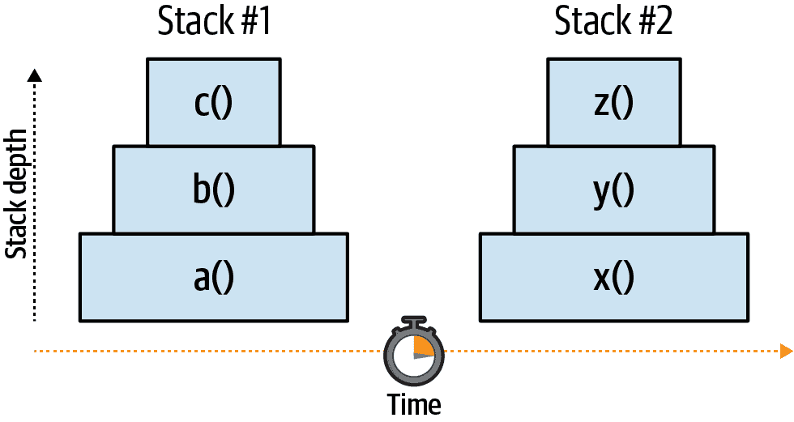
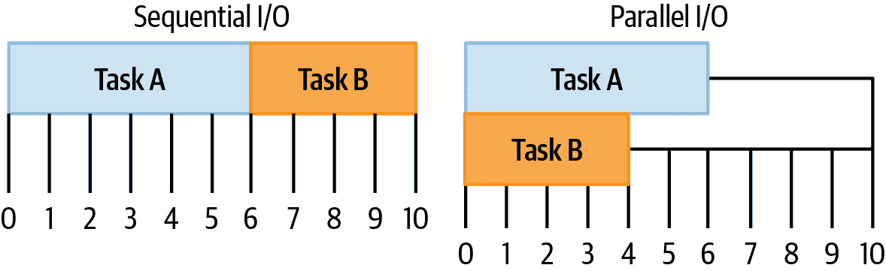
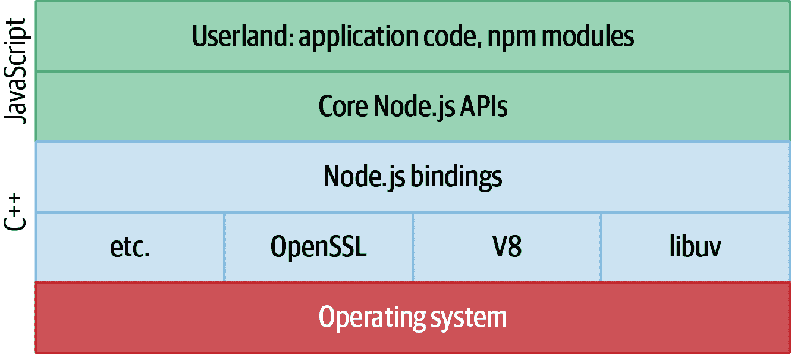
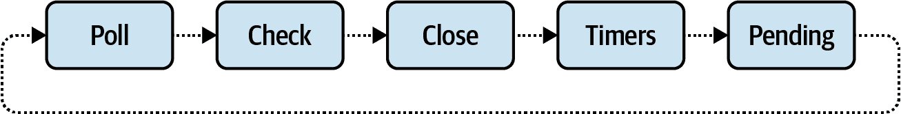

# 第一章：为什么选择分布式？

Node.js 是一个用于在服务器上运行 JavaScript 代码的自包含运行时。它提供了一个 JavaScript 语言引擎和许多 API，其中许多允许应用程序代码与底层操作系统及其外部世界进行交互。但你可能已经知道这些了。

本章高层次地审视了 Node.js，特别是它与本书的关系。它探讨了 JavaScript 的单线程特性，同时也是其最大优势和最大弱点之一，也是运行 Node.js 在分布式方式下如此重要的原因之一。

它还包含一小组示例应用程序，作为基线，只在书中多次升级。这些应用程序的第一次迭代可能比你之前发布到生产环境的任何东西都要简单。

如果你发现你已经了解这些最初的几节中的信息，那么可以直接跳转到“示例应用程序”。

JavaScript 语言正在从单线程语言过渡到多线程语言。例如，[`Atomics`](https://developer.mozilla.org/en-US/docs/Web/JavaScript/Reference/Global_Objects/Atomics)对象提供了在不同线程之间协调通信的机制，而[`SharedArrayBuffer`](https://developer.mozilla.org/en-US/docs/Web/JavaScript/Reference/Global_Objects/SharedArrayBuffer)的实例可以跨线程写入和读取。尽管如此，在撰写本文时，多线程 JavaScript 仍未在社区中得到普及。今天的 JavaScript *是* 多线程的，但它仍然是语言及其生态系统的特性是单线程的。

# JavaScript 的单线程特性

JavaScript，像大多数编程语言一样，大量使用*函数*。函数是组合相关工作单元的一种方式。函数还可以调用其他函数。每当一个函数调用另一个函数时，它会向*调用堆栈*添加帧，这是说当前运行函数的堆栈正在变得越来越高的一种花哨方式。当你意外地编写了一个本应无限运行的递归函数时，通常会收到*RangeError: Maximum call stack size exceeded*错误。当这种情况发生时，你已经达到了调用堆栈中的帧的最大限制。

###### 注意

最大调用堆栈大小通常无关紧要，并由 JavaScript 引擎选择。Node.js v14 使用的 V8 JavaScript 引擎的最大调用堆栈大小超过 15,000 帧。

然而，JavaScript 与一些其他语言不同，它不限制自己在 JavaScript 应用程序的整个生命周期中仅在单个调用堆栈内运行。例如，几年前我编写 PHP 时，PHP 脚本的整个生命周期（生命周期直接与提供 HTTP 请求的时间相关联）与一个单独的堆栈相关联，随着请求的完成而增长、收缩，然后消失。

JavaScript 通过事件循环来处理*并发*——同时执行多个任务。Node.js 使用的事件循环在 “Node.js 事件循环” 中有详细介绍，但现在可以将其看作是一个无限运行的循环，不断检查是否有任务要执行。当发现任务时，它开始执行任务——在这种情况下，执行一个新的调用堆栈中的函数——并在函数执行完成后等待更多的工作。

示例中的代码样本在 示例 1-1 中展示了这种情况。首先，在当前堆栈中运行 `a()` 函数。它还调用了 `setTimeout()` 函数，该函数将排队 `x()` 函数。一旦当前堆栈完成，事件循环会检查是否有更多的工作要做。事件循环只有在堆栈完成后才会检查是否有更多工作要做，*并不是* 每条指令执行后都检查。由于这个简单程序中没有太多事情发生，所以在第一个堆栈完成后，`x()` 函数将是接下来要运行的内容。

##### 示例 1-1\. 多个 JavaScript 堆栈的示例

```
function a() { b(); }
function b() { c(); }
function c() { /**/ }

function x() { y(); }
function y() { z(); }
function z() { /**/ }

setTimeout(x, 0);
a();
```

图 1-1 展示了前面代码示例的可视化效果。请注意，有两个独立的堆栈，并且随着调用更多函数，每个堆栈的深度都在增加。水平轴表示时间；每个函数中的代码自然需要一定的时间来执行。



###### 图 1-1\. 多个 JavaScript 堆栈的可视化

`setTimeout()` 函数基本上在说：“试着在 0 毫秒后运行提供的函数。”然而，`x()` 函数并不会*立即*运行，因为 `a()` 调用堆栈仍在进行中。甚至在 `a()` 调用堆栈完成后，它也不会立即运行。事件循环需要一定的时间来检查是否有更多工作要执行。还需要时间准备新的调用堆栈。因此，即使 `x()` 被安排在 0 毫秒后运行，实际上它可能需要几毫秒才能运行，这种差异随着应用程序负载的增加而增加。

另一个需要记住的是，函数可能需要很长时间才能运行。如果`a()`函数需要 100 毫秒运行，那么你应该期望`x()`函数最早可能在 101 毫秒时运行。因此，请将时间参数视为函数可以被调用的最早时间。需要长时间运行的函数被称为*阻塞事件循环* —— 因为应用程序被困在处理慢同步代码中，事件循环暂时无法处理更多任务。

现在调用堆栈问题解决了，是时候进入本节的有趣部分了。

由于 JavaScript 应用程序主要以单线程方式运行，同一时间不会存在两个调用堆栈，这也是说两个函数不能并行运行的另一种说法。这意味着必须通过某种方式同时运行多个应用程序副本，以允许应用程序进行扩展。

有几种工具可用于更轻松地管理应用程序的多个副本。“集群模块”介绍了使用内置的`cluster`模块将传入的 HTTP 请求路由到不同的应用程序实例中。内置的`worker_threads`模块还有助于同时运行多个 JavaScript 实例。`child_process`模块可用于生成和管理完整的 Node.js 进程。

然而，使用每种方法时，JavaScript 仍然只能在应用程序中一次运行一行 JavaScript 代码。这意味着每个解决方案中，每个 JavaScript 环境仍然具有其自己独特的全局变量，并且不能共享任何对象引用。

由于对象不能直接在三个前述的方法之间共享，所以需要一些其他方法来在不同隔离的 JavaScript 上下文之间进行通信。确实存在这样的特性，称为*消息传递*。消息传递通过在不同隔离体之间共享某种对象/数据的序列化表示（如 JSON）来工作。这是必要的，因为直接共享对象是不可能的，更不用说如果两个独立的隔离体同时修改同一个对象会是一种痛苦的调试体验。这些问题被称为*死锁*和*竞争条件*。

###### 注意

使用`worker_threads`可以实现在两个不同的 JavaScript 实例之间共享内存。这可以通过创建`SharedArrayBuffer`的实例，并使用用于工作线程消息传递的相同`postMessage(value)`方法将其从一个线程传递到另一个线程来实现。这导致两个线程都可以同时读取和写入的字节数组。

当数据被序列化和反序列化时，通过消息传递会产生开销。在支持适当多线程的语言中，不需要这样的开销，因为对象可以直接共享。

这是使得需要以分布式方式运行 Node.js 应用程序的最大因素之一。为了处理规模，需要运行足够多的实例，以便任何单个 Node.js 进程实例不会完全饱和其可用的 CPU。

现在你已经看过 JavaScript——Node.js 的基础语言——是时候来看看 Node.js 本身了。

惊喜面试问题的解决方案提供在 表 1-1 中。最重要的部分是消息打印的顺序，而奖励是它们打印的时间。如果您的奖励答案接近几毫秒的话，可以认为您的答案是正确的。

表 1-1\. 惊喜面试解决方案

| 日志 | B | E | A | D | C |
| --- | --- | --- | --- | --- | --- |
| 时间 | 1ms | 501ms | 502ms | 502ms | 502ms |

发生的第一件事是安排一个在 0 毫秒超时的 log A 日志函数。回想一下，这并不意味着函数将在 0 毫秒内运行；相反，它被安排尽快在当前堆栈结束后运行。接下来直接调用 log B 方法，因此它是第一个打印的。然后，安排 log C 函数尽早在 100 毫秒运行，而 log D 安排在 0 毫秒之后尽早运行。

然后，应用程序忙于计算 while 循环，消耗了半秒钟的 CPU 时间。一旦循环结束，直接进行最后一次 log E 的调用，并且现在是第二个打印。当前堆栈现在已完成。

一旦完成这些，事件循环将继续寻找更多的工作来做。它检查队列并看到有三个计划要执行的任务。队列中的项目顺序基于提供的计时器值以及 `setTimeout()` 调用的顺序。因此，它首先处理 log A 函数。此时脚本已经运行了大约半秒钟，它发现 log A 已经超时大约 500 毫秒，因此执行该函数。队列中的下一个项目是 log D 函数，它也大约超时了 500 毫秒。最后，运行 log C 函数，它大约超时了 400 毫秒。

# Node.js 简介

Node.js 在其内部模块中完全采用了延续传递风格（Continuation-Passing Style，CPS）模式，通过 *回调*——传递和在任务完成后由事件循环调用的函数来实现。在 Node.js 术语中，未来被调用的函数与新的堆栈运行被称为 *异步*。相反地，当一个函数在同一堆栈中调用另一个函数时，该代码被称为 *同步* 运行。

长时间运行的任务通常是 I/O 任务。例如，想象一下您的应用程序想执行两个任务。任务 A 是从磁盘读取文件，任务 B 是向第三方服务发送 HTTP 请求。如果操作依赖于这两个任务的同时执行——例如响应传入的 HTTP 请求——则应用程序可以并行执行操作，如 图 1-2 所示。如果它们不能同时执行——如果它们必须按顺序运行——那么响应传入的 HTTP 请求所需的总时间会更长。



###### 图 1-2\. 顺序 vs 并行 I/O 的可视化

起初，这似乎违反了 JavaScript 的单线程性质。如果 JavaScript 是单线程的，Node.js 应用程序如何*同时*从磁盘读取数据*并且*发起 HTTP 请求呢？

这是事情开始变得有趣的地方。Node.js 本身*是*多线程的。Node.js 的底层是用 C++ 编写的，包括处理操作系统抽象和 I/O 的第三方工具*libuv*，以及 V8（JavaScript 引擎）和其他第三方模块。再往上一层是 Node.js 绑定层，也包含一些 C++。只有 Node.js 的最高层是用 JavaScript 编写的，比如直接处理用户提供对象的 Node.js API 的部分。^(2) 图 1-3 描绘了这些不同层之间的关系。



###### 图 1-3\. Node.js 的层级

在内部，libuv 维护一个线程池来管理 I/O 操作，以及像 `crypto` 和 `zlib` 这样的 CPU-heavy 操作。这是一个有限大小的池子，允许进行 I/O 操作。如果池子只包含四个线程，那么同时只能读取四个文件。考虑 示例 1-3 中的情况，应用程序试图读取文件，然后处理文件内容。尽管应用程序中的 JavaScript 代码能够运行，但 Node.js 的深层线程正忙于将文件内容从磁盘读取到内存中。

##### 示例 1-3\. Node.js 线程

```
#!/usr/bin/env node 
const fs = require('fs');

fs.readFile('/etc/passwd', 
  (err, data) => { 
    if (err) throw err;
    console.log(data);
});

setImmediate( 
  () => { 
    console.log('This runs while file is being read');
});
```


Node.js 读取 `/etc/passwd`。由 libuv 调度。


Node.js 在新栈中运行回调。由 V8 调度。


上一个栈结束后，会创建一个新栈并打印一条消息。


文件读取完成后，libuv 将结果传递给 V8 事件循环。

###### 提示

libuv 线程池的默认大小为四，最大为 1,024，并且可以通过设置 `UV_THREADPOOL_SIZE=<threads>` 环境变量进行覆盖。在实践中，修改它并不那么常见，应该在完全复制生产环境的完美基准测试之后才这样做。在 macOS 笔记本电脑上本地运行的应用程序与在 Linux 服务器上的容器中运行的应用程序表现会有很大的不同。

在内部，Node.js 维护一个需要完成的异步任务列表。此列表用于保持进程运行。当一个栈完成并且事件循环寻找更多工作时，如果没有更多的操作可以保持进程活跃，它将退出。这就是为什么一个完全不做任何异步操作的非常简单的应用程序在栈结束时能够退出的原因。以下是这样一个应用程序的例子：

```
console.log('Print, then exit');
```

然而，一旦创建了一个异步任务，这就足以保持进程活跃，就像这个例子中一样：

```
setInterval(() => {
  console.log('Process will run forever');
}, 1_000);
```

有许多 Node.js API 调用会导致创建保持进程活跃的对象。作为这一点的另一个例子，当创建一个 HTTP 服务器时，它也会使进程永远运行下去。在创建 HTTP 服务器后立即关闭的进程是没有什么用处的。

在 Node.js API 中有一个常见的模式，其中这些对象可以被配置为不再保持进程活跃。其中一些比其他的更明显。例如，如果关闭了正在侦听的 HTTP 服务器端口，那么进程可能会选择结束。此外，许多这些对象附加了一对方法，`.unref()` 和 `.ref()`。前者用于告诉对象不再保持进程活跃，而后者则相反。示例 1-4 演示了这种情况发生。

##### 示例 1-4\. 常见的`.ref()`和`.unref()`方法

```
const t1 = setTimeout(() => {}, 1_000_000); 
const t2 = setTimeout(() => {}, 2_000_000); 
// ... t1.unref(); 
// ... clearTimeout(t2); 
```


现在有一个异步操作保持 Node.js 活跃。进程应该在 1,000 秒内结束。


现在有两个这样的操作。进程现在应该在 2,000 秒内结束。


*t1* 计时器已被取消引用。它的回调函数仍然可以在 1,000 秒后运行，但不会保持进程活跃。


*t2* 计时器已被清除，将不会再运行。这样做的一个副作用是不再保持进程活跃。由于没有剩余的异步操作来保持进程活跃，事件循环的下一次迭代将结束进程。

此示例还突出了 Node.js 的另一个特性：并非所有在浏览器 JavaScript 中存在的 API 在 Node.js 中都表现相同。例如，`setTimeout()` 函数在 Web 浏览器中返回一个整数。Node.js 实现返回一个带有多个属性和方法的对象。

已经多次提到事件循环，但它真的值得更详细地研究。

# Node.js 事件循环

你的浏览器中运行的 JavaScript 和 Node.js 中运行的 JavaScript 都带有事件循环的实现。它们类似于在不同栈中调度和执行异步任务。但它们也不同，因为浏览器中使用的事件循环经过优化，用于支持现代单页面应用程序，而 Node.js 中的事件循环经过调优，用于服务器使用。本节主要介绍了 Node.js 中使用的事件循环。理解事件循环的基础知识是有益的，因为它处理所有应用程序代码的调度——误解可能导致性能下降。

正如其名称所示，事件循环在一个循环中运行。简单来说，它管理一系列事件的队列，用于触发回调并推动应用程序。但是，实现比这复杂得多。它在发生 I/O 事件时执行回调，例如在套接字接收到消息时、磁盘上的文件发生变化时、`setTimeout()` 回调准备运行时等。

在低级别上，操作系统通知程序*发生了某事*。然后，程序内部的 libuv 代码开始运行并找出该做什么。如果合适，消息会上升到 Node.js API 中的代码，最终可以触发应用程序代码中的回调。事件循环是一种允许这些在更低级别的 C++ 环境中的事件越过边界并在 JavaScript 中运行代码的方式。

## 事件循环阶段

事件循环有几个不同的阶段。其中一些阶段不直接涉及应用程序代码；例如，有些可能涉及运行内部 Node.js API 关心的 JavaScript 代码。提供了处理执行用户代码的概述，详见图 1-4。

这些阶段中的每一个都维护一个要执行的回调队列。根据应用程序使用的方式，回调被指定到不同的阶段。以下是关于这些阶段的一些细节：

轮询

轮询阶段执行与 I/O 相关的回调。这是应用程序代码最有可能执行的阶段。当你的主要应用程序代码开始运行时，它运行在这个阶段。

检查

在此阶段，通过 `setImmediate()` 触发的回调被执行。

关闭

此阶段执行通过 `EventEmitter` 的 `close` 事件触发的回调。例如，当 `net.Server` TCP 服务器关闭时，它会触发一个 `close` 事件，在此阶段运行一个回调。

计时器

使用 `setTimeout()` 和 `setInterval()` 调度的回调在此阶段执行。

挂起

特殊系统事件在此阶段运行，例如当 `net.Socket` TCP 套接字抛出 `ECONNREFUSED` 错误时。

为了使事情变得更复杂一些，还有两个特殊的*微任务队列*，可以在运行阶段期间向它们添加回调。第一个微任务队列处理使用 `process.nextTick()` 注册的回调。^(3) 第二个微任务队列处理拒绝或解析的 promise。微任务队列中的回调优先于阶段正常队列中的回调，并且下一个时钟微任务队列中的回调在 promise 微任务队列中的回调之前执行。



###### 图 1-4\. Node.js 事件循环的显著阶段

应用程序启动时，事件循环也启动，并逐一处理各个阶段。Node.js 在运行应用程序时根据需要将回调添加到不同的队列中。当事件循环进入某个阶段时，将运行该阶段队列中的所有回调。一旦某个阶段的所有回调都执行完毕，事件循环将移动到下一个阶段。如果应用程序没有其他事情可做，但正在等待 I/O 操作完成，则会停留在轮询阶段。

## 示例代码

理论很好，但要真正理解事件循环的工作原理，你必须亲自动手。本例使用了轮询、检查和计时器阶段。创建一个名为 *event-loop-phases.js* 的文件，并将示例 1-5 中的内容添加到其中。

##### 示例 1-5\. *event-loop-phases.js*

```
const fs = require('fs');

setImmediate(() => console.log(1));
Promise.resolve().then(() => console.log(2));
process.nextTick(() => console.log(3));
fs.readFile(__filename, () => {
  console.log(4);
  setTimeout(() => console.log(5));
  setImmediate(() => console.log(6));
  process.nextTick(() => console.log(7));
});
console.log(8);
```

如果你感兴趣，可以尝试猜测输出的顺序，但如果你的答案不匹配也不要气馁。这是一个有点复杂的主题。

脚本从轮询阶段逐行执行。首先，需要 `fs` 模块，并在幕后进行大量操作。接下来，调用 `setImmediate()`，将回调添加到检查队列中，打印数字 1。然后，promise 解析，将回调添加到 promise 微任务队列中，回调 2。接着是 `process.nextTick()` 运行，将回调添加到下一个时钟微任务队列中，回调 3。完成后，`fs.readFile()` 调用告诉 Node.js API 开始读取文件，并在准备就绪时将其回调放入轮询队列。最后，直接调用日志号 8 并将其打印到屏幕上。

到此为止，当前堆栈结束。现在要查看两个微任务队列。总是首先检查下一个时钟微任务队列，并调用回调 3。由于下一个时钟微任务队列中只有一个回调，因此接下来检查 promise 微任务队列。这里执行回调 2。这样完成了两个微任务队列，并且当前轮询阶段也完成了。

现在事件循环进入检查阶段。此阶段包含回调函数 1，并执行它。此时，两个微任务队列都为空，因此检查阶段结束。接下来检查关闭阶段，但为空，因此循环继续。定时器阶段和待处理阶段也发生同样的情况，并且事件循环继续回到轮询阶段。

一旦回到轮询阶段，应用程序没有太多其他操作，因此基本上会等待文件读取完成。一旦完成，将运行`fs.readFile()`回调。

数字 4 立即打印，因为它是回调中的第一行。接下来调用`setTimeout()`，并将回调函数 5 添加到定时器队列中。接下来发生`setImmediate()`调用，将回调函数 6 添加到检查队列中。最后，进行`process.nextTick()`调用，将回调函数 7 添加到下一个微任务队列中。轮询队列现在已完成，并且再次查询微任务队列。从下一个微任务队列运行回调函数 7，承诺队列查询为空，轮询阶段结束。

再次，事件循环切换到检查阶段，在此期间遇到回调函数 6。数字被打印，微任务队列确定为空，阶段结束。再次检查关闭阶段发现为空。最后，查询定时器阶段，在此期间执行回调函数 5。一旦完成，应用程序没有更多工作可做，因此退出。

日志语句按照以下顺序打印出来：8, 3, 2, 1, 4, 7, 6, 5。

当涉及到`async`函数和使用`await`关键字的操作时，代码仍然遵循相同的事件循环规则。主要区别在于语法。

这里是一个复杂代码的示例，它在等待语句与以更直接方式安排回调语句之间交织。仔细检查它，并写下你认为日志语句将被打印的顺序：

```
const sleep_st = (t) => new Promise((r) => setTimeout(r, t));
const sleep_im = () => new Promise((r) => setImmediate(r));

(async () => {
  setImmediate(() => console.log(1));
  console.log(2);
  await sleep_st(0);
  setImmediate(() => console.log(3));
  console.log(4);
  await sleep_im();
  setImmediate(() => console.log(5));
  console.log(6);
  await 1;
  setImmediate(() => console.log(7));
  console.log(8);
})();
```

当涉及到`async`函数和以`await`开头的语句时，您几乎可以将它们视为使用嵌套回调或甚至链式`.then()`调用的代码的语法糖。以下示例是思考上一个示例的另一种方式。再次查看代码，并写下您认为日志命令将以哪种顺序打印：

```
setImmediate(() => console.log(1));
console.log(2);
Promise.resolve().then(() => setTimeout(() => {
  setImmediate(() => console.log(3));
  console.log(4);
  Promise.resolve().then(() => setImmediate(() => {
    setImmediate(() => console.log(5));
    console.log(6);
    Promise.resolve().then(() => {
      setImmediate(() => console.log(7));
      console.log(8);
    });
  }));
}, 0));
```

当您阅读第二个示例时，是否想出了不同的解决方案？它是否看起来更容易理解？这一次，您可以更轻松地应用已经涵盖的关于事件循环的相同规则。在这个示例中，希望更清楚，即使已解决的承诺使得随后的代码看起来应该更早运行，它们仍然必须等待底层的`setTimeout()`或`setImmediate()`调用才能继续执行程序。

日志语句按照以下顺序打印出来：2, 1, 4, 3, 6, 8, 5, 7。

## 事件循环技巧

在构建 Node.js 应用程序时，并不一定需要了解事件循环的这个细节层面。在许多情况下，“它只是工作”，通常无需担心哪些回调首先执行。尽管如此，在涉及事件循环时，还有一些重要的事情需要牢记。

*不要饿死事件循环。* 在单个堆栈中运行过多代码会使事件循环停滞，并阻止其他回调的触发。解决此问题的一种方法是将 CPU 密集型操作拆分到多个堆栈中。例如，如果您需要处理 1,000 条数据记录，您可以考虑将其拆分为 100 条记录的 10 批次，并在每个批次结束时使用 `setImmediate()` 继续处理下一批次。根据情况，将处理任务分派给子进程可能更合理。

您绝不应该使用 `process.nextTick()` 来分割这样的工作。这样做会导致一个永远不会清空的微任务队列，使您的应用程序永远被困在相同的阶段中！与无限递归函数不同，代码不会抛出 `RangeError`，而是会成为一个吃掉 CPU 资源的僵尸进程。查看以下示例以了解详情：

```
const nt_recursive = () => process.nextTick(nt_recursive);
nt_recursive(); // setInterval will never run

const si_recursive = () => setImmediate(si_recursive);
si_recursive(); // setInterval will run

setInterval(() => console.log('hi'), 10);
```

在本例中，`setInterval()` 表示应用程序执行的某些异步工作，例如响应传入的 HTTP 请求。一旦运行 `nt_recursive()` 函数，应用程序将得到一个永远不会清空的微任务队列，并且异步工作永远不会被处理。但是，替代版本 `si_recursive()` 不会产生同样的副作用。在检查阶段内使用 `setImmediate()` 调用会将回调添加到*下一个*事件循环迭代的检查阶段队列中，而不是当前阶段的队列中。

*不要引入 Zalgo。* 在暴露一个接受回调的方法时，该回调应始终异步运行。例如，编写以下代码非常容易：

```
// Antipattern
function foo(count, callback) {
  if (count <= 0) {
    return callback(new TypeError('count > 0'));
  }
  myAsyncOperation(count, callback);
}
```

当 `count` 设置为零时，回调有时会同步调用，有时会异步调用，如下所示。相反，请确保回调在新的堆栈中执行，例如：

```
function foo(count, callback) {
  if (count <= 0) {
    return process.nextTick(() => callback(new TypeError('count > 0')));
  }
  myAsyncOperation(count, callback);
}
```

在这种情况下，使用 `setImmediate()` 或 `process.nextTick()` 都可以；只需确保不要意外引入递归。通过重新编写的示例，回调始终异步运行。确保回调的一致运行很重要，因为出现以下情况：

```
let bar = false;
foo(3, () => {
  assert(bar);
});
bar = true;
```

这可能看起来有点做作，但问题实质上是，当回调有时同步运行，有时异步运行时，`bar` 的值可能已经被修改，也可能未被修改。在实际应用中，这可能是访问可能已经初始化或未经初始化的变量之间的差异。

现在你对 Node.js 的内部工作有了更多了解，是时候构建一些样例应用程序了。

# 示例应用程序

在这一节中，你将构建一对简单的小型 Node.js 应用程序。它们故意简单，并且缺乏真实应用程序所需的功能。然后，你将在本书的其余部分逐渐增加这些基础应用程序的复杂性。

我在决定避免在这些示例中使用*任何*第三方包（例如，坚持使用内部的`http`模块）时曾犹豫不决，但使用这些包可以减少样板代码并增加清晰度。话虽如此，你可以根据自己偏好的框架或请求库进行选择；本书的目的并不是强制使用特定的包。

通过构建两个服务而不是仅仅一个，你可以以后以有趣的方式将它们组合起来，例如选择它们进行通信的协议或它们相互发现的方式。

第一个应用程序，即*recipe-api*，代表了一个内部 API，不会被外部世界访问；它只会被其他内部应用程序访问。由于你拥有服务和访问它的任何客户端，因此你以后可以自由地做出协议决策。对于组织内的任何内部服务都适用这一点。

第二个应用程序代表了一个可以通过互联网由第三方访问的 API。它暴露了一个 HTTP 服务器，以便 Web 浏览器可以轻松地与其通信。这个应用程序被称为*web-api*。

## 服务关系

*web-api* 服务位于*recipe-api*服务的下游，反之亦然，*recipe-api*服务则位于*web-api*服务的上游。图 1-5 是这两个服务之间关系的可视化展示。


###### 图 1-5\. *web-api*和*recipe-api*之间的关系

这两个应用程序都可以称为服务器，因为它们都在积极地监听着传入的网络请求。然而，在描述这两个 API 之间具体关系时（图 1-5 中箭头 B），*web-api*可以被称为客户端/消费者，而*recipe-api*则称为服务器/生产者。第二章专注于这种关系。当涉及到浏览器与*web-api*之间的关系（图 1-5 中箭头 A）时，浏览器被称为客户端/消费者，*web-api*则被称为服务器/生产者。

现在是时候检查这两个服务的源代码了。由于这两个服务将在本书中不断演变，现在是创建它们的示例项目的好时机。创建一个 *distributed-node/* 目录来保存本书中为它们创建的所有代码示例。您运行的大多数命令需要您在此目录中，除非另有说明。在此目录中，创建一个 *web-api/*、一个 *recipe-api/* 和一个 *shared/* 目录。前两个目录将包含不同的服务表示。*shared/* 目录将包含共享文件，以便更容易地应用本书中的示例。^(4)

您还需要安装所需的依赖项。在两个项目目录中运行以下命令：

```
$ npm init -y
```

这将为您创建基本的 *package.json* 文件。完成后，请从代码示例的顶部注释中运行适当的 `npm install` 命令。代码示例在本书中使用这种约定来传达需要安装哪些软件包，因此您需要在此之后自行运行初始化和安装命令。请注意，每个项目将开始包含多余的依赖项，因为代码示例正在重用目录。在真实的项目中，应该仅列出必要的包作为依赖项。

## 生产者服务

设置完成后，现在是查看源代码的时候了。示例 1-6 是一个内部的 Recipe API 服务，是一个提供数据的上游服务。在这个示例中，它将简单地提供静态数据。真实的应用可能会从数据库中检索数据。

##### 示例 1-6\. *recipe-api/producer-http-basic.js*

```
#!/usr/bin/env node

// npm install fastify@3.2
const server = require('fastify')();
const HOST = process.env.HOST || '127.0.0.1';
const PORT = process.env.PORT || 4000;

console.log(`worker pid=${process.pid}`);

server.get('/recipes/:id', async (req, reply) => {
  console.log(`worker request pid=${process.pid}`);
  const id = Number(req.params.id);
  if (id !== 42) {
    reply.statusCode = 404;
    return { error: 'not_found' };
  }
  return {
    producer_pid: process.pid,
    recipe: {
      id, name: "Chicken Tikka Masala",
      steps: "Throw it in a pot...",
      ingredients: [
        { id: 1, name: "Chicken", quantity: "1 lb", },
        { id: 2, name: "Sauce", quantity: "2 cups", }
      ]
    }
  };
});

server.listen(PORT, HOST, () => {
  console.log(`Producer running at http://${HOST}:${PORT}`);
});
```

###### 提示

这些文件的第一行被称为 *shebang*。当文件以此行开始，并且通过运行 **`` `chmod +x filename.js` ``** 变得可执行时，可以通过运行 **`` `./filename.js` ``** 来执行它。作为本书的惯例，每当代码包含 shebang 时，表示该文件用作应用程序的入口点。

一旦此服务准备就绪，您可以在两个不同的终端窗口中使用它。^(5) 执行以下命令；第一个启动 *recipe-api* 服务，第二个测试它是否运行并可以返回数据：

```
$ node recipe-api/producer-http-basic.js # terminal 1
$ curl http://127.0.0.1:4000/recipes/42  # terminal 2
```

然后，您应该看到类似以下的 JSON 输出（为了清晰起见添加了空白）：

```
{
  "producer_pid": 25765,
  "recipe": {
    "id": 42,
    "name": "Chicken Tikka Masala",
    "steps": "Throw it in a pot...",
    "ingredients": [
      { "id": 1, "name": "Chicken", "quantity": "1 lb" },
      { "id": 2, "name": "Sauce", "quantity": "2 cups" }
    ]
  }
}
```

## 消费者服务

第二个服务是一个公共的 Web API 服务，数据量不多，但由于它将进行出站请求，所以更复杂。将源代码从 示例 1-7 复制到位于 *web-api/consumer-http-basic.js* 的文件中。

##### 示例 1-7\. *web-api/consumer-http-basic.js*

```
#!/usr/bin/env node

// npm install fastify@3.2 node-fetch@2.6
const server = require('fastify')();
const fetch = require('node-fetch');
const HOST = process.env.HOST || '127.0.0.1';
const PORT = process.env.PORT || 3000;
const TARGET = process.env.TARGET || 'localhost:4000';

server.get('/', async () => {
  const req = await fetch(`http://${TARGET}/recipes/42`);
  const producer_data = await req.json();

  return {
    consumer_pid: process.pid,
    producer_data
  };
});

server.listen(PORT, HOST, () => {
  console.log(`Consumer running at http://${HOST}:${PORT}/`);
});
```

确保 *recipe-api* 服务仍在运行。然后，一旦您创建了文件并添加了代码，执行新服务并使用以下命令生成请求：

```
$ node web-api/consumer-http-basic.js # terminal 1
$ curl http://127.0.0.1:3000/         # terminal 2
```

此操作的结果是从上一个请求提供的 JSON 的超集：

```
{
  "consumer_pid": 25670,
  "producer_data": {
    "producer_pid": 25765,
    "recipe": {
      ...
    }
  }
}
```

响应中的`pid`值是每个服务的数值进程 ID。这些 PID 值由操作系统用于区分运行中的进程。它们包含在响应中，以明确数据来自两个独立的进程。这些值在特定运行的操作系统中是唯一的，意味着在同一台运行的机器上不应该有重复，尽管在不同的机器上（无论是实体还是虚拟）可能会发生冲突。

^(1) 即使是多线程应用程序也受限于单台机器的限制。

^(2) “Userland”是从操作系统借来的术语，指的是内核之外的空间，用户的应用程序可以在此运行。在 Node.js 程序中，它指的是应用代码和 npm 包——基本上是所有非 Node.js 内建的东西。

^(3) “tick”指的是完整通过事件循环的一次过程。令人困惑的是，`setImmediate()`需要一个 tick 来运行，而`process.nextTick()`更为即时，因此这两个函数应该互换名字。

^(4) 在实际场景中，任何共享文件都应通过源代码控制进行检入，或者作为外部依赖项通过 npm 包加载。

^(5) 本书中的许多示例需要您运行多个进程，其中一些作为客户端，一些作为服务器。因此，您经常需要在单独的终端窗口中运行进程。通常情况下，如果运行命令时不立即退出，则可能需要一个专用终端。
