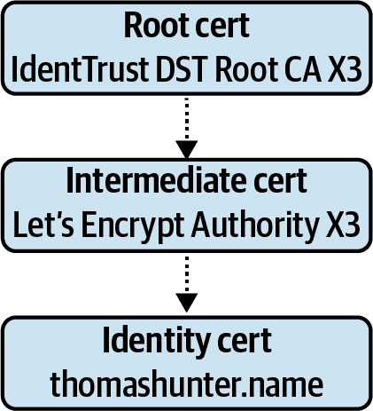

# 第二章：协议

一个进程与其他进程进行通信的方法有多种。举例来说，可以通过读写文件系统或使用进程间通信（IPC）进行通信。但是通过这些方法，一个进程只能与同一台机器上的其他进程进行通信。

相反，进程通常被构建成直接与网络进行通信。这仍然允许在同一台机器上的进程之间进行通信，但更重要的是，它允许进程在网络上进行通信。对于任何给定的机器，资源是有限的，而跨多台机器有更多的资源可用。

###### 注意

杰夫·贝佐斯在 21 世纪初要求亚马逊服务必须通过网络公开 API。这被认为是将亚马逊从简单的书店转变为 AWS 的云巨头的关键因素。这种模式现在被各大科技公司广泛采用，允许团队以前所未有的速度访问数据和进行创新。

*协议* 是两方之间通信的标准化格式。当没有涉及协议的通信发生时，消息要么不会被正确解释，要么根本无法理解。通常情况下，遵循行业标准比从头开始创建协议更好。在组织内部也更好地采用较少的服务间协议，以减少实施工作和 API 文档的数量。

*开放系统互联*（OSI）模型是描述网络协议不同层之间关系的概念。官方上有七层，尽管如本章所述，通常需要更多层来描述现代应用程序。首先在表 2-1 中检查此模型，您将更好地理解后续讨论的一些概念。本书主要讨论了第 4 层、第 7 层和假设的第 8 层。

表 2-1\. OSI 层

| 层 | 名称 | 示例 |
| --- | --- | --- |
| *8* | *用户* | *JSON, gRPC* |
| 7 | 应用 | HTTP, WebSocket |
| 6 | 表示 | MIME, ASCII, TLS |
| 5 | 会话 | 套接字 |
| 4 | 传输 | TCP, UDP |
| 3 | 网络 | IP, ICMP |
| 2 | 数据链路 | MAC, LLC |
| 1 | 物理 | Ethernet, IEEE 802.11 |

本章介绍了一些经常用于服务间通信的协议。首先讨论了无处不在的 HTTP 协议，以及经常与之配对的 JSON。还检查了该协议的各种变体，如使用 TLS 进行安全保护和启用压缩。接下来，介绍了 GraphQL 协议，该协议具有模式语法和塑造 JSON 响应的能力。最后，通过使用名为 gRPC 的实现，还研究了远程过程调用（RPC）模式。

本章涵盖的通信形式是*同步通信*的示例。采用这种方法，一个服务向另一个服务发送请求，并等待另一个服务的回复。另一种方法是*异步通信*，当一个服务不等待消息的响应时，就像将消息推送到队列中一样。

# 使用 HTTP 进行请求和响应

在其核心，HTTP（第 7 层）是一种基于文本的协议，位于 TCP（第 4 层）之上，是在需要交付保证时选择的首选协议。该协议基于由客户端生成的请求来启动 HTTP 会话，以及由服务器返回给客户端的响应。它最初是为浏览器从网站获取内容而设计的。多年来，它已经得到了许多增强。它具有处理压缩、缓存、错误甚至重试的语义。尽管它并非专门为 API 使用而设计，但它无疑是在网络服务之间进行通信的最流行的首选协议之一，也是构建其他协议的最流行协议之一。

此章节中多次提到最后一点。HTTP 是传输*超媒体*，例如图像和 HTML 文档的协议。这包括人们发现和浏览的内容，不一定是应用程序代码。这一“缺点”在接下来的几节中被认真考虑。

HTTP 是用于公共 API 的默认协议的许多原因。大多数公司已经拥有网站，因此已经存在讲 HTTP 的基础设施。浏览器经常需要消耗这些 API，并且只有少数几种协议可以让浏览器使用。有时可以通过使用浏览器访问 URL 来测试 API 端点——这是每个开发者已经安装的工具。

下一节主要讨论了目前可能是最受欢迎的版本 HTTP 1.1 协议。

## HTTP 有效载荷

HTTP 作为一种基于文本的协议，允许使用任何能够通过 TCP 进行通信的平台或语言进行通信。这也允许我在本书的页面中嵌入 HTTP 消息的原始内容。要生成请求，您可能会编写类似于示例 2-1 的代码。

##### 示例 2-1\. Node.js 请求代码

```
#!/usr/bin/env node

// npm install node-fetch@2.6
const fetch = require('node-fetch');

(async() => {
  const req = await fetch('http://localhost:3002/data', {
    method: 'POST',
    headers: {
      'Content-Type': 'application/json',
      'User-Agent': `nodejs/${process.version}`,
      'Accept': 'application/json'
    },
    body: JSON.stringify({
      foo: 'bar'
    })
  });

  const payload = await req.json();

  console.log(payload);
})();
```

手动编写 HTTP 请求可能有点繁琐。幸运的是，大多数库处理序列化和反序列化的复杂部分——即解析头部和请求/状态行。示例 2-2 展示了前面 Node 应用程序生成的对应 HTTP 请求。

##### 示例 2-2\. HTTP 请求

```
POST /data HTTP/1.1 
Content-Type: application/json 
User-Agent: nodejs/v14.8.0
Accept: application/json
Content-Length: 13
Accept-Encoding: gzip,deflate
Connection: close
Host: localhost:3002

{"foo":"bar"} 
```


第一行是请求行。


Header/value pairs, separated by colons.


两个换行符，然后是（可选的）请求主体。

这是一个 HTTP 请求的原始版本。它比您在浏览器中看到的典型请求要简单得多，不包括诸如 Cookie 和现代浏览器插入的大量默认标头等项目。每个换行符都表示为组合的回车符和换行符（`\r\n`）。响应看起来与请求非常相似。示例 2-3 显示了可能与前一个请求对应的响应。

##### 示例 2-3\. HTTP 响应

```
HTTP/1.1 403 Forbidden 
Server: nginx/1.16.0 
Date: Tue, 29 Oct 2019 15:29:31 GMT
Content-Type: application/json; charset=utf-8
Content-Length: 33
Connection: keep-alive
Cache-Control: no-cache
Vary: accept-encoding

{"error":"must_be_authenticated"} 
```


第一行是响应行。


标头/值对，由冒号分隔。


两个新行，然后是响应体（也可选）。

## HTTP 语义

HTTP 具有几个重要的语义内置。正是这些语义，给定足够的时间，任何手动协议最终都会重建。最终，正是因为这些语义及其普遍理解，许多其他协议最终被构建在 HTTP 之上。

HTTP 方法

这个值是请求行中的第一个单词。在示例 2-2 中，方法是`POST`。有几种 HTTP 方法，其他流行的方法包括`GET`, `PATCH`和`DELETE`。这些方法映射到基本的 CRUD 操作（创建、读取、更新和删除），这些通用概念几乎可以应用于所有有状态数据存储。通过让应用程序遵循 HTTP 方法的意图，外部观察者可以推断出特定请求的意图。

幂等性

这是一个花哨的术语，意味着一个操作可以多次执行而不会产生副作用。HTTP 方法`GET`, `PATCH`和`DELETE`被视为幂等操作。如果使用这些方法之一的操作的结果是未知的，例如，网络故障阻止接收响应，则客户端可以安全地重试相同的请求。

状态码

另一个重要的概念是状态码，特别是状态码范围。状态码是响应行中出现的三位数。在示例 2-3 中，状态码是 403。状态码范围的概述可在表 2-2 中找到。

表 2-2\. HTTP 状态码范围

| 范围 | 类型 | 示例 |
| --- | --- | --- |
| 100–199 | 信息 | 101 切换协议 |
| 200–299 | 成功 | 200 OK, 201 已创建 |
| 300–399 | 重定向 | 301 永久移动 |
| 400–499 | 客户端错误 | 401 未经授权, 404 未找到 |
| 500–599 | 服务器错误 | 500 内部服务器错误, 502 错误网关 |

###### 注意

状态码后的文本称为原因短语。任何流行的 Node.js HTTP 框架都会根据应用程序指定的数值状态码推断要使用的文本。这个值在现代软件中未被使用，而 HTTP/2，HTTP 1.1 的继任者，不提供这样的值。

客户端与服务器错误

状态码提供了一些非常有用的信息。例如，状态码范围 400–499 表明客户端出错，而范围 500–599 则是服务器的责任。这告诉客户端，如果尝试操作时，服务器认为客户端出错，那么客户端不应再尝试发送请求。如果客户端违反了某种协议，这种情况可能发生。然而，当发生服务器错误时，客户端应该可以自由地重试幂等请求。这可能是由于服务器的临时错误，例如被请求过载或失去了数据库连接。在 “幂等性和消息可靠性” 中，您将基于这些状态码实现自定义逻辑以重试 HTTP 请求。

响应缓存

HTTP 还提示了如何缓存响应。通常情况下，特别是通过中介服务，只有与 `GET` 请求相关联的响应才会被缓存。如果响应关联有错误代码，则可能不应将其缓存。HTTP 还说明了响应应该缓存多长时间。`Expires` 头告诉客户端在特定日期和时间之前丢弃缓存值。尽管这个系统并不完美。可以对缓存应用额外的语义。例如，如果用户 #123 请求包含其银行账户信息的文档，很难知道是否应该将缓存结果供给用户 #456。

无状态性

HTTP 本质上是一种无状态协议。这意味着通过发送一条消息，未来消息的含义不会改变。这不像终端会话那样，您可能会使用 `ls` 列出当前目录中的文件，使用 `cd` 更改目录，然后再次执行相同的 `ls` 命令，但输出不同。相反，每个请求包含了设置所需状态的所有信息。

通过 HTTP 模拟状态存在一些公约。例如，通过使用类似于 `Cookie` 的头部并设置一个唯一的会话标识符，可以在数据库中维护关于连接的状态。除了基本的身份验证信息外，在使用 API 时通常不适合要求提供这种有状态会话令牌的客户端。

## HTTP 压缩

HTTP 响应体可以进行压缩，以减少在网络上传输的数据量。这是 HTTP 的另一个内置特性。当客户端支持压缩时，它可以选择提供`Accept-Encoding`头部。服务器在遇到这个头部时，可以选择使用请求中提供的任何压缩算法来压缩响应体。gzip 压缩算法是 HTTP 压缩的普遍形式，尽管其他算法如 brotli 可能提供更高的压缩值。响应包含一个头部，指定服务器使用的算法，例如`Content-Encoding: br`表示使用了 brotli 算法。

压缩是网络有效载荷大小和 CPU 使用之间的权衡。通常情况下，在 Node.js 服务器和由第三方通过互联网消耗数据的客户端之间的某个点上支持 HTTP 压缩是符合你的最佳利益的。然而，Node.js 并不是执行压缩的最高效工具。这是一个 CPU 密集型操作，尽可能在 Node.js 进程外处理。“使用 HAProxy 的反向代理” 讨论了使用称为*反向代理*的工具来自动处理 HTTP 压缩。“SLA 和负载测试” 查看了一些基准测试来证明这一性能声明。

示例 2-4^(1) 演示了如何创建一个在进程中执行 gzip 压缩的服务器。它仅使用内置的 Node.js 模块，无需安装任何包。任何流行的 HTTP 框架都有自己习惯用的方法来实现压缩，通常只需`require`和一个函数调用即可，但在底层，它们本质上都在做同样的事情。

##### 示例 2-4\. *server-gzip.js*

```
#!/usr/bin/env node

// Adapted from https://nodejs.org/api/zlib.html
// Warning: Not as efficient as using a Reverse Proxy
const zlib = require('zlib');
const http = require('http');
const fs = require('fs');

http.createServer((request, response) => {
  const raw = fs.createReadStream(__dirname + '/index.html');
  const acceptEncoding = request.headers['accept-encoding'] || '';
  response.setHeader('Content-Type', 'text/plain');
  console.log(acceptEncoding);

  if (acceptEncoding.includes('gzip')) {
    console.log('encoding with gzip');
    response.setHeader('Content-Encoding', 'gzip');
    raw.pipe(zlib.createGzip()).pipe(response);
  } else {
    console.log('no encoding');
    raw.pipe(response);
  }
}).listen(process.env.PORT || 1337);
```

现在你已经准备好测试这个服务器了。首先创建一个 *index.html* 文件来提供服务，然后启动服务器：

```
$ echo "<html><title>Hello World</title></html>" >> index.html
$ node server-gzip.js
```

然后，在一个单独的终端窗口中运行以下命令，以查看服务器的输出：

```
# Request uncompressed content
$ curl http://localhost:1337/
# Request compressed content and view binary representation
$ curl -H 'Accept-Encoding: gzip' http://localhost:1337/ | xxd
# Request compressed content and decompress
$ curl -H 'Accept-Encoding: gzip' http://localhost:1337/ | gunzip
```

这些`curl`命令充当客户端，通过网络与服务通信。服务会打印请求是否使用了压缩来帮助解释发生了什么。在这个特定的示例中，文件的压缩版本实际上比未压缩版本更大！你可以通过运行 示例 2-5 中的两个命令来观察到这一点。

##### 示例 2-5\. 比较压缩和未压缩请求

```
$ curl http://localhost:1337/ | wc -c
$ curl -H 'Accept-Encoding: gzip' http://localhost:1337/ | wc -c
```

在这种情况下，文档的未压缩版本大小为 40 字节，压缩版本为 53 字节。

对于较大的文档，这不会成为问题。为了证明这一点，运行前面的`echo`命令再运行三次，增加*index.html*文件的大小。然后再次运行 Example 2-5 中的相同命令。这次未压缩版本是 160 字节，压缩版本是 56 字节。这是因为 gzip 通过删除响应主体中的冗余来运行，并且示例包含相同文本重复四次。如果响应主体包含重复文本（如具有重复属性名称的 JSON 文档），则此冗余删除尤为有用。大多数 gzip 压缩工具可以配置为在文档小于某个大小时跳过压缩。

HTTP 压缩仅压缩请求体，不影响 HTTP 头部（除了更改`Content-Length`头部的值）。在有限意图的服务对服务 API 的世界中，这并不是什么大问题。但是，当涉及到 Web 浏览器时，HTTP 请求可能包含几千字节的头部（想想所有那些跟踪 Cookie）。HTTP/2 的发明就是为了解决这类情况，并使用 HPACK 来压缩头部。

## HTTPS / TLS

另一种编码形式是加密。传输层安全性（TLS）是用于加密 HTTP 流量的协议。它是为 HTTPS 加上*S*（安全）的协议。与 gzip 压缩不同，TLS 还包装 HTTP 头部。与 gzip 类似，TLS 是一个 CPU 密集型操作，应该由外部进程（如反向代理）执行。TLS 取代了过时的安全套接字层（SSL）协议。

TLS 通过使用证书来工作。有两种类型的证书：一个包含公钥，可以安全地提供给世界上的任何人；另一个包含私钥，应该保持秘密。这两个密钥是固有配对的。任何人都可以使用公钥加密消息，但只有拥有私钥的人才能解密消息。在 HTTP 中，这意味着服务器将提供其公钥，并且客户端将使用公钥加密请求。当客户端首次与服务器通信时，它还会生成一个大随机数，实质上是会话的密码，用公钥加密并发送给服务器。这个临时密码用于加密 TLS 会话。

生成证书并将其与服务器配对可能需要一些实施工作。传统上，这是一项昂贵的功能，必须支付费用。如今有一个称为[Let’s Encrypt](https://oreil.ly/OXEmD)的服务，不仅自动化了这一过程，而且还免费提供。该服务的一个警告是，工具要求服务器公开面向互联网，以验证域的 DNS 所有权。这使得加密内部服务变得困难，尽管对于公共服务来说，它显然是胜利者。

现在是时候动手进行一些 TLS 工作了。在本地运行 HTTPS 服务器的最简单方法是生成自签名证书，让您的服务器读取该证书，并使客户端在不执行证书验证的情况下向服务器发出请求。要生成自己的证书，请运行 Example 2-6 中的命令。请随意使用任何值，但在提示输入*通用名称*时，请使用`localhost`。

##### 示例 2-6\. 生成自签名证书

```
$ mkdir -p ./{recipe-api,shared}/tls
$ openssl req -nodes -new -x509 \
  -keyout recipe-api/tls/basic-private-key.key \
  -out shared/tls/basic-certificate.cert
```

此命令创建了两个文件，分别是 *basic-private-key.key*（私钥）和 *basic-certificate.cert*（公钥）。

接下来，将您在 Example 1-6 中创建的 *recipe-api/producer-http-basic.js* 服务复制到一个名为 *recipe-api/producer-https-basic.js* 的新文件中，以类似于 Example 2-7 的方式构建一个完全基于 Node.js 的 HTTPS 服务器。

##### 示例 2-7\. *recipe-api/producer-https-basic.js*

```
#!/usr/bin/env node 
// npm install fastify@3.2 // Warning: Not as efficient as using a Reverse Proxy const fs = require('fs');
const server = require('fastify')({
  https: { 
    key: fs.readFileSync(__dirname+'/tls/basic-private-key.key'),
    cert: fs.readFileSync(__dirname+'/../shared/tls/basic-certificate.cert'),
  }
});
const HOST = process.env.HOST || '127.0.0.1';
const PORT = process.env.PORT || 4000;

server.get('/recipes/:id', async (req, reply) => {
  const id = Number(req.params.id);
  if (id !== 42) {
    reply.statusCode = 404;
    return { error: 'not_found' };
  }
  return {
    producer_pid: process.pid,
    recipe: {
      id, name: "Chicken Tikka Masala",
      steps: "Throw it in a pot...",
      ingredients: [
        { id: 1, name: "Chicken", quantity: "1 lb", },
        { id: 2, name: "Sauce", quantity: "2 cups", }
      ]
    }
  };
});

server.listen(PORT, HOST, () => {
  console.log(`Producer running at https://${HOST}:${PORT}`);
});
```


现在，Web 服务器已配置为启用 HTTPS 并读取证书文件。

创建了服务器文件后，请运行服务器，然后对其发出请求。可以通过运行以下命令来实现：

```
$ node recipe-api/producer-https-basic.js           # terminal 1
$ curl --insecure https://localhost:4000/recipes/42 # terminal 2
```

那个`--insecure`标志可能吸引了您的注意。实际上，如果您在 web 浏览器中直接打开该 URL，将会收到有关证书存在问题的警告。这就是自签名证书时会发生的情况。

如果您使用 Node.js 应用程序向此服务发出请求，请求也将失败。Node.js 的内置模块`http`和`https`接受一个选项参数，而大多数 npm 中的高级 HTTP 库也以某种方式接受这些选项。避免这些错误的一种方法是提供`rejectUnauthorized: false`标志。不幸的是，这与使用纯 HTTP 并没有多大区别，应该避免使用。

之所以这么重要的原因在于，并不一定安全地信任在互联网上遇到的任何旧证书。相反，重要的是要知道证书是否有效。通常通过一个证书“签署”另一个证书来实现这一点。这意味着一个证书为另一个证书背书。例如，*thomashunter.name* 的证书已由另一个名为 *Let’s Encrypt Authority X3* 的证书签署。而该证书又由另一个名为 *IdenTrust DST Root CA X3* 的证书签署。这三个证书形成了一个*信任链*（见 Figure 2-1 以了解其可视化）。



###### 图 2-1\. 证书链的信任

证书链中的最高点称为根证书。该证书被全球大部分地区信任；事实上，其公钥已包含在现代浏览器和操作系统中。

处理自签名证书的更好方法实际上是将受信任的自签名证书副本交给客户端，例如之前生成的 *basic-certificate.cert* 文件。然后可以通过使用 `ca: certContent` 选项标志来传递此证书。此示例可在 示例 2-8 中看到。

##### 示例 2-8\. *web-api/consumer-https-basic.js*

```
#!/usr/bin/env node 
// npm install fastify@3.2 node-fetch@2.6 // Warning: Not as efficient as using a Reverse Proxy const server = require('fastify')();
const fetch = require('node-fetch');
const https = require('https');
const fs = require('fs');
const HOST = '127.0.0.1';
const PORT = process.env.PORT || 3000;
const TARGET = process.env.TARGET || 'localhost:4000';

const options = {
  agent: new https.Agent({ 
    ca: fs.readFileSync(__dirname+'/../shared/tls/basic-certificate.cert'),
  })
};

server.get('/', async () => {
  const req = await fetch(`https://${TARGET}/recipes/42`,
    options);
  const payload = await req.json();

  return {
    consumer_pid: process.pid,
    producer_data: payload
  };
});

server.listen(PORT, HOST, () => {
  console.log(`Consumer running at http://${HOST}:${PORT}/`);
});
```


现在客户端信任服务器使用的确切公钥。

现在运行 *web-api* 服务，并通过运行以下命令向其发出 HTTP 请求：

```
$ node web-api/consumer-https-basic.js # terminal 1
$ curl http://localhost:3000/          # terminal 2
```

`curl` 命令使用 HTTP 与 *web-api* 进行通信，然后 *web-api* 使用 HTTPS 与 *recipe-api* 进行通信。

请回想 示例 2-7，每个 HTTPS 服务器需要访问公钥和私钥对以接收请求。还请记住，私钥绝不能落入对手手中。因此，为公司内所有服务使用单一的公钥和私钥对是危险的。如果其中一个项目泄露了其私钥，那么所有项目都会受到影响！

一种方法是为每个运行中的服务生成新的密钥。不幸的是，需要将每个服务器的公钥副本分发给可能希望与其通信的每个客户端，就像在 示例 2-8 中一样。这将是一个相当头痛的维护工作！相反，可以模仿非自签名证书使用的方法：生成单个内部根证书，保持其私钥安全，但使用它来签署每个服务的密钥集合。

执行 示例 2-9 中的命令以确切实现此目标。这些命令表示您可能在组织内执行的简化版本。带有 *CSR* 标记的步骤将在一个非常私密的机器上运行，仅用于证书生成目的。带有 *APP* 标记的步骤将代表新应用程序执行。

##### 示例 2-9\. 如何成为您自己的证书颁发机构

```
# Happens once for the CA $ openssl genrsa -des3 -out ca-private-key.key 2048 
$ openssl req -x509 -new -nodes -key ca-private-key.key \
  -sha256 -days 365 -out shared/tls/ca-certificate.cert 

# Happens for each new certificate $ openssl genrsa -out recipe-api/tls/producer-private-key.key 2048 
$ openssl req -new -key recipe-api/tls/producer-private-key.key \
  -out recipe-api/tls/producer.csr 
$ openssl x509 -req -in recipe-api/tls/producer.csr \
  -CA shared/tls/ca-certificate.cert \
  -CAkey ca-private-key.key -CAcreateserial \
  -out shared/tls/producer-certificate.cert -days 365 -sha256 
```


*CSR*: 为证书颁发机构生成私钥 *ca-private-key.key*。您将被提示输入密码。


*CSR*: 为证书颁发机构生成根证书 *shared/tls/ca-certificate.cert*（将提供给客户端）。会询问许多问题，但对于此示例并不重要。


*APP*: 为特定服务生成私钥 *producer-private-key.key*。


*APP*: 为同一服务创建 CSR *producer.csr*。确保在 *Common Name* 问题中回答 `localhost`，但其他问题并不那么重要。


*CSR*: 生成由 CA 签名的服务证书 *producer-certificate.cert*。

现在修改 *web-api/consumer-https-basic.js* 中的代码，以加载 *ca-certificate.cert* 文件。同时修改 *recipe-api/producer-https-basic.js*，加载 *producer-private-key.key* 和 *producer-certificate.cert* 文件。重新启动两个服务器，并再次运行以下命令：

```
$ curl http://localhost:3000/
```

即使 *web-api* 不知道 *recipe-api* 服务的确切证书，你仍应该得到一个成功的响应；它从根 *ca-certificate.cert* 证书中获得了信任。

## JSON over HTTP

到目前为止，HTTP 请求和响应的主体并没有被详细研究过。这是因为 HTTP 标准并没有完全规定 HTTP 消息主体中应包含的内容。正如我之前提到的，HTTP 是许多其他协议的基础。这就是神秘的 OSI 模型第 8 层发挥作用的地方。

当今最流行的 API 大多数都是 *JSON over HTTP*，这种模式通常被误称为 *REST*（表现层状态转移）。在示例应用程序中来回发送的小 JSON 负载就是 JSON over HTTP 的一个例子。

仅仅通过 JSON over HTTP 进行通信远远不够。例如，错误如何表示？当然，应该利用 HTTP 错误状态码和遵循一般语义，但实际上应该使用什么负载来作为主体？在 JSON 中如何正确表示特定的内部对象？还有一些不容易映射到 HTTP 头的元信息，比如分页数据。JSON over HTTP 的问题，以及许多自称为 REST 的 API，都在于生产者和消费者之间的完整协议仅存在于文档中。人们必须阅读文档，并手动编写与这些负载交互的代码。

另一个问题是，每个 JSON over HTTP 服务都会以不同的方式实现事务。除了具有 `Content-Type: application/json` 头之外，第一个大括号和最后一个大括号之间可能会发生任何事情。通常情况下，特定客户端消费的每个新服务都需要编写新代码。

举个具体的例子，考虑分页。宽泛概念的“JSON over HTTP” 并没有内置处理这一功能的方法。Stripe API 使用查询参数 `?limit=10&starting_after=20`。响应主体中提供了元信息，如 `has_more` 布尔属性，用于告知客户端还有更多数据需要分页获取。另一方面，GitHub API 使用查询参数 `?per_page=10&page=3`。分页的元信息则放在 `Link` 响应头中。

正是因为这些原因，才发明了在 HTTP 中表示请求和响应体的不同标准。[JSON:API](https://jsonapi.org/format/)、[JSON Schema](http://json-schema.org/specification.html) 和 [OpenAPI (Swagger)](https://swagger.io/specification/) 是完全接受 JSON over HTTP 并试图为混乱带来秩序的规范。它们处理描述请求和响应体等概念，并在不同程度上介绍了如何与 HTTP API 服务器交互。接下来的两个部分讨论了更极端的协议更改 GraphQL 和 gRPC。

“JSON over HTTP benchmarks” 包含使用 JSON over HTTP 在两个服务器之间通信的基准测试。

## POJO 序列化的危险

JavaScript 使得将域对象的内存表示序列化变得非常容易。只需简单地调用 `JSON.stringify(obj)` —— 这正是大多数 HTTP 框架为您自动完成的 —— 您项目内部属性的任何重构都可能泄露并导致 API 破坏性变更。它还可能泄露秘密。

一个更好的方法是为手动控制对象如何在 JSON 中表示添加一个安全网 —— 这种模式称为 *marshalling*。可以通过将可序列化数据表示为带有 `toJSON()` 方法的类来实现这一点，而不是将数据存储为 POJO（Plain Ol’ JavaScript Object）。

作为示例，这里有两种在代码库中表示 `User` 对象的方法。第一种是 POJO，第二种是具有 `toJSON()` 方法的类：

```
const user1 = {
  username: 'pojo',
  email: 'pojo@example.org'
};
class User {
  constructor(username, email) {
    this.username = username;
    this.email = email;
  }
  toJSON() {
    return {
      username: this.username,
      email: this.email,
    };
  }
}
const user2 = new User('class', 'class@example.org');
// ...
res.send(user1); // POJO
res.send(user2); // Class Instance
```

在这两种情况下，当响应发送时，服务的消费者将收到表示具有相同属性的对象的 JSON 字符串：

```
{"username":"pojo","email":"pojo@example.org"}
{"username":"class","email":"class@example.org"}
```

可能在某些时候，应用程序被修改以开始跟踪用户的密码。这可能通过向用户对象的实例添加一个新的 `password` 属性来完成，也许是通过修改创建用户实例的代码，在创建时设置密码。或者可能是代码库中的某个黑暗角落通过调用 `user.password = value` 设置密码。这样的变更可以像这样表示：

```
user1.password = user2.password = 'hunter2';
// ...
res.send(user1);
res.send(user2);
```

当这种情况发生时，POJO 现在正在向消费者泄露私人信息。有显式编组逻辑的类不会泄露这些细节：

```
{"username":"pojo","email":"pojo@example.org","password":"hunter2"}
{"username":"class","email":"class@example.org"}
```

即使有测试检查 HTTP 响应消息中是否存在 `username` 和 `email` 等值，当添加了新的属性如 `password` 时，它们可能不会失败。

# 使用 GraphQL 的 API 外观

GraphQL 是由 Facebook 设计的用于查询 API 的协议。它非常适用于构建 *外观服务*——这是一个位于多个其他服务和数据源前面的服务。GraphQL 试图解决传统的 JSON over HTTP API 的一些问题。GraphQL 尤其擅长返回客户端所需的最小数据量。它还擅长从多个来源填充响应有效负载，以便客户端可以通过单个请求获取所有需要的内容。

GraphQL 不强制使用特定的底层协议。大多数实现（包括本节中使用的实现）通常使用 GraphQL over HTTP，但也可以通过其他协议如 TCP 进行消费。整个 GraphQL 查询使用单个字符串描述，类似于 SQL 查询。当基于 HTTP 的实现时，通常使用单一端点，客户端通过 `POST` 方法发送查询。

GraphQL 响应通常使用 JSON 提供，但也可以使用其他响应类型，只要能够表示数据的层次结构。这些示例也使用 JSON。

###### 注意

如今，将 JSON 公开为 HTTP API 对公众更为普遍。GraphQL API 更可能被同一组织维护的客户端消费——例如内部使用或首选移动应用。然而，情况正在发生变化，越来越多的公司开始公开 GraphQL API。

## GraphQL Schema

GraphQL 模式是一个描述特定 GraphQL 服务器能够执行的所有交互的字符串。它还描述了服务器可以表示的所有对象以及这些对象的类型（如 `String` 和 `Int`）。这些类型基本上可以分为两类；类型要么是原始的，要么是命名对象。每个命名对象都需要在模式中有一个条目；不能使用未命名和描述的对象。创建一个名为 *schema.gql* 的新文件，并将 Example 2-10 的内容输入到此文件中。

##### 示例 2-10\. *shared/graphql-schema.gql*

```
type Query { 
  recipe(id: ID): Recipe
  pid: Int
}
type Recipe { 
  id: ID!
  name: String!
  steps: String
  ingredients: [Ingredient]! 
}
type Ingredient {
  id: ID!
  name: String!
  quantity: String
}
```


最顶层的查询表示。


`Recipe` 类型。


`Recipe` 在名为 `ingredients` 的数组中具有 `Ingredient` 子项。

第一个条目 `Query` 表示消费者提供的查询的根。在这种情况下，消费者基本上可以请求两组不同的信息。`pid` 条目返回一个整数。另一个条目 `recipe` 返回一个在模式文档中定义的 `Recipe` 类型。此调用在查询时接受一个参数。在本例中，模式说明了通过调用带有名为 `id` 的参数的 `recipe` 方法，将返回一个遵循 `Recipe` 模式的对象。Table 2-3 包含 GraphQL 使用的标量类型列表。

表 2-3\. GraphQL 标量

| 名称 | 示例 | JSON 等效 |
| --- | --- | --- |
| `Int` | 10, 0, -1 | Number |
| `Float` | 1, -1.0 | Number |
| `String` | “Hello, friend!\n” | String |
| `Boolean` | true, false | Boolean |
| `ID` | “42”, “975dbe93” | String |

接下来详细描述了`Recipe`对象。此块包含一个`id`属性，它是一个`ID`。默认情况下，字段是可空的——如果客户端请求值而服务器未提供该值，则会强制转换为 null。`Recipe`还具有`name`和`steps`属性，它们是字符串（`String`）。最后，它有一个名为`ingredients`的属性，其中包含一系列`Ingredient`条目。接下来的块描述了`Ingredient`对象并包含其自己的属性。此模式类似于到目前为止在示例应用程序中使用的响应。

## 查询与响应

接下来，您将看看与此数据交互的查询及其响应有效负载可能看起来像什么。GraphQL 中的查询具有一个非常有用的功能，即消费者可以精确指定它正在查找的属性。另一个方便的功能是响应数据的格式永远不会有任何意外；嵌套查询层次结构最终的形状与结果数据的形状相同。

首先，考虑一个非常基本的示例，仅应从服务器检索`pid`值。为此进行的查询如下所示：

```
{
  pid
}
```

与前面查询匹配的示例响应有效负载将如下所示：

```
{
  "data": {
    "pid": 9372
  }
}
```

最外层的“信封”对象，即包含`data`的对象，有助于消除关于响应的元信息的歧义。请记住，GraphQL 并不依赖于提供错误等概念的 HTTP，因此响应有效负载必须能够区分成功的响应和错误（如果此查询有错误，则根本不会有根目录中的`data`属性，但会有一个`errors`数组）。

还要注意，尽管在 GraphQL 模式的根`Query`类型中定义了配方数据，但配方数据根本没有显示出来。这是因为查询精确指定了应返回哪些字段。

下面是一个更复杂的查询。该查询将根据其 ID 获取特定的配方。它还将获取属于该配方的成分的信息。查询将如下所示：

```
{
  recipe(id: 42) {
    name
    ingredients {
      name
      quantity
    }
  }
}
```

此查询指定要获取具有`id`为 42 的配方的实例。它还想要该配方的`name`，但不需要`id`或`steps`属性，并且希望访问成分，特别是它们的`name`和`quantity`值。

对于此查询的响应有效负载将类似于以下内容：

```
{
  "data": {
    "recipe": {
      "name": "Chicken Tikka Masala",
      "ingredients": [
        { "name": "Chicken", "quantity": "1 lb" },
        { "name": "Sauce", "quantity": "2 cups" }
      ]
    }
  }
}
```

再次注意，嵌套的请求查询与嵌套的 JSON 响应具有相同的形状。假设编写查询的开发人员了解模式，该开发人员可以安全地编写任何查询，并知道它是否有效，知道响应的形状，甚至知道响应中每个属性的类型。

实际上，`graphql` npm 包提供了一个专门用于编写和测试查询的 Web REPL。此接口的名称是 *GraphiQL*，这是 “GraphQL” 和 “graphical” 的组合。

`graphql` 包是在 Node.js 中构建 GraphQL 服务的官方包。它还是 GraphQL 的官方参考实现，因为 GraphQL 并不与特定语言或平台绑定。以下代码示例使用 `fastify-gql` 包。此包使 GraphQL 与 Fastify 以方便的方式配合工作，但本质上是官方 `graphql` 包的包装。

## GraphQL 生产者

现在您已经看过一些示例查询及其响应，可以开始编写一些代码了。首先，根据 示例 2-11 中的内容创建一个新的 *recipe-api* 服务文件。

##### 示例 2-11\. *recipe-api/producer-graphql.js*

```
#!/usr/bin/env node // npm install fastify@3.2 fastify-gql@5.3 const server = require('fastify')();
const graphql = require('fastify-gql');
const fs = require('fs');
const schema = fs.readFileSync(__dirname +
  '/../shared/graphql-schema.gql').toString(); 
const HOST = process.env.HOST || '127.0.0.1';
const PORT = process.env.PORT || 4000;

const resolvers = { 
  Query: { 
    pid: () => process.pid,
    recipe: async (_obj, {id}) => {
      if (id != 42) throw new Error(`recipe ${id} not found`);
      return {
        id, name: "Chicken Tikka Masala",
        steps: "Throw it in a pot...",
      }
    }
  },
  Recipe: { 
    ingredients: async (obj) => {
      return (obj.id != 42) ? [] : [
        { id: 1, name: "Chicken", quantity: "1 lb", },
        { id: 2, name: "Sauce", quantity: "2 cups", }
      ]
    }
  }
};

server
  .register(graphql, { schema, resolvers, graphiql: true }) 
  .listen(PORT, HOST, () => {
    console.log(`Producer running at http://${HOST}:${PORT}/graphql`);
  });
```


将模式文件提供给 `graphql` 包。


`resolvers` 对象告诉 `graphql` 如何构建响应。


`Query` 条目代表顶级查询。


当检索 `Recipe` 时，将运行 `Recipe` 解析器。


Fastify 使用 `server.register()` 与 `fastify-gql` 包；其他框架有其自己的惯例。

GraphQL 代码在 `server.register` 行中注册到 Fastify 服务器。这最终创建一个路由，在 `/graphql` 处监听传入请求。消费者稍后将向此端点发送查询。以下对象使用 *shared/graphql-schemal.gql* 文件的内容配置 GraphQL，引用 `resolvers` 对象（稍后讨论），以及最终的 `graphiql` 标志。如果该标志为 true，则启用前面提到的 GraphiQL 控制台。服务运行时，可以访问该控制台 *http://localhost:4000/graphiql*。在生产环境中，最好永远不要将该值设置为 true。

现在是考虑 `resolvers` 对象的时候了。该对象具有与 GraphQL 模式中描述的不同类型相对应的根属性。`Query` 属性描述了顶层查询，而 `Recipe` 则描述了 Recipe 对象。这两个对象的每个属性都是一个异步方法（在代码的其他地方会进行等待）。这意味着这些方法可以返回一个 Promise，它们可以是一个 `async` 函数，或者它们可以只返回一个简单的值。在此示例中没有涉及数据库，因此每个方法都是同步运行并返回一个简单值。

当调用这些方法时，GraphQL 提供关于调用上下文的参数。例如，请考虑 `resolvers.Query.recipe` 方法。在这种情况下，第一个参数是一个空对象，因为它在查询的根部调用。但是，第二个参数是一个表示传递给此函数的参数的对象。在模式文件中，`recipe()` 被定义为接受一个名为 `id` 的参数，该参数接受一个 ID 并返回一个 `Recipe` 类型。因此，在此方法中，提供 `id` 作为参数。还预期返回一个符合 `Recipe` 结构的对象。

在模式中，您已将 `Recipe` 定义为具有 `id`、`name`、`steps` 和 `ingredients` 属性。因此，在返回的对象中，已指定每个标量值。但是，`ingredients` 属性尚未定义。当 GraphQL 代码运行时，`resolvers.Recipe` 将自动拾取它。

GraphQL 强制要求请求的 JSON 响应与传入的查询形状匹配。如果 `recipe()` 方法中的响应对象被修改以包含称为 `serves` 的附加属性，GraphQL 将在将响应发送给客户端之前自动删除该未知值。此外，如果客户端未请求已知的 `id` 或 `name` 值之一，则它们也将从响应中删除。

一旦 GraphQL 代码运行了 `resolvers` 并且从 `recipe()` 方法调用中接收到了顶层配方对象，假设客户端请求了 `ingredients`，现在可以调用代码来填充这些配料值。这是通过调用 `resolvers.Recipe.ingredients` 方法来完成的。在这种情况下，第一个参数现在包含有关父对象的信息，这里是顶层 `Recipe` 实例。提供的对象包含从 `recipe()` 方法调用返回的所有信息（例如 `id`、`name` 和 `steps` 值）。`id` 通常是最有用的值。如果此应用程序由数据库支持，则可以使用 `id` 进行数据库查询并获取相关的 `Ingredient` 条目。但是，此简单示例仅使用硬编码值。

###### 注意

`resolvers` 对象中描述的每个方法都可以异步调用。GraphQL 足够智能，可以基本并行地调用它们所有，从而使您的应用程序可以从其他源获取多个异步出站调用的数据。一旦最慢的请求完成，那么整体查询就可以完成，并且可以向消费者发送响应。

## GraphQL 消费者

现在您已经熟悉了构建提供 GraphQL 接口的生产者所需的内容，是时候看看构建消费者所需的内容了。

构建一个消费者要简单一些。有一些 npm 包可以帮助生成查询，但与 GraphQL 服务进行交互是足够简单的，您可以简单地使用基本工具重新构建它。

示例 2-12 创建了一个新的 *web-api* 消费者。此示例中最重要的部分是将要发送的查询。它还将使用 *query variables*，这是 SQL 中 *query parameters* 的 GraphQL 等效项。变量非常有用，因为与 SQL 类似，手动将字符串连接在一起以将动态数据（例如用户提供的值）与静态数据（如查询代码）组合起来是危险的。

##### 示例 2-12\. *web-api/consumer-graphql.js*

```
#!/usr/bin/env node // npm install fastify@3.2 node-fetch@2.6 const server = require('fastify')();
const fetch = require('node-fetch');
const HOST = '127.0.0.1';
const PORT = process.env.PORT || 3000;
const TARGET = process.env.TARGET || 'localhost:4000';
const complex_query = `query kitchenSink ($id:ID) {  recipe(id: $id) {
    id name
    ingredients {
      name quantity
    }
  }
  pid
}`;

server.get('/', async () => {
  const req = await fetch(`http://${TARGET}/graphql`, {
    method: 'POST',
    headers: { 'Content-Type': 'application/json' },
    body: JSON.stringify({ 
      query: complex_query,
      variables: { id: "42" }
    }),
  });
  return {
    consumer_pid: process.pid,
    producer_data: await req.json()
  };
});

server.listen(PORT, HOST, () => {
  console.log(`Consumer running at http://${HOST}:${PORT}/`);
});
```


这里有一个更复杂的查询，接受参数。


请求体是封装了 GraphQL 查询的 JSON。

此示例进行了 `POST` 请求，并向服务器发送了 JSON 负载。此负载包含了查询和变量。`query` 属性是 GraphQL 查询字符串，`variables` 属性包含变量名称与其值的映射。

发送的 `complex_query` 请求几乎要求服务器支持的每一个数据片段。它还使用了更复杂的语法来指定将在查询中使用的变量。在本例中，它命名了查询为 `kitchenSink`，这对调试很有用。查询的参数在名称之后被定义，例如声明了一个名为 `$id` 类型为 ID 的变量。然后将该变量传递给 `recipe()` 方法。请求体的 `variables` 属性包含一个单一的变量。在此部分，变量不需要以 `$` 开头。

一旦您修改了这两个文件，请运行两个服务，然后通过以下命令向消费者服务发出请求：

```
$ node recipe-api/producer-graphql.js # terminal 1
$ node web-api/consumer-graphql.js    # terminal 2
$ curl http://localhost:3000          # terminal 3
```

您将会收到一个类似于这样的回复：

```
{
  "consumer_pid": 20827,
  "producer_data": {
    "data": {
      "recipe": {
        "id": "42",
        "name": "Chicken Tikka Masala",
        "ingredients": [
          { "name": "Chicken", "quantity": "1 lb" },
          { "name": "Sauce", "quantity": "2 cups" }
        ]
      },
      "pid": 20842
    }
  }
}
```

GraphQL 提供了比本节列出的更多功能。例如，它包括一个称为 *mutations* 的功能，允许客户端修改文档。它还有一个称为 *subscription* 的功能，允许客户端订阅并接收消息流。

“GraphQL 基准测试” 包含了使用 GraphQL 在两个服务器之间进行通信的基准测试。

# 使用 gRPC 进行 RPC

类似 REST 和在某种程度上 GraphQL 的模式尝试将生产者提供的底层功能抽象化，并且基本上暴露出一个由数据驱动和 CRUD 操作的 API。尽管服务内部可能非常复杂，但消费者最终只能看到一个充满名词而几乎没有动词的接口。

例如，一个具有 RESTful 接口的 API 可能允许消费者创建发票。可以使用`POST`方法结合名为`/invoice`的路由执行此操作。但是，当发票创建时，生产者如何允许消费者向用户发送电子邮件呢？是否应该为发票电子邮件设置单独的端点？在创建时是否应该在发票记录中设置一个名为`email`的属性，并将其设置为 true 以触发电子邮件？通常情况下，使用 HTTP 提供的方法来表示应用程序功能并不完美。这时候，可能需要寻找一种新的模式。

*远程过程调用（RPC）* 就是这样一种模式。与提供有限动词列表的 HTTP 不同，RPC 基本上可以支持开发者想要的任何动词。如果你考虑应用的核心部分，前述的`POST /invoice`路由最终会调用应用程序深处的某些代码。在代码中可能会有一个名为`create_invoice()`的相关方法。通过 RPC，你可以将这种方法暴露到网络中，几乎保持其原始形式，而无需创建不同的接口。

总的来说，RPC 的工作原理是选择要暴露在应用程序中的函数，并创建这些函数与某种网络接口之间的映射。当然，这不像简单地将函数暴露给网络那样直截了当。这些方法需要非常严格地确定它们接受的数据类型及其来源（就像 HTTP 端点应该做的那样）。

在服务之间提供网络 RPC 端点的最流行标准之一是 Google 的[gRPC](https://grpc.io)。gRPC 通常通过 HTTP/2 提供服务。与 GraphQL 使用单个 HTTP 端点不同，gRPC 使用端点确定调用哪种方法。

## 协议缓冲区

不像 JSON 通过 HTTP 和 GraphQL，gRPC 通常不会通过纯文本传递消息。相反，它使用协议缓冲区（即 Protobufs）来传输数据，这是一种用于表示序列化对象的二进制格式。这种表示形式导致消息负载更小且网络性能更高。它不仅创建了更紧凑的消息，而且减少了每条消息发送的冗余信息量。关于 OSI 模型，Protobufs 可以被视为运行在第 8 层，而 HTTP/2 运行在第 7 层。

Protobufs 使用自己的语言描述可以在 gRPC 服务器中表示的消息。这些文件以 `.proto` 结尾，类似于 GraphQL 模式。Example 2-13 展示了如何为 gRPC 服务定义类似操作。

##### Example 2-13\. *shared/grpc-recipe.proto*

```
syntax = "proto3";
package recipe;
service RecipeService { 
  rpc GetRecipe(RecipeRequest) returns (Recipe) {}
  rpc GetMetaData(Empty) returns (Meta) {}
}
message Recipe {
  int32 id = 1; 
  string name = 2;
  string steps = 3;
  repeated Ingredient ingredients = 4; 
}
message Ingredient {
  int32 id = 1;
  string name = 2;
  string quantity = 3;
}
message RecipeRequest {
  int32 id = 1;
}
message Meta { 
  int32 pid = 2;
}
message Empty {}
```


一个名为 `RecipeService` 的服务定义。


一个类型为 `Meta` 的消息。


一个名为 `id` 的字段，可以是 32 位整数。


一个名为 `ingredients` 的字段中的 `Recipe` 消息数组，这是该消息的第四个条目。

*recipe.proto* 文件由客户端和服务器共享。这使得两端能够相互通信，并能够解码和编码发送的消息。gRPC 定义了 RPC 方法，可以接受特定类型的消息并返回另一个类型的消息，还定义了服务，用于组织相关的方法调用。

注意消息类型的粒度。GraphQL 是以 JSON 和 HTTP 为基础构建的，使用 `Int` 指定数字类型，即整数。gRPC 则是源自 C 语言的低级描述，更详细地描述整数的大小，例如 `int32`。如果用于 JSON，通常没有理由限制整数的大小。Table 2-4 列出了常见 gRPC 数据类型的详细列表。

Table 2-4\. 常见 gRPC 标量类型

| 名称 | 示例 | Node/JS 等效 |
| --- | --- | --- |
| `double` | 1.1 | `Number` |
| `float` | 1.1 | `Number` |
| `int32` | -2_147_483_648 | `Number` |
| `int64` | 9_223_372_036_854_775_808 | `Number` |
| `bool` | true, false | `Boolean` |
| `string` | “Hello, friend!\n” | `String` |
| `bytes` | *binary data* | `Buffer` |

`repeated` 关键字意味着字段可以包含多个值。在这些情况下，这些值可以表示为该值类型的数组。

###### 提示

还有一些其他的数字格式可以在 gRPC 中表示。包括 `uint32` 和 `uint64`，`sint32` 和 `sint64`，`fixed32` 和 `fixed64`，最后是 `sfixed32` 和 `sfixed64`。每种类型对表示的数字范围、精度以及数字在传输中的表示有不同的限制。当 `Number` 不够时，可以配置 `@grpc/proto-loader` 包使用 `String` 表示不同的值。

这些消息类型的另一个有趣之处是每个字段关联的数值。这些值表示字段在消息中的顺序。例如，`Ingredient`消息的`id`是第一个属性，`quantity`是第三个属性。起初列出这些数字似乎很奇怪，但顺序非常重要。与 JSON 不同，JSON 技术上没有属性的顺序，但在协议缓冲区消息中，属性的顺序非常重要，有两个原因。

第一个原因是字段名不会随着消息本身一起传输。由于模式在客户端和服务器之间共享，字段的名称会显得多余。简单来说，想象一下用 JSON 和二进制分别传输两个整数的情况。这两条消息可能看起来像是：

```
{"id":123,"code":456}
01230456
```

如果始终发送两个数字，并且大家都知道第一个叫`id`，第二个叫`code`，那么像第二行中的消息表示方式就去除了不必要的冗余。这类似于 CSV 的工作原理：第一行是列名，后续行是数据。

第二个原因是字段顺序的重要性在于，使用 Protobuf 和 gRPC 本身设计为向后兼容。例如，如果 Protobufs 的 v1 版本的`Ingredient`消息包含`id`、`name`和`quantity`字段，而某一天创建了一个新的 v2 版本，并添加了第四个`substitute`字段，那么网络上仍在使用 v1 版本的节点可以安全地忽略额外的字段，并与其他节点进行通信。在旧版本逐步淘汰的情况下，这对于逐步发布新应用程序版本是有利的。

gRPC 支持四种消息传递方式，尽管这些例子只关注最基本的方式。消息请求和响应可以是流式的，也可以是单个消息。这些例子中使用的基本方式涉及非流式的请求和响应。然而，可以使用*服务器端流式 RPC*，其中服务器会流式传输响应；*客户端端流式 RPC*，其中客户端会流式传输请求；或者*双向流式 RPC*，其中客户端和服务器会流式传输请求和响应。在处理流时，会提供一个`EventEmitter`的实例，但在处理单个消息时，代码将使用回调函数。

## gRPC 生产者

现在您已经查看了一些 Protobuf 消息和服务定义，现在是时候使用 Node.js 实现一个 gRPC 服务器了。同样，您将从创建一个新的*recipe-api/*服务开始。创建一个文件，类似于 示例 2-14，并确保安装必要的依赖项。以`@`符号开头的依赖项表示在 npm 注册表中的作用域包。

##### 示例 2-14\. *recipe-api/producer-grpc.js*

```
#!/usr/bin/env node 
// npm install @grpc/grpc-js@1.1 @grpc/proto-loader@0.5 const grpc = require('@grpc/grpc-js');
const loader = require('@grpc/proto-loader');
const pkg_def = loader.loadSync(__dirname +
  '/../shared/grpc-recipe.proto'); 
const recipe = grpc.loadPackageDefinition(pkg_def).recipe;
const HOST = process.env.HOST || '127.0.0.1';
const PORT = process.env.PORT || 4000;
const server = new grpc.Server();
server.addService(recipe.RecipeService.service, { 
  getMetaData: (_call, cb) => { 
    cb(null, {
      pid: process.pid,
    });
  },
  getRecipe: (call, cb) => { 
    if (call.request.id !== 42) {
      return cb(new Error(`unknown recipe ${call.request.id}`));
    }
    cb(null, {
      id: 42, name: "Chicken Tikka Masala",
      steps: "Throw it in a pot...",
      ingredients: [
        { id: 1, name: "Chicken", quantity: "1 lb", },
        { id: 2, name: "Sauce", quantity: "2 cups", }
      ]
    });
  },
});

server.bindAsync(`${HOST}:${PORT}`,
  grpc.ServerCredentials.createInsecure(), 
  (err, port) => {
    if (err) throw err;
    server.start();
    console.log(`Producer running at http://${HOST}:${port}/`);
  });
```


生产者需要访问 *.proto* 文件。在这种情况下，它在启动时加载和处理，导致小额启动成本。


定义服务时，提供一个对象，其属性反映 *.proto* 文件中定义的方法。


该方法对应于 *.proto* 定义中的 `GetMetaData(Empty)` 方法。


`getRecipe()` 方法在请求期间使用了传入的对象。此对象作为 `call.request` 提供。


gRPC 可以使用 TLS 和身份验证，但在本示例中已禁用。

此服务器侦听发送到本地主机端口 4000 的 HTTP/2 请求。与两种方法相关联的 HTTP 路由基于服务名称和方法名称。这意味着 `getMetaData()` 方法实际上位于以下 URL：

```
http://localhost:4000/recipe.RecipeService/GetMetaData
```

gRPC 包抽象了底层的 HTTP/2 层，因此通常无需将 gRPC 服务视为通过 HTTP/2 进行，也无需考虑路径。

## gRPC 消费者

现在是时候实现消费者了。示例 2-15 是 *web-api* 服务的重制版本。在撰写本文时，官方的 `@grpc/grpc-js` npm 包通过暴露使用回调的方法工作。此代码示例使用 `util.promisify()`，以便您可以使用异步函数调用方法。

##### 示例 2-15\. *web-api/consumer-grpc.js*

```
#!/usr/bin/env node 
// npm install @grpc/grpc-js@1.1 @grpc/proto-loader@0.5 fastify@3.2 const util = require('util');
const grpc = require('@grpc/grpc-js');
const server = require('fastify')();
const loader = require('@grpc/proto-loader');
const pkg_def = loader.loadSync(__dirname +
  '/../shared/grpc-recipe.proto'); 
const recipe = grpc.loadPackageDefinition(pkg_def).recipe;
const HOST = '127.0.0.1';
const PORT = process.env.PORT || 3000;
const TARGET = process.env.TARGET || 'localhost:4000';

const client = new recipe.RecipeService( 
  TARGET,
  grpc.credentials.createInsecure() 
);
const getMetaData = util.promisify(client.getMetaData.bind(client));
const getRecipe = util.promisify(client.getRecipe.bind(client));

server.get('/', async () => {
  const [meta, recipe] = await Promise.all(
    getMetaData({}), 
  ]);

  return {
    consumer_pid: process.pid,
    producer_data: meta,
    recipe
  };
});

server.listen(PORT, HOST, () => {
  console.log(`Consumer running at http://${HOST}:${PORT}/`);
});
```


就像生产者服务一样，这个服务在启动时加载 *.proto* 定义。


gRPC 客户端知道自己正在连接到一个 `recipe.RecipeService` 服务。


与生产者一样，此处已禁用安全性。


`GetMetaData()` 调用使用了一个 `Empty` 消息，其中不包含任何属性。


`GetRecipe()` 调用期望一个 `RecipeRequest` 消息。在这里，传入一个形状相同的对象。

本示例在 *web-api* 和 *recipe-api* 服务之间发送了两个请求，而以前的 GraphQL 和 JSON over HTTP 示例则只进行了单个请求。虽然可以在单个请求中检索所有所需信息，但我觉得此示例有助于传达 RPC 模式的核心，即在远程服务器上调用各个方法。

注意 `@grpc/grpc-js` 包能够查看您的 `.proto` 文件，并为您提供一个具有与服务中方法对应的方法的对象。在这种情况下，客户端有一个名为 `getMetaData()` 的方法。这使得 RPC 所要传达的感觉变得更为强烈，即一个服务上的代码在远程调用另一个服务上的方法，就像这些方法存在于本地一样。

现在，您已经定义了这两个服务，请继续运行它们并通过运行以下命令进行请求：

```
$ node recipe-api/producer-grpc.js # terminal 1
$ node web-api/consumer-grpc.js    # terminal 2
$ curl http://localhost:3000/      # terminal 3
```

对于此请求的响应应类似于以下的 JSON 载荷：

```
{
  "consumer_pid": 23786,
  "producer_data": { "pid": 23766 },
  "recipe": {
    "id": 42, "name": "Chicken Tikka Masala",
    "steps": "Throw it in a pot...",
    "ingredients": [
      { "id": 1, "name": "Chicken", "quantity": "1 lb" },
      { "id": 2, "name": "Sauce", "quantity": "2 cups" }
    ]
  }
}
```

消费者服务已经将两个 gRPC 方法的结果合并在一起，但它们仍然在生成的文档中可见。`recipe` 属性与 *.proto* 文件中的 `Recipe` 消息定义相关联。请注意，它包含一个名为 `ingredients` 的属性，这是 `Recipe` 实例数组。

“gRPC benchmarks” 包含了使用 gRPC 在两个服务器之间通信的基准测试。

^(1) 这些代码示例采取了许多简化措施以保持简洁。例如，在生成路径时始终优先使用 `path.join()` 而不是手动字符串连接。
