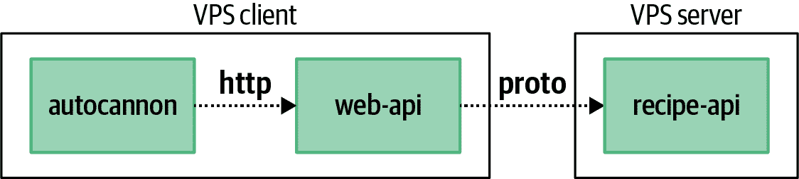

# 第三章：扩展

运行服务的冗余副本至少有两个重要原因。

第一个原因是实现 *高可用性*。考虑到进程和整个机器偶尔会崩溃。如果只有一个生产者实例在运行，而该实例崩溃，则消费者无法正常工作，直到崩溃的生产者重新启动。如果有两个或更多运行中的生产者实例，则单个宕机实例不一定会阻止消费者正常工作。

另一个原因是，特定的 Node.js 实例可以处理的吞吐量是有限的。例如，根据硬件不同，最基本的 Node.js “Hello World” 服务可能的吞吐量大约为每秒 40,000 个请求（r/s）。一旦应用程序开始串行化和反串行化负载或进行其他 CPU 密集型工作，吞吐量将急剧下降。将工作卸载到额外的进程有助于防止单个进程过载。

有几种工具可用于分解工作。“集群模块” 着眼于一个内置模块，使得在同一台服务器上运行应用程序代码的冗余副本变得简单。“使用 HAProxy 的反向代理” 使用外部工具运行服务的多个冗余副本，允许它们在不同的机器上运行。最后，“SLA 和负载测试” 讨论如何通过检查基准测试来理解服务可以处理的负载，这可以用来确定它应该扩展到的实例数量。

# 集群模块

Node.js 提供了 `cluster` 模块，允许在同一台机器上运行多个 Node.js 应用程序副本，并将传入的网络消息分派给这些副本。该模块类似于 `child_process` 模块，它提供了一个 `fork()` 方法^(1) 用于生成 Node.js 子进程；主要区别在于增加了路由传入请求的机制。

`cluster` 模块提供了一个简单的 API，并且对任何 Node.js 程序都是立即可用的。因此，当应用程序需要扩展到多个实例时，它通常是第一反应的解决方案。它已经变得非常普遍，许多开源的 Node.js 应用程序依赖于它。不幸的是，它也有点反模式，并且几乎从不是扩展进程的最佳工具。由于它的普及性，理解它的工作方式是必要的，尽管你应该尽量避免使用它。

[集群文档](https://nodejs.org/api/cluster.html) 包含一个单独的 Node.js 文件，加载了 `http` 和 `cluster` 模块，并包含一个 `if` 语句，用于检查脚本是否作为主进程运行，如果是，则分叉出一些工作进程。否则，如果不是主进程，则创建一个 HTTP 服务并开始监听。这个示例代码有些危险，同时也有些误导性。

## 一个简单的例子

文档代码示例之所以危险，是因为它促使在父进程内加载许多潜在复杂和沉重的模块。它误导的原因在于，示例并未明确表明应用程序的多个独立实例正在运行，而且像全局变量之类的东西是不能共享的。因此，您将考虑使用 示例 3-1 中显示的修改后示例。

##### 示例 3-1\. *recipe-api/producer-http-basic-master.js*

```
#!/usr/bin/env node const cluster = require('cluster'); 
console.log(`master pid=${process.pid}`);
cluster.setupMaster({
  exec: __dirname+'/producer-http-basic.js' 
});
cluster.fork(); 
cluster.fork();

cluster
  .on('disconnect', (worker) => { 
    console.log('disconnect', worker.id);
  })
  .on('exit', (worker, code, signal) => {
    console.log('exit', worker.id, code, signal);
    // cluster.fork(); 
  })
  .on('listening', (worker, {address, port}) => {
    console.log('listening', worker.id, `${address}:${port}`);
  });
```


父进程需要`cluster`模块。


覆盖 `__filename` 的默认应用程序入口点。


每次需要创建工作进程时都会调用 `cluster.fork()`。这段代码生成了两个工作进程。


`cluster` 发出的多个事件被监听并记录。


取消注释此行以使工作进程难以终止。

`cluster`的工作方式是，主进程以特殊模式生成工作进程，在此模式下可以发生一些事情。在此模式下，当工作进程尝试监听一个端口时，它会向主进程发送一条消息。实际上是主进程监听端口。然后将传入请求路由到不同的工作进程。如果任何工作进程尝试监听特殊端口 `0`（用于选择随机端口），主进程将监听一次，并且每个单独的工作进程将从相同的随机端口接收请求。这种主从关系的可视化示例在 图 3-1 中提供。


###### 图 3-1\. 使用`cluster`的主从关系

对于作为工作进程的基本无状态应用程序，无需进行任何更改——*recipe-api/producer-http-basic.js* 代码将正常工作。^(2) 现在是时候向服务器发出一些请求了。这次，执行 *recipe-api/producer-http-basic-master.js* 文件，而不是 *recipe-api/producer-http-basic.js* 文件。在输出中，你应该看到类似以下的一些消息：

```
master pid=7649
Producer running at http://127.0.0.1:4000
Producer running at http://127.0.0.1:4000
listening 1 127.0.0.1:4000
listening 2 127.0.0.1:4000
```

现在有三个运行中的进程。可以通过运行以下命令来确认，其中 `<PID>` 替换为主进程的进程 ID，在我的情况下是 *7649*：

```
$ brew install pstree # if using macOS
$ pstree <PID> -p -a
```

在我的 Linux 机器上运行此命令的输出的截断版本如下所示：

```
node,7649 ./master.js
  ├─node,7656 server.js
  │   ├─{node},15233
  │   ├─{node},15234
  │   ├─{node},15235
  │   ├─{node},15236
  │   ├─{node},15237
  │   └─{node},15243
  ├─node,7657 server.js
  │   ├─ ... Six total children like above ...
  │   └─{node},15244
  ├─ ... Six total children like above ...
  └─{node},15230
```

这提供了父进程的可视化显示，显示为 `./master.js`，以及两个子进程，显示为 `server.js`。如果在 Linux 机器上运行，还会显示一些其他有趣的信息。请注意，每个三个进程下面都显示六个额外的子条目，每个标记为 `{node}`，以及它们独特的进程 ID。这些条目表明底层 libuv 层中的多线程。请注意，如果在 macOS 上运行此命令，你只会看到列出的三个 Node.js 进程。

## 请求分派

在 macOS 和 Linux 机器上，默认情况下，请求会循环地分派给工作进程。在 Windows 上，请求将根据被视为最不忙的工作进程来分派。你可以直接向 *recipe-api* 服务发起三个连续的请求，看看这种情况自己发生。通过这个例子，请求直接发送到 *recipe-api*，因为这些更改不会影响 *web-api* 服务。在另一个终端窗口中运行以下命令三次：

```
$ curl http://localhost:4000/recipes/42 # run three times
```

在输出中，你应该看到请求在两个运行的工作进程之间循环：

```
worker request pid=7656
worker request pid=7657
worker request pid=7656
```

正如你可能从 Example 3-1 中回忆的那样，在 *recipe-api/master.js* 文件中创建了一些事件监听器。到目前为止，`listening` 事件已被触发。接下来的步骤将触发另外两个事件。当你进行了三次 HTTP 请求时，工作进程的 PID 值将在控制台中显示。继续杀死其中一个进程，看看会发生什么。选择一个 PID，并运行以下命令：

```
$ kill <pid>
```

在我的情况下，我运行了 `kill 7656`。然后，主进程会依次触发 `disconnect` 和 `exit` 事件。你应该会看到类似以下的输出：

```
disconnect 1
exit 1 null SIGTERM
```

现在，请继续执行相同的三个 HTTP 请求：

```
$ curl http://localhost:4000/recipes/42 # run three times
```

这一次，每个响应都来自同一个剩余的工作进程。然后，如果你使用剩余的工作进程运行 `kill` 命令，你会看到 `disconnect` 和 `exit` 事件被调用，然后主进程退出。

注意，在 `exit` 事件处理程序内有一个被注释的 `cluster.fork()` 调用。取消注释该行，重新启动主进程，并发出一些请求以获取工作进程的 PID 值。然后，运行 `kill` 命令来停止其中一个工作进程。注意，工作进程将立即由主进程重新启动。在这种情况下，永久终止子进程的唯一方法是杀死主进程。

## 集群的缺点

`cluster` 模块并不是万能解决方案。事实上，它往往更像是一种反模式。更多时候，应该使用另一个工具来管理多个 Node.js 进程的副本。这样做通常有助于查看进程崩溃的情况，并允许轻松地扩展实例。当然，您可以构建应用程序支持增加和减少工作进程的功能，但最好留给外部工具来完成。第七章 将深入探讨如何实现这一点。

在应用程序受 CPU 而非 I/O 限制的情况下，该模块通常非常有用。这部分是因为 JavaScript 是单线程的，以及 libuv 在处理异步事件时非常高效。由于它将传入请求传递给子进程的方式，它也相当快速。理论上，这比使用反向代理更快。

###### 提示

Node.js 应用程序可能会变得复杂。进程经常使用数十甚至数百个模块进行外部连接、消耗内存或读取配置。每一个操作都可能在应用程序中暴露另一个弱点，导致其崩溃。

因此，最好保持主进程尽可能简单。示例 3-1 表明，主进程没有必要加载 HTTP 框架或者再消耗其他数据库连接。逻辑*可能*可以内置到主进程中以重新启动失败的工作进程，但是主进程本身并不容易重新启动。

`cluster` 模块的另一个注意事项是，它基本上是在第四层运行，即 TCP/UDP 层，并且不一定意识到第七层协议。为什么这很重要呢？嗯，在一个传入的 HTTP 请求被发送到一个主节点和两个工作节点后，假设 TCP 连接在请求完成后关闭，那么每个后续的请求将被分发到不同的后端服务。然而，对于基于 HTTP/2 的 gRPC，这些连接被故意保持更长时间。在这些情况下，未来的 gRPC 调用不会被分派到不同的工作进程，它们将仅限于一个进程。当这种情况发生时，通常会看到一个工作节点在大部分工作中承担责任，而集群的整个目的也就失去了意义。

这个与粘性连接有关的问题可以通过将其适应之前编写的代码 “使用 gRPC 进行 RPC” 来证明。通过保持生产者和消费者代码完全相同，并引入来自 示例 3-1 的通用集群主节点，问题就会浮出水面。运行生产者主节点和消费者，并向消费者发出几个 HTTP 请求，返回的`producer_data.pid`值将始终相同。然后，停止并重新启动消费者。这将导致 HTTP/2 连接停止并重新启动。`cluster`的轮询路由将消费者路由到另一个工作进程。再次向消费者发出几个 HTTP 请求，`producer_data.pid`值现在都指向第二个工作进程。

另一个不应总是使用`cluster`模块的原因是，它并不总是会使应用程序更快。在某些情况下，它可能只会消耗更多资源，对应用程序的性能要么没有影响，要么产生负面影响。例如，考虑一个进程被限制在单个 CPU 核心的环境。这可能发生在你运行在像 AWS EC2 上提供的`t3.small`机器这样的 VPS（虚拟专用服务器，一个专用虚拟机的花哨名称）上。这也可能发生在进程在具有 CPU 限制的容器内运行的情况下，这可以在 Docker 中运行应用程序时进行配置。

减速的原因是：当使用两个工作进程运行集群时，有三个单线程的 JavaScript 实例在运行。然而，每次只有一个 CPU 核心可用于依次运行每个实例。这意味着操作系统必须做更多的工作来决定在任何给定时间内哪个进程运行。确实，主实例大部分时间都在休眠，但两个工作进程将争夺 CPU 周期。

是时候从理论转向实践了。首先，创建一个用于模拟执行 CPU 密集型工作的服务的新文件，使其成为使用`cluster`的候选项。这个服务将根据输入的数字简单地计算斐波那契值。示例 3-2 是这样一个服务的示例。

##### 示例 3-2\. *cluster-fibonacci.js*

```
#!/usr/bin/env node 
// npm install fastify@3.2 const server = require('fastify')();
const HOST = process.env.HOST || '127.0.0.1';
const PORT = process.env.PORT || 4000;

console.log(`worker pid=${process.pid}`);

server.get('/:limit', async (req, reply) => { 
  return String(fibonacci(Number(req.params.limit)));
});

server.listen(PORT, HOST, () => {
  console.log(`Producer running at http://${HOST}:${PORT}`);
});

function fibonacci(limit) { 
  let prev = 1n, next = 0n, swap;
  while (limit) {
    swap = prev;
    prev = prev + next;
    next = swap;
    limit--;
  }
  return next;
}
```


该服务有一个单一路由，`/<limit>`，其中 `limit` 是要计数的迭代次数。


`fibonacci()`方法执行大量 CPU 密集型数学运算并阻塞事件循环。

同样的 示例 3-1 代码可以用于充当集群主节点。重新创建集群主示例中的内容，并将其放在 *master-fibonacci.js* 文件旁边，而不是 *cluster-fibonacci.js*。然后，更新它，使其加载 *cluster-fibonacci.js*，而不是 *producer-http-basic.js*。

你将要做的第一件事是对一组斐波那契服务运行基准测试。执行 *master-fibonacci.js* 文件，然后运行一个基准测试命令：

```
$ npm install -g autocannon@6                  # terminal 1
$ node master-fibonacci.js                     # terminal 1
$ autocannon -c 2 http://127.0.0.1:4000/100000 # terminal 2
```

这将运行 *Autocannon* 基准测试工具（在 “Autocannon 简介” 中有更详细的介绍）来对应用程序进行测试。它将通过两个连接尽可能快地运行 10 秒钟。操作完成后，您将收到一张统计数据表。现在，您只需考虑两个值，而我收到的值已在 表 3-1 中重新创建。

表 3-1\. 多核 Fibonacci 集群

| 统计 | 结果 |
| --- | --- |
| 平均延迟 | 147.05ms |
| 平均请求数 | 13.46 r/s |

接下来，结束 *master-fibonacci.js* 集群主进程，然后直接运行 *cluster-fibonacci.js* 文件。然后，运行与之前完全相同的 `autocannon` 命令。再次，您将获得一些更多的结果，我的结果看起来像 表 3-2。

表 3-2\. 单进程 Fibonacci

| 统计 | 结果 |
| --- | --- |
| 平均延迟 | 239.61ms |
| 平均请求数 | 8.2 r/s |

在我的多 CPU 核心机器上，通过运行两个 CPU 密集型 Fibonacci 服务实例，我能够将吞吐量提高约 40%。您应该会看到类似的结果。

接下来，假设您可以访问一台只有单个 CPU 实例的 Linux 机器。通过使用 `taskset` 命令强制进程使用特定的 CPU 核心来模拟这种环境。这个命令在 macOS 上不存在，但您可以通过阅读来理解其要义。

再次运行 *master-fibonacci.js* 集群主文件。注意，服务输出包括主进程的 PID 值以及两个工作进程的 PID 值。记下这些 PID 值，在另一个终端中运行以下命令：

```
# Linux-only command:
$ taskset -cp 0 <pid> # run for master, worker 1, worker 2
```

最后，运行本节中一直使用的相同 `autocannon` 命令。操作完成后，将提供更多信息给您。在我的情况下，我得到的结果看起来像 表 3-3。

表 3-3\. 单核 Fibonacci 集群

| 统计 | 结果 |
| --- | --- |
| 平均延迟 | 252.09ms |
| 平均请求数 | 7.8 r/s |

在这种情况下，我可以看到使用 `cluster` 模块，尽管有比 CPU 核心更多的工作线程，结果是应用程序运行比在机器上仅运行单个进程时更慢。

`cluster` 最大的缺点是它只将传入请求分发给在同一台机器上运行的进程。下一节将介绍一个在应用程序代码运行在多台机器上时能够工作的工具。

# 使用 HAProxy 的反向代理

反向代理是一种工具，它接受来自客户端的请求，转发到服务器，接收服务器的响应，并将其发送回客户端。乍一看，它可能看起来只是增加了不必要的网络跳跃并增加了网络延迟，但正如你将看到的那样，它实际上为服务堆栈提供了许多有用的功能。反向代理通常在第四层（如 TCP）或第七层（通过 HTTP）操作。

它提供的一个功能是负载均衡。反向代理可以接受传入请求，并将其转发到多个服务器之一，然后将响应回复给客户端。同样，这可能看起来是无端增加的跳跃，因为客户端可以维护一组上游服务器并直接与特定服务器通信。但是，请考虑组织可能运行多个不同 API 服务器的情况。组织不希望将选择使用哪个 API 实例的责任放在第三方消费者身上，比如通过将`api1.example.org`公开为`api9.example.org`来暴露。相反，消费者应该能够使用`api.example.org`，并且他们的请求应自动路由到适当的服务。这个概念的图示在图 3-2 中显示。


###### 图 3-2\. 反向代理拦截传入的网络流量

反向代理在选择将传入请求路由到哪个后端服务时可以采取几种不同的方法。就像使用`cluster`模块一样，轮询通常是默认行为。请求也可以根据当前正在服务的请求最少的后端服务进行分发。它们可以随机分发，或者甚至可以根据初始请求的内容进行分发，比如存储在 HTTP URL 或 Cookie 中的会话 ID（也称为粘性会话）。也许更重要的是，反向代理可以轮询后端服务，以查看哪些服务是健康的，并拒绝向不健康的服务分发请求。

其他有益的功能包括清理或拒绝格式错误的 HTTP 请求（可以防止 Node.js HTTP 解析器中的错误被利用）、记录请求（以便应用代码不必这样做）、添加请求超时，并执行 gzip 压缩和 TLS 加密。对于除了最注重性能的应用之外，反向代理的好处通常远远超过损失。因此，几乎总是应该在你的 Node.js 应用程序和互联网之间使用某种形式的反向代理。

## HAProxy 简介

HAProxy 是一个非常高性能的开源反向代理，支持 Layer 4 和 Layer 7 协议。它使用 C 语言编写，旨在稳定运行并尽量减少资源消耗，尽可能将大部分处理任务交给内核。与 JavaScript 类似，HAProxy 是事件驱动且单线程的。

HAProxy 的设置非常简单。它可以通过一个约为十几兆字节的单个可执行二进制文件部署。配置可以完全使用一个文本文件完成。

在开始运行 HAProxy 之前，您首先需要安装它。有关如何进行安装的建议，请参阅附录 A。否则，可以使用您喜欢的软件安装方法在开发机器上安装至少 v2 版本的 HAProxy。

HAProxy 提供一个可选的 web 仪表板，用于显示运行中 HAProxy 实例的统计信息。创建一个 HAProxy 配置文件，该文件目前不执行任何实际的反向代理，只是暴露仪表板。在您的项目文件夹中创建名为*haproxy/stats.cfg*的文件，并添加如下内容，如示例 3-3 所示。

##### 示例 3-3\. *haproxy/stats.cfg*

```
frontend inbound 
  mode http 
  bind localhost:8000
  stats enable 
  stats uri /admin?stats
```


创建名为`inbound`的`frontend`。


在端口`:8000`上监听 HTTP 流量。


启用统计界面。

创建好该文件后，您现在可以准备执行 HAProxy 了。在终端窗口中运行以下命令：

```
$ haproxy -f haproxy/stats.cfg
```

由于配置文件过于简单，控制台会输出一些警告信息。这些警告很快会被修复，但 HAProxy 将正常运行。接下来，在网页浏览器中打开以下 URL：

```
http://localhost:8000/admin?stats
```

此时，您可以查看有关 HAProxy 实例的一些统计信息。当然，目前还没有什么有趣的内容。当前仅显示单个前端的统计信息。此时可以刷新页面，传输的字节数会增加，因为仪表板还会测量对自身的请求。

HAProxy 的工作原理是创建*前端*和*后端*。前端是它监听的传入请求的端口，后端是通过主机和端口标识的上游后端服务，它将请求转发到这些服务。接下来的部分实际上创建了一个后端来路由传入的请求。

## 负载均衡和健康检查

本节启用了 HAProxy 的负载均衡功能，并消除了示例 3-3 配置中的那些警告。前面您已经了解了组织使用反向代理拦截传入流量的原因。在本节中，您将配置 HAProxy 来执行此操作；它将作为负载均衡器在外部流量和*web-api*服务之间进行平衡，暴露单个主机/端口组合，但最终提供两个服务实例的流量。图 3-3 提供了这一过程的可视化表示。

从技术上讲，不需要对应用程序进行任何更改即可实现与 HAProxy 的负载均衡。但是，为了更好地展示 HAProxy 的功能，将添加一个称为 *health check* 的特性。现在只需要一个简单的端点，返回 200 状态码即可。为此，请复制 *web-api/consumer-http-basic.js* 文件，并添加一个新的端点，如 示例 3-4 所示。“健康检查” 将会展示一个更精确的健康检查端点。


###### 图 3-3\. 使用 HAProxy 进行负载均衡

##### 示例 3-4\. *web-api/consumer-http-healthendpoint.js* (已截断)

```
server.get('/health', async () => {
  console.log('health check');
  return 'OK';
});
```

您还需要为 HAProxy 创建一个新的配置文件。创建一个名为 *haproxy/load-balance.cfg* 的文件，并将内容从 示例 3-5 添加到其中。

##### 示例 3-5\. *haproxy/load-balance.cfg*

```
defaults 
  mode http
  timeout connect 5000ms 
  timeout client 50000ms
  timeout server 50000ms

frontend inbound
  bind localhost:3000
  default_backend web-api 
  stats enable
  stats uri /admin?stats

backend web-api 
  option httpchk GET /health 
  server web-api-1 localhost:3001 check 
  server web-api-2 localhost:3002 check
```


`defaults` 部分配置了多个前端。


添加了超时数值，消除了 HAProxy 的警告。


一个前端可以路由到多个后端。在这种情况下，只有 *web-api* 后端应该被路由到。


第一个后端 *web-api* 已配置完成。


此后端的健康检查将发出 `GET /health` 的 HTTP 请求。


*web-api* 将请求路由到两个后端，`check` 参数启用了健康检查。

此配置文件指示 HAProxy 查找当前机器上运行的两个 *web-api* 实例。为避免端口冲突，应用程序实例已被指示监听端口 `:3001` 和 `:3002`。*inbound* 前端配置为监听端口 `:3000`，基本上允许 HAProxy 成为常规运行的 *web-api* 实例的替换。

就像在 “集群模块” 中使用 `cluster` 模块一样，请求在两个独立的 Node.js 进程之间进行循环轮询^(3)。但是现在只有一个少于运行中的 Node.js 进程需要维护。如 `host:port` 组合所示，这些进程不需要在本地主机上运行，以便 HAProxy 转发请求。

现在你已经创建了配置文件并有了一个新的端点，是时候运行一些进程了。例如，你需要打开五个不同的终端窗口。在四个不同的终端窗口中分别运行以下四个命令，并在第五个窗口中多次运行第五个命令：

```
$ node recipe-api/producer-http-basic.js
$ PORT=3001 node web-api/consumer-http-healthendpoint.js
$ PORT=3002 node web-api/consumer-http-healthendpoint.js
$ haproxy -f ./haproxy/load-balance.cfg

$ curl http://localhost:3000/ # run several times
```

注意，在 `curl` 命令的输出中，`consumer_pid` 在两个值之间循环，因为 HAProxy 在两个 *web-api* 实例之间进行循环轮询请求。同时请注意，由于只运行了单个 *recipe-api* 实例，`producer_pid` 值保持不变。

这个命令顺序首先运行依赖程序。在这种情况下，首先运行 *recipe-api* 实例，然后是两个 *web-api* 实例，最后是 HAProxy。一旦 HAProxy 实例运行起来，你应该注意到 *web-api* 终端中有一个有趣的现象：每两秒钟会打印一次 *health check* 消息。这是因为 HAProxy 开始执行健康检查了。

再次打开 HAProxy 统计页面^(4)，访问 [*http://localhost:3000/admin?stats*](http://localhost:3000/admin?stats)。现在你应该在输出中看到两个部分：一个是 *inbound* 前端，另一个是新的 *web-api* 后端。在 *web-api* 部分，你应该看到列出的两个不同的服务器实例。它们两个都应该有绿色背景，表示它们的健康检查通过。我得到的结果截断版如 Table 3-4 所示。

表 3-4\. 截断的 HAProxy 统计信息

|  | 总会话数 | 发送字节数 | LastChk |
| --- | --- | --- | --- |
| web-api-1 | 6 | 2,262 | L7OK/200 in 1ms |
| web-api-2 | 5 | 1,885 | L7OK/200 in 0ms |
| Backend | 11 | 4,147 |  |

最后一行 *Backend* 表示了它上面列出的各列的总计。在这个输出中，你可以看到请求基本均匀地分布在两个实例之间。你还可以通过检查 *LastChk* 列来确认健康检查是否通过。在这种情况下，两个服务器都通过 L7 健康检查（HTTP），在 1 毫秒内返回 200 状态。

现在是时候对这个设置稍微玩一下了。首先，切换到运行 *web-api* 副本的其中一个终端。按 Ctrl + C 停止进程。然后，切换回统计网页并刷新几次。根据你的速度，你应该能看到 *web-api* 部分的一行从绿色变为黄色再到红色。这是因为 HAProxy 已经确定该服务宕机，因为它不再响应健康检查。

现在 HAProxy 已经确定服务已经宕机，切换回第五个终端屏幕并运行几次 `curl` 命令。注意到你会持续收到响应，尽管来自同一个 *web-api* PID。由于 HAProxy 知道其中一个服务已经宕机，它只会把请求路由到健康的实例上。

切换回你杀掉 *web-api* 实例的终端，重新启动它，然后切换回统计页面。刷新几次，注意状态从红色变为黄色再到绿色的变化。切换回 `curl` 终端，再运行几次命令，注意 HAProxy 现在又开始在两个实例之间分发命令了。

乍一看，这个设置似乎运行得相当顺利。你杀死了一个服务，它停止接收流量。然后，你把它恢复了，流量也恢复了。但你能猜到问题是什么吗？

早些时候，在运行的*web-api*实例的控制台输出中，可以看到健康检查每两秒触发一次。这意味着服务器可以下线一段时间，但 HAProxy 尚不知情。这意味着仍然存在请求可能失败的时间段。为了说明这一点，首先重新启动已停止的*web-api*实例，然后从输出中选择一个`consumer_pid`值，并在以下命令中替换`CONSUMER_PID`：

```
$ kill <CONSUMER_PID> \
  && curl http://localhost:3000/ \
  && curl http://localhost:3000/
```

此命令的作用是终止一个*web-api*进程，然后进行两个 HTTP 请求，操作非常迅速，以至于 HAProxy 不应有足够时间知道出现了问题。在输出中，您应该看到一个命令失败，另一个成功。

健康检查可以配置比目前显示的更多内容。在`server`行末尾的`check`标志之后可以指定额外的`flag value`对。例如，这样的配置可能如下所示：`server ... check inter 10s fall 4`。表 3-5 描述了这些标志及其配置方式。

表 3-5。HAProxy 健康检查标志

| Flag | Type | Default | 描述 |
| --- | --- | --- | --- |
| `inter` | interval | 2s | 检查之间的间隔 |
| `fastinter` | interval | `inter` | 状态转换间隔 |
| `downinter` | interval | `inter` | 下线时检查之间的间隔 |
| `fall` | int | 3 | 连续健康检查之前 UP |
| `rise` | int | 2 | 连续不健康检查之前 DOWN |

尽管健康检查可以配置为非常激进地运行，但仍然没有完美的解决方案来检测服务何时下线；采用这种方法总是存在请求可能发送到不健康的服务的风险。“幂等性和消息可靠性”探讨了解决此问题的解决方案，客户端被配置为重试失败的请求。

## 压缩

可以通过在包含应由 HAProxy 压缩的内容的特定后端上设置附加配置标志来轻松配置 HAProxy 压缩。查看示例 3-6 演示如何执行此操作。 

##### 示例 3-6。*haproxy/compression.cfg*

```
defaults
  mode http
  timeout connect 5000ms
  timeout client 50000ms
  timeout server 50000ms

frontend inbound
  bind localhost:3000
  default_backend web-api

backend web-api
  compression offload 
  compression algo gzip 
  compression type application/json text/plain 
  server web-api-1 localhost:3001
```


防止 HAProxy 将`Accept-Encoding`头转发到后端服务。


这使 gzip 压缩生效；还有其他算法可用。


根据`Content-Type`标头启用压缩。

此示例明确指出，只应在具有`application/json`头值的响应上启用压缩，这是两个服务一直在使用的内容，或者`text/plain`，如果端点尚未正确配置，有时会被偷偷传递。

就像在 示例 2-4 中完全在 Node.js 中执行 gzip 压缩一样，HAProxy 也会在知道客户端支持时才执行压缩，通过检查 `Accept-Encoding` 头来确认 HAProxy 是否正在压缩响应，在单独的终端窗口中运行以下命令（在这种情况下，您只需要运行一个 *web-api*）:

```
$ node recipe-api/producer-http-basic.js
$ PORT=3001 node web-api/consumer-http-basic.js
$ haproxy -f haproxy/compression.cfg
$ curl http://localhost:3000/
$ curl -H 'Accept-Encoding: gzip' http://localhost:3000/ | gunzip
```

使用 HAProxy 进行 gzip 压缩比在 Node.js 进程内部进行更高效。“HTTP 压缩” 将测试此操作的性能。

## TLS 终止

在一个集中的位置进行 TLS 终止对许多原因都很方便。一个重要的原因是，应用程序不需要额外的逻辑来更新证书。也可以避免寻找哪些实例有过期证书的麻烦。组织内的一个团队可以处理所有的证书生成工作。应用程序也不必承担额外的 CPU 开销。

尽管如此，HAProxy 在这个示例中将流量定向到一个单一的服务。这个架构看起来像 图 3-4。


###### 图 3-4\. HAProxy TLS 终止

使用 HAProxy 进行 TLS 终止相对直观，并且许多在 “HTTPS / TLS” 中涵盖的规则仍然适用。例如，所有的证书生成和信任链概念仍然适用，并且这些证书文件遵循了众所周知的标准。唯一的区别是，在本节中使用了一个 *.pem* 文件，这是一个包含 *.cert* 文件和 *.key* 文件内容的文件。示例 3-7 是先前命令的修改版本。它生成各个文件并将它们串联在一起。

##### 示例 3-7\. 生成 *.pem* 文件

```
$ openssl req -nodes -new -x509 \
  -keyout haproxy/private.key \
  -out haproxy/certificate.cert
$ cat haproxy/certificate.cert haproxy/private.key \
  > haproxy/combined.pem
```

现在需要另一个 HAProxy 配置脚本。示例 3-8 修改了 *inbound* 前端以通过 HTTPS 监听，并加载 *combined.pem* 文件。

##### 示例 3-8\. *haproxy/tls.cfg*

```
defaults
  mode http
  timeout connect 5000ms
  timeout client 50000ms
  timeout server 50000ms

global 
  tune.ssl.default-dh-param 2048

frontend inbound
  bind localhost:3000 ssl crt haproxy/combined.pem 
  default_backend web-api

backend web-api
  server web-api-1 localhost:3001
```


`global` 部分配置全局 HAProxy 设置。


`ssl` 标志指定前端使用 TLS，并且 `crt` 标志指向 *.pem* 文件。

`global` 部分允许配置全局 HAProxy 设置。在这种情况下，它设置了客户端使用的 Diffie-Hellman 密钥大小参数，并防止 HAProxy 发出警告。

配置好 HAProxy 后，使用这个新的配置文件运行它，然后发送一些请求。在四个单独的终端窗口中运行以下命令：

```
$ node recipe-api/producer-http-basic.js        # terminal 1
$ PORT=3001 node web-api/consumer-http-basic.js # terminal 2
$ haproxy -f haproxy/tls.cfg                    # terminal 3
$ curl --insecure https://localhost:3000/       # terminal 4
```

由于 HAProxy 使用自签名证书，`curl` 命令再次需要 `--insecure` 标志。举个真实的例子，由于 HTTPS 流量是公开的，你会想要使用真实的证书颁发机构如 *Let’s Encrypt* 为你生成证书。Let’s Encrypt 附带一个名为 *certbot* 的工具，可以配置为在证书过期前自动更新证书，并动态重新配置 HAProxy 来使用更新后的证书。配置 certbot 超出了本书的范围，但已有文献介绍如何操作。

关于 HAProxy 还有许多其他可以配置的选项，包括指定使用哪些加密套件、TLS 会话缓存大小和 SNI（服务器名称指示）。单个前端可以指定一个端口同时处理标准 HTTP 和 HTTPS。HAProxy 可以将发出 HTTP 请求的用户代理重定向到相应的 HTTPS 路径。

使用 HAProxy 进行 TLS 终止可能比在 Node.js 进程内部执行更高效。“TLS 终止” 将测试这个说法。

## 速率限制和反向压力

“SLA 和负载测试” 着眼于确定一个 Node.js 服务能够处理多大负载。本节介绍了如何强制执行这样的限制。

默认情况下，一个 Node.js 进程会处理它接收到的尽可能多的请求。例如，当创建一个基本的 HTTP 服务器并在接收到请求时使用回调函数时，这些回调函数将通过事件循环不断被调度和调用。然而，有时这可能会导致进程不堪重负。如果回调函数执行了大量阻塞工作，过多的回调被调度可能会导致进程锁死。更大的问题是内存消耗；每个排队的回调都会带有一个包含变量和对传入请求的引用的新函数上下文。有时，减少 Node.js 进程在给定时间内处理的并发连接数量是最佳解决方案。

一种方法是设置`http.Server`实例的`maxConnections`属性。通过设置这个值，Node.js 进程将自动丢弃任何会导致连接数超过此限制的传入连接。

npm 上的每个流行的 Node.js HTTP 框架都将暴露它所使用的 `http.Server` 实例，或提供一种覆盖该值的方法。然而，在这个例子中，使用内置的 `http` 模块构建了一个基本的 HTTP 服务器。

创建一个新文件，并将示例 3-9 的内容添加到其中。

##### 示例 3-9\. *low-connections.js*

```
#!/usr/bin/env node 
const http = require('http');

const server = http.createServer((req, res) => {
  console.log('current conn', server._connections);
  setTimeout(() => res.end('OK'), 10_000); 
});

server.maxConnections = 2; 
server.listen(3020, 'localhost');
```


这个 `setTimeout()` 模拟了慢速的异步活动，如数据库操作。


最大传入连接数设置为 2。

此服务器模拟一个缓慢的应用程序。每个传入请求需要 10 秒才能完成响应。这不会模拟具有高 CPU 使用率的过程，但确实模拟了可能会使 Node.js 不堪重负的慢请求。

接下来，打开四个终端窗口。在第一个窗口中，运行*low-connections.js*服务。在其余三个窗口中，使用`curl`命令进行相同的 HTTP 请求。您需要在 10 秒内运行`curl`命令，因此您可能希望首先粘贴命令三次，然后再执行它们：

```
$ node low-connections.js     # terminal 1
$ curl http://localhost:3020/ # terminals 2-4
```

假设您足够快地运行了命令，前两个`curl`调用应该会运行，尽管速度较慢，在最终将消息`OK`写入终端窗口之前会暂停 10 秒。然而，第三次运行时，命令应该已写入错误并立即关闭。在我的机器上，`curl`命令打印`curl: (56) 连接被对等方重置`。同样地，服务器终端窗口不应该显示关于当前连接数量的消息。

`server.maxConnections`值设置了此特定服务器实例请求的硬限制，Node.js 将丢弃超过该限制的任何连接。

这听起来可能有点严格！作为消费服务的客户端，更理想的情况可能是让服务器排队请求。幸运的是，HAProxy 可以配置为代表应用程序执行此操作。使用来自示例 3-10 的内容创建一个新的 HAProxy 配置文件。

##### 示例 3-10\. *haproxy/backpressure.cfg*

```
defaults
  maxconn 8 
  mode http

frontend inbound
  bind localhost:3010
  default_backend web-api

backend web-api
  option httpclose 
  server web-api-1 localhost:3020 maxconn 2 
```


可以在全局范围内配置最大连接数。这包括传入前端和传出后端的连接。


强制 HAProxy 关闭到后端的 HTTP 连接。


每个后端服务实例可以指定最大连接数。

此示例设置了全局标志`maxconn 8`。这意味着在所有前端和后端组合中，包括对管理接口的任何调用，在同一时间只能运行八个连接。通常情况下，您可能希望将其设置为保守值，如果您真的需要的话。然而，更有趣的是附加到特定后端实例的`maxconn 2`标志。这将是此配置文件的真正限制因素。

此外，请注意`option httpclose`已设置在后端。这是为了让 HAProxy 立即关闭与服务的连接。保持这些连接打开不一定会减慢服务速度，但由于应用程序中`server.maxConnections`值仍设置为 2，因此这是必需的；如果连接保持打开，服务器将拒绝新连接，即使回调已完成先前请求的触发。

现在，使用新的配置文件，继续运行相同的 Node.js 服务，一个使用该配置的 HAProxy 实例，并且再次并行运行多个`curl`请求：

```
$ node low-connections.js             # terminal 1
$ haproxy -f haproxy/backpressure.cfg # terminal 2
$ curl http://localhost:3010/         # terminals 3-5
```

再次，您应该看到前两个`curl`命令成功在服务器上触发了日志消息。然而，这次第三个`curl`命令不会立即关闭。相反，它会等到前面的命令之一完成并关闭连接。一旦这种情况发生，HAProxy 将意识到可以发送一个额外的请求，第三个请求也将通过，导致服务器记录另一条关于同时进行两个请求的消息：

```
current conn 1
current conn 2
current conn 2
```

*反压力*是指消费服务的请求排队等待，就像现在发生的情况一样。如果消费者按顺序发送请求，生产者一侧的反压力将导致消费者减速。

通常情况下，在反向代理中强制限制而不必在应用程序本身中进行限制是可以接受的。然而，根据您的架构实现方式不同，可能会有其他来源的请求能够发送到您的服务。在这些情况下，也许将`server.maxConnections`设置为 90，并将`maxconn`设置为 80，根据您的感觉调整边界，知道您的服务将在 100 个并发请求时陷入停顿。

现在您已经知道如何配置最大连接数，是时候看看确定服务实际可以处理多少连接的方法了。

# SLA 和负载测试

软件即服务 (SaaS) 公司为其用户提供在线服务。现代用户的期望是这些服务可以全天候提供。想象一下，如果 Facebook 每周五下午 2 点到 3 点不能访问，那会有多奇怪。企业对企业 (B2B) 公司通常有更严格的要求，通常与合同义务配套。当一个组织销售 API 访问权限时，通常有合同条款规定，组织不会在没有充分通知的情况下进行颠覆性更改，服务将全天候提供，并且请求将在指定的时间内提供服务。

这些合同要求通常被称为*服务级别协议 (SLA)*。有时公司会在网上公布它们，比如[亚马逊计算服务级别协议](https://oreil.ly/ZYoE5)页面。有时它们会根据每个客户的需求进行协商。遗憾的是，通常它们根本不存在，性能并不是优先考虑的事项，工程师们直到客户投诉时才会处理这些问题。

一个 SLA 可能包含多个*服务级别目标（SLO）*。这些是组织向客户承诺的个别条款。它们可以包括像是正常运行时间要求、API 请求延迟和故障率等内容。当涉及到测量服务实际达到的值时，这些被称为*服务级别指标（SLI）*。我喜欢把 SLO 想象成分子，SLI 想象成分母。一个 SLO 可能是 API 应在 100 毫秒内响应，而一个 SLI 可能是该 API 实际上在 83 毫秒内响应。

本节将讨论确定 SLO（服务级别目标）的重要性，不仅适用于组织，也适用于个别服务。它探讨了定义 SLO 和通过运行一次性负载测试（有时称为基准测试）来衡量服务性能的方法。稍后，《“使用 Graphite、StatsD 和 Grafana 进行度量”》将介绍如何持续监控性能。

在定义 SLA（服务级别协议）的外观之前，您将首先查看一些性能特征及其测量方法。为此，您将对之前构建的一些服务进行负载测试。这将使您熟悉负载测试工具，并了解在没有业务逻辑的情况下可以预期的吞吐量。一旦您熟悉了这些，测量自己的应用程序就会更容易。

## Autocannon 简介

这些负载测试使用*Autocannon*。有很多替代品，但这个工具既容易安装（只需一个 npm 命令行），又显示详细的统计数据。

###### 警告

请随意使用您最熟悉的负载测试工具。但是，请不要将一个工具的结果与另一个工具的结果进行比较，因为同一服务的结果可能会有很大的差异。尽量在整个组织中统一使用相同的工具，以便团队可以一致地交流有关性能的信息。

Autocannon 可作为 npm 包使用，并提供请求统计的直方图，这在性能测量中非常重要。通过运行以下命令安装它（如果出现权限错误，可能需要在命令前加上`sudo`）：

```
$ npm install -g autocannon@6
```

## 运行基准负载测试

这些负载测试将主要运行您已经在*examples/*文件夹中创建的应用程序。但首先，您将熟悉 Autocannon 命令，并通过对一些非常简单的服务进行负载测试来建立一个基准。第一个将是一个简单的 Node.js HTTP 服务器，下一个将使用一个框架。在这两种情况下，简单的字符串将用作回复。

###### 警告

请务必禁用任何在请求处理程序*内部*运行的`console.log()`语句。虽然这些语句在实际工作中的生产应用中提供了微不足道的延迟，但它们会显著减慢本节中的许多负载测试。

对于这个第一个示例，创建一个名为*benchmark/*的新目录，并在其中创建一个文件，内容是从示例 3-11 复制而来。这个基础的 HTTP 服务器将作为最基本的负载测试。

##### 示例 3-11\. *benchmark/native-http.js*

```
#!/usr/bin/env node

const HOST = process.env.HOST || '127.0.0.1';
const PORT = process.env.PORT || 4000;

require("http").createServer((req, res) => {
  res.end('ok');
}).listen(PORT, () => {
  console.log(`Producer running at http://${HOST}:${PORT}`);
});
```

理想情况下，所有这些测试应该在一个未使用的服务器上运行，具有与生产服务器相同的能力，但出于学习目的，在本地开发笔记本电脑上运行也可以。请记住，您在本地获得的数字将不反映在生产环境中获得的数字！

运行服务，在另一个终端窗口中运行 Autocannon 来开始负载测试：

```
$ node benchmark/native-http.js
$ autocannon -d 60 -c 10 -l http://localhost:4000/
```

此命令使用三个不同的标志。`-d` 标志代表*持续时间*，在这种情况下配置为运行 60 秒。`-c` 标志表示并发*连接数*，这里配置为使用 10 个连接。`-l` 标志告诉 Autocannon 显示详细的*延迟*直方图。要测试的 URL 是命令的最后一个参数。在这种情况下，Autocannon 只是发送`GET`请求，但可以配置为发送`POST`请求并提供请求体。

表格 3-6 到 3-8 包含我的结果。

表 3-6\. Autocannon 请求延迟

| Stat | 2.5% | 50% | 97.5% | 99% | Avg | Stdev | Max |
| --- | --- | --- | --- | --- | --- | --- | --- |
| Latency | 0ms | 0ms | 0ms | 0ms | 0.01ms | 0.08ms | 9.45ms |

第一张表包含有关延迟的信息，即发送请求后接收响应所需的时间。正如您所见，Autocannon 将延迟分组为四个桶。*2.5%* 桶代表相当快速的请求，*50%* 是中位数，*97.5%* 是较慢的结果，*99%* 是一些最慢的请求，*Max* 列表示最慢的请求。在这张表中，较低的结果表示更快。到目前为止，所有的数字都很小，还不能做出决定。

表 3-7\. Autocannon 请求量

| Stat | 1% | 2.5% | 50% | 97.5% | Avg | Stdev | Min |
| --- | --- | --- | --- | --- | --- | --- | --- |
| Req/Sec | 29,487 | 36,703 | 39,039 | 42,751 | 38,884.14 | 1,748.17 | 29,477 |
| Bytes/Sec | 3.66 MB | 4.55 MB | 4.84 MB | 5.3 MB | 4.82 MB | 217 kB | 3.66 MB |

第二张表提供了一些不同的信息，即发送到服务器的每秒请求量。在这张表中，数字越高越好。此表中的标题与前一张表中的相对应；例如，*1%* 列与前一张表中的*99%* 列对应。

这张表中的数字更加有趣。它们描述的是服务器平均能处理每秒 38,884 个请求。但平均数并不太有用，工程师不应依赖它。

要考虑的是，通常情况下，用户的一个请求可能会导致向给定服务发送多个请求。例如，如果用户打开一个网页，列出他们根据自己的前 10 个食谱应该储备的食材，那么这一个请求可能会生成 10 个发送到食谱服务的请求。整体用户请求的缓慢由后端服务请求的缓慢叠加而成。因此，在报告服务速度时，选择更高的百分位数，如 95%或 99%，是很重要的。这被称为*顶级百分位数*，在传达吞吐量时缩写为*TP95*或*TP99*。

对于这些结果，可以说 TP99 的延迟为 0 毫秒，或者吞吐量为每秒 29,487 个请求。

第三个表格是使用`-l`标志提供的结果，包含更详细的延迟信息。

表 3-8\. Autocannon 详细延迟结果

| 百分位数 | 延迟 | 百分位数 | 延迟 | 百分位数 | 延迟 |
| --- | --- | --- | --- | --- | --- |
| 0.001% | 0 毫秒 | 10% | 0 毫秒 | 97.5% | 0 毫秒 |
| 0.01% | 0 毫秒 | 25% | 0 毫秒 | 99% | 0 毫秒 |
| 0.1% | 0 毫秒 | 50% | 0 毫秒 | 99.9% | 1 毫秒 |
| 1% | 0 毫秒 | 75% | 0 毫秒 | 99.99% | 2 毫秒 |
| 2.5% | 0 毫秒 | 90% | 0 毫秒 | 99.999% | 3 毫秒 |

倒数第二行解释了 99.99%的请求（四个九）将在至少 2 毫秒内得到响应。最后一行解释了 99.999%的请求将在 3 毫秒内得到响应。

这些信息可以绘制成图表，以更好地表达发生的情况，如图 3-5 所示。


###### 图 3-5\. Autocannon 延迟结果图

再次说明，使用这些低数字，结果还不是那么有趣。

根据我的结果，假设 TP99，使用这个特定版本的 Node.js 和这个特定的硬件，我可以获得的绝对最佳吞吐量大约是 25,000 个请求每秒（在一些保守的四舍五入后）。因此，试图实现比该值更高的值是愚蠢的。

结果表明，25,000 个请求每秒实际上是相当高的，您很可能永远不会出现需要从单个应用程序实例实现这样的吞吐量的情况。如果您的使用情况确实需要更高的吞吐量，您可能需要考虑其他语言，如 Rust 或 C++。

## 反向代理的问题

之前我声称，在反向代理中执行特定操作，特别是 gzip 压缩和 TLS 终止，通常比在运行中的 Node.js 进程中执行这些操作更快。可以使用负载测试来验证这些说法是否属实。

这些测试在同一台机器上运行客户端和服务器。要准确地对生产应用进行负载测试，您需要在生产环境中进行测试。这里的目的是测量 CPU 影响，因为 Node.js 和 HAProxy 生成的网络流量应该是等效的。

### 建立基准线

但首先，需要建立另一个基线，并面对一个不可避免的事实：引入反向代理必须至少稍微增加延迟。为了证明这一点，使用之前相同的 *benchmark/native-http.js* 文件。然而，这次在其前面放置最小配置的 HAProxy。创建一个包含来自 示例 3-12 的内容的配置文件。

##### 示例 3-12\. *haproxy/benchmark-basic.cfg*

```
defaults
  mode http

frontend inbound
  bind localhost:4001
  default_backend native-http

backend native-http
  server native-http-1 localhost:4000
```

在一个终端窗口中运行服务，在第二个终端窗口中运行 HAProxy，然后在第三个终端窗口中运行相同的 Autocannon 负载测试：

```
$ node benchmark/native-http.js
$ haproxy -f haproxy/benchmark-basic.cfg
$ autocannon -d 60 -c 10 -l http://localhost:4001
```

我得到的结果看起来像 图 3-6 中的结果。TP99 吞吐量为 19,967 r/s，减少了 32%，最大请求耗时 28.6ms。

与之前的结果相比，这些结果可能看起来较高，但请记住应用程序并未执行大量工作。请求的 TP99 延迟，在添加 HAProxy 前后都仍然少于 1ms。如果一个真实服务需要 100ms 响应，增加 HAProxy 会使响应时间增加不到 1%。


###### 图 3-6\. HAProxy 延迟

### HTTP 压缩

接下来两个测试需要一个简单的透传配置文件。此配置将使 HAProxy 简单地将来自客户端的请求转发到服务器。配置文件有一行 `mode tcp`，这意味着 HAProxy 本质上是一个 L4 代理，不会检查 HTTP 请求。

使用 HAProxy 可确保基准测试将检验将处理从 Node.js 转移到 HAProxy 的效果，而不是额外网络跳跃的影响。创建一个 *haproxy/passthru.cfg* 文件，内容来自 示例 3-13。

##### 示例 3-13\. *haproxy/passthru.cfg*

```
defaults
  mode tcp
  timeout connect 5000ms
  timeout client 50000ms
  timeout server 50000ms

frontend inbound
  bind localhost:3000
  default_backend server-api

backend server-api
  server server-api-1 localhost:3001
```

现在可以测量执行 gzip 压缩的成本。这里不会比较压缩与不压缩的情况。（如果那是目标，测试绝对需要在不同的机器上进行，因为节省的是带宽。）而是比较在 HAProxy 与 Node.js 中执行压缩的性能。

使用与 示例 2-4 中创建的相同的 *server-gzip.js* 文件，但您需要注释掉 `console.log` 调用。还将使用 示例 3-6 中创建的 *haproxy/compression.cfg* 文件，以及刚刚从 示例 3-13 创建的 *haproxy/passthru.cfg* 文件。对于这个测试，您需要停止 HAProxy，并使用不同的配置文件重新启动它：

```
$ rm index.html ; curl -o index.html https://thomashunter.name
$ PORT=3001 node server-gzip.js
$ haproxy -f haproxy/passthru.cfg
$ autocannon -H "Accept-Encoding: gzip" \
  -d 60 -c 10 -l http://localhost:3000/ # Node.js
# Kill the previous haproxy process
$ haproxy -f haproxy/compression.cfg
$ autocannon -H "Accept-Encoding: gzip" \
  -d 60 -c 10 -l http://localhost:3000/ # HAProxy
```

这里是我在本机上运行测试时得到的结果。图 3-7 显示了使用 Node.js 运行 gzip 的结果，图 3-8 包含了 HAProxy 的结果。


###### 图 3-7\. Node.js gzip 压缩延迟

此测试显示，使用 HAProxy 进行 gzip 压缩比使用 Node.js 更快地提供请求。


###### 图 3-8\. HAProxy gzip 压缩延迟

### TLS 终止

TLS 绝对对应用程序性能有负面影响^(5)（在 HTTP 与 HTTPS 意义上）。这些测试仅比较在 HAProxy 而非 Node.js 内执行 TLS 终止对性能的影响，而不是 HTTP 与 HTTPS 的比较。由于测试运行速度非常快，吞吐量数字已在以下进行了复制，因此延迟列表图大部分包含零。

首先，测试在 Node.js 进程内执行 TLS 终止。对于此测试，请使用相同的 *recipe-api/producer-https-basic.js* 文件，该文件在 示例 2-7 中创建，同时注释掉请求处理程序中的任何 `console.log` 语句：

```
$ PORT=3001 node recipe-api/producer-https-basic.js
$ haproxy -f haproxy/passthru.cfg
$ autocannon -d 60 -c 10 https://localhost:3000/recipes/42
```

表 3-9 包含了在我的机器上运行此负载测试的结果。

表 3-9\. 原生 Node.js TLS 终止吞吐量

| 统计 | 1% | 2.5% | 50% | 97.5% | 平均 | 标准差 | 最小 |
| --- | --- | --- | --- | --- | --- | --- | --- |
| 每秒请求 | 7,263 | 11,991 | 13,231 | 18,655 | 13,580.7 | 1,833.58 | 7,263 |
| 字节/秒 | 2.75 MB | 4.53 MB | 5 MB | 7.05 MB | 5.13 MB | 693 kB | 2.75 MB |

接下来，为了测试 HAProxy，使用在 示例 1-6 中创建的 *recipe-api/producer-http-basic.js* 文件（再次注释掉 `console.log` 调用），以及来自 示例 3-8 的 *haproxy/tls.cfg* 文件：

```
$ PORT=3001 node recipe-api/producer-http-basic.js
$ haproxy -f haproxy/tls.cfg
$ autocannon -d 60 -c 10 https://localhost:3000/recipes/42
```

表 3-10 包含了在我的机器上运行此负载测试的结果。

表 3-10\. HAProxy TLS 终止吞吐量

| 统计 | 1% | 2.5% | 50% | 97.5% | 平均 | 标准差 | 最小 |
| --- | --- | --- | --- | --- | --- | --- | --- |
| 每秒请求 | 960 | 1,108 | 1,207 | 1,269 | 1,202.32 | 41.29 | 960 |
| 字节/秒 | 216 kB | 249 kB | 272 kB | 286 kB | 271 kB | 9.29 kB | 216 kB |

在这种情况下，当使用 HAProxy 而不是 Node.js 执行 TLS 终止时，会出现巨大的性能惩罚！不过，要以谨慎的态度看待这一点。到目前为止使用的 JSON 有效负载约为 200 字节长。使用大于 20kb 的较大有效负载时，通常在执行 TLS 终止时，HAProxy 的表现优于 Node.js。

象所有基准测试一样，测试您的应用程序在您的环境中的情况非常重要。本书中使用的服务非常简单；一个“真实”的应用程序，像模板渲染那样进行 CPU 密集型工作，并发送带有不同有效负载大小的文档，将完全不同。

## 协议问题

现在，您将对先前涵盖的一些协议进行负载测试，即 JSON over HTTP、GraphQL 和 gRPC。由于这些方法会改变有效载荷内容，因此测量它们在网络上传输的性能将比在“反向代理关注点”中更为重要。此外，请记住，像 gRPC 这样的协议更有可能用于跨服务流量而不是外部流量。因此，我将在同一云提供商数据中心的两台不同机器上运行这些负载测试。

对于这些测试，您的方法将稍作弊。理想情况下，您会从头开始构建一个客户端，该客户端能够本地使用被测试的协议，并且能够测量吞吐量。但是由于您已经构建了接受 HTTP 请求的*web-api*客户端，您将简单地将 Autocannon 指向这些客户端，这样您就不需要构建三个新的应用程序。这在图 3-9 中有可视化展示。

由于存在额外的网络跳跃，这种方法无法准确地测量性能，例如 X 比 Z 快 Y%。但可以按照实现 Node.js 中使用这些特定库的顺序排列它们的性能，从最快到最慢。



###### 图 3-9\. 在云中进行基准测试

如果您有云服务提供商的访问权限，并且有一些闲钱，可以随时启动两个新的 VPS 实例，并将到目前为止已有的*examples/*目录复制到它们上。您应该使用至少两个 CPU 核心的机器。这在客户端尤为重要，因为 Autocannon 和*web-api*可能会与单个核心竞争 CPU 访问权。否则，您也可以在开发机器上运行示例，此时可以省略`TARGET`环境变量。

请确保在以下每个示例中，用*recipe-api*服务的 IP 地址或主机名替换`<RECIPE_API_IP>`。

### JSON over HTTP 基准测试

这次的负载测试将使用示例 1-6 中创建的*recipe-api/producer-http-basic.js*服务，通过示例 1-7 中创建的*web-api/consumer-http-basic.js*服务发送请求：

```
# Server VPS
$ HOST=0.0.0.0 node recipe-api/producer-http-basic.js
# Client VPS
$ TARGET=<RECIPE_API_IP>:4000 node web-api/consumer-http-basic.js
$ autocannon -d 60 -c 10 -l http://localhost:3000
```

我在图 3-10 中的基准测试结果。


###### 图 3-10\. JSON over HTTP 基准测试

### GraphQL 基准测试

这次的负载测试将使用示例 2-11 中创建的*recipe-api/producer-graphql.js*服务，通过示例 2-12 中创建的*web-api/consumer-graphql.js*服务发送请求：

```
# Server VPS
$ HOST=0.0.0.0 node recipe-api/producer-graphql.js
# Client VPS
$ TARGET=<RECIPE_API_IP>:4000 node web-api/consumer-graphql.js
$ autocannon -d 60 -c 10 -l http://localhost:3000
```

我在图 3-11 中的负载测试结果。


###### 图 3-11\. GraphQL 基准测试

### gRPC 基准测试

最后的负载测试将通过 *web-api/consumer-grpc.js* 服务（示例 2-15 创建）向 *recipe-api/producer-grpc.js* 服务（示例 2-14 创建）发送请求：

```
# Server VPS
$ HOST=0.0.0.0 node recipe-api/producer-grpc.js
# Client VPS
$ TARGET=<RECIPE_API_IP>:4000 node web-api/consumer-grpc.js
$ autocannon -d 60 -c 10 -l http://localhost:3000
```

我在这个负载测试中的结果出现在 图 3-12。


###### 第 3-12 图。gRPC 基准测试

### 结论

根据这些结果，通过 HTTP 的 JSON 通常是最快的，GraphQL 是第二快的，gRPC 是第三快的。同样，这些结果将在真实的应用程序中发生变化，特别是在处理更复杂的有效负载或服务器彼此距离较远时。

这是因为 `JSON.stringify()` 在 V8 中被极大地优化，所以任何其他的序列化器在效率上都会遇到困难。GraphQL 有自己的解析器用于解析查询字符串，这会增加一些额外的延迟，与仅使用 JSON 表示的查询相比。gRPC 需要进行大量的 `Buffer` 工作来将对象序列化和反序列化为二进制。这意味着 gRPC 在像 C++ 这样的静态、编译语言中应该比在 JavaScript 中更快。

## 制定 SLO

SLO 可以涵盖服务的许多不同方面。其中一些是业务相关的需求，比如服务永远不会为单次购买向客户多次收费。其他更通用的 SLO 是本节的主题，比如服务的 TP99 延迟为 200ms，并且可用性为 99.9%。

制定延迟的 SLO 可能会有些棘手。首先，您的应用程序提供响应的时间可能取决于上游服务返回其响应的时间。如果您首次采用 SLO 的概念，您将需要上游服务也制定自己的 SLO。否则，当其服务延迟从 20ms 增加到 40ms 时，谁知道他们是否真的做错了什么？

还要记住的一件事是，您的服务很可能在一天中的某些时间和一周的某些天收到更多的流量，特别是如果流量受人们互动的影响。例如，在线零售商使用的后端服务将在星期一、晚上和接近假期时收到更多的流量，而定期接收传感器数据的服务将始终以相同的速率处理数据。无论您决定采取什么样的 SLO，它们都需要在高峰流量期间保持真实。

使性能测量变得困难的另一件事是“嘈杂的邻居”的概念。这是一个问题，当服务运行在带有其他服务的机器上时，其他服务消耗了太多资源，如 CPU 或带宽。这可能导致您的服务响应时间更长。

刚开始使用 SLO 时，对您的服务进行负载测试是一个有用的起点。例如，图 3-13 是我建立的一个生产应用的基准测试结果。通过这项服务，TP99 的延迟为 57ms。要使其更快，需要进行性能优化工作。

在对服务进行负载测试时，确保完全模拟生产环境情况非常重要。例如，如果真实的消费者通过反向代理发出请求，则确保您的负载测试也通过同样的反向代理进行，而不是直接连接到服务。


###### 图 3-13\. 生产应用基准测试

还需要考虑的另一件事是您服务的消费者期望什么。例如，如果您的服务在用户输入查询时为自动完成表单提供建议，则响应时间低于 100ms 至关重要。另一方面，如果您的服务触发银行贷款的创建，则 60 秒的响应时间可能也是可以接受的。

如果下游服务有严格的响应时间要求，而当前无法满足，您需要找到一种方法使您的服务更具性能。您可以尝试增加更多服务器来解决问题，但通常需要深入代码，提升性能。在考虑合并代码时，考虑添加性能测试。"自动化测试"详细讨论了自动化测试。

当确定延迟 SLO 时，您将希望确定运行多少服务实例。例如，您可能有一个 TP99 响应时间为 100ms 的 SLO。也许单个服务器在处理每分钟 500 个请求时能够达到这个水平。然而，当流量增加到每分钟 1,000 个请求时，TP99 降至 150ms。在这种情况下，您需要添加第二个服务。尝试添加更多服务，并在不同速率下测试负载，以了解需要多少服务来增加您的流量两倍、三倍甚至十倍。

Autocannon 使用 `-R` 标志来指定每秒确切的请求数。使用此功能向您的服务发送确切速率的请求。一旦这样做，您可以在不同的请求速率下测量您的应用，并找出它在预期延迟下停止执行的位置。一旦发生这种情况，请添加另一个服务实例并再次测试。使用此方法，您将知道需要多少服务实例才能满足基于不同总体吞吐量的 TP99 SLO。

使用示例 3-2 中创建的*cluster-fibonacci.js*应用程序作为指南，您现在将尝试仅测量这一点。这个应用程序，限制斐波那契数为 10,000，是模拟一个真实服务的尝试。您希望保持的 TP99 值为 20ms。基于示例 3-14 中的内容创建另一个 HAProxy 配置文件*haproxy/fibonacci.cfg*。随着添加新的服务实例，您将迭代该文件。

##### 示例 3-14\. *haproxy/fibonacci.cfg*

```
defaults
  mode http

frontend inbound
  bind localhost:5000
  default_backend fibonacci

backend fibonacci
  server fibonacci-1 localhost:5001
# server fibonacci-2 localhost:5002
# server fibonacci-3 localhost:5003
```

这个应用程序稍微 CPU 密集。添加一个 sleep 语句来模拟慢数据库连接，这样可以使事件循环更加繁忙。引入一个类似这样的`sleep()`函数，使请求至少要花费额外的 10ms：

```
// Add this line inside the server.get async handler
await sleep(10);

// Add this function to the end of the file
function sleep(ms) {
  return new Promise(resolve => setTimeout(resolve, ms));
}
```

接下来，运行一个*cluster-fibonacci.js*实例，以及 HAProxy，使用以下命令：

```
$ PORT=5001 node cluster-fibonacci.js # later run with 5002 & 5003
$ haproxy -f haproxy/fibonacci.cfg
$ autocannon -d 60 -c 10 -R 10 http://localhost:5000/10000
```

我的 TP99 值为 18ms，低于 20ms 的 SLO，因此我知道一个实例至少可以处理 10 个 r/s 的流量。那么，现在将该值加倍！通过将`-R`标志设置为 20 再次运行 Autocannon 命令。在我的机器上，该值现在是 24ms，太高了。当然，你的结果可能会有所不同。继续调整每秒请求数值，直到达到 20ms 的 TP99 SLO 阈值。此时，您已经发现了服务单实例每秒请求的数量！记下这个数字。

接下来，取消注释*haproxy/fibonacci.cfg*文件中倒数第二行。同时，运行另一个*cluster-fibonacci.js*实例，将`PORT`值设为`5002`。重新启动 HAProxy 以重新加载修改后的配置文件。然后，再次运行 Autocannon 命令，并增加流量。增加每秒请求数，直到再次达到阈值，并记下该值。第三次也要执行相同操作。表 3-11 包含了我的结果。

表 3-11\. 斐波那契 SLO

| 实例数量 | 1 | 2 | 3 |
| --- | --- | --- | --- |
| 最大 r/s | 12 | 23 | 32 |

有了这些信息，我可以推断，如果我的服务需要以 10 个请求每秒的速度运行，那么单个实例将使我能够满足消费者的 20ms SLO。然而，如果即将到来的假期季节，我知道消费者将以 25 个请求每秒的速度计算第 5000 个斐波那契数列，那么我需要运行三个实例。

如果您在一个目前没有任何性能承诺的组织中工作，我鼓励您测量您服务的性能，并使用当前性能作为起点制定一个 SLO。将该 SLO 添加到您项目的*README*中，并努力在每个季度改进它。

基准测试结果对于确定初始 SLO 值很有帮助。要知道您的应用程序在生产环境中是否实际达到了 SLO，需要观察真实的生产 SLI。下一章涵盖了应用程序可观察性，可以用来测量 SLI。

^(1) `fork()`方法的名称灵感来自 fork 系统调用，尽管这两者在技术上无关。

^(2) 在运行多个副本时，更高级的应用程序可能会发现一些竞态条件。

^(3) 这个后端具有隐式设置为`roundrobin`的`balance <algorithm>`指令。它可以设置为`leastconn`以将请求路由到连接最少的实例，`source`以将客户端按 IP 一致路由到一个实例，并且还提供了几种其他算法选项。

^(4) 每当您想要查看更新的统计信息时，您需要手动刷新页面；该页面仅显示静态快照。

^(5) 无论性能如何，暴露在互联网上的服务都必须加密。
