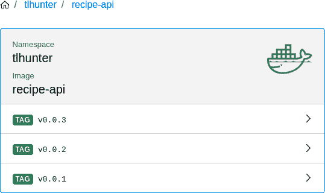

# 第五章：容器

程序通常不会在单个文件中捆绑它们所需的一切。这不仅适用于 Node.js 程序，它们至少由一个 *.js* 文件和 *node* 可执行文件组成，还适用于使用其他平台编译的程序。通常还涉及其他要求，如共享库。即使是用 C 语言编写的静态链接其依赖项的单一可执行二进制文件，在技术上仍依赖于内核提供的系统调用 API。

程序的分发和执行有许多不同的方法。每种方法都涉及到可移植性、效率、安全性和脆弱性的权衡。

有时“只需发布一个二进制文件”很好。但这意味着至少需要为不同的操作系统发布不同的二进制文件，有时（例如当一个二进制文件依赖于 OpenSSL 时）需要根据操作系统和库版本发布多个二进制文件。这是一个可移植性问题。

共享库存在的一个最大问题之一。考虑一台运行 Linux 操作系统的服务器。这台单一机器预期要运行两个软件，*调整大小服务 A* 和 *调整大小服务 B*。然而，一个版本依赖于 *ImageMagick v7*，而另一个则依赖于 *ImageMagick v5*。现在安装 ImageMagick 共享库不再是一件简单的任务；而是需要在不同的库版本之间进行隔离操作。这种情况非常脆弱。

运行多个程序可能会出现其他问题。也许两个程序需要在文件系统中维护一个锁文件，并且路径是硬编码的。或者这些程序希望监听同一个端口。或者可能其中一个程序被入侵，然后被攻击者用来干扰另一个程序，这是一个安全问题。

*虚拟机*（VMs）被创建来解决这些问题。虚拟机能够在主机操作系统内部仿真计算机硬件，具有对内存和磁盘空间的隔离子集的访问能力。安装在虚拟机中的操作系统能够完全隔离地运行程序，与主机操作系统无关。这是一个非常强大的概念，今天仍然非常重要。然而，它的缺点是每个运行的虚拟机都需要整个操作系统的副本。这也意味着新部署的虚拟机需要花费时间来启动客户操作系统。这种开销可能会导致每个程序专用一个虚拟机变得不切实际，这是一个效率问题。

*容器* 是描述并捆绑程序要求的一种方式，以可分发的包装形式提供。这包括私有文件系统及其中的共享库内容，隔离的 PID 列表和可以监听的隔离端口，而无需担心与另一个容器发生冲突，同时不允许访问其他容器的内存。唯一未捆绑在容器中的是操作系统本身，而是依赖于主机操作系统（或更具体地说，主机操作系统的内核）。容器内部的系统调用在提供给主机操作系统之前会进行轻微的转换。

图 5-1 比较了三种程序隔离方法。第一种方法，我称之为 *经典* 方法，依赖于直接在硬件上运行的操作系统上运行程序。在这种情况下，可能会出现与共享库的复杂协调。当部署新程序时可能需要系统管理员，或者组织可能需要同意在所有地方使用完全相同的依赖项。然而，其开销最小。第二种方法，*虚拟机*，涉及操作系统内核的冗余副本，可能为每个程序（尽管通常在同一个虚拟机内运行多个程序）。虚拟机的命名法将父操作系统称为 *主机操作系统*，将子操作系统称为 *客户操作系统*。第三种方法，*容器*，展示了容器抽象如何重用内核，但共享库可能会是冗余的。它还说明了需要更小的容器。

理想情况下，一个程序可以很快地被部署到任何地方，无论它需要什么依赖关系，然后可以消耗 CPU 和 RAM 并回应网络请求。一旦不再需要这个程序，可以快速地将其拆除，而不会留下任何混乱。

###### 注意

现代技术栈应至少利用这两种方法中的两种。虽然容器非常适合部署无状态的第一方程序，这些程序经常更新和部署，并且可以进行垂直和水平扩展，但是对于运行在操作系统上的有状态数据库来说，直接运行更为有利，无论是虚拟的还是其他类型的操作系统。


###### 图 5-1\. 经典 vs. 虚拟机 vs. 容器

容器已经赢得了程序封装的战斗。它们已经成为现代面向服务的架构中程序部署的基本单位。这种抽象层次具有共享库的冗余性但不具有操作系统的冗余性，这正好命中了内存效率和可移植性的最佳平衡点，同时又具有健壮性和安全性。已经存在几种不同的容器格式，但只有一种格式变得无处不在。

# Docker 简介

Docker 是一组相关工具的集合。首先要提到的工具是 `dockerd` 守护程序，它公开了一个用于接收命令的 HTTP API。下一个工具是 `docker` CLI，它调用守护程序，并且是你在本书中迄今为止与 Docker 交互的方式。Docker 的一个重要功能是 [Docker Hub](https://hub.docker.com/)，这是 Docker 镜像的中央仓库。虽然可能存在竞争的容器格式，但没有一个像它一样令人印象深刻的市场。

一个 Docker 镜像是一个不可变的文件系统表示，你可以在其中运行应用程序。一个 Docker 镜像也可以从另一个镜像扩展。例如，一个基本的 Ubuntu 镜像，接着是一个 Node.js 镜像，最后是一个应用程序镜像。在这种情况下，Ubuntu 镜像提供了基本的文件系统（*/usr/bin*、用户和权限以及常见库）。Node.js 镜像提供了 Node.js 需要的 *node* 和 *npm* 二进制文件和共享库。最后，应用程序镜像提供了 *.js* 应用程序代码，*node_modules* 目录（可能包括为 Linux 编译的模块），甚至其他应用程序特定的依赖项（比如编译的 ImageMagick 二进制文件）。

Docker 运行 Linux 应用程序。然而，在这些镜像层中实际上并没有提供 Linux 内核，甚至没有基本的 Ubuntu 镜像。相反，这最终来自于在 Docker 外部运行的 Linux 操作系统。当运行 Docker 的机器是 Linux 机器（这通常是服务器上运行的生产应用程序的工作方式），那么可能只涉及一个操作系统。当 Docker 运行在非 Linux 操作系统上，比如 macOS 或 Windows 开发机器上，那么需要一个 Linux 虚拟机。*Docker Desktop* 是 Docker 为这种情况创建的工具。Docker Desktop 不仅提供了一个虚拟机，还提供了其他便利功能，比如管理 UI 和 Kubernetes（在第七章中有更详细的介绍）。

一个 Docker 容器是与配置相关联的 Docker 镜像的实例，配置包括名称、端口映射和卷映射，这就是容器内的文件系统如何映射到主机文件系统的方式。这意味着你可以在单台机器上运行指向同一镜像的多个容器，只要你有足够的计算资源。容器可以以多种方式启动、停止和交互。

Docker 的一个重要方面是*Dockerfile*，它是描述 Docker 镜像的声明性文件。Dockerfile 可以包含许多不同的行，描述容器最终是如何构建的。指令被列在不同的行上，指令从上到下依次运行。第一个指令通常是`FROM`指令，这是一个图像声明要使用的父图像的方式。例如，官方 Node.js Alpine 容器使用`FROM alpine:3.11`作为 Dockerfile 的第一行。在这种情况下，它声明了名为`alpine`的 Docker 镜像标记为`3.11`版本是其基础容器。然后，应用程序可以通过使用`FROM node:lts-alpine3.11`指令来扩展该图像。这些指令将很快详细介绍。请注意，Docker 镜像不能有多个父 Docker 镜像——这里没有多重继承！但是可以有多个`FROM`指令，这被称为多阶段 Dockerfile。稍后会详细介绍这一点。

每个 Dockerfile 中的新指令都会创建一个新的*层*。层是在特定指令运行后图像的部分表示。每个层增加了存储大小，可能也增加了图像的启动时间。图 5-2 展示了图像和层之间的关系，以及它们如何对最终文件系统产生影响。因此，应用程序通常会将尽可能多的操作组合成尽可能少的行，通过链接命令。每个层可以被表示为其内容的哈希值，就像*git*在检出特定提交哈希时所做的那样。因此，如果 Dockerfile 中的一行预计会经常更改，应将其放在 Dockerfile 的后面。这将允许在应用程序的 Docker 镜像的多个版本之间重用先前的层。

Docker 镜像通常通过将文件系统缩小到应用程序所需的最小版本来进行性能调优。Ubuntu Linux 发行版旨在用于桌面和服务器的通用用途，可能相当庞大。Debian 是一个更轻量级的发行版，但它也包含许多整个服务器机器需要但在容器中不需要的工具。Alpine 是一个极度精简的 Linux 发行版，通常是存储意识开发人员的首选基础镜像。有时，一个应用程序确实依赖于这样一个简单基础镜像无法提供的功能，可能需要使用一个更复杂的基础镜像。[官方 Node.js Docker 镜像](https://hub.docker.com/_/node/)包含了 Debian 和 Alpine 的变体。


###### 图 5-2\. 图像包含层，层对文件系统有贡献

当您使用 Docker 图片工作时，例如之前运行的所有 `docker run` 命令，图片的一个版本将被下载并缓存在您的机器上。这与 `npm install` 的工作方式非常相似。npm 和 Docker 都会缓存远程文件，并可以跟踪这些文件的多个版本。Docker 甚至会跟踪图片的每一层。

要查看当前缓存在您机器上的 Docker 图片列表，请运行此命令：

```
$ docker images
```

然后，您应该看到一个图片列表。我看到的列表如下所示：

```
REPOSITORY                   TAG      IMAGE ID      CREATED       SIZE
grafana/grafana              6.5.2    7a40c3c56100  8 weeks ago   228MB
grafana/grafana              latest   7a40c3c56100  8 weeks ago   228MB
openzipkin/zipkin            latest   12ee1ce53834  2 months ago  157MB
openzipkin/zipkin-slim       2.19     c9db4427dbdd  2 months ago  124MB
graphiteapp/graphite-statsd  1.1.6-1  5881ff30f9a5  3 months ago  423MB
sebp/elk                     latest   99e6d3f782ad  4 months ago  2.06GB
```

这个列表暗示了很多事情——除了写一本书需要多少时间。首先，注意一些图片可以有多大。在 `sebp/elk` 的情况下，图片的大小超过了 2GB！另外，请注意 *TAG* 列。这一列引用版本。版本通常是三个值之一：一个版本字符串，字符串 `latest`（表示从注册表中下载时的最新版本），或者值 `<none>`，通常在为自己的软件构建图片但未提供版本字符串时发生。

每张图片都有两种引用方式。永久的方式是使用*图像 ID*。这个值应该始终引用完全相同的内容。另一种引用图片的方式是使用其仓库和标签名称。在我的结果中，`grafana/grafana` 仓库的 `6.5.2` 标签指向与 `latest` 标签相同的图片，因为它们具有相同的图片 ID。当我再过几周下载 `latest` 版本的 Grafana 时，可能会指向不同的图片 ID。

接下来，使用另一个命令来了解每个图片使用的层。这次运行以下命令（如果您的列表不同，请替换为不同的版本号）：

```
$ docker history grafana/grafana:6.5.2
```

然后您将看到图片不同的层的列表。我得到的结果看起来是这样的：

```
IMAGE         CREATED BY                                      SIZE
7a40c3c56100  /bin/sh -c #(nop)  ENTRYPOINT ["/run.sh"]       0B
<missing>     /bin/sh -c #(nop)  USER grafana                 0B
<missing>     /bin/sh -c #(nop) COPY file:3e1dfb34fa628163…   3.35kB
<missing>     /bin/sh -c #(nop)  EXPOSE 3000                  0B
<missing>     |2 GF_GID=472 GF_UID=472 /bin/sh -c mkdir -p…   28.5kB
<missing>     /bin/sh -c #(nop) COPY dir:200fe8c0cffc35297…   177MB
<missing>     |2 GF_GID=472 GF_UID=472 /bin/sh -c if [ `ar…   18.7MB
<missing>     |2 GF_GID=472 GF_UID=472 /bin/sh -c if [ `ar…   15.6MB
<missing>     |2 GF_GID=472 GF_UID=472 /bin/sh -c apk add …   10.6MB
... <TRUNCATED RESULTS> ...
<missing>     /bin/sh -c #(nop) ADD file:fe1f09249227e2da2…   5.55MB
```

在这种情况下，在截断列表之前，[Grafana 版本 6.5.2 图片](https://github.com/grafana/grafana/blob/v6.5.2/Dockerfile) 由 15 个不同的层组成。该列表与 Dockerfile 中的步骤反向对应；列表中较早的条目是 Dockerfile 中较后的行。`docker history` 命令显示的列表仅包括查询的特定图片的步骤，而不包括任何父图片的步骤。

`docker pull` 命令用于从远程仓库下载图片。运行以下命令以下载这样的图片：

```
$ docker pull node:lts-alpine
```

这将开始下载最新 LTS 发行版的 Alpine 变体的层。在我的情况下，我看到以下输出：

```
lts-alpine: Pulling from library/node
c9b1b535fdd9: Pull complete
750cdd924064: Downloading [=====>           ]  2.485MB/24.28MB
2078ab7cf9df: Download complete
02f523899354: Download complete
```

在我的情况下，有四个文件大小大于 0 的层被下载（一些层不会修改文件系统，因此不会被列为已下载）。

Debian 变体比 Alpine 变体大得多。例如，这个 LTS Alpine 镜像大小为 85.2MB。如果你使用`**docker pull node:lts**`命令下载 Debian 变体，你会发现它的大小大约是 913MB。需要记住的一件事是，这些层最终会在不同的机器上被缓存使用。如果你部署一个使用 Debian 变体的应用程序，第一次部署时，服务器需要下载近 800MB 的 Debian 基础镜像。然而，对于后续的部署，Debian 层已经存在，部署速度会更快。

对于大型镜像，存储并不是唯一的关注点。另一个需要考虑的问题是安全性。如果一个在 Debian 中运行的 Node.js 应用程序被黑客攻击，文件系统中会有很多可执行的实用程序。然而，如果一个基于 Alpine 的应用程序被入侵，可执行的二进制文件会更少。理论上，这将导致更小的攻击面。

###### 提示

作为经验法则，如果你的应用程序可以使用 Alpine[¹]，就使用 Alpine 吧！如果你的应用程序需要一些共享库，那就在你的 Alpine 镜像中安装这些库。只有对于复杂的应用程序，你才应考虑使用像 Debian 或者 Ubuntu 这样更重的基础容器。

现在你对 Docker 背后的一些理论更加熟悉了，是时候开始运行更多的容器了。对于这个第一个示例，你将运行一个纯净的 Ubuntu 容器，而不用打包一个应用程序进去。本书的前几节已经这样做过。不过，这次你将以交互模式运行容器。运行以下命令进入 Ubuntu 容器内的交互`bash`会话：

```
$ docker run -it --rm --name ephemeral ubuntu /bin/bash
```

`-i`标志表示会话是交互式的，而`-t`标志表示 Docker 应该使用一个 TTY 会话（作为一个约定，它们已经组合成`-it`）。这两个标志设置为使会话交互式。`--rm`标志告诉 Docker 在退出时删除容器的所有痕迹。`--name`标志为容器设置一个名称，在列表中有助于识别它。参数`ubuntu`是正在运行的镜像的名称（实际上是`ubuntu:latest`的翻译）。`/bin/bash`的最终参数是 Docker 将在容器内执行的二进制文件。

一旦 Docker 下载了必要的层，你应该看到你的终端提示符发生变化。在这一点上，你可以在正在运行的容器内执行命令。运行命令`**ps -e**`。这将列出容器内当前正在运行的所有进程。当我运行这个命令时，得到的输出看起来像这样：

```
PID TTY          TIME CMD
  1 pts/0    00:00:00 bash
 10 pts/0    00:00:00 ps
```

容器内的根进程，PID 值为 1 的进程是`bash`。只有第二个进程也在运行，即`ps`。如果在更传统的 Linux 服务器上运行相同的命令，根进程可能是更复杂的*服务管理器*，如`systemd`或`init`。还会列出数十甚至数百个其他进程。服务管理器处理诸如读取配置文件、运行服务及管理其相互依赖性、以及在子进程失败时以可配置的方式管理进程重启等任务。简而言之，它们是管理完整操作系统所需的复杂工具。

在 Docker 容器内，这种服务管理功能通常过于复杂，应该使用更简单的程序。对于交互式 shell，`bash`作为根进程就足够了。然而，在更复杂的情况下，您可能需要使用其他程序。例如，有时在 Docker 容器内运行*sidecar 进程*是有益的。Sidecar 是执行某些任务的外部进程，例如提供代理以便应用程序更轻松地进行服务发现，或者提供健康检查守护程序以轮询应用程序的健康统计信息，并将统计信息中继到另一个服务中。在这些情况下，重启策略变得非常重要。例如，如果 sidecar 崩溃，可能只需重新启动它，但如果主应用程序崩溃，则整个容器应退出。在这些情况下，您可能需要研究一种允许进行细粒度配置的替代服务管理器。

现在切换到新的终端窗口，并运行以下命令：

```
$ docker ps
```

这个 Docker 子命令与容器内运行的`ps`命令不同，但在精神上，两个命令都意在列出当前运行的*东西*的快照。当我运行此命令时，输出看起来像这样：

```
CONTAINER ID  IMAGE   COMMAND      CREATED         PORTS  NAMES
527847ba22f8  ubuntu  "/bin/bash"  11 minutes ago         ephemeral
```

请注意，如果您仍在运行其他容器，则可能会看到更多条目。

在当前运行的 Docker 容器中手动执行命令是完全可能的。如果需要调试运行失控的 Node.js 应用程序，这将非常有用。执行此操作的子命令是`exec`。切换到新的终端窗口，并运行**`docker exec ephemeral /bin/ls /var`**命令，以在运行中的 Ubuntu 容器内执行新命令。您刚刚在容器中执行了第二个命令，而不会干扰其他命令。

现在您可以自由地退出容器。切换回运行 Docker 容器的终端，并键入`**exit**`。容器将被关闭，并且由于使用了`--rm`标志，它将从您的系统中完全移除。再次运行**`docker ps`**将证明它已不再运行。但是，为了证明它已经不在您的系统上，请运行**`docker ps --all`**命令。您将看到结果中列出了几个条目，尽管您之前创建的*ephemeral*容器将不会在其中列出。

###### 提示

此时，您可能希望删除一些不再使用的旧容器，因为它们会占用磁盘空间。要从计算机中删除容器，您可以运行**`docker rm <name/id>`**命令，使用十六进制容器标识符或人性化的容器名称。类似地，您可以运行**`docker images`**命令以查看计算机上仍然可用的所有镜像列表。然后，您可以运行**`docker rmi <image id>`**以删除任何未使用的镜像。请注意，您无法删除当前由容器使用的镜像；必须先删除容器。

如果外部应用程序无法与其接口，那么容器的用处并不大。幸运的是，Docker 提供了两种重要的方法来实现这一点。第一种方法是通过在运行容器内的部分文件系统与主机操作系统中的部分文件系统共享来实现。这是通过使用`-v` / `--volume`或`--mount`标志（前两个是彼此的别名，第三个标志接受更详细的语法，但它们本质上是相同的）来实现的。另一种与容器接口的方法是通过使用`-p` / `--publish`标志将容器内的端口映射到主机操作系统中。

执行以下命令下载示例*index.html*文件并运行已配置为从该目录读取的 nginx 容器：

```
$ rm index.html ; curl -o index.html http://example.org
$ docker run --rm -p 8080:80 \
  -v $PWD:/usr/share/nginx/html nginx
```

`volume`和`publish`标志都具有详细的语法，用于配置主机和容器之间映射的方式。例如，可以指定卷映射是只读的还是端口映射应该是 UDP。这两个标志还支持简单的语法，其中主机上的资源与客户端上的资源映射到合理的默认值。您刚才运行的命令同时为卷映射和端口映射使用了这种简单的语法。在此示例中，使用`-p 8080:80`将主机上的端口 8080 映射到容器中的端口 80。当前目录使用`-v $PWD:/usr/share/nginx/html`标志映射到 nginx 用于读取静态文件的目录（`-v`标志需要绝对目录，这就是为什么命令使用`$PWD`而不是“`.`”）。

现在 nginx 容器正在运行，请在浏览器中访问[*http://localhost:8080/*](http://localhost:8080/)以查看渲染的*index.html*页面。`volume mount`标志在运行需要持久状态的数据库服务时非常有用。但是，对于 Node.js 应用程序来说，将主机文件系统挂载是不那么常见的，因为这些服务应该以无状态方式运行。因此，您可能不需要在应用程序中使用`volume`标志。

# Node.js 服务容器化

在本节中，你将为 *recipe-api* 服务创建一个 Docker 容器。这个容器将用于两个不同的目的。第一个目的是安装包，第二个目的是设置运行 Node.js 应用程序的环境。这两个操作听起来很相似，但正如你将看到的那样，保持这两个概念的分离非常重要。

使用 Docker 来安装项目的包，一开始听起来可能有点奇怪。现在，在你的 *recipe-api* 目录下，已经有一个 *node_modules* 目录，其中包含运行应用程序所需的所有模块！为什么这些模块不够好呢？

大部分情况下，这归结于通过包管理器安装的包不仅仅是下载 JavaScript 文件并将其放在文件系统上。相反，从 npm 注册表安装包实际上是一个相当非确定性的操作。首先，如果一个 npm 包涉及本地代码，比如 C++ 文件，那么该代码将需要编译。不能保证在你的本地开发机上编译的输出与 Linux Docker 环境（例如本地开发机可能是 macOS 或 Windows 机器，或者是具有不同共享库版本的 Linux 机器）兼容。

如果你曾部署过一个应用程序，然后看到很多错误日志提到了`chokidar`或`fsevents`包，那可能是因为将 macOS 的 *node_modules* 目录部署到了 Linux 服务器上。这种不确定性的另一个原因是包的 `postinstall` 和 `preinstall` 脚本，它们可以运行包作者喜欢的任意代码。有时这被用来下载互联网上的二进制文件。因此，包的安装必须在与最终运行代码相似的环境中进行。

作为安装步骤的一部分，以及准备执行环境的一部分，需要从项目文件所在的目录中复制一些文件。就像 git 有 *.gitignore* 文件和 npm 有 *.npmignore* 文件一样，Docker 也有自己的 *.dockerignore* 文件。这个文件类似于其他文件，指定了应被忽略的文件模式。在 Docker 中，匹配这些模式的文件不会被复制到容器中。忽略这些文件是方便的，因为稍后在指定要复制的文件时可以使用通配符。在 *recipe-api/.dockerignore* 中创建一个新文件，并将 Example 5-1 中的内容添加到其中。

##### Example 5-1\. *recipe-api/.dockerignore*

```
node_modules
npm-debug.log
Dockerfile
```

这个文件中的条目与你可能在其他 Node.js 项目的 *.gitignore* 中已经有的文件非常相似。就像你不希望将 *node_modules* 目录提交到 git 一样，你也不希望这些包被复制到 Docker 镜像中。

## 依赖阶段

现在是考虑 Dockerfile 本身的时候了。这个例子将使用多阶段的 Dockerfile。第一阶段将构建依赖项，第二阶段将准备应用程序容器。构建阶段将基于官方 Node.js Docker 镜像。这个镜像旨在满足尽可能多的 Node.js 开发者的需求，提供他们可能需要的工具。例如，它包括 npm 和 yarn 包管理器。因此，它是构建应用程序的构建阶段的一个非常有用的基础镜像。

在*recipe-api/Dockerfile*中创建一个新文件，并将内容从示例 5-2 添加到其中。保持文件打开，因为你稍后将会添加更多内容。

##### 示例 5-2\. *recipe-api/Dockerfile* “deps” 阶段

```
FROM node:14.8.0-alpine3.12 AS deps

WORKDIR /srv
COPY package*.json ./
RUN npm ci --only=production
# COPY package.json yarn.lock ./
# RUN yarn install --production
```

这个文件的第一行，以`FROM`开头，指定了`node:14.8.0-alpine3.12`镜像作为基础。如果这是整个文件中唯一的`FROM`指令，它将成为结果镜像的基础。但是，由于稍后将添加另一个`FROM`指令，它只是构建的第一阶段的基础镜像。此行还指定构建的第一阶段被命名为`deps`。这个名称将在下一个阶段中非常有用。

`WORKDIR /srv` 表示接下来的操作将在 */srv* 目录内进行。这类似于在 Shell 中运行`cd`命令，改变当前工作目录。

接下来是`COPY`语句。语句的第一个参数表示主机文件系统，第二个参数表示容器内的文件系统。在这种情况下，命令指定匹配`package*.json`（具体为*package.json*和*package-lock.json*）的文件将被复制到容器内的`./`目录（即*/srv*目录）。或者，如果你更喜欢使用 yarn，你可以复制*yarn.lock*文件。

接下来是`RUN`命令。此命令将在容器内执行指定的命令。在这种情况下，它执行`npm ci --only=production`命令。这将对所有非开发依赖项进行干净的安装。一般来说，当处理类似 Docker 镜像这样的干净环境时，`npm ci`命令比`npm install`要快。或者，如果你使用 yarn，你可以运行`yarn install --production`。同样，由于继承自官方`node`基础镜像，镜像中都提供了`npm`和`yarn`二进制文件。

###### 提示

有些人喜欢在构建的早期阶段安装开发依赖项并运行测试套件。这可以增加对生成镜像没有错误的信心。但是，由于这可能涉及两个单独的`npm install`步骤（一个带有开发依赖项，一个没有），它并不一定能找到所有的错误，比如如果应用程序代码错误地需要一个开发依赖项。

## 发布阶段

现在你可以开始处理 Dockerfile 的下半部分了。将内容从示例 5-3 添加到你正在处理的同一*recipe-api/Dockerfile*文件中。

##### 示例 5-3\. *recipe-api/Dockerfile* “release”阶段第一部分

```
FROM alpine:3.12 AS release

ENV V 14.8.0
ENV FILE node-v$V-linux-x64-musl.tar.xz

RUN apk add --no-cache libstdc++ \
  && apk add --no-cache --virtual .deps curl \
  && curl -fsSLO --compressed \
  "https://unofficial-builds.nodejs.org/download/release/v$V/$FILE" \
  && tar -xJf $FILE -C /usr/local --strip-components=1 \
  && rm -f $FILE /usr/local/bin/npm /usr/local/bin/npx \
  && rm -rf /usr/local/lib/node_modules \
  && apk del .deps
```

与 Dockerfile 的第一个*deps*阶段不同，构建的第二个*release*阶段没有使用官方 Node.js 镜像。相反，它使用了一个相对简单的`alpine`镜像。原因是官方 Node.js 镜像提供的某些便利在生产应用中是不需要的。例如，一旦依赖项解决，应用程序很少再调用`npm`或`yarn`二进制文件。直接使用`alpine`镜像可以使镜像稍微小一些，更简单一些。它还有助于演示更复杂的 Dockerfile 指令。

接下来的两行定义了其他指令使用的环境变量。这是一种方便的方法，可以防止文件中重复使用常见字符串。第一个变量称为`V`，表示版本。在本例中，Dockerfile 正在使用 Node.js *v14.8.0*。第二个变量称为`FILE`，是要下载的 tar 包的名称。

在环境变量之后是一系列复杂的命令，将使用`RUN`指令在容器内部执行。Dockerfile 声明将执行多个命令，但它们都包装在一个单独的`RUN`指令中，以保持中间层的数量较少。行尾的反斜杠表示下一行仍然是同一行的一部分，而`&&`表示正在运行新的命令（如果前一个命令失败，则不应运行后续命令）。

Alpine 操作系统配备了一个称为`apk`的包管理器，`RUN`指令中的前两个命令使用它来安装软件包。通过运行`apk add`来安装软件包。`--no-cache`标志告诉`apk`不要留下任何跟踪安装的软件包管理文件，这有助于保持镜像尽可能小。第一个安装的软件包是`libstdc++`。该软件包提供 Node.js 所需的共享库。第二个软件包是`curl`。此软件包仅在设置期间需要，并且稍后将被删除。`--virtual .deps`标志告诉`apk`跟踪安装的软件包及其依赖项。稍后，可以一次性删除该组软件包。

接下来的命令在容器内部执行`curl`，并下载 Node.js 发布的 tar 包。然后，`tar`命令解压 tar 包的内容到*/usr/local*。tar 包不包括 yarn，但包括 npm，因此接下来的`rm`命令删除 npm 及其依赖的文件。最后，`apk del .deps`命令删除`curl`及其依赖项。

这是 Dockerfile 中最复杂的部分。现在从 示例 5-4 添加最终内容，其中包含 *release* 阶段的后半部分指令。

##### 示例 5-4\. *recipe-api/Dockerfile* “release” 阶段第二部分

```
WORKDIR /srv
COPY --from=deps /srv/node_modules ./node_modules
COPY . .

EXPOSE 1337
ENV HOST 0.0.0.0
ENV PORT 1337
CMD [ "node", "producer-http-basic.js" ]
```

再次设置工作目录为 `/srv`。这是 Linux 服务器上的常见约定，但否则，应用程序代码几乎可以位于任何位置。

不过，更有趣的一行是以下 `COPY` 指令。 `--from` 标志指示 `COPY` 指令从镜像构建过程的另一个阶段复制文件，而不是像通常那样从主机操作系统文件系统复制。这就是多阶段构建的魔力所在。在本例中，从 `deps` 阶段复制 */srv/node_modules* 目录到 `release` 容器内的 */srv/node_modules* 目录。这确保了包是为正确的架构构建的。

下一个 `COPY` 指令将文件从当前目录（*.*）复制到 */srv* 目录（*.*，`WORKDIR` 设置为 */srv*）。这是 *.dockerignore* 文件发挥作用的地方。通常，*node_modules* 也会被复制，覆盖刚从 `deps` 阶段复制过来的 *node_modules*。请注意，在这个示例应用程序的情况下，每一个 *producer-*.js* 文件都将被复制到镜像中。技术上，只需要其中一个文件即可运行服务。但 `COPY .` 的方法更适用于真实的应用程序。

###### 警告

总的来说，使用 `COPY .` 将应用程序文件复制到 Docker 镜像是一个不错的方法。需要注意的一个警告是，这会复制每一个未被忽略的文件，包括 *Dockerfile* 本身，可能是一个庞大的 *.git* 目录（如果在项目根目录运行）。甚至会复制文本编辑器使用的临时文件！

因此，您需要勤奋地向 *.dockerignore* 文件添加条目，并且偶尔查看 Docker 镜像的文件系统（例如使用 **`docker exec <name> ls -la /srv`**）。您还应考虑仅在专用构建服务器上构建 Docker 镜像，而不是在本地开发机器上进行。

每个应该复制的文件都有特定的 `COPY` 指令可能也存在风险。例如，您的应用程序可能需要一个运行时读取的 JSON 文件，但没有显式复制，导致图像中的错误。

`EXPOSE` 指令是一种文档化镜像计划使用特定端口（此处为 1337）进行监听的方式。这并不会实际打开端口给外部世界；相反，当从镜像运行容器时才会执行这一操作。

两个`ENV`指令设置环境变量，这些变量这次将由应用程序本身使用。具体来说，`HOST`和`PORT`环境变量是服务用来决定监听哪个接口和端口的。应用程序默认监听`127.0.0.1`接口。保持不变将意味着应用程序只监听来自*Docker 容器内部*的请求，而不是来自主机生成的请求，这并不是非常有用。

最后，Dockerfile 以一个`CMD`指令结束。这是声明在运行容器时应该执行什么命令的一种方式。在这种情况下，将执行`node`二进制文件，并且它将运行*producer-http-basic.js*文件。这个命令可以在运行时被覆盖。

这个镜像还远非完美。官方的 Node.js 容器虽然稍微重一些，但也提供了其他一些便利之处。例如，当它们下载编译后的 Node.js tarballs 时，它们还会对它们进行校验和，以确保文件没有被篡改。它们还会创建一个专门的用户并设置文件系统权限以运行 Node.js 应用程序。你可以决定你的应用程序需要哪些功能。

## 从镜像到容器

Dockerfile 完成后，现在是从 Dockerfile 构建镜像的时候了。Dockerfile 及其支持文件存在于磁盘上，并且通常被检入版本控制。从它们生成的映像由 Docker 守护程序管理。

运行示例 5-5 中的命令，进入*recipe-api*目录，然后构建一个 Docker 镜像。

##### 示例 5-5. 从 Dockerfile 构建镜像

```
$ cd recipe-api
$ docker build -t tlhunter/recipe-api:v0.0.1 .
```

这个`docker build`命令有一个标志和一个参数。标志是`-t`标志，表示镜像的*标签*。在本例中，使用的标签有三部分，遵循`repository/name:version`的模式。在这种情况下，仓库是命名空间镜像名称的一种方式，是*tlhunter*。名称表示镜像的实际内容，在这种情况下是*recipe-api*。版本用于区分镜像的不同发布版本，是`v0.0.1`。

关于版本，镜像不一定需要遵循特定的模式。在这种情况下，我选择了使用类似*SemVer*版本字符串的值，这是许多 Node.js 开发者熟悉的值。然而，应用程序通常不像包一样有一个 SemVer 版本分配给它们。一个常见的方法是简单地使用一个整数，每次新建容器时递增一个值。如果未提供版本，Docker 将提供一个默认的版本标签`latest`。一般来说，您应该始终提供一个版本。

在此命令运行时，您将会看到每个 Dockerfile 指令构建一个新层时的输出。每一个层都会打印其哈希值及其指令。命令完成时，我得到的输出看起来像这样：

```
Sending build context to Docker daemon  155.6kB
Step 1/15 : FROM node:14.8.0-alpine3.12 AS deps
 ---> 532fd65ecacd
... TRUNCATED ...
Step 15/15 : CMD [ "node", "producer-http-basic.js" ]
 ---> Running in d7bde6cfc4dc
Removing intermediate container d7bde6cfc4dc
 ---> a99750d85d81
Successfully built a99750d85d81
Successfully tagged tlhunter/recipe-api:v0.0.1
```

一旦镜像构建完成，您就可以基于此镜像运行一个容器实例。每个容器实例都附带有元数据，用于区分它与其他正在运行的容器。运行以下命令从您的容器创建一个新的运行容器实例：

```
$ docker run --rm --name recipe-api-1 \
  -p 8000:1337 tlhunter/recipe-api:v0.0.1
```

此命令使用 `--rm` 标志来清理容器一旦运行完毕。 `--name` 标志将此容器命名为 `recipe-api-1`。 `-p` 标志将主机的 8000 端口映射到容器内 Node.js 应用程序正在监听的 1337 端口。最后一个参数是运行镜像的标签。

一旦您运行了该命令，您将会看到服务输出到屏幕上的一些信息。记录的第一条信息是容器内进程的 PID。在这种情况下，它打印出 `worker pid=1`，这意味着它是容器内的主进程。接下来打印的信息是服务正在监听的地址 *http://0.0.0.0:1337*。这是 Node.js 服务在 *容器内* 可用的接口和端口。

###### 注意

请记住，服务认为它可用的地址与客户端用于联系它的地址不同。这可能会影响需要向客户端报告其 URL 的服务（例如提供其他资源 URL 的 API）。在这些情况下，您可以提供一个包含外部主机和端口组合的环境变量，供服务传递给消费者使用。

现在您已经准备好确认服务是否运行。由于容器将内部的 1337 端口映射到主机的 8000 端口，因此在发出请求时需要使用主机的端口。运行以下命令向您的容器化服务发出请求：

```
$ curl http://localhost:8000/recipes/42
```

一旦运行该命令，您应该会看到熟悉的 JSON 数据作为响应。如果您更改命令以使用端口 1337，则会收到连接被拒绝的错误。

不幸的是，由于该容器的设置方式，您无法键入 Ctrl + C 来停止运行容器。相反，您需要在新的终端窗口中运行以下命令来终止服务：

```
$ docker kill recipe-api-1
```

## 重新构建和版本化镜像

现在您已经构建了应用程序镜像并运行了一个容器，您可以修改应用程序并生成第二个版本了。应用程序随时都在变化，重要的是能够重新打包这些不同版本的应用程序并运行它们。保留旧版本的应用程序也很重要，因此如果新版本有问题，可以快速恢复到旧版本。

在*recipe-api*目录中，再次运行示例 5-5 中显示的`docker build`命令。这次，注意当命令运行时创建的层。这将作为检查构建应用程序的效果以及修改如何改变结果 Docker 镜像的基准。在我的情况下，看到的层如下：

```
532fd65ecacd, bec6e0fc4a96, 58341ced6003, dd6cd3c5a283, e7d92cdc71fe,
4f2ea97869f7, b5b203367e62, 0dc0f7fddd33, 4c9a03ee9903, a86f6f94fc75,
cab24763e869, 0efe3d9cd543, 9104495370ba, 04d6b8f0afce, b3babfadde8e
```

接下来，通过将路由处理程序替换为示例 5-6 中的代码，对.*recipe-api/producer-http-basic.js*文件（应用程序的入口点）进行更改。

##### 示例 5-6。*recipe-api/producer-http-basic.js*，已截断

```
server.get('/recipes/:id', async (req, reply) => {
  return "Hello, world!";
});
```

现在，从示例 5-5 中运行`build`命令。注意输出并修改命令以使用*v0.0.2*的版本标签。在我的情况下，现在看到的层如下：

```
532fd65ecacd, bec6e0fc4a96, 58341ced6003, dd6cd3c5a283, e7d92cdc71fe,
4f2ea97869f7, b5b203367e62, 0dc0f7fddd33, 4c9a03ee9903, a86f6f94fc75,
7f6f49f5bc16, 4fc6b68804c9, df073bd1c682, f67d0897cb11, 9b6514336e72
```

在这种情况下，镜像的最后五层已更改。具体来说，从`COPY . .`行及以下的所有内容都已更改。

接下来，恢复*producer-http-basic.js*文件的更改，将请求处理程序恢复到之前的状态。然后，通过运行以下命令修改应用程序构建过程的较早阶段：

```
$ npm install --save-exact left-pad@1.3.0
```

通过安装新软件包，*package.json*和*package-lock.json*文件的内容将会不同。因此，Docker 将知道不要重用与早期`COPY`指令将这些文件复制到`deps`阶段的现有层相关的层。它知道不要重用缓存的层，因为表示在层中的文件系统的哈希将会不同。再次运行示例 5-5 命令，这次使用*v0.0.3*的版本标签，以查看更改对镜像构建过程的影响。在我的情况下，现在看到的层如下：

```
532fd65ecacd, bec6e0fc4a96, 959c7f2c693b, 6e9065bacad0, e7d92cdc71fe,
4f2ea97869f7, b5b203367e62, 0dc0f7fddd33, 4c9a03ee9903, b97b002f4734,
f2c9ac237a1c, f4b64a1c5e64, fee5ff92855c, 638a7ff0c240, 12d0c7e37935
```

在这种情况下，`release`镜像的最后六层已更改。这意味着从`COPY --from=deps`指令及以下的所有内容都已更改。此外，`deps`阶段的最后两层也已更改。由于`deps`阶段的层不直接影响基于`release`阶段的整体镜像，所以这部分并不那么重要。

那么，五层和六层的这种区别究竟意味着什么？嗯，每一层都为代表 Docker 镜像的整体层堆栈贡献了不同的文件系统条目。运行以下命令查看您的应用程序*v0.0.1*版本的每个层的大小：

```
$ docker history tlhunter/recipe-api:v0.0.1
```

某些指令不会对文件系统大小产生贡献，大小为 0B。例如，`ENV`、`CMD`、`EXPOSE` 和 `WORKDIR` 指令对不具有文件大小的层次进行了关联。其他指令则有所贡献。例如，`FROM ... release` 指令对生成的图像贡献了约 5.6MB。`RUN apk add` 指令增加了 80MB。从 `COPY . .` 指令得到的实际应用程序代码仅对图像贡献了约 `140kB`。然而，在应用程序更新中最有可能变化的部分是 `COPY --from=deps` 指令。对于这个示例应用程序，*node_modules* 目录包含了大量不需要的条目，因为它包含了其他项目文件的包，如 GraphQL 和 gRPC 包。在这种情况下，它的大小约为 68MB。大多数使用 Node.js 编写的项目由约 3% 的第一方应用程序代码和约 [97% 的第三方代码](https://slides.com/seldo/npm-and-the-future-of-javascript/#/8) 组成，因此这种文件大小比例并不过分。

表格 5-1 包含了你创建的三个不同应用程序版本的摘要。*层次* 列包含层次编号和指令运行的简称。*大小* 列包含该层次的大小。技术上，三个应用程序版本的层次大小有所不同，例如在安装 `left-pad` 包时，但层次大小差异基本可以忽略，所以只显示了 *v0.0.1* 图像中的层次大小。最后，版本号下的列包含该层次的哈希值。如果哈希与先前版本有所不同，则用粗体显示。

更改应用程序代码的效果，即 *v0.0.2* 列中的第 11 层，当将图像 *v0.0.2* 部署到已有图像 *v0.0.1* 的服务器时，需要额外增加 138kB 的空间。通过更改某一层的内容，每个依赖于它的后续层也会发生变化。由于第 12 至 15 层不会对整体文件大小产生影响，因此仅导致总体增加了 138kB。

表 5-1\. Docker 图像层比较

| 层次 | 大小 | v0.0.1 | v0.0.2 | v0.0.3 |
| --- | --- | --- | --- | --- |
| 1: `FROM node AS deps` | N/A | `532fd65ecacd` | `532fd65ecacd` | `532fd65ecacd` |
| 2: `WORKDIR /srv` | N/A | `bec6e0fc4a96` | `bec6e0fc4a96` | `bec6e0fc4a96` |
| 3: `COPY package*` | N/A | `58341ced6003` | `58341ced6003` | **`959c7f2c693b`** |
| 4: `RUN npm ci` | N/A | `dd6cd3c5a283` | `dd6cd3c5a283` | **`6e9065bacad0`** |
| 5: `FROM alpine AS release` | 5.6MB | `e7d92cdc71fe` | `e7d92cdc71fe` | `e7d92cdc71fe` |
| 6: `ENV V` | 0 | `4f2ea97869f7` | `4f2ea97869f7` | `4f2ea97869f7` |
| 7: `ENV FILE` | 0 | `b5b203367e62` | `b5b203367e62` | `b5b203367e62` |
| 8: `RUN apk ...` | 79.4MB | `0dc0f7fddd33` | `0dc0f7fddd33` | `0dc0f7fddd33` |
| 9: `WORKDIR /srv` | 0 | `4c9a03ee9903` | `4c9a03ee9903` | `4c9a03ee9903` |
| 10: `COPY node_modules` | 67.8MB | `a86f6f94fc75` | `a86f6f94fc75` | **`b97b002f4734`** |
| 11: `COPY . .` | 138kB | `cab24763e869` | **`7f6f49f5bc16`** | **`f2c9ac237a1c`** |
| 12: `EXPOSE` | 0 | `0efe3d9cd543` | **`4fc6b68804c9`** | **`f4b64a1c5e64`** |
| 13: `ENV HOST` | 0 | `9104495370ba` | **`df073bd1c682`** | **`fee5ff92855c`** |
| 14: `ENV PORT` | 0 | `04d6b8f0afce` | **`f67d0897cb11`** | **`638a7ff0c240`** |
| 15: `CMD` | 0 | `b3babfadde8e` | **`9b6514336e72`** | **`12d0c7e37935`** |
| 每次部署成本 |  | N/A | 138kB | 68MB |

更改安装包的影响是 *v0.0.3* 列的第 10 层，将需要向已安装 *v0.0.2* 或甚至 *v0.0.1* 的服务器发送额外的 67.8MB 数据。

通常，Node.js 应用程序代码的变化频率要比 *package.json* 文件（因此也就是 *node_modules* 中的条目）高得多。通过 `apk` 命令安装的操作系统包更不可能改变。因此，通常希望将复制应用程序文件的指令放在复制 *node_modules* 的指令之后，后者又应该放在安装操作系统包的指令之后。

最后需要注意的是，您经常会看到 Docker 容器标记为 `latest` 的版本。如果要在构建镜像时使此标记可用，您可以将每个镜像构建两次。第一次构建镜像时，为其提供一个版本字符串。然后第二次构建时，不要提供版本字符串。当省略版本时，Docker 将填充为 `latest`，但这可能会让人感到困惑。例如，如果您将一个镜像标记为 `v0.1.0`，同时将其标记为 `latest`，然后回头再标记一个镜像为 `v0.0.4` 并将其标记为 `latest`，那么 `latest` 标签不会指向最高版本的镜像（`v0.1.0`），而是指向最近生成的镜像（`v0.0.4`）。因此，有时最好不要将镜像标记为 `latest`，而只发布带有确切版本号的镜像。

# 使用 Docker Compose 进行基本编排

Docker 是一种方便的工具，用于打包服务的依赖关系，无论是像 Postgres 这样的稳定后端存储还是每天都在变化的高动态 Node.js 应用程序。通常，其中一个服务将依赖于另一个服务的运行。事实上，到目前为止您构建的 *web-api* 和 *recipe-api* 服务就是这种情况的典型示例。

迄今为止，通过这些服务，您需要手动复制并粘贴 shell 命令来启动依赖服务，但是管理项目的这种脚本集合可能变得难以控制。每个`docker run`命令可能需要多个配置标志，特别是如果它们依赖于卷挂载和复杂的端口分配。

有时，多个服务被打包到同一个容器中。在 “使用 ELK 进行日志记录” 中使用的 *sebp/elk* 镜像就是这样，提供了 Elasticsearch、Logstash 和 Kibana 的集成。在本地开发机上使用这种方法有时是有意义的，特别是当使用密切相关的服务时，它确实简化了这些服务的实例化过程。但是在处理应用程序代码时，将后端服务与主应用程序捆绑在一起就不太合适了。

考虑一个依赖于 Redis 的 Node.js 服务。将 Redis 与应用程序捆绑在一起可以使在本地运行应用程序变得更加容易。但是在生产环境中，多个服务可能需要使用同一个 Redis 实例，这种便利性就不再适用了。那时，你需要创建两个 Dockerfile——一个将 Redis 与本地开发结合在一起，另一个则不包含 Redis 用于生产环境；或者使用单一的 Dockerfile，根据设置的标志选择性地启动 Redis。使用多个 Dockerfile 的方法意味着需要维护两个文件——这些文件可能会意外地分歧。而使用单个 Dockerfile 的方法则意味着你会在生产环境中运送一些不必要的内容。

幸运的是，有另一种工具可以管理这些容器之间的关系。事实上，这个工具之前已经在 “通过 Docker 运行 Cabot” 中使用过。这个工具就是 *Docker Compose*。Docker Compose 已经集成在 Docker Desktop 中。如果你在 Linux 上使用 Docker，则需要单独安装它。查看 附录 B 获取更多信息。

Docker Compose 允许通过使用单个声明性的 *docker-compose.yml* 文件配置多个依赖的 Docker 容器。该文件包含可以表示为 `docker run` 标志的相同配置数据，以及这些容器之间的依赖关系图等其他信息。

## 组合 Node.js 服务

现在是时候将你一直在处理的那对应用程序转换为使用 Docker Compose 运行了。在本节中，你将使用你在 “使用 Zipkin 进行分布式请求跟踪” 中创建的服务的 Zipkin 变体。这些服务的依赖图在 图 5-3 中可视化。在这种情况下，*web-api* 服务依赖于 *recipe-api* 服务，而这两个服务都依赖于 Zipkin。


###### 图 5-3\. 消费者、生产者和 Zipkin 依赖图

完成本节后，你将能够通过执行单个命令来运行所有三个服务。在一个较大的组织中，这种方法可以用来简化部分后端堆栈的本地开发。

首先，将你在示例 5-1 中创建的*recipe-api/.dockerignore*文件复制到*web-api/.dockerignore*。这个文件相当通用，对于两种应用程序都很有用。

接下来，你将创建一个更简单的 Dockerfile 变体。这个版本不执行所有强大的多阶段工作，以创建像在“容器化一个 Node.js 服务”中涵盖的那样的瘦身镜像，但它足够简单，可以快速启动两个新的应用程序。在*recipe-api/Dockerfile-zipkin*中创建一个文件，包含示例 5-7 中的内容。

##### 示例 5-7\. *recipe-api/Dockerfile-zipkin*

```
FROM node:14.8.0-alpine3.12
WORKDIR /srv
COPY package*.json ./
RUN npm ci --only=production
COPY . .
CMD [ "node", "producer-http-zipkin.js" ] # change for web-api
```

一旦你创建了那个文件，将其复制到*web-api/Dockerfile-zipkin*，然后修改最后一行的`CMD`指令以执行正确的*consumer-http-zipkin.js*文件。

当运行像`docker build`这样的特定命令时，它们假定配置是使用名为*Dockerfile*的文件完成的，但是你已经在*recipe-api*中有一个运行*producer-http-basic.js*服务的*Dockerfile*。在像这样的项目中存在多个配置的情况下，惯例是将文件命名为*Dockerfile-**。各种`docker`子命令接受一个标志来指定不同的 Dockerfile。

通过初步工作，你现在可以开始创建*docker-compose.yml*文件了。如果你的服务依赖于其他服务，你可能会发现自己将这个文件检入源代码仓库。在这种情况下，在*distributed-node/*目录的根目录中创建文件。然后，从示例 5-8 中添加内容开始。

##### 示例 5-8\. *docker-compose.yml*，第一部分

```
version: "3.7"
services:
  zipkin: 
    image: openzipkin/zipkin-slim:2.19 
    ports: 
      - "127.0.0.1:9411:9411"
```


此行定义了一个名为“zipkin”的服务。


这是镜像的名称。


此服务的端口映射。

这只是 Docker Compose 文件的开始。第一个`version`键声明文件正在使用的 Compose 文件版本。官方 Docker 网站[维护 Compose 版本与 Docker 版本](https://docs.docker.com/compose/compose-file/)兼容矩阵。Docker 偶尔会添加不向后兼容的功能。在这种情况下，文件使用的是版本 3.7，这与至少 Docker 版本 18.06.0 兼容。

其后是`services`键，其中包含文件管理的服务列表。服务基本上是指一个容器，尽管一个服务在技术上可以引用多个复制的容器实例。在 Compose 文件的第一部分中，已声明了*zipkin*服务。在每个服务定义内部都有进一步的键值对，就像用于*zipkin*服务的两个所用的那样。

`image`键是引用将用作服务模板的图像的一种方式。对于*zipkin*服务，将使用*openzipkin/zipkin-slim*镜像。该值等效于传递给`docker run`的参数。

`ports`关键字用于定义端口映射。在这种情况下，容器中的端口 9411 将映射到主机的端口 9411，并且只能从主机内部访问。此条目与`docker run`命令的`-p`标志对应。

现在第一个服务已经定义好了，请将示例 5-9 的内容添加到您的*docker-compose.yml*文件中以添加第二个服务。

##### 示例 5-9\. *docker-compose.yml*，第二部分

```
## note the two space indent
  recipe-api:
    build: 
      context: ./recipe-api
      dockerfile: Dockerfile-zipkin
    ports:
      - "127.0.0.1:4000:4000"
    environment: 
      HOST: 0.0.0.0
      ZIPKIN: zipkin:9411
    depends_on: 
      - zipkin
```


不使用命名图像，而是提供 Dockerfile 的路径。


服务使用的环境变量对。


*zipkin*服务应在此容器之前启动。

此服务条目代表*recipe-api*服务，比*zipkin*服务复杂一些。

首先，`image`条目已被更复杂的`build`对象替换。`image`对于引用已在其他地方构建的镜像很有用。但是，`build`对象允许 Docker Compose 在调用时将 Dockerfile 构建成镜像。该`build`对象内部有两个键。第一个是`context`，指的是构建镜像的目录，本例中是*recipe-api*子目录。当配置文件名称不是*Dockerfile*时，`dockerfile`键是必需的，在本例中指向*Dockerfile-zipkin*文件。

`environment`对象包含键/值对，其中键是环境变量的名称，值是环境变量的值。在本例中，`HOST`值被覆盖为 0.0.0.0，以便应用程序接受来自 Docker 容器外部的请求。`ZIPKIN`环境变量指的是应用程序将与之通信的主机/端口组合，本例中是*zipkin*主机名和 9411 端口。

初始主机名可能看起来有点可疑。它来自哪里？Docker 不应该使用类似`localhost`的东西吗？默认情况下，任何 Docker 服务都可以使用服务名称访问任何其他服务。`depends_on`指令确保容器按特定顺序启动。还有其他可用指令可以更改一个容器在另一个容器中的主机名。

现在您可以向*docker-compose.yml*文件添加最终的服务定义了。将示例 5-10 的内容添加到描述*web-api*服务中。

##### 示例 5-10\. *docker-compose.yml*，第三部分

```
## note the two space indent
  web-api:
    build:
      context: ./web-api
      dockerfile: Dockerfile-zipkin
    ports:
      - "127.0.0.1:3000:3000"
    environment:
      TARGET: recipe-api:4000
      ZIPKIN: zipkin:9411
      HOST: 0.0.0.0
    depends_on:
      - zipkin
      - recipe-api
```

最后一块拼图完成后，告诉 Docker Compose 通过运行以下命令启动您的服务：

```
$ docker-compose up
```

一旦完成这些步骤，你需要等待一分钟，直到输出稳定下来。在此期间，将启动这三个服务。一旦事情平静下来，可以在另一个终端窗口依次运行三个`curl`命令来生成一些请求：

```
$ curl http://localhost:3000/
$ curl http://localhost:4000/recipes/42
$ curl http://localhost:9411/zipkin/
```

第一个`curl`命令确认*web-api*服务正在监听请求。接下来的命令确认*recipe-api*也正在监听请求。最后一个命令确认 Zipkin 正在运行并且也在监听请求。

###### 提示

假设此 Docker Compose 文件是为了本地开发中的*web-api*服务而创建的，你技术上不需要将*zipkin*和*recipe-api*端口暴露给主机。换句话说，省略*recipe-api*的`ports`字段仍然允许*web-api*向*recipe-api*发出请求。但根据我的经验，将上游服务的端口暴露出来可以更轻松地调试故障服务。

Docker Compose 提供了一种描述多个容器之间配置和关系的便捷方式。然而，它以相当静态的方式描述这些关系。它不帮助动态增加或减少运行中服务的数量，也不帮助部署服务的更新版本。简而言之，它非常适合本地开发，但在部署动态应用程序到生产环境时有些欠缺。第七章描述了部署应用程序到生产环境的更强大方法。

此时，你可以删除由 Docker Compose 创建的服务。切换到运行它的终端窗口，并按下 Ctrl + C 来终止它。完成后，运行以下命令来删除这些服务：

```
$ docker rm distributed-node_web-api_1 \
  distributed-node_recipe-api_1 distributed-node_zipkin_1
```

# 内部 Docker 注册表

*Docker 注册表*是存储 Docker 镜像及其伴随层的地方。默认情况下，Docker CLI 配置为使用[Docker Hub](https://hub.docker.com/)，即 Docker 的官方公共注册表。在本书中，你已经下载了托管在 Docker Hub 上的各种镜像，从 ELK 堆栈到官方 Node.js 镜像。在 Docker 领域，开源项目应该有它们的镜像在 Docker Hub 上可用的惯例。

这对于上传和下载公共的开源项目非常有用。你甚至可以在 Docker Hub 上创建一个帐户，在本文撰写时，你可以免费托管一个私有仓库。你还可以选择升级到付费帐户，以更多地托管私有仓库，每个仓库的成本大约为一美元。

###### 提示

到目前为止，您一直在使用的 `repository/name:version` 约定实际上是命令 `server/repository/name:version` 的简写。当省略 `server` 部分时，Docker CLI 默认使用 *docker.io* 的 Docker Hub 仓库。`repository` 部分也有默认值。例如，命令 **`docker pull node:14.8.0-alpine3.12`** 也可以用更简洁的版本 **`docker pull docker.io/library/node:14.8.0-alpine3.12`** 表示。

许多组织选择托管自己的内部 Docker Registry。根据仓库的数量，这可能比使用 Docker Hub 更昂贵或更便宜。还有非成本方面的要求。例如，将服务锁定在企业防火墙后以达到安全/合规目的可能很重要。许多组织需要能够在外部公共服务（如 Docker Hub）不可用或无法访问时部署应用程序。

## 运行 Docker Registry

Docker 提供了一个官方的 [Docker Registry](https://docs.docker.com/registry/) Docker 镜像，可用于运行一个自托管的服务，用于存储 Docker 镜像。反过来，Docker CLI 工具可以配置为与此注册表通信，使您和组织内其他人员能够存储和与私有镜像交互。

到目前为止，Docker 并不是运行您已使用的许多后端服务的最佳方法，假设它们需要处理生产流量。例如，Graphite 和 StatsD 在生产中可能接收到如此高的负载，以至于在 Docker 中运行它们的开销可能无法跟上。然而，Docker Registry 并不根据您的公共面向应用程序接收的流量量来接收负载。相反，它可能每天只接收几百个请求，因为镜像被构建和部署。因此，在 Docker 容器中运行 Docker Registry 完全没问题。

运行以下命令以启动 Docker Registry 的副本：

```
$ docker run -d \
  --name distnode-registry \
  -p 5000:5000 \
  --restart=always \
  -v /tmp/registry:/var/lib/registry \
  registry:2.7.1
```

此命令几乎适用于生产使用，尽管您需要将卷挂载到比 */mnt/* 更永久的位置。您还希望保持它不被公开访问，以启用 TLS 终止，并在放置任何敏感内容之前甚至在启用身份验证。

`-d` 标志将服务分叉到后台运行。这在生产环境中非常有用，但如果启动注册表遇到问题，您可能希望省略该标志。

现在您的注册表已经运行起来了，是时候发布您正在工作的一些镜像了。之前在“容器化 Node.js 服务”中，您创建了同一 *recipe-api* 应用程序的三个版本。您将使用这些带标签的镜像为注册表提供一些新鲜数据。

有两组命令你需要为每个带标签的镜像运行。第一组是`docker image tag`，这是一种为已经有标签的镜像指定新标签的方法。这对于指定一个标签的镜像应该发布到哪个服务器非常有用，比如你的新 Docker 注册表服务。运行以下命令三次，每次为你之前创建的每个应用程序版本运行一次：

```
# run for each of v0.0.1, v0.0.2, v0.0.3
$ docker image tag tlhunter/recipe-api:v0.0.1 \
  localhost:5000/tlhunter/recipe-api:v0.0.1
```

## 推送和拉取到注册表

完成后，你几乎可以发布你在本地开发机器上构建的镜像到 Docker 注册表上。从技术上讲，你正在运行注册表与你在其上构建镜像的同一台机器上，但即使你在本地运行注册表服务，这些命令也可以工作。事实上，甚至当你在本地运行注册表服务时，它仍然与本地机器上的 Docker 守护程序隔离开来。

在运行这些命令之前，请回想一下关于镜像层大小的结论，该结论在表格 5-1 中有所涉及。根据这些数据，部署*v0.0.2*之后部署*v0.0.1*的额外成本是数百千字节。然而，部署*v0.0.3*在部署*v0.0.2*之后是数十兆字节。运行下一组命令时请记住这一点。

你将用来将镜像发送到 Docker 注册表的命令以`docker push`开头。这很像运行`git push`或`npm publish`，它会将镜像的本地副本发送到远程服务器上。运行以下命令三次，每次为你的应用程序的每个版本运行一次：

```
# run for each of v0.0.1, v0.0.2, v0.0.3
$ time docker push localhost:5000/tlhunter/recipe-api:v0.0.1
```

这个命令已经用`time`命令前缀了，它会打印复制镜像所花费的时间。表格 5-2 列出了每个镜像在我的机器上部署所花费的时间。

表格 5-2\. Docker 镜像部署时间

| 版本 | 时间 |
| --- | --- |
| v0.0.1 | 4.494 秒 |
| v0.0.2 | 0.332 秒 |
| v0.0.3 | 3.035 秒 |

首次部署耗时最长，因为需要复制所有基础镜像，比如 Alpine 镜像和第一个迭代的*node_modules*。第二次部署最快，因为只涉及小的应用程序更改。第三次较慢，因为需要一个新的*node_modules*迭代。总体而言，几秒钟的部署时间可能看起来不算太糟糕，但在生产环境中，你会看到大型镜像被复制，可能会达到数百兆字节，并且它们可能会在不同的机器之间通过网络复制。真正的要点是更改*node_modules*目录导致部署时间增加了十倍。

当你的应用程序镜像安全存储在 Docker 注册表中时，现在是模拟需要将镜像下载到新服务器的情况的时候了。这可以通过从本地机器上移除镜像的副本来完成。运行以下命令，首先从你的机器上删除镜像，然后尝试从丢失的镜像启动一个容器：

```
$ docker rmi localhost:5000/tlhunter/recipe-api:v0.0.2
$ docker rmi tlhunter/recipe-api:v0.0.2
$ docker run tlhunter/recipe-api:v0.0.2 # should fail
```

标签最终指向一个镜像，由镜像的哈希引用。第一个`docker rmi`命令删除指向镜像的标签，但是镜像文件仍然存在于磁盘的某个地方。运行第二个命令后，对镜像的最终引用被删除，并且磁盘上的实际文件也被删除。调用`docker run`将失败，因为引用的标签已不存在。此错误消息应该类似于*Unable to find image *tlhunter/recipe-api:v0.0.2* locally*。Docker CLI 将尝试从公共仓库获取镜像，并且假设我没有意外地在我的`tlhunter`帐户下发布了这样的镜像，也将失败。

现在，你的机器类似于一个全新的服务器，上面没有存储*recipe-api:v0.0.2*镜像（技术上说，它确实有一些层，但没有完整的镜像）。现在是时候从 Docker Registry 下载镜像到你的机器上了，就像你部署应用程序到服务器上一样。运行以下命令模拟此过程：

```
$ docker pull localhost:5000/tlhunter/recipe-api:v0.0.2
$ docker image tag localhost:5000/tlhunter/recipe-api:v0.0.2 \
  tlhunter/recipe-api:v0.0.2
$ docker run tlhunter/recipe-api:v0.0.2 # this time it succeeds
```

第一个`docker pull`命令将镜像下载到你的机器上。镜像的名称是包含*localhost:5000*服务器前缀的完全限定名称。接下来的`docker image tag`命令使用较短的名称使镜像可用。最后的`docker run`命令使用较短的名称别名执行容器的副本。技术上，你可以跳过第三步并使用完整名称的`docker run`，但这样做可以使用之前的相同运行命令。

## 运行 Docker Registry UI

到目前为止，你已经能够完全使用 Docker CLI 工具与 Docker Registry 进行交互。这对于以编程方式执行操作当然很方便，但有时候使用 UI 浏览镜像更加便利。Docker Registry 镜像并不带有 UI。这可能是因为 Docker 更希望你购买其付费产品，这些产品带有 UI。

有几个项目提供 Docker Registry UI，其中大多数出乎意料地运行在 Docker 容器内。运行以下命令启动提供 Docker Registry UI 的容器：

```
$ docker run \
  --name registry-browser \
  --link distnode-registry \
  -it --rm \
  -p 8080:8080 \
  -e DOCKER_REGISTRY_URL=http://distnode-registry:5000 \
  klausmeyer/docker-registry-browser:1.3.2
```

此容器不需要任何持久性，并配置为一旦完成运行就会被删除。`--link` 和 `-e DOCKER_REGISTRY_URL` 标志允许它直接连接到你已经运行的 Docker Registry。这个容器应该很快启动。一旦准备就绪，请在浏览器中访问[*http://localhost:8080*](http://localhost:8080)。

网页加载完成后，应该能看到一个包含你推送的镜像命名空间的屏幕。在这种情况下，你应该看到一个名为*tlhunter*的单个工作区。这个工作区应该列出一个名为*recipe-api*的镜像条目，这是目前唯一推送的镜像。点击该条目。

在接下来的屏幕上，您应该看到与此镜像相关的标签列表。由于您已经为此镜像推送了三个标签，您应该看到列出的*v0.0.3*、*v0.0.2*和*v0.0.1*，类似于图 5-4 中显示的内容。

点击您心仪的任何标签。在接下来的屏幕上，您将看到关于该特定标签的更多信息，例如创建时间、镜像哈希、与镜像关联的环境变量，甚至是镜像使用的层（及其关联的文件大小）。甚至还有一个名为“历史”的部分，其中包含与运行`docker history`相同的信息。



###### 图 5-4\. Docker Registry 浏览器截图

现在您已经完成了本节，是时候进行一些清理工作了。可以通过在其终端窗口中运行 Ctrl + C 来终止 Registry Browser 容器。Docker Registry 本身将需要另一步骤，因为它在后台运行。运行以下命令来停止容器：

```
$ docker stop distnode-registry
$ docker rm distnode-registry
```

^(1) Alpine 使用*musl*而不是*glibc*作为其 C 标准库，这可能会导致兼容性问题。

^(2) 该文件的这一部分以一些注释符号开头。这是为了避免前导空格引起的歧义，因为这可能导致 YAML 错误。
