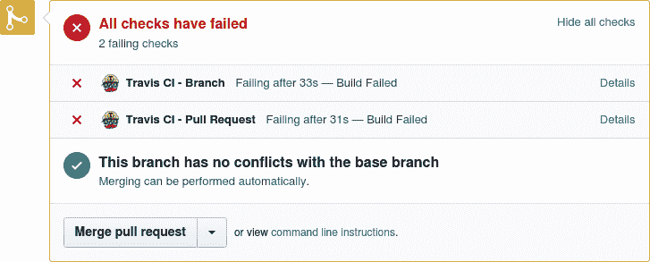
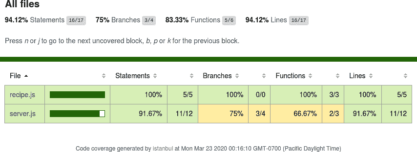
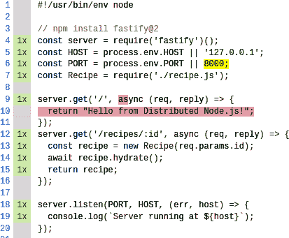
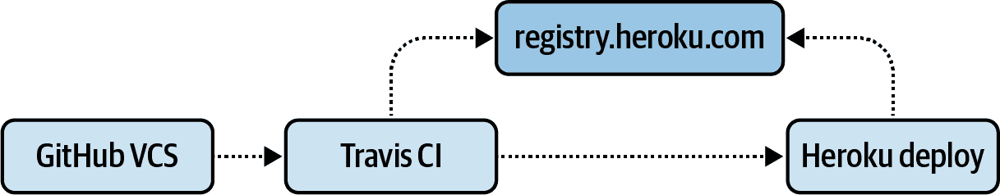
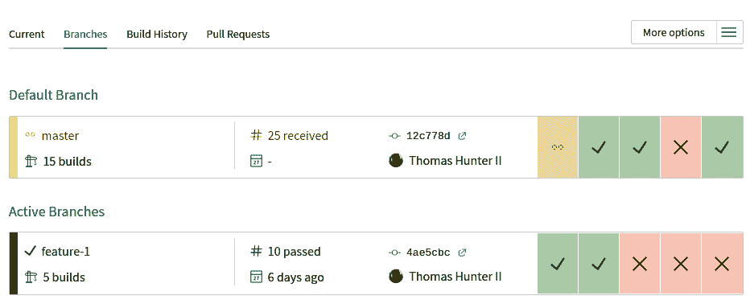
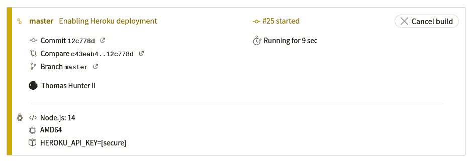

# 第六章：部署

*部署*，简而言之，是将代码从一个位置移动到另一个位置。对于某些平台，这只是复制一堆文件的简单过程。例如，许多应用程序可以通过复制原始源代码文件（如 PHP、Python 和 Perl 脚本）进行部署，随后的 HTTP 请求将自动执行更新后的文件。静态站点通常以相同的方式部署。更复杂的持续运行的应用程序需要额外的步骤来停止和启动进程。这些示例包括发布 Node.js 源文件、编译的 Go 二进制文件或 Python 脚本。^(1)

现代应用程序*应该*通过侦听端口使其可消耗（参见[*https://12factor.net/port-binding*](https://12factor.net/port-binding)以获取详细信息）。无论应用程序是在传统上由 Web 服务器调用的平台上编写的（例如 PHP，您可能会在 Docker 容器中包含 Apache 和 PHP），还是在 Node.js 中编写的（其中进程直接侦听请求，希望仍然涉及外部反向代理）。当源代码文件发生更改时，Node.js 进程可以重新启动。像`nodemon`和`forever`这样的包为使本地开发更轻松提供了这种功能。^(2)

在实践中，部署比“只是复制一些文件”要正式得多。部署过程通常由许多阶段组成，其中复制应用程序代码只是最后阶段的一部分。还需要进行其他操作，例如从版本控制检出源代码、安装依赖项、构建/编译、运行自动化测试等。部署应用程序所需的阶段集合被称为*构建流水线*。

通常，软件开发中最重要的部分之一是管理构建流水线的关键组件。一种流行的软件类别是*持续集成*（CI）服务。持续集成是一种软件开发实践，即对应用程序进行的自包含更改不断进行测试、合并到主干分支并部署。CI 服务器负责管理构建流水线，使这一过程成为可能。

无论用于管理构建流水线的工具是什么，几乎所有地方都会使用一些通用概念：

构建

构建是将应用程序代码库的快照（例如特定的 Git 提交）转换为可执行形式的过程。这可能涉及使用 Babel 转译代码，从 npm 安装依赖项，甚至生成 Docker 镜像。

发布

发布是将特定构建与配置设置结合的过程。例如，一个构建可以发布到分别具有两种不同配置的暂存和生产环境。

构件

构件是在构建流水线的某个阶段生成的文件或目录。这可以是多个阶段之间使用的内容，如 Docker 镜像，也可以是构建的副产品，例如由`nyc`包生成的代码覆盖报告。

每个新版本发布都应有其自己的名称。此名称应为一个递增的值，例如整数或时间戳。当将更新的应用程序部署到服务器时，这意味着新文件（表示一个发布的文件）被复制到服务器，应用程序被执行，并且之前的发布被取消。

在进行这些操作时，保留若干之前的发布版本非常重要。如果发现新发布有问题，工程师应能够回滚到之前的版本，这称为 *回滚* 操作。保留之前的发布可以简单地通过在 Docker 仓库中保留旧的 Docker 镜像来实现。

现在，您已经熟悉了关于持续集成和构建流水线的一些概念，是时候熟悉特定的持续集成服务了。

# 使用 Travis CI 构建流水线

本书主要考虑开源工具，特别是您可以自行运行的工具。然而，由于部署到远程服务的特性，接下来的几节将使用平台即服务（PaaS）工具的免费套餐。主要是为了避免您花费在服务器托管或域名注册等方面的资金，以及尽快让您开始运行。

在本节中，您需要设置两个账户。第一个是 [GitHub](https://github.com)。您可能已经有 GitHub 账户，甚至每天都在使用。GitHub 是全球最流行的基于 Git 版本控制托管项目的服务。大多数 npm 包，甚至 Node.js 运行时本身，都托管在 GitHub 上。您还需要第二个账户，即 [Travis CI](https://travis-ci.com)，作为注册的一部分，需要将其与您的 GitHub 账户关联。Travis 是一种流行的持续集成构建流水线服务。它也被 Node.js 和许多流行的 npm 包使用。

现在您的账户已经准备就绪，是时候在 GitHub 上创建一个新的仓库了。访问 GitHub 网站，点击导航栏中的加号符号。这将带您到[创建一个新仓库](https://github.com/new)的页面。在此页面，命名仓库为 *distnode-deploy*。设置可见性为公共。描述为 *分布式 Node.js 示例项目*。选择初始化仓库使用默认的 *README.md* 文档。同时，使用下拉菜单选择 Node.js 的默认 *.gitignore* 文件，并添加 MIT 许可证。选择完这些选项后，点击 *创建仓库* 按钮。

## 创建一个基本项目

一旦你的仓库准备好了，使用终端导航到 *distributed-node/* 目录。然后，通过以下命令进行 git 仓库的检出，替换 `<USERNAME>` 为你的 GitHub 用户名：

```
$ git clone git@github.com:<USERNAME>/distnode-deploy.git
$ cd distnode-deploy
```

现在你进入了创建的仓库内部，初始化一个新的 npm 项目，并为该项目安装一个 Web 服务器包。你可以通过运行以下命令来完成：

```
$ npm init -y
$ npm install fastify@3.2
```

接下来，创建一个新的 *distnode-deploy/server.js* 文件。这将是一个相对简单的服务，遵循你之前使用过的类似模式。修改文件，使其内容包含 示例 6-1 中的代码。

##### 示例 6-1\. *distnode-deploy/server.js*

```
#!/usr/bin/env node

// npm install fastify@3.2
const server = require('fastify')();
const HOST = process.env.HOST || '127.0.0.1';
const PORT = process.env.PORT || 8000;
const Recipe = require('./recipe.js');

server.get('/', async (req, reply) => {
  return "Hello from Distributed Node.js!";
});
server.get('/recipes/:id', async (req, reply) => {
  const recipe = new Recipe(req.params.id);
  await recipe.hydrate();
  return recipe;
});

server.listen(PORT, HOST, (err, host) => {
  console.log(`Server running at ${host}`);
});
```

还要创建另一个名为 *distnode-deploy/recipe.js* 的文件。这个文件代表应用程序使用的模型。修改文件，使其包含 示例 6-2 中的代码。

##### 示例 6-2\. *distnode-deploy/recipe.js*

```
module.exports = class Recipe {
  constructor(id) {
    this.id = Number(id);
    this.name = null;
  }
  async hydrate() { // Pretend DB Lookup
    this.name = `Recipe: #${this.id}`;
  }
  toJSON() {
    return { id: this.id, name: this.name };
  }
};
```

在这个过程中，同时修改 *distnode-deploy/package.json* 文件，以便在运行 `npm test` 命令时能够成功通过。你可以通过修改文件并覆盖 `scripts` 部分中的 `test` 字段来实现这一点，内容如下：

```
"scripts": {
  "test": "echo \"Fake Tests\" && exit 0"
},
```

最后，创建一个 *distnode-deploy/.travis.yml* 文件。这将用于控制 Travis CI 在与仓库交互时的行为。将 示例 6-3 的内容添加到该文件中。

##### 示例 6-3\. *distnode-deploy/.travis.yml*

```
language: node_js
node_js: 
  - "14"
install: 
  - npm install
script: 
  - PORT=0 npm test
```


本项目将使用 Node.js v14。


安装时运行的命令。


测试时运行的命令。

这些文件代表应用程序的早期版本。随着时间的推移，你将对它们进行各种更改。创建文件后，通过运行以下命令将它们添加到 git 并推送到 *master* 分支：

```
$ git add .
$ git commit -m "Application files"
$ git push
```

现在你已经将应用程序更改推送到 GitHub。切换回你在浏览器中打开 GitHub 项目页面的地方并刷新。此时，你应该看到你修改过的文件的更新列表。

## 配置 Travis CI

现在，你的 GitHub 仓库中已经有了一些内容，你可以配置 Travis 与之集成了。在浏览器中打开 [*https://travis-ci.com*](https://travis-ci.com) 网站。接下来，点击导航栏右上角的头像图标，选择设置选项。这将带你到 [仓库设置页面](https://oreil.ly/OR86K)。

在这个页面上，你应该看到一个按钮，用于激活 GitHub 应用集成。点击激活按钮开始授权 Travis 和你的仓库进行工作。

然后，您将被带到 GitHub 网站，您可以选择启用哪些存储库。默认情况下，选择“所有存储库”选项。如果您想要与其他存储库一起使用 Travis，请随意保留此选项。否则，请单击“仅选择存储库”选项。选择此选项后，您将能够搜索存储库。找到并选择 *distnode-deploy* 存储库。然后，单击屏幕底部的“批准并安装”按钮。

然后，您将被带回 Travis 界面中的存储库设置页面。这一次，您应该看到 Travis 可以访问的 GitHub 托管存储库列表。特别是，您现在应该看到列出的 *distnode-deploy* 存储库。单击存储库名称旁边的“设置”按钮。

这将带您到 *distnode-deploy* 项目的设置页面。默认情况下，它配置为构建推送的分支和构建推送的拉取请求。这些默认设置是可以接受的。

## 测试拉取请求

现在您的仓库已配置为针对拉取请求运行命令，现在是时候试试了。当前，当您运行 `npm test` 时，测试将通过。因此，您现在将模拟一个拉取请求，导致测试失败。理想情况下，在这种情况下，应阻止合并拉取请求。

切换回项目文件，并修改 *package.json* 文件。这一次，修改测试行，使其看起来如下所示：

```
"scripts": {
  "test": "echo \"Fake Tests\" && exit 1"
},
```

修改文件后，请创建一个新分支，添加文件，提交更改并将其推送到 GitHub。您可以通过运行以下命令来完成：

```
$ git checkout -b feature-1
$ git add .
$ git commit -m "Causing a failure"
$ git push --set-upstream origin feature-1
```

现在切换回到您的 *distnode-deploy* 存储库的 GitHub 项目页面。GitHub 检测到您已推送一个分支，并显示一个横幅以创建拉取请求，假设您在“Code”或“Pull requests”选项卡上。请注意，如果横幅不存在，您可能需要刷新页面。单击横幅中的“比较并拉取请求”按钮，基于您推送的分支创建拉取请求。

这将带您到创建拉取请求的屏幕。分支合并选项应显示，您正在尝试将名为 *feature-1* 的分支合并到名为 *master* 的分支中。此屏幕上的默认设置是可以接受的。单击“创建拉取请求”按钮，以正式创建拉取请求。

这将带您进入第一个拉取请求的拉取请求屏幕。取决于您创建拉取请求的速度以及 Travis CI 构建服务器的繁忙程度，您将看到零个、一个或两个失败。请记住，在项目的 Travis 设置屏幕上，启用了构建分支选项。因此，即使在创建拉取请求之前，Travis 也能够立即开始测试代码。在我的屏幕上，拉取请求检查看起来像 Figure 6-1。



###### 图 6-1\. GitHub 拉取请求失败

到目前为止，在拉取请求中显示的消息并不是特别有用。它确实显示了某些内容失败了，但并没有准确说明失败的原因。Travis 确实提供了更详细的输出，但需要点击几次才能找到。在每个失败检查旁边都有一个名为“详细信息”的链接。点击 Travis CI-Pull Request 检查旁边的“详细信息”链接。

现在您应该在 GitHub 屏幕上看到有关失败的拉取请求检查的更多详细信息。此屏幕提供了有关失败的拉取请求测试的更多信息，但仍然比较高层次，显示了作为检查一部分运行的单个作业的信息。此屏幕上一个重要的按钮是“重新运行检查”按钮。这将允许您在保持相同构建设置的同时多次重复检查。在测试易错的情况下非常有用。但是，点击该按钮不会修复这个特定的测试，因为它是硬编码以失败。

在检查失败面板中，有一个名为“构建失败”的部分。紧接着这部分是一些文字说明“构建失败”，其中“构建”是一个链接；点击它。

这一次，您被带到了 Travis CI 网站。在此屏幕上，您应该看到所有子检查的列表。这个屏幕非常有用，可以显示测试的各种排列组合。例如，您可以配置测试使用不同版本的 Node.js 运行应用程序，环境变量，架构，甚至不同的操作系统（尽管其中一些功能需要付费账户）。点击第一个失败行。

您现在正在查看有关特定“作业”的详细信息，这是 Travis 用来指代代码已执行的特定上下文的术语。在这种情况下，应用程序是使用 Node.js v14 在 AMD64 平台上执行的。在作业概览部分下面是令人兴奋的内容。Travis 运行的所有命令的终端输出都显示在这里。通过查看这些输出，您可以看到从 Travis 设置环境的步骤到`npm install`命令的输出。更重要的是，您可以看到`npm test`命令的输出。在我的情况下，我看到以下输出：

```
$ npm test
> distnode-deploy@1.0.0 test /home/travis/build/tlhunter/distnode-deploy
> echo "Fake Tests" && exit 1
Fake Tests
npm ERR! Test failed.  See above for more details.
The command "npm test" exited with 1.
```

恭喜！您现在为项目启用了一个非常简单的构建流水线。当然，目前它还不是那么有用，因为它只运行了一个虚拟测试。在下一节中，您将创建一些有用的测试，重新创建一些大型组织可能实施的质量控制措施。暂时保持您的失败拉取请求未合并；您很快就会修复它。

# 自动化测试

现代应用程序消费者期望持续获得新功能和 bug 修复。为了给他们提供这样的体验，您所工作的应用程序需要持续集成。应用程序更改需要充分的测试，以便开发团队——以及整个组织——有信心支持这样的系统。季度发布与严格的质量保证时间表只适用于最过时的行业。相反，测试需要以自动化方式进行，并应用于每一个变更。

测试代码在合并到主分支之前有许多方法。本节介绍了其中一些方法，特别是它们如何应用于 Node.js 应用程序。但在应用这些方法之前，您首先需要设置一个测试框架。

npm 上有许多可用的测试框架。其中一些非常强大，会将全局变量注入测试文件并需要特殊的可执行文件来运行。其他的则更简单，但可能需要更多的手动调整以满足您的需求。在本节的示例中，您将使用*Tape*，一个流行而简单的测试框架，来优化您的*distnode-deploy*拉取请求。

首先，您需要一个目录来存放测试文件。最常见的模式是创建一个*test/*目录，并将包含测试的 JavaScript 文件添加到此目录中。您还需要安装 Tape。运行以下命令来完成这些操作：

```
$ mkdir test
$ npm install --save-dev tape@5
```

注意使用安装命令时的`--save-dev`参数。这确保了`tape`包作为开发依赖安装。这是因为生产版本的应用程序不应该部署带有测试框架的版本。

在创建测试时，您将创建独立的 JavaScript 文件，并将它们放在*test/*目录中。在本节中，您最终将只有两个单独的测试文件，并且理论上，您可以硬编码这些文件的路径并运行它们。但是对于像真实生产应用程序中使用的那些复杂测试套件，维护这样一个列表将会很困难且容易出错。相反，使用 glob 模式运行*test/*目录中的任何 JavaScript 文件。修改*package.json*文件，使测试命令看起来像以下内容：

```
"scripts": {
  "test": "tape ./test/**/*.js"
},
```

这配置了`npm test`命令以运行由`tape`包提供的`tape`可执行文件。当 npm 包声明它们提供一个可执行文件时，npm 将在*node_modules/.bin/*目录中使它们可用。稍后，当您执行 npm 运行脚本时，npm 将自动检查该目录以获取可执行文件。这就是为什么`npm test`命令能够运行`tape`命令，即使在您的 shell 中直接运行`tape`应该会导致“命令未找到”错误。

`./test/**/*.js`参数是一个 glob 模式，这意味着在*test/*目录中以*.js*结尾的任何文件，无论嵌套多深，都将被用作参数。Tape 不会注入任何神奇的全局变量，测试文件可以直接执行，但是`tape`二进制文件提供了一些其他便利功能，你的拉取请求将依赖于此。例如，如果任何单个测试文件失败，则整体测试运行将失败。

现在，基础工作已经完成，你可以准备创建你的第一个测试了。

## 单元测试

*单元测试*是一种模式，其中测试单个代码单元（通常对应一个函数）。这些测试适用于所有形式的代码，从 npm 包到完整的应用程序。单元测试应该测试代码库中的每个角落和缝隙。这些测试应该覆盖函数逻辑的每个分支，传入各种预期的参数，甚至测试失败条件。

逻辑分支指的是像 if/else 语句、switch 语句、循环体等等。基本上，应用程序可以选择运行一组代码或另一组代码的任何地方都被视为分支。在为真实应用程序创建测试时，请确保为每种情况创建单元测试。

有几种方法可以布置应用程序*test/*目录中的文件。对于较大的应用程序，让*test/*目录结构与应用程序的目录结构相似是非常常见的。例如，如果一个应用程序有一个*src/models/account.js*文件，那么它可能还会有一个*test/models/account.js*文件来对其进行测试。然而，对于这个示例项目，你只需要一个单元测试文件。在你的*test/*目录中创建一个名为*unit.js*的文件。在此文件中，添加示例 6-4 中的内容。

##### 示例 6-4\. *distnode-deploy/test/unit.js*

```
#!/usr/bin/env node 
// npm install -D tape@5 const test = require('tape');
const Recipe = require('../recipe.js'); 

test('Recipe#hydrate()', async (t) => { 
  const r = new Recipe(42);
  await r.hydrate();
  t.equal(r.name, 'Recipe: #42', 'name equality'); 
});

test('Recipe#serialize()', (t) => {
  const r = new Recipe(17);
  t.deepLooseEqual(r, { id: 17, name: null }, 'serializes properly');
  t.end(); 
});
```


应用程序代码已加载用于测试。


每个测试都有一个名称和一个函数。


断言两个值是否相等。


Tape 需要知道基于回调的测试何时完成。

此单元测试文件中包含两个测试用例。第一个标题为*Recipe#hydrate()*，第二个标题为*Recipe#serialize()*。这些测试被命名，以便在控制台中输出它们正在测试的内容。使用异步函数的测试将在返回的 promise 解析时完成；但是，回调测试需要手动调用`t.end()`来表示测试断言的结束。

每个测试用例可以包含多个断言，尽管在这种情况下，每个案例只包含一个断言。Tape 测试用例的函数参数提供了一个名为`t`的单一参数，在这些示例中包含几个断言方法。第一个测试用例使用了`t.equal()`，它断言两个参数在宽松相等时。如果它们不相等，测试用例将记录一个失败，并且进程将以非零退出状态退出。

第二个测试用例使用了`t.deepLooseEqual()`，它断言两个参数是“深度宽松相等”。深度相等的概念在许多不同的 JavaScript 测试工具中使用。基本上，它是一种递归比较两个对象是否`==`相等的方式，而不要求这两个对象是完全相同的对象实例。另外还有一个方法`t.deepEqual()`可用，但因为实际值是一个类实例而期望值是一个 POJO，所以测试失败了。

Tape 还有其他断言方法。例如，你可以使用`t.ok()`来断言一个参数是真值，`t.notOk()`来断言它是假值，`t.throws()`来包装一个应该抛出异常的函数，`t.doesNotThrow()`则相反，并且还有其他几种。每个断言都接受一个可选的标签参数。

现在文件完成了，你可以运行你的第一个测试。执行以下命令来运行当前迭代的测试套件：

```
$ npm test ; echo "STATUS: $?"
```

当我运行这个命令时，我得到了以下输出：

```
TAP version 13
# Recipe#hydrate()
ok 1 name equality
# Recipe#serialize()
ok 2 serializes properly

1..2
# tests 2
# pass  2

# ok

STATUS: 0
```

输出并不是最吸引人的部分——实际上，它是为机器解析设计的——但它完成了任务。[Tape npm 页面](https://www.npmjs.com/package/tape#pretty-reporters)提供了一系列格式化工具，可以使输出更加可读。可以通过安装额外的开发依赖项并将`tape`命令的输出导入其中来实现这一点。

STATUS 行不是 Tape 命令的一部分，而是一个 Shell 命令，用于打印`tape`命令的退出状态。这个值最终将被 Travis CI 服务器用来确定测试套件是否通过。值为零表示测试通过，任何其他值表示失败。

我最喜欢的单元测试习惯大致如下：“如果它涉及网络，那就不是单元测试。”不用担心，到目前为止你编写的单元测试确实没有涉及网络。涉及网络、文件系统访问或任何 I/O 的测试往往会更慢且更不稳定。^(3)

## 集成测试

*集成测试*覆盖了比单元测试更高层次的应用程序层面。集成测试检查应用程序的不同部分如何协同工作。考虑在前一节创建的单元测试。它们测试了食谱模型类的各个方法。然而，请求处理程序代码也应该进行测试。

有多种方法可以为路由处理程序编写测试。例如，您可以创建一个文件来导出处理程序函数。然后，测试文件可以导入此相同文件，传递模拟的`request`和`reply`对象。这将允许您通过单元测试来测试路由处理代码。一种方法是使用像*sinon*这样的包来创建*Stubs*和*Spies*，它们是特殊的函数，用于跟踪它们被调用和交互的方式。

就个人而言，我喜欢采用的方法是运行 Web 服务，让其监听端口以接收请求，并从外部客户端发送真实的 HTTP 请求。这是确保应用程序确实侦听请求并正确提供服务的最安全方式。

集成测试对应用程序非常有益，尽管一些 npm 包也会从中受益。单元测试通常运行速度很快，而集成测试通常运行速度要慢得多。这是因为加载的代码更多，移动的部分也更多。例如，单元测试可能永远不会实例化底层的 Web 框架或其他第三方 npm 包，而集成测试会。

对于即将编写的集成测试，您需要安装一个包来帮助发出 HTTP 请求。运行以下命令将`node-fetch`包安装为开发依赖项：

```
$ npm install --save-dev node-fetch@2.6
```

接下来，在*test/*目录下创建一个名为*integration.js*的文件。对于更复杂的应用程序，你可能会有一个专门用于集成测试的目录。该目录中的每个文件可以包含一个用于每个应用程序特性的单独测试文件。这可能意味着像*user-account.js*和*gallery-upload.js*这样的测试文件。但对于这个简单的应用程序，你只需要创建一个单独的测试文件。将 Example 6-5 的内容添加到这个文件中。

##### 示例 6-5\. *distnode-deploy/test/integration.js*（第一个版本）

```
#!/usr/bin/env node 
// npm install --save-dev tape@5 node-fetch@2.6 const { spawn } = require('child_process');
const test = require('tape');
const fetch = require('node-fetch');

const serverStart = () => new Promise((resolve, _reject) => {
  const server = spawn('node', ['../server.js'], 
    { env: Object.assign({}, process.env, { PORT: 0 }),
      cwd: __dirname });
  server.stdout.once('data', async (data) => {
    const message = data.toString().trim();
    const url = /Server running at (.+)$/.exec(message)[1];
    resolve({ server, url }); 
  });
});

test('GET /recipes/42', async (t) => {
  const { server, url } = await serverStart();
  const result = await fetch(`${url}/recipes/42`);
  const body = await result.json();
  t.equal(body.id, 42);
  server.kill(); 
});
```


启动*server.js*的一个实例。


提取服务器的 URL。


测试完成后，关闭*server.js*实例。

*serverStart()*方法是一个异步函数，它生成一个*server.js*的新实例，告诉它监听一个随机的高端口，等待第一条消息打印到*stdout*，然后从被记录的消息中提取 URL。这允许测试找到*server.js*最终使用的随机端口。如果在同一台机器上同时运行两个测试实例，硬编码端口可能会在将来带来麻烦。

在服务器启动后，测试套件会向服务器发送 HTTP 请求。一旦收到响应，就会解析 JSON 有效载荷，并将响应主体与预期值进行比较。最后，在测试用例通过后，*server.js*实例将被终止，测试完成。

现在你已经设置好集成测试，是时候运行你新创建的测试了。运行以下命令来执行你的单元测试和集成测试：

```
$ npm test ; echo "STATUS: $?"
```

现在测试将花费更长的时间来运行。之前，仅加载了你的单元测试文件、`tape` 包和配方模型。这最终是一个非常快速的过程。这一次，在测试完成之前加载了整个 Web 框架并进行了网络请求。在我的机器上，这从几十毫秒增加到了稍微超过一秒。

这是我的机器上的输出样式。注意集成测试的额外条目：

```
TAP version 13
# GET /recipes/42
ok 1 should be equal
# Recipe#hydrate()
ok 2 name equality
# Recipe#serialize()
ok 3 serializes properly
```

注意集成测试现在首先运行，然后才运行单元测试。这可能是因为文件按字母顺序排序。

就是这样：一个非常简单的集成测试正在运行，其中正在进行真正的 HTTP 请求，并且一个真实的服务器正在响应。

我曾与许多不同的 Node.js 应用程序代码库一起工作，并看到许多模式形成。有几次我看到的模式是，没有进行真正的 HTTP 请求，而是提供了伪请求对象。例如，请考虑以下编造的测试代码：

```
// Application code: foo-router.js
// GET http://host/resource?foo[bar]=1
module.exports.fooHandler = async (req, _reply) => {
  const foobar = req.query.foo.bar;
  return foobar + 1;
}
// Test code: test.js
const router = require('foo-router.js');
test('#fooHandler()', async (t) => {
  const foobar = await router.fooHandler({
    foo: { bar: 1 }
  });
  t.strictEqual(foobar, 2);
});
```

你能想到这个示例代码有什么问题吗？好吧，其中一个问题是查询参数通常表示为字符串。所以，示例中的 `bar: 1` 值应该是 `bar: "1"`。因此传递的请求对象表示了一个不可能的请求对象的实现。在这种情况下，代码假定 `foo.bar` 的值将是一个数字，并且测试通过，但一旦这个处理程序被真实的 Web 服务器调用，它将得到一个字符串和一个逻辑错误。

这里还有一个可能发生的问题，并且曾经导致我曾经工作过的一家公司的 API 发生了故障。一个工程师将查询字符串解析包从一个过时的、固执己见的包切换到一个维护良好且高度可配置的包。

工程师忘记做的一件事是配置包以将方括号视为数组标识符。这是一种语法，允许将像 `a[]=1&a[]=2` 这样的查询字符串转换为包含值 1 和 2 的数组，结果是这样的：`{"a": [1, 2]}`。而新的包忽略了方括号并覆盖了重复的键，导致了这样的结果：`{"a": 2}`。然后 API 将在数字上调用数组方法并崩溃。测试通过了硬编码对象，表示了假设的请求应该是什么样的，而不是来自查询字符串库的真实输出，当测试通过时，有问题的应用程序被部署到了生产环境。

总是会有一些应用程序运行和测试时无法预料的边缘情况。因此，我鼓励你创建与你的应用程序在生产中的客户端相同的集成测试。

单元测试和集成测试都是测试应用程序功能的强大方式。但是你如何确保工程师为他们的功能创建了足够的测试呢？

## 代码覆盖强制执行

*代码覆盖率* 是一种衡量测试套件运行时执行了多少应用程序代码的方法。这个值可以使用不同的标准来测量，在本节中使用的工具在四个方面测量覆盖率：语句、分支、函数和行。测量代码覆盖率对于所有类型的代码库都有益，包括 npm 包和完整的应用程序。

代码覆盖率试图要求工程师对他们添加到代码库的每个功能进行测试。它不仅可以被测量，而且还可以作为拉取请求的标准，如果未达到阈值，则测试失败。

###### 警告

代码覆盖率的测量不应该是考虑建议代码更改质量的唯一因素。遗憾的是，很容易编写测试来运行每一行代码，但实际上并不测试底层功能。最终，需要第二位工程师来判断代码是否得到了适当的测试。

用于测试代码覆盖率的最流行的包之一是 *nyc*。通过运行以下命令来安装这个包：

```
$ npm install --save-dev nyc@15
```

这将使得一个新的可执行文件可以在你的 npm 脚本中使用。它可以通过在通常执行的测试命令之前加上`nyc`来激活。对于你的应用程序，修改 *package.json* 文件以引入这个新命令。现在你的测试脚本应该如下所示：

```
"scripts": {
  "test": "nyc tape ./test/*.js"
},
```

可以通过提供命令行参数来配置 `nyc` 可执行文件。但通常更干净的方法是通过将配置写入文件来配置它。做到这一点的一种方法是在项目目录的根目录下创建一个名为 *.nycrc* 的文件。创建一个带有此名称的文件，并将内容从 示例 6-6 添加到其中。

##### 示例 6-6\. *distnode-deploy/.nycrc*

```
{
  "reporter": ["lcov", "text-summary"],
  "all": true,
  "check-coverage": true,
  "branches": 100,
  "lines": 100,
  "functions": 100,
  "statements": 100
}
```

这个配置文件包含几个显著的条目。第一个条目 `reporter` 描述了代码覆盖检查报告应该如何进行。第一个条目 `lcov` 告诉 nyc 将 HTML 摘要写入磁盘。这将允许您可视化地看到应用程序源代码的哪些部分被覆盖，哪些部分没有被覆盖。第二个条目 `text-summary` 意味着通过 *stdout* 提供覆盖摘要。这允许您在本地运行覆盖率时看到摘要，并在稍后检查 CI 日志时看到摘要。

下一个条目 `all` 告诉 nyc 考虑所有 JavaScript 文件的覆盖率，而不仅仅是在测试运行时需要的文件。如果没有将其设置为 true，开发人员可能会忘记测试新添加的文件。

`check-coverage` 条目指示 nyc 在未达到代码覆盖率阈值时失败——通过返回非零退出码。最后四个条目，`branches`、`lines`、`functions` 和 `statements`，是以百分比衡量的代码覆盖率阈值。作为一个经验法则，这里只有两个可用的数字：100 和其他任何数字。将该值设置为小于 100% 是向现有代码库引入测试的一种好方法，但对于新项目，你应该努力达到 100%。

现在你已经强制执行了代码覆盖率，请运行以下命令再次运行测试套件：

```
$ npm test ; echo "STATUS: $?"
```

这一次，正常的测试结果后，你应该打印出一些关于测试套件的额外信息。在我的机器上，我得到了以下输出：

```
ERROR: Coverage for lines (94.12%) ...
ERROR: Coverage for functions (83.33%) ...
ERROR: Coverage for branches (75%) ...
ERROR: Coverage for statements (94.12%) ...
=========== Coverage summary ===========
Statements   : 94.12% ( 16/17 )
Branches     : 75% ( 3/4 )
Functions    : 83.33% ( 5/6 )
Lines        : 94.12% ( 16/17 )
========================================
STATUS: 1
```

这是一个很好的概述，但它并没有明确说明为什么代码覆盖强制执行失败。你可以通过查看测试用例和应用程序代码来猜测原因。例如，有一个未被请求的 `GET /` 路由，但还有其他原因吗？

由于其中一个报告者在 *.nycrc* 文件中被设置为 `lcov`，因此已将包含有关代码覆盖率信息的报告写入磁盘。这被添加到一个新创建的名为 *coverage/* 的目录中。这是一个常用的用于写入代码覆盖输出的目录，GitHub 默认创建的 *.gitignore* 文件已经忽略了该目录。

在 Web 浏览器中打开位于 *coverage/lcov-report/index.html* 的文件，以查看覆盖率报告。图 6-2 显示了在我的计算机上覆盖率报告的外观。

该文件在屏幕顶部包含一个总体摘要，并在其下列出每个文件。在本例中，*recipe.js* 文件完全被覆盖，但 *server.js* 文件仍然缺少一些内容。点击 *server.js* 链接以查看该特定文件的覆盖率详细信息。图 6-3 显示了在我的计算机上屏幕上的内容。



###### 图 6-2\. 显示 recipe.js 和 server.js 的 nyc 列表



###### 图 6-3\. server.js 的 nyc 代码覆盖率

左边缘显示文件中每行执行的次数计数器。已执行的所有内容仅执行了一次。由于只包含空白、注释或 shebang 的行没有执行计数，因此它们从技术上来说从未执行过。

`GET /` 路由的处理函数以红色突出显示。这意味着该代码未被覆盖。将鼠标悬停在以红色突出显示的 `return` 关键字上。工具提示显示消息“语句未被覆盖”。接下来，将鼠标悬停在突出显示的 `async` 关键字上。这次的工具提示显示“函数未被覆盖”。这将需要向服务器发送第二个 HTTP 请求来解决此问题。

这可以通过在集成测试中进行第二次请求来解决。再次打开*integration.js*文件，并将内容从示例 6-7 添加到文件末尾。

##### 示例 6-7\. *distnode-deploy/test/integration.js*（第二个测试）

```
test('GET /', async (t) => {
  const { server, url } = await serverStart();
  const result = await fetch(`${url}/`);
  const body = await result.text();
  t.equal(body, 'Hello from Distributed Node.js!');
  server.kill();
});
```

现在切换回您正在查看覆盖率报告的网络浏览器。文件中仍有其他问题。在文件顶部附近，突出显示了 8000 的默认端口回退值。将鼠标悬停在该值上，工具提示将显示“分支未覆盖”。这意味着*or*运算符的右操作数从未执行过。这是因为文件始终使用环境变量对`PORT=0`进行执行。传递的零是作为字符串`"0"`，这是一个真值。

修复这个问题最简单的方法是让 nyc 忽略有问题的行。在*server.js*的`PORT`分配行上方添加以下行：

```
/* istanbul ignore next */
```

此注释指示代码覆盖检查器忽略以下行。曾经有两个独立的 npm 包，一个叫做`istanbul`，另一个叫做`nyc`。这两个项目最终合并了。CLI 实用程序保留了*nyc*的名称，而代码中用于配置实用程序的注释则保留了*istanbul*的前缀。

另一种解决此情况的方法是减少所需的代码覆盖率值。由于应用程序非常小，实际上必须显著更改这些值，将分支阈值从 100%降至 75%。对于更大的项目，此降幅会小得多，比如从 100%降至 99%。尽管诱人，但实际上这是一个非常恼人的情况。在不到 100%覆盖率的情况下，如果工程师从仓库中移除一些代码，实际上代码覆盖率百分比会下降。然后工程师还需要在*.nycrc*中减少代码覆盖率阈值，尽管没有添加任何未经测试的代码。

忽略默认端口分配行的测试是否可以？在这种情况下，这取决于应用程序在生产环境中的启动方式。如果默认端口仅用于简化本地开发，并且在生产环境中始终分配端口，则可以无忧地忽略该行。

现在您已经添加了新的集成测试并添加了忽略语句，请再次运行测试套件。运行以下命令来运行测试并生成新报告：

```
$ npm test ; echo "STATUS: $?"
```

这一次，覆盖率摘要将显示所有四个代码覆盖率测量已达到其 100%代码覆盖要求！现在您可以提交这些更改并将它们推送到您的分支。运行以下命令来执行这些操作：

```
$ git add .
$ git commit -m "Adding a test suite and code coverage"
$ git push
```

现在你已经完成了这一步，切换回你的 GitHub 拉取请求页面并重新加载页面。曾经失败的检查现在已经通过，你的 PR 现在已经准备好合并！点击拉取请求页面上的绿色“Merge pull request”按钮来完成这个过程。现在你已经拥有一个愉快地测试拉取请求的项目。

切换回你的终端并运行以下命令，使本地的*master*分支与远程保持同步：

```
$ git checkout master
$ git pull
```

还有其他类型的测试常用于执行代码质量标准的强制性检查。一个非常流行的类别是代码格式测试，它被广泛应用于从开源 npm 包到闭源企业应用的项目中。通过使用像`eslint`或`standard`这样的包，如果新添加的代码不符合要求的格式，拉取请求可能会失败。

现在你的仓库已经配置好在合并更改之前测试代码质量，是时候配置项目在代码合并后实际执行一些操作了。在下一节中，你将配置你的项目自动将合并后的代码部署到生产环境。

# 部署到 Heroku

如果你最终没有部署任何东西，部署章节将不会非常令人兴奋。准备好，现在是你的机会。在这一节中，你将配置 Travis CI 来执行必要的命令将你的应用程序部署到生产服务器上。

对于本节，你将利用另一个 SaaS 工具*Heroku*。Heroku 是一个云平台，使得部署应用程序、配置数据库以及扩展正在运行的应用程序实例变得非常容易。它提供了许多第三方集成，使得部署变得简单，并且可以配置在 GitHub 合并分支后自动部署你的 Node.js 应用程序代码。这么容易配置，以至于这一节本来可以只写几段话。

但那会太简单了。相反，你将通过配置 Travis CI 来执行一个部署脚本使事情变得更复杂些。这个脚本将运行与 Heroku 交互的命令。这是一个通用的方法，可以修改以将应用程序部署到其他平台。

在前一节中，你配置了 Travis 来构建和测试你的拉取请求。在这一节中，Travis 将在代码合并到*master*分支后构建和测试代码，一旦通过，它将把该代码部署到生产环境。在拉取请求时和合并到*master*后再次测试代码可能听起来有些冗余。然而，可以进行像变基、压缩或其他 GitHub 将在合并到*master*之前修改代码的操作。也可以直接推送到 GitHub 仓库的*master*分支。出于这些原因，最好在部署之前再次测试代码，以确保只有（看似）有效的代码被部署到生产环境。

部署意味着什么？正如您在 “内部 Docker Registry” 中所见，有一个用于存储 Docker 镜像及其层次的 Docker Registry 服务，并提供与之交互的 API。当您部署基于 Docker 的应用程序时，会触发两个基本步骤。第一步是将镜像的副本上传到 Docker Registry，第二步是基于该镜像运行容器。图 6-4 通过视觉方式解释了此过程，并说明您将如何通过 Travis 和 Heroku 进行配置。



###### 图 6-4\. GitHub、Travis CI 和 Heroku

在这种情况下，GitHub 上 *master* 分支中应用程序代码的更改会触发对 Travis 的调用。Travis 检测到更新的代码并触发构建。该构建将生成一个 Docker 镜像，然后上传到 Docker Registry。在这种情况下，镜像被发送到由 Heroku 在 [*https://registry.docker.com*](https://registry.docker.com) 托管的 Docker Registry。完成这些步骤后，Travis 通知 Heroku 部署应用程序的最新版本镜像。Heroku 随后进行处理，在某个服务器上下载镜像，并最终运行容器。

但在构建所有这些之前，您首先需要创建一个 Heroku 帐户并创建您的第一个 Heroku 应用程序。

## 创建 Heroku 应用程序

访问 [Heroku](https://heroku.com) 网站并创建一个帐户。对于本节目的目的，免费帐户足以部署和运行您的应用程序。

登录 Heroku 网站后，您将被带到 [控制面板](https://dashboard.heroku.com/apps) 屏幕。该面板通常列出您的应用程序，但目前应该为空。点击屏幕右上角标题为 New 的下拉菜单，然后点击 Create New App。

现在您位于创建新应用程序屏幕上，可以自由地描述您的应用程序。使用 表 6-1 中的信息来描述您的应用程序。

表 6-1\. 创建新的 Docker 应用程序

| 应用名称 | `<USERNAME>-distnode` |
| --- | --- |
| 区域 | 美国 |
| 流水线 | 空 |

Heroku 根据您选择的应用程序名称为其分配一个 URL。此 URL 不会根据您的帐户命名空间化，因此如果您仅将应用程序命名为 `distnode`，则会与本书其他读者竞争。这就是为什么您需要使用类似您的用户名这样的命名空间。记住您选择的名称，因为您将在其他地方引用它。您的应用程序 URL 最终将看起来像这样：

```
https://<USERNAME>-distnode.herokuapp.com/
```

描述完您的应用程序后，点击创建应用按钮完成应用程序创建过程。

您将需要另一段信息才能与 Heroku 互动，具体来说是称为 Heroku API 密钥的字符串。此字符串的格式类似 UUID，对于从脚本中认证与 Heroku 的操作非常有用。

要获取您的 Heroku API 密钥，请首先点击 Heroku 网站右上角的头像。在出现的下拉菜单中，点击“账户设置”链接。在[账户设置](https://dashboard.heroku.com/account)屏幕中，向下滚动到标题为 API 密钥的部分。默认情况下，此字段中的内容是隐藏的。点击“显示”按钮查看它。暂时复制此密钥；您很快会需要它。此密钥是一个重要的值，应保密。尽管您最终会检查密钥的加密版本，但永远不应直接将其提交到 git 代码库中。

## 配置 Travis CI

现在，您已经使用 Web 界面创建了 Heroku 应用程序，是时候回到控制台了。打开终端窗口并导航回 *distnode-deploy/* 目录。

这一次，您将直接在 *master* 分支中工作，推送更改而不创建拉取请求。确保您通过运行以下命令位于正确的分支中：

```
$ git checkout master
```

首先要做的是加密上一节中获取的 Heroku API 密钥。通过加密该值，您可以将其提交到代码库中，而无需担心有人窃取并用其对您的应用程序（或信用卡）造成严重影响。

要加密该值，您需要使用官方的 `travis` 可执行文件。这个可执行文件根据您使用的操作系统不同而获取方式不同。以下命令应该会帮助您。对于 macOS 用户，有一个 `brew` 一行命令。对于 Linux 用户，您可能需要先安装类似我之前安装的 dev 包才能安装 `travis` gem 包。试试这些命令以获取可执行文件安装：

```
### macOS
$ brew install travis

### Debian / Ubuntu Linux
$ ruby --version # `sudo apt install ruby` if you don't have Ruby
$ sudo apt-get install ruby2.7-dev # depending on Ruby version
$ sudo gem install travis
```

如果这些命令无法正常工作，可以在线找到有关安装 Travis 可执行文件的[文档](https://github.com/travis-ci/travis.rb)。安装了工具后，您现在可以准备加密之前获取的 Heroku API 密钥，以用作 Travis 部署脚本中的环境变量。运行以下命令首先使用 GitHub 凭据登录到 Travis 账户，然后生成加密的环境变量：

```
$ travis login --pro --auto-token
$ travis encrypt --pro HEROKU_API_KEY=<YOUR_HEROKU_API_KEY>
```

`--pro` 参数告诉 Travis 可执行文件，您正在使用 *travis-ci.com* 账户，而不是自托管版本。

记录来自 `travis encrypt` 命令的输出。您很快会需要添加它。输出字符串特别锁定了键和值。通过查看加密值，您甚至无法看出环境变量名称是 `HEROKU_API_KEY`。

现在您已经获得了加密的环境变量，可以对之前创建的 *.travis.yml* 进行一些额外的更改。打开文件并将 示例 6-8 的内容追加到文件末尾。

##### 示例 6-8\. *distnode-deploy/.travis.yml*（已修改）

```
deploy:
  provider: script
  script: bash deploy-heroku.sh 
  on:
    branch: master 
env: 
  global:
```


将构建 Docker 镜像。


*master* 分支将运行 *deploy-heroku.sh*。


加密的环境变量将在此处进行。

这样配置了文件的 `deploy` 部分。Travis CI 提供了几种不同的 *provider* 选项，这些选项是与第三方服务的集成。在本例中，您使用的是 *script* 提供程序，它允许您手动运行 shell 命令。总体而言，此配置告诉 Travis 在 *master* 分支有更改时运行 *deploy-heroku.sh* 脚本。

此处正在配置的另一个部分是 `env` 部分，尽管从技术上讲，您尚未添加条目。获取 `travis encrypt` 命令的输出，并将其添加到 *.travis.yml* 中。它应该位于自己的一行上，以四个空格开头，后跟一个连字符，再后跟“`secure:`”，以及用引号括起来的长加密字符串。您的文件中的 *env* 部分现在应该如下所示：

```
env:
  global:
    - secure: "LONG STRING HERE"
```

您还需要创建一个 Dockerfile。对于本示例，您可以简单地使用之前部分创建的基本 Dockerfile 的变体。使其与众不同的一点是，该 Dockerfile 将默认的 `HOST` 环境变量设置为 `0.0.0.0`。添加 示例 6-9 中的内容，以准备好运行您的应用程序。

##### 示例 6-9\. *distnode-deploy/Dockerfile*

```
FROM node:14.8.0-alpine3.12
WORKDIR /srv
COPY package*.json ./
RUN npm ci --only=production
COPY . .
ENV HOST=0.0.0.0
CMD [ "node", "server.js" ]
```

现在，您的 *.travis.yml* 文件已配置完成，您的 Dockerfile 也已完成，可以开始部署您的应用程序。

## 部署您的应用程序

在前一节中，您向 *.travis.yml* 文件添加了一个名为 *deploy-heroku.sh* 的 shell 脚本的引用。现在您可以为此文件添加内容。创建文件并添加 示例 6-10 中的内容。请注意，您需要将两个 `--app <USERNAME>-distnode` 标志更改为您之前选择的 Heroku 应用程序的名称。

##### 示例 6-10\. *distnode-deploy/deploy-heroku.sh*

```
#!/bin/bash
wget -qO- https://toolbelt.heroku.com/install-ubuntu.sh | sh
heroku plugins:install @heroku-cli/plugin-container-registry
heroku container:login
heroku container:push web --app <USERNAME>-distnode
heroku container:release web --app <USERNAME>-distnode
```

此文件使用另一个名为 `heroku` 的 CLI 实用程序。此实用程序允许您从命令行配置 Heroku 应用程序。它可供您在本地开发机器上安装，但在本例中，它是在 Travis CI 构建服务器上以自动化方式运行的。命令在 Travis 上尚不存在，因此第一个 `wget` 命令将其安装。第二个命令安装了一个额外的插件，允许 `heroku` 管理 Docker 容器。

`heroku container:login` 子命令指示 `heroku` 登录到由 Heroku 托管的 Docker Registry。此命令将查找名为 `HEROKU_API_KEY` 的环境变量以便登录（否则，它将提示输入登录凭据）。该值是之前配置的加密环境变量提供的。

`heroku container:push` 命令有两个作用。首先，它基于当前目录中的 Dockerfile 构建一个 Docker 镜像。接下来，它将该镜像推送到 Docker Registry。

最后，`heroku container:release` 命令告诉 Heroku 服务执行实际的发布。这将导致服务器从 Docker Registry 拉取镜像，运行新容器，将流量从旧容器切换到新容器的 URL，然后销毁旧容器。这几个简短的命令在幕后运行了大量工作。

现在你已经完成了必要的文件更改，准备触发部署。将你修改的文件添加到 git 中，提交它们，然后推送。你可以通过运行以下命令来完成这些操作：

```
$ git add .
$ git commit -m "Enabling Heroku deployment"
$ git push
```

此时，你已经触发了构建流水线。这可能需要一两分钟来部署。由于不是立即的，你可以在部署过程中尝试查看进度。

首先，返回到 [Travis CI 仪表盘](https://travis-ci.com/dashboard) 屏幕，在那里你会看到你的仓库列表。然后，点击你项目仓库的条目。

仓库屏幕有几个选项卡，默认选项卡是当前选项卡，你当前正在查看。点击第二个选项卡，名为 Branches，查看分支列表。这个分支列表显示了 Travis 见过并构建过的各种分支。你应该能看到列出了两个分支，第一个是正在构建的 *master* 分支，第二个是之前代表你创建的拉取请求的 *feature-1* 分支。我项目中的分支列表看起来像 Figure 6-5。你的应该会简单一些，因为我对 *master* 分支运行了多次构建。



###### Figure 6-5\. Travis 分支列表

点击 *master* 分支旁边的构建编号链接。在我的案例中，链接标题是“# 25 received”；你可能会看到不同的编号，取决于你点击的速度，你可能会看到类似“# 5 passed”的不同文本。这将带你进入构建详细信息屏幕。

在这个屏幕上，你应该能再次看到构建过程的概览。这个屏幕看起来与你之前在 Travis 上查看拉取请求构建时有些不同。例如，这个屏幕列出了你创建的新环境变量。在这种情况下，它应该列出 `HEROKU_API_KEY=[secure]`，表明该值存在且已被加密。我在我的屏幕上看到的是 Figure 6-6。



###### 图 6-6\. Travis 分支列表

此时，作业日志应该会显示构建过程将内容写入控制台的更新。在此输出中，有一个名为“部署应用程序”的新部分。如果您展开此部分，您应该会看到由 `heroku` 可执行文件在 Travis 上执行的各种 Docker 命令的输出。最终，您应该会看到以下消息显示：

```
Releasing images web to <USERNAME>-distnode... done
```

请注意，Travis CI 界面会随着构建阶段的更改而展开和折叠部分，因此您可能需要返回并展开部分，或者在构建过程中打开页面太早时等待直到该部分可用。

一旦显示了该消息，您的应用程序现在已准备就绪并在生产环境中运行。在浏览器中打开一个新标签页，并导航到以下 URL，以适应您的 Heroku 应用程序名称：

```
https://<USERNAME>-distnode.herokuapp.com/
```

如果一切顺利，您应该会在浏览器窗口中看到“来自分布式 Node.js 的问候！”的消息。

# 模块、包和语义化版本

Node.js 应用程序可能会变得复杂。虽然在一个单一的大文件中运行所有内容在技术上是可能的，而且我知道我的早期项目中有些是这样构建的，但一个应用程序必须被分解成更小的文件以避免使开发人员发疯。如果代码被适当地隔离到单独的文件中，开发人员可以更好地专注于复杂代码库中的一个较小部分。较小的文件还有助于避免在多个开发人员同时对项目进行版本控制更改时的冲突。这就是模块的作用所在。

有时候代码需要在多个应用程序之间重复使用。当这种情况发生时，代码会转换成一个包。这种代码重用通常分为两类。在第一类别中，一个包非常通用，对其他组织有益。在第二类别中，该包可能包含商业机密或其他仅对编写它的组织有利的内容，但仍可能对组织内多个应用程序有益。无论哪种情况，这些包都需要进行版本管理和发布。

但在深入了解打包复杂性之前，是时候对 Node.js 中实现的模块有一个坚实的理解了。

## Node.js 模块

Node.js 支持两种不同的模块格式。第一种格式是 [*CommonJS 模块*](https://nodejs.org/api/modules.html)，这是 Node.js 自从开始采用的格式。第二种格式是 [*ECMAScript 模块*](https://nodejs.org/api/esm.html)（ESM），这是近年来积极开发的格式，最终应该能弥合在浏览器和 Node.js 中运行的 JavaScript 之间的差距。很可能有一天，大多数应用程序代码都将使用 ESM 编写，但截至 Node.js v14.8，ECMAScript 模块仍然被标记为实验性，这意味着仍可能进行破坏性变更。因此，本节和本书都着重于 CommonJS 模块。

一个 Node.js 模块是一个 JavaScript 文件，可以直接执行或由 Node.js 进程引入。以这种方式运行的 JavaScript 文件与在 web 浏览器中运行的普通 JavaScript 文件不同。这主要是因为 Node.js 遵循 CommonJS。在 CommonJS 中，功能通过名为 `exports` 的对象导出，通过名为 `require` 的函数导入。这些功能都不是 JavaScript 语言的核心部分^(4)，而是由 Node.js 运行时引入的。

Node.js 模块与浏览器 JavaScript 不同的另一个方面在于，如果你在 JavaScript 文件的开头声明一个变量，比如 `var foo = *bar*`，那么这个值不会成为全局变量。相反，它只能在当前文件中访问。Node.js 模块这样工作的原因是因为 Node.js 自动将每个 JavaScript 文件包装在以下函数声明中：

```
(function(exports, require, module, __filename, __dirname) {
// File contents go here
});
```

这个 [包装器](https://nodejs.org/api/modules.html#modules_the_module_wrapper) 为应用程序开发者提供了一些便利。最重要的是，它提供了 `exports` 和 `require`，这是 CommonJS 标准所需的。`__filename` 和 `__dirname` 都是字符串，方便了解文件的位置。它们都是绝对路径。`require` 函数也是一个对象，附带了几个属性。请注意，Node.js 在包装文件之前也会删除存在的 shebang 行。

`module` 对象也包含几个属性，用于描述当前的 Node.js 模块。`exports` 函数包装器参数是对 `module.exports` 属性的引用。`__filename` 变量是对 `module.filename` 的便捷引用，而 `__dirname` 则是 `path.dirname(__filename)` 的便捷引用。

有了这些信息，你可以通过 `require.main === module` 来检查当前模块是否是应用程序的入口点。我在测试 *server.js* 文件时见过这种用法；如果模块是入口点，则启动服务器。如果不是入口点，则导出服务器实例，以便测试可以与其交互。

虽然在 Node.js 中设定全局变量几乎被普遍反对，但是它是可能的。V8 引擎提供了两个全局对象的引用：较新的 `globalThis` 和较旧的 `global`。浏览器也有两个全局对象的引用：较新的 `globalThis` 和较旧的 `window`。当然，Node.js 应用程序并没有`window`概念，所以使用 `global`。由于在服务器和浏览器之间共享 JavaScript 文件的流行程度，`globalThis` 被创建来弥合这一差距。

`require()` 函数是你可能已经多次使用过的东西。但有时它的行为可能不像你期望的那样。事实证明，当你调用这个函数时，Node.js 尝试加载模块的过程中涉及到相当多的复杂性，这是一个使用 [模块解析算法](https://nodejs.org/api/modules.html#modules_all_together) 的过程。其中有很多内容，但以下是调用 `require(mod)` 时发生的几个例子：

+   如果 *mod* 是核心 Node.js 模块的名称（如 `fs`），则加载它。

+   如果 *mod* 以 “`/`”、“`./`” 或 “`../`” 开头，则加载解析后的文件或目录路径。

    +   如果加载的是一个目录，则查找一个带有 `main` 字段的 *package.json* 文件并加载该文件。

    +   如果一个目录不包含 *package.json*，尝试加载 *index.js*。

    +   如果加载的是一个文件，尝试加载完全匹配的文件名，然后回退到添加文件扩展名 *.js*、*.json* 和 *.node*（原生模块）。

+   在 *./node_modules* 中查找与 *mod* 字符串匹配的目录。

    +   在每个父目录中查找 *node_modules* 目录，直到遇到根目录。

正如我之前提到的，这有点复杂。表格 6-2 展示了一些 `require()` 调用的例子以及 Node.js 运行时将在哪里寻找匹配文件。这假设 `require()` 发生在 */srv/server.js* 文件中。

Table 6-2\. 在 */srv/server.js* 中的模块解析

| `require('url')` | 核心 *url* 模块 |
| --- | --- |
| `require('./module.js')` | */srv/module.js* |
| `require('left-pad')` | */srv/node_modules/left-pad/*, */node_modules/left-pad/* |
| `require('foo.js')` | */srv/node_modules/foo.js/*, */node_modules/foo.js/* |
| `require('./foo')` | */srv/foo.js*, */srv/foo.json*, */srv/foo.node*, */srv/foo/index.js* |

关于这些例子有一个棘手之处是 `require('foo.js')` 的调用。它看起来是对一个 JavaScript 文件的引用，但实际上它最终会在 *node_modules* 目录中寻找一个名为 *foo.js/* 的目录。

当需要引入文件时，通常最好是明确指定文件扩展名，而不是省略它。这样做实际上可以防止可能很难捕捉的错误。例如，如果一个目录中包含 *contacts.js* 文件和 *contacts.json* 文件，调用 `require('./contacts')` 将正确加载 *contacts.js* 文件。但是当进行重构并移除 *contacts.js* 文件时，将会加载 *contacts.json* 文件，这可能导致运行时错误。

当模块在运行的 Node.js 进程中加载时，它们会添加到一个称为 *require cache* 的东西中。该缓存位于 `require.cache` 中，并且对每个模块都可用。该缓存是一个对象，其中键是文件的绝对路径，值是一个“Module”对象。`module` 变量也是一个 Module 对象。这些 Module 对象包含一个称为 `exports` 的属性，该属性是模块导出功能的引用，除其他外。

这个模块缓存非常重要。当调用 `require()` 并解析要加载的文件路径时，Node.js 首先查看 require 缓存。如果找到匹配的条目，则使用该条目。否则，如果文件是第一次加载，则从磁盘读取和评估该文件。这就是 Node.js 如何防止多次加载的依赖项多次执行。

现在你对 Node.js 模块有了一些了解，几乎可以开始学习 npm 包了。但在此之前，先了解一下称为 SemVer 的东西。在处理 npm 包时，这是一个非常重要的概念。

## SemVer（语义化版本）

*SemVer* 是 [语义化版本](https://semver.org) 的简称。这是一种用于确定依赖项版本号的哲学，当它们被更新和发布时使用。SemVer 被许多不同的包管理平台使用，并且被 npm 大量依赖。

SemVer 版本主要由三个单独的数字组成，例如 1.2.3。第一个数字称为主版本，第二个数字称为次版本，第三个数字称为补丁版本。可以通过在版本字符串后附加连字符和额外字符串来描述关于预发布的其他信息。但是，生产应用程序通常不使用此类预发布，因此这里不会涉及到。

整体版本号的每个组件都有特定的含义。当一个包进行了破坏性变更以使其向后兼容性被打破时，应该增加主版本号。当一个包添加新功能但保持向后兼容性时，应该增加次要版本号。如果一个变更只导致 bug 修复而没有其他内容，那么应该增加补丁版本号。每当版本号增加时，较低的版本号都将重置为零。例如，如果在版本 1.2.3 中引入了一个重大变更，它应该变成 2.0.0（而不是 2.2.3）。如果一个包的发布引入了多个变更，则最重要变更的影响决定了新的版本号。

什么是向后不兼容变更或添加新功能？嗯，每个包不仅需要提供功能，还需要记录其功能。这些记录的功能形成了包作者与选择使用包的任何人之间的契约。违反这一契约将导致拉取请求、愤怒的 GitHub 问题和衍生的分支超过原始包。每个发布包的工程师都有责任遵循 SemVer，并维护其记录的功能列表。

SemVer 的一个特殊情况是，当版本号的最高有效数字以零开头时。在这些情况下，第一个非零数字被认为是主版本，接下来的数字是次要版本，依此类推。这意味着，如果在版本 0.1.2 中引入了一个重大变更，它将变成版本 0.2.0。如果一个包的版本是 0.0.1，那么任何重大变更都可能导致版本变成 0.0.2。

包作者可以在任何时候任意增加版本号中的任何数字。例如，如果一个包的版本是 0.0.7，并且达到了重要的里程碑，作者可以将其增加到 0.1.0。一般来说，一旦作者确定一个包已经准备好投入生产，该包将升级到版本 1.0.0。

SemVer 的真正力量在于使用包的应用程序应该自由地接受所有次要或补丁更新，而无需担心其应用程序可能会崩溃。在实践中，npm 包的作者并不总是如此自律，这就是为什么对应用程序依赖项的任何更新都需要运行测试套件通过的原因。在许多情况下，应用程序作者可能需要与应用程序互动，以确保其按预期工作。

Node.js 项目的依赖关系使用*package.json*文件中的`dependencies`部分进行指定。在运行`npm install`或`yarn`时，会根据这些依赖关系来确定从 npm 注册表复制哪些包到本地文件系统。可以直接指定包版本，也可以使用前缀。甚至可以使用更复杂的语法，如详细的版本范围和星号，但这里不会涉及到。以下是一些依赖字符串的示例：

```
"dependencies": {
  "fastify": "².11.0",
  "ioredis": "~4.14.1",
  "pg": "7.17.1"
}
```

此列表中加载的第一个包`fastify`具有版本前缀`^`（脱字符）。这意味着任何与指定版本兼容的未来版本都将被安装。例如，在安装时，如果版本 2.11.1 是最新的，那么将使用该版本。或者如果版本 2.17.0 是最新的，则将使用该版本。如果有 3.0.0 版本可用，则不会使用。脱字符前缀是运行`npm install`命令时的默认前缀。因此，每个包都遵循语义化版本非常重要。否则，在 npm 包进行松散更新时，可能会导致许多应用程序出现故障。

下一个包`ioredis`只接受包含 bug 修复（补丁更新）的包更新。它可以升级到 4.14.2 版本，但永远不会升级到 4.15.1 版本。这是一种更保守的包安装方式。第三个包`pg`只会安装 7.17.1 版本的包。这甚至更加保守。

现在是思想实验的时候了。假设你是一个暴露单个类的包的作者。这个包只被你组织内的团队使用。这个包的当前版本是 1.0.0，仅包含三个方法，每个方法都有文档说明。这个包看起来像这样：

```
module.exports = class Widget {
  getName() {
    return this.name;
  }
  setName(name) {
    this.name = name;
  }
  nameLength() {
    return this.name.length;
  }
}
```

在某个时候，你发现一些用户在`setName()`方法中传递一个数字，后来导致`nameLength()`方法出现了一个 bug。如果你要修改`setName()`方法的话，你会选择什么版本号？

```
setName(name) {
  this.name = String(name);
}
```

在某个时候，你决定添加一个方法来检查是否已设置名称。你通过添加一个名为`hasName()`的额外方法来实现这一点。如果你通过添加以下方法来实现这一点，你会选择什么版本号？

```
hasName() {
  return !!this.name;
}
```

最后，你意识到`nameLength()`方法可能有点不必要。你询问组织内依赖于你的包的所有团队是否在使用这个方法，所有人都告诉你不是。因此，你决定彻底移除`nameLength()`方法。那么接下来你应该选择什么版本作为你的包的版本号？

在第一个示例中，修改`setName()`方法被视为修复 bug。这应导致补丁更改，新版本为 1.0.1。在第二个示例中，添加`hasName()`方法添加了新功能。代码几乎完全向后兼容以前的版本。这意味着这个更改是一个小的更改，版本号应为 1.1.0。最后，在第三个示例中，移除了功能。确实，您与每个使用您软件包的团队交流过，并确定没有人在使用此功能。但是这个事实只表明可以进行更改；这并不意味着更改不重要。因此，此更改是一个主要更改，软件包版本应为 2.0.0。

这些示例展示了在更新软件包版本时可能遇到的最基本情况。在实际操作中，您可能会遇到更为复杂的问题。例如，假设您导出了一个类，它是一个 Node.js 的`EventEmitter`实例。这个类表示一个可以加水的桶，并且会触发多个事件，包括`ready`、`empty`和`full`。在您的软件包版本 1.0.0 中，`empty`事件在`ready`事件之前被触发。但是在进行一些重构和思考后，您决定在`ready`事件之后触发`empty`事件。这种 SemVer 版本更新会导致什么样的结果呢？这只是一个修复 bug 吗？还是一个新功能？它是向后不兼容的变更吗？

在这些情况下，通常更倾向于选择更显著的版本更改。如果您将此更改发布为补丁更改，可能会导致生产 bug，并且可能会导致水桶溢出。然而，如果您将其作为主要更改发布，工程师们将需要手动升级，并应查阅您的发布说明。此时，他们可以审核其应用程序代码，确定是否需要随依赖项升级而进行任何应用程序代码的更改。

软件包也可以将其他软件包作为依赖项。这些依赖项通常称为子依赖项。有时，如果一个软件包将子依赖项从一个主要版本升级到另一个主要版本，那么它将需要自身的主要版本号增加。如果子依赖项更新其所需的 Node.js 版本，就可能发生这种情况。例如，如果软件包 A @ 1.2.3 依赖于 B @ 5.0.0，并且软件包 B @ 6.0.0 不再支持 Node.js v10，则软件包 A 需要将其版本增加到 2.0.0。否则，如果对子依赖项的更改没有任何公共副作用，则可以进行较小的 SemVer 版本增加。

尽管将 SemVer 版本分配给应用程序可能很诱人，但通常情况下并不适用。例如，如果您正在开发一个 Web 应用程序，并将背景从红色更改为粉红色，这算是一个小变更吗？它是一个补丁变更吗？像 UX 变更这样的事情并不容易在 SemVer 范式中进行转换。决定 API 端点版本是完全不同的事情，SemVer 在这里也不适用。

现在您对 SemVer 的微妙之处稍有了解，是时候看看 npm 包开发了。

## npm 包和 npm CLI

npm 包是一组 Node.js 模块和其他支持文件，已合并为单个 tarball 文件。这个 tarball 文件可以上传到注册表，例如 [公共 npm 注册表](https://npmjs.com)，私有注册表，甚至作为 tarball 进行手动安装。^(5) 无论如何，`npm` CLI 可以将这些包安装到特定项目的 *node_modules/* 目录中。

Node.js 运行时技术上并不知道什么是 npm 包。事实上，应用程序的 *package.json* 文件中的 `dependencies` 部分甚至不会被 Node.js 运行时查阅。但是 Node.js 确实知道如何要求位于 *node_modules/* 目录中的包。最终，npm CLI 负责将应用程序的依赖列表转换为文件系统层次结构。

Node.js 拥有一个非常小的标准库，比许多其他语言的标准库要小得多。没有官方的“万能包”来提供许多应用程序所需的基本功能。Node.js 的座右铭是尽可能地将多数功能留在核心平台之外，而是让社区来构建这样的功能并将其作为 npm 包发布。例如，没有内置机制来生成 UUID 值，但是在 npm 上有数十种实现可用。Node.js 只提供这些包依赖的核心功能，如 `crypto.randomBytes()`。

由于决定保持核心 Node.js 的精简，对于给定的 Node.js 应用程序，大多数安全漏洞需要更新 npm 包，而不是升级 Node.js 运行时。这通常会导致安全修复的快速反应。另一个效果是，许多 JavaScript 开发人员发布了许多包。npm 注册表是世界上最大的软件包仓库。几乎为开发人员需要的任何东西都有一个包，这也促进了 Node.js 的流行。

### 控制包内容

现在您对 npm 包理论有了一些了解，是时候创建一个了。运行以下命令为您的包创建一个新目录，并初始化一个 *package.json* 文件。在提示时，将版本设置为 0.1.0，但否则保留默认值：

```
$ mkdir leftish-padder && cd leftish-padder
$ npm init
# set version to: 0.1.0
$ touch index.js README.md foo.js bar.js baz.js
$ mkdir test && touch test/index.js
$ npm install --save express@4.17.1
$ dd if=/dev/urandom bs=1048576 count=1 of=screenshot.bin
$ dd if=/dev/urandom bs=1048576 count=1 of=temp.bin
```

现在你有了类似许多 npm 包的目录结构。*screenshot.bin* 代表一个应该上传到版本控制库的文件（例如，在 GitHub 仓库的 *README.md* 文件中提供截图），但实际上不应该作为 npm 包的一部分。*temp.bin* 代表一个不应该被检入版本控制或打包的副作用文件。剩余的 JavaScript 文件应该被检入和打包。

运行 `**ls -la**` 命令来查看当前磁盘上的所有文件。Table 6-3 是我机器上的文件列表。

表 6-3\. 文件列表输出

| 大小 | 文件名 | 大小 | 文件名 | 大小 | 文件名 |
| --- | --- | --- | --- | --- | --- |
| 0 | bar.js | 0 | baz.js | 0 | foo.js |
| 0 | index.js | 4.0K | node_modules | 260 | package.json |
| 14K | package-lock.json | 0 | README.md | 1.0M | screenshot.bin |

这并不完全代表理想的包内容。从技术上讲，唯一需要的文件是 JavaScript 文件和 *package.json* 文件。通常也会包含 *README.md* 文档，以便任何工程师在浏览 *node_modules/* 目录以修复错误时能够了解包的用途。

npm CLI 工具确实带有一些合理的默认设置，用于忽略某些不应包含在 npm 包中的文件。例如，*package-lock.json* 文件仅对应用程序有用，在单独的包中完全没有意义。*node_modules/* 目录也不应该包含在包中。相反，npm CLI 将检查所有嵌套依赖项并确定最佳的文件系统布局。

可以查看 npm 包 tarball 的内容，而不必实际生成和上传到 npm 注册表。运行 `**npm publish --dry-run**` 命令来模拟生成此包。^(6) 此命令显示包的文件内容和文件的大小。Table 6-4 是我机器上得到的清单。

表 6-4\. npm 包文件列表

| 大小 | 文件名 | 大小 | 文件名 | 大小 | 文件名 |
| --- | --- | --- | --- | --- | --- |
| 1.0MB | screenshot.bin | 1.0MB | temp.bin | 0 | bar.js |
| 0 | baz.js | 0 | foo.js | 0 | index.js |
| 0 | test/index.js | 260B | package.json | 0 | README.md |

npm 的默认行为很方便，但并不完全符合此特定包的要求。例如，它不知道 *temp.bin* 对于包的工作并不是必需的。对于其余不需要的文件，您需要手动创建忽略规则。npm CLI 遵循 *.gitignore* 文件中包含的条目，您无论如何都需要编辑该文件，因为某些文件不应该被检入。

创建一个名为*.gitignore*的文件，并将示例 6-11 中的条目添加到文件中，以防止不需要的文件被添加到版本控制中。

##### 示例 6-11\. *leftish-padder/.gitignore*

```
node_modules
temp.bin
package-lock.json
```

*node_modules/*目录不应该被提交到版本控制中。这适用于所有 Node.js 项目——无论是包还是应用程序。*temp.bin*文件是这个软件包特有的，不应包含在内。*package-lock.json*文件是一个特殊情况。如果您正在构建一个应用程序，则不应忽略此文件；它实际上非常重要。但是对于 npm 软件包，在安装时将其内容忽略，因此其存在只会让贡献者感到困惑。

现在，您可以查看新软件包内容的样子了。再次运行`**npm publish --dry-run**`命令以查看新软件包内容。列表应该看起来一样，只是*temp.bin*文件现在不见了。

最后，创建一个名为*.npmignore*的新文件。该文件包含应在生成的 npm 软件包中省略的条目。像*node_modules/*目录这样已被 npm 忽略的条目通常不会被添加，因为它们会显得多余。如果您只有一个*.gitignore*文件，npm 将尊重它，但一旦您创建了一个*.npmignore*文件，npm 将不再考虑*.gitignore*。因此，您需要重复来自*.gitignore*的 npm 不会默认忽略的条目。将示例 6-12 中的内容添加到您的新*.npmignore*文件中。

##### 示例 6-12\. *leftish-padder/.npmignore*

```
temp.bin
screenshot.bin
test
```

现在您已经做出最终更改，请再次运行`**npm publish --dry-run**`命令。表 6-5 列出了我在我的计算机上得到的文件列表。

表 6-5\. 带有*.gitignore*和*.npmignore*文件的 npm 软件包文件列表

| 大小 | 文件名 | 大小 | 文件名 | 大小 | 文件名 |
| --- | --- | --- | --- | --- | --- |
| 0 | bar.js | 0 | baz.js | 0 | foo.js |
| 0 | index.js | 260B | package.json | 0 | README.md |

至此，您已经对 npm 软件包的内容进行了精细调整。

###### 提示

如果您使用 npm CLI 登录到*npmjs.com*帐户并运行`npm publish`命令，那么您将创建一个名为`leftish-padder`的新公共软件包（假设没有其他读者比您更快）。通常，您正在处理的代码代表了您不希望发布的内容。例如，如果您正在处理一个闭源软件包，甚至是一个 Node.js 应用程序，那么运行`npm publish`可能会将专有代码复制到公共位置。为了防止这种情况发生，您可以向*package.json*添加一个顶级条目，内容为`"private": true`。有了这个设置，发布命令应该会失败。

当你发布一个包时，发布的版本基本上是不可变的。npm 注册表不允许更改它们。在这之后有一个 72 小时的宽限期，期间你可以撤销一个包的发布。这是为了防止你发布了不应该发布的内容，比如私密凭证。尽管如此，有许多服务不断地抓取 npm 注册表，所以任何已发布的凭证都应该被视为已泄露，无论你撤销得有多快。

如果你发布了一个“破坏性”的包，比如一个引入破坏性变更的补丁版本，按照语义化版本控制（SemVer）的推荐方法，应立即发布一个新版本的包，回滚这个破坏性变更，并将其发布为另一个补丁版本。例如，如果版本 1.2.3 的包正常运行，而版本 1.2.4 引入了问题，应重新发布 1.2.3 的代码（或修复破坏性变更），并将其发布为 1.2.5。如果问题及时发现，可能可以撤销 1.2.4 的发布。

npm 不允许随意撤销任何包版本的原因是，这样做可能会导致其他人的应用出现破坏性变更。*left-pad* 包因此 [被著名地撤销](https://oreil.ly/xJGYx)，导致互联网上的应用构建失败。理论上，72 小时的限制可以最小化从一个撤销中产生的损害，因为引用未发布版本的 *package.json* 文件数量应该很少。

### 依赖层次结构和去重

Node.js 应用几乎总是依赖于 npm 包。这些包又会依赖于其他包。这导致了一个依赖树的结构。记住，当 `require()` 函数确定参数像一个包时，它会在调用 `require()` 的文件所在目录下的 *node_modules/* 目录中查找，然后在每个父目录中查找。这意味着一个简单的 `npm install` 算法可能会简单地将每个包的子依赖项的副本放置到该包特定的 *node_modules/* 目录中。

举个例子，考虑一个虚构的情况，一个应用的 *package.json* 文件依赖于两个包，`foo@1.0.0` 和 `bar@2.0.0`。`foo` 包没有依赖，但 `bar` 包依赖于 `foo@1.0.0`。在这种情况下，简单的依赖层次结构看起来是这样的：

```
node_modules/
  foo/ (1.0.0)
  bar/ (2.0.0)
    node_modules/
      foo/ (1.0.0)
```

这种方法存在两个问题。第一个问题是，有时包可能会出现循环依赖，导致一个无限深的 *node_modules/* 目录。第二个问题是，许多依赖树最终会出现重复的包，增加磁盘空间需求。

为了克服这些问题，npm CLI 将尝试在*node_modules/*目录中“合并”或“提升”子依赖项。当这种情况发生时，深度嵌套包中的`require()`调用会向上升级文件系统，直到找到该包。继续上一个示例，*node_modules/*目录可能看起来像这样：

```
node_modules/
  foo/ (1.0.0)
  bar/ (2.0.0)
```

当`bar`包寻找`foo`包时，它将无法在自己的包中找到*node_modules/*目录，但会在高一级找到它。

npm CLI 用于确定依赖树布局的算法最终变得相当复杂。例如，考虑每个包都以某种方式指定其依赖包的版本范围。npm 然后可以选择一个通用版本来满足多个版本范围的需求。还要考虑到一次只能在*node_modules/*目录中存在一个包的单个版本，因为该目录是以包命名的。如果`bar@2.0.0`包实际上依赖于`foo@2.0.0`，那么`foo`包就不能被合并到根*node_modules/*目录中。在这种情况下，依赖树将看起来更像这样：

```
node_modules/
  foo/ (1.0.0)
  bar/ (2.0.0)
    node_modules/
      foo/ (2.0.0)
```

随着时间的推移，新的包不断发布到 npm 注册表中。这意味着将添加满足应用程序版本要求的新版本包。这也意味着不能保证应用程序的依赖树在后续的`npm install`运行之间保持不变。即使您可以在应用程序的*package.json*文件中指定精确的包版本，这些依赖项的子依赖项大多数情况下不使用精确版本，导致看似非确定性的依赖树。

有时，当依赖树发生变化时，小的错误或行为变化可能会进入应用程序。*package-lock.json*文件（及其被遗忘的姐妹*npm-shrinkwrap.json*）的创建是为了锁定整个依赖树的表示。随着新的包版本的出现，每次后续运行`npm install`时，依赖树都将保持不变。然后，当您准备更新或添加新的包时，可以使用适当的`npm install <package>`命令进行。这将导致*package.json*和*package-lock.json*的更改，可以作为单个版本控制提交进行检查。

要查看这种包“合并”过程的更复杂示例，请切换回您创建`leftish-padder`包的终端。回想一下，您之前安装了`express@4.17.1`。现在运行命令**`ls node_modules`**。这将给您列出所有已提升到顶层*node_modules/*目录的包的列表。即使您只安装了`express`包，您实际上应该看到几十个包被列出。在我的机器上，我看到了一个包含 49 个包的列表，以下是其中的前十二个，尽管您可能会看到不同的结果：

```
accepts              array-flatten  body-parser  bytes
content-disposition  content-type   cookie       cookie-signature
debug                depd           destroy      ee-first
```

这提供了包在磁盘上的“物理”布局。要查看依赖树的“逻辑”布局，请运行 **`npm ls`** 命令。这将列出依赖树。以下是我在我的机器上看到的输出的截断版本：

```
leftish-padder@0.1.0
└─┬ express@4.17.1
  ├─┬ accepts@1.3.7
  │ └─ ...TRUNCATED...
  ├─┬ body-parser@1.19.0
  │ ├── bytes@3.1.0
  │ ├── content-type@1.0.4 deduped
  ├ ... TRUNCATED ...
  ├── content-type@1.0.4
```

在这种情况下，唯一的顶级依赖项是 `express@4.17.1`，这是有道理的，因为它是根 *package.json* 文件中唯一定义的包。`express` 包依赖于许多包，包括 `body-parser`，而 `body-parser` 又依赖于许多包，包括 `content-type`。注意，最后一个包旁边有字符串“deduped”。这意味着 npm CLI 已将该包提升到依赖树中更高的位置。最后一行显示 `content-type` 包是 `express` 的直接子级。

一定要确保不要 `require()` 一个未列为项目直接依赖的包。如果 `leftish-padder` 包中的任何模块尝试使用像 `require('content-type')` 这样的提升包，该 require 在技术上会起作用。然而，不能保证一旦依赖树再次移动，该调用将会正常工作。

###### 提示

在 npm 包内创建 *singleton* 实例时要小心。考虑一个在首次实例化时创建单例数据库连接的包。取决于这个包如何被去重，可能会导致一个应用程序中创建多个数据库连接。此外，当在包内定义类时，要注意 `instanceof` 运算符。`foo@1.0.0#MyClass` 的实例将不能通过与 `foo@1.0.1#MyClass` 的实例的 `instanceof` 检查。

# 内部 npm 注册表

公共 npmjs.com 注册表是 npm 包的首选来源。默认情况下，npm CLI 实用程序配置为从该注册表下载包，并将包发布到该注册表。尽管如此，许多组织可能会发现他们需要运行一个内部 npm 注册表。就像任何流行的 SaaS 工具一样，总会有理由运行内部版本而不是依赖公共版本。以下是一个组织选择运行内部 npm 注册表的一些原因：

+   像任何 SaaS 工具一样，npmjs.com 注册表偶尔会遇到故障。这可能会阻止应用程序的构建和部署。

+   一个组织可能希望托管私有包，但又不想支付 *npmjs.com* 的费用。

+   一个组织可能希望了解其各个项目正在安装哪些包的统计数据。

+   一个组织可能希望阻止已知存在漏洞的包。

+   一个组织可能会消耗太多带宽，要么会被限速，要么会被 npm 封锁。（参见 7）

有许多不同的工具可用于托管内部 npm 注册表。像本书中使用过的许多其他工具一样，注册表是一个在某处运行的服务，监听一个端口，并且可能与主机名相关联。npm CLI 可以配置为与这个私有注册表交互。这些注册表通常配有代理功能。某些注册表不仅仅托管组织的私有包，还可以下载和缓存公共注册表中可用的包。这样，具有公共和私有包的应用程序可以通过与内部注册表通信来获取所需的每个包。

## 运行 Verdaccio

在本节中，您将使用 [Verdaccio](https://verdaccio.org) 服务。它是一个用 Node.js 编写的开源 npm 注册表。可以通过安装从 npm 获得的全局包来运行它，尽管您将在 Docker 容器内部使用它。

运行以下命令以在本地运行 Verdaccio npm 注册表的副本：

```
$ docker run -it --rm \
  --name verdaccio \
  -p 4873:4873 \
  verdaccio/verdaccio:4.8
```

执行该命令后，请等待 Docker 镜像层下载并运行该镜像。然后，一旦您的终端稳定下来，打开以下 URL 在您的 Web 浏览器中查看 Verdaccio 网页界面：

```
http://localhost:4873/
```

此时，不应列出任何软件包，因为您尚未使用它。

## 配置 npm 使用 Verdaccio

Verdaccio 网页界面右上角的菜单有一个标有 *LOGIN* 的按钮。但是，为了使用它，您首先需要创建一个帐户。切换回终端，并运行以下命令：

```
$ npm set registry http://localhost:4873
$ npm adduser --registry http://localhost:4873
```

第一个命令配置 npm CLI 在将来的命令中使用您的本地 Verdaccio 注册表。第二个命令使用注册表创建了一个新用户。在第二个命令中，不需要 `--registry` 标志，但它显示了如何覆盖单个 npm 命令以使用特定的注册表 URL。

在提示时，输入您通常使用的用户名、密码和电子邮件地址。完成后，并且您已通过 npm CLI 进行了身份验证，请切换回 Verdaccio 网页并继续登录到界面。

网页界面仍然不是那么有趣。为了实现这一点，您首先需要发布一个包。您一直在工作的 `leftish-padder` 包是一个合适的候选者。

## 发布到 Verdaccio

切换回终端，并导航到您在前几节中创建示例包的目录。一旦进入该目录，请运行以下 `npm publish` 命令将您的包发布到您的私有 npm 注册表：

```
$ cd leftish-padder
$ npm publish --registry http://localhost:4873
```

与您之前使用 `--dry-run` 标志运行 `publish` 命令时应出现类似的输出。这次，在包摘要后，您应该看到以下消息打印出来，表示成功发布：

```
+ leftish-padder@0.1.0
```

现在你已经发布了你的第一个包，切换回 Verdaccio 的网页界面并刷新页面。你现在应该能看到一个包列表，而在这种情况下，你应该只能看到你安装的 `leftish-padder` 包。从这个界面，点击列表中的 *leftish-padder* 条目，以进入 [package details](http://localhost:4873/-/web/detail/leftish-padder) 页面。

这个页面有四个选项卡。第一个选项卡标题为 README，并包含来自 *README.md* 文档的内容（尽管在这种情况下是空的，所以页面显示“ERROR: No README data found!”）。下一个选项卡标题为 DEPENDENCIES。点击它可以查看最新版本包的依赖列表。在这种情况下，你应该只能看到一个条目：`express@⁴.17.1`。点击第三个选项卡标题为 VERSIONS，以查看这个包的版本列表。在这个页面上，你应该能看到两个条目。第一个是 *latest*，指向最新版本。第二个是 *0.1.0*，这是你目前为止唯一发布的版本。

不幸的是，当前版本的包存在一个 bug。*index.js* 文件是空的，这个包什么也做不了！切换回终端并编辑你的 `leftish-padder` 包的 *index.js* 文件。将 Example 6-13 中的内容添加到这个文件中。

##### 示例 6-13\. *leftish-padder/index.js*

```
module.exports = (s, p, c = ' ') => String(s).padStart(p, c);
```

现在你已经修复了包的 bug，准备发布一个新版本。你需要做的第一件事就是增加包的版本号。由于你正在处理一个 bug 修复，只需要更改修订版本。运行以下命令来增加版本号并执行发布操作：

```
$ npm verson patch
$ npm publish --registry http://localhost:4873
```

现在再次打开 Verdaccio 网页并刷新 **VERSIONS** 选项卡。你应该能看到你的包的新版本 0.1.1 的新条目。

到目前为止，Verdaccio 一直作为一个上传私有包的工具在运行。不幸的是，*leftish-padder* 这个名字可能有点太普通了。截至目前为止，还没有这个名字的包存在，但未来可能会有。如果真的发生了这种情况，npm CLI 就会混淆。如果你进行安装，如果出现包名冲突会发生什么？你应该获取私有包还是公共包？

为了避免这个问题，你可以在包名的开头提供一个长字符串，比如 `widget-co-internal-*`。但这样输入会很麻烦，而且理论上其他人仍然可以选择相同的包名。相反，你应该使用一个叫做 *scope* 的东西来给你的包添加命名空间。Scope 是官方的 npm 机制，用于给包添加命名空间。Scope 名称也可以注册，这样其他人就不能使用相同的作用域了。

打开你的包的 *package.json* 文件，并编辑 *name* 字段。在这种情况下，你可以使用一个用户名来为你的包添加作用域。我的用户名是 *tlhunter*，所以我的包名条目看起来像这样：

```
"name": "@tlhunter/leftish-padder",
```

运行你之前一直在使用的`publish`命令再次。发布完成后，切换回你的网络浏览器，访问你的 Verdaccio 安装的[主页](http://localhost:4873)，然后刷新页面。现在你应该能看到一个作用域包的额外条目。

通过使用与你的 npm 组织相同名称的作用域，你可以确保没有其他人会在公共 npm 仓库中发布一个竞争名称的包。然后组织可以使用他们的组织作用域发布公共包到公共注册表，同时使用相同的作用域将私有包发布到他们的内部注册表。

最后，确认你能够安装你发布的私有包。这可以通过创建一个示例项目，安装作用域包，创建一个 JavaScript 文件来需要和运行这个包来完成。运行以下命令来执行这些操作，替换`<SCOPE>`为你选择的作用域：

```
$ mkdir sample-app && cd sample-app
$ npm init -y
$ npm install @<SCOPE>/leftish-padder
$ echo "console.log(require('@<SCOPE>/leftish-padder')(10, 4, 0));" \
  > app.js
$ node app.js
```

你应该在控制台中看到打印出的字符串*0010*。

就是这样！你现在是一个私有 npm 注册表的骄傲所有者。在将其用于生产之前，你需要阅读 Verdaccio Docker 文档，配置其将更改持久化到磁盘，给它一个永久的主机名，并启用诸如 TLS 等安全功能。

当你完成对 Verdaccio 的实验后，你可能不再想将其用作 npm CLI 的注册表。运行以下命令将一切恢复正常：

```
$ npm config delete registry
```

现在你的 npm CLI 已经配置回使用公共*npmjs.com*注册表了。

^(1) Python 和大多数其他语言可以通过一个单独的 Web 服务器在请求/响应的基础上执行（也许是 Django），或者在内存中持久运行（如 Twisted）。

^(2) 理论上，你可以在生产服务器上运行`nodemon`，然后只需覆盖文件以使用更新版本。但是你绝不应该这样做。

^(3) “Flaky”是一个超级科学的工程术语，意思是“有时候会出问题”。

^(4) Browserify、Webpack 和 Rollup 等工具使得在浏览器中使用 CommonJS 模式成为可能。

^(5) 当我在 Intrinsic 工作时，我们以这种方式向客户分发我们的安全产品。

^(6) 你也可以使用`npm pack`生成一个 tarball，你可以手动检查。

^(7) 这听起来可能有些牵强，但这确实发生在我的雇主身上。

^(8) 如果你遇到*EPUBLISHCONFLICT*错误，那么某些不幸的读者已经将他们的包发布到 npm，你需要更改包名称。
