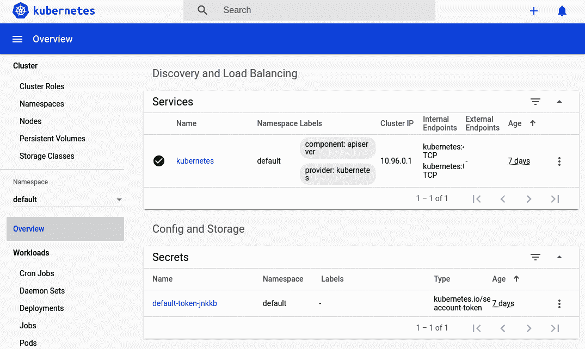

# 第七章：容器编排

在本书中，您在开发机器上运行了许多不同的 Docker 容器。每次运行它们时，您都是通过相同的机制进行的：在终端中手动运行 `docker` 命令。当然，这对于本地开发来说没问题，也许可以用来在生产中运行单个服务实例，但当涉及到运行整个服务群时，这种方法将变得困难。

这就是 *容器编排* 工具发挥作用的地方。粗略地说，容器编排工具管理许多短暂容器的生命周期。这样的工具有许多独特的职责，并且必须考虑以下情况：

+   随着负载的增减，容器需要进行伸缩。

+   随着新服务的创建，偶尔会添加新的容器。

+   需要部署新版本的容器以替换旧版本。

+   单一的机器可能无法处理组织需要的所有容器。

+   相似的容器应该在多台机器上进行分布，以提高冗余性。

+   容器应该能够彼此通信。

+   相似容器的传入请求应该进行负载均衡。

+   如果一个容器被视为不健康，应该将其替换为健康的容器。

容器编排工作在无状态服务中非常有效，比如典型的 Node.js 服务，其中实例可以在没有太多副作用的情况下被销毁或重新创建。而像数据库这样的有状态服务，在容器编排工具中运行则需要更多的关注，因为涉及到诸如跨部署持久化存储或重新分片数据等问题。许多组织选择仅在容器编排器中运行应用代码，并依赖于专用机器来运行它们的数据库。

在本章中，您只会将无状态应用代码部署到容器编排工具中。虽然有几种不同的工具可供选择，但似乎其中一种已经超过了其他工具，成为了最受欢迎的。

# Kubernetes 简介

*Kubernetes* 是由 Google 创建的开源容器编排工具。每个主要的云平台即服务都有一种方式来暴露或模拟 Kubernetes 给它们的客户使用。甚至 Docker 公司也似乎已经将 Kubernetes 集成到了他们的 Docker Desktop 产品中。

## Kubernetes 概述

Kubernetes 是一个非常强大的工具，为了正常运行，它需要许多组成部分。图 7-1 是 Kubernetes 架构的高层概述。


###### 图 7-1\. Kubernetes 集群概述

此图表中的每个组件都有层次关系，并且可以分布在多台机器上。以下是各组件的解释及其相互关系：

容器

正如您可能已经猜到的那样，Kubernetes 中的容器相当于您迄今为止使用的容器。它们是一个隔离的环境，用于封装和运行一个应用程序。Kubernetes 使用几种不同的容器格式，如 Docker 和 rkt。

卷

Kubernetes 中的卷与 Docker 卷几乎是等价的。它提供了一种在容器之外以半永久方式挂载文件系统的方法。本章不会涵盖卷，因为典型的无状态 Node.js 服务不应需要持久性卷。尽管如此，在各种情况下，它们确实非常有用。

Pod

Pod 代表一个应用程序实例。通常一个 pod 只包含一个容器，尽管一个 pod 中可能有多个容器。一个 pod 还可以包含 pod 容器所需的任何卷。每个 pod 都有自己的 IP 地址，如果同一 pod 中存在多个容器，则它们将共享一个地址。Pod 是 Kubernetes API 允许您与之交互的最小单位。

节点

节点是整体 Kubernetes 集群中的工作机器，可以是物理的或虚拟的。每个节点都需要在机器上运行一个容器守护程序（如 Docker）、一个 Kubernetes 守护程序（称为 *Kubelet*）和一个网络代理（*Kube Proxy*）。不同的节点可能具有不同的内存和 CPU 可用性，就像不同的 pod 可能具有不同的内存和 CPU 要求一样。

主节点

主节点代表在主节点上运行的一组服务。主节点公开一个 API，外部客户端如您在本章中将使用的 `kubectl` 命令与之通信。主节点将命令委派给运行在各个节点上的 Kubelet 进程。

集群

集群代表主节点及其各个关联节点的整体集合。通过指定哪些 pod 属于哪个环境，技术上可以使用单个集群来支持不同的环境，如演示和生产环境。然而，通常更安全的做法是维护多个集群，以防止意外的跨环境通信，特别是在计划在生产环境之外测试集群时。

## Kubernetes 概念

当您与 Kubernetes 交互时，您是通过声明集群的期望状态来进行的。例如，您可以告诉它您希望运行版本为 *0.0.3* 的 *recipe-api* 服务的 10 个实例。您不需要告诉集群如何实现该状态。例如，您不需要告诉它通过添加四个条目来增加当前的六个实例数。最终是由 Kubernetes 决定如何达到所需的状态。同样，由 Kubernetes 决定达到该状态需要多长时间。

在能够流畅地在 Kubernetes 上运行应用程序之前，您必须了解架构之外的许多其他概念。Kubernetes API 将群集中的各种资源公开为对象。例如，当您部署（动词）一个应用程序时，您正在创建一个部署（名词）。以下是在本章的其余部分中将要使用的最重要资源的高级列表：

调度

调度是 Kubernetes 确定为新创建的 pod 分配最佳节点的过程。Kubernetes 默认使用的调度器称为 `kube-scheduler`。在遇到新创建的 pod 时，调度器会检查可用节点。它考虑节点的空闲 CPU 和内存，以及 pod 的 CPU 和内存需求（如果指定）。然后选择一个兼容的节点来托管该 pod。如果没有节点有能力托管该 pod，则它可以保持 *scheduled* 状态，等待节点变为可用。

命名空间

命名空间是 Kubernetes 用于逻辑上将集群划分为更小、半隔离集合的机制。默认情况下，创建了 `default`、`kube-system` 和 `kube-public` 命名空间。稍后，当您运行仪表板时，将创建一个额外的 `kubernetes-dashboard` 命名空间。这些可以用于像 `staging` 和 `production` 这样的环境命名空间。在本章中，您将应用部署到 `default` 命名空间。

标签

标签是分配给各种资源（如 pod 或节点）的键/值对。它们不需要唯一，并且可以为一个对象分配多个标签。例如，Node.js 应用程序可以具有 `platform:node` 和 `platform-version:v14` 等标签。节点可能使用像 `machine:physical` 或 `kernel:3.16` 这样的标签。`app` 标签是您区分 *web-api* 实例和 *recipe-api* 实例的方式。

选择器

选择器声明了 pod 的需求。例如，某个 pod 可能需要在物理机上运行而不是虚拟机，因为它需要执行一些极其时间敏感的工作。在这种情况下，选择器可能是 `machine:physical`。

有状态副本集

Kubernetes 可以处理有状态服务，并且有状态副本集旨在使此过程更方便。它们提供了有状态服务经常需要的特性，如一致的主机名和持久存储。在本章中，您将部署的 Node.js 应用程序不会使用有状态副本集。

副本集

副本集维护一个 pod 列表，创建新的 pod 或删除现有的 pod，直到达到所需的副本数。它使用选择器来确定要管理哪些 pod。

部署

部署管理副本集。它可以部署应用程序的新版本，扩展实例数量，甚至回滚到应用程序的先前版本。

控制器

控制器告诉 Kubernetes 如何从一种状态转换到另一种状态。副本集、部署、有状态副本集和定时任务都是控制器的示例。

服务

服务是将一组 pod 暴露给网络的资源。它很像一个反向代理，但不是针对主机名和端口，而是使用选择器来定位 pod。Kubernetes 的服务与本书中用于指代网络上运行进程的“服务”概念不同。在本章中，这些将被称为应用程序。

入口

An ingress resource manages external network access to a service within a Kubernetes cluster.

探针

探针类似于您之前使用过的 HAProxy 健康检查。它可用于判断 pod 是否健康以及在启动后是否准备好接收流量。

正如您所见，Kubernetes 是一个极其强大且可塑性强的部署应用程序容器的工具。Kubernetes 支持许多原语。在 Kubernetes 中，通常有多种方法可以实现同一目标。例如，可以使用命名空间或标签来模拟不同的环境。一个应用程序可以使用一个或多个副本集来部署。在部署到 Kubernetes 时可以采用许多复杂且持有意见的模式，但仅需要这些特性的子集即可在生产环境中运行分布式应用程序。

此列表包含应用程序开发人员需要关注的最重要概念。尽管如此，它甚至不包括在高吞吐量生产环境中运行 Kubernetes 所需的一切！例如，Kubernetes 还依赖于 Etcd 服务。与配置多个复杂服务以在本地运行 Kubernetes 相反，您将依赖于更简单的*Minikube*。Minikube 牺牲了一些功能，如运行多个节点的能力，但简化了其他事务，如不必配置 Etcd 并将主节点与工作节点合并。

## 启动 Kubernetes

要继续本章，您需要在开发机上安装 Minikube 和 Kubectl。有关安装详情，请参阅附录 C。完成安装后，请在终端中运行以下命令以确认它们已安装：

```
$ minikube version
$ kubectl version --client
```

现在您在开发机上运行了一个版本的 Kubernetes，可以开始与其进行交互了。

# 入门

现在您已经安装了 Minikube，可以开始运行它了。执行以下命令：

```
# Linux:
$ minikube start
# MacOS:
$ minikube start --vm=true
```

此命令可能需要一分钟才能完成。在后台，它正在下载必要的容器并启动 Minikube 服务。它实际上在已运行的 Docker 守护程序中运行一个专用于 Minikube 的 Docker 容器。^(1) 您可以通过运行`**docker ps**`命令来查看这个过程，尽管在 macOS 上运行 Minikube 时可能不会得到任何结果。

在我的情况下，我得到了 Table 7-1 中显示的输出。

表 7-1\. Minikube 在 Docker 中运行

| 容器 ID | `245e83886d65` |
| --- | --- |
| 镜像 | `gcr.io/k8s-minikube/kicbase:v0.0.8` |
| 命令 | `"/usr/local/bin/entr…"` |
| 端口 | `127.0.0.1:32776->22/tcp, 127.0.0.1:32775->2376/tcp, 127.0.0.1:32774->8443/tcp` |
| 名称 | `minikube` |

接下来，是时候看一看 Kubernetes 使用的一些架构了。运行以下命令获取当前组成你的 Kubernetes 集群的节点列表：

```
$ kubectl get pods
```

在我的情况下，我得到了“在默认命名空间中找不到资源”的消息，你也应该得到相同的结果。这是因为集群的 *default* 命名空间中目前没有正在运行的 Pod。kubectl 默认使用 *default* 命名空间。尽管如此，Minikube 本身已经有几个正在运行的 Pod。要查看它们，请运行以下稍作修改的命令：

```
$ kubectl get pods --namespace=kube-system
```

在我的情况下，我得到了九个条目，包括以下内容：

```
NAME                               READY   STATUS    RESTARTS   AGE
coredns-66bff467f8-8j5mb           1/1     Running   6          95s
etcd-minikube                      1/1     Running   4          103s
kube-scheduler-minikube            1/1     Running   5          103s
```

你应该获得类似的结果，尽管名称、年龄和重启计数可能会有所不同。

接下来，请记住 Kubernetes 的另一个重要特性是节点，这些节点代表最终运行 Pod 的机器。还要记住，Minikube 是在单节点上本地运行 Kubernetes 的便捷方式。运行以下命令获取你的 Kubernetes 集群中节点的列表：

```
$ kubectl get nodes
```

在我的情况下，我得到了以下结果：

```
NAME       STATUS   ROLES    AGE     VERSION
minikube   Ready    master   3m11s   v1.18.0
```

这里有一个名为 *minikube* 的单节点。再次强调，你的结果应该非常相似。

Minikube 自带自己的 Docker 守护程序。这在与本地机器上的容器工作时可能会有些混淆。例如，当你之前运行 `docker ps` 时，你看到为你的 Minikube 安装启动了一个新的 Docker 容器。你的本地 Docker 守护程序中还有一堆来自其他章节的镜像。但是，在与 Minikube 自带的 Docker 守护程序中运行的 Docker 容器中，有一些自己隔离的镜像集合。

Minikube 提供了一个方便的工具，用于配置你的 `docker` CLI 切换到使用 Minikube 的 Docker 服务。这个工具通过导出一些环境变量来实现。`docker` CLI 利用这些环境变量。

如果你想看看这些环境变量的实际内容是什么样的，运行命令 `**minikube -p minikube docker-env**`。在我的情况下，我得到了以下输出：

```
export DOCKER_TLS_VERIFY="1"
export DOCKER_HOST="tcp://172.17.0.3:2376"
export DOCKER_CERT_PATH="/home/tlhunter/.minikube/certs"
export MINIKUBE_ACTIVE_DOCKERD="minikube"
```

你应该得到略有不同但使用相同环境变量名称的值。现在，要实际应用这些更改到你当前的 Shell 会话中，请运行以下命令执行导出语句：

```
$ eval $(minikube -p minikube docker-env)
```

现在你的 `docker` CLI 已经配置为使用 Minikube 了！只需记住，每当你切换到新的终端 Shell 时，你将会回到使用系统的 Docker 守护程序。

要证明您的`docker` CLI 现在正在与不同的守护程序通信，请运行命令`**docker ps**`和`**docker images**`。在输出中，您应该看到列出的许多*k8s*容器和镜像。还要注意，您不应看到本书中您之前使用的任何旧容器或镜像（如果您暂时切换到新的终端窗口并再次运行这两个命令，您将看到您之前的容器和镜像）。

最后，尽管您和我都喜欢在终端中工作，有时候需要 GUI 来充分欣赏特定系统的复杂性。Minikube 确实配备了这样一个图形仪表板。它允许您使用浏览器与 Kubernetes API 交互。它还使浏览不同类型资源成为一件轻而易举的事，并允许您管理集群。

在一个空闲的终端窗口中运行以下命令来启动仪表板：

```
$ minikube dashboard
```

这个命令可能需要一分钟才能运行。在后台，它创建一个名为*kubernetes-dashboard*的新 Kubernetes 命名空间，并在其中启动一些 Pod。一旦命令完成，它将尝试打开仪表板的 Web 浏览器，并打印出仪表板的 URL。如果您的浏览器没有自动打开，请手动复制 URL 并访问。图 7-2 是概述仪表板屏幕的屏幕截图。



###### 图 7-2\. Kubernetes 仪表板概述

现在是一个熟悉不同屏幕的界面并适应它的好时机。侧边栏分为以下不同部分：

集群

集群部分列出影响整个集群的全局属性，无论选择的命名空间如何。这包括集群中可用节点的列表。点击侧边栏中的 Nodes 条目以查看节点列表。在这种情况下，您应该只看到*minikube*节点列出，就像您运行`kubectl get nodes`命令时一样。

命名空间

下拉菜单命名空间允许您选择仪表板所查看的命名空间。当前设置为*default*。这是本章中您将最多使用的命名空间。现在，请选择*kube-system*条目。这将允许您在仪表板中看到一些实际条目。

概述

概述是您在打开仪表板时首次看到的屏幕。现在，点击它，因为您位于*kube-system*命名空间中。此屏幕包含命名空间中有趣条目的列表，以及关于这些条目健康状况的图表。在此屏幕上，您应该看到四个绿色圆圈（即健康饼图），显示有关守护程序集、部署、Pod 和副本集的统计数据。在此屏幕上继续向下滚动，您将看到组成每个类别的单个条目。概述屏幕仅显示包含资源的类别，这就是为什么当您首次在*default*命名空间中访问此屏幕时，它会如此空的原因。

工作负载

工作负载包含了 Kubernetes 集群的核心内容。点击列表中的 Pods 条目。在这里，您可以看到运行 Minikube 所需的不同 Pods 列表。在新的 Pods 列表中，点击“etcd-minikube” pod。这将带您到一个新屏幕，显示有关这个特定 Pod 的更多信息，如它使用的标签、IP 地址以及 Kubernetes 重新启动它的次数。在屏幕末尾，它甚至提供有关容器的详细信息，例如启动容器时执行的命令。

发现和负载均衡

本节包含两个条目，Ingresses 和 Services。回想一下，Ingresses 允许将外部请求传递给服务，而服务本质上是一组 Pod 的反向代理。点击 Services 条目查看 Minikube 所需的服务。在这种情况下，您应该会看到一个名为“kube-dns”的单独条目。点击该条目以查看有关该服务的更多信息，例如与之相关的 Pods。在这种情况下，有两个单独的“coredns-*” Pod 正在运行。这两个 Pod 由一个“coredns-*”副本集管理。

配置和存储

本节包含用于执行配置管理、存储甚至密钥管理的条目。尽管本章不涵盖这些条目，但对许多组织来说，它们肯定是非常有用的。

一旦您完成了对仪表板的探索，请将 Namespace 下拉菜单更改回*默认*。在接下来的部分中，您将部署自己的应用程序，并且它将在*默认*命名空间中可用。本章的其余部分主要通过终端与 Kubernetes 进行交互，但如果您需要可视化您的集群状态，请随时打开仪表板。

# 部署应用程序

您现在已经准备好将应用程序部署到 Kubernetes 中了，而`kubectl`命令行界面是您唯一需要的工具。

这个实用程序可以通过两种常见的方式来使用。第一种方式是通过向其传递各种子命令来使用它。例如，您一直在使用的`kubectl get pods`命令有一个名为`get`的子命令，以及传递给该子命令的对象类型是`pods`。使用此实用程序的另一种方式是使用`apply`子命令，并传递一个配置文件的标志。您很快就会接触到配置文件，但现在是时候使用子命令了。

## Kubectl 子命令

对于这第一个部署，您将使用几个不同的`kubectl`子命令与 Kubernetes API 进行交互。这些命令允许您与 Kubernetes 进行交互，而无需将文件写入磁盘。这种方法可能类似于在终端中运行`docker run`命令。对于这第一个部署，您将运行一个通用的 Hello World 应用程序来激发您的兴趣。这个应用程序是 Kubernetes 文档的一部分，但不要担心，因为很快您将会部署真正的 Node.js 应用程序。

请回忆，部署控制器通常用于将应用程序部署到 Kubernetes 上。这种类型的资源很可能是您在日常使用 Kubernetes 集群时最常互动的资源。

要创建您的第一个部署，请运行以下命令。尽量快速运行它们，以便您可以在部署正在进行中时查看 Kubernetes 集群的状态：

```
$ kubectl create deployment hello-minikube \
  --image=k8s.gcr.io/echoserver:1.10
$ kubectl get deployments
$ kubectl get pods
$ kubectl get rs
```

第一个命令是创建您的部署。部署资源的实际创建非常快，命令几乎会立即退出。然而，在真正完成之前，它仍然需要进行一堆后台工作。例如，需要下载*echoserver*镜像并实例化一个容器。

如果您能够足够快地运行后续命令，您应该会看到 Kubernetes 集群在尝试将事物置于所需状态时的状态。在我的机器上，我看到以下命令输出：

```
$ kubectl get deployments
  NAME             READY   UP-TO-DATE   AVAILABLE   AGE
  hello-minikube   0/1     1            0           3s
$ kubectl get pods
  NAME                            READY STATUS            RESTARTS AGE
  hello-minikube-6f5579b8bf-rxhfl 0/1   ContainerCreating 0        4s
$ kubectl get rs
  NAME                        DESIRED   CURRENT   READY   AGE
  hello-minikube-64b64df8c9   1         1         0       0s
```

如您所见，资源的创建是立即完成的。在这种情况下，立即创建了一个名为*hello-minikube-6f5579b8bf-rxhfl*的 pod 资源。然而，实际的 pod 尚未启动和准备就绪。READY 列列出了该 pod 的值为 0/1。这意味着所需的一个 pod 都尚未创建。请注意，在这种情况下，部署“拥有”复制集，而复制集“拥有”pod。尽管在运行命令时您技术上只请求创建一个部署，但它隐含地创建了其他类型的依赖资源。

一分钟或两分钟后，集群很可能已经完成了其他资源的创建。因此，请再次运行这三个`kubectl get`命令。当我第二次运行这些命令时，我得到了这些结果——尽管这次我已经添加了`-L app`标志以显示 pod 的*app*标签：

```
$ kubectl get deployments
  NAME             READY   UP-TO-DATE   AVAILABLE   AGE
  hello-minikube   1/1     1            1           7m19s
$ kubectl get pods -L app
  NAME                READY  STATUS   RESTARTS  AGE    APP
  hello-minikube-123  1/1    Running  0         7m24s  hello-minikube
$ kubectl get rs
  NAME                        DESIRED   CURRENT   READY   AGE
  hello-minikube-64b64df8c9   1         1         1       7m25s
```

在这种情况下，已经过了足够的时间，集群能够达到所需的状态。镜像已下载，并已实例化容器。您的*hello-minikube*应用程序现在已经启动运行！尽管如此，您不能轻松地与其交互。要做到这一点，您首先需要创建一个服务。

请回忆，服务就像是与特定选择器匹配的容器的反向代理。运行以下命令来创建一个新服务，然后列出服务：

```
$ kubectl expose deployment hello-minikube \
  --type=NodePort --port=8080
$ kubectl get services -o wide
```

这是我机器上可用的服务列表：

```
NAME           TYPE      ... PORT(S)        AGE  SELECTOR
hello-minikube NodePort  ... 8080:31710/TCP 6s   app=hello-minikube
kubernetes     ClusterIP ... 443/TCP        7d3h <none>
```

在这种情况下，`kubernetes`条目被 Kubernetes 集群本身使用。`hello-minikube`条目是属于您的*hello-minikube*应用程序的条目。此服务的类型设置为*NodePort*，它实质上是将节点机器上指定端口转发到 pod 内部容器使用的端口。

此服务的 SELECTOR 列列出用于定位 Pod 的选择器。在本例中，选择器是隐式创建的，它将目标设置为带有*app*标签设置为*hello-minikube*的 Pod。正如您之前看到的，当您创建部署时，Pod 的*app*标签被隐式设置为*hello-minikube*。这些是由 Kubectl 提供的操作，以使与 API 的交互更轻松。

您创建的服务几乎立即准备就绪。创建完成后，您现在可以向其发送 HTTP 请求了。但是，应请求哪个 URL？在这种情况下，您需要从`minikube` CLI 获取*hello-minikube*服务的 URL。运行以下命令——第一个将显示服务的 URL，第二个将发出 HTTP 请求：

```
$ minikube service hello-minikube --url
$ curl `minikube service hello-minikube --url`
```

在我的情况下，我看到服务的 URL 是`http://172.17.0.3:31710`。*hello-minikube* HTTP 服务在您发出请求时提供了大量信息。假设您没有收到错误，请求成功！

请注意，在此情况下，服务与其他资源之间没有所有权概念。服务与 Pod 仅松散相关，因为它们的选择器和标签恰好匹配。如果存在其他 Pod，服务技术上也可以匹配它们。

此时，值得再次访问 Kubernetes 仪表板，查看您创建的资源。在 Workloads 部分的 Deployments、Pods 和 Replica Sets 屏幕以及 Discovery 和 Load Balancing 部分的 Services 屏幕查看。

现在您已经完成了*hello-minikube*服务，是时候将其拆除了。运行以下命令来删除您之前创建的服务和部署资源：

```
$ kubectl delete services hello-minikube
$ kubectl delete deployment hello-minikube
```

当您删除部署时，它将自动删除其所拥有的资源（在本例中为 Pod 和 Replica Set）。完成后，请运行以下命令最后一次获取资源列表：

```
$ kubectl get deployments
$ kubectl get pods
$ kubectl get rs
```

根据您运行命令的速度，您可能会看到 Pod 仍然存在。但如果确实看到了，Pod 的状态应该显示为 Terminating。多运行几次该命令，然后您应该会看到 Pod 已完全消失。在集群从现有状态变为所需状态之前，大多数与 Kubernetes 的交互都需要时间。

现在您已经熟悉了运行 Kubectl 命令与您的 Kubernetes 集群进行交互，可以使用更强大的配置文件了。

## Kubectl 配置文件

与 Kubernetes API 交互的第二种方法使用配置文件。这允许您使用 YAML 文件声明性地描述 Kubernetes 集群的子集，这种方法类似于运行`docker-compose`命令。这些交互使用`kubectl apply -f <FILENAME>`子命令。

当您运行其他 Kubectl 命令时，您大多数时间都在单独地处理一个资源，比如创建服务，或者有时处理多个资源，比如在创建 Pod 和复制集时进行部署时。在处理配置文件时，可能同时创建几个可能不相关的资源。

在本节中，您将部署并运行之前构建的 *recipe-api* 应用程序，这次添加了一些额外的细节：

+   您将一次运行五个冗余的 *replicas* 应用程序。

+   一个 Kubernetes 服务将指向这些实例。

+   Kubernetes 将自动重新启动不健康的应用程序副本。

但首先，您需要构建一个 Docker 镜像并将其推送到 Kubernetes Docker 服务。访问您的 *recipe-api* 目录，并通过运行以下命令构建镜像的新版本：

```
$ cd recipe-api
$ eval $(minikube -p minikube docker-env) # ensure Minikube docker
$ docker build -t recipe-api:v1 .
```

一个标记为 *recipe-api:v1* 的 Docker 镜像现在已经在您的 Kubernetes Docker 守护程序中可用。

现在您已准备好为您的应用程序创建配置文件。首先，创建一个名为 *recipe-api/recipe-api-deployment.yml* 的文件。此文件描述了服务的部署，包括要维护的副本数量、端口号和用作健康检查的 URL。

现在您已创建了部署配置文件，可以开始通过添加 Example 7-1 中的内容来填充它。

##### 示例 7-1\. *recipe-api/recipe-api-deployment.yml*，第一部分

```
apiVersion: apps/v1
kind: Deployment 
metadata:
  name: recipe-api 
  labels:
    app: recipe-api 
```


此 YAML 文件部分定义了一个部署。


此部署的名称是 *recipe-api*。


部署具有 `app=recipe-api` 标签。

文件从定义部署本身开始。值应该非常直观。到目前为止，文件表明它正在用于创建 *recipe-api* 部署。

接下来，将 Example 7-2 中的内容添加到文件中。

##### 示例 7-2\. *recipe-api/recipe-api-deployment.yml*，第二部分

```
spec:
  replicas: 5 
  selector:
    matchLabels:
      app: recipe-api
  template:
    metadata:
      labels:
        app: recipe-api
```


同时将运行五个应用程序副本。

本节描述了复制集的工作原理。特别是，Kubernetes 将需要运行五个 Pod 的副本。`matchLabels` 选择器设置为 *recipe-api*，这意味着它将匹配带有该标签的 Pod。

现在将最终内容从 Example 7-3 添加到文件中。请注意，第一行 `spec` 应该缩进四个空格；它是 `metadata` 字段的同级属性。

##### 示例 7-3\. *recipe-api/recipe-api-deployment.yml*，第三部分

```
#### note the four space indent
    spec:
      containers:
      - name: recipe-api
        image: recipe-api:v1 
        ports:
        - containerPort: 1337 
        livenessProbe: 
          httpGet:
            path: /recipes/42
            port: 1337
          initialDelaySeconds: 3
          periodSeconds: 10
```


该 Pod 的唯一容器使用 *recipe-api:v1* 镜像。


容器监听 1337 端口。


`livenessProbe` 部分配置了健康检查。

此文件部分定义了 Pod 使用的容器，并且比之前的部分更为复杂。容器的名称设置为`recipe-api`，并配置为使用*recipe-api:v1*镜像，这是你最近构建和打标记的镜像。

`livenessProbe`部分定义了用于确定容器是否健康的健康检查。在这种情况下，它配置为在启动容器后等待三秒钟，然后每 10 秒钟向`/recipes/42`端点发出 HTTP `GET`请求。请注意，选择这个 URL 仅因为它已经在*producer-http-basic.js*应用程序中存在；请参阅“负载均衡和健康检查”以构建更好的健康检查端点。

现在你的文件已经完成，是时候告诉 Kubernetes 集群应用所代表的变更了。运行以下命令：

```
$ kubectl apply -f recipe-api/recipe-api-deployment.yml
```

Kubectl 读取文件，并假设没有发现任何拼写错误，则指示 Kubernetes 应用这些变更。运行此命令几次，直到输出更改并且你的 Pod 被标记为 Running 状态为止：

```
$ kubectl get pods
```

我在我的机器上获得以下输出：

```
NAME                          READY   STATUS    RESTARTS   AGE
recipe-api-6fb656695f-clvtd   1/1     Running   0          2m
... OUTPUT TRUNCATED ...
recipe-api-6fb656695f-zrbnf   1/1     Running   0          2m
```

Running 状态表示 Pod 正在运行，并且当前通过其存活性健康检查。要查看有关 Pod 健康检查的更多信息，请运行以下命令，将`<POD_NAME>`替换为你的 Pod 名称（在我的情况下是*recipe-api-6fb656695f-clvtd*）：

```
$ kubectl describe pods <POD_NAME> | grep Liveness
```

我获得以下存活性信息返回：

```
Liveness: http-get http://:1337/recipes/42
  delay=3s timeout=1s period=10s #success=1 #failure=3
```

接下来，创建另一个名为*recipe-api/recipe-api-network.yml*的文件，这次用来定义指向你已创建的 Pod 的 Kubernetes 服务。服务本来可以在同一文件中定义，通过将其放置在单独的 YAML 部分中，但文件已经足够长了。在这个文件中，从示例 7-4 中添加内容。

##### 示例 7-4\. *recipe-api/recipe-api-network.yml*

```
apiVersion: v1
kind: Service
metadata:
  name: recipe-api-service 
spec:
  type: NodePort
  selector:
    app: recipe-api
  ports:
    - protocol: TCP
      port: 80
      targetPort: 1337
```


服务名为*recipe-api-service*。

此文件描述了一个名为*recipe-api-service*的单个服务。它是一个*NodePort*服务，就像你之前定义的那样。它将请求转发到端口 1337，并且目标是匹配`app=recipe-api`选择器的 Pod。

应用此配置文件中表示的更改的方式与之前相同，通过使用一个新的文件名运行此命令：

```
$ kubectl apply -f recipe-api/recipe-api-network.yml
```

完成后，再次运行**`kubectl get services -o wide`**命令。你应该看到一个条目，与之前使用`kubectl expose`命令定义服务时看到的类似，只是这次服务名称稍长。

恭喜！您现在已经使用 Kubernetes 配置文件定义了您的 Node.js *recipe-api* 应用程序，并成功将其部署到本地 Kubernetes 集群。有了这个，您现在可以准备部署您的 *web-api* 应用程序了。

# 服务发现

*web-api* 应用程序比 *recipe-api* 稍微复杂一些。这个应用程序仍然会运行冗余副本并需要一个服务，但它还需要与 *recipe-api* 服务通信，并且需要接受来自外部世界的入口连接。为了使配置文件保持简短，它将不包含健康检查部分。

为了启用集群的入口连接，您需要手动启用该功能。运行以下命令来执行：

```
$ minikube addons enable ingress
$ kubectl get pods --namespace kube-system | grep ingress
```

第一个命令指示 Minikube 启用入口插件，这是扩展 Minikube 功能的一种方式。在这种情况下，它创建一个使用 Nginx Web 服务器执行入口路由的新容器。第二个命令只是向您展示容器的位置。在这种情况下，Kubernetes 在 *kube-system* 命名空间内启动 Nginx 容器。您在技术上不需要知道它运行在哪里，您只是在查看其内部情况。

还有许多其他[入口控制器](https://kubernetes.io/docs/concepts/services-networking/ingress-controllers/)，例如备受喜爱的 HAProxy（在“使用 HAProxy 进行反向代理”中介绍），尽管默认的 Nginx 选项由 Kubernetes 项目直接维护。不同的入口控制器支持不同的功能，但最终控制器会配置某种形式的反向代理，将传入的请求映射到服务。

通过启用入口，您可以通过向单个主机名发出 curl 请求来向 *web-api* 服务发出请求，而不必使用 `minikube` CLI 来定位服务的主机和端口。这使得更容易将外部客户端的请求路由到适当的节点和容器。

这些不同的 Kubernetes 资源之间的关系可能有点复杂。图 7-3 包含它们的视觉概览。外部请求通过 *web-api-ingress* 传递，然后传递给 *web-api-service*。该服务将请求传递给 *web-api* 中的一个 pod。然后 pod 发送请求给 *recipe-api* 服务，该服务然后将请求传递给 *recipe-api* 中的一个 pod。*web-api* 应用程序找到并与 *recipe-api* 应用程序通信的机制称为*服务发现*，主要由 Kubernetes 管理。


###### 图 7-3\. 服务发现概述

要让你的*web-api*服务适配 Kubernetes，首先需要创建一个 Dockerfile。之前，当你处理这个项目时，已经为应用的 Zipkin 变体创建了一个。这次，你需要为基本的 HTTP 服务器创建一个。对于这个 Dockerfile，你可以复制现有的*recipe-api*文件，并做一些修改。通过运行以下命令复制文件并进入*web-api*目录：

```
$ cp recipe-api/Dockerfile web-api/Dockerfile
$ cd web-api
```

接下来，修改*web-api/Dockerfile*的最后一行。当前它仍在引用旧的*producer-http-basic.js*文件，而应该改为引用*consumer-http-basic.js*文件：

```
CMD [ "node", "consumer-http-basic.js" ]
```

Dockerfile 搞定后，现在是创建 Kubernetes 配置文件的时候了。首先要定义部署的文件。创建一个名为*web-api/web-api-deloyment.yml*的新文件。它与你为*recipe-api*创建的文件相似，只是应用程序名称已更改为*web-api*。将示例 7-5 中的内容添加到文件中，以便开始工作。

##### 示例 7-5\. *web-api/web-api-deployment.yml*，第一部分

```
apiVersion: apps/v1
kind: Deployment
metadata:
  name: web-api
  labels:
    app: web-api

spec:
  replicas: 3 
  selector:
    matchLabels:
      app: web-api
  template:
    metadata:
      labels:
        app: web-api
```


这次服务将有三个副本。

到目前为止一切顺利。现在是时候定义 Pod 的容器了。添加示例 7-6 中的内容以完成文件。请注意，第一行`spec`有四个空格的缩进，是前一个`metadata`字段的同级。

##### 示例 7-6\. *web-api/web-api-deployment.yml*，第二部分

```
#### note the four space indent
    spec:
      containers:
      - name: web-api
        image: web-api:v1
        ports:
        - containerPort: 1337
        env: 
        - name: TARGET
          value: "recipe-api-service"
```


环境变量配置

部署配置文件的这一部分与先前的文件有所不同。最显著的是，你已经向容器配置添加了一个`env`部分。这直接对应你以前在直接运行 Docker 容器时使用的环境变量功能。在这种情况下，`TARGET`环境变量设置为*recipe-api-service*。

起初这可能看起来有些有趣。`TARGET`变量表示 URL 的主机部分。由于值设置为*recipe-api-service*而没有端口，这意味着应用程序请求的 URL 看起来像`http://recipe-api-service:80/`，因为 HTTP 使用默认端口 80。

在 Kubernetes 中运行的应用程序可以使用主机名与服务进行通信。这与 Docker 的工作方式非常类似，因为它们都使用 DNS 服务，只是 Docker 仅对在同一台机器上运行的容器有效。而 Kubernetes 则能够在集群的任何节点上实现此功能。这是因为每个节点上运行的 Kube Proxy 守护程序将请求转发到其他节点。在当前的单节点 Minikube 集群中，这种特性比较有限，但在更大的多节点 Kubernetes 集群中，效果更为显著。

现在您的部署配置文件已完成，可以修改您的网络配置文件。此文件将与您之前创建的文件类似。现在，将来自示例 7-7 的内容添加到文件中。

##### 示例 7-7\. *web-api/web-api-network.yml*，第一部分

```
apiVersion: v1
kind: Service
metadata:
  name: web-api-service
spec:
  type: NodePort
  selector:
    app: web-api
  ports:
    - port: 1337
```

此第一部分定义了一个名为*web-api-service*的服务，它将把传入的请求转发到端口 1337，以匹配*web-api* pods 中的端口 1337。

示例 7-8 包含了网络文件的第二部分，稍微复杂一些。在这种情况下，它以三个连字符（`---`）开头。这是一种 YAML 约定，用于指定同一文件中存在多个文档。基本上，这允许您在同一文件中连接相关的资源创建任务。将此内容添加到您的文件中。

##### 示例 7-8\. *web-api/web-api-network.yml*，第二部分

```
---
apiVersion: networking.k8s.io/v1beta1
kind: Ingress
metadata:
  name: web-api-ingress
  annotations: 
    nginx.ingress.kubernetes.io/rewrite-target: /$1
spec:
  rules: 
  - host: example.org
    http:
      paths:
      - path: /
        backend:
          serviceName: web-api-service
          servicePort: 1337
```


提供了特定于 Nginx 的配置，如 URL 重写。


提供了额外的虚拟主机路由规则。

这个配置文件故意比必要的复杂，以展示如何通过入口控制器提供的反向代理进行非常精细的配置。

首先，注意`metadata.annotations`配置。在本例中，它有一个特定于 Nginx 的行，用于配置传入 URL 在传递到服务之前如何被重写。在这个例子中，从传入的 URL 路径不变地传递，并且事实上，整个`annotations`部分可以被移除而配置文件仍然可以工作。然而，在更复杂的组织中，您可能需要能够修改传入请求的能力。

第二组配置允许基于虚拟主机进行路由。这种配置是通用的，所有的入口控制器都应该能够使用它。在本例中，只有目标域为`example.org`的请求才会匹配该规则。配置变得更加复杂，匹配以`/`开头的路径（这实际上也是一个无操作）。最终，匹配的请求被传递给*web-api-service*。请注意，规则部分可以被大大简化，以便将任何主机名和路径的请求发送到同一个服务。通过配置入口控制器的这一部分，您可以应用 API 外观模式，使用单一接口公开多个后端服务。

现在，您的文件已配置完成，可以构建您*web-api*服务的镜像，并将其部署到您的 Kubernetes 集群中。

运行以下命令来执行这些操作：

```
$ eval $(minikube -p minikube docker-env) # ensure Minikube docker
$ docker build -t web-api:v1 .
$ kubectl apply -f web-api-deployment.yml
$ kubectl apply -f web-api-network.yml
```

同样，Pod 创建步骤可能需要一分钟完成。运行**`kubectl get pods`**命令，直到您新创建的*web-api*实例正在运行。完成后，您可以使用入口控制器发出请求。

要通过入口发出请求（而不是直接请求服务），你首先需要获取入口正在侦听的 IP 地址。运行以下命令以获取此地址：

```
$ kubectl get ingress web-api-ingress
```

当我运行命令时，我会得到以下输出：

```
NAME              CLASS    HOSTS         ADDRESS      PORTS   AGE
web-api-ingress   <none>   example.org   172.17.0.3   80      21s
```

在我的情况下，我需要发送请求的 IP 地址是 172.17.0.3。如果你没有看到列出的 IP 地址，可能需要等一会儿，然后再次运行命令。此外，请注意端口设置为 80，这是 HTTP 入口的默认端口。

现在你已经准备好通过入口发出请求了。执行以下命令，将`<INGRESS_IP>`替换为你从上一个命令中获取的 IP 地址：

```
$ curl -H "Host: example.org" http://<INGRESS_IP>/
```

如果一切顺利，你将收到这本书中遍布的 JSON 负载。`consumer_pid`和`producer_pid`的值并不那么有趣，因为每个 Docker 容器都以进程 ID 为 1 运行你的应用程序。请放心，请求通过的两个不同的 Kubernetes 服务正在使用轮询算法将请求路由到各个 Pod。

入口控制器的 IP 地址将在 Kubernetes 集群的生命周期内保持稳定。尽管 Pod 将会启动和关闭，并获取新的 IP 地址，但入口的 IP 地址保持不变。

如果你愿意，你可以在你的机器上运行一个反向代理，接受从端口 80 进来的请求，并将请求代理到入口控制器的 IP 地址。这就是在生产中使用 Kubernetes 来暴露在集群中运行的应用程序的方式。

当然，并不是集群中的任何资源都通过入口暴露出来。相反，你必须明确定义哪些服务是公开的。这对于将浅层上游服务（如*web-api*）与内部下游服务（如*recipe-api*）分离非常有用。

# 修改部署

部署是你作为应用程序开发人员最有可能定期交互的资源。正如你在前面的章节中看到的，修改一个部署可能会触发对底层副本集和 Pod 的更改。

到目前为止，你处理过的所有部署都有名称。运行**`kubectl get deployments`**命令，你将看到返回的两个条目，一个名为*recipe-api*，另一个名为*web-api*。这些名称是直接由你运行的命令提供的。但是，依赖资源的名称稍微更动态一些。例如，在我的机器上，我的*recipe-api*部署有一个名为*recipe-api-6fb656695f*的副本集，而这个副本集又有一个名为*recipe-api-6fb656695f-clvtd*的 Pod。

由于部署有一个稳定的名称，你可以通过重新使用相同的名称来修改它。本节涵盖了作为应用程序开发人员可能会修改部署的几种常见方式。就像你使用配置文件或标准的`kubectl`命令部署应用程序时一样，你也可以使用这两种方法修改部署。

## 扩展应用实例

修改部署的最基本方式是扩展实例数量。在 Kubernetes 的术语中，应用程序的每个冗余实例称为副本。因此，当你扩展部署时，实际上是在更改该部署中 Pod 副本的数量。

您当前正在运行五个*recipe-api*应用程序的副本。运行以下命令获取你的 Pod 列表，将副本数扩展到 10，并获取新的 Pod 列表：

```
$ kubectl get pods -l app=recipe-api
$ kubectl scale deployment.apps/recipe-api --replicas=10
$ kubectl get pods -l app=recipe-api
```

在这种情况下，你应该看到 Kubernetes 正在创建五个新的 Pod，根据你运行最后一个命令的速度快慢，其中一些 Pod 的状态将显示为*ContainerCreating*。等待一段时间，再次运行最后一个命令，它们的状态应该会变为*Running*。

你可以修改该命令，将副本数设置回五个，但修改部署的另一种方式是可行的。首次创建部署时使用的*recipe-api/recipe-api-deployment.yml*文件也可以用来修改它。具体来说，当你运行`kubectl apply`命令时，它不仅仅限于创建资源。它实际上是指示 Kubernetes 集群进行必要的更改，以使其与指定配置文件中的资源定义相似。

在这种情况下，集群的状态目前与配置文件不同。具体来说，文件中希望有 5 个副本，但集群中却有 10 个副本。为了将副本数缩减回 5 个，请再次运行相同的`kubectl apply`命令：

```
$ kubectl apply -f recipe-api/recipe-api-deployment.yml
```

apply 命令的输出可以有三种形式：

```
deployment.apps/recipe-api created
deployment.apps/recipe-api configured
deployment.apps/recipe-api unchanged
```

运行`kubectl apply`时，你将会遇到如下第一行。此行表明已创建了一个新资源。然而，这次你应该会得到第二行输出。这行表示在配置文件中找到了表示资源的名称，并对资源进行了修改。如果集群当前已经与文件所需状态相似且无需操作，则会看到最后一行。请继续运行`kubectl apply`命令一次。这次你应该会得到未更改的行作为响应。

请注意，随着 Pod 副本数量的增减，服务仍然可以将请求路由到每个可用的 Pod。一旦 Pod 被终止，它就不应该再接收任何请求。一旦 Pod 被添加，它将等待健康检查通过（已为*recipe-api*启用），然后开始接收请求。

Kubernetes 具有一个名为[水平 Pod 自动缩放器](https://kubernetes.io/docs/tasks/run-application/horizontal-pod-autoscale/)的高级功能。这用于根据各种标准（如 CPU 使用率）动态调整副本的数量，甚至根据您之前在“使用 Graphite、StatsD 和 Grafana 进行度量”中生成的自定义指标进行调整。这是 Kubernetes 支持的一个高级功能，您可以考虑在生产应用中使用，但这里不会涉及。

## 部署新应用程序版本

您可能也会发现自己处于需要部署应用程序的新版本的情况。由于 Kubernetes 处理封装在容器中的应用程序，这意味着构建应用程序的新版本的 Docker 镜像，将镜像推送到 Docker 服务器，然后指示 Kubernetes 根据镜像部署应用程序的新版本的容器。

当您部署应用程序的新版本时，您不希望终止旧的部署资源并创建新的资源。相反，您希望依附在其上并替换属于该部署的 pods。

在部署新版本的应用程序之前，您首先需要创建它。为了说明问题，您可以通过简单地向现有应用程序代码添加一个新的端点来实现这一点。运行以下命令来添加一个新的端点并构建*web-api:v2*版本的应用程序：

```
$ cd web-api
$ echo "server.get('/hello', async () => 'Hello');" \
  >> consumer-http-basic.js
$ eval $(minikube -p minikube docker-env) # ensure Minikube docker
$ docker build -t web-api:v2 .
```

接下来，编辑*web-api/web-api-deployment.yml*文件。进入后，修改`spec.template.spec.container.image`属性，并将其从`image: web-api:v1`更改为`image: web-api:v2`。完成更改后，运行以下命令部署更改并观察 pods 部署：

```
$ kubectl apply -f web-api-deployment.yml
$ kubectl get pods -w -l app=web-api
```

`-w`标志告诉 Kubectl 监视对 Kubernetes 集群所做的更改，并且它将在对集群中的*web-api* pods 进行更改时继续输出。一旦进程最终完成，您可以使用 Ctrl + C 杀死监视操作。

图 7-4 显示了您在终端中应该看到的时间轴。首先，您有三个运行中的*v1*实例。当您运行命令应用部署时，新的*v2* pods 被创建。最终，所需数量的*v2* pods 被创建并被视为健康的。然后，Kubernetes 将服务从*v1*切换到*v2*。完成后，Kubernetes 处理*v1* pods 的终止。最终，所有旧的 pods 都消失了，只剩下新的 pods 在运行。


###### 图 7-4\. 部署如何影响 pod 状态

此时，您可以通过使用现有的*web-api-service*服务向您的一个 pods 发送请求。

您可以通过运行以下命令来请求您新添加的*/hello*路由：

```
$ curl `minikube service web-api-service --url`/hello
```

您应该在终端中看到显示“Hello”的消息。

需要注意的是，当您部署了应用程序的新版本时，旧的复制集会被留下来！它已经更新为零的规模。当您运行以下命令列出您的复制集时，您可以看到这种情况发生：

```
$ kubectl get rs -l app=web-api
```

在我的情况下，我得到了以下的复制集：

```
NAME                 DESIRED   CURRENT   READY   AGE
web-api-6cdc56746b   0         0         0       9m21s
web-api-999f78685    3         3         3       3m8s
```

这里新的复制集*web-api-999f78685*有三个实例，而旧的集合*web-api-6cdc56746b*则为零。当您读取集群中的 pod 列表时，您也可以看到这种情况发生。默认情况下，当它们作为部署的一部分创建时，pod 的命名模式如下：<DEPLOYMENT>-<REPLICA_SET>-<RANDOM>。

复制集的名称实际上是相当一致的。例如，如果您修改*web-api-deployment.yml*文件，将其恢复为具有*web-api:v1*镜像的版本，则将再次使用先前的复制集，并将新的复制集缩减为零。

## 回滚应用程序部署

如果你和我一样，偶尔会合并一些糟糕的代码，忘记捕获异常，或者以其他方式发布一个有问题的应用程序版本到生产环境中。当发生这种情况时，这样一个破损的版本需要回滚到应用程序的已知良好的先前版本。将坏版本回滚到好版本的行为被称为*回滚*。

Docker 已经维护了先前镜像的列表，这很好，但是镜像并不包含表示容器所需的一切。例如，*web-api*服务需要一些元数据，例如环境变量和监听端口——这些在部署的 YAML 文件中定义。如果您丢失了这个 YAML 文件，只剩下 Docker 镜像，您能否确信您可以重建和部署一个正确配置的容器？如果您还在处理生产事故的压力会怎么样？

幸运的是，对于你和我来说，Kubernetes 保留了关于以前部署的信息。这使您可以通过执行几个命令回滚到先前的部署状态。

但首先，现在是时候发布一个有问题的应用程序。这个应用程序版本添加了一个新的端点*/kill*，导致进程立即退出。运行以下命令修改*web-api*服务以添加新路由，并构建新版本的容器：

```
$ cd web-api
$ echo "server.get('/kill', async () => { process.exit(42); });" \
  >> consumer-http-basic.js
$ eval $(minikube -p minikube docker-env) # ensure Minikube docker
$ docker build -t web-api:v3 .
```

一旦您的镜像构建完成，您就可以执行另一个部署。再次编辑*web-api-deployment.yml*文件，这次将图像行从*web-api:v2*更改为*web-api:v3*。完成后，运行以下命令执行另一个部署：

```
$ kubectl apply -f web-api-deployment.yml --record=true
```

请注意，这次添加了`--record=true`标志。您将很快看到这个标志的用途。一旦应用程序的新版本部署完成，您就可以测试新的端点了。发出以下请求：

```
$ curl `minikube service web-api-service --url`/kill
```

一旦运行该命令，你应该会收到一个错误，curl 从服务器接收到一个空的回复。接下来，运行命令`**kubectl get pods -l app=web-api**`再次获取你的 pod 列表。当我运行这个命令时，我得到以下结果：

```
NAME                       READY   STATUS    RESTARTS   AGE
web-api-6bdcb55856-b6rtw   1/1     Running   0          6m3s
web-api-6bdcb55856-ctqmr   1/1     Running   1          6m7s
web-api-6bdcb55856-zfscv   1/1     Running   0          6m5s
```

注意第二个条目的重启计数为一，而其他条目的重启计数为零。这是因为容器崩溃了，Kubernetes 自动为我重新启动了它。根据你运行命令的速度，你可能会看到重启计数设置为一，或者计数为零但状态为 Error——这表明 Kubernetes 尚未重新启动容器。

调查方法有些牵强，但在这一点上，你已确认应用程序的*v3*版本存在问题，应该回滚。在生产环境中，希望您能像在“使用 Cabot 进行警报”中设置的那样，主动接收警报。

Kubectl 提供了一个子命令用于查看部署历史记录。运行以下命令获取*web-api*部署的历史记录：

```
$ kubectl rollout history deployment.v1.apps/web-api
```

当我运行命令时，我得到以下结果：

```
REVISION  CHANGE-CAUSE
7         <none>
8         <none>
9         kubectl apply --filename=web-api-deployment.yml --record=true
```

你应该从我这里得到与修订列中的三个不同值。在这种情况下，我可以看到有三个修订版，每个修订版都有一个递增的计数器来标识它，第三个修订版显示了我执行的命令。`--record=true`标志告诉 Kubectl 跟踪触发部署的命令。如果文件名包含应用程序版本，则此功能可能更有用，例如。

在我的情况下，修订号 9 是我所做的最后一个，这必须对应于应用程序的*v3*版本。因此，在部署工作版本的应用程序时，我需要从第 9 版回滚到第 8 版。

运行以下命令回滚应用程序部署，将`<RELEASE_NUMBER>`替换为列表中第二个版本号（在我的情况下是 8）：

```
$ kubectl rollout undo deployment.v1.apps/web-api \
  --to-revision=<RELEASE_NUMBER>
```

运行该命令后，你应该会得到输出消息`deployment.apps/web-api`已回滚。一旦发生这种情况，请再次运行`**kubectl rollout history deployment.v1.apps/web-api**`命令以查看你的部署列表。在我的情况下，我得到了以下列表：

```
REVISION  CHANGE-CAUSE
7         <none>
9         kubectl apply --filename=web-api-deployment.yml --record=true
10        <none>
```

在此示例中，修订版 8 已从列表中移除，并作为修订版 10 移动到末尾。把它看作一个时间线，在时间线中，旧的修订版位于顶部，新的修订版位于底部，修订版计数始终增加，不列出重复的修订版。

为了证明 pod 已经回滚到应用程序的*v2*版本，请再次对*/kill*发出相同的 curl 请求。这次，而不是摧毁服务器，你应该会收到 404 错误。

就是这样，你成功地回滚了一个不良的应用程序部署！

现在你已经完成了 Kubernetes 的操作，可以选择让其在你的机器上保持运行，或者清理掉当前在后台运行的所有服务。个人认为，如果让其保持运行，会大大降低我的电池寿命。运行以下命令来删除你创建的所有 Kubernetes 对象：

```
$ kubectl delete services recipe-api-service
$ kubectl delete services web-api-service
$ kubectl delete deployment recipe-api
$ kubectl delete deployment web-api
$ kubectl delete ingress web-api-ingress
$ minikube stop
$ minikube delete
```

你还应该切换到运行`minikube dashboard`命令的终端，并用 Ctrl + C 终止它。

如果你使用 Docker Desktop，可能也想要禁用 Kubernetes。打开 GUI 首选项面板，进入 Kubernetes 部分，取消选中“启用 Kubernetes”选项，然后应用更改。

^(1) MacOS 变体还安装了 HyperKit hypervisor，这是后续使用 Ingress 功能所必需的。
