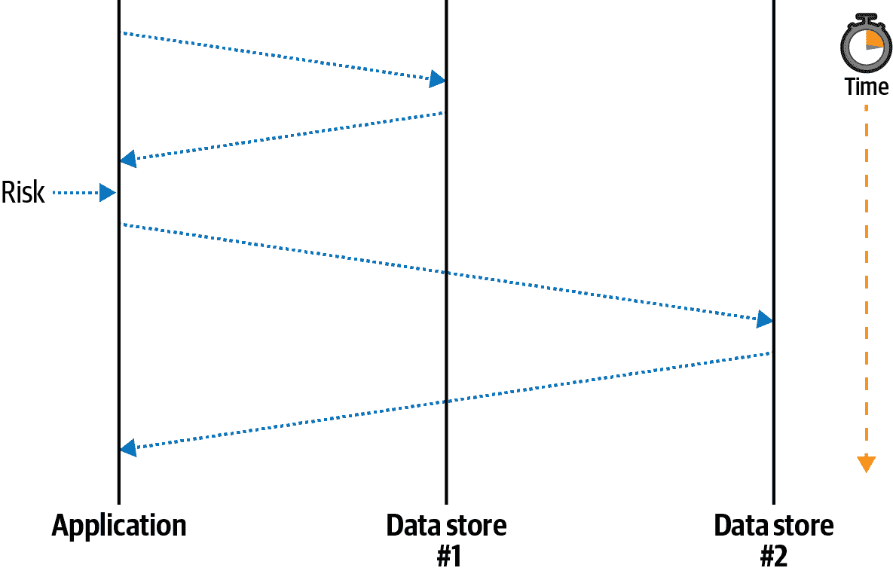
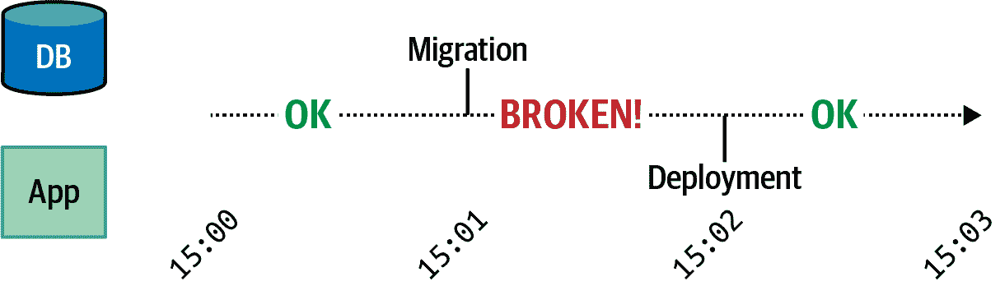
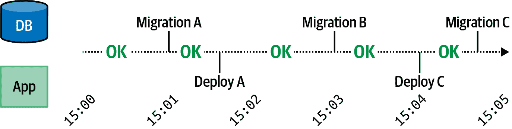
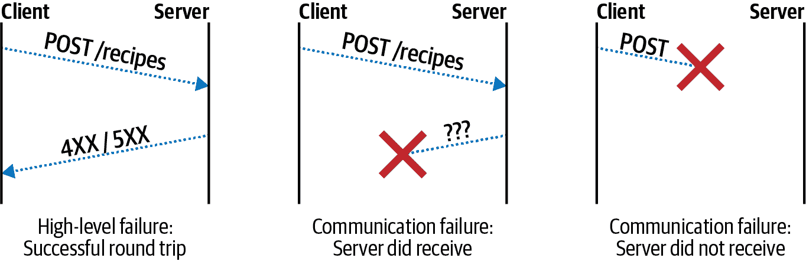
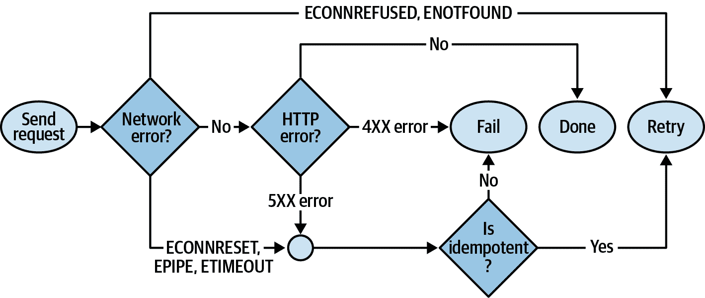
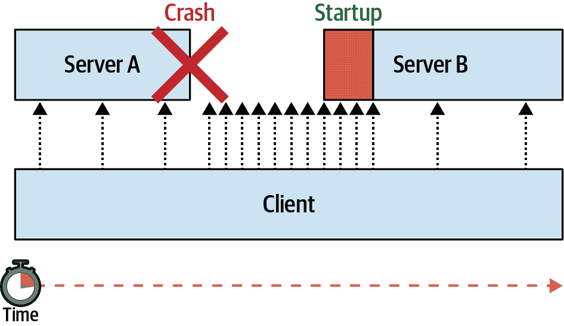
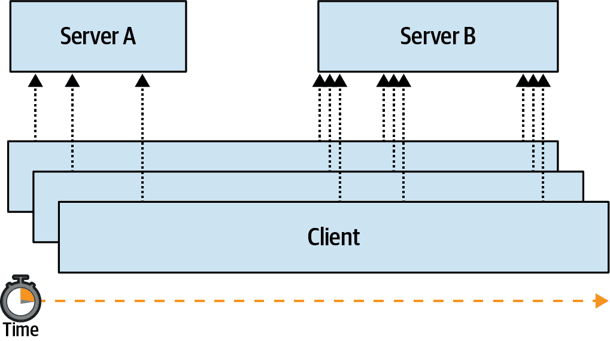

# 第八章：弹性

本章重点讨论*应用程序的弹性*，即在可能导致失败的情况下仍能维持正常运行的能力。与专注于 Node.js 进程外部服务的其他章节不同，这一章大多数情况下着眼于进程内部。

应用程序应对某些类型的故障具备弹性。例如，像*web-api*这样的下游服务在无法与*recipe-api*这样的上游服务通信时，有许多可用的选项。也许它应该重试传出请求，或者可能应该用错误响应来回应传入请求。但无论如何，崩溃都不是最佳选择。同样，如果与有状态数据库的连接丢失，应用程序可能应该尝试重新连接，同时用错误响应来回应传入请求。另一方面，如果与缓存服务的连接断开，则最佳操作可能是像往常一样回应客户端，尽管速度较慢，以“降级”的方式。

在许多情况下，应用程序崩溃是必要的。如果发生了工程师没有预料到的故障——通常是全局性的进程问题，而不是与单个请求相关的——那么应用程序可能会进入受损状态。在这些情况下，最好记录堆栈跟踪，留下工程师的证据，然后退出。由于应用程序的短暂性质，它们保持无状态非常重要——这样做允许将来的实例从上次停下的地方继续进行。

谈到崩溃，应用程序可以有多种方式退出，无论是有意还是无意。在深入探讨应用程序如何保持存活和健康之前，了解这些方式是值得的。

# Node.js 进程的死亡

Node.js 进程可以被终止的方式有很多种，不幸的是，有时 Node.js 对一些情况无能为力。例如，运行编译的 C++代码的本地模块可能会导致段错误，进程可能会收到*SIGKILL*信号，或者有人可能会绊倒服务器的电源线。建立能够抵御此类问题的系统至关重要。然而，对于 Node.js 进程本身，在这些情况下它无法做太多事情以防止自身的终止。

全局变量 `process` 是一个 `EventEmitter` 实例，当进程退出时通常会触发 `exit` 事件。可以监听此事件以执行最终的清理和日志记录工作。当触发此事件时只能执行同步工作。在像内存耗尽这样的灾难性事件中，进程终止时不一定会调用此事件。

当涉及到从内部有意终止进程（或阻止终止）时，有几种可用的选项。表格 8-1 包含了一些这些情况的列表。

表格 8-1\. Node.js 内部终止

| 操作 | 示例 |
| --- | --- |
| 手动进程退出 | `process.exit(1)` |
| 未捕获的异常 | `throw new Error()` |
| 未处理的承诺拒绝^(a) | `Promise.reject()` |
| 忽略错误事件 | `EventEmitter#emit('error')` |
| 未处理的信号 | `$ kill <PROCESS_ID>` 没有信号处理程序 |
| ^(a) 从 Node.js v14.8 开始，必须提供 `--unhandled-rejections=strict` 标志才能使进程崩溃。未来版本的 Node.js 将默认崩溃。 |

此列表中的大多数条目直接处理失败场景，例如未捕获的异常、未处理的拒绝和错误事件。来自外部进程的信号接收是另一种有趣的情况。但是，这些情况中只有一个与干净且有意退出进程有关。

## 进程退出

`process.exit(code)` 方法是终止进程的最基本机制，在许多场景中非常有用，即使没有错误。例如，在构建 CLI 实用程序时，可能会依赖 `process.exit()` 来在完成给定任务后终止进程。这几乎像是一个功能强大的 `return` 语句。

`code` 参数^(1) 是在 0 和 255 范围内的数值 *退出状态码*。按照惯例，0 表示应用程序以健康的方式终止，任何非零数字表示发生了错误。不像 HTTP 有定义良好的数值状态码，没有必要为不同的非零退出值定义标准（相对于 HTTP 而言）。相反，通常由应用程序来记录不同的退出状态码的含义。例如，如果应用程序需要一组环境变量，而这些环境变量恰好缺失，则可能会退出并返回 1；如果期望找到缺失的配置文件，则可能退出并返回 2。

当调用 `process.exit()` 时，默认情况下不会打印任何消息到 stdout 或 *stderr*。相反，进程只是结束。因此，您可能希望在程序结束之前发出最后一条消息，以便运行应用程序的人了解出了什么问题。例如，运行以下代码：

```
$ node -e "process.exit(42)" ; echo $?
```

在这种情况下，您应该只会看到打印的数字 42。这个数字是由您的 shell 打印的，但是 Node.js 进程不会打印任何内容。但是出了什么问题呢？快速查看日志不会提供任何帮助。^(2)

这是一个应用程序可能采用的更详细的方法的示例，如果在配置错误时需要在启动时退出：

```
function checkConfig(config) {
  if (!config.host) {
    console.error("Configuration is missing 'host' parameter!");
    process.exit(1);
  }
}
```

在这种情况下，应用程序向 *stderr* 打印一条消息，这使得运行进程的人的生活更轻松。然后，进程以状态码 1 退出，这对于向机器传达进程失败的情况非常有用。当遇到 `process.exit()` 时，其后的所有代码都不会运行。它有效地终止了当前的堆栈，就像 `return` 语句一样（实际上，您的 IDE 可能会将此行后面的代码标记为死代码）。

###### 提示

`process.exit()` 方法非常强大。虽然它在 Node.js 应用程序代码中有其用途，但几乎不应该在 npm 包中使用。库的使用者期望能够以自己的方式处理错误。

状态码在许多情况下都被使用。例如，在持续集成的单元测试运行时，非零的退出状态通知测试运行器（如 Travis CI）测试套件已失败。当然，手动在整个测试套件中添加 `process.exit(1)` 调用会很麻烦。幸运的是，测试套件运行器会为您处理这一切。事实上，任何时候应用程序抛出未被捕获的错误时，默认会产生退出状态 1。以下示例展示了这种情况：

```
$ node -e "throw new Error()" ; echo $?
```

在这种情况下，您应该看到打印的堆栈跟踪，然后在其自己的行上看到数字 1。抛出的错误需要更多讨论。

## 异常、拒绝和已发出的错误

对于早期启动错误，使用 `process.exit()` 是很好的，但有时您需要更多上下文信息。例如，在应用程序生命周期中间发生运行时错误，比如在请求处理程序中，发生的问题可能不是可预见的错误，比如缺少配置。相反，它可能是由于某些未经测试的逻辑分支或其他怪异边缘情况。当这种情况发生时，应用程序所有者需要知道问题发生的位置。这就是 `Error` 对象发挥作用的地方。

在讨论错误之前，定义一些术语是有用的，特别是因为它们经常被混淆：

错误

`Error` 是在所有 JavaScript 环境中可用的全局对象。当实例化 `Error` 时，会附加一些元数据，如错误的名称、消息和堆栈跟踪字符串。这些元数据作为结果对象的属性提供。仅仅实例化 `Error` 并不是件大事（虽然在生成堆栈跟踪时会有一些性能影响），并且尚未影响控制流程—这是稍后抛出时发生的事情。通常通过扩展 `Error` 来“子类化”错误，从而创建更具体的错误类型。

抛出

`throw` 关键字创建并抛出一个异常。当遇到其中之一时，当前函数将停止执行。异常然后通过调用你的函数的函数“冒泡”上升。这时候，JavaScript 会寻找包裹了浅层函数调用的任何 try/catch 语句。如果找到了一个，那么 `catch` 分支就会被调用。如果没有找到，那么该异常就被认为是未捕获的。

异常

`Exception` 是被抛出的一种东西。技术上你可以抛出任何东西，甚至是一个字符串或者 `undefined`。尽管如此，抛出任何不是 `Error` 类的实例或者其子类的东西通常被认为是不合适的。这也适用于拒绝 promises、提供错误参数给回调函数或者发出错误时。

拒绝

当 promise 失败或在 `async` 函数内抛出异常时，会发生拒绝。这个概念在本质上与异常相似，但需要以稍微不同的方式处理，因此它值得有自己的名称。

错误吞噬

捕获错误并完全忽视其结果，包括不将错误记录到控制台，被认为是“吞噬错误”。

当抛出异常或拒绝 promise 时，需要以某种方式处理它们。如果完全忽略它们，将导致应用程序崩溃——例如，未捕获的错误将使 Node.js 进程崩溃。吞噬错误是普遍被认为是一种不良实践，并将会给你带来麻烦。然而，在吞噬之前检查是否抛出了特定预期的错误，并不一定是世界末日。

考虑下面的吞噬错误的示例：

```
const lib = require('some-library');
try {
  lib.start();
} catch(e) {} // Sometimes lib throws even though it works
lib.send('message');
```

在这种情况下，*some-library* 的作者决定抛出一个无害的错误，即使这个错误实际上并不影响库的操作。也许它在尝试连接的第一个数据库主机无法访问时抛出错误，尽管它可以连接到第二个主机。在这种情况下，catch 分支就吞噬了连接回退错误。不幸的是，它也抛出了 `lib.start()` 方法可能抛出的任何其他错误。

例如，你可能会发现当 *some-library* 升级后，它开始抛出另一个错误，一个很大的问题。通常这会导致数小时的调试，最终找到潜在问题的源头。因此，吞噬所有错误是不好的。

要只吞噬特定的错误，你可以改变代码，使其看起来像这样：

```
catch(e) {
  if (e instanceof lib.Errors.ConnectionFallback) {
    // swallow error
  } else {
    throw e; // re-throw
  }
}
```

在这种情况下，异常仅在它是特定错误实例时被吞噬，否则会再次抛出。这个特定的例子假设库作者足够 thoughtful 以导出子类化的错误实例。不幸的是，这种情况经常不是这样（更不用说`instanceof`检查在复杂的 npm 包层次结构中可能会很棘手）。有时库作者可能会子类化错误但不导出它们。在这些情况下，您可以检查`.name`字段，例如使用`e.name === 'ConnectionFallback'`。

另一种约定——由 Node.js 本身推广用于区分错误的方法是提供一个`.code`属性，这是一个以文档化和一致方式命名的字符串，不应在发布之间更改。这种模式在包作者中并不那么流行，尽管当一个包暴露了一个 Node.js 产生的错误时，`.code`属性应该是存在的。

针对特定错误的最常见方法是解析实际的`.message`字段。这样做时，您的应用程序将需要检查人类可读的文本，例如使用`e.message.startsWith('Had to fallback')`。不幸的是，这种方法非常容易出错！错误消息经常有拼写错误，而善意的贡献者会不断提交 PR 以修复它们。这些更新通常作为 Semver 补丁发布，可能会破坏检查错误消息字符串的应用程序。

###### 警告

不幸的是，在 Node.js 生态系统中，目前没有完美的解决方案来区分错误问题。作为包作者，始终要有意识地提供错误，并尝试导出错误子类或提供`.code`属性。作为模块消费者，为提供在同一操作中提供多个错误的库提交拉取请求，但没有程序化区分这些错误的机制。

当错误被抛出并且未被捕获时，错误的堆栈跟踪将被打印到控制台，并且进程以状态 1 退出。以下是未捕获异常的样子：

```
/tmp/error.js:1
throw new Error('oh no');
^
Error: oh no
    at Object.<anonymous> (/tmp/foo.js:1:7)
    ... TRUNCATED ...
    at internal/main/run_main_module.js:17:47
```

此输出已被截断，但堆栈跟踪表明错误发生在位于*/tmp/error.js*文件的第 1 行第 7 列。

有一种方法可以全局拦截任何未捕获的异常并运行函数。全局`process`对象是`EventEmitter`类的一个实例。它可以发出的众多事件之一是`uncaughtException`事件。如果监听此事件，则回调函数将被调用，并且进程本身不再自动退出。这对于在退出进程之前记录有关失败的信息非常有用，但绝不应该全局使用它来吞噬错误！错误应始终通过在适当的函数调用中使用 try/catch 语句进行上下文处理。

下面是处理程序可能用于记录最终警告消息的示例：

```
const logger = require('./lib/logger.js');
process.on('uncaughtException', (error) => {
  logger.send("An uncaught exception has occured", error, () => {
    console.error(error);
    process.exit(1);
  });
});
```

在这种情况下，`logger` 模块代表一个通过网络发送日志的库。在这里，异常被捕获；日志消息被传输；一旦发送完成，错误将打印到控制台并退出进程。假设在调用 `logger.send()` 后立即调用 `process.exit()` 可能导致消息在传输之前终止进程，这就是为什么需要等待回调的原因。虽然这是确保异步消息在终止进程之前发送的一种方式，但遗憾的是，应用程序可能仍然允许处理其他任务，因为导致第一个未捕获异常的原因可能会重复。

Promise 拒绝类似于异常。Promise 拒绝可以通过两种方式之一发生。第一种方式是直接调用 `Promise.reject()`，或者在 promise 链中（比如在 `.then()` 函数中）抛出错误。引起 Promise 拒绝的另一种方式是在 `async` 函数内部抛出错误（在 `async` 函数内部，JavaScript 语言改变了 `throw` 语句的语义）。以下两个示例都会导致等效的 Promise 拒绝（尽管堆栈跟踪略有不同）：

```
Promise.reject(new Error('oh no'));

(async () => {
  throw new Error('oh no');
})();
```

当一个 Promise 被拒绝时，打印的错误消息略有不同。截至 Node.js v14.8，它会显示一个警告：

```
(node:52298) UnhandledPromiseRejectionWarning: Error: oh no
    at Object.<anonymous> (/tmp/reject.js:1:16)
    ... TRUNCATED ...
    at internal/main/run_main_module.js:17:47
(node:52298) UnhandledPromiseRejectionWarning: Unhandled promise
  rejection. This error originated either by throwing inside of an
  async function without a catch block, or by rejecting a promise
  which was not handled with .catch().
```

不同于未捕获的异常，Node.js v14 中的未处理的 Promise 拒绝不会导致进程崩溃。在 Node.js v15 及以上版本中，这将导致进程退出。可以通过在 v14 中运行 Node.js 二进制文件时使用 `--unhandled-rejections=strict` 标志来启用此行为。

与未捕获的异常类似，未处理的拒绝也可以通过 `process` 事件发射器监听。以下是它的使用示例：

```
process.on('unhandledRejection', (reason, promise) => {});
```

就像 `uncaughtException` 事件一样，不允许进程继续运行非常重要，因为它可能处于无效状态。考虑今天使用该标志运行您的 Node.js 进程，以帮助未来保护您的应用程序。如果在开发中运行应用程序时遇到这些未捕获的拒绝警告，您应该绝对跟踪它们并修复它们，以防止生产中的错误。

Node.js 和 npm 包生态系统都在经历过渡阶段。Node.js 最初是以回调模式为异步活动设计的，回调的第一个参数是一个错误。现在它正在适应 Promise/async 函数模式。今天构建的应用程序将不得不处理这两种模式。

`EventEmitter` 类可以通过 `require('events').EventEmitter` 获取，并且被许多其他类扩展和使用，包括核心 Node.js 模块以及在 npm 上可用的包。事件发射器非常受欢迎，并且遵循一种与本节中其他错误不同的模式，因此值得单独考虑。

如果 `EventEmitter` 的实例在没有监听器的情况下发出 `error` 事件，将导致进程终止。在这种情况下，基础的 `EventEmitter` 代码会抛出事件参数，或者如果参数丢失，则会抛出带有错误码 *ERR_UNHANDLED_ERROR* 的 `Error`。

当一个 `EventEmitter` 实例抛出这样的错误时，在进程退出之前，控制台将显示以下消息：

```
events.js:306
    throw err; // Unhandled 'error' event
    ^
Error [ERR_UNHANDLED_ERROR]: Unhandled error. (undefined)
    at EventEmitter.emit (events.js:304:17)
    at Object.<anonymous> (/tmp/foo.js:1:40)
    ... TRUNCATED ...
    at internal/main/run_main_module.js:17:47 {
  code: 'ERR_UNHANDLED_ERROR',
  context: undefined
}
```

处理这些错误的适当方式是监听 `error` 事件，类似于在其他情况下捕获错误。^(3) 就像处理抛出的异常和 promise 拒绝一样，当发出错误时使用的参数（例如 `EventEmitter#emit('error', arg)`）应该是 `Error` 类的实例。这样调用者可以获取有关失败的上下文信息。

## 信号

*信号* 是操作系统提供的一种机制，允许程序接收来自内核或其他程序的短“消息”。说是短，真的很短。信号只是一个发送的小数字，可用的信号种类不多。虽然信号在内部是以数字表示的，但通常使用字符串名称来引用它们。例如，*SIGINT* 和 *SIGKILL* 是其中两个比较常见的信号。

信号可以用于多种原因，尽管它们最常用于告知进程需要终止。不同的平台支持不同的信号集合，甚至在操作系统之间，数字值也可能会变化，这就是为什么使用信号的字符串版本。运行 `**kill -l**` 命令可以获取当前机器识别的信号列表。

Table 8-2 包含了更通用的信号列表及其用途。

表 8-2\. 常见信号

| 名称 | 数字 | 可处理 | Node.js 默认 | 信号目的 |
| --- | --- | --- | --- | --- |
| `SIGHUP` | 1 | 是 | 终止 | 父终端已关闭 |
| `SIGINT` | 2 | 是 | 终止 | 终端尝试中断，如 Ctrl + C |
| `SIGQUIT` | 3 | 是 | 终止 | 终端尝试退出，如 Ctrl + D |
| `SIGKILL` | 9 | 否 | 终止 | 进程正在被强制杀死 |
| `SIGUSR1` | 10 | 是 | 启动调试器 | 用户定义信号 1 |
| `SIGUSR2` | 12 | 是 | 终止 | 用户定义信号 2 |
| `SIGTERM` | 12 | 是 | 终止 | 表示优雅终止 |
| `SIGSTOP` | 19 | 否 | 终止 | 进程正在被强制停止 |

当程序接收到信号时，通常可以选择如何处理它。两个信号 *SIGKILL* 和 *SIGSTOP* 无法处理，如 *可处理* 列所示。任何接收到这两个信号的程序将被终止，无论它用什么语言编写。Node.js 也为其余信号提供了一些默认操作，如 *Node.js 默认* 列中所列。其中大多数导致进程终止，但 *SIGUSR1* 信号告诉 Node.js 启动调试器。

当接收到信号时，Node.js 可以很容易地处理这些信号。就像处理未捕获的异常和未处理的拒绝一样，`process` 发射器还会发出以接收到的信号命名的事件。为了证明这一点，在你的终端中创建一个名为 */tmp/signals.js* 的新文件，并将内容添加到 示例 8-1 中。

##### 示例 8-1\. */tmp/signals.js*

```
#!/usr/bin/env node
console.log(`Process ID: ${process.pid}`);
process.on('SIGHUP', () => console.log('Received: SIGHUP'));
process.on('SIGINT', () => console.log('Received: SIGINT'));
setTimeout(() => {}, 5 * 60 * 1000); // keep process alive
```

在终端窗口中执行该文件。它会打印一个带有进程 ID 的消息，然后在终止前最多保持五分钟。一旦启动程序，请尝试使用 Ctrl + C 键盘快捷键终止进程。无论你怎么尝试，都无法终止进程！当你使用 Ctrl + C 快捷键时，你的终端会向进程发送 *SIGINT* 信号。现在退出进程的默认操作已被你的新信号处理程序替换，它只会打印接收到的信号名称。注意屏幕上打印的进程 ID，并切换到新的终端窗口。

在这个新的终端窗口中，你将执行一个命令，向你的进程发送一个信号。运行以下命令向你的进程发送 *SIGHUP* 信号：

```
$ kill -s SIGHUP <PROCESS_ID>
```

`kill` 命令是一个方便的实用程序，用于向进程发送信号。由于信号最初是用来杀死进程的，这个名字有点残留了下来，`kill` 命令就是我们今天使用的命令。

结果表明，Node.js 进程还能够向其他进程发送信号。并且，作为将信号称为 *kill* 的传统的一种致敬，用于发送信号的方法被命名为 `process.kill()`。在退出之前，在你的终端中运行以下命令以运行一个简单的 Node.js 单行命令：

```
$ node -e "process.kill(<PROCESS_ID>, 'SIGHUP')"
```

再次在你运行的第一个应用程序的控制台中看到 *SIGHUP* 消息。

现在你已经完成了信号的实验，可以准备终止原始进程了。在你的第二个终端窗口中运行以下命令：

```
$ kill -9 <PROCESS_ID>
```

此命令将向您的进程发送*SIGKILL*信号，立即终止它。 `-9`参数告诉`kill`命令使用信号的数字版本。*SIGKILL*通常是第九个信号，因此这个命令应该在几乎所有地方都能正常工作。请注意，*SIGKILL*命令不能为其安装信号处理程序。事实上，如果您试图在`process`事件发射器上监听该事件，将会抛出以下错误：

```
Error: uv_signal_start EINVAL
```

作为信号的实际应用，如果应用程序接收到信号，它可以以优雅的方式开始关闭自身。这可能包括拒绝处理新连接、传输关闭度量和关闭数据库连接。当 Kubernetes pod 被终止时，Kubernetes 停止向该 pod 发送请求，并发送*SIGTERM*信号。Kubernetes 还启动一个 30 秒的计时器。在此期间，应用程序可以执行必要的工作以优雅地关闭。一旦进程完成，它应该终止自身，以便 pod 将会下降。但是，如果 pod 未终止自身，Kubernetes 将会向其发送*SIGKILL*信号，强制关闭应用程序。

# 构建无状态服务

由于容器的瞬时性质和您和我的编写的错误代码，将状态保持在 Node.js 服务之外非常重要。如果状态不在应用代码之外保持，则该状态可能永远丢失。这可能导致数据不一致，用户体验差，甚至在错误的情况下可能导致财务损失。

*唯一真相源*是一种哲学，即任何特定数据必须有一个唯一的位置作为其归属地。如果这些数据存储在两个不同的位置，那么这两个来源可能会分歧（例如，在一个地方成功更新操作，但在另一个地方失败）。如果这些数据仅存在于应用程序进程中，并且该进程崩溃，那么数据的唯一副本也就刚刚丢失了。

保持进程中的所有状态不可避免，但是将真相源头从进程中隔离是可行的。然而，有一个警告，即如果客户端尝试通过联系服务来修改状态，并且发生导致数据丢失的某种故障，那么服务就需要用适当的错误回应客户端。当这种情况发生时，修改后的状态的责任就转移到了客户端身上。这可能会导致向用户显示错误，并提示他们再次点击“保存”按钮。

很难确定只有应用程序进程内部是唯一真实的信息源的情况，或者进程崩溃可能导致数据不一致的情况。考虑一个 Node.js 进程接收请求并需要通知两个上游服务，*数据存储 #1* 和 *数据存储 #2*，账户余额已经减少。图 8-1 是 Node.js 应用程序可能执行此操作的示意图。



###### 图 8-1\. 隐藏状态

这种情况下的等效应用程序代码可能如下所示：

```
server.patch('/v1/foo/:id', async (req) => {
  const id = req.params.id;
  const body = await req.body();
  await fetch(`http://ds1/foo/${id}`, { method: 'patch', body });
  doSomethingRisky();
  await fetch(`http://ds2/foo/${id}`, { method: 'patch', body });
  return 'OK';
});
```

在正常路径中，应用程序接收请求，通知第一个服务，通知第二个服务，最后向客户端响应操作成功。在悲伤的路径中，应用程序通知第一个服务，然后在通知第二个服务之前崩溃。客户端收到失败响应并知道发生了一些不好的事情。然而，系统留下了不一致的状态。

在这种情况下，Node.js 应用程序，尽管是暂时的，是唯一知晓系统状态的实体。一旦进程崩溃，两个后端服务就会处于不一致状态。管理这类情况可能是一个非常困难的任务。我鼓励您阅读 Martin Kleppmann 的《设计数据密集型应用》以获取有关分布式事务的更多信息。

## 避免内存泄漏

在应用程序进程内维护状态不仅对数据风险高，对进程本身也是风险。想象一个声明用于存储账户信息的单例 Map 实例的服务。这样的应用程序可能会有以下代码：

```
const accounts = new Map();

module.exports.set = (account_id, account) => {
  accounts.set(account_id, account);
};
```

为什么可能构建这样的应用程序？嗯，它非常快。将数据变更写入内存数据结构始终比写入外部服务快数个数量级。在 Node.js 中创建可变全局变量也非常容易。

这个示例可能会出现哪些问题呢？首先是持久性问题。当应用程序重新启动时，数据将如何传输到新的进程？一种方法是监听`SIGTERM`信号，然后将内容写入文件系统。正如您之前看到的，文件系统在容器重新启动之间不容易持久化，尽管这是可能的。还有其他导致进程终止的情况，正如您在“Node.js 进程的死亡”中所见。即使应用程序在怀疑终止时向另一个服务发送地图的表示，也不能保证外部服务仍然可达。

这种方法的另一个问题是潜在的内存泄漏。`accounts`映射具有无界大小，并且可能增长，直到进程消耗主机的所有空闲内存！例如，可能会存在一个错误，`account_id`值轻微更改，导致每个`set()`调用插入一个新记录。或者攻击者可能会创建许多假帐户来填充值。

大多数潜在的内存泄漏不像这个例子那么容易发现。这里有一个极为简化的例子，来自每周下载量超过`400,000`的`cls-hooked`包[⁴]：

```
process.namespaces = {};

function createNamespace(name) {
  process.namespaces[name] = namespace;
}

function destroyNamespace(name) {
  process.namespaces[name] = null;
}
```

此包提供了继续本地存储的实现，特别是在异步回调之间维护“会话”对象，由“命名空间”标识。例如，当接收到 HTTP 请求时可以创建会话，将请求用户的信息添加到会话对象中，然后，在异步数据库调用完成时，可以再次查找会话。

在这种情况下维护状态的全局变量是`process.namespace`。内存泄漏的问题在于命名空间标识符从全局变量中永远不会被删除；而是被设置为`null`。不同的应用程序以不同的方式使用这个包，但是如果一个应用程序为每个传入的 HTTP 请求创建一个新的命名空间，那么它最终会导致内存线性增长到流量速率。

## **有界进程缓存**

一个应用程序进程内可以接受存储的状态类型是缓存数据。缓存表示数据的副本，计算起来可能很昂贵（CPU 成本），或者检索起来可能很昂贵（网络请求时间）。在这种情况下，缓存故意*不*是真相来源。缓存将数据存储为键/值对，其中键是缓存资源的唯一标识符，值是资源本身，经过序列化或其他方式。这种类型的数据可以存储在进程内，因为真相来源在进程终止后仍然安全。

处理缓存时，应用程序首先确定要查找的数据。例如，这些数据可能是具有标识符`123`的帐户。确定标识符后，应用程序将与缓存进行协商。如果缓存包含资源，如`account:123`，则使用该资源，并继续处理数据。这种情况称为*缓存命中*。从进程内缓存中查找数据仅需微秒。

但是，如果资源在缓存中不存在，则应用程序需要执行较慢的数据查找，可能需要几秒钟的时间。这被称为*缓存未命中*。当发生这种情况时，应用程序执行所需的任何缓慢计算或网络请求。一旦获取结果，应用程序然后将值设置在缓存中，并继续使用新需要的资源。当再次需要资源时，它再次查询缓存。

只有在无法满足性能要求时才应使用缓存。缓存给应用程序增加了额外的复杂性。缓存还引入了这样一种情况，即缓存中的数据副本可能已经过时，与真相源不符。例如，`account:123`资源可能已被修改为余额为 0，尽管缓存版本仍然包含 100 的余额。

知道何时更新或从缓存中删除条目是一种称为*缓存失效*的主题。对于这个问题，并没有完美的解决方案，只有哲学上的解决方案。通常，这成为一个业务问题，即产品对于过期缓存的容忍度。显示稍有过时的账户余额可以吗？可能可以。允许玩家花费超过其账户中的硬币可以吗？可能不行。

尽管缓存失效的哲学因组织而异，但避免内存泄漏的要求更为普遍。可以肯定的是，缓存不应该增长到导致进程崩溃的程度。

应用程序在有限内存环境中运行。主机机器总是有其可用的物理 RAM 的最大限制。容器和虚拟机则有更少的可用内存。当 Node.js 进程消耗过多内存时，要么无法获得更多内存，要么像 Docker 这样的监督进程可能会在达到阈值后终止进程。内存是以消耗的字节数来衡量的，而不是缓存记录的数量，因此最好使用一种工具，根据数据的字节需求限制进程内缓存大小。

`lru-cache`包是一个用于执行此操作的流行工具。它是一个键/值存储，可以配置为使用插入到缓存中的字符串或缓冲区的长度来粗略估算这些条目的内存需求。^(5) 使用这个包，你可以设置值，获取值，并在值丢失时执行自己的查找。该包甚至接受一个过期时间，以便删除超过一定时间的条目。名称中的 LRU 代表*Least Recently Used*，这是一种常见的缓存实践，用于驱逐长时间未访问的键，希望这些键的缓存未命中不会导致性能损失过高。

现在你对内存缓存背后的一些理念有了一定了解，你可以准备使用你自己的内存缓存。创建一个名为*caching/server.js*的新文件，并将 Example 8-2 中的内容添加到其中。这个文件将作为一个迷你代理用于 GitHub API 查找账户详情。

##### 示例 8-2\. *caching/server.js*

```
#!/usr/bin/env node 
// npm install fastify@3.2 lru-cache@6.0 node-fetch@2.6 const fetch = require('node-fetch');
const server = require('fastify')();
const lru = new (require('lru-cache'))({ 
  max: 4096,
  length: (payload, key) => payload.length + key.length,
  maxAge: 10 * 60 * 1_000
});
const PORT = process.env.PORT || 3000;

server.get('/account/:account', async (req, reply) => {
  return getAccount(req.params.account);
});
server.listen(PORT, () => console.log(`http://localhost:${PORT}`));

async function getAccount(account) {
  const cached = lru.get(account); 
  if (cached) { console.log('cache hit'); return JSON.parse(cached); }
  console.log('cache miss');
  const result = await fetch(`https://api.github.com/users/${account}`);
  const body = await result.text();
  lru.set(account, body); 
  return JSON.parse(body);
}
```


缓存将保存大约 4kb 的数据，最多达到 10 分钟。


在发出请求之前，总是先查询缓存。


每当检索数据时，缓存都会被更新。

在终端窗口中初始化 npm 项目，安装依赖项，并运行服务器。在另一个终端窗口中运行以下`curl`命令：

```
$ node caching/server.js
$ time curl http://localhost:3000/account/tlhunter
$ time curl http://localhost:3000/account/nodejs
$ time curl http://localhost:3000/account/tlhunter
```

###### 注意

在撰写本文时，GitHub API 的每个响应约为 1.2 KB。如果未来有所改变，可能需要配置服务器以具有更大的 LRU 大小。尝试设置足够大，以至少容纳两个结果。此外，小心不要受到 GitHub API 的速率限制。当发生这种情况时，你将收到失败的响应。

当你运行第一个命令时，你应该在服务器终端窗口看到一个*cache miss*消息。该命令在我的机器上大约需要 200ms 完成。这是因为*server.js*应用正在向 GitHub 服务器发出网络请求。当你发出第二个请求时，你应该看到同样的情况发生，另一个*cache miss*消息，并且可能需要 200ms 完成的请求。然而，当你运行第三个命令时，你应该看到一些不同的东西，具体来说是一个*cache hit*消息，响应应该更快（在我的情况下，是 20ms）。

接下来，在这些网址中的一个中替换你的用户名并发起另一个请求。然后，使用一些其他条目，如*express*和*fastify*。最后，再回到最初的*tlhunter*账户。这时，你应该会看到请求导致了另一个*cache miss*。这是因为`lru-cache`从缓存中删除了原始的*tlhunter*条目，由于新条目替换了它，并且缓存已满。

此解决方案存在一些缺陷。一个问题是当 GitHub API 返回错误时会暴露出来。发生这种情况时，错误响应将被插入到缓存中，理想情况下，当这种情况发生时不应插入任何条目。另一个可能的缺点（取决于你的观点）是，缓存存储了资源的 JSON 表示形式，而不是解析后的对象。这导致每次从缓存中检索条目时都会进行冗余的 `JSON.parse()` 调用。在缓存库中存储 JSON 字符串确实使得计算内存使用更容易（字符串长度）。它还防止了对缓存对象的意外变异。

另一个问题是，对同一用户名的并行请求将导致同时的缓存未命中，随后是对 GitHub 的并行出站请求。这可能并不是什么大问题，但有时使用缓存来减少对第三方 API 的出站请求是很好的。例如，如果向 GitHub 发送过多请求，你将开始被限制速率。因此，可能需要更强大的解决方案。

还有另外两个与此缓存相关的问题，专门处理进程内部的数据缓存。首先是，如果进程重新启动，那么缓存将随之丢失。在高吞吐量环境中，服务重新启动将意味着上游服务将收到突发的流量。例如，你之前构建的 *web-api* 服务可能正在缓存来自 *recipe-api* 的结果。一旦 *web-api* 实例重新启动，*recipe-api* 实例将接收增加的流量，直到缓存重新填充为止。

另一个缺点是，该缓存仅由单个服务实例使用！如果你有一组 100 个 *web-api* 实例，每个实例至少每 10 分钟都需要为同一个 *recipe-api* 资源发送一次请求。每个服务还包含冗余的缓存，浪费了整体可用内存。可以通过运行服务器的第二个实例并对其进行请求来看到这个问题：

```
$ PORT=4000 node server.js
$ time curl http://localhost:4000/account/tlhunter
```

在这种情况下，对端口 4000 上监听的服务器实例的请求将永远不会使用另一个服务器实例的缓存。解决这两个问题的最简单方法是使用外部缓存服务。

# 使用 Memcached 进行外部缓存

在进行缓存查找时存在许多权衡考虑因素。速度、持久性、过期配置能力以及缓存在服务之间的共享方式都是重要问题。以下是三种不同缓存策略的快速比较：

内存缓存

这是在前一节中讨论的方法。这是最快的方法，但是在崩溃和部署之间缓存会被销毁。应用程序版本之间的数据结构更改不会产生副作用。在这里进行的查找可能不到一毫秒。

外部缓存

这是本节中介绍的方法。它比内存中的缓存慢，但应该比直接访问源数据更快。它还防止缓存在崩溃和部署之间被清除。必须在应用程序版本之间维护数据结构，或者重命名缓存键。在这里发生的查找可能需要几十毫秒。

无缓存

在这种方法中，应用程序直接与真相源进行通信。通常这是最慢和最简单的实现方式。由于没有缓存值可以从真相源漂移，所以不存在数据完整性问题的风险。使用这种策略进行的查找可能需要任意数量的时间。

就像数据库一样，如果允许异构的服务集合读写缓存服务，可能会发生一些糟糕的事情。例如，如果组织内的一个团队拥有 *recipe-api*，另一个团队拥有 *web-api*，这些团队可能没有沟通缓存数据结构在发布期间如何变化的情况。这可能导致冲突的期望和运行时错误。想想看：通过 HTTP 公开的 API 只是一个 API 表面；如果应用程序共享数据库表或缓存，现在就有了多个 API 表面！

## 介绍 Memcached

其中一个最成熟的缓存服务是 *Memcached*。它是一个可靠的、简单的缓存，可以分布在多台机器上。在实例化 Memcached 实例时，您需要指定实例可以消耗的最大内存量，Memcached 会自动按照上一节中介绍的 LRU 方法清除新添加的条目。

键可以长达 250 字节，值可以长达 1MB。每个单独的键可以设置自己的过期时间。

Memcached 提供了几个命令作为其 API 的一部分。其中一个最明显的命令是 `set(key, val, expire)`，它将一个键设置为一个值。它还有一个对应的 `get(key1[, key2…])` 命令用于检索数据。还有 `add(key, val, expire)`，它也设置数据，但只有在键不存在时才会成功。`incr(key, amount)` 和 `decr(key, amount)` 允许您原子地修改数字值，但只有在它们已经存在时才能操作。甚至有一个 `replace(key, val, expire)` 命令，它只会在值已经存在时才设置一个值。`delete(key)` 命令允许您删除单个键，`flush_all()` 命令则移除所有键。

有两个命令用于在 Memcached 中执行字符串操作。第一个是 `append(key, val, expire)`，第二个是 `prepend(key, val, expire)`。这些命令允许应用程序向现有值追加和前置一个字符串。

还有两个额外的命令用于进行原子更改，其中一个客户端希望确保另一个客户端在不知情的情况下没有更改条目。第一个是`gets(key)`，它返回数据的值和一个“CAS”（比较和设置）id。这是一个整数，每次对键进行操作时都会更改。然后可以将此值与相关的`cas(key, val, cas_id, expire)`命令一起使用。该命令将设置键为新值，但仅当现有值具有相同的 CAS id 时才会执行。

存在许多其他命令可用于获取关于服务器的统计信息，检索服务器设置以及其他调试缓存的信息，尽管您的应用程序可能不需要使用它们。

## 运行 Memcached

就像您使用过的大多数服务器一样，Memcached 可以在 Docker 容器中运行以方便使用。

像许多其他 Docker 镜像一样，Memcached 还包括一个 Alpine 变体，以消耗更少的资源。在实例化 Memcached 服务时，可以传递几个标志，包括`-d`以守护进程化（在 Docker 容器中不需要），`-m`以设置最大内存量（非常有用），以及`-v`以启用日志记录（此标志可以重复以增加详细信息）。

在终端窗口中运行以下命令来运行 Memcached：

```
$ docker run \
  --name distnode-memcached \
  -p 11211:11211 \
  -it --rm memcached:1.6-alpine \
  memcached -m 64 -vv
```

此 Memcached 实例限制为 64MB 的内存，并将在您的终端中输出大量的调试信息。端口 11211 是默认的 Memcached 端口。由于 Docker 命令具有`-it`和`--rm`标志，当您完成时，可以使用 Ctrl + C 终止它，并且容器将从系统中删除。

在运行多个 Memcached 实例时，实例本身并不知道彼此的存在。相反，客户端直接连接到不同的实例，并使用客户端端哈希算法来确定哪个服务器包含特定的键。理想情况下，这意味着每个客户端对于相同的键名使用相同的服务器，但不同的客户端库可能会决定将特定的键存储在不同的服务器上，这可能会导致缓存未命中和数据冗余。

## 缓存数据与 Memcached

现在您的 Memcached 服务正在运行，您可以从 Node.js 应用程序与其进行交互了。对于本示例，请复制并粘贴您在前一节中创建的现有*caching/server.js*文件到*caching/server-ext.js*。接下来，修改文件以类似于示例 8-3。

##### 示例 8-3\. *caching/server-ext.js*

```
#!/usr/bin/env node 
// npm install fastify@3.2 memjs@1.2 node-fetch@2.6 const fetch = require('node-fetch');
const server = require('fastify')();
const memcache = require('memjs')
  .Client.create('localhost:11211'); 
const PORT = process.env.PORT || 3000;

server.get('/account/:account', async (req, reply) => {
  return getAccount(req.params.account);
});
server.listen(PORT, () => console.log(`http://localhost:${PORT}`));

async function getAccount(account) {
  const { value: cached } = await memcache.get(account); 
  if (cached) { console.log('cache hit'); return JSON.parse(cached); }
  console.log('cache miss');
  const result = await fetch(`https://api.github.com/users/${account}`);
  const body = await result.text();
  await memcache.set(account, body, {}); 
  return JSON.parse(body);
}
```


实例化 Memcached 连接。


`.get()`调用现在也是异步的。


`.set()`调用也是异步的。

需要对服务进行一些代码更改，以将其从内存 LRU 缓存迁移到`memjs`包。对于这个例子，`.get()`和`.set()`方法的参数基本与之前的 LRU 缓存相同。最大的变化在于现在这些调用是异步的，并且它们的结果必须被等待。`.get()`方法解析一个对象，缓存的值在`.value`属性上为一个缓冲区。`JSON.parse()`方法触发缓冲区的`.toString()`方法，因此不需要额外的数据转换。`.set()`方法需要作为参数的第三个空*options*对象，因为`memjs`包执行回调到 Promise 的转换方式。

现在，您的新服务已经准备好，在两个单独的终端中执行两个服务的副本。在第一个终端中，使用默认端口 3000，在第二个终端中，覆盖端口为 4000，如下所示：

```
$ node caching/server-ext.js
$ PORT=4000 node caching/server-ext.js
```

接下来，再次向这两个服务发出请求。先对第一个服务进行两次请求，然后再对第二个服务进行请求：

```
$ time curl http://localhost:3000/account/tlhunter # miss
$ time curl http://localhost:3000/account/tlhunter # hit
$ time curl http://localhost:4000/account/tlhunter # hit
```

在这个例子中，第一个请求导致缓存未命中。服务向 GitHub 发出出站请求，然后填充缓存并返回。在我的情况下，这大约需要 300ms。接下来，对第一个服务的第二次请求将导致缓存命中。在我的情况下，这个操作大约需要 30ms，比我只运行内存 LRU 缓存的过程稍慢一点。最后，对第二个服务的第三次请求也将导致缓存命中，尽管该服务尚未向 GitHub 发出请求。这是因为这两个服务都使用了同一个共享的 Memcached 缓存条目。

这就是关于 Memcached 的全部内容！随时可以通过切换到它们的终端窗口并按 Ctrl + C 来清理正在运行的 Node.js 服务和 Memcached 服务器。

## 数据结构变化

由于缓存的资源可能会在发布版本之间发生变化，有时需要在键的名称前缀中加上版本号，以表示被缓存的数据结构的版本。例如，考虑一个将以下对象存储在缓存中的应用程序：

```
{
  "account": {
    "id": 7,
    "balance": 100
  }
}
```

或许这种缓存条目的表示方式被应用程序的几个不同版本/发布所使用。我们将这些版本称为*r1..r5*。然而，对于应用程序的*r6*版本，一个工程师决定改变缓存对象的形状，以使其更高效，并处理账户 ID 从数字到字符串的预期迁移。

工程师选择这样表示缓存条目：

```
{
  "id": "7",
  "balance": 100
}
```

在这种情况下，多余的包装已被移除，并且`id`属性的数据类型已更改为字符串。通过改变缓存条目的表示方式，可能会发生一些不好的事情！

例如，假设这些记录在缓存中的关键名称遵循模式`account-info-<ACCOUNT_ID>`。在这两个对象版本的情况下，关键名称将是`account-info-7`。

读取应用程序版本 *r1..r5* 中的缓存的代码如下：

```
async function reduceBalance(account_id, item_cost) {
  const key = `account-info-${account_id}`;
  const account = await cache.get(key);
  const new_balance = account.account.balance - item_cost;
  return new_balance;
}
```

然而，在应用程序的发布 *r6* 及以后版本中，代码将略有改动以适应新的缓存条目：

```
  const new_balance = account.balance - item_cost;
```

这意味着当应用程序的发布 *r6* 部署时，它将读取缓存并抛出错误，声明 `account.balance` 未定义。这是因为缓存中现有条目仍然具有包装对象存在。在这种情况下，您可能会考虑在部署新发布之前清除缓存。不幸的是，在 *r6* 实例部署之前，仍然存在 *r5* 实例写入缓存的风险。

在这种情况下，最简单的生存方式是修改缓存条目的名称，以包含表示对象版本的版本号。这个版本号不需要与应用程序的发布版本相似。事实上，它不应该相似，因为应用程序可能在大多数发布中保持相同的数据结构。相反，每种资源类型在其表示更改时应该获得自己的新版本。

举个例子，键名可以从 `account-info-<ACCOUNT_ID>` 变更为 `account-info-<VERSION>-<ACCOUNT_ID>`。在应用程序从 *r5* 更改到 *r6* 的情况下，`account-info` 对象版本可能会从 *v1* 变更为 *v2*。这将导致两个单独的缓存条目，一个名为 `account-info-v1-7`，另一个名为 `account-info-v2-7`。这很方便，因为无论部署多慢，两个单独的应用程序发布不会有冲突的缓存数据。不幸的是，现在意味着需要重新查找缓存中的所有 `account-info` 对象。

另一种解决方案，而不是更改键名并丢失缓存值，是将数据从旧形式“迁移”到新形式。这允许不同的应用程序发布处理缓存对象的不同表示。"Knex 中的模式迁移"更详细地介绍了这种迁移概念，尽管是从关系数据库的角度来看。

# 数据库连接弹性

Node.js 应用程序通常维护与一个或多个数据库的长连接，以使其保持无状态。数据库连接通常通过 TCP 网络连接进行。不幸的是，这些连接偶尔会中断。许多不同的情况会导致连接断开，例如数据库升级、网络变更或甚至是暂时的网络中断。

当连接断开时，您的应用程序可能会瘫痪。也许服务仍然可以执行一些操作。例如，如果有一个用于检索资源的端点，并且应用程序仍然可以连接到缓存服务但无法连接到数据库，那么缓存资源的请求应该是合理成功的。

然而，当连接不可用且必须向数据库写入或读取数据时，你的应用程序将陷入棘手的境地。此时，简单地拒绝请求可能是合理的，比如使用 HTTP 503 服务不可用错误。

## 运行 PostgreSQL

在这一节中，你将使用 *PostgreSQL* 数据库。这里介绍的大部分技术同样适用于其他 SQL 和 NoSQL 数据库。Postgres 是一个非常强大和流行的数据库系统，在你的职业生涯中很可能会使用，因此它将成为一个很好的试验对象。运行以下命令通过 Docker 启动 Postgres：

```
$ docker run \
  --name distnode-postgres \
  -it --rm \
  -p 5432:5432 \
  -e POSTGRES_PASSWORD=hunter2 \
  -e POSTGRES_USER=user \
  -e POSTGRES_DB=dbconn \
  postgres:12.3
```

## 自动重新连接

你将首先学习与数据库连接恢复能力相关的第一个主题，即自动重新连接到数据库。不幸的是，连接有时会失败，当失败发生时，应用程序自动重新连接将是非常方便的。

理论上，如果数据库连接失败，你的应用程序可能会终止自身。假设你设置了检测此类终止的基础设施，例如健康检查端点，那么你的 Node.js 进程可以自动重新启动。尽管如此，这样的基础设施并非每个组织都有。另一个需要考虑的是，这样做并不一定会提升整体应用程序的健康状况。例如，如果一个进程终止并花费 10 秒来失败健康检查，那么这些是失败请求的 10 秒。如果一个应用程序失去了与数据库的连接但能够重新连接，那将代表一个潜在的更短的停机时间。因此，开发者通常选择实现重新连接逻辑。

并非每个数据库包都提供重新连接到数据库的能力，但原理在各处基本相同。在本节中，你将为 `pg` 包构建一个重新连接模块，这种方式也适用于其他包。

首先，你需要创建一个应用程序文件。这个文件将类似于一个相当典型的 Web 应用程序，其中一个请求处理程序发送 SQL 查询。但是，它不直接需要数据库包，而是需要重新连接模块。创建一个名为 *dbconn/reconnect.js* 的新文件，并从 示例 8-4 开始编写其内容。

##### 示例 8-4\. *dbconn/reconnect.js*，第一部分（共两部分）

```
#!/usr/bin/env node 
// npm install fastify@3.2 pg@8.2 const DatabaseReconnection = require('./db.js'); 
const db = new DatabaseReconnection({
  host: 'localhost', port: 5432,
  user: 'user', password: 'hunter2',
  database: 'dbconn', retry: 1_000
});
db.connect(); 
db.on('error', (err) => console.error('db error', err.message));
db.on('reconnect', () => console.log('reconnecting...')); 
db.on('connect', () => console.log('connected.'));
db.on('disconnect', () => console.log('disconnected.'));
```


这加载了来自 *db.js* 文件的 `DatabaseReconnection` 模块。


这个调用启动数据库连接。


这些过于冗长的事件侦听器仅供教育目的使用。

这个文件开始得像您可能已经编写过的许多应用程序一样。`DatabaseReconnection`类接受与`pg`包使用的相同配置设置。实际上，它会盲目地传递连接设置。`retry`值将专门用于您即将编写的重新连接逻辑。在这种情况下，它被配置为每秒重试一次数据库连接，直到成功。

对于生产应用程序来说，不需要大量的事件监听器列表，尽管当然需要处理*error*事件，否则将抛出错误。这些事件监听器稍后将用于说明模块如何通过重新连接流程。

该文件还不完全准备好，因为您仍然需要添加一些请求处理程序。将示例 8-5 中的内容添加到文件中。

##### 示例 8-5\. *dbconn/reconnect.js*，第二部分（共两部分）

```
const server = require('fastify')();
server.get('/foo/:foo_id', async (req, reply) => {
  try {
    var res = await db.query( 
      'SELECT NOW() AS time, $1 AS echo', [req.params.foo_id]);
  } catch (e) {
    reply.statusCode = 503;
    return e;
  }
  return res.rows[0];
});
server.get('/health', async(req, reply) => { 
  if (!db.connected) { throw new Error('no db connection'); }
  return 'OK';
});
server.listen(3000, () => console.log(`http://localhost:3000`));
```


没有表的基本参数化查询


一个示例健康端点

您的 Web 服务器现在注册了两个不同的 HTTP 端点。第一个端点`GET /foo/:foo_id`利用了数据库连接。在这种情况下，它运行一个不需要表的示例查询，选择了一个不需要创建模式的示例。它只是展示数据库连接是否正常工作。在此处理程序中，如果查询失败，`db.query()`的调用将被拒绝，并且处理程序将返回错误。但是，如果数据库查询成功，它将返回一个带有`time`和`echo`属性的对象。

用于`GET /health`的第二个请求处理程序是一个健康端点。在这种情况下，端点利用了`DatabaseReconnection`类实例上的一个属性，称为`.connected`。这是一个布尔属性，声明连接是否正常工作。在这种情况下，如果连接断开，健康端点将失败；如果连接正常，健康端点将通过。

使用这种方法，Kubernetes 可以配置以每隔几秒钟击中健康端点，并且还可以配置在端点连续失败三次时重新启动服务。这将给应用足够的时间重新建立连接，使实例保持运行。另一方面，如果连接无法及时建立，Kubernetes 将终止该实例。

一旦您对应用程序文件进行了这些更改，您现在可以开始处理`DatabaseReconnection`类。创建一个名为*dbconn/db.js*的第二个文件，并从示例 8-6 中添加内容开始。

##### 示例 8-6\. *dbconn/db.js*，第一部分（共三部分）

```
const { Client } = require('pg');
const { EventEmitter } = require('events');

class DatabaseReconnection extends EventEmitter {
  #client = null;       #conn = null;
  #kill = false;        connected = false;

  constructor(conn) {
    super();
    this.#conn = conn;
  }
```

该文件的第一部分并不是太激动人心。由于该模块包装了`pg`包，因此需要首先引入它。`DatabaseReconnection`类实例是`EventEmitter`的一个实例，因此加载并扩展了内置的`events`模块。

类依赖于四个属性。前三个是私有属性。第一个是`client`，它是`pg.Client`类的一个实例。这是处理实际数据库连接和分发查询的对象。第二个属性是`conn`。它包含数据库连接对象，并且需要存储，因为新连接将需要使用它。第三个属性是`kill`，当应用程序希望从数据库服务器断开连接时设置。它用于确保意图关闭的连接不会尝试重新建立另一个连接。最后一个公共属性是`connected`，告诉外部世界数据库是否连接。它可能不会百分之百准确，因为断开的连接可能不会立即导致值的变化，但对于健康端点是有用的。

构造方法接受连接对象，实例化事件发射器，然后设置私有属性。令人兴奋的部分要等到连接实际启动时才会发生。

一旦您完成了向文件添加第一组内容，您就可以继续。现在将来自示例 8-7 的内容添加到文件中。

##### 示例 8-7。*dbconn/db.js*，三部分之二

```
  connect() {
    if (this.#client) this.#client.end(); 
    if (this.kill) return;
    const client = new Client(this.#conn);
    client.on('error', (err) => this.emit('error', err));
    client.once('end', () => { 
      if (this.connected) this.emit('disconnect');
      this.connected = false;
      if (this.kill) return;
      setTimeout(() => this.connect(), this.#conn.retry || 1_000);
    });
    client.connect((err) => {
      this.connected = !err;
      if (!err) this.emit('connect');
    });
    this.#client = client;
    this.emit('reconnect');
  }
```


终止任何现有连接。


当连接结束时尝试重新连接。

文件的这一部分定义了一个名为`connect()`的方法，并且是`DatabaseReconnection`类中最复杂的部分。为了将功能压缩到一个小空间中，已经做了许多空白字符的滥用；在适当的位置添加新行。

当`connect()`方法运行时，首先检查是否已经存在客户端。如果是，则终止现有连接。接下来，它检查是否已设置`kill`标志。此标志稍后在`disconnect()`方法中设置，并用于防止在手动断开连接后重新连接。如果标志已设置，则方法返回，不执行其他工作。

接下来，实例化一个新的数据库连接，并将其设置为名为`client`的变量。`client.on('error')`调用将来自数据库连接的任何错误调用提升到包装类，以便应用程序可以监听它们。该类还监听`end`事件。该事件在数据库连接关闭时触发，包括手动终止连接、网络中断或数据库死机时。在此事件处理程序中，会发出`disconnect`事件，将`connection`标志设置为 false，并且如果连接不是手动杀死的，将在重试周期过后再次调用`connect()`方法。

随后，尝试数据库连接。如果连接成功，则设置`connected`标志为 true，失败则为 false。同时在成功时会触发一个`connect`事件。如果连接失败，底层的`pg`包会发出一个`end`事件，这就是为什么这个事件处理程序不调用`connect()`方法的原因。

最后，`client`被分配为类属性，并发出了`reconnect`事件。

保存这些更改后，你已经准备好文件的最后部分了。在文件末尾添加 示例 8-8。

##### 示例 8-8\. *dbconn/db.js*，三部分中的第三部分

```
  async query(q, p) {
    if (this.#kill || !this.connected) throw new Error('disconnected');
    return this.#client.query(q, p);
  }

  disconnect() {
    this.#kill = true;
    this.#client.end();
  }
}
module.exports = DatabaseReconnection;
```

文件的这一部分暴露了另外两个方法。第一个是`query()`方法，大部分情况下将查询传递给封装的`pg.Client`实例。然而，如果它知道连接没有准备好，或者知道连接正在被关闭，它将拒绝带有错误的调用。请注意，这个方法并没有完全支持整个`pg.Client#query()`接口；如果在实际项目中使用，请加以改进。

`disconnect()`方法设置类的`kill`标志，并通过调用其`.end()`方法指示底层的`pg.Client`连接终止。这个`kill`标志需要区分手动断开连接触发的`end`事件与连接失败触发的`end`事件。

最后，类被导出。请注意，如果你要为其他数据库包构建这样的重新连接库，那么暴露应用程序需要访问的任何其他方法都是有意义的。

###### 注意

这个数据库重连模块不一定适用于生产环境。根据你用它封装的包，可能还有其他错误情况。与任何数据库连接库一样，最好进行实验并复现许多不同的失败情况。

一旦文件完成，确保初始化一个新的 npm 项目并安装所需的依赖项。然后，执行 *reconnect.js* Node.js 服务。一旦服务运行起来，你可以发送请求确认它连接到了数据库：

```
$ curl http://localhost:3000/foo/hello
> {"time":"2020-05-18T00:31:58.494Z","echo":"hello"}
$ curl http://localhost:3000/health
> OK
```

在这种情况下，你应该从服务器那里得到一个成功的响应。我收到的结果打印在第二行。该时间戳由 Postgres 服务计算，而不是 Node.js 应用程序。

现在确认了你的 Node.js 服务能够与数据库通信，是时候断开连接了。在这种情况下，你要关闭整个 Postgres 数据库。切换到运行 Postgres 的终端窗口，按 Ctrl + C 来关闭它。

现在，你应该在运行 Node.js 服务的终端看到以下消息：

```
connected.
db error terminating connection due to administrator command
db error Connection terminated unexpectedly
disconnected.
reconnecting...
reconnecting...
```

当进程首次启动时，显示了第一个连接成功的消息。当 Node.js 服务检测到断开连接时，立即显示了两个错误消息和断开连接的消息。最后，重连消息每秒显示一次，因为服务尝试重新连接。

此时，您的应用程序处于降级状态。但服务仍在运行。向服务发出两个新请求，第一个请求相同的端点，第二个请求健康端点：

```
$ curl http://localhost:3000/foo/hello
> {"statusCode":503,"error":"Service Unavailable",
>   "message":"disconnected"}
$ curl http://localhost:3000/health
> {"statusCode":error":"Internal Server Error",
>   "message":"no db connection"}
```

在这种情况下，两个端点都失败了。第一个端点在尝试进行数据库查询时失败，第二个端点因为数据库连接的`connected`标志被设置为假而失败。然而，如果应用程序支持不依赖于数据库连接的其他端点，它们仍然可以成功。

最后，切换回您杀死 Postgres 数据库的终端窗口，并重新启动它。由于 Docker 镜像已经下载到您的机器上，容器应该会相对快速地启动。一旦 Postgres 数据库恢复正常，您的 Node.js 服务应该建立一个新的连接。运行服务时显示的日志如下：

```
reconnecting...
reconnecting...
connected.
```

在这种情况下，我的 Node.js 服务能够重新连接到 Postgres 数据库。最后再次运行`curl`命令，您应该会再次获得通过的响应。

## 连接池

提高应用程序数据库连接的弹性的另一种方法是使用多个连接，或者更为人熟知的连接池。在弹性方面，如果其中一个连接失败，那么另一个连接仍将保持打开状态。

当配置使用连接池时，应用程序通常会尝试维护一定数量的连接。当一个连接断开时，应用程序会尝试创建一个新连接来进行补偿。当应用程序选择运行数据库查询时，它会从连接池中选择一个可用的连接来传递查询。

大多数数据库包似乎默认支持某种形式的连接池。这些示例中使用的流行`pg`包也不例外。`pg.Pool`类可用，并且大多数情况下可以与`pg.Client`交换，尽管它具有一些不同的配置选项并公开一些新属性。

创建一个名为*dbconn/pool.js*的新文件，并将示例 8-9 的内容添加到其中。

##### 示例 8-9\. *dbconn/pool.js*

```
#!/usr/bin/env node

// npm install fastify@3.2 pg@8.2
const { Pool } = require('pg');
const db = new Pool({
  host: 'localhost', port: 5432,
  user: 'user', password: 'hunter2',
  database: 'dbconn', max: process.env.MAX_CONN || 10
});
db.connect();

const server = require('fastify')();
server.get('/', async () => (
  await db.query("SELECT NOW() AS time, 'world' AS hello")).rows[0]);
server.listen(3000, () => console.log(`http://localhost:3000`));
```

连接建立在大多数情况下是相同的，但在这种情况下，添加了一个名为`max`的属性。该属性表示进程应该与 Postgres 数据库建立的最大连接数。在这种情况下，它从`MAX_CONN`环境变量中获取值，如果缺少则默认为 10。在内部，`pg.Pool`类也默认使用大小为 10 的连接池。

应用程序应该使用多少连接？确定最佳方式是在生产环境中运行一些真实的基准测试，以某种请求速率生成流量，并查看维持所需吞吐量所需的连接数量。也许你会发现默认的 10 个连接对你来说有效。无论如何，你应该尽量使用最少数量的数据库连接来满足性能需求。保持这个数字低对于几个原因都很重要。

减少数据库连接的一个原因是，数据库能够接受的连接数量是有限的。事实上，Postgres 数据库默认接受的连接数量是 100。这个数字可以针对每个数据库服务器进行配置。像 AWS RDS 这样的托管 Postgres 安装根据服务等级有不同的连接限制。

如果超过可用连接数，那么 Postgres 数据库服务器将拒绝后续连接。这是你可以在本地模拟的情况。你正在 Docker 中运行的 Postgres 服务器应配置为最多 100 个连接。在两个单独的终端窗口中运行以下命令。第一个将使用多达 100 个连接运行 *dbconn/pool.js* 服务，第二个将向服务发送如此多的请求，以至于它将被迫使用整个连接池：

```
$ MAX_CONN=100 node ./dbconn/pool.js
$ autocannon -c 200 http://localhost:3000/
```

注意运行 Postgres 的终端窗口。在测试运行时，不应该看到任何不良反应。

完成 Autocannon 测试后终止 Node.js 服务。接下来，再次运行 *dbconn/pool.js* 服务，但这次使用比服务器配置的池大小更大，并再次运行相同的 Autocannon 基准测试：

```
$ MAX_CONN=101 node ./dbconn/pool.js
$ autocannon -c 200 http://localhost:3000/
```

这次，你应该看到 Postgres 服务器出现“FATAL: sorry, too many clients already”错误。一旦 Autocannon 测试完成，甚至可能会发现吞吐量略有下降。

如果你想知道特定 Postgres 数据库配置为处理多少连接（例如在使用托管实例时），运行以下查询：

```
SELECT * FROM pg_settings WHERE name = 'max_connections';
```

最大连接数可以增加，但服务器处理连接需要至少一定的开销。如果不这样，那么默认将是无限制的。选择连接数量时，你可能需要确保每个进程使用的连接数乘以同时运行的进程数量小于 Postgres 服务器可以处理的连接数的一半。这一半很重要，因为如果部署新的进程集来替换旧的进程，则新旧实例需要重叠运行的时间非常短。

如果你的服务器最多允许 100 个连接，并且你运行了 6 个服务实例，那么每个进程可以使用的最大连接数是 8：

```
100 / 2 = 50 ; 50 / 6 = 8.3
```

我在一些公司见过的一种策略是，它们会超过最大进程数量（比如扩展到使用总共 80 个连接的 10 个进程）。但在部署时，他们会在低谷期间将实例的安全数量缩减回来（在本例中为 6），进行部署，然后再扩展。虽然我不能完全推荐这种方法，但如果说我从未做过这样的事情，那我就是在说谎。

###### 注意

特别是在 Node.js 项目中，有一件需要小心的事情就是要求一个数据库单例模块。根据我的经验，有一个文件需要一个数据库包，建立连接，并导出数据库实例是很常见的。`require()`语句非常容易形成一个这样的模块的蜘蛛网。这可能导致旁路进程进行不必要的连接，而且无法看到进行了这样的连接。

连接池不仅仅关乎弹性，也关乎性能。例如，Postgres 数据库无法处理通过同一连接发送的多个查询。相反，每个查询都需要在下一个查询发送之前完成，逐个串行处理。

这种查询的串行处理可以在示例 8-10 中看到。

##### 示例 8-10\. *dbconn/serial.js*

```
#!/usr/bin/env node // npm install pg@8.2 const { Client } = require('pg');
const db = new Client({
  host: 'localhost', port: 5432,
  user: 'user', password: 'hunter2',
  database: 'dbconn'
});
db.connect();
(async () => {
  const start = Date.now();
  await Promise.all( ![1
    db.query("SELECT pg_sleep(2);"),
    db.query("SELECT pg_sleep(2);"),
  ]);
  console.log(`took ${(Date.now() - start) / 1000} seconds`);
  db.end();
})();
```


同时发送两个较慢的查询。

该应用程序首先与 Postgres 数据库建立单个连接，然后同时发送两个请求。每个请求都使用`pg_sleep()`函数，这在本例中将导致连接暂停两秒，模拟较慢的查询。当我在本地运行该应用程序时，我会得到“耗时 4.013 秒”的响应消息。

通过将两个`Client`替换为`Pool`并重新运行应用程序来修改示例 8-10 代码。这将导致一个最大大小为 10 的连接池。`pg`包使用这两个连接来运行两个查询。在我的机器上，程序现在打印出消息“耗时 2.015 秒”。

# 使用 Knex 进行模式迁移

Knex 是一个流行的 SQL 查询构建器包。它被许多高级 ORM（对象关系映射）包所依赖。如果您曾经在与 SQL 数据库交互的几个 Node.js 项目上工作过，那么很可能您曾经接触过 Knex。

虽然 Knex 通常以其生成 SQL 查询的能力而闻名（减少危险地连接 SQL 字符串的需求），但本节介绍的功能是其较少人知的[模式迁移](https://knexjs.org/#Migrations)特性。

*模式迁移*是以一种递增、可逆和可以使用代码表示的方式对数据库模式进行的更改。由于应用程序数据存储需求不断变化，这些模式迁移需要是递增的。每个新功能可能由一个或多个迁移表示。由于偶尔需要回滚应用程序更改，这些模式迁移也必须是可逆的。最后，由于存储库应该是表示应用程序的真实来源，因此将模式迁移检入存储库非常方便。

每个模式迁移最终都会执行 SQL 查询来改变数据库的状态。通常，后续的迁移会在先前迁移中所做的更改基础上构建。因此，数据库迁移的应用顺序非常重要。构建数据库迁移的最基本方法可能是维护一个编号的 SQL 文件列表，并依次执行它们，配对的 SQL 文件用于撤销更改：

```
000001.sql  000001-reverse.sql
000002.sql  000002-reverse.sql
000003.sql  000003-reverse.sql
```

这种方法的一个问题是文件名并不十分描述性。哪个文件不小心把所有用户变成了管理员？另一个问题是两个人同时进行代码更改可能导致的竞争条件。当两个工程师在两个单独的拉取请求中创建了名为*000004.sql*的文件时，后合并的分支需要修改提交以将文件重命名为*000005.sql*。

一种常见的迁移方法，与 Knex 采用相同的方式，是使用时间戳和特征名称作为文件名。这样做可以保持顺序，解决名称冲突的问题，给文件起一个描述性的名称，甚至让开发者知道模式迁移最初的概念时间。将查询包装在非 SQL 文件中允许结合迁移和反向迁移。这些迁移文件名看起来像这样：

```
20200523133741_create_users.js
20200524122328_create_groups.js
20200525092142_make_admins.js
```

每次检出应用程序的新版本时，并不需要应用整个迁移列表。相反，只需要应用比上次运行的迁移更新的迁移。Knex 和大多数其他模式迁移工具在一个特殊的数据库表中跟踪运行的迁移。使表格特殊的唯一之处是应用程序本身可能永远不会触及它。这样的表格可以简单到只有一行，包含“上次运行的模式文件名”列，也可以复杂到包含每次运行迁移的元信息。重要的是它保持对最后一次运行迁移的某种引用。在 Knex 中，这个表的默认名称是`knex_migrations`。

在开发团队中作为使用数据库迁移的应用程序的一部分进行开发时，工作流程通常要求您经常从中央仓库拉取源代码。如果对模式迁移目录提交了任何更改，那么您随后需要应用一些模式修改。如果不这样做，那么更新后的应用程序代码可能与旧的数据库模式不兼容，导致运行时错误。一旦在本地应用了迁移，您就可以自由进行自己的修改了。

现在您已经了解了模式迁移背后的理论，可以开始编写您自己的模式迁移了。

## 配置 Knex

首先，创建一个名为*migrations/*的新目录，表示将使用迁移的新应用程序，并初始化一个新的 npm 项目。接下来，在此目录中安装`knex`包。为了方便运行迁移脚本，您还需要将`knex`作为全局包安装——这在常规应用程序中并非必需，您可以在本地安装的 Knex 周围使用*package.json*脚本包装它，但目前这样做会更方便。^(6) 最后，初始化一个 Knex 项目，这将为您创建一个配置文件。您可以通过运行以下命令来完成所有这些操作：

```
$ mkdir migrations && cd migrations
$ npm init -y
$ npm install knex@0.21 pg@8.2
$ npm install -g knex@0.21
$ knex init
```

Knex 为您创建了一个名为*knexfile.js*的文件，该文件被`knex` CLI 实用程序用于连接数据库。该文件包含配置，并且可以用像 YAML 这样的声明格式来表示，但通常会引入环境变量，这就是为什么 JavaScript 是默认格式的原因。打开文本编辑器查看文件内容。该文件当前导出一个表示环境名称的键和表示配置的值的单个对象。默认情况下，*development*环境使用 SQLite，而*staging*和*production*数据库设置为 Postgres。

通过在*knexfile.js*中定义不同的环境，您可以将迁移应用到这些不同环境的数据库服务器上。对于此项目，您只会使用单个*development*配置。修改您的*migrations/knexfile.js*文件，使其类似于示例 8-11。

##### 示例 8-11\. *migrations/knexfile.js*

```
module.exports = {
  development: {
    client: 'pg',
    connection: {
      host: 'localhost', port: 5432,
      user: 'user', password: 'hunter2',
      database: 'dbconn'
    }
  }
};
```

完成后，您可以测试数据库连接了。运行以下命令：

```
$ knex migrate:currentVersion
> Using environment: development
> Current Version: none
```

该命令显示正在使用的环境。（默认为*development*，但可以使用`NODE_ENV`环境变量进行覆盖。）它还显示迁移版本，在本例中为`none`。如果出现错误，您可能需要修改连接文件，或者返回并运行定义在“运行 PostgreSQL”中的 Docker 命令以启动 Postgres。

## 创建模式迁移

现在你可以连接到数据库了，是时候创建你的第一个模式迁移了。在这种情况下，迁移将在数据库中创建一个*users*表。运行以下命令创建迁移，然后查看迁移列表：

```
$ knex migrate:make create_users
$ ls migrations
```

`knex migrate:make`命令已经创建了一个新的*migrations/*目录，这是 Knex 用于跟踪模式迁移文件的目录。它还为你生成了一个模式迁移文件。在我的情况下，迁移文件的名称是*20200525141008_create_users.js*。你的文件名将包含一个更新的日期作为一部分。

接下来，修改你的模式迁移文件，使其包含在示例 8-12 中显示的内容。

##### 示例 8-12\. *migrations/migrations/20200525141008_create_users.js*

```
module.exports.up = async (knex) => {
  await knex.schema.createTable('users', (table) => {
    table.increments('id').unsigned().primary();
    table.string('username', 24).unique().notNullable();
  });

  await knex('users')
    .insert([
      {username: 'tlhunter'},
      {username: 'steve'},
      {username: 'bob'},
    ]);
};

module.exports.down = (knex) => knex.schema.dropTable('users');
```

默认情况下，模式迁移导出两个函数，一个名为`up()`，另一个名为`down()`。在这种情况下，仍然导出这两个函数，尽管使用了稍微现代化的 JavaScript 语法。当应用模式时，将调用`up()`方法；当“回滚”或“撤销”模式时，将调用`down()`方法。

这两个方法利用 Knex 查询构建器接口来创建和删除表格。正在创建的表格名为*users*，有两列，*id*和*username*。Knex 使用的查询构建器语法相对清晰地映射到发送到数据库的底层 SQL 查询。`up()`方法还向表格中插入了三个用户。

`down()`方法执行相反的操作。从技术上讲，由于`up()`方法执行了两个操作（创建表和添加用户），`down()`方法应镜像这些操作（删除用户并销毁表）。但由于删除表会隐式销毁其中的条目，因此`down()`方法只需删除*users*表。

接下来，运行以下命令获取 Knex 当前已知的迁移列表：

```
$ knex migrate:list
> No Completed Migration files Found.
> Found 1 Pending Migration file/files.
> 20200525141008_create_users.js
```

在这种情况下，存在一个未应用的单一迁移。

## 应用迁移

现在你的迁移准备就绪，是时候运行它了。运行以下命令来应用迁移：

```
$ knex migrate:up
> Batch 1 ran the following migrations:
> 20200525141008_create_users.js
```

`knex migrate:up`会根据迁移文件名的顺序应用下一个迁移。在这种情况下，只有一个要执行的迁移。

现在，执行以下命令在 Postgres Docker 容器内部运行`psql`命令，确认你的迁移已经执行：

```
$ docker exec \
  -it distnode-postgres \
  psql -U user -W dbconn
```

在提示时，输入密码 **`hunter2`** 然后按回车键。完成后，你现在正在使用一个交互式的 Postgres 终端客户端。在此客户端中输入的命令将在*dbconn*数据库中执行。现在，获取数据库中存储的表格列表将非常有用。在提示符内，输入 **`\dt`** 就可以做到这一点。在我的机器上运行该命令时，我得到以下结果：

```
 Schema |         Name         | Type  | Owner
--------+----------------------+-------+-------
 public | knex_migrations      | table | user
 public | knex_migrations_lock | table | user
 public | users                | table | user
```

`users`条目指的是在运行数据库迁移时创建的用户表。接下来，要查看此表内的条目，请键入命令**`SELECT * FROM users;`**，然后再次按回车。您应该看到类似于这样的结果：

```
 id | username
----+----------
  1 | tlhunter
  2 | steve
  3 | bob
```

在这种情况下，作为迁移脚本的一部分创建的三个用户被显示。

Knex 查询构建器已将您通过链式 JavaScript 对象方法进行的查询转换为等效的 SQL 查询。在这种情况下，生成在数据库内部的表可以通过以下 SQL 查询创建：

```
CREATE TABLE users (
  id serial NOT NULL,
  username varchar(24) NOT NULL,
  CONSTRAINT users_pkey PRIMARY KEY (id),
  CONSTRAINT users_username_unique UNIQUE (username));
```

当您仍在运行 Postgres 客户端时，不妨查看 Knex 创建的迁移表。再运行另一个查询，**`SELECT * FROM knex_migrations;`**，然后按回车。在我的机器上，我得到了以下结果：

```
 id |              name              | batch |      migration_time
----+--------------------------------+-------+---------------------------
  2 | 20200525141008_create_users.js |     1 | 2020-05-25 22:17:19.15+00
```

在这种情况下，唯一执行的迁移是*20200525141008_create_users.js*。还存储了有关查询的一些附加元信息。由于迁移信息存储在数据库中，任何开发人员都可以为远程数据库主机（如生产数据库）运行额外的迁移，而无需跟踪先前运行了哪些迁移。

另一个表`knex_migrations_lock`则没有那么有趣。它用于创建锁定，以防多人同时尝试运行迁移，这可能会导致数据库损坏。

令人兴奋的不止一次迁移，你可以创建另一个迁移。第二次迁移建立在第一次迁移的基础之上。再次运行命令创建新的迁移文件：

```
$ knex migrate:make create_groups
```

接下来，修改已创建的迁移文件。使文件类似于示例 8-13 中的代码。

##### 示例 8-13\. *migrations/migrations/20200525172807_create_groups.js*

```
module.exports.up = async (knex) => {
  await knex.raw(`CREATE TABLE groups (
 id SERIAL PRIMARY KEY,
 name VARCHAR(24) UNIQUE NOT NULL)`);
  await knex.raw(`INSERT INTO groups (id, name) VALUES
 (1, 'Basic'), (2, 'Mods'), (3, 'Admins')`);
  await knex.raw(`ALTER TABLE users ADD COLUMN
 group_id INTEGER NOT NULL REFERENCES groups (id) DEFAULT 1`);
};

module.exports.down = async (knex) => {
  await knex.raw(`ALTER TABLE users DROP COLUMN group_id`);
  await knex.raw(`DROP TABLE groups`);
};
```

这一次，执行的是原始查询，而不是使用查询构建器。在表示架构迁移时，这两种方法都可以。事实上，某些查询可能难以使用查询构建器表示，并且最好通过使用原始查询字符串来处理。

此查询创建了一个名为`groups`的额外表，并且还修改了`users`表，使其具有引用`groups`表的`group_id`列。在这种情况下，第二次迁移绝对依赖于第一次迁移。

现在您的第二次迁移准备就绪，请继续应用它。这一次，您将使用略有不同的命令：

```
$ knex migrate:latest
```

此命令告诉 Knex 运行每个迁移，从当前数据库表示的迁移后开始，直到最终迁移。在这种情况下，仅运行了一个迁移，具体为*create_groups*迁移。一般来说，您可能会频繁运行这个版本的`migrate`命令，例如每当您从仓库的主分支拉取时。

## 回滚迁移

有时错误的模式更改会出现在迁移文件中。也许这样的模式更改是破坏性的，并导致数据丢失。或者可能是模式更改添加了对一个新功能的支持，最终这个功能被放弃了。无论如何，这样的迁移更改都需要被撤销。当这种情况发生时，你可以运行以下命令来撤销最后一个迁移：

```
$ knex migrate:down
```

在我的情况下，当我在本地运行此命令时，我得到以下输出：

```
Batch 2 rolled back the following migrations:
20200525172807_create_groups.js
```

一旦这个命令被运行，第二个迁移将被回滚，但第一个迁移仍然存在。在这种情况下，在*create_groups*迁移的`down()`方法中的 SQL 语句已经被执行。如果你不相信，请随时运行**`knex migrate:list`**命令。

Knex 无法强制要求降级迁移完全撤销升级迁移所做的更改。这最终取决于工程师。不幸的是，有些操作确实没有相应的撤销方法。例如，想象一下以下的升级和降级迁移：

```
-- WARNING: DESTRUCTIVE MIGRATION!
-- MIGRATE UP
ALTER TABLE users DROP COLUMN username;
-- MIGRATE DOWN
ALTER TABLE users ADD COLUMN username VARCHAR(24) UNIQUE NOT NULL;
```

在这种情况下，升级迁移会删除*username*列，而降级迁移则会重新添加*username*列。但现在该列中存在的数据已经被破坏，没有任何逆向迁移也无法找回它。更重要的是，假设表中至少有一个用户，降级迁移将失败，因为唯一约束条件无法满足——每个用户名都将被设置为 null 值！

这些问题有时是在代码提交合并后才被发现的。例如，也许一个糟糕的迁移被合并然后在测试环境中运行了。此时，测试数据库中的所有用户账户都已损坏，可能需要修复。一些组织会在每晚的任务中将生产数据复制到测试环境，并对用户数据进行匿名化。在这种情况下，数据最终将在测试环境中得到修复。但并非所有的生产环境都有这样的保护措施。

在这些情况下，迁移不应该在生产环境中运行。Knex 的工作方式是，它将每个迁移依次运行，直到最近的被运行。解决这些问题的一种方法是在数据库受到影响的地方（在这种情况下是测试环境和开发者的本地环境）运行适当的迁移下撤销命令。接下来，完全删除错误的迁移文件。这可能可以在单个回滚提交中完成。

后来，当未来的迁移在生产数据库上运行时，破坏性迁移将完全不存在，数据损失应该可以避免。

## 实时迁移

几乎不可能精确计时数据库迁移，使其恰好在应用程序代码更改部署时发生。 这两个操作之间的时间差异进一步复杂化，尤其是在需要运行多个服务实例时，旧版本和新版本在部署期间重叠时，以及当数据库表包含需要回填的大量行时的迁移。

这种时间差异可能导致应用程序部署瞬间中断。 图 8-2 显示了这种情况的发生方式。



###### 图 8-2\. 中断迁移时间轴

在这种情况下，应用程序在 15:00 正常运行。 在 15:01，应用了一次迁移，应用程序代码与数据库模式不兼容。 应用程序目前处于中断状态。 接下来，在 15:02 进行代码部署。 一旦这样做，应用程序和模式现在再次兼容。

缓解这种不兼容性的一种方法是将应用程序置于“维护模式”。 在这种模式下，用户的请求在到达应用程序之前被阻塞。 一种做法是配置反向代理以提供静态维护页面，部署应用程序代码并应用数据库迁移，然后禁用维护页面。 如果您的应用程序仅在一天中的某些时间段内使用，并且仅由有限地理区域的用户使用，则在非工作时间进行这种迁移可能是可以接受的。 但是，如果您在全天都有流量，则这种方法将导致用户体验不佳。

*实时迁移* 是一种不会导致应用程序离线的迁移方式。 简单操作，如添加一个新的可选数据库列，可以通过单个提交进行。 该提交可以包含用于添加列和读写该列的代码更改，前提是先运行迁移。 然而，更复杂的迁移则需要多个提交，每个提交都包含不同的代码更改和迁移更改的组合，以防止发生破坏性变更。

### 实时迁移场景

举例来说，假设您的应用程序正在使用以下数据库表：

```
CREATE TABLE people (
  id SERIAL,
  fname VARCHAR(20) NOT NULL,
  lname VARCHAR(20) NOT NULL);
```

与这个表交互的相应应用程序代码如下：

```
async function getUser(id) {
  const result = await db.raw(
    'SELECT fname, lname FROM people WHERE id = $1', [id]);
  const person = result.rows[0];
  return { id, fname: person.fname, lname: person.lname };
}

async function setUser(id, fname, lname) {
  await db.raw(
  'UPDATE people SET fname = $1, lname = $2 WHERE id = $3',
    [fname, lname, id]);
}
```

然而，有一天你的公司意识到存在用户的名字不符合名字和姓氏的模式，对于所有相关人员来说，保持单个名称条目更好。^(7) 在这种情况下，你希望用一个`name`列替换现有的`fname`和`lname`列。你还希望复制现有的名称列以供新名称列使用，而且一切操作不能导致应用程序停机。

这是多阶段在线迁移的完美场景。在这种情况下，从旧模式到新模式的过渡可以用三个提交来表示。

### 提交 A：开始过渡

对于这第一步，你将添加新的`name`列，并配置应用程序将数据写入新列，但从旧的`fname`和`lname`列或新的`name`列中读取数据，无论哪个有数据。

为了使这项工作生效，需要运行几个迁移查询。首先，需要添加新的`name`列。尽管最终需要与现有名称列相同的`NOT NULL`约束，但现在不能添加该约束。因为这些列最初将没有数据，并且未满足的约束将导致`ALTER`查询失败。

需要做的另一个更改是删除以前名称列上的`NOT NULL`约束。这是因为新添加的行不会包含旧列中的数据。

下面是`up()`迁移查询的样子：

```
ALTER TABLE people ADD COLUMN name VARCHAR(41) NULL;
ALTER TABLE people ALTER COLUMN fname DROP NOT NULL;
ALTER TABLE people ALTER COLUMN lname DROP NOT NULL;
```

然后，代码应该从新列中读取数据（如果有的话），或者退而求其次，从旧列中读取数据，同时写入新的`name`列。在这种情况下，`name`列的空值表示该行尚未过渡到新格式。作为第一次提交的一部分，你还需要重构应用程序，以使用单个`name`属性，而不是分开的`fname`和`lname`属性。

代码更改如下所示：

```
async function getUser(id) {
  const result = await db.raw(
    'SELECT * FROM people WHERE id = $1', [id]);
  const person = result.rows[0];
  const name = person.name || `${person.fname} ${person.lname}`;
  return { id, name };
}

async function setUser(id, name) {
  await db.raw(
  'UPDATE people SET name = $1 WHERE id = $2',
    [name, id]);
}
```

此时，你可以将迁移和代码更改合并到一个版本控制提交中。但是，在部署代码更改之前，你需要先应用迁移。这是因为应用程序代码现在期望`name`列是存在的，就像`setUser()`函数中所见。

### 提交 B：回填

现在是在数据库中*回填*`name`列的时候了。回填是指以前缺失的数据被追加进来的过程。在这种情况下，`name`列需要设置为`fname`和`lname`字段的组合。

这样的操作可以用单个 SQL 查询来表示。在这个例子中，`up()`模式迁移可能会运行以下 SQL 命令：

```
UPDATE people SET name = CONCAT(fname, ' ', lname) WHERE name IS NULL;
```

如果您的数据库数据量很大，那么此查询将需要很长时间，并且将导致锁定许多行。当这种情况发生时，与数据库的某些交互将需要等待迁移完成。这实际上给您的应用程序引入了停机时间，而这正是您试图通过实时迁移避免的！

为了解决这个问题，您可能需要将查询分解，并针对数据库中较小的数据集运行它。例如，您可以通过添加附加子句，修改查询以每次影响 1000 行数据块：

```
WHERE name IS NULL AND id >= 103000 AND id < 104000
```

在这个例子中，迁移正在进行第 103 次迭代的循环。

其他回填操作可能需要额外的工作。例如，如果您有一个包含用户 GitHub 数字 ID 的列，并且想要添加一个包含他们 GitHub 用户名的列，那么您需要一个复杂的应用程序来遍历数据库中的每条记录，进行 GitHub API 请求，然后写回数据。这样的回填可能需要几天的时间才能完成。

不需要更改应用程序代码以配合此提交，因此您的应用程序不应该需要进行部署。

### 提交 C：完成过渡

最后，您可以添加新列的约束并删除旧列。还可以修改应用程序代码，只查看新列并忽略先前的名称。

`up()`迁移以完成此过程将涉及以下查询：

```
ALTER TABLE people ALTER COLUMN name SET NOT NULL;
ALTER TABLE people DROP COLUMN fname;
ALTER TABLE people DROP COLUMN lname;
```

在同一个提交中，您还可以完成将`getUser()`方法转换为不再包含现在已丢失的`fname`和`lname`列的后备操作：

```
async function getUser(id) {
  const result = await db.raw(
    'SELECT name FROM people WHERE id = $1', [id]);
  return { id, name: result.rows[0].name };
}
```

在这种情况下，`setUser()`方法不需要任何更改，因为它已经写入新列。在这种情况下，迁移可以在部署之前或之后运行。

这个多阶段实时迁移的时间线现在类似于图 8-3。虽然比以前复杂得多，但确实导致应用程序始终与数据库兼容。



###### 图 8-3\. 工作迁移时间线

在这种情况下，应用程序在 15:00 运行正常。在 15:01 时运行第一个迁移。由于只是添加了应用程序忽略的新列，应用程序仍然与模式兼容。接下来，在 15:02 左右，发生了 A 部署。应用程序仍然与模式兼容，现在正在向新列写入数据并从所有列读取数据。在 15:03 进行迁移 B 并进行数据回填。代码仍然兼容，并且遇到具有数据的`name`列或空的`name`列的行。大约在 15:04 进行另一个部署，代码只从新的`name`列中读取。最后，在 15:05 左右，进行最终的模式迁移。

这只是一种实时迁移的示例。当您对数据库执行其他变更时，您需要修改涉及的步骤和查询。一个经验法则是在生产环境执行迁移之前始终在本地或分段环境中进行测试。测试套件通常并未考虑架构变更，因此很难发现迁移失败。

# 幂等性和消息弹性

客户端需要知道服务器执行的写操作结果；毕竟，他们请求执行写操作是有原因的。例如，如果用户正在与之交互的 Web 服务器发送消息到帐户服务器以进行购买，则 Web 服务器需要向用户代理提供操作结果。如果购买失败，那么用户可能希望再试一次，或者他们可能想购买其他物品。如果成功，那么用户期望在其帐户中少有一些钱。但是，如果 Web 服务器不知道帐户服务器的写操作结果，该怎么办呢？

分布式应用程序通过网络相互发送消息进行通信。应用程序不仅不可靠——Node.js 服务器在处理请求时可能会抛出异常——它们通信的网络本身也不可靠。通常在这些情况下需要处理两种类型的错误。第一种与使用的底层协议有关，例如无法通过 TCP 与远程主机通信。第二种与使用的更高级别协议有关，例如通过 HTTP 发生的 500 错误。

处理高级错误通常更容易。操作失败时，服务器通过 HTTP 向客户端提供有关该失败的信息。然后客户端可以使用这些信息做出明智的决定。例如，404 响应意味着正在操作的资源不存在。根据客户端执行的工作，这可能不是什么大问题，例如，如果客户端正在轮询以查看资源是否已创建，或者这可能是一个很大的问题，例如，如果有人正在检查自己是否仍在职。

低级错误需要更多工作。这些错误通常涉及通信中断，而且无法总是知道服务器是否收到消息。如果确实收到消息，也无法确定服务器是否处理了消息。图 8-4 展示了这些不同情景的处理方式。



###### 图 8-4\. 协议错误

在第一个示例中，发生了高级别的错误。在这种情况下，请求/响应生命周期成功完成，并向客户端传达了高级别的 HTTP 协议错误。在第二个示例中，服务器确实接收并处理了请求（例如进行了数据库更改），但客户端没有收到响应。在第三个示例中，服务器既没有接收也没有处理请求。在这种情况下，客户端不能必然区分第二种和第三种情况。

从底层的 Node.js 网络 API 向应用程序代码提供了一系列有限的[错误](https://nodejs.org/api/errors.html)。这些错误适用于使用的高级协议，如 HTTP 或 gRPC。表 8-3 包含了这些错误及其含义的列表。这些错误代码通过 `Error#code` 属性提供，并通过错误回调、事件发射器错误事件和承诺拒绝进行公开。

表 8-3\. Node.js 网络错误

| 错误 | 上下文 | 歧义 | 含义 |
| --- | --- | --- | --- |
| `EACCES` | 服务器 | 不适用 | 由于权限问题无法监听端口 |
| `EADDRINUSE` | 服务器 | 不适用 | 由于另一个进程已占用，无法监听端口 |
| `ECONNREFUSED` | 客户端 | 否 | 客户端无法连接到服务器 |
| `ENOTFOUND` | 客户端 | 否 | 服务器的 DNS 查找失败 |
| `ECONNRESET` | 客户端 | 是 | 服务器关闭了与客户端的连接 |
| `EPIPE` | 客户端 | 是 | 与服务器的连接已关闭 |
| `ETIMEDOUT` | 客户端 | 是 | 服务器未及时响应 |

第一个错误，`EACCESS` 和 `EADDRINUSE`，通常在进程生命周期的早期发生，当服务器尝试进行监听时。`EACCESS` 表示运行进程的用户没有权限在端口上进行监听，通常是非 root 用户尝试监听低端口（即 1024 及以下）时的情况。`EADDRINUSE` 则是在另一个进程已经在指定的端口和接口上进行监听时发生。

其他的错误适用于客户端和消息的弹性处理。`ECONNREFUSED` 和 `ENOTFOUND` 发生在网络连接过程的早期阶段。它们可以出现在每个单独的消息之前，例如没有保持活动连接的 HTTP 请求。或者它们可以在长期连接的早期阶段，如 gRPC 中发生。值得注意的是，这些错误发生在消息发送到服务器之前，因此当它们被显示时，不会存在关于服务器是否接收并处理了消息的歧义。

最后三个错误可能发生在网络会话中间，并且带有消息传递的歧义性。它们可以在服务器接收和处理消息之前或之后发生，导致 Figure 8-4 中第三种情况的发生。对于这些错误，不可能确定是否接收到了消息。

根据情况和消息发送的属性，客户端可以尝试后续交付消息。

## HTTP 重试逻辑

“HTTP 请求与响应”已经涵盖了有关 HTTP 的一些细节，但在本节中，特别考虑了消息的弹性，尤其是可以重复请求的条件。图 8-5 包含了一个流程图，您可以在设计自己的重试逻辑时参考。



###### 图 8-5\. HTTP 重试流程图

首先，来自表 8-3 的低级错误仍然适用。如果一个 HTTP 请求导致 `ECONNREFUSED` 或 `ENOTFOUND` 的网络错误，那么客户端可以自由地尝试再次请求。然而，网络错误 `ECONNRESET`、`EPIPE` 以及 HTTP 的 5XX 范围内的错误，需要进一步考虑。如果请求被视为幂等，那么可以重试；否则，在此时应该将请求视为失败。如果收到 HTTP 4XX 错误，则消息也应该失败。如果没有收到 HTTP 错误，则请求成功发送，流程完成。

表 8-4 包含经常由 HTTP API 支持的流行 HTTP 方法列表，以及这些方法的详细信息，例如它们是否幂等或可能具有破坏性。

表 8-4\. HTTP 方法矩阵

| 方法 | 幂等性 | 破坏性 | 安全性 | 4XX | 5XX | 不明确 | 目的 |
| --- | --- | --- | --- | --- | --- | --- | --- |
| `GET` | 是 | 否 | 是 | 不重试 | 重试 | 重试 | 检索资源 |
| `POST` | 否 | 否 | 否 | 不重试 | 不重试 | 不重试 | 创建资源 |
| `PUT` | 是 | 是 | 否 | 不重试 | 重试 | 重试 | 创建或修改资源 |
| `PATCH` | 否 | 是 | 否 | 不重试 | 重试 | 重试 | 修改资源 |
| `DELETE` | 是 | 是 | 否 | 不重试 | 重试 | 重试 | 移除资源 |

此表基于许多假设，并要求 HTTP API 遵循 HTTP 标准，如[RFC7231](https://tools.ietf.org/html/rfc7231)中定义的那些标准。例如，`GET` 请求不应修改任何数据（也许会对辅助系统进行写入，以跟踪速率限制或分析，但否则，主要数据存储不应受到影响）。如果 API 违反了 HTTP 标准，那么不能再对重试安全性做任何假设。

如果一个请求是幂等的，可以多次重复而不产生副作用。例如，如果客户端请求 `DELETE /recipes/42`，则记录将被删除。如果重复这个请求，记录不会被多次删除或少次删除。即使第一个请求可能以 200 状态成功，后续请求可能以 404 状态失败，请求本身仍然是幂等的。这基于一个假设，即 URL 代表一个特定资源，并且其他资源不能复用该 URL。

如果一条消息可能导致数据丢失，则称其为破坏性消息。例如，`PUT` 和 `PATCH` 请求可能会覆盖另一个客户端请求最近设置的数据，而 `DELETE` 则肯定会销毁数据。在这些情况下，服务器可以选择实现 `ETag` 和 `If-Match` [HTTP 头部](https://developer.mozilla.org/en-US/docs/Web/HTTP/Headers/ETag)，以提供额外的语义来避免数据覆盖。这类似于 “引入 Memcached” 中提到的 Memcached CAS 概念。

如果一条消息不修改资源，则称其为安全消息。在这个列表中，只有 `GET` 方法是安全的。

任何导致 4XX HTTP 错误的消息都不应重试。在这种情况下，客户端可能在请求中犯了一些错误（例如提供了错误类型的数据）。再次尝试相同的请求应始终失败。

进一步复杂化的是，根据遇到的具体 5XX 错误，客户端可能在技术上可以假设服务器已收到消息，但未尝试处理它。例如，503 Service Unavailable 错误可能意味着服务器已接收到消息，但未连接到数据库。也许在处理内部服务时，你可以得出这样的假设。然而，通常情况下，特别是来自外部服务的 5XX 错误，最安全的做法是假设服务器的状态是未知的。

服务器可能选择实现的一种机制，使每个请求都具有幂等性，称为*幂等性键*。幂等性键是客户端在向服务器发出请求时提供的元数据。在 [Stripe API](https://stripe.com/docs/api/idempotent_requests) 中，客户端可以发送 `Idempotency-Key` 头部；在 [PayPal API](https://developer.paypal.com/docs/platforms/develop/idempotency/) 中，客户端可以提供 `PayPal-Request-Id` 头部。当服务器收到带有这个键的请求时，它首先检查缓存中是否存在该键的条目。如果缓存中存在条目，则服务器立即使用缓存条目回复。如果缓存中不存在条目，则服务器按常规执行请求，然后将响应写入缓存并回复请求。由于长时间后重复请求很少发生（重试应在几分钟内完成），因此可以在一定时间后清除缓存中的条目（Stripe 在 24 小时后清除）。如果重复请求的副作用可能很昂贵，请考虑在你的 API 中支持幂等性键。

## 断路器模式

有时，网络丢失了一两条消息。其他时候，服务真的是停机了。无论客户端如何尝试，都无法联系到失效的服务器。在这些情况下，客户端通常最好放弃一段时间。放弃后，客户端能够更快地失败传入的请求（如果适当的话），减少网络中的请求浪费，并且过载的服务器可能会成功地响应其他传入的请求。这种在服务器被认为是停机状态时不进行出站请求的方法称为*断路器模式*。

客户在确定客户端是否处于停机状态时有许多选择。例如，他们可以选择在触发断路器之前定义阈值，比如在 60 秒内遇到十次 500 错误。其他方法可能涉及检查服务的响应时间，如果响应时间超过 200 毫秒，则认为服务已停机。

在区分各种服务时情况会更加棘手。例如，在使用 Kubernetes 时，您创建了一个 Service 对象，将个别服务实例抽象化了。在这种情况下，无法区分故障的服务实例和健康的服务实例。幸运的是，Kubernetes 可能会处理健康检查并可以自动清理服务。对于其他技术，例如 HashiCorp 的 Consul，可以构建一个系统，在该系统中应用程序维护一个维护服务实例的内存列表。在这种情况下，可以按个别实例应用断路器。

当涉及与外部服务的通信，例如 GitHub API 时，您可能永远不会知道哪个底层服务实例在响应请求；您只知道“GitHub API 停机了”。在这些情况下，您可能需要对整个第三方 API 进行断路处理。这可以通过在像 Redis 这样的快速内存数据库中保持故障计数器来完成。当 500 错误或`ECONNREFUSED`错误的数量达到阈值时，您的服务将放弃发出请求，而是立即失败。

## 指数退避

有一个客户端重试向外部服务发出请求的朴素方法，即在失败发生后立即再次发出请求。然后，如果重试失败，立即再次尝试。这种方法可能无法帮助请求成功，还可能加剧问题。

图 8-6 展示了一个客户端使用即时重试的示例。在这个图示中，服务实例 A 崩溃了。与此同时，客户端正在向服务发出请求。一旦客户端开始收到失败响应，它就会开始更快地发送请求。这时客户端会比必要的工作更加努力，网络会被无用的请求淹没。即使新的服务实例 B 启动后，它仍然需要经历一个启动阶段，可能会继续拒绝任何接收到的请求。在这种情况下，服务可能会比必要的更加努力来响应请求。



###### 图 8-6\. 没有指数回退

当你使用 Kubernetes 时，你可能会注意到集群中一个常见的主题是应用程序达到所需状态需要时间。一个原因是应用程序启动和建立到数据库等外部服务的连接需要时间。另一个原因是 Kubernetes 需要时间来注意到健康检查失败并重新启动服务。因为这些部署和重新启动需要时间，请求的重试也应该花费一些时间。

通常情况下，当与服务通信出现问题时，可能只是暂时性问题。例如，一个网络消息可能在 1 毫秒内丢失。其他时候，服务可能会长时间处于停机状态。例如，它可能已经丢失了与数据库的连接，需要重新建立连接，需要一两秒钟的时间。还有时候，服务器恢复的时间更长，例如当健康检查失败并重新启动实例时，可能需要长达一分钟。最后，有时服务可能会长达数小时处于停机状态，例如当部署了 DNS 配置错误并需要工程师手动回滚时。

由于服务可能会长时间处于停机状态，以及由于失败请求而产生的成本，需要采用一种不同的重试请求方法。目前，行业标准称为*指数回退*。使用这种方法，客户端开始时会快速进行重试尝试，然后随着时间的推移减慢速度。例如，一个服务可能选择以下的请求重试时间表：

```
100ms  | 250ms | 500ms | 1000ms | 2500ms | 5000ms | 5000ms | ...
```

在这种情况下，第一次重试在 100 毫秒后进行，第二次在 250 毫秒后进行，依此类推，直到达到 5 秒，此后每隔 5 秒重试一次。当然，这种方法并不完全是指数的。但这种方法易于理解，因为它使用了人类熟悉的值进行四舍五入。一旦应用程序达到每 5 秒发起一次请求的阶段，它几乎不太可能会超载任何服务。

这种方法可以与之前使用过的 `ioredis` 包一起使用。`ioredis` 包内置了重试支持。以下是如何调整此连接重试计划的示例：

```
const Redis = require('ioredis');
const DEFAULT = 5000;
const SCHEDULE = [100, 250, 500, 1000, 2500];
const redis = new Redis({
  retryStrategy: (times) => {
    return SCHEDULE[times] || DEFAULT;
  }
});
```

在这种情况下，`retrySchedule()` 方法接受一个参数，即当前的重新尝试次数。然后该方法返回一个值，即重新连接前等待的毫秒数。该函数本身尝试从重试计划中获取一个值，如果在计划中找不到则返回默认值。

根据操作的不同，选择不同的重试计划可能是有意义的。例如，对于一个依赖数据库连接的服务来说，这种计划可能是合适的。一旦应用程序达到五秒的标记，它将继续尝试无限期地重新连接到数据库。然而，对于其他请求，例如从下游服务收到的入站请求中作为上游服务的 HTTP 请求，保持入站请求打开时间过长并不有益。在这种情况下，使用包含三次重试的有限计划可能是有意义的。在性能更重要时，重试应更快地触发。例如，HTTP 重试计划可能更像这样：

```
10ms | 20ms | 40ms | quit
```

尽管指数回退看起来是解决重试问题的好方法，但在与内部服务一起使用时可能会引发一些其他问题。例如，假设有一组 10 个客户端与单个服务器通信。每个客户端向服务器发送稳定的请求流。然后，服务在几秒钟内死机，然后重新启动。当这种情况发生时，每个客户端可能会同时注意到服务已经关闭。然后，它们将根据指数回退计划重新尝试向服务器发送请求。但这意味着每个客户端现在都在同时发出请求。当服务器最终重新启动时，它将同时接收一波波的请求！这可能导致服务器在某些时段不工作并在其他时段不堪重负。这种现象被称为*集中请求现象*。图 8-7 展示了这种情况的示例。



###### 图 8-7\. 集中请求现象

要解决这个问题，您可能希望在应用程序中引入*jitter*。抖动是随机变化，例如请求时间增加或减少±10%。当这种情况发生时，一些客户端可能会更快地完成请求，而另一些则可能更慢。这有助于随时间分散消息重试，并最终达到一个在所有客户端上均匀分布的请求速率。

随机抖动可以像下面这样引入到前面的示例中：

```
const redis = new Redis({
  retryStrategy: (times) => {
    let time = SCHEDULE[times] || DEFAULT;
    return Math.random() * (time * 0.2) + time * 0.9; // ±10%
  }
});
```

抖动的概念在其他情况下也很有用。例如，一个应用程序可能需要在内存中缓冲统计数据，并每分钟将其刷新到数据库。可以通过在应用程序启动时调用`setInterval(fn, 60_000)`来实现。然而，同样存在雷霆兽问题。应用程序通常会同时部署在一组中。这意味着当部署 10 个应用程序时，每分钟会同时进行 10 次刷新，定期使数据库不堪重负。

相反，在进程启动时可以基于每个进程随机计算抖动，其中抖动值是介于零和时间间隔之间的数字。例如，当计算每分钟发生的操作的间隔时，可以编写如下代码：

```
const PERIOD = 60_000;
const OFFSET = Math.random() * PERIOD;
setTimeout(() => {
  setInterval(() => {
    syncStats();
  }, PERIOD);
}, OFFSET);
```

使用这种方法，实例 A 可能会得到 17 秒的偏移量，实例 B 得到 42 秒的偏移量，实例 C 得到 11 秒的偏移量。然后，请求时间表会如下所示：

```
071 077 102 131 137 162 191 197 222
```

但是如果没有抖动，请求时间表将会像这样：

```
060 060 060 120 120 120 180 180 180
```

# 弹性测试

作为工程师，很容易将错误场景视为二等公民。工程师可能仅测试应用程序的正常路径，无论是通过 UI 与新功能交互，还是编写单元测试。当仅测试功能的成功使用时，一旦应用程序不再在开发者的笔记本上运行并且部署到生产环境时，应用程序容易出现故障。在分布式环境中，故障可能会进一步加剧，因为一个应用程序中的错误可能导致其他应用程序出错——通常没有原始的堆栈跟踪用于调试。

一个用于确保处理此类错误的哲学称为*混沌工程*。这是一种方法，通过在环境中随机引入故障，将通常是罕见的故障变成日常事件。工程师被迫尽早处理这些问题，以免在半夜的报警声中受苦。这种对故障进行测试的方法是您可能考虑在组织内使用的一种方法，尽管它需要一支非常纪律严明的开发团队才能实现。

在引入混沌到组织中时，首先需要考虑在哪些环境中启用混沌。虽然在生产环境引入混沌可能是测试系统抵御故障能力的最终测试，但从演练环境开始会更容易获得管理层的支持。

另一个需要考虑的事情是应该向系统引入什么类型的混乱。在规划时，考虑到真实世界应用程序中的实际故障情况非常重要。以下是一些关于基于我在工作中遇到的应用程序中一些常见故障边界的 Node.js 应用程序中可以引入的混乱类型的示例。

## 随机崩溃

本书中反复出现的一个主题是进程实例会死亡。因此，重要的是将状态保持在应用程序实例外部。当客户端与服务器通信时遇到故障时，客户端重试请求是非常重要的。

示例 8-14 是如何在应用程序中引入随机崩溃的示例。

##### 示例 8-14\. 随机崩溃混乱

```
if (process.env.NODE_ENV === 'staging') {
  const LIFESPAN = Math.random() * 100_000_000; // 0 - 30 hours
  setTimeout(() => {
    console.error('chaos exit');
    process.exit(99);
  }, LIFESPAN);
}
```

此示例首先检查它正在运行的环境。在这种情况下，只有在测试环境中才会引入混乱。接下来，计算了进程的寿命。在这种情况下，计算出的数字是介于 0 和 30 小时之间的某个时间。然后，安排一个函数在达到该时间后触发。一旦计时器触发，应用程序将退出。在此示例中，退出状态设置为 99，并且还打印了一条消息到*stderr*。这对于调试崩溃的原因非常有帮助；如果没有它，工程师可能会浪费大量时间试图修复有意崩溃的应用程序。

假设你的应用程序正在由某种监管程序（如 Kubernetes）监视的环境中运行，一旦崩溃，应该重新启动进程。一旦崩溃，服务收到的请求将会失败一段时间。此时客户端需要在这些情况下实施重试逻辑。考虑根据你的环境调整崩溃之间的时间间隔；也许在开发笔记本上应该每两分钟崩溃一次，在测试环境中每几小时一次，在生产环境中每周一次。

## 事件循环暂停

当你的基于 JavaScript 的 Node.js 应用程序中的事件循环暂停时，整个应用程序将停止运行。在此期间，它无法处理请求。有趣的是，当发生这种情况时，异步定时器可能会出现竞争条件。假设进程无法在足够长的时间内响应请求，甚至可能会失败健康检查并被考虑重新启动。

示例 8-15 展示了如何向你的应用程序引入随机暂停。

##### 示例 8-15\. 随机事件循环暂停

```
const TIMER = 100_000;
function slow() {
  fibonacci(1_000_000n);
  setTimeout(slow, Math.random() * TIMER);
}
setTimeout(slow, Math.random() * TIMER);
```

在这种情况下，应用程序随机运行一个计时器，时间介于 0 到 100 秒之间，随机重新安排运行，直到进程终止。当计时器触发时，它会执行一个一百万次迭代的斐波那契计算。斐波那契计算将根据使用的 V8 引擎版本和应用程序运行的 CPU 速度而需花费一定时间。请考虑查找一个数字，或者一个随机范围的数字，可以导致您的应用程序冻结多秒钟。

## 随机失败的异步操作

最常见的故障场景之一是进行异步操作时。在进行 HTTP 请求、读取文件或访问数据库时，错误是相当常见的。与前两个例子不同，这个例子需要对应用程序代码进行一些轻微的修改。在这种情况下，在应用程序与底层库通信的边界处添加了一个新函数。

示例 8-16 展示了如何在应用程序中引入对异步调用的随机失败。

##### 示例 8-16\. 随机异步失败

```
const THRESHOLD = 10_000;
async function chaosQuery(query) {
  if (math.random() * THRESHOLD <= 1) {
    throw new Error('chaos query');
  }
  return db.query(query);
}
const result = await chaosQuery('SELECT foo FROM bar LIMIT 1');
return result.rows[0];
```

此特定示例提供了一个新方法`chaosQuery()`，可以用作替代已暴露`db.query()`方法的现有包。在此示例中，大约每 10,000 个数据库查询中就会出现一个错误。这个简单的异步方法包装器也可以应用于其他情况，比如使用`node-fetch`包进行 HTTP 调用。

^(1) 通过将代码分配给`process.exitStatus`，然后在没有参数的情况下调用`process.exit()`，也可以设置退出状态。

^(2) 还有一个可用的`process.abort()`方法。调用它会立即终止进程，打印一些内存位置，并在操作系统配置为这样做时将核心转储文件写入磁盘。

^(3) 废弃的内部`domain`模块提供了一种从许多`EventEmitter`实例捕获`error`事件的方法。

^(4) 我两年前向包作者报告了这个问题。祈祷！

^(5) 像 Rust 和 C++这样的语言允许进行极其精确的内存计算；而 JavaScript 只能使用近似值进行工作。

^(6) 您还可以通过在每个命令前加上`npx`来避免全局安装`knex`，例如`npx knex init`。

^(7) 一些系统认为我的名字是“托马斯·亨特”，姓氏是“二世”。
