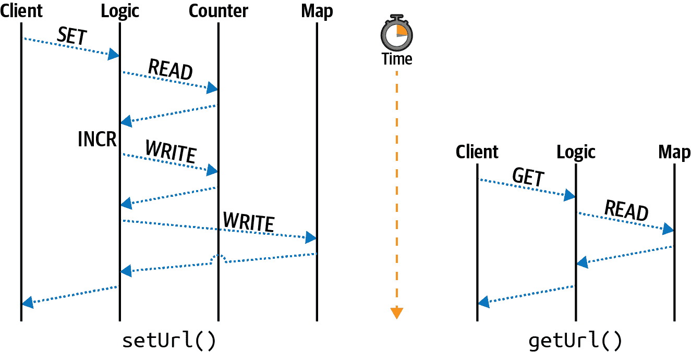
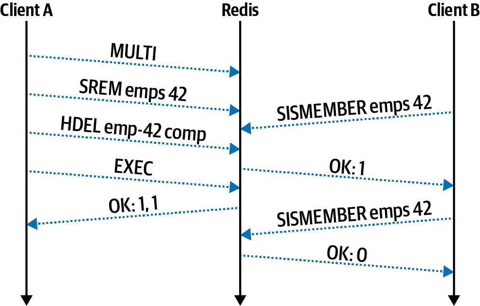

# 第九章：分布式原语

数据原语在处理单线程程序时相对直接。想要创建一个锁？只需使用布尔值。想要一个键/值存储？`Map`实例是你的朋友。想要保持有序的数据列表？可以使用数组。当只有单个线程读取和写入数组时，调用`Array#push()`和`Array#pop()`就像呼吸一样简单。在这种情况下，数组实例是完整的真实源。没有其他可能会失步的副本，也没有可能接收到顺序不对的传输中的消息。将数据持久化到磁盘只需调用`JSON.stringify()`和`fs.writeFileSync()`。

不幸的是，这种方法的性能影响巨大，而且几乎不可能扩展到规模庞大的用户群。更不用说这样的系统存在单点故障！相反，正如你在本书中看到的，性能和避免单点故障的解决方案取决于冗余的分布式进程。在存储和操作数据时必须特别小心，特别是涉及分布式系统时。

并非每个问题都能使用相同的数据存储来解决。根据数据需求（如实体关系、数据量以及一致性、持久性和延迟要求），必须选择不同的解决方案。对于由分布式服务组成的应用程序来说，有时需要几种数据存储工具。有时你需要图数据库，有时你需要文档存储，但更常见的情况可能是你只需要关系型数据库。

本章涵盖了几种不同的数据原语，这些数据原语在单个 Node.js 进程中很容易表示，并展示了它们在分布式系统中的建模方式。虽然有许多不同的工具可以用来实现各种原语，但本章集中在使用其中一种。但在深入研究之前，先探讨一下在单个实例中可能看似容易模拟但在分布式环境中却变得相当复杂的问题。

# ID 生成问题

不久前，我发现自己接受了几次面试。这一批面试是我有史以来在如此短的时间内经历过的最多的面试。讽刺的是，目的甚至不是为了找到新工作，但这是另一天的故事了。在这一轮面试中，多家公司问了我同样的问题。这甚至可能是你自己曾经收到过的一个问题：

> “你会如何设计一个链接缩短服务？”
> 
> 看起来每家硅谷的科技公司

你可能已经知道这一套路，但以防万一，就像这样：一个链接缩短器是一个 HTTP 服务，用户代理可以向短网址（如*http://sho.rt/3cUzamh*）发出请求，请求将被重定向到一个更长的网址（比如*http://example.org/foo/bar?id=123*）。首先，候选人应该提出一系列问题。“有多少用户会使用这项服务？短网址应该有多长？如果用户能够猜到短网址，这样可以吗？”一旦完成，面试官会做些笔记，然后候选人到白板上，开始画架构图和编写伪代码。

评估候选人有许多方面，通常面试官并不是在寻找完美的答案，而是希望候选人展示他们的计算机科学知识深度（“……在这里我们需要一个 DNS 服务器……”或“……一个 NoSQL 键/值存储可能比关系型存储更合适……”或“……一个用于频繁使用的 URL 的缓存……”）。我认为这个问题最有趣的部分是：你是如何生成用于短网址的 ID 的？

最终，URL ID 代表一个键，关联的值包含原始完整的 URL。无论短网址的保密性是否是一个要求，系统都将以不同的方式构建。无论如何，在分布式环境中的影响几乎相似。就争论而言，允许用户猜测短网址是可以接受的。有了这个要求，有一个标识符是一个计数器，从 1 递增到服务终止是可以接受的。通常，涉及某种编码以使 URL 更有效。例如，十六进制（`0-9A-F`）每字节允许表示 16 个唯一值，而十进制（`0-9`）只提供 10 个值。Base62 每字节允许表示 62 个唯一值（`0-9a-zA-Z`）。出于简单起见，我只讨论这些标识符的十进制表示，但在实际系统中，它们会被编码以节省空间。

示例 9-1 演示了如何使用单个 Node.js 进程构建此链接缩短器。

##### 示例 9-1\. *link-shortener.js*

```
const fs = require('fs');
fs.writeFileSync('/tmp/count.txt', '0'); // only run once
function setUrl(url) {
  const id = Number(fs.readFileSync('/tmp/count.txt').toString()) + 1;
  fs.writeFileSync('/tmp/count.txt', String(id));
  fs.writeFileSync(`/tmp/${id}.txt`, url);
  return `sho.rt/${id}`;
}
function getUrl(code) {
  return fs.readFileSync(`/tmp/${code}.txt`).toString();
}
```

单线程方法简直无法再简单了（牺牲了任何错误处理）。在设置链接时，URL 的标识符是一个数字，该标识符映射到完整的 URL，任何使用完整 URL 调用`setUrl()`将原子地将 URL 写入磁盘并返回用于表示 URL 的标识符。为了获取链接，读取相应的文件。构建此链接缩短器需要两种原语。第一个是计数器（`counter`变量），第二个是映射（存储在*/tmp/*中的文件）。图 9-1 展示了这两个`setUrl()`和`getUrl()`操作在时间轴上的工作方式。



###### 图 9-1\. 单线程 `get` 和 `set` 操作

这个图表将单线程 Node.js 应用程序中的操作分解为不同的通道，每个通道代表被查询的原语。在这种情况下，*client* 通道代表外部实体调用这两种方法。如果代码示例暴露了一个 web 服务器，那么客户端很可能是外部客户端。*logic* 通道表示围绕原语的协调逻辑；基本上它表示 JavaScript 代码本身。*counter* 通道表示与计数器原语的交互，*map* 通道表示与映射原语的交互。只有`setUrl()`方法需要访问计数器；`getUrl()`方法更简单，只是从映射中读取。

除了缺少错误处理之外，这段代码在单线程服务中技术上是可以接受的。但是，加入第二个服务实例后，应用程序就完全崩溃了。特别是，标识符增量不是原子的。需要三个步骤来增加：第一步是读取计数器值，第二步是增加该值，第三步是将该值写回持久存储。如果两个单独的服务同时接收到请求，它们将同时读取相同的 id 值（例如 100），它们将同时增加该值（变为 101），它们将同时将相同的值写入磁盘（101）。它们还将同时写入同一个文件（*101.txt*），第二个进程写入的内容将覆盖第一个进程写入的内容。

修复这个问题的一种方法是使用另一个原语，称为锁，尽管这会引入很多复杂性。锁本质上是一个布尔值。如果值为 true，则资源由一个客户端锁定，并且其他客户端应该将其视为只读。如果值为 false，则资源未锁定，客户端可以尝试设置锁。可以使用文件系统来实现锁，方法是在写文件时使用`wx`标志，但仅当文件不存在时才能创建文件。

```
fs.writeFileSync('/tmp/lock.txt', '', { flag: 'wx' });
```

假设文件不存在，此代码将创建一个名为*lock.txt*的空文件并继续运行。此时，应用程序可以自由获取计数器值，增加该值，再次写入计数器值，并使用`fs.unlinkSync()`删除锁定文件释放锁定。但是，如果文件已经存在，则应用程序需要做一些不同的事情。例如，可以在`while`循环中调用`fs.writeFileSync()`。如果调用抛出错误，则捕获错误并继续循环。最终，另一个程序应该完成对计数器的写入并释放锁定，此时调用应该成功。

听起来有点牵强，我知道，但这基本上就是多线程编程的底层发生的事情。在等待锁解锁时循环，这称为*自旋锁*。如果客户端崩溃并且没有释放锁，会发生什么？那么其他客户端将永远等待！在涉及多个锁的更复杂情况中，程序实例 A 和程序实例 B 可能会因为彼此等待释放锁而陷入僵局。当这种情况发生时，称为*死锁*。在应用程序代码中手动维护这些锁是一件风险很高的事情。

此部分仅涵盖了一个情况，即通过从单个实例移动到分布式系统使数据原语变得更加复杂，正如您可能想象的那样，还有许多其他情况等待您去发现。现在您已经了解了分布式原语如何变得复杂，您可以开始动手使用构建用于在分布式环境中存储原语的服务了。

# Redis 简介

Redis 是一个强大的服务，提供多个有用的数据结构，并提供许多不同的命令与这些数据结构交互。Redis 具有许多替代数据存储服务没有的限制：Redis 实例中存储的数据必须完全适合内存。因此，当考虑作为主数据存储（即作为真相源的服务）的工具时，Redis 通常被忽略。它更多地被固定在仅充当缓存的角色中。

要真正将 Redis 整合到您的工具库中，而不仅仅将其视为另一个缓存，您必须利用它提供的独特查询能力。为此，您可能需要在 Redis 中存储来自主要后备存储（如 Postgres）的数据子集。Redis 通常允许以快速和独特的方式查询数据，而其他数据库系统不一定支持。

例如，Redis 支持一种地理空间数据类型。这种数据类型存储与标识符关联的一组纬度和经度对。该标识符可用于引用主数据存储中的主键。可以查询这种地理空间数据结构，以获取与提供的纬度和经度对距离可配置的记录内的所有 ID 列表。在这种情况下，通过使用用户位置查询 Redis，可以查询具有匹配标识符的条目。采用这种方法，Redis 仅存储标识符和地理位置的副本；主要后备存储器包含所有这些数据以及更多内容。由于 Redis 在此情况下仅具有数据的子集，因此如果 Redis 崩溃，可以使用主存储中的数据重建 Redis。

Redis 在某些方面类似于 Node.js。在 Redis 中运行的命令以单线程方式进行，一个命令总是在另一个命令之后顺序运行。然而，在服务的边缘支持一些多线程，例如从网络读取或将数据持久化到磁盘时的 I/O。基本上，单个 Redis 实例是单线程的。但是，Redis 可以作为集群的一部分运行，有助于克服内存限制。具有 2GB 内存访问权限的三个 Redis 实例将能够存储共计 6GB 的数据。

运行以下命令在您的机器上启动 Redis 服务器：

```
$ docker run -it --rm \
  --name distnode-redis \
  -p 6379:6379 \
  redis:6.0.5-alpine
```

此命令在暴露默认端口`6379`的同时运行 Redis，将终端窗口绑定，直到服务器被终止。服务器仅会显示最重要的操作信息，例如服务器关闭或将数据写入磁盘时的信息。

Redis 使用的协议非常简单，主要是通过网络发送纯文本。执行以下 netcat 命令以说明这一点：

```
$ echo "PING\r\nQUIT\r\n" | nc localhost 6379
> +PONG
> +OK
```

在这种情况下，向 Redis 发送了两个命令。第一个是`PING`命令，第二个是`QUIT`命令。命令通过回车和换行字符分隔以区分彼此。命令可以像这样组合，这是一个称为管道化的特性，或者它们可以存在为单独的 TCP 消息。两个响应与两个命令对应。`QUIT`命令还指示 Redis 服务器关闭 TCP 连接。如果在运行此命令时遇到错误，请检查您的 Redis Docker 命令是否格式正确。

直接通过 TCP 回声文本并不是与服务进行交互的最简单方法。Redis 提供了一个 REPL，可以通过在容器内运行`redis-cli`命令来使用。REPL 提供了一些基本的自动完成和着色功能。在您的终端中运行以下命令启动交互式 Redis REPL：

```
$ docker exec -it \
  distnode-redis \
  redis-cli
```

当您启动并运行 REPL 后，输入命令**`INFO server`**并按回车键。您将看到关于服务器的一些信息作为响应。Redis 服务器运行并且 REPL 连接成功后，您现在可以开始尝试服务器的功能了。

# Redis 操作

Redis 使用键值对存储数据。每个键包含特定类型的数据，并且根据数据类型，可能会使用不同的命令与给定键交互。截至 Redis 6，已经有超过 250 个可用命令！

在使用 Redis 集群时，键的名称将被散列以确定哪个 Redis 实例持有特定键，这种技术称为*分片*。如果这些键全部位于同一个实例中，可以执行处理多个键的操作。在建模数据时，请记住这一点。在本节中，您将使用单个 Redis 实例。

Redis 键是一个可以包含二进制数据的字符串，但使用像 ASCII^(1) 这样的简化编码可能会使应用程序开发更加简便。由于键名是一个单一的字符串，它们通常包含一组复合信息是很常见的。例如，代表用户的键可能看起来像 `user:123`，而代表用户朋友的键则可能类似于 `user:123:friends`。Redis 数据库中的键是唯一的。提前确定命名约定非常重要，因为任何使用 Redis 数据库的客户端都需要以相同的方式生成名称，并且不相关的实体不应该有名称冲突。

无论键包含的数据类型是什么，每个键都附有元数据。这包括像访问时间这样的数据，对于当服务器配置为 LRU 缓存时非常有用，以及 TTL 值，允许在指定时间过期键。

创建一个名为 *redis* 的新目录。在此目录中，初始化一个新的 npm 项目并安装 `ioredis` 依赖：

```
$ mkdir redis && cd redis
$ npm init -y
$ npm install ioredis@4.17
```

当您在目录中时，请创建一个名为 *basic.js* 的新文件。将内容从 示例 9-2 添加到该文件中。

##### 示例 9-2\. *redis/basic.js*

```
#!/usr/bin/env node
// npm install ioredis@4.17
const Redis = require('ioredis');
const redis = new Redis('localhost:6379');

(async () => {
  await redis.set('foo', 'bar');
  const result = await redis.get('foo');
  console.log('result:', result);
  redis.quit();
})();
```

`ioredis` 包在 `redis` 对象上公开了与等效的 Redis 命令同名的方法。在这种情况下，`redis.get()` 方法对应于 Redis 的 `GET` 命令。传递给这些方法的参数然后对应于传递给底层 Redis 命令的参数。在这种情况下，在 JavaScript 中调用 `redis.set('foo', 'bar')` 结果是在 Redis 中运行 `SET foo bar` 命令。

接下来，执行该文件：

```
$ node redis/basic.js
> result: bar
```

如果您收到相同的响应，则表示您的应用程序能够成功与 Redis 服务器通信。如果收到连接错误，请检查您用于启动 Docker 容器的命令，并确保连接字符串格式正确。

###### 提示

你可能注意到的一件事是，应用程序在发送命令之前并不等待与 Redis 的连接。`ioredis` 包在内部将命令排队，直到连接准备就绪才将其分发。这是许多数据库包使用的便利模式。当应用程序首次运行时发送太多命令可能会限制资源。

本节剩余部分专注于常见的 [Redis 命令](https://redis.io/commands)，按其所操作的数据类型进行分类。熟悉它们将使您了解 Redis 的能力。如果您想要运行它们，可以修改您创建的 *redis/basic.js* 脚本，或者将命令粘贴到您仍然保持打开的 Redis REPL 中。

## 字符串

字符串存储二进制数据，并且是 Redis 中提供的最基本的数据类型。从某种意义上说，这是 Memcached 提供的唯一数据类型，一个竞争缓存服务。如果您严格将 Redis 用作缓存，则可能永远不需要接触其他数据类型。

在字符串上执行的最基本操作是设置值和获取值。切换回你的 Redis REPL 并运行以下命令：

```
SET foo "bar"
```

当你输入`SET`命令时，`redis-cli` REPL 将为命令的剩余参数提供提示。许多 Redis 命令提供更复杂的参数，特别是在改变元数据时。根据 REPL，`SET`命令的完整形式如下：

```
SET key value [EX seconds|PX milliseconds] [NX|XX] [KEEPTTL]
```

方括号中的选项是可选的，竖线表示可以使用其中之一。第一个选项允许命令设置 TTL 值，并且可以使用秒数（`EX 1`）或毫秒数（`PX 1000`）提供值。第二对选项处理替换现有值。`NX`选项仅在尚不存在具有相同名称的键时执行替换，而`XX`选项仅在已存在值时设置值。最后，`KEEPTTL`可用于保留已存在的键的现有 TTL 值。

现在你已经在 Redis 中设置了一个值，请运行以下命令来检索它：

```
GET foo
> "bar"
```

在这种情况下，字符串*bar*被返回。

大多数情况下，Redis 不关心存储在键中的值，但有几个显著的例外。例如，字符串数据类型允许对值进行数值修改。作为此功能的示例，在你的 REPL 中运行以下命令：

```
SET visits "100"
> OK
INCR visits
> (integer) 101
```

第一个命令将名为*visits*的键设置为字符串值`100`。下一个命令增加键的值并返回结果；在这种情况下，结果是值`101`。`INCR`和`INCRBY`命令允许应用程序原子地增加一个值，而不必首先检索该值，本地增加它，然后设置该值。这消除了在你在 [示例 9-1](https://example.org/ex_link_shortener) 中构建的单线程 Node.js 服务中存在的竞态条件。请注意，返回提示显示有关结果的一些元数据。在这种情况下，它暗示该值为整数。如果你运行**`GET visits`**命令，该值将再次作为字符串检索。

请注意，如果你未首先为*visits*键设置值，则`INCR`命令将假定缺失的值为零。大多数操作中，Redis 假定适当的空值。这使得在分布式环境中与 Redis 交互更加方便。例如，如果没有这个零默认值，如果你部署了一组 Node.js 应用实例，每当接收到请求时都会递增*visits*值，那么你需要在应用程序运行之前手动将*visits*设置为零。

Redis 有数十个专门用于操作字符串的命令。可以使用`APPEND`命令将值附加到字符串。可以对字符串的子集应用位读写操作，并且可以使用`INCRBYFLOAT`命令使用浮点值进行增量。

## 列表

列表数据结构存储了一系列字符串值的链表，并且与 JavaScript 数组类似。与 JavaScript 数组类似，条目是有序的，允许重复。

运行以下命令向名为 *list* 的列表添加一些条目，然后检索它们：

```
RPUSH list aaa
> (integer) 1
RPUSH list bbb
> (integer) 2
LRANGE list 0 -1
> 1) "aaa"
> 2) "bbb"
```

同样地，就像处理字符串一样，Redis 假定列表数据类型的适当空值。在这种情况下，当您运行第一个 `RPUSH` 命令时，名为 *list* 的键不存在。Redis 假定这是一个空列表，并向列表添加了一个条目。`RPUSH` 命令的结果是列表的长度，首先返回 1，然后返回 2。最后，`LRANGE` 命令获取列表中的条目列表。与 JavaScript 类似，Redis 假定列表索引从零开始。`LRANGE key 0 -1` 命令始终可以用来检索整个列表，无论其长度如何。

Redis 提供了超过十几个与列表数据类型相关的命令。表 9-1 列出了许多 Redis 列表命令及其在 JavaScript 数组上的等效操作。

表 9-1\. Redis 列表命令及其等效 JavaScript 数组操作

| 操作 | Redis 命令 | JavaScript 数组等价操作 |
| --- | --- | --- |
| 右侧添加条目 | `RPUSH key element` | `arr.push(element)` |
| 左侧添加条目 | `LPUSH key element` | `arr.unshift(element)` |
| 从右侧获取条目 | `RPOP key element` | `arr.pop(element)` |
| 从左侧获取条目 | `LPOP key element` | `arr.shift(element)` |
| 获取长度 | `LLEN key` | `arr.length` |
| 检索索引处元素 | `LINDEX key index` | `x = arr[index]` |
| 替换索引处元素 | `LSET key index element` | `arr[index] = x` |
| 移动元素 | `RPOPLPUSH source dest` | `dest.push(source.pop())` |
| 获取元素范围 | `LRANGE key start stop` | `arr.slice(start, stop+1)` |
| 获取第一次出现 | `LPOS key element` | `arr.indexOf(element)` |
| 获取最后一次出现 | `RPOS key element` | `arr.lastIndexOf(element)` |
| 缩减大小 | `LTRIM key start stop` | `arr=arr.slice(start,stop+1)` |

有些命令一开始看起来可能有点奇怪。例如，为什么 Redis 需要 `RPOPLPUSH` 命令，而不是使用其他命令的组合来重建？这主要是因为需要支持许多分布式客户端对位于集中位置的数据执行原子操作。如果没有 `RPOPLPUSH` 命令，客户端需要分别执行 `RPOP` 和 `LPUSH` 命令，这使得另一个客户端可以交错执行命令，可能导致数据处于不一致的状态。有关这类情况的更详细信息，请参见“追求原子性”。

###### 注意

当从列表中删除最后一个元素时，Redis 将完全删除该键。您可以通过两次运行 **`RPOP list`** 命令，然后运行 **`KEYS *`** 命令来验证此行为；*list* 键不再存在。这种行为与字符串数据类型不同，字符串数据类型可以包含空字符串。

## 集合

Redis 集合是一组唯一值的无序集合。它类似于 JavaScript 中的 `new Set()`。当向 JavaScript 或 Redis 集合中插入冗余值时，冗余条目将被静默忽略。

在您的 REPL 中运行以下命令以向集合中添加条目，并随后检索它们：

```
SADD set alpha
> (integer) 1
SADD set beta
> (integer) 1
SADD set beta
> (integer) 0
SMEMBERS set
> 1) "beta"     2) "alpha"
```

第一个 `SADD` 命令将名为 *alpha* 的条目添加到名为 *set* 的集合中。第二个命令将名为 *beta* 的条目添加到同一集合中。这两个命令都返回 1，表示成功添加了一个条目。第三个 `SADD` 命令尝试再次向集合中添加 *beta*。这次返回 0，表示未添加任何条目。最后，`SMEMBERS` 命令返回集合中每个成员的列表。

表 9-2 是一些 Redis 集合命令及其使用 JavaScript `Set` 的等效操作的列表。

表 9-2\. Redis 集合命令及其等效的 JavaScript `set` 操作

| 操作 | Redis 命令 | JavaScript set 等效操作 |
| --- | --- | --- |
| 向集合添加条目 | `SADD key entry` | `set.add(entry)` |
| 计算条目数 | `SCARD key` | `set.size` |
| 检查集合是否包含条目 | `SISMEMBER key entry` | `set.has(entry)` |
| 从集合中删除条目 | `SREM key entry` | `set.delete(entry)` |
| 检索所有条目 | `SMEMBERS key` | `Array.from(set)` |
| 在集合之间移动 | `SMOVE src dest entry` | `s2.delete(entry) && s1.add(entry)` |

Redis 还提供了几个与集合交互的其他命令，特别是用于处理集合之间的并集和差集的命令。还有 `SRANDMEMBER` 和 `SPOP` 命令，用于读取集合的随机条目和弹出一个条目。`SSCAN` 命令允许客户端通过使用游标迭代集合的条目，这是执行结果分页的一种方式。

与列表类似，清空集合中的所有条目将导致其键被移除。

## 哈希

Redis 哈希是一个单一键，其中包含多个字段/值对。Redis 哈希最接近 JavaScript 中的 `new Map()`。哈希内的值也被视为字符串，虽然它们具有一些与普通 Redis 字符串相同的操作（如增加值的能力）。与普通 Redis 字符串不同的是，哈希中的各个字段不能应用自己的元数据（例如 TTL）。在分片方面，哈希中的所有字段最终都会在同一台机器上。

在您的 REPL 中运行以下命令以进行哈希实验：

```
HSET obj a 1
> (integer) 1
HSET obj b 2
> (integer) 1
HSET obj b 3
> (integer) 0
HGETALL obj
1) "a"      2) "1"      3) "b"      4) "3"
```

就像列表命令一样，添加条目的哈希命令返回已添加的条目数量，尽管含义稍有不同。在这种情况下，第一次调用`HSET obj b`时，*b*字段尚不存在，因此操作的结果是 1，意味着首次添加了一个新字段。第二次运行命令时，返回值为 0，表示字段并非新添加。相反，调用替换了已经存在的值。最后，`HGETALL`命令检索哈希中所有字段/值对的列表。请注意，Redis 使用的简单协议无法区分字段和值；这两种类型的数据是交替的！当使用大多数 Redis 客户端包（包括`ioredis`）时，这会自动转换为等效的 JavaScript 对象`{a:1,b:2}`。

表 9-3 列出了一些 Redis 哈希命令及其在 JavaScript `Map`中的等效操作。

表 9-3\. Redis 哈希命令及等效 JavaScript `Map`操作

| 操作 | Redis 命令 | JavaScript map 等效 |
| --- | --- | --- |
| 设置条目 | `HSET key field value` | `map.set(field, value)` |
| 移除条目 | `HDEL key field` | `map.delete(field)` |
| 存在条目 | `HEXISTS key field` | `map.has(field)` |
| 检索条目 | `HGET key field` | `map.get(field)` |
| 获取所有条目 | `HGETALL key` | `Array.from(map)` |
| 列出键 | `HKEYS key` | `Array.from(map.keys())` |
| 列出值 | `HVALS key` | `Array.from(map.values())` |

在 JavaScript 中增加`Map`条目时，您首先需要检索条目，增加值，然后再次设置它，假设映射包含一个`Number`实例的值。如果值包含具有属性`v`的对象，则可以像这样增加它们：`map.get(field).v++`。使用 Redis 的等效命令是`HINCRBY key field 1`。

考虑到 Redis 中的字符串数据类型可以保存任何可以表示为字节字符串的内容，包括 JSON 对象。在这种情况下，为什么您可能会选择使用哈希而不是 JSON 编码的字符串？哈希在以下情况下非常有用：当您希望将多个属性紧密存储在一起时，当所有属性应具有相同的 TTL 时，以及当您需要原子地操作一组键时。当所有字段值的大小非常大时，一次性检索整个内容是不可取的时候，哈希也非常有用。

作为示例，假设你有一个表示员工的 1MB JSON 对象。其中一个字段是员工的工资。这个工资的 JSON 表示可能如下所示：

```
{"wage": 100000, "...other fields": "..."}
```

要修改该文档中的`wage`字段，您需要调用`GET key`检索它，`result = JSON.parse(response)`解析它，`result.wage += 1000`增加工资，`payload = JSON.stringify(result)`序列化它，以及`SET key payload`持久化它。这些修改不能轻松地原子性地执行，因为您需要某种锁来防止其他客户端同时修改数据。还有读取和写入 1MB 负载的开销，以及解析和编码负载的开销。通过将这些数据表示为 Redis 哈希，您可以直接修改您想要的字段。

由于哈希中的所有字段都存储在单个 Redis 实例上，因此确保大部分数据不要使用单个庞大的哈希表示是很重要的。例如，如果您想在 Redis 中存储每个员工的工资信息，最好使用每个员工一个单独的键，而不是使用一个单一的哈希键和每个员工一个字段。

## 有序集合

Redis 有序集合是 Redis 中可用的较为复杂的数据结构之一。它存储一组按数值分数排序的唯一字符串值。可以根据分数范围查询条目。JavaScript 没有内置等效于 Redis 有序集合的数据结构，尽管可以使用多个数据结构构建一个。

Redis 有序集合的典型示例是游戏玩家得分排行榜。在这种用例中，数值分数是玩家所取得的成就，而值是玩家的标识符。Redis 提供了许多命令用于与有序集合交互，其中许多用于根据分数值范围检索条目。

运行以下命令创建一个示例玩家排行榜：

```
ZADD scores 1000 tlhunter
ZADD scores 500 zerker
ZADD scores 100 rupert
ZINCRBY scores 10 tlhunter
> "1010"
ZRANGE scores 0 -1 WITHSCORES
> 1) "rupert"     2) "100"
> 3) "zerker"     4) "900"
> 5) "tlhunter"   6) "1010"
```

前三个命令向有序集合添加条目。多次调用`ZADD`命令并使用相同的成员将替换成员的分数。当成员是新的时，`ZADD`命令返回 1，当条目已经存在时返回 0，就像列表和集合一样。`ZINCRBY`命令增加成员的分数，如果成员不存在，则假定分数为 0。

`ZRANGE`命令根据分数顺序检索有序集合中的条目列表。您可以普遍使用`ZRANGE key 0 -1`命令获取有序集合中所有成员的列表。`WITHSCORES`选项指示 Redis 也包括它们的分数。

表 9-4 列出了一些有序集合可用的命令。

表 9-4\. Redis 有序集合命令

| 操作 | Redis 命令 |
| --- | --- |
| 添加条目 | `ZADD key score member` |
| 计算条目数量 | `ZCARD key` |
| 移除条目 | `ZREM key member` |
| 获取成员的分数 | `ZSCORE key member` |
| 增加成员的分数 | `ZINCRBY key score member` |
| 获取结果页 | `ZRANGE key min max` |
| 获取成员的数值排名 | `ZRANK key member` |
| 获取成员的逆序数值排名 | `ZREVRANK key member` |
| 获取分数范围内的成员 | `ZRANGEBYSCORE key min max` |
| 删除分数范围内的成员 | `ZREMRANGEBYSCORE key min max` |

以排行榜类比，通过调用 `ZREVRANK scores tlhunter` 可以查找玩家的数值排名，返回值为 0，因为其分数最高。许多命令都有一个 `REV` 变体，以反向方式处理排名。还有一些命令有一个 `REM` 变体，从排序集合中移除条目。

## 通用命令

Redis 中的大多数命令都与特定数据类型的键相关联。例如，`HDEL` 命令从哈希中删除字段。但也有很多命令要么影响任何类型的键，要么全局影响 Redis 实例。

表 9-5 包含一些影响任何数据类型键的流行命令。

表 9-5\. 通用 Redis 命令

| 操作 | Redis 命令 |
| --- | --- |
| 删除键 | `DEL key` |
| 检查键是否存在 | `EXISTS key` |
| 设置键的过期时间 | `EXPIRE key seconds`, `PEXPIRE key ms` |
| 获取键的过期时间 | `TTL key`, `PTTL key` |
| 移除键的过期时间 | `PERSIST key` |
| 获取键的数据类型 | `TYPE key` |
| 重命名键 | `RENAME key newkey` |
| 获取键列表 | `KEYS pattern`（`*`表示所有键） |

注意，`KEYS` 命令用于本地调试，但效率低下，不应在生产环境中使用。

表 9-6 列出了一些与 Redis 服务器交互的流行命令，这些命令不与单个键关联。

表 9-6\. Redis 服务器命令

| 操作 | Redis 命令 |
| --- | --- |
| 获取键的数量 | `DBSIZE` |
| 移除所有键 | `FLUSHDB` |
| 获取服务器信息 | `INFO` |
| 列出正在运行的命令 | `MONITOR` |
| 将数据保存到磁盘 | `BGSAVE`, `SAVE` |
| 关闭连接 | `QUIT` |
| 关闭服务器 | `SHUTDOWN` |

注意，`MONITOR` 命令用于本地调试，但效率低下，不应在生产环境中使用。

## 其他类型

Redis 还支持一些其他数据类型及其相关命令，本章节未涵盖。

其中一组命令处理地理位置数据。在内部，地理位置命令操作按纬度和经度值排序的有序集合，这些值表示为地理哈希。可以使用另一个命令快速检索所有位于给定经纬度对可配置半径内的条目。这对于查找 1 公里半径内的所有企业等操作非常有用。

此外，还有一种 HyperLogLog 数据结构，用于存储大型数据集的压缩表示。这允许你测量事件发生的大致次数。适用于存储不需要百分之百准确性的采样数据。

Redis 中另一组有趣的命令是 PubSub（发布/订阅）命令系列。这些命令允许客户端订阅通道以接收消息或向通道发布消息。消息的副本将发送到每个监听该通道的客户端，尽管通道也可以没有订阅者。这使得一次性向多个客户端发送信息变得非常方便。

Streams 是 Redis 的最新添加。它们是一组持久的只追加事件，类似于 PubSub 命令，客户端可以接收事件，但更强大。事件由时间戳和序列号组合来标识，因此标识符是有序的。流使用所谓的“消费者组”允许消息要么扇出到多个客户端，要么仅由一个客户端消费。Redis Streams 与 Kafka 竞争。

# 追求原子性

原子性是一系列操作的属性，其中要么所有操作都执行，要么一个都不执行。当这些操作正在执行时，外部客户端永远不会观察到中间状态，即只有一些操作已经应用了。原子性的“hello world”示例是在账户 A 和账户 B 之间转移 100 美元的账户余额。为了使转账是原子的，账户 A 的余额必须减少 100 美元，账户 B 的余额必须增加 100 美元。如果发生故障，则这两个更改都不应发生。并且在转账过程中，没有客户端应该看到一个余额已经改变而另一个没有改变。

在单个 Redis 服务器中，执行的每一个*单一*命令都是原子的。例如，好玩的 `RPOPLPUSH` 命令在两个不同的列表上操作，从一个列表中移除一个条目并添加到另一个列表。Redis 强制执行该命令的完全成功或失败。服务器在任何时候都不会处于弹出值消失或同时存在于两个列表中的状态，无论是由于失败还是另一个客户端在命令执行期间对列表进行读取操作。另一方面，*多个*连续命令的执行不是原子的。例如，如果客户端运行 `RPOP` 然后 `LPUSH`，另一个客户端可以在这两个命令执行之间读取或写入列表。

Redis 提供了几种“复合命令”，这是我刚刚发明的一个术语，意思是一个单一命令可以替代多个命令。Redis 为常见用例提供了这些复合命令，其中原子性很重要。表 9-7 是这些复合命令的示例，以及它们对应的 Redis 命令和应用伪代码。

表 9-7\. Redis 复合命令

| Command | Alternative pseudocode |
| --- | --- |
| `INCR key` | `GET key ; value++ ; SET KEY value` |
| `SETNX key value` | `!EXISTS key ; SET key value` |
| `LPUSHX key value` | `EXISTS key ; LPUSH key value` |
| `RPOPLPUSH src dest` | `RPOP src ; LPUSH dest value` |
| `GETSET key value` | `GET key ; SET key value` |

通过运行一个复合命令，您可以保证原子地修改数据集，并且效率高。如果选择运行命令的替代版本，则需要从应用程序代码进行多次往返，此期间 Redis 数据库处于不良状态。在这种情况下，另一个客户端可能会读取中间状态，或者应用程序可能会崩溃，使数据永远无效。

这个难题在图 9-2 中有所体现，两个客户端同时运行`GET`、递增和`SET`命令。


###### 图 9-2\. 类似`GET`和`SET`的顺序 Redis 命令不是原子的

在这种情况下，客户端 A 和客户端 B 都希望递增一个数字。他们几乎同时读取`counter`的值，并得到值 0。接下来，两个客户端在本地递增值，计算出值 1。最后，两个客户端几乎同时写入他们递增后的值，将值设置为 1，而不是正确的值 2。

有时候你会很幸运，需要在 Redis 中执行的操作具有单个可用命令。图 9-3 展示了如何使用`INCR`命令正确解决前述难题。


###### 图 9-3\. `INCR`在 Redis 中是原子操作

在这种情况下，两个客户端几乎同时运行`INCR`命令。Redis 服务器在内部处理变化的细节，客户端不再有数据丢失的风险。在这种情况下，值安全地增加到 2。

有时候你可能就没那么幸运了。例如，你可能需要从名为`employees`的集合中删除员工 ID＃42，同时还要从名为`employee-42`的哈希表中删除公司 ID。在这种情况下，没有 Redis 命令可以同时从集合中删除并从哈希表中删除。可能需要成千上万个命令来处理类似的每种情况。当遇到这种情况时，你需要使用另一个工具。

###### 注

Redis 确实有一种称为*流水线*的特性，其中客户端发送一系列由换行符分隔的命令，而不是作为单独的消息。这确保了命令在给定客户端内部按顺序运行，但不能保证其他客户端不会在另一个客户端的流水线中间运行命令。流水线中的单个命令可能失败。这意味着流水线不会使命令原子化。

在“ID 生成问题”中提到的 ID 生成问题可以通过这两个复合命令来解决。首先使用`INCR`命令原子地增加计数器来实现。一个单一的键用于表示下一个可用的短 URL 代码。第二个操作使用`SETNX`命令设置 URL 值。与原始示例一致，在写入文件的操作中，如果条目已经存在（这不应该发生），操作将失败。

# 事务

Redis 确实提供了一种机制来确保多个命令的原子执行。这是通过在一系列命令之前加上`MULTI`，然后跟随`EXEC`来完成的。这允许从单个客户端连接发送的所有命令完全执行而没有中断。如果事务中的任何命令失败，那么成功执行的命令的效果将被回滚。

示例 9-3 演示了如何使用`ioredis`包创建 Redis 事务。创建一个名为*redis/transaction.js*的新文件，并将代码添加到其中。

##### 示例 9-3\. *redis/transaction.js*

```
#!/usr/bin/env node // npm install ioredis@4.17 const Redis = require('ioredis');
const redis = new Redis('localhost:6379');

(async () => {
  const [res_srem, res_hdel] = await redis.multi() 
    .srem("employees", "42") // Remove from Set
    .hdel("employee-42", "company-id") // Delete from Hash
    .exec(); 
  console.log('srem?', !!res_srem[1], 'hdel?', !!res_hdel[1]);
  redis.quit();
})();
```


`ioredis`提供了一个可链式调用的`.multi()`方法来开始一个事务。


`.exec()`方法完成事务。

此应用程序运行一个包含两个命令的事务。第一个命令从一个集合中移除一个员工，第二个命令从一个哈希中移除员工的公司 ID。在新的终端窗口中运行以下命令，首先创建一些数据，然后执行 Node.js 应用程序：

```
$ docker exec distnode-redis redis-cli SADD employees 42 tlhunter
$ docker exec distnode-redis redis-cli HSET employee-42 company-id funcorp
$ node redis/transaction.js
> srem? true hdel? true
```

运行 Redis 事务时会返回多个结果，每个命令在事务中执行一次。`ioredis`包将这些命令的结果表示为一个数组，应用程序将其解构为两个变量。每个变量也是一个数组，第一个元素是错误状态（在本例中为 null），第二个是命令的结果（在本例中为 1）。再次运行 Node.js 应用程序，输出应该显示`srem? false hdel? false`。

当 Redis 从客户端 A 接收到一个事务时，也就是说它已经收到了`MULTI`命令但还没有收到`EXEC`命令，其他客户端仍然可以自由发出命令。这一点很重要，因为一个慢速的客户端会阻止 Redis 响应其他客户端。乍看起来可能违反了原子性的规则，但关键在于 Redis 只是将命令排队而不运行它们。一旦服务器最终接收到`EXEC`命令，事务中的所有命令就会运行。此时其他客户端无法与 Redis 交互。图 9-4 展示了这种情况的泳道图。

事务很有用，但它们也有一个主要限制：一个命令的输出不能作为另一个命令的输入。例如，使用`MULTI`和`EXEC`，不能构建`RPOPLPUSH`命令的版本。该命令依赖于从`RPOP`输出的元素作为`LPUSH`命令的参数使用。



###### 图 9-4\. Redis 事务在提交更改前等待`EXEC`

在事务内部也无法执行其他类型的逻辑。例如，无法检查员工哈希是否有名为*resigned*的字段，然后有条件地运行一个命令将*salary*字段设置为 0。要克服这些限制，需要更强大的工具。

# Lua 脚本

Redis 提供了一种在 Redis 服务器内执行过程化脚本的机制。这使得复杂的数据交互成为可能（例如，在写入另一个键之前读取一个键并做出决策）。其他数据库中也存在类似的概念，比如 Postgres 的存储过程或 MongoDB 运行 JavaScript 的能力。Redis 选择使用易于嵌入的 Lua 脚本语言，而不是发明一种新的语言。

Lua 具有许多与其他语言（例如 JavaScript）^(2) 相同的特性。它提供数组（尽管索引从 1 开始而不是 0）和表（类似于 JavaScript 的`Map`），并且像 JavaScript 一样是动态类型的。它有空值（null）类型、布尔值、数字、字符串和函数。它支持`for`和`while`循环、`if`语句等。Lua 的完整语法在此不作详述，但在编写 Redis 脚本时，您可以轻松查阅相关信息。

在 Redis 中有多种模式可用于运行 Lua 脚本。第一种模式使用更简单，但效率较低。通过调用`EVAL`命令并将整个 Lua 脚本作为字符串参数传入来使用。这并非理想之选，因为每次调用命令时都会消耗带宽，可能会发送较长的脚本。这种模式类似于运行 SQL 查询，每次查询调用都需要整个查询字符串的副本。

第二种模式更高效，但需要额外的工作来确保其正确性。在这种模式下，首先调用`SCRIPT LOAD`命令，并将脚本作为参数传递。当 Redis 接收到该命令时，将返回一个 SHA1 字符串以便将来引用该命令。^(3) 稍后可以使用`EVALSHA`命令执行该脚本，并将 SHA1 作为参数。这样可以减少传输的数据量。

`EVAL`和`EVALSHA`命令本质上具有相同的参数，不同之处在于第一个参数分别是完整脚本或脚本引用。以下是命令签名的样式：

```
EVAL script numkeys key [key ...] arg [arg ...]
EVALSHA sha1 numkeys key [key ...] arg [arg ...]
```

请回忆之前提到的，Redis 命令组只能影响存在于同一 Redis 实例上的键。这也适用于事务和 Lua 脚本。这意味着在尝试执行脚本之前，Redis 需要知道将要访问哪些键。因此，在执行脚本时需要提供所有键作为参数。

###### 警告

可以在 Lua 脚本中嵌入键名，甚至动态生成它们，而不必将键名作为参数传入。但不要这样做！在单个 Redis 实例上测试时可能会正常工作，但如果未来扩展到 Redis 集群，则会带来麻烦。

在运行脚本时可以提供键名和参数。第二个 `numkeys` 参数是必需的，以便 Redis 可以区分键名和其他参数。该值告诉 Redis，接下来的 `numkeys` 参数是键，之后的任何参数是脚本参数。

## 编写 Lua 脚本文件

现在您已经熟悉 Lua 脚本背后的一些理论，可以开始自己动手做些什么了。例如，您可以为多人游戏构建一个等待大厅。当玩家尝试加入游戏时，他们将被添加到大厅中。如果大厅中已经有足够多的玩家（在这种情况下是四个玩家），那么玩家将从大厅中移除，并创建一个游戏。将创建一个哈希来包含正在运行的游戏集合及其中的玩家。此时，应用程序理论上可以通知玩家游戏已经开始，但这是留给读者的一项练习。

对于应用程序的第一部分，您将创建一个 Lua 文件，其中包含要在 Redis 服务器上执行的代码。创建一个名为 *redis/add-user.lua* 的新文件，并将内容从 Example 9-4 添加到其中。我敢打赌你从未想过会在 Node.js 书中编写 Lua 代码！

##### 示例 9-4\. *redis/add-user.lua*

```
local LOBBY = KEYS[1] -- Set
local GAME = KEYS[2] -- Hash
local USER_ID = ARGV[1] -- String

redis.call('SADD', LOBBY, USER_ID)

if redis.call('SCARD', LOBBY) == 4 then
  local members = table.concat(redis.call('SMEMBERS', LOBBY), ",")
  redis.call('DEL', LOBBY) -- empty lobby
  local game_id = redis.sha1hex(members)
  redis.call('HSET', GAME, game_id, members)
  return {game_id, members}
end

return nil
```

Redis 提供的 Lua 脚本环境附带两个全局数组，用于访问脚本提供的参数。第一个称为 `KEYS`，其中包含 Redis 键的列表，第二个称为 `ARGV`，其中包含普通参数。第一个键分配给名为 `LOBBY` 的变量。这是一个包含玩家标识符列表的 Redis 集合。`local` 关键字是 Lua 声明局部变量的方式。第二个键分配给名为 `GAME` 的变量，这是一个包含活动游戏的哈希表。最后，脚本的唯一参数分配给 `USER_ID`，这是刚刚添加到大厅的玩家的 ID。

接下来，将玩家标识符添加到 `LOBBY` 键中。Redis Lua 环境提供了 `redis.call()` 方法，允许 Lua 调用 Redis 命令。在此文件中调用的第一个命令是 `SADD`（集合添加）命令。

下一个构造是第一行命令式编程发生的地方（在这种情况下是一个`if`语句）。此语句调用`SCARD`（集合基数）命令来计算集合中条目的数量。如果条目数量不等于 4（对于第一次运行来说确实不是），则跳过`if`语句的主体。然后，调用最后一行，并返回一个`nil`值。`nil`值然后由`ioredis`包转换为 JavaScript 的`null`。

然而，一旦大厅中添加了第四名玩家，`if`语句的主体将被执行。通过使用`SMEMBERS`（集合成员）命令从大厅中检索玩家列表。使用 Lua 的`table.concat()`函数将玩家列表转换为逗号分隔的字符串。接下来，大厅被清空。请记住，空列表会被删除，因此在这种情况下，调用`DEL`（删除）命令实际上是清空列表。

接下来，游戏的标识符被生成。有很多方法可以生成这样一个 ID，但在这种情况下，使用了成员字符串的 SHA1 哈希。Lua 没有自带的 SHA1 函数，但 Redis 提供的 Lua 环境中有。在这种情况下，函数通过`redis.sha1hex()`提供。返回的字符串应该在所有游戏中是唯一的，假设相同的玩家不能同时加入多个游戏。^(4) 然后，将此标识符使用`HSET`设置到游戏哈希中，其中字段名是游戏 ID，值是逗号分隔的玩家 ID 列表。

最后，返回一个包含两个元素的数组（表），其中第一个是游戏 ID，第二个是玩家列表。脚本可以在运行之间返回不同类型的数据，在这种情况下，脚本返回表或 nil。

该脚本原子性地向大厅添加玩家并创建游戏。它要求大厅和游戏哈希都存储在同一个 Redis 实例中。您可以通过使用单个 Redis 实例或在命名键时使用大括号来确保这一点。通常，Redis 通过对键进行哈希来选择将哪个实例托管在哪个实例上。但是，如果在键名的子集中使用大括号，则仅使用大括号内的值进行哈希。在这种情况下，如果大厅键名为`lobby{pvp}`，游戏键名为`game{pvp}`，那么键总是会在一起。

单独看 Lua 脚本并不是很有趣，但一旦创建了 Node.js 应用程序，事情将变得更加有趣。

## 加载 Lua 脚本

此应用程序连接到 Redis 服务器，评估脚本，并插入四名玩家。这相当基础，旨在说明如何调用命令，而不是与 Web 服务器集成以暴露完全功能的游戏应用程序。

创建一个名为*redis/script.js*的新文件，并将示例 9-5 的内容添加到其中。

##### 示例 9-5\. *redis/script.js*

```
#!/usr/bin/env node
// npm install ioredis@4.17
const redis = new (require('ioredis'))('localhost:6379');
redis.defineCommand("adduser", {
  numberOfKeys: 2,
  lua: require('fs').readFileSync(__dirname + '/add-user.lua')
});
const LOBBY = 'lobby', GAME = 'game';
(async () => {
  console.log(await redis.adduser(LOBBY, GAME, 'alice')); // null
  console.log(await redis.adduser(LOBBY, GAME, 'bob')); // null
  console.log(await redis.adduser(LOBBY, GAME, 'cindy')); // null
  const [gid, players] = await redis.adduser(LOBBY, GAME, 'tlhunter');
  console.log('GAME ID', gid, 'PLAYERS', players.split(','));
  redis.quit();
})();
```

该文件从要求`ioredis`包并建立连接开始。接下来，读取*add-user.lua*脚本的内容，并传递给`redis.defineCommand()`方法。此方法抽象了 Lua 命令，并使应用程序能够使用所选择的名称定义命令。在这个例子中，脚本被别名为一个名为*adduser*的命令。

接下来，声明了两个由 Redis Lua 脚本使用的键名。在这种情况下，大厅列表键是`lobby`，游戏哈希是`game`。从理论上讲，这些键名可以根据每次调用而变化，因为它们并不是脚本本身的一部分。例如，这可以允许游戏有多个大厅，例如一个用于银级玩家，另一个用于金级玩家。

接下来，异步函数调用`redis.adduser()`方法四次，模拟四个不同的玩家加入大厅。之前调用的`redis.defineCommand()`方法在`redis`对象上创建了这个新的`redis.adduser()`方法。这个新方法的参数反映了传递给 Lua 脚本的参数（在本例中为大厅键、游戏键和玩家 ID）。请注意，这并不会在 Redis 服务器上创建一个名为`ADDUSER`的命令；它只是一个本地 JavaScript 方法。

调用`redis.adduser()`将分别运行存储在 Redis 中的*add-user.lua*脚本。前三次调用将各自返回`null`。然而，第四次调用会触发游戏创建逻辑。在这种情况下，将返回一个数组，第一个值是游戏 ID (`gid`)，第二个值是玩家列表 (`players`)。

## 将所有内容整合在一起

现在，应用程序文件和 Lua 文件已准备就绪，是时候运行应用程序了。在两个单独的终端窗口中运行以下两个命令。第一个命令将运行`MONITOR`命令，打印 Redis 服务器接收到的所有命令。第二个命令运行应用程序：

```
$ docker exec -it distnode-redis redis-cli monitor
$ node redis/script.js
```

应用程序显示了对`redis.adduser()`的四次调用的结果。在我的情况下，应用程序的输出如下所示：

```
null
null
null
GAME ID 523c26dfea8b66ef93468e5d715e11e73edf8620
  PLAYERS [ 'tlhunter', 'cindy', 'bob', 'alice' ]
```

这说明加入的前三位玩家并未引发游戏启动，但第四位玩家引发了游戏。通过返回的信息，应用程序随后可以选择通知这四名玩家，例如通过 WebSocket 向他们推送消息。

`MONITOR`命令的输出可能会更有趣一些。该命令显示几列信息。第一列是命令的时间戳，第二列是运行命令的客户端标识符（或如果是由 Lua 脚本运行，则是字符串`lua`），剩余部分是正在执行的命令。在我的机器上，输出的简化版本如下所示：

```
APP: "info"
APP: "evalsha" "1c..32" "2" "lobby" "game" "alice"
APP: "eval" "local...\n" "2" "lobby" "game" "alice"
LUA: "SADD" "lobby" "alice"
LUA: "SCARD" "lobby"
... PREVIOUS 3 LINES REPEATED TWICE FOR BOB AND CINDY ...
APP: "evalsha" "1c..32" "2" "lobby" "game" "tlhunter"
LUA: "SADD" "lobby" "tlhunter"
LUA: "SCARD" "lobby"
LUA: "SMEMBERS" "lobby"
LUA: "DEL" "lobby"
LUA: "HSET" "game" "52..20" "tlhunter,cindy,bob,alice"
```

执行的第一个命令是 `INFO` 命令。`ioredis` 包运行此命令以了解 Redis 服务器的功能。之后，`ioredis` 对 Lua 脚本本身进行哈希并尝试通过发送带有它计算的 SHA1 的 `EVALSHA` 命令来为玩家 *alice* 执行它（缩写为 `1c..32`）。该命令失败，`ioredis` 回退到直接运行 `EVAL`，并传递脚本的内容（缩写为 `local…`）。一旦这发生，服务器现在在内存中存储了脚本的哈希。Lua 脚本调用了 `SADD` 和 `SCARD` 命令。`EVALSHA`、`SADD` 和 `SCARD` 命令分别再次重复两次，一次为 *bob*，一次为 *cindy*。

最后，第四次调用是为玩家 *tlhunter* 进行的。这导致执行 `SADD`、`SCARD`、`SMEMBERS`、`DEL` 和 `HSET` 命令。

此时，你已经完成了对 Redis 服务器的操作。切换到运行 `MONITOR` 命令的终端窗口，并使用 Ctrl + C 终止它。你也可以切换到运行 Redis 服务器的终端，并使用相同的键序列终止它，除非你想继续进行更多实验。

作为经验法则，只有当使用常规命令和事务无法原子执行相同操作时，才应使用 Lua 脚本。首先，将脚本存储在 Redis 中至少会带来一定的内存开销。然而更重要的是，Redis 是单线程的，执行的 Lua 也是如此。任何缓慢的 Lua 脚本（甚至是无限循环）都会拖慢连接到服务器的其他客户端。解析代码和评估它也会有性能损失。如果运行 Lua 脚本来执行单个 Redis 命令，它无疑会比直接运行 Redis 命令慢。

^(1) 例如，一个字符“È”有单字节和多字节 UTF 表示，二进制比较时会被视为不相等。

^(2) 如果你想看看用 Lua 实现的类似 Node.js 的平台是什么样子，请查看 [Luvit.io](http://luvit.io) 项目。

^(3) Redis 生成脚本的 SHA1 哈希并用其在内部缓存中引用。

^(4) 假设玩家们没有发现 SHA1 冲突。
