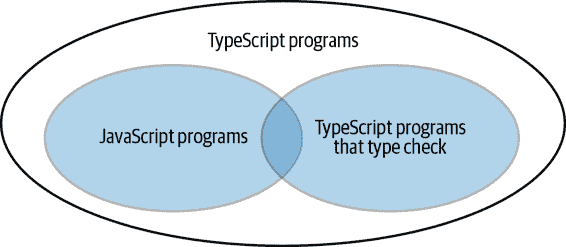
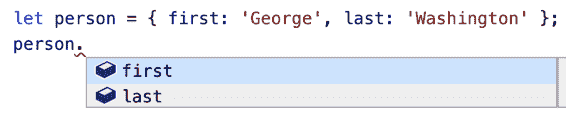
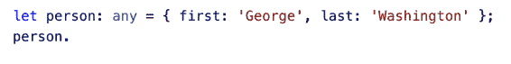
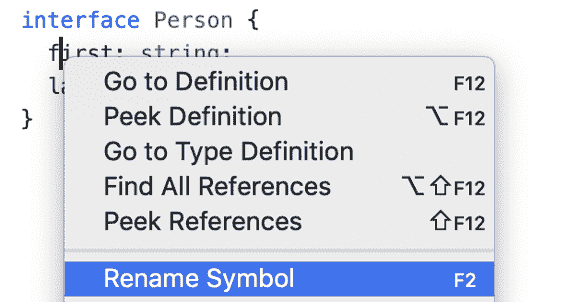
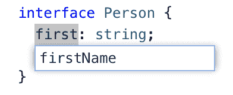

# 第一章：了解 TypeScript

在我们深入细节之前，本章将帮助你理解 TypeScript 的整体图景。它是什么？你应该如何思考它？它如何与 JavaScript 相关联？它的类型是可空的还是不可空的？`any` 是什么意思？还有鸭子类型？

TypeScript 作为一种语言有些不同寻常，它既不像 Python 和 Ruby 那样在解释器中运行，也不像 Java 和 C 那样编译成低级语言。相反，它将编译为另一种高级语言，即 JavaScript。运行的是这个 JavaScript 而不是你的 TypeScript。因此，TypeScript 与 JavaScript 的关系至关重要，但也可能引起混淆。了解这种关系将帮助你成为一个更有效的 TypeScript 开发者。

TypeScript 的类型系统也有一些不寻常的地方，你需要注意。后面的章节会更详细地介绍类型系统，但这一章节将提醒你一些它所隐藏的惊喜。

# Item 1: 理解 TypeScript 和 JavaScript 之间的关系

如果你长期使用 TypeScript，你必然会听到短语“TypeScript 是 JavaScript 的超集”或“TypeScript 是 JavaScript 的有类型超集”。但这到底意味着什么？TypeScript 和 JavaScript 之间的关系是什么？由于这些语言之间如此密切相关，对它们如何相互关联的深刻理解是有效使用 TypeScript 的基础。

从语法角度看，TypeScript 是 JavaScript 的超集：只要你的 JavaScript 程序没有任何语法错误，它也是一个 TypeScript 程序。很可能 TypeScript 的类型检查器会标记你的代码中的一些问题。但这是一个独立的问题。TypeScript 仍然会解析你的代码并生成 JavaScript。（这是关系的另一个关键部分。我们将在 Item 3 中进一步探讨这一点。）

TypeScript 文件使用 *.ts*（或 *.tsx*）扩展名，而不是 JavaScript 文件的 *.js*（或 *.jsx*）扩展名。这并不意味着 TypeScript 是一种完全不同的语言！由于 TypeScript 是 JavaScript 的超集，你的 *.js* 文件中的代码已经是 TypeScript 了。将 *main.js* 重命名为 *main.ts* 并不会改变这一点。

如果你将现有的 JavaScript 代码库迁移到 TypeScript，这是非常有帮助的。这意味着你不必重写任何代码以开始使用 TypeScript 并获得它提供的好处。如果你选择将你的 JavaScript 重写为像 Java 这样的语言，情况就不一样了。这种渐进式迁移路径是 TypeScript 的最佳特性之一。关于这个主题，我们将在 Chapter 8 中详细讨论。

所有 JavaScript 程序都是 TypeScript 程序，但反之则不然：有些 TypeScript 程序不是 JavaScript 程序。这是因为 TypeScript 添加了用于指定类型的额外语法。（出于历史原因，它还添加了一些其他语法。见条目 53。）

例如，这是一个有效的 TypeScript 程序：

```
function greet(who: string) {
  console.log('Hello', who);
}
```

但是当你通过像`node`这样期望 JavaScript 的程序运行时，你会得到一个错误：

```
function greet(who: string) {
                  ^

SyntaxError: Unexpected token :
```

`: string`是特定于 TypeScript 的类型注解。一旦使用了它，你就超出了纯 JavaScript（参见图 1-1）。

###### 图 1-1\. 所有 JavaScript 都是 TypeScript，但并非所有 TypeScript 都是 JavaScript

这并不意味着 TypeScript 对普通 JavaScript 程序没有提供价值。它有！例如，这段 JavaScript 程序：

```
let city = 'new york city';
console.log(city.toUppercase());
```

当你运行它时会抛出一个错误：

```
TypeError: city.toUppercase is not a function
```

此程序中没有类型注解，但 TypeScript 的类型检查器仍能够发现问题：

```
let city = 'new york city';
console.log(city.toUppercase());
              // ~~~~~~~~~~~ Property 'toUppercase' does not exist on type
              //             'string'. Did you mean 'toUpperCase'?
```

你不必告诉 TypeScript`city`的类型是`string`：它是从初始值推断出来的。类型推断是 TypeScript 的关键部分，第三章探讨了如何使用它。

TypeScript 类型系统的目标之一是检测在运行时会抛出异常的代码，而无需运行你的代码。当你听到 TypeScript 被描述为“静态”类型系统时，就是指这一点。类型检查器并不总能够发现会抛出异常的代码，但它会尝试。

即使你的代码没有抛出异常，它可能仍然无法达到你的意图。TypeScript 也试图捕获其中一些问题。例如，这段 JavaScript 程序：

```
const states = [
  {name: 'Alabama', capital: 'Montgomery'},
  {name: 'Alaska',  capital: 'Juneau'},
  {name: 'Arizona', capital: 'Phoenix'},
  // ...
];
for (const state of states) {
  console.log(state.capitol);
}
```

将记录：

```
undefined
undefined
undefined
```

糟糕！出了什么问题？这段程序是有效的 JavaScript（因此也是 TypeScript）。它运行时没有抛出任何错误。但显然它没有执行你的意图。即使没有添加类型注解，TypeScript 的类型检查器也能够发现错误（并提供有用的建议）：

```
for (const state of states) {
  console.log(state.capitol);
                 // ~~~~~~~ Property 'capitol' does not exist on type
                 //         '{ name: string; capital: string; }'.
                 //         Did you mean 'capital'?
}
```

TypeScript 即使没有提供类型注解，也能捕获错误，但如果提供了类型注解，它将能够做得更彻底。这是因为类型注解告诉 TypeScript 你的*意图*是什么，这使它能够发现代码行为与意图不符的地方。例如，如果在之前的例子中反转了`capital`/`capitol`的拼写错误呢？

```
const states = [
  {name: 'Alabama', capitol: 'Montgomery'},
  {name: 'Alaska',  capitol: 'Juneau'},
  {name: 'Arizona', capitol: 'Phoenix'},
  // ...
];
for (const state of states) {
  console.log(state.capital);
                 // ~~~~~~~ Property 'capital' does not exist on type
                 //         '{ name: string; capitol: string; }'.
                 //         Did you mean 'capitol'?
}
```

之前如此有帮助的错误现在完全错了！问题在于你用两种不同的方式拼写了同一个属性，而 TypeScript 不知道哪一个是正确的。它可以猜测，但并不总是正确的。解决方法是通过显式声明`states`的类型来澄清你的意图：

```
interface State {
  name: string;
  capital: string;
}
const states: State[] = [
  {name: 'Alabama', capitol: 'Montgomery'},
                 // ~~~~~~~~~~~~~~~~~~~~~
  {name: 'Alaska',  capitol: 'Juneau'},
                 // ~~~~~~~~~~~~~~~~~
  {name: 'Arizona', capitol: 'Phoenix'},
                 // ~~~~~~~~~~~~~~~~~~ Object literal may only specify known
                 //         properties, but 'capitol' does not exist in type
                 //         'State'.  Did you mean to write 'capital'?
  // ...
];
for (const state of states) {
  console.log(state.capital);
}
```

现在错误匹配问题，建议的修复方法是正确的。通过明确表达我们的意图，你还帮助 TypeScript 发现了其他潜在问题。例如，如果你在数组中只错拼了一次 `capitol`，之前不会有错误。但有了类型注解，就有了：

```
const states: State[] = [
  {name: 'Alabama', capital: 'Montgomery'},
  {name: 'Alaska',  capitol: 'Juneau'},
                 // ~~~~~~~~~~~~~~~~~ Did you mean to write 'capital'?
  {name: 'Arizona', capital: 'Phoenix'},
  // ...
];
```

从 Venn 图的角度来看，我们可以添加一个新的程序组：通过类型检查的 TypeScript 程序（见 Figure 1-2）。



###### 图 1-2\. 所有 JavaScript 程序都是 TypeScript 程序。但只有一些 JavaScript（和 TypeScript）程序通过了类型检查器。

如果“TypeScript 是 JavaScript 的超集”这种说法让你觉得不对劲，可能是因为你在考虑图中的第三组程序。在实践中，这是使用 TypeScript 的日常体验中最相关的问题。通常在使用 TypeScript 时，你会努力确保你的代码通过所有类型检查。

TypeScript 的类型系统 *模拟* 了 JavaScript 的运行时行为。如果你来自于有更严格运行时检查的语言，这可能会带来一些意外。例如：

```
const x = 2 + '3';  // OK, type is string
const y = '2' + 3;  // OK, type is string
```

这两个语句虽然在许多其他语言中会产生运行时错误，但它们都通过了类型检查器。但这确实模拟了 JavaScript 的运行时行为，其中两个表达式都会产生字符串 `"23"`。

尽管如此，TypeScript 在某些情况下会有所限制。类型检查器会标记所有这些语句中的问题，即使它们在运行时不会抛出异常：

```
const a = null + 7;  // Evaluates to 7 in JS
       // ~~~~ Operator '+' cannot be applied to types ...
const b = [] + 12;  // Evaluates to '12' in JS
       // ~~~~~~~ Operator '+' cannot be applied to types ...
alert('Hello', 'TypeScript');  // alerts "Hello"
            // ~~~~~~~~~~~~ Expected 0-1 arguments, but got 2
```

TypeScript 类型系统的指导原则是它应该模拟 JavaScript 的运行时行为。但在所有这些情况下，TypeScript 更可能认为奇怪的使用是错误而不是开发者的意图，因此它超越了简单地模拟运行时行为。我们在 `capital`/`capitol` 示例中看到了另一个例子，程序没有抛出异常（而是记录了 `undefined`），但类型检查器仍然标记了一个错误。

TypeScript 如何决定何时模拟 JavaScript 的运行时行为，何时超越它？最终这是一种品味的问题。通过选择 TypeScript，你正在信任构建它的团队的判断。如果你喜欢添加 `null` 和 `7` 或者 `[]` 和 `12`，或者调用带有多余参数的函数，那么 TypeScript 可能不适合你！

如果你的程序通过了类型检查，它在运行时仍然可能会抛出错误吗？答案是“是的”。以下是一个例子：

```
const names = ['Alice', 'Bob'];
console.log(names[2].toUpperCase());
```

运行此代码时，会抛出异常：

```
TypeError: Cannot read property 'toUpperCase' of undefined
```

TypeScript 假定数组访问将在边界内，但实际并非如此。结果是一个异常。

当你使用 `any` 类型时，也经常会出现未捕获的错误，我们将在 Item 5 和 Chapter 5 中详细讨论。

这些异常的根本原因是 TypeScript 对值的类型理解与现实已经有所不同。一个可以保证其静态类型准确性的类型系统被称为*sound*。TypeScript 的类型系统在很大程度上不是 sound，并且从未打算如此。如果准确性对你很重要，你可能需要考虑其他语言，如 Reason 或 Elm。尽管这些语言提供了更多的运行时安全性保证，但这也带来了代价：它们都不是 JavaScript 的超集，因此迁移会更加复杂。

## 要记住的事情

+   TypeScript 是 JavaScript 的超集。换句话说，所有 JavaScript 程序已经是 TypeScript 程序。TypeScript 有一些自己的语法，因此一般来说，TypeScript 程序并不是有效的 JavaScript 程序。

+   TypeScript 添加了一个类型系统，模拟了 JavaScript 的运行时行为，并尝试识别在运行时抛出异常的代码。但你不应该期望它标记每个异常。代码可以通过类型检查器，但仍然可能在运行时抛出异常。

+   虽然 TypeScript 的类型系统主要模拟 JavaScript 的行为，但也有一些 JavaScript 允许的构造，但 TypeScript 选择禁止，例如调用函数时参数数量不正确。这在很大程度上是一种品味问题。

# 条目 2：了解你正在使用的 TypeScript 选项

这段代码通过了类型检查器吗？

```
function add(a, b) {
  return a + b;
}
add(10, null);
```

不知道你正在使用哪些选项，是不可能说的！在撰写本文时，TypeScript 编译器有一个庞大的选项集，几乎有 100 个。

它们可以通过命令行设置：

```
$ tsc --noImplicitAny program.ts
```

或通过配置文件，*tsconfig.json*：

```
{
  "compilerOptions": {
    "noImplicitAny": true
  }
}
```

你应该偏爱配置文件。它确保你的同事和工具都清楚你计划如何使用 TypeScript。你可以通过运行`tsc --init`来创建一个配置文件。

TypeScript 的许多配置设置控制它查找源文件的位置以及生成什么样的输出。但有一些控制语言核心方面的设置。这些是高级设计选择，大多数语言不会留给用户。根据如何配置它，TypeScript 可能感觉像是一种非常不同的语言。要有效使用它，你应该理解其中最重要的设置：`noImplicitAny`和`strictNullChecks`。

`noImplicitAny`控制变量是否必须具有已知类型。当`noImplicitAny`关闭时，此代码是有效的：

```
function add(a, b) {
  return a + b;
}
```

如果你在编辑器中悬停在`add`符号上，它将显示 TypeScript 已推断出该函数的类型：

```
function add(a: any, b: any): any
```

`any`类型有效地禁用了涉及这些参数的类型检查器。`any`是一个有用的工具，但应谨慎使用。有关更多关于`any`的信息，请参见条目 5 和第三章。

这些称为*implicit `any`s*，因为你从未写过`any`这个词，但最终却得到了危险的`any`类型。如果设置了`noImplicitAny`选项，则会出现错误：

```
function add(a, b) {
          // ~    Parameter 'a' implicitly has an 'any' type
          //    ~ Parameter 'b' implicitly has an 'any' type
  return a + b;
}
```

可以通过显式编写类型声明来修复这些错误，例如`: any`或更具体的类型：

```
function add(a: number, b: number) {
  return a + b;
}
```

TypeScript 在有类型信息时最为有帮助，因此你应尽可能设置`noImplicitAny`。一旦你习惯了所有变量都有类型，没有`noImplicitAny`的 TypeScript 几乎感觉像是一种不同的语言。

对于新项目，你应该从`noImplicitAny`开始，这样你编写代码时就能同时编写类型。这将帮助 TypeScript 检测问题，提高代码可读性，并增强开发体验（参见第 6 项）。仅在从 JavaScript 迁移项目到 TypeScript 时，才适合关闭`noImplicitAny`（参见第八章）。

`strictNullChecks`控制在每种类型中是否允许`null`和`undefined`值。

当`strictNullChecks`关闭时，此代码有效：

```
const x: number = null;  // OK, null is a valid number
```

但当你打开`strictNullChecks`时，则会触发错误：

```
const x: number = null;
//    ~ Type 'null' is not assignable to type 'number'
```

如果你使用`undefined`而不是`null`，可能会发生类似的错误。

如果你的意图是允许`null`，你可以通过明确你的意图来修复错误：

```
const x: number | null = null;
```

如果你不希望允许`null`，你需要跟踪它来自哪里，并添加检查或断言：

```
   const el = document.getElementById('status');
   el.textContent = 'Ready';
// ~~ Object is possibly 'null'

   if (el) {
     el.textContent = 'Ready';  // OK, null has been excluded
   }
   el!.textContent = 'Ready';  // OK, we've asserted that el is non-null
```

`strictNullChecks`在捕获涉及`null`和`undefined`值的错误方面非常有帮助，但确实增加了使用语言的难度。如果你要开始一个新项目，请尝试设置`strictNullChecks`。但如果你对这种语言不熟悉或者要迁移一个 JavaScript 代码库，你可能选择不启用它。在设置`strictNullChecks`之前，你应该确保先设置`noImplicitAny`。

如果选择不使用`strictNullChecks`，请注意可怕的“undefined is not an object”运行时错误。这些错误提醒你应考虑启用更严格的检查。随着项目的增长，改变这个设置会变得越来越困难，因此在启用它之前不要等待太久。

还有许多其他设置影响语言语义（例如`noImplicitThis`和`strictFunctionTypes`），但与`noImplicitAny`和`strictNullChecks`相比，这些都是次要的。要启用所有这些检查，请打开`strict`设置。TypeScript 能够通过`strict`捕获大部分错误，因此这是你最终想要达到的地方。

知道你使用的是哪些选项！如果同事分享了一个 TypeScript 示例，而你无法重现他们的错误，请确保你的编译器选项是相同的。

## 要记住的事情

+   TypeScript 编译器包括几个影响语言核心方面的设置。

+   使用*tsconfig.json*配置 TypeScript 而不是命令行选项。

+   除非你正在将 JavaScript 项目迁移到 TypeScript，否则请打开`noImplicitAny`。

+   使用`strictNullChecks`来防止类似“undefined is not an object”的运行时错误。

+   目标是启用`strict`，以获取 TypeScript 能提供的最彻底检查。

# 项目 3：了解代码生成独立于类型之外

在高级别上，`tsc`（TypeScript 编译器）执行两件事：

+   它将下一代 TypeScript/JavaScript 转换为在浏览器中可用的旧版本 JavaScript（“转换”）。

+   它检查你的代码是否存在类型错误。

令人惊讶的是这两种行为完全独立于彼此。换句话说，在你的代码中的类型无法影响 TypeScript 生成的 JavaScript。因为执行的是这段 JavaScript 代码，这意味着你的类型不能影响代码的运行方式。

这有一些令人惊讶的含义，应该让你对 TypeScript 能够做什么以及不能做什么有所期待。

## 存在类型错误的代码可以产生输出

因为代码输出与类型检查无关，所以代码存在类型错误时仍然可以产生输出！

```
$ cat test.ts
let x = 'hello';
x = 1234;
$ tsc test.ts
test.ts:2:1 - error TS2322: Type '1234' is not assignable to type 'string'

2 x = 1234;
  ~

$ cat test.js
var x = 'hello';
x = 1234;
```

如果你之前使用过像 C 或 Java 这样的语言，这可能会相当令人惊讶，因为类型检查和输出是紧密相关的。你可以将 TypeScript 中的所有错误看作是那些语言中的警告：它们很可能表示有问题，值得调查，但不会阻止构建。

在实践中，即使存在错误，代码的输出也是有帮助的。如果你正在构建一个 Web 应用程序，你可能知道其中的某个部分存在问题。但因为 TypeScript 仍然会生成代码，你可以在修复问题之前测试应用程序的其他部分。

当你提交代码时，应该力求零错误，以免陷入记住什么是预期或意外错误的陷阱。如果你想要在错误时禁用输出，可以在 *tsconfig.json* 中使用 `noEmitOnError` 选项，或者在你的构建工具中使用等效选项。

## 你不能在运行时检查 TypeScript 类型。

你可能会被诱惑编写这样的代码：

```
interface Square {
  width: number;
}
interface Rectangle extends Square {
  height: number;
}
type Shape = Square | Rectangle;

function calculateArea(shape: Shape) {
  if (shape instanceof Rectangle) {
                    // ~~~~~~~~~ 'Rectangle' only refers to a type,
                    //           but is being used as a value here
    return shape.width * shape.height;
                    //         ~~~~~~ Property 'height' does not exist
                    //                on type 'Shape'
  } else {
    return shape.width * shape.width;
  }
}
```

`instanceof` 检查发生在运行时，但 `Rectangle` 是一种类型，因此它不能影响代码的运行行为。TypeScript 类型是“可擦除的”：编译成 JavaScript 的一部分只是从你的代码中删除所有的 `interface`、`type` 和类型注解。

要确定你处理的形状的类型，你需要一些方法在运行时重建它的类型。在这种情况下，你可以检查 `height` 属性的存在：

```
function calculateArea(shape: Shape) {
  if ('height' in shape) {
    shape;  // Type is Rectangle
    return shape.width * shape.height;
  } else {
    shape;  // Type is Square
    return shape.width * shape.width;
  }
}
```

这是因为属性检查仅涉及运行时可用的值，但仍允许类型检查器将 `shape` 的类型细化为 `Rectangle`。

另一种方法是引入一个“标签”，以显式方式存储在运行时可用的类型：

```
interface Square {
  kind: 'square';
  width: number;
}
interface Rectangle {
  kind: 'rectangle';
  height: number;
  width: number;
}
type Shape = Square | Rectangle;

function calculateArea(shape: Shape) {
  if (shape.kind === 'rectangle') {
    shape;  // Type is Rectangle
    return shape.width * shape.height;
  } else {
    shape;  // Type is Square
    return shape.width * shape.width;
  }
}
```

这里的 `Shape` 类型是“标记联合”的一个例子。由于它们可以轻松地在运行时恢复类型信息，标记联合在 TypeScript 中非常常见。

有些结构引入了类型（运行时不可用）和值（可用）。`class` 关键字就是其中之一。将 `Square` 和 `Rectangle` 设为类也是解决错误的另一种方法：

```
class Square {
  constructor(public width: number) {}
}
class Rectangle extends Square {
  constructor(public width: number, public height: number) {
    super(width);
  }
}
type Shape = Square | Rectangle;

function calculateArea(shape: Shape) {
  if (shape instanceof Rectangle) {
    shape;  // Type is Rectangle
    return shape.width * shape.height;
  } else {
    shape;  // Type is Square
    return shape.width * shape.width;  // OK
  }
}
```

这有效是因为 `class Rectangle` 同时引入了类型和值，而 `interface` 只引入了类型。

`type Shape = Square | Rectangle` 中的 `Rectangle` 指的是*类型*，但 `shape instanceof Rectangle` 中的 `Rectangle` 指的是*值*。理解这一区别很重要，但可能相当微妙。请参阅 Item 8。

## 类型操作无法影响运行时值

假设您有一个可能是字符串或数字的值，并且希望将其规范化为始终为数字。这是类型检查器接受的一个错误尝试：

```
function asNumber(val: number | string): number {
  return val as number;
}
```

查看生成的 JavaScript 可以明确此函数的实际作用：

```
function asNumber(val) {
  return val;
}
```

根本没有进行任何转换。`as number` 是一种类型操作，因此它不能影响您的代码的运行时行为。要规范化值，您需要检查其运行时类型，并使用 JavaScript 构造进行转换：

```
function asNumber(val: number | string): number {
  return typeof(val) === 'string' ? Number(val) : val;
}
```

(`as number` 是*类型断言*。有关何时适用这些断言的更多信息，请参阅 Item 9。)

## 运行时类型可能与声明类型不同

此函数是否可能最终触发 `console.log`？

```
function setLightSwitch(value: boolean) {
  switch (value) {
    case true:
      turnLightOn();
      break;
    case false:
      turnLightOff();
      break;
    default:
      console.log(`I'm afraid I can't do that.`);
  }
}
```

TypeScript 通常会标记死代码，但即使使用了 `strict` 选项，它也不会抱怨此代码。如何进入这个分支？

关键在于记住 `boolean` 是*声明*类型。因为它是 TypeScript 类型，在运行时会消失。在 JavaScript 代码中，用户可能会误将 `setLightSwitch` 与 `"ON"` 等值一起调用。

在纯 TypeScript 中也有触发此代码路径的方法。也许函数被调用时，其值来自网络调用：

```
interface LightApiResponse {
  lightSwitchValue: boolean;
}
async function setLight() {
  const response = await fetch('/light');
  const result: LightApiResponse = await response.json();
  setLightSwitch(result.lightSwitchValue);
}
```

您已声明 `/light` 请求的结果为 `LightApiResponse`，但没有任何机制来强制执行此声明。如果误解了 API，并且 `lightSwitchValue` 实际上是一个 `string`，那么在运行时将传递一个字符串给 `setLightSwitch`。或者也许在部署后 API 发生了变化。

当您的运行时类型与声明类型不匹配时，TypeScript 可能会变得相当混乱，这是您应尽量避免的情况。但请注意，可能会存在值具有不同于您声明类型的类型。

## 您不能基于 TypeScript 类型重载函数

类似 C++ 的语言允许您定义多个版本的函数，这些函数仅在其参数类型上有所不同。这称为“函数重载”。因为您的代码的运行时行为与其 TypeScript 类型无关，所以在 TypeScript 中无法使用此构造：

```
function add(a: number, b: number) { return a + b; }
      // ~~~ Duplicate function implementation
function add(a: string, b: string) { return a + b; }
      // ~~~ Duplicate function implementation
```

TypeScript *确实* 提供了一种函数重载的机制，但它完全在类型级别上运作。您可以为函数提供多个声明，但只能有一个实现：

```
function add(a: number, b: number): number;
function add(a: string, b: string): string;

function add(a, b) {
  return a + b;
}

const three = add(1, 2);  // Type is number
const twelve = add('1', '2');  // Type is string
```

`add` 的前两个声明仅提供类型信息。当 TypeScript 生成 JavaScript 输出时，它们将被移除，只剩下实现部分。（如果您使用此类型的重载风格，请首先查看 项目 50。这里有一些微妙之处需要注意。）

## TypeScript 类型对运行时性能没有影响

因为生成 JavaScript 时类型和类型操作被擦除，它们不能影响运行时性能。 TypeScript 的静态类型确实是零成本的。下次有人提出运行时开销不使用 TypeScript 的理由时，您会准确地知道他们对这种说法进行了多么充分的测试！

对此有两个注意事项：

+   虽然没有 *运行时* 开销，但 TypeScript 编译器会引入 *构建时* 开销。TypeScript 团队认真对待编译器性能，编译通常相当快，特别是对于增量构建来说。如果开销变得显著，您的构建工具可能有“仅转译”选项以跳过类型检查。

+   TypeScript 生成的代码以支持旧版本运行时 *可能* 会导致性能开销与原生实现相比。例如，如果您使用生成器函数并将目标设置为 ES5（比生成器早期），则 `tsc` 将生成一些辅助代码以使其正常工作。这可能会比生成器的本机实现有一些开销。无论如何，这与发射目标和语言级别有关，并且仍然独立于 *类型*。

## 要记住的事情

+   代码生成与类型系统无关。这意味着 TypeScript 类型无法影响代码的运行行为或性能。

+   一个带有类型错误的程序可能会生成代码（“编译”）。

+   TypeScript 类型在运行时不可用。要在运行时查询类型，您需要某种方式来重建它。标签联合和属性检查是常用的方法。一些构造，如 `class`，引入了 TypeScript 类型和在运行时可用的值。

# 项目 4：熟悉结构化类型

JavaScript 本质上是鸭子类型的：如果您将具有所有正确属性的值传递给函数，它不会关心您如何创建该值。它只会使用它。（“如果它走起来像鸭子，叫起来像鸭子……”）TypeScript 模拟了这种行为，有时可能会导致令人惊讶的结果，因为类型检查器对类型的理解可能比您设想的更广泛。对结构类型有很好的理解将有助于您理解错误和非错误，并帮助您编写更健壮的代码。

假设您正在开发一个物理库，并且有一个二维向量类型：

```
interface Vector2D {
  x: number;
  y: number;
}
```

您编写一个函数来计算它的长度：

```
function calculateLength(v: Vector2D) {
  return Math.sqrt(v.x * v.x + v.y * v.y);
}
```

现在你引入了命名向量的概念：

```
interface NamedVector {
  name: string;
  x: number;
  y: number;
}
```

`calculateLength` 函数将与 `NamedVector` 一起工作，因为它们具有 `x` 和 `y` 属性，这些属性是 `number` 类型。TypeScript 足够智能，可以理解这一点：

```
const v: NamedVector = { x: 3, y: 4, name: 'Zee' };
calculateLength(v);  // OK, result is 5
```

有趣的是，你从未声明过 `Vector2D` 和 `NamedVector` 之间的关系。你也不必为 `NamedVector` 写一个 `calculateLength` 的替代实现。TypeScript 的类型系统模拟了 JavaScript 的运行时行为（Item 1）。它允许 `calculateLength` 被 `NamedVector` 调用，因为它的*结构*与 `Vector2D` 兼容。这就是“结构化类型”这个术语的来源。

但这也可能带来麻烦。比如你添加了一个 3D 向量类型：

```
interface Vector3D {
  x: number;
  y: number;
  z: number;
}
```

并编写一个函数将它们归一化（使它们的长度为 1）：

```
function normalize(v: Vector3D) {
  const length = calculateLength(v);
  return {
    x: v.x / length,
    y: v.y / length,
    z: v.z / length,
  };
}
```

如果你调用这个函数，你可能会得到一个比单位长度长的东西：

```
> normalize({x: 3, y: 4, z: 5})
{ x: 0.6, y: 0.8, z: 1 }
```

那么出了什么问题，为什么 TypeScript 没有捕获到这个错误？

Bug 是 `calculateLength` 在 2D 向量上运行，但 `normalize` 在 3D 向量上运行。因此在归一化中忽略了 `z` 分量。

`calculateLength` 方法没有捕获到这个问题。为什么你可以用 3D 向量调用 `calculateLength`，尽管其类型声明说它只接受 2D 向量？

在命名向量中奏效良好的东西在这里产生了反效果。使用 `{x, y, z}` 对象调用 `calculateLength` 不会抛出错误。因此类型检查器也不会抱怨，这种行为导致了一个 bug。（如果你希望这是一个错误，你有一些选项。我们将在 Item 37 中返回这个例子。）

当你编写函数时，很容易想象它们将被调用，参数具有你声明的属性*而且没有其他属性*。这被称为“密封”或“精确”类型，在 TypeScript 的类型系统中无法表达。不管你喜欢与否，你的类型是“开放”的。

这有时会带来意外：

```
function calculateLengthL1(v: Vector3D) {
  let length = 0;
  for (const axis of Object.keys(v)) {
    const coord = v[axis];
               // ~~~~~~~ Element implicitly has an 'any' type because ...
               //         'string' can't be used to index type 'Vector3D'
    length += Math.abs(coord);
  }
  return length;
}
```

为什么这是一个错误？因为 `axis` 是 `v` 的键之一，它是一个 `Vector3D`，所以它应该是 `"x"`、`"y"` 或 `"z"` 之一。根据 `Vector3D` 的声明，这些都是 `number`，所以 `coord` 的类型不应该是 `number` 吗？

这个错误是假阳性吗？不是！TypeScript 正确地抱怨了。前面段落的逻辑假定 `Vector3D` 是密封的，并且没有其他属性。但它可能有：

```
const vec3D = {x: 3, y: 4, z: 1, address: '123 Broadway'};
calculateLengthL1(vec3D);  // OK, returns NaN
```

因为 `v` 可能具有任何属性，所以 `axis` 的类型是 `string`。TypeScript 没有理由相信 `v[axis]` 是一个数字，因为正如你刚刚看到的，它可能不是。正确地对对象进行迭代可能很棘手。我们将在 Item 54 中返回到这个话题，但在这种情况下，没有循环的实现会更好：

```
function calculateLengthL1(v: Vector3D) {
  return Math.abs(v.x) + Math.abs(v.y) + Math.abs(v.z);
}
```

结构化类型也可能在比较 `class` 时引发意外，因为它们在分配性上进行结构化比较：

```
class C {
  foo: string;
  constructor(foo: string) {
    this.foo = foo;
  }
}

const c = new C('instance of C');
const d: C = { foo: 'object literal' };  // OK!
```

为什么`d`可以赋值给`C`？它有一个`foo`属性，类型是`string`。此外，它有一个可以用一个参数调用的`constructor`（来自`Object.prototype`），尽管通常不带参数调用。所以结构匹配。如果你在`C`的构造函数中有逻辑，并编写一个假设它运行的函数，这可能会带来惊喜。这与 C++ 或 Java 等语言完全不同，那里声明类型`C`的参数保证它要么是`C`，要么是其子类。

当你编写测试时，结构类型是有益的。假设你有一个函数，该函数在数据库上运行查询并处理结果：

```
interface Author {
  first: string;
  last: string;
}
function getAuthors(database: PostgresDB): Author[] {
  const authorRows = database.runQuery(`SELECT FIRST, LAST FROM AUTHORS`);
  return authorRows.map(row => ({first: row[0], last: row[1]}));
}
```

要测试这一点，你可以创建一个模拟`PostgresDB`。但更好的方法是使用结构类型并定义一个更窄的接口：

```
interface DB {
  runQuery: (sql: string) => any[];
}
function getAuthors(database: DB): Author[] {
  const authorRows = database.runQuery(`SELECT FIRST, LAST FROM AUTHORS`);
  return authorRows.map(row => ({first: row[0], last: row[1]}));
}
```

你仍然可以在生产中将`getAuthors`传递给`PostgresDB`，因为它有一个`runQuery`方法。由于结构类型，`PostgresDB`不需要声明它实现了`DB`。TypeScript 将确定它确实实现了。

当你编写测试时，可以传入一个更简单的对象：

```
test('getAuthors', () => {
  const authors = getAuthors({
    runQuery(sql: string) {
      return [['Toni', 'Morrison'], ['Maya', 'Angelou']];
    }
  });
  expect(authors).toEqual([
    {first: 'Toni', last: 'Morrison'},
    {first: 'Maya', last: 'Angelou'}
  ]);
});
```

TypeScript 将验证我们的测试`DB`是否符合接口。而且你的测试不需要了解生产数据库的任何内容：无需模拟库！通过引入一个抽象（`DB`），我们从特定实现（`PostgresDB`）的细节中解放出逻辑（和测试）。

结构类型的另一个优点是它可以清晰地断开库之间的依赖关系。关于此内容，请参阅条款 51。

## 需要记住的事情

+   理解 JavaScript 是鸭子类型，并且 TypeScript 使用结构类型来建模：可分配给你的接口的值可能具有超出类型声明中显式列出的属性。类型不是“封闭”的。

+   请注意，类也遵循结构类型规则。你可能不会得到你期望的类的实例！

+   使用结构类型来促进单元测试。

# 条款 5：限制对`any`类型的使用

TypeScript 的类型系统是*渐进的*和*可选的*：*渐进*是因为你可以逐步向你的代码添加类型，*可选*是因为你可以随时禁用类型检查器。这些特性的关键在于`any`类型：

```
   let age: number;
   age = '12';
// ~~~ Type '"12"' is not assignable to type 'number'
   age = '12' as any;  // OK
```

类型检查器在这里是正确的，但你可以通过输入`as any`来消除它。当你开始使用 TypeScript 时，很容易在你不理解错误时、认为类型检查器是错误的时候，或者简单地不想花时间编写类型声明时，就会使用`any`类型和类型断言(`as any`)。在某些情况下，这可能是可以接受的，但请注意`any`消除了使用 TypeScript 的许多优势。在使用之前，你至少应该了解其危险性。

## 任何类型都没有类型安全性

在前面的示例中，类型声明表明`age`是一个`number`。但是`any`让您可以将`string`赋值给它。类型检查器会认为它是一个`number`（毕竟这是您说的），混乱将不会被捕获：

```
age += 1;  // OK; at runtime, age is now "121"
```

## `any`让您违反了契约

当您编写一个函数时，您正在指定一个契约：如果调用者给您某种类型的输入，您将产生某种类型的输出。但是使用`any`类型，您可以打破这些契约：

```
function calculateAge(birthDate: Date): number {
  // ...
}

let birthDate: any = '1990-01-19';
calculateAge(birthDate);  // OK
```

出生日期参数应该是`Date`类型，而不是`string`类型。使用`any`类型允许您违反`calculateAge`的契约。这可能特别问题，因为 JavaScript 通常愿意在类型之间进行隐式转换。`string`有时可以在期望`number`的地方工作，但在其他情况下会中断。

## 任何类型都没有语言服务

当符号具有类型时，TypeScript 语言服务能够提供智能自动完成和上下文文档（如图 1-3 所示）。



###### 图 1-3\. TypeScript 语言服务能够为具有类型的符号提供上下文自动完成。

但对于具有`any`类型的符号，您需要靠自己（见图 1-4）。



###### 图 1-4\. 对具有任意类型的符号的属性没有自动完成。

重命名是另一种服务。如果您有一个 Person 类型和用于格式化人名的函数：

```
interface Person {
  first: string;
  last: string;
}

const formatName = (p: Person) => `${p.first} ${p.last}`;
const formatNameAny = (p: any) => `${p.first} ${p.last}`;
```

然后您可以在编辑器中选择`first`，选择“重命名符号”，并将其更改为`firstName`（参见图 1-5 和 1-6）。



###### 图 1-5\. 在 vscode 中重命名符号。



###### 图 1-6\. 选择新名称。TypeScript 语言服务确保项目中使用该符号的所有地方也会被重命名。

这更改了`formatName`函数，但未更改`any`版本：

```
interface Person {
  firstName: string;
  last: string;
}
const formatName = (p: Person) => `${p.firstName} ${p.last}`;
const formatNameAny = (p: any) => `${p.first} ${p.last}`;
```

TypeScript 的座右铭是“可扩展的 JavaScript”。“可扩展”的关键部分是语言服务，这是 TypeScript 经验的核心部分（参见项目 6）。失去它们将导致生产力损失，不仅对您而言，对所有与您的代码一起工作的人来说也是如此。

## `any`类型在重构代码时掩盖了错误

假设您正在构建一个 Web 应用程序，用户可以选择某种项目。您的某个组件可能会有一个`onSelectItem`回调。编写一个 Item 类型似乎很麻烦，因此您只需使用`any`作为替代品：

```
interface ComponentProps {
  onSelectItem: (item: any) => void;
}
```

下面是管理该组件的代码：

```
function renderSelector(props: ComponentProps) { /* ... */ }

let selectedId: number = 0;
function handleSelectItem(item: any) {
  selectedId = item.id;
}

renderSelector({onSelectItem: handleSelectItem});
```

后来，您以使整个`item`对象传递到`onSelectItem`更难的方式重写了选择器。但这没什么大不了，因为您只需要 ID。您在`ComponentProps`中更改了签名：

```
interface ComponentProps {
  onSelectItem: (id: number) => void;
}
```

您更新了组件，一切都通过了类型检查器。胜利！

…或者说呢？`handleSelectItem`接受一个`any`参数，因此它对 Item 和 ID 一样满意。它会产生一个运行时异常，尽管通过了类型检查器。如果你使用了更具体的类型，类型检查器就会捕捉到这个问题。

## `any`隐藏了你的类型设计

像应用程序状态这样的复杂对象的类型定义可能会变得非常长。与其为页面状态中的数十个属性编写类型定义，你可能会诱惑于只使用`any`类型就搞定。

这一点存在问题，原因列在此项目中。但它也因为隐藏了你的状态设计而变得棘手。正如第四章所述，良好的类型设计对于编写干净、正确和易理解的代码至关重要。使用`any`类型时，你的类型设计变得隐含。这使得很难知道设计是否良好，甚至根本不知道设计是什么。如果你让同事审查一个变更，他们将不得不重建应用程序状态的变更情况和方式。最好将其写出来供所有人看到。

## `any`削弱了对类型系统的信心

每当你犯错，类型检查器捕获到它时，这会增强你对类型系统的信心。但当你在运行时看到类型错误时，这种信心会受到打击。如果你正在一个较大团队引入 TypeScript，这可能会让你的同事质疑是否值得使用 TypeScript。`any`类型通常是这些未捕获错误的根源。

TypeScript 旨在让你的生活更轻松，但带有大量`any`类型的 TypeScript 可能比无类型的 JavaScript 更难处理，因为你不仅需要修复类型错误，还需要记住真正的类型。当你的类型与现实匹配时，它将解放你，不再需要将类型信息记在脑中，TypeScript 会为你跟踪它。

当你必须使用`any`类型时，有更好和更糟糕的方法。关于如何限制`any`带来的不利影响，详见第五章。

## 要记住的事情

+   `any`类型有效地沉默了类型检查器和 TypeScript 语言服务。它可能掩盖真正的问题，损害开发者体验，并削弱类型系统的信心。尽量在可以避免使用它的时候避免！
