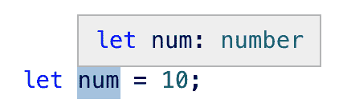
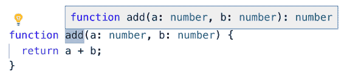
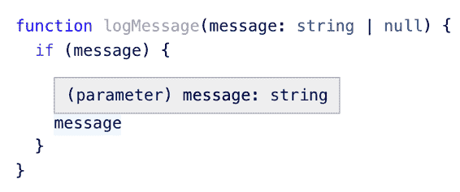
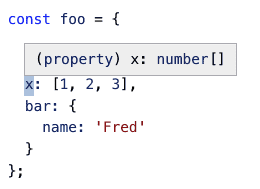
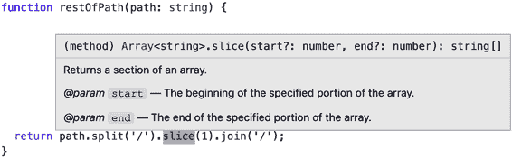
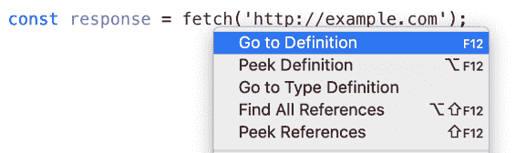
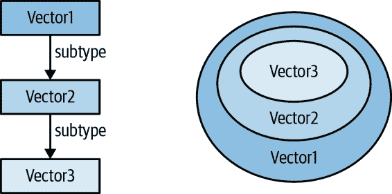
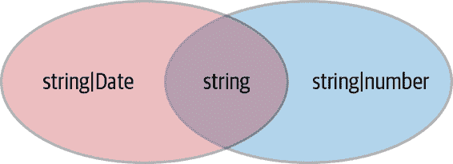
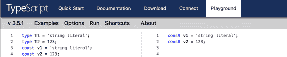
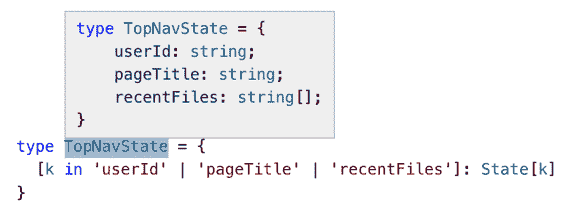

# 第二章：TypeScript 的类型系统

TypeScript 生成代码（Item 3），但类型系统才是重头戏。这就是您使用这种语言的原因！

本章将带您深入理解 TypeScript 的类型系统的细节：如何思考它，如何使用它，您需要做出的选择以及应避免的特性。TypeScript 的类型系统出人意料地强大，能够表达您可能不希望类型系统能够表达的内容。本章内容将为您提供一个坚实的基础，使您能够在编写 TypeScript 和阅读本书的其他部分时获得支持。

# 项目 6：使用编辑器查询和探索类型系统

安装 TypeScript 时，您会得到两个可执行文件：

+   `tsc`，TypeScript 编译器

+   `tsserver`，TypeScript 独立服务器

您更有可能直接运行 TypeScript 编译器，但服务器同样重要，因为它提供*语言服务*。这些服务包括自动完成、检查、导航和重构。通常您通过编辑器使用这些服务。如果您的编辑器没有配置好以提供这些服务，那么您会错过很多！自动完成等服务是使 TypeScript 如此令人愉快的因素之一。但除了便利性之外，您的编辑器还是构建和测试您对类型系统知识的最佳场所。这将帮助您建立对 TypeScript 能够推断类型时机的直觉，这对编写紧凑、惯用的代码至关重要（见 Item 19）。

细节会因编辑器而异，但通常您可以将鼠标悬停在符号上，查看 TypeScript 认为其类型是什么（见 Figure 2-1）。



###### 图 2-1\. 一个编辑器（vscode），显示`num`符号的推断类型为`number`

在这里你没有写`number`，但是 TypeScript 能够根据值 10 推断出来。

您还可以检查函数，如 Figure 2-2 所示。



###### 图 2-2\. 使用编辑器显示函数的推断类型

值得注意的信息是返回类型`number`的推断值。如果这与您的期望不符，应添加类型声明并找出差异（参见 Item 9）。

在任何给定点看到 TypeScript 对变量类型的理解是建立关于扩展（Item 21）和缩小（Item 22）直觉的关键。看到变量类型在条件分支中发生变化是建立对类型系统信心的重要方式（见 Figure 2-3）。



###### 图 2-3\. 变量`message`在分支外是`string | null`，但在分支内是`string`

您可以检查较大对象中的单个属性，查看 TypeScript 对它们的推断（参见 图 2-4）。



###### 图 2-4\. 检查 TypeScript 如何推断对象中的类型

如果您的意图是让 `x` 成为元组类型（`[number, number, number]`），那么将需要一个类型注解。

要查看操作链中间推断的泛型类型，请检查方法名（如 图 2-5 所示）。



###### 图 2-5\. 揭示方法调用链中推断的泛型类型

`Array<string>` 表明 TypeScript 理解 `split` 产生了一个字符串数组。在这种情况下几乎没有歧义，但在编写和调试长函数调用链时，这些信息可能是至关重要的。

在您的编辑器中看到类型错误也是学习类型系统细微差别的好方法。例如，此函数尝试通过其 ID 获取 `HTMLElement`，或返回一个默认值。TypeScript 标记了两个错误：

```
function getElement(elOrId: string|HTMLElement|null): HTMLElement {
  if (typeof elOrId === 'object') {
    return elOrId;
 // ~~~~~~~~~~~~~~ 'HTMLElement | null' is not assignable to 'HTMLElement'
  } else if (elOrId === null) {
    return document.body;
  } else {
    const el = document.getElementById(elOrId);
    return el;
 // ~~~~~~~~~~ 'HTMLElement | null' is not assignable to 'HTMLElement'
  }
}
```

在 `if` 语句的第一个分支中的意图是仅过滤到对象，即 `HTMLElement`。但奇怪的是，在 JavaScript 中，`typeof null` 是 `"object"`，因此在该分支中 `elOrId` 仍然可能是 `null`。您可以通过先进行 `null` 检查来解决此问题。第二个错误是因为 `document.getElementById` 可能返回 `null`，因此您还需要处理这种情况，可能是通过抛出异常。

语言服务还可以帮助您浏览库和类型声明。假设您在代码中看到对 `fetch` 函数的调用，并想了解更多信息。您的编辑器应该提供一个“跳转到定义”的选项。在我的编辑器中看起来就像 图 2-6 中的那样。



###### 图 2-6\. TypeScript 语言服务提供了一个“跳转到定义”的功能，应该在您的编辑器中显示。

选择此选项会进入 `lib.dom.d.ts`，这是 TypeScript 为 DOM 包含的类型声明：

```
declare function fetch(
  input: RequestInfo, init?: RequestInit
): Promise<Response>;
```

您可以看到 `fetch` 返回一个 `Promise` 并接受两个参数。在 `RequestInfo` 上点击会带您到这里：

```
type RequestInfo = Request | string;
```

从这里可以进入 `Request`：

```
declare var Request: {
    prototype: Request;
    new(input: RequestInfo, init?: RequestInit): Request;
};
```

在这里，您可以看到 `Request` 类型和值是分开建模的（参见 条目 8）。您已经见过 `RequestInfo` 了。点击 `RequestInit` 显示您可以用来构建 `Request` 的所有内容：

```
interface RequestInit {
    body?: BodyInit | null;
    cache?: RequestCache;
    credentials?: RequestCredentials;
    headers?: HeadersInit;
    // ...
}
```

在这里，您可以看到还有许多类型可以跟进，但您已经了解到了。类型声明一开始可能难以阅读，但它们是了解 TypeScript 可以做什么、您正在使用的库是如何建模的以及如何调试错误的绝佳方式。有关类型声明的更多信息，请参见 第六章。

## 需要记住的事情

+   利用 TypeScript 语言服务，通过使用能够使用它们的编辑器。

+   使用你的编辑器来建立对类型系统如何工作以及 TypeScript 如何推断类型的直觉。

+   知道如何跳转到类型声明文件中，查看它们如何建模行为。

# 条目 7：将类型视为值集合

在运行时，每个变量从 JavaScript 的值宇宙中选择一个单一值。有许多可能的值，包括：

+   `42`

+   `null`

+   `undefined`

+   `'Canada'`

+   `{animal: 'Whale', weight_lbs: 40_000}`

+   `/regex/`

+   `new HTMLButtonElement`

+   `(x, y) => x + y`

但在你的代码运行之前，当 TypeScript 检查它是否有错误时，它只有一个 *类型*。最好将其视为 *可能值的集合*。这个集合称为类型的 *域*。例如，你可以将 `number` 类型视为所有数字值的集合。`42` 和 `-37.25` 在其中，但 `'Canada'` 不在其中。根据 `strictNullChecks`，`null` 和 `undefined` 可能包括在集合中或不包括在集合中。

最小的集合是空集，不包含任何值。它对应于 TypeScript 中的 `never` 类型。因为它的域为空，所以没有值可分配给具有 `never` 类型的变量：

```
const x: never = 12;
   // ~ Type '12' is not assignable to type 'never'
```

下一个最小的集合是那些包含单个值的集合。这些对应于 TypeScript 中的字面类型，也称为单元类型：

```
type A = 'A';
type B = 'B';
type Twelve = 12;
```

要形成包含两个或三个值的类型，可以联合单元类型：

```
type AB = 'A' | 'B';
type AB12 = 'A' | 'B' | 12;
```

等等。联合类型对应于值集合的并集。

“可分配”的词出现在许多 TypeScript 错误中。在值集合的背景下，它的意思是“成员关系”（用于值和类型之间的关系）或“子集关系”（用于两种类型之间的关系）：

```
const a: AB = 'A';  // OK, value 'A' is a member of the set {'A', 'B'}
const c: AB = 'C';
   // ~ Type '"C"' is not assignable to type 'AB'
```

类型 `"C"` 是一个单元类型。它的域包含单个值 `"C"`。这不是 `AB` 的域的子集（它包含值 `"A"` 和 `"B"`），所以这是一个错误。在一天结束时，类型检查器几乎在做的全部工作就是测试一个集合是否是另一个集合的子集：

```
// OK, {"A", "B"} is a subset of {"A", "B"}:
const ab: AB = Math.random() < 0.5 ? 'A' : 'B';
const ab12: AB12 = ab;  // OK, {"A", "B"} is a subset of {"A", "B", 12}

declare let twelve: AB12;
const back: AB = twelve;
   // ~~~~ Type 'AB12' is not assignable to type 'AB'
   //        Type '12' is not assignable to type 'AB'
```

这些类型的集合易于推理，因为它们是有限的。但是在实际工作中，大多数类型具有无限的域。推理这些类型可能更难。你可以将它们视为建设性地构建：

```
type Int = 1 | 2 | 3 | 4 | 5 // | ...
```

或通过描述它们的成员：

```
interface Identified {
  id: string;
}
```

将此接口视为其类型域中值的描述。值是否具有一个 `id` 属性，其值可分配给（成员于）`string`？那么它就是 `Identifiable`。

就是 *这样*。正如第 4 项所解释的那样，TypeScript 的结构化类型规则意味着该值可能具有其他属性。它甚至可能是可调用的！这个事实有时可能会被过多的属性检查掩盖（见第 11 项）。

将类型视为值集合有助于你推理它们的操作。例如：

```
interface Person {
  name: string;
}
interface Lifespan {
  birth: Date;
  death?: Date;
}
type PersonSpan = Person & Lifespan;
```

`&`运算符计算两种类型的交集。哪些值属于`PersonSpan`类型？乍一看，`Person`和`Lifespan`接口没有共同的属性，所以你可能期望它是空集（即`never`类型）。但类型操作适用于值的集合（类型的定义域），而不是接口中的属性。请记住，具有额外属性的值仍然属于一种类型。因此，具有*同时*具有`Person`和`Lifespan`属性的值将属于交集类型：

```
const ps: PersonSpan = {
  name: 'Alan Turing',
  birth: new Date('1912/06/23'),
  death: new Date('1954/06/07'),
};  // OK
```

当然，一个值可以具有超过这三个属性，仍然属于该类型！总的规则是，交集类型中的值包含每个构成部分中的属性的并集。

对于*联合*接口的交叉属性的直觉是正确的，而不是它们的交集：

```
type K = keyof (Person | Lifespan);  // Type is never
```

TypeScript 无法保证联合类型中的值属于任何键，因此联合类型的`keyof`必须是空集(`never`)。或者更正式地说：

```
keyof (A&B) = (keyof A) | (keyof B)
keyof (A|B) = (keyof A) & (keyof B)
```

如果你能理解这些方程式的原因，你将更深入地理解 TypeScript 的类型系统！

另一种写`PersonSpan`类型的更常见方式可能是用`extends`：

```
interface Person {
  name: string;
}
interface PersonSpan extends Person {
  birth: Date;
  death?: Date;
}
```

将类型视为值的集合，`extends`意味着什么？就像“可赋值给”，你可以理解为“子集”。每个`PersonSpan`中的值必须有一个是`string`类型的`name`属性。并且每个值还必须有一个`birth`属性，所以它是一个真子集。

你可能会听到术语“子类型”。这是说一个集合的定义域是另一个的子集的另一种方式。以一维、二维和三维向量为例思考：

```
interface Vector1D { x: number; }
interface Vector2D extends Vector1D { y: number; }
interface Vector3D extends Vector2D { z: number; }
```

你可以说`Vector3D`是`Vector2D`的子类型，`Vector2D`是`Vector1D`的子类型（在类的上下文中，你会说“子类”）。这种关系通常被绘制为层次结构，但从值集合的角度来看，Venn 图更为合适（参见图 2-7）。



###### 图 2-7. 类型关系的两种思考方式：作为层次结构或重叠集合

通过 Venn 图，清楚地显示了如果你重新编写接口而不使用`extends`，子集/子类型/可赋值关系不会改变：

```
interface Vector1D { x: number; }
interface Vector2D { x: number; y: number; }
interface Vector3D { x: number; y: number; z: number; }
```

集合没有改变，因此 Venn 图也没有改变。

虽然这两种解释对于对象类型都是可行的，但是当你开始思考文字类型和联合类型时，集合解释变得更加直观。`extends`也可以作为泛型类型中的约束出现，在这种情况下，它也意味着“子集”（参见项目 14）：

```
function getKey<K extends string>(val: any, key: K) {
  // ...
}
```

扩展 `string` 是什么意思？如果你习惯于对象继承的思维方式，这很难解释。你可以定义 `String` 对象包装类型的子类（条款 10），但这似乎是不明智的。

另一方面，从集合的角度来看，情况就很明确了：任何域为 `string` 的类型都可以。这包括字符串字面类型、字符串字面类型的联合和 `string` 本身：

```
getKey({}, 'x');  // OK, 'x' extends string
getKey({}, Math.random() < 0.5 ? 'a' : 'b');  // OK, 'a'|'b' extends string
getKey({}, document.title);  // OK, string extends string
getKey({}, 12);
        // ~~ Type '12' is not assignable to parameter of type 'string'
```

在最后一个错误中，“extends” 变成了 “assignable”，但这不应该使我们困惑，因为我们知道这两者都可以解读为 “子集”。这也适用于有限集合，比如你可能从 `keyof T` 中获得的那些集合，它返回对象类型的键的类型：

```
interface Point {
  x: number;
  y: number;
}
type PointKeys = keyof Point;  // Type is "x" | "y"

function sortBy<K extends keyof T, T>(vals: T[], key: K): T[] {
  // ...
}
const pts: Point[] = [{x: 1, y: 1}, {x: 2, y: 0}];
sortBy(pts, 'x');  // OK, 'x' extends 'x'|'y' (aka keyof T)
sortBy(pts, 'y');  // OK, 'y' extends 'x'|'y'
sortBy(pts, Math.random() < 0.5 ? 'x' : 'y');  // OK, 'x'|'y' extends 'x'|'y'
sortBy(pts, 'z');
         // ~~~ Type '"z"' is not assignable to parameter of type '"x" | "y"
```

当你有类型之间关系不严格层次化时，集合解释也更加合理。例如 `string|number` 和 `string|Date` 之间的关系是什么？它们的交集非空（是 `string`），但彼此都不是对方的子集。它们域之间的关系是明确的，即使这些类型不符合严格的层次结构（见 图 2-8）。



###### 图 2-8\. 联合类型可能不符合层次结构，但可以通过值集合来考虑。

把类型看作集合也可以澄清数组和元组之间的关系。例如：

```
const list = [1, 2];  // Type is number[]
const tuple: [number, number] = list;
   // ~~~~~ Type 'number[]' is missing the following
   //       properties from type '[number, number]': 0, 1
```

是否存在不是数字对的数字列表？当然有！空列表和列表 `[1]` 就是例子。因此，`number[]` 不能分配给 `[number, number]`，因为它不是其子集。（反向赋值确实有效。）

三元组是否可以分配给对？从结构化类型的角度来看，你可能会期望它可以。一对具有 `0` 和 `1` 键，所以它可能还有其他键，比如 `2`？

```
const triple: [number, number, number] = [1, 2, 3];
const double: [number, number] = triple;
   // ~~~~~~ '[number, number, number]' is not assignable to '[number, number]'
   //          Types of property 'length' are incompatible
   //          Type '3' is not assignable to type '2'
```

答案是否定的，并且原因很有趣。不像把一对数字建模为 `{0: number, 1: number}`，TypeScript 将其建模为 `{0: number, 1: number, length: 2}`。这是有道理的——你可以检查元组的长度——并且这种赋值被排除在外。这可能是最好的选择！

如果将类型视为值的集合，这意味着具有相同值集合的两种类型是相同的。的确如此。除非两种类型在语义上不同，只是恰好具有相同的域，否则没有理由定义相同的类型两次。

最后值得注意的是，并非所有值集合都对应于 TypeScript 类型。并没有适用于所有整数的 TypeScript 类型，或者所有具有 `x` 和 `y` 属性但没有其他属性的对象的 TypeScript 类型。有时候你可以使用 `Exclude` 进行类型减法，但只有在它会产生一个合适的 TypeScript 类型时才行：

```
type T = Exclude<string|Date, string|number>;  // Type is Date
type NonZeroNums = Exclude<number, 0>;  // Type is still just number
```

表 2-1 总结了 TypeScript 术语与集合论术语之间的对应关系。

表 2-1\. TypeScript 术语和集合术语

| TypeScript 术语 | 集合术语 |
| --- | --- |
| `never` | ∅（空集） |
| 文字类型 | 单一元素集合 |
| Value assignable to T | Value ∈ T（成员） |
| T1 assignable to T2 | T1 ⊆ T2（子集） |
| T1 extends T2 | T1 ⊆ T2（子集） |
| T1 &#124; T2 | T1 ∪ T2（并集） |
| T1 & T2 | T1 ∩ T2（交集） |
| `unknown` | 通用集合 |

## 要记住的事情

+   把类型想象为值的集合（类型的*域*）。这些集合可以是有限的（例如 `boolean` 或文字类型），也可以是无限的（例如 `number` 或 `string`）。

+   TypeScript 类型形成交集集合（文氏图），而不是严格的层次结构。两种类型可以重叠，而没有一种是另一种的子类型。

+   记住，即使一个对象具有未在类型声明中提到的额外属性，它仍然可以属于某种类型。

+   类型操作应用于集合的域。`A` 和 `B` 的交集是 `A` 的域和 `B` 的域的交集。对于对象类型，这意味着 `A & B` 中的值具有 `A` 和 `B` 的属性。

+   把“extends”、“assignable to”和“subtype of”看作是“subset of”的同义词。

# 项目 8：了解如何判断符号是在类型空间还是值空间中

TypeScript 中的符号存在于两种空间之一：

+   类型空间

+   值空间

这可能会令人困惑，因为同一名称可以根据其所在的空间引用不同的内容：

```
interface Cylinder {
  radius: number;
  height: number;
}

const Cylinder = (radius: number, height: number) => ({radius, height});
```

`interface Cylinder` 在类型空间引入了一个符号。`const Cylinder` 在值空间引入了一个同名符号。它们彼此无关。根据上下文，当你键入 `Cylinder` 时，你可能指的是类型或值。有时这会导致错误：

```
function calculateVolume(shape: unknown) {
  if (shape instanceof Cylinder) {
    shape.radius
       // ~~~~~~ Property 'radius' does not exist on type '{}'
  }
}
```

这里发生了什么？你可能打算使用 `instanceof` 检查形状是否是 `Cylinder` 类型。但 `instanceof` 是 JavaScript 的运行时操作符，它作用于值。所以 `instanceof Cylinder` 是指函数，而不是类型。

一开始并不总是明显一个符号是在类型空间还是值空间中。你必须从符号出现的上下文中判断。这可能会特别令人困惑，因为许多类型空间构造与值空间构造看起来完全一样。

例如，文字类型：

```
type T1 = 'string literal';
type T2 = 123;
const v1 = 'string literal';
const v2 = 123;
```

通常，在 `type` 或 `interface` 后面的符号位于类型空间中，而在 `const` 或 `let` 声明中引入的符号位于值空间中。

建立对两个空间直觉的最佳方法之一是通过 [TypeScript Playground](https://www.typescriptlang.org/play/)，它显示了您的 TypeScript 源代码的生成 JavaScript。类型在编译时被擦除（项目 3），所以如果一个符号消失了，那么它很可能是在类型空间中（参见 图 2-9）。



###### 图 2-9\. TypeScript Playground 显示生成的 JavaScript。第一行和第二行的符号消失了，所以它们应该是在类型空间中。

TypeScript 中的语句可以在类型空间和值空间之间交替使用。在类型声明后面的符号（`:`）或断言后面的内容（`as`）位于类型空间，而在 `=` 后面的内容位于值空间。例如：

```
interface Person {
  first: string;
  last: string;
}
const p: Person = { first: 'Jane', last: 'Jacobs' };
//    -           --------------------------------- Values
//       ------ Type
```

特别是函数语句可以在空间之间交替使用：

```
function email(p: Person, subject: string, body: string): Response {
  //     ----- -          -------          ----  Values
  //              ------           ------        ------   -------- Types
  // ...
}
```

`class` 和 `enum` 构造引入了类型和值的概念。在第一个示例中，`Cylinder` 应该是一个 `class`：

```
class Cylinder {
  radius=1;
  height=1;
}

function calculateVolume(shape: unknown) {
  if (shape instanceof Cylinder) {
    shape  // OK, type is Cylinder
    shape.radius  // OK, type is number
  }
}
```

类型脚本中由类引入的类型基于其形状（其属性和方法），而值是构造函数。

许多运算符和关键字在类型或值的上下文中有不同的含义。例如 `typeof`：

```
type T1 = typeof p;  // Type is Person
type T2 = typeof email;
    // Type is (p: Person, subject: string, body: string) => Response

const v1 = typeof p;  // Value is "object"
const v2 = typeof email;  // Value is "function"
```

在类型上下文中，`typeof` 获取一个值并返回其 TypeScript 类型。您可以将其作为较大类型表达式的一部分使用，或使用 `type` 语句为其命名。

在值的上下文中，`typeof` 是 JavaScript 运行时的 `typeof` 操作符。它返回一个包含符号运行时类型的字符串。这与 TypeScript 类型不同！JavaScript 运行时类型系统比 TypeScript 的静态类型系统简单得多。与 TypeScript 类型的无限多样性相比，在 JavaScript 中历史上只有六种运行时类型：“string”，“number”，“boolean”，“undefined”，“object” 和 “function”。

`typeof` 总是作用于值。无法将其应用于类型。`class` 关键字引入了值和类型，那么类的 `typeof` 是什么？这取决于上下文：

```
const v = typeof Cylinder;  // Value is "function"
type T = typeof Cylinder;  // Type is typeof Cylinder
```

值是 `"function"`，这是由于 JavaScript 中类的实现方式。类型并不特别明显。重要的是它不是 `Cylinder`（实例的类型）。它实际上是构造函数，您可以通过在 `new` 中使用它来看到：

```
declare let fn: T;
const c = new fn();  // Type is Cylinder
```

您可以使用 `InstanceType` 泛型在构造函数类型和实例类型之间进行转换：

```
type C = InstanceType<typeof Cylinder>;  // Type is Cylinder
```

`[]` 属性访问器在类型空间中也有一个外观相同的等效项。但请注意，虽然 `obj['field']` 和 `obj.field` 在值空间中是等效的，但在类型空间中不是。您必须使用前者来获取另一个类型的属性类型：

```
const first: Person['first'] = p['first'];  // Or p.first
   // -----                    ---------- Values
   //        ------ ------- Types
```

`Person['first']` 在此处是 *类型*，因为它出现在类型上下文中（在 `:` 之后）。您可以在索引位置放置任何类型，包括联合类型或原始类型：

```
type PersonEl = Person['first' | 'last'];  // Type is string
type Tuple = [string, number, Date];
type TupleEl = Tuple[number];  // Type is string | number | Date
```

有关更多信息，请参见 Item 14。

还有许多其他构造具有两个空间中不同含义：

+   值空间中的 `this` 是 JavaScript 的 `this` 关键字（参见 Item 49）。作为类型，`this` 是 TypeScript 中的 `this` 类型，也称为“多态的 this”。它有助于使用子类实现方法链。

+   在值空间中，`&` 和 `|` 是位与和位或。在类型空间中，它们是交集和并集运算符。

+   `const` 引入了一个新变量，但 `as const` 改变了文本或文本表达式的推断类型（参见 Item 21）。

+   `extends` 可以定义一个子类（`class A extends B`）或一个子类型（`interface A extends B`），或者是对泛型类型的约束（`Generic<T extends number>`）。

+   `in` 可以是循环的一部分（`for (key in object)`），也可以是映射类型的一部分（Item 14）。

如果 TypeScript 完全不理解你的代码，可能是因为在类型和值空间之间产生了混淆。例如，假设你修改之前的 `email` 函数以在单个对象参数中接受其参数：

```
function email(options: {person: Person, subject: string, body: string}) {
  // ...
}
```

在 JavaScript 中，你可以使用解构赋值为对象的每个属性创建局部变量：

```
function email({person, subject, body}) {
  // ...
}
```

如果你尝试在 TypeScript 中做同样的事情，你会得到一些令人困惑的错误：

```
function email({
  person: Person,
       // ~~~~~~ Binding element 'Person' implicitly has an 'any' type
  subject: string,
        // ~~~~~~ Duplicate identifier 'string'
        //        Binding element 'string' implicitly has an 'any' type
  body: string}
     // ~~~~~~ Duplicate identifier 'string'
     //        Binding element 'string' implicitly has an 'any' type
) { /* ... */ }
```

问题在于 `Person` 和 `string` 被解释为值上下文。你试图创建一个名为 `Person` 的变量和两个名为 `string` 的变量。相反，你应该将类型和值分开：

```
function email(
  {person, subject, body}: {person: Person, subject: string, body: string}
) {
  // ...
}
```

这样做显得更冗长，但实际上你可能会为参数定义一个命名类型，或者能够从上下文中推断出它们（Item 26）。

虽然类型空间和值空间中的类似构造起初可能会令人困惑，但一旦你掌握了其中的诀窍，它们最终会成为一种有用的记忆方法。

## 要记住的事情

+   在阅读 TypeScript 表达式时，要知道如何区分你是处于类型空间还是值空间。使用 TypeScript 游乐场来建立对此的直觉。

+   每个值都有一个类型，但类型本身没有值。像 `type` 和 `interface` 这样的构造仅存在于类型空间。

+   `"foo"` 可能是一个字符串字面量，也可能是一个字符串字面量类型。要注意这种区别，并理解如何区分它们。

+   `typeof`、`this` 和许多其他运算符和关键字在类型空间和值空间中有不同的含义。

+   一些构造，如 `class` 或 `enum`，同时引入类型和值。

# 条目 9：优先选择类型声明而不是类型断言

TypeScript 似乎有两种方法来为变量赋值并为其指定类型：

```
interface Person { name: string };

const alice: Person = { name: 'Alice' };  // Type is Person
const bob = { name: 'Bob' } as Person;  // Type is Person
```

尽管它们达到了类似的目的，但它们实际上是非常不同的！第一个（`alice: Person`）向变量添加了一个*类型声明*，并确保该值符合该类型。后者（`as Person`）执行了一个*类型断言*。这告诉 TypeScript，尽管它推断的类型是什么，你更清楚，并且希望类型是 `Person`。

通常情况下，你应该更喜欢类型声明而不是类型断言。原因如下：

```
const alice: Person = {};
   // ~~~~~ Property 'name' is missing in type '{}'
   //       but required in type 'Person'
const bob = {} as Person;  // No error
```

类型声明验证该值是否符合接口。由于它不符合，TypeScript 标记了一个错误。类型断言通过告诉类型检查器，无论出于何种原因，你都比它更了解情况，来消除此错误。

如果你指定了额外的属性，会发生同样的事情：

```
const alice: Person = {
  name: 'Alice',
  occupation: 'TypeScript developer'
// ~~~~~~~~~ Object literal may only specify known properties
//           and 'occupation' does not exist in type 'Person'
};
const bob = {
  name: 'Bob',
  occupation: 'JavaScript developer'
} as Person;  // No error
```

这就是多余属性检查的工作原理（Item 11），但如果你使用断言，则不适用。

因为它们提供了额外的安全检查，除非你有特定原因使用类型断言，否则应该使用类型声明。

###### 注意

你可能也会看到类似`const bob = <Person>{}`的代码。这是断言的原始语法，等效于`{} as Person`。现在它不太常见，因为在*.tsx*文件（TypeScript + React）中，`<Person>`被解释为开始标记。

总是不太清楚如何在箭头函数中使用声明。例如，如果你想在这段代码中使用命名为`Person`的接口会怎样？

```
const people = ['alice', 'bob', 'jan'].map(name => ({name}));
// { name: string; }[]... but we want Person[]
```

在这里使用类型断言是很诱人的，看起来似乎解决了问题：

```
const people = ['alice', 'bob', 'jan'].map(
  name => ({name} as Person)
); // Type is Person[]
```

但这遭受与更直接使用类型断言相同的所有问题。例如：

```
const people = ['alice', 'bob', 'jan'].map(name => ({} as Person));
// No error
```

那么在这种情况下如何使用类型声明呢？最直接的方法是在箭头函数中声明一个变量：

```
const people = ['alice', 'bob', 'jan'].map(name => {
  const person: Person = {name};
  return person
}); // Type is Person[]
```

但与原始代码相比，这引入了相当多的噪音。更简洁的方法是声明箭头函数的返回类型：

```
const people = ['alice', 'bob', 'jan'].map(
  (name): Person => ({name})
); // Type is Person[]
```

这对值执行与先前版本相同的所有检查。这里的括号很重要！`(name): Person`推断`name`的类型并指定返回类型应为`Person`。但`(name: Person)`会指定`name`的类型为`Person`并允许推断返回类型，这将产生错误。

在这种情况下，你也可以编写最终期望的类型，让 TypeScript 检查赋值的有效性：

```
const people: Person[] = ['alice', 'bob', 'jan'].map(
  (name): Person => ({name})
);
```

但在更长的函数调用链的上下文中，可能需要或希望更早地放置命名类型。这将有助于在发生错误时标记错误。

那么什么时候应该使用类型断言呢？当你确实比 TypeScript 更了解类型时，通常是从类型检查器无法获得的上下文中。例如，你可能比 TypeScript 更精确地了解 DOM 元素的类型：

```
document.querySelector('#myButton').addEventListener('click', e => {
  e.currentTarget // Type is EventTarget
  const button = e.currentTarget as HTMLButtonElement;
  button // Type is HTMLButtonElement
});
```

因为 TypeScript 无法访问页面的 DOM，它无法知道`#myButton`是一个按钮元素。它也不知道事件的`currentTarget`应该是同一个按钮。由于你有 TypeScript 不具备的信息，因此在这里使用类型断言是有道理的。有关 DOM 类型的更多信息，请参见 Item 55。

你可能也会遇到非空断言，这是如此常见，以至于它有一个特殊的语法：

```
const elNull = document.getElementById('foo');  // Type is HTMLElement | null
const el = document.getElementById('foo')!; // Type is HTMLElement
```

作为前缀使用，`!`是布尔否定。但作为后缀，`!`被解释为断言值为非空。你应该像对待其他断言一样对待`!`：它在编译时被擦除，所以只有在你有类型检查器缺乏的信息并且可以确保值为非空时才应该使用它。如果不能确保，应该使用条件语句检查`null`情况。

类型断言有其局限性：它们不允许你在任意类型之间进行转换。一般的想法是，如果 A 或 B 是另一个的子集，你可以使用类型断言在 A 和 B 之间进行转换。`HTMLElement` 是 `HTMLElement | null` 的子类型，因此这种类型断言是可以的。`HTMLButtonElement` 是 `EventTarget` 的子类型，因此也是可以的。`Person` 是 `{}` 的子类型，因此这种断言也是可以的。

但是你不能在 `Person` 和 `HTMLElement` 之间进行转换，因为它们互不是子类型：

```
interface Person { name: string; }
const body = document.body;
const el = body as Person;
        // ~~~~~~~~~~~~~~ Conversion of type 'HTMLElement' to type 'Person'
        //                may be a mistake because neither type sufficiently
        //                overlaps with the other. If this was intentional,
        //                convert the expression to 'unknown' first
```

错误提示一个逃生通道，即使用 `unknown` 类型（Item 42）。每种类型都是 `unknown` 的子类型，因此涉及 `unknown` 的断言总是可以的。这使你可以在任意类型之间进行转换，但至少你明确地表明你正在做一些可疑的事情！

```
const el = document.body as unknown as Person;  // OK
```

## 要记住的事情

+   更倾向于使用类型声明 (`: Type`) 而不是类型断言 (`as Type`)。

+   知道如何注释箭头函数的返回类型。

+   当你了解 TypeScript 不知道某些类型信息时，使用类型断言和非空断言。

# 条目 10：避免对象包装类型（String、Number、Boolean、Symbol、BigInt）。

除了对象之外，JavaScript 还有七种原始值类型：字符串、数字、布尔值、`null`、`undefined`、符号和大整数。前五种类型从一开始就存在。符号原始值在 ES2015 中添加，大整数正在最终确定中。

原始值通过其不可变性和没有方法来与对象区分开。你可能会提到字符串确实 *有* 方法：

```
> 'primitive'.charAt(3)
"m"
```

事情并非看上去那么简单。这里实际上有一些令人惊讶且微妙的事情发生。虽然字符串 *原始值* 没有方法，但 JavaScript 也定义了 `String` *对象* 类型具有方法。JavaScript 自由地在这些类型之间转换。当你在字符串原始值上访问 `charAt` 这样的方法时，JavaScript 会将其包装成一个 `String` 对象，调用方法，然后丢弃这个对象。

如果你猴子补丁了 `String.prototype`，你可以观察到这一点（Item 43）：

```
// Don't do this!
const originalCharAt = String.prototype.charAt;
String.prototype.charAt = function(pos) {
  console.log(this, typeof this, pos);
  return originalCharAt.call(this, pos);
};
console.log('primitive'.charAt(3));
```

这将产生以下输出：

```
[String: 'primitive'] 'object' 3
m
```

方法中的 `this` 值是一个 `String` 对象包装器，而不是字符串原始值。你可以直接实例化一个 `String` 对象，有时它会像字符串原始值一样行事。但并非总是如此。例如，`String` 对象只等于其自身：

```
> "hello" === new String("hello")
false
> new String("hello") === new String("hello")
false
```

对象包装类型的隐式转换解释了 JavaScript 中的一个奇怪现象——如果你给原始值分配一个属性，它会消失：

```
> x = "hello"
> x.language = 'English'
'English'
> x.language
undefined
```

现在你知道解释了：`x` 被转换为一个 `String` 实例，`language` 属性被设置在其中，然后这个对象（带有其 `language` 属性）被丢弃了。

其他原始类型也有对象包装类型：`Number` 表示数字，`Boolean` 表示布尔值，`Symbol` 表示符号，`BigInt` 表示大整数（`null` 和 `undefined` 没有对象包装类型）。

这些包装器类型存在是为了方便在原始值上提供方法，并提供静态方法（例如 `String.fromCharCode`）。但通常没有理由直接实例化它们。

TypeScript 通过为原始类型及其对象包装器定义不同的类型来区分它们：

+   `string` 和 `String`

+   `number` 和 `Number`

+   `boolean` 和 `Boolean`

+   `symbol` 和 `Symbol`

+   `bigint` 和 `BigInt`

容易无意中输入 `String`（特别是如果你来自 Java 或 C#），而且它看起来似乎起作用，至少在最初是这样：

```
function getStringLen(foo: String) {
  return foo.length;
}

getStringLen("hello");  // OK
getStringLen(new String("hello"));  // OK
```

但当你试图将 `String` 对象传递给期望 `string` 的方法时，事情就会变得混乱：

```
function isGreeting(phrase: String) {
  return [
    'hello',
    'good day'
  ].includes(phrase);
          // ~~~~~~
          // Argument of type 'String' is not assignable to parameter
          // of type 'string'.
          // 'string' is a primitive, but 'String' is a wrapper object;
          // prefer using 'string' when possible
}
```

因此 `string` 可以赋值给 `String`，但 `String` 不能赋值给 `string`。令人困惑？遵循错误消息中的建议，坚持使用 `string`。TypeScript 附带的所有类型声明以及几乎所有其他库的类型定义都使用它。

另一种你可能会得到包装对象的方式是，如果你提供了一个带有大写字母的显式类型注解：

```
const s: String = "primitive";
const n: Number = 12;
const b: Boolean = true;
```

当然，运行时的值仍然是原始类型，而不是对象。但 TypeScript 允许这些声明是因为原始类型可以赋值给对象包装器。这些注解既具有误导性又是多余的（第 19 条）。最好坚持使用原始类型。

最后需要注意的是，可以在不使用 `new` 的情况下调用 `BigInt` 和 `Symbol`，因为它们创建的是原始类型：

```
> typeof BigInt(1234)
"bigint"
> typeof Symbol('sym')
"symbol"
```

这些是 `BigInt` 和 `Symbol` 的*值*，而不是 TypeScript 的类型（第 8 条）。调用它们会得到 `bigint` 和 `symbol` 类型的值。

## 记住的事情

+   理解对象包装器类型是如何用于在原始值上提供方法的。应避免直接实例化它们或直接使用它们。

+   避免使用 TypeScript 对象包装类型。应该使用原始类型：`string` 而不是 `String`，`number` 而不是 `Number`，`boolean` 而不是 `Boolean`，`symbol` 而不是 `Symbol`，以及 `bigint` 而不是 `BigInt`。

# 第 11 条：认识到过多属性检查的限制

当你将对象字面量分配给声明类型的变量时，TypeScript 会确保它具有该类型的属性*而没有其他属性*：

```
interface Room {
  numDoors: number;
  ceilingHeightFt: number;
}
const r: Room = {
  numDoors: 1,
  ceilingHeightFt: 10,
  elephant: 'present',
// ~~~~~~~~~~~~~~~~~~ Object literal may only specify known properties,
//                    and 'elephant' does not exist in type 'Room'
};
```

尽管有一个 `elephant` 属性看起来很奇怪，从结构化类型的角度来看这种错误并没有多大意义（第 4 条）。这个常量确实可以赋值给 `Room` 类型，通过引入一个中间变量可以看到这一点：

```
const obj = {
  numDoors: 1,
  ceilingHeightFt: 10,
  elephant: 'present',
};
const r: Room = obj;  // OK
```

`obj` 的类型被推断为 `{ numDoors: number; ceilingHeightFt: number; elephant: string }`。因为这种类型包含 `Room` 类型中的部分值，所以可以赋值给 `Room`，代码通过了类型检查器的检查（参见 第 7 条）。

那么这两个示例有何不同？在第一个示例中，您触发了称为“多余属性检查”的过程，它有助于捕获结构类型系统通常会忽略的一类重要错误。但这个过程有其局限性，将其与常规的可赋值性检查混淆可能会使构建结构类型的直觉变得更加困难。将多余属性检查视为一个独立的过程，将有助于您建立对 TypeScript 类型系统更清晰的心理模型。

如 Item 1 所述，TypeScript 不仅试图标记在运行时会抛出异常的代码，还试图找到不符合您意图的代码。以下是一个后者的示例：

```
interface Options {
  title: string;
  darkMode?: boolean;
}
function createWindow(options: Options) {
  if (options.darkMode) {
    setDarkMode();
  }
  // ...
}
createWindow({
  title: 'Spider Solitaire',
  darkmode: true
// ~~~~~~~~~~~~~ Object literal may only specify known properties, but
//               'darkmode' does not exist in type 'Options'.
//               Did you mean to write 'darkMode'?
});
```

此代码在运行时不会抛出任何错误。但是，它也不太可能做出您打算的精确原因：应该是 `darkMode`（大写 M），而不是 `darkmode`。

纯粹的结构类型检查器无法发现此类错误，因为 `Options` 类型的域非常广泛：它包括所有具有 `title` 属性的 `string` 类型对象，以及*任何其他属性*，只要这些属性不包括将 `darkMode` 属性设置为除 `true` 或 `false` 以外的其他值。

TypeScript 类型的广泛性很容易被忽视。以下是一些可以赋给 `Options` 的更多值：

```
const o1: Options = document;  // OK
const o2: Options = new HTMLAnchorElement;  // OK
```

`document` 和 `HTMLAnchorElement` 实例都有 `title` 属性，它们是字符串，因此这些赋值是可以的。`Options` 确实是一个非常广泛的类型！

多余属性检查试图在不损害类型系统基本结构性质的情况下加以限制。它通过在对象字面量上专门禁止未知属性来实现这一点。（因此有时称为“严格对象字面量检查”。）`document` 和 `new HTMLAnchorElement` 都不是对象字面量，因此它们不会触发检查。但是 `{title, darkmode}` 对象是，因此它会：

```
const o: Options = { darkmode: true, title: 'Ski Free' };
                  // ~~~~~~~~ 'darkmode' does not exist in type 'Options'...
```

这就是为什么使用没有类型注解的中间变量可以消除错误的原因：

```
const intermediate = { darkmode: true, title: 'Ski Free' };
const o: Options = intermediate;  // OK
```

虽然第一行右侧是一个对象字面量，但第二行右侧的 `intermediate` 不是，因此不适用多余属性检查，错误会消失。

当您使用类型断言时，不会进行多余属性检查：

```
const o = { darkmode: true, title: 'Ski Free' } as Options;  // OK
```

这是更喜欢声明而不是断言的一个很好的理由（Item 9）。

如果不想进行此类检查，可以使用索引签名告诉 TypeScript 预期额外的属性：

```
interface Options {
  darkMode?: boolean;
  [otherOptions: string]: unknown;
}
const o: Options = { darkmode: true };  // OK
```

Item 15 讨论了何时以及何时不应该使用这种方式对数据建模。

对于“弱”类型也会进行相关检查，这些类型只具有可选属性：

```
interface LineChartOptions {
  logscale?: boolean;
  invertedYAxis?: boolean;
  areaChart?: boolean;
}
const opts = { logScale: true };
const o: LineChartOptions = opts;
   // ~ Type '{ logScale: boolean; }' has no properties in common
   //   with type 'LineChartOptions'
```

从结构的角度来看，`LineChartOptions` 类型应该包含几乎所有的对象。对于这种弱类型，TypeScript 添加了另一种检查，以确保值类型和声明类型至少有一个属性是共同的。就像过度属性检查一样，这在捕获拼写错误方面是有效的，并且不是严格的结构检查。但与过度属性检查不同的是，它发生在涉及弱类型的所有赋值检查期间。分解出一个中间变量并不会绕过这种检查。

过度属性检查是捕获拼写错误和其他属性名称错误的一种有效方法，否则这些错误将被结构类型系统允许。它在像包含可选字段的`Options`类型这样的类型中特别有用。但它的适用范围非常有限：它仅适用于对象字面量。认识到这一限制，并区分过度属性检查和普通类型检查将有助于你建立这两者的心理模型。

在这里将一个常量分解出来使一个错误消失了，但它也可能在其他上下文中引入一个错误。查看项目 26 以查看此类示例。

## 要记住的事情

+   当你将对象字面量赋值给变量或将其作为参数传递给函数时，它将经过过度属性检查。

+   过度属性检查是发现错误的一种有效方法，但它与 TypeScript 类型检查器通常进行的结构赋值检查是不同的。混淆这些过程会让你更难建立起分配模型的心理图景。

+   注意过度属性检查的限制：引入一个中间变量将会移除这些检查。

# 项目 12：尽可能将类型应用于整个函数表达式

JavaScript（和 TypeScript）区分函数*声明*和函数*表达式*：

```
function rollDice1(sides: number): number { /* ... */ }  // Statement
const rollDice2 = function(sides: number): number { /* ... */ };  // Expression
const rollDice3 = (sides: number): number => { /* ... */ };  // Also expression
```

TypeScript 中函数表达式的一个优势是你可以一次性地对整个函数应用类型声明，而不是逐个指定参数和返回类型：

```
type DiceRollFn = (sides: number) => number;
const rollDice: DiceRollFn = sides => { /* ... */ };
```

如果你在编辑器中悬停在`sides`上，你会看到 TypeScript 知道它的类型是 `number`。在这样一个简单的例子中，函数类型并不提供太多价值，但这种技术确实开辟了许多可能性。

减少重复。例如，如果你想要编写几个用于对数字进行算术运算的函数，你可以像这样编写它们：

```
function add(a: number, b: number) { return a + b; }
function sub(a: number, b: number) { return a - b; }
function mul(a: number, b: number) { return a * b; }
function div(a: number, b: number) { return a / b; }
```

或者将重复的函数签名合并成一个函数类型：

```
type BinaryFn = (a: number, b: number) => number;
const add: BinaryFn = (a, b) => a + b;
const sub: BinaryFn = (a, b) => a - b;
const mul: BinaryFn = (a, b) => a * b;
const div: BinaryFn = (a, b) => a / b;
```

现在的类型注解比以前少了，并且它们被分离出来放在函数实现之外。这使得逻辑更加显而易见。你还获得了所有函数表达式的返回类型为 `number` 的检查。

库通常为常见函数签名提供类型。例如，ReactJS 提供了 `MouseEventHandler` 类型，你可以将其应用于整个函数，而不是将 `MouseEvent` 指定为函数参数的类型。如果你是库的作者，考虑为常见回调提供类型声明。

另一个你可能想要对函数表达式应用类型的地方是匹配其他函数的签名。例如，在 Web 浏览器中，`fetch` 函数用于请求某个资源：

```
const responseP = fetch('/quote?by=Mark+Twain');  // Type is Promise<Response>
```

你可以通过 `response.json()` 或 `response.text()` 从响应中提取数据：

```
async function getQuote() {
  const response = await fetch('/quote?by=Mark+Twain');
  const quote = await response.json();
  return quote;
}
// {
//   "quote": "If you tell the truth, you don't have to remember anything.",
//   "source": "notebook",
//   "date": "1894"
// }
```

（参见 Item 25 了解更多关于 Promises 和 `async`/`await` 的内容。）

这里有一个 bug：如果对 `/quote` 的请求失败，响应体很可能包含类似 “404 Not Found.” 的解释。这不是 JSON，所以 `response.json()` 将返回一个带有关于无效 JSON 的消息的拒绝 Promise。这会掩盖真正的错误，即 404 错误。

很容易忘记 `fetch` 返回错误响应时不会导致 Promise 被拒绝。让我们编写一个 `checkedFetch` 函数来为我们执行状态检查。在 `lib.dom.d.ts` 中，`fetch` 的类型声明如下：

```
declare function fetch(
  input: RequestInfo, init?: RequestInit
): Promise<Response>;
```

所以你可以这样写 `checkedFetch`：

```
async function checkedFetch(input: RequestInfo, init?: RequestInit) {
  const response = await fetch(input, init);
  if (!response.ok) {
    // Converted to a rejected Promise in an async function
    throw new Error('Request failed: ' + response.status);
  }
  return response;
}
```

这样写是有效的，但可以更简洁：

```
const checkedFetch: typeof fetch = async (input, init) => {
  const response = await fetch(input, init);
  if (!response.ok) {
    throw new Error('Request failed: ' + response.status);
  }
  return response;
}
```

我们已经从函数声明更改为函数表达式，并对整个函数应用了类型（`typeof fetch`）。这样做可以让 TypeScript 推断出 `input` 和 `init` 参数的类型。

类型注解还保证了 `checkedFetch` 的返回类型与 `fetch` 的返回类型相同。例如，如果你写成 `return` 而不是 `throw`，TypeScript 就会捕捉到这个错误：

```
const checkedFetch: typeof fetch = async (input, init) => {
  //  ~~~~~~~~~~~~   Type 'Promise<Response | HTTPError>'
  //                     is not assignable to type 'Promise<Response>'
  //                   Type 'Response | HTTPError' is not assignable
  //                       to type 'Response'
  const response = await fetch(input, init);
  if (!response.ok) {
    return new Error('Request failed: ' + response.status);
  }
  return response;
}
```

在第一个例子中的相同错误可能会导致错误，但出现在调用 `checkedFetch` 的代码中，而不是实现中。

除了更简洁外，将整个函数表达式的类型声明而不是其参数给出了更好的安全性。当你编写具有相同类型签名的函数或编写许多具有相同类型签名的函数时，考虑是否可以对整个函数应用类型声明，而不是重复参数和返回值的类型。

## 要记住的事情

+   考虑对整个函数表达式应用类型注解，而不是对其参数和返回类型应用。

+   如果你一直在重复相同的类型签名，可以将函数类型分离出来或查找现有的函数类型。如果你是库的作者，为常见的回调提供类型。

+   使用 `typeof fn` 来匹配另一个函数的签名。

# 项目 13：了解类型与接口之间的区别

如果你想在 TypeScript 中定义一个命名类型，有两种选择。你可以像这里展示的那样使用一个类型：

```
type TState = {
  name: string;
  capital: string;
}
```

或者一个接口：

```
interface IState {
  name: string;
  capital: string;
}
```

（你也可以使用 `class`，但这是一个引入值的 JavaScript 运行时概念。参见 Item 8。）

你应该使用`type`还是`interface`？这两者之间的界限多年来变得越来越模糊，以至于在许多情况下你可以使用任何一种。你应该了解`type`和`interface`之间仍然存在的区别，并在不同情况下保持一致。但你也应该知道如何使用这两者编写相同的类型，这样你就可以轻松地阅读使用任一种类型的 TypeScript。

###### 警告

本条目中的示例用`I`或`T`前缀类型名称，仅表示它们是如何定义的。在你的代码中不应该这样做！在 C#中，使用`I`前缀接口类型很常见，在 TypeScript 的早期阶段也有这种惯例。但现在被认为是一种不好的风格，因为这是不必要的，增加了很少的价值，并且在标准库中并没有一致地遵循。

首先是相似之处：State 类型几乎彼此难以区分。如果你用额外的属性定义一个`IState`或者`TState`值，你得到的错误是逐字符相同的：

```
const wyoming: TState = {
  name: 'Wyoming',
  capital: 'Cheyenne',
  population: 500_000
// ~~~~~~~~~~~~~~~~~~ Type ... is not assignable to type 'TState'
//                    Object literal may only specify known properties, and
//                    'population' does not exist in type 'TState'
};
```

你可以在`interface`和`type`中使用索引签名：

```
type TDict = { [key: string]: string };
interface IDict {
  [key: string]: string;
}
```

你也可以用以下任意一种方式定义函数类型：

```
type TFn = (x: number) => string;
interface IFn {
  (x: number): string;
}

const toStrT: TFn = x => '' + x;  // OK
const toStrI: IFn = x => '' + x;  // OK
```

对于这种简单的函数类型，类型别名看起来更自然，但如果类型还有属性，声明开始看起来更像：

```
type TFnWithProperties = {
  (x: number): number;
  prop: string;
}
interface IFnWithProperties {
  (x: number): number;
  prop: string;
}
```

你可以通过 JavaScript 中函数是可调用对象来记住这个语法。

类型别名和接口都可以是泛型的：

```
type TPair<T> = {
  first: T;
  second: T;
}
interface IPair<T> {
  first: T;
  second: T;
}
```

一个`interface`可以扩展一个`type`（在某些情况下，稍后解释），而一个`type`也可以扩展一个`interface`：

```
interface IStateWithPop extends TState {
  population: number;
}
type TStateWithPop = IState & { population: number; };
```

再次强调，这些类型是相同的。需要注意的是`interface`不能扩展复杂类型如联合类型。如果你想要这样做，你需要使用`type`和`&`。

一个类可以实现`interface`或者一个简单的类型：

```
class StateT implements TState {
  name: string = '';
  capital: string = '';
}
class StateI implements IState {
  name: string = '';
  capital: string = '';
}
```

这些是相似之处。那么区别呢？你已经看到了一个——有联合`type`但没有联合`interface`：

```
type AorB = 'a' | 'b';
```

扩展联合类型可能很有用。如果你有分开的`Input`和`Output`变量类型，并且从名称到变量的映射：

```
type Input = { /* ... */ };
type Output = { /* ... */ };
interface VariableMap {
  [name: string]: Input | Output;
}
```

那么你可能需要一个类型，将名称附加到变量上。这将是：

```
type NamedVariable = (Input | Output) & { name: string };
```

这种类型不能用`interface`来表示。一般来说，`type`比`interface`更加强大。它可以是一个联合类型，并且还可以利用更高级的特性如映射类型或条件类型。

它还可以更轻松地表示元组和数组类型：

```
type Pair = [number, number];
type StringList = string[];
type NamedNums = [string, ...number[]];
```

你可以使用`interface`来表示类似元组的东西：

```
interface Tuple {
  0: number;
  1: number;
  length: 2;
}
const t: Tuple = [10, 20];  // OK
```

但这很尴尬，并且丢失了所有元组方法，比如`concat`。最好使用`type`。关于数字索引问题的更多信息，请参见 Item 16。

`interface`确实具有一些`type`没有的能力。其中之一是`interface`可以*增强*。回到`State`的例子，你可以通过另一种方式添加一个`population`字段：

```
interface IState {
  name: string;
  capital: string;
}
interface IState {
  population: number;
}
const wyoming: IState = {
  name: 'Wyoming',
  capital: 'Cheyenne',
  population: 500_000
};  // OK
```

这被称为“声明合并”，如果你以前没有见过它，那么这相当令人惊讶。这主要用于类型声明文件（第六章），如果你正在编写这样的文件，应该遵循规范并使用`interface`来支持它。这个想法是你的类型声明中可能存在用户需要填充的空白，这就是他们如何做到的。

TypeScript 使用合并来获取不同版本 JavaScript 标准库的不同类型。例如，`Array` 接口在 *lib.es5.d.ts* 中定义。默认情况下，这就是你得到的。但是如果在你的 *tsconfig.json* 的 `lib` 条目中添加 `ES2015`，TypeScript 也会包含 *lib.es2015.d.ts*。这包括了另一个 `Array` 接口，带有像 `find` 这样在 ES2015 中添加的额外方法。它通过合并添加到另一个 `Array` 接口中。最终效果是你得到一个具有完全正确方法的单一 `Array` 类型。

合并支持常规代码以及声明，并且你应该意识到这种可能性。如果绝不能增加你的类型是至关重要的，那就使用`type`。

返回到该条目开始时的问题，你应该使用`type`还是`interface`？对于复杂类型，你别无选择：必须使用类型别名。但对于可以两种方式表示的简单对象类型呢？要回答这个问题，你应该考虑一致性和增强性。你是在一个一直使用`interface`的代码库中工作吗？那就坚持使用`interface`。它使用`type`吗？那就使用`type`。

对于没有既定风格的项目，你应该考虑增强。你正在为 API 发布类型声明吗？那么当 API 更改时，用户能够通过接口合并新字段可能会有所帮助。因此使用`interface`。但是对于在项目内部使用的类型，声明合并很可能是一个错误。因此更喜欢`type`。

## 需记住的事项：

+   了解`type`和`interface`之间的差异和相似之处。

+   知道如何使用任一语法编写相同类型。

+   在决定在项目中使用哪种类型时，请考虑已有的风格以及增强可能带来的好处。

# 条目 14：使用类型操作和泛型来避免重复。

该脚本打印出几个圆柱体的尺寸、表面积和体积：

```
console.log('Cylinder 1 x 1 ',
  'Surface area:', 6.283185 * 1 * 1 + 6.283185 * 1 * 1,
  'Volume:', 3.14159 * 1 * 1 * 1);
console.log('Cylinder 1 x 2 ',
  'Surface area:', 6.283185 * 1 * 1 + 6.283185 * 2 * 1,
  'Volume:', 3.14159 * 1 * 2 * 1);
console.log('Cylinder 2 x 1 ',
  'Surface area:', 6.283185 * 2 * 1 + 6.283185 * 2 * 1,
  'Volume:', 3.14159 * 2 * 2 * 1);
```

这段代码看起来不舒服吗？应该是的。它非常重复，就像是复制和粘贴同一行，然后修改了一样。它重复了值和常量。这导致了一个错误的出现（你注意到了吗？）。更好的做法是将一些函数、一个常量和一个循环分离出来：

```
const surfaceArea = (r, h) => 2 * Math.PI * r * (r + h);
const volume = (r, h) => Math.PI * r * r * h;
for (const [r, h] of [[1, 1], [1, 2], [2, 1]]) {
  console.log(
    `Cylinder ${r} x ${h}`,
    `Surface area: ${surfaceArea(r, h)}`,
    `Volume: ${volume(r, h)}`);
}
```

这就是 DRY 原则：不要重复自己。这是你在软件开发中找到的最接近普适建议的东西。然而，虽然开发人员在代码中极力避免重复，但在类型中可能不会多加考虑：

```
interface Person {
  firstName: string;
  lastName: string;
}

interface PersonWithBirthDate {
  firstName: string;
  lastName: string;
  birth: Date;
}
```

类型中的重复问题与代码中的重复问题有许多相同的问题。如果你决定向`Person`添加一个可选的`middleName`字段会发生什么？现在`Person`和`PersonWithBirthDate`已经分歧了。

类型中重复更为常见的一个原因是，消除共享模式的机制不如代码那样熟悉：如何将共享模式因子化到类型中？通过学习如何映射类型，你可以将 DRY 的好处带到你的类型定义中。

减少重复的最简单方法是为你的类型命名。而不是像这样编写一个距离函数：

```
function distance(a: {x: number, y: number}, b: {x: number, y: number}) {
  return Math.sqrt(Math.pow(a.x - b.x, 2) + Math.pow(a.y - b.y, 2));
}
```

为类型创建一个名称并使用它：

```
interface Point2D {
  x: number;
  y: number;
}
function distance(a: Point2D, b: Point2D) { /* ... */ }
```

这是将常量因子化而不是重复写它的类型系统等价物。重复的类型并不总是那么容易发现。有时它们可能被语法模糊化。例如，如果几个函数共享相同的类型签名：

```
function get(url: string, opts: Options): Promise<Response> { /* ... */ }
function post(url: string, opts: Options): Promise<Response> { /* ... */ }
```

然后你可以为此签名提取一个命名类型：

```
type HTTPFunction = (url: string, opts: Options) => Promise<Response>;
const get: HTTPFunction = (url, opts) => { /* ... */ };
const post: HTTPFunction = (url, opts) => { /* ... */ };
```

有关更多信息，请参阅 Item 12。

`Person`/`PersonWithBirthDate`的例子呢？你可以通过使一个接口扩展另一个来消除重复：

```
interface Person {
  firstName: string;
  lastName: string;
}

interface PersonWithBirthDate extends Person {
  birth: Date;
}
```

现在你只需要编写额外的字段。如果这两个接口共享它们字段的一个子集，那么你可以提取出一个仅包含这些共同字段的基类。继续类比代码重复的话，这类似于编写 `PI` 和 `2*PI` 而不是 `3.141593` 和 `6.283185`。

你还可以使用交集运算符（`&`）来扩展现有类型，尽管这种情况较少见：

```
type PersonWithBirthDate = Person & { birth: Date };
```

当你想要向联合类型添加一些额外属性时，这种技术最有用（不能`extend`）。有关更多信息，请参阅 Item 13。

你也可以走另一条路。如果你有一个代表整个应用程序状态的`State`类型，以及另一个代表部分状态的`TopNavState`类型呢？

```
interface State {
  userId: string;
  pageTitle: string;
  recentFiles: string[];
  pageContents: string;
}
interface TopNavState {
  userId: string;
  pageTitle: string;
  recentFiles: string[];
}
```

与通过扩展`TopNavState`来构建`State`不同，你希望将`TopNavState`定义为`State`字段的子集。这样你就可以保持一个单一的接口来定义整个应用程序的状态。

你可以通过索引到`State`中来消除属性类型的重复：

```
type TopNavState = {
  userId: State['userId'];
  pageTitle: State['pageTitle'];
  recentFiles: State['recentFiles'];
};
```

虽然这更长，但这确实是进步：在`State`的`pageTitle`类型变更将反映在`TopNavState`中。但仍然有重复。你可以通过*映射类型*做得更好：

```
type TopNavState = {
  [k in 'userId' | 'pageTitle' | 'recentFiles']: State[k]
};
```

将鼠标悬停在`TopNavState`上显示，这个定义实际上与前一个完全相同（见 Figure 2-10）。



###### 图 2-10 显示了在文本编辑器中扩展映射类型的详细版本。这与初始定义相同，但减少了重复。

映射类型是类型系统中类似于循环遍历数组字段的概念。这种特定模式如此普遍，以至于它被称为标准库中的`Pick`：

```
type Pick<T, K> = { [k in K]: T[k] };
```

（这个定义*还不完全*，如你将看到。）你可以这样使用它：

```
type TopNavState = Pick<State, 'userId' | 'pageTitle' | 'recentFiles'>;
```

`Pick`是*通用类型*的一个示例。延续去除代码重复的类比，使用`Pick`等同于调用一个函数。`Pick`接受两个类型`T`和`K`，并返回第三个类型，就像函数可能接受两个值并返回第三个值一样。

标记联合也会导致另一种形式的重复。如果你只需要标签的类型呢？

```
interface SaveAction {
  type: 'save';
  // ...
}
interface LoadAction {
  type: 'load';
  // ...
}
type Action = SaveAction | LoadAction;
type ActionType = 'save' | 'load';  // Repeated types!
```

通过索引到`Action`联合，你可以定义`ActionType`而不重复自己：

```
type ActionType = Action['type'];  // Type is "save" | "load"
```

当你向`Action`联合添加更多类型时，`ActionType`将自动包含它们。这种类型与使用`Pick`得到的不同，后者将给你一个带有`type`属性的接口：

```
type ActionRec = Pick<Action, 'type'>;  // {type: "save" | "load"}
```

如果你正在定义一个可以初始化和稍后更新的类，那么更新方法的参数类型将可选包含与构造函数大部分相同的参数：

```
interface Options {
  width: number;
  height: number;
  color: string;
  label: string;
}
interface OptionsUpdate {
  width?: number;
  height?: number;
  color?: string;
  label?: string;
}
class UIWidget {
  constructor(init: Options) { /* ... */ }
  update(options: OptionsUpdate) { /* ... */ }
}
```

你可以使用映射类型和`keyof`从`Options`构建`OptionsUpdate`：

```
type OptionsUpdate = {[k in keyof Options]?: Options[k]};
```

`keyof`接受一个类型，并给你它的键的联合类型：

```
type OptionsKeys = keyof Options;
// Type is "width" | "height" | "color" | "label"
```

映射类型（`[k in keyof Options]`）会遍历这些属性，并在`Options`中查找相应的值类型。`?`使每个属性都变为可选。这种模式在标准库中以`Partial`的形式广泛存在：

```
class UIWidget {
  constructor(init: Options) { /* ... */ }
  update(options: Partial<Options>) { /* ... */ }
}
```

你可能还想要定义一个匹配*值*形状的类型：

```
const INIT_OPTIONS = {
  width: 640,
  height: 480,
  color: '#00FF00',
  label: 'VGA',
};
interface Options {
  width: number;
  height: number;
  color: string;
  label: string;
}
```

你可以使用`typeof`来实现：

```
type Options = typeof INIT_OPTIONS;
```

这明显地唤起了 JavaScript 运行时的`typeof`运算符，但它在 TypeScript 类型级别上操作，更加精确。有关`typeof`的更多信息，请参见 Item 8。然而，要小心从值推导类型。通常最好先定义类型，然后声明值可分配给它们。这样可以使你的类型更加明确，不受扩展的影响（见 Item 21）。

类似地，你可能希望为函数或方法的推断返回值创建一个命名类型：

```
function getUserInfo(userId: string) {
  // ...
  return {
    userId,
    name,
    age,
    height,
    weight,
    favoriteColor,
  };
}
// Return type inferred as { userId: string; name: string; age: number, ... }
```

直接做这件事需要条件类型（见 Item 50）。但正如之前所见，标准库为这种常见模式定义了通用类型。在这种情况下，`ReturnType` 泛型恰好能够满足你的需求：

```
type UserInfo = ReturnType<typeof getUserInfo>;
```

注意，`ReturnType`作用于`typeof getUserInfo`，即函数的*类型*，而不是`getUserInfo`，即函数的*值*。与`typeof`类似，要谨慎使用这种技术。不要混淆你的真相源。

泛型类型相当于类型的函数。函数对于逻辑的 DRY（不重复自己）是关键，因此对于类型的 DRY，泛型同样是关键。但这个类比还缺少一部分。你使用类型系统来约束你可以使用函数进行映射的值：你添加数字，而不是对象；你找到形状的面积，而不是数据库记录。那么如何约束泛型类型的参数呢？

你可以使用 `extends` 来做到这一点。你可以声明任何泛型参数 `extends` 一个类型。例如：

```
interface Name {
  first: string;
  last: string;
}
type DancingDuo<T extends Name> = [T, T];

const couple1: DancingDuo<Name> = [
  {first: 'Fred', last: 'Astaire'},
  {first: 'Ginger', last: 'Rogers'}
];  // OK
const couple2: DancingDuo<{first: string}> = [
                       // ~~~~~~~~~~~~~~~
                       // Property 'last' is missing in type
                       // '{ first: string; }' but required in type 'Name'
  {first: 'Sonny'},
  {first: 'Cher'}
];
```

`{first: string}` 不会扩展 `Name`，因此会出错。

###### 注意

目前，TypeScript 总是要求你在声明中写出泛型参数。写 `DancingDuo` 而不是 `DancingDuo<Name>` 是不行的。如果你希望 TypeScript 推断泛型参数的类型，你可以使用一个精心编写的类型标识函数：

```
const dancingDuo = <T extends Name>(x: DancingDuo<T>) => x;
const couple1 = dancingDuo([
  {first: 'Fred', last: 'Astaire'},
  {first: 'Ginger', last: 'Rogers'}
]);
const couple2 = dancingDuo([
  {first: 'Bono'},
// ~~~~~~~~~~~~~~
  {first: 'Prince'}
// ~~~~~~~~~~~~~~~~
//     Property 'last' is missing in type
//     '{ first: string; }' but required in type 'Name'
]);
```

对于这种特别有用的变体，请参见 Item 26 中的 `inferringPick`。

你可以使用 `extends` 来完成之前对 `Pick` 的定义。如果你将原始版本通过类型检查器运行，会得到一个错误：

```
type Pick<T, K> = {
  [k in K]: T[k]
     // ~ Type 'K' is not assignable to type 'string | number | symbol'
};
```

`K` 在这种类型中是不受限制的，显然太宽泛了：它需要是可以用作索引的东西，即 `string | number | symbol`。但你可以更加具体——`K` 实际上应该是 `T` 的键的某个子集，即 `keyof T`：

```
type Pick<T, K extends keyof T> = {
  [k in K]: T[k]
};  // OK
```

将类型视为值的集合（Item 7），在这里将“extends”读作“子集”有助于理解。

当你处理越来越抽象的类型时，尽量不要忘记目标：接受有效的程序并拒绝无效的程序。在这种情况下，约束的结果是传递给 `Pick` 的错误键将产生一个错误：

```
type FirstLast = Pick<Name, 'first' | 'last'>;  // OK
type FirstMiddle = Pick<Name, 'first' | 'middle'>;
                           // ~~~~~~~~~~~~~~~~~~
                           // Type '"middle"' is not assignable
                           // to type '"first" | "last"'
```

在类型空间中，重复和复制/粘贴编码与值空间中一样糟糕。你用来避免在类型空间中重复的构造可能不如用于程序逻辑的构造那么熟悉，但学习它们是值得的。不要重复自己！

## 要记住的事情

+   DRY（不要重复自己）原则适用于类型，就像适用于逻辑一样。

+   命名类型而不是重复它们。使用 `extends` 避免在接口中重复字段。

+   建立 TypeScript 提供的工具之间的映射类型的理解。这些包括 `keyof`、`typeof`、索引和映射类型。

+   泛型类型相当于类型的函数。使用它们在类型之间进行映射，而不是重复类型。使用 `extends` 约束泛型类型。

+   熟悉标准库中定义的泛型类型，如 `Pick`、`Partial` 和 `ReturnType`。

# Item 15：为动态数据使用索引签名

JavaScript 最好的特性之一是其方便的对象创建语法：

```
const rocket = {
  name: 'Falcon 9',
  variant: 'Block 5',
  thrust: '7,607 kN',
};
```

JavaScript 中的对象将字符串键映射到任何类型的值。通过在类型上指定索引签名，TypeScript 允许你表示这样的灵活映射：

```
type Rocket = {[property: string]: string};
const rocket: Rocket = {
  name: 'Falcon 9',
  variant: 'v1.0',
  thrust: '4,940 kN',
};  // OK
```

`[property: string]: string` 是索引签名。它指定了三件事：

键的名称

这纯粹是为了文档目的；它不会以任何方式被类型检查器使用。

键的类型

这需要是 `string`、`number` 或 `symbol` 的某种组合，但通常你只想使用 `string`（参见 Item 16）。

值的类型

这可以是任何内容。

虽然这样做可以进行类型检查，但它有一些缺点：

+   它允许任何键，包括不正确的键。如果您写的是`Name`而不是`name`，它仍然是一个有效的`Rocket`类型。

+   它不需要任何特定的键存在。`{}`也是一个有效的`Rocket`。

+   它不能为不同的键有不同的类型。例如，`thrust`可能应该是一个`number`，而不是一个`string`。

+   TypeScript 的语言服务无法帮助您处理这样的类型。在输入`name:`时，没有自动完成，因为键可以是任何值。

简而言之，索引签名并不是非常精确。几乎总有更好的替代方案。在这种情况下，`Rocket`明显应该是一个`interface`：

```
interface Rocket {
  name: string;
  variant: string;
  thrust_kN: number;
}
const falconHeavy: Rocket = {
  name: 'Falcon Heavy',
  variant: 'v1',
  thrust_kN: 15_200
};
```

现在`thrust_kN`是一个`number`，TypeScript 会检查所有必需字段的存在。所有 TypeScript 提供的优秀语言服务都可用：自动完成、跳转到定义、重命名——它们都能正常工作。

你应该用索引签名做什么？典型情况是真正动态的数据。例如，这可能来自 CSV 文件，其中有一个标题行，并且希望将数据行表示为将列名映射到值的对象：

```
function parseCSV(input: string): {[columnName: string]: string}[] {
  const lines = input.split('\n');
  const [header, ...rows] = lines;
  return rows.map(rowStr => {
    const row: {[columnName: string]: string} = {};
    rowStr.split(',').forEach((cell, i) => {
      row[header[i]] = cell;
    });
    return row;
  });
}
```

在这样一个一般的设置中，没有办法预先知道列名是什么。因此，索引签名是合适的。如果`parseCSV`的用户在特定上下文中更了解列是什么，他们可能想使用断言来获得更具体的类型：

```
interface ProductRow {
  productId: string;
  name: string;
  price: string;
}

declare let csvData: string;
const products = parseCSV(csvData) as unknown as ProductRow[];
```

当然，不能保证在运行时列是否实际匹配您的预期。如果这是您关心的事情，可以将`undefined`添加到值类型中：

```
function safeParseCSV(
  input: string
): {[columnName: string]: string | undefined}[] {
  return parseCSV(input);
}
```

现在每次访问都需要检查：

```
const rows = parseCSV(csvData);
const prices: {[produt: string]: number} = {};
for (const row of rows) {
  prices[row.productId] = Number(row.price);
}

const safeRows = safeParseCSV(csvData);
for (const row of safeRows) {
  prices[row.productId] = Number(row.price);
      // ~~~~~~~~~~~~~ Type 'undefined' cannot be used as an index type
}
```

当然，这可能会使类型在使用时不太方便。请凭直觉使用。

如果你的类型具有有限的可能字段集，不要用索引签名建模。例如，如果你知道你的数据将有像 A、B、C、D 这样的键，但你不知道它们有多少，你可以用可选字段或者联合类型来建模：

```
interface Row1 { [column: string]: number }  // Too broad
interface Row2 { a: number; b?: number; c?: number; d?: number }  // Better
type Row3 =
    | { a: number; }
    | { a: number; b: number; }
    | { a: number; b: number; c: number;  }
    | { a: number; b: number; c: number; d: number };
```

最后一种形式最精确，但可能不太方便处理。

如果使用索引签名的问题是`string`类型太广泛，那么有几个替代方案。

其中一种是使用`Record`。这是一种通用类型，可以在键类型中提供更多灵活性。特别是，您可以传递`string`的子集：

```
type Vec3D = Record<'x' | 'y' | 'z', number>;
// Type Vec3D = {
//   x: number;
//   y: number;
//   z: number;
// }
```

另一种是使用映射类型。这使您可以为不同的键使用不同的类型：

```
type Vec3D = {[k in 'x' | 'y' | 'z']: number};
// Same as above
type ABC = {[k in 'a' | 'b' | 'c']: k extends 'b' ? string : number};
// Type ABC = {
//   a: number;
//   b: string;
//   c: number;
// }
```

## 要记住的事情

+   当对象的属性在运行时无法预知时，请使用索引签名，例如，如果您从 CSV 文件加载它们。

+   将`undefined`添加到索引签名的值类型，以提供更安全的访问。

+   尽可能使用更精确的类型来替代索引签名：`interface`、`Record`或者映射类型。

# 条款 16：更喜欢使用数组、元组和类数组来代替数字索引签名。

JavaScript 是一个著名的古怪语言。其中一些最臭名昭著的怪癖涉及隐式类型转换：

```
> "0" == 0
true
```

但这些通常可以通过使用`===`和`!==`来避免它们的更强制性同类。

JavaScript 的对象模型也有其怪癖，了解这些更为重要，因为其中一些模型是由 TypeScript 的类型系统建模的。你已经在项目 10 中看到了一个这样的怪癖，它讨论了对象包装类型。本项目讨论另一个。

什么是对象？在 JavaScript 中，它是一组键/值对。键通常是字符串（在 ES2015 及更高版本中也可以是符号）。值可以是任何东西。

这比你在许多其他语言中找到的情况更为严格。JavaScript 没有类似于 Python 或 Java 中的“可哈希”对象的概念。如果尝试使用更复杂的对象作为键，它会通过调用其`toString`方法转换为字符串：

```
> x = {}
{}
> x[[1, 2, 3]] = 2
2
> x
{ '1,2,3': 1 }

```

特别是，*numbers*不能用作键。如果尝试使用数字作为属性名称，JavaScript 运行时将把它转换为字符串：

```
> { 1: 2, 3: 4}
{ '1': 2, '3': 4 }
```

那么数组是什么呢？它们肯定是对象：

```
> typeof []
'object'
```

然而，使用数值索引与它们一起是非常正常的：

```
> x = [1, 2, 3]
[ 1, 2, 3 ]
> x[0]
1
```

这些是否被转换成字符串？在所有最奇怪的怪癖之一中，答案是“是的”。你还可以使用字符串键访问数组的元素：

```
> x['1']
2
```

如果你使用`Object.keys`来列出数组的键，你会得到字符串：

```
> Object.keys(x)
[ '0', '1', '2' ]
```

TypeScript 试图通过允许数值键并区分它们与字符串来为此带来一些理智。如果你深入到`Array`的类型声明中（项目 6），你会在*lib.es5.d.ts*中找到这个：

```
interface Array<T> {
  // ...
  [n: number]: T;
}
```

这纯粹是虚构的——字符串键在运行时被接受，因为 ECMAScript 标准规定它们必须这样做——但它是一个有助于捕捉错误的有用方法：

```
const xs = [1, 2, 3];
const x0 = xs[0];  // OK
const x1 = xs['1'];
           // ~~~ Element implicitly has an 'any' type
           //      because index expression is not of type 'number'

function get<T>(array: T[], k: string): T {
  return array[k];
            // ~ Element implicitly has an 'any' type
            //   because index expression is not of type 'number'
}
```

虽然这个虚构有所帮助，但重要的是要记住它只是一个虚构。就像 TypeScript 类型系统的所有方面一样，在运行时被擦除了（项目 3）。这意味着像`Object.keys`这样的构造仍然返回字符串：

```
const keys = Object.keys(xs);  // Type is string[]
for (const key in xs) {
  key;  // Type is string
  const x = xs[key];  // Type is number
}
```

最后这种访问方式能够工作有些令人惊讶，因为`string`不能赋值给`number`。最好将其视为一种对这种在 JavaScript 中常见的数组迭代方式的实用让步。这并不是说这是一种循环数组的好方法。如果你不关心索引，可以使用 for-of：

```
for (const x of xs) {
  x;  // Type is number
}
```

如果你关心索引，你可以使用`Array.prototype.forEach`，它将其作为`number`提供给你：

```
xs.forEach((x, i) => {
  i;  // Type is number
  x;  // Type is number
});
```

如果你需要提前退出循环，最好使用 C 风格的`for(;;)`循环：

```
for (let i = 0; i < xs.length; i++) {
  const x = xs[i];
  if (x < 0) break;
}
```

如果类型不能说服你，也许性能可以：在大多数浏览器和 JavaScript 引擎中，for-in 循环比 for-of 或 C 风格 for 循环慢几个数量级。

这里的一般模式是，`number`索引签名意味着你放入的必须是`number`（除了 for-in 循环这个显著的例外），但是你得到的是一个`string`。

如果听起来令人困惑，那是因为确实如此！通常，使用`number`作为类型的索引签名而不是`string`没有太多理由。如果想指定将使用数字索引的东西，可能应该使用 Array 或元组类型。使用`number`作为索引类型可能会造成一个误解，即数字属性在 JavaScript 中是存在的，不管是对你自己还是对代码读者来说。

如果你不接受接受一个数组类型，因为它们具有许多其他属性（来自它们的原型），你可能不会使用，比如`push`和`concat`，那么很好——你在考虑结构！（如果你需要这方面的复习，请参考 Item 4。）如果你确实想接受任意长度的元组或任何类似数组的结构，TypeScript 有一个`ArrayLike`类型可以使用：

```
function checkedAccess<T>(xs: ArrayLike<T>, i: number): T {
  if (i < xs.length) {
    return xs[i];
  }
  throw new Error(`Attempt to access ${i} which is past end of array.`)
}
```

这只有一个`length`和数字索引签名。在这是你想要的罕见情况下，应该使用它。但记住键仍然是字符串！

```
const tupleLike: ArrayLike<string> = {
  '0': 'A',
  '1': 'B',
  length: 2,
};  // OK
```

## 要记住的事情

+   理解数组是对象，因此它们的键是字符串，而不是数字。`number`作为索引签名是一种纯粹的 TypeScript 构造，旨在帮助捕捉错误。

+   最好使用`Array`、元组或`ArrayLike`类型，而不是在索引签名中自己使用`number`。

# 项目 17：使用 readonly 避免与变异相关的错误

这里有一些代码来打印三角形数（1，1+2，1+2+3 等）：

```
function printTriangles(n: number) {
  const nums = [];
  for (let i = 0; i < n; i++) {
    nums.push(i);
    console.log(arraySum(nums));
  }
}
```

这段代码看起来很简单。但运行时的实际情况是这样的：

```
> printTriangles(5)
0
1
2
3
4
```

问题在于你对`arraySum`做了一个假设，即它不修改`nums`。但这是我的实现：

```
function arraySum(arr: number[]) {
  let sum = 0, num;
  while ((num = arr.pop()) !== undefined) {
    sum += num;
  }
  return sum;
}
```

这个函数确实计算数组中数字的总和。但它还具有清空数组的副作用！TypeScript 可以接受这一点，因为 JavaScript 数组是可变的。

如果`arraySum`不修改数组，有些保证就会很好。这就是`readonly`类型修饰符的作用：

```
function arraySum(arr: readonly number[]) {
  let sum = 0, num;
  while ((num = arr.pop()) !== undefined) {
                 // ~~~ 'pop' does not exist on type 'readonly number[]'
    sum += num;
  }
  return sum;
}
```

这个错误消息值得深入研究。`readonly number[]`是一种*类型*，它与`number[]`在几个方面是不同的：

+   你可以从它的元素中读取，但你不能向它们写入。

+   你可以读取它的`length`，但你不能设置它（这会改变数组）。

+   你不能调用`pop`或其他会改变数组的方法。

因为`number[]`比`readonly number[]`更能胜任，所以`number[]`是`readonly number[]`的子类型。（很容易搞错这一点——记住 Item 7！）所以你可以将一个可变数组赋给一个`readonly`数组，但反之则不行：

```
const a: number[] = [1, 2, 3];
const b: readonly number[] = a;
const c: number[] = b;
   // ~ Type 'readonly number[]' is 'readonly' and cannot be
   //   assigned to the mutable type 'number[]'
```

这是有道理的：如果你甚至不需要类型断言就能摆脱`readonly`修饰符，它就没什么用了。

当你声明一个参数`readonly`时，会发生一些事情：

+   TypeScript 检查函数体中参数是否被修改。

+   调用者确信你的函数不会改变参数。

+   调用者可能会向你的函数传递一个`readonly`数组。

在 JavaScript（和 TypeScript）中通常有一个假设，即函数不会突变它们的参数，除非显式说明。但正如我们将在本书中一次又一次地看到的（特别是条款 30 和 31），这些隐含的理解可能导致类型检查问题。最好使它们明确，既适合人类读者，也适合`tsc`。

`arraySum`的修复方法很简单：不要突变数组！

```
function arraySum(arr: readonly number[]) {
  let sum = 0;
  for (const num of arr) {
    sum += num;
  }
  return sum;
}
```

现在`printTriangles`正如你所期望的那样：

```
> printTriangles(5)
0
1
3
6
10
```

如果你的函数不突变其参数，那么你应该将它们声明为`readonly`。这几乎没有什么坏处：用户将能够使用更广泛的类型调用它们（条款 29），并且意外的突变将会被捕获。

其中一个缺点是你可能需要调用未标记其参数为`readonly`的函数。如果这些函数不突变其参数并且在你的控制下，那就将它们标记为`readonly`！`readonly`往往是具有感染性的：一旦你用`readonly`标记一个函数，你还需要标记它调用的所有函数。这是一件好事，因为它导致更清晰的合约和更好的类型安全性。但是，如果你调用另一个库中的函数，则可能无法更改其类型声明，并且可能必须使用类型断言（`param as number[]`）。

`readonly`也可以用来捕获涉及局部变量的一整类突变错误。想象一下，你正在编写一个处理小说的工具。你获得一系列行，并希望将它们收集到由空白分隔的段落中：

```
Frankenstein; or, The Modern Prometheus
by Mary Shelley

You will rejoice to hear that no disaster has accompanied the commencement
of an enterprise which you have regarded with such evil forebodings. I arrived
here yesterday, and my first task is to assure my dear sister of my welfare and
increasing confidence in the success of my undertaking.

I am already far north of London, and as I walk in the streets of Petersburgh,
I feel a cold northern breeze play upon my cheeks, which braces my nerves and
fills me with delight.
```

这是一个尝试：^(1)

```
function parseTaggedText(lines: string[]): string[][] {
  const paragraphs: string[][] = [];
  const currPara: string[] = [];

  const addParagraph = () => {
    if (currPara.length) {
      paragraphs.push(currPara);
      currPara.length = 0;  // Clear the lines
    }
  };

  for (const line of lines) {
    if (!line) {
      addParagraph();
    } else {
      currPara.push(line);
    }
  }
  addParagraph();
  return paragraphs;
}
```

当你在该条款的开头示例上运行这段代码时，你会得到以下结果：

```
[ [], [], [] ]
```

好吧，这出问题了！

这段代码的问题在于别名化（条款 24）和突变的毒性组合。别名化发生在这一行上：

```
paragraphs.push(currPara);
```

而不是推送`currPara`的内容，这会推送数组的引用。当你向`currPara`推送一个新值或清除它时，这种变化也会反映在`paragraphs`中的条目中，因为它们指向同一个对象。

换句话说，这段代码的净效果是

```
paragraphs.push(currPara);
currPara.length = 0;  // Clear lines
```

将一个新段落推入`paragraphs`中，然后立即清除它。

问题在于设置`currPara.length`和调用`currPara.push`都会突变`currPara`数组。你可以通过声明它为`readonly`来禁止这种行为。这立即揭示了实现中的一些错误：

```
function parseTaggedText(lines: string[]): string[][] {
  const currPara: readonly string[] = [];
  const paragraphs: string[][] = [];

  const addParagraph = () => {
    if (currPara.length) {
      paragraphs.push(
        currPara
     // ~~~~~~~~ Type 'readonly string[]' is 'readonly' and
     //          cannot be assigned to the mutable type 'string[]'
      );
      currPara.length = 0;  // Clear lines
            // ~~~~~~ Cannot assign to 'length' because it is a read-only
            // property
    }
  };

  for (const line of lines) {
    if (!line) {
      addParagraph();
    } else {
      currPara.push(line);
            // ~~~~ Property 'push' does not exist on type 'readonly string[]'
    }
  }
  addParagraph();
  return paragraphs;
}
```

你可以通过用`let`声明`currPara`并使用非突变方法来修复两个错误：

```
let currPara: readonly string[] = [];
// ...
currPara = [];  // Clear lines
// ...
currPara = currPara.concat([line]);
```

与`push`不同，`concat`返回一个新数组，保持原始数组不变。通过从`const`更改为`let`并添加`readonly`声明，你已经将一种可变性换成了另一种。`currPara`变量现在可以自由更改它指向的数组，但这些数组本身不允许更改。

这解决了关于`paragraphs`的错误。您有三个选项来修复此问题。

首先，您可以复制`currPara`：

```
paragraphs.push([...currPara]);
```

这样修复了错误，因为虽然`currPara`保持`readonly`状态，但您可以自由地变异副本。

第二，您可以更改`paragraphs`（以及函数的返回类型）为一个`readonly string[]`数组：

```
const paragraphs: (readonly string[])[] = [];
```

（这里的分组很重要：`readonly string[][]`表示一个可变数组的`readonly`数组，而不是一个`readonly`数组的可变数组。）

这样做虽然有效，但似乎对`parseTaggedText`的用户有点粗鲁。你为什么关心函数返回后他们对段落做了什么？

第三，您可以使用断言来移除数组的`readonly`特性：

```
paragraphs.push(currPara as string[]);
```

因为在下一条语句中，您仍然将`currPara`分配给一个新数组，所以这似乎不是最具攻击性的断言。

关于`readonly`的一个重要警告是它是*浅层*的。您在之前使用`readonly string[][]`时看到了这一点。如果您有一个对象的`readonly`数组，则对象本身不是`readonly`：

```
const dates: readonly Date[] = [new Date()];
dates.push(new Date());
   // ~~~~ Property 'push' does not exist on type 'readonly Date[]'
dates[0].setFullYear(2037);  // OK
```

类似的考虑也适用于对象的`readonly`表亲，即`Readonly`泛型：

```
interface Outer {
  inner: {
    x: number;
  }
}
const o: Readonly<Outer> = { inner: { x: 0 }};
o.inner = { x: 1 };
// ~~~~ Cannot assign to 'inner' because it is a read-only property
o.inner.x = 1;  // OK
```

您可以创建一个类型别名，然后在编辑器中检查它，以了解发生的确切情况：

```
type T = Readonly<Outer>;
// Type T = {
//   readonly inner: {
//     x: number;
//   };
// }
```

要注意的重要事项是`inner`上的`readonly`修饰符，而不是`x`上的。在此写作时，没有深层`readonly`类型的内置支持，但可以创建一个泛型来实现此功能。正确实现这一点很棘手，因此建议使用库而不是自己编写。`ts-essentials`中的`DeepReadonly`泛型是其中一个实现。

您还可以在索引签名上写`readonly`。这将防止写入但允许读取：

```
let obj: {readonly [k: string]: number} = {};
// Or Readonly<{[k: string]: number}
obj.hi = 45;
//  ~~ Index signature in type ... only permits reading
obj = {...obj, hi: 12};  // OK
obj = {...obj, bye: 34};  // OK
```

这可以防止涉及对象而不是数组的别名和变异问题。

## 要记住的事情

+   如果您的函数不修改其参数，则声明它们为`readonly`。这使其合同更清晰，并防止在其实现中意外修改。

+   使用`readonly`可以防止通过变异引起的错误，并查找代码中发生变异的位置。

+   了解`const`和`readonly`之间的区别。

+   理解`readonly`是浅层的。

# 条款 18：使用映射类型保持值同步

假设您正在编写一个用于绘制散点图的 UI 组件。它具有控制其显示和行为的几种不同类型的属性：

```
interface ScatterProps {
  // The data
  xs: number[];
  ys: number[];

  // Display
  xRange: [number, number];
  yRange: [number, number];
  color: string;

  // Events
  onClick: (x: number, y: number, index: number) => void;
}
```

为了避免不必要的工作，您希望只在需要时重新绘制图表。更改数据或显示属性将需要重新绘制，但更改事件处理程序则不会。这种优化在 React 组件中很常见，其中事件处理程序可能在每次渲染时设置为新的箭头函数。^(2)

这是实现此优化的一种方式：

```
function shouldUpdate(
  oldProps: ScatterProps,
  newProps: ScatterProps
) {
  let k: keyof ScatterProps;
  for (k in oldProps) {
    if (oldProps[k] !== newProps[k]) {
      if (k !== 'onClick') return true;
    }
  }
  return false;
}
```

（有关此循环中`keyof`声明的解释，请参见条款 54。）

当你或你的同事添加新属性时会发生什么？`shouldUpdate` 函数将在它发生变化时重新绘制图表。你可以称之为保守或“失败关闭”方法。优点是图表始终看起来正确。缺点是可能会重新绘制得太频繁。

“失败开放”方法可能看起来像这样：

```
function shouldUpdate(
  oldProps: ScatterProps,
  newProps: ScatterProps
) {
  return (
    oldProps.xs !== newProps.xs ||
    oldProps.ys !== newProps.ys ||
    oldProps.xRange !== newProps.xRange ||
    oldProps.yRange !== newProps.yRange ||
    oldProps.color !== newProps.color
    // (no check for onClick)
  );
}
```

使用这种方法不会有不必要的重绘，但可能会丢弃一些*必要*的绘制。这违反了优化的“首先不要造成伤害”原则，因此不太常见。

两种方法都不是理想的。你真正想要的是在添加新属性时强制你的同事或未来的自己做出决定。你可以尝试添加一条注释：

```
interface ScatterProps {
  xs: number[];
  ys: number[];
  // ...
  onClick: (x: number, y: number, index: number) => void;

  // Note: if you add a property here, update shouldUpdate!
}
```

但你真的希望这样能够工作吗？如果类型检查器可以为你强制执行这一点会更好。

如果你正确地设置了它，它可以。关键在于使用映射类型和一个对象：

```
const REQUIRES_UPDATE: {[k in keyof ScatterProps]: boolean} = {
  xs: true,
  ys: true,
  xRange: true,
  yRange: true,
  color: true,
  onClick: false,
};

function shouldUpdate(
  oldProps: ScatterProps,
  newProps: ScatterProps
) {
  let k: keyof ScatterProps;
  for (k in oldProps) {
    if (oldProps[k] !== newProps[k] && REQUIRES_UPDATE[k]) {
      return true;
    }
  }
  return false;
}
```

`[k in keyof ScatterProps]` 告诉类型检查器 `REQUIRES_UPDATES` 应该具有与 `ScatterProps` 完全相同的所有属性。如果未来你向 `ScatterProps` 添加了新属性：

```
interface ScatterProps {
  // ...
  onDoubleClick: () => void;
}
```

然后这将在 `REQUIRES_UPDATE` 的定义中产生一个错误：

```
const REQUIRES_UPDATE: {[k in keyof ScatterProps]: boolean} = {
  //  ~~~~~~~~~~~~~~~ Property 'onDoubleClick' is missing in type
  // ...
};
```

这肯定会强制问题！删除或重命名属性将导致类似的错误。

在这里我们使用一个具有布尔值的对象是很重要的。如果我们使用了一个数组：

```
const PROPS_REQUIRING_UPDATE: (keyof ScatterProps)[] = [
  'xs',
  'ys',
  // ...
];
```

那么我们将被迫做出相同的“失败开放/失败关闭”选择。

如果你想让一个对象具有与另一个完全相同的属性，映射类型是理想的选择。就像这个例子中一样，你可以使用它来让 TypeScript 在你的代码上强制执行约束。

## 需要记住的事情

+   使用映射类型来保持相关的值和类型同步。

+   考虑使用映射类型来在接口中添加新属性时强制进行选择。

^(1) 在实践中，你可能只需编写 `lines.join('\n').split(/\n\n+/)`，但请耐心等待。

^(2) React 的 `useCallback` 钩子是避免在每次渲染时创建新函数的另一种技术。
