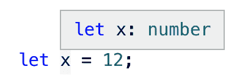
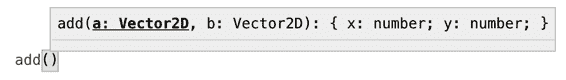
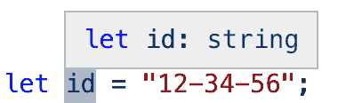

# 第三章：类型推断

对于在工业中使用的编程语言，“静态类型”和“显式类型”传统上是同义的。C、C++、Java：它们都要求你明确地写出你的类型。但学术语言从未将这两个概念混为一谈：像 ML 和 Haskell 这样的语言长期以来就有复杂的类型推断系统，并且在过去的十年中开始渗透到工业语言中。C++ 添加了 `auto`，Java 添加了 `var`。

TypeScript 广泛使用类型推断。合理使用它可以显著减少代码中所需的类型注释。要从一个 TypeScript 初学者和经验丰富的用户中区分开来，最简单的方法之一就是看类型注释的数量。一个有经验的 TypeScript 开发者会使用相对较少的注释（但用得很有效），而初学者可能会在代码中大量使用冗余的类型注释。

本章向你展示了类型推断可能出现的问题以及如何解决。阅读完本章后，你应该对 TypeScript 如何推断类型、仍需编写类型声明的时机以及在可以推断类型时编写类型声明是否明智有了深刻的理解。

# Item 19: 避免用可推断的类型使你的代码杂乱无章

当你将一个代码库从 JavaScript 转换为 TypeScript 时，许多新的 TypeScript 开发者会做的第一件事就是用类型注释填充它。毕竟，TypeScript 是关于*类型*的！但在 TypeScript 中，许多注释都是不必要的。为所有变量声明类型是适得其反的，也被认为是不良风格。

不要写：

```
let x: number = 12;
```

相反，只需写：

```
let x = 12;
```

如果你在编辑器中将鼠标悬停在`x`上，你会发现它的类型被推断为`number`（如图 3-1 所示）。



###### 图 3-1. 一个文本编辑器显示了 x 的推断类型为 number。

显式类型注释是多余的。额外添加它只会增加噪音。如果你对类型不确定，可以在编辑器中检查它。

TypeScript 还可以推断出更复杂对象的类型。而不是：

```
const person: {
  name: string;
  born: {
    where: string;
    when: string;
  };
  died: {
    where: string;
    when: string;
  }
} = {
  name: 'Sojourner Truth',
  born: {
    where: 'Swartekill, NY',
    when: 'c.1797',
  },
  died: {
    where: 'Battle Creek, MI',
    when: 'Nov. 26, 1883'
  }
};
```

你可以简单地写：

```
const person = {
  name: 'Sojourner Truth',
  born: {
    where: 'Swartekill, NY',
    when: 'c.1797',
  },
  died: {
    where: 'Battle Creek, MI',
    when: 'Nov. 26, 1883'
  }
};
```

再次强调，这些类型完全相同。在这里除了值之外再写上类型只会增加噪音。(Item 21 进一步讨论了对象字面量的类型推断。)

对于数组来说，对象的情况也是如此。TypeScript 没有任何问题来基于其输入和操作来推断此函数的返回类型：

```
function square(nums: number[]) {
  return nums.map(x => x * x);
}
const squares = square([1, 2, 3, 4]); // Type is number[]
```

TypeScript 可能会推断出比你预期的更精确的内容。这通常是件好事。例如：

```
const axis1: string = 'x';  // Type is string
const axis2 = 'y';  // Type is "y"
```

`"y"`对于`axis`变量来说是更精确的类型。Item 21 提供了一个示例，展示了如何修复类型错误。

允许类型被推断也有助于重构。假设你有一个`Product`类型和一个用于记录它的函数：

```
interface Product {
  id: number;
  name: string;
  price: number;
}

function logProduct(product: Product) {
  const id: number = product.id;
  const name: string = product.name;
  const price: number = product.price;
  console.log(id, name, price);
}
```

在某个时候，你发现产品 ID 可能除了数字外还包含字母。因此，你改变了`Product`中`id`的类型。因为你在`logProduct`中的所有变量上都包含了显式注释，这导致了一个错误：

```
interface Product {
  id: string;
  name: string;
  price: number;
}

function logProduct(product: Product) {
  const id: number = product.id;
     // ~~ Type 'string' is not assignable to type 'number'
  const name: string = product.name;
  const price: number = product.price;
  console.log(id, name, price);
}
```

如果你在`logProduct`函数体中省略了所有注释，代码将通过类型检查器而不需要修改。

更好的`logProduct`实现会使用解构赋值（Item 58）：

```
function logProduct(product: Product) {
  const {id, name, price} = product;
  console.log(id, name, price);
}
```

这个版本允许推断所有局部变量的类型。相应的带有显式类型注释的版本是重复的和混乱的：

```
function logProduct(product: Product) {
  const {id, name, price}: {id: string; name: string; price: number } = product;
  console.log(id, name, price);
}
```

在一些情况下，TypeScript 仍然需要显式的类型注释，因为它没有足够的上下文来自动确定类型。你之前见过其中之一：函数参数。

一些语言会根据参数的最终使用情况推断类型，但 TypeScript 不会。在 TypeScript 中，变量的类型通常在首次引入时确定。

理想的 TypeScript 代码包括函数/方法签名的类型注释，但不包括在其主体中创建的局部变量。这样可以将噪音降到最低，让读者专注于实现逻辑。

也有一些情况下，你可以省略函数参数的类型注释。例如，当有默认值时：

```
function parseNumber(str: string, base=10) {
  // ...
}
```

这里`base`的类型被推断为`number`，因为默认值为`10`。

当函数被用作带有类型声明的库的回调时，参数类型通常可以被推断。在这个使用 express HTTP 服务器库的例子中，`request`和`response`上的声明是不需要的：

```
// Don't do this:
app.get('/health', (request: express.Request, response: express.Response) => {
  response.send('OK');
});

// Do this:
app.get('/health', (request, response) => {
  response.send('OK');
});
```

Item 26 更深入地探讨了上下文在类型推断中的使用。

有一些情况下，即使类型可以被推断，你仍然可能想要指定一个类型。

其中一种情况是当你定义一个对象字面量时：

```
const elmo: Product = {
  name: 'Tickle Me Elmo',
  id: '048188 627152',
  price: 28.99,
};
```

当你在定义中指定类型时，你启用了多余属性检查（Item 11）。这可以帮助捕捉错误，特别是对于具有可选字段的类型。

你还增加了错误报告在正确位置的几率。如果省略注释，对象定义中的错误将导致类型错误在使用它的地方而不是定义它的地方报告：

```
const furby = {
  name: 'Furby',
  id: 630509430963,
  price: 35,
};
logProduct(furby);
        // ~~~~~ Argument .. is not assignable to parameter of type 'Product'
        //         Types of property 'id' are incompatible
        //         Type 'number' is not assignable to type 'string'
```

使用注释，你可以在错误发生的地方得到更简洁的错误提示：

```
 const furby: Product = {
   name: 'Furby',
   id: 630509430963,
// ~~ Type 'number' is not assignable to type 'string'
   price: 35,
 };
 logProduct(furby);
```

类似的考虑也适用于函数的返回类型。即使可以推断出类型，你可能仍然想要注释这一点，以确保实现错误不会泄漏到函数的使用中。

假设你有一个用于获取股票报价的函数：

```
function getQuote(ticker: string) {
  return fetch(`https://quotes.example.com/?q=${ticker}`)
      .then(response => response.json());
}
```

你决定添加一个缓存以避免重复的网络请求：

```
const cache: {[ticker: string]: number} = {};
function getQuote(ticker: string) {
  if (ticker in cache) {
    return cache[ticker];
  }
  return fetch(`https://quotes.example.com/?q=${ticker}`)
      .then(response => response.json())
      .then(quote => {
        cache[ticker] = quote;
        return quote;
      });
}
```

在这个实现中有一个错误：你应该真正返回 `Promise.resolve(cache[ticker])` 以确保 `getQuote` 总是返回一个 Promise。这个错误很可能会产生一个错误... 但是在调用 `getQuote` 的代码中，而不是在 `getQuote` 本身：

```
getQuote('MSFT').then(considerBuying);
              // ~~~~ Property 'then' does not exist on type
              //        'number | Promise<any>'
              //      Property 'then' does not exist on type 'number'
```

如果你已经注释了预期的返回类型（`Promise<number>`），错误将会在正确的位置报告：

```
const cache: {[ticker: string]: number} = {};
function getQuote(ticker: string): Promise<number> {
  if (ticker in cache) {
    return cache[ticker];
        // ~~~~~~~~~~~~~ Type 'number' is not assignable to 'Promise<number>'
  }
  // ...
}
```

当你注释返回类型时，它可以防止实现错误表现为用户代码中的错误（请参阅 条目 25 讨论 async 函数，这是避免与 Promise 相关特定错误的有效方法）。

写出返回类型还可以帮助你更清晰地思考你的函数：在实现之前，你应该知道它的输入和输出类型是什么。虽然实现可能会有些变化，但函数的契约（其类型签名）通常不应该改变。这与测试驱动开发（TDD）的精神类似，即在实现之前编写测试来测试一个函数。首先写出完整的类型签名有助于获得你想要的函数，而不是实现使其变得方便的函数。

注释返回值的最后一个原因是，如果你想使用一个命名类型。例如，你可能选择不为这个函数写返回类型：

```
interface Vector2D { x: number; y: number; }
function add(a: Vector2D, b: Vector2D) {
  return { x: a.x + b.x, y: a.y + b.y };
}
```

TypeScript 推断返回类型为 `{ x: number; y: number; }`。这与 `Vector2D` 兼容，但当用户看到 `Vector2D` 作为输入类型而不是输出类型时（如 图 3-2 所示），可能会感到惊讶。



###### 图 3-2\. `add` 函数的参数有命名类型，而推断的返回值没有。

如果你给返回类型加上注释，演示就会更加直观。如果你在类型的文档中写了文档（条目 48），那么它也将与返回值关联起来。随着推断的返回类型复杂性增加，提供一个名称将变得越来越有帮助。

如果你在使用 linter，eslint 规则 `no-inferrable-types`（注意变体拼写）可以帮助确保所有的类型注释确实是必要的。

## 记住的事情

+   当 TypeScript 可以推断相同类型时，避免写入类型注释。

+   理想情况下，你的代码在函数/方法签名中有类型注释，但在其主体中的局部变量则没有。

+   考虑在对象字面量和函数返回类型上使用显式注释，即使它们可以被推断。这将有助于防止实施错误在用户代码中显现。

# 条目 20：使用不同的变量来表示不同的类型

在 JavaScript 中，重用一个变量以保存不同类型的值用于不同的目的是没有问题的：

```
let id = "12-34-56";
fetchProduct(id);  // Expects a string

id = 123456;
fetchProductBySerialNumber(id);  // Expects a number
```

在 TypeScript 中，这会导致两个错误：

```
   let id = "12-34-56";
   fetchProduct(id);

   id = 123456;
// ~~ '123456' is not assignable to type 'string'.
   fetchProductBySerialNumber(id);
                           // ~~ Argument of type 'string' is not assignable to
                           //    parameter of type 'number'
```

在编辑器中悬停在第一个`id`上会给出关于正在发生的提示（参见 图 3-3）。



###### 图 3-3。id 的推断类型为字符串。

基于值 `"12-34-56"`，TypeScript 推断出 `id` 的类型为 `string`。您不能将 `number` 分配给 `string`，因此会出错。

这使我们得出 TypeScript 中变量的一个关键见解：*虽然变量的值可以改变，但其类型通常不会改变*。类型可以变窄（Item 22），但这涉及到类型变得更小，而不是扩展以包括新值。这个规则有一些重要的例外情况（Item 41），但它们是例外而不是规则。

如何使用这个想法修复示例？为了使 `id` 的类型不改变，它必须足够广泛以包括 `string` 和 `number`。这正是联合类型 `string|number` 的定义：

```
let id: string|number = "12-34-56";
fetchProduct(id);

id = 123456;  // OK
fetchProductBySerialNumber(id);  // OK
```

这修复了错误。有趣的是 TypeScript 能够确定第一次调用中 `id` 真正是一个 `string`，而在第二次调用中真正是一个 `number`。它根据赋值缩小了联合类型。

虽然联合类型确实有效，但它可能会在以后引起更多问题。与简单类型（如 `string` 或 `number`）相比，联合类型更难处理，因为通常必须在对它们进行任何操作之前检查它们的类型。

更好的解决方案是引入一个新变量：

```
const id = "12-34-56";
fetchProduct(id);

const serial = 123456;  // OK
fetchProductBySerialNumber(serial);  // OK
```

在先前的版本中，第一个和第二个 `id` 在语义上并不相关。它们只是通过变量重用相关联。这对类型检查器来说很令人困惑，对人类读者也是如此。

有两个变量的版本在很多方面都更好：

+   它解开了两个不相关的概念（ID 和序列号）。

+   它允许您使用更具体的变量名。

+   它改善了类型推断。不需要类型注解。

+   它导致更简单的类型（`string` 和 `number`，而不是 `string|number`）。

+   它允许您将变量声明为 `const` 而不是 `let`。这样更容易让人和类型检查器理解。

尽量避免改变类型的变量。如果可以为不同的概念使用不同的名称，将使您的代码对人类读者和类型检查器更清晰。

这与此示例中的“遮蔽”变量不同，请注意区分。

```
const id = "12-34-56";
fetchProduct(id);

{
  const id = 123456;  // OK
  fetchProductBySerialNumber(id);  // OK
}
```

尽管这两个 `id` 共享一个名称，但它们实际上是两个彼此无关的变量。它们具有不同的类型是可以的。尽管 TypeScript 不会对此感到困惑，但您的人类读者可能会。总的来说，最好为不同的概念使用不同的名称。许多团队选择通过 linter 规则禁止此类变量遮蔽。

此项专注于标量值，但类似的考虑也适用于对象。有关更多信息，请参阅 Item 23。

## 要记住的事情

+   虽然变量的值可以改变，但其类型通常不会改变。

+   为了避免混淆，无论是对人类读者还是对类型检查器，都应避免为不同类型的值重用变量。

# 第 21 条：理解类型扩展

正如第 7 条所解释的，在运行时，每个变量只有一个值。但在静态分析时，当 TypeScript 检查你的代码时，变量有一组*可能的*值，即它的类型。当你用常量初始化一个变量但没有提供类型时，类型检查器需要决定一个。换句话说，它需要从你指定的单一值中确定一组可能的值。在 TypeScript 中，这个过程称为*扩展*。理解这一点将帮助你理解错误并更有效地使用类型注解。

假设你正在编写一个用于处理向量的库。你定义了一个三维向量的类型以及一个获取其任何分量值的函数：

```
interface Vector3 { x: number; y: number; z: number; }
function getComponent(vector: Vector3, axis: 'x' | 'y' | 'z') {
  return vector[axis];
}
```

但是当你尝试使用它时，TypeScript 会标记一个错误：

```
let x = 'x';
let vec = {x: 10, y: 20, z: 30};
getComponent(vec, x);
               // ~ Argument of type 'string' is not assignable to
               //   parameter of type '"x" | "y" | "z"'
```

这段代码可以正常运行，那么为什么会有错误呢？

问题在于`x`的类型被推断为`string`，而`getComponent`函数期望其第二个参数有更具体的类型。这就是扩展的工作方式，这里导致了一个错误。

这个过程在某种意义上是模糊的，因为对于任何给定值，可能有许多可能的类型。例如，在这个声明中：

```
const mixed = ['x', 1];
```

`mixed`的类型应该是什么呢？以下是一些可能性：

+   `('x' | 1)[]`

+   `['x', 1]`

+   `[string, number]`

+   `readonly [string, number]`

+   `(string|number)[]`

+   `readonly (string|number)[]`

+   `[any, any]`

+   `any[]`

没有更多的上下文，TypeScript 无法知道哪一个是“正确”的。它必须猜测你的意图。（在这种情况下，它猜测为`(string|number)[]`。）虽然 TypeScript 很聪明，但它无法读取你的思想。它不会在 100%的情况下做出正确的猜测。结果是意外的错误，就像我们刚才看到的那个。

在初始示例中，`x`的类型被推断为`string`，因为 TypeScript 选择允许这样的代码存在：

```
let x = 'x';
x = 'a';
x = 'Four score and seven years ago...';
```

但是，如果你将其作为 JavaScript 来写也是有效的：

```
let x = 'x';
x = /x|y|z/;
x = ['x', 'y', 'z'];
```

当 TypeScript 将`x`的类型推断为`string`时，它试图在具体性和灵活性之间取得平衡。一般规则是变量的类型在声明后不应更改（第 20 条），因此`string`比`string|RegExp`、`string|string[]`或`any`更合理。

TypeScript 提供了一些方法来控制扩展的过程。其中之一是`const`。如果你用`const`声明一个变量，而不是`let`，它的类型会更窄。事实上，使用`const`修复了我们原始示例中的错误：

```
const x = 'x';  // type is "x"
let vec = {x: 10, y: 20, z: 30};
getComponent(vec, x);  // OK
```

因为`x`不能重新赋值，TypeScript 能够在没有风险地不经意地标记后续赋值错误的情况下推断出更窄的类型。而且因为字符串文字类型`"x"`可以分配给`"x"|"y"|"z"`，所以代码通过了类型检查器。

然而，`const`并非万能良药。对于对象和数组，仍然存在模糊性。这里的`mixed`示例说明了数组的问题：TypeScript 应该推断一个元组类型吗？它应该为元素推断什么类型？类似的问题也会出现在对象上。这段代码在 JavaScript 中是可以的：

```
const v = {
  x: 1,
};
v.x = 3;
v.x = '3';
v.y = 4;
v.name = 'Pythagoras';
```

变量 `v` 的类型可以在特异性的光谱中的任何位置被推断出来。特定端是 `{readonly x: 1}`。更一般的是 `{x: number}`。更一般的还包括 `{[key: string]: number}` 或 `object`。对于对象来说，TypeScript 的扩展算法将每个元素视为使用 `let` 分配的。因此，变量 `v` 的类型最终变为 `{x: number}`。这使您可以重新赋值 `v.x` 为不同的数字，但不能为字符串。并且阻止您添加其他属性。（这是一种一次性构建对象的好理由，详见条目 23。）

因此，最后三个语句是错误的：

```
 const v = {
   x: 1,
 };
 v.x = 3;  // OK
 v.x = '3';
// ~ Type '"3"' is not assignable to type 'number'
 v.y = 4;
// ~ Property 'y' does not exist on type '{ x: number; }'
 v.name = 'Pythagoras';
// ~~~~ Property 'name' does not exist on type '{ x: number; }'
```

再次强调，TypeScript 正在努力在特异性和灵活性之间取得平衡。它需要推断出足够具体的类型以捕捉错误，但不能太具体以至于造成误报。它通过推断出对于像 `1` 这样初始化的属性的类型为 `number` 来实现这一点。

如果您了解更多，请覆盖 TypeScript 的默认行为的几种方法之一是提供显式的类型注解：

```
const v: {x: 1|3|5} = {
  x: 1,
};  // Type is { x: 1 | 3 | 5; }
```

另一种方法是为类型检查器提供额外的上下文（例如，将值作为函数参数传递）。关于上下文在类型推断中的作用，详见条目 26。

第三种方法是使用 `const` 断言。这与 `let` 和 `const` 不同，它引入值空间中的符号。这是一个纯粹的类型级别构造。查看这些变量的不同推断类型：

```
const v1 = {
  x: 1,
  y: 2,
};  // Type is { x: number; y: number; }

const v2 = {
  x: 1 as const,
  y: 2,
};  // Type is { x: 1; y: number; }

const v3 = {
  x: 1,
  y: 2,
} as const;  // Type is { readonly x: 1; readonly y: 2; }
```

当您在值后面写上 `as const` 时，TypeScript 将为其推断出最窄可能的类型。没有扩展。对于真正的常量，这通常是您想要的。您还可以在数组中使用 `as const` 来推断元组类型：

```
const a1 = [1, 2, 3];  // Type is number[]
const a2 = [1, 2, 3] as const;  // Type is readonly [1, 2, 3]
```

如果您因扩展而得到错误的错误消息，请考虑添加一些显式的类型注解或 `const` 断言。检查编辑器中的类型是建立对此直觉的关键（参见条目 6）。

## 要记住的事情

+   了解 TypeScript 如何通过扩展推断常量的类型。

+   熟悉您可以影响此行为的方式：`const`、类型注解、上下文和 `as const`。

# 条目 22：理解类型缩小

扩展的反义是缩小。这是 TypeScript 从广泛类型到较窄类型的过程。这个过程中最常见的例子可能是空值检查：

```
const el = document.getElementById('foo'); // Type is HTMLElement | null
if (el) {
  el // Type is HTMLElement
  el.innerHTML = 'Party Time'.blink();
} else {
  el // Type is null
  alert('No element #foo');
}
```

如果 `el` 是 `null`，则第一个分支中的代码将不会执行。因此，TypeScript 能够从此块中的类型联合中排除 `null`，从而导致一个更窄的类型，更容易处理。类型检查器通常在这类条件语句中缩小类型方面表现良好，尽管有时可能会被别名所挫败（详见条目 24）。

您还可以通过在分支中抛出或返回来缩小变量在块的其余部分的类型。例如：

```
const el = document.getElementById('foo'); // Type is HTMLElement | null
if (!el) throw new Error('Unable to find #foo');
el; // Now type is HTMLElement
el.innerHTML = 'Party Time'.blink();
```

有许多方法可以缩小类型。使用 `instanceof` 是有效的：

```
function contains(text: string, search: string|RegExp) {
  if (search instanceof RegExp) {
    search  // Type is RegExp
    return !!search.exec(text);
  }
  search  // Type is string
  return text.includes(search);
}
```

属性检查也是如此：

```
interface A { a: number }
interface B { b: number }
function pickAB(ab: A | B) {
  if ('a' in ab) {
    ab // Type is A
  } else {
    ab // Type is B
  }
  ab // Type is A | B
}
```

一些内置函数如 `Array.isArray` 能够缩小类型：

```
function contains(text: string, terms: string|string[]) {
  const termList = Array.isArray(terms) ? terms : [terms];
  termList // Type is string[]
  // ...
}
```

在条件语句中，TypeScript 通常非常擅长跟踪类型。在添加断言之前，考虑两次——它可能会捕捉到你所未见的东西！例如，这是排除 `null` 从联合类型中的错误方法：

```
const el = document.getElementById('foo'); // type is HTMLElement | null
if (typeof el === 'object') {
  el;  // Type is HTMLElement | null
}
```

因为在 JavaScript 中，`typeof null` 是 `"object"`，所以实际上这种检查并没有排除 `null`！类似的意外可能来自假值原始值：

```
function foo(x?: number|string|null) {
  if (!x) {
    x;  // Type is string | number | null | undefined
  }
}
```

因为空字符串和 `0` 都是假值，因此在该分支中 `x` 仍然可能是 `string` 或 `number`。TypeScript 是正确的！

另一种帮助类型检查器缩小类型范围的常见方法是为它们显式地打上“标签”：

```
interface UploadEvent { type: 'upload'; filename: string; contents: string }
interface DownloadEvent { type: 'download'; filename: string; }
type AppEvent = UploadEvent | DownloadEvent;

function handleEvent(e: AppEvent) {
  switch (e.type) {
    case 'download':
      e  // Type is DownloadEvent
      break;
    case 'upload':
      e;  // Type is UploadEvent
      break;
  }
}
```

这种模式称为“标记联合”或“辨识联合”，在 TypeScript 中是无处不在的。

如果 TypeScript 无法推断类型，甚至可以引入自定义函数来帮助它：

```
function isInputElement(el: HTMLElement): el is HTMLInputElement {
  return 'value' in el;
}

function getElementContent(el: HTMLElement) {
  if (isInputElement(el)) {
    el; // Type is HTMLInputElement
    return el.value;
  }
  el; // Type is HTMLElement
  return el.textContent;
}
```

这被称为“用户定义的类型保护”。`el is HTMLInputElement` 作为返回类型告诉类型检查器，如果函数返回 true，则可以缩小参数的类型。

一些函数能够使用类型保护来跨数组或对象执行类型缩小。例如，如果在数组中进行一些查找，可能会得到一个可空类型的数组：

```
const jackson5 = ['Jackie', 'Tito', 'Jermaine', 'Marlon', 'Michael'];
const members = ['Janet', 'Michael'].map(
  who => jackson5.find(n => n === who)
);  // Type is (string | undefined)[]
```

如果使用 `filter` 过滤掉 `undefined` 值，TypeScript 将无法跟踪：

```
const members = ['Janet', 'Michael'].map(
  who => jackson5.find(n => n === who)
).filter(who => who !== undefined);  // Type is (string | undefined)[]
```

但如果使用类型保护，它可以：

```
function isDefined<T>(x: T | undefined): x is T {
  return x !== undefined;
}
const members = ['Janet', 'Michael'].map(
  who => jackson5.find(n => n === who)
).filter(isDefined);  // Type is string[]
```

如常，在编辑器中检查类型是建立对缩小工作原理直觉的关键。

理解 TypeScript 中类型缩小的原理将帮助你建立对类型推断工作的直觉，理解错误，并通常更有效地与类型检查器交互。

## 需要记住的事项

+   了解 TypeScript 如何根据条件和其他类型控制流缩小类型范围。

+   使用标记/辨识联合和用户定义的类型保护来帮助缩小过程。

# 条款 23：一次性创建对象

正如 Item 20 所述，虽然变量的值可能会改变，在 TypeScript 中它的类型通常不会改变。这使得一些 JavaScript 模式在 TypeScript 中更容易建模。特别是，这意味着你应该更倾向于一次性创建对象，而不是逐步创建。

这是在 JavaScript 中表示二维点对象的一种方式：

```
const pt = {};
pt.x = 3;
pt.y = 4;
```

在 TypeScript 中，这将在每次赋值时产生错误：

```
const pt = {};
pt.x = 3;
// ~ Property 'x' does not exist on type '{}'
pt.y = 4;
// ~ Property 'y' does not exist on type '{}'
```

这是因为第一行中 `pt` 的类型是根据其值 `{}` 推断出来的，并且你只能分配已知的属性。

如果定义了一个 `Point` 接口，你会得到相反的问题：

```
interface Point { x: number; y: number; }
const pt: Point = {};
   // ~~ Type '{}' is missing the following properties from type 'Point': x, y
pt.x = 3;
pt.y = 4;
```

解决方案是一次性定义对象：

```
const pt = {
  x: 3,
  y: 4,
};  // OK
```

如果必须逐步构建对象，可以使用类型断言（`as`）来消除类型检查器的警告：

```
const pt = {} as Point;
pt.x = 3;
pt.y = 4;  // OK
```

但更好的方式是一次性构建对象，并使用声明（参见 Item 9）：

```
const pt: Point = {
  x: 3,
  y: 4,
};
```

如果你需要从较小的对象构建一个较大的对象，避免分步进行：

```
const pt = {x: 3, y: 4};
const id = {name: 'Pythagoras'};
const namedPoint = {};
Object.assign(namedPoint, pt, id);
namedPoint.name;
        // ~~~~ Property 'name' does not exist on type '{}'
```

你可以使用 *对象扩展操作符* `...` 一次性构建更大的对象：

```
const namedPoint = {...pt, ...id};
namedPoint.name;  // OK, type is string
```

你也可以使用对象扩展操作符以一种类型安全的方式逐个字段地构建对象。关键是在每次更新时使用一个新变量，以便每个变量都获得一个新类型：

```
const pt0 = {};
const pt1 = {...pt0, x: 3};
const pt: Point = {...pt1, y: 4};  // OK
```

尽管这是一种绕弯子的方式来构建这样一个简单的对象，但它可以是一种有用的技术，用于向对象添加属性并允许 TypeScript 推断出新类型。

要以类型安全的方式有条件地向对象添加属性，你可以使用带有 `null` 或 `{}` 的对象扩展：

```
declare let hasMiddle: boolean;
const firstLast = {first: 'Harry', last: 'Truman'};
const president = {...firstLast, ...(hasMiddle ? {middle: 'S'} : {})};
```

如果在编辑器中悬停鼠标在`president`上，你会看到它的类型被推断为一个联合类型：

```
const president: {
    middle: string;
    first: string;
    last: string;
} | {
    first: string;
    last: string;
}
```

如果你希望 `middle` 是一个可选字段，这可能会让你感到惊讶。例如，你无法从这种类型中读取 `middle`：

```
president.middle
       // ~~~~~~ Property 'middle' does not exist on type
       //        '{ first: string; last: string; }'
```

如果你在有条件地添加多个属性，联合类型确实更准确地表示可能的值集合（条款 32）。但可选字段会更容易处理。你可以用一个辅助函数来获取它：

```
function addOptional<T extends object, U extends object>(
  a: T, b: U | null
): T & Partial<U> {
  return {...a, ...b};
}

const president = addOptional(firstLast, hasMiddle ? {middle: 'S'} : null);
president.middle  // OK, type is string | undefined
```

有时候你想通过转换另一个对象或数组来构建一个对象或数组。在这种情况下，“一次性构建对象”的等价方法是使用内置的函数式构造或类似 Lodash 这样的实用库，而不是使用循环。详见 条款 27 了解更多信息。

## 需要记住的事情

+   最好一次性构建对象，而不是逐步构建。使用对象扩展 (`{...a, ...b}`) 以一种类型安全的方式添加属性。

+   知道如何有条件地向对象添加属性。

# 条款 24：在使用别名时要保持一致性

当你为一个值引入一个新名称时：

```
const borough = {name: 'Brooklyn', location: [40.688, -73.979]};
const loc = borough.location;
```

你已经创建了一个 *别名*。对别名上属性的更改也会在原始值上可见：

```
> loc[0] = 0;
> borough.location
[0, -73.979]
```

别名是所有语言中编译器编写者的祸根，因为它们使得控制流分析变得困难。如果你在使用别名时考虑周到，TypeScript 将能够更好地理解你的代码并帮助你找到更多真正的错误。

假设你有一个表示多边形的数据结构：

```
interface Coordinate {
  x: number;
  y: number;
}

interface BoundingBox {
  x: [number, number];
  y: [number, number];
}

interface Polygon {
  exterior: Coordinate[];
  holes: Coordinate[][];
  bbox?: BoundingBox;
}
```

多边形的几何形状由 `exterior` 和 `holes` 属性指定。`bbox` 属性是一种可能有可能没有的优化。你可以用它来加速点在多边形内的检查：

```
function isPointInPolygon(polygon: Polygon, pt: Coordinate) {
  if (polygon.bbox) {
    if (pt.x < polygon.bbox.x[0] || pt.x > polygon.bbox.x[1] ||
        pt.y < polygon.bbox.y[1] || pt.y > polygon.bbox.y[1]) {
      return false;
    }
  }

  // ... more complex check
}
```

这段代码可以工作（并且类型检查通过），但有点重复：`polygon.bbox` 在三行中出现了五次！下面试图因子化一个中间变量以减少重复：

```
function isPointInPolygon(polygon: Polygon, pt: Coordinate) {
  const box = polygon.bbox;
  if (polygon.bbox) {
    if (pt.x < box.x[0] || pt.x > box.x[1] ||
        //     ~~~                ~~~  Object is possibly 'undefined'
        pt.y < box.y[1] || pt.y > box.y[1]) {
        //     ~~~                ~~~  Object is possibly 'undefined'
      return false;
    }
  }
  // ...
}
```

（我假设你已经启用了 `strictNullChecks`。）

这段代码仍然可以工作，那么为什么会有错误？通过因子化 `box` 变量，你创建了一个对 `polygon.bbox` 的别名，这阻碍了在第一个示例中悄悄工作的控制流分析。

你可以检查 `box` 和 `polygon.bbox` 的类型，看看发生了什么：

```
function isPointInPolygon(polygon: Polygon, pt: Coordinate) {
  polygon.bbox  // Type is BoundingBox | undefined
  const box = polygon.bbox;
  box  // Type is BoundingBox | undefined
  if (polygon.bbox) {
    polygon.bbox  // Type is BoundingBox
    box  // Type is BoundingBox | undefined
  }
}
```

属性检查精化了`polygon.bbox`的类型，但未精化`box`，从而导致错误。这带我们来到别名的黄金法则：*如果你引入了一个别名，请一致地使用它*。

在属性检查中使用`box`修复了错误：

```
function isPointInPolygon(polygon: Polygon, pt: Coordinate) {
  const box = polygon.bbox;
  if (box) {
    if (pt.x < box.x[0] || pt.x > box.x[1] ||
        pt.y < box.y[1] || pt.y > box.y[1]) {  // OK
      return false;
    }
  }
  // ...
}
```

类型检查器现在很满意，但对于人类读者来说存在问题。我们为同一事物使用了两个名称：`box`和`bbox`。这是一个没有实质差别的区分（Item 36）。

对象解构语法通过更紧凑的语法奖励一致的命名。你甚至可以在数组和嵌套结构上使用它：

```
function isPointInPolygon(polygon: Polygon, pt: Coordinate) {
  const {bbox} = polygon;
  if (bbox) {
    const {x, y} = bbox;
    if (pt.x < x[0] || pt.x > x[1] ||
        pt.y < x[0] || pt.y > y[1]) {
      return false;
    }
  }
  // ...
}
```

还有几点需要注意：

+   如果`x`和`y`属性是可选的而不是整个`bbox`属性，那么这段代码将需要更多的属性检查。我们受益于遵循 Item 31 的建议，该建议讨论了将空值推送到类型的边缘的重要性。

+   对于`bbox`来说，可选属性是合适的，但对于`holes`来说则不适用。如果`holes`是可选的，那么它可能会不存在，或者是一个空数组（`[]`）。这是一个没有实质差别的区分。空数组是表示“没有孔”的良好方式。

在与类型检查器的交互中，不要忘记别名可能会引入运行时的混淆：

```
const {bbox} = polygon;
if (!bbox) {
  calculatePolygonBbox(polygon);  // Fills in polygon.bbox
  // Now polygon.bbox and bbox refer to different values!
}
```

TypeScript 的控制流分析对局部变量而言通常非常好。但对于属性，你应该保持警惕：

```
function fn(p: Polygon) { /* ... */ }

polygon.bbox  // Type is BoundingBox | undefined
if (polygon.bbox) {
  polygon.bbox  // Type is BoundingBox
  fn(polygon);
  polygon.bbox  // Type is still BoundingBox
}
```

函数调用`fn(polygon)`可能会导致`polygon.bbox`被取消设置，因此将类型回归为`BoundingBox | undefined`会更安全。但这样会变得很烦人：每次调用函数时都需要重复进行属性检查。因此，TypeScript 作出了务实的选择，假设函数不会使其类型精化失效。但它*可能*会。如果你将局部变量`bbox`拆分出来，而不是使用`polygon.bbox`，那么`bbox`的类型将保持准确，但它可能不再是`polygon.box`的相同值。

## 需要记住的事情

+   别名可能会阻止 TypeScript 缩小类型范围。如果为变量创建了一个别名，请一致使用它。

+   使用解构语法来鼓励一致的命名。

+   注意函数调用如何使属性的类型精化失效。相信对局部变量的精化胜过对属性的精化。

# 项目 25：使用异步函数而不是回调来处理异步代码

经典 JavaScript 使用回调函数模拟异步行为。这导致了臭名昭著的“金字塔形式的嵌套”：

```
fetchURL(url1, function(response1) {
  fetchURL(url2, function(response2) {
    fetchURL(url3, function(response3) {
      // ...
      console.log(1);
    });
    console.log(2);
  });
  console.log(3);
});
console.log(4);

// Logs:
// 4
// 3
// 2
// 1
```

正如你从日志中看到的那样，执行顺序与代码顺序相反。这使得回调代码难以阅读。如果你想要并行运行请求或在出现错误时放弃执行，情况会更加混乱。

ES2015 引入了 Promise 的概念来打破嵌套的金字塔形式。Promise 表示将来会可用的东西（它们有时也被称为“期货”）。以下是使用 Promise 的相同代码：

```
const page1Promise = fetch(url1);
page1Promise.then(response1 => {
  return fetch(url2);
}).then(response2 => {
  return fetch(url3);
}).then(response3 => {
  // ...
}).catch(error => {
  // ...
});
```

现在嵌套更少，执行顺序更直接地匹配代码顺序。同时更容易整合错误处理和使用`Promise.all`这样的高阶工具。

ES2017 引入了`async`和`await`关键字，使得事情变得更简单：

```
async function fetchPages() {
  const response1 = await fetch(url1);
  const response2 = await fetch(url2);
  const response3 = await fetch(url3);
  // ...
}
```

`await`关键字暂停`fetchPages`函数的执行，直到每个 Promise 解决。在`async`函数中，`await`一个抛出异常的 Promise。这让你可以使用通常的 try/catch 机制：

```
async function fetchPages() {
  try {
    const response1 = await fetch(url1);
    const response2 = await fetch(url2);
    const response3 = await fetch(url3);
    // ...
  } catch (e) {
    // ...
  }
}
```

当你的目标是 ES5 或更早版本时，TypeScript 编译器将执行一些复杂的转换使`async`和`await`工作。换句话说，无论你的运行时是什么，使用 TypeScript 你都可以使用`async`/`await`。

有几个好的理由优先选择 Promises 或`async`/`await`而不是回调：

+   Promises 比回调更容易组合。

+   类型更容易通过 Promises 流动而不是回调。

如果你想并行获取页面，你可以使用`Promise.all`组合 Promises：

```
async function fetchPages() {
  const [response1, response2, response3] = await Promise.all([
    fetch(url1), fetch(url2), fetch(url3)
  ]);
  // ...
}
```

在这种情况下，使用`await`与解构赋值特别好。

TypeScript 能够推断每个`response`变量的类型为`Response`。与回调一起并行请求的等效代码需要更多的机制和类型注释：

```
function fetchPagesCB() {
  let numDone = 0;
  const responses: string[] = [];
  const done = () => {
    const [response1, response2, response3] = responses;
    // ...
  };
  const urls = [url1, url2, url3];
  urls.forEach((url, i) => {
    fetchURL(url, r => {
      responses[i] = url;
      numDone++;
      if (numDone === urls.length) done();
    });
  });
}
```

将错误处理扩展到包括或作为`Promise.all`一样通用是有挑战的。

类型推断与`Promise.race`一起工作良好，它在其输入 Promise 中第一个解决时解决。你可以用这个通用方式为 Promises 添加超时：

```
function timeout(millis: number): Promise<never> {
  return new Promise((resolve, reject) => {
     setTimeout(() => reject('timeout'), millis);
  });
}

async function fetchWithTimeout(url: string, ms: number) {
  return Promise.race([fetch(url), timeout(ms)]);
}
```

`fetchWithTimeout`的返回类型被推断为`Promise<Response>`，不需要类型注释。深入研究为什么这样工作是有趣的：`Promise.race`的返回类型是其输入类型的联合，这种情况下是`Promise<Response | never>`。但与`never`（空集）的联合是一个无操作，因此这简化为`Promise<Response>`。当你使用 Promises 时，所有的 TypeScript 类型推断机制都会为你获取正确的类型。

有时候你需要使用原始的 Promises，尤其是在包装回调 API 像`setTimeout`的时候。但如果可以选择，通常你应该优先选择`async`/`await`，因为有两个原因：

+   它通常产生更简洁和直接的代码。

+   它强制`async`函数总是返回 Promises。

`async`函数总是返回一个`Promise`，即使它不涉及`await`任何东西。TypeScript 可以帮助你建立这种直觉：

```
// function getNumber(): Promise<number>
async function getNumber() {
  return 42;
}
```

你也可以创建`async`箭头函数：

```
const getNumber = async () => 42;  // Type is () => Promise<number>
```

原始的 Promise 等价物是：

```
const getNumber = () => Promise.resolve(42);  // Type is () => Promise<number>
```

尽管对于一个立即可用的值返回 Promise 可能看起来有些奇怪，但这实际上有助于强制执行一个重要的规则：一个函数应该要么总是同步运行，要么总是异步运行。它不应该混合两者。例如，如果你想给`fetchURL`函数添加缓存会怎样？这里是一个尝试：

```
// Don't do this!
const _cache: {[url: string]: string} = {};
function fetchWithCache(url: string, callback: (text: string) => void) {
  if (url in _cache) {
    callback(_cache[url]);
  } else {
    fetchURL(url, text => {
      _cache[url] = text;
      callback(text);
    });
  }
}
```

虽然这看起来像是一种优化，但函数现在对客户端使用变得极其困难：

```
let requestStatus: 'loading' | 'success' | 'error';
function getUser(userId: string) {
  fetchWithCache(`/user/${userId}`, profile => {
    requestStatus = 'success';
  });
  requestStatus = 'loading';
}
```

调用`getUser`后，`requestStatus`的值将是什么？这完全取决于是否缓存了配置文件。如果没有，`requestStatus`将设置为“success”。如果有，它将设置为“success”，然后再设置回“loading”。糟糕！

对于所有函数都使用`async`强制保持一致的行为：

```
const _cache: {[url: string]: string} = {};
async function fetchWithCache(url: string) {
  if (url in _cache) {
    return _cache[url];
  }
  const response = await fetch(url);
  const text = await response.text();
  _cache[url] = text;
  return text;
}

let requestStatus: 'loading' | 'success' | 'error';
async function getUser(userId: string) {
  requestStatus = 'loading';
  const profile = await fetchWithCache(`/user/${userId}`);
  requestStatus = 'success';
}
```

现在完全明确`requestStatus`将以“success”结尾。使用回调或原始 Promise 很容易意外生成半同步代码，但使用`async`则不同。

注意，如果你从`async`函数返回一个 Promise，它不会被包装在另一个 Promise 中：返回类型将是`Promise<T>`而不是`Promise<Promise<T>>`。再次强调，TypeScript 会帮助你建立对此的直觉：

```
// Function getJSON(url: string): Promise<any>
async function getJSON(url: string) {
  const response = await fetch(url);
  const jsonPromise = response.json();  // Type is Promise<any>
  return jsonPromise;
}
```

## 记住的事情

+   为了更好地组合和类型流动，推荐使用 Promise 而不是回调函数。

+   尽可能使用`async`和`await`而不是原始的 Promise。它们产生更简洁、直接的代码，并消除了许多错误。

+   如果函数返回一个 Promise，声明它为`async`。

# 条款 26：理解上下文在类型推断中的使用方式

TypeScript 不仅基于值推断类型，还考虑值出现的上下文。这通常效果很好，但有时会带来意外。理解上下文在类型推断中的使用方式将帮助你识别并解决这些意外。

在 JavaScript 中，你可以将表达式提取为常量而不改变代码行为（只要不改变执行顺序）。换句话说，以下两个语句是等价的：

```
// Inline form
setLanguage('JavaScript');

// Reference form
let language = 'JavaScript';
setLanguage(language);
```

在 TypeScript 中，这种重构仍然有效：

```
function setLanguage(language: string) { /* ... */ }

setLanguage('JavaScript');  // OK

let language = 'JavaScript';
setLanguage(language);  // OK
```

现在假设你真心接受了条款 33 的建议，并用更精确的字符串字面量类型替换了字符串类型：

```
type Language = 'JavaScript' | 'TypeScript' | 'Python';
function setLanguage(language: Language) { /* ... */ }

setLanguage('JavaScript');  // OK

let language = 'JavaScript';
setLanguage(language);
         // ~~~~~~~~ Argument of type 'string' is not assignable
         //          to parameter of type 'Language'
```

发生了什么？使用内联形式时，TypeScript 可以从函数声明中知道参数应该是`Language`类型。字符串字面量`'JavaScript'`可以赋值给这种类型，所以没问题。但是当你提取一个变量时，TypeScript 必须在赋值时推断其类型。在这种情况下，它推断为`string`，这与`Language`类型不兼容，因此出错。

（某些语言能够根据变量的最终使用推断类型。但这也可能令人困惑。TypeScript 的创建者 Anders Hejlsberg 将其称为“远距离的不可思议行为”。总的来说，TypeScript 通常在变量首次引入时确定其类型。关于此规则的一个显著例外，请参阅条款 41。）

有两种解决这个问题的好方法。一种是使用类型声明约束`language`的可能值：

```
let language: Language = 'JavaScript';
setLanguage(language);  // OK
```

这也有助于在语言拼写错误时标记错误，例如`'Typescript'`（应为大写“S”）。

另一种解决方案是将变量声明为常量：

```
const language = 'JavaScript';
setLanguage(language);  // OK
```

使用 `const`，我们告诉类型检查器这个变量是不可变的。因此 TypeScript 可以推断出更精确的类型 `language`，即字符串字面量类型 `"JavaScript"`。这是可分配给 `Language` 的，因此代码通过类型检查。当然，如果你确实需要重新分配 `language`，那么你需要使用类型声明。（更多信息请参见 项目 21。）

这里的根本问题是我们已将值从其使用的上下文中分离出来。有时这样做没问题，但通常不行。本条目的其余部分将逐步介绍几种情况，其中这种上下文丢失可能会导致错误，并向你展示如何修复它们。

## 元组类型

除了字符串字面量类型外，元组类型也可能出现问题。假设你正在使用一个地图可视化工具，可以编程地移动地图：

```
// Parameter is a (latitude, longitude) pair.
function panTo(where: [number, number]) { /* ... */ }

panTo([10, 20]);  // OK

const loc = [10, 20];
panTo(loc);
//    ~~~ Argument of type 'number[]' is not assignable to
//        parameter of type '[number, number]'
```

和之前一样，你已将值从其上下文中分离出来。在第一个例子中 `[10, 20]` 可以赋值给元组类型 `[number, number]`。而在第二个例子中，TypeScript 推断出 `loc` 的类型为 `number[]`（即一个未知长度的数字数组）。这不能赋值给元组类型，因为许多数组具有错误的元素数量。

那么如何在不使用 `any` 的情况下修复这个错误？你已经声明它为 `const`，所以这行不通。但是你仍然可以提供一个类型声明，让 TypeScript 精确地了解你的意图：

```
const loc: [number, number] = [10, 20];
panTo(loc);  // OK
```

另一种方法是提供一个“常量上下文”。这告诉 TypeScript 你打算使值在深层次上是常量的，而不是 `const` 给出的浅层常量：

```
const loc = [10, 20] as const;
panTo(loc);
   // ~~~ Type 'readonly [10, 20]' is 'readonly'
   //     and cannot be assigned to the mutable type '[number, number]'
```

如果你在编辑器中悬停在 `loc` 上，你会看到它的类型现在被推断为 `readonly [10, 20]`，而不是 `number[]`。不幸的是，这太精确了！`panTo` 函数的类型签名没有承诺不修改其 `where` 参数的内容。由于 `loc` 参数有一个 `readonly` 类型，这行不通。在这里的最佳解决方案是为 `panTo` 函数添加一个 `readonly` 注解：

```
function panTo(where: readonly [number, number]) { /* ... */ }
const loc = [10, 20] as const;
panTo(loc);  // OK
```

如果类型签名不在你的控制之外，那么你需要使用一个注解。

`const` 上下文可以很好地解决推断中丢失上下文的问题，但它们确实有一个不幸的缺点：如果在定义中出现错误（比如你向元组添加了第三个元素），那么错误将在调用点而不是定义处标记。这可能会令人困惑，特别是如果错误发生在深度嵌套的对象中：

```
const loc = [10, 20, 30] as const;  // error is really here.
panTo(loc);
//    ~~~ Argument of type 'readonly [10, 20, 30]' is not assignable to
//        parameter of type 'readonly [number, number]'
//          Types of property 'length' are incompatible
//            Type '3' is not assignable to type '2'
```

## 对象

当你将常量从包含一些字符串字面量或元组的大对象中分离出来时，也会出现分离值与其使用上下文的问题。例如：

```
type Language = 'JavaScript' | 'TypeScript' | 'Python';
interface GovernedLanguage {
  language: Language;
  organization: string;
}

function complain(language: GovernedLanguage) { /* ... */ }

complain({ language: 'TypeScript', organization: 'Microsoft' });  // OK

const ts = {
  language: 'TypeScript',
  organization: 'Microsoft',
};
complain(ts);
//       ~~ Argument of type '{ language: string; organization: string; }'
//            is not assignable to parameter of type 'GovernedLanguage'
//          Types of property 'language' are incompatible
//            Type 'string' is not assignable to type 'Language'
```

在 `ts` 对象中，`language` 的类型被推断为 `string`。与之前一样，解决方案是添加类型声明 (`const ts: GovernedLanguage = ...`) 或使用常量断言 (`as const`)。

## 回调函数

当你将回调函数传递给另一个函数时，TypeScript 使用上下文来推断回调的参数类型：

```
function callWithRandomNumbers(fn: (n1: number, n2: number) => void) {
  fn(Math.random(), Math.random());
}

callWithRandomNumbers((a, b) => {
  a;  // Type is number
  b;  // Type is number
  console.log(a + b);
});
```

由于`callWithRandom`的类型声明，`a`和`b`的类型被推断为`number`。如果您将回调函数提取为常量，则会失去此上下文，并出现`noImplicitAny`错误：

```
const fn = (a, b) => {
         // ~    Parameter 'a' implicitly has an 'any' type
         //    ~ Parameter 'b' implicitly has an 'any' type
  console.log(a + b);
}
callWithRandomNumbers(fn);
```

在每种情况下的解决方案都是为参数添加类型注释：

```
const fn = (a: number, b: number) => {
  console.log(a + b);
}
callWithRandomNumbers(fn);
```

或者应用于整个函数表达式的类型声明（如果有的话）。请参见 Item 12。

## 记住的事情

+   注意上下文在类型推断中的使用方式。

+   如果将变量分解引入类型错误，请考虑添加类型声明。

+   如果变量确实是常量，请使用常量断言 (`as const`)。但请注意，这可能导致错误在使用时而非定义时浮出水面。

# Item 27: 使用函数构造和库帮助类型流动

JavaScript 从未包含像 Python、C 或 Java 中那样的标准库。多年来，许多库试图填补这一空白。jQuery 不仅提供了与 DOM 交互的帮助程序，还提供了对对象和数组进行迭代和映射的功能。Underscore 更专注于提供通用的实用函数，而 Lodash 在此基础上进行了扩展。今天，像 Ramda 这样的库继续将函数式编程的思想引入到 JavaScript 世界中。

这些库的一些功能，如`map`、`flatMap`、`filter`和`reduce`，已经融入到 JavaScript 语言本身中。尽管这些构造（以及 Lodash 提供的其他构造）在 JavaScript 中非常有帮助，通常比手动编写的循环更可取，但是当您将 TypeScript 加入到混合中时，这种优势往往更加明显。这是因为它们的类型声明确保类型在这些构造中流动。对于手动编写的循环，您需要自己负责类型。

例如，考虑解析一些 CSV 数据。您可以在纯 JavaScript 中以某种命令式风格完成它：

```
const csvData = "...";
const rawRows = csvData.split('\n');
const headers = rawRows[0].split(',');

const rows = rawRows.slice(1).map(rowStr => {
  const row = {};
  rowStr.split(',').forEach((val, j) => {
    row[headers[j]] = val;
  });
  return row;
});
```

更注重功能的 JavaScript 开发者可能更喜欢使用 `reduce` 来构建行对象：

```
const rows = rawRows.slice(1)
    .map(rowStr => rowStr.split(',').reduce(
        (row, val, i) => (row[headers[i]] = val, row),
        {}));
```

这个版本节省了三行（几乎 20 个非空格字符！），但根据您的感受可能更加神秘。Lodash 的 `zipObject` 函数可以进一步缩短它，通过“压缩”键和值数组来形成对象：

```
import _ from 'lodash';
const rows = rawRows.slice(1)
    .map(rowStr => _.zipObject(headers, rowStr.split(',')));
```

这是所有方法中最清晰的。但是，为了将第三方库添加到您的项目中是否值得增加依赖的成本？如果您没有使用捆绑器且这样做的开销很大，那么答案可能是“不”。

当您将 TypeScript 加入到混合中时，它开始更加倾向于 Lodash 解决方案。

CSV 解析器的两个原始 JS 版本在 TypeScript 中产生相同的错误：

```
const rowsA = rawRows.slice(1).map(rowStr => {
  const row = {};
  rowStr.split(',').forEach((val, j) => {
    row[headers[j]] = val;
 // ~~~~~~~~~~~~~~~ No index signature with a parameter of
 //                 type 'string' was found on type '{}'
  });
  return row;
});
const rowsB = rawRows.slice(1)
  .map(rowStr => rowStr.split(',').reduce(
      (row, val, i) => (row[headers[i]] = val, row),
                     // ~~~~~~~~~~~~~~~ No index signature with a parameter of
                     //                 type 'string' was found on type '{}'
      {}));
```

在每种情况下的解决方案是为`{}`提供类型注释，可以是`{[column: string]: string}`或`Record<string, string>`。

另一方面，Lodash 版本通过类型检查器而无需修改：

```
const rows = rawRows.slice(1)
    .map(rowStr => _.zipObject(headers, rowStr.split(',')));
    // Type is _.Dictionary<string>[]
```

`Dictionary` 是 Lodash 的一个类型别名。`Dictionary<string>` 等同于 `{[key: string]: string}` 或 `Record<string, string>`。这里重要的是，`rows` 的类型完全正确，无需类型注释。

随着数据处理变得更加复杂，这些优势变得更加显著。例如，假设您有所有 NBA 球队阵容的列表：

```
interface BasketballPlayer {
  name: string;
  team: string;
  salary: number;
}
declare const rosters: {[team: string]: BasketballPlayer[]};
```

要使用循环构建一个扁平化的列表，您可以使用 `concat` 和一个数组。这段代码可以正常运行，但无法通过类型检查：

```
let allPlayers = [];
 // ~~~~~~~~~~ Variable 'allPlayers' implicitly has type 'any[]'
 //            in some locations where its type cannot be determined
for (const players of Object.values(rosters)) {
  allPlayers = allPlayers.concat(players);
            // ~~~~~~~~~~ Variable 'allPlayers' implicitly has an 'any[]' type
}
```

要修复错误，您需要为 `allPlayers` 添加类型注释：

```
let allPlayers: BasketballPlayer[] = [];
for (const players of Object.values(rosters)) {
  allPlayers = allPlayers.concat(players);  // OK
}
```

但更好的解决方案是使用 `Array.prototype.flat`：

```
const allPlayers = Object.values(rosters).flat();
// OK, type is BasketballPlayer[]
```

`flat` 方法可以将多维数组扁平化。其类型签名大致为 `T[][] => T[]`。这个版本最简洁，不需要类型注释。作为额外的奖励，您可以使用 `const` 而不是 `let` 来防止将来对 `allPlayers` 变量的突变。

假设您想从 `allPlayers` 开始，按薪水排序制作每支球队中薪水最高的球员列表。

这是一个没有使用 Lodash 的解决方案。在不使用函数式构造的情况下，它需要一个类型注释：

```
const teamToPlayers: {[team: string]: BasketballPlayer[]} = {};
for (const player of allPlayers) {
  const {team} = player;
  teamToPlayers[team] = teamToPlayers[team] || [];
  teamToPlayers[team].push(player);
}

for (const players of Object.values(teamToPlayers)) {
  players.sort((a, b) => b.salary - a.salary);
}

const bestPaid = Object.values(teamToPlayers).map(players => players[0]);
bestPaid.sort((playerA, playerB) => playerB.salary - playerA.salary);
console.log(bestPaid);
```

这里是输出结果：

```
[
  { team: 'GSW', salary: 37457154, name: 'Stephen Curry' },
  { team: 'HOU', salary: 35654150, name: 'Chris Paul' },
  { team: 'LAL', salary: 35654150, name: 'LeBron James' },
  { team: 'OKC', salary: 35654150, name: 'Russell Westbrook' },
  { team: 'DET', salary: 32088932, name: 'Blake Griffin' },
  ...
]
```

这是使用 Lodash 的等效方法：

```
const bestPaid = _(allPlayers)
  .groupBy(player => player.team)
  .mapValues(players => _.maxBy(players, p => p.salary)!)
  .values()
  .sortBy(p => -p.salary)
  .value()  // Type is BasketballPlayer[]
```

除了长度减半外，这段代码更清晰，并且仅需要一个非空断言（类型检查器不知道传递给 `_.maxBy` 的 `players` 数组是非空的）。它利用了“链”，这是 Lodash 和 Underscore 中的一个概念，让您按照更自然的顺序编写一系列操作。而不是写成：

```
_.a(_.b(_.c(v)))
```

您写：

```
_(v).a().b().c().value()
```

`_(v)` “包装”值，`.value()` “解包”值。

您可以检查链中的每个函数调用以查看包装值的类型。它始终是正确的。

甚至在 Lodash 中一些更奇特的快捷方式也可以在 TypeScript 中准确地建模。例如，为什么要使用 `_.map` 而不是内置的 `Array.prototype.map`？一个原因是，您可以传递属性的名称而不是回调函数。这些调用都会产生相同的结果：

```
const namesA = allPlayers.map(player => player.name)  // Type is string[]
const namesB = _.map(allPlayers, player => player.name)  // Type is string[]
const namesC = _.map(allPlayers, 'name');  // Type is string[]
```

TypeScript 的类型系统之所以能够准确地模拟这样的构造，这是其复杂性的证明，但它自然地由字符串文字类型和索引类型的组合而来（参见 Item 14）。如果您习惯于 C++ 或 Java，这种类型推断可能会感觉非常神奇！

```
const salaries = _.map(allPlayers, 'salary');  // Type is number[]
const teams = _.map(allPlayers, 'team');  // Type is string[]
const mix = _.map(allPlayers, Math.random() < 0.5 ? 'name' : 'salary');
  // Type is (string | number)[]
```

类型在内置的函数式构造和像 Lodash 这样的库中如此流畅并不是巧合。通过避免突变并从每次调用中返回新值，它们能够生成新的类型（参见 Item 20）。在很大程度上，TypeScript 的发展驱动力是试图准确地模拟 JavaScript 库在实际应用中的行为。利用所有这些工作并加以利用！

## 要记住的事情

+   使用内置的功能性构造和像 Lodash 这样的实用库中的构造，而不是手工编写的构造，可以改善类型流动，增加可读性，并减少显式类型注解的需要。
