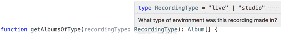
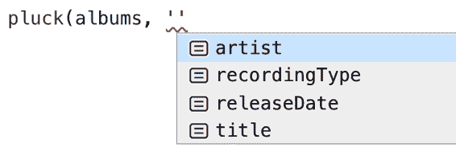

# 第四章：类型设计

> 给我看你的流程图，隐藏你的表格，我将继续感到困惑。给我看你的表格，我通常就不需要你的流程图了；它们会很明显。
> 
> 弗雷德·布鲁克斯，《人月神话》

弗雷德·布鲁克斯的引用语言已经过时，但情感仍然如此：如果你看不到代码操作的数据或数据类型，代码就很难理解。这就是类型系统的一个巨大优势之一：通过编写类型，你使得它们对代码读者可见。这使得你的代码易于理解。

其他章节涵盖了 TypeScript 类型的基础知识：如何使用它们、推断它们以及编写声明。本章讨论了类型本身的设计。本章的示例都是以 TypeScript 为基础编写的，但大部分思想都具有更广泛的适用性。

如果你能良好地设计你的类型，你的流程图也应该是显而易见的。

# 第 28 条：更喜欢总是代表有效状态的类型

如果你设计得好，你的代码写起来应该很直观。但如果你的类型设计不好，再聪明或是再多的文档也救不了你。你的代码将会令人困惑且容易出错。

有效类型设计的关键是制定只能表示有效状态的类型。本条目通过几个例子详细介绍了这些问题，并向你展示如何修复它们。

假设你正在构建一个网页应用程序，它允许你选择页面，加载该页面的内容，然后显示它。你可能会这样写状态：

```
interface State {
  pageText: string;
  isLoading: boolean;
  error?: string;
}
```

当你编写代码来渲染页面时，你需要考虑所有这些字段：

```
function renderPage(state: State) {
  if (state.error) {
    return `Error! Unable to load ${currentPage}: ${state.error}`;
  } else if (state.isLoading) {
    return `Loading ${currentPage}...`;
  }
  return `<h1>${currentPage}</h1>\n${state.pageText}`;
}
```

不过这样做对吗？如果`isLoading`和`error`都被设置了呢？那意味着什么？是显示加载消息还是错误消息更好呢？很难说！没有足够的信息可用。

或者，如果你正在编写一个`changePage`函数呢？以下是一种尝试：

```
async function changePage(state: State, newPage: string) {
  state.isLoading = true;
  try {
    const response = await fetch(getUrlForPage(newPage));
    if (!response.ok) {
      throw new Error(`Unable to load ${newPage}: ${response.statusText}`);
    }
    const text = await response.text();
    state.isLoading = false;
    state.pageText = text;
  } catch (e) {
    state.error = '' + e;
  }
}
```

这有许多问题！以下是一些例子：

+   在错误情况下，我们忘记将`state.isLoading`设置为`false`。

+   我们没有清除`state.error`，所以如果先前的请求失败了，你会继续看到那个错误消息而不是加载消息。

+   如果用户在页面加载时再次更改页面，谁知道会发生什么。他们可能会看到一个新页面然后是一个错误，或者第一个页面但不是第二个，这取决于响应返回的顺序。

问题在于状态包含了太少的信息（哪个请求失败了？哪个正在加载？）和太多的信息：`State`类型允许同时设置`isLoading`和`error`，即使这代表了一个无效的状态。这使得`render()`和`changePage()`都难以实现良好。

这里有一种更好的方式来表示应用程序的状态：

```
interface RequestPending {
  state: 'pending';
}
interface RequestError {
  state: 'error';
  error: string;
}
interface RequestSuccess {
  state: 'ok';
  pageText: string;
}
type RequestState = RequestPending | RequestError | RequestSuccess;

interface State {
  currentPage: string;
  requests: {[page: string]: RequestState};
}
```

这使用了一个标记联合（也称为“辨识联合”）来明确地模拟网络请求可能处于的不同状态。这个状态的版本要长三到四倍，但它有一个巨大的优势，即不允许无效状态。当前页面和你发出的每一个请求的状态都被显式地建模了。因此，`renderPage`和`changePage`函数很容易实现：

```
function renderPage(state: State) {
  const {currentPage} = state;
  const requestState = state.requests[currentPage];
  switch (requestState.state) {
    case 'pending':
      return `Loading ${currentPage}...`;
    case 'error':
      return `Error! Unable to load ${currentPage}: ${requestState.error}`;
    case 'ok':
      return `<h1>${currentPage}</h1>\n${requestState.pageText}`;
  }
}

async function changePage(state: State, newPage: string) {
  state.requests[newPage] = {state: 'pending'};
  state.currentPage = newPage;
  try {
    const response = await fetch(getUrlForPage(newPage));
    if (!response.ok) {
      throw new Error(`Unable to load ${newPage}: ${response.statusText}`);
    }
    const pageText = await response.text();
    state.requests[newPage] = {state: 'ok', pageText};
  } catch (e) {
    state.requests[newPage] = {state: 'error', error: '' + e};
  }
}
```

第一个实现中的歧义完全消失了：当前页面是明确的，每个请求都处于完全确定的状态中。如果用户在发出请求后更改页面，这也不是问题。旧的请求仍然完成，但不会影响 UI。

举个简单但更加严峻的例子，考虑一下 Air France 447 航班的命运，这是一架空客 A330 飞机，于 2009 年 6 月 1 日在大西洋上消失。这架空客是一种电传飞行飞机，意味着飞行员的控制输入先经过计算机系统，然后再影响飞机的物理控制面。在事故发生后，人们对依赖计算机做出生死决策的智慧提出了许多质疑。两年后，当黑匣子记录器被找到时，它们揭示了导致事故的许多因素。但其中一个关键因素是糟糕的状态设计。

空客 A330 的驾驶舱有一个独立的控制系统，用于飞行员和副驾驶员。“侧置杆”控制进场角。向后拉会使飞机上升，而向前推会使其俯冲。空客 A330 使用了称为“双输入”模式的系统，这让两个侧置杆可以独立移动。下面是在 TypeScript 中模拟其状态的方式：

```
interface CockpitControls {
  /** Angle of the left side stick in degrees, 0 = neutral, + = forward */
  leftSideStick: number;
  /** Angle of the right side stick in degrees, 0 = neutral, + = forward */
  rightSideStick: number;
}
```

假设你被提供了这个数据结构，并被要求编写一个`getStickSetting`函数来计算当前的杆位设置。你会如何做？

一种方法是假设坐在左侧的飞行员控制着：

```
function getStickSetting(controls: CockpitControls) {
  return controls.leftSideStick;
}
```

但如果副驾驶员已经掌控了呢？也许你应该使用远离零点的那个控制杆：

```
function getStickSetting(controls: CockpitControls) {
  const {leftSideStick, rightSideStick} = controls;
  if (leftSideStick === 0) {
    return rightSideStick;
  }
  return leftSideStick;
}
```

但是这种实现存在一个问题：我们只能确保在右侧设置为中性时才返回左侧的设置。所以你应该检查一下：

```
function getStickSetting(controls: CockpitControls) {
  const {leftSideStick, rightSideStick} = controls;
  if (leftSideStick === 0) {
    return rightSideStick;
  } else if (rightSideStick === 0) {
    return leftSideStick;
  }
  // ???
}
```

如果它们两个都非零，你该怎么办？希望它们大致相同，那么你可以简单地对它们求平均：

```
function getStickSetting(controls: CockpitControls) {
  const {leftSideStick, rightSideStick} = controls;
  if (leftSideStick === 0) {
    return rightSideStick;
  } else if (rightSideStick === 0) {
    return leftSideStick;
  }
  if (Math.abs(leftSideStick - rightSideStick) < 5) {
    return (leftSideStick + rightSideStick) / 2;
  }
  // ???
}
```

但如果它们不是呢？你能抛出错误吗？实际上不能：副翼必须设置某个角度！

在 Air France 447 航班上，副驾驶员在飞机进入风暴时默默地向后拉他的侧置杆。飞机升高了，但最终失去了速度并进入了失速状态，这种状态下飞机速度过慢，无法有效产生升力。它开始下降。

为了摆脱失速，飞行员们接受过训练，向前推动控制杆使飞机俯冲并重新获得速度。这正是飞行员所做的。但副驾驶员仍在默默地向后拉他的侧置杆。而空客的功能看起来是这样的：

```
function getStickSetting(controls: CockpitControls) {
  return (controls.leftSideStick + controls.rightSideStick) / 2;
}
```

即使飞行员全力向前推杆，效果平均为零。他不知道飞机为何不俯冲。等到副驾驶透露他所做的时候，飞机已经失去太多高度无法恢复，并坠入海中，机上 228 人全部遇难。

所有这些的要点是，在给定输入情况下没有好方法实现 `getStickSetting`！这个函数已经被设置为失败。在大多数飞机上，这两套控制装置是机械连接的。如果副驾驶拉后，飞行员的控制装置也会拉后。这些控制装置的状态很容易表达：

```
interface CockpitControls {
  /** Angle of the stick in degrees, 0 = neutral, + = forward */
  stickAngle: number;
}
```

现在，正如本章开头的 Fred Brooks 的引言中所言，我们的流程图显而易见。您根本不需要 `getStickSetting` 函数。

在设计类型时，请仔细考虑包含哪些值和排除哪些值。如果只允许表示有效状态的值，编写代码将更容易，TypeScript 也会更轻松地检查它。这是一个非常普遍的原则，本章中的几个其他条目将涵盖它的具体表现形式。

## 要记住的事情

+   表示有效和无效状态的类型可能会导致混乱和容易出错的代码。

+   更倾向于仅表示有效状态的类型。即使它们更长或更难表达，最终它们会为您节省时间和痛苦！

# 项目 29：在接受的事物上要宽容，在生产的事物上要严格。

这个想法被称为*健壮性原则*或*Postel's Law*，以 TCP 的编写者 Jon Postel 的名字命名：

> TCP 实现应遵循一个总体原则：在所做之事上要保守，从他人那里接受的东西要宽容。

函数的契约也适用类似的规则。函数在接受输入时可以很宽泛，但在产生输出时通常应更为具体。

例如，3D 映射 API 可能会提供一种定位摄像机和计算边界框视口的方法：

```
declare function setCamera(camera: CameraOptions): void;
declare function viewportForBounds(bounds: LngLatBounds): CameraOptions;
```

`viewportForBounds` 的结果可以直接传递给 `setCamera` 来定位摄像机非常方便。

让我们来看看这些类型的定义：

```
interface CameraOptions {
  center?: LngLat;
  zoom?: number;
  bearing?: number;
  pitch?: number;
}
type LngLat =
  { lng: number; lat: number; } |
  { lon: number; lat: number; } |
  [number, number];
```

`CameraOptions` 中的字段都是可选的，因为您可能只想设置中心或缩放而不改变方位或俯仰。`LngLat` 类型也使得 `setCamera` 在接受参数时宽容：您可以传递 `{lng, lat}` 对象，`{lon, lat}` 对象，或者 `[lng, lat]` 对象，只要您有信心顺序正确即可。这些调整使得函数易于调用。

`viewportForBounds` 函数接受另一种“宽容”类型：

```
type LngLatBounds =
  {northeast: LngLat, southwest: LngLat} |
  [LngLat, LngLat] |
  [number, number, number, number];
```

您可以使用命名的角落、一对经纬度，或者如果您确信顺序正确，还可以使用四元组指定边界。由于 `LngLat` 已经适应了三种形式，因此 `LngLatBounds` 至少有 19 种可能的形式。确实宽容！

现在让我们编写一个函数，调整视口以适应 GeoJSON Feature，并将新的视口存储在 URL 中（有关`calculateBoundingBox`的定义，请参见 Item 31）：

```
function focusOnFeature(f: Feature) {
  const bounds = calculateBoundingBox(f);
  const camera = viewportForBounds(bounds);
  setCamera(camera);
  const {center: {lat, lng}, zoom} = camera;
               // ~~~      Property 'lat' does not exist on type ...
               //      ~~~ Property 'lng' does not exist on type ...
  zoom;  // Type is number | undefined
  window.location.search = `?v=@${lat},${lng}z${zoom}`;
}
```

糟糕！只有`zoom`属性存在，但其类型被推断为`number|undefined`，这也是个问题。问题在于`viewportForBounds`的类型声明表明它不仅在接受的内容上很宽松，而且在*生成*的内容上也是如此。使用`camera`结果的唯一类型安全方式是为联合类型的每个组件引入代码分支（Item 22）。

具有大量可选属性和联合类型的返回类型使得`viewportForBounds`难以使用。它的宽泛参数类型很方便，但其宽泛的返回类型则不是。更便捷的 API 应该在其生成的内容上严格控制。

一种方法是为坐标定义一个规范格式。按照 JavaScript 的约定区分“Array”和“Array-like”（Item 16），你可以区分`LngLat`和`LngLatLike`。你还可以区分完全定义的`Camera`类型和`setCamera`接受的部分版本：

```
interface LngLat { lng: number; lat: number; };
type LngLatLike = LngLat | { lon: number; lat: number; } | [number, number];

interface Camera {
  center: LngLat;
  zoom: number;
  bearing: number;
  pitch: number;
}
interface CameraOptions extends Omit<Partial<Camera>, 'center'> {
  center?: LngLatLike;
}
type LngLatBounds =
  {northeast: LngLatLike, southwest: LngLatLike} |
  [LngLatLike, LngLatLike] |
  [number, number, number, number];

declare function setCamera(camera: CameraOptions): void;
declare function viewportForBounds(bounds: LngLatBounds): Camera;
```

松散的`CameraOptions`类型适应了严格的`Camera`类型（Item 14）。

在`setCamera`中使用`Partial<Camera>`作为参数类型在这里行不通，因为你确实希望允许`center`属性为`LngLatLike`对象。而且你不能写"`CameraOptions extends Partial<Camera>`"，因为`LngLatLike`是`LngLat`的超集，而不是子集（Item 7）。如果这看起来太复杂，你也可以明确地写出类型，尽管会有一些重复：

```
interface CameraOptions {
  center?: LngLatLike;
  zoom?: number;
  bearing?: number;
  pitch?: number;
}
```

无论哪种情况，使用这些新的类型声明，`focusOnFeature`函数都能通过类型检查器：

```
function focusOnFeature(f: Feature) {
  const bounds = calculateBoundingBox(f);
  const camera = viewportForBounds(bounds);
  setCamera(camera);
  const {center: {lat, lng}, zoom} = camera;  // OK
  zoom;  // Type is number
  window.location.search = `?v=@${lat},${lng}z${zoom}`;
}
```

这次`zoom`的类型是`number`，而不是`number|undefined`。`viewportForBounds`函数现在使用起来简单多了。如果还有其他生成边界框的函数，你还需要引入一个规范形式，并区分`LngLatBounds`和`LngLatBoundsLike`之间的区别。

允许 19 种可能形式的边界框是一个好的设计吗？也许不是。但如果你正在为执行此操作的库编写类型声明，你需要模拟其行为。只是不要有 19 种返回类型！

## 记住的事情

+   输入类型往往比输出类型更广泛。在参数类型中，可选属性和联合类型比返回类型更常见。

+   要在参数和返回类型之间重复使用类型，请引入一个规范形式（用于返回类型）和一个较松散的形式（用于参数）。

# Item 30：不要在文档中重复类型信息

这段代码有什么问题？

```
/**
 * Returns a string with the foreground color.
 * Takes zero or one arguments. With no arguments, returns the
 * standard foreground color. With one argument, returns the foreground color
 * for a particular page.
 */
function getForegroundColor(page?: string) {
  return page === 'login' ? {r: 127, g: 127, b: 127} : {r: 0, g: 0, b: 0};
}
```

代码和注释不一致！在没有更多上下文的情况下很难说哪个是正确的，但显然有些问题。正如我的一位教授曾经说过的：“当你的代码和你的注释不一致时，它们都是错误的！”

让我们假设代码表示了期望的行为。这个注释有几个问题：

+   它说这个函数返回一个`string`类型的颜色，但实际上返回的是一个`{r, g, b}`对象。

+   它解释说这个函数接受零个或一个参数，这从类型签名中已经很清楚了。

+   它显得很啰嗦：注释比函数声明*和*实现还要长！

TypeScript 的类型注解系统设计得紧凑、描述性和可读性强。其开发人员是具有数十年经验的语言专家。这几乎肯定是比你的散文更好地表达函数输入和输出类型的方法！

因为你的类型注解是由 TypeScript 编译器检查的，它们永远不会与实现不同步。也许`getForegroundColor`曾经返回一个字符串，但后来改成返回一个对象。做出更改的人可能忘记更新长注释。

如果不强制保持同步，什么都不会保持同步。通过类型注解，TypeScript 的类型检查器就是这种强制！如果你将类型信息放在注解中而不是文档中，你就大大增加了代码在演变过程中保持正确性的信心。

更好的注释可能是这样的：

```
/** Get the foreground color for the application or a specific page. */
function getForegroundColor(page?: string): Color {
  // ...
}
```

如果要描述特定的参数，请使用`@param` JSDoc 注释。有关更多信息，请参见 Item 48。

关于缺乏突变的评论也值得怀疑。不要只是说你不修改一个参数：

```
/** Does not modify nums */
function sort(nums: number[]) { /* ... */ }
```

相反，将其声明为`readonly`（Item 17），并让 TypeScript 强制执行契约：

```
function sort(nums: readonly number[]) { /* ... */ }
```

对于变量名也是如此。避免在变量名中放置类型信息：而不是将一个变量命名为`ageNum`，命名为`age`并确保它确实是一个`number`。

有一个例外是具有单位的数字。如果不清楚单位是什么，您可能希望在变量或属性名中包含它们。例如，`timeMs`比`time`更清晰，`temperatureC`比`temperature`更清晰。Item 37 描述了“品牌”，这提供了一种更类型安全的方法来建模单位。

## 要记住的事情

+   避免在注释和变量名中重复类型信息。在最好的情况下，它是类型声明的重复，而在最坏的情况下，它将导致冲突的信息。

+   如果变量名不清楚其单位（例如`timeMs`或`temperatureC`），考虑在变量名中包含单位。

# 条目 31：将空值推送到类型的边缘

当您第一次打开`strictNullChecks`时，似乎您必须在整个代码中添加大量检查`null`和`undefined`值的 if 语句。这通常是因为空值和非空值之间的关系是隐含的：当变量 A 为非 null 时，您知道变量 B 也是非 null，反之亦然。这些隐含的关系对您代码的人类读者和类型检查器来说都很令人困惑。

当数值完全为 null 或完全为非 null 时，处理起来更加容易，而不是混合。您可以通过将空值推到结构的边缘来建模这一点。

假设您想要计算一组数字的最小值和最大值。我们称之为“extent”。这是一个尝试：

```
function extent(nums: number[]) {
  let min, max;
  for (const num of nums) {
    if (!min) {
      min = num;
      max = num;
    } else {
      min = Math.min(min, num);
      max = Math.max(max, num);
    }
  }
  return [min, max];
}
```

代码类型检查通过（不使用`strictNullChecks`），并且推断的返回类型为`number[]`，这似乎没问题。但它存在一个 bug 和一个设计缺陷：

+   如果最小值或最大值为零，则可能会被覆盖。例如，`extent([0, 1, 2])`将返回`[1, 2]`而不是`[0, 2]`。

+   如果`nums`数组为空，则函数将返回`[undefined, undefined]`。这种带有几个`undefined`的对象对客户端来说很难处理，正是这种类型的问题所在。从源代码阅读中我们知道，`min`和`max`要么都是`undefined`，要么都不是，但这种信息并没有在类型系统中表示出来。

打开`strictNullChecks`选项会让这些问题更加明显：

```
function extent(nums: number[]) {
  let min, max;
  for (const num of nums) {
    if (!min) {
      min = num;
      max = num;
    } else {
      min = Math.min(min, num);
      max = Math.max(max, num);
                  // ~~~ Argument of type 'number | undefined' is not
                  //     assignable to parameter of type 'number'
    }
  }
  return [min, max];
}
```

现在`extent`的返回类型被推断为`(number | undefined)[]`，这使得设计缺陷更加明显。无论您在何处调用`extent`，这很可能表现为类型错误：

```
const [min, max] = extent([0, 1, 2]);
const span = max - min;
          // ~~~   ~~~ Object is possibly 'undefined'
```

`extent`实现中的错误是因为您排除了`min`的`undefined`值，但没有排除`max`的`undefined`值。这两者是一起初始化的，但这些信息并未在类型系统中呈现出来。您可以通过添加对`max`的检查来解决这个问题，但这将是对 bug 的双重下注。

更好的解决方案是将最小值和最大值放在同一个对象中，并使该对象完全为`null`或完全为非`null`：

```
function extent(nums: number[]) {
  let result: [number, number] | null = null;
  for (const num of nums) {
    if (!result) {
      result = [num, num];
    } else {
      result = [Math.min(num, result[0]), Math.max(num, result[1])];
    }
  }
  return result;
}
```

现在返回类型是`[number, number] | null`，这对客户端来说更容易处理。最小值和最大值可以使用非 null 断言来检索：

```
const [min, max] = extent([0, 1, 2])!;
const span = max - min;  // OK
```

或者单一检查：

```
const range = extent([0, 1, 2]);
if (range) {
  const [min, max] = range;
  const span = max - min;  // OK
}
```

通过使用单个对象来跟踪范围，我们改进了设计，帮助 TypeScript 理解了空值之间的关系，并修复了 bug：现在`if (!result)`检查已经没有问题了。

null 和非 null 值的混合也可能导致类中的问题。例如，假设您有一个同时表示用户及其在论坛上的帖子的类：

```
class UserPosts {
  user: UserInfo | null;
  posts: Post[] | null;

  constructor() {
    this.user = null;
    this.posts = null;
  }

  async init(userId: string) {
    return Promise.all([
      async () => this.user = await fetchUser(userId),
      async () => this.posts = await fetchPostsForUser(userId)
    ]);
  }

  getUserName() {
    // ...?
  }
}
```

当两个网络请求加载时，`user`和`posts`属性将为`null`。在任何时候，它们可能都是`null`，一个可能是`null`，或者它们都可能是非`null`。有四种可能性。这种复杂性会渗入类的每个方法中。这种设计几乎肯定会导致混乱，大量的`null`检查和错误。

更好的设计应该等到类使用的所有数据都可用时：

```
class UserPosts {
  user: UserInfo;
  posts: Post[];

  constructor(user: UserInfo, posts: Post[]) {
    this.user = user;
    this.posts = posts;
  }

  static async init(userId: string): Promise<UserPosts> {
    const [user, posts] = await Promise.all([
      fetchUser(userId),
      fetchPostsForUser(userId)
    ]);
    return new UserPosts(user, posts);
  }

  getUserName() {
    return this.user.name;
  }
}
```

现在`UserPosts`类已完全非`null`，编写正确方法变得轻而易举。当然，如果您需要在数据部分加载时执行操作，则需要处理多个`null`和非`null`状态。

（不要试图用 Promise 替换可为空的属性。这往往会导致更加混乱的代码，并迫使所有方法都变成异步。Promise 可以澄清加载数据的代码，但对于使用该数据的类则有相反的效果。）

## 记住的事情

+   避免设计中一个值的`null`或非`null`与另一个值的`null`或非`null`有隐式关联。

+   将`null`值推向 API 的边缘，通过使较大的对象要么为`null`要么完全为非`null`，可以使代码对人类读者和类型检查器更清晰。

+   考虑创建一个完全非`null`的类，并在所有值可用时进行构造。

+   虽然`strictNullChecks`可能会标记代码中的许多问题，但它对于显示函数在空值方面的行为是不可或缺的。

# 项目 32：优先使用接口的联合而不是联合的接口

如果您创建一个属性为联合类型的接口，则应该考虑该类型是否作为更精确接口的联合更合理。

假设您正在构建一个矢量绘图程序，并希望为具有特定几何类型的图层定义一个接口：

```
interface Layer {
  layout: FillLayout | LineLayout | PointLayout;
  paint: FillPaint | LinePaint | PointPaint;
}
```

`layout`字段控制形状的绘制方式和位置（圆角？直线？），而`paint`字段控制样式（线条是否蓝色？粗细？虚线？）。

是否有意义创建一个其`layout`为`LineLayout`但`paint`属性为`FillPaint`的图层？可能不太合适。允许这种可能性会增加库的使用错误率，并使接口难以使用。

更好的建模方式是为每种类型的图层创建单独的接口：

```
interface FillLayer {
  layout: FillLayout;
  paint: FillPaint;
}
interface LineLayer {
  layout: LineLayout;
  paint: LinePaint;
}
interface PointLayer {
  layout: PointLayout;
  paint: PointPaint;
}
type Layer = FillLayer | LineLayer | PointLayer;
```

通过这种方式定义`Layer`，您已排除了混合`layout`和`paint`属性的可能性。这是遵循项目 28 建议的一个例子，即优先使用仅表示有效状态的类型。

此模式的最常见示例是“标签联合”（或“区分联合”）。在这种情况下，属性之一是字符串文字类型的联合：

```
interface Layer {
  type: 'fill' | 'line' | 'point';
  layout: FillLayout | LineLayout | PointLayout;
  paint: FillPaint | LinePaint | PointPaint;
}
```

与之前一样，是否有意义拥有`type: 'fill'`，但接着是`LineLayout`和`PointPaint`？当然不。将`Layer`转换为接口联合以排除这种可能性：

```
interface FillLayer {
  type: 'fill';
  layout: FillLayout;
  paint: FillPaint;
}
interface LineLayer {
  type: 'line';
  layout: LineLayout;
  paint: LinePaint;
}
interface PointLayer {
  type: 'paint';
  layout: PointLayout;
  paint: PointPaint;
}
type Layer = FillLayer | LineLayer | PointLayer;
```

`type`属性是“标签”，可用于确定您在运行时正在处理哪种类型的`Layer`。TypeScript 还能够根据标签来缩小`Layer`的类型：

```
function drawLayer(layer: Layer) {
  if (layer.type === 'fill') {
    const {paint} = layer;  // Type is FillPaint
    const {layout} = layer;  // Type is FillLayout
  } else if (layer.type === 'line') {
    const {paint} = layer;  // Type is LinePaint
    const {layout} = layer;  // Type is LineLayout
  } else {
    const {paint} = layer;  // Type is PointPaint
    const {layout} = layer;  // Type is PointLayout
  }
}
```

通过正确地建模这种类型中属性之间的关系，您可以帮助 TypeScript 检查您代码的正确性。涉及初始`Layer`定义的相同代码使用类型断言会显得混乱。

因为它们与 TypeScript 的类型检查器配合得很好，标记联合在 TypeScript 代码中随处可见。当你能够使用标记联合来表示 TypeScript 中的数据类型时，通常是一个很好的想法。如果你将可选字段看作其类型与`undefined`的联合，则它们也符合这种模式。考虑这种类型：

```
interface Person {
  name: string;
  // These will either both be present or not be present
  placeOfBirth?: string;
  dateOfBirth?: Date;
}
```

具有类型信息的注释是可能存在问题的强烈迹象（Item 30）。`placeOfBirth`和`dateOfBirth`字段之间存在关系，但您并没有告诉 TypeScript。

一种更好的建模方法是将这两个属性移到一个单独的对象中。这类似于将`null`值移到边缘位置（Item 31）：

```
interface Person {
  name: string;
  birth?: {
    place: string;
    date: Date;
  }
}
```

现在 TypeScript 会抱怨具有地点但没有出生日期的值：

```
const alanT: Person = {
  name: 'Alan Turing',
  birth: {
// ~~~~ Property 'date' is missing in type
//      '{ place: string; }' but required in type
//      '{ place: string; date: Date; }'
    place: 'London'
  }
}
```

此外，仅需要对`Person`对象进行一次检查的函数：

```
function eulogize(p: Person) {
  console.log(p.name);
  const {birth} = p;
  if (birth) {
    console.log(`was born on ${birth.date} in ${birth.place}.`);
  }
}
```

如果类型的结构不在你的控制之外（例如，它来自 API），那么你仍然可以使用现熟悉的接口联合来建模这些字段之间的关系：

```
interface Name {
  name: string;
}

interface PersonWithBirth extends Name {
  placeOfBirth: string;
  dateOfBirth: Date;
}

type Person = Name | PersonWithBirth;
```

现在您可以获得与嵌套对象相同的一些好处：

```
function eulogize(p: Person) {
  if ('placeOfBirth' in p) {
    p // Type is PersonWithBirth
    const {dateOfBirth} = p  // OK, type is Date
  }
}
```

在这两种情况下，类型定义使属性之间的关系更加清晰。

## 要记住的事情

+   具有多个属性的联合类型接口通常是一个错误，因为它们模糊了这些属性之间的关系。

+   接口的联合更加精确，并且可以被 TypeScript 理解。

+   考虑为你的结构添加一个“标签”以便于 TypeScript 的控制流分析。因为标记联合在 TypeScript 代码中得到了很好的支持，它们随处可见。

# Item 33: 更倾向于比字符串类型更精确的替代方案

`string`类型的领域很大：`"x"`和`"y"`属于其中，但完整的*Moby Dick*文本也属于其中（它以`"Call me Ishmael…"`开头，约 120 万个字符长）。当您声明一个`string`类型的变量时，您应该询问是否更适合使用一个更窄的类型。

假设您正在构建一个音乐收藏，并希望为专辑定义一个类型。以下是一种尝试：

```
interface Album {
  artist: string;
  title: string;
  releaseDate: string;  // YYYY-MM-DD
  recordingType: string;  // E.g., "live" or "studio"
}
```

`string`类型的普遍性以及注释中的类型信息（见 Item 30）表明，这个`interface`可能并不完全正确。以下是可能出错的情况：

```
const kindOfBlue: Album = {
  artist: 'Miles Davis',
  title: 'Kind of Blue',
  releaseDate: 'August 17th, 1959',  // Oops!
  recordingType: 'Studio',  // Oops!
};  // OK
```

`releaseDate` 字段格式不正确（根据注释），并且 `"Studio"` 首字母大写，应为小写。但这些值确实都是字符串，因此这个对象可以分配给 `Album`，类型检查器不会抱怨。

这些广义的 `string` 类型也可能掩盖了对有效 `Album` 对象的错误。例如：

```
function recordRelease(title: string, date: string) { /* ... */ }
recordRelease(kindOfBlue.releaseDate, kindOfBlue.title);  // OK, should be error
```

调用 `recordRelease` 时参数顺序颠倒了，但两者都是字符串，因此类型检查器不会抱怨。由于 `string` 类型的普遍存在，这样的代码有时被称为“字符串类型化”。

您能否将类型变得更窄以防止此类问题？尽管完整的 *Moby Dick* 文本可能成为一个冗长的艺术家名称或专辑标题，但至少是可能的。因此，对于这些字段，使用 `string` 是合适的。对于 `releaseDate` 字段，最好只使用 `Date` 对象，避免格式化问题。最后，对于 `recordingType` 字段，可以定义一个仅包含两个值的联合类型（您也可以使用 `enum`，但我通常建议避免这样做；参见 Item 53）：

```
type RecordingType = 'studio' | 'live';

interface Album {
  artist: string;
  title: string;
  releaseDate: Date;
  recordingType: RecordingType;
}
```

通过这些更改，TypeScript 能够进行更彻底的错误检查：

```
const kindOfBlue: Album = {
  artist: 'Miles Davis',
  title: 'Kind of Blue',
  releaseDate: new Date('1959-08-17'),
  recordingType: 'Studio'
// ~~~~~~~~~~~~ Type '"Studio"' is not assignable to type 'RecordingType'
};
```

这种方法的优势不仅限于更严格的检查。首先，显式定义类型确保其含义在传递过程中不会丢失。例如，如果您只想查找某一录音类型的专辑，可能会定义如下函数：

```
function getAlbumsOfType(recordingType: string): Album[] {
  // ...
}
```

调用此函数的人如何知道 `recordingType` 应该是什么？它只是一个 `string`。解释其值为 `"studio"` 或 `"live"` 的评论隐藏在 `Album` 的定义中，用户可能不会注意到这一点。

其次，显式定义类型允许您为其附加文档（参见 Item 48）：

```
/** What type of environment was this recording made in?  */
type RecordingType = 'live' | 'studio';
```

将 `getAlbumsOfType` 修改为接受 `RecordingType` 后，调用者可以点击并查看文档（见 Figure 4-1）。



###### 图 4-1\. 使用命名类型而不是字符串使得可以将文档附加到编辑器中显示的类型。

另一个常见的 `string` 误用是在函数参数中。假设您想编写一个函数，从数组中提取单个字段的所有值。Underscore 库将此称为“pluck”：

```
function pluck(records, key) {
  return record.map(record => record[key]);
}
```

您如何为此添加类型？以下是一个初始尝试：

```
function pluck(record: any[], key: string): any[] {
  return record.map(r => r[key]);
}
```

这种类型检查是可以的，但并不完美。`any` 类型存在问题，特别是对于返回值（参见 Item 38）。改进类型签名的第一步是引入泛型类型参数：

```
function pluck<T>(record: T[], key: string): any[] {
  return record.map(r => r[key]);
                      // ~~~~~~ Element implicitly has an 'any' type
                      //        because type '{}' has no index signature
}
```

TypeScript 现在抱怨 `key` 的 `string` 类型过于广泛。它是正确的：如果传入一个 `Album` 数组，那么 `key` 只有四个有效值（“artist,” “title,” “releaseDate,” 和 “recordingType”），而不是广泛的字符串集合。这正是 `keyof Album` 类型的用途：

```
type K = keyof Album;
// Type is "artist" | "title" | "releaseDate" | "recordingType"
```

因此修复方法是将 `string` 替换为 `keyof T`：

```
function pluck<T>(record: T[], key: keyof T) {
  return record.map(r => r[key]);
}
```

这将通过类型检查器。我们还让 TypeScript 推断返回类型。它的表现如何？如果在编辑器中将鼠标悬停在`pluck`上，推断的类型是：

```
function pluck<T>(record: T[], key: keyof T): T[keyof T][]
```

`T[keyof T]`是`T`中任何可能值的类型。如果您将单个字符串作为`key`传入，这太广泛了。例如：

```
const releaseDates = pluck(albums, 'releaseDate'); // Type is (string | Date)[]
```

类型应为`Date[]`，而不是`(string | Date)[]`。虽然`keyof T`比`string`窄得多，但*仍然*太广泛了。要进一步缩小范围，我们需要引入第二个泛型参数，它是`keyof T`的子集（可能是单个值）：

```
function pluck<T, K extends keyof T>(record: T[], key: K): T[K][] {
  return record.map(r => r[key]);
}
```

（有关此上下文中`extends`的更多信息，请参见 Item 14。）

类型签名现在完全正确。我们可以通过几种不同的方式调用`pluck`来进行检查：

```
pluck(albums, 'releaseDate'); // Type is Date[]
pluck(albums, 'artist');  // Type is string[]
pluck(albums, 'recordingType');  // Type is RecordingType[]
pluck(albums, 'recordingDate');
           // ~~~~~~~~~~~~~~~ Argument of type '"recordingDate"' is not
           //                 assignable to parameter of type ...
```

语言服务甚至能够为`Album`的键提供自动完成（如 Figure 4-2 所示）。



###### 图 4-2。在您的编辑器中使用`Album`的参数类型为`keyof`而不是字符串可以获得更好的自动完成。

`string`与`any`存在一些相同的问题：当不适当使用时，它允许无效值并隐藏类型之间的关系。这会妨碍类型检查器，并且可能隐藏真正的错误。TypeScript 定义`string`子集的能力是将类型安全引入 JavaScript 代码的强大方式。使用更精确的类型将捕获错误并提高代码的可读性。

## 记住这些事项

+   避免“字符串类型”代码。在不是每个`string`都可能的情况下，请优先选择更合适的类型。

+   如果更准确地描述变量的域，更倾向于使用字符串字面类型的联合而不是`string`。这将提供更严格的类型检查并改善开发体验。

+   对于预期为对象属性的函数参数，最好使用`keyof T`而不是`string`。

# 项目 34：更喜欢不完整类型而不是不准确类型

在编写类型声明时，您将不可避免地遇到可以以更精确或不太精确的方式建模行为的情况。类型的精确性通常是件好事，因为它将帮助用户捕获错误并利用 TypeScript 提供的工具。但是在增加类型声明的精确性时要小心：容易犯错，不正确的类型可能比没有类型更糟糕。

假设您正在为 GeoJSON 编写类型声明，这是我们在 Item 31 中已经见过的格式。GeoJSON 几何可以是几种类型之一，每种类型都有不同形状的坐标数组：

```
interface Point {
  type: 'Point';
  coordinates: number[];
}
interface LineString {
  type: 'LineString';
  coordinates: number[][];
}
interface Polygon {
  type: 'Polygon';
  coordinates: number[][][];
}
type Geometry = Point | LineString | Polygon;  // Also several others
```

这样做没问题，但是对于坐标来说，`number[]`有点不够精确。实际上这些是纬度和经度，因此也许元组类型会更好：

```
type GeoPosition = [number, number];
interface Point {
  type: 'Point';
  coordinates: GeoPosition;
}
// Etc.
```

你发布了更精确的类型到世界上，并等待赞美之声的涌现。不幸的是，有用户抱怨说你的新类型搞乱了一切。即使你以前只用过纬度和经度，GeoJSON 中的位置可以有第三个元素，即高度，甚至可能更多。为了使类型声明更精确，你走得太远了，使类型变得不准确！为了继续使用你的类型声明，用户将不得不引入类型断言或完全使用`as any`静默类型检查。

举个例子，考虑尝试为 JSON 中定义的类似 Lisp 的语言编写类型声明：

```
12
"red"
["+", 1, 2]  // 3
["/", 20, 2]  // 10
["case", [">", 20, 10], "red", "blue"]  // "red"
["rgb", 255, 0, 127]  // "#FF007F"
```

Mapbox 库使用类似的系统来确定在许多设备上地图要素的外观。你可以尝试使用各种精度来定义这个：

1.  允许任何内容。

1.  允许字符串、数字和数组。

1.  允许字符串、数字和以已知函数名称开头的数组。

1.  确保每个函数都得到正确数量的参数。

1.  确保每个函数都得到正确类型的参数。

前两个选项很简单：

```
type Expression1 = any;
type Expression2 = number | string | any[];
```

此外，你应该引入一组表达式的测试集，包括有效和无效表达式。随着类型的精确度提高，这将有助于防止退化（见 Item 52）：

```
const tests: Expression2[] = [
  10,
  "red",
  true,
// ~~~ Type 'true' is not assignable to type 'Expression2'
  ["+", 10, 5],
  ["case", [">", 20, 10], "red", "blue", "green"],  // Too many values
  ["**", 2, 31],  // Should be an error: no "**" function
  ["rgb", 255, 128, 64],
  ["rgb", 255, 0, 127, 0]  // Too many values
];
```

要提高精度，你可以将字符串字面类型的联合作为元组的第一个元素：

```
type FnName = '+' | '-' | '*' | '/' | '>' | '<' | 'case' | 'rgb';
type CallExpression = [FnName, ...any[]];
type Expression3 = number | string | CallExpression;

const tests: Expression3[] = [
  10,
  "red",
  true,
// ~~~ Type 'true' is not assignable to type 'Expression3'
  ["+", 10, 5],
  ["case", [">", 20, 10], "red", "blue", "green"],
  ["**", 2, 31],
// ~~~~~~~~~~~ Type '"**"' is not assignable to type 'FnName'
  ["rgb", 255, 128, 64]
];
```

出现了一个新的捕获错误，没有退化。相当不错！

如果你想确保每个函数都得到正确数量的参数怎么办？这会变得更复杂，因为现在类型需要递归到所有函数调用中。截至 TypeScript 3.6，为了使其工作，你需要引入至少一个`interface`。由于`interface`不能是联合类型，你将不得不使用`interface`编写调用表达式。这有点尴尬，因为固定长度数组最容易表示为元组类型。但你*可以*做到：

```
type Expression4 = number | string | CallExpression;

type CallExpression = MathCall | CaseCall | RGBCall;

interface MathCall {
  0: '+' | '-' | '/' | '*' | '>' | '<';
  1: Expression4;
  2: Expression4;
  length: 3;
}

interface CaseCall {
  0: 'case';
  1: Expression4;
  2: Expression4;
  3: Expression4;
  length: 4 | 6 | 8 | 10 | 12 | 14 | 16 // etc.
}

interface RGBCall {
  0: 'rgb';
  1: Expression4;
  2: Expression4;
  3: Expression4;
  length: 4;
}

const tests: Expression4[] = [
  10,
  "red",
  true,
// ~~~ Type 'true' is not assignable to type 'Expression4'
  ["+", 10, 5],
  ["case", [">", 20, 10], "red", "blue", "green"],
// ~~~~~~~~~~~~~~~~~~~~~~~~~~~~~~~~~~~~~~~~~~~~~~
//  Type '["case", [">", ...], ...]' is not assignable to type 'string'
  ["**", 2, 31],
// ~~~~~~~~~~~~ Type '["**", number, number]' is not assignable to type 'string
  ["rgb", 255, 128, 64],
  ["rgb", 255, 128, 64, 73]
// ~~~~~~~~~~~~~~~~~~~~~~~~ Type '["rgb", number, number, number, number]'
//                          is not assignable to type 'string'
];
```

现在所有无效表达式都会产生错误。有趣的是，你可以使用 TypeScript 的`interface`表达“偶数长度的数组”。但这些错误消息并不是很好，而且关于`**`的错误自上次键入以来已经恶化了很多。

这是否比之前不太精确的类型有所改进？对于一些不正确的用法能够得到错误提示确实是一种胜利，但这些错误会使得这种类型更难处理。语言服务与 TypeScript 的开发体验一样重要（见 Item 6），因此建议查看由类型声明导致的错误消息，并尝试在应该起作用的情况下使用自动补全。如果你的新类型声明更精确但破坏了自动补全，那么它们将使 TypeScript 的开发体验变得不那么愉快。

此类型声明的复杂性还增加了错误蔓延的可能性。例如，`Expression4` 要求所有数学运算符都需要两个参数，但 Mapbox 表达规范说 `+` 和 `*` 可以接受更多参数。此外，`-` 可以接受单个参数，在这种情况下它会对其输入取反。`Expression4` 错误地标记了所有这些情况：

```
 const okExpressions: Expression4[] = [
   ['-', 12],
// ~~~~~~~~~ Type '["-", number]' is not assignable to type 'string'
   ['+', 1, 2, 3],
// ~~~~~~~~~~~~~~ Type '["+", number, ...]' is not assignable to type 'string'
   ['*', 2, 3, 4],
// ~~~~~~~~~~~~~~ Type '["*", number, ...]' is not assignable to type 'string'
 ];
```

再次强调，在试图变得更精确时，我们超前并变得不准确了。这些不准确之处可以纠正，但您需要扩展测试集以确保没有漏掉其他问题。复杂的代码通常需要更多的测试，类型也是如此。

在您优化类型时，思考“不可信峡谷”的隐喻可能会有所帮助。优化非常不精确的类型（如 `any`）通常是有帮助的。但是随着您的类型变得更精确，对其准确性的期望也会增加。您将开始依赖这些类型，因此不准确性将导致更大的问题。

## 要记住的事情

+   避免类型安全的不可信峡谷：错误的类型通常比没有类型更糟糕。

+   如果无法准确建模类型，请不要使用不准确的模型！使用 `any` 或 `unknown` 来承认这些空白。

+   注意错误消息和自动完成，随着类型越来越精确。这不仅关乎正确性：开发者体验也很重要。

# 第 35 条：从 API 和规范生成类型，而不是从数据生成

本章的其他内容讨论了设计良好类型的许多好处，并展示了如果不这样做可能会出现的问题。一个设计良好的类型使得 TypeScript 使用起来非常愉快，而一个设计不佳的类型可能会让人感到痛苦。但是这确实对类型设计施加了相当大的压力。如果您不必自己这样做，那不是挺好的吗？

您的一些类型可能来自于程序外部：文件格式、API 或规范。在这些情况下，您可以通过生成类型而不是编写类型来避免。如果这样做，关键在于从规范生成类型，而不是从示例数据生成。当您从规范生成类型时，TypeScript 将帮助确保您没有遗漏任何情况。当您从数据生成类型时，您只考虑到您看到的示例。您可能会忽略可能导致程序出错的重要边缘情况。

在 Item 31 中，我们编写了一个函数来计算 GeoJSON Feature 的边界框。以下是它的样子：

```
function calculateBoundingBox(f: GeoJSONFeature): BoundingBox | null {
  let box: BoundingBox | null = null;

  const helper = (coords: any[]) => {
    // ...
  };

  const {geometry} = f;
  if (geometry) {
    helper(geometry.coordinates);
  }

  return box;
}
```

`GeoJSONFeature` 类型从未明确定义过。您可以使用 Item 31 中的一些示例来编写它。但更好的方法是使用正式的 GeoJSON 规范。^(1) 幸运的是，DefinitelyTyped 上已经有了 TypeScript 类型声明。您可以按照通常的方式添加这些：

```
$ npm install --save-dev @types/geojson
+ @types/geojson@7946.0.7
```

当您插入 GeoJSON 声明时，TypeScript 立即标记出错：

```
import {Feature} from 'geojson';

function calculateBoundingBox(f: Feature): BoundingBox | null {
  let box: BoundingBox | null = null;

  const helper = (coords: any[]) => {
    // ...
  };

  const {geometry} = f;
  if (geometry) {
    helper(geometry.coordinates);
                 // ~~~~~~~~~~~
                 // Property 'coordinates' does not exist on type 'Geometry'
                 //   Property 'coordinates' does not exist on type
                 //   'GeometryCollection'
  }

  return box;
}
```

问题在于你的代码假定几何图形将具有 `coordinates` 属性。这对于许多几何图形（包括点、线和多边形）是正确的。但 GeoJSON 几何图形也可以是 `GeometryCollection`，这是其他几何图形的异构集合，不具有 `coordinates` 属性。

如果你对一个具有 `GeometryCollection` 几何图形的要素调用 `calculateBoundingBox`，它将抛出一个关于无法读取 `undefined` 的 `0` 属性的错误。这是一个真实的错误！我们通过规范中的类型定义捕获了它。

修复它的一个选择是显式禁止 `GeometryCollection`，如下所示：

```
const {geometry} = f;
if (geometry) {
  if (geometry.type === 'GeometryCollection') {
    throw new Error('GeometryCollections are not supported.');
  }
  helper(geometry.coordinates);  // OK
}
```

TypeScript 能够根据检查来细化 `geometry` 的类型，因此允许对 `geometry.coordinates` 的引用。即使没有其他内容，这也会为用户提供更清晰的错误消息。

但更好的解决方案是支持所有类型的几何图形！你可以通过提取另一个辅助函数来实现这一点：

```
const geometryHelper = (g: Geometry) => {
  if (geometry.type === 'GeometryCollection') {
    geometry.geometries.forEach(geometryHelper);
  } else {
    helper(geometry.coordinates);  // OK
  }
}

const {geometry} = f;
if (geometry) {
  geometryHelper(geometry);
}
```

如果你自己为 GeoJSON 编写类型声明，那么你会基于自己对格式的理解和经验进行。这可能不包括 `GeometryCollection`，并会导致对代码正确性的虚假安全感。使用基于规范的类型可以确保你的代码适用于所有值，而不仅仅是你见过的值，这让你更加自信。

对 API 调用也适用类似的考虑：如果你能从 API 规范生成类型，通常建议这样做。这在与自身具有类型的 API（如 GraphQL）特别有效。

GraphQL API 是一个带有模式的 API，使用一种类似 TypeScript 的类型系统指定所有可能的查询和接口。你编写查询请求这些接口中特定的字段。例如，要使用 GitHub GraphQL API 获取有关存储库的信息，你可能会写成：

```
query {
  repository(owner: "Microsoft", name: "TypeScript") {
    createdAt
    description
  }
}
```

结果如下：

```
{
  "data": {
    "repository": {
      "createdAt": "2014-06-17T15:28:39Z",
      "description":
        "TypeScript is a superset of JavaScript that compiles to JavaScript."
    }
  }
}
```

这种方法的美妙之处在于，你可以为*你的特定查询*生成 TypeScript 类型。就像 GeoJSON 示例一样，这有助于确保你准确地建模类型之间的关系及其可空性。

下面是一个获取 GitHub 存储库开源许可证的查询：

```
query getLicense($owner:String!, $name:String!){
  repository(owner:$owner, name:$name) {
    description
    licenseInfo {
      spdxId
      name
    }
  }
}
```

`$owner` 和 `$name` 是 GraphQL 变量，它们本身也有类型。类型语法与 TypeScript 类似，这可能会使人们在两者之间感到困惑。`String` 是 GraphQL 类型，在 TypeScript 中会是 `string`（参见 Item 10）。而 TypeScript 类型不可为空，而 GraphQL 类型可以为空。类型后面的 `!` 表示它保证不为空。

有许多工具可以帮助你从 GraphQL 查询生成 TypeScript 类型。其中之一是 Apollo。以下是如何使用它：

```
$ apollo client:codegen \
    --endpoint https://api.github.com/graphql \
    --includes license.graphql \
    --target typescript
Loading Apollo Project
Generating query files with 'typescript' target - wrote 2 files
```

你需要一个 GraphQL 模式来为查询生成类型。Apollo 从 `api.github.com/graphql` 端点获取这些信息。输出看起来像这样：

```
export interface getLicense_repository_licenseInfo {
  __typename: "License";
  /** Short identifier specified by <https://spdx.org/licenses> */
  spdxId: string | null;
  /** The license full name specified by <https://spdx.org/licenses> */
  name: string;
}

export interface getLicense_repository {
  __typename: "Repository";
  /** The description of the repository. */
  description: string | null;
  /** The license associated with the repository */
  licenseInfo: getLicense_repository_licenseInfo | null;
}

export interface getLicense {
  /** Lookup a given repository by the owner and repository name. */
  repository: getLicense_repository | null;
}

export interface getLicenseVariables {
  owner: string;
  name: string;
}
```

这里需要注意的重要点是：

+   接口为查询参数（`getLicenseVariables`）和响应（`getLicense`）生成。

+   可空性信息从架构传递到响应接口。 `repository`、`description`、`licenseInfo` 和 `spdxId` 字段可为空，而许可证 `name` 和查询变量则不可为空。

+   文档以 JSDoc 形式传输，这样它就会出现在你的编辑器中（第 48 项）。这些注释来自 GraphQL 架构本身。

这些类型信息有助于确保正确使用 API。如果查询变更，类型也会变更。如果架构变更，类型也会跟着变。由于它们都来自单一的真实来源：GraphQL 架构，不存在类型与现实不符的风险。

如果没有规范或官方架构可用怎么办？那么你将不得不从数据生成类型。像 `quicktype` 这样的工具可以帮助你。但要注意，你的类型可能与现实不匹配：可能会有你忽略的边缘情况。

即使你可能不知道，你已经从代码生成中受益。 TypeScript 对浏览器 DOM API 的类型声明是从官方接口生成的（见第 55 项）。这确保它们正确地模拟了一个复杂的系统，并帮助 TypeScript 在你自己的代码中捕获错误和误解。

## 需记住的事情

+   考虑为 API 调用和数据格式生成类型，以确保类型安全性覆盖到代码的边缘。

+   更倾向于根据规范而不是数据生成代码。罕见情况很重要！

# 第 36 条：使用问题域的语言命名类型。

> 计算机科学中只有两个难题：缓存失效和命名事物。
> 
> Phil Karlton

本书对类型的*形状*和其域中值的集合有很多讨论，但对于你如何为类型*命名*却说得很少。但这也是类型设计的重要部分。选择恰当的类型、属性和变量名称能够澄清意图并提高代码和类型的抽象级别。选择不当的类型可能会使你的代码变得晦涩难懂，导致错误的心理模型。

假设你正在构建一个动物数据库。你创建一个接口来表示一个：

```
interface Animal {
  name: string;
  endangered: boolean;
  habitat: string;
}

const leopard: Animal = {
  name: 'Snow Leopard',
  endangered: false,
  habitat: 'tundra',
};
```

这里存在几个问题：

+   `name` 是一个非常一般的术语。你期望什么样的名称？科学名称？通用名称？

+   布尔值字段 `endangered` 也存在歧义。如果一个动物已经灭绝了怎么办？这里的意图是“濒危或更糟？”还是字面上的濒危？

+   `habitat` 字段非常模糊，不仅因为过于广泛的 `string` 类型（第 33 项），而且还不清楚“栖息地”指的是什么。

+   变量名为 `leopard`，但 `name` 属性的值是 “Snow Leopard”。这种区分是否有意义？

这里有一个更少歧义的类型声明和值：

```
interface Animal {
  commonName: string;
  genus: string;
  species: string;
  status: ConservationStatus;
  climates: KoppenClimate[];
}
type ConservationStatus = 'EX' | 'EW' | 'CR' | 'EN' | 'VU' | 'NT' | 'LC';
type KoppenClimate = |
  'Af' | 'Am' | 'As' | 'Aw' |
  'BSh' | 'BSk' | 'BWh' | 'BWk' |
  'Cfa' | 'Cfb' | 'Cfc' | 'Csa' | 'Csb' | 'Csc' | 'Cwa' | 'Cwb' | 'Cwc' |
  'Dfa' | 'Dfb' | 'Dfc' | 'Dfd' |
  'Dsa' | 'Dsb' | 'Dsc' | 'Dwa' | 'Dwb' | 'Dwc' | 'Dwd' |
  'EF' | 'ET';
const snowLeopard: Animal = {
  commonName: 'Snow Leopard',
  genus: 'Panthera',
  species: 'Uncia',
  status: 'VU',  // vulnerable
  climates: ['ET', 'EF', 'Dfd'],  // alpine or subalpine
};
```

这带来了一些改进：

+   `名称（name）`已被更具体的术语替代：`通用名称（commonName）`、`属（genus）`和`种（species）`。

+   `濒危（endangered）`已成为`保护状态（conservationStatus）`，并使用了 IUCN 的标准分类系统。

+   `栖息地（habitat）`已变为`气候（climates）`，并使用了另一个标准分类系统，即 Köppen 气候分类。

如果你需要更多关于第一版此类字段的信息，你将不得不去找编写它们的人并询问。很可能他们已经离开公司或忘记了。更糟糕的是，你可能会用`git blame`来找出写这些糟糕类型的人，结果发现那个人是你自己！

情况在第二版中得到了显著改善。如果你想了解更多关于 Köppen 气候分类系统的信息，或追溯保护状态的精确含义，那么网络上有无数资源可以帮助你。

每个领域都有专门的词汇来描述其主题。与其创造自己的术语，不如尝试重用与问题领域相关的术语。这些词汇往往经过多年、几十年甚至几个世纪的磨练，被领域内的人们充分理解。使用这些术语将有助于与用户沟通，并提高类型的清晰度。

确保准确使用领域词汇：将领域语言用来表达不同含义比创造自己的术语更加令人困惑。

在命名类型、属性和变量时，请记住以下几条规则：

+   使区别具有意义。在写作和演讲中，反复使用同一个词可能很乏味。我们引入同义词来打破单调。这使得散文更易读，但对代码的影响则相反。如果你使用了两个不同的术语，请确保你在进行有意义的区分。如果不是，你应该使用相同的术语。

+   避免使用模糊、无意义的名称，如“数据（data）”、“信息（info）”、“东西（thing）”、“项目（item）”、“对象（object）”或广受欢迎的“实体（entity）”。如果在你的领域中“实体（entity）”有特定的含义，那没问题。但如果你使用它是因为不想想出一个更有意义的名称，那么最终你会遇到麻烦。

+   命名物品要根据它们的实际内容或计算方式，而不是它们包含的内容或计算方式。`目录（Directory）`比`INodeList`更有意义。它使你可以把目录作为一个概念来思考，而不是只考虑它的实现方式。良好的命名可以增加抽象级别，并减少无意中的命名冲突风险。

## 需要记住的事项

+   在可能的情况下，重复使用问题领域中的名称，以提高代码的可读性和抽象级别。

+   避免对同一事物使用不同的名称：使名称的区别具有意义。

# 第 37 条目：考虑“品牌”用于名义类型

第 4 条目讨论了结构（“鸭子”）类型和它有时可能导致令人惊讶的结果：

```
interface Vector2D {
  x: number;
  y: number;
}
function calculateNorm(p: Vector2D) {
  return Math.sqrt(p.x * p.x + p.y * p.y);
}

calculateNorm({x: 3, y: 4});  // OK, result is 5
const vec3D = {x: 3, y: 4, z: 1};
calculateNorm(vec3D);  // OK! result is also 5
```

如果你希望`calculateNorm`拒绝 3D 向量怎么办？这与 TypeScript 的结构化类型模型相悖，但在数学上是更加正确的。

实现这一点的一种方法是使用*名称类型*。使用名称类型，一个值是`Vector2D`，是因为你这么说，而不是因为它具有正确的形状。要在 TypeScript 中近似此功能，你可以引入一个“品牌”（想想牛，而不是可口可乐）：

```
interface Vector2D {
  _brand: '2d';
  x: number;
  y: number;
}
function vec2D(x: number, y: number): Vector2D {
  return {x, y, _brand: '2d'};
}
function calculateNorm(p: Vector2D) {
  return Math.sqrt(p.x * p.x + p.y * p.y);  // Same as before
}

calculateNorm(vec2D(3, 4)); // OK, returns 5
const vec3D = {x: 3, y: 4, z: 1};
calculateNorm(vec3D);
           // ~~~~~ Property '_brand' is missing in type...
```

品牌确保向量来自正确的位置。虽然你可以在`vec3D`值中添加`_brand: '2d'`，但这是从意外变成恶意的一步。这种品牌通常足以捕捉函数的无意误用。

有趣的是，你可以在仅在类型系统中操作的情况下获得与显式品牌相同的许多好处。这消除了运行时开销，还允许你对内置类型如`string`或`number`进行品牌化，无法附加附加属性的地方。

例如，如果你有一个在文件系统上操作并需要绝对路径（而不是相对路径）的函数，这在运行时很容易检查（路径是否以“/”开头？）但在类型系统中不那么容易。

这里是一种使用品牌的方法：

```
type AbsolutePath = string & {_brand: 'abs'};
function listAbsolutePath(path: AbsolutePath) {
  // ...
}
function isAbsolutePath(path: string): path is AbsolutePath {
  return path.startsWith('/');
}
```

你无法构造一个既是`string`又具有`_brand`属性的对象。这纯粹是在类型系统中玩游戏。

如果你有一个可能是绝对路径或相对路径的`string`路径，你可以使用类型守卫进行检查，这将细化其类型：

```
function f(path: string) {
  if (isAbsolutePath(path)) {
    listAbsolutePath(path);
  }
  listAbsolutePath(path);
                // ~~~~ Argument of type 'string' is not assignable
                //      to parameter of type 'AbsolutePath'
}
```

这种方法可能有助于记录哪些函数期望绝对路径或相对路径以及每个变量持有的路径类型。但这并非铁证保证：`path as AbsolutePath`将对任何`string`成功。但如果避免这些断言，那么获取`AbsolutePath`的唯一方法就是被给予一个或检查，这正是你想要的。

这种方法可用于建模许多无法在类型系统中表示的属性。例如，使用二分搜索在列表中查找元素：

```
function binarySearch<T>(xs: T[], x: T): boolean {
  let low = 0, high = xs.length - 1;
  while (high >= low) {
    const mid = low + Math.floor((high - low) / 2);
    const v = xs[mid];
    if (v === x) return true;
    [low, high] = x > v ? [mid + 1, high] : [low, mid - 1];
  }
  return false;
}
```

如果列表已排序，则此方法有效，但如果列表未排序，则会导致错误的负面结果。在 TypeScript 的类型系统中无法表示排序列表。但你可以创建一个品牌：

```
type SortedList<T> = T[] & {_brand: 'sorted'};

function isSorted<T>(xs: T[]): xs is SortedList<T> {
  for (let i = 1; i < xs.length; i++) {
    if (xs[i] > xs[i - 1]) {
      return false;
    }
  }
  return true;
}

function binarySearch<T>(xs: SortedList<T>, x: T): boolean {
  // ...
}
```

为了调用这个版本的`binarySearch`，你要么需要得到一个`SortedList`（即具有列表已排序的证明），要么用`isSorted`自行证明它已排序。线性扫描不是很好，但至少你会安全！

这是对类型检查器的一种有益的视角。例如，为了在对象上调用方法，你要么需要获得一个非`null`对象，要么用条件证明它不是`null`。

你也可以对`number`类型进行品牌化——例如，附加单位：

```
type Meters = number & {_brand: 'meters'};
type Seconds = number & {_brand: 'seconds'};

const meters = (m: number) => m as Meters;
const seconds = (s: number) => s as Seconds;

const oneKm = meters(1000);  // Type is Meters
const oneMin = seconds(60);  // Type is Seconds
```

这在实践中可能会有些尴尬，因为算术操作会使数字忘记它们的品牌：

```
const tenKm = oneKm * 10;  // Type is number
const v = oneKm / oneMin;  // Type is number
```

如果你的代码涉及大量带有混合单位的数字，这种方式仍然可能是记录数字参数预期类型的一种吸引人的方法。

## 要记住的事情

+   TypeScript 使用结构化（“鸭子”）类型，有时会导致令人意外的结果。如果你需要名义上的类型，请考虑为你的值附加“品牌”以区分它们。

+   在某些情况下，你可以完全在类型系统中附加品牌，而不是在运行时附加。你可以使用这种技术来建模 TypeScript 类型系统之外的属性。

^(1) GeoJSON 也被称为 RFC 7946。这个非常易读的规范可以在 [*http://geojson.org*](http://geojson.org) 找到。
