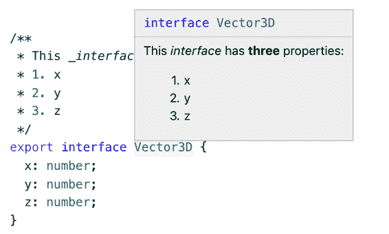

# 第六章：类型声明和 @types

任何语言中的依赖管理都可能令人困惑，TypeScript 也不例外。本章将帮助您建立一个关于 TypeScript 中依赖工作方式的思维模型，并向您展示如何解决可能出现的一些问题。它还将帮助您编写自己的类型声明文件以发布和与他人共享。通过编写优秀的类型声明，您不仅可以帮助自己的项目，还可以帮助整个 TypeScript 社区。

# 项目 45: 将 TypeScript 和 @types 放在 devDependencies 中

Node 包管理器 npm 在 JavaScript 世界中无处不在。它既提供了 JavaScript 库的仓库（npm 注册表），又提供了指定你依赖的它们的版本的方法（*package.json*）。

npm 在 *package.json* 中区分几种依赖类型：

`dependencies`

这些包是运行 JavaScript 所必需的。如果您在运行时导入 `lodash`，则应该放在 `dependencies` 中。当您在 npm 上发布您的代码并且另一个用户安装它时，它也会安装这些依赖项。（这些被称为传递依赖项。）

`devDependencies`

这些包用于开发和测试您的代码，但在运行时不需要。您的测试框架将是 `devDependency` 的一个示例。与 `dependencies` 不同，这些包不会与您的包一起传递安装。

`peerDependencies`

这些是运行时需要但不想负责跟踪的包。经典示例是插件。您的 jQuery 插件与多个版本的 jQuery 兼容，但您更希望用户选择一个版本，而不是由您选择。

其中，`dependencies` 和 `devDependencies` 是最常见的。在使用 TypeScript 时，请注意你正在添加哪种类型的依赖。因为 TypeScript 是一个开发工具，TypeScript 类型在运行时不存在（项目 3），与 TypeScript 相关的包通常应放在 `devDependencies` 中。

首先要考虑的依赖是 TypeScript 本身。虽然可以系统范围安装 TypeScript，但通常这不是一个好主意，原因有两个：

+   不能保证您和您的同事总是安装相同的版本。

+   它为你的项目设置增加了一步。

将 TypeScript 作为 `devDependency`。这样当你运行 `npm install` 时，你和你的同事将始终获得正确的版本。更新 TypeScript 版本与更新其他任何包的模式相同。

您的 IDE 和构建工具将愉快地发现以这种方式安装的 TypeScript 版本。在命令行上，您可以使用 `npx` 运行 npm 安装的 `tsc` 版本：

```
$ npx tsc
```

要考虑的下一个依赖类型是 *类型依赖* 或 `@types`。 如果库本身没有 TypeScript 类型声明，则可能仍然可以在 DefinitelyTyped 上找到 typings，这是一个由社区维护的 JavaScript 库类型定义集合。 DefinitelyTyped 上的类型定义发布在 npm 注册表下的 `@types` 范围内：`@types/jquery` 提供了 jQuery 的类型定义，`@types/lodash` 提供了 Lodash 的类型定义等。 这些 `@types` 包只包含 *类型*。 它们不包含实现。

您的 `@types` 依赖项也应该是 `devDependencies`，即使该包本身是直接依赖关系。 例如，要依赖于 React 及其类型声明，您可以运行：

```
$ npm install react
```

```
$ npm install --save-dev @types/react
```

这将导致一个类似以下内容的 *package.json* 文件：

```
{
  "devDependencies": {
    "@types/lodash": "¹⁶.8.19",
    "typescript": "³.5.3"
  },
  "dependencies": {
    "react": "¹⁶.8.6"
  }
}
```

这里的理念是您应该发布 JavaScript，而不是 TypeScript，并且当您运行它时，您的 JavaScript 不依赖于 `@types`。 `@types` 依赖项可能会出现一些问题，下一项将更深入地探讨这个主题。

## 要记住的事项

+   避免在系统范围内安装 TypeScript。 将 TypeScript 作为项目的 `devDependency`，以确保团队中的每个人都使用一致的版本。

+   将 `@types` 依赖项放入 `devDependencies`，而不是 `dependencies`。 如果您需要在运行时使用 `@types`，则可能需要重新调整您的流程。

# 条款 46: 理解涉及类型声明的三个版本

对于软件开发人员来说，依赖管理很少能带来愉快的感觉。 通常您只想使用一个库，而不用太过关心其传递依赖是否与您的兼容。

不好的消息是，TypeScript 并没有使这个过程变得更好。 实际上，它使依赖管理变得相当 *复杂*。 这是因为现在您不再需要关心单一版本，而是有了三个版本：

+   包的版本

+   其类型声明的版本 (`@types`)

+   TypeScript 的版本

如果其中任何一个版本与其他版本不同步，可能会遇到与依赖管理无关但错误不明显的问题。但正如俗话说的，“使事情尽可能简单，但不要过于简单。” 理解 TypeScript 包管理的全部复杂性将有助于您诊断和解决问题。 它还将帮助您在发布自己的类型声明时做出更明智的决策。

TypeScript 中依赖项的工作方式如下。 您将一个包作为直接依赖项安装，并将其类型作为 `devDependency` 安装（参见 条款 45）：

```
$ npm install react
+ react@16.8.6

$ npm install --save-dev @types/react
+ @types/react@16.8.19
```

请注意主要和次要版本（`16.8`）相匹配，但修订版本（`.6` 和 `.19`）不匹配。这正是你想要看到的。`@types` 版本中的 `16.8` 意味着这些类型声明描述了 `react` 版本 `16.8` 的 API。假设 `react` 模块遵循良好的语义化版本控制，修订版本（`16.8.1`、`16.8.2`，……）不会改变其公共 API，也不需要更新类型声明。但类型声明*本身*可能存在错误或遗漏。`@types` 模块的修订版本对应于这些修复和添加。在这种情况下，类型声明更新比库本身要多（19 与 6）。

这可能会以几种方式出现。

首先，你可能会更新一个库，但忘记更新它的类型声明。在这种情况下，每当你尝试使用库的新功能时，你将收到类型错误。如果库有重大变更，尽管你的代码通过了类型检查器，你可能会得到运行时错误。

解决方案通常是更新类型声明，使版本重新同步。如果类型声明没有更新，你有几个选择。你可以在自己的项目中使用扩展来添加想要使用的新函数和方法。或者你可以向社区贡献更新的类型声明。

第二，你的类型声明可能会超过库的版本。如果你之前在没有类型声明的情况下使用了一个库（也许你使用了 `declare module` 来给它一个 `any` 类型），然后试图稍后安装它们。如果库及其类型声明有新的发布，你的版本可能不会同步。这种情况的症状与第一个问题类似，只是反过来。类型检查器将与最新的 API 对比你的代码，而你在运行时将使用较旧的 API。解决方案是要么升级库，要么降低类型声明版本，直到它们匹配。

第三，类型声明可能需要比项目中正在使用的 TypeScript 版本更新的新版本。TypeScript 类型系统的许多开发都是为了更准确地为像 Lodash、React 和 Ramda 这样的流行 JavaScript 库类型化。因此，这些库的类型声明希望使用最新和最好的特性来提供更好的类型安全性是有道理的。

如果出现这种情况，你会将其体验为`@types` 声明中的类型错误。解决方案是升级 TypeScript 版本，使用旧版本的类型声明，或者如果真的不能更新 TypeScript，则使用 `declare module` 来存根化类型。有些库可以通过 `typesVersions` 为不同版本的 TypeScript 提供不同的类型声明，但这种情况很少见：在撰写本文时，绝大多数在 DefinitelyTyped 上的包都没有这么做。

要安装特定版本 TypeScript 的`@types`，您可以使用：

```
npm install --save-dev @types/lodash@ts3.1
```

库和它们类型之间的版本匹配是尽力而为的，可能不总是正确的。但是，库越受欢迎，它的类型声明正确性的可能性就越大。

第四点，您可能会遇到重复的`@types`依赖。假设您依赖于`@types/foo`和`@types/bar`。如果`@types/bar`依赖于不兼容的`@types/foo`版本，那么 npm 将尝试解决此问题，将两个版本都安装，一个在嵌套文件夹中：

```
node_modules/
  @types/
    foo/
      index.d.ts @1.2.3
    bar/
      index.d.ts
      node_modules/
        @types/
          foo/
            index.d.ts @2.3.4
```

虽然对于在运行时使用的节点模块有时是可以接受的，但对于类型声明来说几乎肯定是不可接受的，因为它们存在于一个平面全局命名空间中。您会看到关于重复声明或无法合并声明的错误。您可以通过运行`npm ls @types/foo`来追踪为什么会有重复的类型声明。解决方案通常是更新您对`@types/foo`或`@types/bar`的依赖，使它们兼容。像这样的传递依赖`@types`通常是问题的根源。如果您要发布类型，请参阅第 51 条以避免这些问题。

一些包，特别是用 TypeScript 编写的包，选择捆绑它们自己的类型声明。这通常通过它们的 *package.json* 中的 `"types"` 字段指向一个 *.d.ts* 文件来表示：

```
{
  "name": "left-pad",
  "version": "1.3.0",
  "description": "String left pad",
  "main": "index.js",
  "types": "index.d.ts",
  // ...
}
```

这能解决我们所有的问题吗？如果答案是“是”，那我会提这个问题吗？

捆绑类型确实解决了版本不匹配的问题，特别是如果库本身是用 TypeScript 编写的，并且类型声明是由 `tsc` 生成的。但捆绑也有自己的问题。

第一点，如果捆绑类型中有一个无法通过增补修复的错误？或者类型在发布时工作正常，但后来发布了一个新的 TypeScript 版本，它标记了一个错误。使用`@types`，您可以依赖于库的实现但不依赖于其类型声明。但是对于捆绑类型，您将失去这个选项。一个坏的类型声明可能会让您困在旧版本的 TypeScript 上。与 DefinitelyTyped 相比，微软在开发 TypeScript 时会运行它来验证 DefinitelyTyped 上所有类型声明的正确性。问题会很快得到修复。

第二点，如果您的类型依赖于另一个库的类型声明怎么办？通常这会是一个`devDependency`（参见#dev-dependencies）。但如果您发布您的模块，另一个用户安装它时，他们将不会得到您的`devDependencies`。这会导致类型错误。另一方面，您可能也不想将其作为直接依赖，因为这样一来，您的 JavaScript 用户将无故安装`@types`模块。第 51 条讨论了这种情况的标准解决方法。但如果您在 DefinitelyTyped 上发布您的类型，这将不是问题：您在那里声明您的类型依赖，只有您的 TypeScript 用户会得到它。

第三，如果你需要修复旧版本库的类型声明问题，你能否回到并发布一个补丁更新？DefinitelyTyped 有机制同时维护同一库不同版本的类型声明，这在你自己的项目中可能会比较困难。

第四，你对于接受类型声明的补丁有多大的承诺？记住这一条目开始时的 `react` 和 `@types/react` 的三个版本。类型声明的补丁更新次数比库本身多三倍。DefinitelyTyped 是由社区维护的，能够处理这么大的量。特别是，如果一个库维护者在五天内没有查看补丁，将会由全局维护者来处理。你能否承诺为你的库提供类似的响应时间？

在 TypeScript 中管理依赖可能具有挑战性，但这确实带来了回报：良好编写的类型声明可以帮助你正确使用库，并极大地提高你的生产力。当你遇到依赖管理问题时，请记住这三个版本。

如果你要发布包，权衡在捆绑类型声明和在 DefinitelyTyped 上发布之间的利弊。官方建议是只有当库是用 TypeScript 编写时才捆绑类型声明。这在实践中效果很好，因为 `tsc` 可以使用 `declaration` 编译选项自动生成类型声明。对于 JavaScript 库来说，手工编写的类型声明更容易包含错误，并且它们需要更多的更新。如果你将你的类型声明发布在 DefinitelyTyped 上，社区将帮助你支持和维护它们。

## 需要记住的事情

+   在 `@types` 依赖中涉及三个版本：库的版本、`@types` 的版本和 TypeScript 的版本。

+   如果你更新了一个库，请确保你也更新了相应的 `@types`。

+   了解捆绑类型和在 DefinitelyTyped 上发布之间的利弊。如果你的库是用 TypeScript 编写的，最好选择捆绑类型；如果不是，选择 DefinitelyTyped。

# 条目 47：导出所有出现在公共 API 中的类型

使用 TypeScript 足够长的时间，你最终会发现自己想要使用第三方模块中的 `type` 或 `interface`，却发现它们未被导出。幸运的是，TypeScript 提供了丰富的类型映射工具，作为库的用户，你几乎总能找到引用你想要的类型的方法。作为库的作者，这意味着你应该从一开始就导出你的类型。如果一个类型在函数声明中出现，那么它实际上是被导出的。因此，最好让事情显式化。

假设你想创建一些秘密的、未导出的类型：

```
interface SecretName {
  first: string;
  last: string;
}

interface SecretSanta {
  name: SecretName;
  gift: string;
}

export function getGift(name: SecretName, gift: string): SecretSanta {
  // ...
}
```

作为你的模块的用户，我无法直接导入 `SecretName` 或 `SecretSanta`，只能导入 `getGift`。但这并不是障碍：因为这些类型出现在导出函数签名中，我可以提取它们。一种方法是使用 `Parameters` 和 `ReturnType` 泛型类型：

```
type MySanta = ReturnType<typeof getGift>;  // SecretSanta
type MyName = Parameters<typeof getGift>[0];  // SecretName
```

如果你不导出这些类型是为了保持灵活性，那么这个计划已经失败！你已经通过将它们放在公共 API 中而承诺了它们。为了让用户方便，最好是导出它们。

## 要记住的事情

+   导出任何形式出现在任何公共方法中的类型。你的用户无论如何都能提取它们，所以最好让他们更容易。

# Item 48: 使用 TSDoc 编写 API 注释

这是一个生成问候语的 TypeScript 函数：

```
// Generate a greeting. Result is formatted for display.
function greet(name: string, title: string) {
  return `Hello ${title} ${name}`;
}
```

作者很好地留下了一条描述这个函数做什么的注释。但是对于打算供你的函数用户阅读的文档，最好使用 JSDoc 风格的注释：

```
/** Generate a greeting. Result is formatted for display. */
function greetJSDoc(name: string, title: string) {
  return `Hello ${title} ${name}`;
}
```

原因是编辑器几乎普遍遵循的约定是在调用函数时显示 JSDoc 风格的注释（参见 图 6-1）。


###### 图 6-1\. JSDoc 风格的注释通常会在编辑器的工具提示中显示。

而内联注释则不会得到这样的待遇（参见 图 6-2）。


###### 图 6-2\. 内联注释通常不会显示在工具提示中。

TypeScript 语言服务支持这种约定，你应该利用它。如果一个注释描述了一个公共 API，那么它应该是 JSDoc。在 TypeScript 的上下文中，这些注释有时被称为 TSDoc。你可以使用许多常见的约定，比如 `@param` 和 `@returns`：

```
/**
 * Generate a greeting.
 * @param name Name of the person to greet
 * @param salutation The person's title
 * @returns A greeting formatted for human consumption.
 */
function greetFullTSDoc(name: string, title: string) {
  return `Hello ${title} ${name}`;
}
```

这样编辑器就可以在你编写函数调用时显示每个参数的相关文档（如 图 6-3 所示）。


###### 图 6-3\. 一个 @param 注释可以让你的编辑器在输入参数时显示当前参数的文档。

你也可以在类型定义中使用 TSDoc：

```
/** A measurement performed at a time and place. */
interface Measurement {
  /** Where was the measurement made? */
  position: Vector3D;
  /** When was the measurement made? In seconds since epoch. */
  time: number;
  /** Observed momentum */
  momentum: Vector3D;
}
```

当你检查 `Measurement` 对象中的各个字段时，你会得到上下文文档（参见 图 6-4）。


###### 图 6-4\. 当你在编辑器中悬停在该字段上时，会显示字段的 TSDoc。

TSDoc 注释使用 Markdown 格式，因此如果你想使用粗体、斜体或项目列表，你可以使用（参见 图 6-5）：

```
/**
 * This _interface_ has **three** properties:
 * 1\. x
 * 2\. y
 * 3\. z
 */
interface Vector3D {
  x: number;
  y: number;
  z: number;
}
```



###### 图 6-5\. TSDoc 注释

尽量避免在你的文档中写文章，最好的注释是简短而直接的。

JSDoc 包含一些约定来指定类型信息（`@param {string} name ...`），但你应该避免这些，而是选择 TypeScript 类型（Item 30）。

## 要记住的事情

+   使用 JSDoc-/TSDoc 格式的注释来记录导出的函数、类和类型。这有助于编辑器在最相关的时候为用户提供信息。

+   使用 `@param`、`@returns` 和 Markdown 进行格式化。

+   避免在文档中包含类型信息（参见 Item 30）。

# 条目 49：在回调中为 `this` 提供类型

JavaScript 的 `this` 关键字是语言中最令人困惑的部分之一。与使用 `let` 或 `const` 声明的变量不同，它们具有词法作用域，`this` 具有动态作用域：其值不取决于其 *定义* 方式，而取决于其 *调用* 方式。

`this` 最常用于类中，通常引用对象的当前实例：

```
class C {
  vals = [1, 2, 3];
  logSquares() {
    for (const val of this.vals) {
      console.log(val * val);
    }
  }
}

const c = new C();
c.logSquares();
```

这将记录：

```
1
4
9
```

现在看看如果你尝试将 `logSquares` 放在变量中并调用它会发生什么：

```
const c = new C();
const method = c.logSquares;
method();
```

此版本在运行时会抛出错误：

```
Uncaught TypeError: Cannot read property 'vals' of undefined
```

问题在于 `c.logSquares()` 实际上做了两件事：它调用了 `C.prototype.logSquares` *并且* 绑定了该函数中 `this` 的值为 `c`。通过提取对 `logSquares` 的引用，你将它们分开了，并且 `this` 的值被设置为 `undefined`。

JavaScript 允许你完全控制 `this` 绑定。你可以使用 `call` 显式设置 `this` 并解决问题：

```
const c = new C();
const method = c.logSquares;
method.call(c);  // Logs the squares again
```

没有理由 `this` 必须绑定到 `C` 的一个实例。它可以绑定到任何东西。因此，库可以并且确实将 `this` 的值作为其 API 的一部分。即使 DOM 也利用了它。例如，在事件处理程序中：

```
document.querySelector('input')!.addEventListener('change', function(e) {
  console.log(this);  // Logs the input element on which the event fired.
});
```

`this` 绑定经常出现在像这样的回调上下文中。例如，如果你想在类中定义一个 `onClick` 处理程序，你可能会尝试这样做：

```
class ResetButton {
  render() {
    return makeButton({text: 'Reset', onClick: this.onClick});
  }
  onClick() {
    alert(`Reset ${this}`);
  }
}
```

当 `Button` 调用 `onClick` 时，它将弹出 “Reset undefined.”。糟糕！和往常一样，问题出在 `this` 绑定上。一个常见的解决方案是在构造函数中创建一个绑定版本的方法：

```
class ResetButton {
  constructor() {
    this.onClick = this.onClick.bind(this);
  }
  render() {
    return makeButton({text: 'Reset', onClick: this.onClick});
  }
  onClick() {
    alert(`Reset ${this}`);
  }
}
```

`onClick() { ... }` 定义在 `ResetButton.prototype` 上定义了一个属性。这个属性被所有 `ResetButton` 的实例共享。当你在构造函数中绑定 `this.onClick = ...` 时，它会在 `ResetButton` 的实例上创建一个名为 `onClick` 的属性，并且将 `this` 绑定到该实例。`onClick` 实例属性在查找顺序中位于 `onClick` 原型属性之前，因此 `this.onClick` 在 `render()` 方法中指向绑定的函数。

还有一个绑定的缩写形式，有时可能很方便：

```
class ResetButton {
  render() {
    return makeButton({text: 'Reset', onClick: this.onClick});
  }
  onClick = () => {
    alert(`Reset ${this}`);  // "this" always refers to the ResetButton instance.
  }
}
```

在这里，我们用箭头函数替换了 `onClick`。这将每次用适当值构造 `ResetButton` 时定义一个新的函数。看一下这段 JavaScript 代码生成的内容是很有启发性的：

```
class ResetButton {
  constructor() {
    var _this = this;
    this.onClick = function () {
      alert("Reset " + _this);
    };
  }
  render() {
    return makeButton({ text: 'Reset', onClick: this.onClick });
  }
}
```

那么 TypeScript 与此有何关系呢？因为 `this` 绑定是 JavaScript 的一部分，TypeScript 对其进行建模。这意味着，如果你正在编写（或键入）一个在回调中设置 `this` 值的库，那么你也应该对此进行建模。

你可以通过在回调中添加一个 `this` 参数来实现这一点：

```
function addKeyListener(
  el: HTMLElement,
  fn: (this: HTMLElement, e: KeyboardEvent) => void
) {
  el.addEventListener('keydown', e => {
    fn.call(el, e);
  });
}
```

`this` 参数是特殊的：它不只是另一个位置参数。如果尝试使用两个参数调用它，可以看到这一点：

```
function addKeyListener(
  el: HTMLElement,
  fn: (this: HTMLElement, e: KeyboardEvent) => void
) {
  el.addEventListener('keydown', e => {
    fn(el, e);
        // ~ Expected 1 arguments, but got 2
  });
}
```

更好的是，TypeScript 将强制你以正确的`this`上下文调用该函数：

```
function addKeyListener(
  el: HTMLElement,
  fn: (this: HTMLElement, e: KeyboardEvent) => void
) {
  el.addEventListener('keydown', e => {
    fn(e);
 // ~~~~~ The 'this' context of type 'void' is not assignable
 //       to method's 'this' of type 'HTMLElement'
  });
}
```

作为此函数的用户，你可以在回调中引用`this`，并获得完全的类型安全性：

```
declare let el: HTMLElement;
addKeyListener(el, function(e) {
  this.innerHTML;  // OK, "this" has type of HTMLElement
});
```

当然，如果你在这里使用箭头函数，你会覆盖`this`的值。TypeScript 将捕捉到这个问题：

```
class Foo {
  registerHandler(el: HTMLElement) {
    addKeyListener(el, e => {
      this.innerHTML;
        // ~~~~~~~~~ Property 'innerHTML' does not exist on type 'Foo'
    });
  }
}
```

不要忘记`this`！如果你在回调函数中设置了`this`的值，那么它就成为了你的 API 的一部分，你应该在类型声明中包含它。

## 需要记住的事情

+   理解`this`绑定的工作原理。

+   当它作为你的 API 的一部分时，为回调函数中的`this`提供类型。

# 条目 50：更喜欢条件类型而不是重载声明

你会如何为这个 JavaScript 函数编写类型声明？

```
function double(x) {
  return x + x;
}
```

`double`可以传入`string`或`number`。因此，你可能会使用一个联合类型：

```
function double(x: number|string): number|string;
function double(x: any) { return x + x; }
```

（这些示例都利用了 TypeScript 的函数重载概念。如果需要回顾，请参见条目 3。）

虽然这个声明是准确的，但有点不太精确：

```
const num = double(12);  // string | number
const str = double('x');  // string | number
```

当`double`传入一个`number`时，它返回一个`number`。当传入一个`string`时，它返回一个`string`。这个声明忽略了这种细微差别，导致类型处理起来很困难。

你可以尝试使用泛型来捕捉这种关系：

```
function double<T extends number|string>(x: T): T;
function double(x: any) { return x + x; }

const num = double(12);  // Type is 12
const str = double('x');  // Type is "x"
```

不幸的是，在我们追求精确性的过程中，我们有些过火了。这些类型现在有点*过于*精确了。当传入一个`string`类型时，这个`double`声明将导致一个`string`类型，这是正确的。但是当传入一个字符串*字面量*类型时，返回类型却是相同的字符串字面量类型。这是错误的：将`'x'`翻倍得到的是`'xx'`，而不是`'x'`。

另一个选项是提供多个类型声明。虽然 TypeScript 只允许你编写一个函数的实现，但允许你编写任意数量的类型声明。你可以利用这一点来改进`double`的类型：

```
function double(x: number): number;
function double(x: string): string;
function double(x: any) { return x + x; }

const num = double(12);  // Type is number
const str = double('x');  // Type is string
```

这是进步！但是这个声明是否正确？不幸的是，仍然存在一个细微的 bug。这个类型声明将适用于值是`string`或`number`的情况，但不适用于可能是两者之一的值：

```
function f(x: number|string) {
  return double(x);
             // ~ Argument of type 'string | number' is not assignable
             //   to parameter of type 'string'
}
```

这次对`double`的调用是安全的，并且应该返回`string|number`。当你重载类型声明时，TypeScript 会逐个处理直到找到匹配项。你看到的错误是最后一个重载（`string`版本）失败，因为`string|number`不能赋值给`string`。

虽然你可以通过添加第三个`string|number`重载来解决这个问题，但最好的解决方案是使用*条件类型*。条件类型在类型空间中类似于 if 语句（条件语句）。它们非常适合像这种需要涵盖几种可能性的情况：

```
function double<T extends number | string>(
  x: T
): T extends string ? string : number;
function double(x: any) { return x + x; }
```

这与使用泛型首次尝试为`double`编写类型类似，但返回类型更为复杂。你可以像在 JavaScript 中读取三元（`?:`）操作符一样读取条件类型：

+   如果 `T` 是 `string` 的子集（例如，`string` 或者字符串字面量或字符串字面量的联合），那么返回类型是 `string`。

+   否则返回 `number`。

使用这个声明，我们所有的例子都可以工作：

```
const num = double(12);  // number
const str = double('x');  // string

// function f(x: string | number): string | number
function f(x: number|string) {
  return double(x);
}
```

`number|string` 的例子之所以有效，是因为条件类型可以在联合中分布。当 `T` 是 `number|string` 时，TypeScript 解析条件类型如下：

```
   (number|string) extends string ? string : number
-> (number extends string ? string : number) |
   (string extends string ? string : number)
-> number | string
```

使用重载进行类型声明虽然更容易编写，但使用条件类型版本更加正确，因为它泛化到各个单独情况的联合。对于重载，这种情况经常发生。而重载是独立处理的，类型检查器可以将条件类型作为单个表达式分析，并在联合中分发它们。如果你发现自己正在编写重载的类型声明，考虑是否可以使用条件类型更好地表达它。

## 要记住的事情

+   更倾向于使用条件类型而不是重载类型声明。通过在联合中分布，条件类型允许你的声明支持联合类型而无需额外的重载。

# 条目 51：镜像类型以减少依赖关系

假设你编写了一个用于解析 CSV 文件的库。其 API 很简单：你传入 CSV 文件的内容，然后得到一个将列名映射到值的对象列表。作为方便，你允许内容既可以是一个 `string`，也可以是一个 NodeJS 的 `Buffer`：

```
function parseCSV(contents: string | Buffer): {[column: string]: string}[]  {
  if (typeof contents === 'object') {
    // It's a buffer
    return parseCSV(contents.toString('utf8'));
  }
  // ...
}
```

`Buffer` 的类型定义来自于 NodeJS 的类型声明，你必须安装它：

```
npm install --save-dev @types/node
```

当你发布你的 CSV 解析库时，你需要将类型声明与之一同发布。由于你的类型声明依赖于 NodeJS 的类型，因此将这些声明作为 `devDependency` 包含在内（条目 45）。如果这样做，你可能会从两组用户那里得到抱怨：

+   对 JavaScript 开发者来说，他们想知道他们依赖的这些 `@types` 模块是什么。

+   对 TypeScript 的 Web 开发者来说，他们想知道为什么他们要依赖于 NodeJS。

这些抱怨是合理的。`Buffer` 的行为并不重要，只对已经使用 NodeJS 的用户相关。而 `@types/node` 中的声明只对同时使用 TypeScript 和 NodeJS 的用户相关。

TypeScript 的结构化类型（条目 4）可以帮助你摆脱困境。不要使用来自 `@types/node` 的 `Buffer` 声明，你可以只编写自己需要的方法和属性的声明。在这种情况下，只需要一个接受编码的 `toString` 方法：

```
interface CsvBuffer {
  toString(encoding: string): string;
}
function parseCSV(contents: string | CsvBuffer): {[column: string]: string}[]  {
  // ...
}
```

这个接口比完整接口要短得多，但它确实捕捉了我们对 `Buffer` 的（简单）需求。在 NodeJS 项目中，使用真实的 `Buffer` 调用 `parseCSV` 仍然可以，因为类型是兼容的：

```
parseCSV(new Buffer("column1,column2\nval1,val2", "utf-8"));  // OK
```

如果你的库只依赖于另一个库的类型而不依赖于其实现，请考虑将你所需的声明镜像到你自己的代码中。这将为你的 TypeScript 用户提供类似的体验，并为其他用户提供改进的体验。

如果你依赖于一个库的实现，可能仍然可以应用相同的技巧来避免依赖于其类型。但随着依赖的增长和变得更加重要，这变得越来越困难。如果你复制了另一个库的大部分类型声明，可能需要通过显式地声明 `@types` 依赖来正式化这种关系。

此技术对于割裂单元测试与生产系统之间的依赖关系也很有帮助。请参阅 Item 4 中的 `getAuthors` 示例。

## 记住的事情

+   使用结构类型来割裂非必要的依赖关系。

+   不要强迫 JavaScript 用户依赖于 `@types`。不要强迫 Web 开发者依赖于 NodeJS。

# 项目 52：注意测试类型的陷阱

你不会发布没有写测试的代码（希望如此！），你也不应该发布没有为其写类型声明测试的代码。但是如何测试类型呢？如果你在编写类型声明，测试是一项必不可少但令人惊讶的艰巨工作。诱人的是使用 TypeScript 提供的工具在类型系统内部对类型进行断言。但这种方法存在几个陷阱。最终，更安全、更直接的方法是使用 `dtslint` 或类似的工具，从类型系统外部检查类型。

假设你已经为实用库提供的 `map` 函数编写了类型声明（流行的 Lodash 和 Underscore 库都提供了这样的函数）：

```
declare function map<U, V>(array: U[], fn: (u: U) => V): V[];
```

如何检查此类型声明是否产生了预期的类型？（假设实现有单独的测试。）一个常见的技术是编写一个调用该函数的测试文件：

```
map(['2017', '2018', '2019'], v => Number(v));
```

这将进行一些粗糙的错误检查：如果你的 `map` 声明只列出了一个参数，这将捕获错误。但你觉得这里有些什么遗漏了吗？

用于运行时行为的此类测试的等效物可能看起来像这样：

```
test('square a number', () => {
  square(1);
  square(2);
});
```

当然，这会测试 `square` 函数不会抛出错误。但它没有检查返回值，因此无法真正测试其行为。`square` 的错误实现仍然会通过这个测试。

这种方法在测试类型声明文件中很常见，因为可以简单地复制现有库的单元测试。虽然这确实提供了一些价值，但实际上检查一些类型会更好！

一种方法是将结果分配给具有特定类型的变量：

```
const lengths: number[] = map(['john', 'paul'], name => name.length);
```

这正是 项目 19 鼓励您移除的多余类型声明。但在这里，它发挥了关键作用：它确保 `map` 声明至少对类型进行了一些合理的操作。确实，您可以在 DefinitelyTyped 中找到许多使用这种方法进行测试的类型声明。但是，正如我们将看到的那样，使用赋值进行测试存在一些根本性问题。

其中之一是，您必须创建一个可能未使用的命名变量。这增加了样板，但也意味着您必须禁用某些形式的 linting。

一个常见的解决方法是定义一个辅助函数：

```
function assertType<T>(x: T) {}

assertType<number[]>(map(['john', 'paul'], name => name.length));
```

这消除了未使用变量的问题，但仍然存在一些意外情况。

第二个问题是，我们检查的是两种类型的*可赋性*而不是相等性。通常情况下，这样做的效果如您所期望的那样。例如：

```
const n = 12;
assertType<number>(n);  // OK
```

如果您检查 `n` 符号，您会看到它的类型实际上是 `12`，一个数字文字类型。这是 `number` 的子类型，因此可赋性检查会通过，正如您所期望的那样。

到目前为止一切顺利。但是当您开始检查对象的类型时，情况就变得更加复杂了：

```
const beatles = ['john', 'paul', 'george', 'ringo'];
assertType<{name: string}[]>(
  map(beatles, name => ({
    name,
    inYellowSubmarine: name === 'ringo'
  })));  // OK
```

`map` 调用返回一个数组，其中包含 `{name: string, inYellowSubmarine: boolean}` 对象。这可以赋值给 `{name: string}[]`，当然可以，但是我们是否应该被迫承认黄色潜艇？根据上下文，您可能确实希望检查类型的相等性。

如果您的函数返回另一个函数，您可能会对可赋性的判断感到惊讶：

```
const add = (a: number, b: number) => a + b;
assertType<(a: number, b: number) => number>(add);  // OK

const double = (x: number) => 2 * x;
assertType<(a: number, b: number) => number>(double);  // OK!?
```

您是否对第二个断言成功感到惊讶？原因是 TypeScript 中的函数可以赋值给参数较少的函数类型：

```
const g: (x: string) => any = () => 12;  // OK
```

这反映了调用 JavaScript 函数时使用更多参数是完全可以的事实。 TypeScript 选择模拟此行为而不是禁止它，主要是因为它在回调函数中普遍存在。例如，Lodash `map` 函数中的回调最多接受三个参数：

```
map(array, (name, index, array) => { /* ... */ });
```

尽管所有三者都可用，但非常常见的情况是仅使用一个或两个，就像我们在本条目中到目前为止所做的那样。事实上，很少同时使用所有三者。通过禁止这种赋值，TypeScript 将在大量的 JavaScript 代码中报告错误。

那么您能做什么呢？您可以拆分函数类型，并使用通用的 `Parameters` 和 `ReturnType` 类型测试其各个部分：

```
const double = (x: number) => 2 * x;
let p: Parameters<typeof double> = null!;
assertType<[number, number]>(p);
//                           ~ Argument of type '[number]' is not
//                             assignable to parameter of type [number, number]
let r: ReturnType<typeof double> = null!;
assertType<number>(r);  // OK
```

但如果“这”还不够复杂，那就有另一个问题：`map` 设置了其回调的 `this` 值。 TypeScript 可以模拟此行为（请参见 项目 49），因此您的类型声明应该这样做。并且您应该进行测试。我们怎么做呢？

到目前为止，我们对`map`的测试都有点黑盒风格：我们通过`map`运行了一个数组和函数，并测试了结果的类型，但我们没有测试中间步骤的细节。我们可以通过填写回调函数并直接验证其参数和`this`的类型来做到这一点：

```
const beatles = ['john', 'paul', 'george', 'ringo'];
assertType<number[]>(map(
  beatles,
  function(name, i, array) {
// ~~~~~~~ Argument of type '(name: any, i: any, array: any) => any' is
//         not assignable to parameter of type '(u: string) => any'
    assertType<string>(name);
    assertType<number>(i);
    assertType<string[]>(array);
    assertType<string[]>(this);
                      // ~~~~ 'this' implicitly has type 'any'
    return name.length;
  }
));
```

这揭示了我们对`map`声明的一些问题。请注意使用非箭头函数，以便我们可以测试`this`的类型。

这是一个通过检查的声明：

```
declare function map<U, V>(
  array: U[],
  fn: (this: U[], u: U, i: number, array: U[]) => V
): V[];
```

但还有一个最后的问题，它是一个重大问题。这是我们模块的一个完整类型声明文件，即使经过最严格的`map`测试也是一无是处：

```
declare module 'overbar';
```

这会将`any`类型分配给*整个模块*。您的所有测试都将通过，但您将没有任何类型安全性。更糟糕的是，该模块中每个函数的调用都会悄悄产生`any`类型，从而在您的代码中传播破坏类型安全性。即使使用了`noImplicitAny`，您仍然可以通过类型声明获得`any`类型。

除非使用一些高级技巧，否则很难从类型系统内部检测到`any`类型。这就是为什么测试类型声明的首选方法是使用在类型检查器*外部*操作的工具。

对于 DefinitelyTyped 仓库中的类型声明，这个工具是`dtslint`。它通过特殊格式的注释来操作。以下是您如何使用`dtslint`为`map`函数编写最后一个测试的方法：

```
const beatles = ['john', 'paul', 'george', 'ringo'];
map(beatles, function(
  name,  // $ExpectType string
  i,     // $ExpectType number
  array  // $ExpectType string[]
) {
  this   // $ExpectType string[]
  return name.length;
});  // $ExpectType number[]
```

与其检查可分配性，`dtslint`检查每个符号的类型并进行文本比较。这与您在编辑器中手动测试类型声明的方式匹配：`dtslint`本质上自动化了这个过程。这种方法确实有一些缺点：`number|string`和`string|number`在文本上是不同的，但类型相同。但是`string`和`any`也是如此，尽管它们可以相互分配，这确实是重点。

测试类型声明是一件棘手的事情。你*应该*测试它们。但要注意一些常见技术的缺陷，并考虑使用像`dtslint`这样的工具来避免它们。

## 要记住的事情

+   在测试类型时，要注意等式和可分配性之间的差异，特别是对于函数类型。

+   对于使用回调的函数，请测试回调参数的推断类型。如果它是您 API 的一部分，请不要忘记测试`this`的类型。

+   在涉及类型的测试中要谨慎使用`any`。考虑使用像`dtslint`这样的工具进行更严格、更少出错的检查。
