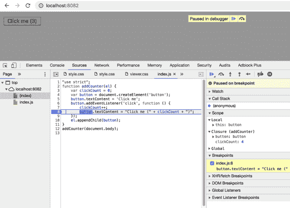
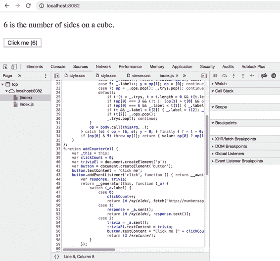
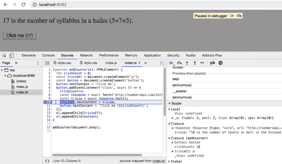

# 第七章：编写和运行您的代码

本章内容有点杂乱：涵盖了编写代码时（而不是类型）出现的一些问题，以及在运行代码时可能遇到的问题。

# 项目 53：更喜欢 ECMAScript 功能而不是 TypeScript 功能

随着时间的推移，TypeScript 和 JavaScript 之间的关系发生了变化。当微软于 2010 年开始开发 TypeScript 时，围绕 JavaScript 的普遍态度是它是一个有问题的语言，需要修复。常见的框架和源到源编译器通常会向 JavaScript 添加缺失的功能，如类、装饰器和模块系统。TypeScript 也不例外。早期版本包括自制的类、枚举和模块。

随着时间的推移，管理 JavaScript 的标准机构 TC39 向核心 JavaScript 语言添加了许多相同的功能。它们添加的功能与 TypeScript 现有版本不兼容。这使得 TypeScript 团队陷入尴尬的境地：是采纳标准中的新功能还是打破现有代码？

TypeScript 在很大程度上选择了后者，并最终阐明了其当前的统治原则：TC39 定义运行时，而 TypeScript 仅在类型空间中创新。

还有一些在这一决定之前存在的功能。重要的是要认识和理解这些，因为它们与语言的其余部分的关系不符。总体上，我建议避免它们，以尽可能保持 TypeScript 与 JavaScript 之间的关系清晰。

## 枚举

许多语言通过*枚举*或*enums*模型化可以取少量值的类型。TypeScript 将它们添加到了 JavaScript 中：

```
enum Flavor {
  VANILLA = 0,
  CHOCOLATE = 1,
  STRAWBERRY = 2,
}

let flavor = Flavor.CHOCOLATE;  // Type is Flavor

Flavor  // Autocomplete shows: VANILLA, CHOCOLATE, STRAWBERRY
Flavor[0]  // Value is "VANILLA"
```

枚举的论点是它们比裸数字提供更多的安全性和透明性。但 TypeScript 中的枚举有一些怪癖。实际上，有几种枚举的变体，它们的行为都有微妙的不同：

+   数值枚举（如`Flavor`）。任何数字都可以赋值给它，因此不太安全（设计成这样是为了实现位标志结构的可能性）。

+   字符串枚举。这提供了类型安全性，同时在运行时也提供了更透明的值。但它不是结构类型化的，不像 TypeScript 中的其他类型（稍后会详细说明）。

+   `const enum`。与常规枚举不同，常量枚举在运行时完全消失。如果在上一个示例中改为`const enum Flavor`，编译器会将`Flavor.CHOCOLATE`重写为`0`。这也打破了我们对编译器行为的预期，同时还存在`string`和`number`值枚举之间的分歧行为。

+   设置了`preserveConstEnums`标志的`const enum`。这会像常规枚举一样生成运行时代码。

字符串值枚举是名义上类型化的，这一点特别令人惊讶，因为 TypeScript 中的每一种类型都使用结构化类型来进行赋值（参见项目 4）：

```
enum Flavor {
  VANILLA = 'vanilla',
  CHOCOLATE = 'chocolate',
  STRAWBERRY = 'strawberry',
}

let flavor = Flavor.CHOCOLATE;  // Type is Flavor
    flavor = 'strawberry';
 // ~~~~~~ Type '"strawberry"' is not assignable to type 'Flavor'
```

这在您发布库时有一些影响。假设您有一个接受`Flavor`的函数：

```
function scoop(flavor: Flavor) { /* ... */ }
```

因为运行时的`Flavor`实际上只是一个字符串，因此对于您的 JavaScript 用户来说，使用一个是可以的：

```
scoop('vanilla');  // OK in JavaScript
```

但是您的 TypeScript 用户需要导入`enum`并使用它代替：

```
scoop('vanilla');
   // ~~~~~~~~~ '"vanilla"' is not assignable to parameter of type 'Flavor'

import {Flavor} from 'ice-cream';
scoop(Flavor.VANILLA);  // OK
```

对于 JavaScript 和 TypeScript 用户的这些不同体验是避免使用以字符串值为基础的枚举的原因。

TypeScript 提供了一个在其他语言中不太常见的枚举的替代方案：字面类型的联合。

```
type Flavor = 'vanilla' | 'chocolate' | 'strawberry';

let flavor: Flavor = 'chocolate';  // OK
    flavor = 'mint chip';
 // ~~~~~~ Type '"mint chip"' is not assignable to type 'Flavor'
```

这提供了与枚举一样多的安全性，并且直接转换为 JavaScript 的能力。在编辑器中，它也提供了类似的强大的自动完成功能：

```
function scoop(flavor: Flavor) {
  if (flavor === 'v
 // Autocomplete here suggests 'vanilla'
}
```

要了解更多此方法，请参见第 33 项。

## 参数属性

在初始化类时，将属性分配给构造函数参数是很常见的：

```
class Person {
  name: string;
  constructor(name: string) {
    this.name = name;
  }
}
```

TypeScript 为此提供了更紧凑的语法：

```
class Person {
  constructor(public name: string) {}
}
```

这被称为“参数属性”，它等价于第一个示例中的代码。使用参数属性时需要注意一些问题：

+   它们是少数在编译到 JavaScript 时会生成代码的结构之一（`enum`是另一个）。通常情况下，编译只涉及消除类型。

+   因为参数仅在生成的代码中使用，因此源代码看起来好像有未使用的参数。

+   使用参数和非参数属性的混合可能会隐藏您的类的设计。

例如：

```
class Person {
  first: string;
  last: string;
  constructor(public name: string) {
    [this.first, this.last] = name.split(' ');
  }
}
```

此类具有三个属性（`first`，`last`，`name`），但是仅在构造函数之前列出两个属性使得代码难以阅读。如果构造函数还接受其他参数，则情况会更糟。

如果您的类仅包含参数属性而没有方法，您可能考虑将其制作为一个`interface`并使用对象字面量。请记住，由于结构类型，两者可以互相赋值第 4 项：

```
class Person {
  constructor(public name: string) {}
}
const p: Person = {name: 'Jed Bartlet'};  // OK
```

参数属性的看法不一。虽然我通常避免使用它们，但其他人欣赏所节省的按键。请注意，它们不符合 TypeScript 其余部分的模式，并且实际上可能会使新开发者难以理解。尝试避免通过混合使用参数和非参数属性来隐藏类的设计。

## 命名空间和三斜线导入

在 ECMAScript 2015 之前，JavaScript 没有官方的模块系统。不同的环境以不同的方式添加了这一缺失功能：Node.js 使用`require`和`module.exports`，而 AMD 使用一个带有回调的`define`函数。

TypeScript 还通过自己的模块系统填补了这一空白。这是使用`module`关键字和“三斜线”导入完成的。在 ECMAScript 2015 添加了官方模块系统之后，TypeScript 添加了`namespace`作为`module`的同义词，以避免混淆：

```
namespace foo {
  function bar() {}
}
```

```
/// <reference path="other.ts"/>
foo.bar();
```

除了类型声明外，三斜线导入和`module`关键字只是历史上的一点奇闻。在你自己的代码中，你应该使用 ECMASCript 2015 风格的模块（`import` 和 `export`）。参见 Item 58。

## 装饰器

装饰器可以用来注释或修改类、方法和属性。例如，你可以定义一个`logged`注解，记录类中方法的所有调用：

```
class Greeter {
  greeting: string;
  constructor(message: string) {
    this.greeting = message;
  }
  @logged
  greet() {
    return "Hello, " + this.greeting;
  }
}

function logged(target: any, name: string, descriptor: PropertyDescriptor) {
  const fn = target[name];
  descriptor.value = function() {
    console.log(`Calling ${name}`);
    return fn.apply(this, arguments);
  };
}

console.log(new Greeter('Dave').greet());
// Logs:
// Calling greet
// Hello, Dave
```

这个功能最初是为了支持 Angular 框架而添加的，需要在`tsconfig.json`中设置`experimentalDecorators`属性。在我写作这篇文章时，它们的实现尚未被 TC39 标准化，因此，今天使用装饰器的任何代码都可能会中断或变得不标准。除非你使用 Angular 或其他需要注解的框架，并且在它们标准化之前，不要使用 TypeScript 的装饰器。

## 需要记住的事情

+   大体上来说，你可以通过从代码中移除所有类型来将 TypeScript 转换为 JavaScript。

+   枚举、参数属性、三斜线导入和装饰器是历史上的例外。

+   为了尽可能清晰地保持 TypeScript 在你的代码库中的角色，我建议避免使用这些功能。

# 项目 54：了解如何迭代对象

这段代码运行良好，但 TypeScript 却在其中标记了一个错误。为什么呢？

```
const obj = {
  one: 'uno',
  two: 'dos',
  three: 'tres',
};
for (const k in obj) {
  const v = obj[k];
         // ~~~~~~ Element implicitly has an 'any' type
         //        because type ... has no index signature
}
```

检查`obj`和`k`这两个符号可以给出一个线索：

```
const obj = { /* ... */ };
// const obj: {
//     one: string;
//     two: string;
//     three: string;
// }
for (const k in obj) {  // const k: string
  // ...
}
```

`k`的类型是`string`，但是你试图索引到一个对象中，该对象的类型只有三个特定的键：`'one'`、`'two'`和`'three'`。除了这三个字符串，还有其他字符串，所以这是会失败的。

插入一个更窄的类型声明到`k`中可以修复这个问题：

```
let k: keyof typeof obj;  // Type is "one" | "two" | "three"
for (k in obj) {
  const v = obj[k];  // OK
}
```

所以真正的问题是：为什么第一个例子中`k`的类型被推断为`string`而不是`"one" | "two" | "three"`？

为了理解，让我们看一个稍微不同的例子，涉及接口和函数：

```
interface ABC {
  a: string;
  b: string;
  c: number;
}

function foo(abc: ABC) {
  for (const k in abc) {  // const k: string
    const v = abc[k];
           // ~~~~~~ Element implicitly has an 'any' type
           //        because type 'ABC' has no index signature
  }
}
```

这与之前的错误相同。你可以使用相同类型的声明来“修复”它（`let k: keyof ABC`）。但在这种情况下，TypeScript 是对的。为什么呢？

```
const x = {a: 'a', b: 'b', c: 2, d: new Date()};
foo(x);  // OK
```

函数`foo`可以被调用以赋值给`ABC`的任何值，而不仅仅是具有“a”、“b”和“c”属性的值。这个值完全可能有其他属性（参见 Item 4）。为了允许这种情况，TypeScript 给`k`赋予了它能确信的唯一类型，即`string`。

在这里使用`keyof`声明会有另一个缺点：

```
function foo(abc: ABC) {
  let k: keyof ABC;
  for (k in abc) {  // let k: "a" | "b" | "c"
    const v = abc[k];  // Type is string | number
  }
}
```

如果`"a" | "b" | "c"`对于`k`来说太窄，那么`string | number`对于`v`来说肯定也太窄。在前面的例子中，其中一个值是`Date`，但它可以是任何东西。这些类型在这里给出了一种错误的确定性感，可能会在运行时导致混乱。

那么如果你只想在不出现类型错误的情况下遍历对象的键和值呢？`Object.entries`允许你同时遍历这两者：

```
function foo(abc: ABC) {
  for (const [k, v] of Object.entries(abc)) {
    k  // Type is string
    v  // Type is any
  }
}
```

虽然这些类型可能很难处理，但至少它们是诚实的！

你还应该注意*原型污染*的可能性。即使在你定义的对象文字中，for-in 也可能产生额外的键：

```
> Object.prototype.z = 3; // Please don't do this!
> const obj = {x: 1, y: 2};
> for (const k in obj) { console.log(k); }
x
y
z
```

希望这种情况不会发生在非对抗环境中（你绝不应该向`Object.prototype`添加可枚举属性），但这是 for-in 即使对于对象文字也产生字符串键的另一个原因。

如果你想迭代对象的键和值，请使用`keyof`声明（`let k: keyof T`）或`Object.entries`。前者适用于常量或其他你知道对象不会有额外键并且需要精确类型的情况。后者更普遍适用，尽管键和值类型更难处理。

## 事项记忆

+   当你确切知道键是什么时，使用`let k: keyof T`和 for-in 循环来迭代对象。请注意，你的函数接收的任何对象参数可能有额外的键。

+   使用`Object.entries`来迭代任何对象的键和值。

# 条目 55：理解 DOM 层次结构

本书中大多数项目都不关心在哪里运行你的 TypeScript：在浏览器中、服务器上、手机上。但这一章不同。如果你不在浏览器中工作，请跳过！

当你在 Web 浏览器中运行 JavaScript 时，DOM 层次结构始终存在。当你使用`document.getElementById`获取一个元素或者使用`document.createElement`创建一个元素时，它始终是特定类型的元素，即使你并不完全熟悉其分类。你调用方法并使用你想要的属性，然后希望一切顺利。

使用 TypeScript，DOM 元素的层次结构变得更加可见。了解你的`Node`、`Element`和`EventTarget`有助于你调试类型错误，并决定何时使用类型断言。因为很多 API 都基于 DOM，即使你使用像 React 或 d3 这样的框架，这一点也是相关的。

假设你想在用户拖动鼠标穿过`<div>`时跟踪其鼠标移动。你写了一些看似无害的 JavaScript 代码：

```
function handleDrag(eDown: Event) {
  const targetEl = eDown.currentTarget;
  targetEl.classList.add('dragging');
  const dragStart = [eDown.clientX, eDown.clientY];
  const handleUp = (eUp: Event) => {
    targetEl.classList.remove('dragging');
    targetEl.removeEventListener('mouseup', handleUp);
    const dragEnd = [eUp.clientX, eUp.clientY];
    console.log('dx, dy = ', [0, 1].map(i => dragEnd[i] - dragStart[i]));
  }
  targetEl.addEventListener('mouseup', handleUp);
}
const div = document.getElementById('surface');
div.addEventListener('mousedown', handleDrag);
```

TypeScript 的类型检查器在这 14 行代码中标记了不少于 11 个错误：

```
function handleDrag(eDown: Event) {
  const targetEl = eDown.currentTarget;
  targetEl.classList.add('dragging');
// ~~~~~~~           Object is possibly 'null'.
//         ~~~~~~~~~ Property 'classList' does not exist on type 'EventTarget'
  const dragStart = [
     eDown.clientX, eDown.clientY];
        // ~~~~~~~                Property 'clientX' does not exist on 'Event'
        //                ~~~~~~~ Property 'clientY' does not exist on 'Event'
  const handleUp = (eUp: Event) => {
    targetEl.classList.remove('dragging');
//  ~~~~~~~~           Object is possibly 'null'.
//           ~~~~~~~~~ Property 'classList' does not exist on type 'EventTarget'
    targetEl.removeEventListener('mouseup', handleUp);
//  ~~~~~~~~ Object is possibly 'null'
    const dragEnd = [
       eUp.clientX, eUp.clientY];
        // ~~~~~~~                Property 'clientX' does not exist on 'Event'
        //              ~~~~~~~   Property 'clientY' does not exist on 'Event'
    console.log('dx, dy = ', [0, 1].map(i => dragEnd[i] - dragStart[i]));
  }
  targetEl.addEventListener('mouseup', handleUp);
// ~~~~~~~ Object is possibly 'null'
}

   const div = document.getElementById('surface');
   div.addEventListener('mousedown', handleDrag);
// ~~~ Object is possibly 'null'
```

发生了什么？这个`EventTarget`是什么？为什么一切都可能是`null`？

要理解`EventTarget`错误，需要深入了解 DOM 层次结构。这里是一些 HTML 代码：

```
<p id="quote">and <i>yet</i> it moves</p>
```

如果你打开浏览器的 JavaScript 控制台并获取到`p`元素的引用，你会发现它是一个`HTMLParagraphElement`：

```
const p = document.getElementsByTagName('p')[0];
p instanceof HTMLParagraphElement
// True
```

`HTMLParagraphElement`是`HTMLElement`的子类型，后者是`Element`的子类型，后者是`Node`的子类型，后者是`EventTarget`的子类型。以下是层次结构中一些类型的示例：

表 7-1\. DOM 层次结构中的类型

| 类型 | 示例 |
| --- | --- |
| EventTarget | `window`, `XMLHttpRequest` |
| Node | `document`, `Text`, `Comment` |
| Element | *包括 HTMLElements, SVGElements* |
| HTMLElement | `<i>`, `<b>` |
| HTMLButtonElement | `<button>` |

`EventTarget` 是 DOM 类型中最通用的类型。你可以做的所有操作只有添加事件监听器、移除它们和分发事件。考虑到这一点，`classList` 的错误开始变得更加有意义：

```
function handleDrag(eDown: Event) {
  const targetEl = eDown.currentTarget;
  targetEl.classList.add('dragging');
// ~~~~~~~           Object is possibly 'null'
//         ~~~~~~~~~ Property 'classList' does not exist on type 'EventTarget'
  // ...
}
```

如其名称所示，`Event` 的 `currentTarget` 属性是一个 `EventTarget`。它甚至可能是 `null`。TypeScript 没有理由认为它具有 `classList` 属性。虽然 `EventTarget` 在实践中 *可能* 是 `HTMLElement`，但从类型系统的角度来看，它同样可能是 `window` 或 `XMLHTTPRequest`。

向上移动层次，我们来到 `Node`。一些不是 `Element` 的 `Node` 的例子是文本片段和注释。例如，在这个 HTML 中：

```
<p>
  And <i>yet</i> it moves
  <!-- quote from Galileo -->
</p>
```

最外层的元素是一个 `HTMLParagraphElement`。如你在这里所见，它具有 `children` 和 `childNodes`：

```
> p.children
HTMLCollection [i]
> p.childNodes
NodeList(5) [text, i, text, comment, text]
```

`children` 返回一个 `HTMLCollection`，一个类似数组的结构，仅包含子 `Element`（`<i>yet</i>`）。`childNodes` 返回一个 `NodeList`，一个类似数组的集合，包含不仅仅是 `Element`（`<i>yet</i>`），还有文本片段（“And,” “it moves”）和注释（“quote from Galileo”）。

`Element` 和 `HTMLElement` 有什么区别？包括整个 SVG 标签层次结构的非 HTML `Element`。这些是 `SVGElement`，另一种 `Element` 类型。`<html>` 或 `<svg>` 标签的类型是什么？它们分别是 `HTMLHtmlElement` 和 `SVGSvgElement`。

有时，这些特殊的类会有自己的属性，例如，`HTMLImageElement` 有一个 `src` 属性，而 `HTMLInputElement` 有一个 `value` 属性。如果你想从值中读取其中一个属性，它的类型必须足够具体，才能具有该属性。

TypeScript 对 DOM 的类型声明广泛使用字面类型，以尽可能获取最具体的类型。例如：

```
document.getElementsByTagName('p')[0];  // HTMLParagraphElement
document.createElement('button');  // HTMLButtonElement
document.querySelector('div');  // HTMLDivElement
```

但这并不总是可能的，特别是使用 `document.getElementById` 时：

```
document.getElementById('my-div');  // HTMLElement
```

尽管一般不建议使用类型断言（《Item 9》），但这是一种你比 TypeScript 更了解的情况，因此它们是合适的。只要你知道 `#my-div` 是一个 div，这没有问题：

```
document.getElementById('my-div') as HTMLDivElement;
```

启用了 `strictNullChecks` 后，你需要考虑 `document.getElementById` 返回 `null` 的情况。根据实际情况，你可以添加一个 if 语句或一个断言 (`!`)：

```
const div = document.getElementById('my-div')!;
```

这些类型并不特定于 TypeScript。相反，它们是从 DOM 的正式规范生成的。这是《Item 35》建议的一个例子，尽可能地从规范生成类型。

DOM 层次结构就是这样。那么 `clientX` 和 `clientY` 的错误呢？

```
function handleDrag(eDown: Event) {
  // ...
  const dragStart = [
     eDown.clientX, eDown.clientY];
        // ~~~~~~~                Property 'clientX' does not exist on 'Event'
        //                ~~~~~~~ Property 'clientY' does not exist on 'Event'
  // ...
}
```

除了 `Node` 和 `Element` 的层次结构之外，还有 `Event` 的层次结构。Mozilla 文档目前列出了不少于 52 种 `Event` 类型！

普通的 `Event` 是最通用的事件类型。更具体的类型包括：

`UIEvent`

任何用户界面事件

`MouseEvent`

鼠标点击等由鼠标触发的事件

`TouchEvent`

移动设备上的触摸事件

`WheelEvent`

由滚动滚轮触发的事件

`KeyboardEvent`

按键按下

在`handleDrag`中的问题是事件声明为`Event`，而`clientX`和`clientY`仅存在于更具体的`MouseEvent`类型中。

那么你应该如何修复本条款开头的示例呢？TypeScript 对 DOM 的声明广泛使用上下文（条款 26）。内联 mousedown 处理程序为 TypeScript 提供了更多信息，并消除了大部分错误。你还可以声明参数类型为`MouseEvent`而不是`Event`。以下是使用这两种技术修复错误的版本：

```
function addDragHandler(el: HTMLElement) {
  el.addEventListener('mousedown', eDown => {
    const dragStart = [eDown.clientX, eDown.clientY];
    const handleUp = (eUp: MouseEvent) => {
      el.classList.remove('dragging');
      el.removeEventListener('mouseup', handleUp);
      const dragEnd = [eUp.clientX, eUp.clientY];
      console.log('dx, dy = ', [0, 1].map(i => dragEnd[i] - dragStart[i]));
    }
    el.addEventListener('mouseup', handleUp);
  });
}

const div = document.getElementById('surface');
if (div) {
  addDragHandler(div);
}
```

结尾的`if`语句处理了可能没有`#surface`元素的情况。如果你知道这个元素存在，可以使用断言代替（`div!`）。`addDragHandler`需要一个非空的`HTMLElement`，所以这是将`null`值推到边界的示例（条款 31）。

## 要记住的事情

+   DOM 具有一种类型层次结构，在编写 JavaScript 时通常可以忽略。但在 TypeScript 中，这些类型变得更加重要。理解它们将帮助你为浏览器编写 TypeScript。

+   了解`Node`、`Element`、`HTMLElement`和`EventTarget`之间的区别，以及`Event`和`MouseEvent`之间的区别。

+   在你的代码中要么使用足够具体的类型来表示 DOM 元素和事件，要么给 TypeScript 提供推断的上下文。

# 条款 56：不要依赖私有属性来隐藏信息

JavaScript 在历史上缺乏一种使类的属性私有化的方法。通常的解决方法是采用一种约定，即用下划线作为不属于公共 API 部分的字段的前缀：

```
class Foo {
  _private = 'secret123';
}
```

但这只会阻止用户访问私有数据。它很容易绕过：

```
const f = new Foo();
f._private;  // 'secret123'
```

TypeScript 添加了`public`、`protected`和`private`字段修饰符，似乎提供了一些强制执行：

```
class Diary {
  private secret = 'cheated on my English test';
}

const diary = new Diary();
diary.secret
   // ~~~~~~ Property 'secret' is private and only
   //        accessible within class 'Diary'
```

但`private`是类型系统的一个特性，就像类型系统的所有特性一样，在运行时消失了（见条款 3）。当 TypeScript 将其编译为 JavaScript（目标为 ES2017）时，这段代码片段看起来是这样的：

```
class Diary {
  constructor() {
    this.secret = 'cheated on my English test';
  }
}
const diary = new Diary();
diary.secret;
```

`private`指示器已经消失了，你的秘密暴露了！就像`_private`约定一样，TypeScript 的访问修饰符只是阻止你访问私有数据。通过类型断言，你甚至可以从 TypeScript 内部访问私有属性：

```
class Diary {
  private secret = 'cheated on my English test';
}

const diary = new Diary();
(diary as any).secret  // OK
```

换句话说，*不要依赖`private`来隐藏信息！*

那么如果你想要更可靠的东西该怎么办呢？传统的答案是利用 JavaScript 中最可靠的隐藏信息的方式之一：闭包。你可以在构造函数中创建一个：

```
declare function hash(text: string): number;

class PasswordChecker {
  checkPassword: (password: string) => boolean;
  constructor(passwordHash: number) {
    this.checkPassword = (password: string) => {
      return hash(password) === passwordHash;
    }
  }
}

const checker = new PasswordChecker(hash('s3cret'));
checker.checkPassword('s3cret');  // Returns true
```

JavaScript 没有办法从`PasswordChecker`构造函数外部访问`passwordHash`变量。然而，这确实有一些缺点：具体来说，因为`passwordHash`在构造函数外部看不到，每个使用它的方法也必须在那里定义。这导致为每个类实例创建每个方法的副本，这将导致更高的内存使用。它还阻止同一类的其他实例访问私有数据。闭包可能不方便，但它们肯定会保持你的数据私密！

更新的选择是使用私有字段，这是一个正在稳定的提案语言功能，正在此书印刷时进行。在此提案中，为了使字段在类型检查和运行时都私有化，需要使用`#`作为前缀：

```
class PasswordChecker {
  #passwordHash: number;

  constructor(passwordHash: number) {
    this.#passwordHash = passwordHash;
  }

  checkPassword(password: string) {
    return hash(password) === this.#passwordHash;
  }
}

const checker = new PasswordChecker(hash('s3cret'));
checker.checkPassword('secret');  // Returns false
checker.checkPassword('s3cret');  // Returns true
```

`#passwordHash`属性不能从类外部访问。与闭包技术相比，它确实可以从类方法和同一类的其他实例中访问。对于不本地支持私有字段的 ECMAScript 目标，将使用`WeakMap`来进行后备实现。结果是你的数据仍然是私有的。此提案处于第 3 阶段，并且在此书印刷时正在向 TypeScript 添加支持。如果你想使用它，请查看 TypeScript 发行说明，以查看其是否普遍可用。

最后，如果你担心*安全性*，而不仅仅是封装，那么还有其他需要注意的问题，比如对内置原型和函数的修改。

## 要记住的事情

+   `private`访问修饰符仅通过类型系统强制执行。在运行时没有影响，并且可以通过断言绕过。不要假设它会保持数据隐藏。

+   要实现更可靠的信息隐藏，可以使用闭包。

# 第 57 条：使用源映射调试 TypeScript

当你运行 TypeScript 代码时，实际上是在运行 TypeScript 编译器生成的 JavaScript。对于任何源到源编译器都是如此，无论是缩小器、编译器还是预处理器。希望这基本上是透明的，你可以假装执行 TypeScript 源代码而无需查看 JavaScript。

直到你需要调试代码时才会发现这种方法很有效。调试器通常在你执行的代码上工作，并不知道它经历了哪些翻译过程。由于 JavaScript 是如此流行的目标语言，浏览器供应商合作解决了这个问题。结果就是源映射。它们将生成文件中的位置和符号映射回原始源中相应的位置和符号。大多数浏览器和许多 IDE 都支持它们。如果你没有使用它们来调试你的 TypeScript，那你就错过了！

假设你创建了一个小脚本，用于在 HTML 页面上添加一个按钮，每次点击它时都会增加：

```
function addCounter(el: HTMLElement) {
  let clickCount = 0;
  const button = document.createElement('button');
  button.textContent = 'Click me';
  button.addEventListener('click', () => {
    clickCount++;
    button.textContent = `Click me (${clickCount})`;
  });
  el.appendChild(button);
}

addCounter(document.body);
```

如果您在浏览器中加载此文件并打开调试器，您将看到生成的 JavaScript。这与原始源代码非常接近，因此调试并不太困难，如图 7-1 所示。



###### 图 7-1\. 使用 Chrome 开发者工具调试生成的 JavaScript 代码。对于这个简单的示例，生成的 JavaScript 与 TypeScript 源代码非常相似。

让我们通过从 numbersapi.com 获取每个数字的有趣事实，使页面变得更有趣。

```
function addCounter(el: HTMLElement) {
  let clickCount = 0;
  const triviaEl = document.createElement('p');
  const button = document.createElement('button');
  button.textContent = 'Click me';
  button.addEventListener('click', async () => {
    clickCount++;
    const response = await fetch(`http://numbersapi.com/${clickCount}`);
    const trivia = await response.text();
    triviaEl.textContent = trivia;
    button.textContent = `Click me (${clickCount})`;
  });
  el.appendChild(triviaEl);
  el.appendChild(button);
}
```

如果您现在打开浏览器的调试器，您会看到生成的源代码变得复杂得多（见图 7-2）。



###### 图 7-2\. 在这种情况下，TypeScript 编译器生成的 JavaScript 与原始的 TypeScript 源代码并不相似。这会使得调试更加困难。

为了支持旧版浏览器中的`async`和`await`，TypeScript 已将事件处理程序重写为状态机。这具有相同的行为，但代码不再与原始源代码如此相似。

这就是源映射可以帮助的地方。要告诉 TypeScript 生成源映射，请在您的*tsconfig.json*中设置`sourceMap`选项：

```
{
  "compilerOptions": {
    "sourceMap": true
  }
}
```

现在当您运行`tsc`时，它会为每个*.ts*文件生成两个输出文件：一个*.js*文件和一个*.js.map*文件。后者就是源映射。

有了这个文件，您在浏览器的调试器中会看到一个新的*index.ts*文件。您可以在其中设置断点并检查变量，就像您希望的那样（见图 7-3）。



###### 图 7-3\. 当存在源映射时，您可以在调试器中使用原始的 TypeScript 源代码，而不是生成的 JavaScript。

请注意，在左侧文件列表中*index.ts*以斜体显示。这表示它不是网页包含的“真实”文件。相反，它是通过源映射包含的。根据您的设置，*index.js.map*将包含对*index.ts*的引用（在这种情况下，浏览器通过网络加载它）或者它的内联副本（在这种情况下，不需要请求）。

源映射有几点需要注意：

+   如果您正在使用 TypeScript 与捆绑器或缩小器，它可能会生成自己的源映射。为了获得最佳的调试体验，您希望它能够完整映射回原始的 TypeScript 源代码，而不是生成的 JavaScript。如果您的捆绑器内置支持 TypeScript，那么这应该很顺利。如果没有，您可能需要查找一些标志来使其读取源映射输入。

+   要注意你是否在生产环境中提供源映射。浏览器只有在调试器打开时才会加载源映射，因此对最终用户没有性能影响。但是，如果源映射包含原始源代码的内联副本，那么可能会有一些内容是你不打算公开的。世界真的需要看到你的讽刺评论或内部 bug 追踪器的 URL 吗？

你也可以使用源映射调试 NodeJS 程序。通常通过你的编辑器或通过从浏览器的调试器连接到你的 node 进程来完成。请查阅 Node 文档以获取详细信息。

类型检查器可以在运行代码之前捕获许多错误，但它不能替代一个好的调试器。使用源映射可以获得出色的 TypeScript 调试体验。

## 要记住的事情

+   不要调试生成的 JavaScript。使用源映射在运行时调试你的 TypeScript 代码。

+   确保你的源映射一直映射到你运行的代码。

+   根据你的设置，你的源映射可能包含原始代码的内联副本。除非你知道自己在做什么，否则不要发布它们！
