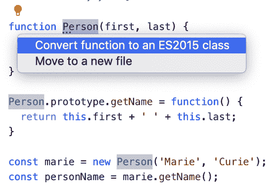
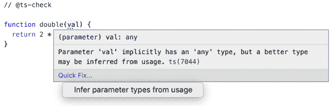
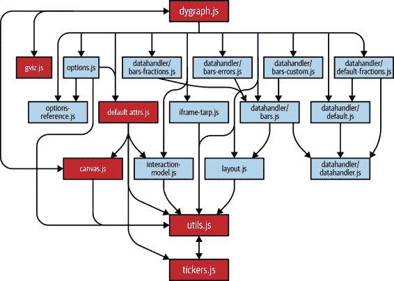
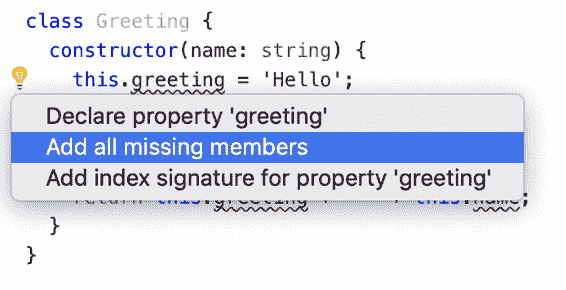

# 第八章：TypeScript 迁移

您听说过 TypeScript 很棒。您也从痛苦的经验中知道，维护您 15 年历史，有 10 万行代码的 JavaScript 库并不是一件容易的事。如果它能成为 TypeScript 库就好了！

本章提供了一些建议，介绍了如何将您的 JavaScript 项目迁移到 TypeScript，而不会丧失理智并放弃努力。

只有最小的代码库可以一次性迁移。对于较大的项目来说，逐步迁移才是关键。 Item 60 讨论了如何做到这一点。长时间迁移时，跟踪进度并确保没有倒退至关重要。这将产生一种变革的动力和不可避免性。 Item 61 讨论了如何做到这一点。

将大型项目迁移到 TypeScript 可能并不容易，但它确实提供了巨大的潜在优势。一项 2017 年的研究发现，GitHub 上 JavaScript 项目中修复的 15%的错误可以通过 TypeScript 预防。^(1)更令人印象深刻的是，AirBnb 六个月的事故报告调查发现，有 38%的事故本可以通过 TypeScript 避免。^(2)如果你在组织中提倡 TypeScript，这些统计数据会有所帮助！对此，运行一些实验并找到早期采用者也会有所帮助。 Item 59 讨论了在开始迁移之前如何进行 TypeScript 实验。

由于本章大部分内容都是关于 JavaScript 的，因此许多代码示例要么是纯 JavaScript（不需要通过类型检查器），要么使用更宽松的设置进行检查（例如，关闭`noImplicitAny`）。

# Item 58: 写现代 JavaScript

除了检查代码是否具有类型安全性外，TypeScript 还可以将您的 TypeScript 代码编译为任何版本的 JavaScript 代码，一直回溯到 1999 年的 ES3 版本。由于 TypeScript 是 JavaScript 的*最新*版本的超集，这意味着您可以将`tsc`用作“转换器”：一种将新的 JavaScript 转换为更旧，更广泛支持的 JavaScript 的工具。

换个角度看，这意味着当您决定将现有的 JavaScript 代码库转换为 TypeScript 时，采用所有最新的 JavaScript 特性没有坏处。事实上，有很多好处：因为 TypeScript 设计用于与现代 JavaScript 一起使用，所以现代化您的 JS 是迈向采用 TypeScript 的重要第一步。

而且，由于 TypeScript 是 JavaScript 的超集，学习编写更现代和习惯用法的 JavaScript 意味着您也在学习编写更好的 TypeScript。

本项介绍了现代 JavaScript 的一些特性，这里定义的是自 ECMAScript 2015（又名 ES6）以及之后引入的所有内容。这些材料在其他书籍和在线资源中有更详尽的介绍。如果这里提到的任何主题对你不熟悉，你应该花时间了解更多。当你学习像 `async`/`await` 这样的新语言特性时，TypeScript 可以极大地帮助你：它几乎肯定比你更好地理解这些特性，并可以指导你正确使用它们。

这些都值得理解，但是对于采用 TypeScript 来说，最重要的是 ECMAScript 模块和 ES2015 类。

## 使用 ECMAScript 模块

在 ECMAScript 2015 版本之前，没有标准的方法将代码分割为单独的模块。有多种解决方案，从多个 `<script>` 标签、手动串联、Makefile 到 node.js 风格的 `require` 语句或 AMD 风格的 `define` 回调。TypeScript 甚至有自己的模块系统（第 53 项）。

今天有一个标准：ECMAScript 模块，也称为 `import` 和 `export`。如果你的 JavaScript 代码库仍然是单文件，如果你使用串联或其他模块系统之一，那么现在是切换到 ES 模块的时候了。这可能需要设置类似 webpack 或 ts-node 这样的工具。TypeScript 最适合使用 ES 模块，并且采用它们将促进你的过渡，至少因为它将允许你逐个迁移模块（参见 第 61 项）。

具体细节将取决于你的设置，但如果你像这样使用 CommonJS：

```
// CommonJS
// a.js
const b = require('./b');
console.log(b.name);

// b.js
const name = 'Module B';
module.exports = {name};
```

那么 ES 模块的等价物看起来会像这样：

```
// ECMAScript module
// a.ts
import * as b from './b';
console.log(b.name);

// b.ts
export const name = 'Module B';
```

## 使用类替代原型

JavaScript 拥有灵活的基于原型的对象模型。但总的来说，JS 开发者们更倾向于使用更严格的基于类的模型，这在 ES2015 引入 `class` 关键字后正式成为了语言的一部分。

如果你的代码以直接的方式使用原型，应该切换到使用类。也就是说，不要再使用：

```
function Person(first, last) {
  this.first = first;
  this.last = last;
}

Person.prototype.getName = function() {
  return this.first + ' ' + this.last;
}

const marie = new Person('Marie', 'Curie');
const personName = marie.getName();
```

写：

```
class Person {
  first: string;
  last: string;

  constructor(first: string, last: string) {
    this.first = first;
    this.last = last;
  }

  getName() {
    return this.first + ' ' + this.last;
  }
}

const marie = new Person('Marie', 'Curie');
const personName = marie.getName();
```

TypeScript 对于原型版本的 `Person` 存在一些困难，但对于带有最小注释的基于类的版本理解能力更好。如果你对语法不熟悉，TypeScript 将帮助你正确使用它。

对于使用旧式类的代码，TypeScript 语言服务提供了一个“将函数转换为 ES2015 类”的快速修复方案，可以加快此过程（图 8-1）。



###### 图 8-1\. TypeScript 语言服务提供了一种快速修复方案，将旧式类转换为 ES2015 类。

## 使用 `let`/`const` 替代 `var`

JavaScript 的 `var` 有一些著名的古怪作用域规则。如果你想更深入了解它们，请阅读《*Effective JavaScript*》。但最好避免使用 `var`，不必担心！相反，请使用 `let` 和 `const`。它们真正地在块级作用域中工作，比 `var` 更直观。

同样，TypeScript 在这里会帮助您。如果将 `var` 改为 `let` 导致错误，则几乎可以肯定您正在做不应该做的事情。

嵌套的函数语句也具有类似于 `var` 的作用域规则：

```
function foo() {
  bar();
  function bar() {
    console.log('hello');
  }
}
```

当您调用 `foo()` 时，它会记录 `hello`，因为 `bar` 的定义被提升到 `foo` 的顶部。这令人惊讶！最好使用函数表达式 (`const bar = () => { ... }`)。

## 使用 for-of 或数组方法代替 for(;;)

在经典 JavaScript 中，您使用 C 风格的 for 循环来遍历数组：

```
for (var i = 0; i < array.length; i++) {
  const el = array[i];
  // ...
}
```

在现代 JavaScript 中，您可以使用 for-of 循环：

```
for (const el of array) {
  // ...
}
```

这样更不容易出现拼写错误，并且不会引入索引变量。如果需要索引变量，可以使用 `forEach`：

```
array.forEach((el, i) => {
  // ...
});
```

避免使用 for-in 构造循环遍历数组，因为它会有很多意外情况（见 Item 16）。

## 更喜欢箭头函数而不是函数表达式

`this` 关键字是 JavaScript 中最令人困惑的一个方面，因为它具有与其他变量不同的作用域规则：

```
class Foo {
  method() {
    console.log(this);
    [1, 2].forEach(function(i) {
      console.log(this);
    });
  }
}
const f = new Foo();
f.method();
// Prints Foo, undefined, undefined in strict mode
// Prints Foo, window, window (!) in non-strict mode
```

通常情况下，您希望 `this` 引用所在类的相关实例。箭头函数通过保持其闭包作用域中的 `this` 值来帮助您实现这一点：

```
class Foo {
  method() {
    console.log(this);
    [1, 2].forEach(i => {
      console.log(this);
    });
  }
}
const f = new Foo();
f.method();
// Always prints Foo, Foo, Foo
```

除了语义更简单外，箭头函数更为简洁。应尽可能使用它们。关于 `this` 绑定的更多信息，请参见 Item 49。使用 `noImplicitThis`（或 `strict`）编译选项，TypeScript 将帮助您正确地处理 `this` 绑定。

## 使用紧凑对象字面量和解构赋值

而不是写成：

```
const x = 1, y = 2, z = 3;
const pt = {
  x: x,
  y: y,
  z: z
};
```

您可以简单地写：

```
const x = 1, y = 2, z = 3;
const pt = { x, y, z };
```

除了更简洁外，这还鼓励变量和属性的一致命名，这是您的人类读者也会欣赏的 (Item 36)。

要从箭头函数中返回对象字面量，请将其括在括号中：

```
['A', 'B', 'C'].map((char, idx) => ({char, idx}));
// [ { char: 'A', idx: 0 },  { char: 'B', idx: 1 }, { char: 'C', idx: 2 } ]
```

还有属性值为函数的简写：

```
const obj = {
  onClickLong: function(e) {
    // ...
  },
  onClickCompact(e) {
    // ...
  }
};
```

紧凑对象字面量的反义是对象解构。而不是写成：

```
const props = obj.props;
const a = props.a;
const b = props.b;
```

您可以写：

```
const {props} = obj;
const {a, b} = props;
```

或者甚至：

```
const {props: {a, b}} = obj;
```

在这个最后的例子中，只有 `a` 和 `b` 变成了变量，而不是 `props`。

在解构时可以指定默认值。而不是写成：

```
let {a} = obj.props;
if (a === undefined) a = 'default';
```

写成这样：

```
const {a = 'default'} = obj.props;
```

您还可以解构数组。这在使用元组类型时特别有用：

```
const point = [1, 2, 3];
const [x, y, z] = point;
const [, a, b] = point;  // Ignore the first one
```

解构也可以用在函数参数中：

```
const points = [
  [1, 2, 3],
  [4, 5, 6],
];
points.forEach(([x, y, z]) => console.log(x + y + z));
// Logs 6, 15
```

与简洁的对象字面量语法一样，解构是简洁的，并鼓励一致的变量命名。使用它！

## 使用默认函数参数

在 JavaScript 中，所有函数参数都是可选的：

```
function log2(a, b) {
  console.log(a, b);
}
log2();
```

这将输出：

```
undefined undefined
```

这经常用于实现参数的默认值：

```
function parseNum(str, base) {
  base = base || 10;
  return parseInt(str, base);
}
```

在现代 JavaScript 中，您可以直接在参数列表中指定默认值：

```
function parseNum(str, base=10) {
  return parseInt(str, base);
}
```

除了更加简洁外，这还表明 `base` 是一个可选参数。默认参数在你迁移到 TypeScript 时还有另一个好处：它们帮助类型检查器推断参数的类型，从而消除了类型注解的需求。参见 项目 19。

## 使用 async/await 替代原始的 Promises 或回调

项目 25 解释了为什么 `async` 和 `await` 更可取，但要点在于它们能简化你的代码，防止错误，并帮助类型在异步代码中流动。

而不是这两者：

```
function getJSON(url: string) {
  return fetch(url).then(response => response.json());
}
function getJSONCallback(url: string, cb: (result: unknown) => void) {
  // ...
}
```

编写这样的代码：

```
async function getJSON(url: string) {
  const response = await fetch(url);
  return response.json();
}
```

## 不要在 TypeScript 中使用 use strict

ES5 引入了“严格模式”以使一些可疑模式更加显式化为错误。你可以通过在代码中加入 `'use strict'` 来启用它：

```
'use strict';
function foo() {
  x = 10;  // Throws in strict mode, defines a global in non-strict.
}
```

如果你的 JavaScript 代码库从未使用过严格模式，那么试试看吧。它找到的错误很可能也会被 TypeScript 编译器发现。

但是随着你转向 TypeScript，保留源代码中的 `'use strict'` 并没有太多价值。总的来说，TypeScript 提供的健全性检查远比严格模式提供的要严格得多。

在 JavaScript 中，由 `tsc` 发出的代码中加上 `'use strict'` 是有一定价值的。如果你设置了 `alwaysStrict` 或 `strict` 编译器选项，TypeScript 将以严格模式解析你的代码，并在生成的 JavaScript 输出中添加 `'use strict'`。

简而言之，在 TypeScript 中不要写 `'use strict'`。使用 `alwaysStrict` 代替即可。

这些只是 TypeScript 允许你使用的许多新的 JavaScript 特性中的一部分。TC39，负责 JS 标准的机构，非常活跃，每年都会添加新特性。目前，TypeScript 团队致力于实现达到标准化流程阶段 3（共 4 阶段）的任何特性，因此你甚至不必等待程序稳定下来。查看 TC39 GitHub 仓库^(3) 获取最新信息。截至本文撰写时，管道和装饰器提案特别有可能影响 TypeScript。

## 需记住的事项

+   TypeScript 允许你在任何运行时环境中编写现代 JavaScript。利用这一点，使用它所支持的语言特性。除了改善你的代码库，这还将帮助 TypeScript 理解你的代码。

+   使用 TypeScript 来学习类、解构和 `async`/`await` 等语言特性。

+   不必在 TypeScript 中费心 `'use strict'`：TypeScript 更严格。

+   查看 TC39 GitHub 仓库和 TypeScript 发布说明，了解所有最新的语言特性。

# 项目 59：使用 @ts-check 和 JSDoc 来尝试 TypeScript

在你开始从 JavaScript 转换源文件到 TypeScript 的过程之前（条目 60），你可能希望尝试类型检查，以了解可能遇到的问题。TypeScript 的 `@ts-check` 指令允许你做到这一点。它指示类型检查器分析单个文件并报告它发现的任何问题。你可以把它看作是一种非常宽松的类型检查版本：甚至比 TypeScript 的 `noImplicitAny` 关闭的情况更宽松（条目 2）。

这是它的工作原理：

```
// @ts-check
const person = {first: 'Grace', last: 'Hopper'};
2 * person.first
 // ~~~~~~~~~~~~ The right-hand side of an arithmetic operation must be of type
 //              'any', 'number', 'bigint', or an enum type
```

TypeScript 推断 `person.first` 的类型为 `string`，所以 `2 * person.first` 是一个类型错误，无需类型注解。

虽然它可能会暴露这种明显的类型错误，或者调用了太多参数的函数，但实际上，`// @ts-check` 倾向于揭示几种特定类型的错误：

## 未声明的全局变量

如果这些是你定义的符号，那么用 `let` 或 `const` 声明它们。如果它们是在别处（比如在 HTML 文件的 `<script>` 标签中）定义的“环境”符号，则可以创建一个类型声明文件来描述它们。

例如，如果你有这样的 JavaScript 代码：

```
// @ts-check
console.log(user.firstName);
         // ~~~~ Cannot find name 'user'
```

然后你可以创建一个名为 *types.d.ts* 的文件：

```
interface UserData {
  firstName: string;
  lastName: string;
}
declare let user: UserData;
```

单独创建这个文件可能会修复问题。如果不行，你可能需要使用 “三斜杠” 引用显式导入它：

```
// @ts-check
/// <reference path="./types.d.ts" />
console.log(user.firstName);  // OK
```

这个 *types.d.ts* 文件是一个有价值的工件，将成为你项目类型声明的基础。

## 未知的库

如果你使用第三方库，TypeScript 需要知道它。例如，你可能会使用 jQuery 来设置 HTML 元素的大小。使用 `@ts-check`，TypeScript 将标记一个错误：

```
// @ts-check
   $('#graph').style({'width': '100px', 'height': '100px'});
// ~ Cannot find name '$'
```

解决方案是安装 jQuery 的类型声明：

```
$ npm install --save-dev @types/jquery
```

现在错误具体到了 jQuery：

```
// @ts-check
$('#graph').style({'width': '100px', 'height': '100px'});
         // ~~~~~ Property 'style' does not exist on type 'JQuery<HTMLElement>'
```

实际上，应该是 `.css`，而不是 `.style`。

`@ts-check` 允许你利用 TypeScript 对流行 JavaScript 库的声明，而无需自行迁移到 TypeScript。这是使用它的最佳理由之一。

## DOM 问题

假设你正在编写在 web 浏览器中运行的代码，TypeScript 可能会标记你在处理 DOM 元素时遇到的问题。例如：

```
// @ts-check
const ageEl = document.getElementById('age');
ageEl.value = '12';
   // ~~~~~ Property 'value' does not exist on type 'HTMLElement'
```

问题在于只有 `HTMLInputElement` 具有 `value` 属性，但是 `document.getElementById` 返回更通用的 `HTMLElement`（参见 条目 55）。如果你知道 `#age` 元素确实是一个 `input` 元素，那么这是使用类型断言的适当时机（条目 9）。但这仍然是一个 JS 文件，所以你不能写 `as HTMLInputElement`。相反，你可以使用 JSDoc 进行类型断言：

```
// @ts-check
const ageEl = /** @type {HTMLInputElement} */(document.getElementById('age'));
ageEl.value = '12';  // OK
```

如果你在编辑器中悬停在 `ageEl` 上，你会看到 TypeScript 现在将其视为 `HTMLInputElement`。在输入 JSDoc `@type` 注释时要小心：括号后面的注释是必需的。

这导致了另一种类型的错误，在 `@ts-check` 中出现了不准确的 JSDoc，下面将进行解释。

## 不准确的 JSDoc

如果你的项目已经有类似 JSDoc 风格的注释，启用 `@ts-check` 后 TypeScript 将开始检查它们。如果之前使用过像 Closure Compiler 这样的系统来强制执行类型安全性，那么这不应该造成重大问题。但如果你的注释更像是“理想的 JSDoc”，可能会有些意外。

```
// @ts-check
/**
 * Gets the size (in pixels) of an element.
 * @param {Node} el The element
 * @return {{w: number, h: number}} The size
 */
function getSize(el) {
  const bounds = el.getBoundingClientRect();
                 // ~~~~~~~~~~~~~~~~~~~~~ Property 'getBoundingClientRect'
                 //                       does not exist on type 'Node'
  return {width: bounds.width, height: bounds.height};
       // ~~~~~~~~~~~~~~~~~~~ Type '{ width: any; height: any; }' is not
       //                     assignable to type '{ w: number; h: number; }'
}
```

第一个问题是对 DOM 的误解：`getBoundingClientRect()` 被定义在 `Element` 上，而不是 `Node` 上。因此，`@param` 标签应该更新。第二个问题是在 `@return` 标签和实现中指定的属性之间不匹配。很可能项目的其余部分使用 `width` 和 `height` 属性，因此 `@return` 标签应该更新。

你可以使用 JSDoc 逐步为项目添加类型注解。TypeScript 语言服务将会建议根据用法从推断类型注释的快速修复代码，就像这里和 图 8-2 中展示的一样：

```
function double(val) {
  return 2 * val;
}
```



###### 图 8-2\. TypeScript 语言服务提供了一个从用法推断参数类型的快速修复。

这将得到一个正确的 JSDoc 注释：

```
// @ts-check
/**
 * @param {number} val
 */
function double(val) {
  return 2 * val;
}
```

使用 `@ts-check` 可以帮助类型在你的代码中流动。但它并不总是效果很好。例如：

```
function loadData(data) {
  data.files.forEach(async file => {
    // ...
  });
}
```

如果你使用快速修复来注释 `data`，你最终会得到：

```
/**
 * @param {{
 *  files: { forEach: (arg0: (file: any) => Promise<void>) => void; };
 * }} data
 */
function loadData(data) {
  // ...
}
```

这是结构化类型化走火入魔（项目 4）。虽然函数在任何具有该签名的对象上技术上都可以工作，但最有可能是参数应该是 `{files: string[]}`。

在 JavaScript 项目中，你可以通过 JSDoc 注解和 `@ts-check` 获得大部分 TypeScript 的体验。这很吸引人，因为它不需要你改变工具链。但最好不要走得太远。注释的样板有真正的成本：在一大堆 JSDoc 中容易让逻辑变得混乱。TypeScript 最适合 *.ts* 文件，而不是 *.js* 文件。最终目标是将你的项目转换为 TypeScript，而不是带有 JSDoc 注解的 JavaScript。但 `@ts-check` 可以是一种有用的方式，特别是对于已经有大量 JSDoc 注解的项目，可以用来试验类型并发现一些初始错误。

## 需记住的事项

+   在 JavaScript 文件顶部添加 "`// @ts-check`" 可启用类型检查。

+   识别常见错误。了解如何声明全局变量并为第三方库添加类型声明。

+   使用 JSDoc 注释进行类型断言和更好的类型推断。

+   不要花太多时间用 JSDoc 完美地输入你的代码。记住，目标是转换为 *.ts*！

# 项目 60：使用 allowJs 混合 TypeScript 和 JavaScript

对于小型项目，你可能能够一举从 JavaScript 转换到 TypeScript。但对于较大的项目，这种“停止世界”的方法行不通。你需要逐步过渡的能力。这意味着你需要一种让 TypeScript 和 JavaScript 共存的方式。

这的关键在于`allowJs`编译选项。使用`allowJs`，TypeScript 文件和 JavaScript 文件可以相互导入。对于 JavaScript 文件，这种模式非常宽松。除非你使用`@ts-check`（Item 59），否则你只会看到语法错误。这是“TypeScript 是 JavaScript 的超集”在最琐碎的意义上。

虽然不太可能捕捉到错误，但`allowJs`确实为你提供了一个机会，在开始进行代码更改之前将 TypeScript 引入到你的构建链中。这是一个好主意，因为你会希望在将模块转换为 TypeScript 时能够运行你的测试（Item 61）。

如果你的打包工具包含了 TypeScript 集成或有可用的插件，那通常是最简单的前进路径。例如，使用`browserify`，你运行`npm install --sav-dev tsify`并将其添加为插件：

```
$ browserify index.ts -p [ tsify --noImplicitAny ] > bundle.js
```

大多数单元测试工具也有类似的选项。例如，使用`jest`工具，你安装`ts-jest`并通过指定`jest.config.js`将 TypeScript 源代码传递给它：

```
module.exports = {
  transform: {
    '^.+\\.tsx?$': 'ts-jest',
  },
};
```

如果你的构建链是自定义的，那么你的任务将会更加复杂。但总会有一个很好的备选方案：当你指定`outDir`选项时，TypeScript 会在一个与源代码树平行的目录中生成纯 JavaScript 源代码。通常情况下，你现有的构建链可以在这上面运行。你可能需要微调 TypeScript 的 JavaScript 输出，使其与原始 JavaScript 源代码尽可能匹配（例如，通过指定`target`和`module`选项）。

将 TypeScript 添加到你的构建和测试流程中可能不是最愉快的任务，但这是一个至关重要的任务，让你能够有信心开始迁移你的代码。

## 要记住的事情

+   使用`allowJs`编译选项来支持混合 JavaScript 和 TypeScript，以便在项目转换过程中过渡。

+   在开始大规模迁移之前，确保你的测试和构建链能够与 TypeScript 一起工作。

# 项目 61：按模块转换，沿着依赖图向上移动

你已经采用了现代 JavaScript，将项目转换为使用 ECMAScript 模块和类（Item 58）。你已经将 TypeScript 集成到你的构建链中，并且所有的测试都通过了（Item 60）。现在是有趣的部分：将你的 JavaScript 转换为 TypeScript。但从哪里开始呢？

当你给一个模块添加类型时，很可能会在所有依赖它的模块中出现新的类型错误。理想情况下，你希望每个模块只转换一次就完成。这意味着你应该按照依赖图向*上*转换模块：从叶子节点（不依赖其他模块的模块）开始，向根节点移动。

第一个要迁移的模块通常是第三方依赖项，因为按定义，您依赖于它们，但它们不依赖于您。通常这意味着安装 `@types` 模块。例如，如果您使用 `lodash` 实用程序库，您将运行 `npm install --save-dev @types/lodash`。这些类型将帮助类型在您的代码中流动，并显示您对库的使用中出现的问题。

如果您的代码调用外部 API，可能还希望尽早为这些 API 添加类型声明。尽管这些调用可能发生在代码的任何位置，但这仍符合向依赖图上游移动的精神，因为您依赖于 API，但它们并不依赖于您。许多类型源自 API 调用，这些类型通常很难从上下文中推断出来。如果您可以找到 API 的规范，可以从中生成类型（参见 Item 35）。

在迁移您自己的模块时，可视化依赖图非常有帮助。图 8-3 展示了一个中型 JavaScript 项目的示例图，使用了出色的 `madge` 工具生成。



###### 图 8-3\. 中型 JavaScript 项目的依赖图。箭头表示依赖关系。较深色的框表示模块涉及循环依赖。

此依赖图底部是 *utils.js* 和 *tickers.js* 之间的循环依赖。许多模块依赖于这两个模块，但它们只相互依赖。这种模式非常常见：大多数项目将在依赖图的底部拥有某种类型的实用程序模块。

在迁移代码时，专注于添加类型而不是重构。如果这是一个旧项目，您可能会注意到一些奇怪的问题并想要修复它们。请抵制这种冲动！当前的目标是将项目转换为 TypeScript，而不是改进其设计。相反，请在发现问题时记录代码异味并制定未来重构的清单。

当您转换为 TypeScript 时，可能会遇到一些常见错误。其中一些在 Item 59 中有所涉及，但新的错误包括：

## 未声明的类成员

JavaScript 中的类不需要声明其成员，但 TypeScript 中的类需要。当您将类的 *.js* 文件重命名为 *.ts* 时，很可能会显示对您引用的每个属性的错误：

```
class Greeting {
  constructor(name) {
    this.greeting = 'Hello';
      // ~~~~~~~~ Property 'greeting' does not exist on type 'Greeting'
    this.name = name;
      // ~~~~ Property 'name' does not exist on type 'Greeting'
  }
  greet() {
    return this.greeting + ' ' + this.name;
             // ~~~~~~~~              ~~~~ Property ... does not exist
  }
}
```

对于此问题，有一个有用的快速修复（参见 图 8-4），您应该利用它。



###### 图 8-4\. 快速修复以添加缺失成员的声明对于将类转换为 TypeScript 特别有帮助。

这将根据使用情况添加缺失成员的声明：

```
class Greeting {
  greeting: string;
  name: any;
  constructor(name) {
    this.greeting = 'Hello';
    this.name = name;
  }
  greet() {
    return this.greeting + ' ' + this.name;
  }
}
```

TypeScript 能够正确获取 `greeting` 的类型，但不能正确获取 `name` 的类型。应用此快速修复后，您应该查看属性列表并修复 `any` 类型。

如果这是您第一次看到类的完整属性列表，您可能会感到震惊。当我将*dygraph.js*中的主类转换（图 8-3 中的根模块）时，我发现它竟然有不少于 45 个成员变量！迁移到 TypeScript 会显露出之前隐含的糟糕设计。如果必须看到它，糟糕的设计就更难以自圆其说了。但同样，现在抵制重构的冲动。注意这种奇怪之处，并考虑如何在其他日子解决它。

## 具有变化类型的值

TypeScript 将抱怨这样的代码：

```
const state = {};
state.name = 'New York';
   // ~~~~ Property 'name' does not exist on type '{}'
state.capital = 'Albany';
   // ~~~~~~~ Property 'capital' does not exist on type '{}'
```

更详细地讨论了这个主题，见项目 23，所以如果您遇到此错误，可能需要重新学习一下该项目。如果修复很简单，您可以一次性构建对象：

```
const state = {
  name: 'New York',
  capital: 'Albany',
};  // OK
```

如果不是，那么现在是使用类型断言的适当时机：

```
interface State {
  name: string;
  capital: string;
}
const state = {} as State;
state.name = 'New York';  // OK
state.capital = 'Albany';  // OK
```

最终您应该修复这个问题（参见项目 9），但这是一个权宜之计，将帮助您保持迁移进程。

如果您一直在使用 JSDoc 和`@ts-check`（项目 59），请注意，转换为 TypeScript 实际上可能会丢失类型安全性。例如，TypeScript 在这段 JavaScript 中标记了一个错误：

```
// @ts-check
/**
 * @param {number} num
 */
function double(num) {
  return 2 * num;
}

double('trouble');
    // ~~~~~~~~~ Argument of type '"trouble"' is not assignable to
    //           parameter of type 'number'
```

当您转换为 TypeScript 时，`@ts-check` 和 JSDoc 将不再强制执行。这意味着`num`的类型隐式为`any`，因此不会出现错误：

```
/**
 * @param {number} num
 */
function double(num) {
  return 2 * num;
}

double('trouble');  // OK
```

幸运的是，有一个快速修复方法可以将 JSDoc 类型转移到 TypeScript 类型中。如果您有任何 JSDoc，请使用图 8-5 中所示的内容。


###### 图 8-5\. 快速修复：将 JSDoc 注释复制到 TypeScript 类型注释中

一旦您将类型注释复制到 TypeScript 中，请确保从 JSDoc 中删除它们，以避免冗余（参见项目 30）：

```
function double(num: number) {
  return 2 * num;
}

double('trouble');
    // ~~~~~~~~~ Argument of type '"trouble"' is not assignable to
    //           parameter of type 'number'
```

当您打开`noImplicitAny`时，也会捕获到这个问题，但现在您可能也可以添加类型。

最后迁移您的测试。它们应该位于您的依赖图的顶部（因为您的代码不依赖它们），在迁移过程中，知道您的测试仍然通过，尽管您完全没有更改它们，这是非常有帮助的。

## 要记住的事项

+   通过为第三方模块和外部 API 调用添加`@types`开始迁移。

+   从依赖图的底部开始迁移您的模块。第一个模块通常会是某种实用代码。考虑可视化依赖图以帮助您跟踪进度。

+   在揭示奇怪的设计时，抵制重构代码的冲动。保留一个未来重构的想法列表，但专注于 TypeScript 转换。

+   在转换过程中注意常见的错误。如有必要，复制 JSDoc 注释以避免丢失类型安全性。

# 项目 62：在启用`noImplicitAny`之前，不要认为迁移完成。

将整个项目转换为 *.ts* 是一个重要的成就。但你的工作还没有完成。你的下一个目标是启用 `noImplicitAny` 选项（条款 2）。没有 `noImplicitAny` 的 TypeScript 代码最好被看作是过渡性的，因为它可能掩盖了你在类型声明中真正的错误。

例如，也许你使用了“添加所有缺失成员”的快速修复来添加类的属性声明（条款 61）。你会留下一个`any`类型，并希望修复它：

```
class Chart {
  indices: any;

  // ...
}
```

`indices` 听起来应该是一个数字数组，所以你插入了那个类型：

```
class Chart {
  indices: number[];

  // ...
}
```

没有出现新错误，所以你继续前进。不幸的是，你犯了一个错误：`number[]` 是错误的类型。这里是来自课堂其他地方的一些代码：

```
getRanges() {
  for (const r of this.indices) {
    const low = r[0];  // Type is any
    const high = r[1];  // Type is any
    // ...
  }
}
```

显然，`number[][]`或`[number, number][]`将是更精确的类型。你是否对索引到`number`允许的事实感到惊讶？这表明 TypeScript 在没有 `noImplicitAny` 的情况下可以有多松散。

当你启用 `noImplicitAny` 时，以下内容将变成错误：

```
getRanges() {
  for (const r of this.indices) {
    const low = r[0];
             // ~~~~ Element implicitly has an 'any' type because
             //      type 'Number' has no index signature
    const high = r[1];
              // ~~~~ Element implicitly has an 'any' type because
              //      type 'Number' has no index signature
    // ...
  }
}
```

启用 `noImplicitAny` 的一个好策略是在你的本地客户端设置它并开始修复错误。从类型检查器中获取的错误数量可以让你了解你的进展。你可以提交类型修正而不提交 *tsconfig.json* 的更改，直到将错误数量减少到零为止。

还有许多其他可以调整的开关来增加类型检查的严格性，最终设置为 `"strict": true`。但 `noImplicitAny` 是最重要的设置，即使你不采用像 `strictNullChecks` 这样的其他设置，你的项目也会获得 TypeScript 的大部分好处。在采用更严格的设置之前，给你的团队一个适应 TypeScript 的机会。

## 记住这些事情：

+   在采用 `noImplicitAny` 之前不要认为你的 TypeScript 迁移完成。宽松的类型检查可能掩盖类型声明中的真正错误。

+   逐步修复类型错误，然后再强制使用 `noImplicitAny`。在采用更严格的检查之前，给你的团队一个适应 TypeScript 的机会。

^(1) Z. Gao, C. Bird, 和 E. T. Barr，《是类型还是不类型：量化 JavaScript 中可检测到的错误》，ICSE 2017，[*http://earlbarr.com/publications/typestudy.pdf*](http://earlbarr.com/publications/typestudy.pdf)。

^(2) Brie Bunge，《大规模采用 TypeScript》，JSConf Hawaii 2019，[*https://youtu.be/P-J9Eg7hJwE*](https://youtu.be/P-J9Eg7hJwE)。

^(3) [*https://github.com/tc39/proposals*](https://github.com/tc39/proposals)
