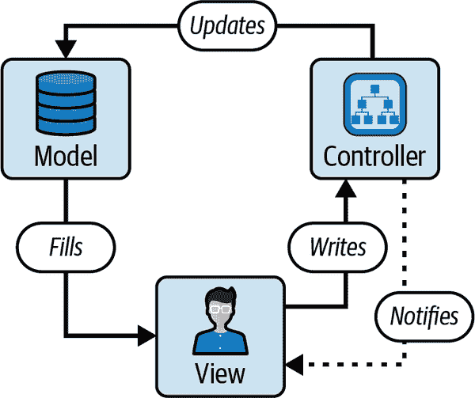
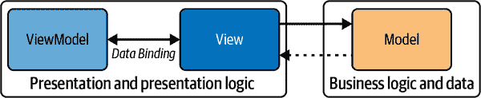
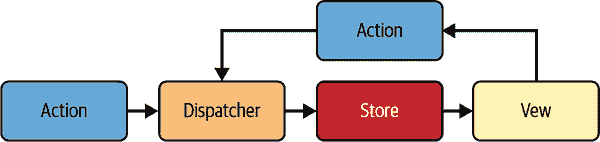

# 第一章：入门级内容

让我们先声明一点：React 被设计成供所有人使用。事实上，你可以一辈子都不读这本书，继续使用 React 而毫无问题！这本书深入探讨 React，适合那些对其基本机制、高级模式和最佳实践感兴趣的人。它更适合了解 React 的工作原理，而不是学习如何使用 React。有很多其他书籍旨在教授用户如何作为终端用户使用 React。相比之下，本书将帮助你了解 React，从库或框架作者的角度，而不是终端用户的角度。为了贯彻这一主题，让我们一起深入挖掘，从最高层开始：高级入门话题。我们将从 React 的基础知识开始，然后深入到 React 工作的细节。

在本章中，我们将讨论 React 存在的原因、它的工作原理以及它解决的问题。我们将介绍它最初的灵感和设计，并从它在 Facebook 起步的谦逊开始，追踪到它如今成为流行解决方案的过程。这一章有点元章节（无双关语），因为在我们深入细节之前了解 React 的背景非常重要。

# 为什么 React 这么重要？

简而言之，答案是：*更新*。在互联网早期，我们有很多静态页面。我们填写表单，点击提交，加载一个全新的页面。这在一段时间内还算可以，但随着网络体验能力的显著增长，我们渴望在网页上获得更出色的用户体验。我们希望能够即时看到页面更新，而不必等待新页面的渲染和加载。我们希望网页和页面感觉更加*迅速*和更加“即时”。然而，问题在于，这些即时更新在*大规模*情况下相当难以实现，原因有几个：

性能

对网页进行更新通常会导致性能瓶颈，因为我们往往会触发浏览器重新计算页面布局（称为回流）并重绘页面。

可靠性

跟踪状态并确保状态在丰富的网页体验中一致是很困难的，因为我们必须在多个地方跟踪状态，并确保所有这些地方的状态保持一致。当多人在同一代码库上工作时，这一点尤其难以做到。

安全性

我们必须确保对注入页面的所有 HTML 和 JavaScript 进行消毒，以防止跨站脚本（XSS）和跨站请求伪造（CSRF）等利用漏洞。

要完全理解和欣赏 React 是如何为我们解决这些问题的，我们需要了解 React 创建的背景以及没有或在 React 之前的世界。让我们现在开始。

# React 之前的世界

在 React 出现之前，对于我们这些构建 Web 应用程序的人来说，这些都是一些大问题。我们必须想办法让应用程序看起来即时响应，同时还要能够扩展到数百万用户并且以安全可靠的方式工作。例如，让我们考虑一个按钮点击的情况：当用户点击按钮时，我们希望更新用户界面以反映按钮已被点击。我们需要考虑用户界面可能处于的至少四种不同状态：

点击前

按钮处于默认状态，尚未被点击。

已点击但待处理

按钮已被点击，但按钮应执行的操作尚未完成。

已点击并成功

按钮已被点击，并且按钮应执行的操作已完成。从这里，我们可能希望将按钮恢复到其点击前的状态，或者我们可能希望按钮变色（绿色）以表示成功。

已点击并失败

按钮已被点击，但按钮应执行的操作失败了。从这里，我们可能希望将按钮恢复到其点击前的状态，或者我们可能希望按钮变色（红色）以表示失败。

一旦我们有了这些状态，我们需要找出如何更新用户界面以反映这些状态。通常情况下，更新用户界面需要以下步骤：

1.  在主机环境（通常是浏览器）中找到按钮，使用某种类型的元素定位器 API，如`document.querySelector`或`document.getElementById`。

1.  将事件侦听器附加到按钮，以监听点击事件。

1.  在响应事件时执行任何状态更新。

1.  当按钮离开页面时，移除事件侦听器并清理任何状态。

这是一个简单的示例，但这是一个很好的起点。假设我们有一个标记为“赞”的按钮，当用户点击它时，我们希望将按钮更新为“已赞”。我们该如何做到这一点？首先，我们会有一个 HTML 元素：

```
<button>Like</button>
```

我们需要一种方法来在 JavaScript 中引用此按钮，因此我们会给它一个`id`属性：

```
<button id="likeButton">Like</button>
```

太棒了！现在有了一个`id`，JavaScript 可以与之配合使其交互。我们可以使用`document.getElementById`获取按钮的引用，然后为按钮添加事件侦听器以监听点击事件：

```
const likeButton = document.getElementById("likeButton");
likeButton.addEventListener("click", () => {
  // do something
});
```

现在我们有了一个事件侦听器，当按钮被点击时我们可以做一些事情。假设我们希望在按钮被点击时将按钮标签更新为“已赞”。我们可以通过更新按钮的文本内容来实现这一点：

```
const likeButton = document.getElementById("likeButton");
likeButton.addEventListener("click", () => {
  likeButton.textContent = "Liked";
});
```

太棒了！现在我们有了一个标签为“赞”的按钮，当它被点击时，它会显示“已赞”。问题在于我们不能“取消赞”。让我们修复这个问题，如果按钮在其“已赞”状态下被点击，我们将更新按钮以再次显示“赞”。我们需要向按钮添加一些状态来跟踪其是否已被点击。我们可以通过向按钮添加一个`data-liked`属性来实现这一点：

```
<button id="likeButton" data-liked="false">Like</button>
```

现在我们有了这个属性，我们可以用它来跟踪按钮是否已被点击。我们可以根据这个属性的值更新按钮的文本内容：

```
const likeButton = document.getElementById("likeButton");
likeButton.addEventListener("click", () => {
  const liked = likeButton.getAttribute("data-liked") === "true";
  likeButton.setAttribute("data-liked", !liked);
  likeButton.textContent = liked ? "Like" : "Liked";
});
```

等等，但我们只是改变按钮的`textContent`！我们并没有真正将“喜欢”的状态保存到数据库中。通常情况下，我们需要通过网络进行通信，就像这样：

```
const likeButton = document.getElementById("likeButton");
likeButton.addEventListener("click", () => {
  var liked = likeButton.getAttribute("data-liked") === "true";

  // communicate over the network
  var xhr = new XMLHttpRequest();
  xhr.open("POST", "/like", true);
  xhr.setRequestHeader("Content-Type", "application/json;charset=UTF-8");

  xhr.onload = function () {
    if (xhr.status >= 200 && xhr.status < 400) {
      // Success!
      likeButton.setAttribute("data-liked", !liked);
      likeButton.textContent = liked ? "Like" : "Liked";
    } else {
      // We reached our target server, but it returned an error
      console.error("Server returned an error:", xhr.statusText);
    }
  };

  xhr.onerror = function () {
    // There was a connection error of some sort
    console.error("Network error.");
  };

  xhr.send(JSON.stringify({ liked: !liked }));
});
```

当然，我们正在使用`XMLHttpRequest`和`var`以保持时间的相关性。React 在 2013 年作为开源软件发布，更常见的`fetch` API 是在 2015 年引入的。在`XMLHttpRequest`和`fetch`之间，我们有 jQuery，通常通过像`$.ajax()`、`$.post()`等原语来抽象一些复杂性。

如果今天我们要编写这个功能，它可能会更像这样：

```
const likeButton = document.getElementById("likeButton");
likeButton.addEventListener("click", () => {
  const liked = likeButton.getAttribute("data-liked") === "true";

  // communicate over the network
  fetch("/like", {
    method: "POST",
    body: JSON.stringify({ liked: !liked }),
  }).then(() => {
    likeButton.setAttribute("data-liked", !liked);
    likeButton.textContent = liked ? "Like" : "Liked";
  });
});
```

不要太偏离主题，现在的重点是我们正在通过网络进行通信，但如果网络请求失败会怎么样？我们需要更新按钮的文本内容来反映失败。我们可以通过向按钮添加`data-failed`属性来实现这一点：

```
<button id="likeButton" data-liked="false" data-failed="false">Like</button>
```

现在，我们可以根据这个属性的值更新按钮的文本内容：

```
const likeButton = document.getElementById("likeButton");
likeButton.addEventListener("click", () => {
  const liked = likeButton.getAttribute("data-liked") === "true";

  // communicate over the network
  fetch("/like", {
    method: "POST",
    body: JSON.stringify({ liked: !liked }),
  })
    .then(() => {
      likeButton.setAttribute("data-liked", !liked);
      likeButton.textContent = liked ? "Like" : "Liked";
    })
    .catch(() => {
      likeButton.setAttribute("data-failed", true);
      likeButton.textContent = "Failed";
    });
});
```

还有一个情况需要处理：当前正在“喜欢”某物的过程。也就是说，挂起状态。要在代码中建模这一点，我们可以通过向按钮添加`data-pending`属性来设置挂起状态，就像这样：

```
<button
  id="likeButton"
  data-pending="false"
  data-liked="false"
  data-failed="false"
>
  Like
</button>
```

现在，如果网络请求正在进行中，我们可以禁用按钮，这样多次点击不会排队进行网络请求，从而导致奇怪的竞态条件和服务器超载。我们可以这样做：

```
const likeButton = document.getElementById("likeButton");
likeButton.addEventListener("click", () => {
  const liked = likeButton.getAttribute("data-liked") === "true";
  const isPending = likeButton.getAttribute("data-pending") === "true";

  likeButton.setAttribute("data-pending", "true");
  likeButton.setAttribute("disabled", "disabled");

  // communicate over the network
  fetch("/like", {
    method: "POST",
    body: JSON.stringify({ liked: !liked }),
  })
    .then(() => {
      likeButton.setAttribute("data-liked", !liked);
      likeButton.textContent = liked ? "Like" : "Liked";
      likeButton.setAttribute("disabled", null);
    })
    .catch(() => {
      likeButton.setAttribute("data-failed", "true");
      likeButton.textContent = "Failed";
    })
    .finally(() => {
      likeButton.setAttribute("data-pending", "false");
    });
});
```

我们还可以利用强大的技术，如去抖动（debouncing）和节流（throttling），以防止用户执行冗余或重复的操作。

###### 注意

顺便说一句，我们提到了去抖动和节流。为了清晰起见，去抖动会延迟函数的执行，直到自上次事件触发以来经过了一段时间（例如，等待用户停止输入以处理输入），而节流会限制函数在设置的时间间隔内最多运行一次，确保它不会执行得太频繁（例如，以设置的间隔处理滚动事件）。这两种技术通过控制函数执行速率来优化性能。

好的，现在我们的按钮有点强大了，可以处理多种状态——但仍然有一些问题需要解决：

+   `data-pending`真的有必要吗？我们不能只检查按钮是否已禁用吗？可能不行，因为禁用按钮可能是由于其他原因，比如用户未登录或没有权限点击按钮。

+   使用`data-state`属性会更合理吗？其中`data-state`可以是`pending`、`liked`或`unliked`之一，而不是这么多其他数据属性？也许吧，但然后我们需要添加一个大的 switch/case 或类似的代码块来处理每种情况。最终，处理两种方法的代码量是不可比的：无论哪种方式，我们仍然会面临复杂性和冗余性。

+   我们如何单独测试这个按钮？我们可以吗？

+   为什么我们首先在 HTML 中写入按钮，然后在 JavaScript 中处理它？如果我们只需使用 `document.createElement('button')` 创建按钮，然后 `document.appendChild(likeButton)`，不是更好吗？这将使测试变得更容易，并使代码更加自包含，但如果其父元素不是 `document`，我们就必须跟踪它的父元素。事实上，我们可能需要跟踪页面上的*所有*父元素。

React 帮助我们解决了其中一些问题，但并非全部问题：例如，如何将状态分解为单独的标志（`isPending`、`hasFailed` 等）或单个状态变量（例如 `state`）的问题，并不是 React 为我们提供答案的问题。这是我们必须自己回答的问题。但是，React 确实帮助我们解决了规模的问题：以一种最小化和高效的方式创建需要交互的大量按钮，并根据事件更新用户界面，并以可测试、可重现、声明性、高性能、可预测和可靠的方式执行这些操作。

此外，React 帮助我们通过完全拥有用户界面的状态并基于该状态进行渲染，使状态变得更加可预测。这与由浏览器拥有和操作的状态形成鲜明对比，浏览器的状态可能由于多种因素（例如在页面上运行的其他客户端脚本、浏览器扩展、设备限制等）而变得不太可靠。

我们的 Like 按钮示例是一个非常简单的例子，但是这是一个很好的开始。到目前为止，我们已经看到如何使用 JavaScript 使按钮交互，但是如果我们想要做得*更好*，这是一个非常手动的过程：我们必须在浏览器中找到按钮，添加事件侦听器，更新按钮的文本内容，并考虑多种边缘情况。这是很多工作，并且不太可扩展。如果页面上有很多按钮怎么办？如果我们有很多需要交互的按钮怎么办？如果我们有很多需要交互的按钮，并且需要根据事件更新用户界面怎么办？我们会使用事件委托（或事件冒泡）并将事件侦听器附加到更高级别的 `document` 吗？还是应该为每个按钮附加事件侦听器？

如前言所述，本书假设我们对这一陈述有了满意的理解：浏览器渲染网页。网页是由 HTML 文档样式化为 CSS，并使用 JavaScript 交互式地进行制作。数十年来，这种方法一直运作良好，现在仍然如此，但是要用这些技术构建现代的 Web 应用程序，以便服务于大量（想象一下，数百万）用户，就需要在安全性和可靠性方面进行相当程度的抽象，以尽可能减少错误的可能性。不幸的是，根据我们一直在探索的 Like 按钮的例子，显然我们需要一些帮助。

让我们考虑另一个稍微复杂一点的例子，比我们的“喜欢”按钮更复杂。我们从一个简单的例子开始：一个项目列表。假设我们有一个项目列表，并且我们希望向列表中添加一个新项目。我们可以使用一个类似下面的 HTML 表单来做到这一点：

```
<ul id="list-parent"></ul>

<form id="add-item-form" action="/api/add-item" method="POST">
  <input type="text" id="new-list-item-label" />
  <button type="submit">Add Item</button>
</form>
```

JavaScript 让我们可以访问文档对象模型（DOM）API。对于不了解的人来说，DOM 是网页文档结构的内存模型：它是表示页面元素的对象树，通过 JavaScript 可以与它们进行交互。问题是，用户设备上的 DOM 就像是一个外星行星：我们不知道他们使用的浏览器、网络条件以及操作系统（OS）。结果是什么呢？我们必须编写能够适应所有这些因素的代码。

正如我们讨论过的，当更新应用程序状态时，如果没有某种状态协调机制来跟踪事务，应用程序状态变得非常难以预测。继续以我们的列表示例为例，让我们考虑一些 JavaScript 代码来向列表中添加新项目：

```
(function myApp() {
  var listItems = ["I love", "React", "and", "TypeScript"];
  var parentList = document.getElementById("list-parent");
  var addForm = document.getElementById("add-item-form");
  var newListItemLabel = document.getElementById("new-list-item-label");

  addForm.onsubmit = function (event) {
    event.preventDefault();
    listItems.push(newListItemLabel.value);
    renderListItems();
  };

  function renderListItems() {
    for (i = 0; i < listItems.length; i++) {
      var el = document.createElement("li");
      el.textContent = listItems[i];
      parentList.appendChild(el);
    }
  }

  renderListItems();
})();
```

这段代码片段是为了尽可能看起来与早期的 Web 应用程序相似。为什么随着时间的推移会变得一团糟？主要是因为构建旨在随时间推移扩展的应用程序会带来一些问题，使它们成为“步枪脚”，这样做会：

容易出错

`addForm` 的 `onsubmit` 属性可以轻松被页面上的其他客户端 JavaScript 重写。我们可以改用 `addEventListener`，但这会带来更多问题：

+   我们应该在何时何地使用 `removeEventListener` 进行清理呢？

+   如果我们不小心会积累大量的事件侦听器吗？

+   因此我们会支付什么样的代价？

+   事件委托如何适应其中？

不可预测

我们的真相来源混杂：我们在 JavaScript 数组中保存列表项，但依赖于 DOM 中存在的元素（如具有 `id="list-parent"` 的元素）来完成我们的应用程序。由于 JavaScript 和 HTML 之间的这些相互依赖，我们还需要考虑一些其他因素：

+   如果错误地存在多个具有相同 `id` 的元素会怎么样？

+   如果元素根本不存在会怎样？

+   如果它不是 `ul` 呢？我们能否将列表项 (`li` 元素) 添加到其他父元素中？

+   如果我们使用类名而不是 ID 呢？

    我们的真相来源混杂在 JavaScript 和 HTML 之间，真相不可靠。我们更希望有一个单一的真相来源。此外，客户端 JavaScript 经常向 DOM 添加和删除元素。如果我们依赖于这些特定元素的存在，我们的应用程序就无法保证可靠地工作，因为 UI 不断更新。在这种情况下，我们的应用程序充满了“副作用”，其成功或失败取决于一些用户关注的问题。React 通过提倡受函数式编程启发的模型来解决了这个问题，其中副作用被有意标记和隔离。

效率低下

`renderListItems` 依次在屏幕上呈现项目。每次 DOM 的变化可能在计算上是昂贵的，特别是在涉及布局移动和重排的情况下。因为我们在一个未知计算能力的外星球上，对于大型列表来说这可能相当危险。请记住，我们打算的大规模 Web 应用将被全球数百万用户使用，包括那些来自世界各地社区、没有最新和最好的 Apple M3 Max 处理器的低功率设备用户。在这种情况下，与其每次单个列表项的顺序更新 DOM，也许更理想的是以某种方式批处理这些操作，并同时应用于 DOM。但也许对我们作为工程师来说这并不值得，因为也许浏览器最终会更新它们处理 DOM 的方式，并自动为我们批处理事务。

这些都是在 React 和其他抽象出现之前多年来困扰 Web 开发者的问题。以可维护、可重用和可预测的方式打包代码，在行业中没有太多标准化的共识，一直是一个问题。当时许多 Web 公司都分享了创建可靠和可伸缩用户界面的痛苦。正是在这个时候，我们看到了多种基于 JavaScript 的解决方案的兴起：Backbone、KnockoutJS、AngularJS 和 jQuery。让我们依次看看这些解决方案是如何解决这个问题的。这将帮助我们理解 React 如何与这些解决方案不同，甚至可能比它们更优秀。

## jQuery

让我们探索如何使用比 React 更早的工具解决这些问题，从而了解为什么 React 如此重要。我们将从 jQuery 开始，并通过重新访问之前的“点赞”按钮示例来做到这一点。

概括地说，我们在浏览器中有一个“点赞”按钮，我们希望使其交互：

```
<button id="likeButton">Like</button>
```

使用 jQuery，我们像之前一样为其添加“点赞”行为，如下所示：

```
$("#likeButton").on("click", function () {
  this.prop("disabled", true);
  fetch("/like", {
    method: "POST",
    body: JSON.stringify({ liked: this.text() === "Like" }),
  })
    .then(() => {
      this.text(this.text() === "Like" ? "Liked" : "Like");
    })
    .catch(() => {
      this.text("Failed");
    })
    .finally(() => {
      this.prop("disabled", false);
    });
});
```

从这个例子中，我们观察到我们正在将数据绑定到用户界面，并使用这些数据绑定来直接更新用户界面。作为一种工具，jQuery 在直接操作用户界面方面非常活跃。

jQuery 以一种高度“副作用”的方式运行，不断地与并修改其控制范围外的状态交互。我们说这是“副作用”，因为它允许从代码的任何位置，包括其他导入的模块甚至远程脚本执行，直接和全局地修改页面结构！这可能导致行为不可预测和交互复杂，难以跟踪和理解，因为页面的一个部分的更改可能以不可预见的方式影响其他部分。这种分散和无结构的操作使得代码难以维护和调试。

现代框架通过提供结构化、可预测的方式更新 UI，而无需直接操作 DOM 来解决这些问题。这种模式在当时很常见，但难以推理和测试，因为代码周围的应用状态——即与代码相邻的应用状态——在不断变化。在某个时刻，我们不得不停下来问自己：“当前浏览器中应用的状态是什么？”——随着我们的应用程序复杂性的增加，这个问题的答案变得越来越困难。

此外，使用 jQuery 的按钮很难进行测试，因为它只是一个事件处理程序。如果我们要编写一个测试，它将如下所示：

```
test("LikeButton", () => {
  const $button = $("#likeButton");
  expect($button.text()).toBe("Like");
  $button.trigger("click");
  expect($button.text()).toBe("Liked");
});
```

唯一的问题是在测试环境中`$('#likeButton')`返回`null`，因为它不是一个真实的浏览器。我们需要模拟浏览器环境来测试这段代码，这是很多工作。这是 jQuery 的一个常见问题：它很难测试，因为很难隔离其添加的行为。jQuery 还严重依赖于浏览器环境。此外，jQuery 与浏览器共享用户界面的所有权，这使得推理和测试变得困难：浏览器拥有界面，而 jQuery 只是一个客人。这种与“单向数据流”范式的偏离是当时库常见的问题。

随着 Web 的发展和对更强大、可扩展解决方案需求的逐渐明显，jQuery 开始失去其流行性。虽然 jQuery 仍然在许多生产应用中使用，但它不再是构建现代 Web 应用的首选解决方案。以下是 jQuery 失宠的一些原因：

体积和加载时间

jQuery 的一个显著批评点是其体积过大。将完整的 jQuery 库集成到 Web 项目中会增加额外的负担，尤其是对于追求快速加载时间的网站来说，这一点尤为明显。在当前移动浏览的时代，许多用户可能处于较慢或有限的数据连接状态，每个千字节都至关重要。因此，整个 jQuery 库的包含可能会对移动用户的性能和体验产生负面影响。

在 React 出现之前的一种常见做法是为类似 jQuery 和 Mootools 的库提供配置器，用户可以选择他们想要的功能。虽然这有助于减少代码量，但它确实增加了开发者需要做出的决策的复杂性，并增加了整体开发工作流程的复杂性。

现代浏览器的冗余

当 jQuery 首次出现时，它解决了许多浏览器之间的不一致性，并为开发者提供了一个统一的方式来处理这些差异，从而在选择和修改浏览器中的元素时。随着 Web 的发展，Web 浏览器也在发展。许多使 jQuery 成为必备的特性，如一致的 DOM 操作或围绕数据获取的网络导向功能，现代浏览器现在都原生支持并保持一致。在当代 Web 开发中为这些任务使用 jQuery 可以被视为多余，增加了不必要的复杂性。

例如，`document.querySelector` 可轻松替代 jQuery 内置的 `$` 选择器 API。

性能考虑

尽管 jQuery 简化了许多任务，但通常以性能为代价。随着每个浏览器版本的提升，本机运行级别的 JavaScript 方法也在改进，因此在某些情况下可能比其 jQuery 等效方法执行更快。对于小型项目，这种差异可能微不足道。然而，在更大更复杂的 Web 应用程序中，这些复杂性可能会积累，导致明显的卡顿或响应速度降低。

因此，尽管 jQuery 在 Web 发展中起到了重要作用并简化了开发者面临的许多挑战，但现代 Web 环境提供了原生解决方案，这些解决方案通常使 jQuery 的影响力减弱。作为开发者，我们需要权衡 jQuery 的便利性和潜在的缺点，特别是在当前 Web 项目的背景下。

尽管 jQuery 有其缺点，但它在当时绝对革命了我们与 DOM 交互的方式。以至于出现了其他使用 jQuery 但增加了可预测性和可重用性的库。其中一个就是 Backbone，它试图解决 React 今天解决的同样问题，只不过比 React 早得多。让我们深入探讨一下。

## Backbone

Backbone，在 2010 年代初开发，是我们在 React 出现之前探索的问题的第一个解决方案之一：浏览器和 JavaScript 之间的状态不一致，代码重用性，可测试性等等。它是一个优雅简洁的解决方案：一个提供创建“模型”和“视图”方式的库。Backbone 对传统的 MVC（模型-视图-控制器）模式有自己的理解（见图 1-1）。让我们稍微了解一下这种模式，以帮助我们理解 React 并形成更高质量的讨论的基础。



###### 图 1-1\. 传统 MVC 模式

### MVC 模式

MVC 模式是一种设计理念，将软件应用程序划分为三个相互连接的组件，以将信息的内部表示与其向用户呈现或接受的方式分离。以下是详细解析：

模型

模型负责应用程序的数据和业务规则。模型不知道视图和控制器，确保业务逻辑与用户界面隔离。

视图

视图代表应用程序的用户界面。它将模型中的数据显示给用户，并将用户命令发送给控制器。视图是被动的，意味着它等待模型提供要显示的数据，不直接获取或保存数据。视图也不单独处理用户交互，而是将这一责任委托给下一个组件：控制器。

控制器

控制器充当模型（Model）和视图（View）之间的接口。它从视图获取用户输入，处理它（可能更新模型），然后将输出显示返回给视图。控制器解耦了模型和视图，使系统架构更加灵活。

MVC 模式的主要优势在于关注点分离，即业务逻辑、用户界面和用户输入被分离到代码库的不同部分。这不仅使应用程序更加模块化，而且更易于维护、扩展和测试。MVC 模式在 Web 应用程序中被广泛使用，许多框架如 Django、Ruby on Rails 和 ASP.NET MVC 都内置支持该模式。

多年来，MVC 模式一直是软件设计的重要模式，特别是在 Web 开发中。然而，随着 Web 应用程序的发展和用户对交互性和动态界面的期望增长，传统 MVC 的一些局限性变得显而易见。这就是 MVC 可能不足的地方，以及 React 如何解决这些挑战：

复杂的交互和状态管理

传统的 MVC 架构在处理具有许多交互元素的复杂用户界面时通常会遇到困难。随着应用程序的增长，管理状态变化及其对 UI 各个部分的影响可能变得笨重，因为控制器堆积，有时可能会与其他控制器发生冲突，某些控制器控制的视图并不代表它们自身，或者 MVC 组件的分离在产品代码中并不准确。

React 以其基于组件的架构和虚拟 DOM，通过将 UI 组件视为函数来简化对状态变化及其对 UI 的影响的推理过程。这种思维模型大大简化了 MVC 模式，因为函数在 JavaScript 中是非常普遍的，而且比起不是编程语言本身的外部思维模型来说更易接近。

双向数据绑定

一些 MVC 框架使用双向数据绑定，如果不小心管理，可能会导致意外的副作用，有时视图与模型之间或者反之之间会不同步。此外，双向数据绑定还涉及数据所有权的问题，答案往往比较简单，对关注点的分离不够清晰。特别是因为虽然 MVC 是一个对于完全理解其用例中如何分离关注点的团队来说被证明有效的模型，但是这些分离规则往往不被强制执行，特别是在高速输出和快速启动增长的情况下，这使得关注点分离，MVC 的最大优势之一，经常因缺乏执行而成为弱点。

React 则利用了一种与双向数据绑定相对的模式，称为“单向数据流”（稍后将详细讨论），通过像 Forget 这样的系统优先甚至强制实现了系统中的单向数据流。这些方法使得 UI 更新更加可预测，使我们能够更清晰地分离关注点，并最终有利于高速增长的软件团队。

紧耦合

在某些 MVC 实现中，模型（Model）、视图（View）和控制器（Controller）可能会紧密耦合，这样一来，如果要修改或重构其中一个，就很难不影响到其他部分。React 鼓励更加模块化和解耦的方法，采用其基于组件的模型，支持将依赖项与其 UI 表示靠近并互相支持。

对于这种模式的细节我们不需要深入讨论，因为这是一本关于 React 的书。但在这里，从我们的意图和目的来看，模型概念上是数据源，视图则是消耗和渲染这些数据的用户界面。Backbone 提供了便捷的 API 来处理这些模型和视图，并提供了一种连接模型和视图的方式。在其时间内，这种解决方案非常强大和灵活。它也是一种可扩展使用的解决方案，允许开发者在隔离环境中测试他们的代码。

作为例子，这里是我们早前的按钮示例，这次使用的是 Backbone：

```
const LikeButton = Backbone.View.extend({
  tagName: "button",
  attributes: {
    type: "button",
  },
  events: {
    click: "onClick",
  },
  initialize() {
    this.model.on("change", this.render, this);
  },
  render() {
    this.$el.text(this.model.get("liked") ? "Liked" : "Like");
    return this;
  },
  onClick() {
    fetch("/like", {
      method: "POST",
      body: JSON.stringify({ liked: !this.model.get("liked") }),
    })
      .then(() => {
        this.model.set("liked", !this.model.get("liked"));
      })
      .catch(() => {
        this.model.set("failed", true);
      })
      .finally(() => {
        this.model.set("pending", false);
      });
  },
});

const likeButton = new LikeButton({
  model: new Backbone.Model({
    liked: false,
  }),
});

document.body.appendChild(likeButton.render().el);
```

注意`LikeButton`是如何扩展`Backbone.View`的，以及它有一个返回`this`的`render`方法？我们将继续在 React 中看到类似的`render`方法，但我们不要过早地为此感到激动。此外，值得注意的是，Backbone 并没有为`render`方法提供实际的实现。而是通过 jQuery 手动变异 DOM，或者使用像 Handlebars 这样的模板系统。

Backbone 提供了一个可链接的 API，允许开发者将逻辑放置在对象的属性中。与我们之前的例子相比较，我们可以看到 Backbone 显著改进了创建交互式按钮并在响应事件时更新用户界面的舒适度。

它还以更结构化的方式通过将逻辑组合在一起来执行此操作。还要注意，Backbone 通过将其更容易接近以测试此按钮，因为我们可以创建一个`LikeButton`实例，然后调用其`render`方法来测试它。

我们这样测试这个组件：

```
test("LikeButton initial state", () => {
  const likeButton = new LikeButton({
    model: new Backbone.Model({
      liked: false, // Initial state set to not liked
    }),
  });
  likeButton.render(); // Ensure render is called to reflect the initial state
  // Check the text content to be "Like" reflecting the initial state
  expect(likeButton.el.textContent).toBe("Like");
});
```

我们甚至可以测试按钮在其状态改变后的行为，例如点击事件的情况：

```
test("LikeButton", async () => {
  // Mark the function as async to handle promise
  const likeButton = new LikeButton({
    model: new Backbone.Model({
      liked: false,
    }),
  });
  expect(likeButton.render().el.textContent).toBe("Like");

  // Mock fetch to prevent actual HTTP request
  global.fetch = jest.fn(() =>
    Promise.resolve({
      json: () => Promise.resolve({ liked: true }),
    })
  );

  // Await the onClick method to ensure async operations are complete
  await likeButton.onClick();

  expect(likeButton.render().el.textContent).toBe("Liked");

  // Optionally, restore fetch to its original implementation if needed
  global.fetch.mockRestore();
});
```

因此，Backbone 在当时是一个非常流行的解决方案。另一种选择是编写大量代码，这些代码很难测试和理解，没有保证代码能够以可靠的方式按预期工作。因此，Backbone 是一个非常受欢迎的解决方案。尽管在早期因其简单性和灵活性而广受欢迎，但它并非没有批评。以下是与 Backbone.js 相关的一些负面因素：

冗长和样板代码

Backbone.js 经常受到批评的一个原因是开发人员需要编写大量样板代码。对于简单的应用程序，这可能不是大问题，但随着应用程序的增长，样板代码也会增加，导致潜在的冗余和难以维护的代码。

缺乏双向数据绑定

与其同时代的一些框架不同，Backbone.js 没有提供内置的双向数据绑定。这意味着如果数据变化，DOM 不会自动更新，反之亦然。开发人员通常需要编写自定义代码或使用插件来实现这种功能。

事件驱动架构

模型数据的更新可能会触发应用程序中的大量事件。这种事件级联可能变得难以管理，导致情况不明确，即改变单个数据片段如何影响整个应用程序，使得调试和维护变得困难。为了解决这些问题，开发人员经常需要使用谨慎的事件管理实践，以防止更新的涟漪效应遍布整个应用程序。

缺乏可组合性

Backbone.js 缺乏内置功能以轻松嵌套视图，这使得组合复杂用户界面变得困难。相比之下，React 通过 children 属性允许无缝嵌套组件，使得构建复杂的 UI 层次结构变得简单得多。Marionette.js 作为 Backbone 的扩展，试图解决一些这些组合问题，但它没有提供像 React 的组件模型那样集成的解决方案。

尽管 Backbone.js 面临一些挑战，但重要的是要记住，没有工具或框架是完美的。最佳选择通常取决于项目的具体需求和开发团队的偏好。还值得注意的是，Web 开发工具如何依赖于强大的社区以蓬勃发展，不幸的是，Backbone.js 在近年来的流行度有所下降，特别是随着 React 的出现。有人会说 React 击败了它，但我们现在暂且不作评价。

## KnockoutJS

让我们将这种方法与当时流行的另一种解决方案：KnockoutJS 进行比较。KnockoutJS 在 2010 年代初开发，是一个提供创建“可观察对象”和“绑定”的库，利用依赖跟踪来处理状态变化。

KnockoutJS 可能是最早的反应式 JavaScript 库之一，其中反应性被定义为在可观察的方式下响应状态变化的值更新。这种风格的反应性的现代版本有时被称为“信号”，并且在诸如 Vue.js、SolidJS、Svelte、Qwik、现代 Angular 等库中很常见。我们在 第十章 中会更详细地讨论这些内容。

观察者概念上是数据源，绑定是概念上的用户界面，用于消费和渲染这些数据：观察者就像模型，而绑定则像视图。

然而，作为我们之前讨论的 MVC 模式的一种演变，KnockoutJS 更多地按照模型-视图-视图模型或 MVVM 风格的模式工作（参见 图 1-2）。让我们更详细地了解这种模式。



###### 图 1-2\. MVVM 模式

### MVVM 模式

MVVM 模式是一种在具有丰富用户界面的应用程序中特别流行的架构设计模式，例如那些使用 WPF 和 Xamarin 等平台构建的应用程序。MVVM 是传统模型-视图-控制器（MVC）模式的一种演变，专门针对现代 UI 开发平台，其中数据绑定是一个突出的特性。以下是 MVVM 组件的详细介绍：

模型

+   表示应用程序的数据和业务逻辑。

+   负责检索、存储和处理数据。

+   通常与数据库、服务或其他数据源和操作通信。

+   不知道视图和视图模型。

视图

+   表示应用程序的用户界面。

+   向用户显示信息并接收用户输入。

+   在 MVVM 中，视图是被动的，不包含任何应用程序逻辑。相反，它通过数据绑定机制声明性地绑定到 ViewModel，通过自动反映更改。

视图模型

+   充当模型和视图之间的桥梁。

+   提供数据和命令供视图绑定。这里的数据通常是一个已经准备好显示的格式。

+   处理用户输入，通常通过命令模式。

+   包含展示逻辑，并将模型中的数据转换为可以被视图轻松显示的格式。

+   值得注意的是，ViewModel 不知道具体使用它的视图，从而实现了解耦的架构。

MVVM 模式的关键优势是关注点分离，类似于 MVC，这导致：

可测试性

ViewModel 与 View 的解耦使得更容易为展示逻辑编写单元测试，而无需涉及 UI。

可重用性

ViewModel 可以在不同的视图或平台上重用。

可维护性

通过清晰的分离，更容易管理、扩展和重构代码。

数据绑定

该模式在支持数据绑定的平台上表现突出，减少了更新 UI 所需的样板代码量。

由于我们讨论了 MVC 和 MVVM 模式，让我们快速对比它们，以便我们可以理解它们之间的区别（参见表 1-1）。

表 1-1\. MVC 和 MVVM 模式的比较

| 标准 | MVC | MVVM |
| --- | --- | --- |
| **主要目的** | 主要用于 Web 应用程序，将用户界面与逻辑分离。 | 专为富 UI 应用程序量身定制，特别是具有双向数据绑定的桌面或单页应用程序。 |
| **组件** | 模型：数据和业务逻辑。视图：用户界面。控制器：管理用户输入，更新视图。 | 模型：数据和业务逻辑。视图：用户界面元素。视图模型：模型与视图之间的桥梁。 |
| **数据流** | 用户输入由控制器管理，更新模型，然后更新视图。 | 视图直接绑定到视图模型。视图中的更改会自动反映在视图模型中，反之亦然。 |
| **解耦** | 视图通常与控制器紧密耦合。 | 视图模型具有高解耦性，因为它不知道使用它的具体视图。 |
| **用户交互** | 由控制器处理。 | 通过视图模型中的数据绑定和命令处理。 |
| **平台适用性** | 在 Web 应用程序开发中常见（例如 Ruby on Rails，Django，ASP.NET MVC）。 | 适合支持强大数据绑定的平台（例如 WPF，Xamarin）。 |

从这个简要比较中，我们可以看出 MVC 和 MVVM 模式之间真正的区别在于耦合和绑定：在没有控制器介入的模型和视图之间，数据的所有权更清晰，更接近用户。React 通过其单向数据流进一步改进了 MVVM 模式，稍后我们将讨论这一点，通过使状态由需要的特定组件拥有来实现*更窄*的数据所有权。现在，让我们回到 KnockoutJS 以及它如何与 React 相关。

KnockoutJS 导出了用于处理这些可观察对象和绑定的 API。让我们看看如何在 KnockoutJS 中实现喜欢按钮。这将帮助我们更好地理解“为什么选择 React”。这是我们按钮的 KnockoutJS 版本：

```
function createViewModel({ liked }) {
  const isPending = ko.observable(false);
  const hasFailed = ko.observable(false);
  const onClick = () => {
    isPending(true);
    fetch("/like", {
      method: "POST",
      body: JSON.stringify({ liked: !liked() }),
    })
      .then(() => {
        liked(!liked());
      })
      .catch(() => {
        hasFailed(true);
      })
      .finally(() => {
        isPending(false);
      });
  };
  return {
    isPending,
    hasFailed,
    onClick,
    liked,
  };
}

ko.applyBindings(createViewModel({ liked: ko.observable(false) }));
```

在 KnockoutJS 中，“视图模型”是一个 JavaScript 对象，它包含我们使用`data-bind`属性绑定到页面各个元素的键和值。在 KnockoutJS 中没有“组件”或“模板”，只有一个视图模型和一种将其绑定到浏览器元素的方法。

我们的函数`createViewModel`是如何在 Knockout 中创建视图模型的。然后，我们使用`ko.applyBindings`将视图模型连接到主机环境（浏览器）。`ko.applyBindings`函数接受一个视图模型，并找到所有具有`data-bind`属性的浏览器元素，Knockout 使用这些属性将它们绑定到视图模型上。

浏览器中的一个按钮将绑定到此视图模型的属性，如下所示：

```
<button
  data-bind="click: onClick, text: liked ? 'Liked' : isPending ? [...]
></button>
```

请注意，出于简化的原因，此代码已被截断。

我们使用我们的`createViewModel`函数将 HTML 元素绑定到我们创建的“视图模型”，网站变得交互式。正如您可以想象的那样，显式订阅可观察对象的更改，然后根据这些更改更新用户界面是一项繁重的工作。KnockoutJS 在当时是一个很棒的库，但它也需要大量样板代码来完成工作。

此外，视图模型通常变得非常庞大和复杂，这导致了对重构和代码优化的不确定性逐渐增加。最终，我们得到了冗长的单块视图模型，难以测试和理解。尽管如此，KnockoutJS 在当时非常流行，并且是一个很棒的库。它也相对容易在隔离环境中进行测试，这是一个重大的优势。

为了记录下来，这是我们如何在 KnockoutJS 中测试这个按钮的方法：

```
test("LikeButton", () => {
  const viewModel = createViewModel({ liked: ko.observable(false) });
  expect(viewModel.liked()).toBe(false);
  viewModel.onClick();
  expect(viewModel.liked()).toBe(true);
});
```

## AngularJS

AngularJS 是由 Google 在 2010 年开发的。它是一个开创性的 JavaScript 框架，对 Web 开发格局产生了重大影响。它与我们讨论过的库和框架形成鲜明对比，通过整合几个创新功能，这些功能的波及效应可以在后续的库中看到，包括 React。通过详细比较 AngularJS 与其他库，并查看其关键特性，让我们试图理解它为 React 铺平的道路。

### 双向数据绑定

双向数据绑定是 AngularJS 的一个显著特性，极大地简化了 UI 与底层数据之间的交互。如果模型（底层数据）发生变化，视图（UI）会自动更新以反映这些变化，反之亦然。这与像 jQuery 这样的库形成了鲜明对比，后者需要开发人员手动操作 DOM 来反映数据的任何变化，并捕获用户输入以更新数据。

让我们考虑一个简单的 AngularJS 应用程序，其中双向数据绑定发挥了关键作用：

```
<!DOCTYPE html>
<html>
  <head>
    <script
    src="https://ajax.googleapis.com/ajax/libs/angularjs/1.8.2/angular.min.js">
    </script>
  </head>
  <body ng-app="">
    <p>Name: <input type="text" ng-model="name" /></p>
    <p ng-if="name">Hello, {{name}}!</p>
  </body>
</html>
```

在这个应用程序中，`ng-model`指令将输入字段的值绑定到变量`name`。当您在输入字段中输入时，模型`name`会更新，并且视图——在这种情况下是问候语`"Hello, {{name}}!"`——会实时更新。

### 模块化架构

AngularJS 引入了一种模块化架构，允许开发人员逻辑上分离其应用程序的组件。每个模块可以封装一个功能，并可以独立开发、测试和维护。有人会称之为 React 组件模型的前身，但这有争议。

这是一个快速的例子：

```
var app = angular.module("myApp", [
  "ngRoute",
  "appRoutes",
  "userCtrl",
  "userService",
]);

var userCtrl = angular.module("userCtrl", []);
userCtrl.controller("UserController", function ($scope) {
  $scope.message = "Hello from UserController";
});

var userService = angular.module("userService", []);
userService.factory("User", function ($http) {
  //...
});
```

在上面的例子中，`myApp`模块依赖于几个其他模块：`ngRoute`、`appRoutes`、`userCtrl`和`userService`。每个依赖模块可以在自己的 JavaScript 文件中，并且可以与主`myApp`模块分开开发。这个概念与 jQuery 和 Backbone.js 显著不同，后者在这种意义上没有“模块”的概念。

我们使用一种称为*依赖注入*的模式将这些依赖项（`appRoutes`、`userCtrl` 等）注入到我们的根 `app` 中。毋庸置疑，这种模式在 JavaScript 模块标准化之前很流行。从那时起，`import` 和 `export` 语句迅速取代了它。为了与 React 组件对比这些依赖项，让我们再多谈一点关于依赖注入。

### 依赖注入

依赖注入（DI）是一种设计模式，对象接收其依赖项而不是创建它们。AngularJS 在其核心引入了这一设计模式，这在当时并不是其他 JavaScript 库的常见特性。这对模块和组件的创建和管理产生了深远影响，推动了更高的模块化和可重用性。

下面是 AngularJS 中 DI 如何工作的一个例子：

```
var app = angular.module("myApp", []);

app.controller("myController", function ($scope, myService) {
  $scope.greeting = myService.sayHello();
});

app.factory("myService", function () {
  return {
    sayHello: function () {
      return "Hello, World!";
    },
  };
});
```

在这个示例中，`myService` 是一个通过 DI 注入到 `myController` 控制器中的服务。控制器不需要知道如何创建这个服务。它只需声明服务作为依赖项，AngularJS 负责创建和注入它。这简化了依赖管理，增强了组件的可测试性和可重用性。

### 与 Backbone.js 和 Knockout.js 的比较

在 AngularJS 推出时，Backbone.js 和 Knockout.js 是两个流行的库。这两个库都有各自的优势，但它们缺少 AngularJS 内置的一些功能。

例如，Backbone.js 给开发者更多的代码控制权，并且比 AngularJS 更少地表达了观点。这种灵活性既是优势也是劣势：它允许更多的定制化，但也需要更多的样板代码。AngularJS 利用其双向数据绑定和依赖注入，提供了更多的结构。它有更多的观点，促进了开发速度的增长：这是我们在现代框架如 Next.js、Remix 等中看到的。这是 AngularJS 遥遥领先于其时代的一种方式。

Backbone 也没有直接处理视图（DOM）的变化，通常将其留给开发者处理。AngularJS 利用其双向数据绑定来处理 DOM 变化，这是一个重大优势。

Knockout.js 主要关注数据绑定，并且缺少 AngularJS 提供的一些其他强大工具，比如 DI 和模块化架构。作为一个全面的框架，AngularJS 为构建单页应用程序（SPA）提供了更全面的解决方案。尽管 AngularJS 已经停止开发，但今天其更新的变种 Angular 提供了相同甚至增强的全面优势，使其成为大规模应用的理想选择。

### AngularJS 的权衡

AngularJS（1.x）在引入时代表了 Web 开发实践的重大飞跃。然而，随着 Web 开发领域的快速演变，AngularJS 的某些方面被视为限制或弱点，导致其相对衰退。其中一些包括：

性能

AngularJS 在大规模应用程序中存在性能问题，特别是在复杂数据绑定的情况下。AngularJS 中的脏检查循环（digest cycle）作为变更检测的核心特性，可能导致大型应用程序中更新缓慢和用户界面延迟。双向数据绑定虽然在许多情况下创新和有用，但也导致了性能问题。

复杂性

AngularJS 引入了一系列新概念，包括指令、控制器、服务、依赖注入、工厂等。虽然这些特性使 AngularJS 强大，但也使其复杂且难以学习，特别是对于初学者。例如，“这应该是一个工厂还是一个服务？”是一个常见的争论，让许多开发团队感到困惑。

到 Angular 2+ 的迁移问题

当 Angular 2 宣布时，它与 AngularJS 1.x 不兼容，并要求使用 Dart 和/或 TypeScript 编写代码。这意味着开发人员必须重写大部分代码以升级到 Angular 2，这被视为一大障碍。Angular 2+ 的引入实质上分裂了 Angular 社区，引发混乱，也为 React 开辟了道路。

模板中的复杂语法

AngularJS 允许在模板属性中使用复杂的 JavaScript 表达式，例如 `on-click="$ctrl.some.deeply.nested.field = 123"`，这种做法会导致呈现和业务逻辑混合在标记中，因而具有挑战性，使得解析和管理这些交织的代码变得繁琐。此方法在可维护性上带来了挑战。

此外，调试更加困难，因为模板层并非设计用来处理复杂逻辑，而且从这些内联表达式引起的任何错误可能难以定位和解决。此外，这样的做法违反了关注点分离原则，这是一种基本的设计哲学，提倡在应用程序的不同方面进行明确处理，以提高代码质量和可维护性。

理论上，模板应该调用控制器方法执行更新，但没有限制这样做。

缺乏类型安全

AngularJS 中的模板无法与 TypeScript 等静态类型检查器配合工作，这使得在开发过程的早期阶段难以及时捕获错误。这是一个重大缺陷，特别是对于大规模应用程序，其中类型安全对于可维护性和可扩展性至关重要。

`$scope` 模型令人困惑

在 AngularJS 中，由于其在绑定数据和在不同上下文中的行为中的角色，`$scope`对象经常被发现是混淆的根源，因为它充当视图和控制器之间的粘合剂，但其行为并不总是直观或可预测的。

这导致了复杂性，特别是对于新手来说，在理解数据在模型和视图之间如何同步方面。此外，`$scope`在嵌套控制器中可以继承来自父作用域的属性，这使得跟踪特定`$scope`属性最初是在哪里定义或修改变得困难。

这种继承可能会导致应用程序中意外的副作用，特别是在处理父子作用域可以无意中相互影响的嵌套作用域时。作用域层次结构的概念及其基础的原型继承往往与 JavaScript 中更传统和熟悉的词法作用域规则相矛盾，增加了学习复杂性的另一层面。

例如，React 将状态与需要它的组件放置在一起，因此完全避免了这个问题。

有限的开发工具

与 React 的 DevTools（例如 Replay.io）相比，AngularJS 并未提供丰富的开发工具用于调试和性能分析，尤其是在支持 React 应用程序的时间旅行调试方面。

# 进入 React

大约在这个时候，React 开始崭露头角。React 提出的核心思想之一是基于组件的架构。尽管实现方式不同，但其潜在思想相似：通过组合可重用组件来构建 Web 和其他平台的用户界面是最佳选择。

虽然 AngularJS 使用指令将视图绑定到模型，React 引入了 JSX 和一个根本上更简单的组件模型。然而，如果没有 AngularJS 通过 Angular 模块推广组件化架构奠定的基础，一些人可能会认为转向 React 模型的过程可能不会那么顺利。

在 AngularJS 中，双向数据绑定模型是行业标准；然而，它也有一些缺点，例如在大型应用程序上可能存在性能问题。React 从中吸取教训，并引入了单向数据流模式，使开发人员更能控制他们的应用程序，并更容易理解数据随时间的变化。

正如我们将在第三章中了解的那样，React 还引入了虚拟 DOM 的概念，通过最小化直接 DOM 操作来提高性能。另一方面，AngularJS 通常直接操作 DOM，这可能导致性能问题以及我们最近通过 jQuery 讨论的其他不一致状态问题。

话虽如此，AngularJS 代表了网页开发实践的重大转变。如果不提到 AngularJS，我们就会遗漏掉一个重要的点：当 AngularJS 推出时，它不仅革新了网页开发的格局，还为未来的框架和库的发展铺平了道路，其中包括 React。

让我们探讨一下 React 如何融入这一切，以及在历史的这一时刻 React 是如何诞生的。在当时，UI 的更新仍然是一个相对困难且尚未解决的问题。即使今天也远未完全解决，但 React 显著降低了这一难度，并启发了像 SolidJS、Qwik 等其他库去解决这些问题。Meta 的 Facebook 也不例外，面对 UI 复杂性和规模问题。因此，Meta 开发了一些内部解决方案，与当时已存在的解决方案互补。其中最早的是 BoltJS：这是一个工具，Facebook 的工程师称之为“将一堆喜欢的东西拼凑在一起”。组合了一系列工具，使得对 Facebook 网页用户界面的更新更加直观。

大约在这个时候，Facebook 的工程师 Jordan Walke 提出了一个激进的想法，打破了当时的现状，完全用新的部分替换了网页更新时的最小部分。正如我们之前看到的，JavaScript 库通过一种称为双向数据绑定的范式管理视图（用户界面）和模型（概念上的数据源）之间的关系。鉴于这种模型的局限性，正如我们之前讨论过的，Jordan 的想法是使用一种称为单向数据流的范式。这是一个简单得多的范式，更容易保持视图和模型的同步。这就是 React 诞生的单向架构的基础。

## React 的价值主张

好了，历史课结束了。希望现在我们有足够的背景来开始理解为什么 React 存在了。考虑到在规模上轻易陷入不安全、不可预测和低效的 JavaScript 代码坑中有多容易，我们需要一个解决方案，引导我们走向成功之路，*无意间赢得胜利*。让我们详细讨论一下 React 如何做到这一点。

### 声明式与命令式代码

React 在 DOM 上提供了声明式抽象。我们将在本书后面更详细地讨论它是如何做到这一点的，但基本上它为我们提供了一种编写表达*我们想看到的内容*的代码的方式，然后负责*它如何发生*，确保我们的用户界面以一种安全、可预测和高效的方式创建并运行。

让我们考虑一下我们之前创建的列表应用程序。在 React 中，我们可以这样重写它：

```
function MyList() {
  const [items, setItems] = useState(["I love"]);

  return (
    <div>
      <ul>
        {items.map((i) => (
          <li key={i /* keep items unique */}>{i}</li>
        ))}
      </ul>
      <NewItemForm onAddItem={(newItem) => setItems([...items, newItem])} />
    </div>
  );
}
```

注意在`return`语句中，我们实际上写了类似 HTML 的东西：看起来就像我们想要看到的样子。我想看到一个带有`NewItemForm`和列表的框。这些是怎么出现的？这是由 React 来解决的。我们是批量添加列表项以一次性添加它们的块吗？还是逐个添加？React 处理*如何*完成这些操作，而我们只描述*想要*完成什么。在后续章节中，我们将深入了解 React，并探索它在写作时的具体实现。

我们是否依赖类名来引用 HTML 元素？我们是否在 JavaScript 中使用`getElementById`？不是的。React 在幕后为我们创建了唯一的“React 元素”，它用于检测更改并进行增量更新，因此我们无需从用户代码中读取类名和其他可能不存在的标识符：我们的唯一数据源专门是 JavaScript 与 React 配合使用。

我们将我们的`MyList`组件导出到 React 中，React 会在屏幕上以安全、可预测且高效的方式展示它——没有任何问题。这个组件的工作只是返回一个描述这个 UI 片段应该如何展示的说明。它通过使用一个*虚拟 DOM*（vDOM）来实现这一点，这是对预期 UI 结构的轻量级描述。然后 React 在更新发生*之后*比较虚拟 DOM 与更新*之前*的虚拟 DOM，并将其转换为对真实 DOM 的小而高效的更新，使其与虚拟 DOM 匹配。这就是 React 如何能够更新 DOM 的方式。

### 虚拟 DOM

虚拟 DOM 是一个编程概念，它将实际 DOM 表示为 JavaScript 对象。如果现在这些内容有点深奥，别担心：第三章专门讨论了这个问题，并更详细地解释了事情。现在，重要的是知道虚拟 DOM 允许开发者在不直接操作实际 DOM 的情况下更新 UI。React 使用虚拟 DOM 跟踪组件的更改，并仅在必要时重新渲染组件。这种方法比每次更改都更新整个 DOM 树更快、更高效。

在 React 中，虚拟 DOM 是实际 DOM 树的轻量级表示。它是一个普通的 JavaScript 对象，描述了 UI 元素的结构和属性。React 创建并更新虚拟 DOM 以匹配实际 DOM 树，对虚拟 DOM 进行的任何更改都会使用*协调*（reconciliation）过程应用于实际 DOM。

第四章专门讨论了这个问题，但是在我们这里的上下文讨论中，让我们通过几个示例来简单总结一下。为了理解虚拟 DOM 的工作原理，让我们回顾一下我们的点赞按钮示例。我们将创建一个 React 组件，显示一个点赞按钮和点赞数量。当用户点击按钮时，点赞数量应增加 1。

这是我们组件的代码：

```
import React, { useState } from "react";

function LikeButton() {
  const [likes, setLikes] = useState(0);

  function handleLike() {
    setLikes(likes + 1);
  }

  return (
    <div>
      <button onClick={handleLike}>Like</button>
      <p>{likes} Likes</p>
    </div>
  );
}

export default LikeButton;
```

在这段代码中，我们使用 `useState` 钩子创建了一个状态变量 `likes`，它保存了喜欢的数量。回顾一下我们可能已经知道的关于 React，钩子是一种特殊的函数，允许我们在函数组件中使用 React 的特性，如状态和生命周期方法。Hooks 使我们能够重用有状态的逻辑，而无需更改组件层次结构，这样可以轻松地提取和共享 Hooks，甚至将其作为独立的开源包分享给社区。

我们还定义了一个函数 `handleLike`，当点击按钮时会将 likes 的值增加一。最后，我们使用 JSX 渲染 Like 按钮和喜欢的数量。

现在，让我们更仔细地看一下此示例中虚拟 DOM 的工作方式。

当首次渲染 `LikeButton` 组件时，React 创建一个反映实际 DOM 树的虚拟 DOM 树。虚拟 DOM 包含一个 `div` 元素，其中包含一个 `button` 元素和一个 `p` 元素：

```
{
  $$typeof: Symbol.for('react.element'),
  type: 'div',
  props: {},
  children: [
    {
      $$typeof: Symbol.for('react.element'),
      type: 'button',
      props: { onClick: handleLike },
      children: ['Like']
    },
    {
      $$typeof: Symbol.for('react.element'),
      type: 'p',
      props: {},
      children: [0, ' Likes']
    }
  ]
}
```

`p` 元素的 `children` 属性包含 `Likes` 状态变量的值，初始设置为零。

当用户点击 Like 按钮时，会调用 `handleLike` 函数，它更新 `likes` 状态变量。然后，React 创建一个反映更新状态的新虚拟 DOM 树：

```
{
  type: 'div',
  props: {},
  children: [
    {
      type: 'button',
      props: { onClick: handleLike },
      children: ['Like']
    },
    {
      type: 'p',
      props: {},
      children: [1, ' Likes']
    }
  ]
}
```

注意虚拟 DOM 树包含与之前相同的元素，但 `p` 元素的 `children` 属性已更新以反映喜欢的新值，从 `0` 变为 `1`。接下来是 React 中称为 *协调* 的过程，其中新的虚拟 DOM 与旧的进行比较。让我们简要讨论这个过程。

计算新的虚拟 DOM 树后，React 执行称为协调的过程，以了解新树与旧树之间的差异。协调是将旧虚拟 DOM 树与新虚拟 DOM 树进行比较，并确定哪些部分的实际 DOM 需要更新的过程。如果你对 *具体* 如何进行感兴趣，第四章 对此进行了详细的讨论。现在，让我们考虑我们的 Like 按钮。

在我们的示例中，React 比较旧虚拟 DOM 树与新虚拟 DOM 树，发现 `p` 元素已更改：具体来说，其 props 或 state 或两者都已更改。这使得 React 能够将组件标记为“脏”或“应更新”。然后，React 计算一组最小有效更新，以在实际 DOM 上对新 vDOM 的状态进行协调，并最终更新实际 DOM 以反映对虚拟 DOM 所做的更改。

React 仅更新实际 DOM 的必要部分，以最小化 DOM 操作的数量。这种方法比每次更改时更新整个 DOM 树要快得多，更高效。

虚拟 DOM 已经成为现代 Web 的一个强大而有影响力的发明，像 Preact 和 Inferno 这样的新库在 React 证明其有效性后也采纳了它。我们将在第四章中更多地介绍虚拟 DOM，但现在让我们继续下一节。

### 组件模型

React 极力鼓励“组件化思维”：即将你的应用程序拆分为较小的组件，并将它们添加到一个更大的树中以组合你的应用程序。组件模型是 React 的一个关键概念，也是使 React 如此强大的原因。让我们来讨论为什么：

+   它鼓励在所有地方重复使用相同的东西，这样如果它出问题了，你只需在一个地方修复它，所有地方都会修复。这被称为 DRY（不要重复自己）开发，是软件工程的关键概念。例如，如果我们有一个`Button`组件，我们可以在应用的许多地方使用它，如果我们需要改变按钮的样式，我们可以在一个地方做这个改变，然后所有地方都会改变。

+   如果 React 能够重复识别特定组件并跟踪特定组件随时间的更新，它更容易追踪组件并执行性能优化，如记忆化、批处理和其他优化。这称为*keying*。例如，如果我们有一个`Button`组件，我们可以给它一个`key`属性，React 将能够随时间跟踪`Button`组件并“知道”何时更新它，或者何时跳过更新并继续对用户界面进行最小化的更改。大多数组件具有隐式键，但如果需要，我们也可以显式提供它们。

+   它帮助我们分离关注点并将逻辑放置在逻辑影响到的用户界面部分附近。例如，如果我们有一个`RegisterButton`组件，我们可以将按钮被点击时的逻辑放在与`RegisterButton`组件同一文件中，而不是需要在不同文件之间跳转来查找按钮被点击时的逻辑。`RegisterButton`组件会包装一个更简单的`Button`组件，并负责处理按钮被点击时的逻辑。这被称为*composition*。

React 的组件模型是支撑该框架流行和成功的基本概念。这种开发方法具有多个好处，包括增加模块化、更容易调试和更高效的代码重用。

### 不可变状态

React 的设计哲学强调一种范式，即我们的应用程序状态被描述为一组不可变的值。每次状态更新都被视为一个新的、独特的快照和内存引用。这种不可变的状态管理方法是 React 价值主张的核心部分，对于开发强大、高效且可预测的用户界面具有几个优势。

通过强制不可变性，React 确保 UI 组件在任何给定时间点反映特定状态。当状态发生变化时，你不是直接进行变异，而是返回一个表示新状态的新对象。这使得跟踪变化、调试和理解应用程序行为更加容易。由于状态转换是离散的且不相互干扰，因此由共享可变状态引起的微妙 bug 的可能性显著降低。

在接下来的章节中，我们将探讨 React 如何批量更新状态并异步处理它们以优化性能。由于状态必须以不可变方式处理，这些“事务”可以安全地聚合和应用，而不会因一个更新损坏另一个状态。这带来更可预测的状态管理，并可以改善应用程序性能，特别是在复杂状态转换期间。

使用不可变状态进一步强化了软件开发中的最佳实践。它鼓励开发人员在处理数据流时采用函数式思维，减少副作用，使代码更易于理解。不可变数据流的清晰性简化了理解应用程序运行方式的心智模型。

不可变性还支持强大的开发者工具，例如 Replay.io 等工具的时光旅行调试，开发人员可以前后移动查看应用程序状态变化，检查任意时间点的 UI。只有保持每个状态更新为独特且未修改的快照，才能实现这一点。

React 对不可变状态更新的承诺是一个深思熟虑的设计选择，带来了许多好处。它符合现代函数式编程原则，实现了高效的 UI 更新、优化性能、减少 bug 的可能性，并改善了整体开发人员体验。这种状态管理方法支撑了 React 许多先进功能的基础，并将继续作为 React 发展的基石。

## 发布 React

单向数据流是我们多年来构建 Web 应用程序的一次彻底转变，遭遇了怀疑。Facebook 作为一个资源丰富、用户众多、工程师众多且意见不一的大公司，这种向上攀升的过程曲折艰辛。经过深入审查，React 在内部取得了成功。它先是被 Facebook 采纳，然后是被 Instagram 采纳。

然后在 2013 年开源，并释放到世界，但遭遇了大量抨击。人们严厉批评 React 使用 JSX，指责 Facebook “将 HTML 放入 JavaScript” 并破坏了关注点分离。Facebook 因“重新思考最佳实践”并打破 Web 而闻名。最终，在像 Netflix、Airbnb 和 *纽约时报* 这样的公司缓慢而稳定的采用后，React 成为了构建 Web 用户界面的事实标准。

本故事中略去了一些细节，因为它们超出了本书的范围，但在深入了解细节之前了解 React 的背景是很重要的：特别是 React 被创建来解决的技术问题类别。如果您对 React 的故事更感兴趣，YouTube 上有一部关于 React 历史的完整纪录片，名为 *React.js: The Documentary*，由 Honeypot 免费提供。

鉴于 Facebook 在巨大规模下亲眼目睹了这些问题，React 开创了一种基于组件的构建用户界面的方法，可以解决这些问题以及更多问题，其中每个组件都是一个可以重复使用并与其他组件组合以构建更复杂用户界面的自包含代码单元。

React 发布为开源软件一年后，Facebook 发布了 Flux：一种用于管理 React 应用程序中数据流的模式。Flux 是对管理大规模应用程序中数据流挑战的回应，也是 React 生态系统的关键部分。让我们来看看 Flux 以及它如何融入 React 中。

## Flux 架构

Flux 是一种用于构建客户端 Web 应用程序的架构设计模式，由 Facebook（现在是 Meta）推广（见图 1-3）。它强调单向数据流，使应用程序内部数据流更加可预测。



###### 图 1-3\. Flux 架构

以下是 Flux 架构的关键概念：

操作

操作是包含新数据和标识类型属性的简单对象。它们代表系统的外部和内部输入，如用户交互、服务器响应和表单输入。操作通过中央调度器分派到各种存储区：

```
// Example of an action object
{
  type: 'ADD_TODO',
  text: 'Learn Flux Architecture'
}
```

调度器

调度器是 Flux 架构的中央枢纽。它接收操作并将它们分派到应用程序中注册的存储区。它管理一个回调列表，每个存储区都向调度器注册自身和其回调。当分派操作时，它被发送到所有注册的回调：

```
// Example of dispatching an action
Dispatcher.dispatch(action);
```

存储

存储区包含应用程序状态和逻辑。它们与 MVC 架构中的模型有些相似，但它们管理许多对象的状态。它们向调度器注册并提供处理操作的回调。当存储区的状态更新时，它会发出更改事件以通知视图发生了变化：

```
// Example of a store
class TodoStore extends EventEmitter {
  constructor() {
    super();
    this.todos = [];
  }

  handleActions(action) {
    switch (action.type) {
      case "ADD_TODO":
        this.todos.push(action.text);
        this.emit("change");
        break;
      default:
      // no op
    }
  }
}
```

视图

视图是 React 组件。它们监听来自存储的更改事件，并在它们依赖的数据发生变化时更新自身。它们还可以创建新的操作以更新系统状态，形成数据流的单向循环。

Flux 架构通过系统中的单向数据流促进了更容易跟踪随时间变化的变化。这种可预测性后来可以作为编译器进一步优化代码的基础，就像 React Forget（稍后详细介绍）的情况一样。

## Flux 架构的优势

Flux 架构带来了许多有助于管理复杂性和提高 Web 应用程序可维护性的好处。以下是一些显著的优势：

单一真实数据源

Flux 强调应用程序状态的单一真实数据源，存储在 stores 中。这种集中式状态管理使应用程序的行为更加可预测且更易于理解。它消除了多个相互依赖的真实数据源可能带来的复杂性，从而减少了应用程序各处的错误和不一致状态。

可测试性

Flux 明确定义的结构和可预测的数据流使应用程序极易测试。系统中不同部分（如 actions、dispatcher、stores 和 views）的关注点分离允许单元测试每个部分独立进行。此外，在数据流是单向且状态存储在特定、可预测位置时，编写测试也更加容易。

关注点分离（SoC）

Flux 清晰地分离了系统不同部分的关注点，正如之前所描述的。这种分离使得系统更加模块化，更易于维护和推理。每个部分都有明确定义的角色，而单向数据流则清晰地展示了这些部分如何相互作用。

Flux 架构为构建稳健、可扩展和可维护的 Web 应用提供了坚实的基础。其强调单向数据流、单一真实数据源和关注点分离，导致开发的应用更易于开发、测试和调试。

# 总结：那么，为什么 React 如此受欢迎呢？

React 之所以备受青睐，是因为它使开发人员能够以更大的可预测性和可靠性构建用户界面，我们可以声明性地表达*屏幕上我们想要的东西*，而 React 则通过高效的增量 DOM 更新来处理*如何*。它还鼓励我们以组件思维来分离关注点并更轻松地重用代码。在 Meta 经受过实战考验，并设计用于大规模使用。它还是开源且免费使用。

React 还拥有庞大且活跃的生态系统，开发人员可以获取各种工具、库和资源。这个生态系统包括用于测试、调试和优化 React 应用程序的工具，以及用于常见任务（如数据管理、路由和状态管理）的库。此外，React 社区积极参与，提供许多在线资源、论坛和社群，帮助开发人员学习和成长。

React 是平台无关的，这意味着它可以用于构建广泛的平台的 Web 应用程序，包括桌面、移动和虚拟现实。这种灵活性使 React 成为开发人员的首选，他们需要为多个平台构建应用程序，因为它允许他们使用单一的代码库来构建可以在多个设备上运行的应用程序。

总结一下，React 的价值主张集中在其基于组件的架构、声明式编程模型、虚拟 DOM、JSX、广泛的生态系统、平台无关性以及 Meta 的支持。这些特性使 React 成为需要构建快速、可伸缩和可维护 Web 应用程序的开发人员的理想选择。无论您是构建简单的网站还是复杂的企业应用程序，React 都可以帮助您比许多其他技术更有效地实现目标。让我们来复习一下。

# 章节复习

在本章中，我们简要介绍了 React 的历史背景，它最初的价值主张，以及如何解决规模化时不安全、不可预测和低效的用户界面更新问题。我们还谈到了组件模型以及它为 Web 上的界面带来的革命性。让我们回顾一下我们所学到的。理想情况下，通过这一章节，您对 React 的起源、其主要优势和价值主张有了更多了解。

# 复习问题

让我们确保您完全掌握了我们讨论的主题。请花一些时间回答以下问题：

1.  创建 React 的动机是什么？

1.  React 如何改进之前的 MVC 和 MVVM 等模式？

1.  Flux 架构有什么特别之处？

1.  什么是声明性编程抽象的好处？

1.  虚拟 DOM 在进行高效的 UI 更新中扮演了什么角色？

如果您在回答这些问题时遇到困难，这一章节可能值得再读一遍。如果没有问题，让我们来探索下一章。

# 接下来

在 第二章 中，我们将深入探讨这种声明性抽象，它允许我们表达我们希望在屏幕上看到的内容：JSX 的语法和内部工作原理——这种在早期使 React 陷入困境的 JavaScript 中的 HTML 语言，但最终证明是在 Web 上构建用户界面的理想方式，影响了许多未来用于构建用户界面的库。
