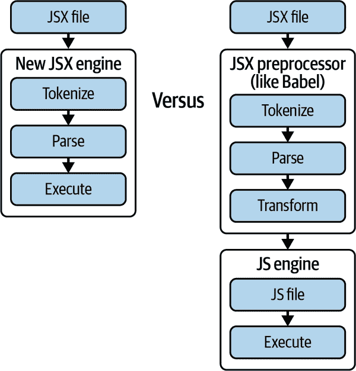

# 第二章：JSX

在第一章中，我们了解了 React 的基础知识及其起源故事，将其与当时其他流行的 JavaScript 库和框架进行了比较。我们了解了 React 的真正价值主张以及为什么它如此重要。

在本章中，我们将学习 JSX，这是 JavaScript 的一种语法扩展，允许我们在 JavaScript 代码中编写类似 HTML 的代码。当 React 在 2013 年推出时，它是人们首先注意到并且受到了严厉批评的东西，因此很有意义早期就专注于它。因此，让我们深入了解这种语言扩展，它的工作原理以及如何概念化地编写我们自己的代码。

让我们开始讨论，首先了解 JSX 代表什么。我们已经知道 JS 代表 JavaScript。这是否意味着 JSX 是 JavaScript 的第 10 版？就像 Mac OS X 一样？它是 JS Xtra 吗？我们可能认为 JSX 中的 X 意味着 10 或 Xtra，这两者都是不错的猜测！但是，JSX 中的 X 实际上代表*JavaScript Syntax eXtension*。有时它也被称为*JavaScript XML*。

# JavaScript XML?

如果你长时间在网络上徘徊，你可能还记得约在 2000 年左右的*AJAX*或*Asynchronous JavaScript and XML*这个术语。AJAX 本质上是利用现有技术的新方式，创建了高度互动的网页，可以异步和局部地更新，而不是当时的常态：每次状态变化都加载整个新页面。

在浏览器中使用`XMLHttpRequest`等工具，它将发起一个异步（即非阻塞）的 HTTP 请求。传统上，对该请求的响应将是一个 XML 格式的响应。而今天，我们更倾向于使用 JSON 来响应。这很可能是为什么`fetch`已经取代了`XMLHTTPRequest`的原因之一，因为`XMLHttpRequest`中带有 XML 这个名称。

JSX 是 JavaScript 的一种语法扩展，允许开发人员在他们的 JavaScript 代码中编写类似 HTML 的代码。它最初由 Meta 开发用于 React，但后来也被其他库和框架采纳。JSX 不是一种独立的语言，而是一种由编译器或转译器转换为普通 JavaScript 代码的语法扩展。当 JSX 代码被编译时，它被转换为普通的 JavaScript 代码。我们稍后将详细介绍这些细节。

虽然 JSX 语法看起来类似于 HTML，但它们之间有一些关键的区别。例如，JSX 使用大括号`{}`来嵌入 JavaScript 表达式到类似 HTML 的代码中。此外，JSX 属性是用驼峰命名法而不是 HTML 属性：HTML 中的`onclick`在 JSX 中是`onClick`。HTML 元素的写法是小写，而不是像自定义 JSX 元素或组件那样的首字母大写：`div`是 HTML，`Div`是一个 React 组件。

此外，我们还应该提到，可以在不使用 JSX 的情况下创建 React 应用程序，但代码往往难以阅读、推理和维护。但如果我们愿意，我们可以。让我们看一个使用 JSX 和不使用 JSX 表达的 React 组件。

这是一个带有 JSX 的列表示例：

```
const MyComponent = () => (
  <section id="list">
    <h1>This is my list!</h1>
    <p>Isn't my list amazing? It contains amazing things!</p>
    <ul>
      {amazingThings.map((t) => (
        <li key={t.id}>{t.label}</li>
      ))}
    </ul>
  </section>
);
```

这是一个不使用 JSX 的相同列表的示例：

```
const MyComponent = () =>
  React.createElement(
    "section",
    { id: "list" },
    React.createElement("h1", {}, "This is my list!"),
    React.createElement(
      "p",
      {},
      "Isn't my list amazing? It contains amazing things!"
    ),
    React.createElement(
      "ul",
      {},
      amazingThings.map((t) =>
        React.createElement("li", { key: t.id }, t.label)
      )
    )
  );
```

为了清晰起见，我们使用了早期的 JSX 转换来说明 React 如何在没有 JSX 的情况下编写。我们将在本章的后续部分详细介绍转换，但现在让我们确立一个转换是将语法 A 转换为语法 B 的东西。

现在，React 在 React 17 中引入了一个新的转换，自动导入一些特殊函数以实现基本相同的功能。这在整体方案中只是一个小细节，但使用新的转换器，我们可以这样表达列表，而不使用 JSX：

```
import { jsx as _jsx } from "react/jsx-runtime";
import { jsxs as _jsxs } from "react/jsx-runtime";

const MyComponent = () =>
  _jsxs("section", {
    id: "list",
    children: [
      _jsx("h1", {
        children: "This is my list!",
      }),
      _jsx("p", {
        children: "Isn't my list amazing? It contains amazing things!",
      }),
      _jsx("ul", {
        children: amazingThings.map((t) =>
          _jsx(
            "li",
            {
              children: t.label,
            },
            t.id
          )
        ),
      }),
    ],
  });
```

无论如何，你能看出 JSX 和不使用 JSX 的示例之间的差异吗？你可能会发现第一个示例使用 JSX 比后者更易于阅读和维护。前者是 JSX，后者是普通的 JS。让我们讨论一下它的权衡。

# JSX 的好处

在 Web 开发中使用 JSX 有几个好处：

更易于阅读和编写

JSX 语法更易于阅读和编写，特别是对于熟悉 HTML 的开发者来说。

改进的安全性

JSX 代码可以编译成更安全的 JavaScript 代码，生成没有危险字符（如`<`和`>`）的 HTML 字符串，这些字符可能创建新元素。在这种情况下，这些 HTML 字符串将尖括号替换为小于号和大于号，以提高安全性。这个过程称为消毒。

强类型

JSX 允许强类型，这有助于在出错之前捕获错误。这是因为 JSX 可以使用 TypeScript 来表达，即使没有 TypeScript，它仍然可以通过使用类似于 JSDoc 风格的注释和`propTypes`来获得增强的类型安全性。

鼓励基于组件的架构

JSX 鼓励基于组件的架构，这有助于使代码更加模块化和易于维护。

广泛使用

JSX 广泛应用于 React 社区，并且也受其他库和框架的支持。

# JSX 的缺点

使用 JSX 也有一些缺点：

学习曲线

不熟悉 JSX 的开发者可能会觉得学习和理解困难。

需要工具支持

JSX 代码在执行之前必须编译为常规的 JavaScript 代码，这为开发工具链增加了额外的步骤。其他替代方案，比如 Vue.js，例如，可以在包含为页面中的`<script>`标签的情况下立即在浏览器环境中工作。

关注点混合

一些开发者认为 JSX 通过将类似 HTML 的代码与 JavaScript 代码结合在一起，混合了关注点，使得难以将呈现与逻辑分离。

部分 JavaScript 兼容性

JSX 支持内联表达式，但不支持内联块。也就是说，在 JSX 元素树中，我们可以有内联表达式，但不能有 if 或 switch 块。对于刚接触 JSX 的工程师来说，这可能有些难以理解。

尽管存在一些缺点，JSX 已经成为 Web 开发者的流行选择，尤其是那些使用 React 的开发者。它提供了一种强大而灵活的方式来创建组件和构建用户界面，并且得到了一个庞大而活跃的社区的支持。除了在 React 中的使用之外，JSX 还被其他库和框架所采用，包括 Vue.js、Solid、Qwik 等。这表明 JSX 不仅限于 React，在未来的几年里其受欢迎程度可能会继续增长，甚至可能通过影响诸如 iOS 空间中的 SwiftUI 等实现，突破了 React 和 Web 生态系统的界限。

总的来说，JSX 是一个强大而灵活的工具，可以帮助我们构建动态和响应式的用户界面。JSX 的设计目标是简化表达、展示和维护 React 组件的代码，同时保留强大的功能，如迭代、计算和内联执行。

JSX 在传递到浏览器之前会转换为普通的 JavaScript。它是如何实现这一点的？让我们来看看它的内部工作原理！

# 内部工作原理

如何制作语言扩展？它们是如何工作的？要回答这些问题，我们需要了解一些关于编程语言的知识。具体来说，我们需要探索像这样的代码如何输出 `3`：

```
const a = 1;
let b = 2;

console.log(a + b);
```

了解这些将有助于我们更好地理解 JSX，从而帮助我们更好地理解 React，从而增强我们在 React 中的熟练程度。

## 代码如何工作？

我们刚刚看到的代码片段实际上只是文本。计算机如何解释并执行它？首先，它不是一个大而聪明的 `RegExp`（正则表达式），可以在文本文件中识别关键字。我曾试图通过这种方式构建一种编程语言，但失败了，因为正则表达式通常很难正确编写，更难以阅读和理解，并且由于可读性问题而难以维护。例如，以下是一个用于识别有效电子邮件地址的正则表达式。乍一看，几乎不可能知道它的目的：

```
\[(?:[a-z0-9!#\$%&'\*\+-/=\?\^_`{\|}~]+(?:\.[a-z0-9!#\$%&'\*\+-/=\?\^_`{\|}~]+)\
*|"(?:[\x01-\x08\x0b\x0c\x0e-\x1f\x21\x23-\x5b\x5d-\x7f]|\\[\x01-\x09\x0b\x0c\x0
e-\x7f])\*")@(?:(?:a-z0-9?\.)\*?a-z0-9?|\[(?:(?:25[0-5]|2[0-4][0-9]|[01]?[0-9][0-9]?)\.){3}(?:25[0-5]|2[0-4]
[0-9]|[01]?[0-9][0-9]?|[a-z0-9-]\*?[a-z0-9]:(?:[\x01-\x08\x0b\x0c\x0e-\x1f\x21-\
x5a\x53-\x7f]|\\[\x01-\x09\x0b\x0c\x0e-\x7f])\+)\])\]
```

那个正则表达式甚至都不完全有效，因为完整版本无法适应页面！这就是为什么不使用正则表达式，而是使用*编译器*来编译代码的原因。编译器是一种将用高级编程语言编写的源代码根据特定规则转换为语法树（字面上，类似 JavaScript 对象的树数据结构）的软件。编译代码的过程涉及几个步骤，包括词法分析、解析、语义分析、优化和代码生成。让我们更详细地探讨每个步骤，并讨论编译器在现代软件开发领域中的作用。

编译器使用一个三步骤过程（至少在 JavaScript 中是这样）在这里发挥作用。这些步骤被称为*词法分析*、*解析*和*代码生成*。让我们更详细地看看这些步骤：

词法分析

本质上是将一串字符分解成有意义的*标记*。当一个标记生成器是有状态的，并且每个标记包含关于其父级和/或子级的状态时，标记生成器被称为*词法分析器*。这是我们在这里讨论的目的的一个必要简化：词法分析实质上是有状态的词法分析。

词法分析器具有*词法规则*，在某些情况下，确实使用正则表达式或类似的方法来检测关键标记，如变量名、对象键和值等，在代表编程语言的文本字符串中。然后，词法分析器将这些关键字映射到某种可枚举值，具体取决于其实现。例如，`const`变成`0`，`let`变成`1`，`function`变成`2`，等等。

一旦字符串被标记化或词法分析，我们就进入下一步，解析。

解析

将标记转换为语法树的过程。语法树是表示代码结构的数据结构。例如，我们之前看过的代码片段将被表示为一个语法树，如下所示：

```
{
type: "Program",
body: [
    {
    type: "VariableDeclaration",
    declarations: [
        {
        type: "VariableDeclarator",
        id: {
            type: "Identifier",
            name: "a"
        },
        init: {
            type: "Literal",
            value: 1,
            raw: "1"
        }
        }
    ],
    kind: "const"
    },
    {
    type: "VariableDeclaration",
    declarations: [
        {
        type: "VariableDeclarator",
        id: {
            type: "Identifier",
            name: "b"
        },
        init: {
            type: "Literal",
            value: 2,
            raw: "2"
        }
        }
    ],
    kind: "let"
    },
    {
    type: "ExpressionStatement",
    expression: {
        type: "CallExpression",
        callee: {
        type: "Identifier",
        name: "console"
        },
        arguments: [
        {
            type: "BinaryExpression",
            left: {
            type: "Identifier",
            name: "a"
            },
            right: {
            type: "Identifier",
            name: "b"
            },
            operator: "+"
        }
        ]
    }
    }
]
}
```

字符串通过解析器变成了一个 JSON 对象。作为程序员，当我们有这样的数据结构时，我们可以做一些非常有趣的事情。语言引擎使用这些数据结构来完成第三步，即代码生成的过程。

代码生成

这是编译器从抽象语法树（AST）生成机器代码的地方。这涉及将 AST 中的代码转换为一系列指令，这些指令可以直接由计算机处理器执行。然后，JavaScript 引擎执行生成的机器代码。总的来说，将 AST 转换为机器代码的过程是复杂的，并涉及许多不同的步骤。然而，现代编译器非常复杂，可以生成在各种硬件架构上高效运行的高度优化代码。

有几种类型的编译器，每种都具有不同的特征和用例。一些最常见的编译器类型包括：

本地编译器

这些编译器生成的机器码可以直接被目标平台的处理器执行。本地编译器通常用于创建独立应用程序或系统级软件。

交叉编译器

这些编译器生成的机器码运行在与编译器不同的平台上。交叉编译器通常用于嵌入式系统开发或针对特定硬件的目标。

即时（JIT）编译器

这些编译器在运行时将代码转换为机器码，而不是预先编译。JIT（即时编译）编译器通常用于虚拟机，例如 Java 虚拟机，并且相比传统的解释器能提供显著的性能优势。

解释器

这些程序直接执行源代码，无需编译。解释器通常比编译器慢，但提供更大的灵活性和易用性。

为了高效执行 JavaScript 代码，许多现代环境，包括 Web 浏览器，都使用 JIT 编译器。在这些系统中，JavaScript 源代码可能首先被转换为中间表示形式，例如字节码。然后 JIT 编译器动态地将这些字节码编译为机器码，随着程序的运行。这种即时编译允许引擎根据实时信息（如变量类型和频繁执行的代码路径）进行优化。某些引擎采用多阶段编译，从快速的非优化编译开始执行，然后针对频繁执行的代码段进行更优化的编译。这种动态方法使得 JavaScript 引擎能够在广泛的应用中实现令人印象深刻的性能。

*运行时*通常与引擎交互，为特定环境提供更多上下文辅助功能和特性。目前最流行的 JavaScript 运行时是常见的 Web 浏览器，如 Google Chrome：它使用 Chromium *运行时*与引擎交互。类似地，在服务器端我们使用 Node.js 运行时，它仍然使用 v8 *引擎*。在野外还有哪些更多的引擎和运行时可以识别？

运行时为 JavaScript 引擎提供上下文，例如浏览器运行时提供的`window`对象和`document`对象。如果你之前同时使用过浏览器和 Node.js，你可能注意到 Node.js 没有全局的`window`对象。这是因为它是不同的运行时，因此提供了不同的上下文。Cloudflare 创建了一个名为*Workers*的类似运行时，其唯一责任是在全球分布的边缘服务器上执行 JavaScript，而 Bun 和 Deno 是更多的替代运行时，但我们偏离了主题。这与 JSX 有何关系？

## 使用 JSX 扩展 JavaScript 语法

现在我们了解了如何扩展 JavaScript 语法，那么 JSX 是如何工作的？我们应该如何做？要扩展 JavaScript 语法，我们需要一个能够理解我们新语法的不同引擎，或者在达到引擎之前处理我们的新语法。前者几乎不可能实现，因为引擎需要大量思考来创建和维护，因为它们往往被广泛使用。如果我们决定选择这个选项，可能需要数年甚至数十年才能使用我们的扩展语法！然后我们必须确保我们的“定制特殊引擎”在所有地方都被使用。我们将如何说服浏览器供应商和其他利益相关者转向我们不受欢迎的新东西呢？这不会奏效。

后者更快：让我们探讨如何在达到引擎之前处理我们的新语法。为了做到这一点，我们需要创建自己的词法分析器和解析器，它能够理解我们的扩展语言：也就是说，获取代码文本字符串并理解它。然后，我们可以不像传统那样生成机器码，而是将语法树生成成当前所有引擎都能理解的普通旧式 JavaScript。这正是 JavaScript 生态系统中的*Babel*以及其他工具如 TypeScript、Traceur 和 swc 所做的事情（见图 2-1）。



###### 图 2-1\. 创建新的 JSX 引擎与使用 JS 预处理器

因此，JSX 不能直接在浏览器中使用，而是需要一个“构建步骤”，其中自定义解析器对其运行，然后将其编译成语法树。然后，这段代码再转换为最终的分发包中的普通 JavaScript。这称为*转译*：转换，然后编译的代码。

为了明确起见，转译是将源代码从一种语言转换为具有相似抽象级别的另一种语言的过程。这也是为什么它被称为*源到源的编译*。

形式上，它是一种类型的翻译器。这个通用术语可以指编译器、汇编器或解释器等。从概念上讲，它与编译几乎完全相同，只是目标语言是类似抽象级别的源语言。

例如，TypeScript 是一种高级语言，当进行转译时，会转换成 JavaScript（另一种高级语言）。Babel 将 ES6 JavaScript 代码转译为 ES5 JavaScript 代码就是另一个例子。

现在我们了解了如何构建我们自己的 JavaScript 扩展，让我们看看我们可以用这种特定扩展 JSX 做些什么。

# JSX pragma

一切都始于 `<`，这个字符在 JavaScript 中独立使用时是一个无法识别的字符，通常在比较操作之外使用时会引发 `SyntaxError: Unexpected token '<'`。在 JSX 中，这个“JSX 编译指示”可以被转译成一个函数调用。编译指示是编译器提供的一个指令，用于为编译器提供文件内容之外的额外信息，通常是在语言本身传达不了的方面。

JavaScript 中的一些例子是我们有时会在旧模块的顶部看到的“use strict”编译指示，以及在 React 服务器组件（RSCs）上下文中最近的“use client”编译指示。更多信息请参阅 第九章。

当解析器看到 `<` 编译指示时，调用函数的名称是可配置的，默认情况下为函数 `React.createElement` 或者在新的转换中为 `_jsxs`，如前所述。预期此函数的签名如下：

```
function pragma(tag, props, ...children)
```

换句话说，它接收 `tag`、`props` 和 `children` 作为参数。这里是 JSX 如何映射到常规 JavaScript 语法的示例。以下 JSX 代码：

```
<MyComponent prop="value">contents</MyComponent>
```

将变成以下 JavaScript 代码：

```
React.createElement(MyComponent, { prop: "value" }, "contents");
```

请注意标签 (`MyComponent`)、属性 (`prop="value"`) 和子元素 (`"contents"`) 之间的映射。这本质上是 JSX 编译指示的作用：对多个递归函数调用的语法糖。JSX 编译指示实际上是一个别名：`<` 而不是 `React.createElement`。

# 表达式

JSX 最强大的功能之一是能够在元素树中执行代码。要像我们在 “Under the Hood” 中所做的那样迭代列表，我们可以像在本章节早先使用的 `map` 一样在大括号内放置可执行的代码。如果我们想在 JSX 中显示两个数字的和，我们会这样做：

```
const a = 1;
const b = 2;

const MyComponent = () => <Box>Here's an expression: {a + b}</Box>;
```

这将呈现 `Here's an expression: 3`，因为大括号内的内容作为表达式执行。使用 JSX 表达式，我们可以迭代列表并执行各种表达式，包括带有三元操作符的条件检查、字符串替换等。

这是另一个使用三元操作符进行条件检查的示例：

```
const a = 1;
const b = 2;

const MyComponent = () => <Box>Is b more than a? {b > a ? "YES" : "NO"}</Box>;
```

这将呈现 `Is b more than a? YES`，因为比较是一个被评估的表达式。值得一提的是，JSX 表达式确实是表达式。不可能在 JSX 元素树中执行语句。以下不会起作用：

```
const MyComponent = () => <Box>Here's an expression: {
    const a = 1;
    const b = 2;

    if (a > b) {
        3
    }
}</Box>;
```

这不起作用是因为语句不返回任何内容并且被视为副作用：它们在不产生值的情况下设置状态。在语句和计算之后，我们如何在内联中打印一个值？请注意，在示例中，我们仅仅在第 6 行中放入了数字 `3`。我们的渲染器怎么知道我们打算打印 `3`？这就是为什么表达式被评估，而语句不会。

# 章节回顾

好的，我们已经在 JSX 主题上覆盖了相当多的内容。我们应该对这个主题感到相当自信（甚至可以说是流利的），以至于我们可以自信地解释其中的各个方面。

# 复习问题

确保你完全掌握了我们讨论的主题。花点时间回答以下问题：

1.  JSX 是什么？它的一些优缺点是什么？

1.  JSX 和 HTML 有什么区别？

1.  文本如何变成机器码？

1.  JSX 表达式是什么，它们有什么好处？

如果你回答这些问题有困难，可能需要再读一遍这一章。如果没有，让我们探索下一章。

# 接下来是什么

现在我们对 JSX 已经相当流利，让我们将注意力转向 React 的下一个方面，看看我们如何从中获取最多的知识，进一步提高我们的流利程度。让我们探索虚拟 DOM。
