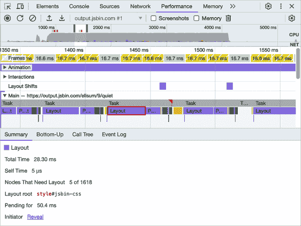

# 第三章：虚拟 DOM

在本章中，我们将深入探讨虚拟 DOM（有时称为 vDOM）的概念及其在 React 中的重要性。我们还将探讨 React 如何利用虚拟 DOM 使 Web 开发更轻松和高效。

随着 Web 应用程序变得越来越复杂，管理“真实 DOM”变得越来越困难，正如我们很快将看到的那样，以及我们在第一章中粗略涵盖的那样。React 的虚拟 DOM 为此问题提供了解决方案。

在本章中，我们将探讨 React 虚拟 DOM 的工作原理、其相对真实 DOM 的优势以及其实现方式。我们还将探讨 React 如何利用虚拟 DOM 优化真实 DOM 的性能，并将所有内容整合在一起。

通过一系列的代码示例和详细的解释，我们将理解虚拟 DOM 在 React 中的作用，以及如何利用其优势创建健壮和高效的 Web 应用程序。让我们开始吧！

# 虚拟 DOM 简介

虚拟 DOM 像 DOM 一样，是一个以 JavaScript 对象建模的 HTML 文档：这确实是文档对象模型（DOM）的含义。DOM 本身是浏览器运行时对文档的模型。虚拟 DOM 是这个模型的一个轻量级副本，其主要区别在于，虽然真实 DOM 由`Node`对象组成，但虚拟 DOM 由作为描述的纯 JS 对象组成。它允许 Web 开发人员以更高效和更高性能的方式创建用户界面，正如我们将在本章中发现的那样。

在 React 中，每当我们通过`setState`或其他机制告诉它对 UI 进行更改时，首先更新虚拟 DOM，然后更新真实 DOM 以匹配虚拟 DOM 中的更改。这个过程称为*协调*，是第四章的主题。

首先更新虚拟 DOM 的原因是，更新真实 DOM 可能会有些慢和昂贵。我们将在下一节中详细讨论这一点，但要点是，每当对真实 DOM 进行更改时，浏览器必须重新计算页面的布局，重绘屏幕，并执行其他可能耗时的操作。

例如，仅仅读取元素的`offsetWidth`就可以触发重新排列，这是浏览器重新计算文档所有或部分布局的过程，可能会影响性能，并使直接 DOM 交互不那么高效。

```
const btn = document.getElementById("myButton");
const width = btn.offsetWidth; // This can trigger a reflow
```

另一方面，更新虚拟 DOM 要快得多，因为它不涉及任何实际页面布局的更改。相反，它是一个简单的 JavaScript 对象，可以通过各种算法方法快速和高效地操作，这些方法可以充分利用可用的 JavaScript 引擎，并随着时间的推移增加其效率，与浏览器和其他主机环境解耦。

当更新虚拟 DOM 时，React 使用一种差异算法来识别旧版本和新版本虚拟 DOM 之间的差异。然后，该算法确定更新真实 DOM 所需的最小变化集，并以批处理和优化的方式应用这些变化，以最小化性能影响。

在本章中，我们将探讨虚拟 DOM 和真实 DOM 的区别，真实 DOM 的缺陷，以及虚拟 DOM 如何帮助创建更好的用户界面。我们还将深入探讨 React 实现的虚拟 DOM 及其用于高效更新的算法。

# 真实 DOM

当一个 HTML 页面被加载到浏览器中时，它会被解析并转换为节点和对象的树状结构，即*对象模型*（DOM）：只是一个大的 JavaScript 对象。DOM 是网页的实时表示，意味着它会随着用户与页面的交互而不断更新。

下面是一个简单 HTML 页面的真实 DOM 的示例：

```
<!DOCTYPE html>
<html>
  <head>
    <title>Example Page</title>
  </head>
  <body>
    <h1 class="heading">Welcome to my page!</h1>
    <p>This is an example paragraph.</p>
    <ul>
      <li>Item 1</li>
      <li>Item 2</li>
      <li>Item 3</li>
    </ul>
  </body>
</html>
```

在这个例子中，真实 DOM 被表示为一个树状结构，每个 HTML 元素在页面中都有相应的节点。这是树结构的简化版本，目的是为了更好地理解。实际 DOM 拥有更多每个节点的属性和方法。不过，这应该有助于我们理解文档如何被建模为一个对象：

```
const dom = {
  type: "document",
  doctype: "html",
  children: [
    {
      type: "element",
      tagName: "html",
      children: [
        {
          type: "element",
          tagName: "head",
          children: [
            {
              type: "element",
              tagName: "title",
              children: "Example Page",
            },
          ],
        },
        {
          type: "element",
          tagName: "body",
          children: [
            {
              type: "element",
              tagName: "h1",
              innerHTML: "Welcome to my page!",
              children: [],
              className: "heading",
            },
            {
              type: "element",
              tagName: "p",
              children: "This is an example paragraph.",
            },
            {
              type: "element",
              tagName: "ul",
              children: [
                {
                  type: "element",
                  tagName: "li",
                  children: "Item 1",
                },
                {
                  type: "element",
                  tagName: "li",
                  children: "Item 2",
                },
                // ...you can fill in the rest
              ],
            },
          ],
        },
      ],
    },
  ],
};
```

树中的每个节点表示一个 HTML 元素，它包含允许通过 JavaScript 进行操作的属性和方法。例如，我们可以使用 `document.querySelector()` 方法从真实 DOM 中检索特定节点，并修改其内容：

```
// Retrieve the <h1> node
const h1Node = document.querySelector(".heading");

// Modify its contents
if (h1Node) {
  h1Node.innerHTML = "Updated Heading!";
}

console.log(h1Node);
```

在这个例子中，我们使用 `document.querySelector()` 方法检索具有 `"heading"` 类的 `h1` 元素。然后，通过将其 `innerHTML` 属性设置为 `"Updated Heading!"`，我们修改了元素的内容。这将把页面上显示的文本从 `"Welcome to my page!"` 修改为 `"Updated Heading!"`。

这似乎并不复杂，但这里有几点需要注意。首先，我们使用 `document.querySelector()` 方法从真实 DOM 中检索元素。此方法接受 CSS 选择器作为参数，并返回与选择器匹配的第一个元素。在这种情况下，我们传入了类选择器 `.heading`，它匹配具有 `"heading"` 类的 `h1` 元素。

这里有一个小小的危险，因为 `document.querySelector` 方法虽然是一个强大的工具，可以根据 CSS 选择器在真实 DOM 中选择元素，但使用该方法可能会存在一个性能问题，特别是在处理大型和复杂文档时。该方法必须从文档顶部开始向下遍历以找到所需的元素，这可能是一个耗时的过程。

当我们使用 CSS 选择器调用`document.querySelector()`时，浏览器必须搜索整个文档树以找到匹配的元素。这意味着搜索可能会很慢，特别是如果文档很大且结构复杂。此外，浏览器还必须评估选择器本身，这可能是一个复杂的过程，取决于选择器的复杂性。

相比之下，`document.getElementById`不像 CSS 选择器那样需要验证，并且由于`id`属性预期是唯一的，因此通常更为高效。

就运行时间复杂度而言，使用大 O 符号，`getElementById`在现代浏览器中通常被近似为 O(1)，因为它们很可能使用了散列机制，如哈希表，用于高效的 ID 到元素映射。虽然理想的哈希表查找在平均情况下是 O(1)，但重要的是要考虑到最坏情况，如哈希冲突，可能导致更长的查找时间。由于浏览器实际上并不强制 ID 的唯一性，这些哈希冲突是很可能发生的。

然而，由于现代浏览器中具有高级的散列函数和调整大小策略，这些情况很少发生。

###### 注意

对于我们这些没有上过计算机学校的人，也许不太理解大 O 符号，这是开发人员用来衡量一段代码运行速度快慢的一个方便工具，特别是当代码要处理的数据量增加时。基本上，大 O 符号提供了算法的高层次理解，涵盖了时间复杂度（随着输入规模增加而执行时间增长的情况）和空间复杂度（随着输入规模增加而内存使用量增长的情况）。通常用 O(1)、O(n)、O(n log n)或 O(n²)等术语来表示，其中 n 是输入的大小。因此，当开发人员谈论代码“高效”或“可扩展”时，他们通常指的就是这些大 O 值，目标是选择时间和空间复杂度较低的算法，以确保他们的软件在处理越来越多的数据时仍然性能良好。

另外，由于 ID 应该是唯一的，它们并不太适合在页面上有多个可重复使用的组件。这就是`querySelector`发挥作用的地方，它可以用于选择具有相同类名的多个元素，例如。

尽管如此，`querySelector`可以接受广泛的 CSS 选择器范围，其复杂性是可变的。在最坏的情况下，该方法可能需要遍历整个 DOM 以确保匹配或不存在匹配项，其复杂度可以是 O(n)，其中 n 是 DOM 中的元素数量。然而，如果选择器更为具体或者在 DOM 树中早期找到匹配项，实际运行时间可以低于 O(n)。然而，仍然需要额外的计算成本来解析和验证选择器本身。

值得注意的是，在小型文档或者在文档树的特定区域搜索元素时，`document.getElementById` 和 `document.querySelector` 之间的性能差异可能微乎其微。然而，在更大更复杂的文档中，这种差异可能变得更加明显。

有人会说，整个“CPU 效率”论点被夸大了，并且不值得担心。这可能是真的，也可能不是，但没有人可以质疑 React 虚拟 DOM 在组件化逻辑和避免在如此易变的 DOM 环境中管理状态方面所提供的附加价值。我们说 DOM 易变，是因为它受到许多因素的影响，包括用户交互、网络请求、客户端脚本和其他可能随时更改它的事件。通过虚拟 DOM，React 保护我们免受这种环境的影响。

我们深入探讨这些微妙的细节，因为要真正精通 React，理解 DOM 的整体复杂性是很重要的。智能地使用 DOM 并不是一件小事，而使用 React，我们可以选择是自己在其中航行并偶尔踩中地雷，还是使用一种工具来安全地使用虚拟 DOM 来导航 DOM。

虽然我们已经讨论了在这里选择元素的一些细微差别，但我们还没有机会深入探讨直接使用 DOM 的风险。让我们快速地做一下，以充分理解 React 虚拟 DOM 所提供的价值。

## 实际 DOM 的缺陷

实际 DOM 存在一些缺陷，这些缺陷可能使构建高性能 Web 应用程序变得困难。其中一些缺陷包括性能问题、跨浏览器兼容性和安全漏洞，直接操作 DOM 可能会引发跨站脚本（XSS）漏洞。

### 性能

实际 DOM 的最大问题之一是其性能。每当对 DOM 进行更改，比如添加或删除元素，或者更改元素的文本或属性时，浏览器都必须重新计算布局并重绘页面的受影响部分。对于大型和复杂的网页，这可能是一个缓慢且资源密集的过程。

正如前面提到的，阅读 DOM 元素的`offsetWidth`属性可能看起来是一个简单的操作，但实际上它可能会触发浏览器进行昂贵的布局重新计算。这是因为`offsetWidth`是一个计算属性，依赖于元素及其祖先的布局，这意味着浏览器需要确保布局信息是最新的，才能返回准确的值。

在最坏的情况下，用大 O 符号表示读取元素的`offsetWidth`属性的时间复杂度将被估算为（O(n)）。这是因为访问此属性可能会触发浏览器的重新布局，涉及页面上多个元素的布局位置重新计算。在这个上下文中，（n）代表受重新布局影响的 DOM 元素数量。尽管直接属性访问很快，但相关的副作用，如重新布局，可能会使操作随着页面上元素数量的增加而扩展。

如果你想避免像`offsetWidth`这样的布局属性可能引发的重新布局问题，我们可以采用一些技巧来提升操作性能。以下是一种方法，利用`getBoundingClientRect()`方法可以批量进行布局读取和写入操作：

```
// Accessing layout properties in a more performant way
function getOffsetWidthWithoutTriggeringReflow(element) {
  let width;

  // Batch all reading operations
  const rect = element.getBoundingClientRect();
  width = rect.width;

  // ... any other reading operations

  // Followed by writing operations, if any

  return width;
}

const element = document.querySelector(".myElement");
const width = getOffsetWidthWithoutTriggeringReflow(element);
console.log(width);
```

通过使用`getBoundingClientRect()`，我们可以在一次调用中检索多个布局属性，从而减少触发多次重新布局的可能性。此外，通过分批次分别读取和写入操作，我们可以进一步减少*布局抖动*，即由于频繁交叉读写布局属性导致的重复和不必要的布局重新计算（见图 3-1）。这种抖动会显著降低网页的性能，导致用户体验迟钝。通过策略性地访问布局属性和批量操作，我们可以保持网页交互的流畅和响应。



###### 图 3-1\. 布局抖动

然而，即使使用`getBoundingClientRect()`也可能在存在待处理的布局更改时引发重新布局。在这里的关键是尽量减少强制浏览器重新计算布局的次数，而且在这样做时，尽量一次性获取尽可能多的信息。

React 使用虚拟 DOM 作为真实 DOM 操作之间的中间层，从而为我们自动处理所有这些。

考虑以下例子，其中我们有一个包含单个`div`元素的简单 HTML 文档：

```
<!DOCTYPE html>
<html>
  <head>
    <title>Reading offsetWidth example</title>
    <style>
      #my-div {
        width: 100px;
        height: 100px;
        background-color: red;
      }
    </style>
  </head>
  <body>
    <div id="my-div"></div>
    <script>
      var div = document.getElementById("my-div");
      console.log(div.offsetWidth);
    </script>
  </body>
</html>
```

当我们在浏览器中加载这个文档并打开开发者控制台时，我们可以看到`div`元素的`offsetWidth`属性被记录在控制台中。然而，我们看不到浏览器在计算`offsetWidth`值时所做的幕后工作。

要理解这项工作，我们可以使用开发工具中的性能面板记录浏览器加载和渲染页面时的活动时间轴。通过这样做，我们可以看到浏览器在处理文档时执行了几个布局和绘制操作。特别是，我们可以看到有两个布局操作对应于脚本中读取`offsetWidth`的操作。

每个布局操作都需要一些时间来完成（在这种情况下大约为 2 毫秒），即使它们只是读取属性值。这是因为浏览器需要确保布局信息是最新的，然后才能返回准确的值，这需要它执行整个文档的完整布局。尽管 2 毫秒可能看起来不算什么大不了的事情，但在规模上会累积起来。

总体而言，当读取像 `offsetWidth` 这样依赖于布局的属性时，我们应该小心，因为它们可能导致意外的性能问题。如果我们需要多次读取这些属性的值，我们应考虑将该值缓存到变量中，以避免触发不必要的布局重新计算。或者，我们可以使用 `requestAnimationFrame` API 将属性的读取延迟到下一个动画帧中，此时浏览器已执行了必要的布局计算。

要了解更多关于真实 DOM 的意外性能问题，请看一些示例。考虑以下 HTML 文档：

```
<!DOCTYPE html>
<html>
  <head>
    <title>Example</title>
  </head>
  <body>
    <ul id="list">
      <li>Item 1</li>
      <li>Item 2</li>
      <li>Item 3</li>
    </ul>
  </body>
</html>
```

假设我们要使用 JavaScript 向列表中添加新项目。我们可能会编写以下代码：

```
const list = document.getElementById("list");
const newItem = document.createElement("li");
newItem.textContent = "Item 4";
list.appendChild(newItem);
```

注意这里我们使用 `getElementById` 而不是 `querySelector`，因为：

+   我们知道 ID 是什么。

+   我们知道性能的权衡。

让我们继续。

此代码选择具有 ID `"list"` 的 `ul` 元素，创建一个新的 `li` 元素，将其文本内容设置为 `"Item 4"`，并将其附加到列表中。当我们运行此代码时，浏览器必须重新计算布局并重新绘制页面的受影响部分，以显示新项目。

这个过程可能会很慢且资源密集，特别是对于更大的列表。例如，假设我们有一个包含 1,000 个项目的列表，并且我们想在列表的末尾添加一个新项目。我们可能会编写以下代码：

```
const list = document.getElementById("list");
const newItem = document.createElement("li");
newItem.textContent = "Item 1001";
list.appendChild(newItem);
```

当我们运行此代码时，浏览器必须重新计算布局并重新绘制整个列表，即使只添加了一个项目。这可能需要大量的时间和资源，特别是在较慢的设备或较大的列表上。

为了进一步说明这个问题，请考虑以下示例：

```
<!DOCTYPE html>
<html>
  <head>
    <title>Example</title>
    <style>
      #list li {
        background-color: #f5f5f5;
      }
      .highlight {
        background-color: yellow;
      }
    </style>
  </head>
  <body>
    <ul id="list">
      <li>Item 1</li>
      <li>Item 2</li>
      <li>Item 3</li>
    </ul>
    <button onclick="highlight()">Highlight Item 2</button>
    <script>
      function highlight() {
        const item = document.querySelector("#list li:nth-child(2)");
        item.classList.add("highlight");
      }
    </script>
  </body>
</html>
```

在这个例子中，我们有一个包含三个项目和一个按钮的列表，当点击按钮时会突出显示第二个项目。当点击按钮时，浏览器必须重新计算布局并重新绘制整个列表，即使只有一个项目发生了变化。这可能导致 UI 中可见的延迟或闪烁，这对用户来说可能很烦人。

总体而言，真实 DOM 的性能问题对我们来说可能是一个重大挑战，特别是在处理大型和复杂的网页时。虽然有一些技术可以减轻这些问题，比如优化选择器、使用事件委托、批处理读写 DOM 操作或使用 CSS 动画，但它们可能会很复杂且难以实现。

因此，我们许多人已经将虚拟 DOM 视为解决这些问题的方案。虚拟 DOM 使我们能够通过抽象出真实 DOM 的复杂性并提供更轻量级的 UI 表示方式，创建更高效和性能更好的 UI。

但是… 是否真的有必要为了节省几毫秒？嗯，CPU/处理性能是一个关键因素，可以极大地影响应用程序的成功。在今天数字化的时代，用户期望快速响应的网站，因此我们作为 Web 开发者，优化 CPU 效率以确保应用程序平稳、响应迅速是至关重要的。Google Web 开发博客上的一篇优秀文章[“毫秒决定百万”](https://oreil.ly/BtXCh)进一步证明了这些说法的可信度。

直接 DOM 操作可能触发布局重新计算（称为 reflows）和重绘，从而增加 CPU 使用率和处理时间，这可能导致用户的延迟甚至崩溃。对于处理能力有限的设备（如智能手机或平板电脑）上的用户尤其成问题，这些设备可能具有有限的处理能力和内存。在世界的许多地方，用户可能正在使用较老或较不具备能力的设备访问我们的 Web 应用程序，这可能进一步加剧问题。

通过优化 CPU 效率，我们可以创建适用于各种设备用户的应用程序，无论其处理能力或内存如何。这可以提高用户参与度，增加转化率，最终实现更成功的在线存在。

React 的虚拟 DOM 已经实现了构建 CPU 效率高的 Web 应用程序；使用其高效的渲染算法有助于减少处理时间并提高整体性能。

### 跨浏览器兼容性

真实 DOM 的另一个问题是跨浏览器兼容性。不同的浏览器对文档的建模方式不同，这可能导致 Web 应用程序中的不一致性和 bug。React 发布时这种情况更为普遍，现在已经少见。但这确实曾经使开发者难以创建在不同浏览器和平台上无缝运行的 Web 应用程序。

跨浏览器兼容性的主要问题之一是，并非所有浏览器都支持特定的 DOM 元素和属性。因此，我们不得不花费额外的时间和精力实现解决方案和回退机制，以确保应用程序在所有目标平台上正确运行。

这正是 React 使用其合成事件系统解决的问题。`SyntheticEvent` 是对浏览器原生事件的包装，旨在确保在不同浏览器中的一致性。它通过以下机制解决浏览器之间的不一致性：

统一的界面

在原始的 JavaScript 中，由于不一致性，处理浏览器事件可能会很棘手。例如，访问事件属性可能因浏览器而异。有些浏览器可能使用 `event.target`，而其他浏览器则使用 `event.srcElement`。`SyntheticEvent` 抽象了这些差异，提供了一种一致的交互方式，确保开发者无需编写特定于浏览器的代码：

```
// Without React, developers might need checks for
// browser-specific properties
const targetElement = event.target || event.srcElement;

// In React, thanks to SyntheticEvent, it's consistent
function handleClick(event) {
  const target = event.target;
  // ... rest of the code
}
```

通过将原生事件包装到 `SyntheticEvent` 系统中，React 保护开发者免受原生浏览器事件系统的许多不一致性和怪癖的困扰。

事件委托

React 并不直接将事件侦听器附加到元素上，而是在根级别监听事件。这种方法避开了在旧版本浏览器中某些元素可能不支持某些事件的问题。

跨功能增强

原生浏览器事件表现出不一致性的一个领域是它们如何在不同输入元素上处理某些事件。一个显著的例子是 `onChange` 事件：

+   在原始的 JavaScript 中，`onChange` 事件的行为在输入类型之间有所不同：

    +   对于 `<input type="text">` 元素，在某些浏览器中，`onChange` 事件可能仅在输入框失去焦点后触发，而不是在值更改时立即触发。

    +   对于 `<select>` 元素，每当选择选项时可能会触发事件，即使选项与先前的选项相同。

    +   在其他情况下，特别是在旧版浏览器中，某些表单元素的 `onChange` 事件可能无法可靠触发所有用户交互。

+   React 的 `SyntheticEvent` 系统规范了这些输入元素上 `onChange` 事件的行为。在 React 中：

    +   文本输入框 (`<input type="text">`) 的 `onChange` 事件在每次击键时都会触发，提供实时反馈。

    +   对于 `<select>` 元素，每当选择新选项时，它可靠地触发。

    +   React 确保 `onChange` 事件在其他表单元素上也提供一致的体验。

        通过这种方式，React 使开发者摆脱了处理这些原生不一致性的困扰，让他们可以专注于应用逻辑，而不必担心特定于浏览器的怪癖。

访问原生事件

如果开发者需要原始的浏览器事件，则可以通过 `event.nativeEvent` 获得，确保灵活性而不牺牲抽象化的好处。

总之，`SyntheticEvent` 提供了一个稳定的事件系统，消除了原生浏览器事件的怪异和差异。这只是 React 利用其虚拟 DOM 提供便利的一个具体方式。

到目前为止，我们一直在讨论直接操作 DOM 可能导致性能问题和跨浏览器兼容性问题。现在让我们探讨一种更高效的本地方法来处理这些问题，即使用文档片段，这可以被认为是理解 React 虚拟 DOM 的一种本地前提。

## 文档片段

如我们所见，直接操作 DOM 可能会消耗大量性能，特别是涉及多个变更时。每次更新 DOM，浏览器可能需要进行布局重新计算、UI 重绘和视图更新，这可能会减慢应用程序的运行速度。这就是文档片段发挥作用的地方。

*文档片段* 是一个轻量级容器，用于保存 DOM 节点。它的作用类似于一个临时的暂存区，你可以在其中进行多个更改，而不影响主 DOM。完成后，可以将文档片段附加到 DOM 中，触发一次回流和重绘。在这一点上，文档片段与 React 的虚拟 DOM 非常相似。

因为文档片段是轻量级容器，允许我们批量更新，所以它们带来了多种性能优势：

批量更新

而不是对实时 DOM 进行多次单独的更新，你可以将所有更改批量处理在文档片段中。这意味着只进行一次回流和重绘，而不管在片段内部做了多少元素或更改。

内存效率

当节点添加到文档片段时，它们会从 DOM 中当前的父节点中移除。这有助于优化内存使用，特别是在重新排序大型文档部分时。

没有冗余的渲染

由于文档片段不是活动文档树的一部分，对其进行的更改不会影响实时文档，并且样式和脚本直到片段附加到实际 DOM 之后才会应用。这避免了冗余的样式重新计算和脚本执行。

考虑一个场景，你需要向列表中添加多个列表项：

```
const fragment = document.createDocumentFragment();
for (let i = 0; i < 100; i++) {
  const li = document.createElement("li");
  li.textContent = `Item ${i + 1}`;
  fragment.appendChild(li);
}
document.getElementById("myList").appendChild(fragment);
```

在这个例子中，首先将 100 个列表项附加到文档片段中。只有在所有项目都添加完毕后，片段才会附加到主列表中。这样就只需一次更新实时 DOM，而不是 100 次单独的更新。

通过这种方式，文档片段提供了一种有效地批量处理多个更改来操作 DOM 的方式，从而减少昂贵的回流和重绘次数。对于希望在其 Web 应用程序中实现最佳性能的开发人员来说，利用文档片段可以实现更流畅的交互和更快的渲染时间。

React 的虚拟 DOM 可以被类比为文档片段概念的高级实现。以下是一个简短的联系：

批量更新

类似于文档片段，React 的虚拟 DOM 将多个变更批量处理在一起。不是在每次状态或属性变化时直接修改实时 DOM，而是先在虚拟 DOM 中编译这些变更。

高效的差异比较

然后，React 确定当前虚拟 DOM 与实际 DOM 之间的差异（或“差异”）。这个差异过程确保只对实际 DOM 进行必要的更改，类似于文档片段如何减少直接的 DOM 操作。

单一渲染

一旦识别出差异，React 就会在单个批处理中更新实际 DOM，类似于附加完整填充的文档片段。这最小化了昂贵的回流和重绘。

本质上，尽管文档片段提供了在更新实时 DOM 之前对一组更改进行分组和优化的方法，但 React 的虚拟 DOM 更进一步，通过智能差异化和批量更新整个应用程序的 UI，确保渲染的最大效率。此外，React 将所有这些文档片段的内容转化为我们作为日常开发人员无需关注的实现细节，使我们能够更专注地构建我们的产品。接下来，让我们详细了解虚拟 DOM 的工作原理。

# 虚拟 DOM 的工作原理

虚拟 DOM 是一种技术，有助于减轻真实 DOM 的缺陷。通过在内存中创建 DOM 的虚拟表示，可以对虚拟表示进行更改，而无需直接修改真实 DOM，类似于文档片段。这使得框架或库能够以更高效和更具性能的方式更新真实 DOM，而不会导致浏览器重新计算页面布局和重绘元素。

虚拟 DOM 还通过提供一个一致的 API 来抽象不同浏览器实现之间的真实 DOM 差异，从而帮助改进元素和其更新的编写体验。例如，如果在另一个运行时中 `document.appendChild` 不同，那么在使用 JSX 和虚拟 DOM 时就不重要。这使得开发人员能够更轻松地创建能够在不同浏览器和平台上无缝运行的 Web 应用程序。

React 使用虚拟 DOM 来构建用户界面。在本节中，我们将探讨 React 虚拟 DOM 的实现原理。

## React 元素

在 React 中，用户界面被表示为 *React 元素* 的树，这些元素是组件或 HTML 元素的轻量级表示。它们是使用 `React.createElement` 函数创建的，可以嵌套以创建复杂的用户界面。

这里是一个 React 元素的示例：

```
const element = React.createElement(
  "div",
  { className: "my-class" },
  "Hello, world!"
);
```

这创建了一个表示具有 `className` 为 `my-class` 和文本内容 `Hello, world!` 的 `<div>` 元素的 React 元素。

从这里，我们可以看到如果使用 `console.log(element)`，实际创建的元素是这样的：

```
{
  $$typeof: Symbol(react.element),
  type: "div",
  key: null,
  ref: null,
  props: {
    className: "my-class",
    children: "Hello, world!"
  },
  _owner: null,
  _store: {}
}
```

这是 React 元素的一种表示。React 元素是 React 应用程序的最小构建块，它描述了应该出现在屏幕上的内容。每个元素是一个简单的 JavaScript 对象，描述了它所表示的组件，以及任何相关的 props 或属性。

代码块中显示的 React 元素表示为具有多个属性的对象：

`$$typeof`

这是 React 使用的一个符号，用来确保一个对象是有效的 React 元素。在这种情况下，它是 `Symbol(react.element)`。`$$typeof` 可以有其他值，取决于元素的类型：

`Symbol(react.fragment)`

当元素表示 React 片段时。

`Symbol(react.portal)`

当元素表示 React 门户时。

`Symbol(react.profiler)`

当元素表示 React 性能分析器时。

`Symbol(react.provider)`

当元素表示 React 上下文提供程序时。

通常情况下，`$$typeof`用作类型标记，标识 React 元素的类型。我们将在本书的后续部分详细讨论这些内容。

`type`

此属性表示元素表示的组件类型。在本例中，它是`"div"`，表示这是一个`<div>`DOM 元素，称为“主机组件”。React 元素的`type`属性可以是字符串或函数（或类，但我们不讨论它，因为它正在被逐步淘汰）。如果是字符串，则表示 HTML 标签名称，如`"div"`，`"span"`，`"button"`等。当它是一个函数时，它表示一个自定义 React 组件，实质上只是一个返回 JSX 的 JavaScript 函数。

这是一个具有自定义组件类型的元素的示例：

```
const MyComponent = (props) => {
  return <div>{props.text}</div>;
};

const myElement = <MyComponent text="Hello, world!" />;
```

在本例中，`myElement`的`type`属性为`MyComponent`，这是一个定义自定义组件的函数。作为 React 元素对象，`myElement`的值将是：

```
{
  $$typeof: Symbol(react.element),
  type: MyComponent,
  key: null,
  ref: null,
  props: {
    text: "Hello, world!"
  },
  _owner: null,
  _store: {}
}
```

注意，类型设置为`MyComponent`函数，该函数是元素表示的组件类型，而`props`包含传递给组件的属性，在本例中为`{ text: "Hello, world!" }`。

当 React 遇到具有函数类型的元素时，它将使用该函数调用元素的`props`，并将返回值用作元素的`children`，在本例中是一个`div`。这就是如何渲染自定义 React 组件的方式：React 会不断地深入遍历元素，直到达到标量值，然后将它们呈现为文本节点，或者如果达到`null`或`undefined`，则不会呈现任何内容。

这是一个具有字符串类型的元素的示例：

```
const myElement = <div>Hello, world!</div>;
```

在本例中，`myElement`的`type`属性为`"div"`，这是一个表示 HTML 标签名的字符串。当 React 遇到具有字符串类型的元素时，它将创建一个相应的 HTML 元素，并在该元素内部呈现其子元素。

`ref`

此属性允许父组件请求对底层 DOM 节点的引用。通常在需要直接操作 DOM 的情况下使用。在本例中，`ref`为`null`。

`props`

此属性是一个对象，包含传递给组件的所有属性和 props。在本例中，它有两个属性：`className`指定元素的类名，`children`包含元素的内容。

`_owner`

此属性仅在 React 的非生产版本中可访问，它用于内部跟踪创建此元素的组件。这些信息用于确定在其 props 或状态更改时应由哪个组件负责更新元素。

这里有一个示例，演示了 `_owner` 属性的使用方式：

```
function Parent() {
  return <Child />;
}

function Child() {
  const element = <div>Hello, world!</div>;
  console.log(element._owner); // Parent
  return element;
}
```

在这个例子中，`Child` 组件创建一个表示 `<div>` 元素的 React 元素，并带有文本 `"Hello, world!"`。此元素的 `_owner` 属性设置为创建 `Child` 组件的 `Parent` 组件。

React 使用这些信息来确定在其 props 或状态更改时应由哪个组件负责更新元素。在这种情况下，如果 `Parent` 组件更新其状态或接收新的 props，则 React 将更新 `Child` 组件及其关联的元素。

需要注意 `_owner` 属性是 React 的内部实现细节，不应依赖于应用程序代码。

`_store`

React 元素对象的 `_store` 属性是一个对象，由 React 内部使用，用于存储有关元素的额外数据。存储在 `_store` 中的具体属性和值不是公共 API 的一部分，不应直接访问。

下面是 `_store` 属性可能的一个示例：

```
{
  validation: null,
  key: null,
  originalProps: { className: 'my-class', children: 'Hello, world!' },
  props: { className: 'my-class', children: 'Hello, world!' },
  _self: null,
  _source: { fileName: 'MyComponent.js', lineNumber: 10 },
  _owner: {
    _currentElement: [Circular], _debugID: 0, stateNode: [MyComponent]
  },
  _isStatic: false,
  _warnedAboutRefsInRender: false,
}
```

正如您所见，`_store` 包括各种属性，如 `validation`、`key`、`originalProps`、`props`、`_self`、`_source`、`_owner`、`_isStatic` 和 `_warnedAboutRefsInRender`。这些属性由 React 内部使用，用于跟踪元素状态和上下文的各个方面。

例如，在开发模式下，`_source` 用于跟踪创建元素的文件名和行号，这对于调试非常有帮助。`_owner` 用于跟踪创建元素的组件，如前所述。`props` 和 `originalProps` 用于存储传递给组件的 props。

再次强调，需要注意 `_store` 是 React 的内部实现细节，不应在应用程序代码中直接访问，因此我们在这里不会深入讨论。

## 虚拟 DOM 与真实 DOM

`React.createElement` 函数和 DOM 的内置 `createElement` 方法类似，它们都创建新元素；但是，`React.createElement` 创建 React 元素，而 `document.createElement` 创建 DOM 节点。它们在实现上有很大差异，但在概念上是相似的。

`React.createElement` 是 React 提供的一个函数，用于在内存中创建新的虚拟元素，而 `document.createElement` 是 DOM API 提供的一个方法，也是在内存中创建新元素，直到使用诸如 `document.appendChild` 或类似的 API 将其附加到 DOM 中。这两个函数的第一个参数都是标签名，而 `React.createElement` 还接受额外的参数来指定 props 和子元素。

例如，让我们比较如何使用两种方法创建 `<div>` 元素：

```
// Using React's createElement
const divElement = React.createElement(
  "div",
  { className: "my-class" },
  "Hello, World!"
);

// Using the DOM API's createElement
const divElement = document.createElement("div");
divElement.className = "my-class";
divElement.textContent = "Hello, World!";
```

React 中的虚拟 DOM 与真实 DOM 在概念上类似，两者都表示元素的树状结构。当渲染 React 组件时，React 创建一个新的虚拟 DOM 树，将其与先前的虚拟 DOM 树进行比较，并计算更新旧树以匹配新树所需的最小变更。这称为 *协调过程*。以下是 React 组件中如何工作的示例：

```
function App() {
  const [count, setCount] = useState(0);

  return (
    <div>
      <h1>Count: {count}</h1>
      <button onClick={() => setCount(count + 1)}>Increment</button>
    </div>
  );
}
```

为了清晰起见，此组件也可以这样表达：

```
function App() {
  const [count, setCount] = React.useState(0);

  return React.createElement(
    "div",
    null,
    React.createElement("h1", null, "Count: ", count),
    React.createElement(
      "button",
      { onClick: () => setCount(count + 1) },
      "Increment"
    )
  );
}
```

在 `createElement` 调用中，第一个参数是 HTML 标签或 React 组件的名称，第二个参数是属性对象（如果不需要属性，则为 `null`），任何额外的参数表示子元素。

当首次渲染组件时，React 创建一个类似于以下的虚拟 DOM 树：

```
div
├─ h1
│  └─ "Count: 0"
└─ button
   └─ "Increment"
```

当按钮被点击时，React 创建一个新的虚拟 DOM 树，看起来像这样：

```
div
├─ h1
│  └─ "Count: 1"
└─ button
   └─ "Increment"
```

React 然后计算出只有 `h1` 元素的文本内容需要更新，并且只更新真实 DOM 中的这部分。

在 React 中使用虚拟 DOM 允许对真实 DOM 进行高效的更新，同时使 React 能够与其他直接操作 DOM 的库无缝协作。

## 高效更新

当 React 组件的状态或属性发生变化时，React 创建一个新的 React 元素树，表示更新后的用户界面。然后将此新树与之前的树进行比较，以确定更新真实 DOM 所需的最小变更集，使用差分算法。

此算法将新的 React 元素树与之前的树进行比较，并识别两者之间的差异。这是一个递归比较。如果节点已更改，React 将更新真实 DOM 中对应的节点。如果节点已添加或删除，React 将在真实 DOM 中添加或删除相应的节点。

Diffing 涉及逐个比较新旧树以找出哪些部分发生了变化。

React 的差分算法经过高度优化，旨在最小化需要对真实 DOM 进行的更改数量。算法工作如下：

+   如果两个树的根级节点不同，React 将用新树替换整个树。

+   如果根级节点相同，且节点的属性已更改，React 将更新节点的属性。

+   如果节点的子节点不同，React 将只更新已更改的子节点。React 不会重新创建整个子树，只会更新已更改的节点。

+   如果节点的子节点相同，但其顺序已更改，React 将重新排序真实 DOM 中的节点，而不实际重新创建它们。

+   如果从树中移除了节点，React 将从真实 DOM 中移除它。

+   如果树中添加了新节点，React 将其添加到真实 DOM 中。

+   如果节点类型已更改（例如，从 `div` 更改为 `span`），React 将删除旧节点并创建新类型的新节点。

+   如果节点具有 `key` 属性，React 将使用它来确定是否应替换节点。当您需要重置组件的状态时，这将非常有用。

React 的差异算法是高效的，允许 React 快速更新真实 DOM 并进行最小的更改。这有助于提高 React 应用程序的性能，并使构建复杂动态用户界面变得更加容易。

### 不必要的重新渲染

尽管 React 的差异算法确实在有效地通过最小化所需的更改来更新真实 DOM 中扮演了关键角色，但开发者可能会遇到一个常见挑战：不必要的重新渲染。

这是 React 的设计方式：当组件的状态更改时，React 重新渲染组件及其所有后代。重新渲染意味着 React 递归调用每个函数组件，将其 props 作为参数传递给每个函数组件。React 不会跳过其 props 没有更改的组件，而是调用所有因为父组件的状态或 props 改变而变化的子组件。这是因为 React 不知道依赖于更改的组件的状态的哪些组件，因此必须重新渲染它们以确保 UI 保持一致。

这可能会带来一些显著的性能挑战，特别是在处理大型和复杂的用户界面时。例如，在下面的片段中，`ChildComponent` 每次 `ParentComponent` 的状态更改时都会重新渲染，即使传递给 `ChildComponent` 的 props 没有变化：

```
import React, { useState } from "react";

const ChildComponent = ({ message }) => {
  return <div>{message}</div>;
};

const ParentComponent = () => {
  const [count, setCount] = useState(0);

  return (
    <div>
      <button onClick={() => setCount(count + 1)}>Increment</button>
      <ChildComponent message="This is a static message" />
    </div>
  );
};

export default ParentComponent;
```

在这个例子中：

+   `ParentComponent` 具有一个状态变量 `count`，每次单击按钮时增加。

+   `ChildComponent` 接收一个名为 `message` 的静态 prop。由于此 prop 不会更改，理想情况下，我们不希望 `ChildComponent` 每次 `ParentComponent` 的状态更改时都重新渲染。

+   然而，由于 React 的默认行为，`ChildComponent` 在每次 `ParentComponent` 重新渲染时也会重新渲染，而这种情况在每次状态更改时都会发生。

+   这是低效的，因为 `ChildComponent` 并不依赖于 `ParentComponent` 的 `count` 状态。

+   由于 `ChildComponent` 的 props 和 state 没有变化，渲染是无意义的：它可能返回了与上次相同的结果，因此这是多余的努力。

这是我们经常需要优化的问题，特别是在较大的应用程序中，许多组件可能会不必要地重新渲染，从而可能导致性能问题。解决这个问题需要思考如何管理组件重新渲染，确保在组件层次结构的更高级别的状态或属性变化不会导致后代组件普遍而不必要的重新渲染。通过合理构建组件和使用 React 的优化功能如`memo`和`useMemo`，开发人员可以更好地管理重新渲染，并保持应用程序的高性能。

我们将在第五章中更详细地讨论这一点。

# 章节复习

本章中，我们探讨了在 Web 开发中真实 DOM 与虚拟 DOM 的差异，以及在 React 中使用后者的优势。

我们首先讨论了真实 DOM 及其限制，例如渲染时间慢和跨浏览器兼容性问题，这些问题可能会使开发人员难以创建能够在不同浏览器和平台上无缝工作的 Web 应用程序。为了说明这一点，我们分析了如何使用真实 DOM API 创建简单的网页，以及随着页面复杂性增加，这些 API 如何迅速变得笨重和难以管理。

接下来，我们深入研究了虚拟 DOM 及其如何解决真实 DOM 的许多限制。我们探讨了 React 如何利用虚拟 DOM 通过减少对真实 DOM 的更新来提高性能，这在渲染时间方面非常昂贵。我们还看到了 React 如何使用元素来比较虚拟 DOM 与先前版本，并计算更新真实 DOM 的最有效方式。

为了说明虚拟 DOM 的好处，我们分析了如何使用 React 组件创建相同的简单网页。我们将这种方法与真实 DOM 方法进行了比较，并看到随着页面复杂性的增加，React 组件更加简洁和易于管理。

我们还探讨了`React.createElement`与`document.createElement`之间的区别，以及如何使用 JSX 创建组件，JSX 提供类似 HTML 的语法，使得更容易理解虚拟 DOM 的结构。

最后，我们讨论了 React 的差异算法如何导致不必要的重新渲染，尤其是在处理大型和复杂用户界面时，这可能是一个重要的性能挑战，并提到了第五章，在那里我们将探讨如何通过使用 React 的`memo`和`useMemo`功能来优化这一问题。

总体而言，我们了解了在 Web 开发中使用虚拟 DOM 的好处，以及 React 如何利用这一概念使构建 Web 应用程序变得更加轻松和高效。

# 复习问题

让我们花点时间回答以下问题：

1.  什么是 DOM，它与虚拟 DOM 有什么区别？

1.  文档片段是什么，它们与 React 的虚拟 DOM 在哪些方面相似和不同？

1.  DOM 存在哪些问题？

1.  虚拟 DOM 如何提供更快的用户界面更新方式？

1.  React 渲染是如何工作的？由此可能引发的潜在问题是什么？

# 接下来

在 第四章，我们将深入探讨 React 协调和其 Fiber 架构。
