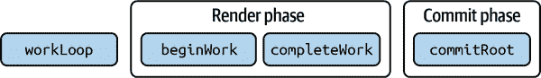
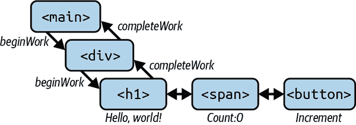
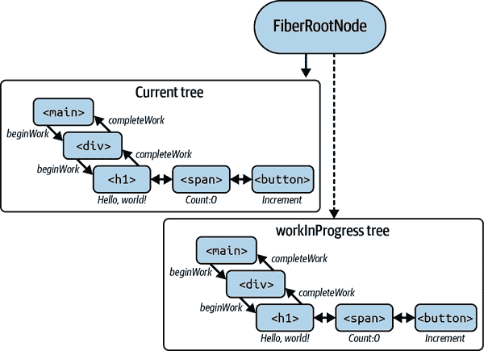

# 第四章：内部协调

要真正精通 React，我们需要理解它的功能 *做什么*。到目前为止，我们已经理解了 JSX 和 `React.createElement`。我们还在某种程度上理解了虚拟 DOM。让我们在本章中探讨它在 React 中的实际应用，并理解 `ReactDOM.createRoot(element).​ren⁠der()` 做了什么。具体来说，我们将探讨 React 如何构建其虚拟 DOM，然后通过称为协调的过程更新真实 DOM。

# 理解协调过程

简而言之，React 的虚拟 DOM 是我们期望的 UI 状态的蓝图。React 接受这个蓝图，并通过一种称为 *协调* 的过程，在给定的主机环境（通常是 Web 浏览器，但也可能是其他环境，如 shell、iOS 和 Android 等）中将其变为现实。

考虑以下代码片段：

```
import { useState } from "react";

const App = () => {
  const [count, setCount] = useState(0);

  return (
    <main>
      <div>
        <h1>Hello, world!</h1>
        <span>Count: {count}</span>
        <button onClick={() => setCount(count + 1)}>Increment</button>
      </div>
    </main>
  );
};
```

以下代码片段包含了我们想要的 UI 状态的声明性描述：一个元素树。我们的团队成员和 React 都可以阅读并理解，我们试图创建一个带有增量按钮的计数器应用程序。为了理解协调，让我们了解当 React 面对这样一个组件时内部做了什么。

首先，JSX 变成了一棵 React 元素树。这就是我们在第三章中看到的。当调用时，`App` 组件返回一个 React 元素，其子元素是进一步的 React 元素。对我们来说，React 元素是不可变的，表示 UI 的期望状态。它们不是实际的 UI 状态。React 元素是由 `React.createElement` 或 JSX `<` 符号创建的，因此这将被转译为：

```
const App = () => {
  const [count, setCount] = useState(0);

  return React.createElement(
    "main",
    null,
    React.createElement(
      "div",
      null,
      React.createElement("h1", null, "Hello, world!"),
      React.createElement("span", null, "Count: ", count),
      React.createElement(
        "button",
        { onClick: () => setCount(count + 1) },
        "Increment"
      )
    )
  );
};
```

这将给我们提供一个创建的 React 元素树，看起来像这样：

```
{
  type: "main",
  props: {
    children: {
      type: "div",
      props: {
        children: [
          {
            type: "h1",
            props: {
              children: "Hello, world!",
            },
          },
          {
            type: "span",
            props: {
              children: ["Count: ", count],
            },
          },
          {
            type: "button",
            props: {
              onClick: () => setCount(count + 1),
              children: "Increment",
            },
          },
        ],
      },
    },
  },
}
```

这个片段代表了来自我们 `Counter` 组件的虚拟 DOM。由于这是第一次渲染，此树现在使用最少的调用到命令式 DOM API 提交给浏览器。React 如何确保最少的调用到命令式 DOM API？通过将 vDOM 更新批处理为一个真实 DOM 更新，并尽可能少地触及 DOM，这是前几章讨论的原因。让我们深入探讨一些细节，以完全理解批处理的工作方式。

# 批处理

在第三章中，我们讨论了浏览器中的文档片段作为 DOM 内置 API 的一部分：轻量级容器，保存像临时暂存区域一样的 DOM 节点集合，允许您进行多个更改，而不影响主 DOM，直到最后将文档片段附加到 DOM，触发单一回流和重绘。

以类似的方式，React 在协调过程中批量更新真实 DOM，将多个虚拟 DOM 更新合并为单个 DOM 更新。这样做减少了真实 DOM 需要更新的次数，因此有助于提升 Web 应用的性能。

要理解这一点，让我们考虑一个组件，在快速连续更新其状态多次：

```
function Example() {
  const [count, setCount] = useState(0);

  const handleClick = () => {
    setCount((prevCount) => prevCount + 1);
    setCount((prevCount) => prevCount + 1);
    setCount((prevCount) => prevCount + 1);
  };

  return (
    <div>
      <p>Count: {count}</p>
      <button onClick={handleClick}>Increment</button>
    </div>
  );
}
```

在这个示例中，`handleClick`函数快速连续调用`setCount`三次。如果没有批处理，React 将分别三次更新实际 DOM，尽管`count`的值只改变了一次。这将是低效且慢。

然而，由于 React 批处理更新，它使得*一次*更新 DOM 为`count + 3`而不是每次为`count + 1`分别更新三次。

为了计算对 DOM 的最高效批量更新，React 将创建一个新的 vDOM 树，作为当前 vDOM 树的一个分支，带有更新后的值，其中`count`是`3`。这棵树将需要与当前在浏览器中的内容进行*调和*，有效地将`0`变为`3`。然后 React 将计算出仅需一次更新 DOM，使用新的 vDOM 值`3`而不是手动三次更新 DOM。这就是批处理如何适应图片的一部分，这也是我们即将深入探讨的更广泛主题：调和，或者调和下一个预期 DOM 状态与当前 DOM 的过程。

在我们了解现代 React 在内部执行之前，让我们探讨 React 在 16 版本之前使用的遗留“栈”调和器进行调和的方式。这将帮助我们理解今天流行的 Fiber 调和器的必要性。

###### 注意

此时，值得一提的是，我们即将讨论的所有主题都是 React 的实现细节，随着时间的推移可能会发生变化。在这里，我们将 React 的工作机制与 React 的实际应用隔离开来。我们的目标是通过理解 React 的内部机制，更有效地在应用程序中使用 React。

# 先前的艺术

早期，React 使用栈数据结构进行渲染。为了确保我们理解一致，让我们简要讨论栈数据结构。

## 栈调和器（遗留）

在计算机科学中，栈是一种遵循后进先出（LIFO）原则的线性数据结构。这意味着最后添加到栈中的元素将是第一个被移除的。栈具有两个基本操作，push 和 pop，分别允许从栈顶添加和移除元素。

栈可以被视为一组垂直排列的元素，其中最顶部的元素是最近添加的元素。这里有一个栈的 ASCII 示例，包含三个元素：

```
-----
| 3 |
|___|
| 2 |
|___|
| 1 |
|___|
```

在这个示例中，最近添加的元素是`3`，位于栈顶。第一个添加的元素`1`位于栈底。

在这个栈中，push 操作将一个元素添加到栈顶。在代码中，这可以使用 JavaScript 中的数组和`push`方法执行，如下所示：

```
const stack = [];

stack.push(1); // stack is now [1]
stack.push(2); // stack is now [1, 2]
stack.push(3); // stack is now [1, 2, 3]
```

`pop` 操作从栈中移除顶部元素。在代码中，可以使用数组和 `pop` 方法来执行 JavaScript 中的这个操作，如下所示：

```
const stack = [1, 2, 3];

const top = stack.pop(); // top is now 3, and stack is now [1, 2]
```

在这个例子中，`pop` 方法从栈中移除顶部元素（`3`）并返回它。现在栈数组中包含剩余的元素（`1` 和 `2`）。

React 的原始协调器是一种基于栈的算法，用于比较旧的和新的虚拟树，并相应地更新 DOM。虽然栈协调器在简单情况下工作良好，但随着应用程序规模和复杂性的增长，它带来了一些挑战。

让我们快速看一下为什么会这样。为此，我们将考虑一个需要进行更新的列表示例：

1.  一个非必要的计算昂贵的组件会消耗 CPU 并进行渲染。

1.  用户在 `input` 元素中键入。

1.  `Button` 如果输入有效则变为可用。

1.  包含 `Form` 组件持有状态，因此会重新渲染。

在代码中，我们会这样表达：

```
import React, { useReducer } from "react";

const initialState = { text: "", isValid: false };

function Form() {
  const [state, dispatch] = useReducer(reducer, initialState);

  const handleChange = (e) => {
    dispatch({ type: "handleInput", payload: e.target.value });
  };

  return (
    <div>
      <ExpensiveComponent />
      <input value={state.text} onChange={handleChange} />
      <Button disabled={!state.isValid}>Submit</Button>
    </div>
  );
}

function reducer(state, action) {
  switch (action.type) {
    case "handleInput":
      return {
        text: action.payload,
        isValid: action.payload.length > 0,
      };
    default:
      throw new Error();
  }
}
```

在此情况下，栈协调器会按顺序渲染更新而无法暂停或延迟工作。如果计算昂贵的组件阻塞渲染，则用户输入将在屏幕上显示出可观的延迟。这会导致糟糕的用户体验，因为文本字段将无响应。相反，能够识别用户输入作为高优先级更新，而不是渲染非必要的昂贵组件，并更新屏幕以反映输入，延迟渲染计算昂贵的组件，会更加愉快。

如果被用户输入等高优先级渲染工作打断，则需要能够中止当前渲染工作。为了做到这一点，React 需要对某些类型的渲染操作有优先级的概念，以区分它们。

栈协调器未对更新进行优先级排序，这意味着较不重要的更新可能会阻塞更重要的更新。例如，对工具提示的低优先级更新可能会阻塞对文本输入的高优先级更新。虚拟树的更新按接收顺序执行。

在 React 应用中，虚拟树的更新可以有不同的重要性级别。例如，对表单输入的更新可能比更新显示帖子上点赞数的指示器更重要，因为用户直接与输入交互并期望它响应迅速。

在栈协调器中，更新按接收顺序执行，这意味着较不重要的更新可能会阻塞更重要的更新。例如，如果点赞计数器更新在表单输入更新之前接收，点赞计数器更新将首先执行并可能阻塞表单输入更新。

如果点赞计数器更新需要很长时间执行（例如，因为它正在执行昂贵的计算），这可能会导致用户界面中的明显延迟或卡顿，特别是如果用户在更新期间与应用程序交互。

栈协调器的另一个挑战是它不允许更新被中断或取消。这意味着即使栈协调器具有更新优先级的概念，也无法保证能够很好地处理各种优先级，因为在安排高优先级更新时无法放弃不重要的工作。

在任何网络应用程序中，不是所有的更新都是平等的：一个随机意外出现的通知并不像响应我点击按钮那样重要，因为后者是一个有意的动作，需要立即反应，而前者甚至可能是不期望的，甚至可能不受欢迎。

在栈协调器中，更新无法被中断或取消，这意味着有时会以牺牲用户交互的方式进行不必要的更新，例如显示 toast，这可能导致在虚拟树和 DOM 上执行不必要的工作，从而对应用程序的性能产生负面影响。

栈协调器在应用程序增大并复杂化时提出了许多挑战。主要的挑战集中在卡顿和用户界面反应迟缓上。为了解决这些问题，React 团队开发了一种新的协调器称为 Fiber 协调器，它基于一种称为 Fiber 树的不同数据结构。让我们在下一节中探讨这种数据结构。

# Fiber 协调器

Fiber 协调器涉及使用一种称为“Fiber”的不同数据结构，它表示协调器的单个工作单位。Fibers 是从我们在第三章中涵盖的 React 元素创建的，其主要区别在于它们是有状态和长寿命的，而 React 元素是短暂的和无状态的。

Redux 的维护者、著名 React 专家 Mark Erikson 将 Fibers 描述为“React 在某一时刻表示实际组件树的内部数据结构”。事实上，这是一个理解 Fibers 的好方法，这也符合 Mark 的品牌形象，因为他目前全职致力于使用 Replay 进行时间旅行调试 React 应用程序：这是一种工具，允许您回放和重现应用程序状态进行调试。如果您尚未了解，请访问[Replay.io](https://www.replay.io)获取更多信息。

与 vDOM 是元素树类似，React 在协调过程中使用 Fiber 树，正如其名称所示，它是一棵 Fibers 树，直接模拟 vDOM。

## Fiber 作为数据结构

React 中的 Fiber 数据结构是 Fiber 协调器的关键组成部分。Fiber 协调器允许优先级更新并行执行，从而改善 React 应用程序的性能和响应能力。让我们更详细地探讨 Fiber 数据结构。

在其核心，Fiber 数据结构是 React 应用程序中组件实例及其状态的表示。如前所述，Fiber 数据结构被设计为可变实例，并且可以在协调过程中根据需要进行更新和重新排列。

每个 Fiber 节点的实例都包含有关其所代表组件的信息，包括其 props、state 和子组件。Fiber 节点还包含其在组件树中的位置信息，以及由 Fiber 调节器使用的元数据，以优先和执行更新。

这是一个简单的 Fiber 节点示例：

```
{
  tag: 3, // 3 = ClassComponent
  type: App,
  key: null,
  ref: null,
  props: {
    name: "Tejas",
    age: 30
  },
  stateNode: AppInstance,
  return: FiberParent,
  child: FiberChild,
  sibling: FiberSibling,
  index: 0,
  //...
}
```

在本例中，我们有一个代表 `App` 的 `ClassComponent` 的 Fiber 节点。Fiber 节点包含有关组件以下信息：

`tag`

在这种情况下，它是 `3`，React 用它来识别类组件。每种类型的组件（类组件、函数组件、Suspense 和错误边界、片段等）都有自己的数字 ID 作为 Fiber。

`type`

`App` 指的是此 Fiber 所代表的功能或类组件。

`props`

(`{name: "Tejas", age: 30}`) 代表组件的输入 props 或函数的输入参数。

`stateNode`

此 Fiber 所代表的 `App` 组件的实例。

在组件树中的位置：`return`、`child`、`sibling` 和 `index` 分别为 Fiber 调节器提供了一种“遍历树”的方式，识别父级、子级、兄弟节点和 Fiber 的索引。

Fiber 调节涉及比较当前 Fiber 树和下一个 Fiber 树，并确定哪些节点需要更新、添加或移除。

在协调过程中，Fiber 调节器为虚拟 DOM 中的每个 React 元素创建一个 Fiber 节点。有一个名为 `createFiberFrom​Ty⁠peAndProps` 的函数执行此操作。当然，另一种说“类型和 props”的方法是称其为 React 元素。正如我们所记得的，React 元素就是这样的：类型和 props：

```
{
  type: "div",
  props: {
    className: "container"
  }
}
```

此函数返回一个从元素派生的 Fiber。一旦创建了 Fiber 节点，Fiber 调节器使用一个 *工作循环* 更新用户界面。工作循环从根 Fiber 节点开始，沿着组件树向下工作，如果需要更新，则标记每个 Fiber 节点为“脏”。一旦到达末端，它会向上走，创建一个在内存中的新 DOM 树，与浏览器分离开来，最终会提交（刷新）到屏幕上。这由两个函数表示：`beginWork` 向下遍历，标记组件为“需要更新”，而 `completeWork` 向上遍历，构建一个与浏览器分离的真实 DOM 元素树。这种屏幕外渲染过程可以随时中断和丢弃，因为用户看不到它。

Fiber 架构受游戏世界中称为“双缓冲”的概念启发，在此概念中，下一个屏幕在屏幕外准备并然后“刷新”到当前屏幕。为了更好地理解 Fiber 架构，让我们在继续之前更详细地了解这个概念。

## 双缓冲

双缓冲是计算机图形和视频处理中用于减少闪烁和提高感知性能的技术。该技术涉及创建两个缓冲区（或内存空间）来存储图像或帧，并定期在它们之间切换以显示最终图像或视频。

以下是双缓冲在实践中的工作方式：

1.  第一个缓冲区填充了初始图像或帧。

1.  当第一个缓冲区正在显示时，第二个缓冲区会更新新数据或图像。

1.  当第二个缓冲区准备好时，它将与第一个缓冲区交换并显示在屏幕上。

1.  这个过程继续进行，第一个和第二个缓冲区定期交换以显示最终图像或视频。

通过使用双缓冲，可以减少闪烁和其他视觉伪影，因为最终图像或视频是连续显示而无中断或延迟。

Fiber 协调类似于双缓冲，当更新发生时，当前 Fiber 树被分叉并更新以反映给定用户界面的新状态。这称为*渲染*。然后，当备用树准备好并准确反映用户期望看到的状态时，它与当前树交换，类似于视频缓冲区在双缓冲中的交换。这称为协调的*提交阶段*或*提交*。

通过使用工作中的树，Fiber 协调器提供了一些好处：

+   它可以避免对真实 DOM 进行不必要的更新，从而提高性能并减少闪烁。

+   它可以在屏幕外计算 UI 的新状态，并且如果需要进行更新，则可以丢弃它。

+   由于协调是在屏幕外进行的，因此甚至可以在不影响用户当前看到的内容的情况下暂停和恢复。

使用 Fiber 协调器，从 JSX 元素的用户定义树派生出两棵树：一棵包含“当前” Fibers 的树，另一棵包含工作中的 Fibers。让我们更深入地探讨这些树。

## Fiber 协调

Fiber 协调分为两个阶段：渲染阶段和提交阶段。这种两阶段的方法，如图 4-1 所示，允许 React 在提交到 DOM 并向用户显示新状态之前随时丢弃渲染工作：它使渲染变得可中断。稍微详细一点，使渲染感觉可中断的是 React 调度器每隔 5 毫秒将执行控制权归还给主线程的启发式方法，这比 120 帧每秒的设备上的单帧还要小。



###### 图 4-1\. Fiber 调和器中的调和流程

我们将在第七章中更深入地探讨调度器的细节，因为我们将探索 React 的并发特性。但现在，让我们走过调和的这些阶段。

### 渲染阶段

*渲染阶段*在`current`树中发生状态更改事件时开始。React 通过递归地遍历每个 Fiber 并设置标志来在`alternate`树中进行更改（请参见图 4-2）。正如我们之前提到的，这在 React 内部的一个名为`beginWork`的函数中发生。



###### 图 4-2\. 渲染阶段的调用顺序

#### beginWork

`beginWork`负责在工作中的树上设置有关 Fiber 节点是否应更新的标志。它设置了一堆标志，然后递归地转到下一个 Fiber 节点，做同样的事情，直到到达树的底部。当它完成时，我们开始在 Fiber 节点上调用`completeWork`并向上走。

`beginWork`的签名如下：

```
function beginWork(
  current: Fiber | null,
  workInProgress: Fiber,
  renderLanes: Lanes
): Fiber | null;
```

更多关于`completeWork`的内容稍后再说。现在，让我们深入研究`beginWork`。其签名包括以下参数：

`current`

与当前树中的 Fiber 节点对应的工作中进度节点的引用。这用于确定先前版本和树的新版本之间的变化，以及需要更新的内容。这个引用*永远不会*被改变，只用于比较。

`workInProgress`

正在更新的工作中树中的 Fiber 节点。如果更新并由函数返回，此节点将被标记为“脏”。

`renderLanes`

渲染通道是 React 的 Fiber 调和器中的一个新概念，取代了旧的`renderExpirationTime`。它比旧的`renderExpirationTime`概念更复杂，但它可以让 React 更好地优先处理更新，并使更新过程更高效。由于`renderExpirationTime`已被弃用，我们将在本章重点关注`renderLanes`。

它本质上是一个位掩码，表示正在处理更新的“通道”。通道是一种根据其优先级和其他因素对更新进行分类的方式。当对 React 组件进行更改时，根据其优先级和其他特征，为其分配一个通道。更改的优先级越高，分配给它的通道就越高。

`renderLanes`值被传递给`beginWork`函数，以确保更新按正确顺序处理。分配给优先级较高通道的更新在分配给优先级较低通道的更新之前处理。这确保了高优先级更新，例如影响用户交互或可访问性的更新，尽快得到处理。

除了优先处理更新外，`renderLanes` 还帮助 React 更好地管理并发。React 使用一种称为“时间切片”的技术，将长时间运行的更新分解为更小、更易管理的块。`renderLanes` 在这个过程中发挥着关键作用，因为它允许 React 确定哪些更新应该首先处理，哪些更新可以推迟到以后。

渲染阶段完成后，将调用 `getLanesToRetrySynchronouslyOnError` 函数，以确定在渲染阶段是否创建了任何延迟更新。如果存在延迟更新，则 `updateComponent` 函数启动一个新的工作循环来处理它们，使用 `beginWork` 和 `getNextLanes` 处理更新，并根据它们的通道对其进行优先处理。

我们将在第七章中深入探讨渲染通道，即关于并发的即将到来的章节。现在，让我们继续跟随 Fiber 协调流程。

#### completeWork

`completeWork` 函数将更新应用于工作中的 Fiber 节点，并构建一个表示应用程序更新状态的新实际 DOM 树。它在浏览器可见性平面之外构建这棵树。

如果宿主环境是浏览器，这意味着执行诸如 `document.​crea⁠teElement` 或 `newElement.appendChild` 之类的操作。请记住，这些元素树尚未附加到浏览器文档中：React 只是在屏幕外创建 UI 的下一个版本。在屏幕外进行这项工作使其可中断：React 正在计算的下一个状态尚未绘制到屏幕上，因此可以在安排了一些更高优先级的更新时丢弃它。这就是 Fiber 协调器的全部目的。

`completeWork` 的签名如下：

```
function completeWork(
  current: Fiber | null,
  workInProgress: Fiber,
  renderLanes: Lanes
): Fiber | null;
```

在这里，签名与 `beginWork` 的签名相同。

`completeWork` 函数与 `beginWork` 函数密切相关。虽然 `beginWork` 负责在 Fiber 节点上设置关于“应该更新”状态的标志，`completeWork` 负责构建一个新的树以提交到宿主环境。当 `completeWork` 达到顶部并构建了新的 DOM 树时，我们说“渲染阶段完成了”。现在，React 进入提交阶段。

### 提交阶段

*提交阶段*（见图 4-3）负责使用在渲染阶段对虚拟 DOM 所做的更改来更新实际 DOM。在提交阶段，新的虚拟 DOM 树被提交到宿主环境，工作中的树被当前树替换。在这个阶段，也会运行所有的效果。提交阶段分为两部分：变异阶段和布局阶段。



###### 图 4-3\. 带有 `FiberRootNode` 的提交阶段

#### 变异阶段

突变阶段是提交阶段的第一部分，负责使用对虚拟 DOM 所做更改来更新实际 DOM。在此阶段，React 识别需要进行的更新，并调用名为 `commitMutationEffects` 的特殊函数。该函数将在渲染阶段对备用树中的 Fiber 节点所做的更新应用到实际 DOM 中。

这是 `commitMutationEffects` 可能实现的完整伪代码示例：

```
function commitMutationEffects(Fiber) {
  switch (Fiber.tag) {
    case HostComponent: {
      // Update DOM node with new props and/or children
      break;
    }
    case HostText: {
      // Update text content of DOM node
      break;
    }
    case ClassComponent: {
      // Call lifecycle methods like componentDidMount and componentDidUpdate
      break;
    }
    // ... other cases for different types of nodes
  }
}
```

在变异阶段，React 还调用其他特殊函数，例如 `commitUn​mount` 和 `commitDeletion`，以移除不再需要的 DOM 节点。

#### 布局阶段

布局阶段是提交阶段的第二部分，负责计算 DOM 中更新节点的新布局。在此阶段，React 调用名为 `commitLayoutEffects` 的特殊函数。该函数计算 DOM 中更新节点的新布局。

类似于 `commitMutationEffects`，`commitLayoutEffects` 也是一个巨大的 switch 语句，根据正在更新的节点类型调用不同的函数。

一旦布局阶段完成，React 就成功更新了实际 DOM，以反映在渲染阶段对虚拟 DOM 所做的更改。

通过将提交阶段分为两部分（突变和布局），React 能够以高效的方式将更新应用于 DOM。通过与协调器中的其他关键函数协作，提交阶段有助于确保 React 应用程序在变得更复杂并处理更多数据时仍然快速、响应迅速且可靠。

#### 效果

在 React 协调过程的提交阶段，副作用按特定顺序执行，具体取决于效果类型。提交阶段可能会发生多种类型的效果，包括：

放置效果

这些效果发生在将新组件添加到 DOM 时。例如，如果向表单添加新按钮，则会发生放置效果，将按钮添加到 DOM 中。

更新效果

这些效果发生在使用新属性或状态更新组件时。例如，如果按钮的文本更改，则会发生更新效果，以更新 DOM 中的文本。

删除效果

这些效果发生在组件从 DOM 中移除时。例如，如果从表单中移除按钮，则会发生删除效果，将按钮从 DOM 中移除。

布局效果

这些效果发生在浏览器有机会绘制之前，用于更新页面的布局。布局效果通过函数组件中的 `useLayoutEffect` 钩子和类组件中的 `componentDidUpdate` 生命周期方法管理。

与这些提交阶段效果相反，被动效果是用户定义的效果，计划在浏览器完成绘制后运行。被动效果使用 `useEffect` 钩子管理。

被动效应非常适合执行对页面初始渲染不关键的操作，例如从 API 获取数据或执行分析跟踪。由于被动效应不会在渲染阶段执行，因此不会影响计算将用户界面带入开发者所需状态所需的最小更新时间。

### 把所有内容显示在屏幕上

React 在两棵树之上维护一个名为`FiberRootNode`的数据结构，指向其中一棵树：`current` 或 `workInProgress`。`FiberRootNode` 是一个关键数据结构，负责管理协调过程的提交阶段。

当对虚拟 DOM 进行更新时，React 更新`workInProgress`树，同时保持当前树不变。这使得 React 能够继续渲染和更新虚拟 DOM，同时保持应用程序的当前状态。

当渲染过程完成时，React 调用一个名为`commitRoot`的函数，负责将对`workInProgress`树所做的更改提交到实际的 DOM。`commitRoot`将`FiberRootNode`的指针从当前树切换到`workInProgress`树，使`workInProgress`树成为新的当前树。

从此刻起，任何未来的更新都基于新的当前树。这个过程确保应用程序保持一致的状态，并且更新被正确高效地应用。

所有这些看起来在浏览器中瞬间发生。这是协调的工作。

# 章节复习

在本章中，我们探讨了 React 协调的概念，并了解了 Fiber 协调器。我们还学习了有关 Fibers 的知识，它们与强大的调度程序一起实现了高效和可中断的渲染。我们还学习了渲染阶段和提交阶段，这是协调过程的两个主要阶段。最后，我们了解了`FiberRootNode`：负责管理协调过程提交阶段的关键数据结构。

# 复习问题

让我们自问几个问题，以测试我们对本章概念的理解：

1.  什么是 React 协调？

1.  Fiber 数据结构的作用是什么？

1.  为什么我们需要两棵树？

1.  当应用程序更新时会发生什么？

如果我们能回答这些问题，我们就能更好地理解 Fiber 协调器和 React 中的协调过程。

# 接下来

在第五章中，我们将探讨 React 中的常见问题并探索一些高级模式。我们将回答关于何时使用`useMemo`和何时使用`React.lazy`的问题。我们还将探讨如何使用`useReducer`和`useContext`来管理 React 应用程序中的状态。

我们到那里见！
