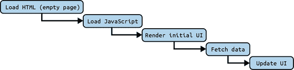

# 第六章：服务器端的 React

React 自其创立以来发生了很大的变化。尽管它起初是一个客户端库，但随着时间的推移，基于服务器端的渲染（SSR）的需求因我们将在本章中了解的原因而不断增长。我们将一起探索服务器端的 React，并理解它与仅客户端 React 的区别，以及如何利用它来提升我们的 React 应用程序。

正如我们在早期章节中讨论的那样，React 最初由 Meta 开发，以满足高效和可扩展用户界面的需求。在第三章中，我们看到它通过虚拟 DOM 实现这一点，这使得开发人员能够轻松地创建和管理 UI 组件。React 的客户端方法解锁了全网快速响应的用户体验。然而，随着 Web 的不断发展，客户端渲染的局限性变得越来越明显。

# 客户端渲染的局限性

自 2013 年首次作为开源软件发布以来，使用 React 构建用户界面。最终，这种方法的一些局限性开始显现。这些局限性最终导致我们将更多的关注点转移到服务器端。

## SEO

客户端渲染的一个显著局限性是，搜索引擎爬虫可能无法正确索引内容，因为其中一些不执行 JavaScript，或者那些执行 JavaScript 的爬虫可能不会按照我们的预期执行。

考虑到各种搜索引擎爬虫的多样实现，以及许多爬虫是专有且对公众不可知的，这使得仅客户端渲染在特定网站或应用程序的覆盖范围方面显得有些值得怀疑。

话虽如此，2015 年的一篇文章（[来自 Search Engine Land](https://oreil.ly/r5hF2)）描述了一些测试，以测试各种搜索引擎如何处理仅客户端应用程序，以下是它们提到的内容：

> 我们进行了一系列测试，验证了 Google 能够执行和索引多种实现的 JavaScript。我们还确认了 Google 能够渲染整个页面并读取 DOM，从而索引动态生成的内容。

本文发现，截至撰写本文时，Google 和 Bing 已经足够先进，能够索引仅客户端的网站，但最终这只是一个研究项目，在一个广阔而不可知的专有海洋中仅仅是一个研究项目。

因此，尽管仅客户端应用程序在现代搜索引擎中可能表现良好，但没有基于服务器的对应方案存在固有风险。在传统的 Web 应用程序中，当用户或搜索引擎爬虫请求页面时，服务器会渲染页面的 HTML 并将其返回。HTML 包含所有内容、链接和数据，使得搜索引擎爬虫可以轻松读取和索引内容，用于搜索引擎结果，因为页面的所有内容仅仅是文本，即标记。

然而，在使用像 React 这样的库或框架构建的客户端渲染应用程序中，服务器返回一个几乎为空的 HTML 文件，其唯一任务是从同一服务器或备用服务器上的单独 JavaScript 文件中加载 JavaScript。然后，JavaScript 文件在浏览器中下载和执行，动态渲染页面内容。这种方法提供了流畅的用户体验，类似于本地应用程序，但在搜索引擎优化（SEO）和性能方面存在缺点：在第一次请求时，我们没有下载任何有用的东西给人类读者，而是必须在页面加载后立即进行另一个请求，获取将为整个站点提供动力的 JavaScript。这被称为网络瀑布效应。

因此，客户端仅渲染的另一个缺点是性能问题。让我们来谈谈这个问题。

## 性能

客户端渲染的应用程序可能会因性能问题而受到影响，特别是在网络较慢或设备性能较弱的情况下。在渲染内容之前需要下载、解析和执行 JavaScript，这可能导致内容渲染的显著延迟。这个“交互时间”是一个关键指标，直接影响用户参与度和跳出率（用户放弃页面的速率）。如果加载时间过长，用户可能会离开页面，这种行为进一步会对页面的 SEO 排名产生负面影响。

此外，如果设备性能低，CPU 可用性较少，仅客户端渲染还会导致糟糕的用户体验。这是因为设备可能没有足够的处理能力来快速执行 JavaScript，导致应用程序运行缓慢且响应迟钝。这可能会导致用户感到沮丧和不良的用户体验。如果我们在服务器上执行这些 JavaScript，并向客户端发送最少的数据或标记，那么低功率客户端不需要做太多工作，因此用户体验会更好。

从更广泛的角度来看，客户端渲染应用程序中的 SEO 和性能问题突显了遵循 web 标准和最佳实践的重要性。它们也强调了服务器端渲染或静态网站生成作为提供内容的可靠替代方案的需求，尤其是对于内容丰富的站点或应用程序而言。

渐进增强原则，即向所有浏览器传递基本内容和功能，而将高级特性作为增强功能，与这些选择非常契合。通过在服务器端渲染核心内容，确保所有用户和搜索引擎都可以访问基本内容和功能，而不受 JavaScript 执行的影响。然后，客户端 JavaScript 可以通过增加交互性、更丰富的动画和其他高级功能，增强用户体验。仅将整个体验设计为仅基于客户端 JavaScript 是没有意义的，因为这不是 Web 的原始设计。JavaScript 的角色是*增强*网页，而不是*成为*网页。

考虑以下例子：

```
import React, { useEffect, useState } from "react";

const Home = () => {
  const [data, setData] = useState([]);

  useEffect(() => {
    fetch("https://api.example.com/data")
      .then((response) => response.json())
      .then((data) => setData(data));
  }, []);

  return (
    <div>
      {data.map((item) => (
        <div key={item.id}>{item.title}</div>
      ))}
    </div>
  );
};

export default Home;
```

在这个例子中，我们从一个 API 获取数据，并在客户端上渲染它。我们可以通过使用`useEffect`钩子来获取数据，并使用`useState`钩子将数据存储在状态中，来判断这是客户端操作。`useEffect`钩子仅在浏览器（客户端）中执行。

一个严重的限制是，一些搜索引擎爬虫可能无法看到这些内容，除非我们实现服务器端渲染。否则，他们可能会看到一个空白屏幕或回退信息，这可能会导致较差的 SEO。

客户端应用程序仅仅是网络瀑布的另一个常见问题，即在初始页面加载时，需要下载、解析和执行大量 JavaScript，导致网站或 Web 应用在相当长时间内不可响应，尤其是在网络连接受限的情况下。

在这个例子中，我们正在向外部 API 端点（`https://api.example.com/data`）发起数据获取请求以检索一些数据。这种获取发生在我们的初始 JavaScript 包被下载、解析和执行之后，而这只会发生在初始 HTML 加载之后。这是一个网络瀑布，导致性能不佳。如果我们可视化它，看起来会像是图 6-1。



###### 图 6-1\. 数据获取请求

真是糟糕。使用服务器端渲染，我们可以做得更好，使用户能够立即看到有用的内容，从而修改图表如下所示：

```
Load HTML (full UI, with data fetched on the server)
```

实际上，首次加载已经包含了对用户有用的信息，因为我们在服务器上获取了数据并渲染了我们的组件。这里没有瀑布效应，用户立即获得所有信息。这就是服务器端渲染的价值所在。

截至 React 18 版本，React 和 React DOM 的捆绑大小分别为 6.4 kB 和 130.2 kB。这些大小是在撰写本文时的最新 React 版本，实际使用中可能因 React 的版本和配置而有所不同。这意味着即使在生产环境中，我们的用户也必须单独下载约 136 kB 的 JavaScript 仅用于 React（即 React + React DOM），然后才能下载、解析和执行我们应用程序其余的代码。这可能导致初始页面加载较慢，尤其是在较慢的设备和网络上，可能会让用户感到沮丧。此外，因为 React 基本上控制了 DOM，在仅客户端应用程序中没有 React，我们的用户没有选择，只能等待 React 和 React DOM 首先加载，然后才加载应用程序的其余部分。

相比之下，服务器呈现的应用程序将在任何 JavaScript 下载之前向客户端流式传输呈现的 HTML，使用户可以立即获取有意义的内容。然后，在初始页面呈现后，可能在用户还在通过称为“hydration”过程的用户界面定位自己时，加载相关的 JavaScript。接下来的部分将更详细讨论这一点。

最初通过流式呈现的 HTML，然后通过 JavaScript 注入 DOM，使用户能够更早地与应用程序进行交互，从而获得更好的用户体验：用户可以立即使用，而无需等待可能甚至不需要加载的任何额外内容。

## 安全性

仅客户端渲染也可能存在安全问题，特别是在处理敏感数据时。这是因为应用程序的所有代码都会下载到客户端的浏览器中，使其容易受到跨站请求伪造（CSRF）等攻击的影响。

谈到 CSRF，一种常见的减少其影响的方法是控制向用户提供网站或 Web 应用程序的服务器。如果我们控制了这个服务器，我们可以从服务器发送适当的反 CSRF 令牌作为可信来源到客户端，然后客户端通过表单或类似方式提交令牌回服务器，服务器可以验证请求来自正确的客户端。这是一种常见的减少 CSRF 攻击的方式。

尽管从我们控制的静态站点服务器上提供仅客户端应用程序并以此方式减少 CSRF 攻击是技术上可行的，但总体上并不是最佳的网站服务方式，因为我们到目前为止讨论的其他权衡。如果我们确实控制了服务器，那么为什么不从那里添加 SSR 呢？

最终，这就是我们要说的：

+   如果我们没有访问服务器端的权限，但在一个团队中工作，只需要`git push`前端客户端代码，然后它就会神奇地部署到某个地方，这里存在固有的 CSRF 风险。

+   如果我们可以访问服务器端，并且我们的网站或 Web 应用仍然仅限于客户端，我们已经可以相当好地缓解 CSRF，并且其周围的安全风险也随之消失。

+   如果我们可以访问服务器端，并且我们的网站或 Web 应用仍然仅限于客户端，那么我们有充分理由为其添加服务器端渲染，因为我们可以访问服务器，从而实现我们已经涵盖的关于 SEO 和性能的其他好处。

让我们变得更加实际，考虑以下示例：

```
import React, { useState } from "react";

const Account = () => {
  const [balance, setBalance] = useState(100);

  const handleWithdrawal = async (amount) => {
    // Assume this request goes to a server to process the withdrawal
    const response = await fetch("/withdraw", {
      method: "POST",
      headers: {
        "Content-Type": "application/json",
      },
      credentials: "include",
      body: JSON.stringify({ amount }),
    });

    if (response.ok) {
      const updatedBalance = await response.json();
      setBalance(updatedBalance);
    }
  };

  return (
    <div>
      <h1>Account Balance: {balance}</h1>
      <button onClick={() => handleWithdrawal(10)}>Withdraw $10</button>
      <button onClick={() => handleWithdrawal(50)}>Withdraw $50</button>
      <button onClick={() => handleWithdrawal(100)}>Withdraw $100</button>
    </div>
  );
};

export default Account;
```

在这段代码中，`handleWithdrawal` 发送 `POST` 请求到一个假设的服务器端点 `/withdraw` 处理提款。如果此端点未正确验证请求的来源并且不需要任何形式的反 CSRF 令牌，则可能存在 CSRF 风险。

攻击者可以创建一个恶意网页，欺骗用户点击按钮，然后代表用户向 `/withdraw` 端点发送 `POST` 请求，可能导致从用户账户未经授权地提取资金。这是因为浏览器会自动在请求中包含 cookie，服务器使用这些 cookie 来验证用户身份。如果服务器不验证请求的来源，可能会被欺骗处理请求并将资金发送到攻击者的账户。

如果此组件在客户端渲染，则可能会容易受到 CSRF 攻击的影响，因为服务器和客户端之间没有共享的公共秘密或契约。用诗意的语言来说，客户端和服务器彼此不认识。这可能允许攻击者窃取资金或操纵应用程序的数据。

如果我们采用服务器端渲染，我们可以通过在服务器上使用特殊生成的秘密令牌来渲染组件，然后将包含秘密令牌的 HTML 发送给客户端，来缓解这些安全问题。客户端随后将此令牌发送回发出令牌的服务器，建立一个安全的双向契约。这样服务器就可以验证请求来自于预授权的正确客户端，而不是一个可能是恶意攻击者的未知客户端。

# 服务器端渲染的兴起

出于这些原因，服务器端渲染已经成为提高 Web 应用性能和用户体验的一种可以说是更优越的技术。通过服务器渲染，应用程序可以针对速度和可访问性进行优化，从而实现更快的加载时间、更好的 SEO 和提高的用户参与度。

## 服务器端渲染的好处

让我们更深入地探讨服务器端渲染的好处。当我们进一步理解仅客户端渲染的局限性时，这些好处应该会立即显现：

使用服务器端渲染的首次有意义绘制时间更快。

这是因为服务器可以渲染初始的 HTML 标记并将其发送到客户端，客户端可以立即显示。这与仅在客户端渲染不同，后者必须等待 JavaScript 被下载、解析和执行后才能渲染应用程序。

服务器渲染改善了 Web 应用程序的可访问性。

网速慢或设备性能低的用户，如果收到完全渲染的 HTML 而不是等待客户端 JavaScript 加载和渲染页面，可能会有更好的体验。

服务器渲染可以提升 Web 应用程序的 SEO。

当搜索引擎爬虫索引您的站点时，它们可以看到完全渲染的 HTML，这样更容易理解您站点的内容和结构。

服务器渲染还可以提升 Web 应用程序的安全性。

通过在服务器端渲染核心内容，可以确保所有用户和搜索引擎都可以访问基本内容和功能，而不受 JavaScript 执行的影响。然后，客户端 JavaScript 可以通过为支持它们的浏览器和设备添加互动性、更丰富的动画和其他高级功能，来增强用户体验。

然而，服务器渲染的 HTML 是静态的，缺乏初始加载时的互动性。它不包含任何事件监听器或其他动态功能。要启用用户交互和其他动态功能，必须使用必要的 JavaScript 代码“hydrate”静态 HTML。让我们更好地理解 hydration 的概念。

# Hydration

**Hydration** 是一个术语，用于描述将事件监听器和其他 JavaScript 功能附加到在服务器上生成并发送到客户端的静态 HTML 的过程。hydration 的目标是使服务器渲染的应用程序在加载到浏览器后变得完全交互，从而为用户提供快速流畅的体验。

在一个 React 应用程序中，**hydration** 是指在客户端下载了服务器渲染的 React 应用程序之后发生的过程。

加载客户端 bundle

当浏览器渲染静态 HTML 时，它也会下载并解析包含应用程序代码的 JavaScript bundle。该 bundle 包括 React 组件和其他必要的应用程序功能代码。

附加事件监听器

一旦加载了 JavaScript bundle，React 通过将事件监听器和其他动态功能附加到 DOM 元素来“hydrate”静态 HTML。通常使用 `react-dom` 中的 `hydrateRoot` 函数来完成此操作，该函数接受根 React 组件和 DOM 容器作为参数。hydration 本质上将静态 HTML 转换为完全交互式的 React 应用程序。

完成 hydration 过程后，应用程序变得完全可交互，可以响应用户输入，获取数据，并在必要时更新 DOM。

在水合作用期间，React 将静态 HTML 中的 DOM 元素结构与通过 JSX 定义的 React 组件结构进行匹配。关键是 React 组件生成的结构必须与静态 HTML 的结构匹配。如果不匹配，React 将无法正确附加事件监听器，并且不会意识到哪个 React 元素直接映射到哪个 DOM 元素，导致应用程序的行为不符预期。

通过结合服务器端渲染和水合作用，开发者可以创建加载快速、提供平滑交互用户体验的 Web 应用程序。

## 水合作用有害

在水合作用是将服务器渲染的 HTML 变为交互式的一种绝佳方式，但也有人批评它的速度慢于必要，通常提到可恢复性作为一个更优的替代方案（见图 6-2）。让我们稍微探讨一下这个问题。


###### 图 6-2\. 水合作用

在水合作用中，我们在服务器上渲染 React 应用程序，然后将渲染输出传递给客户端。但是，在这个时间点上，什么都不是交互式的。从这里开始，浏览器需要下载客户端捆绑包，附加事件监听器，并有效地“重新渲染”客户端。这是一项繁重的工作，有时会导致内容出现在用户面前与用户实际可以使用站点之间存在延迟。

或者，可恢复性的工作方式略有不同，如图 6-3 所示。


###### 图 6-3\. 可恢复性

使用可恢复性，整个应用程序在服务器上进行渲染并流式传输到浏览器。除了初始标记外，所有交互行为都被序列化并发送到客户端。从那时起，客户端已经获得了关于如何根据需要进行交互的所有信息，因此可以在服务器离开的地方*继续*。它不需要水合（即，在客户端附加事件监听器和渲染页面），而是可以反序列化服务器提供的内容并相应地做出反应。跳过水合步骤可以导致更快的交互时间（TTI）和更好的用户体验。

虽然可恢复性有明显的好处，工程社区对于实施复杂性是否值得这个好处存在疑问。确实，这比水合作用更复杂，目前尚不清楚好处是否超过成本：是的，交互时间会快几毫秒，但实施可恢复性的复杂性是否值得？这是 React 社区仍在辩论的问题。

# 创建服务器渲染

如果您有现有的客户端 React 应用程序，您可能想知道如何将服务器渲染添加到其中。幸运的是，向现有的 React 应用程序添加服务器渲染相对简单。一种方法是使用服务器渲染框架，如 Next.js 或 Remix。虽然这些框架确实是提供服务器渲染 React 应用程序的最佳方式，但这种抽象可能会让我们中更好奇的人渴望理解用于实现此目标的基本机制。

如果您是一个好奇的人，并且有兴趣了解如何手动将服务器渲染添加到客户端 React 应用程序中，或者对框架如何实现它感兴趣，请继续阅读。再次强调，这些内容可能不适合在生产中使用，而更适合于好奇心的教育目的。

## 将客户端 React 应用程序手动添加到服务器渲染

如果您有一个客户端应用程序，这是如何向其添加服务器渲染的方式。首先，在项目的根目录中创建一个*server.js*文件。此文件将包含您的服务器代码：

```
// server.js

// Importing necessary modules
const express = require("express"); // Importing Express.js library
const path = require("path"); // Importing Path module to handle file paths
const React = require("react"); // Importing React library
// Importing ReactDOMServer for server-side rendering
const ReactDOMServer = require("react-dom/server");

// Importing the main App component from the src directory
const App = require("./src/App");

// Initializing an Express application
const app = express();

// Serving static files from the 'build' directory
app.use(express.static(path.join(__dirname, "build")));

// Handling all GET requests
app.get("*", (req, res) => {
  // Rendering the App component to an HTML string
  const html = ReactDOMServer.renderToString(<App />);

  // Sending an HTML response that includes the rendered App component
  res.send(`
 <!DOCTYPE html>
 <html>
 <head>
 <title>My React App</title>
 </head>
 <body>
 <!-- Injecting the rendered App component -->
 <div id="root">${html}</div>
 <!-- Linking to the main JavaScript bundle -->
 <script src="/static/js/main.js"></script>
 </body>
 </html>
 `);
});

// Starting the server on port 3000
app.listen(3000, () => {
  // Logging a message to the console once the server is running
  console.log("Server listening on port 3000");
});
```

在此示例中，我们使用 Express 创建一个服务器，该服务器从*./build*目录中提供静态文件，然后在服务器上渲染我们的 React 应用程序。我们还使用`ReactDOMServer`将我们的 React 应用程序渲染为 HTML 字符串，然后将其注入到发送给客户端的响应中。

在这种情况下，我们假设我们的客户端 React 应用程序有某种类型的`build`脚本，该脚本将客户端 JavaScript 捆绑包输出到名为*build*的目录中，我们在代码片段中引用该目录。这对于水合作用很重要。所有这些部分都准备就绪后，让我们继续启动我们的服务器：

```
node server.js
```

运行此命令应该会在端口 3000 上启动我们的服务器，并输出`Server listening on port 3000`。

通过这些步骤，我们现在拥有了一个服务器渲染的 React 应用程序。通过这种“窥探内部”的方法来进行服务器渲染，我们可以更深入地了解服务器渲染的工作原理，以及它如何使我们的 React 应用程序受益。

如果我们打开浏览器并访问[*http://localhost:3000*](http://localhost:3000)，我们应该看到一个服务器渲染的应用程序。我们可以通过查看页面的源代码来确认它确实是服务器渲染的，这应该显示实际的 HTML 标记，而不是空白文档。

为了完整起见，这就是 HTML 标记的样子：

```
<!DOCTYPE html>
<html>
  <head>
    <title>My React App</title>
  </head>
  <body>
    <div id="root">
      <div>
        <h1>Hello, world!</h1>
        <p>This is a simple React app.</p>
      </div>
    </div>
    <script src="/static/js/main.js"></script>
  </body>
</html>
```

这是发送到客户端的 HTML 标记。它包含我们的 React 应用程序的完全渲染的 HTML，可以被搜索引擎索引，并且可以更有效地由网络连接较慢或不可靠的用户访问。这可以为我们的 React 应用程序带来更好的 SEO 和改进的可访问性。

## 水合作用

当服务器渲染的输出到达用户端时，我们通过将 `<script>` 标签加载到文件末尾来进行 hydration。正如讨论的那样，hydration 是将事件监听器和其他 JavaScript 功能附加到在服务器上生成并发送到客户端的静态 HTML 上的过程。hydration 的目标是使服务器渲染的应用程序在加载到浏览器后能够完全交互。

如果我们想要探索应用程序客户端端 bundle 的 hydration 步骤，它将如下所示：

```
// Import necessary libraries
import React from "react";
import { hydrateRoot } from "react-dom/client";
// Assuming App is the main component of your application
import App from "./App";

// Hydrate the app on the client side
hydrateRoot(document, <App />);
```

通过服务器渲染和客户端 hydration，我们的应用程序完全交互，可以响应用户输入、获取数据并根据需要更新 DOM。

# React 中的服务器渲染 API

在前一节中，我们通过 Express 和 `ReactDOMServer` 手动向客户端 React 应用程序添加了服务器渲染。具体来说，我们使用了 `ReactDOMServer.renderToString()` 将我们的 React 应用程序渲染为 HTML 字符串。这是向 React 应用程序添加服务器渲染的最基本方法。然而，还有其他向 React 应用程序添加服务器渲染的方法。让我们深入了解 React 暴露的服务器渲染 API，并了解何时以及如何使用它们。

让我们详细考虑 `renderToString` API，探讨其使用、优势、劣势以及在何时适合在 React 应用程序中使用它。

+   它是什么

+   工作原理

+   它如何适应我们对 React 的日常使用

首先让我们谈谈它是什么。

## `renderToString`

`renderToString` 是 React 提供的一种服务端渲染 API，允许你在服务器上将一个 React 组件渲染成 HTML 字符串。该 API 是同步的，并返回一个完全渲染的 HTML 字符串，随后可以作为响应发送到客户端。`renderToString` 在服务器渲染的 React 应用中常用于提升性能、SEO 和可访问性。

### 使用方式

要使用 `renderToString`，您需要从 `react-dom/server` 包中导入 `renderToString` 函数。然后，您可以使用一个 React 组件作为其参数调用该函数。然后它将作为一个字符串返回完全渲染的 HTML。以下是使用 `renderToString` 渲染简单 React 组件的示例：

```
import React from "react";
import { renderToString } from "react-dom/server";

function App() {
  return (
    <div>
      <h1>Hello, world!</h1>
      <p>This is a simple React app.</p>
    </div>
  );
}

const html = renderToString(<App />);
console.log(html);
```

在此示例中，我们创建一个简单的 App 组件，并使用组件作为参数调用 `renderToString`。该函数返回完全渲染的 HTML，可以发送到客户端。

### 工作原理

该函数遍历 React 元素树，将它们转换为真实 DOM 元素的字符串表示，最终输出一个字符串。

在这里值得提醒的是，在 React 中，`<div>` 被转换为：

```
React.createElement("div", {}, "Hello, world!");
```

输出为：

```
{
  type: "div",
  props: {},
  children: ["Hello, world!"]
}
```

我们在前几章已经涵盖了这一点，但对于我们即将进行的讨论，这里值得回顾一下。从根本上讲，JSX 转换为 HTML 的流程如下：

```
JSX -> React.createElement -> React element -> renderToString(React element) -> HTML

```

`renderToString`作为一个 API 是同步和阻塞的，意味着它不能被中断或暂停。如果从根部开始的组件树很深，它可能需要相当多的处理。由于服务器通常为多个客户端提供服务，除非有某种缓存阻止这种情况发生，否则可能为每个客户端调用`renderToString`，并迅速阻塞事件循环并使系统超载。

从代码角度来看，`renderToString`将这个：

```
React.createElement(
  "section",
  { id: "list" },
  React.createElement("h1", {}, "This is my list!"),
  React.createElement(
    "p",
    {},
    "Isn't my list amazing? It contains amazing things!"
  ),
  React.createElement(
    "ul",
    {},
    amazingThings.map((t) => React.createElement("li", { key: t.id }, t.label))
  )
);
```

转换为这个：

```
<section id="list">
  <h1>This is my list!</h1>
  <p>Isn't my list amazing? It contains amazing things!</p>
  <ul>
    <li>Thing 1</li>
    <li>Thing 2</li>
    <li>Thing 3</li>
  </ul>
</section>
```

因为 React 是声明式的，React 元素是声明式的抽象，它们的树可以转换为任何其他东西的树——在这种情况下，React 元素的树被转换为 HTML 元素树的字符串表示。

### 缺点

虽然`renderToString`提供了几个优点，但它也有一些缺点：

性能

`renderToString`的主要缺点之一是对于大型 React 应用程序来说可能会很慢。因为它是同步的，它可能会阻塞事件循环并使服务器无响应。如果您有许多并发用户的高流量应用程序，这可能会特别成问题。

此外，`renderToString`返回一个完全渲染的 HTML 字符串，对于大型应用程序来说可能会占用大量内存。这可能导致服务器的内存使用增加，响应时间变慢，或者在高负载下导致服务器进程崩溃。

缺乏流支持

`renderToString`不支持流，这意味着整个 HTML 字符串必须在发送到客户端之前生成。这可能导致首字节时间（TTFB）较慢，客户端开始接收 HTML 的时间较长。这种限制对于内容较多的大型应用程序尤其有问题，因为客户端必须等待整个 HTML 字符串生成后才能显示任何内容。

对于更大的应用程序或`renderToString`的缺点变得问题严重的情况，React 提供了替代的服务器端渲染 API，如`renderToPipeableStream`和`renderToReadableStream`。这些 API 分别返回一个 Node.js 流和一个浏览器流，而不是完全渲染的 HTML 字符串，这可以提供更好的性能和对流的支持。我们将在下一节中更详细地介绍这些内容。

## renderToPipeableStream

`renderToPipeableStream`是在 React 18 中引入的一个服务器端渲染 API。它提供了一种更高效和灵活的方式来将大型 React 应用程序渲染到 Node.js 流。它返回一个可以传输到响应对象的流。`renderToPipeableStream`提供了更多控制 HTML 如何渲染的方式，并允许更好地与其他 Node.js 流集成。

此外，它完全支持 React 的并发特性，包括 Suspense，这在服务器端渲染期间解锁了更好的异步数据获取处理。由于它是一个流，因此可以通过网络进行流式传输，可以将 HTML 块异步地累积地发送到客户端，而不会阻塞。这导致更快的 TTFB 以及通常更好的性能。

要使用 `renderToPipeableStream` 重写我们之前的服务器，我们将执行以下操作：

```
// server.js

const express = require("express");
const path = require("path");
const React = require("react");
const ReactDOMServer = require("react-dom/server");

const App = require("./src/App");

const app = express();

app.use(express.static(path.join(__dirname, "build")));

app.get("*", (req, res) => {
  // Changes begin here
  const { pipe } = ReactDOMServer.renderToPipeableStream(<App />, {
    // When our app is ready before fetching its own data,
    onShellReady: () => {
      // Tell the client we're sending HTML
      res.setHeader("Content-Type", "text/html");
      pipe(res); // pipe the output of the React stream to the response stream
    },
  });
});

app.listen(3000, () => {
  console.log("Server listening on port 3000");
});
```

让我们深入探讨 `renderToPipeableStream`，讨论其特性、优势和用例。我们还将提供代码片段和示例，帮助您更好地了解如何在 React 应用程序中实现此 API。

### 如何运作

类似于 `renderToString`，`renderToPipeableStream` 接受一个声明式描述的 React 元素树，并将其转换为 Node.js 流，而不是将其转换为 HTML 字符串。Node.js 流是 Node.js 运行环境中的一个基本概念，它能够实现高效的数据处理和操作。流提供了一种处理数据的方式，逐块递增地处理数据，而不是一次性地将整个数据集加载到内存中。这种方法在处理无法完全加载到内存或网络上的大字符串或数据流时特别有用。

#### Node.js 流

在其核心，Node.js 流表示源和目标之间的数据流动。它可以被视为一个管道，通过这个管道数据流动，并且可以应用各种操作来转换或处理数据。

Node.js 流根据其数据流动的性质和方向分为四种类型：

可读流

可读流（readable stream）代表可以从中读取数据的数据源。它会发出诸如 `data`、`end` 和 `error` 等事件。可读流的示例包括从文件中读取数据、从 HTTP 请求接收数据或使用自定义生成器生成数据。

React 的 `renderToPipeableStream` 函数返回一个可读流，你可以从中读取 HTML 流，并将其输出到 Express 的 `res` 响应对象等可写流。

可写流

可写流（writable stream）代表可以写入数据的目标位置。它提供了诸如 `write()` 和 `end()` 等方法来向流中发送数据。可写流会发出事件，如在目标可以处理更多数据时的 `drain` 事件，以及在写入过程中发生错误时的 `error` 事件。可写流的示例包括 Express 的 `res` 响应对象。

双工流

双工流（duplex stream）同时代表可读和可写的流。它允许双向数据流动，意味着你既可以从流中读取数据，也可以向流中写入数据。双工流通常用于网络套接字或需要双向数据流动的通信通道。

转换流

转换流是一种特殊的双工流，它在数据流经过时执行数据转换。它读取输入数据，处理它，并将处理后的数据作为输出提供。转换流可用于执行诸如压缩、加密、解压缩或数据解析等任务。

Node.js 流的一个强大特性是能够在流之间传输数据。管道操作允许直接连接可读流的输出到可写流的输入，从而创建数据的无缝流动。这极大地简化了数据处理过程并减少了内存使用。确实，这就是 React 中流式服务器端渲染的工作原理。

Node.js 中的流还支持背压处理。背压是在数据处理过程中发生的问题，描述了在数据传输期间缓冲区后面的数据堆积。当可写流无法及时处理数据时，可读流会暂停发出 `data` 事件，防止数据丢失。一旦可写流准备好消费更多数据，它会发出 `drain` 事件，提示可读流继续发出数据。

在这里不深入探讨和偏离主题，Node.js 流是一种处理数据的强大抽象，能够以可扩展且高效的方式处理数据。通过将数据分解为可管理的块并允许增量处理，流使得大数据集、文件 I/O 操作、网络通信等的处理更加高效。

#### React 的 `renderToPipeableStream`

在 React 中，将 React 组件流式传输到可写流的目的是提升服务器渲染应用程序的 TTFB 性能。而不是等待整个 HTML 标记生成完毕后再发送到客户端，这些方法允许服务器在准备就绪时开始发送 HTML 响应的分块，从而降低总体延迟。

`renderToPipeableStream` 函数是 React 服务器渲染器的一部分，旨在支持将 React 应用程序流式渲染到 Node.js 流。它是称为 "Fizz" 的服务器渲染器架构的一部分。

###### 注意

我们即将深入探讨 React 实现细节，这些细节可能随时间变化而变化。再次强调，此内容仅供教育和满足读者好奇心使用。它可能并不完全匹配阅读时的 React 实现细节，但足以了解写作时的运行方式。这些内容可能不适合在生产中使用，而且并非掌握 React 使用技巧所必需，仅供教育和好奇心之用。

不要让我们从服务器渲染的上下文分散太多注意力，这里是服务器渲染工作流的简化解释：

创建请求

函数 `renderToPipeableStream` 接受要渲染的 React 元素和一个可选的选项对象作为输入。然后使用 `createRequestImpl` 函数创建一个请求对象。此请求对象封装了 React 元素、资源、响应状态和格式上下文。

开始工作

创建请求后，使用请求作为参数调用 `startWork` 函数。此函数启动渲染过程。渲染过程是异步的，并且可以根据需要暂停和恢复，这就是 React Suspense 的作用所在。如果组件被包裹在 Suspense 边界中，并且它启动了一些异步操作（如数据获取），则该组件（及可能的兄弟组件）的渲染可以被“挂起”，直到操作完成。

当组件被挂起时，它可以以“fallback”状态呈现，通常是加载指示器或占位符。操作完成后，组件“恢复”并以其最终状态呈现。Suspense 是一个强大的功能，使 React 能够在服务器端渲染期间更有效地处理异步数据获取和延迟加载。

优点在于我们能够立即向用户提供有意义的页面，并随着更多数据的可用性逐步增强它。这是一种强大的技术，可用于改善 React 应用程序的用户体验。

返回可管道流

`renderToPipeableStream` 然后返回一个对象，其中包括一个 `pipe` 方法和一个 `abort` 方法。 `pipe` 方法用于将渲染输出导入可写流（例如 Node.js 中的 HTTP 响应对象）。 `abort` 方法可用于取消任何待处理的 I/O 并将剩余内容放入客户端渲染模式。

导入到目标的流

当 `pipe` 方法与目标流一起调用时，它会检查数据是否已开始流动。如果没有，则设置 `hasStartedFlowing` 为 `true`，并使用请求和目标调用 `startFlowing` 函数。还为目标流的 `drain`、`error` 和 `close` 事件设置处理程序。

处理流事件

`drain` 事件处理程序在目标流准备好接收更多数据时再次调用 `startFlowing` 以恢复数据流。`error` 和 `close` 事件处理程序在目标流发生错误或流被提前关闭时调用 `abort` 函数以停止渲染过程。

中止渲染

返回的对象上的 `abort` 方法可用于以原因停止渲染过程。它使用来自 `react-server` 模块的请求和原因调用 `abort` 函数。

这些函数的实际实现涉及处理更复杂的逻辑，例如渐进式渲染、错误处理以及与 React 服务器渲染器的其他部分集成。这些函数的代码可以在 React 源代码的`react-server`和`react-dom`包中找到。

### `renderToPipeableStream`的特性

`renderToPipeableStream`的功能包括：

流式传输

`renderToPipeableStream`返回一个可管道化的 Node.js 流，可以传送到响应对象。这允许服务器在整个页面渲染完成之前开始向客户端发送 HTML，为大型应用程序提供更快的用户体验和更好的性能。

灵活性

`renderToPipeableStream`提供了更多控制 HTML 渲染方式的方法。它可以轻松与其他 Node.js 流集成，允许开发人员定制渲染流水线，并创建更高效的服务器端渲染解决方案。

Suspense 支持

`renderToPipeableStream`完全支持 React 的并发特性，包括 Suspense。这允许开发人员在服务器端渲染期间更有效地管理异步数据获取和延迟加载，确保只有在必要数据可用时才渲染依赖于数据的组件。

### 如何适配

让我们看一些代码，展示这个 API 的好处。我们有一个显示狗品种列表的应用程序。该列表通过从 API 端点获取数据来填充。应用程序在服务器上使用`renderTo​Pi⁠peableStream`进行渲染，然后发送到客户端。让我们先看看我们的狗列表组件：

```
// ./src/DogBreeds.jsx

const dogResource = createResource(
  fetch("https://dog.ceo/api/breeds/list/all")
    .then((r) => r.json())
    .then((r) => Object.keys(r.message))
);

function DogBreeds() {
  return (
    <ul>
      <Suspense fallback="Loading...">
        {dogResource.read().map((profile) => (
          <li key={profile}>{profile}</li>
        ))}
      </Suspense>
    </ul>
  );
}

export default DogBreeds;
```

现在，让我们来看看包含`DogBreeds`组件的整体`App`：

```
// src/App.js
import React, { Suspense } from "react";

const ListOfBreeds = React.lazy(() => import("./DogBreeds"));

function App() {
  return (
    <div>
      <h1>Dog Breeds</h1>
      <Suspense fallback={<div>Loading Dog Breeds...</div>}>
        <ListOfBreeds />
      </Suspense>
    </div>
  );
}

export default App;
```

注意，在这里我们使用了`React.lazy`，正如前几章提到的，这是为了展示`renderToPipeableStream`如何处理 Suspense。好的，让我们通过一个 Express 服务器将所有这些联系起来：

```
// server.js
import express from "express";
import React from "react";
import { renderToPipeableStream } from "react-dom/server";
import App from "./App.jsx";

const app = express();

app.use(express.static("build"));

app.get("/", async (req, res) => {
  // Define the starting HTML structure
  const htmlStart = `
 <!DOCTYPE html>
 <html lang="en">
 <head>
 <meta charset="UTF-8" />
 <meta name="viewport" content="width=device-width, initial-scale=1.0" />
 <title>React Suspense with renderToPipeableStream</title>
 </head>
 <body>
 <div id="root">
 `;

  // Write the starting HTML to the response
  res.write(htmlStart);

  // Call renderToPipeableStream with the React App component
  // and an options object to handle shell readiness
  const { pipe } = renderToPipeableStream(<App />, {
    onShellReady: () => {
      // Pipe the rendered output to the response when the shell is ready
      pipe(res);
    },
  });
});

// Start the server on port 3000 and log a message to the console
app.listen(3000, () => {
  console.log("Server is listening on port 3000");
});
```

在此代码片段中，我们正在使用流式 HTML 响应请求。我们使用`renderToPipeableStream`将我们的`App`组件渲染为一个流，然后将该流导入响应对象。我们还使用`onShellReady`选项，在壳准备就绪后将流导入响应对象。壳是在 React 应用程序被水合之前以及在解析包含 Suspense 边界的数据依赖之前渲染的 HTML。在我们的情况下，壳是在从 API 获取狗品种之前渲染的 HTML。让我们看看运行此代码时会发生什么。

如果我们访问[*http://localhost:3000*](http://localhost:3000)，我们会得到一个带有标题“狗品种”的页面，以及我们的悬挂状态“加载狗品种….”。这是在从 API 获取狗品种之前呈现的外壳。非常酷的是，即使我们在 HTML 中不包含客户端 React 并且给页面加水，一旦从 API 获取到狗品种，悬挂状态就会被实际的狗品种替换掉。这种在数据可用时从服务器端完全交换 DOM 的操作，而无需客户端 React 参与！

让我们更详细地了解这是如何工作的。

###### 注意

再次，我们将深入探讨这里的 React 实现细节，这些内容很可能随时间而改变。这个练习（和这本书）的重点不是着迷于单个实现细节，而是理解底层机制，这样我们可以更好地学习和推理关于 React 的内容。这不是 *使用* React 的必要条件，但理解这种机制可以给我们提供提示和实用工具，以便我们在日常工作中更好地使用 React。有了这个，让我们继续前进。

当我们访问[*http://localhost:3000*](http://localhost:3000)时，服务器会响应带有 HTML 外壳的内容，其中包括标题“狗品种”和悬挂状态的“加载狗品种….”。这个 HTML 看起来像这样：

```
<!DOCTYPE html>
<html lang="en">
  <head>
    <meta charset="UTF-8" />
    <meta name="viewport" content="width=device-width, initial-scale=1.0" />
    <title>React Suspense with renderToPipeableStream</title>
  </head>
  <body>
    <div id="root">
      <div>
        <h1>User Profiles</h1>
        <!--$?--><template id="B:0"></template>
        <div>Loading user profiles...</div>
        <!--/$-->
      </div>
      <div hidden id="S:0">
        <ul>
          <!--$-->
          <li>affenpinscher</li>
          <li>african</li>
          <li>airedale</li>
          [...]
          <!--/$-->
        </ul>
      </div>
      <script>
        function $RC(a, b) {
          a = document.getElementById(a);
          b = document.getElementById(b);
          b.parentNode.removeChild(b);
          if (a) {
            a = a.previousSibling;
            var f = a.parentNode,
              c = a.nextSibling,
              e = 0;
            do {
              if (c && 8 === c.nodeType) {
                var d = c.data;
                if ("/$" === d)
                  if (0 === e) break;
                  else e--;
                else ("$" !== d && "$?" !== d && "$!" !== d) || e++;
              }
              d = c.nextSibling;
              f.removeChild(c);
              c = d;
            } while (c);
            for (; b.firstChild; ) f.insertBefore(b.firstChild, c);
            a.data = "$";
            a._reactRetry && a._reactRetry();
          }
        }
        $RC("B:0", "S:0");
      </script>
    </div>
  </body>
</html>
```

我们在这里看到的很有趣。有一个 `<template>` 元素带有一个生成的 ID（在本例中是 `B:0`），还有一些 HTML 注释。HTML 注释用于标记外壳的开始和结束。这些标记或“洞”在 Suspense 解析后将被解决的数据填入。HTML 中的 `<template>` 元素提供了一种构建文档子树和保持节点的方式，而不引入 DOM 层次结构的额外包装级别。它们作为轻量级容器，用于管理节点组，通过减少 DOM 操作期间的工作量来提高性能。

还有一个 `<script>` 元素。这个 `<script>` 标签包含一个名为 `$RC` 的函数，用于用实际内容替换外壳。`$RC` 函数接受两个参数：包含标记的 `<template>` 元素的 ID 和包含悬挂状态的 `<div>` 元素的 ID。然后函数在数据可用后填充标记的渲染 UI，同时移除悬挂状态。

不幸的是，这个函数是被压缩过的，但让我们试着解压它并理解它的作用。如果我们这样做，我们会观察到：

```
function reactComponentCleanup(reactMarkerId, siblingId) {
  let reactMarker = document.getElementById(reactMarkerId);
  let sibling = document.getElementById(siblingId);
  sibling.parentNode.removeChild(sibling);

  if (reactMarker) {
    reactMarker = reactMarker.previousSibling;
    let parentNode = reactMarker.parentNode,
      nextSibling = reactMarker.nextSibling,
      nestedLevel = 0;

    do {
      if (nextSibling && 8 === nextSibling.nodeType) {
        let nodeData = nextSibling.data;
        if ("/$" === nodeData) {
          if (0 === nestedLevel) {
            break;
          } else {
            nestedLevel--;
          }
        } else if ("$" !== nodeData && "$?" !== nodeData && "$!" !== nodeData) {
          nestedLevel++;
        }
      }
      let nextNode = nextSibling.nextSibling;
      parentNode.removeChild(nextSibling);
      nextSibling = nextNode;
    } while (nextSibling);

    while (sibling.firstChild) {
      parentNode.insertBefore(sibling.firstChild, nextSibling);
    }

    reactMarker.data = "$";
    reactMarker._reactRetry && reactMarker._reactRetry();
  }
}

reactComponentCleanup("B:0", "S:0");
```

让我们进一步分解。

函数接受两个参数：`reactMarkerId` 和 `siblingId`。实际上，标记是一个洞，一旦渲染组件可用，渲染组件将放入其中，而兄弟节点则是悬挂状态。

然后函数使用 `removeChild` 方法从其父节点上移除了兄弟元素（即悬挂状态），当数据可用时。

如果`reactMarker`元素存在，则运行该函数。它将`reactMarker`变量设置为当前`reactMarker`元素的前一个兄弟元素。函数还初始化了`parentNode`、`nextSibling`和`nestedLevel`这些变量。

使用`do...while`循环来遍历 DOM 树，从`nextSibling`元素开始。只要`nextSibling`元素存在，循环就会继续。在循环内部，函数检查`nextSibling`元素是否为注释节点（通过`nodeType`值为`8`来表示）：

+   如果`nextSibling`元素是一个注释节点，函数会检查其数据（即注释的文本内容）。它检查数据是否等于`"/$"`, 这表示嵌套结构的结束。如果`nestedLevel`值为`0`，则循环中断，表示已达到所需的结构结束。如果`nestedLevel`值不为`0`，则意味着当前的`"/$"`注释节点是嵌套结构的一部分，并且`nestedLevel`值递减。

+   如果评论节点的数据不等于`"/$"`, 函数将检查它是否等于`"$"`, `"$?"`或`"$!"`。这些值表示新的嵌套结构的开始。如果遇到任何这些值，`nestedLevel`值将被递增。

在循环的每次迭代中，使用父节点上的`removeChild`方法从 DOM 中移除`nextSibling`元素（即 Suspense 边界）。循环继续处理 DOM 树中的下一个兄弟元素。

一旦循环完成，函数使用`insertBefore`方法将兄弟元素的所有子元素移动到 DOM 树中`nextSibling`元素的位置之前。这个过程有效地重组了围绕`reactMarker`元素的 DOM，并用它包裹的组件替换了 Suspense 回退。

然后，函数将`reactMarker`元素的数据设置为`"$"`，这可能用于标记将来处理或引用的组件。如果`reactMarker`元素上存在`reactRetry`属性且它是一个函数，则调用该方法。

如果有些内容难以理解，不用担心。我们可以在这里总结一切：本质上，该函数等待数据依赖的 React 组件准备就绪，然后用服务器渲染的组件替换掉 Suspense 回退。它使用具有特定数据值的注释节点来确定组件的结构，并相应地操作 DOM。由于这是内联在我们的 HTML 中从服务器端传输的，我们可以使用`renderToPipeableStream`这样的方式流式传输数据，并使浏览器在可用时渲染 UI，甚至不包括 React 在浏览器捆绑包中或进行水合处理。

因此，与`renderToString`相比，`renderToPipeableStream`在服务器渲染时给了我们更多的控制和能力。

## renderToReadableStream

我们之前介绍的 `renderToPipeableStream` API 在底层使用了 Node.js 流。然而，浏览器也支持流，并且浏览器流与 Node.js 流略有不同。Node.js 流主要设计用于在服务器端环境中运行，在这些环境中处理文件 I/O、网络 I/O 或任何端到端流式处理。它们遵循 Node.js 环境定义的自定义 API，并且长期以来一直是 Node.js 的核心组成部分。Node.js 流具有可读、可写、双工和转换流的不同类，并利用 `data`、`end` 和 `error` 等事件来管理流程和处理数据。

浏览器流设计用于在 Web 浏览器中的客户端环境中运行。它们通常处理来自网络请求、媒体流或浏览器中的其他数据处理任务的流数据。浏览器流遵循由 WHATWG（Web Hypertext Application Technology Working Group）定义的流标准，旨在标准化 Web 上的 API。与 Node.js 流不同，浏览器流使用诸如 `read()`、`write()` 和 `pipeThrough()` 等方法来控制数据流的流动并处理流数据。它们提供了更标准化和基于 Promise 的 API。以下是浏览器环境中可读流的示例：

```
const readableStream = new ReadableStream({
  start(controller) {
    controller.enqueue("Hello, ");
    controller.enqueue("world!");
    controller.close();
  },
});

const reader = readableStream.getReader();

async function readAllChunks(streamReader) {
  let result = "";
  while (true) {
    const { done, value } = await streamReader.read();
    if (done) {
      break;
    }
    result += value;
  }
  return result;
}

readAllChunks(reader).then((text) => {
  console.log(text);
});
```

尽管 Node.js 流和浏览器流都用于处理流数据，但它们在不同的环境中运行，具有略有不同的 API 和标准。Node.js 流是事件驱动的，非常适合服务器端操作，而浏览器流基于 Promise，符合现代 Web 标准，专为客户端操作定制。

为了支持这两个环境，React 提供了 `renderToPipeableStream` 用于 Node.js 流，以及 `renderToReadableStream` 用于浏览器流。`renderToReadableStream` API 类似于 `renderToPipeableStream`，但它返回的是适合浏览器的可读流，而不是 Node.js 本地流。

## 何时使用什么

`renderToString` 不是理想的选择，因为它是同步的。这在许多方面都是问题：

网络 I/O 是异步的。

我们所做的任何数据获取取决于从某处检索数据：数据库、Web 服务、文件系统等。这些操作通常是异步的：意味着它们在离散的时间点开始和结束，而不是同时进行。由于 `renderToString` 是同步的，它无法等待异步请求完成，*必须*立即将字符串发送到浏览器。这意味着服务器无法完成事情，客户端在加载任何数据之前就收到一个空壳，而客户端理想情况下在水合之后继续执行服务器留下的工作。这导致通过网络瀑布出现性能问题。

服务器为多个客户端提供服务。

如果你的服务器正在忙于将`renderToString`渲染为字符串，并且有 30 个客户端发送了新请求到服务器，那些新的客户端将不得不等待服务器完成当前的工作。因为`renderToString`是同步的，它会一直阻塞直到完成。在服务器和客户端之间的一对多关系中，阻塞意味着你的客户端等待的时间比他们本应该等待的时间长。

新的选择，如`renderToPipeableStream`和`renderToReadableStream`，是解决这些问题的异步基于流的方法，其中`renderToReadableStream`是浏览器本地的，而`renderToPipeableStream`是服务器本地的。因此，如果问题是“在服务器上使用什么 API 最好？”，答案显然是`renderToPipeableStream`或`renderToReadableStream`，具体取决于环境。

话虽如此，虽然`renderTo*Stream`似乎是一组更优秀的 API，但在写作时，这些 API 仍然没有完整的用户故事。目前许多第三方库无法与它们一起使用，特别是考虑到数据获取或 CSS 库的情况。这是因为它们概念上需要在服务器上进行“完整运行”，然后需要创建数据，并使用该数据重新渲染应用程序以实际从服务器流式传输。它们不支持应用程序在服务器上尚未完成渲染但需要开始部分水化到浏览器的情况。

这是一个 React 的问题：在写作时的最新版本 React 18 中，没有任何 API 支持任何类型的流式传输或第三方数据的部分重新注水。React 团队最近在`react-dom`中添加了一堆新的 API，比如`prefetchDNS`，`preconnect`，`preload`等等，以解决这个问题，但这些功能将只在 React 19 中发布。即使有了这些 API，仍然缺少一些重要的 API 来使`renderToPipeableStream`成为可行的选择。

目前唯一真正可行的选择是在调用`renderToPipeableStream`之前预取所有必需的数据（或在 CSS 库的情况下，使用`renderToString`渲染整个应用程序以“预记录”所有需要渲染的类），这样做基本上会消除`renderToString`的大部分优势，从而再次使其成为同步 API。

总的来说，这些都是复杂的主题，需要充分考虑，仔细规划，并进一步考虑使用哪些 API，这些选择同样取决于你当前的项目和使用场景。因此，答案再次是“这要看情况”，或者“只需使用一个框架”，并将决策推迟到更广泛的社区中。

# 不要自己造轮子

为 React 应用程序创建自定义服务器渲染实现可能是一项具有挑战性且耗时的任务。虽然 React 提供了一些用于服务器渲染的 API，但从头开始构建自定义解决方案可能会导致各种问题和低效率。在本节中，我们将探讨依赖于像 Next.js 和 Remix 这样的成熟框架而不是构建自己的服务器渲染解决方案的原因：

处理边缘情况和复杂性

React 应用程序可能变得非常复杂，实施服务器渲染需要解决各种边缘情况和复杂性。这些问题包括处理异步数据获取、代码分割以及管理各种 React 生命周期事件。通过使用像 Next.js 或 Remix 这样的框架，您可以避免自己处理这些复杂性的需要，因为这些框架已经为许多常见的边缘情况内置了解决方案。

其中一种边缘情况是安全性。由于服务器处理大量客户端请求，确保不会意外地将一个客户端的敏感数据泄露给另一个客户端至关重要。这就是像 Next.js、Remix 和 Gatsby 这样的框架在处理这些问题方面提供宝贵帮助的地方。想象一种情况，客户端 A 访问服务器并且他们的数据被服务器缓存。如果服务器意外地将此缓存数据提供给客户端 B，可能会暴露敏感信息。

考虑以下示例：

```
// server.js

// Import the express module
const express = require("express");

// Create a new express application instance
const app = express();

// Declare a variable to hold cached user data
// Initially, it is null as there's no data cached yet
let cachedUserData = null;

// Define a route handler for GET requests to "/user/:userId"
// This will respond with user data for the specified user ID
app.get("/user/:userId", (req, res) => {
  // Extract the userId from the request parameters
  const { userId } = req.params;

  // Check if there's cached user data
  // If so, respond with the cached data
  if (cachedUserData) {
    return res.json(cachedUserData);
  }

  // If not, fetch user data from a database or another source
  // The fetchUserData function is assumed to be defined elsewhere
  const userData = fetchUserData(userId);

  // Update the cache with the fetched user data
  cachedUserData = userData;

  // Respond with the fetched user data
  res.json(userData);
});

// Start the server, listening on port 3000
// Log a message to the console once the server is ready
app.listen(3000, () => {
  console.log("Server listening on port 3000");
});
```

在给定的代码中，`cachedUserData`旨在缓存用户数据，但不管`userId`是否匹配，它都在所有请求中共享。每当对`/user/:userId`进行请求时，服务器检查`cachedUserData`是否有缓存数据。如果有，则返回缓存数据，而不管缓存数据的`userId`是否与请求的`userId`匹配。如果没有，则获取数据、缓存数据并返回。这意味着如果连续进行两个请求到`/user/1`和`/user/2`，第二个请求将收到第一个用户的数据，这是一个重大的安全问题。

更安全的缓存策略是将数据缓存在与`userId`相关联的方式中，以便每个用户都有自己的缓存。一种方法是使用对象来保存缓存数据，以`userId`作为键。

如果我们自己动手，人为错误的风险始终存在。如果依赖于大型社区构建的框架，可以减轻这种风险。这些框架是以安全性为设计核心，并确保敏感数据得到正确处理。它们通过使用安全和隔离的数据获取方法，防止潜在的数据泄露场景。

性能优化

框架自带了许多性能优化功能。这些优化包括自动代码分割、服务器渲染和缓存。构建自定义服务器渲染解决方案可能默认不包括这些优化，并且实施它们可能是一个具有挑战性且耗时的任务。

例如，Next.js 进行的一种优化是基于路由的页面代码拆分，这在 Next.js 13 及更早版本中是默认的。在这种情况下，每个页面自动被拆分为自己的包，仅在请求页面时加载。这可以通过减少初始包大小和改善 TTFB 显著提升性能。

开发者体验和生产力

构建自定义的服务器渲染实现可能是一个复杂且耗时的工作。通过使用像 Next.js 或 Remix 这样的框架，开发者可以专注于为其应用程序构建功能和功能，而不必担心底层的服务器渲染基础设施。这可以提高生产力和整体开发者体验。

最佳实践和约定

使用 Next.js 或 Remix 这样的框架可以帮助确保项目中遵循最佳实践和约定。这些框架已经考虑到了最佳实践，并通过遵循它们的约定，您可以确保应用程序建立在坚实的基础之上：

```
// Example of best practices with Remix
// File: routes/posts/$postId.tsx

import { useParams } from "react-router-dom";
import { useLoaderData } from "@remix-run/react";

// Best practice: data fetching as early as possible
// Best practice: colocating data with UI
export function loader({ params }) {
  return fetchPost(params.postId);
}

function Post() {
  const { postId } = useParams();
  const post = useLoaderData();

  return (
    <div>
      <h1>{post.title}</h1>
      <div>{post.content}</div>
    </div>
  );
}

export default Post;
```

考虑到像 Next.js 和 Remix 这样的成熟框架提供的好处和优化，可以明显看出，为 React 应用构建自定义服务器渲染解决方案并不是一个理想的方法。通过利用这些框架，您可以节省开发时间，确保遵循最佳实践，并从各自社区提供的持续改进和支持中受益。

# 章节复习

总结一下，服务器端渲染和水合是强大的技术，可以显著改善 Web 应用的性能、用户体验和 SEO。React 提供了一系列丰富的服务器渲染 API，例如 `renderToString` 和 `renderToPipeableStream`，每个都有其独特的优势和折衷方案。通过理解这些 API，并根据应用大小、服务器环境和开发者经验等因素选择合适的 API，您可以优化 React 应用的服务器端和客户端性能。

正如本章中所示，`renderToString` 是一个简单直接的服务器渲染 API，适用于较小的应用。然而，由于其同步性质和可能阻塞事件循环，对于较大的应用可能不是最高效的选择。另一方面，`renderToPipeableStream` 是一个更高级和灵活的 API，允许更好地控制渲染过程，并与其他 Node.js 流集成，因此对于较大的应用更为合适。

# 复习问题

现在您已经对 React 中的服务器端渲染和水合有了坚实的理解，现在是时候用一些复习问题来测试您的知识了。如果您能自信地回答这些问题，这表明您对 React 中的机制有了坚实的理解，并且可以轻松地继续前进。如果不能，我们建议您再仔细阅读一些内容，尽管这不会对您继续阅读本书时的体验造成损害。

1.  在 React 应用程序中使用服务器端渲染的主要优势是什么？

1.  React 中的水合是如何工作的，为什么它很重要？

1.  什么是可恢复性？它声称比水合更为优越的是如何实现的？

1.  客户端仅渲染的关键优势和弱点是什么？

1.  React 中 `renderToReadableStream` 和 `renderToPipeableStream` API 之间的主要区别是什么？

# 接下来

一旦您掌握了服务器端渲染和水合，您就可以准备探索 React 开发中更多的高级主题了。在下一章中，我们将深入研究并发 React。随着 Web 应用程序变得越来越复杂，处理异步操作对于创建平滑用户体验变得越来越重要。

通过学习如何利用并发 React，您将能够创建高性能、可扩展且用户友好的应用程序，能够轻松处理复杂的数据交互。因此，请继续关注，准备好在我们继续探索并发 React 的旅程中提升您的 React 技能！
