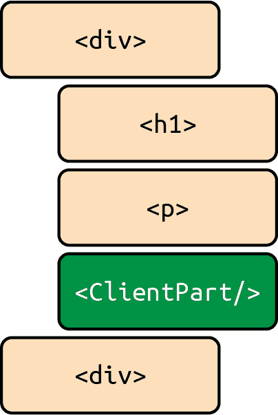

# 第九章：React 服务器组件

在上一章中，我们深入研究了 React 框架的世界，特别是关注了 Next.js 和 Remix。我们探讨了为什么你可能首先选择使用框架，包括抽象的好处，加速开发的规范，它们为常见问题提供的全面解决方案，以及它们对提高生产力的整体影响。

我们深入探讨了 Remix 和 Next.js 的细节，通过实现我们自己的基础框架，展示了每个框架解决类似问题的常见方法，并预告了 Next.js 对服务器优先方向的支持，充分拥抱 React 服务器组件（RSC）。

谈到 RSC（React Server Components），它们是 React 生态系统中的一个有趣的趋势，旨在改善 React 应用的性能、效率和用户体验。这种先进的应用架构结合了服务器渲染的多页面应用（MPA）和客户端渲染的单页面应用（SPA）的最佳方面，提供了无缝的用户体验，而又不损害性能或可维护性。在本章中，我们将讨论 RSC 的核心概念、好处，以及 RSC 工作的基本心智模型和机制。获取最新信息，请访问[react.dev](https://react.dev)。

RSC 引入了一种在服务器上“运行”的组件类型，否则不包含在客户端 JavaScript 捆绑包中。这些组件可以在构建时运行，允许您从文件系统中读取、获取静态内容或访问您的数据层。通过将数据作为 props 从服务器组件传递到浏览器中的交互式客户端组件，RSC 保持了高效和高性能的应用程序。

那么，服务器组件是如何工作的呢？让我们更深入地了解一下服务器组件是什么，以便更加精准地理解。

正如刚刚描述的，服务器组件是一种仅在服务器上执行的特殊类型组件。要更好地理解这一点，让我们记住一个 React 组件只不过是一个返回 React 元素的函数：

```
const Component = () => <div>hi!</div>;
```

在这段代码片段中，`Component`是一个返回`<div>hi!</div>`的函数。当然，`<div>hi!</div>`也会返回另一个 React 元素，因为在 React 中，`<`是`React.createElement`的别名。关于这点，我们在第二章讨论过。如果你对这有任何疑问，现在是快速复习一下然后回来的好时机。最终，所有组件都会返回虚拟 DOM。

服务器组件也不例外。如果`Component`在服务器端或客户端执行，它都会返回 vDOM。在第三章中，我们看到 React 元素只是具有以下模式的 JavaScript 对象：

```
{
  $$typeOf: Symbol("react.element"),
  type: () => ({
    $$typeOf: Symbol("react.element"),
    type: "div",
    props: {
      children: [
        {
          $$typeOf: Symbol("react.element"),
          props: {
            children: "hi!"
          },
        },
      ],
    },
  }),
}
```

在客户端和服务器环境中调用我们的`Component`函数将返回一个 React 元素，如下所示。

对于服务器组件而言，它们只在服务器上被调用，并且生成的表示元素的 JavaScript 对象被发送到客户端。当然，客户端组件就是我们通常使用的普通 React 组件。

# 优势

了解这一点，我们开始看到服务器组件的一些好处：

+   它们只在我们控制计算能力的服务器端执行。这导致性能更可预测，因为我们不在不可预测的客户端设备上执行计算。

+   它们在我们安全的服务器环境中执行，因此我们可以在服务器组件中执行安全操作，而不必担心泄漏令牌和其他安全信息。

+   服务器组件可以是异步的，因为我们可以等待它们在服务器上执行完毕，然后再与客户端分享。

这就是服务器组件的真正力量。接下来，让我们探讨服务器组件如何与服务器端渲染互动。

# 服务器渲染

我们在之前的章节中详细讨论了服务器端渲染，所以我们不会在这里深入其细节。相反，我们将专注于服务器组件与服务器渲染之间的互动。

从本质上讲，服务器组件和服务器渲染可以被视为两个独立的过程，其中一个过程完全负责在服务器上渲染组件并生成一棵 React 元素树，另一个过程——服务器渲染器——进一步接管这棵 React 元素树，并将其转换为可以通过网络流式传输到客户端的标记。

如果我们考虑这两个过程，一个是将组件渲染为 React 元素，另一个是将 React 元素渲染为 HTML 字符串或流，我们开始理解这两个概念如何结合在一起。让我们称第一个过程为*RSCs 渲染器*，它将服务器组件转换为一棵 React 元素树，第二个过程称为*服务器渲染器*，它将 React 元素转换为 HTML 流。

有了这个理解，服务器组件和服务器渲染之间的相互作用可以理解如下：

1.  在服务器上，一棵 JSX 树被转换为一棵元素树。

    这棵 JSX 树：

    ```
    <div>
      <h1>hi!</h1>
      <p>I like React!</p>
    </div>
    ```

    成为这棵元素树：

    ```
    {
      $$typeOf: Symbol("react.element"),
      type: "div",
      props: {
        children: [
          {
            $$typeOf: Symbol("react.element"),
            type: "h1",
            props: {
              children: "hi!"
            }
          },
          {
            $$typeOf: Symbol("react.element"),
            type: "p",
            props: {
              children: "I like React!"
            }
          },
        ],
      },
    }
    ```

1.  在服务器上，这棵元素树进一步被序列化为字符串或流。

1.  这被发送到客户端作为一个大的字符串化的 JSON 对象。

1.  客户端上的 React 可以读取这个解析后的 JSON 并像往常一样进行渲染。

如果我们将其表现为服务器端的代码，它看起来会像这样：

```
// server.js
const express = require("express");
const path = require("path");
const React = require("react");
const ReactDOMServer = require("react-dom/server");
const App = require("./src/App");

const app = express();

app.use(express.static(path.join(__dirname, "build")));

app.get("*", async (req, res) => {
  // This is the secret sauce
  const rscTree = await turnServerComponentsIntoTreeOfElements(<App />);
  // This is the secret sauce

  // Render the awaited server components to a string
  const html = ReactDOMServer.renderToString(rscTree);

  // Send it
  res.send(`
 <!DOCTYPE html>
 <html>
 <head>
 <title>My React App</title>
 </head>
 <body>
 <div id="root">${html}</div>
 <script src="/static/js/main.js"></script>
 </body>
 </html>
 `);
});

app.listen(3000, () => {
  console.log("Server listening on port 3000");
});
```

此服务器端代码片段直接取自第六章，在将其传递给服务器端渲染器（我们示例中的第二个过程）之前，我们已添加了处理服务器组件的步骤。

从逻辑上讲，这正是服务器组件和服务器端渲染如何结合在一起的方式：它们是互补的过程。

再次值得注意的是，我们仅仅是出于说明目的使用了`renderToString`，正如在第六章中提到的那样——在绝大多数情况下，更好的做法几乎总是依赖于一个更为异步、可中断的 API，如`renderToPipeableStream`或类似的。

现在我们理解了服务器渲染和服务器组件之间的相互作用，让我们更深入地了解一下我们在前面的代码片段中调用的这个神奇的`turnServerComponentsIntoTreeOfElements`函数。它在做什么？它如何将服务器组件转换为元素树？它是一个 React 渲染器吗？让我们找出答案。

## 在底层

简短而可能过于简化的答案是，`turnServerComponentsIntoTreeOfElements`是一种 React 渲染器。它从一个高级别（比如`<App />`）递归地进入一个 React 树，每次调用每个组件以获取它返回的 React 元素（普通的 JavaScript 对象）。

让我们列出这个的参考实现，然后讨论它的功能：

```
async function turnServerComponentsIntoTreeOfElements(jsx) {
  if (
    typeof jsx === "string" ||
    typeof jsx === "number" ||
    typeof jsx === "boolean" ||
    jsx == null
  ) {
    // Don't need to do anything special with these types.
    return jsx;
  }
  if (Array.isArray(jsx)) {
    // Process each item in an array.
    return await Promise.all(jsx.map(renderJSXToClientJSX(child)));
  }

  // If we're dealing with an object
  if (jsx != null && typeof jsx === "object") {
    // If the object is a React element,
    if (jsx.$$typeof === Symbol.for("react.element")) {
      // `{ type } is a string for built-in components.
      if (typeof jsx.type === "string") {
        // This is a built-in component like <div />.
        // Go over its props to make sure they can be turned into JSON.
        return {
          ...jsx,
          props: await renderJSXToClientJSX(jsx.props),
        };
      }
      if (typeof jsx.type === "function") {
        // This is a custom React component (like <Footer />).
        // Call its function, and repeat the procedure for the JSX it returns.
        const Component = jsx.type;
        const props = jsx.props;
        const returnedJsx = await Component(props);
        return await renderJSXToClientJSX(returnedJsx);
      }
      throw new Error("Not implemented.");
    } else {
      // This is an arbitrary object (props, or something inside them).
      // It's an object, but not a React element (we handled that case above).
      // Go over every value and process any JSX in it.
      return Object.fromEntries(
        await Promise.all(
          Object.entries(jsx).map(async ([propName, value]) => [
            propName,
            await renderJSXToClientJSX(value),
          ])
        )
      );
    }
  }
  throw new Error("Not implemented");
}
```

虽然这段代码看起来可能有点吓人，但让我们明确一点：它只是一个大的`if/else`树，根据其参数返回不同的结果。让我们逐个分支地了解发生了什么，从其输入参数`jsx`开始。

对于第一个分支，如果我们考虑一个像这样的 React 元素：

```
<div>hi!</div>
```

子元素`"hi!"`只是一个字符串。如果我们将这个字符串传递给我们的服务器组件渲染器，我们希望将字符串原样返回。这个想法是返回 React 在客户端和服务器端都能理解和渲染的类型。React 可以在客户端和服务器端理解和渲染字符串、数字和布尔值，因此我们将它们保持不变。

接下来，如果我们有一个数组，让我们对其进行映射，并递归处理每个元素。数组可以是一堆子元素，就像这样：

```
[
  <div>hi</div>,
  <h1>hello</h1>,
  <span>love u</span>,
  (props) => <p id={props.id}>lorem ipsum</p>,
];
```

例如，片段将子元素表示为数组。因此，让我们通过递归调用我们的函数处理每个子元素并继续前进。

接下来变得非常有趣：我们处理对象。请记住，所有的 React 元素都是对象，但并非所有对象都是 React 元素。我们如何知道一个对象是 React 元素？它有一个`$$typeOf`属性，其值为一个符号——具体来说是`Symbol.for('react.element')`。因此，我们检查对象是否具有这个键/值对，如果有，我们将其处理为一个 React 元素。我们在代码片段的这一部分做到了这一点：

```
if (jsx.$$typeof === Symbol.for("react.element")) {
  if (typeof jsx.type === "string") {
    // This is a component like <div />.
    // Go over its props to make sure they can be turned into JSON.
    return {
      ...jsx,
      props: await renderJSXToClientJSX(jsx.props),
    };
  }
  if (typeof jsx.type === "function") {
    // This is a custom React component (like <Footer />).
    // Call its function, and repeat the procedure for the JSX it returns.
    const Component = jsx.type;
    const props = jsx.props;
    const returnedJsx = await Component(props);
    return renderJSXToClientJSX(returnedJsx);
  }
  throw new Error("Not implemented.");
} else {
  // This is an arbitrary object (props, or something inside of them).
  // Go over every value and process any JSX in it.
  return Object.fromEntries(
    await Promise.all(
      Object.entries(jsx).map(async ([propName, value]) => [
        propName,
        await renderJSXToClientJSX(value),
      ])
    )
  );
}
```

在`if`语句的真分支内部嵌套，我们再做一次检查：`jsx.type`是`"string"`还是`"function"`？我们这样做是因为 React 元素可以同时具有这两种类型。字符串用于内置 DOM 元素，如`"div"`、`"span"`等。函数用于自定义组件，如`<Footer />`。如果它是一个字符串，我们知道它是一个内置 DOM 元素，所以我们可以直接返回它，但递归地调用我们的函数处理它的 props —— 因为它的 props 可能包含作为子节点的并发 React 组件。如果它是一个函数，我们知道它是一个自定义组件，所以我们用其 props 调用它，并递归地调用我们的函数处理它返回的 JSX，直到最终返回一个字符串、数字、布尔值、这些类型的数组或带有字符串类型的 React 元素，它会落入另一个分支中。

注意在调用函数组件之前我们有一个`await`吗？因为这是在服务器端执行的，我们可以在这种情况下`await`函数组件！这就是服务器组件的魔力：我们可以在服务器端`await`它们，它们会返回一个 React 元素，然后我们可以将其传递给`renderToString`或`renderToPipeableStream`以将其渲染为一个字符串或字符串流，我们可以发送到客户端。确实，这就是我们的函数正在做的事情：它只是递归地`await`所有`async`事务以生成一个元素树（一个 JavaScript 对象），并解决其所有数据依赖项。

最后，如果对象不是一个 React 元素，我们知道它只是一个普通对象，所以我们递归地在对象的每个值上调用我们的函数并返回结果。通常对象只是 props，所以在`else`分支中，我们只是递归地在每个 prop 值上调用我们的函数并返回结果，有效地展开可能作为 props 传递的任何组件，如渲染 props 中所讨论的第五章。

就是这样！这就是我们的小型最小 RSCs 渲染器。它并不完美，但它是一个很好的开始。我们可以使用它来将我们的服务器组件渲染为 React 元素，然后将其发送到客户端。

一旦我们拥有了这个，我们只需将其传递给 `renderToString` 或 `renderToPipeableStream`，甚至序列化它并直接发送到浏览器，React 在客户端将能够渲染它，因为它实际上只是 React 元素的树，React 能够理解。然而，这里还有一个挑战需要解决：序列化。

### 序列化

当我们尝试对 React 元素进行序列化时，情况变得有些棘手。序列化 React 元素是确保您的应用程序在初始加载期间正确且高效地渲染的基本方面，因为来自服务器的相同渲染输出需要与客户端匹配，以便 React 正确地协调和差异化。当应用程序在服务器上进行渲染时，创建的 React 元素需要转换为可以发送到浏览器的 HTML 字符串。这个将 React 元素转换为字符串的过程被称为*序列化*。

在典型的 React 应用程序中，React 元素是内存中的对象。它们是通过调用`React.createElement`或使用 JSX 语法创建的。这些元素表示组件的预期渲染，但它们还不是实际的 DOM 元素。它们更像是 DOM 应该如何看起来的指令：

```
const element = <h1>Hello, world</h1>;
```

当使用像`ReactDOMServer.renderToString`这样的函数在服务器上渲染时，这些 React 元素将被序列化为 HTML 字符串。这个序列化过程遍历 React 元素树，为每个元素生成相应的 HTML，并将其连接成单个 HTML 字符串：

```
const htmlString = ReactDOMServer.renderToString(element);
// htmlString will be '<h1>Hello, world</h1>'
```

然后，将此 HTML 字符串发送到客户端，其中它将被用作页面的初始标记。一旦客户端加载了 JavaScript 包，React 将“水合”DOM，附加事件处理程序并填充任何动态内容。

序列化步骤在多个方面都是至关重要的。首先，它允许服务器尽快将完整、准备好显示的 HTML 页面发送给客户端。这提高了页面的感知加载时间，因为用户可以更快地开始与内容交互。

此外，将 React 元素序列化为 HTML 字符串允许进行一致和可预测的初始渲染，无论环境如何都一样。生成的 HTML 是静态的，无论是在服务器上还是客户端上渲染，看起来都是一样的。这种一致性对确保流畅的用户体验至关重要，因为它防止了任何可能导致初始渲染与最终渲染不同而产生闪烁或布局变化的情况。

最后，序列化有助于在客户端执行水合作用的过程。当 JavaScript 包在客户端加载时，React 需要附加事件处理程序并填充任何动态内容。将序列化的 HTML 字符串作为初始标记确保 React 有一个坚实的基础来工作，使再水合作用过程更高效和可靠。

尽管我们需要将组件序列化为字符串，但我们不能简单地使用`JSON.stringify`，因为 React 元素不是常规的 JavaScript 对象。它们是具有特殊`$$typeof`属性的对象，React 使用该属性来识别它们，而这些属性的值是一个符号。符号不能被序列化和发送到网络，因此我们需要做些其他的事情。

实际上这并不难，多亏了 JavaScript 运行时的内置支持，包括浏览器和我们的服务器所在的 Node.js。这种内置支持以`JSON.stringify`和`JSON.parse`的形式提供给我们。这些函数可以递归地序列化或反序列化 JSON 对象，而 React 元素就是这些对象。它们的 API 如下：

```
JSON.stringify(object, replacer);
JSON.parse(object, replacer);
```

这里的`replacer`是一个函数，接收一个键和一个值，并在满足某些条件时返回一个替换值。在我们的情况下，我们希望将`$$typeof`的值替换为可序列化的类型，如字符串。下面是我们如何做到这一点：

```
JSON.stringify(jsxTree, (key, value) => {
  if (key === "$$typeof") {
    return "react.element"; // <- a string!!
  }

  return value; // <- return all other values as is
});
```

就是这样！我们完成了。要在客户端上反序列化它，我们做相反的操作：

```
JSON.parse(serializedJsxTree, (key, value) => {
  if (key === "$$typeof") {
    return Symbol.for("react.element"); // <- a symbol!!
  }

  return value; // <- return all other values as is
});
```

就是这样！我们现在可以序列化和反序列化 React 元素。我们现在可以在服务器上渲染服务器组件并将它们发送到客户端。这处理了我们的首次加载；然而，我们仍然需要处理更新和导航。让我们首先解决导航，稍后再处理更新。

### 导航

如果我们的 RSCs 可用的应用中有一个链接，类似于：

```
<a href="/blog">Blog</a>
```

点击这个链接将会进行全页面导航，这会导致浏览器向服务器发出请求，然后渲染页面并将其发送回浏览器。这就是多年前在 PHP 领域中我们所做的事情，它带来了一定的阻力和一种慢的感觉。我们可以做得更好：使用 RSCs，我们可以实现软导航，在路由转换之间保持状态。我们通过向服务器发送我们要导航到的 URL，服务器会返回该页面的 JSX 树给我们。然后，浏览器中的 React 重新渲染整个页面，使用新的 JSX 树，我们就有了一个新页面，而无需进行全页面刷新。这正是我们要做的。

要做到这一点，我们需要稍微调整我们的客户端代码。我们需要为应用中的所有链接添加一个事件监听器，以阻止链接的默认行为，并改为向服务器发送新页面的请求。我们可以这样做：

```
window.addEventListener("click", (event) => {
  if (event.target.tagName !== "A") {
    return;
  }

  event.preventDefault();
  navigate(event.target.href);
});
```

我们将事件监听器添加到`window`上是为了性能考虑：我们不希望为应用中的每个链接都添加一个事件监听器，因为这可能会导致大量的事件监听器降低速度。相反，我们在`window`上添加一个事件监听器，并检查点击的目标是否是一个链接。这被称为*事件委托*。

如果用户确实点击了`A`元素，我们将阻止链接的默认行为，而是调用稍后将定义的`navigate`函数。该函数将向服务器发送新页面的请求，然后我们将在客户端上使用 React 渲染它。

让我们定义`navigate`函数：

```
async function navigate(url) {
  const response = await fetch(url, { headers: { "jsx-only": true } });
  const jsxTree = await response.json();
  const element = JSON.parse(jsxTree, (key, value) => {
    if (key === "$$typeof") {
      return Symbol.for("react.element");
    }

    return value;
  });
  root.render(element);
}
```

我们在这里做的事情非常简单：我们向服务器发送一个新页面的请求，将响应反序列化为一个 React 元素，然后将该元素渲染到我们应用程序的根中。这将导致 React 使用新的 JSX 树重新渲染页面，我们将获得一个新页面而无需完整页面刷新。但是 `root` 是什么？要理解这一点，我们需要查看我们完整的客户端 JavaScript 文件：

```
import { hydrateRoot } from "react-dom/client";
import { deserialize } from "./serializer.js";
import App from "./App";

const root = hydrateRoot(document, <App />); // <- this is root

window.addEventListener("click", (event) => {
  if (event.target.tagName !== "a") {
    return;
  }

  event.preventDefault();
  navigate(event.target.href);
});

async function navigate(url) {
  const response = await fetch(url);
  const jsxTree = await response.json();
  const element = deserialize(jsxTree);
  root.render(element);
}
```

当我们最初为页面进行水合作用时，我们从 React 那里得到一个根，并且我们可以使用该根来将新元素渲染到其中。这就是 React 在幕后的工作原理，我们只是使用 React 在内部使用的相同 API。这是一件好事，因为这意味着我们没有做任何特殊或巧妙的事情，我们只是使用 React 的公共 API。

最后，当收到一个 `jsx-only` 头部时，我们需要让服务器仅响应下一页的 JSX 树对象，而不是响应完整的 HTML 字符串。我们可以这样做：

```
app.get("*", async (req, res) => {
  const jsxTree = await turnServerComponentsIntoTreeOfElements(<App />);

  // This is the secret sauce
  if (req.headers["jsx-only"]) {
    res.end(
      JSON.stringify(jsxTree, (key, value) => {
        if (key === "$$typeof") {
          return "react.element";
        }

        return value;
      })
    );
  } else {
    const html = ReactDOMServer.renderToString(jsxTree);

    res.send(`
 <!DOCTYPE html>
 <html>
 <head>
 <title>My React App</title>
 </head>
 <body>
 <div id="root">${html}</div>
 <script src="/static/js/main.js"></script>
 </body>
 </html>
 `);
  }
});
```

注意当头部存在时，我们不发送 JSON 而只发送一个字符串？这是因为我们需要在客户端进行 `JSON.parse`，而 `JSON.parse` 预期一个字符串，而不是一个 JSON 对象。这只是 API 的一个怪癖，但并不太糟糕。

现在，我们有了一种在没有完整页面刷新的情况下导航到新页面的方法。我们现在可以处理启用了 RSCs 的应用程序中的导航。所有锚链接导航都可以在没有完整页面刷新的情况下顺利进行。但是更新呢？我们如何处理更新？让我们接着来解决这个问题。

## 进行更新

尽管 RSCs 有很多优点，但也有一些需要注意的限制，即需要考虑两种不同类型的组件（服务器和客户端）所带来的额外心理负担。这是因为并非所有组件都可以是服务器组件。

例如，考虑这个简单的计数器组件，当用户点击 + 按钮时，它会将计数器值增加 1：

```
function Counter() {
  const [count, setCount] = useState(0);
  return (
    <div>
      <h1>Hello friends, look at my nice counter!</h1>
      <p>About me: I like pie! Sign my guest book!</p>
      <p>Count: {count}</p>
      <button onClick={() => setCount(count + 1)}>+</button>
    </div>
  );
}
```

这个组件永远不能成为服务器组件，原因有两个：

+   它使用了 `useState`，这是一个仅在客户端使用的 API。这意味着服务器不知道 `count` 的初始值是多少，因此无法渲染初始 HTML。这是一个问题，因为服务器需要在客户端接管并渲染交互式 UI 之前渲染初始 HTML。

    在服务器端环境中，“状态”的概念是在多个客户端之间共享的。然而，在 React 中，在引入 RSCs 之前，状态是局限于当前应用程序的。这种差异存在风险。它可能导致状态在多个客户端之间泄漏，潜在地暴露敏感信息。由于这种差异及相关的安全风险，RSCs 不支持在服务器端使用 `useState`。这是因为服务器端状态与客户端状态在根本上是不同的。

    此外，`useState`中的调度器（`setState`）函数需要被序列化以便发送到客户端，但函数是不可序列化的，所以这是不可能的。

+   它使用`onClick`，这是一个仅在客户端使用的 API。这是因为服务器不是交互式的：你不能在服务器上点击运行中的进程，因此在服务器组件中使用`onClick`是一种不可能的状态。此外，服务器组件的所有 props 都应该是可序列化的，因为服务器需要能够序列化 props 并将其发送到客户端，而函数是不可序列化的。

因此，现在一个简单的计数器现在需要分解为服务器部分和客户端部分，*如果*我们想利用服务器组件的功能，如下所示：

```
// Server Component
function ServerCounter() {
  return (
    <div>
      <h1>Hello friends, look at my nice counter!</h1>
      <p>
        About me: I like to count things and I'm a counter and sometimes I count
        things but other times I enjoy playing the Cello and one time at band
        camp I counted to 1000 and a pirate appeared
      </p>
      <InteractiveClientPart />
    </div>
  );
}
```

```
// Client Component
"use client";
function InteractiveClientPart() {
  const [count, setCount] = useState(0);
  return (
    <div>
      <p>Count: {count}</p>
      <button onClick={() => setCount(count + 1)}>+</button>
    </div>
  );
}
```

这是一个有些牵强的例子，但它说明了一个观点，即你不能只是拿任何 React 组件并将其转换为服务器组件。你需要考虑你的组件哪些部分是可以在服务器端渲染的，哪些部分是可以在客户端渲染的。这带来了一些摩擦，即使在这个例子中，哪些部分是服务器端可渲染的，哪些部分是客户端可渲染的显而易见，但在实际的大规模应用中，可能并不那么明显。

虽然这样做的结果在很大程度上是有益的，因为我们刚刚将计数器应用程序的一个小部分因素分离出来，该部分旨在交互，*只有*这部分应用程序将作为 JavaScript 包的一部分发送给用户；其余部分则不会。因此，我们通过网络传输的 JavaScript 包大大减少，这意味着更快的加载时间和更好的性能，无论是 CPU 方面，因为需要解析和执行 JavaScript 的工作更少，还是网络方面，因为需要下载的数据更少。

这就是为什么我们希望尽可能多地在服务器上渲染，以便将代码留出客户端捆绑包之外。

### 在底层

除了额外的心理负担之外，让我们谈谈 React 如何在底层分别处理服务器组件和客户端组件。这一点很重要，因为它将帮助我们理解如何更新我们的应用程序。

客户端组件通过在包含客户端组件的文件顶部添加`"use client"`指令来指定。RSC（React 服务器组件）需要下一代工具来根据这些指令的使用区分服务器端和客户端组件。

通过使用下一代捆绑器或捆绑器配置，捆绑器能够为 React 应用生成单独的模块图：一个服务器图和一个客户端图。服务器图从不捆绑到捆绑包中，因为它从不提供给用户，但所有以`"use client"`指令开头的文件都捆绑到一个客户端捆绑包或可以懒加载的多个组件捆绑包中。此实现细节取决于构建在 RSCs 之上的框架。

因此在概念上，我们有一个在服务器上执行的服务器图，以及在客户端需要时下载和执行的一个或多个客户端捆绑包。但是 React 如何知道何时导入和执行客户端组件呢？为了理解这一点，我们将不得不考虑一个典型的 React 树。让我们通过我们的反例来做这个。

在图 9-1 中，我们可视化了我们反例计数应用程序组件树的树形结构，其中橙色组件在服务器上渲染，绿色组件在客户端上渲染。由于树的根是服务器组件，整个树在服务器上渲染。然而，`InteractiveClientPart`组件是一个客户端组件，因此不会在服务器上渲染。相反，服务器为客户端组件渲染一个占位符，这是对客户端捆绑器生成的特定模块的引用。这个模块引用实际上表示，“当你到达树中的这一点时，是时候使用这个特定的模块了。”



###### 图 9-1\. 显示客户端和服务器组件的组件树

模块不一定总是仅懒加载，而是可以从初始捆绑包中加载，因为捆绑工具将一整堆模块添加到我们向用户提供的捆绑包中。它可能是`getModuleFromBundleAtPosition([0,4])`或类似的东西。关键是服务器发送到正确客户端模块的引用，而客户端 React 则填补空白。

当这发生时，React 将使用客户端捆绑包中的实际模块替换模块引用。这有点简化，但应该足以让我们理解机制。然后在客户端上渲染客户端组件，并且可以像往常一样与客户端组件交互。这就是为什么 RSCs 需要下一代捆绑器：它们需要能够为服务器和客户端组件生成单独的模块图。

实际操作中，这意味着在我们的反例中，服务器将呈现以下树：

```
{
  $$typeof: Symbol(react.element),
  type: "div",
  props: {
    children: [
      {
        $$typeof: Symbol(react.element),
        type: "h1",
        props: {
          children: "Hello friends, look at my nice counter!"
        }
      },
      {
        $$typeof: Symbol(react.element),
        type: "p",
        props: {
          children: "About me: I like to count things"
        }
      },
      {
        // The ClientPart element placeholder with a module reference
        // Pay attention to this: it's a module reference!
        $$typeof: Symbol(react.element),
        type: {
          $$typeof: Symbol(react.module.reference),
          name: "default",
          filename: "./src/ClientPart.js",
          moduleId: "client-part-1234"
        },
        props: {
          children: [
            // ...other server components and client module references
            {
              $$typeof: Symbol(react.element),
              type: {
                $$typeof: Symbol(react.module.reference),
                name: "default",
                filename: "./src/AnotherClientComponent.js"
              },
              props: {
                children: [],
              }
            },
            {
              $$typeof: Symbol(react.element),
              type: "div",
              props: {
                children: "I am a server component"
              }
            }
          ]
        }
      }
    ]
  }
}
```

此树将被发送到客户端，并且当 React 渲染它并遇到模块引用时，React 将智能地用客户端捆绑包中的实际模块替换模块引用。这就是 React 知道何时导入和执行客户端组件的方式。

因此，我们可以看到，捆绑器能够在服务器上仍然渲染整个树，在客户端只留下“空洞”，在服务器上递归渲染客户端组件的子组件，生成一个完整的树。然后，客户端通过下载和执行客户端捆绑包来填补任何必要的空洞。

服务器组件也可以包装成悬念边界，框架将它们从服务器流式传输给用户，当它们变得“就绪”时：也就是说，它们需要的任何数据被获取并且任何其他所需操作都被异步完成。

好了，希望现在我们理解了客户端组件如何从服务器组件中分离，从而实现在面向 RSCs 的应用程序中进行更新。带有 `"use client"` 标记的客户端组件可以包含本地化状态和事件处理程序，如 `onClick`，没有问题。

鉴于我们现在已经在客户端组件中闭环，并理解了服务器端如何执行服务器组件以及客户端组件如何包含在客户端捆绑包中，我们需要讨论一些关于这些主题的微妙之处。

## 细微差别

有一个普遍的误解，即服务器组件仅在服务器上执行，客户端组件仅在客户端上执行。这并不正确。服务器组件确实只在服务器上执行并输出表示 React 元素的对象，但客户端组件并不仅在客户端上执行。

要更深入理解这一点，让我们讨论一下“组件执行”究竟是什么意思。当我们说“组件执行”时，我们指的是调用表示组件的函数。例如，假设我们有一个像这样的组件：

```
function MyComponent() {
  return <div>hello world</div>;
}
```

当我们说“`MyComponent`执行”时，我们的意思是调用 `MyComponent` 函数及其 props，并返回一个 React 元素——这是一个看起来像这样的纯 JavaScript 对象：

```
{
  $$typeof: Symbol(react.element),
  type: "div",
  props: {
    children: "hello world"
  }
}
```

这就是我们说“组件执行”时的意思。

在服务器渲染期间，客户端组件在服务器上执行并输出表示 React 元素的对象。然后，这些元素被序列化为 HTML 字符串并发送到客户端，浏览器在那里呈现 HTML 标记。因此，客户端组件也在服务器上执行，并返回一些表示 React 元素的对象，然后服务器将它们序列化为 HTML 发送到客户端。

为了更准确地表示这一点，我们可以作出以下真实的陈述：

+   服务器组件在服务器上执行，输出表示 React 元素的对象。

+   客户端组件在服务器上执行，输出表示 React 元素的对象。

+   在服务器上存在一个表示所有 React 元素的大对象，包括客户端和服务器组件。

+   这被转换为字符串并发送到客户端。

+   从这一点来看，服务器组件永远不会在客户端执行。

+   客户端组件专门在客户端上执行。

从这个角度来看，服务器和客户端组件的执行边界变得更加清晰。我们可能在这里钻牛角尖，但值得添加更多细节来充分理解和欣赏这两种类型组件之间的相互作用。

# 服务器组件的规则

现在我们理解了服务器组件的内部工作原理，让我们讨论一些在使用服务器组件时需要遵循的规则，或者更广泛地说，在处理服务器组件时需要牢记的事情。

## 可序列化才是王道

对于服务器组件，所有的 props 必须是可序列化的。这是因为服务器需要能够序列化 props 并将其发送到客户端，正如我们之前讨论的那样。因此，在服务器组件中，props 不能是函数或其他不可序列化的值。这使得我们之前在第五章讨论过的渲染属性模式实际上已经过时。

现在，在我们理解了 RSC（服务器组件）是如何在服务器上渲染，然后在软导航时发送到客户端的基础上，我们应该理解为什么存在这个规则。假设我们有这样一个服务器组件：

```
function ServerComponent() {
  return <ClientComponent onClick={() => alert("hi")} />;
}
```

这将导致错误。然而，我们可以通过将`onClick`属性封装在`ClientComponent`中来解决这个问题。

## 没有有副作用的 Hooks

服务器与客户端是完全不同的环境。它不是交互式的，没有 DOM，也没有窗口。因此，在服务器组件中不支持有副作用的钩子。

一些框架，如 Next.js，有严格的 lint 规则，完全禁止在服务器组件中使用所有的 hooks，但这并非完全必要。RSCs 可以使用不依赖于状态、效果或仅浏览器 API 的 hooks。例如，`useRef` hook 在服务器组件中使用是完全可以的，因为它不依赖于状态、效果或仅浏览器 API。然而，这未必全是坏事，因为这让我们更倾向于更安全地处理组件。

## 状态不等同于状态

服务器组件中的状态与客户端组件中的状态并不相同。这是因为服务器组件在服务器上渲染，客户端组件在客户端上渲染。这意味着服务器组件中的状态可能在客户端之间共享，因为服务器-客户端关系是广播式关系，而不是单播（一个客户端，一个状态），因此在客户端之间泄漏状态的风险很高。

结合钩子规则，这意味着通过`useState`、`useReducer`或类似方式需要状态的任何组件最适合作为客户端组件。

## 客户端组件不能导入服务器组件

客户端组件不能导入服务器组件。这是因为服务器组件仅在服务器上执行，而客户端组件在两者上都执行，包括在浏览器上。

这意味着，如果我们有这样一个客户端组件：

```
"use client";
import { ServerComponent } from "./ServerComponent";

function ClientComponent() {
  return (
    <div>
      <h1>Hey everyone, check out my great server component!</h1>
      <ServerComponent />
    </div>
  );
}
```

当客户端组件试图导入服务器组件时，会导致错误。这是不可能的，因为服务器组件仅在服务器上执行，我们在这里导入的服务器组件可能会进一步导入在客户端运行时环境中不可用的内容，比如 Node.js API。这会在客户端上引发错误。

就我们所知，服务器组件可能是这样的：

```
import { readFile } from "node:fs/promises";

export async function ServerComponent() {
  const content = await readFile("./some-file.txt", "utf-8");
  return <div>{content}</div>;
}
```

当我们试图在客户端运行此代码时，因为客户端组件导入了它，我们会得到一个错误，因为在浏览器中并不存在 `readFile` 函数和 `"node:fs/promises"` 模块。这就是为什么客户端组件不能导入服务器组件的原因。

然而，客户端组件可以通过 props *组合* 服务器组件。例如，我们可以重新编写我们的客户端组件如下：

```
"use client";

function ClientComponent({ children }) {
  return (
    <div>
      <h1>Hey everyone, check out my great server component!</h1>
      {children}
    </div>
  );
}
```

然后，无论父服务器组件包含这个客户端组件的什么情况下，我们都可以这样做：

```
import { ServerComponent } from "./ServerComponent";

async function TheParentOfBothComponents() {
  return (
    <ClientComponent>
      <ServerComponent />
    </ClientComponent>
  );
}
```

这将有效，因为客户端组件并没有显式地从客户端组件导入服务器组件，而是父服务器组件将服务器组件作为 prop 传递给客户端组件。导入语句被禁止的唯一原因是为了防止客户端捆绑包中包含服务器组件的可能性，而捆绑工具只关注导入语句，而不是 prop 组合。

## 客户端组件并不差

值得注意的是，在引入服务器组件之前，React 中只有客户端组件这一类型的组件。这意味着我们所有现有的组件都是客户端组件，这没问题。客户端组件并不差，而且它们不会消失。它们仍然是 React 应用程序的核心，也是我们将要编写的最常见的组件类型。

我们在这里提到这一点是因为有些人对此存在一些困惑，并且有人认为服务器组件是客户端组件的一种更优秀的替代品。这是不正确的。服务器组件是我们可以额外使用的一种新类型的组件，但它们并不是客户端组件的替代品。

# 服务器动作

服务器组件是 React 中一个强大的新特性，但它们并不是唯一的新特性。RSC（服务器组件）还与一个新的指令 `"use server"` 配合工作，标记了可以从客户端代码调用的服务器端函数。我们称这些函数为 *服务器动作*。

任何异步函数的体的第一行都可以有 `"use server"`，以向 React 和打包工具表明此函数可以从客户端代码调用，但必须仅在服务器上执行。在客户端调用服务器动作时，将向服务器发出网络请求，其中包括传递的任何参数的序列化副本。如果服务器动作返回一个值，该值将被序列化并返回给客户端。

与其逐个标记函数为 `"use server"`，你也可以在文件顶部添加指令，将文件中的所有导出标记为服务器操作，这些操作可以在任何地方使用，包括在客户端代码中导入。

## 表单和突变

在 第八章 中，我们讨论了 Next.js 和 Remix 如何处理表单和突变。React 也正在添加（或已经添加了）这些功能的一流基元。考虑这个表单：

```
// App.js

async function requestUsername(formData) {
  'use server';
  const username = formData.get('username');
  // ...
}

export default App() {
  <form action={requestUsername}>
    <input type="text" name="username" />
    <button type="submit">Request</button>
  </form>
}
```

在这个例子中，`requestUsername` 是一个传递给 `<form>` 的服务器操作。当用户提交这个表单时，将向服务器函数 `requestUsername` 发送网络请求。在表单中调用服务器操作时，React 将表单的 `FormData` 作为服务器操作的第一个参数提供。

将服务器操作传递给表单操作后，React 可以逐步增强表单。这意味着在 JavaScript bundle 加载之前就可以提交表单。

## 在表单之外

值得注意的是，服务器操作是暴露的服务器端点，可以在客户端代码的任何地方调用。

当在表单之外使用服务器操作时，我们可以在过渡中调用服务器操作，这使我们可以显示加载指示器，显示乐观状态更新，并处理意外错误。以下是表单之外的服务器操作示例：

```
"use client";

import incrementLike from "./actions";
import { useState, useTransition } from "react";

function LikeButton() {
  const [isPending, startTransition] = useTransition();
  const [likeCount, setLikeCount] = useState(0);

  const incrementLink = async () => {
    "use server";
    return likeCount + 1;
  };

  const onClick = () => {
    startTransition(async () => {
      // To read a server action return value, we await the promise returned.
      const currentCount = await incrementLike();
      setLikeCount(currentCount);
    });
  };

  return (
    <>
      <p>Total Likes: {likeCount}</p>
      <button onClick={onClick} disabled={isPending}>
        Like
      </button>;
    </>
  );
}
```

因此，我们可以看到服务器操作是 React 中的一个强大的新功能，允许我们从客户端代码中调用服务器端函数。这实际上只适用于库或框架，因为在原始的 React 中使用这些指令有些繁琐，并且需要大量的工作来连接这些东西。然而，这是一个强大的功能，可以实现许多有趣的用例。

# React 服务器组件的未来

RSC 预计会随时间演变和改进。React 团队正在积极完善实现，解决潜在问题，并扩展功能集。一些正在进行开发的领域包括：

更好的捆绑器集成

React 团队正在与捆绑器开发人员合作，确保在像 Webpack、Rollup 等捆绑器中更好地支持 RSC。这将使构建与 RSC 兼容的框架和应用程序变得更加容易。

生态系统支持

随着 RSC 的推广，可能会出现更多工具、库和框架来支持和扩展这种新的应用架构。这将使开发人员更容易在其项目中采用 RSC，并从其性能和效率改进中受益。

RSC 代表了 React 生态系统中的重大进展，提供了改进的性能、简化的数据获取和更好的用户体验。随着 RSC 的不断演进和采用，预计它们将成为构建现代、高效和用户友好的 React 应用程序的重要工具。通过全面了解 RSC，您现在可以充分装备，探索并在自己的项目中尝试这一前沿实验性功能。

# 章节回顾

在本章中，我们专注于 React 服务器组件（RSCs），这是 React 生态系统中的一个重大进展，旨在提升 React 应用的性能、效率和用户体验。RSCs 代表了一种创新的应用架构，结合了服务器渲染的多页面应用（MPAs）和客户端渲染的单页面应用（SPAs）的优点。这种方法可以在不妥协性能或可维护性的情况下提供无缝的用户体验。我们深入探讨了 RSCs 的核心概念、优势以及其背后的思维模型和机制。一个关键亮点是引入了一种新类型的组件，它在服务器上运行，在客户端 JavaScript 包中排除，并可以在构建时运行。这一进展导致了更高效和有效的应用结构。

值得注意的是，在撰写本文时，RSC（React Server Components）在 React 和 Web 工程领域是一个热门话题，我们所涵盖的一些细节可能已经发生了变化。因此，我们建议查看 [react.dev](https://react.dev) 和 React 的各种社区渠道以获取最新信息。

# 复习问题

1.  React 服务器组件的主要价值是什么？

1.  客户端组件能导入服务器端组件吗？为什么？

1.  服务器组件与传统的仅客户端 React 应用之间有哪些权衡？

1.  什么是模块引用，React 在调和过程中如何处理它们？

1.  服务器动作如何使 React 应用更易访问？

# 接下来

在接下来的章节中，我们将走一条略有不同的道路。到目前为止，我们大部分时间都深入研究了 React 的世界，探索了其复杂的内部工作机制、创新的状态管理策略、异步渲染能力，最终还有其强大的框架。现在，我们要退后一步，拓宽我们的视野。

我们将超越 React，深入探讨与 React 主导并行发展甚至对其有所回应的替代 UI 库和框架的世界。这些替代方案不仅吸收了一些 React 的最佳特性，还引入了自己的独特创新，为我们在 UI 开发中带来了令人兴奋的新范式和可能性。

在接下来的探索中，我们将深入探讨其他一些 UI 库的工作原理和理念，例如 Vue、Angular、Solid、Qwik 和 Svelte。我们将研究它们在状态管理、处理副作用方面的独特策略，以及在性能和开发者体验方面与 React 的比较。每种替代方案都有其一系列的优缺点，这些可能使其更适合特定类型的项目或开发者偏好：

Vue

Vue 提供了一个渐进式框架，可以逐步采用，这意味着您可以从小处开始，并根据需要逐渐采用更多的 Vue 特性。Vue 以其优雅的 API 和开发者体验而闻名。它引入了一个简单但强大的响应式模型，其核心概念是在渲染期间跟踪的响应性依赖。

Angular

Angular 是一个完整且主观的框架，学习曲线较陡，但提供了开箱即用的强大解决方案。其依赖注入系统和声明式模板为应用程序结构和状态管理提供了与 React 不同的方法。

Solid

Solid 是另一个在 JavaScript 社区中引起关注的竞争者。它承诺通过类似于 React 的编程模型实现精细粒度的响应性，并专注于更快、更高效的渲染。Solid 如何跟踪依赖关系可能对寻求运行时更高效性能的开发人员来说是一种全新的体验。

Qwik 框架

Qwik 通过“可预测”的预取重点优化加载性能，引入了一种独特的视角，展示了我们如何为了最佳用户体验结构化和传递 JavaScript。

Svelte

Svelte 通过在构建时将组件编译为直接操作 DOM 的命令式代码而引人注目，导致更快的初始加载时间和平滑的更新。其响应性模型以反应式语句为特征，与 React 采用的虚拟 DOM 差异化策略形成鲜明对比。

在探索这些框架和库的同时，我们将把 React 的知识作为一个基准。这不仅有助于我们更好地理解其他库，还通过比较和对比深化了我们对 React 的理解。

准备好揭示这些替代 UI 库在响应性、状态管理、副作用等方面的独特方法。通过研究这些替代方案，我们可以获得洞见，这些洞见可能会影响我们解决问题的方式，无论我们选择使用哪个库或框架。JavaScript 的世界是如此广阔多样，我们即将全面投入其中。

快系好安全带！旅程即将变得更加刺激。
