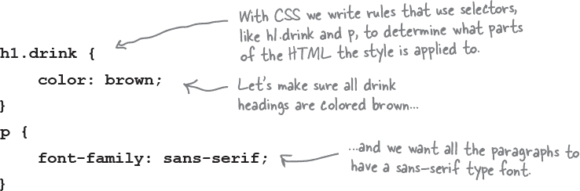
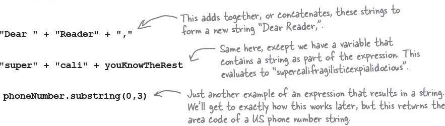
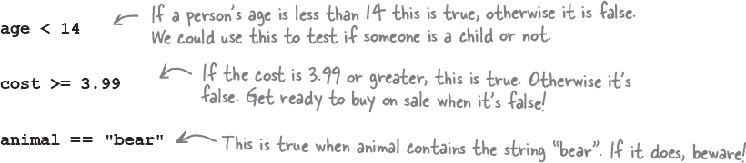
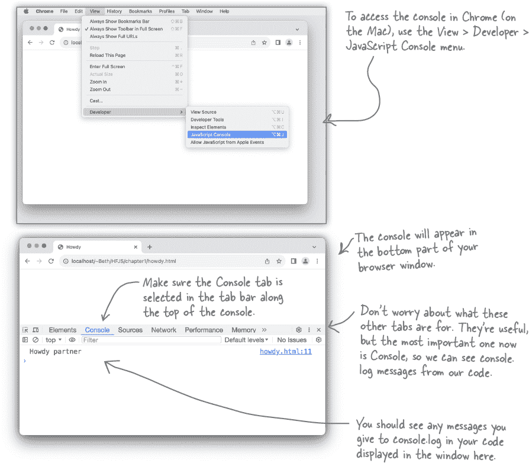

# 第一章：快速了解 Javascript：踏入水中


**JavaScript 赋予你超能力**。作为网页的**真正编程语言**，JavaScript 允许你**添加行为**到你的网页中。不再有干燥、无聊、静态的页面只是呆在那里看着你——使用 JavaScript，你可以与用户互动，响应有趣的事件，从网络中获取数据以在你的页面中使用，直接在网页中绘制图形等等。一旦你掌握了 JavaScript，你还可以为用户创造**全新的**行为。

你也会处于很好的公司。JavaScript 不仅是**最受欢迎**的编程语言之一，而且在所有现代浏览器中**支持**，并且在浏览器之外的许多环境中使用。稍后会详细介绍；现在让我们开始吧！

# JavaScript 的工作原理

如果你习惯在网页中创建结构、内容、布局和样式，那么是时候也加入一些行为了吧？毕竟，页面不应该只是*呆在那里*。优秀的页面应该是*交互式*和*动态*的。这就是 JavaScript 的用武之地。让我们首先看看 JavaScript 如何融入*网页生态系统*：


# 你将如何编写 JavaScript

JavaScript 在编程世界中相当独特。对于典型的编程语言，你需要编写、编译、链接和部署。JavaScript 则更加流畅和灵活。使用 JavaScript，你只需将 JavaScript 写入页面中，然后加载到浏览器中。从那时起，浏览器将愉快地开始执行你的代码。让我们更详细地看看它是如何工作的：


# 如何将 JavaScript 加入到你的页面中

首先得明确一件事。如果不知道如何将 JavaScript 加入到网页中，你将无法深入学习 JavaScript。那么，怎么做呢？当然是使用 `<script>` 元素！

让我们拿一个枯燥乏味的普通网页，通过 `<script>` 元素添加一些动态行为。此时，不要太担心我们将在 `<script>` 元素中添加什么具体内容——你现在的目标是让 JavaScript 开始起作用。


# 小测试驾驶


现在，打开一个名为“behavior.html”的文件，并将这个页面拖到你的浏览器中（或者使用“文件” > “打开”）。它会做什么？提示：你需要等待五秒钟才能找出答案。


# JavaScript，你已经走了很远……


使用 HTML 和 CSS 你可以创建一些漂亮的页面。但一旦你掌握了 JavaScript，你可以真正扩展你可以创建的页面类型。

###### 注意

知道 JavaScript 可能也会增加你的薪水！

事实上，你可能会开始将你的页面视为应用程序（甚至是体验！），而不仅仅是简单的页面。

现在，你可能会说，“我已经知道这些，你为什么认为我在读这本书？”嗯，我们实际上想利用这个机会谈谈学习 JavaScript 的事情。如果你已经掌握了一门编程语言或脚本语言，那么你对接下来的内容有一些了解。但是，如果迄今为止你主要使用的是 HTML 和 CSS，你应该知道学习一门编程语言与学习编程语言有着根本上的不同。

与 HTML 和 CSS 不同，你所做的主要是声明性的—例如，你声明某些文本是段落或者所有“sale”类中的 HTML 元素应该是红色的。而使用 JavaScript，你要为页面添加*行为*，为此你需要描述计算。你需要能够描述诸如“通过总结所有正确答案来计算用户的得分”、“执行此操作十次”或者“当用户点击该按钮时播放获胜音效”甚至“去获取我的最新推文，并将其放在这个页面中”之类的事情。

要执行这些操作，你需要一种与 HTML 或 CSS 非常不同的语言。让我们看看怎么做…

# 如何做出语句

当你创建 HTML 时，通常会**标记**文本以赋予其结构；为此，你需要向文本添加元素、属性和值：


CSS 有点不同。使用 CSS 时，你编写一组**规则**，其中每个规则选择页面中的元素，然后为这些元素指定一组样式：



使用 JavaScript，你会编写**语句**。每个语句都指定了计算的一个小部分，所有这些语句共同创建了页面的行为：


# 变量和值

你可能已经注意到，JavaScript 语句通常涉及变量。变量用于存储值。哪些值？以下是一些示例：


变量除了可以包含数字、字符串和布尔值外，还可以包含其他值，我们很快就会介绍这些，但无论变量包含什么，我们都是以相同的方式创建所有变量。让我们更仔细地看看如何声明变量：


我们说“可选”，因为如果你愿意，你可以创建一个没有初始值的变量，然后稍后再为其赋值。要创建一个没有初始值的变量，只需省略赋值部分，像这样：


# 常量，另一种变量类型

到目前为止，我们使用关键字`**let**`来声明变量。对于那些值可以*变化*的变量，这通常是我们想要做的事情，换句话说，随着时间的推移可以改变它们的值。例如，如果我们使用`let`来声明变量`**winners**`，将其赋值为 2，如果另一个赢家出现，我们可以稍后将`winners`的值更改为 3：


然而，有时候我们不希望变量中的值变化。有些情况下，我们可能希望给一个我们将在代码中使用的值起个名字，但我们永远不希望那个值发生变化。比如，地球半径就是一个很好的例子。把这个值分配给一个变量可能会很方便，这样我们可以在代码中使用`**EARTH_RADIUS**`而不是这个数字。我们不希望有人无意中改变这个值，那么怎么确保`EARTH_RADIUS`的值永远不变呢？我们可以使用一个*常量*而不是变量，像这样：


# 离开那个键盘！

你知道变量有名字，也知道它们有一个值。

你还知道变量可以保存数字、字符串和布尔值。

***但你可以如何称呼你的变量？任何名字都可以吗？*** 嗯，不是的，但是关于创建变量名的规则很简单：只需遵循下面两条规则来创建有效的变量名：

+    **变量名要以字母、下划线或美元符号开头。**

+    **之后，可以使用任意数量的字母、数字、下划线或美元符号。**

哦，还有一件事；我们真的不希望通过使用任何内置的*关键字*来混淆 JavaScript，比如**let**、**function**或**false**，所以请把它们视作你自己的变量名时的禁区。我们会在本书的其余部分介绍其中一些关键字及其含义，但这里是一个快速浏览的列表：

+   break

+   case

+   catch

+   class

+   const

+   continue

+   debugger

+   default

+   delete

+   do

+   else

+   enum

+   export

+   extends

+   false

+   finally

+   for

+   function

+   if

+   implements

+   import

+   in

+   instanceof

+   interface

+   let

+   new

+   package

+   private

+   protected

+   public

+   return

+   static

+   super

+   switch

+   this

+   throw

+   true

+   try

+   typeof

+   var

+   void

+   while

+   with

+   yield


# 表达自己

要真正地在 JavaScript 中表达自己，你需要***表达式***。表达式会评估出值。在我们的代码示例中，你已经偶尔看到了一些。例如，看看这个语句中的表达式：


如果你曾经上过数学课，做过银行对账或者报税，我们相信这些数值表达式对你来说并不陌生。

这里也有字符串表达式；以下是一些例子：



我们也有表达式会评估为**true**或**false**，也就是所谓的布尔表达式。逐个来看这些表达式，看看它们是如何得出 true 或 false 的：



而且表达式还可以评估为其他几种类型；我们将在本书后面详细讨论这些。目前重要的是要意识到所有这些表达式都会评估出某个值：一个数字、一个字符串或一个布尔值。让我们继续前进，看看这给你带来了什么！


# 做很多次的事情

你经常要做很多事情不止一次：

*洗、涮、重复*...

*上蜡，下蜡*...

*吃掉碗里的糖果，直到它们都没了。*

当然，你经常需要在代码中重复执行某些操作，而 JavaScript 给了你几种循环执行代码的方式：**while**、**for**、**for in** 和 **forEach**。最终，我们会看看所有这些循环的方式，但现在让我们专注于 **while**。

我们刚刚讨论了会产生布尔值的表达式，比如 `scoops > 0`，而这些类型的表达式是 while 语句的关键。这是如何实现的：


# while 循环的工作原理

由于这是你的第一个 while 循环，让我们跟踪一轮其执行过程，看看它是如何工作的。请注意，我们添加了一个声明来声明 scoops 并将其初始化为值 5。

**现在让我们开始执行这段代码。首先，我们将 scoops 设置为五。**


**然后我们遇到了 while 语句。当评估 while 语句时，我们首先评估条件以查看它是 true 还是 false。**


**因为条件为 true，我们开始执行代码块。体中的第一条语句将字符串“Another scoop! <br>”写入浏览器。**


*要跟着一起做，请从 [`wickedlysmart.com/hfjs`](http://wickedlysmart.com/hfjs) 获取本章的代码，并将 icecream.html 文件拖放到浏览器中。*

**接下来的语句从冰淇淋数目中减去一个，然后将 scoops 设置为新值，即四。**


**这是代码块中的最后一条语句，因此我们回到条件语句并重新开始。**


**再次评估我们的条件语句，这次 scoops 是四。但这仍然比零多。**


**我们再次向浏览器写入字符串“Another scoop! <br>”。**


**接下来的语句从冰淇淋数目中减去一个，并将 scoops 设置为该新值，即三。**


**这是代码块中的最后一条语句，因此我们回到条件语句并重新开始。**


**再次评估我们的条件语句，这次 scoops 是三。但这仍然比零多。**


**我们再次向浏览器写入字符串“Another scoop! <br>”。**


**正如你所看到的，这种情况会继续下去... 每次循环时，我们减少（减少 1），向浏览器写入另一个字符串，然后继续。**


**然后继续...**


**直到最后一次... 这次有些不同。Scoops 是零，所以我们的条件返回 false。就这样吧，我们不会再进入循环，不会执行代码块。这一次，我们跳过块并执行其后的语句。**


**现在我们执行另一个 document.write，并写入字符串“没有冰淇淋的生活不一样”。我们完成了！**


```
if (cashInWallet > 5) {
   order = "I’ll take the works:
cheeseburger, fries and a coke";
} else {
   order = "I’ll just have a glass of
water";
}
```

# 使用 JavaScript 做决策

您刚刚看到如何使用条件来决定是否继续在`while`语句中循环。您还可以使用布尔表达式在 JavaScript 中做决策，使用`if`语句。`if`语句仅在条件测试为真时执行其代码块。这里是一个例子：


使用`if`语句，我们还可以通过添加一个或多个`else if`来串联多个测试，就像这样：


# 而且，当您需要做很多决策时

您可以串联尽可能多的`if`/`else`语句，如果需要，甚至可以添加一个最终的全捕获`else`，以便在所有条件失败时进行处理。就像这样：


# 与用户联系和沟通

我们一直在讨论如何使您的页面更具交互性，为此您需要能够与用户进行通信。事实证明有几种方法可以做到这一点，而您已经看到了其中一些。让我们快速概述一下，然后我们将在整本书中更详细地介绍这些内容：

## 创建一个警报

正如您所见，浏览器通过`alert`函数为您提供了一种快速警告用户的方法。只需调用带有包含警报消息的字符串的`alert`，浏览器将以一个漂亮的对话框向用户显示消息。不过，小小的坦白：我们一直在过度使用它，因为它很容易；`alert`真的应该只在您真正想要停止一切并让用户知道某事时使用。

## 直接写入您的文档

将您的网页视为一个文档（这就是浏览器称呼它的方式）。您可以使用`document.write`函数在任何时候将任意 HTML 和内容写入您的页面。一般来说，这被认为是不好的做法，尽管您会在这里那里看到它的使用。我们在本章中也稍微使用了一点，因为这是一个开始的简单方式。

###### 注意

我们在本章中使用了这三种方法。

## 使用控制台

每个 JavaScript 环境都有一个控制台，可以记录来自您代码的消息。要将消息写入控制台的日志，您可以使用`console.log`函数，并将要打印到日志中的字符串传递给它（有关如何使用控制台日志的更多详细信息稍后）。您可以将`console.log`视为调试代码的好工具，但通常您的用户不会看到您的控制台日志，因此这不是与他们沟通的非常有效的方式。

###### 注意

控制台是帮助您在代码中查找错误的非常方便的方法！如果您犯了一个打字错误，比如漏掉了引号，JavaScript 通常会在控制台中给您一个错误，以帮助您追踪它。

## 直接操作您的文档

这是大联盟；这是你希望与页面和用户交互的方式 —— 使用 JavaScript，你可以访问你的实际网页，读取和更改其内容，甚至修改其结构和样式！这一切都是通过使用你浏览器的*文档对象模型*实现的（稍后会详细介绍）。正如你将看到的，这是与你的用户交流的最佳方式。但是，使用文档对象模型需要了解页面结构及用于读取和写入页面的编程接口的知识。我们很快就会到达那里。但首先，我们还有更多的 JavaScript 需要学习。

###### 注意

这就是我们的工作目标。当你达到这个目标时，你将能够以各种方式阅读、修改和操作你的页面。

# 更详细地看看`console.log`

让我们更仔细地看看`console.log`的工作原理，以便在本章中使用它来查看我们代码的输出，并在整本书中检查和调试我们代码的输出。但请记住，控制台不是大多数网页的普通用户会遇到的浏览器功能，因此你不会想在最终版本的网页中使用它。在开发页面时，写入控制台日志通常用于故障排除。也就是说，在学习 JavaScript 基础知识时，查看代码的运行情况是一个很好的方法。它的工作原理如下：


# 打开控制台

每个浏览器对控制台的实现略有不同。而且，更复杂的是，浏览器实现控制台的方式相对频繁地会有所更改 —— 变动不会很大，但足以让你读到这里时，你的浏览器控制台看起来可能与我们展示的有些不同。

因此，我们将向您展示如何在 Mac 上的 Chrome 浏览器（版本 120）中访问控制台，并在[`wickedlysmart.com/hfjsconsole`](http://wickedlysmart.com/hfjsconsole)上提供有关如何在所有主要浏览器中访问控制台的说明。一旦您掌握了一个浏览器中的控制台，就很容易弄清楚如何在其他浏览器中使用它，我们鼓励您尝试在至少两个浏览器中使用控制台，以便熟悉它们。

###### 注意

**注意：你不需要输入 Howdy 代码。我们只是在学习控制台的位置。过一会儿我们就会开始输入代码...**



# 编写严肃的 JavaScript 应用程序

让我们将所有这些新的 JavaScript 技能和`console.log`技巧用于一些实际操作。我们需要一些变量，一个`while`语句，一些带有`else`的`if`语句。稍微加工一下，你会发现我们不知不觉中已经拥有了一个超级严肃的商业应用程序。但是，在你查看代码之前，请想想你如何编写那个经典的“99 瓶根啤”的代码。


```
const word = "bottles";
let count = 99;
while (count > 0) {
    console.log(count + " " + word + " of rootbeer on the wall");
    console.log(count + " " + word + " of rootbeer,");
    console.log("Take one down, pass it around,");
    count = count - 1;
    if (count > 0) {
        console.log(count + " " + word + " of rootbeer on the wall.");
    } else {
        console.log("No more " + word + " of rootbeer on the wall.");
    }
}
```


**好主意！** 是的，是时候了。在我们到达那里之前，我们希望确保你已经掌握了足够的 JavaScript，使它变得有趣。也就是说，你已经在本章的开头看到，你可以像添加 CSS 一样添加 JavaScript 到你的 HTML 中；也就是说，你只需将它嵌入到适当的 `<script>` 标签中。

现在，就像 CSS 一样，你也可以把你的 JavaScript 放在外部文件中。

让我们首先将这个严肃的业务应用程序放到一个页面上，然后在彻底测试后，我们将把 JavaScript 移到外部文件中。

# 我如何将代码添加到我的页面？（让我数数这些方法）

你已经知道你可以将 `<script>` 元素与你的 JavaScript 代码添加到页面的 `<head>` 或 `<body>` 中，但是还有几种其他方法可以将你的代码添加到页面上。让我们看看可以放置 JavaScript 的所有位置（以及为什么你可能想要把它放在一个地方而不是另一个地方）：


# 我们必须把你们分开

分开走也许会伤害，但我们知道我们必须这样做。是时候把你的 JavaScript 移到自己的文件中去了。这是你做到这一点的方法...


# JavaScript 交叉


是时候通过一个谜题来拉伸你的树突，以帮助所有这些都深深地印在你的脑海中。


**横向**

1\. 变量用于存储这些。

4\. 使用 __ 调试器 __ 来排除你的代码问题。

7\. 今天的 JavaScript 运行比以前 __ 快得多 __ 。

8\. 墙上有 99 瓶 __ 根啤 __ 。

9\. 要从 HTML 链接到外部 JavaScript 文件，你需要 `<script>` 元素的 __src__ 属性。

10\. 每次通过循环，我们评估一个 __ 条件 __ 表达式。

13\. if/else 语句用于制作一个 __ 选择 __ 。

14\. 所有 JavaScript 语句都以 __ 分号 __ 结尾。

16\. 把你的 JavaScript 放在一个 __ 脚本 __ 元素内。

**纵向**

2\. 你可以使用 + 运算符把 __ 字符串 __ 连接在一起。

3\. 将不变的值存储在这个 __ 常量 __ 中。

5\. 3 + 4 是一个 __ 示例 __ 。

6\. JavaScript 为你的网页添加 __ 动态功能 __ 。

9\. JavaScript 代码的每一行称为 __ 语句 __ 。

10\. 为了避免尴尬的命名错误，请使用 __ 驼峰 __ 样式。

11\. 在 JavaScript 程序中多次执行某些操作，使用 __ 循环 __ 。

12\. JavaScript 变量名是 __ 大小写 __ 敏感的。

15\. 要声明一个变量，请使用这个关键字。

# JavaScript 交叉 解答


