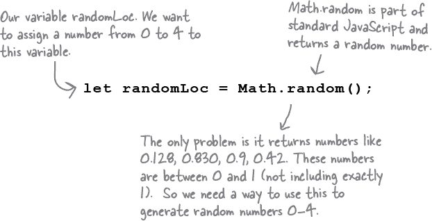

# 第二章：编写真实代码：*更进一步*


**你已经了解变量、类型、表达式……我们可以继续下去。** 关键是，您已经了解一些关于 JavaScript 的东西。事实上，您已经足够了解以编写一些**真实的代码**。一些做一些有趣事情的代码，一些某人想要使用的代码。您缺少的是编写代码的**真实经验**，我们将在这里立即加以弥补。怎么做？通过全力以赴，编写一个用 JavaScript 编写的休闲游戏。我们的目标是宏伟的，但我们将一步步实现。来吧，让我们开始吧，如果您想启动下一个创业公司，我们不会阻碍您；代码是您的。

# 让我们来建造一个战舰游戏

这是您与浏览器的对抗：浏览器隐藏船只，您的任务是找出并摧毁它们。当然，与真正的战舰游戏不同，在这个游戏中，您不会放置任何自己的船只。相反，您的工作是以最少的猜测次数击沉计算机的船只。

**目标：** 以最少的猜测次数击沉浏览器的船只。根据您的表现，您将获得评级。

**设置：** 当游戏程序启动时，计算机会在虚拟网格上放置船只。完成后，游戏会询问您的第一个猜测。

**玩法：** 浏览器会提示您输入一个猜测，然后您将输入一个网格位置。根据您的猜测，您会看到“命中”、“未命中”或“你击沉了我的战舰！”的结果。当您击沉所有船只时，游戏将显示您的评级。

# 我们的第一次尝试…

## …一个简化的战舰游戏

对于我们的第一次尝试，我们将从比全面的 7x7 图形版本少的简化版本开始，只有三艘船。相反，我们将从一个带有七个位置和一个要找到的船的不错的一维网格开始。它可能会很简陋，但我们的重点是设计游戏的基本代码，而不是外观和感觉（至少现在是这样）。

别担心；通过从游戏的简化版本开始，您将在稍后构建完整游戏时获得很大的优势。这还为您的第一个真正的 JavaScript 程序提供了一个不错的起点（当然，不算上第一章中的严肃商业应用）。因此，在本章中，我们将构建游戏的简化版本，并在您学到更多关于 JavaScript 的内容后，稍后再进入豪华版本。


# 首先，一个高层次的设计

我们知道我们将需要变量，一些数字和字符串，以及条件语句和循环……但是在哪里以及有多少？以及我们如何将所有这些组合在一起？为了回答这些问题，我们需要更多关于游戏应该做什么的信息。

首先，我们需要弄清楚游戏的一般流程。以下是基本想法：


现在我们对程序需要做的事情有了一个高层次的概念。接下来，我们将为这些步骤进一步详细说明一些细节。


# 还有一些细节...

我们对这个游戏如何工作有了一个相当好的想法，从高级设计和专业外观的流程图中，但在我们开始编写代码之前，让我们再确定一些细节。

## 表示战舰

首先，我们可以通过找出如何在我们的网格中表示一艘船来开始。请记住，虚拟网格是... 嗯，*虚拟*的。换句话说，它在程序中并不存在。只要游戏和用户知道战舰隐藏在可能的七个连续单元格中的三个单元格中（从零开始），则行本身在代码中不必表示。您可能会尝试构建一个保存所有七个位置的东西，然后尝试将船放置在这些位置中。但是，我们不需要这样做。我们只需要知道船位于哪些单元格，比如说，在单元格 1、2 和 3 处。


## 获取用户输入

如何获取用户输入？我们可以使用 `prompt` 函数来完成。每当我们需要从用户那里获取一个新的位置时，我们将使用 `prompt` 来显示消息并获取用户的输入，这只是用户从 0 到 6 之间的一个数字。

## 显示结果

输出是怎么样的？目前，我们将继续使用 `alert` 来显示游戏的输出。这有点笨拙，但它会起作用。（在本书的后面，对于真实的游戏，我们将更新网页，但在那之前，我们还有很长的路要走。）

# 通过伪代码进行工作

我们需要一种计划和编写代码的方法。我们将从编写*伪代码*开始。伪代码介于真实的 JavaScript 代码和程序的纯英语描述之间，正如您将看到的那样，它将帮助我们思考程序将如何工作，而不必完全开发*真正的代码*。

在这个简单战舰的伪代码中，我们包括了一个描述我们将需要的变量的部分，以及描述程序逻辑的部分。变量将告诉我们在我们的代码中需要跟踪的内容，而逻辑描述了必须如实实现以创建游戏的代码。


# 哦，在我们继续之前，别忘了 HTML！

如果没有一些 HTML 来链接到您的代码，您将无法取得太大进展。请继续在一个名为“battleship.html”的新文件中键入下面的标记。完成这些操作后，我们将继续编写代码。


# 编写简单的战舰代码

我们将使用伪代码作为我们真正的 JavaScript 代码的蓝图。首先，让我们解决我们需要的所有变量。再次查看我们的伪代码，看看我们需要哪些变量：


让我们把这些变量放到一个 JavaScript 文件中。创建一个名为“battleship.js”的新文件，并像这样输入你的变量声明：


# 现在让我们编写游戏逻辑

现在我们已经搞定了变量，让我们深入研究实现游戏的伪代码。我们将其分解为几个部分。首先要做的事情是实现循环：只要船没有沉没，它就需要保持循环。接下来，我们将处理从用户处获取猜测并进行验证——确保它确实是一个介于 0 到 6 之间的数字——然后我们将编写检查船只是否被击中以及船只是否已沉没的逻辑。最后，我们将为用户创建一个小报告，报告沉船所用的猜测次数。


# 第一步：设置循环，获取一些输入

现在我们将开始将游戏逻辑转换为实际的 JavaScript 代码。从伪代码到 JavaScript 并没有完美的映射，所以你会看到这里或那里有一些调整。伪代码给了我们一个关于代码需要做什么的好主意，现在我们必须编写 JavaScript 代码来实现具体的操作。


让我们从目前为止的所有代码开始，然后我们将专注于我们正在添加的部分（为了节省一些纸张或者说节省电子，如果你正在阅读电子版本的书）：


# 提示的工作原理

浏览器提供了一个内置函数，可以用来从用户那里获取输入，它叫做`prompt`。`prompt`函数与你已经使用过的`alert`函数非常相似——`prompt`会显示一个对话框，其中包含你提供的字符串，与`alert`类似——但它还为用户提供了一个可以输入响应的地方。这个响应以字符串的形式返回，并作为调用函数的结果。如果用户取消对话框或者没有输入任何内容，则返回`null`。


# 检查用户的猜测

如果你看一下伪代码，要检查用户的猜测，我们首先需要确保用户输入了有效的内容。如果是这样，然后我们还要检查猜测是击中还是未击中。我们还需要确保适当地更新`guesses`和`hits`变量。让我们开始检查用户输入的有效性，如果输入有效，我们将增加`guesses`变量。之后我们将编写代码来判断用户是击中还是未击中。


让我们更仔细地看一下有效性测试。你知道我们正在检查猜测是否介于零和六之间，但具体是如何进行条件测试的呢？让我们来详细分析一下：


# 那么，我们击中了吗？

这就是事情变得有趣的地方——用户猜测了船的位置，我们需要编写代码来确定该猜测是否击中了船。更具体地说，我们需要查看猜测是否与船的位置之一匹配。如果匹配，那么我们将增加`hits`变量。


这是对命中检测代码的第一次尝试；让我们逐步进行：


# 添加命中检测代码

让我们将前几页的所有内容整合在一起：


# 嘿，你击沉了我的战舰！


我们快要完成了；我们几乎已经完全掌握了这个游戏逻辑。再次查看伪代码，我们现在需要做的是测试是否有三次命中。如果是的话，那么我们已经击沉了一艘战舰。而且，如果我们击沉了一艘战舰，那么我们需要将`isSunk`设置为 true，并告诉用户他们摧毁了一艘船。在添加代码之前，让我们再次勾勒出代码：


# 提供一些游戏后分析

在`isSunk`设置为 true 之后，while 循环将停止循环。没错，我们已经非常熟悉的这个程序将停止执行 while 循环的主体，在你意识到之前游戏就结束了。但是，我们仍然需要向用户提供一些关于他们表现的统计数据。以下是执行此操作的一些代码：


现在让我们将这个和击沉船只检测加入到其余的代码中：


# 这样就完成了逻辑！

好了！我们现在已经完全将伪代码翻译成了实际的 JavaScript 代码。我们甚至发现了一些遗漏在伪代码中的内容，我们也已经考虑到了。在下面你会找到完整的代码。确保你已经将其键入并保存在“battleship.js”中：


```
let location1 = 3;
let location2 = 4;
let location3 = 5;
let guess;
let hits = 0;
let guesses = 0;
let isSunk = false;

while (isSunk == false) {
    guess = prompt("Ready, aim, fire! (enter a number from 0-6):");
    if (guess < 0 || guess > 6) {
        alert("Please enter a valid cell number!");
    } else {
        guesses = guesses + 1;

        if (guess == location1 || guess == location2 || guess == location3) {
            alert("HIT!");
            hits = hits + 1;
            if (hits == 3) {
                isSunk = true;
                alert("You sank my battleship!");
            }
        } else {
            alert("MISS");
        }
    }
}
let stats = "You took " + guesses + " guesses to sink the battleship, " +
               "which means your shooting accuracy was " + (3/guesses);
alert(stats);
```

# 进行一些**质量保证**。

QA，或质量保证，是测试软件以查找缺陷的过程。所以我们将对这段代码进行一些质量保证。当你准备好时，在浏览器中加载“battleship.html”并开始游戏。尝试一些不同的事情。它是否完美运行？还是你发现了一些问题？如果是的话，请在这里列出它们。你也可以在此页面上看到我们的测试运行。


**布尔运算符允许您编写更复杂的逻辑语句。**

你已经看到足够多的条件语句，知道如何测试，比如，温度是否大于 32 度。或者，表示物品是否有库存的变量是否为 true。但有时我们需要进行更多的测试。有时我们不仅需要知道一个值是否大于 32，还需要知道它是否小于 100。或者，一个物品是否有库存，还要打折。或者，只有在星期二且用户是 VIP 会员时，物品才打折。所以，你看，这些条件语句可能会变得复杂。

让我们逐步进行一些操作，以更好地了解它们的工作原理。

假设我们需要测试某个物品是否在库存并且在特价销售。我们可以这样做：


我们可以通过将这两个条件结合在一起来简化此代码。与简单的战舰游戏不同，在那里我们测试了猜测是否 < 0 或 > 6，这里我们想知道的是如果 inStock 为真并且 onSale 也为真。让我们看看如何做到这一点……


我们不必止步于此；我们可以使用多个布尔运算符以各种方式组合条件语句：


# 我们能谈谈你的啰嗦吗……

我们不知道如何提出这个问题，但你在指定条件时有点啰嗦。我们是什么意思呢？例如，就拿这个条件来说：


结果表明，这有点过头了。条件语句的整个要点在于它评估为 true 或 false，但我们的布尔变量 `inStock` 已经是这些值之一。所以，我们不需要将变量与任何东西进行比较；它可以单独存在。也就是说，我们可以改写成这样：


现在，尽管有些人可能会说我们最初的冗长版本在意图上更清晰，但实际上更常见的是看到更简洁的版本。而且，你会发现少言简写的版本更易于阅读。

# 完成简单战舰游戏

是的，我们还有一件小事要处理，因为现在你已经将船的位置硬编码了 —— 无论玩游戏多少次，船总是在位置 3、4 和 5。这对于测试来说确实很好，但我们真的需要随机放置船只，这样对用户来说更有趣。

让我们退后一步，考虑在七个单元格的一维网格上正确放置船只的方法。我们需要一个起始位置，可以在网格上放置三个连续的位置。这意味着我们需要一个从零到四的起始位置。


# 如何分配随机位置

现在，一旦我们有了起始位置（在零到四之间），我们只需使用它和接下来的两个位置来放置船只。

###### 注意

取随机位置以及接下来的两个连续位置。

```
let location1 = randomLoc;
let location2 = location1 + 1;
let location3 = location2 + 1;
```

好的，但是如何生成一个随机数呢？这就是我们求助于 JavaScript 及其内置函数的地方。更具体地说，JavaScript 自带了一堆与数学相关的内置函数，包括一些用于生成随机数的函数。现在我们将深入了解内置函数，以及一般的函数稍后会讲到。现在，我们只需利用这些函数来完成我们的工作。

# 生成随机数的配方

我们将从 `Math.random` 函数开始。通过调用此函数，我们将得到一个随机的十进制数：



我们需要的是 0 到 4 之间的整数，即 0、1、2、3 或 4，而不是像 0.34 那样的小数。首先，我们可以将由`Math.random`返回的数字乘以 5，以更接近目标；这是我们的意思...


那更接近了！现在我们只需要截取数字的末尾，以得到一个整数。为此，我们可以使用另一个内置的数学函数，Math.floor：


# 再回到做一些质量保证的工作

这就是我们需要的一切。让我们把这段代码放在一起（我们已经在下面做过了），用它替换你现有的位置代码。完成后，进行几次测试运行，看看你能多快地击沉敌人。


这是我们的一个测试会话之一。现在游戏变得更加有趣，因为我们为船只设置了随机位置。但我们仍然设法得到了一个相当不错的分数...


# 恭喜你完成了你的第一个真正的 JavaScript 程序，并简短地谈一下代码重用的事项

你可能已经注意到，我们利用了一些*内置函数*，如`alert`、`prompt`、`console.log`和`Math.random`。几乎像魔术一样，这些函数凭借极少的努力就赋予了你弹出对话框、在控制台记录输出和生成随机数的能力。但是，这些内置函数只是已经为你编写好的封装代码，它们的威力在于你可以在需要时调用和重复使用它们。

现在关于函数有很多内容要学习，如何调用它们，可以传递什么样的值等等，我们将在下一章开始深入讨论，那时你将学会创建自己的函数。

但在你到达那里之前，你得复习一下要点，完成一个交叉字谜...哦，还有一个良好的夜间睡眠，让所有知识都能深入脑海。

# JavaScript 交


交叉字谜如何帮助你学习 JavaScript？心理上的转折将 JavaScript 深深地烙印在你的大脑中！


**ACROSS**

1\. 这帮助你思考程序如何运行。

7\. while 和 if 语句都使用 _________ 测试。

8\. 布尔运算符总是得出 true 或 _________。

9\. 要从 AND 运算符（&&）获得 true 值，条件的两部分都必须 _________。

10\. JavaScript 有许多内置 _________，如 alert 和 prompt。

11\. 要随机选择一个位置放置船只，可以使用 Math._________。

**DOWN**

1\. 要从用户那里获取输入，可以使用 _________ 函数。

2\. == 是一个 ___________ 运算符，用于测试两个值是否相同。

3\. OR（||）和 AND（&&）是 _________ 运算符。

4\. 如果你擅长测试程序，你可能想成为一个 _________ 保证专家。

5\. 如果不初始化一个变量，其值为 _________。

6\. 我们使用一个 ________ 变量来跟踪船是否被击沉。

8\. 要从或运算符（||）得到假值，条件的两部分都必须是**假的**。

# JavaScript 跨越解决方案


交叉字谜如何帮助你学习 JavaScript？这种心理上的转折将 JavaScript 深深烙印在你的大脑中！这是我们的解决方案。


