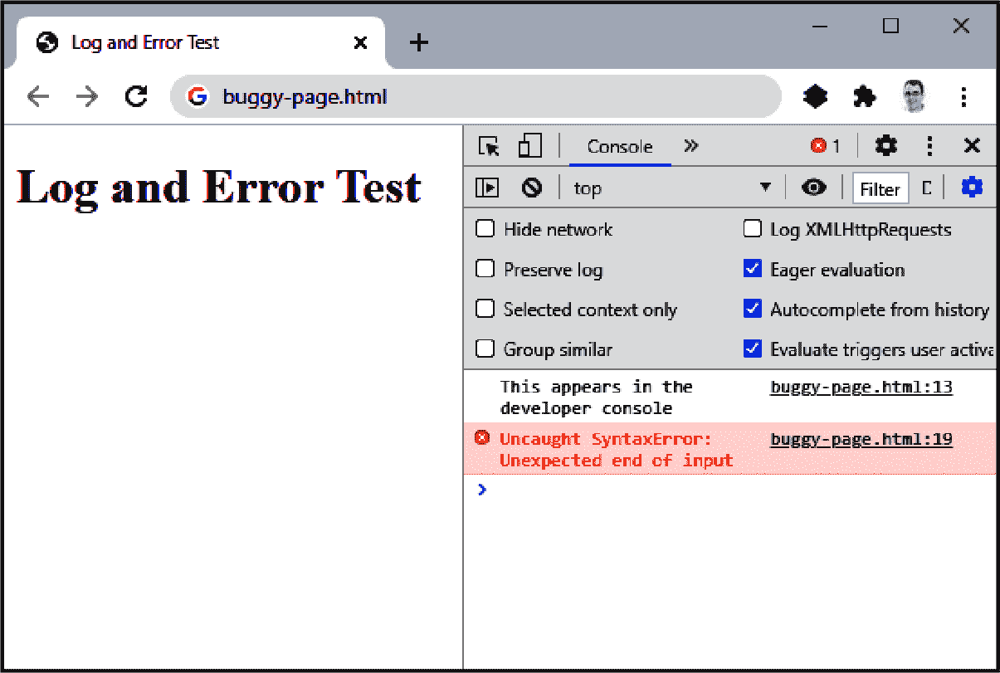
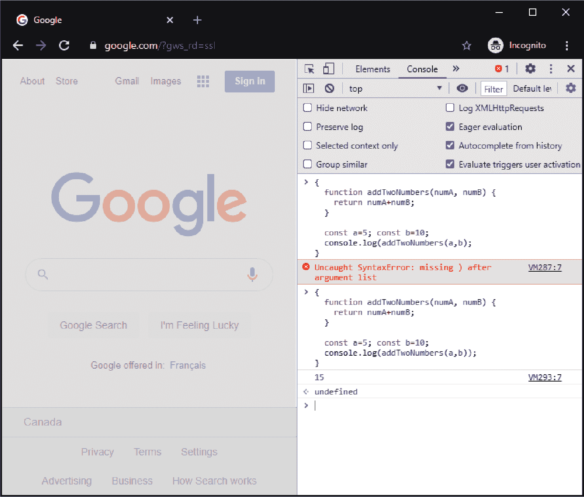
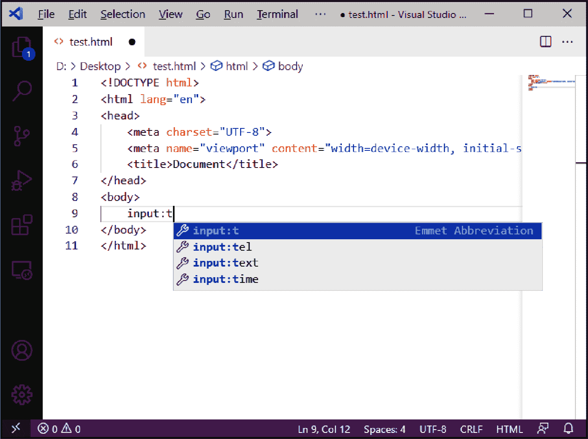
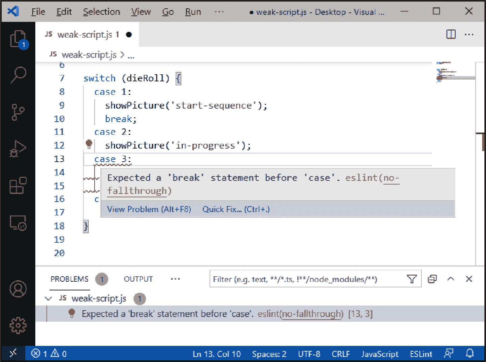
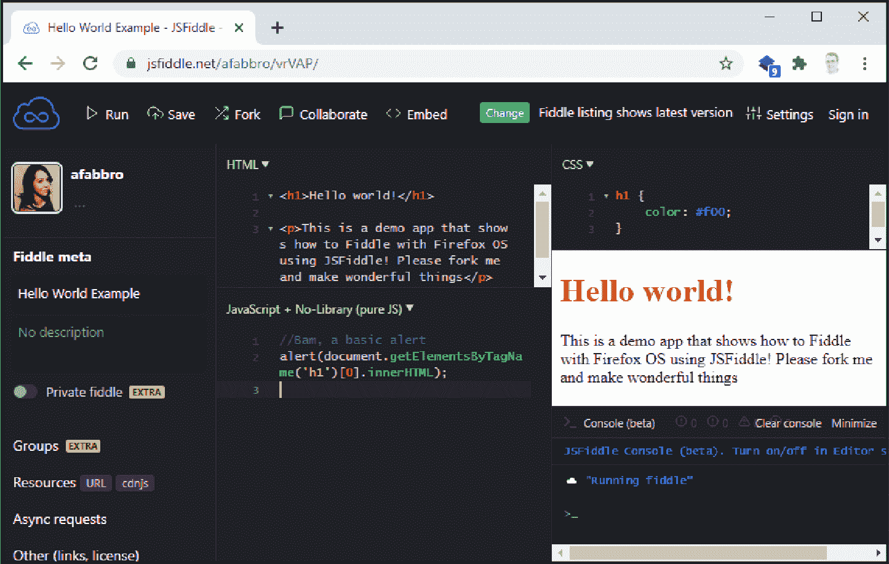
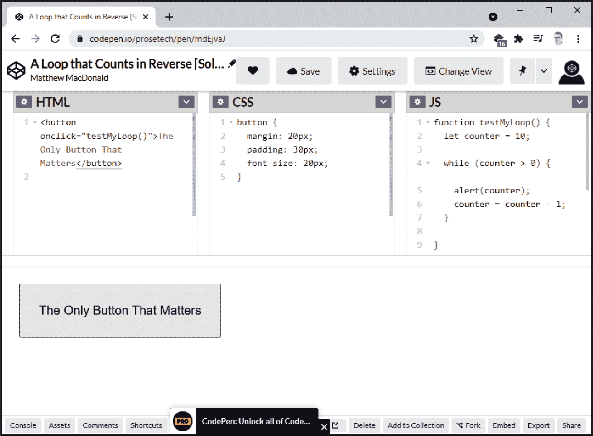

# 第一章：设置开发环境

你可能听说过“工具决定开发者”的说法。虽然这有些夸张，但没有人愿意在一堆 JavaScript 代码面前没有他们喜欢的工具来编辑、分析和调试它。

在设置自己的开发环境时，你将首先考虑的工具是代码编辑器。即使是最基本的编辑器也会添加诸如自动完成和语法高亮这样的基本功能，这两个简单的功能可以避免许多潜在的错误。现代代码编辑器还添加了许多其他功能，比如与 GitHub 等源代码控制服务的集成、逐行调试和智能重构。有时这些功能会通过插件直接嵌入到你的编辑器中。有时你会从终端或作为构建过程的一部分来运行它们。但无论你如何使用你的工具，组装合适的组合来适应你的编码风格、开发环境和项目类型是其中的一部分乐趣。这就像家庭装修专家收集工具，或者有抱负的厨师投资于刚刚合适的烹饪器具。

工具选择并非静态的。作为开发者，你的偏好可能会变化。随着你的成长和新工具证明其有用性，你将扩展你的工具包。本章探讨了每个 JavaScript 开发者在着手项目之前应考虑的最低工具集。但在不同广义等效选项之间有很大的选择空间。正如许多聪明人所说，品味无法计量！

###### 注意

在这一章中，我们将戴上宣传帽子。你将看到我们喜欢的一些工具，以及其他同样优秀的选择。但我们并不试图覆盖*每一款*工具，只是一些你可以从头开始的优秀默认选择。

# 选择代码编辑器

## 问题

你想要在一个理解 JavaScript 语法的编辑器中编写代码。

## 解决方案

如果你赶时间，我们的首选 Visual Studio Code（通常简称为*VS Code*）是一个不会错的选择。你可以在 Windows、Macintosh 或 Linux 上下载这个免费的开源编辑器。

如果你有时间研究，还有许多其他编辑器可以考虑。表 1-1 中的列表远非完整，但显示了一些最受欢迎的编辑器。

表 1-1。桌面代码编辑器

| 编辑器 | 支持的平台 | 开源 | 成本 | 备注 |
| --- | --- | --- | --- | --- |
| [Visual Studio Code](https://code.visualstudio.com) | Windows, Macintosh, Linux | 是 | 免费 | 任何语言的极佳选择，也是我们在 JavaScript 开发方面的首选 |
| [Atom](https://atom.io) | Windows, Macintosh, Linux | 是 | 免费 | 本书的大部分章节都是使用 Atom，并使用了支持 AsciiDoc 的插件进行编写 |
| [WebStorm](https://jetbrains.com/webstorm) | Windows, Macintosh, Linux | 否 | 对于开源开发者和教育用户免费，否则个人每年大约 $60 | 一个比较重的环境，更接近传统的 IDE 而不是代码编辑器 |
| [Sublime Text](https://sublimetext.com) | Windows, Macintosh, Linux | 否 | 个人一次性支付 $80，虽然没有许可证执行或时间限制 | 一个以在大型文本文件中快速性能而闻名的流行编辑器 |
| [Brackets](http://brackets.io) | Windows, Macintosh | 是 | 免费 | 一个由 Adobe 赞助的专注于 web 开发的项目 |

无论你选择哪种代码编辑器，启动新项目的过程都大同小异。首先，创建一个新文件夹来存放你的项目（比如*test-site*）。然后，在你的代码编辑器中，查找类似 **File > Open Folder** 这样的命令，选择你创建的项目文件夹。大多数代码编辑器会立即显示项目文件夹的内容，以便你可以快速在文件之间跳转。

拥有一个项目文件夹还能让你放置你使用的软件包（“使用 npm 下载软件包”）和存储应用程序特定的配置文件和代码规范文件（“使用 ESLint 强制代码规范”）。如果你的编辑器有内置终端（“额外：使用终端和 Shell”），它总是会启动在当前项目文件夹中。

## 讨论

推荐最佳编辑器有点像 *我* 选择 *你* 的甜点一样。个人口味绝对是一个因素，而且至少有十几种合理的选择。大部分在 表 1-1 中列出的建议都符合所有重要条件，也就是说它们：

+   跨平台，因此无论你使用什么操作系统都没问题。

+   基于插件的设计，因此你可以轻松地添加所需的功能。本书提到的许多工具（如 “使用 ESLint 强制代码规范” 中描述的 Prettier 代码格式化工具）都有与不同编辑器集成的插件。

+   多语言支持，允许你不仅限于 HTML、CSS 和 JavaScript，在其他编程语言中编写代码（需要适当的插件）。

+   社区驱动，这让你有信心它们将长期维护和改进。

+   免费，或者仅需适度的费用。

我们的首选是 VS Code，这是一个由微软开发的代码编辑器，具有原生的 JavaScript 支持。事实上，这个编辑器本身是用 JavaScript *编写* 的，并在 Electron 中托管。（更准确地说，它是用 TypeScript 编写的，这是 JavaScript 的一个更严格的超集，在分发或执行之前被转译成 JavaScript。）

在许多方面，VS Code 是 Microsoft 强大的 Visual Studio IDE 的年轻、时髦的姐妹产品。Visual Studio IDE 还有一个免费的社区版，也支持 JavaScript 编码。但是，VS Code 在为不使用 Microsoft .NET 技术栈的开发者提供更好平衡方面做得更好。因为它起初轻量级，但通过其[数千个社区插件的库](https://oreil.ly/RvMZ9)可以进行无限定制。在 Stack Overflow 的开发者调查中，VS Code 经常被评为最受欢迎的代码编辑器，跨越多种编程语言。

## 参见

想要了解 VS Code 的基本特性和整体结构，请观看一组优秀的[入门视频](https://oreil.ly/iiRhA)。在本章中，您还将学习如何在 VS Code 中使用 Emmet 快捷键（“使用 Emmet 快捷键填充 HTML 模板”），以及如何添加 ESLint（“使用 Linter 强制代码规范”）和 Prettier（“使用格式化工具一致地进行代码样式设置”）插件。

# 在您的浏览器中使用开发者控制台

## 问题

您希望查看网页中发生的错误以及您在控制台中输出的消息。

## 解决方案

使用您浏览器的开发者控制台。表格 1-2 显示了如何在各现代桌面浏览器中加载开发者工具。

表格 1-2\. 加载开发者控制台的快捷键

| 浏览器 | 操作系统 | 快捷键 |
| --- | --- | --- |
| Chrome | Windows or Linux | F12 或 Ctrl+Shift+J |
| Chrome | Macintosh | Cmd-Option-J |
| Edge | Windows or Linux | F12 或 Ctrl+Shift+J |
| Firefox | Windows or Linux | F12 或 Ctrl+Shift+J |
| Firefox | Macintosh | Cmd-Shift-J |
| Safari^(a) | Macintosh | Cmd-Option-C |
| Opera | Windows | Ctrl+Shift+J |
| Opera | Macintosh | Cmd-Option-J |
| ^(a) 在 Safari 中使用开发者控制台之前，您必须先启用它。要启用控制台，请从菜单中选择**Safari 菜单 > 首选项**，点击**高级**选项卡，并勾选**在菜单栏中显示“开发”菜单**。 |

开发者工具通常以选项卡形式显示在网页浏览器窗口的右侧或底部。控制台面板显示使用 `console.log()` 输出的消息以及任何未处理的错误。

下面是一个页面的完整代码，它先写入控制台，然后出现错误：

```
<!DOCTYPE html>
<html lang="en">
  <head>
    <meta charset="UTF-8" />
    <meta name="viewport" content="width=device-width, initial-scale=1.0" />
    <meta http-equiv="X-UA-Compatible" content="ie=edge" />
    <title>Log and Error Test</title>
  </head>
  <body>
    <h1>Log and Error Test</h1>

<script>
  console.log('This appears in the developer console');
</script>

<script>
  // This will cause an error that appears in the console
  const myNumber =
</script>
  </body>
</html>
```

Figure 1-1 显示了开发者控制台中的输出。首先是记录的消息，然后是错误（一个 `SyntaxError`，显示为“意外的输入结束”）。错误消息以红色字体显示，并且 Chrome 友好地在每条消息旁边添加链接，这样你可以快速查看导致消息的源代码。网页和脚本文件中的行号会自动编号。在这个例子中，这使得很容易区分消息的源（第 13 行）和错误的源（第 19 行的闭合 `</script>` 标签）。



###### Figure 1-1\. 在 Chrome 开发者控制台中查看输出结果

## 讨论

我们在本书中经常使用 `console.log()`，通常用于编写快速测试消息。然而，还有其他 `console` 方法可以使用。Table 1-3 列出了一些最有用的方法。

表 1-3\. 控制台方法

| 方法 | 描述 |
| --- | --- |
| `console.warn(object)` | 类似于 `console.log()`，但输出的文本有黄色背景。 |
| `console.error(object)` | 类似于 `console.log()`，但输出的文本有红色背景。通常用于记录错误对象。 |
| `console.assert(expression, object)` | 如果表达式为 `false`，则将消息与堆栈跟踪一起写入控制台。 |
| `console.trace()` | 显示堆栈跟踪。 |
| `console.count(label)` | 显示调用此方法的次数与标签相关联。 |
| `console.dir(object)` | 以可展开的树状列表形式显示对象的所有属性。 |
| `console.group()` | 使用你提供的标题开始一个新的分组。接下来的控制台消息会在此标题下缩进显示，使它们看起来像是一个逻辑相关的部分。你可以使用 `console.groupEnd()` 来结束分组。 |
| `console.time(label)` | 使用指定的标签开始计时。 |
| `console.timeEnd(label)` | 停止与标签关联的计时器并显示经过的时间。 |

###### 注意

现代浏览器中的控制台有时会对对象和数组使用*惰性评估*。如果你使用 `console.log()` 输出一个对象，然后对其进行更改，再次输出相同的对象，可能会出现这个问题。如果你在网页中的脚本代码中这样做，通常会发现 `console.log()` 的两次调用都输出了同一个已更改的对象，即使第一次调用在实际更改之前！

为避免这种问题，你可以在记录对象之前显式将其转换为字符串。这个技巧有效，因为控制台不会对字符串使用惰性评估。虽然这种技术并不总是方便（例如，如果你想记录包含对象的完整数组时就不适用），但它确实能解决大多数情况。

当然，控制台只是开发工具中的一个面板（或选项卡）。四处看看，您会发现其他面板中包含了许多有用的功能。具体的排列和命名取决于您的浏览器，但以下是 Chrome 的一些亮点。

元素

使用此面板查看页面特定部分的 HTML 标记，并检查适用于各个元素的 CSS 规则。甚至可以 *更改* 标记和样式（暂时）以快速测试潜在的编辑。

源码

使用此面板浏览当前页面使用的所有文件，包括 JavaScript 库、图像和样式表。

网络

使用面板标签查看页面及其资源的大小和下载时间，以及查看通过网络发送的异步消息（例如，作为`fetch`请求的一部分）。

性能

使用此面板开始跟踪代码执行所需的时间（参见“分析运行时性能”）。

应用程序

使用此面板查看当前站点使用的所有数据，包括存储在 cookie 中、本地存储或使用 IndexedDB API 存储的数据。

您可以尝试大多数这些面板，以了解它们的工作原理，或者您可以查阅[Google 的文档](https://oreil.ly/cZ6AP)。

## 参见

“在开发者控制台中运行代码块” 解释了如何在开发者控制台中运行即席代码片段。

# 在开发者控制台中运行代码块

## 问题

您想尝试一个代码片段，而无需打开编辑器并创建 HTML 和 JavaScript 文件。

## 解决方案

在您的浏览器中使用开发者控制台。首先，打开开发者工具（如“在您的浏览器中使用开发者控制台”中所述）。确保选择控制台面板。然后，粘贴或输入您的 JavaScript 代码。

按 Enter 立即运行您的代码。如果需要输入多行代码，请在每行末尾按 Shift+Enter 插入软换行。只有当完成并且想要运行完整代码块时才按 Enter。

通常，您可能希望修改同一段代码并重新运行它。在所有现代浏览器中，开发者控制台都具有历史记录功能，使这一过程变得简单。要使用它，按向上箭头键显示先前执行的代码块。如果要查看之前运行的代码 *更早* 的代码，则按多次向上箭头键。

图 1-2 显示了一个代码块示例，第一次由于语法错误而未能成功运行。然后将代码调用到历史记录中，进行编辑和执行，输出结果（15）显示在下方。



###### 图 1-2\. 在控制台中运行代码

历史记录功能仅在 *不* 开始输入任何新代码时才有效。如果控制台命令行不为空，则向上箭头键仅会在当前代码块中移动，而不是回溯历史记录。

## 讨论

在开发者控制台中，你可以像在脚本块中一样输入 JavaScript 代码。换句话说，你可以添加函数并调用它们，或定义一个类然后实例化它。你还可以访问`document`对象，在当前页面中与 HTML 元素交互，显示警告，并写入控制台。（消息将直接显示在下方。）

当在控制台中使用更长的代码示例时，可能会遇到一个潜在的障碍。你可能会遇到命名冲突，因为 JavaScript 不允许在同一作用域内定义相同的变量或函数名称多次。例如，考虑如下简单的代码块：

```
const testValue = 40+12;
console.log(testValue);
```

如果你只运行一次，这个方法是有效的。但如果你按向上箭头回退历史来修改它，并再次运行，你会收到一个错误提示，告诉你`testValue`已经声明。你可以重命名你的变量，但如果你试图完善一个包含多个值和函数的代码片段，这种重命名会很快变得笨拙。或者，你可以执行`location.reload()`命令来刷新页面，但对于复杂页面来说速度会慢一些，而且可能会丢失一些你试图保留的页面状态。

幸运的是，有一个更简单的解决方案。只需在你的整个代码块外再加一层大括号，就可以创建一个新的命名范围。这样每次运行代码时都会安全执行，因为每次都会创建（然后丢弃）一个新的上下文。

```
{
  const testValue = 40+12;
  console.log(testValue);
}
```

## 参见

“调试 JavaScript” 探讨了在开发者控制台中调试的艺术。“分析运行时性能” 展示了如何在开发者控制台中进行性能分析。

# 使用严格模式捕捉常见错误

## 问题

你想要禁止潜在风险的特性，比如自动变量创建和一些会悄悄失败的语句。

## 解决方案

在你的 JavaScript 代码文件顶部添加`use strict`指令，就像这样：

```
'use strict';
```

或者，考虑将你的 JavaScript 写成*模块*，这总是以严格模式加载（“使用 ES6 模块组织你的 JavaScript 类”）。

## 讨论

JavaScript 因容忍懒散的编码习惯而（有些情况下）名声不佳。问题在于忽视细微规则违反的语言会让开发者处于不利地位。毕竟，你不能修复你从未注意到的问题。

下面的示例演示了 JavaScript 糟糕的一个例子。你能找到错误吗？

```
// This function adds a list of consecutive numbers
function addRange(start, end) {
  let sum = 0;
  for (let i = start; i < end+1; i++) {
    sum += i;
  }
  return sum;
}

// Add numbers from 10 to 15
let startNumber = 10;
let endNumber = 15;
console.log(addRange(startNumber,endNumber));   // Displays 75

// Now add numbers from 1 to 5
startnumber = 1;
endNumber = 5;
console.log(addRange(startNumber,endNumber));   // Displays 0, but we expect 15
```

虽然代码可以无错误地运行，但结果不符合我们的期望。问题出现在这行代码上：

```
startnumber = 1;
```

这里的问题在于当你赋值时 JavaScript 会创建变量，即使你没有明确定义这个变量。因此，如果你将值赋给`startnumber`而实际上想要的是`startNumber`，JavaScript 会悄悄地创建一个新的`startnumber`变量。最终的结果是，你打算赋给`startNumber`的值会消失到另一个变量中，再也看不到或使用不了。

要捕获这个问题，在函数代码之前，在文件顶部添加严格模式指令：

```
'use strict';
```

现在当 JavaScript 到达`startnumber`赋值时会出现`ReferenceError`。这会中断你的代码，结束脚本。然而，错误会在开发者控制台以红色字体显示，解释问题及其发生的行号。现在，修复变得非常容易。

严格模式能够捕获许多微小但有害的错误。一些例子包括：

+   给未声明的变量赋值

+   重复的参数名（如`function(a, b, a)`）或对象字面量属性名（如`{a: 5, a: 0}`）

+   尝试给特殊关键词如`Infinity`或`undefined`赋值

+   尝试设置只读属性（“自定义属性定义方式”）或更改冻结对象（“防止对象任何更改”）

很多这些操作如果没有严格模式将会失败。然而，它们会*悄无声息*地失败，可能导致一个令人发狂的情况，你的代码不按预期工作，而你又不知道原因所在。

###### 提示

你可以配置你的编辑器在每个新的代码文件中插入`use strict`指令。例如，Visual Studio Code 至少有[三个小扩展](https://oreil.ly/ye0o7)可以执行这个任务。

严格模式能够捕获一小部分错误。大多数开发者也使用一个代码检查工具（“使用 ESLint 强制代码规范”）来捕获更广泛的错误和潜在的危险操作。事实上，开发者如此依赖于代码检查工具，以至于有时根本不使用严格模式。然而，始终建议将严格模式作为基本的防护级别，以防止自己不小心犯错。

## 参见

关于严格模式不接受的详细信息，请参阅[严格模式文档](https://oreil.ly/Z7QhF)。要查看如何使用模块，请参阅“使用 ES6 模块组织你的 JavaScript 类”。

# 使用 Emmet 快捷方式填充 HTML 模板

## 问题

你希望添加一段常见的 HTML 模板代码，而不必费力地逐个输入每个起始和结束标记。

## 解决方案

Emmet 是一个编辑器功能，可以自动将预定义的文本缩写转换为标准的 HTML 块。一些代码编辑器，如 Visual Studio 和 WebStorm，原生支持 Emmet。其他编辑器，如 Atom 和 Sublime Text，则需要使用编辑器插件。你通常可以在插件库中搜索“Emmet”来找到合适的插件，但如果不确定，可以参考[支持 Emmet 的插件大全](https://emmet.io/download)。

要使用 Emmet，创建一个新文件并将其保存为 *.html* 或 *.htm* 扩展名，这样你的代码编辑器将其识别为 HTML 文档。然后，输入一个 Emmet 缩写，再按 Tab 键（某些编辑器可能使用不同的快捷键，如 Enter 或 Ctrl+E，但 Tab 键是最常用的）。你的文本将自动展开为相应的标记块。

例如，Emmet 缩写 `input:time` 展开为以下标记：

```
<input type="time" name="" id="" />
```

图 1-3 展示了 VS Code 在你输入 Emmet 缩写时如何识别它。VS Code 提供了 Emmet 的自动完成支持，因此你可以看到可能的选择，并在自动完成菜单中添加“Emmet 缩写”提示，以表明你不是在编写 HTML，而是一个将被*翻译*成 HTML 的 Emmet 快捷方式。



###### 图 1-3\. 在 VS Code 中使用 Emmet

## 讨论

Emmet 提供了简单的语法，但其灵活性出乎意料。你可以编写更复杂的表达式，创建嵌套的元素组合，设置属性，并将顺序数字整合到名称中。例如，要创建一个包含五个项目的项目符号列表，可以使用缩写 `ul>li*5`，它将添加以下的标记块：

```
<ul>
    <li></li>
    <li></li>
    <li></li>
    <li></li>
    <li></li>
</ul>
```

或者，你可以使用快捷键 `html:5` 创建 HTML5 网页的起始框架（现代标准）。

```
<!DOCTYPE html>
<html lang="en">
<head>
    <meta charset="UTF-8" />
    <meta name="viewport" content="width=device-width, initial-scale=1.0">
    <title>Document</title>
</head>
<body>

</body>
</html>
```

所有这些功能在 [Emmet 文档](https://docs.emmet.io) 中有详细描述。如果你着急，可以从有用的速查表开始。

# 安装 npm 包管理器（使用 Node.js）

## 问题

你想安装 npm，这样就可以轻松地从 npm 注册表下载 JavaScript 库，并将它们添加到 Web 项目中。

## 解决方案

Node 包管理器（npm）是世界上最大（目前也是最流行的）软件注册表的托管者。从 npm 注册表获取软件的最简单方式是使用 npm，它与 Node.js 捆绑在一起。要安装 Node，可以从 [Node 网站](https://nodejs.org) 下载适用于你操作系统（Windows、MacOS 或 Linux）的安装程序。

安装完 Node 后，可以通过命令行验证其可用性。打开终端窗口，输入命令 `node -v` 检查 Node 的版本。要检查 npm 是否安装，输入 `npm -v`。你将看到这两个软件包的版本号：

```
$ node -v
v14.15.4
$ npm -v
6.14.10
```

## 讨论

npm 包含在 Node.js 中，这是一个 JavaScript 运行时环境和 Web 服务器。你可以使用 Node 运行服务器端 JavaScript 框架如 Express，或者用 Electron 构建 JavaScript 桌面应用程序。但即使你不打算使用 Node，你几乎肯定还是会安装它，以便访问 npm 包管理器。

Node 包管理器是一个工具，可以从 npm 注册表下载包，这是一个免费目录，跟踪数以万计的 JavaScript 库。事实上，你几乎找不到一台用于 JavaScript 开发的计算机，*没有*安装 Node 和 npm。

包管理器的工作远不止简单下载有用的库。包管理器还负责跟踪项目使用的库（称为*依赖项*），下载它们依赖的包（有时称为子依赖项），存储版本信息，并区分测试和生产构建。有了 npm，你可以通过单个命令将完成的应用程序带到另一台计算机，并安装所有需要的依赖项，如“使用 npm 下载包”中所述。

尽管 npm 目前是 JavaScript 最流行的包管理器，但你可能会遇到其他选项。[Yarn](https://yarnpkg.com) 受到一些开发人员青睐，因为它提供了更快的包安装速度。[Pnpm](https://pnpm.io) 是另一个选项，它旨在与 npm 兼容，但需要更少的磁盘空间，并提供更好的安装性能。

## 参见

要使用 npm 安装包，请参见“使用 npm 下载包”。

如果你在开发时使用 Node（不仅仅是 npm），你应该考虑使用 nvm 安装它，即 Node 版本管理器。这样你可以轻松切换不同的 Node 版本，并在有新版本发布时快速更新安装（这经常发生）。更多信息请参见“使用 Node 版本管理器管理 Node 版本”。如果你需要帮助在 Node 环境中开始运行代码，请参阅第十七章，其中有更多示例。

## 附加：使用终端和 Shell

要运行 Node 或 npm，你需要使用*终端*。从技术上讲，终端是一个基于文本的界面，用于与*shell*通信以执行命令。存在许多不同的终端程序和不同的 shell。你使用的终端和 shell 程序取决于你的操作系统（以及你的个人偏好，因为有大量第三方替代品）。

这里是你可能会遇到的一些最常见的终端和 shell 组合：

+   在 Macintosh 计算机上，转到**应用程序**，打开**实用工具**文件夹，选择**终端**。这将启动默认的终端程序，它使用 `bash` 作为其 shell。

+   在 Linux 计算机上，终端程序取决于发行版。通常有一个名为 Terminal 的快捷方式，几乎总是使用`bash` shell。

+   在 Windows 上，您可以从开始菜单启动 PowerShell。从技术上讲，PowerShell 是 Shell，并且它被包装在名为`conhost`的终端进程中。Microsoft 正在开发一种现代的`conhost`替代品，称为 Windows Terminal，早期采用者可以从 Windows 商店安装（或从[GitHub 下载](https://github.com/microsoft/terminal)）。Microsoft 还将`bash` shell 作为其[Windows 子系统](https://oreil.ly/N7EWS)的一部分包含在内，尽管这是操作系统的相对较新的添加。

+   代码编辑器有时会包含它们自己的终端。例如，如果您在 VS Code 中打开终端窗口（使用 Ctrl + `快捷键 [注意这是一个反引号，而不是单引号] 或从菜单中选择**视图 > 终端**），您将获得 VS Code 集成的终端窗口。默认情况下，它与 Windows 上的 PowerShell 和其他系统上的`bash`通信，尽管您可以配置其设置。

当我们指示您使用终端命令时，您可以使用代码编辑器中的终端窗口，特定于您计算机的终端程序，或者众多第三方终端和 Shell 应用程序。它们都具有相同的环境变量（这意味着一旦安装，它们可以访问 Node 和 npm），并且都可以运行当前路径下的程序。您还可以使用终端执行通常的文件系统维护任务，如创建文件夹和文件。

###### 注意

在本书中，当我们展示您应在终端中输入的命令（如“安装 npm 包管理器（使用 Node.js）”）时，我们在它们之前加上`$`字符。这是`bash`的传统提示符。然而，不同的 Shell 有不同的约定。如果您使用 PowerShell，则会看到一个文件夹名称，后面跟着`>`字符（如`C:\Projects\Sites\WebTest>`）。无论哪种方式，您用来运行实用程序（如 npm）的命令不会改变。

# 使用 npm 下载包

## 问题

您希望从 npm 注册表中安装特定的软件包。

## 解决方案

首先，您必须在计算机上安装 npm（参见“安装 npm 包管理器（使用 Node.js）”以获取说明）。假设您已经安装好了，打开一个终端窗口（参见“额外内容：使用终端和 Shell”），并进入您网站项目的项目目录。

接下来，如果您的应用程序尚未有*package.json*文件，您应该创建一个。实际上，您并不需要这个文件来安装包，但是它对某些其他任务（如将您的包恢复到另一台开发计算机）变得很重要。使用 npm 的`init`命令创建*package.json*文件是最简单的方法：

```
$ npm init -y
```

`-y` 参数（用于 *yes*）意味着 npm 将只是选择默认值，而不会提示您输入有关应用程序的具体信息。如果不包括 `-y` 参数，您将被询问有关应用程序的各种问题（如包名称、描述、版本、许可证等）。但是，起初（或根本）您无需填写任何这些细节，因此完全可以按 Enter 键留空每个字段并创建基本的 *package.json* 模板。有关 *package.json* 中描述信息的更多信息，请参见“额外：理解 package.json”。

一旦初始化了您的应用程序，您就可以安装一个包。您必须知道要安装的包的确切名称。按照约定，npm 的名称由连字符分隔的小写单词组成，如 `fs-extra` 或 `react-dom`。要安装您选择的包，只需使用包名称运行 `npm install` 命令。例如，以下是如何安装流行的 Lodash 库的示例：

```
$ npm install lodash
```

npm 将您安装的包添加到 *package.json* 文件中。它还在名为 *package-lock.json* 的文件中记录了关于每个包更详细的版本信息。

安装包时，npm 将其文件下载并放置在名为 *node_modules* 的文件夹中。例如，如果您在名为 *test-site* 的项目文件夹中安装了 Lodash，那么 Lodash 脚本文件将放置在文件夹 *test-site/node_modules/lodash* 中。

您可以使用 `npm uninstall` 按名称删除一个包：

```
$ npm uninstall lodash
```

## 讨论

npm（或任何包管理器）的天才表现在于当您有一个典型的 Web 项目，其中包含半打或更多个包，每个包都依赖于其他包时，这一点变得显而易见。因为所有这些依赖项都在 *package-lock.json* 文件中进行了跟踪，所以很容易知道一个 Web 应用程序需要什么。您可以通过从项目文件夹执行以下命令来查看完整报告：

```
$ npm list
```

在新计算机上重新下载这些包也很容易。例如，如果您将网站复制到另一台带有 *package.json* 和 *package-lock.json* 文件但不带 *node_modules* 文件夹的计算机上，您可以像这样安装所有依赖包：

```
$ npm install
```

到目前为止，你已经看到如何*本地*安装包（作为当前 Web 应用的一部分）。npm 还允许将包*全局*安装（在系统特定的文件夹中，因此所有计算机上的 Web 应用都可以使用相同版本）。对于大多数软件包来说，本地安装是最佳选择。它使你能够控制所使用包的确切版本，并允许在不同应用程序中使用不同版本的相同包，以避免兼容性问题。当一个包依赖于*另一个*包的特定版本时，这个潜在问题会被放大。但是，全局安装对于某些类型的包特别有用，尤其是具有命令行实用程序的开发工具。有时全局安装的包的示例包括 `create-react-app`（用于创建新的 React 项目）、`http-server`（用于运行测试 Web 服务器）、`typescript`（用于将 TypeScript 代码编译为 JavaScript）和 `jest`（用于在代码上运行自动化测试）。

要查看计算机上安装的所有全局 npm 包，请运行此命令：

```
`npm list -g --depth 0`
```

在这里，`--depth` 参数确保你只看到全局包的顶层，而不是这些全局包使用的其他包。npm 还有其他功能，我们在这里不会涵盖，包括以下能力：

+   将某些依赖项指定为*开发者依赖项*，意味着它们对开发是必需的，但不是部署所需（比如单元测试工具）。你将在 Recipes 和 中看到这种技术。

+   通过搜索 npm 注册表中已知漏洞的报告来审核你的依赖项，它可能可以通过[安装新版本](https://oreil.ly/XJkEM)来修复这些问题。

+   通过名为 npx 的捆绑实用程序运行命令行任务。你甚至可以通过将它们添加到*package.json*中来自动启动任务，比如为生产部署准备你的站点或在开发测试期间启动 Web 服务器。你将在“设置本地测试服务器”中看到这种技术。

JavaScript 开发者使用的包管理器不仅仅有 npm。Yarn 是一个类似的包管理器，最初由 Facebook 开发。在某些场景下，它由于并行下载和缓存使用的方式而具有性能优势。历史上，它还强制执行了更严格的安全检查。使用 Yarn 没有理由不可以，但 npm 在 JavaScript 社区中仍然显著更受欢迎。

要了解有关 npm 的所有内容，你可以花一些时间阅读[npm 开发者文档](https://docs.npmjs.com)。你还可以看看[Yarn](https://yarnpkg.com)。

## Extra: 理解 package.json

*package.json* 文件是一个应用程序配置文件，最初是与 Node 引入的，但现在用于各种目的。它存储有关您的项目、其创建者和许可的描述信息，如果您决定将项目作为 npm 包发布（在“将您的库转换为 Node 模块”中讨论的一个主题），这些信息变得非常重要。*package.json* 文件还跟踪您的依赖项（应用程序使用的包），并且可以存储用于调试和部署的额外配置步骤。

在开始新项目时创建 *package.json* 文件是一个良好的实践。您可以手动创建该文件，或使用 `npm init -y` 命令，这是本章示例中使用的命令。您新生成的文件将类似于这样（假设您的项目文件夹名为 *test_site*）：

```
{
  "name": "test_site",
  "version": "1.0.0",
  "description": "",
  "main": "index.js",
  "scripts": {
    "test": "echo \"Error: no test specified\" && exit 1"
  },
  "keywords": [],
  "author": "",
  "license": "ISC"
}
```

您可能已经注意到，*package.json* 文件使用 JSON（JavaScript 对象表示法）格式。它保存了一个用逗号分隔的属性设置列表，全部包裹在 `{}` 大括号中。您可以随时在代码编辑器中编辑 *package.json*。

当您使用 npm 安装包时，该依赖项将使用名为 `dependencies` 的属性记录在 *package.json* 中。例如，如果安装了 Lodash，*package.json* 文件将如下所示：

```
{
  "name": "test_site",
  "version": "1.0.0",
  "description": "",
  "main": "index.js",
  "scripts": {
    "test": "echo \"Error: no test specified\" && exit 1"
  },
  "keywords": [],
  "author": "",
  "license": "ISC",
  "dependencies": {
    "lodash": "⁴.17.20"
  }
}
```

不要将 *package.json* 与 *package-lock.json* 搞混了。*package.json* 文件存储基本的项目设置，并列出您使用的所有包。*package-lock.json* 文件指定了您使用的每个包的确切版本和校验和（以及每个这些包使用的包的版本和校验和）。例如，这是您安装 Lodash 后自动生成的 *package-lock.json* 文件：

```
{
  "name": "test-site",
  "version": "1.0.0",
  "lockfileVersion": 1,
  "requires": true,
  "dependencies": {
    "lodash": {
      "version": "4.17.20",
      "resolved": "https://registry.npmjs.org/lodash/-/lodash-4.17.20.tgz",
      "integrity": "sha512-PlhdFcillOINfeV7Ni6oF1TAEayyZBoZ8bcshTHqOYJYlrqzRK5h
agpagky5o4HfCzzd1TRkXPMFq6cKk9rGmA=="
    }
  }
}
```

换句话说，*package-lock.json* “锁定”您的包到特定的版本。如果您要将项目部署到另一台计算机，并且希望安装与开发期间完全相同的每个包的确切版本，这将非常有用。

您可能会编辑应用程序的 *package.json* 文件有两个常见的原因。首先，您可能希望在与其他人分享项目之前添加更多描述性细节。如果您计划在 npm 注册表中共享您的包，确保这些信息是正确的是非常重要的（在“将您的库转换为 Node 模块”中讨论）。其次，您可能决定配置命令行任务以进行调试，比如启动测试服务器（“设置本地测试服务器”）。关于可以放入 *package.json* 的每个属性的完整逐属性描述，请参阅 [npm 文档](https://oreil.ly/n9PkO)。

# 使用 npm 更新包

## 问题

您希望将 npm 包更新到更新的版本。

## 解决方案

对于次要更新，请使用 `npm update`。您可以指定要更新的特定包，或要求 npm 检查您站点使用的 *每个* 包的新版本，并一次性更新它们：

```
$ npm update
```

npm 将检查 *package.json* 文件并更新每个依赖项和子依赖项。它还会下载任何缺失的包。最后，它会更新 *package-lock.json* 文件以匹配新版本。

## 讨论

定期更新您使用的包是一个好习惯。但是，并非所有更新都可以自动进行。npm 更新遵循 *semver*（语义化版本控制）规则。npm 将安装具有更高补丁号（例如，从 `2.1.2` 更新到 `2.1.3`）或次要版本号（从 `2.1.2` 更新到 `2.2.0`）的更新，但如果新版本更改了主要版本号（从 `2.1.2` 更新到 `3.0.0`），则不会升级依赖关系。这种行为可以防止更新或部署应用程序时发生重大变化。

您可以使用 `npm outdated` 命令查看所有依赖项的可用更新情况：

```
$ npm outdated
```

这将产生如下输出：

```
Package                Current   Wanted   Latest  Location
-------                -------   ------   ------  --------
eslint                  7.18.0   7.25.0   7.25.0  my-site
eslint-plugin-promise    4.2.1    4.3.1    5.1.0  my-site
lodash                 4.17.20  4.17.21  4.17.21  npm-test
```

`Wanted` 列显示下次运行 `npm update` 时将安装的可用更新。`Latest` 列显示包的最新版本。在上面的示例中，`lodash` 和 `eslint` 都可以更新到最新的包版本。但 `eslint-plugin-promise` 包仅能更新到版本 4.3.1。最新版本 5.1.0 更改了主要版本号，这意味着根据 semver 规则，它无法自动应用。

###### 注意

这只是一个轻微简化，因为 npm 允许您在 *package.json* 文件中更具体地指定版本策略。但在实际操作中，这几乎是所有 npm 更新的工作方式。有关 npm 版本控制的更多信息，请参阅 [npm 文档](https://oreil.ly/NX8js)。

如果要将依赖项更新为使用新的主要版本，请故意执行此操作。选项包括手动编辑 *package.json* 文件（略显繁琐）或使用像 [`npm-check-updates`](https://oreil.ly/0JcMt) 这样的工具来执行此操作。`npm-check-updates` 工具允许您查看依赖关系、查看可用的更新并选择更新 *package.json* 文件以允许新的主要版本更新。完成后，调用 `npm update` 下载新版本。

# 设置本地测试服务器

## 问题

您希望在开发过程中测试网页，无需本地安全限制，并且无需将其部署到实时 Web 服务器上。

## 解决方案

在计算机上安装一个本地测试服务器。测试服务器将处理请求并像真实 Web 服务器一样向浏览器发送网页。唯一的区别是测试服务器不会接受来自其他计算机的远程连接。

有许多选择可用于测试服务器（请参阅讨论部分）。然而，两个简单可靠的选择是您可以通过 npm 安装的`http-server`和`lite-server`软件包。我们在这里使用`lite-server`，因为它添加了一个实时更新功能，当您在编辑器中保存更改的代码时，它会自动刷新浏览器中的页面。

在安装`lite-server`之前，最好准备一个示例网页以请求。如果您还没有这样做，请创建一个项目文件夹，并使用`npm init -y`命令进行配置（“使用 npm 下载软件包”）。然后，添加一个名为*index.html*的文件，并包含基本内容。如果您赶时间，这里是一个最小但有效的 HTML 文档，您可以用来测试您的代码在哪里运行：

```
<!DOCTYPE html>
<html lang="en">
  <head>
    <meta charset="utf-8">
    <title>Test Page</title>
  </head>
  <body>
    <p>This is the index page</p>
    <script>
if (window.location.protocol === 'file:') {
  console.log('Running as local file!');
}
else if (window.location.host.startsWith('localhost')) {
  console.log('Running on a local server');
}
else {
  console.log('Running on a remote web server');
}
    </script>
  </body>
</html>
```

现在您已经准备好通过测试服务器使此文档对您的浏览器可访问。

要安装`lite-server`，请使用 npm 并使用`--save-dev`选项。这样它被标记为*开发人员依赖项*，不会在生产构建中部署。

```
npm install lite-server --save-dev
```

现在，您可以直接从终端窗口使用 npm 的软件包运行器`npx`运行`lite-server`：

```
npx lite-server
```

这将启动`lite-server`，打开一个新的浏览器选项卡，并请求*http://localhost:3000*（其中`3000`是`lite-server`动态获取的端口）。`lite-server`会尝试返回*index.html*，或者如果您没有具有该名称的文件，则显示“Cannot GET /”。如果您使用本节中的示例页面，您将在页面上看到“这是索引页面”消息，并在开发者控制台中看到“在本地服务器上运行”。如果您的测试站点中没有*index.html*页面，您可以通过编辑地址栏中的 URL 加载不同的页面（例如，*http://localhost:3000/someOtherPage.html*）。

现在尝试进行一些更改。`lite-server`实例会监视您的项目文件夹。每当您更改文件时，它会自动强制浏览器刷新页面。在终端中，每当发生这种情况时，您会看到“Reloading Browsers”消息。

要结束服务器，请在终端上按 Ctrl+C（Macintosh 上为 Command-C）并回答`Y`。或者，关闭终端窗口（或在 VS Code 中使用 Kill Terminal 垃圾桶图标）。

###### 注意

在幕后，`lite-server`使用一种名为[BrowserSync](https://oreil.ly/tAwyk)的流行浏览器自动化工具来实现其实时重新加载功能。唯一的要求是您的网页必须有一个`<body>`部分。（创建一个没有这个细节的超级简单测试页面，您将看不到自动刷新行为。）

## 讨论

你可以将网页保存在本地计算机上，在 Web 浏览器中打开并运行其代码。然而，Web 浏览器会严格限制从本地文件系统打开的页面。整个功能将不可用，并且会悄无声息地失败（如 Web Workers、ES 模块和某些 Canvas 操作）。为了避免遇到这些安全障碍，甚至更糟糕的是，对代码为何不按预期工作感到困惑，最好总是从测试 Web 服务器运行您的网页。

在测试时，通常会使用开发服务器。有许多选择，您的决定在某种程度上将取决于您计划使用的其他服务器端技术。例如，如果您想在网页中运行 PHP 代码，您将需要一个支持它的 Web 服务器。如果您计划使用 JavaScript 或 JavaScript 驱动的服务器端框架（如 Express）构建应用程序的后端的一部分，您将需要使用 Node.js。但是，如果您正在运行传统客户端 JavaScript 的网页，那么一个发送静态文件的简单服务器就足够了，比如`http-server`或`lite-server`。还有许多其他选项，代码编辑器通常有自己基于插件的测试服务器。例如，如果您使用 Visual Studio Code，您可以搜索扩展库以找到流行的[Live Server 插件](https://oreil.ly/NIrRK)。

在解决方案部分，您看到了如何使用`npx`运行`lite-server`。然而，更方便的设置是创建一个*开发运行任务*，自动启动服务器。您可以通过编辑*package.json*文件并将以下指令添加到`scripts`部分来实现这一点：

```
{
...
  "scripts": {
    "dev": "lite-server"
  }
}
```

`scripts`部分包含您希望定期运行的可执行任务。这些任务可能包括使用代码检查器验证代码、将代码提交到源代码控制、为部署打包文件或运行单元测试。您可以根据需要添加尽可能多的脚本——例如，通常使用一个任务来运行应用程序，另一个任务使用自动化测试工具进行测试（“为您的代码编写单元测试”），另一个任务准备分发等。在此示例中，脚本命名为`dev`，这是一种约定，用于标识您在开发应用程序时计划使用的任务。

一旦您在*package.json*中定义了一个脚本，您可以在终端上使用`npm run`命令运行它：

```
npm run dev
```

这将使用`npx`启动`lite-server`。

一些代码编辑器对此配置细节有额外的支持。例如，如果您在 VS Code 中打开*package.json*文件，您会看到在`dev`设置的正上方添加了一个“Debug”链接。单击此链接，VS Code 将打开一个新终端并自动启动`lite-server`。

## 参见

要了解更多关于使用 Node 作为测试服务器的信息，请参阅第十七章中的示例。有关使用 npm 运行任务的更多信息，您可以阅读[这篇很好的概述](https://oreil.ly/nq31H)。

# 使用 Linter 强制执行代码标准

## 问题

您希望规范化您的 JavaScript 代码，遵循最佳实践，并避免可能导致错误的常见陷阱。

## 解决方案

使用*linter*检查您的代码，当您偏离所选择的规则时会收到警告。最受欢迎的 JavaScript linter 是 ESLint。

要使用 ESLint，您首先需要 npm（请参阅“安装 npm 软件包管理器（带 Node.js）”）。在项目文件夹中打开一个终端窗口。如果您还没有创建*package.json*文件，请让 npm 现在创建它：

```
$ npm init -y
```

接下来，使用`--save-dev`选项安装`eslint`包，因为您希望 ESLint 成为*开发人员依赖项*，安装在开发人员计算机上，但不部署到生产服务器上：

```
$ npm install eslint --save-dev
```

如果您还没有 ESLint 配置文件，现在需要创建一个。使用 npx 运行 ESLint 设置：

```
$ npx eslint --init
```

ESLint 会询问您一系列问题，以评估应该强制执行的规则类型。通常，它会呈现一个小菜单供选择，您必须使用箭头键选择您想要的选项。

第一个问题是“您希望如何使用 ESLint？”这里有三个选项，从最不严格到最严格排列：

仅检查语法

使用 ESLint 来捕捉错误。它并不比大多数代码编辑器中的错误突出功能更严格。

检查语法并找出问题

强制执行[ESLint 推荐的实践](https://eslint.org/docs/rules)（标有复选标记的实践）。这是一个很好的起点，您可以稍后根据个人喜好覆盖单个规则。

检查语法，找出问题，并强制执行代码风格

如果您想使用特定的 JavaScript 样式指南，比如[Airbnb](https://github.com/airbnb/javascript)，来强制执行更广泛的样式约定，那么这是一个不错的选择。如果选择此选项，您将在后续过程中被要求选择样式指南。

接下来，您将被问及一系列技术问题：您是否使用模块，React 或 Vue 框架，或 TypeScript 语言？选择 JavaScript 模块以获得对“使用 ES6 模块组织您的 JavaScript 类”中描述的 ES6 模块标准的支持，并对其他问题选择 No，除非您正在使用相关技术。

接下来，您将被问及“您的代码在哪里运行？”如果您正在构建在 Node.js 服务器中运行的服务器端应用程序，则选择 Node；如果您构建传统网站使用客户端 JavaScript 代码（通常情况），则选择 Browser。

如果您选择使用样式指南，JavaScript 现在会提示您从一个小列表中选择一个。然后，它会自动安装这些规则，使用一个或多个单独的包，前提是您允许它。

最后，ESLint 会问：“您希望配置文件采用什么格式？”所有格式选择都同样有效。我们倾向于使用 JSON 以与*package.json*文件对称，此时 ESList 会将其配置存储在名为*.eslintrc.json*的文件中。如果您使用 JavaScript 配置文件，则扩展名为*.js*，如果选择 YAML 配置文件，则扩展名为*.yaml*。

如果您已要求 ESLint“检查语法并找出问题”，而没有添加单独的样式指南，那么在*.eslintrc.json*文件中将看到以下内容：

```
{
  "env": {
      "browser": true,
      "es2021": true
    },
    "extends": "eslint:recommended",
    "parserOptions": {
      "ecmaVersion": 12,
      "sourceType": "module"
    },
    "rules": {
  }
}
```

现在您可以在终端中使用 ESLint 来检查您的文件：

```
npx eslint my-script.js
```

但更实际的选择是使用将 ESLint 与您的代码编辑器集成的插件。所有在 “选择代码编辑器” 中介绍的代码编辑器都支持 ESLint，并且您可以浏览 [支持 ESLint 的插件](https://oreil.ly/isQMA) 的完整列表。

要将 ESLint 添加到您的代码编辑器中，请转到其插件库。例如，在 Visual Studio Code 中，您可以从左侧面板中点击 **Extensions**，然后搜索库中的 “eslint”，然后点击 **Install**。安装完 ESLint 后，您需要通过插件的设置页面正式允许它（或者在编辑器中打开代码文件时点击出现的灯泡图标，然后选择 **Allow**）。您可能还需要在整个计算机上全局安装 ESLint，以便插件可以找到它：

```
$ npm install -g eslint
```

一旦启用 ESLint，您将看到标志着 ESLint 错误和警告的波浪线。图 1-4 显示了一个示例，在此示例中，ESLint 检测到一个 `switch` 语句中的 `case` 没有跳出到下一个 `case`，这在 ESLint 的标准设置中是不允许的。弹出窗口中的 “eslint” 标签标识出这条消息来自 ESLint 插件，而不是 VS Code 的标准错误检查。

###### 注意

如果 ESLint 没有捕获您预期的问题，这可能是因为文件中的 *另一个* 错误，甚至可能是代码的不同部分。尝试解决任何未解决的问题，然后重新检查您的文件。



###### 图 1-4\. ESLint 在 VS Code 中标记了一个错误

点击 **Quick Fix**（或边栏中的灯泡图标）以了解更多有关问题或尝试修复（如果可能）。您还可以禁用当前行或文件中的此问题检查，在这种情况下，您的覆盖将记录在特殊注释中。例如，这会禁用对未使用变量进行声明的规则：

```
/* eslint-disable no-unused-vars */
```

如果必须通过注释覆盖 ESLint，则最好尽可能具体和审慎。与其禁用整个文件的检查，不如只为单个特定行覆盖它，就像这样：

```
// eslint-disable-next-line no-unused-vars
let futureUseVariable;
```

或者（将 `eslint-disable-next-line` 替换为 `eslint-disable-line`）：

```
let futureUseVariable;  // eslint-disable-line no-unused-vars
```

如果要恢复对问题的检查，只需移除注释。

## 讨论

JavaScript 是一种宽容的语言，为开发人员提供了很大的灵活性。有时，这种灵活性可能会导致问题。例如，它可能隐藏错误或导致代码更难理解的歧义。通过实施一系列标准，即使它们不对应明显错误，代码检查器也可以通过防止这些问题来工作。它会标记潜在的问题和可疑做法，这些做法不会触发您的代码编辑器的错误检查，但最终可能会回来困扰您。

ESLint 是一种*主观*的 linter，这意味着它会标记您可能不认为是问题的问题，比如您声明但未使用的变量、您在函数中更改的参数值、空条件块以及包含文字空格的正则表达式（仅举几例）。如果您希望允许其中一些问题，您可以在 ESLint 配置文件中（或通过文件或逐行基础的注释）覆盖任何设置。但通常您只需改变您的方式来避免未来的麻烦，因为 ESLint 的选择最终会避免未来的问题。

ESLint 还具有自动纠正某些类型错误的能力，并强制执行样式约定（如制表符与空格、单引号与双引号、大括号和缩进样式等）。使用 VS Code 等编辑器的 ESLint 插件，可以在保存文件时自动配置它执行这些纠正。或者，您可以仅使用 ESLint 标记潜在问题，并使用格式化程序（“使用格式化程序一致地设计代码”）来强制执行代码样式约定。

如果你在团队中工作，可能会收到一个预先配置好的 ESLint 配置文件来使用。如果没有，你需要决定要遵循哪一套 ESLint 默认设置。你可以了解更多关于[ESLint 推荐的设置](https://eslint.org/docs/rules)（在这个教程中使用），它提供了每个 ESLint 可以检查的问题的不符合规范的代码示例。如果你想使用更详细的 JavaScript 样式指南，我们推荐流行的[Airbnb JavaScript 样式指南](https://github.com/airbnb/javascript)，可以通过`eslint -init`自动安装。

# 使用格式化程序一致地设计代码

## 问题

想要保持 JavaScript 的一致格式以提高可读性并减少歧义。

## 解决方案

使用 Prettier 代码格式化程序根据您制定的规则自动格式化代码。Prettier 强制执行一致的样式细节，如缩进、单双引号使用、括号内的空格、函数参数列表的空格以及长代码行的换行方式。但与 linter 不同（“使用 ESLint 强制执行代码标准”），Prettier 不会标记这些问题以供您解决。相反，每次保存 JavaScript 代码、HTML 标记或 CSS 样式规则时，它都会自动应用其格式。

尽管 Prettier 作为一个可以通过 npm 安装并在命令行中使用的包存在，但在代码编辑器中使用插件要更为实用。在“选择代码编辑器”介绍的所有代码编辑器中，都有 Prettier 插件。大部分列在[Prettier 网站](https://oreil.ly/weRb5)上。

要将 Prettier 添加到您的代码编辑器中，请转到其插件库。例如，在 Visual Studio Code 中，您点击左侧面板的**Extensions**，搜索“prettier”库，然后点击**Install**安装。

一旦安装了 Prettier，您在编辑代码文件时就可以使用它。右键单击编辑器中代码旁边，并选择**格式化文档**。您可以配置插件设置来更改一小部分选项（例如允许代码行分割的最大宽度，以及您是否更喜欢空格而不是制表符）。

###### 提示

在 VS Code 中，您还可以配置 Prettier 在每次保存文件时自动运行。要激活此行为，请选择**文件 > 首选项 > 设置**，转到**文本编辑器 > 格式设置**部分，并选择**保存时格式化**。

## 讨论

尽管许多代码编辑器都有其自己的自动格式化功能，但代码格式化程序超越了这些功能。例如，Prettier 格式化程序会去除任何自定义格式。它解析所有代码并根据您设置的约定重新格式化代码，几乎不考虑其原始编写方式（空行和对象文字是唯二的例外）。这种方法保证了相同的代码始终以相同的方式呈现，并且来自不同开发者的代码完全一致。而像 linter 一样，代码格式化程序的规则是在配置文件中定义的，这意味着您可以轻松地将它们分发给团队的不同成员，即使他们使用不同的代码编辑器。

Prettier 格式化程序特别关注换行。默认情况下，最大行长度设置为 80，但如果可以避免混乱的换行，Prettier 将允许一些行略长一些。如果需要换行，Prettier 会以智能方式处理。例如，它更愿意将函数调用放在一行中：

```
myFunction(argA(), argB(), argC());
```

但如果这不太实际，它不会随便将代码包装起来。它会选择它理解的最合适的排列方式：

```
myFunction(
  reallyLongArg(),
  omgSoManyParameters(),
  IShouldRefactorThis(),
  isThereSeriouslyAnotherOne()
);
```

当然，无论 Prettier 这样的格式化程序有多聪明，您可能更喜欢自己特有的代码布局。有时人们说“没有人喜欢 Prettier 对他们的语法所做的事情。每个人都喜欢 Prettier 对他们同事的语法所做的事情。”换句话说，像 Prettier 这样具有攻击性和主观见解的格式化程序的价值在于它统一了不同开发者的风格，清理了旧代码，并消除了奇怪的习惯。如果您决定使用 Prettier，您将可以自由地编写代码，而不必考虑间距、换行或排版。最终，您的代码仍将转换为相同的规范形式。

###### 提示

如果您不完全确定是否要使用代码格式化程序，或者不知道如何配置其设置，请花些时间在[Prettier playground](https://oreil.ly/TKam1)中探索其工作原理。

像 ESLint 这样的 linter 和像 Prettier 这样的格式化工具有一些重叠。然而，它们的目标不同，它们的使用是互补的。如果你同时使用 ESLint 和 Prettier，你应该保留 ESLint 规则，这些规则可以捕获可疑的编码实践，但禁用那些强制执行格式化约定的规则，如缩进、引号和间距。幸运的是，通过添加额外的 ESLint 配置规则，可以轻松做到这一点，这个规则可以关闭可能与 Prettier 产生冲突的设置。最简单的方法是向你的项目添加`eslint-config-prettier`包：

```
$ npm install --save-dev eslint-config-prettier
```

最后，你需要在你的*.eslintrc.json*文件中的`extends`部分中添加`prettier`。`extends`部分将包含一个包含方括号的列表，`prettier`应位于最后。这里是一个例子：

```
{
  "env": {
      "browser": true,
      "es2021": true
    },
    `"extends"``:` `[``"eslint:recommended"``,` `"prettier"``]`,
    "parserOptions": {
      "ecmaVersion": 12,
      "sourceType": "module"
    },
    "rules": {
  }
}
```

要查看最新的安装说明，请查看[`eslint-config-prettier`包](https://oreil.ly/AgxiF)的文档。

# 在 JavaScript 操场上进行实验

## 问题

你希望快速测试或分享一个代码想法，而不必构建一个项目并启动你的桌面代码编辑器。

## 解决方案

使用 JavaScript *操场*，这是一个可以编辑和运行 JavaScript 代码的网站。超过一打的 JavaScript 操场，但表 1-4 列出了五个最受欢迎的。

表 1-4。JavaScript 操场

| 网站 | 备注 |
| --- | --- |
| [JS 弹簧床](https://jsfiddle.net) | 可以说是第一个 JavaScript 操场，JS 弹簧床在模拟异步调用和 GitHub 集成方面仍然处于领先地位。 |
| [JS 碎片](https://jsbin.com) | 一个经典的操场，它有一个简单的标签式界面，让你一次查看一个不同的部分（JavaScript、HTML、CSS）。JS 碎片的代码也可作为开源项目可用。 |
| [CodePen](https://codepen.io) | 设计上更为出色的操场，以社交为重点（流行的例子在 CodePen 社区中被推广）。其光滑的界面特别适合新手用户。 |
| [代码沙箱](http://codesandbox.io) | 其中之一的新兴操场，它使用 IDE 样式布局，感觉就像是 Visual Studio Code 的 Web 主机版。 |
| [击穿](https://glitch.com) | 另一种浏览器内 IDE，以其 VS Code 插件而闻名，你可以在浏览器操场上编辑和使用你的桌面编辑器编辑同一项目。 |

所有这些 JavaScript 操场都是强大的、实用的选择。它们的工作方式大体相同，尽管它们看起来截然不同。例如，将 JS 弹簧床的密集开发驾驶舱与 CodePen 的更为宽敞的编辑器进行比较（图 1-5）。



###### 图 1-5。JavaScript 操场 JS 弹簧床



###### 图 1-6。CodePen 的简单示例

这是如何使用 JavaScript 游乐场的。当你访问网站时，你可以立即在一个空白页面上开始编码。尽管你的 JavaScript、HTML 和 CSS 被分开呈现，但你不需要明确地添加一个 `<script>` 元素来连接你的 JavaScript 或一个 `<link>` 元素来连接你的样式表。这些细节已经填写到你的页面标记中，或者更常见的是，它们是隐藏在幕后的样板的一个隐含部分。

所有 JavaScript 游乐场都让你在代码窗口旁边看到你正在工作的页面预览。在一些游乐场中（如 CodePen），预览会随着你的更改而自动刷新。在其他一些游乐场中（如 JSFiddle），你需要明确点击一个播放或运行按钮来重新加载你的页面。如果你使用 `console.log()` 写消息，一些 JavaScript 游乐场会直接将其发送到浏览器控制台（如 CodePen），而其他一些还可以在页面上可见的专用面板中显示（如 JSFiddle）。

当你完成后，你可以保存你的工作，这时你会收到一个新生成的可共享链接。然而，最好先注册一个账户，这样你就能返回到 JavaScript 游乐场，找到你创建的所有示例，并对其进行编辑。（如果你匿名保存一个示例，你将无法编辑它，尽管你可以将其用作构建另一个示例的起点。）所有在 表 1-4 中列出的游乐场都允许你免费创建账户并保存你的工作。

###### 注意

在 JavaScript 游乐场中创建的示例的确切术语因网站而异。它可能被称为 fiddle、pen、snippet 或其他内容。

## 讨论

JavaScript 游乐场是一个被十多个网站采纳的有用概念。几乎所有这些网站都共享一些重要特征：

+   它们是免费使用的。然而，许多网站有订阅选项，提供高级功能，比如能够保存你的工作并保持私密。

+   你可以无限期保存你的工作。如果你想要分享一个快速的模型或与他人合作进行新实验，这将非常方便。

+   它们支持各种流行的 JavaScript 库和框架。例如，你可以通过从列表中选择快速添加 Lodash、React 或 jQuery 到你的示例中。

+   你可以在一个窗口中编辑 HTML、JavaScript 和 CSS。根据游乐场的不同，它可能被分成同时可见的面板（如 JSFiddle）或者你可以在之间切换的选项卡（如 JS Bin）。或者，它可能是可定制的（如 CodePen）。

+   它们提供一定程度的自动完成、错误检查和语法高亮（给不同的代码部分上色），尽管它不像你在桌面代码编辑器中得到的那样完整。

+   它们提供页面预览，让你可以轻松地在编码和测试之间跳转。

JavaScript playgrounds 也有其局限性。例如，你可能无法托管其他资源如图片，与后端服务如数据库进行交互，或者使用 `fetch` 进行异步请求。

JavaScript playgrounds 应当与完整的基于云的编程环境区分开来。例如，你可以在完全托管的环境中使用 [GitHub Codespaces](https://oreil.ly/Vo95d)，或者来自亚马逊的 [AWS Cloud9](https://oreil.ly/tvTZq)，或者 [Google Cloud](https://oreil.ly/fqWuW)。这些产品都不是免费的，但如果你想要在浏览器中设置特定的开发环境，并且不需要进行任何设置或担心性能问题，它们都是很有吸引力的选择。
