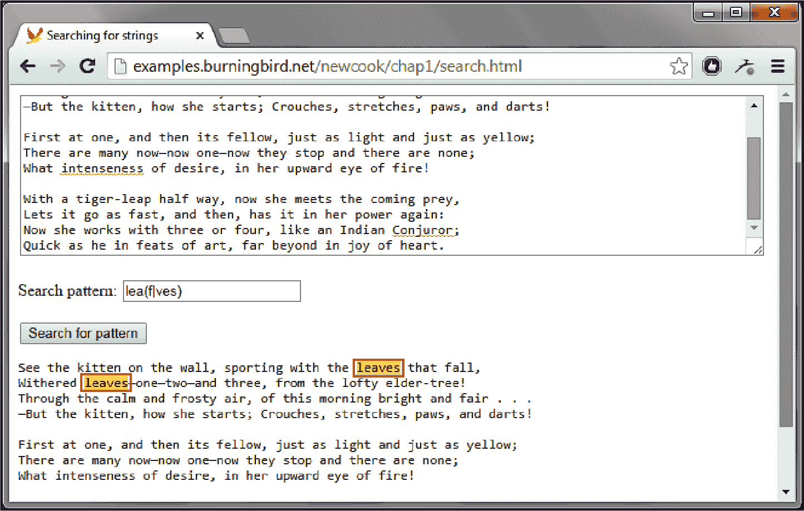

# 第二章：字符串和正则表达式

下面是一个关于你下一个 JavaScript 聚会的趣味问题：世界上最流行的语言有多少种数据类型？

答案是 *eight*，但它们可能不是你所期望的。JavaScript 的八种数据类型包括：

+   `Number`

+   `String`

+   `Boolean`

+   `BigInt`（用于非常大的整数）

+   `Symbol`（用于唯一标识符）

+   `Object`（其他每种 JavaScript 类型的根）

+   `undefined`（未分配值的变量）

+   `null`（丢失的对象）

本书中的配方涵盖了所有这些要点。在本章中，你将专注于字符串的文本处理能力。

# 检查是否存在非空字符串

## 问题

在使用之前，你需要验证变量是否已定义、是否为字符串以及是否不为空。

## 解决方案

在开始处理字符串之前，通常需要验证其是否安全使用。在这样做时，可能会有不同的问题。

如果要确保变量是字符串（而不仅仅是可*转换*为字符串的变量），则使用此测试：

```
if (typeof unknownVariable === 'string') {
  // unknownVariable is a string
}
```

如果你想检查是否有非空字符串（而不是零长度字符串 `''`），你可以像这样收紧你的验证：

```
if (typeof unknownVariable === 'string' && unknownVariable.length > 0) {
  // This is a genuine string with characters or whitespace in it
}
```

可选地，你可能希望拒绝仅由空白字符组成的字符串，在这种情况下，可以使用 `String.trim()` 方法：

```
if (typeof unknownVariable === 'string' && unknownVariable.trim().length > 0) {
  // This is a genuine string that is not empty or all whitespace
}
```

条件的顺序很重要。JavaScript 使用 *短路求值*。这意味着只有在第一个条件（类型检查）成功时，它才会评估第二个条件（长度检查）。这很重要，因为如果 `unknownVariable` 是不同类型的变量（如数字），长度检查将失败。

```
// This test is only safe if we already know unknownVariable is a string
if (unknownVariable.length > 0)
```

使用 `typeof` 运算符时存在潜在漏洞。可以通过使用 `String` 对象而不是字符串字面量来绕过字符串测试：

```
const unknownVariable = new String('test');
```

现在，`typeof` 运算符将返回 `*object*` 而不是 `*string*`，因为字符串原始值被包装在 `String` 对象中。

在现代 JavaScript 中，不建议创建 `String` 对象实例，原因如上所述。最好从任何你遇到的代码中删除这种做法，而不是在其周围编码。然而，如果需要适应可能的 `String` 对象，可以使用更复杂的测试，如下所示：

```
if (typeof unknownVariable === 'string' ||
    String.prototype.isPrototypeOf(unknownVariable)) {
  // It's a string primitive or a string wrapped in an object.
}
```

此代码检查是否满足以下两个条件之一：要么是字符串原始值，要么是具有与 `String` 相同原型的对象。^(1)

## 讨论

此配方中的类型检查测试使用 `typeof` 运算符。它返回变量的类型名称作为小写字符串。可能的值包括：

+   `undefined`

+   `boolean`

+   `number`

+   `bigint`

+   `string`

+   `symbol`

+   `function`

+   `object`

这些值与本章开头的列表匹配，但有两个小差异。首先，没有`*null*`，因为 null 值返回字符串`*object*`而不是。这被许多人认为是一个错误，但出于历史原因而保留。其次，添加了`*function*`数据类型，尽管函数在技术上是对象的特例。

偶尔，您会看到以下老式的字符串验证技术。它不要求变量实际上*是*一个字符串。它只是验证您的值是否可以被视为字符串，并且它不是空字符串。

```
if (unknownVariable) {
  /* We get here as long as:
 unknownVariable has been declared
 unknownVariable is not null
 unknownVariable is not the empty string ''
 */
}
```

这是因为在 JavaScript 中，`null`值、`undefined`值和空字符串（`''`）都被视为*假值*。如果在条件表达式中评估它们中的任何一个，它们将被视为假。

这种方法在处理数字 0 时存在潜在的盲点，因为 0 始终评估为`false`，从而跳过`if`块。为了安全起见，最好显式将您的数字变量转换为字符串，如“将数值转换为格式化字符串”中所述。

# 将数值转换为格式化字符串

## 问题

您想要创建一个数字的字符串表示。

## 解决方案

JavaScript 是一种弱类型语言，当需要时会自动将任何值转换为字符串，例如，如果您将数字与字符串比较或使用`+`运算符将数字与字符串连接起来。事实上，JavaScript 开发人员用来将数字转换为字符串的最简单的技巧之一就是简单地在值的开头或结尾连接一个空字符串：

```
const someNumber = 42;
const someString = someNumber + '';
```

然而，现代做法更偏向于*显式*变量转换。每个 JavaScript 对象都有一个内置的`toString()`方法，包括`Number`对象。您可以像这样调用它：

```
const someNumber = 42;
const someString = someNumber.toString();
```

经常需要自定义数字的字符串表示。例如，您可能希望固定小数位数（如 30.00 而不是 30）。这可能还涉及到四舍五入（例如，从 30.009 到 30.01）。

JavaScript 有三个内置于数字数据类型中的实用方法，可以帮助您。它们都创建数字的字符串表示：

`Number.toFixed()`

允许您指定小数点后要保留的位数。

`Number.toExponential()`

使用科学计数法，并允许您指定小数点后要显示的位数。

`Number.toPrecision()`

允许您指定要保留的有效数字位数，而不考虑您的数字是多么大或小。

###### 注意

如果你不熟悉*有效数字*，这是一个科学概念，用于确保计算具有适当的精度。它还有助于确保测量结果不会以比实际精度更高的方式表示。（例如，你的平均体重可能是 162.5 磅，但说它是 162.503018 磅可能并没有实际意义，将其四舍五入到 200 磅也没有帮助。）维基百科详细解释了[这个概念](https://oreil.ly/vrrPr)。

这里有一个示例，演示了所有三种字符串转换方法：

```
const someNumber = 1242.0055;

// Ask for exactly 2 decimal points. Numbers will be rounded if necessary.
const fixedString = someNumber.toFixed(2);
// fixedString = '1242.01'

// Ask for 5 significant digits. Scientific notation is used if necessary.
const precisionString = someNumber.toPrecision(5);
// precisionString = '1242.0'

// Ask for scientific notation with 2 decimal plates.
const scientificString = someNumber.toExponential(2);
// scientificString = '1.24e+3'
```

如果你想应用逗号、货币符号或其他区域特定细节的格式化，你需要`Intl.NumberFormat`对象的帮助。一旦你创建了一个实例并适当配置它，你可以使用`Intl.NumberFormat`执行你的数字转字符串转换。

例如，要将一个数字格式化为美元货币字符串，你可以使用以下代码：

```
const formatter =
 new Intl.NumberFormat('en-US', { style: 'currency', currency: 'USD' });

const someNumber = 1242.0005;
const moneyString = formatter.format(someNumber);
// moneyString = '$1,242.00'
```

## 讨论

*Locale*代表特定的地理或文化区域。语言标识符结合了语言代码和区域字符串。*en-US*代表美国的英语，*en_CA*是加拿大的英语，*fr-CA*是加拿大的法语，*ja-JP*是日本的日语，等等。

根据你的区域设置，有一些标准的数字格式化规则适用。例如，英语语言区域中的数字通常使用逗号来分隔千位（如*1,200.00*），而法语语言区域中通常使用逗号而不是小数点（如*1 200,00*）。如果你创建一个没有构造函数参数的`Intl.NumberFormat`对象，你会得到当前计算机的区域设置：

```
const formatter = new Intl.NumberFormat();
```

你也可以为特定的区域创建一个`Intl.NumberFormat`对象，不需要额外的选项：

```
const formatter = new Intl.NumberFormat('en-US');
```

在*en-US*区域，这个对象会添加逗号分隔符，但不会应用固定数量的小数点或添加货币符号。

`Intl.NumberFormat`对象支持多种选项。你可以更改负数显示的方式，设置最小和最大数字位数，显示百分比，并在某些语言中选择不同的编号系统。你可以在[Mozilla 开发者网络参考文档](https://oreil.ly/JEF4Q)中找到详细信息。

你可能会看到一个使用`Number.toLocaleString()`方法的旧版本技术。以下是一个示例：

```
const someNumber = 1242.0005;
const moneyString = someNumber.toLocaleString(
 'en-US', { style: 'currency', currency: 'USD' });
```

这种方法是完全有效的，尽管如果你打算格式化一长串数字，创建和重用一个单一的`Intl.NumberFormat`对象会表现更好。

## 参见

如果你需要比`Intl.NumberFormat`提供的格式支持更多的功能，你可以使用第三方库，比如[Numeral.js](https://github.com/adamwdraper/Numeral-js)。

# 插入特殊字符

## 问题

你想要插入特殊字符，比如换行符，到一个字符串中。

## 解决方案

处理带有许多特殊字符的最简单方法很简单：只需将您需要的字符粘贴到您的编辑器中。例如，如果您需要版权符号（©），首先在桌面实用程序（如 Windows 计算机上的 charmap）中找到该字符，或者在 Google 中搜索“版权符号”。选择符号，复制它，然后粘贴到您的代码中。

如果您想要在代码中使用通常不允许的字符（根据 JavaScript 的语法规则），您需要使用其中的一种*转义序列*—特殊的字符代码组合，这些组合不会被字面解释。

例如，如果你在字符串中使用撇号作为定界符，就不能直接在*字符串内*放置撇号字符。相反，你需要使用 `\'` 转义序列，就像这样：

```
const favoriteMovie = 'My favorite movie is \'The Seventh Seal\'.';
```

现在 `favoriteMovie` 包含文本 *My favorite movie is ‘The Seventh Seal’.*。

## 讨论

JavaScript 中的转义序列都以*反斜杠字符*（`\`）开头。该字符表示后续的字符序列需要特殊处理。表 2-1 列出了 JavaScript 所识别的其他转义序列。

表 2-1\. 转义序列

| 序列 | 字符 |
| --- | --- |
| `\'` | 单引号 |
| `\"` | 双引号 |
| `\\` | 反斜杠 |
| `\n` | 换行符 |
| `\t` | 水平制表符 |
| `\b` | 非破坏性退格* |
| `\f` | 换页符* |
| `\r` | 回车符^(a) |
| `\ddd` | 八进制序列（3 位数：*`ddd`*） |
| `\xdd` | 十六进制序列（2 位数：*`dd`*） |
| `\udddd` | Unicode 序列（4 个十六进制数字：*`dddd`*） |
| ^(a) 一些转义序列（如用于退格和换页的序列）是从原始 ASCII 字符标准和 C 语言中保留下来的。除非您处理遗留场景（如将输入发送到终端），否则这些转义序列在 JavaScript 中不太可能有用。 |

表 2-1 中的最后三个转义序列是需要提供数值的模式。例如，如果您不想使用复制粘贴技巧来添加版权符号，您可以使用 `\u` 转义序列和版权符号的 Unicode 值来插入它：

```
const copyrightNotice = 'This page \u00A9 Shelley Powers.';
```

现在 `copyrightNotice` 字符串设置为 *This page © Shelley Powers.*。

## 另请参见

有关在字符串中插入更专业字符的信息，请参阅 “插入表情符号”。有关处理换行而不使用 `\n` 的替代方法，请参阅 “使用模板文字清晰地进行字符串连接”。

# 插入表情符号

## 问题

您想要插入一个具有 4 字节编码的扩展 Unicode 字符，如表情符号或某些类型的重音非英文字母。

## 解决方案

如果您只是想创建一个带有表情符号的字符串，通常可以从“插入特殊字符”的“复制并粘贴技巧”中工作。在现代代码编辑器中，您可以像这样编写代码：

+   `const hamburger = '`🍔`';`

+   `const hamburgerStory = '我喜欢汉堡包' + hamburger;`

由于代码编辑器将使用操作系统提供的表情符号支持作为后备，因此您的代码字体甚至无需支持表情符号。（当然，问题仍可能发生。例如，在旧系统上，表情符号不可用时，您可能会看到一个方框“缺失字符”图标。）

另一个选项是使用表情符号的 Unicode 值。问题是，您不能使用标准的`\u`转义序列来获取表情符号，因为每个表情符号都存储为 4 字节值。（相比之下，映射到键盘键的 Unicode 字符通常编码为 2 字节值。）

解决方案是使用`String.fromCodePoint()`方法：

```
const hamburgerStory = 'I like hamburgers' + String.fromCodePoint(0x1F354);
```

汉堡包表情的十六进制代码是 U+1F354。要使用它与`fromCodePoint()`，请用*0x*替换前缀*U+*。

创建了一个富含表情符号的字符串后，您可以像处理由普通字符组成的普通字符串一样将其写入开发者控制台或显示在网页上。

## 讨论

截至 2020 年，全世界仅有三千多个表情符号。您可以在[完整表情列表](https://oreil.ly/IIguA)上看到它们及其相应的十六进制值。仅仅因为一个表情符号存在并不意味着它将在您计划使用它的设备上受支持，因此请尽早测试兼容性。

如果您需要处理可能包含表情符号的字符串进行字符串处理，可能会遇到其他问题。例如，您认为以下代码将找到什么？

+   `const hamburger = '`🍔`';`

+   `const hamburgerLength = hamburger.length;`

尽管`hamburger`字符串只有一个字符，但在你的代码中，长度看起来是 2，因为汉堡包表情在内存中占用了两倍的字节。这是 JavaScript 对 Unicode 支持的一个不愉快的[*泄漏抽象*](https://oreil.ly/nlmvi)和限制。

有人已经发明了一些解决表情符号问题的变通方法，例如不正确的长度和在字符上进行迭代或切片的问题。但是自制解决方案风险很大，因为通常存在奇怪的边缘情况。如果需要处理富含表情符号的文本，可以考虑使用像[Grapheme Splitter](https://github.com/orling/grapheme-splitter)这样支持表情符号的 JavaScript 库。

# 使用模板字面量来进行更清晰的字符串连接

## 问题

您希望有一个更简单、更清晰的方法来编写长字符串的连接操作。

## 解决方案

在编程中的一个常见任务是将静态文本的各个部分与变量结合起来，创建一个更长的字符串。组装这种类型的字符串的传统方式是使用连接运算符`+`，如下所示：

```
const employeeDetail = 'Our team includes ' + firstName + ' ' + lastName +
 ' who works on the ' + team + " team. They/'ve been a team member since "
  + hireDate + '!';
```

它并不糟糕，但在固定文本变得更长时可能会变得尴尬。而且很容易忘记在变量周围添加空格。

另一种方法是使用*模板字面量*，一种允许嵌入表达式的字符串字面量。要创建模板字面量，只需用反引号（`）替换标准字符串定界符（撇号或双引号）即可：

```
const greeting = `Hello world from a template literal!`;
```

现在，您可以直接将变量插入到模板字面量中。您只需将每个变量用花括号包裹起来，并在前面加上一个美元符号，例如`${firstName}`。这称为*表达式*。

模板字面量方法的优势在于当您查看完整示例时变得更加明显：

```
employeeDetail = `Our team includes ${firstName} ${lastName} who works on the
${team} team. They've been a team member since ${hireDate}!`;
```

当您在现代代码编辑器中使用着色花括号表达式时，情况会变得更清晰，这使得变量从文字字面上脱颖而出。

模板字面量还保留换行符。在这里显示的示例中，您看不到这种效果，因为我们已经把代码换行以适应页面。但是，如果您故意按 Enter 键在模板字面量中添加硬换行，这些换行将保留在字符串中，就像使用`\n`换行转义序列一样（参见“插入特殊字符”）。

###### 注意

许多 JavaScript 风格指南，包括[Airbnb](https://github.com/airbnb/javascript)，都有规则不鼓励字符串连接，而是青睐使用模板字面量。您可以使用类似 ESLint 的代码检查工具（“使用 ESLint 执行代码标准”）来在您的代码中强制执行这一实践。

## 讨论

在模板字面量中使用表达式时，不限于直接插入变量。事实上，您可以使用 JavaScript 能评估的任何代码表达式。例如，请考虑以下代码：

```
const calculation = `The sum of 5 + 3 is ${5+3}`;
```

在这里，JavaScript 执行表达式`{5+3}`中的加法，获取结果，并创建字符串*The sum of 5 + 3 is 8*。

如果您想做一些更复杂的事情，比如格式化字符串或操作对象，您可以使用调用函数的表达式。例如，如果您创建了一个用于计算日期间差异的`getDaysSince()`函数（参见“计算两个日期间经过的时间”），您可以在模板字面量中像这样使用它：

```
function getDaysSince(date) {
  const today = new Date();
  const oneDay = 24 * 60 * 60 * 1000; // hours*minutes*seconds*milliseconds
  return Math.round(Math.abs((today - date) / oneDay));
}

employeeDetail = `Our team includes ${firstName} ${lastName}. They've been a
team member since ${hireDate}! That's ${getDaysSince(hireDate)} days.`;
```

唯一的限制是实际情况——换句话说，不要使您的表达式过于复杂，以至于生成的模板字面量比使用传统字符串连接方法的代码更难阅读。

目前，JavaScript 没有内置的方法来在模板字面量表达式内格式化数字、日期和货币值。许多人猜测未来版本的 JavaScript 将添加此功能。甚至有一个 JavaScript 库，使用了一个尴尬的可扩展性特性称为[*标记模板*](https://github.com/skolmer/es2015-i18n-tag)来添加它。

# 执行不区分大小写的字符串比较

## 问题

你想要查看两个字符串是否匹配，同时将大写和小写字母视为相同。

## 解决方法

一种即兴的方法是对两个字符串都使用 `String.toLowerCase()` 方法，然后比较结果，例如：

```
const a = "hello";
const b = "HELLO";

if (a.toLowerCase() === b.toLowerCase()) {
  // We end up here, because the lowercase versions of both strings match
}
```

这种方法相当可靠，但在处理不同语言、重音符号和特殊字符时可能会出现边缘情况。（例如，请查看与土耳其语相关的 [潜在问题](https://oreil.ly/CiALB)。）

另一种健壮的方法是使用 `String.localeCompare()` 方法，并将 `sensitivity` 设置为 `*accent*`，如下所示：

```
const a = "hello";
const b = "HELLO";

if (a.localeCompare(b, undefined, { sensitivity: 'accent' }) === 0) {
  // We end up here, because the case-insensitive strings match.
}
```

## 讨论

如果 `localeCompare()` 判定两个字符串匹配，则返回 0。否则，返回一个正数或负数，指示比较的字符串在排序顺序中是在参考字符串之前还是之后。（因为我们使用 `localeCompare()` 来测试相等性，排序顺序并不重要，可以忽略。）

`localeCompare()` 的第二个参数是一个字符串，用于指定区域设置（如 “将数值转换为格式化字符串” 中所述）。如果传入 `undefined`，则 `localeCompare()` 使用当前计算机的区域设置，这通常是你想要的。

要执行大小写不敏感的比较，需要设置 `sensitivity` 属性。有两个可以工作的值。如果将 `sensitivity` 设置为 `*accent*`，则具有不同重音符号的字符（如 *a* 和 *á*）将被视为不相等。但如果将 `sensitivity` 设置为 `*base*`，则会得到一个更宽松的大小写不敏感比较，将所有重音符号的字母视为匹配。

# 检查字符串是否包含特定子字符串

## 问题

你想要检查一个字符串是否包含另一个子字符串。

## 解决方法

如果只需要一个是或否的测试，可以使用 `String.includes()` 方法：

```
const searchString = 'infinitely';
const fullText = 'I know not where I was born, save that the castle was' +
 ' infinitely old and infinitely horrible.';

if (fullText.includes(searchString)) {
  // The search string was found
}
```

可选地，你可以告诉 `includes()` 方法从哪个字符位置开始搜索。例如，传入值 5，则搜索跳过字符串中的第六个字符，并继续直到末尾：

```
const searchString = 'infinitely';
const fullText = 'I know not where I was born, save that the castle was' +
 ' infinitely old and infinitely horrible.';

if (fullText.includes(searchString, 70)) {
  // Still true, because the search skips the first 'infinitely' and
  // hits the second one.
}
```

## 讨论

`includes()` 执行的搜索区分大小写。如果需要大小写不敏感的搜索，可以先对两个字符串调用 `toLowerCase()`：

```
const searchString = 'INFINITELY';
const fullText = 'I know not where I was born, save that the castle was' +
 ' infinitely old and infinitely horrible.';

if (fullText.toLowerCase().includes(searchString.toLowerCase())) {
  // The search string was found
}
```

`includes()` 方法不提供关于匹配发生位置的任何信息。如果需要此信息，请考虑使用 `String.indexOf()` 方法，详情请见 “从字符串中提取列表”。

# 替换字符串的所有出现

## 问题

你想要查找字符串中特定子字符串的所有出现，并用其他内容替换它们。

## 解决方法

可以使用 `String.replaceAll()` 方法一次性进行更改。你只需要一个要搜索的子字符串和另一个要替换的字符串：

```
const storyText = 'I know not where I was born, save that the castle was' +
 ' infinitely old and infinitely horrible.';

const changedStory = storyText.replaceAll('infinitely', 'somewhat');

console.log(changedStory);
```

如果运行此代码，你将在开发者控制台看到改变后的字符串 “I know not where I was born, save that the castle was somewhat old and somewhat horrible.”。

## 讨论

`replaceAll()`方法有能力使用正则表达式进行搜索，而不是普通字符串。你可以在“使用正则表达式替换字符串中的模式”中看到这是如何工作的。

## 参见

查看[Recipes](https://example.org/recipes)来了解如何在字符串中查找匹配项并逐个检查，而不仅仅是直接替换它们。

# 将 HTML 标签替换为命名实体

## 问题

你想要将标记插入到网页中，并转义该标记（使浏览器*显示*角括号而不解释它们为 HTML 标签）。这可能是因为你希望在教程文章中显示一些示例 HTML 标记，或者因为你需要安全地清理外部数据，如用户提交的文本或从数据库中提取的文本。

## 解决方案

使用`String.replaceAll()`方法将角括号(`< >`)转换为命名的 HTML 实体`&lt;`和`&gt;`。你需要执行两个步骤，分别进行替换：

```
const originalPieceOfHtml = '<p>This is a <span>paragraph</span></p>';

// Get a new string with no < characters
let safePieceOfHtml = originalPieceOfHtml.replaceAll('<', '&lt;');

// Get a new string with no > characters
safePieceOfHtml = safePieceOfHtml.replaceAll('>', '&gt;');

// Show it in the page
document.getElementById('placeholder').innerHtml = safePieceOfHtml;
```

如果现在检查字符串，你会发现它包含文本“<p>This is a <span>paragraph</span></p>”，在网页中将如你所预期地显示（显示角括号）。

只要代码可读性能够保持，你可以一步完成两次字符串替换：

```
const safePieceOfHtml =
 originalPieceOfHtml.replaceAll('<', '&lt;').replaceAll('>', '&gt;');
```

第一个`replaceAll()`返回一个新字符串，然后在这个第二个字符串上调用`replaceAll()`来获得*第三*个字符串。这种在从一个方法返回的值上调用方法的技术称为*方法链*。

## 讨论

如果将原始文本插入到网页中，HTML 转义非常重要。如果你不执行此步骤，将会存在严重的安全漏洞。事实上，你应该确保在显示文本内容之前，对所有文本内容进行转义，即使你认为该文本不包含任何 HTML 实体（例如，即使它只是在你的代码中直接设置为文字）。无法预测何时可能会从其他地方更改代码并替换文本值。

尽管如此，自行进行 HTML 转义通常不是最佳方法。如果你有意创建一个将 HTML 标签与外部内容混合的字符串，那么你需要这样做。但是理想情况下，你应该使用元素的`textContent`属性而不是`innerHTML`属性将文本放入网页中。使用`textContent`时，浏览器会自动转义内容，这意味着你不需要使用`String.replaceAll()`。

## 参见

更多关于使用 HTML DOM 将文本内容插入到网页中的信息，请参见第十二章。

# 使用正则表达式替换字符串中的模式

## 问题

你希望在字符串中搜索模式，而不是确切的字符序列。然后，你想创建一个新字符串，将模式替换掉。

## 解决方案

你可以使用`String.replace()`或`String.replaceAll()`方法，两者都支持正则表达式。

###### 注意

*正则表达式*是定义文本模式的字符序列。正则表达式是 JavaScript 和许多其他编程语言中实现的标准。请参阅表 2-2 以简要介绍正则表达式语法。

例如，考虑正则表达式模式*`t\w{2}e`*。这将被翻译为*查找以*t*开头，以*e*结尾，并包含两个其他字母数字字符的任意字符序列*。该解决方案匹配*time*，但也匹配*tame*。

这是使用此正则表达式的代码：

```
const originalString = 'Now is the time, this is the tame';
const regex = /t\w{2}e/g;
const newString = originalString.replaceAll(regex, 'place');

// newString = 'Now is the place, this is the place'
```

注意，正则表达式不是作为字符串编写的。相反，它是以斜杠（`/`）开始和结束的文字。JavaScript 识别这种语法并创建一个使用您的表达式的`RegEx`对象。

正则表达式末尾的`g`是称为*全局标志*的附加细节。它表示您正在搜索整个字符串以找到匹配项。如果不包括`g`标志，则在调用`replaceAll()`时会收到错误消息。但是，当您使用`replace()`方法仅更改模式的一个出现时，可以使用没有全局标志的正则表达式。

## 讨论

如果您不想使用`/`分隔符创建正则表达式，还有另一种选择。您可以显式创建一个`RegEx`对象，如下所示：

```
const regex = new RegExp('t\\w{2}e', 'g');
const newString = originalString.replaceAll(regex, 'place');
```

当您使用这种方法时，您不需要在正则表达式周围包含斜杠，但您需要转义模式中的任何反斜杠（将`/`替换为`//`）。此外，全局标志成为`RegExp`构造函数的第二个参数，而不是添加到正则表达式的末尾。

您可能会发现，在长而复杂的正则表达式中，转义反斜杠是令人困惑的。如果是这样，您可以通过模板文字（在“使用模板文字进行更清晰的字符串连接”中介绍）来避免转义要求。窍门是将您的模板文字与`String.raw()`方法结合使用。请记住，在表达式字符串周围使用反引号（`）而不是撇号或引号：

```
// Although String.raw is a method, it has no parentheses after it,
// and it uses the specialized backtick syntax shown here.
const regex = new RegExp(String.raw`t\w{2}e`, 'g');
```

## 额外：正则表达式

正则表达式由普通字符单独使用或与特殊字符结合而成。例如，以下是一个正则表达式，用于匹配包含单词*technology*和单词*book*（以这个顺序，并由一个或多个空白字符分隔）的字符串模式：

```
const regex = /technology\s+book/;
```

反斜杠字符（`\`）有两个用途：它要么与普通字符一起使用，表示它是一个特殊字符，要么与特殊字符一起使用，例如加号（+），表示应将该字符视为字面量。在这种情况下，反斜杠与 *s* 一起使用，将字母 *s* 转换为指定空格字符（空格、制表符、换行符或换页符）的特殊字符。 +\s+ 特殊字符后跟加号，`\s` 是一个匹配前一个字符（在这个例子中是空格字符）一次或多次的信号。此正则表达式适用于以下情况：

```
technology book
```

以下也有效：

```
technology     book
```

它不适用于以下情况，因为单词之间没有空白字符：

```
technologybook
```

由于使用 `\s+`，在 *technology* 和 *book* 之间有多少空白字符并不重要。然而，使用加号确实需要至少一个空白字符。

表 2-2 展示了 JavaScript 应用中最常用的特殊字符。

表 2-2\. 正则表达式特殊字符

| 字符 | 匹配 | 示例 |
| --- | --- | --- |
| `^` | 匹配输入的开头 | `/^This/` 匹配 *This is…* |
| `$` | 匹配输入的结尾 | `/end$/` 匹配 *This is the end* |
| `*` | 匹配零次或多次 | `/se*/` 匹配 *seeee* 和 *se* |
| `?` | 匹配零次或一次 | `/ap?/` 匹配 *apple* 和 *and* |
| `+` | 匹配一次或多次 | `/ap+/` 匹配 *apple* 但不匹配 *and* |
| `{n}` | 精确匹配 *n* 次 | `/ap{2}/` 匹配 *apple* 但不匹配 *apie* |
| `\{n,\}` | 匹配至少 *n* 次 | `/ap{2,}/` 匹配 *apple* 和 *appple* 中的所有 p 但不匹配 *apie* |
| `\{n,m\}` | 匹配至少 *n* 次，至多 *m* 次 | `/ap{2,4}/` 匹配 *appppple* 中的四个 p |
| `.` | 除换行符外的任意字符 | `/a.e/` 匹配 *ape* 和 *axe* |
| `[`…`]` | 括号内的任何字符 | `/a[px]e/` 匹配 *ape* 和 *axe* 但不匹配 *ale* |
| `[^`…`]` | 除括号内的字符外的任何字符 | `/a[^px]/` 匹配 *ale* 但不匹配 *axe* 或 *ape* |
| `\b` | 匹配单词边界 | `/\bno/` 匹配 *nono* 中的第一个 *no* |
| `\B` | 匹配非单词边界 | `/\Bno/` 匹配 *nono* 中的第二个 *no* |
| `\d` | 数字 0 到 9 | `/\d{3}/` 匹配 *Now in 123* 中的 *123* |
| `\D` | 任何非数字字符 | `/\D{2,4}/` 匹配 *Now ' in ‘Now in 123*; |
| `\w` | 匹配单词字符（字母、数字、下划线） | `/\w/` 匹配 *javascript* 中的 *j* |
| `\W` | 匹配任何非单词字符（不是字母、数字或下划线） | `\/W/` 匹配 *100%* 中的 *%* |
| `\n` | 匹配换行符 |  |
| `\s` | 单个空白字符 |  |
| `\S` | 任何非空格字符 |  |
| `\t` | 制表符 |  |
| `(x)` | 捕获括号 | 记住匹配的字符 |

###### 注意

正则表达式很强大，但可能有些棘手。本书只是简单介绍了它们。如果你想要更深入地了解正则表达式，你可以阅读 Jan Goyvaerts 和 Steven Levithan（O’Reilly）的优秀著作*[正则表达式手册](http://shop.oreilly.com/product/0636920023630.do)*，或者参考[在线参考资料](https://github.com/ziishaned/learn-regex)。

# 从字符串中提取列表

## 问题

你有一个包含多个句子的字符串，其中一个句子包括一个项目列表。列表以冒号（:）开头，以句号（.）结尾，并用逗号（,）分隔每个项目。你想要提取出列表部分。

之前：

```
This is a list of items: cherries, limes, oranges, apples.
```

之后：

```
['cherries','limes','oranges','apples']
```

## 解决方案

解决方案需要两个步骤：提取包含项目列表的字符串，然后将此字符串转换为列表。

使用`String.indexOf()`方法两次——首先定位冒号，然后再找到冒号后面的第一个句号：

```
const sentence = 'This is one sentence. This is a sentence with a list of items:' +
'cherries, oranges, apples, bananas. That was the list of items.';
const start = sentence.indexOf(':');
const end = sentence.indexOf('.', start + 1);
```

使用这两个位置和`String.slice()`方法，你可以提取你想要的字符串：

```
const list = sentence.slice(start + 1, end);
// list = 'cherries, oranges, apples, bananas'
```

你可以编写一个循环，使用`indexOf()`方法查找逗号，并使用`slice()`方法将`list`字符串拆分为较小的部分，每个项目一个部分。但有一种更简单的方法。你可以使用`String.split()`方法将字符串拆分为数组：

```
let fruits = list.split(',');
// now fruits has these elements: ['cherries', ' oranges', ' apples', ' bananas']
```

当你调用`split()`时，你必须选择一个分隔符。它可以是空格、逗号、一系列破折号或其他内容。分隔符用于将字符串切分为较小的部分，并且它不会出现在结果中。

## 讨论

分割提取的字符串的结果是一个项目列表的数组。然而，这些项目可能带有一些不必要的部分（在这种情况下，除第一个字符串外，所有字符串都有额外的前导空格）。幸运的是，清理它们很容易。

一个明显的方法是遍历字符串数组并手动修剪每个字符串，使用“从字符串开头和结尾删除空格”中描述的技术。这样做是有效的，但有一种更简单的方法。

关键是使用`Array.map()`，它会在数组中的每个元素上运行你提供的代码。你只需要一行代码来调用`trim()`方法：

```
fruits = fruits.map(s => s.trim());
// now fruits has these elements: ['cherries', 'oranges', 'apples', 'bananas']
```

如果你对在这个例子中提供修剪函数所使用的箭头语法不熟悉，你可以在“使用箭头函数”中阅读更详细的解释。

## 参见

在字符串中查找匹配项的另一种方法是使用正则表达式。例如，根据列表的结构方式，你可以使用一个抓取逗号之间的单词的正则表达式。正则表达式在“使用正则表达式替换字符串中的模式”中介绍，使用正则表达式执行搜索在“查找所有模式的实例”中介绍。

# 查找所有模式的实例

## 问题

你想要在字符串中找到模式的所有实例，并对它们进行迭代。

## 解决方案

使用 `String.matchAll()` 方法与正则表达式。`matchAll()` 方法返回一个迭代器，让你可以遍历所有的匹配项。

下一个示例使用正则表达式来查找以 *t* 开头并以 *e* 结尾的任意单词，中间包含任意数量的字符。它使用来自 “使用模板字面量进行更清晰的字符串连接” 的模板字面量语法构建一个新的带有结果的字符串：

```
const searchString = 'Now is the time and this is the time and that is the time';
const regex = /t\w*e/g;

const matches = searchString.matchAll(regex);
for (const match of matches) {
  console.log(`at ${match.index} we found ${match[0]}`);
}
```

这段代码的结果如下：

```
at 7 we found the
at 11 we found time
at 28 we found the
at 32 we found time
at 49 we found the
at 53 we found time
```

## 讨论

当你使用 `matchAll()` 进行搜索时，每个匹配都是一个对象。当你遍历你的匹配项时，你可以检查匹配的文本（`match[0]`）和匹配被找到的索引（`match.index`）。

在当前示例中有一些看起来有点奇怪的地方。尽管你一次只看一个结果，但你使用 `match[0]` 来获取数组中的第一个项目。这个数组存在是因为正则表达式可以使用括号*捕获*多个匹配部分。稍后你可以引用这些捕获的部分。例如，想象一下你写了一个匹配有关某人信息行的正则表达式。通过捕获，你可以轻松地从每个匹配中抓取单独的信息片段，比如那个人的姓名和出生日期。当你将这个技术与 `matchAll()` 结合使用时，匹配的子字符串会分别作为 `match[1]`、`match[2]` 等提供。

如果你不想立即遍历结果，你可以使用扩展运算符将所有内容转储到一个数组中：

```
const searchString = 'Now is the time and this is the time and that is the time';
const regex = /t\w*e/g;

// Put the 6 match objects into an array
const matches = [...searchString.matchAll(regex)];
```

现在你可以使用 `foreach` 在另一个时间循环遍历你的 `matches` 数组。但请记住，`matches` 不仅仅是一个匹配文本的数组。它是一个匹配*对象*的数组。正如你在原始示例中看到的，每个匹配对象都有一个位置（`match.index`）和一个包含一个或多个匹配文本组的数组（以 `match[0]` 开头）。

## 补充：高亮匹配项

让我们看一个更详细的例子，展示如何在网页上查找并高亮文本匹配。图 2-1 展示了该应用在威廉·华兹华斯的诗歌《小猫和落叶》上的运行情况。



###### 图 2-1\. 应用程序查找和突出显示所有匹配的字符串

该页面有一个 `textarea` 和一个输入框，用于输入搜索字符串和正则表达式。该模式用于创建一个 `RegExp` 对象，然后像前面（更短的）示例一样，应用于 `textarea` 中的文本，使用 `matchAll()`。

当代码检查匹配项时，它创建一个字符串，包含未匹配的文本和匹配的文本。匹配的文本被包围在一个 `<span>` 元素中，并使用 CSS 类来突出显示文本。然后将生成的字符串插入到页面中，使用 `<div>` 元素的 `innerHTML` 属性（参见 示例 2-1）。

##### 示例 2-1\. 在文本字符串中突出显示所有匹配项

```
<!DOCTYPE html>
<html lang="en">
  <head>
    <meta charset="UTF-8" />
    <meta name="viewport" content="width=device-width, initial-scale=1.0" />
    <meta http-equiv="X-UA-Compatible" content="ie=edge" />
    <title>Finding All Instances of a Pattern</title>

    <style>
      .found {
        background-color: #ff0;
      }
      body {
        margin: 15px;
      }
      textarea {
        width: 100%;
        height: 350px;
      }
    </style>
  </head>
  <body>
    <h1>Finding All Instances of a Pattern</h1>

    <form id="textsearch">
      <textarea id="incoming">
      </textarea>
      <p>
        Search pattern: <input id="pattern" type="text">
      </p>
    </form>
    <button id="searchSubmit">Search for pattern</button>
    <div id="searchResult"></div>

    <script>
    document.getElementById("searchSubmit").onclick = function() {
        // Get the pattern
        const pattern = document.getElementById('pattern').value;
        const regex = new RegExp(pattern, 'g');

        // Get the text to search
        const searchText = document.getElementById('incoming').value;

        let highlightedResult = "<pre>";
        let startPosition = 0;
        let endPosition = 0;

        // Find each match, and build the result
        const matches = searchText.matchAll(regex);
        for (const match of matches) {
            endPosition = match.index;

            // Get all of the string up to the match, and concatenate
            highlightedResult += searchText.slice(startPosition, endPosition);

            // Add matched text, using a CSS class for formatting
            highlightedResult += "<span class='found'>" + match[0] + "</span>";
            startPosition = endPosition + match[0].length;
        }

        // Finish off the result string
        highlightedResult += searchText.slice(startPosition);
        highlightedResult += "</pre>";

        // Show the highlighted text in the page
        document.getElementById("searchResult").innerHTML = highlightedResult;
     }
    </script>
  </body>
</html>
```

在图 2-1 的页面中，使用以下正则表达式进行搜索：

```
lea(f|ves)
```

竖线（`|`）是条件测试，将匹配基于竖线两侧的值的单词。所以*leaf*会匹配，*leaves*也会匹配，但*leap*不会匹配。

# 去除字符串开头和结尾的空白字符

## 问题

你想要去除填充在字符串开头或结尾的额外空格。

## 解决方案

使用`String.trim()`方法。它会移除字符串两端的所有空白字符，包括空格、制表符、不间断空格和行终止符。

```
const paddedString = '     The road is long, with many a winding turn.  ';
const trimmedString = paddedString.trim();

// trimmedString = 'The road is long, with many a winding turn.'
```

## 讨论

`trim()`方法很简单，但不可定制。如果你有稍微复杂的字符串修改需求，你将需要使用正则表达式。

一个常见的问题是`trim()`方法无法移除字符串*内部*的多余空格。`replaceAll()`方法可以使用带有`\s`字符的正则表达式相对轻松地完成这个任务：

```
const paddedString = 'The road is long,    with many a    winding turn.';
const trimmedString = paddedString.replaceAll(/\s\s+/g, ' ');

// trimmedString = 'The road is long, with many a winding turn.'
```

当然，即使在处理带有额外空格的坏数据之后，仍然可能出现不需要的残留物。例如，如果在你不希望有任何空格的地方有多个空格（'is long ,    with'），在替换后仍然会留下一个空格（'is long , with'）。处理这类问题的唯一方法是手动逐个匹配，正如“查找模式的所有实例”所示。

## 参见

正则表达式语法在“使用正则表达式替换字符串中的模式”中描述。

# 将字符串的第一个字母转换为大写

## 问题

你想将字符串的第一个字母变成大写，但不改变字符串的其余部分。

## 解决方案

分离第一个字母并使用`String.toUpper()`将其大写化。然后将大写字母与字符串的其余部分连接起来，你可以使用`String.slice()`来获取字符串的剩余部分：

```
const original = 'if you cut an orange, there is a risk it will orbisculate.';
const fixed = original[0].toUpperCase() + original.slice(1);

// fixed = 'If you cut an orange, there is a risk it will orbisculate.';
```

## 讨论

要从字符串中获取单个字符，你可以使用字符串的索引器，如`original[0]`。这会获取位置 0（即第一个字符）的字符。

```
const firstLetter = original[0];
```

或者，你可以使用`String.charAt()`方法，它的工作方式完全相同。

要获取字符串的片段，你可以使用`slice()`方法。在调用`slice()`时，你必须始终指定你希望从哪里开始提取字符串。例如，`text.slice(5)`从索引位置 5 开始，一直到字符串的末尾，并将该部分文本复制到一个新字符串中。

如果你不希望`slice()`继续到字符串的末尾，你可以提供一个可选的第二个参数，指定字符串复制应该停止的索引位置：

```
// Get a string from index position 5 to 10.
const substring = original.slice(5, 10);
```

本示例中的示例更改了一个字母为大写。如果要将整个句子更改为使用首字母大写（称为*标题大小写*），这是一个更复杂的问题。您可能决定将字符串拆分为单独的单词，修剪每个单词，然后连接结果，使用从 “从字符串中提取列表” 技术的变体。

## 另请参阅

您可以将 `slice()` 与 `indexOf()` 结合使用，以找到要提取的特定文本位的位置。例如，请参见 “从字符串中提取列表”。

# 验证电子邮件地址

## 问题

您希望捕捉和拒绝电子邮件地址中的常见错误。

## 解决方案

正则表达式不仅对搜索有用。您还可以通过测试字符串是否与给定模式匹配来验证字符串。在 JavaScript 中，您可以使用 `RegEx.test()` 方法测试字符串是否与正则表达式匹配。

```
const emailValid = "abeLincoln@gmail.com";
const emailInvalid = "abeLincoln@gmail .com";
const regex = /\S+@\S+\.\S+/;

if (regex.test(emailValid)) {
  // This code is executed, because the email passes.
}
if (regex.test(emailInvalid)) {
  // This code is not executed, because the email fails.
}
```

## 讨论

程序员使用许多不同的正则表达式来验证电子邮件地址。最好的正则表达式捕获明显的错误和虚假值，但不要过于复杂。过于严格的正则表达式有时会无意中禁止有效的邮件地址。即使电子邮件地址通过了最严格的测试，也没有办法知道它是否*正确*（至少不发送电子邮件消息并请求确认）。

本示例中的正则表达式要求电子邮件地址以至少一个非空白字符开头，后跟 @ 字符，然后是一个或多个非空白字符，然后是一个句点（.），再跟着一个或多个非空白字符。它捕获了明显无效的电子邮件地址，如 *tomkhangmail.com* 或 *tomkhan@gmail*。

通常，您不会自己编写用于验证的正则表达式。相反，您将使用匹配您数据的预定义表达式。有关大量正则表达式资源，请访问 [Awesome Regex 页面](https://github.com/aloisdg/awesome-regex)。

## 另请参阅

正则表达式语法在 “使用正则表达式替换字符串中的模式” 中有描述。

^(1) 在 JavaScript 中，*原型*是特定类型对象的模板。在更传统的面向对象语言中，我们会说具有相同原型的对象是同一类的实例。《第八章》有很多示例，探讨了 JavaScript 中的原型。
