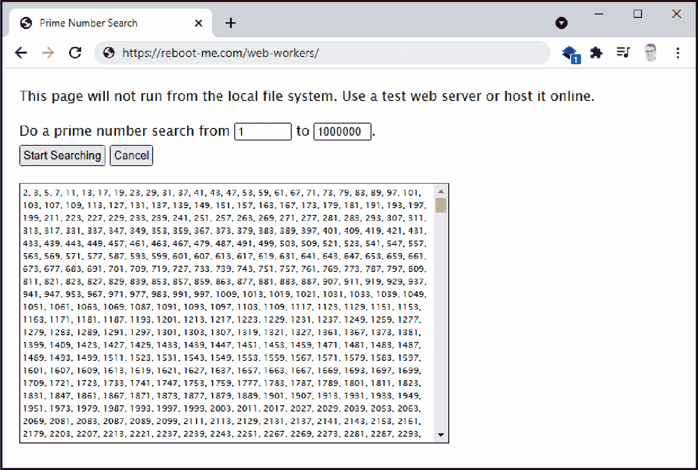
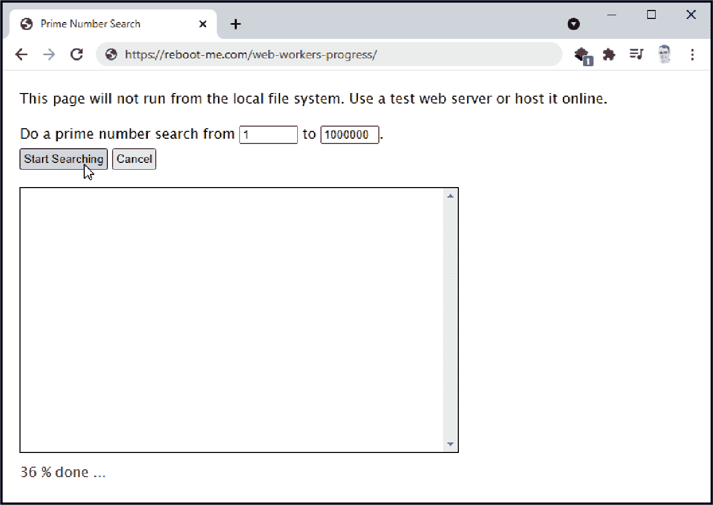

# 第九章：异步编程

JavaScript 最初是作为单线程编程语言构建的，具有一个调用堆栈，一个内存堆，一次只能执行一个代码例程的特点。但多年来，JavaScript 已经发展壮大。它已经获得了发送网络消息、读取文件和等待用户确认的能力——所有这些操作可能需要时间并可能锁定用户界面。为了安全地处理这些操作，JavaScript 引入了自己的异步编程模式。

在早期阶段，JavaScript 的异步支持围绕回调展开。使用回调时，您请求一个操作（比如从 Web 获取图像），浏览器在另一个线程中执行工作，而不是在您的应用程序代码中。当图像下载完成并且您的应用程序处于空闲状态时，JavaScript 会触发您的回调并将数据传递回您的代码。最终结果是，您的应用程序代码仍然是单线程的，但通过一组标准化的 Web API，您可以启动异步工作。

回调在 JavaScript 中仍然随处可见，但近年来已经用更加精致的语言特性（如 Promise 和`async`与`await`关键字）进行了包装。底层实现机制相同，但现在可以创建复杂的应用程序，管理并发的异步任务序列，并优雅地处理意外错误。

在本章中，您将使用回调和 Promise 来管理异步任务。您还将看到如何跳出 JavaScript 的单线程模型，并使用 Web Worker API 执行持续的后台工作。

# 在循环期间更新页面

## 问题

您希望在长时间的 CPU 密集型操作期间更新页面，但浏览器在忙碌时不会重新绘制窗口。

## 解决方案

使用`setTimeout()`函数定期排队您的工作。与其名称相反，您不需要使用`setTimeout()`设置延迟。相反，使用超时值为`0`，以便在 UI 线程空闲时立即安排操作的下一步执行。

例如，考虑以下循环，它在 10 秒钟（10,000 毫秒）内递增一个计数器。每次循环通过后，它尝试更改名为`status`的`<p>`元素中的文本：

```
function doWork() {
  // Get the <p> element to change
  const statusElement = document.getElementById('status');

  // Track the time and the number of passes through the loop
  const startTime = Date.now();
  let counter = 0;

  statusElement.innerText = 'Processing started';

  while ((Date.now() - startTime < 10000)) {
    counter += 1;
    statusElement.innerText = `Just generated number ${counter}`;
  }

  statusElement.innerText = 'Processing completed';
}
```

如果您运行此代码，将不会看到任何“刚生成的数字”消息。相反，页面将在 10 秒钟内无响应，然后显示“处理完成”。

要解决这个问题，您将工作（在本例中是递增计数器和显示消息）移动到一个单独的函数中。然后，不再在循环中反复调用此函数，而是使用`setTimeout()`调用它。每次，该函数递增计数器，更新页面，然后调用`setTimeout()`以进行*另一个*循环，直到 10 秒时间限制结束：

```
function doWorkInChunks() {
   // Get the <p> element to change
   const statusElement = document.getElementById("status");

   // Track the time and the number of passes through the loop
   const startTime = Date.now();
   let counter = 0;

   statusElement.innerText = 'Processing started';

   // Create an anonymous function that does one chunk of work
   const doChunkedTask = () => {
      if (Date.now() - startTime < 10000) {
        counter += 1;
        statusElement.innerText = `Just generated number ${counter}`;

        // Call the function again, for the next chunk
        setTimeout(doChunkedTask, 0);
      }
      else {
        statusElement.innerText = 'Processing completed';
     }
   };

  // Start the process by calling the function for the first time
  doChunkedTask();
}
```

这里，`doChunkedTask` 变量包含了一个用箭头函数语法定义的匿名函数（见 “使用箭头函数”）。你并不一定需要使用匿名函数或箭头语法，但它简化了代码。`doChunkedTask` 函数可以访问创建时所在范围内的所有内容，包括 `startTime` 和 `statusElement` 变量。因此，你无需担心将这些信息传递给函数，这在单独声明函数时是必要的。

运行这段代码时，你会看到网页段落中的数字迅速闪过，然后在 10 秒后被完成消息替换。

## 讨论

JavaScript 提供了成熟的解决方案来处理异步工作，例如 *web workers* 功能（见 “使用 Web Worker 执行后台任务”）。然而，并非总是需要这种复杂的功能。如果你有一个长时间运行的任务，或者一个异步操作需要在工作过程中接受数据块，或者一个异步操作需要支持取消，那么 Web workers 是很好的选择。但如果你处理的是相对短暂的任务，并且需求不是很复杂，比如仅在 CPU 密集型工作的短暂突发期间更新页面，那么 `setTimeout()` 方法完全可以胜任。

在这里提供的示例中，`setTimeout()` 方法被重复调用。每次调用时，页面会放弃控制权并等待浏览器调度请求的函数，这几乎会立即发生，一旦主应用程序线程空闲（在这种情况下）。要理解其工作原理，重要的是要意识到 `setTimeout()` 并不确切设置函数何时运行。它实际上是设置了一个最小时间间隔。当 `setTimeout()` 计时器结束时，它会要求浏览器执行函数，但是浏览器安排这个请求是由浏览器决定的。如果浏览器很忙，请求会延迟执行。（事实上，即使浏览器不忙，现代浏览器也会限制一系列请求，因此不会频繁触发，最小间隔为每 4 毫秒一次。）但在实践中，这些延迟非常小，将 `setTimeout()` 设置为 0 毫秒几乎会立即触发代码执行。

`setTimeout()` 方法并非 JavaScript 中用于定时调度工作的唯一方法。还有 `window.setInterval()` 方法，它会定时重复调用一个函数，每次调用之间有固定的等待时间。如果你想用一个定时器来创建动画（例如通过重新绘制 `<canvas>` 中的对象），最好使用 `requestAnimationFrame()`，它会与浏览器的重绘操作同步，确保不会在浏览器无法显示动画的频率下浪费资源计算动画。

###### 注意

`setTimeout()` 和 `setInterval()` 方法都是 JavaScript 的古老部分。然而，它们并非过时或已弃用。对于更复杂的情景，您应该使用 Web Worker，而不是依赖于`setTimeout()`或`setInterval()`自行开发的解决方案。然而，这两种方法仍然是可接受的。

## 参见

“使用 Web Worker 执行后台任务”描述了如何使用 Web Worker 在后台执行更有雄心的操作。

# 使用返回 Promise 的函数

## 问题

您希望在异步任务完成时（成功或失败）运行代码。您希望通过`Promise`对象通知任务完成。

## 解决方案

`Promise` 是一种帮助您管理异步任务的对象。它跟踪任务的状态，并且——最重要的是——处理通知代码的回调，告知任务成功或失败的情况。从技术上讲，promises 并没有为 JavaScript 添加新功能，但它们确实使得清晰协调一系列异步操作变得更加容易。

要使用 promises，被调用的 API 必须支持它们。关于这一点很少会有歧义，因为支持 promises 的 API 会有返回`Promise`对象的方法。不支持 promises 的旧 API 将要求您提供一个或多个回调函数或处理特定事件。（如果要在使用基于回调的 API 中使用 promise，请参见“将使用回调的异步函数转换为 Promise”。）

要指定 Promise 完成后的操作，可以调用`Promise.then()`并提供一个函数。要指定出现错误时的操作，可以调用`Promise.catch()`并提供另一个函数。要添加一些在 Promise 成功或失败后都应该运行的清理代码，可以调用`Promise.finally()`并提供第三个函数。

这是使用 Fetch API 的一个天真的 Promise 实现：

```
// Create the promise
const promise = fetch(
 'https://upload.wikimedia.org/wikipedia/commons/b/b2/Eagle_nebula_pillars.jpg');

// Supply a function that logs successful requests
promise.then( function onSuccess(response) {
  console.log(`HTTP status: ${response.status}`);
});

// Supply a function that logs errors
promise.catch( function onError(error) {
  console.error(`Error: ${error}`);
});

// Supply a function that runs either way
promise.finally( function onFinally() {
  console.log('All done');
});
```

如果调用成功，您将在控制台窗口中看到 HTTP 状态，然后是“全部完成”消息。

这个示例展示了基本 promise 调用的结构，但它不是我们通常编写基于 promise 的代码的方式，原因有两点。首先，为了更紧凑和可读的代码，我们更喜欢使用箭头函数语法声明函数（参见“使用箭头函数”）。其次，`then()`、`catch()` 和 `finally()` 方法通常被链式调用成一条语句。这是可能的，因为这些方法都返回同一个`Promise`对象。

这是更紧凑和更典型的编写此代码的方式：

```
fetch(
 'https://upload.wikimedia.org/wikipedia/commons/b/b2/Eagle_nebula_pillars.jpg')
.then(response => {
  console.log(`HTTP status: ${response.status}`);
})
.catch(error => {
  console.error(`Error: ${error}`);
})
.finally(() => {
  console.log('All done');
});
```

###### 注意

这个基于 Promise 的示例只使用了一个语句，你可以随意在任何地方断行。一个常见的约定是，在点操作符*之前*断行，所以下一行以`.then`或`.catch`开始。这样，代码易于跟踪，并且具有类似于同步代码的错误处理布局。这也是 Prettier 代码格式化器所应用的结构（“使用格式化器一致地排版代码”）。

## 讨论

一个`Promise`对象不是结果，而是未来将可用结果的*占位符*。

一旦创建了`Promise`对象，它的代码就开始执行。甚至可能在调用`then()`或`catch()`之前就完成了`Promise`的工作。这不会改变你的代码工作方式。如果在已经解析（成功）的`Promise`上调用`then()`，或者在已经拒绝（带有错误）的`Promise`上调用`catch()`，你的代码立即运行。

这里展示的简单解决方案使用链式调用附加成功函数（使用`then()`）和失败函数（使用`catch()`）。然而，将多个异步任务链在一起依次运行也很常见。`fetch()`函数提供了一个很好的例子。它返回一个 Promise，一旦服务器响应就解析。但是，如果你想读取这条消息的主体，你需要启动第二个异步操作。（听起来很痛苦，但这是有道理的，因为发送的数据量可能非常大，所以你不希望在检索数据时阻塞代码。在 JavaScript 中，I/O 操作总是异步的。）

这里有一个示例，执行一个异步的`fetch`请求，然后使用`response.blob()`以二进制流形式读取结果，返回第二个`Promise`对象。现在在该对象上调用`then()`添加第三步——将二进制数据转换为可以显示在``元素中的 Base64 编码字符串：

```
fetch(
 'https://upload.wikimedia.org/wikipedia/commons/b/b2/Eagle_nebula_pillars.jpg')
.then(response => response.blob())
.then(blob => {
  const img = document.getElementById('imgDownload');
  img.src = URL.createObjectURL(blob);
});
```

良好的代码格式很重要，因为`Promise`链可能会变得非常长。但如果一致组织，你的异步调用看起来可以类似于线性的代码块，这比过去显著改进了，当开发者创造术语*回调地狱*来描述连续回调函数的嵌套金字塔时。

在链接多个 Promise 时，如果决定使用，你可以在链的末尾调用`catch()`和`finally()`。这样一来，你可以在 Promise 链的任何阶段收集未处理的错误。甚至可以在`then()`函数中抛出自己的异常来表示失败并结束链：

```
fetch(
 'https://upload.wikimedia.org/wikipedia/commons/b/b2/Eagle_nebula_pillars.jpg')
.then(response => {
  if (!response.ok) {
    // Ordinarily, it's not an error if the server responds to our request
    // Now, let's treat any response other than HTTP 200 OK as an error
    throw new Error(`HTTP code: ${response.status}`);
  }
  else {
    return response.blob();
  }
})
.then(blob => {
  const img = document.getElementById('imgDownload');
  img.src = URL.createObjectURL(blob);
})
.catch(error => {
  console.log('An error occurred in the first or second promise');
});
```

一旦发生未处理的错误，整个 Promise 链都会中断。您可以响应此错误执行日志记录或其他诊断任务，但无法恢复进一步的已放弃的 Promise。如果未在 Promise 中捕获错误，则最终会作为`window.unhandledrejection`事件引发，并且如果未在那里取消，则会记录到控制台。

## 参见

第十三章更详细地解释了 Fetch API。“并发执行多个 Promise”展示了如何使用 Promise 链接并发任务。“使用 Await 和 Async 等待 Promise 完成”展示了如何使用`fetch()`与`await`关键字。

# 将使用回调的异步函数转换为 Promise

## 问题

您希望将基于回调的异步函数更改为使用 Promise。

## 解决方案

创建另一个函数来包装您的异步函数。此函数创建并返回一个新的`Promise`对象。当异步任务完成时，函数调用`Promise.resolve()`（如果成功）或`Promise.reject()`（如果失败）。

下面是一个类似于传统回调式异步函数的示例函数。它使用定时器执行其异步工作：

```
function factorializeNumber(number, successCallback, failureCallback) {
  if (number < 0) {
    failureCallback(
      new Error('Factorials are only defined for positive numbers'));
  }
  else if (number !== Math.trunc(number)) {
    failureCallback(new Error('Factorials are only defined for integers'));
  }
  else {
    setTimeout( () => {
      if (number === 0 || number === 1) {
        successCallback(1);
      }
      else {
        let result = number;
        while (number > 1) {
          number -= 1;
          result *= number;
        }
        successCallback(result);
      }
    }, 5000);  // This hard-coded 5-second delay simulates a long async process
  }
}
```

没有将阶乘异步计算或使用定时器的好处。此示例仅用作使用回调的任何旧 API 的替代品。

现在，您可以像这样使用`factorializeNumber()`函数：

```
function logResult(result) {
  console.log(`5! = ${result}`);
}

function logError(error) {
  console.log(`Error: ${error.message}`);
}

factorializeNumber(5, logResult, logError);
```

将`factorializeNumber()`函数转换为 Promise 对象的最简单方法是创建一个包装函数：

```
function factorializeNumberPromise(number) {
  return new Promise((resolve, reject) => {
    factorializeNumber(number,
      result => {
        resolve(result);
      },
      error => {
        reject(error);
      });
  });
}
```

现在，您可以调用`factorializeNumberPromise()`，接收一个`Promise`对象，并使用`Promise.then()`处理结果：

```
factorializeNumberPromise(5)
.then( result => {
  console.log(`5! = ${result}`);
});
```

您还可以捕获潜在错误，甚至创建整个异步操作链。

```
factorializeNumberPromise('Bad value')
.then( result => {
  console.log(`6! = ${result}`);
})
.catch( error => {
  console.log(error);
});
```

## 讨论

在深入研究此解决方案之前，很重要立即澄清一个可能的误解。轻松创建返回`Promise`对象的函数并不会使您的代码异步运行。您的代码将像往常一样在 UI 线程上同步运行。（这类似于使用延迟为 0 的`setTimeout()`调用。）

要解决此限制，`factorializeNumber()`示例使用定时器模拟异步 API。如果确实希望在后台线程上运行自己的代码，您需要使用 Web Workers API（“使用 Web Worker 执行后台任务”）。

###### 注意

在 JavaScript 中，您经常会使用 Promise，但很少创建它们。创建`Promise`对象的最常见原因是您正在包装较旧的基于回调的代码，如本示例中所示。

要创建一个函数的 promisified 版本，你需要一个创建 `Promise` 对象并返回它的函数。这就是 `factorializeNumberPromise()` 函数的主要工作。尽管创建 `Promise` 很容易，但一开始可能看起来复杂，因为有两层嵌套函数在起作用。在其核心，`Promise` 对象包装了一个具有以下结构的函数：

```
function(resolve, reject) {
  ...
}
```

promise 函数接收两个参数，它们本质上是回调函数。你可以使用这些函数来表示 promise 的完成。调用 `resolve()`（带有返回值）来成功结束 promise，或者调用 `reject()`（带有错误对象）来表示失败。或者，如果在 promise 函数中的任何地方发生未处理的错误，`Promise` 对象将捕获它并自动调用 `reject()`，将错误传递给它。

在 promise 函数内部，你启动你的异步任务。或者，在 `factorializeNumberPromise()` 示例中，你调用现有的 `factorializeNumber()` 函数来启动计时器。你仍然需要使用回调函数与旧的 `factorializeNumber()` 函数进行交互。不同之处在于，现在你将它们通过调用 `resolve()` 或 `reject()` 转发到 promise 中。例如，这是 `successCallback` 的函数，调用 `resolve()`：

```
function(resolve, reject) {
  factorializeNumber(number,
    function successCallback(result) {
      resolve(result);
    },
    ...
  );
}
```

这是调用 `reject()` 的失败回调：

```
function(resolve, reject) {
  factorializeNumber(number,
    function successCallback(result) {
      resolve(result);
    },
    function failureCallback(error) {
      reject(error);
    });
  );
}
```

###### 注意

`Promise.reject()` 方法接受一个参数，表示失败的原因。这个原因可以是任何类型的对象，但强烈建议使用 `Error` 对象的实例或从 `Error` 派生的自定义对象（“抛出自定义错误”）。在当前示例中，失败回调已经发送了一个 `Error` 对象，所以我们可以简单地将其传递给 `reject()`。

通过使用箭头函数语法（“使用箭头函数”），可以通过声明 `successCallback`、`failureCallback` 和保存它们的 promise 函数来使代码更加简洁。

可以编写一个通用的 promisifying 函数，该函数可以将任何基于回调的函数 promisify 化。事实上，一些库，比如 BlueBird.js，提供了这种功能。然而，在大多数情况下，使用 promisification 要简单得多，更不容易混淆——例如，当你想要将一个异步任务与另一个已经使用 promises 的任务统一起来时，而不是试图包装每一个旧的异步 API。

## 参见

如果你正在为 Node 运行时环境开发，可以使用 `promisify` 实用程序将函数包装为 promise，如 “管理回调地狱” 中所述。

# 并行执行多个 promises

## 问题

你想要同时执行多个 promises，并且在所有 promises 完成它们的工作后做出反应。

## 解决方案

使用静态的 `Promise.all()` 方法将多个 Promise 合并为单个 Promise 并等待它们全部成功解决（或任何一个失败）。

要演示其工作原理，请想象一个返回 Promise 的函数，该 Promise 在大约 0 到 10 秒的等待后解决。以下是一个 `randomWaitPromise()` 函数，它正是使用 `setTimeout()` 来实现这一点。将其视为任何异步操作的替代品：

```
function randomWaitPromise() {
  return new Promise((resolve, reject) => {
    // Decide how long to wait
    const waitMilliseconds = Math.round(Math.random() * 10000);

    // Simulate an asynchronous task with setTimeout()
    setTimeout(() => {
      console.log(`Resolved after ${waitMilliseconds}`);

      // Return the number of seconds waited
      resolve(waitMilliseconds);
    }, waitMilliseconds);
  });
}
```

现在，您可以使用 `randomWaitPromise()` 快速创建任意数量的新 Promise。要等待多个 Promise 完成，您需要将所有的 `Promise` 对象放入一个数组中，并将该数组传递给 `Promise.all()` 方法。`Promise.all()` 返回一个新的 Promise，表示所有 Promise 的完成。使用它，您可以调用 `then()` 和 `catch()` 来构建一个 Promise 链，如同往常一样：

```
// Create three promises
const promise1 = randomWaitPromise();
const promise2 = randomWaitPromise();
const promise3 = randomWaitPromise();
const promises = [promise1, promise2, promise3];

// Wait for all of them, then log the result
Promise.all(promises).then(values => {
  console.log(`All done with: ${values}`);
});
```

在此链中没有 `Promise.catch()`，因为这段代码不可能失败。

当您运行此示例时，每个 Promise 完成时都会在控制台中输出。当最后一个、最慢的 Promise 解决时，您将获得最终的 "All done" 消息：

```
Resolved after 790
Resolved after 4329
Resolved after 6238
All done with: 790,6238,4329
```

###### 小贴士

当您同时使用多个 Promise 时，通常会传递一个带有某种标识符的对象给您的 Promise（比如 URL 或 ID）。然后，当 Promise 解决时，它可以返回一个包含此标识详细信息的对象。这样，您可以确定哪个结果对应哪个 Promise。这种跟踪很方便，但并非必需，因为您可以通过它们的顺序来判断哪个结果是哪个。您在结果数组中接收的结果顺序与您最初在 Promises 数组中提交的顺序相匹配。

## 讨论

异步编程的一个优点是能够减少等待时间。换句话说，而不是等待一个任务完成，然后另一个任务，再然后是另一个任务，您可以同时启动所有三个任务。在实际生活中，这是一种比较专业化的场景。更常见的是有一个依赖于另一个异步任务结果的异步任务，此时您需要按顺序链式调用任务。但如果不是这种情况，通过同时运行多个 Promise 并使用 `Promise.all()` 等待它们，您可以节省大量时间。

`Promise.all()` 使用 *快速失败* 行为。一旦其中一个 promises 被拒绝（无论是通过调用 `Promise.reject()` 还是出现未处理的错误），您使用 `Promise.all()` 创建的组合 promise 也会被拒绝，触发您附加到 promise 链的任何函数与 `Promise.catch()`。其他 promises 仍将运行，并且您可以从相应的 `Promise` 对象获取它们的结果。例如，如果 `promise1` 被拒绝，您仍可以调用 `promise2.then()` 来获取其结果。但实际上，当您使用 `Promise.all()` 时，您可能会将一个 promise 的失败视为组合操作的结束。否则，将更容易保持 promises 分开，或使用下面列出的其他 `Promise` 方法之一。

除了 `all()` 之外，还有其他静态 `Promise` 方法接受多个 promises 并返回一个组合的 promise。它们的行为略有不同：

`Promise.allSettled()`

当每个 promise 被解决 *或* 被拒绝时解决。（这与 `Promise.all()` 不同，后者仅在*所有* promise 成功时解决。）使用 `Promise.then()` 附加的函数接收一个结果对象数组，每个 promise 一个。每个结果对象有两个属性：`status` 表示 promise 是否被实现或被拒绝，`value` 有返回的值或错误对象。

`Promise.any()`

一旦一个 promise 成功解决，就会解决。它仅提供该 promise 的值。

`Promise.race()`

一旦一个 promise 成功解决或被拒绝，就会解决。这是所有 `Promise` 方法中最专业的，但它可以用来构建某种自定义调度系统，当现有任务完成时排队新的异步任务。

# 使用 Await 和 Async 等待 Promise 完成

## 问题

而不是创建一个 promise 链，您希望编写更易于阅读且更像同步代码的线性逻辑。

## 解决方案

不要调用 `Promise.then()`。而是在 promise 上使用 `await` 关键字：

```
console.log('taskPromise is working asynchronously');
await taskPromise;
console.log('taskPromise has finished');
```

在 `await` 后的代码直到等待的 promise 被解决或被拒绝才运行。您的代码执行暂停，但不会阻塞线程，锁定 UI，或阻止其他计时器和事件触发。

但有一个陷阱。`await` 关键字只能在 `async` 函数内部使用。这意味着您可能需要一些重新排列来使用 `await`。考虑来自 “使用返回 Promise 的函数” 的 `fetch()` 示例。使用 promises，它看起来像这样：

```
const url =
 'https://upload.wikimedia.org/wikipedia/commons/b/b2/Eagle_nebula_pillars.jpg';

fetch(url)
.then(response => {
  // The fetch operation has completed
  console.log(`HTTP status: ${response.status}`);
  console.log('All asynchronous steps completed');
})
```

使用 `async` 和 `await` 关键字，您可以这样结构化：

```
`async` function getImage() {
  const url =
'https://upload.wikimedia.org/wikipedia/commons/b/b2/Eagle_nebula_pillars.jpg';

  const response = `await` fetch(url);

  // The fetch operation has completed and the promise is resolved or rejected
  console.log(`HTTP status: ${response.status}`);
}

getImage().then(() => {
  console.log('All asynchronous steps completed');
});

```

您还可以在等待的操作周围使用传统的异常捕获块，而不是 `Promise.catch()` 方法：

```
async function getImage() {
  const url =
'https://upload.wikimedia.org/wikipedia/commons/b/b2/Eagle_nebula_pillars.jpg';

  try {
    const response = await fetch(url);
    console.log(`HTTP status: ${response.status}`);
  }
  catch(err) {
    console.error(`Error: ${error}`);
  }
  finally {
    console.log('All done');
  }
}
```

仅仅使用 `await` 调用一个调用的优势相对较小。然而，如果你有一整个需要依次发生的异步操作序列，`await` 可以使你的代码变得更清晰。通常，你会通过多次调用 `Promise.then()` 来处理这种情况。但是通过 `await`，代码看起来像普通的同步代码。以下是一个示例，复制了从“使用返回 Promise 的函数”中读取异步 web 请求的图像数据的示例：

```
async function getImage() {
  const url =
   'https://upload.wikimedia.org/wikipedia/commons/b/b2/Eagle_nebula_pillars.jpg';

  // Wait (asynchronously) for the response
  const response = `await` fetch(url);

  if (response.ok) {
    // Wait (asynchronously) for the blob to be read
    const blob = `await` response.blob();

    // Now show the image
    const img = document.getElementById('imgDownload');
    img.src = URL.createObjectURL(blob);
  }
}

```

## 讨论

`await` 关键字以一种类似同步代码的方式处理 Promise，但不会锁定应用程序。考虑如下语句：

```
const response = await fetch(url);
```

从你的代码角度来看，就像执行停止并且 `fetch()` 函数变成同步一样。但实际上，JavaScript 将你函数的剩余部分附加到由 `fetch()` 返回的 Promise 上，就像你将其传递给 `Promise.then()` 一样。因此，你的其余代码被*调度*，UI 线程不会被阻塞。你的应用程序可以自由处理其他事件和计时器，同时等待 fetch 操作完成。

`await` 关键字只能在 `async` 函数中工作。你不能在 web 页面代码的顶层使用 `await`。相反，你需要创建一个新的 `async` 函数来容纳它，就像本例中的 `getImage()` 函数一样：

```
async function getImage() {
  ...
}
```

现在 `getImage()` 是一个 `async` 函数，它将自动返回一个 `Promise` 对象。你可以使用 `Promise.then()` 来附加在 `getImage()` 完成时运行的代码，就像处理任何 Promise 链一样。

如果你忘记 `getImage()` 是一个异步函数，你可能会调用它，但忘记使用 Promise。这是新手在使用 `async` 和 `await` 时常见的错误。

```
// This probably isn't right, because you're discarding the Promise object
getImage();
```

相反，你需要接受由 `getImage()` 返回的 `Promise` 对象，并分别调用 `then()` 和 `catch()` 来附加下一步运行的代码和你的错误处理代码：

```
getImage()
.then(response => {
  console.log('Image download finished');
})
.catch(error => {
  console.error(`Error: ${error}`);
});
```

你可能会想知道为什么要处理 Promise，而 `async` 和 `await` 关键字应该帮你节省这些工作。答案是，你总是需要管理根级 `Promise` 对象，它启动你的异步操作。

###### 注意

最近有一个相对较新的例外情况。你可以在模块的顶层代码中使用 `await`（参见“使用 ES6 模块组织你的 JavaScript 类”）。如果你使用了这种能力，请确保将使用 `await` 的语句放在一个 `try...catch` 异常处理块中，以捕获任何未处理的错误。

当你需要执行多个异步操作并在途中做出决策时，`await`关键字变得更有用。例如，想象一下，你需要编写等待异步任务完成、评估其结果，然后决定下一个任务启动的代码。你可以用承诺来实现这种模式，但逻辑更难理解。使用`await`，它的组织方式就像传统的同步代码一样：

```
const step1 = await someAsyncTask();

if (step1 === someResult) {
  const step2 = await differentAsyncTask();
  ...
}
else {
  const step2 = await anotherAsyncTask();
  ...
}
```

鉴于这段代码看起来如此清晰简洁，你可能会想为什么*不*使用`await`。像所有抽象一样，`await`隐藏了底层`Promise`对象的一些细节，并使某些情况更加困难。例如，使用`await`等待一系列动作一个接一个地完成，而实际上你想要的是同时启动所有动作，这是一个常见的错误。以下是问题的演示：

```
const response1 = await slowFunction(dataObject1);
const response2 = await slowFunction(dataObject2);
const response3 = await slowFunction(dataObject3);
```

你可以用`Promise.all()`来解决这种情况（如“同时执行多个承诺”中所述）。但这并不是必要的。只要确保所有承诺都已启动，你仍然可以使用`await`。以下是一个更正：

```
const promise1 = slowFunction(dataObject1);
const promise2 = slowFunction(dataObject2);
const promise3 = slowFunction(dataObject3);

const response1 = await promise1;
const response2 = await promise2;
const response3 = await promise3;
```

这能够运行是因为承诺在创建时立即运行代码。在代码分配`promise1`，`promise2`和`promise3`时，所有三个异步过程都已启动。虽然`await`通常与返回承诺的函数一起使用，但它也适用于任何`Promise`对象。

等待哪个承诺先完成并不重要，因为你可以安全地在已经完成的承诺上使用`await`。无论你做什么，你都无法跳过代码的这一部分，直到每个承诺被解决或拒绝。 （从技术上讲，这意味着这段代码遵循与`Promise.allSettled()`相同的行为，而不是`Promise.all()`，因为代码会继续等待*所有*承诺被处理，即使其中一个失败了。）

# 创建一个异步生成器函数

## 问题

你想为返回值异步地生成一个操作的生成器。

## 解决方案

使用`async`关键字与“创建产生多个值的生成器函数”中所示的专门生成器函数语法。

考虑这个极其简单的生成器，它产生一个永无止境的随机数序列：

```
function* getRandomIntegers(max) {
  while (true) {
    yield Math.floor(Math.random() * Math.floor(max) + 1);
  }
}
```

你可以这样称呼：

```
const randomGenerator = getRandomIntegers(6);

// Get 10 random values between 1 and 6
for (let i=0; i<10; i++) {
  console.log(randomGenerator.next());
}
```

要使生成器异步化，你只需像普通函数一样添加`async`关键字：

```
`async` function* getRandomIntegers(max) {
  while (true) {
    yield Math.floor(Math.random() * Math.floor(max) + 1);
  }
}
```

与任何其他`async`函数一样，异步生成器函数不会直接产生结果。相反，它会产生包装结果的`Promise`对象。当结果准备好时，你可以调用`Promise.then()`来获取结果。以下是一个展示正在发生的事情的示例：

```
const randomGenerator = getRandomIntegers(6);

// Get 10 random values between 1 and 6
for (let i=0; i<10; i++) {
  const promise = randomGenerator.next();
  console.log('Received promise.');
  promise.then(result => console.log(`Received result: ${result.value}`));
}
```

运行此代码时，你会看到一系列“接收到承诺”消息，紧接着是结果列表。

经常将异步生成器与`await`关键字结合使用。一个常见的快捷方式是`for await`循环，它会等待从生成器请求新值，直到前一个 Promise 已解析。以下是一个使用这种技术一次搜索一个随机数的示例：

```
// This function uses a for await loop to perform consecutive awaits async function searchRandomNumbers(searchNumber, generator) {
  `for` `await` (const value of generator) {
    console.log(value);
    if (value === searchNumber) return;
  }
}

// Use the searchRandomNumbers() function to generate random numbers // from 1 to 100, asynchronously, until we find 42 const randomGenerator = getRandomIntegers(100);
searchRandomNumbers(42, randomGenerator).then(result => {
  console.log('Number found');
});

```

你会注意到使用异步迭代器的代码现在被包装在一个`async`函数中。这是因为你不能在顶层代码中使用`await`（如“使用 await 和 async 等待 Promise 完成”中所解释的那样）。

## 讨论

生成器函数提供了一种简化的方式来按需返回值。在每个`yield`语句之后，JavaScript 会暂停生成器函数。但是它周围的上下文（所有局部变量和传入的参数）会被保留，直到调用代码请求下一个值。

解决方案示例中的例子并没有执行任何真正的异步工作，随机数可以立即获得。你可以通过添加超时来在此示例中模拟异步过程。但更有趣的是考虑一个使用真正的异步 API 展示异步生成器的例子。

异步生成器最适合访问外部资源并具有一定延迟的任务。例如，你可能会在网络请求或文件流 API 中看到它们。以下是一个使用 Fetch API 从 Web 服务获取随机数列表的生成器：

```
async function* getRandomWebIntegers(max) {
  // Construct a URL to get a random number in the requested range
  const url = https://www.random.org/integers/?num=1&min=1&max=' + max +
  '&col=1&base=10&format=plain&rnd=new';

  while (true) {
    // Start the request (and wait asynchronously for the response)
    const response = await fetch(url);

    // Start reading the text asynchronously
    const text = await response.text();

    // Yield the result and wait for the next request
    yield Number(text);
  }
}
```

现在，每次调用代码请求一个值时，生成器都会启动一个异步的`fetch()`操作并返回一个 Promise。当`fetch()`完成时，Promise 会解析。调用代码可以通过多次在生成器上调用`next()`同时启动多个异步调用。但更常见的是使用`for await`循环逐个处理。无论哪种方式，都无需修改原始解决方案中使用的代码。如果你运行这个版本的示例，你会看到每个随机数在出现在开发者控制台之前都会有一个短暂但可测量的延迟。

## 参见

“创建返回多个值的生成器函数” 解释了如何创建非异步生成器。“使用 await 和 async 等待 Promise 完成” 解释了如何创建普通的异步函数。

# 使用 Web Worker 执行后台任务

## 问题

你希望长时间运行的代码在单独的线程上执行，这样就不会阻塞用户界面。

## 解决方案

使用 Web Worker API。你可以创建一个`Worker`对象，它在后台线程上运行所有代码。虽然`Worker`对象与你的其余代码隔离开来（例如，它无法访问 DOM、页面或任何全局变量），但你可以通过来回发送消息与它进行通信。

图 9-1 展示了一个在给定范围内计算所有素数的示例页面。因为页面使用了 Web Workers，所以在任务进行中，界面仍然保持响应。例如，仍然可以在文本框中输入文本或点击取消按钮。



###### 图 9-1\. 一个网络工作者计算素数

启动按钮触发一个名为 `startSearch()` 的函数。它创建一个新的工作者，附加处理 `Worker.error` 和 `Worker.message` 事件的函数，并最终通过调用 `Worker.postMessage()` 开始操作。以下是网页脚本中相关代码：

```
// Keep a reference to the worker so we can cancel it, if needed
let worker;

function startSearch() {
  // Create the worker
  worker = new Worker('prime-worker.js');

  const statusDisplay = document.getElementById('status');
  statusDisplay.textContent = 'Search started.';

  // Report error message on the page
  worker.onerror = error => {
    statusDisplay.textContent = error.message;
  };

  // Respond to messages from the worker, and display the final result
  // (the list of primes) on the page when it's received
  worker.onmessage = event => {
    const primes = event.data;

    document.getElementById('primeContainer').textContent = primes.join(', ');
  };

  // Get the search range and tell the worker to start
  const fromNumber = document.getElementById('from').value;
  const toNumber = document.getElementById('to').value;
  worker.postMessage({from: fromNumber, to: toNumber});
}
```

`prime-worker.js` 文件包含 Web Worker 运行的代码。其中包括一个 `findPrimes()` 函数（此处未显示），该函数使用[埃拉托斯特尼筛法](https://oreil.ly/6CyO9)查找素数。`prime-worker.js` 文件还处理 `Worker.message` 事件，当页面调用 `Worker.postMessage()` 时触发该事件。在本例中，页面调用 `postMessage()` 向工作者发送数字范围并开始搜索：

```
// This is the code the worker uses to handle messages from the page
onmessage = (event) => {
  // Get the sent object from event.data and call the time-consuming
  // findPrimes() method to do the search
  const primes = findPrimes(Number(event.data.from), Number(event.data.to));

  // Send back the result
  postMessage(primes);
};
```

唯一剩下的是取消按钮的事件处理程序，它关闭 Web Worker，即使它在搜索过程中也是如此：

```
function cancelSearch() {
  // Cancel the worker, provided the page has created it
  if (worker) worker.terminate();
}
```

## 讨论

普通情况下，您编写的 JavaScript 代码在单个应用程序线程上运行。JavaScript 使用基于事件循环的调度系统。它不断监视事件，监听计时器间隔，并等待来自异步 API 的回调。当它接收到要运行的函数时，按照它们到达的顺序将它们排队。如果您决定编写 CPU 密集型代码（例如执行耗时的计算），您将占用主线程，并阻止其他函数在您完成工作之前运行。

###### 注意

您可能会对普通的 JavaScript 代码如何单线程执行感到困惑，但 JavaScript 提供了某些能够异步工作的 API（如 `fetch`）。这是因为这些 API 由浏览器中的服务提供，并最终由操作系统提供。它们超出了 JavaScript 环境。例如，使用 `fetch()` 进行的网络请求是在单独的线程上进行的，而不是用于应用程序的主线程。

Web Worker API 提供了一种逃脱 JavaScript 单线程执行模型的方式。使用 Web Workers，您可以在与主应用程序用户界面分离的单独线程上并发运行代码。为了确保您不必处理线程安全、竞争条件和锁等棘手问题，Web Workers 保持在单独的执行上下文中。它们无法与网页、浏览器窗口或您的其他代码交互。为了强调这一事实，`Worker` 对象要求您将 Web Worker 代码放在单独的文件中，并在创建工作者时提供该文件：

```
worker = new Worker('prime-worker.js');
```

一旦你理解了这个限制，剩下的 Web 工作线程模型就非常直观了。所有应用程序与工作线程之间的通信都是通过消息传递完成的。要发送消息，你需要调用`postMessage()`。在质数示例中，页面发送一个带有两个属性`to`和`from`的对象字面量，表示搜索范围：

```
worker.postMessage({from: fromNumber, to: toNumber});
```

当工作线程响应时，它调用`postMessage()`来发送质数数组：

```
postMessage(primes);
```

你可以随意发送消息，没有限制。例如，你可以创建一个工作线程，调用`postMessage()`来发送一些任务，让它空闲一段时间，然后再调用`postMessage()`来发送更多任务。Web 工作线程还可以使用`setTimeout()`和`setInterval()`函数来安排定期任务。

有两种方式可以停止工作线程。首先，工作线程可以调用`close()`自行停止。更常见的是，创建工作线程的页面会调用`worker.terminate()`来关闭它。一旦以这种方式停止了工作线程，就不能再重新启动它了。

## 参见

要查看完整的代码，包括质数搜索例程，请参考[本书示例代码](https://github.com/javascripteverywhere/cookbook)。如果要查看使用更复杂消息传递的此示例的修订版本，请参见“为 Web 工作线程添加进度支持”。

# 为 Web 工作线程添加进度支持

## 问题

你希望你的 Web 工作线程在运行任务时报告进度。

## 解决方案

你可以使用工作线程的标准消息传递行为。使用消息对象的属性来区分不同类型的消息。

例如，考虑一个质数示例的版本（来自“为 Web 工作线程添加进度支持”），它发送两种类型的消息：进度通知（在工作进行时）和质数列表（当工作完成时）。

为了让应用程序能够区分这两种消息类型，它添加了一个`messageType`字符串属性，可以设置为`"Progress"`或`"PrimeList"`。以下是返回结果的重写代码：

```
onmessage = function(event) {
  // Perform the prime number search.
  const primes = findPrimes(Number(event.data.from), Number(event.data.to));

  // Send back the results.
  postMessage(
    {messageType: "PrimeList", data: primes}
  );
};
```

现在，质数计算代码还需要使用`postMessage()`来报告其进度。它使用速率限制检查将进度四舍五入到最接近的百分比，并确保不会多次通知相同的进度：

```
function findPrimes(fromNumber, toNumber) {
  // Prepare the prime number search range
  ...

  // This is the loop that searches for primes
  for (let i = 0; i < list.length; i+=1) {

    // Check if the current number is prime
    ...

    // Calculate and report the progress
    var progress = Math.round(i/list.length*100);

    // Only send a progress update if the progress has changed at least 1%
    if (progress !== previousProgress) {
      postMessage(
       {messageType: 'Progress', data: progress}
      );
      previousProgress = progress;
    }

  }

  // Clean up and return the list of prime numbers
  ...
}
```

当页面接收到消息时，它检查`messageType`属性以确定消息类型，然后采取相应措施。如果是质数列表，则在页面上显示结果。如果是进度通知，则更新进度文本，如图 9-2 所示。

```
worker.onmessage = event => {
  const message = event.data;

  if (message.messageType === 'PrimeList') {
    const primes = message.data;
    document.getElementById('primeContainer').textContent = primes.join(', ');
  }
  else if (message.messageType === 'Progress') {
    statusDisplay.textContent = `${message.data} % done ...`;
  }
};
```



###### 图 9-2\. Web 工作线程在工作时报告进度

## 讨论

为了强制线程安全性，应用程序和 Web Worker 之间除了通过传递消息外没有其他互动方式。你可以发送任何可以被序列化为 JSON 的对象作为消息。这与向远程网站发送消息时几乎相同。

要创建自己的自定义消息类来规范化你正在使用的结构，这可能是你的选择。但是，请记住，一旦对象在线程之间传递，它看起来就像一个普通的对象字面量。它没有自定义原型或任何方法，你也无法用`instanceof`来测试其类型。同样地，你可能会考虑使用来自“使用 Symbol 创建枚举”的枚举值技巧，但这行不通，因为应用程序和工作线程无法共享它们的符号。

## 参见

JavaScript 还有两个构建在 Web Worker API 基础上的专用 API。如果你希望从不同窗口与相同的工作线程交互，可以使用[*shared workers*](https://oreil.ly/jGV06)。你还可以使用更高级的[*service workers*](https://oreil.ly/vh3L3)来创建工作线程，即使你的页面未打开，它们也能保持运行。这个 API 的理念是帮助你构建缓存、同步和通知服务，使网站的行为更像本地应用程序。
