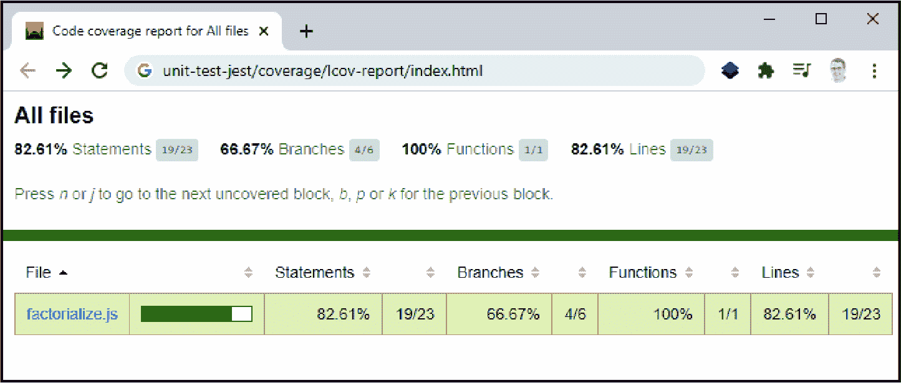
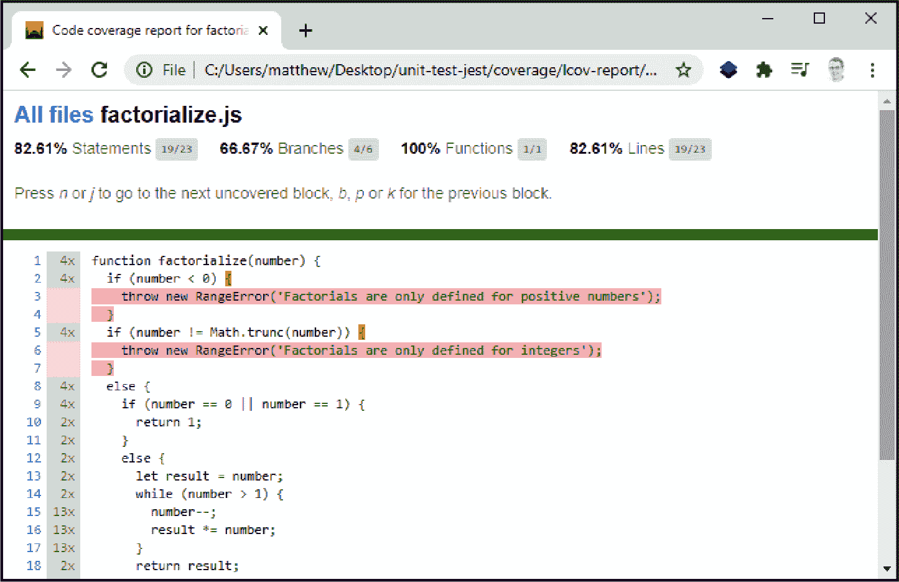

# 第十章：错误和测试

编写代码就是编写错误。经常情况下，可以预见到错误。风险活动包括与外部资源交互的操作（如文件、数据库或 Web 服务器 API）。来自代码外部的信息——无论是从网页表单中读取还是从另一个库接收——可能会出现错误，或者以不同于预期的形式出现。但要修改一个老生常谈，问题不在于错误本身，而在于如何处理它。

那么我们应该如何处理我们的错误？JavaScript 的默认行为是在错误点死机，静默地将堆栈跟踪记录到控制台。然而，还有更好的选择。您可以捕获错误，对其做出反应，修改它，重新抛出它，甚至隐藏它，如果您选择的话。与许多其他语言相比，JavaScript 的错误处理功能相对不太完善。但基本的错误处理仍然同样重要，本章中的许多示例将专注于此任务。

防范错误是必不可少的实践，但同样重要的是*预防*它们。为此，有许多适用于 JavaScript 的测试框架，包括 Jest、Mocha、Jasmine 和 Karma。借助它们，您可以编写确保代码按预期执行的单元测试。本章将简要介绍 Jest。

# 捕获和中和错误

## 问题

您正在执行可能不会成功的任务，并且不希望错误中断您的代码或出现在开发者控制台中。

## 解决方案

将你的代码段放入`try...catch`块中，像这样：

```
try {
  // This is guaranteed to fail with a URIError
  const uri = decodeURI('http%test');

  // We never get here
  console.log('Success!');
}
catch (error) {
  console.log(error);
}
```

当`decodeURI()`函数失败并发生错误时，执行跳转到`catch`块。`catch`块接收一个错误对象（也称为*异常*），该对象提供以下属性：

`name`

通常反映错误子类型的字符串（如“URIError”），但它可能只是“Error”。

`message`

一个提供问题人类语言描述的字符串，如“URI malformed”。

`stack`

一个列出堆栈中当前打开函数的字符串，按照最近调用到更早调用的顺序排列。根据浏览器的不同，`stack` 属性可能包含有关函数位置（如行号和文件名）以及调用这些函数时使用的参数的信息。

###### 警告

要小心。错误对象上还定义了几个其他属性（如`description`和`lineNumber`），但这些属性仅在特定浏览器中有效。在编写错误处理代码时不要依赖这些非标准属性，因为它们在所有浏览器上都不起作用。

如果直接将错误对象传递给`console.log()`方法（如此示例），将从这三个属性中提取信息。具体显示内容将根据浏览器而异：

```
URIError: URI malformed
    at decodeURI (<anonymous>)
    at runTest (<anonymous>):14:15
    at <anonymous>:20:1
```

这里，开发控制台中编写的一段顶层代码（在调用堆栈列表中由底部 `<anonymous>` 表示）调用了一个名为 `runTest()` 的函数，然后使用上述代码调用 `decodeURI()` 处理了一个错误的 URI，触发了随后记录的错误。

## 解决方案

在测试错误处理代码之前，您需要一个能够引发错误的例程。例如，我们不考虑语法错误或在编写代码时应该实际捕获的任何逻辑错误（例如使用 “使用 ESLint 强制代码标准” 中描述的 linter）。相反，我们需要执行一个依赖外部资源并且可能由于您的代码没有错误而失败的操作。

JavaScript 对许多其他编程语言中会被视为错误的用法异常宽容。尝试访问不存在的属性会得到一个无错误的值 `undefined`。如果超出数组边界也是如此。JavaScript 的错误容忍在数学方面特别明显，例如，将数字乘以字符串会返回一个无错误的值 `NaN`（非数），而除以零则返回特殊值 `Infinity`。尝试使用 `decodeURI()` 函数就是一个可能失败的操作示例，在这种情况下会出现 `UriError`。

###### 注意

`decodeURI()` 和 `encodeURI()` 方法旨在使用可接受的转义序列替换 Web URL 中不允许的字符，如果在 *查询字符串*（跟在 `?` 后面的 URL 部分）中存储任意数据，则这是一种重要的技术。如果尝试对未经正确编码的字符串进行反向编码可能会失败，例如，如果它包含应该开始一个转义序列的 `%` 字符。

捕获错误的行为可以防止其成为未处理的错误。这意味着您的代码可以继续执行（在 Node 应用程序的情况下，防止应用程序完全结束）。但是，您应该只捕获您理解并准备处理的错误。永远不要仅仅使用错误处理来抑制和忽略潜在的问题。“检测未处理的错误” 详细介绍了未处理错误的影响。

虽然 `try...catch` 块是错误处理的最常见结构，但您可以选择在末尾添加一个 `finally` 部分。`finally` 块中的代码始终会运行。如果没有错误发生，则在 `try` 块之后运行；如果捕获了错误，则在 `catch` 块之后运行。它通常用作放置无论您的代码成功还是失败都应运行的清理代码的地方。

```
try {
  const uri = decodeURI('http%test');

  // We never get here
  console.log('Success!');
}
catch (error) {
  console.log(error);
}
finally {
  console.log('The operation (and any error handling) is complete');
}
```

## 参见

“捕获不同类型的错误” 显示了如何有选择地捕获不同类型的错误。“捕获异步错误” 显示了如何捕获在异步操作期间发生的错误。

# 捕获不同类型的错误

## 问题

你希望区分不同类型的错误并采取不同的处理方式，或仅处理特定类型的错误。

## 解决方案

不同于许多语言，JavaScript 不允许按类型捕获错误。相反，你必须像往常一样捕获所有错误，然后使用 `instanceof` 运算符调查错误：

```
try {
  // Some code that will raise an error
}
catch (error) {
  if (error instanceof RangeError) {
    // Do something about the value being out of range
  }
  else if (error instanceof TypeError) {
    // Do something about the value being the wrong type
  }
  else {
    // Rethrow the error
    throw error;
  }
}
```

最后，如果错误不是你可以处理的类型，应该重新抛出该错误。

## 讨论

JavaScript 有八种错误类型，由不同的错误对象表示（参见表 10-1）。你可以检查错误的类型以确定发生的问题类型。这可能指示你应该采取哪些措施，或者是否可以执行备用代码、重试操作或恢复。它还可能提供有关出现问题的详细信息。

表 10-1\. 错误对象

| 错误类型 | 描述 |
| --- | --- |
| `RangeError` | 当数值超出其允许范围时发生。 |
| `ReferenceError` | 尝试将不存在的对象赋给变量时发生。 |
| `SyntaxError` | 当代码存在明显的语法错误，如多余的 `(` 或缺少 `}` 时发生。 |
| `TypeError` | 当值不适合特定操作的数据类型时发生。 |
| `URIError` | 在使用 `decodeURI()` 和其他相关函数转义 URL 时发生。 |
| `AggregateError` | 是多个错误的包装器，对于异步发生的错误非常有用。`errors` 属性中提供了错误对象数组。 |
| `EvalError` | 用于表示与内置的 `eval()` 发生的问题，但现在已不再使用。现在，对语法无效的代码使用 `eval()` 将引发 `SyntaxError`。 |
| `InternalError` | 发生于各种非标准情况，具体取决于浏览器。例如，在 Firefox 中，如果超过递归限制（函数反复调用自身），则会发生 `InternalError`，而在 Chrome 中，同样的情况则表示为 `RangeError`。 |

除了这些错误类型外，你还可以抛出和捕获自定义的错误对象，详见“抛出自定义错误”。

JavaScript 仅允许每个 `try` 块有一个 `catch` 块，这会阻止你按类型捕获错误。但是，你可以捕获标准的 `Error` 对象，用 `instanceof` 检查其类型，并编写条件代码进行相应处理。使用这种方法时，一定要小心，不要意外地忽略无法处理的错误。

在当前示例中，代码明确处理 `RangeError` 和 `TypeError` 类型。如果错误是其他类型，则假定我们无法实际解决问题。然后使用 `throw` 语句重新抛出错误。当你使用 `throw` 时，就好像再次发生了同样的错误。如果你的代码在一个函数中，这允许错误继续向上冒泡，直到它到达一些可以适当处理它的错误处理代码。如果没有其他捕获此错误的错误处理，则它变成未处理的错误，就像你一开始没有捕获它一样。 （有关详细信息，请参阅 “检测未处理错误”。）

换句话说，重新抛出未知错误会给你带来仅捕获特定异常类型时的相同行为，这是你在 JavaScript 语言支持时可能采取的方法。

## 参见

“抛出自定义错误” 展示了如何创建自定义错误类来指示自定义错误条件，并传递关于错误的额外信息。

# 捕获异步错误

## 问题

你想要添加错误处理，但是风险操作是在后台线程执行的。

## 解决方案

JavaScript 的 API 有多种异步模型，处理错误的方式取决于你使用的函数。

如果你使用较旧的 API，可能需要提供一个回调函数，在发生错误时调用它，或者附加一个事件处理程序。例如，`XMLHttpRequest` 对象提供了一个 `error` 事件来通知你有关失败请求的信息：

```
const request = new XMLHttpRequest();

request.onerror = function errorHander(error) {
  console.log(error);
}

request.open('GET', 'http://noserver');
request.send();
```

这里对 `send()` 的调用触发了导致错误的异步操作，但实际错误发生在单独的线程上。在此语句周围添加 `try...catch` 块不会捕获问题。你最好能通过 `error` 事件接收到通知。

如果你使用基于 promise 的 API，你可以通过调用 `Promise.catch()` 来附加你的错误处理函数。以下是使用 Fetch API 的示例：

```
fetch('http://noserver')
.then((response) => {
  console.log('We did it, fam.');
})
.catch((error) => {
  console.log(error);
});
```

在此处编写的代码将在未处理的错误或被拒绝的 promise 的事件中触发。如果你没有捕获 promise 中发生的错误，它将冒泡到你的主应用程序线程，并触发 `window.unhandledrejection` 事件，这是基于 promise 的等效于 `window.error` 事件（见 “检测未处理错误”）。

最后，如果你使用带有更高级别的 `async` 和 `await` 模型的 promises，你可以使用传统的错误处理块。`catch` 部分将自动附加到 promise 上，通过 `Promise.catch()`。以下是一个示例：

```
async function doWork() {
  try {
    const response = await fetch('http://noserver');
  }
  catch (error) {
    console.log(error);
  }
}

doWork().then(() => {
  console.log('All done');
});
```

## 讨论

将错误处理代码放在错误的位置是一个常见的错误。不幸的是，您的错误处理代码是否无效或永远不会运行并不总是显而易见，尽管 linting 工具（“使用 eslint 强制代码标准”）可能会提醒您存在问题。最好的解决方案是在应用程序中测试实际的错误条件，并验证您的错误处理代码是否运行并减少了它们的影响。

## 参见

“使用返回 Promise 的函数” 展示了一个完整的示例，其中包含 Fetch API 和基于 Promise 的错误处理。“使用 Await 和 Async 等待 Promise 结束” 展示了一个完整的示例，其中包含 Fetch API 和 `async` 和 `await` 错误处理。

# 检测未处理的错误

## 问题

您希望捕获代码中未处理的错误，可能是为了创建诊断日志。

## 解决方案

处理 `window.error` 事件。您的事件处理函数会接收到五个带有错误信息的参数。除了代表实际错误的错误对象外，还会得到单独的 `message` 参数和位置信息（`source` 表示脚本文件的 URL，`lineno` 表示发生错误的行号，`colno` 表示列号）。

下面是一个测试此事件的示例：

```
// Attach the event handler
window.onerror = (message, url, lineNo, columnNo, error) => {
  console.log(`An unhandled error occurred in ${url}`);
}

// Cause an unhandled error
console.log(null.length);
```

请注意，要测试此示例，您需要使用一个示例测试页面。您不能使用开发者控制台将函数附加到 `window.error` 事件处理程序上。

###### 注意

在某些情况下，浏览器的跨源安全策略会阻止您的 JavaScript 代码访问错误详情。例如，如果您从本地文件系统而不是使用测试服务器运行测试页面，则会出现这种情况，此时 `message` 参数将显示通用文本“Script error”，而 `url`、`lineNo`、`columnNo` 和 `error` 属性将为空白。有关更多信息，请参见[《onerror 注释》](https://oreil.ly/9MbGP)。

## 讨论

在您应用程序的主线程上发生的未处理错误会一直向上传递，直到达到代码的顶层，如果在那里未处理，则会触发浏览器中的 `window.error` 事件。

`window.error` 事件不同寻常之处在于它允许您*取消*错误，有效地将其抑制。要做到这一点，您需要在事件处理函数中返回 `true`。如果不抑制错误，浏览器的默认错误处理程序会立即起作用。它将以鲜红色字体在开发者控制台中显示错误信息，就像使用 `console.error()` 方法记录一样。但是，如果从 `window.error` 返回 `true`，错误将消失，开发者控制台中也不会留下任何痕迹。

除此之外，在您的 `window.error` 事件处理程序中抑制或允许错误没有实际区别。当错误触发 `window.error` 事件时，您的代码已经停止执行，并且调用栈已经展开。然而，这并不会阻止您的网页工作。一旦发生另一个事件（例如，单击按钮），JavaScript 就会再次执行您的代码。

###### 注意

现代实践不鼓励我们隐藏错误，即使是从开发者控制台。除非有非常好的理由。一种可能性是您正在用某种调整后的错误显示替换默认错误显示，这种替换适应您的应用程序，并提供更有用的信息或者移除您不想向用户显示的信息。

您可以使用您的 `window.error` 事件处理程序执行任何类型的 JavaScript 代码。例如，您可以将错误记录到本地数据存储，甚至使用 Fetch API 将其发送到 Web 服务器。如果在 `window.error` 事件处理程序期间发生错误，则不会再次触发事件处理程序。它将直接传递给浏览器的默认错误处理程序，并显示在开发者控制台中。

对于异步代码，错误处理方式有所不同。对于较旧的基于回调的 API，通常不会出现错误。相反，这些 API 使用回调通知您的代码有关错误条件（参见 “捕获异步错误”）。但对于基于 promise 的 API，未处理的错误会冒泡并触发 `window.unhandledrejection` 事件：

```
// Attach the event handler
window.onunhandledrejection = (e) => {
  console.log(e.reason);
}

// Create a promise that will cause an unhandled asynchronous error
const faultyPromise = new Promise(() => {
  throw new Error('Disaster strikes!');
});

// Create a promise that rejects (also triggers window.onunhandledrejection)
const rejectedPromise = new Promise((resolve, reject) => {
  reject(new Error('Another disaster strikes!'));
});
```

`unhandledrejection` 事件会将一个带有事件属性的对象传递给您的事件处理程序。上面的示例中使用的 `reason` 属性包含未处理的错误对象，或者如果手动拒绝了 promise，则包含传递给 `Promise.reject()` 的对象。您还可以从 `promise` 属性获取底层的 `Promise` 对象。

与 `window.error` 类似，`window.unhandledrejection` 是一个可取消的事件。然而，它使用了一种不同的、更现代的取消约定。您可以使用带有事件参数的对象的 `preventDefault()` 方法，而不是返回 `true`。以下是一个示例，显示当发生未处理的 promise 错误时显示消息，但隐藏自动错误日志记录：

```
window.onunhandledrejection = (e) => {
  console.log('An error occurred, but we won\'t tell you what it was');

  // Cancel the default error handling
  e.preventDefault();
}
```

###### 提示

您可能认为未处理的异常事件是放置日志记录代码的好地方。有时确实如此。但通常情况下，您会希望在错误发生的地方更接近地捕获它们，并在那里记录它们，必要时重新抛出它们。然而，未处理的异常事件始终是查找需要异常处理逻辑但却没有的风险代码块的好方法。

## 额外信息：日志工具

广义上讲，有两种情况下你会捕获错误：在测试代码并且可以修复它们的时候，以及在生产环境中你想知道出了什么问题的时候。在第一种情况下，日志记录很简单 —— 你的目标是检测问题并修复它。通常你的日志记录只涉及调用 `console.log()`。在后一种情况下，你需要调查可能在特定环境和最终用户面前偶发发生的问题。现在你需要一种方法来检测问题并将详细信息报告给你。

你可以处理 `window.error` 和 `window.unhandledrejection` 事件，然后将详细信息写入某种存储介质。例如，你可以将错误信息保存在 `localStorage` 对象中，以便它在当前浏览器会话之外持久存在。你可以使用 `fetch()` 将详细信息发送到服务器上的 Web API。如果你正在构建一个 Node 应用程序，你可以将详细信息写入服务器上的文件或数据库。你可以添加额外的上下文信息，比如系统详情、优先级和时间戳。但随着日志记录需求的增长，你可能想考虑使用开源日志记录工具，而不是自己开发解决方案。

一个好的日志工具为你的日志提供了一个 *抽象层*。这意味着你可以记录消息（就像调用通常的 `console.log()` 方法一样），而不用考虑日志存储在哪里或者它是如何实现的。在测试期间，日志层可能只是将你的消息输出到控制台。但当你的应用部署时，日志层可能会忽略低级消息，将重要的消息发送到其他地方，比如远程 Web 服务器。日志工具还可以实现高级功能，如批处理，在快速连续记录多条消息到远程站点时提高性能。

JavaScript 应用程序中有多种日志记录库，包括 Winston、Bunyan、Log4js、Loglevel、Debug、Pino 等等。有些专门设计用于 Node 应用程序，但也有许多可以在浏览器中的网页代码中使用。

# 抛出标准错误

## 问题

通过抛出错误对象来指示错误条件。

## 解决方案

创建一个 `Error` 对象的实例，将问题的简短描述传递给构造函数，用于 `message` 属性。使用 `throw` 语句抛出 `Error` 对象。然后你的代码可以像捕获其他类型的 JavaScript 错误一样捕获这个 `Error` 对象：

```
function strictDivision(number, divisor) {
  if (divisor == 0) {
    throw new Error('Dividing by zero is not allowed');
  }
  else {
    return number/divisor;
  }
}

// Catch the error
try {
  const result = strictDivision(42, 0);
}
catch (error) {
  // Shows the custom error message
  console.log(`Error: ${error.message}`);
}
```

## 讨论

创建 `Error` 对象有两种方式。你可以使用 `new` 关键字创建它，就像解决方案中一样。或者（不常见），你可以像调用函数一样调用 `Error()`，它的结果相同：

```
// Standard error-throwing
throw new Error(`Dividing by zero is not allowed`);

// An equivalent approach
throw Error(`Dividing by zero is not allowed`);
```

`Error` 对象具有标准的错误属性，包括你设置的 `message`，一个 `name`（默认为`Error`），和一个 `stack`（指出错误发生位置的堆栈跟踪）。

###### 警告

JavaScript 还允许代码使用`throw`与非错误对象（如字符串）。这种用法非标准，可能会导致期望具有`name`和`message`等属性的异常处理代码出现问题。作为经验法则，请不要抛出非异常对象。

有时，您可以重新利用更具体的错误子类型。大多数 JavaScript 内置的错误类型（列在表 10-1 中）是为特殊情况设计的，并不适合自定义代码。但有几种可能会有用。例如，如果函数接收到超出可接受数值范围的值，可以使用`RangeError`。请确保包含一个包含给定值和预期范围的信息丰富的错误消息：

```
function setAge(age) {
  const upper = 125;
  const lower = 18;
  if (age > 125 || age < 18) {
    throw new RangeError(
     `Age [${age}] is out of the acceptable range of ${lower} to ${upper}.`);
  }
}
```

`RangeError` 特别用于数值。但是，您可以使用`TypeError`来指示提供的值类型错误的情况。您可以自行决定何为“错误”类型；例如，当您期望一个数字而得到一个字符串时（可以用`typeof`进行测试），或者当您得到错误类型的对象时（可以用`instanceof`进行测试）。

```
function calculateValue(num) {
  if (typeof num !== 'number') {
    throw new TypeError(`Value [${num}] is not a number.`);
  }
}
```

您可能会考虑一些较少使用的错误子类型，如`ReferenceError`（当您期望对象而收到`null`引用或`undefined`值时）或`SyntaxError`（例如，如果您解析某种类型的字符串内容，而该内容不符合您设定的规则）。要更具体地处理其他错误条件，请考虑创建您自己的错误类（参见“抛出自定义错误”）。

与许多更严格的语言相比，JavaScript 较少使用错误。在设计自己的库时，通常最好遵循这一惯例。不要为 JavaScript 通常会容忍的情况（如隐式类型转换）使用异常。不要使用错误来通知调用代码有关非异常情况的信息，换句话说，像无效用户输入这样在正常操作期间可能发生的事情。*要*使用异常来防止代码由于未正确初始化某些内容而继续执行操作失败。

## 参见

“抛出自定义错误”解释了如何创建自己的错误对象。

# 抛出自定义错误

## 问题

当您希望通过抛出自定义错误对象来指示特定的错误条件时。

## 解决方案

创建一个从标准`Error`类继承的类。构造函数应接受`message`属性的描述文本，并使用`super()`调用基础`Error`类构造函数以传递消息。以下是一个最简自定义错误的示例，包含抛出它的代码：

```
class CustomError extends Error {
  constructor(message) {
    super(message);
    this.name = 'CustomError';

    // Optional improvement: clean up the stack trace, if supported
    if (Error.captureStackTrace) {
      Error.captureStackTrace(this, CustomError);
    }
  }
}

// Try raising this error
throw new CustomError('An application-specific problem occurred');
```

还有一个推荐但可选的改进。您可以使用静态方法`Error.captureStackTrace()`来稍微清理堆栈跟踪。（技术上，`captureStackTrace()`确保错误构造函数的调用不会出现在存储在`Error.stack`属性中的堆栈跟踪中。）

你也可以添加自定义属性来传递有关错误条件的额外信息。这里有一个示例，在查找失败后存储一个`productID`：

```
class ProductNotFound extends Error {
  constructor(missingProductID) {
    super(`Product ${missingProductID} does not exist in the catalog`);

    this.name = 'ProductNotFound';
    this.productID = missingProductID;

    if (Error.captureStackTrace) {
      Error.captureStackTrace(this, ProductNotFound);
    }
  }
}

try {
  throw new ProductNotFound(420);
}
catch (error) {
  console.log(`An error occured with the message: ${error.message}`);

  if (error instanceof ProductNotFound) {
    console.log(`Missing: ${error.productID}`);
  }
}
```

## 讨论

在创建自定义`Error`类时，我们应该牢记两个可能相互竞争的考虑因素：保持在典型 JavaScript 错误范围内，并表达足够的信息以满足我们定制的错误条件。在前一种情况下，不要试图重新创建你第二喜欢的语言的错误或异常。不要通过不必要的方法和额外功能过度扩展 JavaScript 的`Error`类型。

当你创建自定义错误时，有一些惯例需要牢记：

+   使用类名来指示错误类型，并设置`name`属性以匹配。如果任何代码检查`name`来确定错误类型（而不是使用`instanceof`），这一点很重要。即使错误对象被序列化为 JSON，它也会持久存在，并出现在错误的默认字符串表示和开发者控制台中。

+   在构造函数中，将你的自定义属性放在参数列表的最前面。如果包括一个`message`参数，它应该是最后一个参数。

+   在构造函数中，调用`super()`并将`message`传递给基类构造函数。

+   作为一种礼貌，正确设置堆栈跟踪。检查`captureStackTrace()`方法，如果存在，调用它，传递对当前实例（作为`this`）和你的自定义错误类的引用。

## 参见

要了解更多关于继承和`extends`关键字的知识，请参见“从另一个类继承功能”。

# 为你的代码编写单元测试

## 问题

你想要使用自动化测试来确保你的代码现在和将来符合设计标准。

## 解决方案

使用类似 Jest 的工具尽早为你的代码编写单元测试。

安装 Jest 最简单的方法是使用 npm（“使用 npm 下载包”）。在你的项目文件夹中打开一个终端窗口，并使用`npm init`创建*package.json*配置文件（如果你还没有）：

```
$ npm init -y
```

接下来，使用`--save-dev`参数安装 Jest，这样它只会包含在开发构建中：

```
$ npm install --save-dev jest
```

现在你需要找一些代码来测试。假设你有一个名为*factorialize.js*的文件，其中包含如下所示的`factorialize()`函数：

```
function factorialize(number) {
  if (number < 0) {
    throw new RangeError('Factorials are only defined for positive numbers');
  }
  else if (number != Math.trunc(number)) {
    throw new RangeError('Factorials are only defined for integers');
  }
  else {
    if (number == 0 || number == 1) {
      return 1;
    }
    else {
      let result = number;
      while (number > 1) {
        number--;
        result *= number;
      }
      return result;
    }
  }
}
```

为了使这个函数对 Jest 可访问，你需要通过在文件末尾添加这行来导出`factorialze()`函数：

```
export {factorialize}
```

###### 注意

Jest 假设你正在使用 Node 模块标准（CommonJS）。如果你已经在使用更新的 ES6 模块标准，你需要使用 Babel，一个 JavaScript 转译工具，将你的模块引用转换为 Jest 处理你的代码之前。这听起来很复杂，但 `plugin-transform-modules-commonjs` 模块会处理大部分工作。要查看完全配置的解决方案（使用 CommonJS 模块或 ES6 模块），请参考示例代码。关于 CommonJS 模块的更多信息，请参阅 “将你的库转换为 Node 模块”。关于 ES6 模块的更多信息，请参阅 “使用模块组织你的 JavaScript 类”。

现在你需要创建你的测试文件。在 Jest 中，测试文件的扩展名为 *.test.js*。在这种情况下，这意味着你需要创建一个名为 *factorialize.test.js* 的新文件。然后这个文件导入你想要测试的函数：

```
import {factorialize} from './factorialize.js';
```

你的测试文件的其余部分定义了你想要运行的测试。测试的最简单方法是首先验证你的函数是否按照你的预期工作。例如，你可以编写一个 Jest 测试，验证 `factorialize()` 对几个代表性案例返回正确的信息。这里有一个检查 10! 是否为 3,628,800 的示例：

```
test('10! is 3628800', () => {
  expect(factorialize(10)).toBe(3628800);
});
```

Jest 的 `test()` 函数创建了一个命名测试。这个名称允许你在测试报告中识别测试，这样你就可以准确知道哪些测试成功了，哪些失败了。这个示例中的测试使用了 Jest 的 `expect()` 函数，它调用你的代码（在这种情况下是 `factorialize()` 函数），然后用 `toBe()` 评估结果。技术上，`toBe()` 是 Jest 的几个 *匹配器函数* 之一。它确定代码是否通过了测试。

要运行这个测试，你需要使用 Jest。你可以从命令行运行它，使用你的测试文件和 npm 的包运行器 npx 的帮助。在这个例子中，你会在终端中使用这个命令：

```
$ npx jest factorialize.test.js
```

运行你编写的单个测试，并生成如下报告：

```
PASS  ./factorialize.test.js
 √ 10! is 3628800 (4 ms)

Test Suites: 1 passed, 1 total
Tests:       1 passed, 1 total
Snapshots:   0 total
Time:        2.725 s, estimated 3 s

Ran all test suites matching /factorialize.test.js
```

更常见的是，你会将 Jest 添加到你的 *package.json* 文件的 `scripts` 部分，这样它可以自动运行所有你的测试：

```
{
  "scripts": {
    "test": "jest"
  }
}
```

现在你可以要求 Jest 运行项目文件夹中的所有测试（*.test.js* 文件）。

## 讨论

有多种类型的测试，比如安全性、可用性和性能测试，但最基本的测试形式是 *单元测试*。单元测试包括对离散源代码单元进行测试，并验证这些单元的行为是否符合预期。在 JavaScript 中，最常见的单元测试单元是函数。

尽管有许多可能的测试框架（如 Jest、Mocha、Jasmine、Karma 等），它们大多数使用相似的语法。在 Jest 中，一切都围绕着一个`test()`函数展开，它接受两个参数。第一个参数是测试的标签，在测试报告中显示。第二个参数是一个包含一个或多个测试断言的函数，这些断言要么成功证明为真（通过），要么为假（失败）：

```
test('Some test name', () => {
  // Test assertions go here
});
```

要创建测试断言，你使用`expect()`函数，它是 Jest 的关键。它与像`toBe()`这样的匹配函数配合使用，用于评估测试调用的结果：

```
test('10! is 3628800', () => {
  `expect`(factorialize(10)).`toBe`(3628800);
});

```

此示例演示了`factorialize()`函数的单个测试。但测试编写者的目标更广泛。你需要选择一组代表性的测试，这些测试检查多个值，并捕捉可能的边界条件。例如，对于`factorialize()`函数的测试，测试如何处理非数值输入、负值、0、非常大的值等是有意义的。

以下代码展示了一个更完整的测试套件。它检查了对`factorialize()`的五个不同调用的结果。这些调用都使用`describe()`进行了分组，`describe()`函数简单地让你标记一组相关的测试调用。在这个例子中，`describe()`将调用同一函数分组，但你也可以用它来分组使用相同样本数据的调用：

```
describe('factorialize() function tests', () => {
  test('0! is 1', () => {
    expect(factorialize(0)).toBe(1);
  });
  test('1! is 1', () => {
    expect(factorialize(1)).toBe(1);
  });
  test('10! is 3628800', () => {
    expect(factorialize(10)).toBe(3628800);
  });
  test('"5"! is 120', () => {
    expect(factorialize('5')).toBe(120);
  });
  test('NaN is 0', () => {
    expect(factorialize(NaN)).toBe(0);
  });
});
```

当你运行这个测试时，你会发现最终的测试失败了。它期望调用`factorialize(NaN)`返回`0`，但实际上抛出了一个错误，测试日志清楚地表明：

```
 FAIL  ./factorialize.test.js
  factorialize() function tests
    √ 0! is 1 (3 ms)
    √ 1! is 1
    √ 10! is 3628800
    √ "5"! is 120
    × NaN is 0 (3 ms)

  ● factorialize() function tests › NaN is 0

    RangeError: Factorials are only defined for integers

      4 |   }
      5 |   if (number != Math.trunc(number)) {
    > 6 |     throw new RangeError('Factorials are only defined for integers');
        |           ^
      7 |   }
      8 |   else {
      9 |     if (number == 0 || number == 1) {

      at factorialize (factorialize.js:6:11)
      at Object.<anonymous> (factorialize.test.js:17:12)

Test Suites: 1 failed, 1 total
Tests:       1 failed, 4 passed, 5 total
Snapshots:   0 total
Time:        2.833 s
Ran all test suites.
```

目前，你看到的每个测试都使用`toBe()`匹配函数来检查精确值。但是，像所有测试框架一样，Jest 允许你使用不同类型的规则。例如，你可以检查一个数字是否落在特定范围内，文本是否匹配某种模式，或者值是否不为空。表 10-2 概述了一些可用于`expect()`的最有用的匹配函数。要查看全面的列表，请参阅 Jest 文档中的[`expect()`方法](https://oreil.ly/hnbiy)。

表 10-2\. Jest 匹配器

| 函数 | 描述 |
| --- | --- |
| `arrayContaining()` | 在数组中搜索给定值。 |
| `not()` | 允许你反转任何条件。例如，使用`` expect(...).not.toBe(5) ``，如果值*不是*5，则测试通过。 |
| `stringContaining()` | 在字符串中搜索子字符串。 |
| `stringMatching()` | 尝试将字符串与正则表达式匹配。 |
| `toBe()` | 测试标准的 JavaScript 相等性，就像使用`==`运算符一样。 |
| `toBeCloseTo()` | 测试两个数字是否相等或*非常*接近。旨在避免浮点数的微小舍入误差（详见“保留十进制数值精度”）。 |
| `toBeGreaterThan()` | 检查数值是否大于指定的值。还有一小组类似的比较器，包括`toBeGreaterThanOrEqual()`、`toBeLessThan()`和`toBeLessThanOrEqual()`。 |
| `toBeInstanceOf()` | 检查返回的对象是否是指定类的实例，就像使用`instanceof`操作符一样。 |
| `toBeNull()` | 检查值是否为`null`。您还可以使用`toBeNaN()`测试`NaN`值，并使用`toBeUndefined()`测试未定义的值。 |
| `toBeTruthy()` | 检查一个数字是否*真值*，这意味着它在`if`语句中将被强制转换为`true`。在 JavaScript 中，除了`null`、`undefined`、空字符串、`NaN`、`0`和`false`之外的所有内容都是真值。 |
| `toEqual()` | 执行*深度比较*，检查一个对象是否与另一个对象具有相同的内容。这与`toBe()`形成对比，后者用于测试对象的引用相等性。作为一个基本的规则，对于原始类型，`toBe()`有效，但是对于比较对象实例，您需要使用`toEqual()`。(“Making a Deep Copy of an Object”更详细地解释了 JavaScript 中对象相等性的问题。) |
| `toHaveProperty()` | 检查返回的对象是否具有特定属性，并（可选）检查该属性是否匹配特定值。 |
| `toStrictEqual()` | 类似于`toEqual()`，但要求对象完全匹配。例如，具有相同属性和属性值的对象，如果它们是不同类的实例，或者其中一个是类实例，另一个是对象字面量，则不匹配。 |
| `toThrow` | 测试函数是否抛出异常。您可以选择要求异常是特定的错误对象。 |

要修复当前示例，您可以指示您期望值为`NaN`时抛出异常，并使用`toThrow()`匹配器。但是，`toThrow()`需要额外的步骤。您需要将`expect()`内部的代码包装在*另一个*匿名函数中。否则，异常不会被捕获，测试仍将失败。以下是正确的代码：

```
test('NaN causes error', () => {
  expect(() => {
    factorialize(NaN);
  }).toThrow();
});
```

## 另请参阅

此示例很好地概述了 Jest 的核心功能，但还有许多其他功能可能会被考虑。例如，Jest 还支持使用模拟数据、处理来自 Promise 的异步结果、模拟计时器以及快照测试（用于验证页面 UI 未更改）。有关所有这些功能的更多信息，请参阅[Jest 文档](https://oreil.ly/aeu1l)。

## Extra: 首先编写测试

现代开发实践已经接受了在应用程序（和库）的大部分功能写入之前编写测试的想法。这种测试驱动的开发（TDD）是敏捷开发范 paradigm 的一部分。

TDD 需要一些适应。与更加正式的*结构化编程*或*瀑布式*项目设计不同，后者推迟测试直到您拥有相当完整的代码，TDD 要求您在编写任何其他内容之前编写测试。以下是其步骤：

1.  *定义测试。* 例如，如果您计划编写上一个示例中显示的`factorialize()`函数，则首先需要定义一组能够捕捉其预期输入的代表性测试，例如，它可以计算的最大数值、边界值如 0，以及可能的边缘情况（如隐式强制转换的字符串或`BigInt`值）。您还需要编写测试来验证失败情况是否得到适当处理——在这种情况下，即抛出预期的错误。

1.  *使其失败。* 完成测试编写后，接下来编写代码。一些 TDD 实践者建议，第一步是使您的代码编译失败，测试失败。通过完成此步骤，您确保测试正在运行，测试需求是有意义的，并且在代码完全编写之前不会意外通过代码。

1.  *使其通过。* 下一步有时被描述为“以任何可能的方式使测试通过”。换句话说，您不必担心创建最佳解决方案，而只需使所有测试通过。不要编写超出测试需求的代码。

1.  *重构。* 成功通过测试后，您开始改进代码。这是重构的时机，删除重复代码并引入改进，同时反复运行测试以确保它们继续通过。您可能还会发现一些未覆盖的情况，并需要编写更多的测试。

TDD 的一个明显优势是它让您专注于手头的问题。您不需要解释设计要求来决定如何编写解决方案。相反，您根据测试中明确的规格编写代码。但 TDD 开发也有助于应用程序的演变，因为它减少了对变更的恐惧。只要您的代码继续通过您设定的测试，并且您的测试是真正代表性的（一个更大的“如果”），提交新的代码修订是安全的。

为此保护付出的代价是，编写适当的测试需要更多的时间和显著的经验才能完成。一个可以帮助您评估测试方案的度量标准是*测试代码覆盖率*（“追踪测试代码覆盖率”）。

# 追踪测试代码覆盖率

## 问题

您希望评估您的测试案例在代码中涵盖所有可能性的程度。

## 解决方案

从您的测试工具获取代码覆盖率报告。在 Jest 中，您可以使用`--collect-coverage`选项：

```
$ npx jest --collect-coverage
```

现在 Jest 将运行所有*test.js*文件中的所有测试（像往常一样），然后生成一个更详细的报告，分析您测试的代码覆盖率。以下是测试`factorialize()`函数的报告，来自“为您的代码编写单元测试”：

```
-----------------|---------|----------|---------|---------|-------------------
File             | % Stmts | % Branch | % Funcs | % Lines | Uncovered Line #s
-----------------|---------|----------|---------|---------|-------------------
All files        |   82.61 |    66.67 |     100 |   82.61 |
 factorialize.js |   82.61 |    66.67 |     100 |   82.61 | 3-4,6-7
-----------------|---------|----------|---------|---------|-------------------
Test Suites: 1 passed, 1 total
Tests:       4 passed, 4 total
Snapshots:   0 total
Time:        2.741 s
```

## 讨论

确定测试代码覆盖率需要一个多方面的方法。要成功，它应包括诸如与同行进行代码审查和演练之类的技术。然而，所有测试工具也包括可以帮助您评估测试在评估代码时的成功程度的自动化代码分析功能。

在 Jest 中，`--collect-coverage`参数触发此分析。您可以在命令行中使用此参数，或将其添加到应用程序的*package.json*配置文件中的`jest`命令中。

代码覆盖率报告通过几个百分比评估您的代码测试覆盖多少，这些百分比显示在单独的列中：

函数

显示已测试的函数数量。这是评估测试覆盖率的良好起点，但也是最粗粒度的统计数据。在`factorialize()`测试中，所有函数都已测试。但这并不意味着这些函数中的所有代码都被执行！

语句

显示在您的测试中执行的代码语句的百分比。在`factorialize()`测试中，大约 83%的代码都至少被一个测试覆盖。

分支

显示已达到多少不同分支（通过条件逻辑，如`if`语句）。在`factorialize()`测试中，测试涉及到 67%的独立条件分支。

此外，代码报告还可以指出没有代码覆盖的行。例如，`factorialize()`示例突出显示了源代码文件中的第 3 至 4 行，用于拒绝负数，以及第 6 至 7 行，用于拒绝非整数数字。要提高测试代码的覆盖率，您可以编写一个使用`toThrow()`的测试断言，以确保这两种情况都被正确拒绝。

命令行报告让您快速查看覆盖率，但 Jest 还会生成一个更全面的 HTML 格式报告，并将其存储在*coverage*文件夹中。打开*index.html*，您可以看到所有测试文件的列表，并稍微详细说明了顶级统计数据（参见图 10-1）。例如，报告不仅仅提供百分比，还告诉您确切的语句数、分支数和函数数。点击列表中的任何文件，将跳转到另一页显示代码，未覆盖的语句会被高亮显示，以便快速参考（参见图 10-2）。



###### 图 10-1\. 代码覆盖率报告



###### 图 10-2\. 未测试覆盖的代码高亮显示

###### 注意

适当的测试覆盖率目标备受争议。一些开发者主张尽可能接近 100%，而另一些则认为 70%至 80%更为实际，并且能够在你的测试编写投资中获得最佳回报。然而，诚实的答案是测试覆盖率并非一个确定的指标。不仅百分比因测量方式不同而异（函数、语句或分支），而且测试工具无法识别代码库中最危险或最脆弱的路径。
