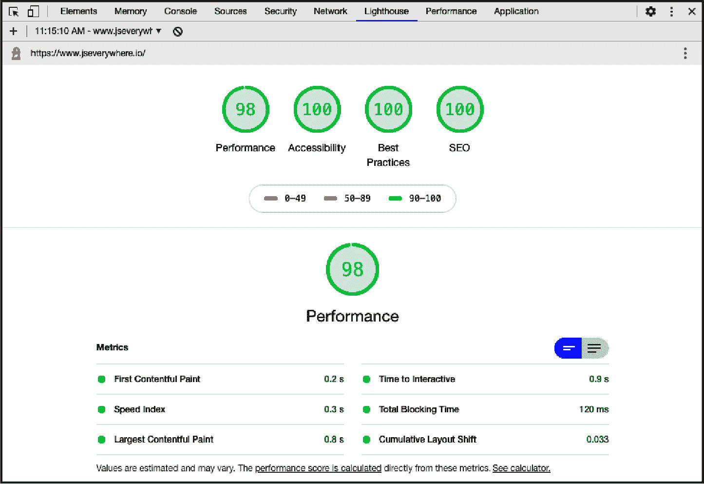

# 第十一章：浏览器工具

作为 Web 开发者，浏览器是世界访问您创作的窗口。 它还提供了有用的工具，用于开发和测试您的站点。 学习如何使用浏览器的开发工具是值得的投资，这样您可以更轻松地调试代码。 在本章中，我们将介绍几个用于调试、性能分析和分析 JavaScript 的有用功能。

出于简化，本书中的所有示例都将使用 Google Chrome 的开发者工具（DevTools）。 在撰写本文时，[Chrome 的使用率超过了全球浏览器市场的 65%](https://oreil.ly/QFZD9)。 大多数其他浏览器提供类似的功能。 Mozilla 的 [Firefox 开发者版](https://oreil.ly/lJSel) 是一个具有有用开发者功能的优秀替代品。

# 调试 JavaScript

## 问题

您需要知道 JavaScript 代码执行的特定点上变量的值。

## 解决方案

使用断点检查代码的值和类型。 设置断点时，浏览器的调试器将在断点代码执行点停止，并显示每个当前范围内的值。 然后可以逐步执行代码或允许 JavaScript 完成执行。 图 11-1 显示了在断点上暂停的代码屏幕截图。


###### 图 11-1. 使用 Chrome 调试器设置断点的屏幕截图

要在 Chrome 的开发者工具中的特定 JavaScript 代码行上设置断点：

1.  使用 Command-Option-C（Macintosh）或 Control+Shift+C（Windows 或 Linux） 打开 Chrome 的开发者工具。

1.  单击 DevTools **Sources** 选项卡。

1.  从文件列表中选择 JavaScript 文件。

1.  单击要设置断点的行号。

1.  通过与页面交互或刷新浏览器窗口来执行代码。

## 讨论

使用 `console.log` 语句在代码中特定点标识值是一种常见做法，但断点提供更多信息和更大的灵活性。 当您熟悉以这种方式调试时，您将能够更轻松地排除基于浏览器的 JavaScript 代码中的问题。

除了在浏览器用户界面中设置断点之外，还可以通过添加 `debugger` 语句来使用代码设置断点。 这样做将在 `debugger` 语句的执行点暂停代码执行。

```
function normalize(string) {
  const normalized = string.replace(/[^\w]/g, "").toLowerCase();
  debugger;
  return normalized;
}
```

一旦到达断点，您将有几个选项可以执行 JavaScript 代码：

恢复脚本执行

继续完整地执行代码。

跨过

在不“步入”调试的情况下执行函数。

进入

进入函数以进一步调试。

退出

执行当前函数代码的其余部分。

步骤

跳到下一行代码。

这些基于行的断点只是可以设置的一种断点类型。此外，还可以基于 DOM 更改、条件值、事件监听器、异常和 fetch/XHR 请求设置断点。使用断点可以更好地控制 JavaScript 调试体验。

# 分析运行时性能

## 问题

您的 JavaScript 代码执行速度似乎较慢或存在错误，但您不确定问题的根源。

## 解决方案

使用浏览器开发者工具的性能分析来查找代码中的瓶颈和 CPU 密集型任务（见图 11-2）。

要分析 Chrome 开发者工具中的 JavaScript 代码性能：

1.  打开 Chrome 的开发者工具，使用 Command-Option-C（Macintosh）或 Control+Shift+C（Windows 或 Linux）。

1.  单击 DevTools 的**性能**选项卡。

1.  要么单击**记录**按钮与页面交互，或单击**重新加载**按钮查看与新页面加载相关的性能指标。

一旦 Chrome 完成页面的分析，您将获得允许查看潜在性能瓶颈的信息。


###### 图 11-2\. Chrome 的性能选项卡

## 讨论

Chrome 性能工具将分解页面的浏览器渲染过程，并使用视觉时间轴、截图和摘要图表进行展示（见图 11-3）。使用这些信息可以查找性能受到负面影响的地方。

作为开发者，您可能拥有高端设备和快速互联网连接。浏览器性能工具最有用的功能之一是能够模拟受限的 CPU 或互联网连接。这样做可以帮助您发现用户可能遇到的性能问题，但这些问题可能对您不明显。


###### 图 11-3\. Chrome 开发者工具性能工具允许您限制 CPU 和网络连接

查看性能数据是确保用户体验良好的重要步骤。良好的网站性能已被证明可以提高用户保留率和销售转化率。在“使用 Lighthouse 测量最佳实践”中，我们将介绍如何进一步审查潜在的性能问题。

# 识别未使用的 JavaScript

## 问题

您的应用性能受到大型 JavaScript 文件的影响。

## 解决方案

使用 Chrome 开发者工具的 Coverage 功能来识别未使用的 JavaScript（见图 11-4）。


###### 图 11-4\. Chrome 的 Coverage 工具

要查看未使用的 JavaScript，请访问 Coverage 标签页：

1.  打开 Chrome 的开发者工具，使用 Command-Option-C（Macintosh）或 Control+Shift+C（Windows 或 Linux）。

1.  打开命令菜单，使用 Command-Shift-P（Macintosh）或 Control+Shift+P（Windows 或 Linux），然后输入**`coverage`**。

1.  选择**显示覆盖率**并按 Enter。

1.  要么点击**记录**按钮与页面进行交互，或者点击**重新加载**按钮记录与新页面加载相关的覆盖率结果。

1.  当您想停止记录结果时，请点击**停止仪表覆盖并显示结果**。

结果将显示包含以下信息的报告：

+   文件 URL

+   文件类型

+   总字节数

+   未使用的字节数

+   使用可视化

您随后可以使用此信息来辅助重构代码，以减少页面上未使用的字节总量。

## 讨论

查看代码使用情况有助于了解您提供给用户的未使用 JavaScript 的百分比。然后，减少此未使用代码的任务通常留给手动重构。但是，JavaScript 打包工具，如 Webpack，也可以用于将代码拆分成多个包并执行“摇树”操作，自动消除死代码。这些方法在“JavaScript 与移动 Web”中有详细介绍。

# 使用 Lighthouse 衡量最佳实践

## 问题

您希望衡量您的 Web 应用程序遵循的最佳实践。

## 解决方案

使用内置于 Chrome 开发者工具中的 Google Lighthouse 工具（参见图 11-5）。

1.  使用 Command-Option-C（Macintosh）或 Control+Shift+C（Windows 或 Linux）打开 Chrome 的开发者工具。

1.  点击 DevTools **Lighthouse**选项卡。

1.  选择要分析的类别和设备类型（移动或桌面）。

1.  点击**生成报告**。

Lighthouse 随后将生成一份报告，每个类别都有得分，并针对改进提出具体建议。



###### 图 11-5\. 在 Chrome 的开发者工具中查看 Google Lighthouse 报告的结果

## 讨论

Lighthouse 是由 Google 创建的开源工具，用于衡量网站的性能和最佳实践。该工具内置于 Chrome 的开发者工具中，但也可以作为独立的浏览器扩展、Node 模块或从命令行运行。Lighthouse 报告可在桌面或移动视图中生成，帮助您快速了解移动性能。Lighthouse 生成以下各个领域的报告和建议：

+   性能

+   渐进式 Web 应用程序

+   最佳实践

+   可访问性

+   SEO

报告输出提供具体问题的可操作反馈，并提供链接到文档和推荐的改进措施。在图 11-6 中，您可以看到对一个分析网站的性能建议，包括删除未使用的 JavaScript 和减少第三方代码的影响。展开每个诊断将提供额外的细节和文件具体信息。


###### 图 11-6\. Lighthouse 性能建议

Google 的 Lighthouse 是一个有用的工具，用于评估您开发的网站和应用的整体健康和性能。通过浏览器开发者工具访问 Lighthouse 提供了一种快速高效的方式，在开发过程中对站点进行分析。除了开发者工具的用户界面外，[开源](https://github.com/GoogleChrome/lighthouse) 的命令行工具和 Node 模块使得可以将 Lighthouse 报告集成到持续集成和交付流水线中。
