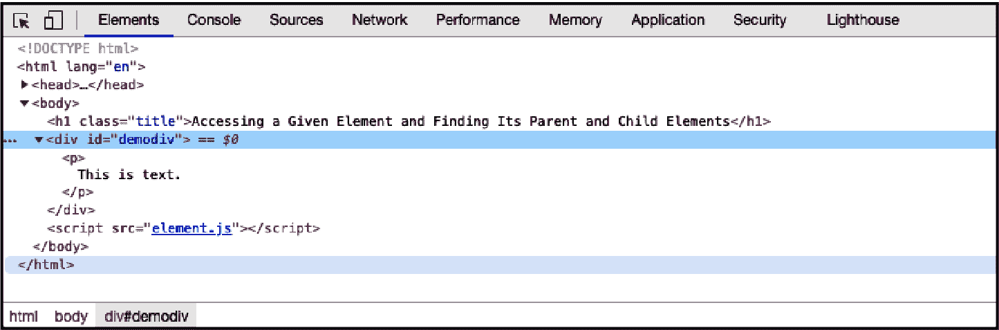
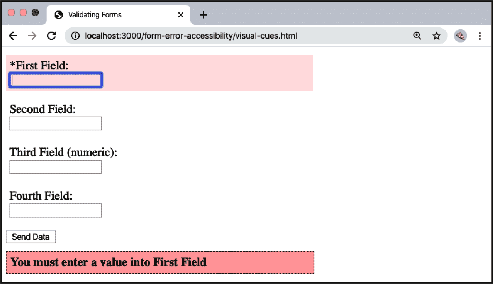

# 第十二章：与 HTML 一起工作

1995 年，网景公司委托软件开发者布兰登·艾奇创建一种旨在为网景导航器浏览器页面添加交互性的编程语言。作为回应，艾奇在 10 天内臭名昭著地开发了 JavaScript 的第一个版本。几年后，通过 ECMAScript 标准化的采纳，JavaScript 成为了跨浏览器的标准。

尽管早期尝试进行了标准化，但多年来，Web 开发人员与具有不同 JavaScript 引擎解释或功能的浏览器作斗争。流行的库，如 jQuery，有效地允许我们编写简单的跨浏览器 JavaScript。值得庆幸的是，今天的浏览器几乎共享了对该语言的统一实现，使 Web 开发人员能够编写与 HTML 页面交互的“纯净”（无库）JavaScript。

在处理 HTML 时，我们正在处理文档对象模型（DOM），这是 HTML 页面的数据表示。本章中的示例将回顾如何通过选择、更新和删除页面中的元素与 HTML 页面的 DOM 进行交互。

# 访问给定元素并找到其父元素和子元素

## 问题

您想要访问特定的网页元素，然后找到其父元素和子元素。

## 解决方案

给元素一个唯一的标识符：

```
<div id="demodiv">
  <p>
    This is text.
  </p>
</div>
```

使用`document.getElementById()`获取对特定元素的引用：

```
const demodiv = document.getElementById("demodiv");
```

通过`parentNode`属性找到其父元素：

```
const parent = demodiv.parentNode;
```

通过`childNodes`属性找到其子元素：

```
const children = demodiv.childNodes;
```

## 讨论

网页文档的组织结构类似于倒置的树，顶部元素位于根部，所有其他元素都在其下分支。除了根元素（HTML）外，每个元素都有一个父`节点`，所有元素都可以通过`document`访问。

有几种不同的技术可用于访问这些文档元素，或者在 DOM 中称为*节点*。如今，我们通过 DOM 的标准化版本（如 DOM Level 2 和 3）访问这些节点。不过，最初，一种事实上的技术是通过浏览器对象模型访问元素，有时称为 DOM Level 0。DOM Level 0 是由当时的主要浏览器公司网景发明的，并且自那时以来在大多数浏览器中得到了支持（或多或少）。在 DOM Level 0 中访问网页元素的关键对象是`document`对象。

最常用的 DOM 方法是`document.getElementById()`。它接受一个参数：元素的标识符，区分大小写的字符串。如果元素存在，则返回一个引用到该元素的`element`对象；否则返回 null。

###### 注意

有许多方法可以获取一个特定的网页元素，包括后面章节中介绍的选择器的使用。但您始终希望使用可能性最小的方法，并且您无法比`document.getElementById()`更严格了。

返回的 `element` 对象具有一组方法和属性，包括从 `node` 对象继承的一些属性。`node` 方法主要与遍历文档树相关。例如，要查找元素的父节点，请使用以下代码：

```
const parent = document.getElementById("demodiv").parentNode;
```

您可以通过 `nodeName` 属性了解每个节点的元素类型：

```
const type = parent.nodeName;
```

如果您想要了解一个元素具有哪些子节点，可以通过 `childNodes` 属性遍历它们的集合：

```
let outputString = '';

if (demodiv.hasChildNodes()) {
  const children = demodiv.childNodes;
  children.forEach(child => {
    outputString += `has child ${child.nodeName} `;
  });
}
console.log(outputString);
```

针对解决方案中的元素，输出将是：

```
"has child #text has child P has child #text "
```

你可能会对出现的子节点感到惊讶。在这个例子中，段落元素前后的空白本身是一个具有 `nodeName` 为 `#text` 的子节点。对于以下的 `div` 元素：

```
<div id="demodiv" class="demo">
  <p>Some text</p>
  <p>Some more text</p>
</div>
```

`demodiv` 元素（节点）有五个子节点，而不是两个：

```
has child #text
has child P
has child #text
has child P
has child #text
```

要看到 DOM 可以有多混乱，最好的方法是使用诸如 Firefox 或 Chrome 开发者工具之类的调试器，访问网页，然后利用调试器提供的任何 DOM 检查工具来显示元素树。我在 Chrome 中打开了一个简单的页面，并使用开发者工具显示了元素树，如 图 12-1 所示。



###### 图 12-1\. 使用 Chrome 开发者工具检查网页的元素树

# 使用 `forEach()` 遍历 `querySelectorAll()` 的结果

## 问题

您希望遍历从调用 `querySelectorAll()` 返回的 `nodeList`。

## 解决方案

在现代浏览器中，使用 `forEach()` 处理 `NodeList`（由 `querySelectorAll()` 返回的集合）是可行的：

```
// use querySelectorAll to find all list items on a page
const items = document.querySelectorAll('li');

items.forEach(item => {
  console.log(item.firstChild.data);
});
```

## 讨论

`forEach()` 是一个数组方法，但 `querySelectorAll()` 返回的是一个 `NodeList`，它是一种与数组不同的对象类型。幸运的是，现代浏览器内置支持 `forEach`，允许我们像处理数组一样迭代 `NodeList`。

不幸的是，Internet Explorer（IE）不支持以这种方式使用 `forEach`。如果您想要支持 IE，推荐的方法是包含一个使用标准 `for` 循环的 polyfill：

```
if (window.NodeList && !NodeList.prototype.forEach) {
  NodeList.prototype.forEach = function(callback, thisArg) {
    thisArg = thisArg || window;
    for (var i = 0; i < this.length; i++) {
      callback.call(thisArg, this[i], i, this);
    }
  };
}
```

在 polyfill 中，我们检查是否存在 `NodeList.prototype.forEach`。如果不存在，则向 `NodeList` 原型添加一个使用 `for` 循环来遍历 DOM 查询结果的 `forEach` 方法。通过这样做，您可以在整个代码库中自由地使用 `forEach` 语法。

# 为元素添加点击功能

## 问题

您需要在用户点击页面上的按钮、链接或元素时添加 JavaScript 功能。

## 解决方案

为元素添加一个 `click` 事件监听器：

```
// define an event handler function
const clickHandler = (event) => {
  window.alert('The element has been clicked!');
};

// select element
const btn = document.getElementById('click-button');
// add the event listener to the element and call 'clickHandler' function
btn.addEventListener('click', clickHandler);
```

## 讨论

`addEventListener()` 方法允许我们的 JavaScript 监听特定类型的事件，并定义一个在触发事件时调用的函数。在前面的示例中，我已经为按钮元素添加了一个 `click` 监听器。当按钮被点击时，将调用 `clickHandler` 函数，该函数触发一个警告框。

默认情   默认情况下，您应该使用`button`元素来处理可点击的事件处理程序，因为这是处理点击事件的最易访问的解决方案。如果需要，`button`元素可以样式化为链接，以适应应用程序的设计。然而，当希望在 JavaScript 加载失败时，链接到页面的后备行为是所需的行为时，使用一个元素是合适的。当这样做时，`preventDefault`事件方法允许您覆盖默认的链接行为：

```
const clickHandler = (event) => {
  event.preventDefault();
  window.alert(`The ${event.currentTarget.nodeName} element has been clicked!`);
};

const href = document.getElementById('click-link');
href.addEventListener('click', clickHandler);
```

###### 小贴士

在传统的 JavaScript 函数中，`this`关键字会绑定到被点击的项目。然而，当使用 JavaScript 的新箭头函数语法，如本例中所示时，`this`的值是从父函数继承的，默认情况下是`window`。如果你习惯于非箭头函数语法，这可能会让人感到困惑。如果您有兴趣了解更多，我推荐阅读[Joe Cardillo 的相关文章](https://oreil.ly/wK7Ik)。

在罕见的情况下，可能希望使一个块级元素，如`div`，变为可点击。我建议谨慎使用，尽可能选择`button`元素。然而，在这些情况下，您需要确保功能对使用屏幕阅读器和键盘导航的用户是可访问的。首先，在您的标记中应用`role`为`button`和`tabindex`值。`role`属性将通知屏幕阅读器用户这是一个可点击的元素，而`tabindex`将使元素可以通过键盘导航：

```
<div tabindex="0" role="button" id="click-div">Click me</div>
```

在此实例中，我们使用`keydown`事件处理程序。这将允许键盘用户与元素进行交互：

```
const clickHandler = (event) => {
  window.alert(`The ${event.currentTarget.nodeName} element has been clicked!`);
};

const clickableDiv = document.getElementById('click-link');
clickableDiv.addEventListener('click', clickHandler);

// when using a div add a keydown event listener for keyboard users
clickableDiv.addEventListener('keydown', (event) => {
  if (event.code === 'Space' || event.code === 'Enter') {
    clickableDiv.click();
  }
});
```

# 查找所有具有相同属性的元素

## 问题

您想在网页文档中找到所有具有相同属性的元素。

## 解决方案

使用*通用选择器*（`*`）结合属性选择器，查找所有具有属性的元素，无论其值是什么：

```
const elems = document.querySelectorAll('*[class]');
```

通用选择器也可以用来查找所有具有相同值的属性的元素：

```
const reds = document.querySelectorAll('*[class="red"]');
```

## 讨论

解决方案演示了一个相当优雅的查询选择器，*通用选择器*（`*`）。通用选择器会评估所有元素，因此在需要验证*每个元素的某些信息*时，您应该使用它。在解决方案中，我们要找到所有具有特定属性的元素。

要测试一个属性是否存在，您只需在方括号内列出属性名称（*`[attrname]`*）。在解决方案中，我们首先测试元素是否包含`class`属性。如果存在，则与元素集合一起返回：

```
var elems = document.querySelectorAll('*[class]');
```

接下来，我们获取所有`class`属性值为`red`的元素。如果您不确定类名，可以使用子字符串匹配查询选择器：

```
const reds = document.querySelectorAll('*[class="red"]');
```

现在，任何包含子字符串`red`的类名都匹配。

你也可以修改语法以找到所有不具有特定值的元素。例如，要查找所有不具有目标类名的`div`元素，使用`:not`否定运算符：

```
const notRed = document.querySelectorAll('div:not(.red)');
```

# 访问特定类型的所有元素

## 问题

你想访问给定文档中的所有`img`元素。

## 解决方案

使用`document.getElementsByTagName()`方法，传入`img`作为参数：

```
const imgElements = document.getElementsByTagName('img');
```

## 讨论

`document.getElementsByTagName()`方法返回给定元素类型（如解决方案中的`img`标签）的节点集合（`NodeList`）。该集合可以像数组一样遍历，并且节点的顺序基于文档中元素的顺序（页面中的第一个`img`元素可通过索引 0 访问等）：

```
const imgElements = document.getElementsByTagName('img');
for (let i = 0; i < imgElements.length; i += 1) {
  const img = imgElements[i];
  ...
}
```

如在“使用`forEach()`遍历`querySelectorAll()`的结果”中讨论的那样，`NodeList`集合可以像数组一样遍历，但它不是`Array`对象。你不能使用`Array`对象的方法，比如`push()`和`reverse()`，在`NodeList`上。它的唯一属性是`length`，唯一的方法是`item()`，传入一个索引作为参数返回该位置的元素：

```
const img = imgElements.item(1); // second image
```

`NodeList`是一个有趣的对象，因为它是一个实时集合，这意味着在检索`NodeList`之后对文档进行的更改会反映在集合中。示例 12-1 展示了`NodeList`实时集合的功能，以及`getElementsByTagName`。

在示例中，通过`getElementsByTagName`方法作为`NodeList`集合访问网页中的三个图像。`length`属性值为`3`，输出到控制台。紧接着，创建了一个新段落和`img`元素，并将`img`附加到段落中。为了在页面中追加这些段落，再次使用`getElementsByTagName`，这次使用段落标签（`p`）。我们实际上不关心段落，而是段落的父元素，通过每个段落上的`parentNode`属性找到它们。

新段落元素被附加到段落的父元素，并且先前访问的`NodeList`集合的长度属性再次被打印出来。现在，值为`4`，反映了新添加的`img`元素。

##### 示例 12-1\. 演示`getElementsByTagName`和`NodeList`实时集合属性

```
<!DOCTYPE html>
<html>
<head>
<title>NodeList</title>
</head>
<body>
  <p></p>
  <p></p>
  <p></p>

<script>
  const imgs = document.getElementsByTagName('img');
  console.log(imgs.length);
  const p = document.createElement('p');
  const img = document.createElement('img');
  img.src = './img/someimg.jpg';
  p.appendChild(img);

  const paras = document.getElementsByTagName('p');
  paras[0].parentNode.appendChild(p);

  console.log(imgs.length);
</script>

</body>
</html>
```

示例 12-1 将在浏览器控制台中记录以下输出：

```


3
4
```

除了使用`getElementsByTagName()`来获取特定元素类型之外，还可以将通用选择器（`*`）作为方法的参数传递，以获取所有元素：

```
const allElems = document.getElementsByTagName('*');
```

## 参见

在讨论中演示的代码中，使用传统的`for`循环遍历子节点。在现代浏览器中，可以直接使用`NodeList`的`forEach()`方法，如在“使用 forEach() 遍历 querySelectorAll() 的结果”中所示。

# 使用选择器 API 发现子元素

## 问题

想要获取所有子元素实例的列表，比如`img`元素，这些子元素是父元素（如`article`元素）的后代，而不必遍历整个元素集合。

## 解决方案

使用选择器 API 并使用 CSS 样式选择器字符串访问包含在`article`元素中的`img`元素：

```
const imgs = document.querySelectorAll('article img');
```

## 讨论

有两种选择器查询 API 方法。第一种是`querySelectorAll()`，在解决方案中进行了演示；第二种是`querySelector()`。两者之间的区别在于`querySelectorAll()`返回匹配选择器条件的所有元素，而`querySelector()`只返回找到的第一个结果。

选择器语法源自 CSS 选择器语法，不同之处在于不会为所选元素设置样式，而是将它们返回给应用程序。例如，返回所有属于`article`元素后代的`img`元素。要访问所有`img`元素而不管父元素，请使用：

```
const imgs = document.querySelectorAll('img');
```

在解决方案中，您将获得所有直接或间接属于`article`元素的`img`元素。这意味着如果`img`元素包含在`article`内的`div`中，`img`元素将是返回结果之一：

```
<article>
   <div>
      
   </div>
</article>
```

如果只想获取`article`元素的直接子级`img`元素，请使用以下方法：

```
const imgs = document.querySelectorAll('article > img');
```

如果你想访问紧随段落的所有`img`元素，请使用：

```
const imgs = document.querySelectorAll('img + p');
```

如果你对具有空`alt`属性的`img`元素感兴趣，请使用以下方法：

```
const imgs = document.querySelectorAll('img[alt=""]');
```

如果只对没有空`alt`属性的`img`元素感兴趣，请使用：

```
const imgs = document.querySelectorAll('img:not([alt=""])');
```

否定伪选择器（`:not`）用于查找所有具有非空`alt`属性的`img`元素。

与之前介绍的`getElementsByTagName()`返回的集合不同，从`querySelectorAll()`返回的元素集合*不*是“活动”集合。如果更新发生在检索集合之后，则页面的更新不会反映在集合中。

###### 注意

虽然选择器 API 是一个很棒的创建，但不应该用于每个文档查询。为了保持应用程序的性能，我建议在访问元素时始终使用最严格的查询可能性。例如，使用`getElementById()`来获取具有特定标识符的特定元素比使用`querySelectorAll()`更有效率（意味着对浏览器更快）。

## 参见

有三种不同的 CSS 选择器规范，分别标记为选择器 Level 1、Level 2 和 Level 3。[CSS 选择器 Level 3](https://oreil.ly/rGfxD) 包含指定其他级别文档的链接。这些文档提供了不同类型选择器的定义和示例。

# 更改元素的类值

## 问题

要通过更改其类值来更新应用于元素的 CSS 规则。

## 解决方案

使用元素的 `classList` 属性来添加、删除和切换类值：

```
const element = document.getElementById('example-element');
// add a new class
element.classList.add('new-class');
// remove an existing class
element.classList.remove('existing-class');
// if toggle-me is present it is removed, if not it is added
element.classList.toggle('toggle-me');
```

## 讨论

使用 `classList` 可以轻松操作所选元素的类属性。这在更新或交换样式而不使用内联 CSS 时非常方便。有时，检查元素是否已应用类值也可能很有帮助，这可以通过 `contains` 方法实现：

```
if (element.classList.contains('new-class')) {
  element.classList.remove('new-class');
}
```

也可以通过将它们作为单独的属性传递或使用扩展运算符来添加、删除或切换多个类：

```
// add multiple classes
.classList.add("my-class", "another-class");

// remove multiple classes with a spread operator
const classes = ["my-class", "another-class"];
div.classList.remove(...classes);
```

# 设置元素的样式属性

## 问题

要直接添加或替换特定元素的内联样式。

## 解决方案

要作为内联样式更改一个 CSS 属性，请通过元素的 `style` 属性修改属性值：

```
elem.style.backgroundColor = 'red';
```

要修改单个元素的一个或多个 CSS 属性，可以使用 `setAttribute()` 并创建整个 CSS 样式规则：

```
elem.setAttribute('style',
  'background-color: red; color: white; border: 1px solid black');
```

这些技术为 HTML 元素设置了内联样式值，这些值将出现在 HTML 中。为了进一步演示，以下 JavaScript 在具有 ID `card` 的元素上设置了样式属性：

```
const card = document.getElementById('card');
card.setAttribute(
  'style',
  'background-color: #ecf0f1; color: #2c3e50;'
);
```

结果的 HTML 输出包含内联样式值：

```
<div id="card" style="background-color: #ecf0f1; color: #2c3e50;">
...
</div>
```

## 讨论

可以使用三种方法之一在 JavaScript 中修改元素的 CSS 属性。如解决方案所示，最简单的方法是直接使用元素的 `style` 属性设置属性值：

```
elem.style.width = '500px';
```

如果 CSS 属性包含连字符，例如 `font-family` 或 `background-color`，则使用 *CamelCase 符号法* 设置属性：

```
elem.style.fontFamily = 'Courier';
elem.style.backgroundColor = 'rgb(255,0,0)';
```

CamelCase 符号法去除连字符并将其后的第一个字母大写。

你也可以使用 `setAttribute()` 或 `cssText` 来设置 `style` 属性。在添加多个样式时很有用：

```
// using setAttribute
elem.setAttribute('style','font-family: Courier; background-color: yellow');

// alternately apply a value to style.cssText
elem.style.cssText = 'font-family: Courier; background-color: yellow';
```

`setAttribute()` 方法是向 Web 页面元素添加属性或替换现有属性值的一种方法。该方法的第一个参数是属性名（如果元素是 HTML 元素，则自动转换为小写），第二个是新的属性值。

在设置 `style` 属性时，所有更改的 CSS 属性必须同时指定，因为设置属性会擦除任何先前设置的值。然而，使用 `setAttribute()` 设置 `style` 属性不会擦除样式表中的任何设置，也不会由浏览器默认设置。

## 额外：访问现有样式设置

大多数情况下，访问现有属性值与设置它们一样简单。而不是使用`setAttribute()`，使用`getAttribute()`。例如，要获取类的值：

```
const className = elem.getAttribute('class');
```

然而，获取样式设置要复杂得多，因为特定元素的样式设置随时是所有设置的合成整体。这个元素的*计算样式*在你想要查看特定时刻元素的具体样式设置时可能是你最感兴趣的。幸运的是，有一个方法可以做到，即`window.getComputedStyle()`，它将返回应用于元素的当前计算样式：

```
const style = window.getComputedStyle(elem);
```

## 高级

与其使用`setAttribute()`添加或修改属性，你可以创建一个属性并使用`createAttribute()`将其附加到元素，以创建一个`Attr`节点，设置其值使用`nodeValue`属性，然后使用`setAttribute()`将属性添加到元素中：

```
const styleAttr = document.createAttribute('style');
styleAttr.nodeValue = 'background-color: red';
someElement.setAttribute(styleAttr);
```

你可以使用`createAttribute()`和`setAttribute()`或直接使用`setAttribute()`来为元素添加任意数量的属性。这两种方法同样有效，所以除非确实有必要，你很可能想要使用更简单的方法直接设置属性名和值，使用`setAttribute()`。

何时会使用`createAttribute()`？如果属性值将是另一个实体引用（如 XML 中允许的），你需要使用`createAttribute()`来创建一个`Attr`节点，因为`setAttribute()`仅支持简单字符串。

# 向新段落添加文本

## 问题

你想要创建一个包含文本的新段落并将其插入到文档中。

## 解决方案

使用`createTextNode`方法向元素添加文本：

```
const newPara = document.createElement('p');
const text = document.createTextNode('New paragraph content');
newPara.appendChild(text);
```

## 讨论

元素内的文本本身是 DOM 中的一个对象。它的类型是`Text`节点，并使用专门的方法`createTextNode()`创建。该方法接受一个参数：包含文本的字符串。

示例 12-2 显示一个包含四个段落的`div`元素的网页。JavaScript 从用户通过提示提供的文本创建一个新段落。文本同样可以来自服务器通信或其他过程。

提供的文本用于创建一个文本节点，然后将其作为子节点附加到新段落中。`paragraph`元素在第一个段落之前插入到网页中。

##### 示例 12-2\. 展示向网页添加内容的各种方法

```
<!DOCTYPE html>
<html>
<head>
<title>Adding Paragraphs</title>
</head>
<body>
<div id="target">
  <p>
    There is a language 'little known,'<br />
    Lovers claim it as their own.
  </p>
  <p>
    Its symbols smile upon the land, <br />
    Wrought by nature's wondrous hand;
  </p>
  <p>
    And in their silent beauty speak,<br />
    Of life and joy, to those who seek.
  </p>
  <p>
    For Love Divine and sunny hours <br />
    In the language of the flowers.
  </p>
</div>
<script>
  // use getElementById to access the div element
  const div = document.getElementById('target');

  // get paragraph text
  const txt = prompt('Enter new paragraph text', '');

  // use getElementsByTagName and the collection index
  // to access the first paragraph
  const oldPara = div.getElementsByTagName('p')[0];

  // create a text node
  const txtNode = document.createTextNode(txt);

  // create a new paragraph
  const para = document.createElement('p');

  // append the text to the paragraph, and insert the new para
  para.appendChild(txtNode);
  div.insertBefore(para, oldPara);
</script>
</body>
</html>
```

###### 警告

直接将用户提供的文本插入网页而不先清理文本并不是一个好主意。一旦留下后门，各种恶意内容可能会悄悄爬进来。示例 12-2 仅用于演示目的。

# 在特定 DOM 位置插入新元素

## 问题

你想要在一个`div`元素内第三个段落之前插入一个新段落。

## 解决方案

使用某种方法访问第三段落，例如`getElementsByTagName()`，以获取`div`元素的所有段落。然后使用`createElement()`和`insertBefore()` DOM 方法，在现有的第三段落之前添加新段落：

```
// get the target div
const div = document.getElementById('target');

// retrieve a collection of paragraphs
const paras = div.getElementsByTagName('p');

// create the element and append text to it
const newPara = document.createElement('p');
const text = document.createTextNode('New paragraph content');
newPara.appendChild(text);

// if a third para exists, insert the new element before
// otherwise, append the paragraph to the end of the div
if (paras[2]) {
  div.insertBefore(newPara, paras[2]);
} else {
  div.appendChild(newPara);
}
```

## 讨论

`document.createElement()`方法创建任何 HTML 元素，然后可以将其插入或附加到页面中。在解决方案中，使用`insertBefore()`在现有段落之前插入新段落元素。

因为我们希望在现有的第三段落之前插入新段落，所以需要检索`div`元素段落的集合，确保第三段落存在，然后使用`insertBefore()`在现有段落之前插入新段落。如果第三段落不存在，则可以使用`appendChild()`将元素附加到`div`元素的末尾。

# 检查复选框是否已选中

## 问题

您需要验证应用程序中的用户是否已选中复选框。

## 解决方案

选择复选框元素，并使用`checked`属性验证其状态。在此示例中，我选择了一个具有`id`为`check`的 HTML `input`复选框元素，并监听点击事件。当事件触发时，运行`validate`函数，该函数查看元素的`checked`属性并将其状态记录到控制台：

```
const checkBox = document.getElementById('check');

const validate = () => {
  if (checkBox.checked) {
    console.log('Checkbox is checked')
  } else {
    console.log('Checkbox is not checked')
  }
}

checkBox.addEventListener('click', validate);
```

## 讨论

用户通常会看到一个复选框，以进行某种确认，例如接受服务条款。在这些情况下，通常会禁用按钮，除非用户已选中复选框。我们可以修改先前的示例以添加此功能：

```
const checkBox = document.getElementById('check');
const acceptButton = document.getElementById('accept');

const validate = () => {
  if (checkBox.checked) {
    acceptButton.disabled = false;
  } else {
    acceptButton.disabled = true;
  }
}

checkBox.addEventListener('click', validate);
```

# 在 HTML 表中累加数值

## 问题

您希望对表列中的所有数字求和。

## 解决方案

遍历包含数字字符串值的表列，将值转换为数字并对数字求和：

```
let sum = 0;

// use querySelectorAll to find all second table cells
const cells = document.querySelectorAll('td:nth-of-type(2)');

// iterate over each
cells.forEach(cell => {
  sum += Number.parseFloat(cell.firstChild.data);
});
```

## 讨论

`:nth-of-type(n)`选择器匹配元素的特定子元素（`n`）。通过使用`td:nth-of-type(2)`，我们选择第二个`td`子元素。在示例 HTML 标记中，表格中第二个`td`元素是一个数值：

```
<td>Washington</td><td>145</td>
```

`parseInt()`和`parseFloat()`方法将字符串转换为数字，但是在处理 HTML 表中的数字时，`parseFloat()`更具适应性。除非您确定所有数字都是整数，否则`parseFloat()`可以处理整数和浮点数。

示例 12-3 演示了如何转换和累加 HTML 表中的数字值，然后如何在末尾插入一个包含此总和的表行。代码使用了`document.querySelectorAll()`，这次使用了 CSS 选择器`td + td`的不同变体来访问数据。此选择器查找所有紧随另一个表格单元格之前的表格单元格。

##### 示例 12-3\. 将表格值转换为数字并汇总结果

```
<!DOCTYPE html>
<html lang="en">
<head>
  <meta charset="UTF-8">
  <meta name="viewport" content="width=device-width, initial-scale=1.0">
  <meta http-equiv="X-UA-Compatible" content="ie=edge">
  <title>Adding Up Values in an HTML Table</title>
</head>
<body>
  <h1>Adding Up Values in an HTML Table</h1>
    <table>
      <tbody id="table1">
        <tr>
            <td>Washington</td><td>145</td>
        </tr>
        <tr>
            <td>Oregon</td><td>233</td>
        </tr>
        <tr>
            <td>Missouri</td><td>833</td>
        </tr>
      <tbody>
    </table>

    <script>
      let sum = 0;

      // use querySelector to find all second table cells
      const cells = document.querySelectorAll('td:nth-of-type(2)');

      // iterate over each
      cells.forEach(cell => {
        sum += Number.parseFloat(cell.firstChild.data);
      });

      // now add sum to end of table
      const newRow = document.createElement('tr');

      // first cell
      const firstCell = document.createElement('td');
      const firstCellText = document.createTextNode('Sum:');
      firstCell.appendChild(firstCellText);
      newRow.appendChild(firstCell);

      // second cell with sum
      const secondCell = document.createElement('td');
      const secondCellText = document.createTextNode(sum);
      secondCell.appendChild(secondCellText);
      newRow.appendChild(secondCell);

      // add row to table
      document.getElementById('table1').appendChild(newRow);
    </script>
</body>
</html>
```

能够对表格数据进行求和或其他操作在处理动态更新时非常有帮助，比如从数据库中访问数据行。获取的数据可能无法提供汇总值，或者直到网页读者选择执行操作时才想要提供汇总数据。用户可能希望操作表格结果，然后点击按钮执行求和操作。

向表格添加行非常简单，只要记住以下步骤：

1.  使用`document.createElement("tr")`创建新的表格行。

1.  使用`document.createElement("td")`创建每个表格行单元格。

1.  使用`document.createTextNode()`创建每个表格行单元格的数据，传入节点的文本（包括数字，它们会自动转换为字符串）。

1.  将文本节点附加到表格单元格。

1.  将表格单元格附加到表格行。

1.  将表格行附加到表格。反复进行。

## Extra: forEach 和 querySelectorAll

在上述示例中，我使用`forEach()`方法迭代`querySelectorAll()`的结果，后者返回一个`NodeList`，而不是数组。尽管`forEach()`是数组方法，现代浏览器已经实现了`NodeList.prototype.forEach()`，使其能够使用`forEach()`语法迭代`NodeList`，正如在“使用 forEach()遍历 querySelectorAll()的结果”中讨论的那样。另一种方法是使用循环：

```
let sum = 0;

// use querySelector to find all second table cells
let cells = document.querySelectorAll("td:nth-of-type(2)");

for (var i = 0; i < cells.length; i++) {
  sum+=parseFloat(cells[i].firstChild.data);
}
```

## Extra: 全局变量的模块化

作为*模块化*JavaScript 日益增长努力的一部分，`parseFloat()` 和 `parseInt()` 方法现在作为新的*静态*方法附加到 `Number` 对象上，自 ECMAScript 2015 起：

```
// modular method
const modular = Number.parseInt('123');
// global method
const global = parseInt('123');
```

这些模块已经得到广泛的浏览器支持，但可以通过像 Babel 这样的工具或单独支持的方式进行旧版浏览器的填充：

```
if (Number.parseInt === undefined) {
  Number.parseInt = window.parseInt
}
```

# 从 HTML 表格中删除行

## 问题

你想要从 HTML 表格中移除一个或多个行。

## 解决方案

在 HTML 表格行上使用`removeChild()`方法，所有子元素，包括行单元格，也会被移除：

```
const parent = row.parentNode;
const oldrow = parent.removeChild(parent);
```

## 讨论

当你从网页文档中移除一个元素时，不仅仅是移除了该元素，还移除了它所有的子元素。在这个*DOM 修剪*过程中，如果你希望在完全丢弃之前处理其内容，可以获取对已移除元素的引用。后者在你希望在不小心选择错误的表格行时提供某种*撤销*方法时非常有帮助。

为了演示 DOM 剪枝的性质，在 示例 12-4 中，使用 DOM 方法 `createElement()` 和 `createTextNode()` 创建表行和单元格，以及插入到单元格中的文本。每个表行创建时，都会附加到行的 *click* 事件处理程序。如果点击任何新的表行，将调用一个函数，从表中移除该行。然后遍历已移除的表行元素，并提取并连接其单元格中的数据到一个字符串中，然后将其打印出来。

##### 示例 12-4\. 添加和移除表行及其关联的表格单元格和数据

```
<!DOCTYPE html>
<html lang="en">
  <head>
    <meta charset="UTF-8" />
    <meta name="viewport" content="width=device-width, initial-scale=1.0" />
    <meta http-equiv="X-UA-Compatible" content="ie=edge" />
    <title>Deleting Rows from an HTML Table</title>
    <style>
      table {
        border-collapse: collapse;
      }
      td,
      th {
        padding: 5px;
        border: 1px solid #ccc;
      }
      tr:nth-child(2n + 1) {
        background-color: #eeffee;
      }
    </style>
  </head>
  <body>
    <h1>Deleting Rows from an HTML Table</h1>
    <table id="mixed">
      <tr>
        <th>Value One</th>
        <th>Value two</th>
        <th>Value three</th>
      </tr>
    </table>

    <div id="result"></div>
    <script>
    // table values
    const values = new Array(3);
    values[0] = [123.45, 'apple', true];
    values[1] = [65, 'banana', false];
    values[2] = [1034.99, 'cherry', false];

    const mixed = document.getElementById('mixed');
    const tbody = document.createElement('tbody');

    function pruneRow() {
    // remove row
    const parent = this.parentNode;
    const oldRow = parent.removeChild(this);

    // dataString from removed row data
    let dataString = '';
    oldRow.childNodes.forEach(row => {
      dataString += `${row.firstChild.data} `;
    });

    // output message
    const msg = document.createTextNode(`removed ${dataString}`);
    const p = document.createElement('p');
    p.appendChild(msg);
    document.getElementById('result').appendChild(p);
    }

    // for each outer array row
    values.forEach(value => {
      const tr = document.createElement('tr');

      // for each inner array cell
      // create td then text, append
      value.forEach(cell => {
        const td = document.createElement('td');
        const txt = document.createTextNode(cell);
        td.appendChild(txt);
        tr.appendChild(td);
      });

      // attache event handler
      tr.onclick = pruneRow;

      // append row to table
      tbody.appendChild(tr);
      mixed.appendChild(tbody);
    });
    </script>
  </body>
</html>
```

# 隐藏页面部分

## 问题

您想要隐藏现有页面元素及其子元素，直到需要时。

## 解决方案

您可以设置 CSS `visibility` 属性来隐藏和显示元素：

```
msg.style.hidden = 'visible'; // to display
msg.style.hidden = 'hidden'; // to hide
```

或者您可以使用 CSS `display` 属性：

```
msg.style.display = 'block'; // to display
msg.style.display = 'none'; // to remove from display
```

## 讨论

CSS `visibility` 和 `display` 属性都可以用于隐藏和显示元素。它们之间有一个主要区别会影响您选择使用哪个。

`visibility` 属性控制元素的视觉渲染，但其存在也会影响其他元素。当元素隐藏时，仍然占据页面空间。另一方面，`display` 属性完全从页面布局中移除元素。

`display` 属性可以设置为几种不同的值，但其中四种对我们特别感兴趣：

`none`

当 `display` 设置为 `none` 时，元素完全从显示中移除。

`block`

当 `display` 设置为 `block` 时，元素会像 `block` 元素一样对待，前后都有换行。

`inline-block`

当 `display` 设置为 `inline-block` 时，内容会像 `block` 元素一样格式化，然后像内联内容一样流动。

`inherit`

这是默认显示，并指定 `display` 属性从元素的父级继承。

还有其他值，但这些是我们在 JavaScript 应用中最有可能使用的。

除非使用绝对定位和隐藏元素，否则应使用 CSS `display` 属性。否则，该元素会影响页面布局，将后续元素推到右下角，具体取决于隐藏元素的类型。

还有一种方法可以将元素从页面视图中移除，即使用负左值将其完全移出屏幕。这在创建从左侧滑入的滑块元素时特别有效。这也是辅助技术（AT）设备建议使用的方法，当您希望内容由辅助技术设备呈现，但不在视觉上呈现时。

# 创建基于悬停的弹出信息窗口

## 问题

您想要创建一个互动，用户将鼠标悬停在缩略图图像上时显示附加信息。

## 解决方案

此交互基于四种不同的功能。

首先，您需要捕获每个图像缩略图的`mouseover`和`mouseout`事件，以显示或移除弹出窗口。在以下代码中，跨浏览器事件处理程序附加到页面中的所有图像：

```
window.onload = () => {
  const imgs = document.querySelectorAll('img');
  imgs.forEach(img => {
    img.addEventListener(
      'mouseover',
      () => {
        getInfo(img.id);
      },
      false
    );

    img.addEventListener(
      'mouseout',
      () => {
        removeWindow();
      },
      false
    );
  });
};
```

其次，您需要访问悬停在其上的项目的某些内容，以了解如何填充弹出气泡。这些信息可以在页面中，或者您可以使用 Web 服务器通信获取信息：

```
function getInfo(id) {
  // get the data
}
```

第三，如果弹出窗口已经存在但没有显示，您需要显示弹出窗口，或者创建新窗口。在以下代码中，当 Web 服务器返回项目信息时，弹出窗口会在对象正下方创建，并且向右移动。使用`getBoundingClientRect()`方法确定弹出窗口应放置的位置，使用`createElement()`和`createTextNode()`创建弹出窗口：

```
// compute position for pop-up
function compPos(obj) {
  const rect = obj.getBoundingClientRect();
  let height;
  if (rect.height) {
    height = rect.height;
  } else {
    height = rect.bottom - rect.top;
  }
  const top = rect.top + height + 10;
  return [rect.left, top];
}

function showWindow(id, response) {
  const img = document.getElementById(id);

  console.log(img);
  // derive location for pop-up
  const loc = compPos(img);
  const left = `${loc[0]}px`;
  const top = `${loc[1]}px`;

  // create pop-up
  const div = document.createElement('popup');
  div.id = 'popup';
  const txt = document.createTextNode(response);
  div.appendChild(txt);

  // style pop-up
  div.setAttribute('class', 'popup');
  div.setAttribute('style', `position: fixed; left: ${left}; top: ${top}`);
  document.body.appendChild(div);
}
```

最后，当`mouseover`事件触发时，您需要隐藏弹出窗口或将其移除——根据您的设置决定。因为应用程序在`mouseover`事件中创建了新的弹出窗口，所以它会在`mouseout`事件处理程序中移除弹出窗口：

```
function removeWindow() {
  const popup = document.getElementById('popup');
  if (popup) popup.parentNode.removeChild(popup);
}
```

## 讨论

如果您按照解决方案中概述的四个步骤简单操作，并且弹出窗口提供`form`元素的帮助，那么创建弹出信息或帮助窗口就不必复杂化。但是，如果您的页面上有数百个项目，通过 Web 服务调用按需获取弹出窗口信息会获得更好的性能。

当我定位示例中的弹出窗口时，我没有直接将其放在对象上方。原因是我没有捕获鼠标位置来使弹出窗口跟随光标移动，确保我不会直接移动鼠标指向弹出窗口。但是，如果我静态地将弹出窗口部分放在对象上方，Web 页面读者可能会将鼠标移到弹出窗口上，从而触发隐藏弹出窗口的事件……然后触发显示弹出窗口的事件，如此反复。这会产生闪烁效果，更不用说大量的网络活动了。

如果我允许鼠标事件继续（通过从任一事件处理程序函数返回`true`），那么当 Web 页面读者将鼠标移到弹出窗口上时，弹出窗口不会消失。但是，如果他们将鼠标从图像移到弹出窗口，然后移到页面的其余部分，将不会触发移除弹出窗口事件，弹出窗口就会留在页面上。

最佳方法是将弹出窗口直接放置在对象的下方（或侧边，或页面的特定位置），而不是直接覆盖对象。

# 验证表单数据

## 问题

您的 Web 应用程序使用 HTML 表单从用户那里收集数据。但在将数据发送到服务器之前，您希望确保数据格式正确、完整且有效，并向用户提供反馈。

## 解决方案

使用 HTML5 内置的表单验证属性，可以通过外部库进行字符串验证的扩展：

```
<form id="example" name="example" action="" method="post">
  <fieldset>
    <legend>Example Form</legend>
    <div>
      <label for="email">Email (required):</label>
      <input type="email" id="email" name="email" value="" required />
    </div>
    <div>
      <label for="postal">Postal Code:</label>
      <input type="text" pattern="[0-9]*" id="postal" name="url" value="" />
    </div>
    <div id="error"></div>
    <div>
      <input type="submit" value="Submit" />
    </div>
  </fieldset>
</form>
```

你可以使用独立的库，比如[validator.js](https://github.com/validatorjs/validator.js)，在用户输入时进行有效性检查：

```
<script type="text/javascript">
  function inputValidator(id, value) {
    // check email validity
    if (id === 'email') {
     return validator.isEmail(value);
    }

    // check US postal code validity
    if (id === 'postal') {
     return validator.isPostalCode(value, 'US');
    }

    return false;
  }

  const inputs = document.querySelectorAll('#example input');

  inputs.forEach(input => {
    // fire an event each time an input value changes
    input.addEventListener('input', () => {
     // pass the input value to the validation function
     const valid = inputValidator(input.id, input.value);
     // if not valid set the aria-invalid attribute to true
     if (!valid && input.value.length > 0) {
       this.setAttribute('aria-invalid', 'true');
     }
    });
  });
</script>
```

## 讨论

到目前为止，我们不应该编写自己的表单验证程序。除非我们处理的是一些非常奇怪的表单行为和/或数据。所谓的奇怪，是指远远超出寻常的范围，试图将 JavaScript 库整合进去实际上比自己做更难——比如“表单字段值必须是字符串，除了星期四必须是数字，但在偶数月份则相反”的验证类型。

您有很多库选项，我只演示了其中一个。*validator.js*库是一个不错的、简单易用的库，可以为多种不同类型的字符串提供验证。它也不要求您修改表单字段，这意味着只需轻松地将其插入即可，而不必重新设计表单。所有的样式和错误消息的放置也取决于开发者。

在解决方案中，代码为每个`input`元素添加了事件监听器。当用户对字段进行任何更改时，将触发`input`事件监听器，并调用`inputValidator`函数，该函数使用*validator.js*库检查值。如果值无效，将使用最小的 CSS 样式向输入字段添加红色边框。当值有效时，则不添加样式。

有时候，您可能需要一个专门用于某种类型数据验证的小型库。信用卡是棘手的东西，虽然您可以确保正确的格式，但其中包含的值必须满足特定规则，才能被视为有效的信用卡提交。

除了其他验证库，你还可以集成信用卡验证库，比如[Payment](https://github.com/jessepollak/payment)，它提供了一个直接的验证 API。例如，在表单加载后指定字段为信用卡号码：

```
const cardInput = document.querySelector('input.cc-num');

Payment.formatCardNumber(cardInput);
```

然后，在提交表单时验证信用卡号码：

```
var valid = Payment.fns.validateCardNumber(cardInput.value);

if (!valid) {
  message.innerHTML = 'You entered an invalid credit card number';
  return false;
}
```

该库不仅检查格式，还确保值符合所有主要信用卡公司的有效卡号。根据您如何处理信用卡，支付处理器在客户端代码中可能提供类似的功能。例如，支付处理器 Stripe 的[Stripe.js](https://oreil.ly/GqPVh)包括信用卡验证 API。

最后，您可以使用客户端和服务器验证，使用相同或不同的库。在此示例中，我们在浏览器中使用*validator.js*，但它也可以用于 Node 应用程序中的后端验证。

## 附加：HTML5 表单验证技术

HTML5 提供了相当广泛的内置表单验证功能，无需 JavaScript，包括：

`min` 和 `max`

数字输入的最小值和最大值

`minlength` 和 `maxlength`

字符串输入的最小和最大长度

`pattern`

输入必须遵循的正则表达式模式

`required`

必填输入必须在提交表单之前完成

`type`

允许开发人员为输入指定内容类型，例如日期、电子邮件地址、数字、密码、URL 或其他特定预设类型。

此外，可以使用 CSS 伪选择器匹配 `:valid` 和 `:invalid` 输入。

因此，对于简单的表单，您可能根本不需要 JavaScript。如果您需要对表单验证的外观和行为有限控制，建议使用 JavaScript 库，而不是依赖 HTML5 和 CSS 的表单验证规范。不过，确保将无障碍功能整合到您的表单中。我建议阅读[WebAIM 的“创建无障碍表单”](https://oreil.ly/5oL3E)。

# 突出显示表单错误和无障碍功能

## 问题

您希望突出显示输入有错误的表单字段，并确保对所有网页用户都有效果。

## 解决方案

使用 CSS 突出显示输入错误的表单字段，并使用 WAI-ARIA（Web Accessibility Initiative-Accessible Rich Internet Applications）标记，以确保所有用户都能看到突出显示：

```
[aria-invalid] {
  background-color: #f5b2b2;
}
```

对需要验证的字段，将一个函数分配给表单字段的 `oninput` 事件处理程序，以检查字段值是否有效。如果值无效，同时显示有关错误的信息，并突出显示字段：

```
function validateField() {
  // check for number
  if (typeof this.value !== 'number') {
    this.setAttribute('aria-invalid', 'true');
    generateAlert(
      'You entered an invalid value. Only numeric values are allowed'
    );
  }
}

document.getElementById('number').oninput = validateField;
```

对需要必填值的字段，将一个函数分配给字段的 `onblur` 事件处理程序，以检查是否已输入值：

```
function checkMandatory() {
  // check for data
  if (this.value.length === 0) {
    this.setAttribute('aria-invalid', 'true');
    generateAlert('A value is required in this field');
  }
}

document.getElementById('required-field').onblur = checkMandatory;
```

如果任何验证检查作为表单提交的一部分执行，请确保在验证失败时取消提交事件。

## 讨论

WAI-ARIA 提供了一种标记特定字段和行为的方式，使辅助设备为需要这些设备的人提供相应的行为。如果使用屏幕阅读器，将 `aria-invalid` 属性设置为 `true`（或添加到元素中）应触发屏幕阅读器中的听觉警告，这与为不使用辅助技术的人员提供的颜色指示器相当。

###### 注意

在[Web Accessibility Initiative at the W3C](https://oreil.ly/8wGnc)上了解更多关于 WAI-ARIA 的信息。在 Windows 上，我推荐使用[NVDA](http://www.nvaccess.org)，这是一个开源免费的屏幕阅读器，用于测试您的应用程序是否与屏幕阅读器响应如您所预期。在 macOS 上，建议使用内置的 VoiceOver 工具结合 Safari 浏览器。

此外，`role` 属性可以设置为几个值，其中一个“alert”，在屏幕阅读器中触发类似的行为（通常将字段内容读出）。

在验证表单元素时，提供这些线索是至关重要的。您可以在提交之前验证表单，并提供关于所有错误的文本描述。然而，更好的方法是在用户完成时为每个字段验证数据，这样他们最终不会被留下大量令人恼火的错误消息。

在验证字段时，您可以确保用户准确知道哪个字段失败了，通过使用视觉指示器。这不应是标记错误的唯一方法，但这是一种额外的礼貌。

如果您用颜色突出显示错误的表单字段条目，请避免与背景颜色难以区分的颜色。如果表单背景是白色，并且您使用深黄色、灰色、红色、蓝色、绿色或其他颜色，有足够的对比度，无论查看页面的人是否色盲。在示例中，我在表单字段中使用了较深的粉色。

直接设置颜色可能更为直接，但通过一个 CSS 设置来处理更新更为合理 —— 设置 `aria-invalid` 和改变颜色。幸运的是，CSS *属性选择器* 在这方面简化了我们的任务。

除了使用颜色外，您还需要提供一个关于错误的文本描述，这样用户就不会对问题感到困惑。

如何显示信息也是一个重要考虑因素。我们都不喜欢使用警报框，如果可能的话。警报框可能会遮挡表单，访问表单元素的唯一方式是解除带有错误消息的警报。更好的方法是将信息嵌入页面，靠近表单附近。我们还希望确保错误消息对使用辅助技术（如屏幕阅读器）的人员可用。通过为包含屏幕阅读器或其他辅助技术设备的警报元素分配 ARIA `alert` `role` 来轻松实现这一点。

使用 `aria-invalid` 的另一个额外好处是，在提交表单时，它可以用来发现所有不正确的字段。只需搜索所有具有该属性的元素，如果发现任何错误字段值，就知道还需要更正。

示例 12-5 演示了如何突出显示一个表单元素中的无效输入，并突出显示另一个中缺少的数据。该示例还捕获表单提交，并检查是否仍然设置了任何无效表单字段标志。只有在一切清楚的情况下，才允许表单提交继续。

##### 示例 12-5\. 在验证表单字段时提供视觉和其他线索

```
<!DOCTYPE html>
<head>
<title>Validating Forms</title>
<style>
[aria-invalid] {
   background-color: #ffeeee;
}

[role="alert"] {
  background-color: #ffcccc;
  font-weight: bold;
  padding: 5px;
  border: 1px dashed #000;
}

div {
  margin: 10px 0;
  padding: 5px;
  width: 400px;
  background-color: #ffffff;
}
</style>
</head>
<body>

<form id="testform">
   <div><label for="firstfield">*First Field:</label><br />
      <input id="firstfield" name="firstfield" type="text" aria-required="true"
      required />
   </div>
   <div><label for="secondfield">Second Field:</label><br />
      <input id="secondfield" name="secondfield" type="text" />
   </div>
   <div><label for="thirdfield">Third Field (numeric):</label><br />
      <input id="thirdfield" name="thirdfield" type="text" />
   </div>
   <div><label for="fourthfield">Fourth Field:</label><br />
      <input id="fourthfield" name="fourthfield" type="text" />
   </div>

   <input type="submit" value="Send Data" />
</form>

<script>

  document.getElementById("thirdfield").onchange=validateField;
  document.getElementById("firstfield").onblur=mandatoryField;
  document.getElementById("testform").onsubmit=finalCheck;

  function removeAlert() {

    var msg = document.getElementById("msg");
    if (msg) {
      document.body.removeChild(msg);
    }
  }

  function resetField(elem) {
    elem.parentNode.setAttribute("style","background-color: #ffffff");
    var valid = elem.getAttribute("aria-invalid");
    if (valid) elem.removeAttribute("aria-invalid");
  }

  function badField(elem) {
    elem.parentNode.setAttribute("style", "background-color: #ffeeee");
    elem.setAttribute("aria-invalid","true");
  }

  function generateAlert(txt) {

    // create new text and div elements and set
    // Aria and class values and id
    var txtNd = document.createTextNode(txt);
    msg = document.createElement("div");
    msg.setAttribute("role","alert");
    msg.setAttribute("id","msg");
    msg.setAttribute("class","alert");

    // append text to div, div to document
    msg.appendChild(txtNd);
    document.body.appendChild(msg);
  }

  function validateField() {

    // remove any existing alert regardless of value
    removeAlert();

    // check for number
    if (!isNaN(this.value)) {
      resetField(this);
    } else {
      badField(this);
      generateAlert("You entered an invalid value in Third Field. " +
                    "Only numeric values such as 105 or 3.54 are allowed");
    }
  }

  function mandatoryField() {

    // remove any existing alert
    removeAlert();

    // check for value
    if (this.value.length > 0) {
      resetField(this);
    } else {
      badField(this);
      generateAlert("You must enter a value into First Field");
    }
  }

  function finalCheck() {

    removeAlert();
    var fields = document.querySelectorAll("[aria-invalid='true']");
    if (fields.length > 0) {
      generateAlert("You have incorrect field entries that must be fixed " +
                     "before you can submit this form");
      return false;
    }
  }

</script>

</body>
```

如果应用程序中任一经过验证的字段不正确，则在该字段中将`aria-invalid`属性设置为`true`，并在错误消息上设置 ARIA `role`为`alert`，如图 12-2 所示。当错误被纠正时，`aria-invalid`属性被移除，警报消息也被移除。这两者都会改变表单字段的背景颜色。



###### 图 12-2\. 突出显示不正确的表单字段

请注意代码中，当输入的数据正确时，包裹目标表单字段的元素被设置为其正确状态，这样当字段被更正时，它不会在下一轮中显示为不准确或缺失。我移除现有的消息警报，无论之前的事件如何，因为它对新事件不再有效。

您还可以禁用或甚至隐藏正确输入的表单元素，以突出显示那些具有不正确或缺失数据的元素。然而，我不推荐这种方法。用户可能会发现，当他们填写缺失信息时，其他字段中的答案是不正确的。如果让他们难以更正字段，他们将不会对体验或提供表单的公司、个人或组织感到满意。

您可以采取的另一种方法是仅在提交表单时进行验证。许多内置库都是这样操作的。与其在用户通过时检查每个字段是否具有必填或正确的值，不如在提交表单时应用验证规则。这样，希望以不同顺序填写表单的用户可以在不受到烦人的验证消息干扰的情况下这样做。

使用 JavaScript 突出显示具有不正确和缺失数据的表单字段只是表单提交过程的一部分。您还必须考虑到 JavaScript 被关闭的情况，这意味着在服务器上处理表单信息并在单独页面上提供结果时，您必须提供相同级别的反馈。

标记表单字段是否为必填也很重要。在表单字段标签中使用星号，并注明所有带星号的表单字段都是必填的。使用`aria-required`属性确保这些信息传达给使用辅助设备的人。我还建议在使用`aria-required`时使用 HTML5 的`required`属性，这提供了内置的浏览器验证。

## 参见

在“验证表单数据”中，我介绍了简化表单验证的表单验证库和模块。我还涉及使用 HTML5 声明性表单验证技术。

# 创建一个可访问的自动更新区域

## 问题

您有一个网页的部分定期更新，例如列出文件的最新更新或反映某个主题的最近 Twitter 活动的部分。您希望在页面更新时，使用屏幕阅读器的用户能够收到新信息的通知。

## 解决方案

在正在更新的元素上使用 WAI-ARIA *region* 属性：

```
<div id="update" role="log" aria-live="polite" aria-atomic="true"
aria-relevant="additions">
</div>
```

## 讨论

页面加载后可以更新的网页部分，且无需直接用户干预，需要使用 WAI-ARIA Live Regions。这可能是最简单的 ARIA 功能之一，而且它们提供即时且积极的结果。除了创建页面更新所需的 JavaScript 之外，不需要其他代码。

```
<div id="update" role="log" aria-live="polite" aria-atomic="true"
aria-relevant="additions"></div>
```

从左到右，`role` 设置为 `log`，用于从文件轮询日志更新时使用。其他选项包括 `status`，用于状态更新，以及更通用的 `region` 值，用于未确定的目的。

`aria-live` 区域属性设置为 `polite`，因为更新不是关键性更新。`polite` 设置告诉屏幕阅读器朗读更新，但不会中断当前任务。如果我使用 `assertive` 值，屏幕阅读器会中断正在执行的任务并朗读内容。除非信息很关键，否则始终使用 `polite`。

`aria-atomic` 设置为 `false`，因此屏幕阅读器仅朗读基于 `aria-relevant` 设置的新添加内容。如果将此值设置为 `true`，屏幕阅读器每次添加新内容时都会朗读整个集合，可能会非常恼人。

最后，`aria-relevant` 设置为 `additions`，因为我们不关心从顶部删除的条目。这实际上是此属性的默认设置，所以在技术上是不需要的。此外，辅助技术设备不必支持此属性。不过，我宁愿列出它而不是不列出。其他值包括 `removals`、`text` 和 `all`（表示所有事件）。您可以用空格分隔多个值。

这个启用了 WAI-ARIA 功能的功能可能是给我留下印象最深刻的一个。很多年前，我首次使用远程数据获取，用于更新网页信息。当时，测试带屏幕阅读器（当时是 JAWS）的页面时，每次页面更新都听到一片寂静，真是令人沮丧。我甚至无法想象那些需要这功能的人会有多么沮丧。

现在我们有它了，使用起来非常简单。这是一举两得。
