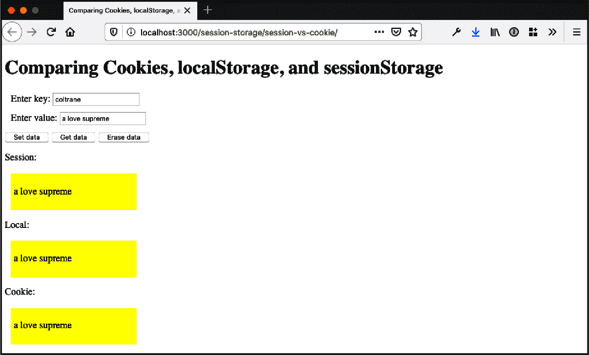
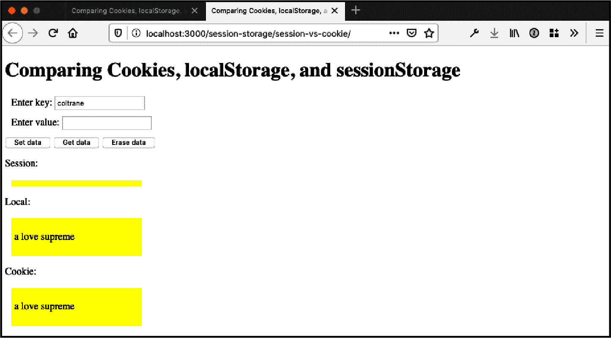

# 第十四章：数据持久性

我们可以进行动画和交互，流式传输，播放和渲染，但我们总是回到数据。数据是我们构建大多数 JavaScript 应用程序的基础。在本书的第一部分中，我们使用 JavaScript 语言标准来处理数据类型，在第十三章中，我们从远程源获取数据，在第二十章中，我们将在服务器上处理数据，使用 API 和数据源操纵数据。数据和 JavaScript，永远的朋友。

在本章中，我们将探讨如何使用 cookie、`sessionStorage`、`localStorage` 和 IndexedDB 在浏览器中使用 JavaScript 持久化数据的方法。

# 使用 Cookie 持久化信息

## 问题

您需要读取或设置浏览器 cookie 的值。

## 解决方案

使用 `document.cookie` 来设置和检索 cookie 值：

```
document.cookie = 'author=Adam';
console.log(document.cookie);
```

要对字符串进行编码，使用 `encodeURIComponent`，它将删除任何逗号、分号或空格：

```
const book = encodeURIComponent('JavaScript Cookbook');
document.cookie = `title=${book}`;
console.log(document.cookie);

// logs title=JavaScript%20Cookbook
```

选项可以添加到 cookie 值的末尾，并应使用分号分隔：

```
document.cookie = 'user=Abigail;  max-age=86400; path=/';
```

要删除一个 cookie，设置一个已经过期的 cookie 过期日期：

```
function eraseCookie(key) {
  const cookie = `${key}=;expires=Thu, 01 Jan 1970 00:00:00 UTC`;
  document.cookie = cookie;
}
```

## 讨论

Cookie 是存储在浏览器中的小数据片段。它们通常是从服务器应用程序设置并几乎在每个请求中发送到服务器。在浏览器中，它们通过 `document.cookie` 对象访问。

Cookie 接受以下选项，每个选项用分号分隔：

`domain`

cookie 可访问的域。如果未设置，这将默认为当前主机位置。指定域允许在子域中访问 cookie。

`expires`

设置 cookie 过期的时间。接受 GMTString 格式的日期。

`max-age`

设置 cookie 有效的时间长度。接受以秒为单位的值。

`path`

cookie 可访问的路径（例如 `/` 或 `/app`）。如果未指定，则 cookie 默认为当前路径。

`secure`

如果设置为 `true`，则 cookie 只会通过 `https` 传输。

`samesite`

默认为 `strict`。如果设置为 `strict`，则 cookie 不会在跨站点浏览中发送。或者，`lax` 将在顶级 GET 请求中发送 cookie。

在下面的示例中，用户可以输入一个值，该值将被存储为一个 cookie。然后他们可以检索指定键的值并删除该值。

在一个 HTML 文件中：

```
<!DOCTYPE html>
<html lang="en">
  <head>
    <meta charset="UTF-8" />
    <meta name="viewport" content="width=device-width, initial-scale=1.0" />
    <meta http-equiv="X-UA-Compatible" content="ie=edge" />
    <style>
      div {
        margin: 10px;
      }

      .data {
        width: 200px;
        background-color: yellow;
        padding: 5px;
      }
    </style>
    <title>Store, retrieve, and delete a cookie</title>
  </head>
  <body>
    <h1>Store, retrieve, and delete a cookie</h1>

    <form>
      <div>
        <label for="key"> Enter key:</label>
        <input type="text" id="key" />
      </div>
      <div>
        <label for="value">Enter value:</label>
        <input type="text" id="value" />
      </div>
    </form>
    <button id="set">Set data</button>
    <button id="get">Get data</button>
    <button id="erase">Erase data</button>

    <p>Cookie value:</p>
    <div id="cookiestr" class="data"></div>

    <script src="cookie.js"></script>
  </body>
</html>
```

以及相关的 *cookie.js* 文件：

```
// set the cookie
function setData() {
  const formKey = document.getElementById('key').value;
  const formValue = document.getElementById('value').value;

  const cookieVal = `${formKey}=${encodeURIComponent(formValue)}`;
  document.cookie = cookieVal;
}

// retrieve the cookie value for a specified key
function getData() {
  const key = document.getElementById('key').value;
  const cookie = document.getElementById('cookiestr');
  cookie.innerHTML = '';

  const keyValue = key.replace(/([.*+?^=!:${}()|[\]/\\])/g, '\\$1');
  const regex = new RegExp(`(?:^|;)\\s?${keyValue}=(.*?)(?:;|$)`, 'i');
  const match = document.cookie.match(regex);
  const value = (match && decodeURIComponent(match[1])) || '';
  cookie.innerHTML = `<p>${value}</p>`;
}

// remove the cookie for a specified key
function removeData() {
  const key = document.getElementById('key').value;
  document.getElementById('cookiestr').innerHTML = '';

  const cookie = `${key}=; expires=Thu, 01 Jan 1970 00:00:00 UTC`;
  document.cookie = cookie;
}

document.getElementById('set').onclick = setData;
document.getElementById('get').onclick = getData;
document.getElementById('erase').onclick = removeData;
```

请注意，我正在使用正则表达式来匹配已使用 `encodeURIComponent` 编码的 cookie 值。这是因为 `document.cookie` 返回一个包含所有 cookie 值的字符串。以这种方式使用正则表达式允许我提取我需要的信息。正则表达式在第二章中有更详细的介绍。

# 使用 sessionStorage 进行客户端存储

## 问题

您希望轻松地为单个会话存储信息，而不会遇到与 cookie 相关的大小和跨页面污染问题。

## 解决方案

使用 DOM 存储 `sessionStorage` 功能：

```
sessionStorage.setItem('name', 'Franco');
sessionStorage.city = 'Pittsburgh';

// returns 2
console.log(sessionStorage.length);

// retrieve individual values
const name = sessionStorage.getItem('name');
const city = sessionStorage.getItem('city');

console.log(`The stored name is ${name}`);
console.log(`The stored city is ${city}`);

// remove an individual item from storage
sessionStorage.removeItem('name');

// remove all items from storage
sessionStorage.clear();

// returns 0
console.log(sessionStorage.length);
```

## 讨论

`sessionStorage` 允许我们轻松地在用户的浏览器中为单个会话存储信息。会话的持续时间与单个浏览器标签页保持打开状态的时间相同。一旦用户关闭浏览器或标签页，会话就会结束。打开同一页面的新标签页将启动一个新的浏览器会话。

相比之下，cookies 和 `localStorage` 的默认行为（在“创建客户端本地数据存储项 localStorage”中讨论）是跨会话持久。作为这些存储方法差异的示例，示例 14-1 将表单中的信息存储在 cookie、`localStorage` 和 `sessionStorage` 中。

##### 示例 14-1\. 比较 `sessionStorage` 和 cookies

```
<!DOCTYPE html>
<html lang="en">
  <head>
    <meta charset="UTF-8" />
    <meta name="viewport" content="width=device-width, initial-scale=1.0" />
    <meta http-equiv="X-UA-Compatible" content="ie=edge" />
    <style>
      div {
        margin: 10px;
      }

      .data {
        width: 100px;
        background-color: yellow;
        padding: 5px;
      }
    </style>
    <title>Comparing Cookies, localStorage, and sessionStorage</title>
  </head>
  <body>
    <h1>Comparing Cookies, localStorage, and sessionStorage</h1>

    <form>
      <div>
        <label for="key"> Enter key:</label>
        <input type="text" id="key" />
      </div>
      <div>
        <label for="value">Enter value:</label>
        <input type="text" id="value" />
      </div>
    </form>
    <button id="set">Set data</button>
    <button id="get">Get data</button>
    <button id="erase">Erase data</button>

    <p>Session:</p>
    <div id="sessionstr" class="data"></div>
    <p>Local:</p>
    <div id="localstr" class="data"></div>
    <p>Cookie:</p>
    <div id="cookiestr" class="data"></div>

    <script src="cookie.js"></script>
    <script src="app.js"></script>
  </body>
</html>
```

*cookies.js* 文件包含设置、检索和删除给定 cookie 所需的代码：

```
// set session cookie
function setCookie(cookie, value) {
  const cookieVal = `${cookie}=${encodeURIComponent(value)};path=/`;
  document.cookie = cookieVal;
  console.log(cookieVal);
}

// each cookie separated by semicolon;
function getCookie(key) {
  const keyValue = key.replace(/([.*+?^=!:${}()|[\]/\\])/g, '\\$1');
  const { cookie } = document;
  const regex = new RegExp(`(?:^|;)\\s?${keyValue}=(.*?)(?:;|$)`, 'i');
  const match = cookie.match(regex);

  return match && decodeURIComponent(match[1]);
}

// set cookie date to the past to erase
function eraseCookie(key) {
  const cookie = `${key}=;path=/; expires=Thu, 01 Jan 1970 00:00:00 UTC`;
  document.cookie = cookie;
  console.log(cookie);
}
```

而 *app.js* 文件包含程序其余功能：

```
// set data for both session and cookie
function setData() {
  const key = document.getElementById('key').value;
  const { value } = document.getElementById('value');

  // set sessionStorage
  sessionStorage.setItem(key, value);

  // set localStorage
  localStorage.setItem(key, value);

  // set cookie
  setCookie(key, value);
}

function getData() {
  try {
    const key = document.getElementById('key').value;
    const session = document.getElementById('sessionstr');
    const local = document.getElementById('localstr');
    const cookie = document.getElementById('cookiestr');

    // reset display
    session.innerHTML = '';
    local.innerHTML = '';
    cookie.innerHTML = '';

    // sessionStorage
    let value = sessionStorage.getItem(key) || '';
    if (value) session.innerHTML = `<p>${value}</p>`;

    // localStorage
    value = localStorage.getItem(key) || '';
    if (value) local.innerHTML = `<p>${value}</p>`;

    // cookie
    value = getCookie(key) || '';
    if (value) cookie.innerHTML = `<p>${value}</p>`;
  } catch (e) {
    console.log(e);
  }
}

function removeData() {
  const key = document.getElementById('key').value;

  // sessionStorage
  sessionStorage.removeItem(key);

  // localStorage
  localStorage.removeItem(key);

  // cookie
  eraseCookie(key);

  // reset display
  getData();
}

document.getElementById('set').onclick = setData;
document.getElementById('get').onclick = getData;
document.getElementById('erase').onclick = removeData;
```

您可以从 `sessionStorage` 获取和设置数据，直接访问它，就像解决方案中演示的那样，但更好的方法是使用 `getItem()` 和 `setItem()` 函数。

加载示例页面，为相同键添加一个或多个值，然后点击“获取数据”按钮。结果显示在图 14-1 中。这里没有意外。数据已存储在 cookies、`localStorage` 和 `sessionStorage` 中。现在，在新的标签页中打开同一页面，将值输入到 `key` 表单字段中，然后点击“获取数据”按钮。该操作会导致类似于图 14-2 所示的页面。



###### 图 14-1\. 在原始标签页中显示存储的 `sessionStorage` 和 cookie 数据



###### 图 14-2\. 在第二个标签页中显示存储的 `sessionStorage` 和 cookie 数据

在新的标签页中，`cookie` 和 `localStorage` 的值会持久存在，因为 `cookie` 是会话特定的，但是 `sessionStorage` 只在标签窗口内有效。

屏幕截图展示了跨标签页持久性的差异，这是 `sessionStorage` 和 cookies 之间的主要区别之一，除了它们在 JavaScript 中的设置和访问方式不同。希望这些图像和示例还能展示在使用 `sessionStorage` 时可能涉及的潜在风险。

如果您的网站或应用程序用户熟悉标签页窗口间的 cookie 持久性，则 `sessionStorage` 可能会让他们感到不快。除了不同的行为之外，还有一个事实是，浏览器菜单选项删除 cookies 可能不会影响 `sessionStorage`，这对用户来说也可能是个令人不快的惊喜。另一方面，`sessionStorage` 使用起来非常干净，并且在我们想要将存储与特定标签页窗口关联时，提供了一种受欢迎的存储选项。

关于`sessionStorage`的最后一点补充与其实现相关：`sessionStorage`和下一个案例中涵盖的`localStorage`都是 W3C DOM 存储规范的一部分。它们都是`window`对象的属性，这意味着可以在全局范围内访问。它们都是`Storage`对象的实现，对`Storage`的原型进行的更改会影响到`sessionStorage`和`localStorage`对象：

```
Storage.prototype.someMethod = function (param) { ...};
...
localStorage.someMethod(param);
...
sessionStorage.someMethod(param);
```

除了本文和下文涵盖的差异之外，另一个主要区别在于`Storage`对象不会向服务器发出往返请求 —— 它们完全是客户端存储技术。

## 参见

要了解有关`Storage`对象、`sessionStorage`、`localStorage`或 Storage DOM 的更多信息，请参阅[规范](https://oreil.ly/PgBUt)。有关如何设置和检索`sessionStorage`和`localStorage`的不同方法，请参阅“创建一个客户端本地存储项”。

# 创建一个客户端本地存储项

## 问题

如果你希望以一种用户在浏览器崩溃、用户意外关闭浏览器或者网络连接中断后能够继续使用的方式来持久保存表单元素条目（或任何数据），请参考以下方法。

## 解决方案

如果数据量较小，可以使用 Cookie，但在离线情况下此策略无效。另一种更好的方法，特别是在持久保存大量数据或需要支持无网络连接时的功能时，是使用`localStorage`：

```
const formValue = document.getElementById('formelem').value;
if (formValue) {
  localStorage.formelem = formValue;
}

// recover
const storedValue = localStorage.formelem;
if (storedValue) {
  document.getElementById('formelem').value = storedValue;
}
```

## 讨论

“使用`sessionStorage`进行客户端存储”介绍了`sessionStorage`，这是 DOM 存储技术之一。`localStorage`对象接口相同，对于设置数据的方法也一样：

```
// use item methods
sessionStorage.setItem('key', 'value');
localStorage.setItem('key', 'value');

// use property names directly
sessionStorage.keyName = 'value';
localStorage.keyName = 'value';

// use the key method
sessionStorage.key(0) = 'value';
localStorage.key(0) = 'value';
```

以及获取数据的方法：

```
// use item methods
value = sessionStorage.getItem('key');
value = localStorage.getItem('key');

// use property names directly
value = sessionStorage.keyName;
value = localStorage.keyName;

// use the key method
value = sessionStorage.key(0);
value = localStorage.key(0);
```

正如对`sessionStorage`，尽管你可以直接访问和设置`localStorage`中的数据，你应该使用`getItem()`和`setItem()`来进行操作。

这两个存储对象都支持`length`属性，用于计算存储项对的数量，以及`clear`方法（无参数），用于清除所有存储。此外，两者都受限于 HTML5 的起源，这意味着数据存储在域中的所有页面之间共享，但不跨协议（例如，`http`与`https`不同）或端口。

两者的区别在于数据存储的时间长短。`sessionStorage`对象仅在会话期间存储数据，而`localStorage`对象会永久地或直到明确移除在客户端存储数据。

`sessionStorage`和`localStorage`对象还支持一个事件：`storage`事件。这是一个有趣的事件，当`localStorage`项发生更改时，所有页面都会触发该事件。这也是浏览器兼容性较低的领域：在 Firefox 中，可以在`body`或`document`元素上捕获事件，在 IE 中在`body`上，在 Safari 中在`document`上。

示例 14-2 展示了比本方案解决方案中涵盖的用例更全面的实现。在示例中，小表单的所有元素都将它们的 `onchange` 事件处理程序方法分配给一个函数，该函数捕获更改元素名称和值，并通过 `localStorage` 将值存储在本地存储中。提交表单时，将清除所有存储的表单数据。

当页面加载时，表单元素的 `onchange` 事件处理程序分配给函数以存储值，如果值已存储，则将其恢复到表单元素。要测试应用程序，请在几个表单字段中输入数据，但在单击提交按钮之前刷新页面。如果没有 `localStorage`，您将丢失数据。现在，当您重新加载页面时，表单将恢复到重新加载页面之前的状态。

##### 示例 14-2\. 使用 `localStorage` 在页面重新加载或浏览器崩溃时备份表单条目

```
<!DOCTYPE html>
<html lang="en">
  <head>
    <meta charset="UTF-8" />
    <meta name="viewport" content="width=device-width, initial-scale=1.0" />
    <meta http-equiv="X-UA-Compatible" content="ie=edge" />
    <title>Creating a localStorage Client-Side Data Storage Item</title>
  </head>
  <body>
    <h1>Creating a localStorage Client-Side Data Storage Item</h1>

    <form id="inputform">
      <div>
        <label for="field1">Enter field1:</label>
        <input type="text" id="field1" />
      </div>
      <div>
        <label for="field2">Enter field2:</label>
        <input type="text" id="field2" />
      </div>
      <div>
        <label for="field3">Enter field1:</label>
        <input type="text" id="field3" />
      </div>
      <div>
        <label for="field4">Enter field1:</label>
        <input type="text" id="field4" />
      </div>
      <input type="submit" value="Clear Storage" />
    </form>

    <script src="localstorage.js"></script>
  </body>
</html>
```

在 JavaScript 文件中：

```
// store the form input elements as a variable
const elems = document.querySelectorAll('input');

// store field values
function processField() {
  localStorage.setItem(window.location.href, 'true');
  localStorage.setItem(this.id, this.value);
}

// clear individual fields
function clearStored() {
  elems.forEach(elem => {
    if (elem.type === 'text') {
      localStorage.removeItem(elem.id);
    }
  });
}

// capture submit button to clear storage when clicked
document.getElementById('inputform').onsubmit = clearStored;

// on form element change, store the value in localStorage
elems.forEach(elem => {
  if (elem.type === 'text') {
    const value = localStorage.getItem(elem.id);
    if (value) elem.value = value;

    // change event
    elem.onchange = processField;
  }
});
```

浏览器为 `localStorage` 分配的大小因浏览器而异，但大多数在 5 mb 到 10 mb 范围内。您可以使用 `try/catch` 块来测试，确保未超出用户浏览器的限制：

```
try {
  localStorage.setItem('key', 'value');
} catch (domException) {
  if (
    ['QuotaExceededError', 'NS_ERROR_DOM_QUOTA_REACHED'].includes(
      domException.name
    )
  ) {
    // handle file size exceeded error
  } else {
    // handle any other error
  }
}
```

`localStorage` 对象可用于离线工作。例如，对于表单，您可以将数据存储在 `localStorage` 中，并提供一个按钮，以便在连接到互联网时从 `localStorage` 同步数据到服务器存储。

## 另请参阅

更多关于 `Storage` 对象、`sessionStorage` 和 `localStorage` 的信息，请参见“使用 sessionStorage 进行客户端存储”。

# 在客户端使用 IndexedDB 持久化更大的数据块

## 问题

在客户端，您需要比其他持久存储方法提供的更复杂的数据存储，例如 `localStorage`。

## 解决方案

在现代浏览器中，请使用 IndexedDB。

示例 14-3 中的 JavaScript 文件使用 IndexedDB 创建数据库和数据对象。创建后，它添加数据，然后检索第一个对象。在讨论中详细描述了正在发生的事情。

##### 示例 14-3\. 使用 IndexedDB 创建数据存储、添加数据，然后检索数据对象的示例

```
const data = [
  { name: 'Joe Brown', age: 53, experience: 5 },
  { name: 'Cindy Johnson', age: 44, experience: 5 },
  { name: 'Some Reader', age: 30, experience: 3 }
];

// delete the 'Cookbook' database, so the example can be run more than once
const delReq = indexedDB.deleteDatabase('Cookbook');
delReq.onerror = event => {
  console.log('delete error', event);
};

// open the 'Cookbook' database with a version of '1'
// or create it if it does not exist
const request = indexedDB.open('Cookbook', 1);

// upgradeneeded event is fired when a db is opened
// with a version number higher than the currently stored version (in this case none)
request.onupgradeneeded = event => {
  const db = event.target.result;
  const { transaction } = event.target;

  // create a new object store named 'reader' in the database
  const objectStore = db.createObjectStore('reader', {
    keyPath: 'id',
    autoIncrement: true
  });

  // create new keys in the object store
  objectStore.createIndex('experience', 'experience', { unique: false });
  objectStore.createIndex('name', 'name', { unique: true });

  // when all data loaded, log to the console
  transaction.oncomplete = () => {
    console.log('data finished');
  };

  const readerObjectStore = transaction.objectStore('reader');

  // add each value from the data object to the indexedDB database
  data.forEach(value => {
    const req = readerObjectStore.add(value);
    // console log a message when successfully added
    req.onsuccess = () => {
      console.log('data added');
    };
  });

  // if the request throws an error, log it to the console
  request.onerror = () => {
    console.log(event.target.errorCode);
  };

  // when the data store is successfully created, log to the console
  request.onsuccess = () => {
    console.log('datastore created');
  };

  // on page click, get a random value from the database and log it to the console
  document.onclick = () => {
    const randomNum = Math.floor(Math.random() * 3) + 1;
    const dataRequest = db
      .transaction(['reader'])
      .objectStore('reader')
      .get(randomNum);
    dataRequest.onsuccess = () => {
      console.log(`Name : ${dataRequest.result.name}`);
    };
  };
};
```

## 讨论

IndexedDB 是 W3C 和其他人在探索客户端大数据管理解决方案时达成的规范。虽然它是基于事务的，并支持*游标*的概念，但它并非关系数据库系统。它使用 JavaScript 对象，每个对象都由给定的*键*索引，无论您决定将键设为什么。

IndexedDB 可以是异步和同步的。它可以用于传统服务器或云应用程序中的更大数据块，但也对离线 Web 应用程序有帮助。

大多数 IndexedDB 的实现不限制数据存储大小，但如果在 Firefox 中存储超过 50 MB，则用户需要提供权限。Chrome 创建一个临时存储池，每个应用程序最多可以使用其 20%。其他代理程序也有类似的限制。所有主流浏览器都支持 IndexedDB，除了 Opera Mini，尽管整体支持可能不完全相同。

正如解决方案所示，IndexedDB API 方法触发成功和错误回调函数，您可以使用传统事件处理、回调函数或分配给函数来捕获这些回调。

1.  打开数据库。

1.  在升级数据库中创建对象存储。

1.  开启一个事务，并发出一个数据库操作请求，如添加或检索数据。

1.  通过监听适当类型的 DOM 事件等待操作完成。

1.  处理返回的结果（可以在请求对象中找到）。

从解决方案的顶部开始，创建一个具有三个值的数据对象以添加到数据存储中。如果数据库存在，则删除数据库，以便可以多次运行示例。随后，调用`open()`打开数据库（如果存在）或创建数据库（如果不存在）。因为在运行示例之前删除了数据库，所以它会被重新创建。名称和版本都是必需的，因为只有在打开新版本的数据库时才能修改数据库。

从`open()`方法返回一个请求对象（IDBOpenDBRequest），并且操作是否成功会作为该对象的事件触发。在代码中，捕获该对象的`onsuccess`事件处理程序以在控制台上提供成功的消息。您还可以在此事件处理程序中将数据库句柄分配给全局变量，但代码在下一个事件处理程序`upgradeneeded`中分配它。

当给定数据库名称和版本的数据库不存在时，只有`upgradeneeded`事件处理程序才会被调用。事件对象还提供了一种访问 IDBDatabase 引用的方式，该引用分配给全局变量`db`。现有的事务也可以通过作为事件处理程序参数传递的事件对象访问，并且它被访问并分配给一个局部变量。

此事件的事件处理程序是唯一可以创建对象存储及其相关索引的时间。在解决方案中，创建了一个名为`reader`的数据存储，其键设置为自增的`id`。另外两个索引用于数据存储的`name`和`experience`字段。数据也在事件中添加到数据存储中，尽管可以在其他时间添加，例如当用户提交 HTML 表单时。

在`upgradeneeded`事件处理程序之后，编写了`success`和`error`处理程序，仅用于提供反馈。最后，使用`document.onclick`事件处理程序来触发数据库访问。在解决方案中，通过数据库处理程序访问随机数据实例，其事务，对象存储，并最终获得给定键的数据。当查询成功时，访问`name`字段并将其值打印到控制台。我们可以使用游标而不是访问单个值，但这留给您自己的实验。

结果将按顺序打印到控制台：

```
data added
data finished
datastore created
Name : Cindy Johnson
```

# 使用库简化 IndexedDB

## 问题

您希望使用 JavaScript promises 以异步方式处理 IndexedDB。

## 解决方案

使用[IDB 库](https://github.com/jakearchibald/idb)，它提供了对 IndexedDB API 的可用性改进以及使用 promises 的包装器。

以下文件导入 IDB 库，创建一个 IndexedDB 数据存储并向其添加数据：

```
import { openDB, deleteDB } from 'https://unpkg.com/idb?module';

const data = [
  { name: 'Riley Harrison', age: 57, experience: 1 },
  { name: 'Harlow Everly', age: 29, experience: 5 },
  { name: 'Abigail McCullough', age: 38, experience: 10 }
];

(async () => {
  // for demo purposes, delete existing db on page load
  try {
    await deleteDB('CookbookIDB');
  } catch (err) {
    console.log('delete error', err);
  }

  // open the database and create the data store
  const database = await openDB('CookbookIDB', 1, {
    upgrade(db) {
      // Create a store of objects
      const store = db.createObjectStore('reader', {
        keyPath: 'id',
        autoIncrement: true
      });

      // create new keys in the object store
      store.createIndex('experience', 'experience', { unique: false });
      store.createIndex('name', 'name', { unique: true });
    }
  });

  // add all of the reader data to the store
  data.forEach(async value => {
    await database.add('reader', value);
  });
})();
```

###### 注意

在示例中，我正在从[UNPKG](https://unpkg.com)加载`idb`模块，这使我可以直接从 URL 访问模块，而不是在本地安装它。这在演示目的中效果很好，但在应用程序中，您将希望通过`npm`安装模块并将其与您的代码捆绑在一起。

## 讨论

IDB 自称为“一个几乎与 IndexedDB API 完全相同的小型库，但通过一些小的改进大大提升了可用性。”使用`idb`简化了 IndexedDB 的某些语法，并支持使用 promises 执行异步代码。

`openDB`方法打开数据库并返回一个 promise：

```
const db = await openDB(name, version, {
  // ...
});
```

在以下示例中，用户可以向数据库添加数据并检索所有数据以在页面上显示。在 HTML 文件中：

```
<!DOCTYPE html>
<html lang="en">
  <head>
    <meta charset="UTF-8" />
    <meta name="viewport" content="width=device-width, initial-scale=1.0" />
    <meta http-equiv="X-UA-Compatible" content="ie=edge" />
    <title>IDB Discussion Example</title>
    <style>
      div {
        margin: 10px;
      }

      .data {
        width: 200px;
        background-color: yellow;
        padding: 5px;
      }
    </style>
  </head>
  <body>
    <h1>IDB Discussion Example</h1>

    <form>
      <div>
        <label for="name"> Enter name:</label>
        <input type="text" id="name" />
      </div>
      <div>
        <label for="age">Enter age:</label>
        <input type="text" id="age" />
      </div>
    </form>
    <button id="set">Set data</button>
    <button id="get">Get data</button>

    <p>Data:</p>
    <div class="data">
      <ul id="data-list"></ul>
    </div>

    <script type="module" src="idb-discussion.js"></script>
  </body>
</html>
```

以及*idb-discussion.js*文件：

```
import { openDB } from 'https://unpkg.com/idb?module';

(async () => {
  // open the database and create the data store
  const database = await openDB('ReaderNames', 1, {
    upgrade(db) {
      // Create a store of objects
      const store = db.createObjectStore('reader', {
        keyPath: 'id',
        autoIncrement: true
      });

      // create new keys in the object store
      store.createIndex('age', 'age', { unique: false });
      store.createIndex('name', 'name', { unique: true });
    }
  });

  async function setData() {
    const name = document.getElementById('name').value;
    const age = document.getElementById('age').value;

    await database.add('reader', {
      name,
      age
    });
  }

  async function getData() {
    // get the reader data from the database
    const readers = await database.getAll('reader');

    const dataDisplay = document.getElementById('data-list');

    // add the name and age of each reader in the db to the page
    readers.forEach(reader => {
      const value = `${reader.name}: ${reader.age}`;
      const li = document.createElement('li');
      li.appendChild(document.createTextNode(value));
      dataDisplay.appendChild(li);
    });
  }

  document.getElementById('set').onclick = setData;
  document.getElementById('get').onclick = getData;
})();
```

我不会详细介绍整个 API，但强烈建议查阅[库的文档](https://github.com/jakearchibald/idb/blob/master/README.md)，并在使用 IndexedDB 时使用 IDB。
