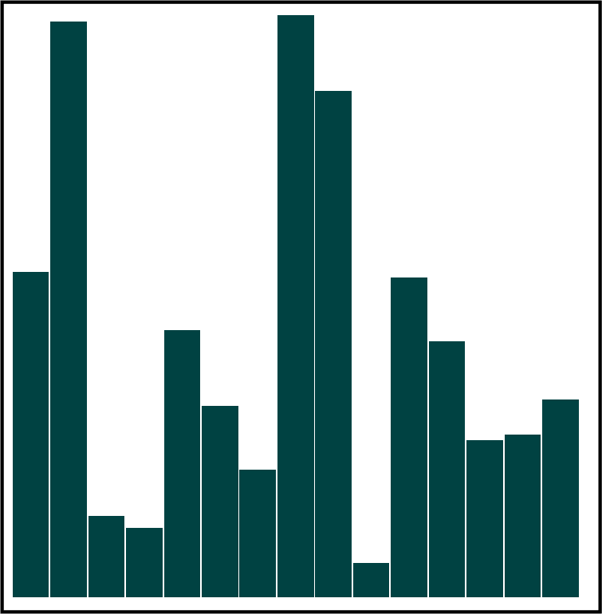

# 第十五章：处理媒体

漂亮的图片。动画。酷炫的视频。声音！

通过多种媒体类型，Web 变得更加丰富。我们的老朋友 SVG 和 Canvas 可用于复杂的动画、图表和图形。除此之外，HTML5 还包括视频和音频元素，以及近期将要出现的 3D 图形潜力。

最重要的是，这些都不需要任何专有插件，它们都集成在您的浏览器客户端中，包括智能手机、平板电脑和计算机。

# 向 SVG 添加 JavaScript

## 问题

您想要向 SVG 文件或元素添加 JavaScript。

## 解决方案

SVG 中的 JavaScript 包含在 `script` 元素中，与 HTML 类似，只是需要在脚本周围添加 CDATA 标记（示例 15-1）。DOM 方法也适用于处理 SVG 元素。

##### 示例 15-1。演示 SVG 文件中的 JavaScript

```
<?xml version="1.0" encoding="UTF-8" standalone="no"?>
<svg xmlns="http://www.w3.org/2000/svg"
xmlns:xlink="http://www.w3.org/1999/xlink" width="600" height="600">
  <script type="text/ecmascript">
    <![CDATA[

      // set element onclick event handler
      window.onload = function() {
        const square = document.getElementById('square');

        // onclick event handler, change circle radius
        square.onclick = function click() {
          const color = this.getAttribute('fill');
          if (color === '#ff0000') {
            this.setAttribute('fill', '#0000ff');
          } else {
            this.setAttribute('fill', '#ff0000');
          }
        };
      };
    ]]>
  </script>
  <rect id="square" width="400" height="400" fill="#ff0000"
   x="10" y="10" />
</svg>
```

## 讨论

如本解决方案所示，SVG 是 XML 格式，必须遵循向 XML 嵌入脚本的规则。这意味着在 `script` 标签中提供脚本 `type`，并将脚本内容包裹在 CDATA 块中。如果没有 CDATA 部分，并且您的脚本使用了 `<` 或 `&` 等字符，您的页面将会出现错误，因为 XML 解析器会将它们视为 XML 字符，而不是脚本。

###### 注意

有一些倾向于将 SVG 视为 HTML，特别是当 SVG 内联在 HTML 文档中时。这是 Chrome 的做法。不过，还是遵循 XML 的要求更为保险。

DOM 方法，如 `document.getElementById()`，并非仅限于 HTML；它们也适用于任何 XML 文档，包括 SVG。新功能是 SVG 特有的 `fill` 属性，这是 SVG 元素（如 `rect`）中独特的属性。

###### 警告

如果文件中的任何元素使用了命名空间，则必须使用命名空间版本的 DOM 方法。

解决方案中的代码是一个独立的 SVG 文件，扩展名为 *.svg*。如果我们要将 SVG 嵌入到 HTML 文件中，就像在 示例 15-2 中展示的那样，颜色变化动画将会同样起作用。CDATA 部分被移除，因为所有现代浏览器都理解 SVG 现在处于 HTML 上下文中。但如果文件是 XHTML，则需要将它们添加回去。

##### 示例 15-2。来自 示例 15-1 的 SVG 元素，嵌入到 HTML 页面中

```
<!DOCTYPE html>
<html>
<head>
<title>Accessing Inline SVG</title>
<meta charset="utf-8">
</head>
<body>
<svg width="600" height="600">
  <script>
    // set element onclick event handler
    window.onload = function() {
      const square = document.getElementById('square');

      // onclick event handler, change circle radius
      square.onclick = function click() {
        const color = this.getAttribute('fill');
        if (color === '#ff0000') {
          this.setAttribute('fill', '#0000ff');
        } else {
          this.setAttribute('fill', '#ff0000');
        }
      };
    };
  </script>
  <rect id="square" width="400" height="400" fill="#ff0000"
 x="10" y="10" />
</svg>
</body>
</html>
```

上述示例直接将 SVG 嵌入到 HTML 页面中。您还可以使用 `<object>` 标签和回退的 `` 标签在页面上嵌入包含 JavaScript 的 SVG 文件：

```
<object type="image/svg+xml" data="demo.svg">
    
</object>
```

所有现代浏览器都支持 SVG，包括将 SVG 嵌入到 HTML 中。IE 在 9 版本之后支持 SVG。

###### 注意

要了解更多关于 SVG 的内容，我推荐阅读 [*SVG Animations*](https://www.oreilly.com/library/view/svg-animations/9781491939697/)，作者是 Sarah Drasner（O’Reilly）。

## 额外内容：使用 SVG 库

与使用 Canvas 工作的库相比，用于处理 SVG 的库没有那么多，但现有的库非常方便。其中最流行的之一是 D3 库，详见“使用 D3 创建 SVG 条形图”。另外几个流行的库包括[Raphaël](http://raphaeljs.com)、[GreenSock](https://greensock.com)、[Snap.svg](http://snapsvg.io)和[SVG.js](https://svgjs.dev/docs/3.0)。所有这些库都可以简化 SVG 的创建和动画。以下代码片段展示了使用 Raphaël 的示例：

```
// Creates canvas 320 × 400 at 10, 50
const paper = Raphael(10, 50, 320, 400);
// Creates circle at x = 150, y = 140, with radius 100
const circle = paper.circle(150, 140, 100);
// Sets the fill attribute of the circle to red (#f00)
circle.attr("fill", "#f0f");
// Sets the stroke attribute of the circle to white
circle.attr("stroke", "#ff0");
```

# 从网页脚本访问 SVG

## 问题

您希望通过网页内的脚本修改 SVG 元素的内容。

## 解决方案

如果 SVG 直接嵌入到网页中，可以使用与访问任何其他网页元素相同的功能来访问元素及其属性：

```
const square = document.getElementById("square");
square.setAttribute("width", "500");
```

但是，如果 SVG 是通过`object`元素嵌入到页面中的外部 SVG 文件，您必须获取外部 SVG 文件的文档才能访问元素。该技术需要进行对象检测，因为不同浏览器的处理过程有所不同：

```
window.onload = function onLoad() {
  const object = document.getElementById('object');
  let svgdoc;

  try {
    svgdoc = object.contentDocument;
  } catch (e) {
    try {
      svgdoc = object.getSVGDocument();
    } catch (err) {
      console.log(err, 'SVG in object not supported in this environment');
    }
  }

  if (!svgdoc) return;

  const square = svgdoc.getElementById('square');
  square.setAttribute('width', '900');
};
```

## 讨论

解决方案中列出的第一个选项访问嵌入在 HTML 文件中的 SVG。您可以使用与访问 HTML 元素相同的方法访问 SVG 元素。

第二个选项有点复杂，它依赖于检索 SVG 文档的文档对象。第一种方法尝试在对象上访问`contentDocument`属性。如果失败，应用程序然后尝试使用`getSVGDocument()`来访问 SVG 文档。一旦您访问了 SVG 文档对象，您可以使用与网页本地元素相同的 DOM 方法。

示例 15-3 展示了将 SVG 添加到网页的第二种方式，以及如何在 HTML 中从脚本访问 SVG 元素。

##### 示例 15-3\. 从脚本中访问对象元素中的 SVG

```
<!DOCTYPE html>
<head>
  <title>SVG in Object</title>
  <meta charset="utf-8" />
</head>
<body>
  <object id="object" type="image/svg+xml" data="../demo1.svg">
    <p>No SVG support</p>
  </object>
  <script type="text/javascript">
    const object = document.getElementById('object');
    object.onload = function() {
      let svgdoc;

      // get access to the SVG document object
      try {
        svgdoc = object.contentDocument;
      } catch (e) {
        try {
          svgdoc = object.getSVGDocument();
        } catch (err) {
          console.log(err, 'SVG in object not supported in this environment');
        }
      }

      if (!svgdoc) return;

      // get SVG element and modify
      const square = svgdoc.getElementById('square');
      square.onclick = function() {
        let width = parseFloat(square.getAttribute('width'));
        width -= 50;
        square.setAttribute('width', width);
        const color = square.getAttribute('fill');
        if (color == 'blue') {
          square.setAttribute('fill', 'yellow');
          square.setAttribute('stroke', 'green');
        } else {
          square.setAttribute('fill', 'blue');
          square.setAttribute('stroke', 'red');
        }
      };
    };
  </script>
</body>
```

在示例代码中，对象在加载后被访问；然后访问`object.onload`事件处理程序以获取 SVG 文档，并将函数分配给`onclick`事件处理程序。

# 使用 D3 创建 SVG 条形图

## 问题

您希望创建一个可伸缩的条形图，但希望避免必须创建所有图形的最后一点。

## 解决方案

使用 D3 和 SVG 创建一个图表，该图表绑定到您的应用程序提供的一组数据。示例 15-4 展示了使用 D3 创建的垂直条形图，显示了每个条形的高度。

##### 示例 15-4\. 使用 D3 创建的 SVG 条形图

```
<!DOCTYPE html>
<html>
  <head>
    <meta charset="utf-8" />
    <title>SVG Bar Chart using D3</title>
    <script src="https://cdnjs.cloudflare.com/ajax/libs/d3/5.15.0/d3.min.js"></script>
  </head>
  <body>
    <script type="text/javascript">
      const data = [56, 99, 14, 12, 46, 33, 22, 100, 87, 6, 55, 44, 27, 28, 34];

      const height = 400;
      const barWidth = 25;

      const x = d3
        .scaleLinear()
        .domain([0, d3.max(data)])
        .range([0, height]);

      const svg = d3
        .select('body')
        .append('svg')
        .attr('width', data.length * (barWidth + 1))
        .attr('height', height);

      svg
        .selectAll('rect')
        .data(data)
        .enter()
        .append('rect')
        .attr('fill', '#008b8b')
        .attr('x', function(d, i) {
          return i * (barWidth + 1);
        })
        .attr('y', function(d) {
          return height - x(d);
        })
        .attr('width', barWidth)
        .attr('height', x);
    </script>
  </body>
</html>
```

## 讨论

D3 不是一个标准的图形工具，它根据您提供的尺寸创建形状。使用 D3，您提供一组数据，用于可视化数据的对象，然后静静地让它运行。听起来很简单，但要获得这种数据可视化的好处，您必须正确设置它，当您开始使用库时可能会有挑战。

首先要注意，D3 *方法链* 的应用达到了最大化。是的，你可以分别调用方法，但使用库的链式支持更清晰、更干净、更高效。

在解决方案中，第一行是将数据集创建为数组。D3 期望数据点在数组中，尽管每个元素可以是一个对象，也可以是一个简单的值，如解决方案所示。接下来，定义了柱状图的最大高度以及每个柱子的宽度。接下来，我们开始使用 D3。

###### 注意

[D3](http://d3js.org)，由 Mike Bostock 创建，是一个强大的数据可视化工具，并不是你可以在一个懒散的下午就能掌握的东西。然而，它是一个非常值得学习的工具，所以请将这个示例看作是激发你兴趣的引子，而不是一个权威的介绍。

要深入了解，我推荐 [*D3 快速入门*](http://shop.oreilly.com/product/0636920224341.do)，作者是 Philipp Janert（O’Reilly）。

我本可以在网页上添加一个静态 SVG 元素，但我想演示 D3 如何创建一个元素。通过创建 SVG 元素，我们还可以获取到它的引用以便今后的工作，尽管我们也可以使用 D3 来获取现有元素的引用。在代码中，使用 D3 的 `select()` 方法获取了对 `body` 元素的引用。一旦这样做，就通过 `append()` 方法向 `body` 元素附加了一个新的 SVG 元素，并通过 `attr()` 函数给它赋予属性。元素的高度已经预定义，但宽度等于数据元素的数量乘以柱子宽度（+1，以提供必要的间距）。

一旦创建了 SVG 元素，代码使用 D3 的 *scale* 功能来确定元素高度和每个柱子高度之间必要的比例，以使柱状图填充 SVG 元素，但每个柱子的高度是成比例的。它通过使用 `scale.linear()` 来创建线性比例。根据 D3 文档，“映射是线性的，即输出范围值 *y* 可以表达为输入域值 *x* 的线性函数：*y* = *mx* + *b*。”

`domain()` 函数设置比例尺的输入域，而 `range()` 设置输出范围。在解决方案中，给定域的值是从数据集中的零到最大值，通过调用 `max()` 确定。给定的范围值是从零到 SVG 元素的高度。然后将一个函数返回给一个变量，当调用时会将传递给它的任何数据归一化。如果函数给定一个等于最大数据值高度的值，返回值将等于元素的高度（在这种情况下，最大数据值 100 返回的缩放值为 400）。

代码的最后部分是创建条形图的部分。我们需要一些东西来处理，所以代码调用`selectAll()`选择`rect`。SVG 块中还没有`rect`元素，但我们将添加它们。数据通过`data()`方法传递给 D3，然后调用`enter()`函数。`enter()`函数的作用是处理数据并为所有缺失的元素返回占位符。在解决方案中，为所有 15 个`rect`元素（每个柱形条的一个）创建了占位符。

然后在 SVG 元素中附加了一个`rect`元素，并使用`attr()`设置了每个元素的属性。在解决方案中，提供了`fill`和`stroke`，尽管这些可以在页面的样式表中定义。接下来，为`x`属性的位置或条形图的左下角属性提供了一个函数，其中`d`是当前数据（数据值），`i`是当前索引。对于`x`属性，索引乘以`barWidth`，再加上一（1），以考虑间距。

对于`y`属性，我们需要有些技巧。SVG 的原点是左上角，这意味着增加`y`的值会使图表向下移动，而不是向上。为了反转这一点，我们需要从高度减去`y`的值。然而，我们不能直接这样做。如果代码直接使用传递给它的数据，那么我们将得到一个比例相当小、压缩的柱状图。相反，我们需要使用新创建的比例尺函数`x`，将数据传递给它。

每个条形图的宽度是常量`barWidth`给定的值，高度只是比例尺函数的变量，相当于调用比例尺函数并传递数据。所有这些都创建了图表，显示在图 15-1 中。



###### 图 15-1\. 柱状图示例，每个条形的高度标准化以填充给定空间

# 将 SVG 和 Canvas 元素集成到 HTML 中

## 问题

您希望在网页中同时使用`canvas`元素和 SVG。

## 解决方案

一种选择是直接将 SVG 和`canvas`元素嵌入到 HTML 页面中，然后从 SVG 中的脚本访问`canvas`元素：

```
<!DOCTYPE html>
<html lang="en">
  <head>
    <meta charset="UTF-8" />
    <meta name="viewport" content="width=device-width, initial-scale=1.0" />
    <meta http-equiv="X-UA-Compatible" content="ie=edge" />
    <title>Integrating SVG and the Canvas Element in HTML</title>
  </head>
  <body>
    <canvas id="myCanvas" width="400px" height="100px">
      <p>canvas item alternative content</p>
    </canvas>

    <svg id="svgelem" height="400">
      <title>SVG Circle</title>
      <script type="text/javascript">
      window.onload = function () {
        var context = document.getElementById("myCanvas").getContext('2d');
        context.fillStyle = 'rgba(0,200,0,0.7)';
        context.fillRect(0,0,100,100);
      }
      </script>
      <circle id="redcircle" cx="100" cy="100" r="100" fill="red" stroke="#000" />
    </svg>
  </body>
</html>
```

或者您可以直接将`canvas`元素嵌入 SVG 中作为外来对象：

```
<!DOCTYPE html>
<html>
<head>
<title>Accessing Inline SVG</title>
<meta charset="utf-8">
</head>
<body>
<svg id="svgelem" height="400" width="600">
   <script type="text/javascript">
      window.onload = function () {
         var context2 = document.getElementById("thisCanvas").getContext('2d');

         context2.fillStyle = "#ff0000";
         context2.fillRect(0,0,200,200);
       };
   </script>

   <foreignObject width="300" height="150">
      <canvas width="300" height="150" id="thisCanvas">
         alternate content for browsers that do not support Canvas
      </canvas>
   </foreignObject>
   <circle id="redcircle" cx="300" cy="100" r="100" fill="red" stroke="#000" />
  </svg>
</body>
</html>
```

## 讨论

当 SVG 元素嵌入到当前网页中时，您可以从 SVG 内部访问 HTML 元素。但是，您也可以直接在 SVG 中嵌入元素，使用 SVG 的`foreignObject`元素。此元素允许我们嵌入 XHTML、MathML、RDF 或任何其他基于 XML 的语法。

在两个解决方案中，我都能使用`getElementById()`。但是，如果我想使用其他方法来操作元素，例如`getElementsByTagName()`，我必须注意使用哪个版本的方法。例如，我可以使用`getElementsByTagName()`获取外部的`canvas`元素，但如果包含的对象是 XML（例如 RDF/XML），则需要使用命名空间版本的方法`getElementsByTagNameNS`。由于解决方案中嵌入的对象是 HTML5，因此不需要命名空间。

一旦获得 Canvas 上下文，就像在 HTML 中从脚本中使用元素一样：添加矩形，绘制路径，创建弧线等。

## 额外：Canvas？还是 SVG？

为什么要使用 Canvas 而不是 SVG，或者 SVG 而不是 Canvas？ `canvas`元素在帧动画中更快。每次动画时，浏览器只需重新绘制更改的像素，而不是重新创建整个场景。但是，当您需要支持从智能手机到大型显示器的各种屏幕尺寸时，`canvas`元素动画的优势减弱。SVG 具有出色的缩放性。

SVG 的另一个优势是，在强大的库的帮助下，它在丰富的数据可视化中占据一席之地。但是，Canvas 与 WebGL 等 3D 系统一起使用。

将 SVG 和 Canvas 结合使用的一个用途是为 Canvas 元素提供后备：SVG 写入 DOM 并在 JavaScript 关闭时持续存在，而`canvas`元素则不会。

# 当音频文件开始播放时运行例行程序

## 问题

您想在音频文件开始或结束播放时提供音频文件并分享额外信息。

## 解决方案

使用 HTML5 `audio`元素：

```
<audio id="meadow" controls>
  <source src="meadow.wav" type="audio/wav" />
  <p><a href="meadow.wav">Meadow sounds</a></p>
</audio>
```

并捕获其`play`事件（播放已开始）或`ended`事件（播放已完成）：

```
const meadow = document.getElementById('meadow');
meadow.addEventListener('play', aboutAudio);
```

然后显示信息：

```
function aboutAudio() {
  const info = 'A summer field near a lake in July.';
  const txt = document.createTextNode(info);
  const div = document.createElement('div');
  div.appendChild(txt);
  document.body.appendChild(div);
}
```

## 讨论

HTML5 添加了两个媒体元素：`audio`和`video`。这些简单易用的控件提供了播放音频和视频文件的方法。

在解决方案中，`audio`元素的`controls`布尔属性已设置，因此显示了控件。该元素的`src`是用于浏览器内播放的 WAV 音频文件。此外，提供了 WAV 文件的链接作为后备，这意味着使用不支持`audio`的浏览器的用户仍然可以访问声音文件。我还可以提供`object`元素或其他后备内容。

###### 注意

WAV 是广泛支持的音频格式，但不同浏览器支持各种格式和文件类型。Mozilla 开发者网络有一个详细的[表格](http://mzl.la/1DS3rPL)，列出了各种浏览器支持的音频和视频编解码器，而维基百科维护了一个[简单的浏览器支持表格](https://oreil.ly/55EwV)，用于音频编码格式。

媒体元素提供一组方法来控制播放，以及在事件发生时可以触发的事件。在解决方案中，捕获了 `ended` 事件，并将事件处理程序分配给 `aboutAudio()`，在播放结束后显示有关文件的消息。请注意，尽管代码在使用窗口加载事件时使用了 DOM Level 0 事件处理程序，但在 `audio` 元素中使用了 DOM Level 2 事件处理。此事件处理程序在不同浏览器中的支持情况不稳定，因此强烈建议您使用 `addEventListener()`。但是，`onended` 在直接在元素中使用时似乎没有问题：

```
<audio id="meadow" src="meadow.wav" controls onended="alert('All done')">
  <p><a href="meadow.wav">Meadow sounds</a></p>
</audio>
```

看到当前支持这些元素的所有浏览器中元素的外观是很有趣的。没有标准的外观，所以每个浏览器都提供了自己的解释。您可以通过提供自己的播放控件并使用自己的元素/CSS/SVG/Canvas 来提供装饰来控制外观。

# 使用视频元素从 JavaScript 控制视频

## 问题

您希望在网页中嵌入视频，并希望无论浏览器和操作系统如何，视频控件的外观保持一致。

## 解决方案

使用 HTML5 `video` 元素：

```
<video id="meadow" poster="purples.jpg" >
   <source src="meadow.m4v" type="video/mp4"/>
   <source src="meadow.ogv" type="video/ogg" />
</video>
```

您可以通过 JavaScript 为其提供控件，如示例 15-5 所示。按钮用于提供视频控件，并在 `div` 元素中使用文本来提供播放期间时间的反馈。

##### 示例 15-5\. 为 HTML5 视频元素提供自定义控件

```
<!DOCTYPE html>
<html lang="en">
  <head>
    <meta charset="UTF-8" />
    <meta name="viewport" content="width=device-width, initial-scale=1.0" />
    <meta http-equiv="X-UA-Compatible" content="ie=edge" />
    <title>Controlling Video from JavaScript with the video Element</title>
    <style>
      video {
        border: 1px solid black;
        max-width: 600px;
      }
    </style>
  </head>
  <body>
    <h1>Controlling Video from JavaScript with the video Element</h1>

    <video id="meadow" controls>
      <source src="meadow.mp4" type="video/mp4" />
      <source src="meadow.webm" type="video/webm" />
    </video>
    <div id="feedback"></div>
    <div id="controls">
      <button id="start">Play</button>
      <button id="stop">Stop</button>
      <button id="pause">Pause</button>
    </div>

    <script src="video.js"></script>
  </body>
</html>
```

而且在 `video.js` 中：

```
// dom elements
const meadow = document.getElementById('meadow');
const start = document.getElementById('start');
const pause = document.getElementById('pause');
const stop = document.getElementById('stop');

// start video, enable stop and pause
// disable play
function startPlayback() {
  meadow.play();
  pause.disabled = false;
  stop.disabled = false;
  this.disabled = true;
}

// pause video, enable start, disable stop
// disable pause
function pausePlayback() {
  meadow.pause();
  pause.disabled = true;
  start.disabled = false;
  stop.disabled = true;
}

// stop video, return to zero time
// enable play, disable pause and stop
function stopPlayback() {
  meadow.pause();
  meadow.currentTime = 0;
  start.disabled = false;
  pause.disabled = true;
  this.disabled = true;
}

// for every time divisible by 5, output feedback
function reportProgress() {
  const time = Math.round(this.currentTime);
  const div = document.getElementById('feedback');
  div.innerHTML = `${time} seconds`;
}

// event listeners
document.getElementById('start').addEventListener('click', startPlayback);
document.getElementById('stop').addEventListener('click', stopPlayback);
document.getElementById('pause').addEventListener('click', pausePlayback);
meadow.addEventListener('timeupdate', reportProgress);
```

## 讨论

HTML5 `video` 元素和 HTML5 `audio` 元素一样，可以使用其内置控件进行控制，或者您可以提供自定义控件。媒体元素支持以下方法：

`play`

开始播放视频

`pause`

暂停视频

`load`

预加载视频但不开始播放

`canPlayType`

测试用户代理是否支持视频类型

媒体元素不支持停止方法，因此该代码通过暂停视频播放然后设置视频的 `currentTime` 属性为 0 来模拟停止。我还使用 `currentTime` 打印视频时间，使用 `Math.round` 将时间四舍五入到最接近的秒。

视频控件提供两种不同的视频编解码器：H.264（*.mp4*）和 VP8（*.webm*）。几乎所有现代浏览器都支持 WebM 文件格式，但包含 MP4 文件可以为支持`video`元素的旧浏览器提供备用。

视频和音频控件本身支持键盘访问。如果替换控件，您需要为您的替代品提供可访问性信息。

###### 注意

在解决方案中演示的视频播放功能可以直接使用未加密的视频（或音频）文件。如果视频（或音频）文件已加密，则需要更多的工作来使视频播放，可以使用 HTML 5.1 W3C Encrypted Media Extensions (EME)。

[W3C EME 工作草案](https://oreil.ly/mMu7q) 已经在 [Internet Explorer 11](http://bit.ly/1DS5umQ)、Chrome、Firefox、Microsoft Edge 和 Safari 中实现。
