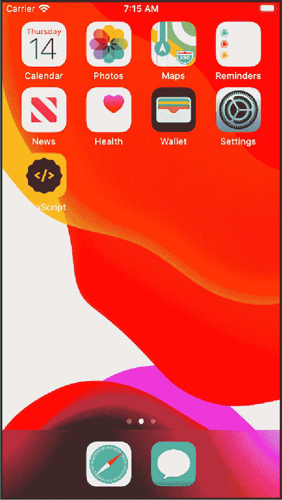
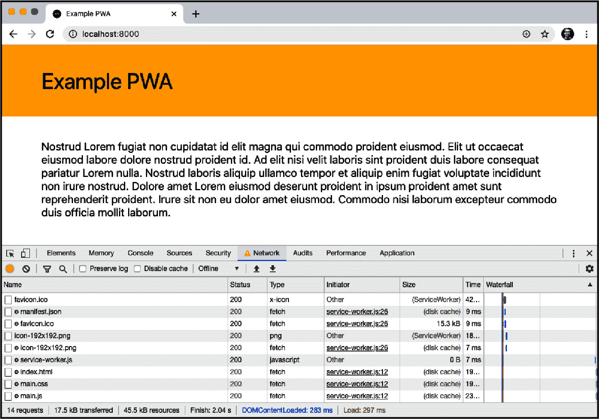
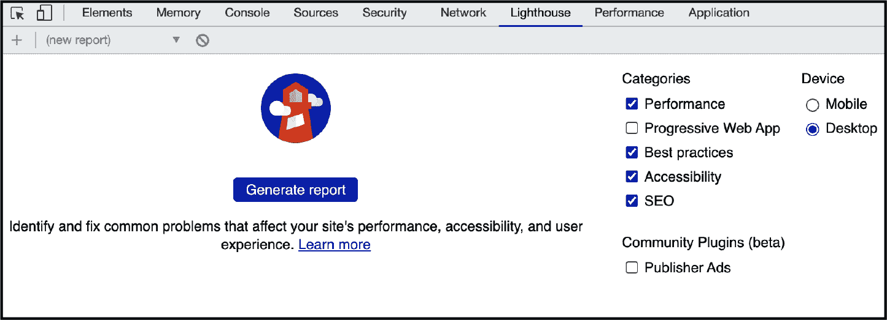
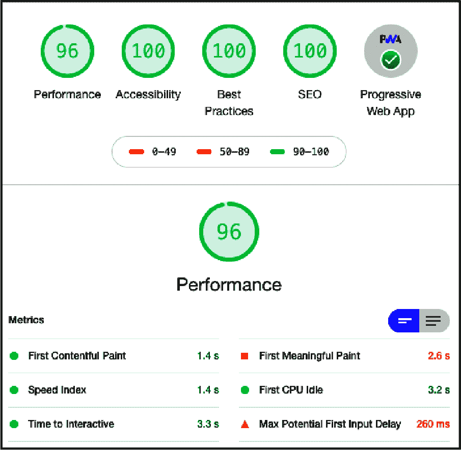
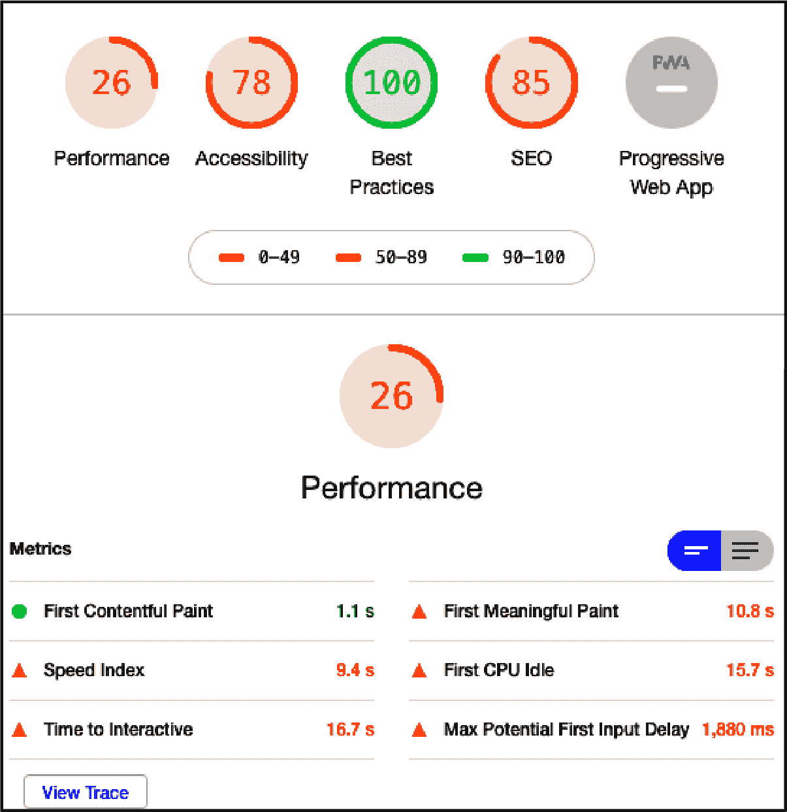
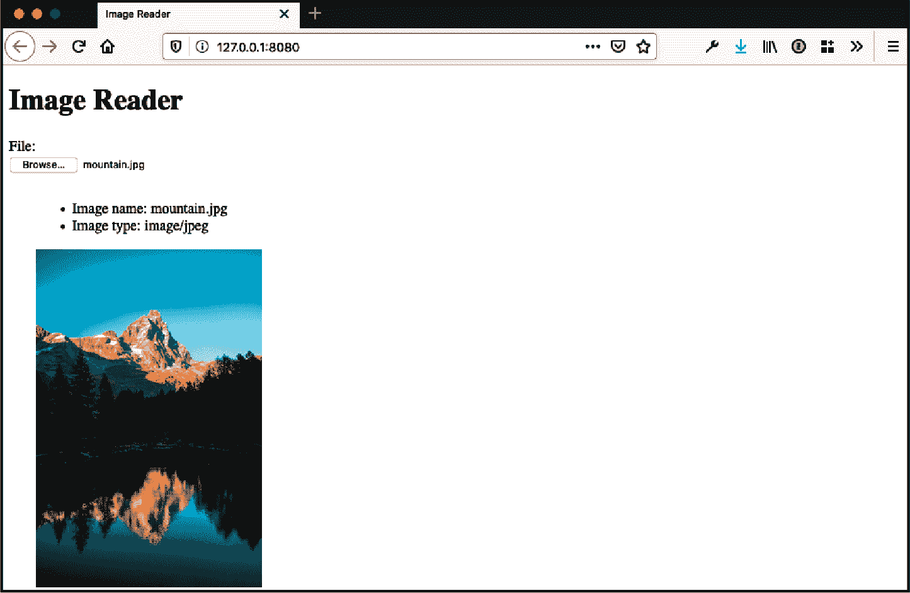

# 第十六章：写作 Web 应用程序

尽管 JavaScript 曾经用于向网页添加简单的交互功能，但今天它可以用于构建复杂和功能完善的软件应用程序，在 Web 浏览器中运行。可能性包括地图、电子邮件客户端、流媒体视频站点、实时聊天应用程序等等。网站和应用程序之间的界限可能模糊，但一种思考方式是，应用程序是任何接受用户输入并返回结果的站点。

作为开发者，你可以开发这些应用并立即在全球范围内部署，但这种能力带来了独特的挑战。随着应用程序代码库的增长，你需要将代码库拆分为更小的模块，并确保用户接收到优化的代码包。你需要创建与原生移动应用程序相竞争的功能和体验，例如离线功能、通知和应用程序图标。幸运的是，现代 JavaScript 和浏览器 API 使这些功能丰富的体验成为可能。

# 打包 JavaScript

## 问题

你希望在浏览器环境中使用 JavaScript 模块。

## 解决方案

利用原生 JavaScript 模块或打包工具，如[Webpack](https://webpack.js.org)。

现代浏览器中支持原生 JavaScript 模块。如果我们有一个简单的模块导出一个值，命名为`mod.js`：

```
export const name = 'Riley';
```

我们可以在 HTML 文件中原生地使用模块：

```
<script type='module'>
  import {name} from './mod.js';
  console.log(name);
</script>
```

对于更高级的应用程序和站点，你可能会从使用一个能够优化你的模块的打包工具中受益。要将 Webpack 用作打包工具，首先使用 npm 安装其依赖项：

```
$ npm install webpack webpack-cli --save-dev
```

###### 注意

在能够从 npm 安装包之前，你的项目将需要一个*package.json*文件。要生成此文件，请确保你在项目目录的根目录中，并输入`npm init`。然后，命令行界面将指导你完成一系列提示。有关安装和使用 npm 的其他信息，请参阅第一章。

然后，我们可以在项目目录的根目录中创建一个名为*webpack.config.js*的文件，在其中指定入口文件和输出目录：

```
const path = require('path');

module.exports = {
  entry: './src/index.js',
  output: {
    filename: 'bundle.js',
    path: path.resolve(__dirname, 'dist')
  }
};
```

最后，在*package.json*中添加一个脚本来运行 Webpack 构建：

```
"scripts": {
  ...
  "build": "webpack"
}
```

## 讨论

JavaScript 模块现在广泛可用并受浏览器支持。这使我们能够将我们的代码分解为更小、更易维护的部分。

Webpack 是一个流行的编译 JavaScript 模块的工具。Webpack 的强大之处在于配置文件。

在之前的配置文件中，我们指示 Webpack 查看*src*目录中名为*index.js*的文件。这个文件将是我们项目 JavaScript 的入口文件：

```
import foo from './foo.js';
import bar from './bar.js';

foo();
bar();
```

*index.js*文件正在导入另外两个文件，*foo.js*和*bar.js*。

当运行`build`脚本时，Webpack 将在*dist*目录中输出一个名为*bundle.js*的新的压缩文件。

编译简单的导入语句只是冰山一角。Webpack 可用于热模块重载、代码拆分、浏览器支持的填充以及作为开发服务器使用。在“JavaScript 与移动 Web”中，我们将探讨 Webpack 如何用于减少 JavaScript 捆绑包的大小。

## 额外：使用 npm 模块

除了使用自己的模块之外，Webpack 还使您能够直接从[npm](https://www.npmjs.com)下载和使用模块。为此，请先安装模块并将其保存为项目的依赖项：

```
$ npm install some-module --save
```

然后，您可以直接在代码中要求模块，而无需指定模块的路径：

```
import some-code from 'some-module'
```

# JavaScript 与移动 Web

## 问题

您的网站或应用程序使用 JavaScript，这可能会显著增加在移动设备和慢速连接上加载的时间。

## 解决方案

对于仅使用少量 JavaScript 的单个文件站点，请使用像[UglifyJS](https://github.com/mishoo/UglifyJS)这样的工具来缩小您的 JavaScript。缩小将通过删除不必要的字符（例如空格）来减少 JavaScript 文件的大小。

要使用 UglifyJS，请先通过 npm 安装它：

```
$ npm install uglify-js
```

接下来，在您的*package.json*文件中添加一个脚本，指定输入 JavaScript 文件和缩小后的文件名：

```
"scripts": {
  "minify": "uglifyjs index.js --output index.min.js"
}
```

对于具有多个 JavaScript 文件的较大站点和应用程序，请使用捆绑工具，例如[Webpack](https://webpack.js.org)，执行缩小、代码拆分、树摇和延迟加载的组合。

Webpack 在生产模式下会自动对其输出进行缩小，因此不需要特定的配置或缩小工具。

代码拆分是生成多个捆绑包的过程，因此 HTML 页面或模板仅加载它们所需的代码。以下*webpack.config.js*文件将在*dist*目录中输出两个 JavaScript 文件（*index.bundle.js*和*secondary.bundle.js*）：

```
const path = require('path');

module.exports = {
  entry: {
    index: './src/index.js',
    secondary: './src/secondary.js',
  },
  output: {
    filename: '[name].bundle.js',
    path: path.resolve(__dirname, 'dist'),
  },
};
```

捆绑包的大小可能会激增，特别是在导入可能不需要的第三方库功能时。 *树摇* 是消除死代码或未使用代码的概念。Webpack 可以通过`optimization`设置进行配置以消除死代码：

```
module.exports = {
  mode: 'development',
  entry: {
    index: './src/index.js',
    secondary: './src/secondary.js'
  },
  output: {
    filename: '[name].bundle.js',
    path: path.resolve(__dirname, 'dist')
  },
  optimization: {
    usedExports: true
  }
};
```

进行代码拆分的最后一步是在项目的*package.json*文件中添加一个`sideEffects`字段。根据 Webpack 文档，“*side effect*”被定义为在导入时执行特殊行为的代码，除了暴露一个或多个导出。一个*side effect*的示例可能是全局填充，它不会暴露任何`export`语句。

如果不存在这样的文件，我们可以在*package.json*中设置以下内容：

```
"sideEffects": false
```

如果您的项目确实包含 JavaScript 文件，这些文件将属于“side effect”类别，我们可以将它们作为一个数组提供：

```
"sideEffects": [
  "./src/file-with-side-effect.js"
]
```

最后，我们可以利用 Webpack 实现 JavaScript 模块的延迟加载，仅在用户与浏览器交互时加载它们。Webpack 通过动态的 `import` 语句使此过程变得简单。在 *src* 目录中有一个名为 *button.js* 的文件，当用户点击按钮时，文件的内容可以被加载。在 *index.js* 中：

```
const buttonElement = document.getElementById('button');
buttonElement.onclick = e =>
  import(/* webpackChunkName: "button" */ './button').then(module => {
    const button = module.default;
    button();
  });
```

## 讨论

最快的 JavaScript 是没有 JavaScript；然而，现代 Web 应用程序的交互需求通常依赖于客户端 JavaScript。考虑到这一点，我们的目标是限制用户浏览器下载的 JavaScript 的数量和文件大小。利用诸如代码缩小、代码分割、摇树和延迟加载等策略，可以更精细地控制用户浏览器中加载的 JavaScript 的大小和数量。

## 参见

Webpack 的[入门指南](https://oreil.ly/TAnYG)是关于代码打包和 Webpack 配置文件的有用介绍。

# 编写渐进式 Web 应用程序

## 问题

你想让你的 Web 应用程序利用本机应用程序功能，例如快速加载时间、离线功能和应用程序启动图标。

## 解决方案

将你的 Web 应用程序转变为渐进式 Web 应用程序（PWA）。术语“渐进式 Web 应用程序”用来描述一组技术，这些技术结合在一起，使得 Web 应用程序可以使用类似本机应用程序的功能，例如离线功能和用户安装的应用程序图标，同时使用标准的 Web 技术构建和部署到 Web。

所有 PWA 都需要包含超出典型网页的两个功能：

应用程序清单

为浏览器定义特定应用程序功能。

服务工作者

启用应用程序的离线功能。

创建渐进式 Web 应用程序的第一步是添加 Web 应用程序清单文件。该文件使开发人员可以控制应用程序图标、启动画面、浏览器显示样式和视图方向等内容。在名为 *manifest.json* 的文件中：

```
{
  "name": "JavaScript Everywhere",
  "short_name": "JavaScript",
  "start_url": "/index.html",
  "display": "standalone",
  "background_color": "#ffc40d",
  "theme_color": "#ffc40d",
  "icons": [
    {
      "src": "/images/icons/icon-192x192.png",
      "sizes": "192x192",
      "type": "image/png"
    },
    {
      "src": "/images/icons/icon-512x512.png",
      "sizes": "512x512",
      "type": "image/png"
    }
  ]
}
```

现在，在你的 HTML 文件或模板中，在文档的 `<head>` 中添加对清单文件和适当应用程序图标的引用。

##### 示例 16-1\. PWA 元标签

```
<!-- link to manifest.json file -->
<link rel="manifest" href="manifest.json" />
<!-- link to iOS icons -->
<link rel="apple-touch-icon" sizes="180x180" href="images/icons/apple-touch-icon.png" />
<!-- Microsoft application tile icons and color settings -->
<meta name="msapplication-TileColor" content="#ffc40d" />
<meta name="msapplication-TileImage" content="/img/icons/mstile-310x310.png" />
<!-- set theme color -->
<meta name="theme-color" content="#ffc40d" />
```

当网站符合 PWA 标准时（参见图 16-1），Chrome 会自动触发 PWA 安装提示。一旦安装完成，PWA 的图标会出现在用户设备上，就像本机应用程序一样（参见图 16-2）。


###### 图 16-1\. PWA 安装提示



###### 图 16-2\. 应用程序可以保存到移动设备上

第二步是创建服务工作线程。服务工作线程是一个独立于页面运行的脚本，为我们提供一种方式使我们的站点脱机工作、运行更快，并添加后台功能的能力。在移动连接的限制下，服务工作线程为我们提供一种构建首次脱机能力应用程序的方式，这些应用程序将在用户首次访问站点后加载内容，而不管网络条件如何。最重要的是，服务工作线程真正是一种渐进增强，为支持的浏览器增加了额外的功能，而不会改变非支持浏览器用户的站点功能。

当引入服务工作线程时，初始步骤是向用户的浏览器注册包含我们服务工作线程代码的脚本。为了实现这一点，请在页面底部，在闭合`</body>`标签之前添加脚本注册：

```
<!-- initiate the service worker -->
<script>
  if ('serviceWorker' in navigator) {
    window.addEventListener('load', function() {
      navigator.serviceWorker
        .register('service-worker.js')
        .then(reg => {
          console.log('Service worker registered!', reg);
        })
        .catch(err => {
          console.log('Service worker registration failed: ', err);
        });
    });
  }
</script>
```

此脚本检查服务工作线程的支持情况，如果支持可用，则指向服务工作线程脚本（在本例中为 *service-worker.js*）。为了调试目的，脚本还会捕获错误并记录到控制台。

在 *service-worker.js* 文件中，开始通过指定缓存版本并列出浏览器应该缓存的文件，设置 `install`、`fetch` 和 `activate` 事件监听器。

```
var cacheVersion = 'v1';

filesToCache = [
  'index.html',
  '/styles/main.css',
  '/js/main.js',
  '/images/logo.svg'
]
```

###### 注意

对于网站的更改，需要更新`cacheVersion`，否则用户可能会从缓存中获取内容。

现在，在 *service-worker.js* 文件中，设置 `install`、`fetch` 和 `activate` 事件监听器。`install` 事件为浏览器提供了安装缓存文件的指令。`fetch` 事件通过指示浏览器加载缓存文件或通过网络接收的文件来处理 fetch 事件。最后，当服务工作线程被激活时触发 `activate` 事件，可以用于检查缓存中的现有项目，并在存在更新的 `cacheVersion` 和文件不再在 `filestoCache` 列表中时移除它们（见 图 16-3）。

```
const cacheVersion = 'v1';

const filesToCache = ['index.html', '/styles/main.css', '/js/main.js'];

self.addEventListener('install', event => {
  console.log('Service worker install event fired');
  event.waitUntil(
    caches.open(cacheVersion).then(cache => {
      return cache.addAll(filesToCache);
    })
  );
});

self.addEventListener('fetch', event => {
  console.log('Fetch intercepted for:', event.request.url);
  event.respondWith(
    caches.match(event.request).then(cachedResponse => {
      if (cachedResponse) {
        return cachedResponse;
      }
      return fetch(event.request);
    })
  );
});

self.addEventListener('activate', event => {
  event.waitUntil(
    caches.keys().then(keyList => {
      return Promise.all(
        keyList.map(key => {
          if (key !== cacheVersion) {
            return caches.delete(key);
          }
        })
      );
    })
  );
});
```



###### 图 16-3\. 配备服务工作线程后，应用可以在离线状态下加载文件。

## 讨论

渐进式 Web 应用是一种用户可安装的 Web 应用程序，具有某种离线功能。这些特性使 Web 应用程序能够紧密模仿原生应用程序的最佳特性，同时提供开放 Web 的好处。

Web 应用清单是一个提供有关应用程序信息的 JSON 文件。它可以包含的所有关键值的完整列表如下：

`background_color`

用于占位启动屏幕背景的颜色代码。

`categories`

应用程序所属类别的字符串数组。

`description`

应用程序的字符串描述。

`dir`

显示字符的方向。可以是`auto`、`ltr`（从左到右）或`rtl`（从右到左）。

`display`

首选的显示模式。可以是`browser`，表示默认的浏览器行为，或者是`fullscreen`，在某些设备上会减少浏览器的外壳。

`iarc_rating_id`

国际年龄评级值。

`icons`

一个链接到图标图像和描述的对象数组。

`lang`

标识应用程序的主要语言。

`name`

应用程序名称。

`orientation`

允许开发人员设置应用程序的默认方向。

`prefer_related_applications`

如果设置为`true`，允许开发人员指定应安装的相关应用程序，而不是 Web 应用程序。

`related_applications`

包含一系列相关本地应用程序列表的对象数组。

`scope`

包含应用程序的导航范围的字符串。指定范围会限制应用模式下的导航到该目录。

`screenshots`

一个应用程序截图数组。

`short_name`

应用程序名称的缩短版本，用于在显示完整名称太长时的上下文中使用。

`start_url`

用户启动应用程序时应该打开的 URL。

`theme_color`

定义应用程序的默认主题颜色的字符串。

[W3C 提供了一个示例](https://oreil.ly/zlk9P)，展示了一个面向 Web 游戏的强大清单文件：

```
{
  "lang": "en",
  "dir": "ltr",
  "name": "Super Racer 3000",
  "description": "The ultimate futuristic racing game from the future!",
  "short_name": "Racer3K",
  "icons": [{
    "src": "icon/lowres.webp",
    "sizes": "64x64",
    "type": "image/webp"
  },{
    "src": "icon/lowres.png",
    "sizes": "64x64"
  }, {
    "src": "icon/hd_hi",
    "sizes": "128x128"
  }],
  "scope": "/racer/",
  "start_url": "/racer/start.html",
  "display": "fullscreen",
  "orientation": "landscape",
  "theme_color": "aliceblue",
  "background_color": "red",
  "screenshots": [{
    "src": "screenshots/in-game-1x.jpg",
    "sizes": "640x480",
    "type": "image/jpeg"
  },{
    "src": "screenshots/in-game-2x.jpg",
    "sizes": "1280x920",
    "type": "image/jpeg"
  }]
}
```

除了 Web 应用清单文件外，某些平台（如 iOS 和 Windows）还需要提供额外的信息，这些信息可以通过 HTML 元标签提供。在示例 16-1 中，元标签用于定义主题颜色、iOS 图标和 Windows 平铺设置。

###### 提示

为所有不同的设备类型和分辨率生成图标可能是一件繁琐的事情，因此我建议使用[RealFaviconGenerator](https://oreil.ly/ALsQe)。

服务工作线程是浏览器在后台运行的脚本，与页面的渲染和执行并行进行。由于它是一个“工作线程”，因此服务工作线程无法直接访问 DOM，但这种并行脚本能够实现各种新的用例。其中最令人兴奋的用例之一是能够缓存应用程序的各个部分以供离线使用。在上面的示例中，我正在缓存一个 HTML、JavaScript 和 CSS 文件，以便在离线时提供一个完整的（尽管是最小化的）站点体验。其他用例可能包括创建一个独立的离线体验或缓存共享模板标记和样式，通常称为“应用程序外壳”。

在使用服务工作线程时，需要注意一些限制：

+   使用服务工作线程的站点必须通过 HTTPS 提供。

+   当用户处于私密浏览模式时，服务工作线程不起作用。

+   由于服务工作线程在浏览器中作为一个独立的线程运行，因此它们无法访问 DOM。

+   服务工作线程是有作用域的，这意味着它们应该放置在应用程序的根目录中。

+   缓存存储大小可能因浏览器和用户硬盘空间的可用情况而异。

尽管在上述示例中手动创建了服务工作者，但对于更大的应用程序来说，这很快就变得难以管理。由 Google 创建的 [Workbox](https://oreil.ly/Gu3Z6) 库是用于管理 Web 应用程序中服务工作者和离线功能的包。Workbox 大大简化了版本控制和缓存管理的痛点，以及背景同步和预缓存等高级功能。

渐进式 Web 应用程序对 Web 是一大步进，它与框架无关，这意味着可以使用简单的 HTML、CSS 和 JavaScript 构建，也可以使用最新的 JavaScript 框架。在本节中，我们只是浅尝这些技术的强大之处。Tal Alter 的书籍 [*Building Progressive Web Apps*](http://shop.oreilly.com/product/0636920052067.do)（O’Reilly 出版）详细介绍了渐进式 Web 应用程序的特性和功能。

# 测试和分析渐进式 Web 应用程序

## 问题

您希望测试是否成功满足了渐进式 Web 应用程序的要求。

## 解决方案

使用 [Lighthouse](https://oreil.ly/hEdHB) 来审计性能、可访问性、最佳实践、SEO 和渐进式 Web 应用程序标准。访问网站（无论是在生产环境还是本地 Web 服务器上），然后单击“生成报告”（见图 Figure 16-4）。

Lighthouse 随后将生成报告，提出任何分数降低的建议性改进（参见图 16-5 和 16-6）。



###### 图 16-4\. Chrome 开发者工具中的 Lighthouse



###### 图 16-5\. 高分表明应用程序性能优越，是成功的渐进式 Web 应用。



###### 图 16-6\. 分数低的站点还将获得改进建议

###### 注意

关于在 Chrome 开发者工具中使用 Lighthouse 对非渐进式 Web 应用程序站点进行性能分析的一般用法更详细地介绍在 “Using Lighthouse to Measure Best Practices” 中。

## 讨论

Lighthouse 是一款测量 Web 最佳实践的工具，包括性能和渐进式 Web 应用程序兼容性。它内置于 Chrome 开发者工具中，但也可以作为 Firefox 扩展安装。

除了作为浏览器工具外，Lighthouse 还可以通过 npm 安装，并且可以在命令行中使用或作为 Node 模块使用。您可以像安装其他 Node 模块一样安装 Lighthouse：

```
$ npm install -g lighthouse
```

然后可以通过传递 URL 作为参数来运行：

```
$ lighthouse https://www.oreilly.com/
```

通过传递 `--view` 参数将在浏览器中打开结果：

```
$ lighthouse https://www.oreilly.com/ --view
```

您还可以指定输出文件类型和位置来存储报告结果：

```
$ lighthouse https://www.oreilly.com/ --view --output html --output-path ./report.html
```

*budget.json* 文件可用于设置和测试性能预算限制。在 *budget.json* 文件中，定义要测试的限制：

```
[
  {
    "path": "/*",
    "timings": [
      {
        "metric": "interactive",
        "budget": 3000
      },
      {
        "metric": "first-meaningful-paint",
        "budget": 1000
      }
    ],
    "resourceSizes": [
      {
        "resourceType": "script",
        "budget": 125
      },
      {
        "resourceType": "total",
        "budget": 300
      }
    ],
    "resourceCounts": [
      {
        "resourceType": "third-party",
        "budget": 10
      }
    ]
  }
]
```

###### 提示

谷歌 Chrome 团队维护着一个包含 *budget.json* 选项文档的[存储库](https://github.com/GoogleChrome/budget.json)。

从命令行本地测试对本地开发有帮助，但作为代码模块使用 Lighthouse 的真正威力在于与 GitHub Actions、Circle CI、Jenkins 和 Travis CI 等持续集成工具一起使用。[Lighthouse CI](https://github.com/GoogleChrome/lighthouse-ci) 模块使您能够在持续集成流水线中执行 Lighthouse 测试，例如在每个 GitHub 拉取请求上。

这是 CircleCI 的一个示例配置：

```
version: 2.1
jobs:
  build:
    docker:
      - image: circleci/node:10.16-browsers
    working_directory: ~/your-project
    steps:
      - checkout
      - run: npm install
      - run: npm run build
      - run: sudo npm install -g @lhci/cli@0.3.x
      - run: lhci autorun
```

在 Google 的[入门指南](https://oreil.ly/7jnwx)中可以找到如何在多个 CI 环境中使用 Lighthouse 的详细信息。

# 获取当前 URL 的值

## 问题

您的应用程序需要读取当前 URL 的值。

## 解决方案

使用 `window.location` 的 `href` 属性来读取当前完整 URL 的值：

```
const URL = window.location.href;
```

## 讨论

`window.location` 提供了关于当前文档位置或 *location* 的只读信息。`href` 属性提供了完整的 URL，包括协议（如 HTTPS）、主机名、当前文档的路径和任何查询字符串。所有这些将与用户的 URL 栏中显示的内容匹配：

```
const URL = window.location.href;
// logs https://www.jseverywhere.io/example
console.log(`The current URL is ${URL}`);
```

###### 注意

全局变量 `location` 与 `window.location` 相同；但我更喜欢使用 `window` API 来表达清晰。

`href` 属性并非唯一有用的属性。如果您已经知道用户在您的站点上，访问 `pathname` 和 `search` 属性可能更有用：

```
// user is at https://www.jseverywhere.io/example?page=2

const PATH = window.location.pathname;
// logs /example/
console.log(`The current path is ${PATH}`);

const QUERY = window.location.search;
// logs ?page=2
console.log(`The current query parameter is ${QUERY}`)
```

`window.location` 的全部只读属性列表如下：

`hash`

URL 中的哈希值，例如 `#id`

`host`

域名加端口

`hostname`

域名

`href`

完整 URL

`origin`

协议、主机名和端口

`pathname`

当前文档的路径

`port`

服务器端口号值

`protocol`

协议（HTTP 或 HTTPS）

`search`

查询字符串值

# 重定向 URL

## 问题

你需要使用 JavaScript 将用户路由到另一页。

## 解决方案

根据重定向目的，可以使用 `window.location` 的 `assign` 或 `replace` 方法：

```
// route user to new page & preserve browser history
window.location.assign('https://www.example.com');
// route user to new page but do not preserve current page in history
window.location.replace('https://www.example.com');
```

`window.location.assign` 方法会将用户路由到一个新 URL，但会保留浏览器历史记录中的当前页面。这意味着用户可以使用浏览器的返回按钮返回该页面。相反，`window.location.replace` 会替换历史记录中的当前 URL，禁用返回到当前页面的功能。

## 讨论

通过使用`window.location`方法，您可以使用 JavaScript 将用户路由到新的 URL。这使您能够根据页面交互重新路由用户或重定向用户。`assign` 和 `replace` 不是您唯一可以使用的 `window.location` 方法。完整的方法列表如下：

`.assign()`

将用户的浏览器导航到给定的 URL

`.reload()`

重新加载页面

`.replace()`

将用户的浏览器导航到给定的 URL，并从浏览器历史记录中删除当前文档

`toString()`

将当前 URL 作为字符串返回

通过利用这些方法，您将能够使用 JavaScript 来操纵页面的路由，这可以为应用程序 UI 和交互式路由提供有用的功能。尽管在开发应用程序时这些功能非常有用，但应始终使用 HTTP 重定向执行完整页面重定向，具体的状态码为 301 表示永久重定向或 302 表示临时重定向。

###### 注意

流行的 JavaScript 框架带有路由库或可以通过第三方路由库进行扩展，用于强大的客户端路由。

# 将文本复制到用户的剪贴板

## 问题

您的应用程序需要复制文本，例如共享链接，到用户的剪贴板。

## 解决方案

要将文本复制到用户的剪贴板，将文本放在文本`input`或`textarea`元素内，并使用`navigator.clipboard.writeText`方法复制文本。

在你的 HTML 中，包括表单元素以及一个按钮。在示例中，我为输入元素设置了一个明确的`value`。这个值也可以由用户或者在代码中动态设置：

```
<input type="text" id="copy-text" value="https://example.com/share/12345">
<button id="copy-button">Copy To Clipboard</button>
```

并在相应的 JavaScript 中，向`button`元素添加事件处理程序。当点击按钮时，使用`select`方法选择`input`元素内的文本，然后使用`navigator.clipboard.writeText()`将文本复制到用户的剪贴板，如示例 16-2 所示。

##### 示例 16-2\. 复制文本到剪贴板

```
const copyText = document.getElementById('copy-text');
const copyButton = document.getElementById('copy-button');

const copyToClipboard = () => {
  copyText.select();
  navigator.clipboard.writeText(copyText.value);
};

copyButton.addEventListener('click', copyToClipboard);
```

## 讨论

在 Web 应用程序中经常看到从文本输入框向用户剪贴板添加文本的常见 UI 模式，例如 GitHub 和 Google Docs。这可以是一个有用的功能，用于简化用户共享信息或 URL 的方式。主要食谱中演示的输入和按钮模式是最常见的使用方式，但有时您可能希望从页面内容的用户选择中复制。在这种情况下，隐藏表单控件可能会很有用。为此，请包括页面内容的标记以及一个`textarea`或`input`元素。在本例中，我使用了一个`textarea`元素，并将`tabindex`设置为将其从用户的标签流中移除，然后将`aria-hidden`设置为`true`，以便屏幕阅读器知道忽略该元素。

```
<p>Some example text<p>

<textarea id="copy-text" tabindex="-1" aria-hidden="true"></textarea>
<button id="copy-button">Copy the Highlighted Text</button>
```

在我的 CSS 中，我通过将元素放在屏幕外并设置高度和宽度值为`0`来隐藏该元素：

```
#copy-text {
  position: absolute;
  left: -9999px;
  height: 0;
  width: 0;
}
```

最后，在我的 JavaScript 中，我遵循类似于示例 16-2 的模式，此外还使用`document.getSelection()`来获取用户在页面上选择的任何文本的值：

```
const copyText = document.getElementById('copy-text');
const copyButton = document.getElementById('copy-button');

const copyToClipboard = () => {
  const selection = document.getSelection();
  copyText.value = `${selection} — Check out my highlight at https://example.com `;
  copyText.select();
  navigator.clipboard.writeText(copyText.value);
}

copyButton.addEventListener('click', copyToClipboard);
```

在社交网络时代，使 Web 应用程序内容易于分享是一种常见模式。使用这些技术提供了简化交互的模式。

# 在桌面浏览器中启用类似移动设备的通知

## 问题

您需要一种方式来通知用户事件已发生或长时间运行的过程已完成，即使您的网站在活动选项卡中未打开。

## 解决方案

使用 Web 通知 API。

此 API 提供了一种相对简单的技术，可以在浏览器之外弹出通知窗口，因此如果某人当前正在另一个选项卡中查看网页，则仍会看到通知。

要使用 Web 通知，确实需要获取权限。在以下代码中，当用户点击按钮时请求通知权限。如果授予权限，则显示通知：

```
const notificationButton = document.getElementById('notification-button');

const showNotification = permission => {
  // if the user didn't grant permission, exit the function
  if (permission !== 'granted') return;

  // content of the notification
  const notification = new Notification('Title', {
    body: 'Check out this super cool thing'
  });

  // optional: action to take when a user clicks the notification
  notification.onclick = () => {
    window.open('https://example.com');
  };
};

const notificationCheck = () => {
  // if notifications aren't supported return
  // alternately you could perform a different action
  // like redirect the user to email signup
  if (!window.Notification) return;

  // request permission from the user
  Notification.requestPermission().then(showNotification);
};

// on click, call the `notificationCheck` function
notificationButton.addEventListener('click', notificationCheck);
```

## 讨论

移动环境中有通知功能，可以让您知道在 Facebook 帖子上收到新的“赞”或在电子邮件客户端中收到新的电子邮件。传统上，在桌面环境中我们没有这种功能，尽管有些人可能会认为这是件好事。

尽管如此，随着我们创建更复杂的 Web 应用程序，拥有此功能可能会有所帮助，特别是当我们的应用程序可能需要较长时间。而不是迫使人们在我们的页面上挂着“工作”图标，网页访问者可以在其他选项卡中查看其他网页，并知道当长时间运行的进程完成时会收到通知。

在解决方案中，第一次代码创建新通知时，它会从网页访问者那里获取权限。如果您的应用程序是作为独立的 Web 应用程序创建的，您可以在清单文件中指定权限，但对于网页，则必须请求权限。

在通知权限请求之前，您还可以测试通知是否存在，这样如果不支持它，就不会抛出错误：

```
if (window.Notification) {
  Notification.requestPermission(() => {
    setTimeout(() => {
      const notification = new Notification('hey wake up', {
        body: 'your process is done',
        tag: 'loader',
        icon: 'favicon.ico'
      });
      notification();
    }, 5000);
  });
}
```

通知接受两个参数——标题字符串和带有选项的对象：

`body`

通知正文中的文本消息

`tag`

用于标识全局更改通知的标签

`icon`

自定义图标

`lang`

通知的语言

`dir`

语言的方向

您还可以编写四个事件处理程序：

+   `onerror`

+   `onclose`

+   `onshow`

+   `onclose`

您还可以使用`Notification.close()`来以编程方式关闭通知，尽管 Safari 和 Firefox 会在几秒钟内自动关闭通知。所有浏览器在通知中提供窗口关闭（*x*）选项。

## 额外信息：Web 通知和页面可见性 API

您可以将 Web 通知与页面可见性 API 结合使用，以便仅在网页访问者没有主动查看网页时显示通知。

页面可见性 API 在现代浏览器中得到广泛支持。它增加了一个事件支持，`visibilitychange`，当标签页的可见性发生变化时触发。它还支持几个新属性 — `document.hidden` 返回 true 如果标签页不可见，`document.visibilityState` 可能有以下四个值之一：

+   `visible`: 当标签页可见时

+   `hidden`: 当标签页被隐藏时

+   `prerender`: 页面正在呈现但尚未可见（浏览器支持是可选的）

+   `unloaded`: 页面正在从内存中卸载（浏览器支持是可选的）

要修改解决方案，以便通知仅在选项卡页面隐藏时触发，请修改代码以检查 `visbilityState`：

```
if (window.Notification) {
  Notification.requestPermission(() => {
    setTimeout(() => {
      if (document.visibilityState === 'hidden') {
        const notification = new Notification('hey wake up', {
          body: 'your process is done',
          icon: 'favicon.ico'
        });
        notification();
      } else {
        document.getElementById('result').innerHTML = 'your process is done';
      }
    }, 5000);
  });
}
```

在创建通知之前，代码会测试页面是否隐藏。如果是，则创建通知。如果不是，则在页面上写入一条消息。

# 在浏览器中本地加载文件

## 问题

您想要在浏览器中打开图像文件并输出元数据。

## 解决方案

使用文件 API：

```
const inputElement = document.getElementById('file');

function handleFile() {
  // read the contents of the file
  const file = this.files[0];
  const reader = new FileReader();
  // add 'load' event listener
  reader.addEventListener('load', event => {
    // once loaded do something with the contents of the file
  });
  reader.readAsDataURL(file);
}

inputElement.addEventListener('change', handleFile, false);
```

## 讨论

文件 API 添加到现有的 `file` 类型输入元素中，用于文件上传。除了通过表单上传将文件上传到服务器的功能外，现在还可以直接在 JavaScript 中访问文件，可以在本地处理文件，或者将文件上传到服务器。

###### 注意

欲了解更多关于 `FileReader` 的内容，请查看 MDN 的 [API 页面](http://mzl.la/1ya0o1k)，以及一个 [相关教程](http://mzl.la/1ya0qGs)。

文件 API 中有三个对象：

`FileList`

一个通过 `input type="file"` 上传文件的文件列表

`File`

关于特定文件的信息

`FileReader`

对象用于异步上传客户端访问的文件

每个对象都有关联的属性和事件，包括能够跟踪文件上传的进度（并提供自定义进度条），以及在上传完成时发出信号。`File` 对象可以提供有关文件的信息，包括文件名、大小和 MIME 类型。`FileList` 对象提供一个 `File` 对象列表，如果输入元素具有设置 `multiple` 属性，则可以指定多个文件。`FileReader` 是执行实际文件上传的对象。

示例 16-3 展示了一个上传图像、将其嵌入网页并显示有关图像的信息的应用程序。结果显示在 图 16-7 中。

##### 示例 16-3\. 加载图像和元数据

```
<!DOCTYPE html>
<head>
  <title>Image Reader</title>
  <meta charset="utf-8" />
  <style>
    #result {
      width: 500px;
      margin: 30px;
    }
  </style>
</head>
<body>
  <h1>Image Reader</h1>
  <form>
    <label for="file">File:</label> <br />
    <input type="file" id="file" accept=".jpg, .jpeg, .png" />
  </form>
  <div id="result">
    <ul>
      <li>Image name: <span id="name"></span></li>
      <li>Image type: <span id="type"></span></li>
    </ul>
  </div>

  <script>
    const inputElement = document.getElementById('file');
    const result = document.getElementById('result');
    const nameEl = document.getElementById('name');
    const typeEl = document.getElementById('type');

    function handleFile() {
      // read the contents of the file
      const file = this.files[0];
      const reader = new FileReader();
      // add 'load' event listener
      reader.addEventListener('load', event => {
        // create the image element and display it within the result div
        const img = document.createElement('img');
        img.setAttribute('src', event.target.result);
        img.setAttribute('width', '250');
        result.appendChild(img);
        // display the image name and file type
        const name = document.createTextNode(file.name);
        const type = document.createTextNode(file.type);
        nameEl.appendChild(name);
        typeEl.appendChild(type);
      });
      reader.readAsDataURL(file);
    }

    inputElement.addEventListener('change', handleFile, false);
  </script>
</body>
```



###### 图 16-7\. 使用文件 API 读取图像

###### 注意

文件 API 是 W3C 的一项工作。欲了解更多信息，您可以阅读 [最新草案](http://.w3.org/TR/FileAPI) 或 [Mozilla 的相关报道](http://mzl.la/1ya0qGs)。

# 通过 Web 组件扩展可能性

## 问题

您需要一个封装了特定外观、感觉和行为的组件，您可以像包含 HTML 元素一样轻松地包含它，但不希望使用 Web 框架。

## 解决方案

考虑 Web 组件，它允许您创建自定义且可重用的 HTML 元素。Web 组件包括模板、自定义元素和影子 DOM。每个都将在讨论中进行介绍。

## 讨论

想象一个完全自包含的网页小部件，并且它与 Web 组件有些相似，但仅限于表面上的相似性。作为术语，Web 组件涵盖了几种不同的构造。在接下来的章节中，我将介绍每一个，提供示例，讨论 polyfill，并展望未来。

### HTML 模板

`template` 元素现在是 HTML5 规范的一部分。目前在大多数现代浏览器中有[支持](https://oreil.ly/SJZDC)。在 `template` 元素内部，我们包含希望作为整体分组的 HTML 内容，直到被*克隆*之前都不会被实例化。它在加载时被解析以确保有效性，但实际上并不存在。但是。

使用模板非常直观。考虑今天的单页面 JavaScript 应用程序的常见做法：从 web 服务返回数据并将其格式化为无序列表 (`ul`)（或新段落、表格等）。通常，我们会使用 DOM 方法查询现有的 `ul` 元素，为列表中的每个列表项 (`li`) 创建，向项目添加文本，然后将项目附加到列表中。

如果我们能够省略一些步骤会怎么样？我们可以使用 `template`。考虑以下 HTML：

```
<template id="hello-world">
  <p>Hello world!</p>
</template>
```

这是将我们的“Hello World”模板添加到页面的 JavaScript：

```
const template = document.getElementById('hello-world');
const templateContent = template.content;
document.body.appendChild(templateContent);
```

在示例中，我们访问 `template` 元素，访问 HTML 元素的内容，然后使用 `appendChild()` 将其附加到 HTML 文档中。正如我所指出的，模板非常直观，但您可能会想知道，它的意义何在？我们所做的只是为一个已经很简单的过程增加了更多代码，但模板在自定义元素中的使用是非常重要的，详见“自定义元素”和“影子 DOM”。

### 自定义元素

Web 组件构造中引起最大兴趣的是自定义元素。与处理现有 HTML 元素及其默认行为和外观不同，我们创建一个自定义元素，打包其样式和行为，然后将其附加到网页上。自定义元素可以扩展现有元素，也可以是“自主”的，意味着它是一个全新的元素。在下面的示例中，我将扩展 HTML `<p>` 元素以创建一个名为 `<hello-world>` 的新元素。为此，我首先需要定义一个包含任何特殊方法的类：

```
class CustomGreeting extends HTMLParagraphElement {
  constructor() {
    // always call super first in constructor
    super();

    // any additional element functionality can be written here
  }
}
```

一旦类被定义，我就可以注册我的元素。请注意，元素名称必须包含连字符以避免与现有 HTML 元素可能的冲突：

```
customElements.define("custom-greeting", CustomGreeting);
```

现在我可以在我的 HTML 页面中使用我的元素：

```
<custom-greeting>Hello world!</custom-greeting>
```

### 影子 DOM

当我提到 *shadow DOM* 时，脑海中不禁浮现了虚构人物 “The Shadow”。多么伟大的角色，而且也很合适。只有阴影知道人们心中的邪恶，只有 shadow DOM 知道其元素 DOM 中隐藏了什么。

摆脱虚构的干扰，影子 DOM 是 Web 组件中最复杂的部分。但也同样引人入胜。

首先，非神秘的部分。影子 DOM 是一个 DOM，一个节点树，就像我们从 `document` 元素访问元素时一样。主要区别在于它不存在，不像我们知道 DOM 存在的方式。当我们为一个元素创建 *影子根* 时，它就存在了。但是，元素以前拥有的任何东西都不见了。这就是要记住的关键：创建它会替换元素的现有 DOM。

通过使用 `attachShadow` 方法，你可以将影子根附加到任何元素上：

```
const shadow = element.attachShadow({mode: 'open'});
```

`attachShadow` 方法接受一个参数（`mode`），可以接受值`open`或`closed`。将值设置为`open`允许你在页面上下文中访问影子 DOM，就像访问任何其他元素一样。最常见的影子 DOM 使用场景是作为构造函数的一部分将影子 DOM 附加到自定义元素上：

```
class CustomGreeting extends HTMLElement {
  constructor() {
    super();
    const shadow = this.attachShadow({mode: 'open'});
    const greeting = this.getAttribute('greeting') || 'world'
    shadow.innerHTML = `<p>
 Hello, <span class="greeting">${greeting}</span>
 </p>`;
  }
}
```

尽管上述示例包含两个 HTML 元素，全局 CSS 样式不会应用于影子 DOM 元素。要为具有影子 DOM 的自定义元素设置样式，我们将在自定义元素类中创建一个样式元素并应用样式：

```
class CustomGreeting extends HTMLElement {
  constructor() {
    super();
    const shadow = this.attachShadow({mode: 'open'});
    const greeting = this.getAttribute('greeting') || 'world'
    shadow.innerHTML = `<p class="wrapper">
 Hello, <span class="greeting">${greeting}</span>
 </p>`;

    // add css styles
    const style = document.createElement('style');

    style.textContent = `
 .wrapper {
 color: pink;
 }

 .greeting {
 color: green;
 font-weight: bold;
 }
 `;
  }
}
```

###### 小贴士

[Polymer 项目](https://oreil.ly/874AX) 是一组用于处理 Web 组件的库和工具。

Web 组件是 Web 标准生态系统中非常有趣的一部分，具有巨大潜力。HTML 模板、自定义 HTML 元素和影子 DOM 提供了一种创建小型、可重用 UI 组件的方法。这种轻量级组件的理念已经反映在诸如 React 和 Vue 等 JavaScript 库中。

# 选择前端框架

## 问题

你正在构建一个复杂的 Web 应用程序，需要一个 JavaScript 框架。如何选择合适的框架？

## 解决方案

曾经有一段时间，JavaScript 框架似乎比时装周的时尚风更快速地进入并退出流行。幸运的是，在过去几年中，框架之战已经减缓，留下了一些优秀的选择。尽管新开发的速度放缓，但为你和你的项目选择最佳框架仍然是具有挑战性的。在评估项目的框架时，我建议你问自己以下几个问题：

我是否需要一个 JavaScript 框架？

不要默认情况下总是使用框架。通常情况下，简单的网站和应用程序可能更容易编写和维护，同时对用户来说更具性能。

我将开发什么类型的项目？

这是一个个人项目吗？是客户项目吗？是需要长期支持的企业项目吗？还是开源项目？考虑项目的维护者以及什么样的框架最能满足他们的需求。

社区采用水平和项目的长期性如何？

考虑框架的长期支持情况。它仍然是一个活跃的项目吗？是否有一个大社区支持来回答问题和修复错误？

框架的文档编写得有多好？

确保文档易于理解和完整。

框架的开发者生态系统如何？

评估工具、插件和元框架。

我是否熟悉这个框架？

框架是您已经了解或熟悉的内容，还是一个学习项目？

这对我的用户有什么影响？

或许最重要的问题。确定一个框架是否会影响您项目的性能、可访问性或可用性。

虽然这远非详尽列表，但本书的作者建议查看以下框架：React、Vue、Svelte 和 Angular。

## React

[React](https://reactjs.org)是由 Facebook 开发和发布的 UI 驱动的 JavaScript 框架。React 专注于小型视觉组件，并通常使用`jsx`，这是 JavaScript 中的 XML 语法，用于渲染 HTML 组件。React 通过使用称为[virtual DOM](https://oreil.ly/oK21x)的 DOM 表示来使页面更新更有效率。

## Vue

[Vue](https://vuejs.org)是一个面向社区的、UI 驱动的框架。与 React 类似，Vue 利用虚拟 DOM 使页面更新即时化。许多人将 Vue 视为 React 的替代品。功能集类似，但 Vue 使用更友好的 HTML 模板语法，并且由社区支持，而不是由 Facebook 支持。我建议试试 React 和 Vue，看看哪个更符合您和您团队的开发风格。

## Svelte

[Svelte](https://svelte.dev)与这里的其他 JS 框架采取了不同的方法。类似于 React 和 Vue，它是一个 UI-focused 库，但与其在用户浏览器中执行大部分工作不同，Svelte 侧重于在开发构建时进行编译步骤。其目标是减少用户浏览器的负担，以便开发人员可以构建高性能的应用程序。

## Angular

[Angular](https://angular.io)是由 Google 开发和发布的功能齐全的 JavaScript 框架。Angular 在第一波“框架”战争中生存下来，并适应了类似于现代库的基于组件的架构。与 React、Vue 和 Svelte 不同，Angular 是一个开箱即用的完整框架，具有应用内导航、数据和状态管理以及内置测试等功能。对于许多企业专注的团队来说，这是一个有用的功能，因为在构建新应用程序或添加功能时可以限制决策。
