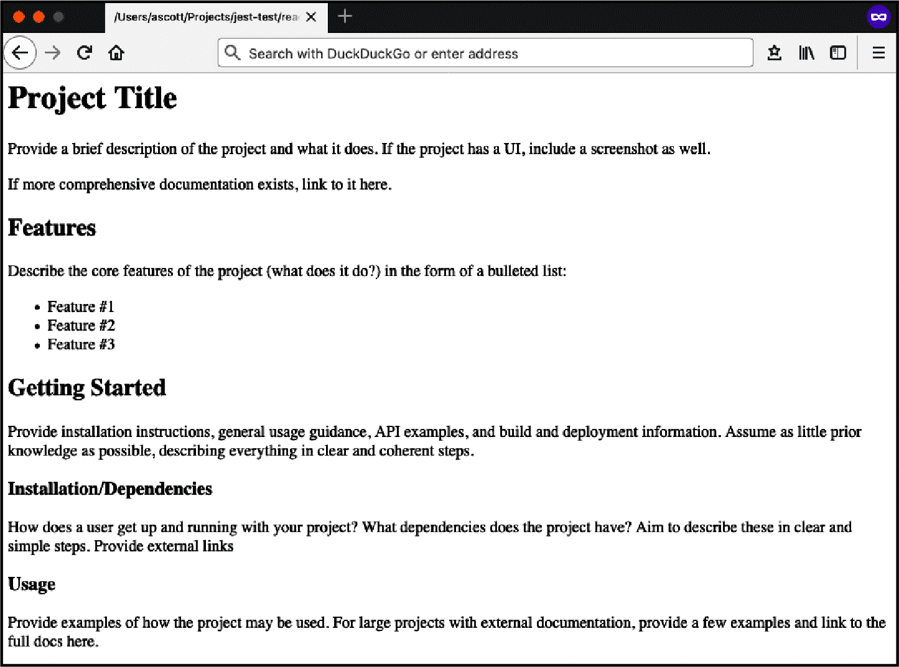
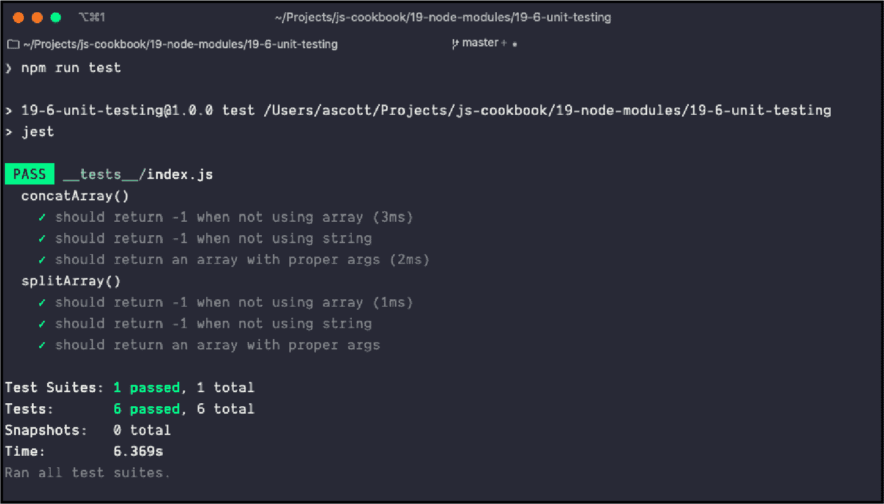

# 第十八章：Node 模块

编写 Node.js 应用程序的一个重要方面是环境提供的内置模块化功能。下载和安装任意数量的 Node 模块很简单，并且使用它们同样简单：只需包含一个`require()`语句命名模块，即可开始运行。

模块可以轻松整合的便利性是 JavaScript*模块化*的好处之一。模块化确保外部功能以不依赖于其他外部功能的方式创建，这被称为*松耦合*的概念。这意味着我可以使用`Foo`模块，而无需包含`Bar`模块，因为`Foo`与必须包含`Bar`之间有着紧密依赖的关系。

JavaScript 的模块化既是一种纪律，也是一种契约。纪律在于必须遵循一定的标准，以便外部代码参与模块系统。契约是我们之间，以及其他 JavaScript 开发者之间的：我们在模块系统中生产（或消费）外部功能时遵循一个共识的路径，我们都对模块系统有基于期望的期望。

###### 注意

应用程序和库管理以及发布的几乎所有方面都依赖于 Git，一个源代码控制系统，以及 GitHub，一个极其流行的 Git*终端点*。本书不涵盖 Git 的工作原理及其与 GitHub 的使用。我建议阅读 Richard Silverman（O'Reilly）的*[《Git Pocket Guide》](http://shop.oreilly.com/product/0636920024972.do)*，以更熟悉 Git，以及 GitHub 的[官方文档](https://github.com)以了解更多关于该服务的信息。

# 通过 npm 搜索特定的 Node 模块

## 问题

您正在创建一个 Node 应用程序，并希望使用现有的模块，但不知道如何发现它们。

## 解决方案

“使用 npm 下载包”解释了如何使用 npm 安装包，Node.js 流行的包管理器（也是维系 Node 生态系统的关键）。但您还没有考虑如何*查找*您在 npm 庞大的注册表中所需的有用包。

大多数情况下，您会通过朋友和共同开发者的推荐来发现模块，但有时您需要新的东西。您可以直接在[npm 网站](https://www.npmjs.org)上搜索新的模块。您也可以直接使用 npm 命令行界面来搜索模块。例如，如果您对能够处理 PDF 的模块感兴趣，请在命令行中运行以下搜索：

```
$ npm search pdf
```

## 讨论

npm 网站不仅提供了 npm 使用的文档，还提供了一个用于搜索模块的界面。如果您访问 npm 的每个模块页面，您可以查看模块的流行程度，其他模块对它的依赖情况，许可证以及其他相关信息。

然而，你也可以直接使用 npm 搜索模块。这个过程可能需要相当多的时间，当搜索结束时，你可能会得到大量的模块返回，尤其是对于像与 PDF 相关的模块这样的广泛主题。

你可以通过列出多个术语来细化结果：

```
$ npm search PDF generation
```

这个查询返回一个更小的模块列表，专门用于 PDF 生成。

一旦你找到一个听起来有趣的模块，你可以通过以下方式获取关于它的详细信息：

```
$ npm view electron
```

你可以从模块的*package.json*中获得有用的信息，该文件可以告诉你它依赖于什么，由谁编写，以及创建时间。我们仍然建议直接查看模块的 npm 网页和 GitHub 存储库页面。在那里，你将能够确定模块是否正在积极维护，了解模块的流行程度，查看未解决的问题，并查看源代码。

# 将你的库转换为 Node 模块

## 问题

你想在 Node 中使用你的一个库。

## 解决方案

将库转换为 Node 模块。在 Node 中，每个文件都被视为一个模块。例如，如果库是一个包含在`/lib/hello.js`文件中的函数：

```
const hello = val => {
  return console.log(`Hello ${val}`);
};
```

你可以使用`exports`关键字将其转换为 Node 模块：

```
const hello = val => {
  return console.log(`Hello ${val}`);
};

module.exports = hello;
```

或者，也可以直接`export`该函数：

```
module.exports = val => {
  return console.log(`Hello ${val}`);
};
```

然后你可以在你的应用程序中使用该模块：

```
var hello = require('./lib/hello.js');

// logs 'Hello world'
hello('world');
```

## 讨论

Node 的默认模块系统基于 CommonJS，使用三个构造：`exports`用于定义从库中导出的内容，`require()`用于将模块包含到应用程序中，以及`module`，它包含关于模块的信息，同时也可以用于直接导出一个函数。

如果你的库返回一个包含多个函数和数据对象的对象，你可以将每个函数和数据对象分配给`module.exports`上的同名属性，或者你可以返回一个对象：

```
const greeting = {
  hello: val => {
    return console.log(`Hello ${val}`);
  },
  ciao: val => {
    return console.log(`Ciao ${val}`);
  }
};

module.exports = greeting;
```

或者：

```
const hello = val => {
  return console.log(`Hello ${val}`);
};

const ciao = val => {
  return console.log(`Ciao ${val}`);
};

module.exports = { hello, ciao };
```

然后直接访问对象属性：

```
const greeting = require('./lib/greeting.js')

// logs 'Hello world'
greeting.hello('world');
// logs 'Ciao mondo'
greeting.ciao('mondo');
```

因为模块并未使用 npm 安装，而是只存在于应用程序所在的目录中，因此访问时使用文件位置和名称，而不仅仅是名称。

## 参见

在“在模块环境中使用你的代码”中，我们介绍了如何确保你的库代码在 CommonJS 和 ECMAScript 模块环境中都能正常工作。

在“创建可安装的 Node 模块”中，我们介绍了如何创建一个独立的模块。

# 在模块环境中使用你的代码

## 问题

你已经写了一个库，想与他人共享，但是人们使用各种 Node 版本，包括 CommonJS 和 ECMAScript 模块。你如何确保你的库在所有不同的环境中都能正常工作？

## 解决方案

使用带有 ECMAScript 模块包装的 CommonJS 模块。

首先，将库写成一个 CommonJS 模块，保存为*.cjs*文件扩展名：

```
const bbarray = {
  concatArray: (str, array) => {
    return array.map(element => {
      return `${str} ${element}`;
    });
  },
  splitArray: (str, array) => {
    return array.map(element => {
      return element.substring(str.length + 1);
    });
  }
};

module.exports = bbarray;
exports.concatArray = bbarray.concatArray;
exports.splitArray = bbarray.splitArray;
```

接着是一个使用*.mjs*文件扩展名的 ECMAScript 包装模块：

```
import bbarray from './index.cjs';

export const { concatArray, splitArray } = bbarray;
export default bbarray;
```

还有一个包含`type`、`main`和`exports`字段的*package.json*文件：

```
"type": "module",
"main": "./index.cjs",
"exports": {
  ".": "./index.cjs",
  "./module": "./wrapper.mjs"
},
```

使用 CommonJS 语法的我们模块的用户可以使用`require`语法导入模块：

```
const bbarray = require('bbarray');

bbarray.concatArray('is', ['test', 'three']);
bbarray.splitArray('is', ['is test', 'is three']);
```

或者：

```
const { concatArray, splitArray } = require('bbarray');

concatArray('is', ['test', 'three']);
splitArray('is', ['is test', 'is three']);
```

虽然使用 ECMAScript 模块的人可以指定`module`版本的库以使用 ES 的`import`语法：

```
import bbarray from 'bbarray/module';

bbarray.concatArray('is', ['test', 'three']);
bbarray.splitArray('is', ['is test', 'is three']);
```

或者：

```
import { concatArray, splitArray } from 'bbarray/module';

concatArray('is', ['test', 'three']);
splitArray('is', ['is test', 'is three']);
```

###### 注意

在撰写本文时，可以通过`--experimental-conditional-exports`标志避免 ECMAScript 模块使用`*/module*`命名约定。然而，由于当前的实验性质和语法未来可能发生变化的潜力，我们目前建议不要这样做。在未来的 Node 版本中，这可能会成为标准。您可以在[Node 文档](https://oreil.ly/Xzkid)中了解更多信息。

## 讨论

自从一开始，CommonJS 模块一直是 Node 的标准，诸如 Browserify 之类的工具将这种语法从 Node 生态系统中带出，允许开发人员在浏览器中使用 Node 风格的模块。ECMAScript 2015（也称为 ES6）标准引入了原生 JavaScript 模块语法，这在 Node 8.5.0 中首次引入，并可以在`--experimental-module`标志后使用。从 Node 13.2.0 开始，Node 直接支持 ECMAScript 模块。

一种常见的模式是使用 CommonJS 或 ECMAScript 模块语法编写模块，并使用编译工具将它们作为单独的模块入口点或导出路径进行发布。然而，如果应用程序直接通过一种语法加载模块，并且使用另一种语法直接加载或依赖加载该模块，可能会导致模块加载两次的风险。

在*package.json*中有三个关键字段：

```
"type": "module",
"main": "./index.cjs",
"exports": {
  ".": "./index.cjs",
  "./module": "./wrapper.mjs"
},
```

`"type"`

指定这是一个`module`，意味着此库使用 ECMAScript 模块语法。对于专门使用 CommonJS 的库，`"type"`将是`"commonjs"`。

`"main"`

指定应用程序的主入口点，我们将指向 CommonJS 文件。

`"exports"`

定义我们模块的导出路径。通过这种方式，使用默认`package`的消费者将直接接收 CommonJS 模块，而使用`package/module`的人将从 ECMAScript 模块包装器导入文件。

如果我们希望避免使用*.cjs*和*.mjs*文件扩展名，我们可以这样做：

```
"type": "module",
"main": "./index.js",
"exports": {
  ".": "./index.js",
  "./module": "./wrapper.js"
},
```

## 参见

在“编写多平台库”中，我们介绍了如何通过使用 Webpack 作为代码捆绑器，确保您的库代码在 Node 和浏览器中的多个模块环境中正常工作。

# 创建可安装的 Node 模块

## 问题

您要么从头开始创建一个 Node 模块，要么将现有库转换为可以在浏览器或 Node 中工作的模块。现在，您想知道如何修改它成为可以使用 npm 安装的模块。

## 解决方案

一旦您创建了您的 Node 模块及任何支持功能（包括模块测试），您可以将整个目录打包。打包和发布 Node 模块的关键在于创建一个*package.json*文件，描述模块、任何依赖项、目录结构、忽略内容等。您可以通过在项目根目录运行`npm init`命令并按照提示操作来生成*package.json*文件。

以下是一个相对基础的*package.json*文件：

```
{
  "name": "bbArray",
  "version": "0.1.0",
  "description": "A description of what my module is about",
  "main": "./lib/bbArray",
  "author": {
    "name": "Shelley Powers"
  },
  "keywords": [
    "array",
    "utility"
  ],
  "repository": {
    "type": "git",
    "url": "https://github.com/accountname/bbarray.git"
  },
  "engines" : {
    "node" : ">=0.10.0"
  },
  "bugs": {
    "url": "https://github.com/accountname/bbarray/issues"
  },
  "licenses": [
    {
      "type": "MIT",
      "url": "https://github.com/accountname/bbarray/raw/master/LICENSE"
    }
  ],
  "dependencies": {
     "some-module": "~0.1.0"
  },
  "directories":{
     "doc":"./doc",
     "man":"./man",
     "lib":"./lib",
     "bin":"./bin"
  },
  "scripts": {
    "test": "nodeunit test/test-bbarray.js"
  }
 }
```

创建*package.json*后，将所有源目录和*package.json*文件作为 gzipped tarball 打包。然后在本地安装包，或在 npm 上安装以便公共访问。

## 讨论

*package.json*文件是将 Node 模块打包到本地安装或上传到 npm 进行管理的关键。至少需要一个`name`和一个`version`。解决方案中给出的其他字段包括：

`description`

模块的描述及其功能

`main`

模块的入口文件

`author`

模块的作者

`keywords`

可以帮助其他人找到模块的关键字列表

`repository`

代码存放的位置，通常是 GitHub

`engines`

您知道您的模块适用的 Node 版本

`bugs`

提交错误的位置

`licenses`

您的模块的许可证

`dependencies`

模块所需的依赖项列表

`directories`

描述您的模块目录结构的哈希

`scripts`

在模块生命周期内运行的一组对象命令的哈希

还有一大堆其他选项在[npm 网站](https://oreil.ly/iXynV)上有描述。您还可以使用工具来帮助您填写许多这些字段。在命令行输入以下内容运行该工具，它会询问问题，然后生成一个基本的*package.json*文件：

```
$ npm init
```

一旦设置好源代码并有了*package.json*文件，您可以通过在模块的顶级目录中运行以下命令来测试一切是否正常工作：

```
$ npm install . -g
```

如果没有错误，那么您可以将文件打包为 gzipped tarball。此时，如果要发布模块，您首先需要在 npm 注册表中添加自己作为用户：

```
$ npm add-user
```

要将 Node 模块发布到 npm 注册表，请在模块的根目录中使用以下内容，指定 tarball 的 URL、tarball 的文件名或路径：

```
$ npm publish ./
```

如果您的模块有开发依赖项，比如使用 Jest 这样的测试框架，确保将这些依赖项添加到您的*package.json*文件的一个优秀快捷方式是在安装依赖模块的同一目录中使用以下命令：

```
$ npm install jest --save-dev
```

这不仅会安装 Jest（稍后在“单元测试您的模块”中讨论），这条命令还会使用以下命令更新您的*package.json*文件：

```
 "devDependencies": {
    "jest": "²⁴.9.0"
  }
```

您还可以使用相同类型的选项将模块添加到*package.json*中的`dependencies`。以下：

```
$ npm install express --save
```

将以下内容添加到*package.json*文件中：

```
"dependencies": {
    "express": "³.4.11"
  }
```

如果该模块不再需要，并且不应列在 *package.json* 中，则使用以下方式从`devDependencies`中删除它：

```
$ npm remove jest
```

并使用以下方式从`dependencies`中移除模块：

```
$ npm remove express
```

如果模块是`dependencies`或`devDependencies`中的最后一个，则不会删除该属性。它只是被设置为空值：

```
"dependencies": {}
```

###### 注

npm 提供了[一个不错的开发者指南，用于创建和安装 Node 模块](https://oreil.ly/ifa4e)。您应考虑使用 *.npmignore* 或 *.gitignore* 文件来排除您的模块之外的内容。尽管这超出了本书的范围，但您还应熟悉 Git 和 GitHub，并为您的应用程序/模块使用它。

## 补充：README 文件和 Markdown 语法

当您为重复使用打包您的模块或库并将其上传到诸如 GitHub 等源代码仓库时，您需要提供关于安装该模块/库以及如何使用的详细信息。因此，您需要一个 README 文件。

您可能已经看到过带有应用程序和 Node 模块的 *README.md* 文件。它们是基于文本的，并带有一些奇怪而不显眼的标记，您不确定它是否有用，直到在 GitHub 等网站上看到它，README 文件为项目页面提供了所有的安装和使用信息。这些标记被转换成 HTML，使得网络帮助易于阅读。

README 的内容使用称为 Markdown 的标注进行标记。流行的网站 Daring Fireball 称 Markdown 为易读易写，但“强调的是可读性”。与 HTML 不同，Markdown 标记不会妨碍文本阅读。

###### 注

Daring Fireball 还提供了[一份通用 Markdown 概述](https://oreil.ly/qkKRT)，但如果您在处理 GitHub 文件，还可能想了解[GitHub 的增强 Markdown](https://help.github.com/en/github/writing-on-github)。

这里是一个 *REAMDE.md* 文件的示例：

```
# Project Title

Provide a brief description of the project and what it does.
If the project has a UI, include a screenshot as well.

If more comprehensive documentation exists, link to it here.

## Features

Describe the core features of the project (what does it do?)
in the form of a bulleted list:

- Feature #1
- Feature #2
- Feature #3

## Getting Started

Provide installation instructions, general usage guidance, API examples,
and build and deployment information. Assume as little prior knowledge
as possible, describing everything in clear and coherent steps.

### Installation/Dependencies

How does a user get up and running with your project? What dependencies
does the project have? Aim to describe these in clear and simple steps.
Provide external links.

### Usage

Provide examples of how the project may be used. For large projects with
external documentation, provide a few examples and link to the full docs here.

### Build/Deployment

If the user will be building or deploying the project, add any useful guidance.

## Getting Help

What should users do and expect when they encounter bugs or get stuck using
your project? Set expectations for support, link to the issue tracker and
roadmap, if applicable.

Where should users go if they have a question? (Stack Overflow, Gitter, IRC,
mailing list, etc.)

If desired, you may also provide links to core contributor email addresses.

## Contributing Guidelines

Include instructions for setting up the development environment, code standards,
running tests, and submitting pull requests. It may be useful to link to a
separate CONTRIBUTING.md file. See this example from the Hoodie project:
https://github.com/hoodiehq/hoodie/blob/master/CONTRIBUTING.md

## Code of Conduct

Provide a link to the Code of Conduct for your project. I recommend using the
Contributor Covenant: http://contributor-covenant.org/

## License

Include a license for your project. If you need help choosing a license,
use this guide: https://choosealicense.com
```

大多数流行的文本编辑器都包含 Markdown 语法高亮和预览功能。还有适用于所有平台的桌面 Markdown 编辑器可用。我也可以使用命令行工具，如[Pandoc](https://oreil.ly/Cc4GX)，将 *README.md* 文件转换为可读的 HTML：

```
$ pandoc README.md -o readme.html
```

图 18-1 显示了生成的内容。它不花哨，但极易阅读。



###### 图 18-1\. 从 README.md 文本和 Markdown 标注生成的 HTML

当您将源代码托管在诸如 GitHub 等网站时，GitHub 使用 *README.md* 文件来生成仓库的封面页面。

# 编写多平台库

## 问题

您创建了一个既在浏览器中又在 Node.js 中有用的库，并希望在两个环境中都可用。

## 解决方案

使用打包工具（例如 Webpack）对您的库进行打包，以便它作为 ES2015 模块、CommonJS 模块和 AMD 模块工作，并可以作为脚本标签在浏览器中加载。

在 Webpack 的*webpack.config.js*文件中，包括`library`和`libraryTarget`字段，表示模块应该被打包为库并目标多个环境：

```
const path = require('path');

module.exports = {
  entry: './src/index.js',
  output: {
    path: path.resolve(__dirname, 'dist'),
    filename: 'my-library.js',
    library: 'myLibrary',
    libraryTarget: 'umd',
    globalObject: 'this'
  },
};
```

`library`字段指定了在 ECMAScript、CommonJS 和 AMD 模块环境中将要使用的库的名称。`libraryTarget`字段允许您指定模块将如何公开。默认为`var`，将公开一个变量。指定`umd`将使用 JavaScript [通用模块定义（UMD）](https://oreil.ly/VSpd0)，使多个模块样式能够消耗该库。要使 UMD 构建在浏览器和 Node.js 环境中都可用，您需要将`output.globalObject`选项设置为`this`。

###### 注意：

有关使用 Webpack 打包代码的详细信息，请参阅第十七章。

## 讨论：

在示例中，我创建了一个简单的数学库。目前，唯一的函数是一个叫做`squareIt`的函数，它接受一个数字作为参数，并返回该数字乘以自身的值。这在*src/index.js*中：

```
export function squareIt(num) {
    return num * num;
};
```

*package.json*文件包含了 Webpack 和 Webpack 命令行接口（CLI）作为开发依赖项。它还将`main`分发指向了库的打包版本，Webpack 将其输出到*dist*文件夹中。我还添加了一个名为`build`的构建脚本，通过输入`npm run build`（或者如果使用 Yarn 则是`yarn run build`）来运行 Webpack 打包程序。

```
{
  "name": "my-library",
  "version": "1.0.0",
  "description": "An example library bundled by Webpack",
  "main": "dist/my-library.js",
  "scripts": {
    "build": "webpack"
  },
  "keywords": ["example"],
  "author": "Adam Scott <adam@jseverywhere.io>",
  "license": "MIT",
  "devDependencies": {
    "webpack": "4.44.1",
    "webpack-cli": "3.3.12"
  }
}
```

最后，我的项目包含一个*webpack.config.js*，如配方中所述。

```
const path = require('path');

module.exports = {
  entry: './src/index.js',
  output: {
    path: path.resolve(__dirname, 'dist'),
    filename: 'my-library.js',
    library: 'myLibrary',
    libraryTarget: 'umd',
    globalObject: 'this'
  },
};
```

使用此设置，命令`npm run build`将会打包库并将其放置在项目的*dist*目录中。这个打包文件是库的消费者将使用的文件。

###### 提示：

在将包发布到 npm 之前，可以在项目目录的根目录下运行`npm link`来本地测试包。然后在另一个项目中，希望使用该模块的地方，输入`npm link <library name>`。这样做将创建一个符号链接到该包，就像全局安装一样。

### 发布库：

一旦您的库完成，您很可能希望将其发布到 npm 以便分发。确保您的项目使用 Git 进行版本控制，并已推送到公共远程存储库（例如 GitHub 或 GitLab）。从项目目录的根目录开始：

```
$ git init
$ git remote add origin git://git-remote-url
$ npm publish
```

一旦发布到远程 Git 仓库和 npm 注册表中，可以通过运行`npm install`、下载或克隆 Git 仓库，或直接在网页中使用*https://unpkg.com/<library-name>*引用该库，来消耗该库。该库可以跨多个 JavaScript 库格式使用。

作为 ES 2015 模块：

```
import * as myLibrary from 'my-library';

myLibrary.squareIt(4);
```

作为 CommonJS 模块：

```
const myLibrary = require('my-library');

myLibrary.squareIt(4);
```

作为 AMD 模块：

```
require(['myLibrary'], function (myLibrary) {
  myLibrary.squareIt(4);
});
```

在网页上使用脚本标签：

```
<!doctype html>
<html>
  <script src="https://unpkg.com/my-library"></script>
  <script>
    myLibrary.squareIt(4);
  </script>
</html>
```

### 处理库的依赖关系：

通常库可能包含子依赖项。通过我们当前的设置，所有依赖项将与库本身一起打包和捆绑。为了限制输出的捆绑包，并确保库使用者未安装多个子依赖项的实例，最好将它们视为“对等依赖项”，这也必须安装或单独引用。为此，在您的*webpack.config.js*中添加一个`externals`属性。在下面的示例中，`moment`被视为对等依赖项：

```
const path = require('path');

module.exports = {
  entry: './src/index.js',
  output: {
    path: path.resolve(__dirname, 'dist'),
    filename: 'my-library.js',
    library: 'myLibrary',
    libraryTarget: 'umd',
    globalObject: 'this'
  },
  externals: {
    moment: {
      commonjs: 'moment',
      commonjs2: 'moment',
      amd: 'moment',
      root: 'moment',
    }
  }
};
```

通过这种配置，`moment`将被我们的库视为全局变量。

# 单元测试您的模块

## 问题

您希望确保您的模块正常运行，并准备好供其他人使用。

## 解决方案

将*单元测试*作为您的生产过程的一部分添加。

鉴于以下名为`bbarray`的模块，并在名为*index.js*的文件中创建：

```
const util = require('util');

const bbarray = {
  concatArray: (str, array) => {
    if (!util.isArray(array) || array.length === 0) {
      return -1;
    }

    if (typeof str !== 'string') {
      return -1;
    }

    return array.map(element => {
      return `${str} ${element}`;
    });
  },
  splitArray: (str, array) => {
    if (!util.isArray(array) || array.length === 0) {
      return -1;
    }

    if (typeof str !== 'string') {
      return -1;
    }

    return array.map(element => {
      return element.substring(str.length + 1);
    });
  }
};

module.exports = bbarray;
```

使用[Jest](https://jestjs.io)，一个 JavaScript 测试框架，下面的单元测试（创建为*index.js*，位于项目的*test*子目录中）应该能够成功通过六个测试：

```
const bbarray = require('../index.js');

describe('concatArray()', () => {
  test('should return -1 when not using array', () => {
    expect(bbarray.concatArray(9, 'str')).toBe(-1);
  });

  test('should return -1 when not using string', () => {
    expect(bbarray.concatArray(9, ['test', 'two'])).toBe(-1);
  });

  test('should return an array with proper args', () => {
    expect(bbarray.concatArray('is', ['test', 'three'])).toStrictEqual([
      'is test',
      'is three'
    ]);
  });
});

describe('splitArray()', () => {
  test('should return -1 when not using array', () => {
    expect(bbarray.splitArray(9, 'str')).toBe(-1);
  });

  test('should return -1 when not using string', () => {
    expect(bbarray.splitArray(9, ['test', 'two'])).toBe(-1);
  });

  test('should return an array with proper args', () => {
    expect(bbarray.splitArray('is', ['is test', 'is three'])).toStrictEqual([
      'test',
      'three'
    ]);
  });
});
```

测试的结果显示在图 18-2 中，使用`npm test`运行。



###### 图 18-2\. 基于 Jest 运行单元测试

## 讨论

*单元测试*是开发人员测试其代码以确保其符合规范的一种方式。它涉及测试功能行为，并查看当您发送错误参数或根本不发送参数时会发生什么。它被称为单元测试，是因为它与代码的个别单元一起使用，例如在 Node 应用程序中测试一个模块，而不是测试整个 Node 应用程序。它成为*集成测试*的一部分，其中所有部件在集成在一起之前，进行*用户验收测试*：测试以确保应用程序是否符合用户的期望（并且他们在使用时通常不会讨厌它）。

单元测试是一种开发任务，起初可能看起来很麻烦，但很快就会变得很自然。一个良好的目标是并行开发测试和代码。许多开发人员甚至实践*测试驱动开发*，其中单元测试是在编写代码本身之前编写的。

在解决方案中，我们使用了 Jest，一个复杂的测试框架。这个模块很简单，所以我们没有使用一些更复杂的 Jest 测试机制。然而，这提供了编写单元测试的基本示例。

要安装 Jest，请使用以下命令：

```
$ npm install jest --save-dev
```

我正在使用`--save-dev`标志，因为我正在将 Jest 安装到模块的开发依赖项中。此外，我修改模块的*package.json*文件以添加以下部分：

```
 "scripts": {
    "test": "jest"
  },
```

测试脚本保存为*index.js*，位于项目的*tests*子目录下。Jest 会自动查找*tests*目录中的文件或遵循*filename.test.js*命名模式的文件。以下命令运行测试：

```
$ npm test
```

Jest 单元测试利用 [*expect matchers*](https://oreil.ly/E7RnY) 来测试返回值。
