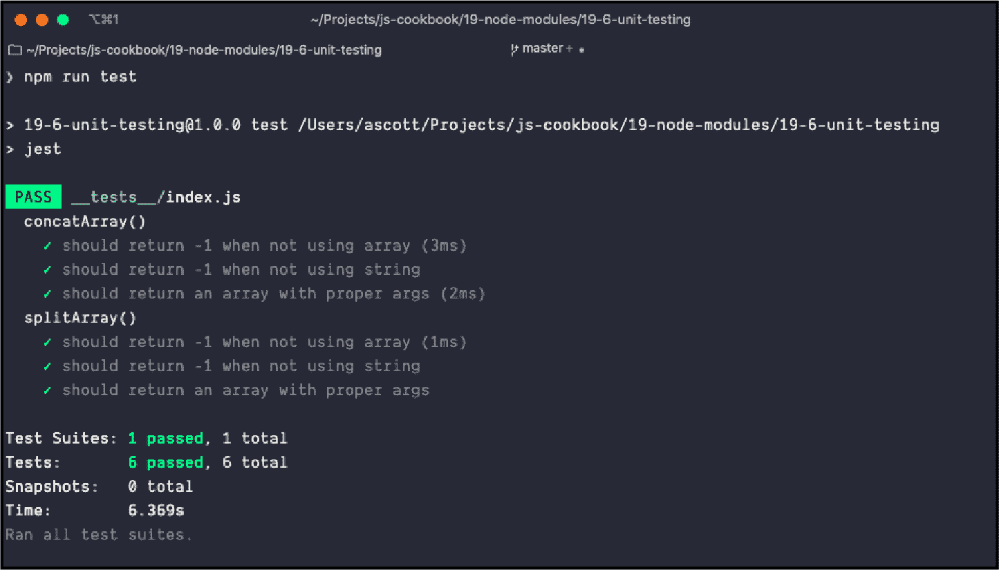

# 第十八章：Node 模块

编写 Node.js 应用程序的一个重要方面是其内建的模块化环境。下载和安装任意数量的 Node 模块都非常简单，同样简单的是使用它们：只需包含一个 `require()` 语句来命名模块，然后就可以运行了。

JavaScript *模块化* 的一个好处是模块的轻松集成。模块化确保外部功能被创建的方式不依赖于其他外部功能，这是一种称为 *松耦合* 的概念。这意味着我可以使用 `Foo` 模块，而不必包含 `Bar` 模块，因为 `Foo` 严重依赖于已经包含的 `Bar`。

JavaScript 的模块化既是一种纪律，也是一种契约。纪律在于必须遵循特定的标准，以便外部代码能够参与模块系统。契约是在你、我和其他 JavaScript 开发人员之间的一种约定：我们在模块系统中生产（或消费）外部功能时，都遵循了一个商定的路径，并且我们都对模块系统有期望。

###### 注意

几乎所有应用程序和库管理及发布的一个主要依赖是 Git，一个源代码控制系统，以及 GitHub，一个非常流行的 Git *终点*。Git 的工作原理以及如何在 GitHub 上使用 Git 超出了本书的范围。我建议阅读 Richard Silverman 的 *[Git Pocket Guide](http://shop.oreilly.com/product/0636920024972.do)*（O’Reilly）来更深入了解 Git，以及访问 GitHub 的 [官方文档](https://github.com) 以获取更多关于该服务的信息。

# 通过 npm 搜索特定的 Node 模块

## 问题

您正在创建一个 Node 应用程序，并希望使用现有模块，但不知道如何找到它们。

## 解决方案

“使用 npm 下载包” 解释了如何使用 npm 安装包，这是 Node 的流行包管理器（也是维系 Node 世界的粘合剂）。但是您尚未考虑如何 *查找* 您在 npm 广阔的注册表中需要的有用包。

大多数情况下，您会通过朋友和共同开发者的推荐来发现模块，但有时您需要一些新的东西。您可以直接在 [npm 网站](https://www.npmjs.org) 上搜索新模块。您还可以直接使用 npm 命令行界面来搜索模块。例如，如果您对处理 PDF 的模块感兴趣，可以在命令行中运行以下搜索：

```
process.env.NODE_ENV
```

## 讨论

npm 网站不仅提供了使用 npm 的文档，还提供了一个界面用于搜索模块。如果您访问每个模块在 npm 上的页面，您可以看到模块的流行程度、其它依赖它的模块、许可证以及其他相关信息。

但是，您也可以直接使用 npm 搜索模块。这个过程可能需要相当长的时间，完成后，您可能会得到大量的模块返回，特别是对于诸如处理 PDF 的模块这样广泛的主题。

您可以通过列出多个术语来细化结果：

```
$ NODE_ENV=development node index.js
```

此查询返回一个更小的模块列表，专门用于 PDF 生成。

一旦您找到一个听起来有趣的模块，您可以通过以下方式获取详细信息：

```
$ npm install dotenv --save
```

您将从模块的 *package.json* 中获得有用的信息，它可以告诉您它依赖于什么，由谁编写的，以及创建时间。我们仍建议直接查看模块的 npm 网站页面和 GitHub 存储库页面。在那里，您可以确定模块是否正在积极维护，了解模块的受欢迎程度，查看开放的问题，并查看源代码。

# 将您的库转换为 Node 模块

## 问题

您想在 Node 中使用您的一个库。

## 解决方案

将库转换为 Node 模块。在 Node 中，每个文件都被视为一个模块。例如，如果库是包含在 `/lib/hello.js` 的函数文件：

```
require('dotenv').config();
```

您可以使用 `exports` 关键字将其转换为 Node 模块：

```
PORT=8080
DB_URI=mongodb://mongodb0.example.com:27017
KEY=12345

```

或者，也可以直接 `export` 函数：

```
const port = process.env.PORT || 8080;
```

然后，您可以在应用程序中使用该模块：

```
require('dotenv').config();
```

## 讨论

Node 的默认模块系统基于 CommonJS，使用三种结构：`exports` 用于定义从库中导出的内容，`require()` 用于在应用程序中包含模块，以及 `module`，它包含关于模块的信息，但也可用于直接导出函数。

如果您的库返回一个带有多个函数和数据对象的对象，则可以将每个分配给`module.exports`上同名属性，或者您可以返回一个对象：

```
require('dotenv').config({ path: '/alternate/file/path/.env' })
```

或者：

```
import dotenv from 'dotenv'

dotenv.config()
```

然后直接访问对象属性：

```
if (process.env.NODE_ENV !== 'production') {
  require('dotenv').config();
}
```

因为该模块未使用 npm 安装，而是仅驻留在应用程序所在的目录中，所以它通过文件位置和名称访问，而不仅仅是名称。

## 参见

在 “跨模块环境进行代码转换” 中，我们介绍了如何确保您的库代码在 CommonJS 和 ECMAScript 模块环境中都能正常工作。

在 “创建可安装的 Node 模块” 中，我们介绍了如何创建一个独立的模块。

# 跨模块环境进行代码转换

## 问题

您编写了一个库，希望与他人分享，但使用各种 Node 版本和 CommonJS 及 ECMAScript 模块。如何确保您的库在所有不同的环境中都能正常工作？

## 解决方案

使用带有 ECMAScript 模块包装器的 CommonJS 模块。

首先，将库写成一个 CommonJS 模块，并保存为 *.cjs* 文件扩展名：

```
const fs = require('fs');
const { promisify } = require('util');

const readFile = promisify(fs.readFile);
const appendFile = promisify(fs.appendFile);

const readAppend = async (originalFile, secondaryFile) => {
  const fileData = await readFile(originalFile);
  await appendFile(secondaryFile, fileData);
  console.log(
    `The data from ${originalFile} was appended to ${secondaryFile}!`
  );
};

readAppend('./files/main.txt', './files/secondary.txt');
```

紧随其后的是 ECMAScript 包装模块，使用 *.mjs* 文件扩展名：

```
const fsp = require('fs').promises;

const readAppend = async (originalFile, secondaryFile) => {
  const fileData = await fsp.readFile(originalFile);
  await fsp.appendFile(secondaryFile, fileData);
  console.log(
    `The data from ${originalFile} was appended to ${secondaryFile}!`
  );
};

readAppend('./files/main.txt', './files/tertiary.txt');
```

以及包含 `type`、`main` 和 `exports` 字段的 *package.json* 文件：

```
fs.readFile(file, (error, data) => {
  if (error) {
    // handle error
  } else {
    // execute an operation after the file is read
  }
});
```

我们模块的用户可以使用`require`语法导入模块，使用 CommonJS 语法：

```
const waitOne = () => {
  return new Promise(resolve => {
    setTimeout(() => {
      console.log('It has been one second');
      resolve();
    }, 1000);
  });
};

const callWait = async () => {
  await waitOne();
};

callWait();
```

or:

```
const fs = require('fs');
const { promisify } = require('util');

const writeFile = promisify(fs.writeFile);
```

而那些使用 ECMAScript 模块的用户可以指定使用 ES `import`语法的`module`版本库：

```
try {
  await writeFile(file, buf);
} catch (error) {
  console.log(error);
  throw error;
}
```

or:

```
const fs = require('fs');

const callbackHell = file => {
  const buf = Buffer.from('Callback hell first string\n');
  const buf2 = Buffer.from('Callback hell second string\n');

  // write or append the contents of the first buffer
  fs.writeFile(file, buf, err => {
    if (err) {
      console.log(err);
      throw err;
    }
    // append the contents of the second buffer
    fs.appendFile(file, buf2, err2 => {
      if (err2) {
        console.log(err2);
        throw err2;
      }
      // log the contents of the file
      fs.readFile(file, 'utf-8', (err3, data) => {
        if (err3) {
          console.log(err3);
          throw err3;
        }
        console.log(data);
      });
    });
  });
};

callbackHell('./files/callback.txt');
```

###### 注意

当前编写时，可以通过使用`--experimental-conditional-exports`标志避免 ECMAScript 模块中的*/module*命名约定。然而，由于当前是实验性质并且语法可能会发生变化，我们目前建议不要这样做。在 Node 的未来版本中，这可能会成为标准。您可以在[Node 文档](https://oreil.ly/Xzkid)中了解更多关于这种方法的信息。

## 讨论

自 Node 起，CommonJS 模块一直是标准，诸如 Browserify 之类的工具将这种语法带出 Node 生态系统，允许开发者在浏览器中使用 Node 风格模块。ECMAScript 2015（也称为 ES6）标准引入了一种原生 JavaScript 模块语法，这在 Node 8.5.0 中引入，并可以在`--experimental-module`标志后使用。从 Node 13.2.0 开始，Node 支持原生 ECMAScript 模块。

一个常见的模式是使用 CommonJS 或 ECMAScript 模块语法编写模块，并使用编译工具将它们作为单独的模块入口点或导出路径发布。然而，如果应用程序通过一种语法直接加载模块，并且该模块通过另一种语法或依赖项直接或间接加载，这可能导致模块加载两次。

在*package.json*中有三个关键字段：

```
const fs = require('fs');
const { promisify } = require('util');

const writeFile = promisify(fs.writeFile);
const appendFile = promisify(fs.appendFile);
const readFile = promisify(fs.readFile);

const fileWriteRead2 = async file => {
  const buf = Buffer.from('The first string\n');
  const buf2 = Buffer.from('The second string\n');

  // write or append the contents of the first buffer
  try {
    await writeFile(file, buf);
  } catch (error) {
    console.log(error);
    throw error;
  }

  // append the contents of the second buffer
  try {
    await appendFile(file, buf2);
  } catch (error) {
    console.log(error);
    throw error;
  }

  // log the contents of the file
  console.log(await readFile(file, 'utf8'));
};

fileWriteRead2('./files/async.txt');
```

`"type"`

指定这是一个`module`，意味着这个库正在使用 ECMAScript 模块语法。对于完全使用 CommonJS 的库，`"type"`将是`"commonjs"`。

`"main"`

指定应用程序的主入口点，我们将指向 CommonJS 文件。

`"exports"`

定义我们模块的导出路径。通过这种方式，使用默认`package`的消费者将直接接收 CommonJS 模块，而使用`package/module`的消费者将从 ECMAScript 模块包装器中导入文件。

如果我们希望避免使用*.cjs*和*.mjs*文件扩展名，我们可以这样做：

```
const { spawn } = require('child_process');

const identify = spawn('identify', ['-verbose', 'osprey.jpg']);

identify.stdout.on('data', data => {
  console.log(`stdout: ${data}`);
});

identify.stderr.on('data', data => {
  console.log(`stderr: ${data}`);
});

identify.on('exit', code => {
  console.log(`child process exited with code ${code}`);
});
```

## 另请参阅

在“编写多平台库”中，我们介绍了如何通过使用 Webpack 作为代码捆绑器，确保您的库代码在 Node 和浏览器中的多个模块环境中正常工作。

# 创建一个可安装的 Node 模块

## 问题

您可以从头开始创建一个 Node 模块，或者将现有库转换为可以在浏览器或 Node 中工作的模块。现在，您想知道如何将其修改为可以使用 npm 安装的模块。

## 解决方案

一旦创建了你的 Node 模块和任何支持的功能（包括模块测试），你可以打包整个目录。打包和发布 Node 模块的关键是创建一个描述模块、任何依赖项、目录结构、忽略内容等的 *package.json* 文件。你可以在项目根目录运行 `npm init` 命令并按提示操作来生成 *package.json* 文件。

下面是一个相对基本的 *package.json* 文件：

```
identify.stdout.on('data', (data) => {
    console.log(data.toString().split("\n"));
});
```

一旦创建了 *package.json*，将所有源目录和 *package.json* 文件打包为一个 gzip 压缩的 tarball。然后在本地安装该包，或者在 npm 上进行公共访问。

## 讨论

*package.json* 文件是将 Node 模块打包为本地安装或上传到 npm 进行管理的关键。至少需要 `name` 和 `version`。解决方案中给出的其他字段包括：

`description`

模块的描述和功能

`main`

模块的入口文件

`author`

模块的作者

`keywords`

关键字列表，可以帮助其他人找到这个模块

`repository`

代码所在的地方，通常是 GitHub

`engines`

你知道你的模块可以运行的 Node 版本

`bugs`

提交 bug 的地方

`licenses`

你的模块许可证

`dependencies`

模块所需的依赖项列表

`directories`

描述你的模块目录结构的哈希

`scripts`

描述在模块生命周期内运行的对象命令的哈希

在 [npm 网站](https://oreil.ly/iXynV) 上有一系列其他选项描述。你也可以使用工具来帮助填写许多这些字段。在命令行输入以下内容运行该工具，它会询问问题，然后生成一个基本的 *package.json* 文件：

```
const { spawn } = require('child_process');

const cmd = spawn('cmd', ['/c', 'dir\n']);

cmd.stdout.on('data', data => {
  console.log(`stdout: ${data}`);
});

cmd.stderr.on('data', data => {
  console.log(`stderr: ${data}`);
});

cmd.on('exit', code => {
  console.log(`child process exited with code ${code}`);
});
```

一旦设置了源代码并创建了 *package.json* 文件，你可以在模块的顶级目录运行以下命令测试一切是否正常：

```
process.argv.forEach((value, index) => {
  console.log(`${index}: ${value}`);
});
```

如果没有错误，那么可以将文件打包为 gzip 压缩的 tarball。此时，如果要发布模块，你首先需要在 npm 注册表中添加自己为用户：

```
$ node index.js --name=Adam --food=pizza
```

要将 Node 模块发布到 npm 注册表，请在模块的根目录中使用以下命令，指定一个 tarball 的 URL、文件名或路径：

```
0: /usr/local/bin/node
1: /Users/ascott/Projects/command-line-args/index.js
2: --name=Adam
3: --food=pizza
```

如果你的模块有开发依赖项，比如使用 Jest 这样的测试框架，确保这些依赖项添加到 *package.json* 文件的一个优秀捷径是在与 *package.json* 文件相同的目录中使用以下内容时，安装依赖模块：

```
const yargs = require('yargs/yargs');
const { hideBin } = require('yargs/helpers');

const {argv} = yargs(hideBin(process.argv));

console.log(argv);
```

不仅会安装 Jest（稍后讨论，在 “单元测试你的模块” 中），这条命令还会更新你的 *package.json* 文件，内容如下：

```
$ node index.js --name=Adam --food=pizza
# logs the following:
{ _: [], name: 'Adam', food: 'pizza', '$0': 'yargs/index.js' }

```

你也可以使用相同类型的选项将模块添加到 *package.json* 中的 `dependencies`。以下内容：

```
const yargs = require('yargs/yargs');
const { hideBin } = require('yargs/helpers');

const {argv} = yargs(hideBin(process.argv));

if (argv.food === 'pizza') {
  console.log('mmm');
}
```

将以下内容添加到 *package.json* 文件中：

```
#!/usr/bin/env node
```

如果不再需要模块并且不应出现在 *package.json* 中，请使用以下方法从 `devDependencies` 中删除它：

```
#!/usr/bin/env node
const program = require('commander');

program
  .version('0.0.1')
  .option('-n, --number <value>', 'A number to square')
  .parse(process.argv);

const square = Math.pow(program.number, 2);

console.log(`The square of ${program.number} is ${square}`);
```

并且从 `dependencies` 中移除模块的方法是：

```
#!/usr/bin/env node
```

如果模块是 `dependencies` 或 `devDependencies` 中的最后一个，则不会移除该属性。它只是被设置为空值：

```
$ chmod a+x square.js
```

###### 注意

npm 还为[创建和安装 Node 模块提供了一个不错的开发人员指南](https://oreil.ly/ifa4e)。您应该考虑使用 *.npmignore* 或 *.gitignore* 文件来排除您模块中的内容。虽然这超出了本书的范围，但您还应该熟悉 Git 和 GitHub，并在应用程序/模块中使用它。

## 额外信息：README 文件和 Markdown 语法

当您将模块或库打包以便重用，并将其上传到 GitHub 等源代码存储库时，您需要提供有关安装模块/库的详细信息以及如何使用它的基本信息。为此，您需要一个 README 文件。

您可能已经看到过名为 *README.md* 的文件，它们与应用程序和 Node 模块一起。它们基于文本，并带有一些奇怪而不显眼的标记，您可能不确定其有用性，直到在像 GitHub 这样的网站上看到它，其中 README 文件提供了项目页面安装和使用信息的全部内容。这些标记被转换为 HTML，使得网页帮助内容更易读。

README 的内容使用称为 Markdown 的注释标记进行标记。流行的网站 Daring Fireball 称 Markdown 易于阅读和写作，但“可读性始终是最重要的”。与 HTML 不同，Markdown 标记不会妨碍文本阅读。

###### 注意

Daring Fireball 还提供了一个[通用 Markdown 概述](https://oreil.ly/qkKRT)，但如果您在处理 GitHub 文件，可能还想查看[GitHub 的 Flavored Markdown](https://help.github.com/en/github/writing-on-github)。

这里是一个示例 *REAMDE.md* 文件：

```
$ ./square.js -n 4
```

大多数流行的文本编辑器包括 Markdown 语法高亮和预览功能。所有平台还提供桌面 Markdown 编辑器。我还可以使用 CLI 工具，例如 [Pandoc](https://oreil.ly/Cc4GX)，将 *README.md* 文件转换为可读的 HTML：

```
#!/usr/bin/env node
const program = require('commander');
const puppeteer = require('puppeteer');

program
  .version('0.0.1')
  .option('-s, --source [website]', 'Source website')
  .option('-f, --file [filename]', 'Filename')
  .parse(process.argv);

(async () => {
  console.log('capturing screenshot...');
  const browser = await puppeteer.launch();
  const page = await browser.newPage();
  await page.goto(program.source);
  await page.screenshot({ path: program.file });
  await browser.close();
  console.log(`captured screenshot at ${program.file}`);
})();
```

图 18-1 显示了生成的内容。它并不花哨，但却非常易读。


###### 图 18-1\. README.md 文本和 Markdown 注释生成的 HTML

当您将源代码托管在 GitHub 等网站时，GitHub 使用 *README.md* 文件生成存储库的封面页面。

# 编写多平台库

## 问题

您已经创建了一个在浏览器和 Node.js 中都有用的库，并希望在两个环境中都可以使用它。

## 解决方案

使用打包工具（如 Webpack）来打包您的库，以使其作为 ES2015 模块、CommonJS 模块和 AMD 模块运行，并且可以作为脚本标签在浏览器中加载。

在 Webpack 的 *webpack.config.js* 文件中，包括 `library` 和 `libraryTarget` 字段，表示该模块应作为库捆绑，并针对多个环境进行目标化：

```
"main": "snapshot.js",
"preferGlobal": true,
"bin": {
  "snapshot": "snapshot.js"
},
```

`library` 字段指定一个库的名称，将在 ECMAScript、CommonJS 和 AMD 模块环境中使用。`libraryTarget` 字段允许您指定模块将如何公开。默认值为 `var`，将公开一个变量。指定 `umd` 将利用 JavaScript [Universal Module Definition (UMD)](https://oreil.ly/VSpd0)，使多个模块样式能够使用该库。要使 UMD 构建在浏览器和 Node.js 环境中都可用，需要设置 `output.globalObject` 选项为 `this`。

###### 注意

有关使用 Webpack 进行代码捆绑的更多详情，请参见第十七章。

## 讨论

在示例中，我创建了一个简单的数学库。当前，唯一的函数是一个名为 `squareIt` 的函数，接受一个数字作为参数，并返回该数字乘以自身的值。这在 *src/index.js* 中：

```
$ snapshot -s http://oreilly.com -f test.png
```

*package.json* 文件包含 Webpack 和 Webpack 命令行接口（CLI）作为开发依赖项。它还将 `main` 分发指向库的捆绑版本，Webpack 将其输出到 *dist* 文件夹。我还添加了一个名为 `build` 的构建脚本，将运行 Webpack 打包工具。这样可以通过输入 `npm run build`（如果使用 Yarn，则为 `yarn run build`）来生成捆绑包。

```
$ snapshot --source http://oreilly.com --file test.png
```

最后，我的项目包含一个 *webpack.config.js*，如食谱所述：

```
  Usage: snapshot [options]

  Options:

    -h, --help              output usage information
    -V, --version           output the version number
    -s, --source [website]  Source website
    -f, --file [filename]   Filename
```

使用此设置，命令 `npm run build` 将捆绑库并放置在项目的 *dist* 目录中。消费者将使用此捆绑文件。

###### 提示

在将包发布到 npm 之前，可以在本地测试包，从项目目录的根目录运行 `npm link`。然后在希望使用该模块的另一个项目中，键入 `npm link <library name>`。这样做将创建一个符号链接到包，就像全局安装一样。

### 发布库

完成库后，您可能会希望将其发布到 npm 进行分发。确保项目已使用 Git 进行版本控制，并已推送到公共远程仓库（如 GitHub 或 GitLab）。从项目根目录：

```
$ snapshot -V
```

发布到远程 Git 仓库和 npm 注册表后，可以通过运行 `npm install`，下载或克隆 Git 仓库，或直接在网页中引用库，使用 *https://unpkg.com/<library-name>*。该库可以跨多个 JavaScript 库格式进行消费。

作为 ES 2015 模块：

```
$ npm publish
```

作为 CommonJS 模块：

```
$ pm2 start index.js
```

作为 AMD 模块：

```
$ sudo npm install pm2 -g
```

并在网页上使用脚本标签：

```
$ pm2 start index.js
```

### 处理库的依赖关系

往往一个库可能包含子依赖项。使用我们当前的设置，所有依赖项将被打包并与库一起捆绑。为了限制输出的捆绑包并确保库使用者不会安装多个子依赖项的实例，最好将它们视为“对等依赖项”，这也必须被单独安装或引用。要执行此操作，请向您的*webpack.config.js*添加一个`externals`属性。在下面的示例中，`moment`正被用作对等依赖项：

```
$ pm2 start  -l forever.log -o out.log -e err.log -n app_name index.js --watch
```

使用此配置，`moment`将作为我们库的全局变量处理。

# 单元测试你的模块

## 问题

您希望确保您的模块正常运行并准备好供他人使用。

## 解决方案

将*单元测试* 作为生产过程的一部分添加。

鉴于以下名为`bbarray`的模块，并在名为*index.js*的文件中创建：

```
"scripts": {
    "start": "pm2 start index.js",
}
```

使用[Jest](https://jestjs.io)，一个 JavaScript 测试框架，以下单元测试（作为*index.js*创建，并位于项目的*test*子目录中）应该能够成功通过六个测试：

```
$ npm install -g nodemon
```

测试结果显示在图 18-2，使用`npm test`运行。



###### 图 18-2\. 基于 Jest 运行的单元测试

## 讨论

*单元测试* 是开发人员测试其代码以确保其符合规范的一种方式。它涉及测试功能行为，并查看在发送错误参数或根本没有参数时会发生什么。之所以称为单元测试，是因为它用于单独的代码单元，例如在 Node 应用程序中测试一个模块，而不是测试整个 Node 应用程序。它成为*集成测试* 的一部分，其中所有部分在连接在一起之前进行测试，然后进行*用户验收测试*：测试确保应用程序按照用户期望的方式运行（并且他们通常在使用时不讨厌它）。

单元测试是开发中可能一开始看起来很痛苦的任务之一，但很快就会变得轻车熟路。一个良好的目标是并行开发测试和代码。许多开发人员甚至练习*测试驱动开发*，在编写代码本身之前先编写单元测试。

在解决方案中，我们使用了 Jest，一个复杂的测试框架。该模块很简单，所以我们没有使用一些更复杂的 Jest 测试机制。但是，这提供了编写单元测试的基本示例。

要安装 Jest，请使用以下命令：

```
$ nodemon index.js
```

我使用`--save-dev`标志，因为我将 Jest 安装到模块的开发依赖项中。此外，我修改了模块的*package.json*文件以添加以下部分：

```
$ nodemon index.js -- -param1 -param2
```

测试脚本保存在项目的*tests*子目录下的*index.js*中。Jest 会自动查找*tests*目录中的文件或遵循*filename.test.js*命名模式的文件。以下命令运行测试：

```
[nodemon] 2.0.2
[nodemon] to restart at any time, enter `rs`
[nodemon] watching dir(s): *.*
[nodemon] watching extensions: js,mjs,json
[nodemon] starting `node index.js`
Listening on port 8124
```

Jest 单元测试利用 [*expect matchers*](https://oreil.ly/E7RnY) 来测试返回的值。
