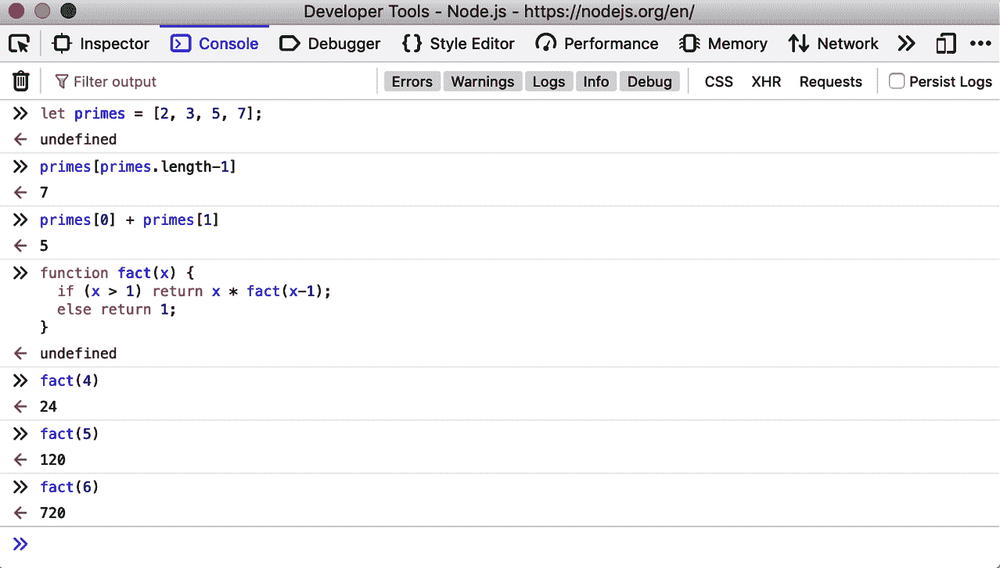

# 第一章：介绍 JavaScript

JavaScript 是 Web 的编程语言。绝大多数网站使用 JavaScript，并且所有现代 Web 浏览器——无论是桌面、平板还是手机——都包含 JavaScript 解释器，使 JavaScript 成为历史上部署最广泛的编程语言。在过去的十年中，Node.js 使 JavaScript 编程超越了 Web 浏览器，Node 的巨大成功意味着 JavaScript 现在也是软件开发人员中使用最广泛的编程语言。无论您是从零开始还是已经专业使用 JavaScript，本书都将帮助您掌握这门语言。

如果您已经熟悉其他编程语言，了解 JavaScript 是一种高级、动态、解释性编程语言，非常适合面向对象和函数式编程风格，可能会对您有所帮助。JavaScript 的变量是无类型的。其语法在很大程度上基于 Java，但这两种语言在其他方面没有关联。JavaScript 从 Scheme 语言中继承了头等函数，从鲜为人知的 Self 语言中继承了基于原型的继承。但您不需要了解这些语言，或熟悉这些术语，就可以使用本书学习 JavaScript。

名称“JavaScript”非常具有误导性。除了表面上的语法相似性外，JavaScript 与 Java 编程语言完全不同。JavaScript 早已超越了其脚本语言的起源，成为一种强大而高效的通用语言，适用于严肃的软件工程和具有庞大代码库的项目。

要有用，每种语言都必须有一个平台或标准库，用于执行诸如基本输入和输出之类的操作。核心 JavaScript 语言定义了一个最小的 API，用于处理数字、文本、数组、集合、映射等，但不包括任何输入或输出功能。输入和输出（以及更复杂的功能，如网络、存储和图形）是嵌入 JavaScript 的“主机环境”的责任。

JavaScript 的原始主机环境是 Web 浏览器，这仍然是 JavaScript 代码最常见的执行环境。Web 浏览器环境允许 JavaScript 代码通过用户的鼠标和键盘输入以及通过进行 HTTP 请求来获取输入。它还允许 JavaScript 代码使用 HTML 和 CSS 向用户显示输出。

自 2010 年以来，JavaScript 代码还有另一个主机环境可供选择。与将 JavaScript 限制在与 Web 浏览器提供的 API 一起使用不同，Node 使 JavaScript 可以访问整个操作系统，允许 JavaScript 程序读写文件，通过网络发送和接收数据，并进行和提供 HTTP 请求。Node 是实现 Web 服务器的热门选择，也是编写简单实用程序脚本的便捷工具，可作为 shell 脚本的替代品。

本书大部分内容都集中在 JavaScript 语言本身上。第十一章记录了 JavaScript 标准库，第十五章介绍了 Web 浏览器主机环境，第十六章介绍了 Node 主机环境。

本书首先涵盖低级基础知识，然后构建在此基础上，向更高级和更高级的抽象发展。这些章节应该按照更多或更少的顺序阅读。但是学习新的编程语言从来不是一个线性过程，描述一种语言也不是线性的：每个语言特性都与其他特性相关联，本书充满了交叉引用——有时是向后，有时是向前——到相关材料。本介绍性章节快速地介绍了语言的关键特性，这将使您更容易理解后续章节中的深入讨论。如果您已经是一名实践的 JavaScript 程序员，您可能可以跳过本章节。（尽管在继续之前，您可能会喜欢阅读示例 1-1）

# 1.1 探索 JavaScript

学习新的编程语言时，重要的是尝试书中的示例，然后修改它们并再次尝试以测试您对语言的理解。为此，您需要一个 JavaScript 解释器。

尝试几行 JavaScript 代码的最简单方法是在您的网络浏览器中打开 Web 开发者工具（使用 F12、Ctrl-Shift-I 或 Command-Option-I），然后选择控制台选项卡。然后，您可以在提示符处输入代码并在输入时查看结果。浏览器开发者工具通常显示为浏览器窗口底部或右侧的窗格，但通常可以将它们分离为单独的窗口（如图 1-1 所示），这通常非常方便。



###### 图 1-1\. Firefox 开发者工具中的 JavaScript 控制台

尝试 JavaScript 代码的另一种方法是从[*https://nodejs.org*](https://nodejs.org)下载并安装 Node。安装 Node 后，您只需打开一个终端窗口并输入**`node`**即可开始像这样进行交互式 JavaScript 会话：

```js
$ node
Welcome to Node.js v12.13.0.
Type ".help" for more information.
> .help
.break    Sometimes you get stuck, this gets you out
.clear    Alias for .break
.editor   Enter editor mode
.exit     Exit the repl
.help     Print this help message
.load     Load JS from a file into the REPL session
.save     Save all evaluated commands in this REPL session to a file

Press ^C to abort current expression, ^D to exit the repl
> let x = 2, y = 3;
undefined
> x + y
5
> (x === 2) && (y === 3)
true
> (x > 3) || (y < 3)
false
```

# 1.2 你好，世界

当您准备开始尝试更长的代码块时，这些逐行交互式环境可能不再适用，您可能更喜欢在文本编辑器中编写代码。从那里，您可以将代码复制粘贴到 JavaScript 控制台或 Node 会话中。或者您可以将代码保存到文件中（JavaScript 代码的传统文件扩展名为*.js*），然后使用 Node 运行该 JavaScript 代码文件：

```js
$ node snippet.js
```

如果您像这样以非交互方式使用 Node，它不会自动打印出您运行的所有代码的值，因此您需要自己执行。您可以使用函数`console.log()`在终端窗口或浏览器的开发者工具控制台中显示文本和其他 JavaScript 值。例如，如果您创建一个包含以下代码行的*hello.js*文件：

```js
console.log("Hello World!");
```

并使用`node hello.js`执行文件，您将看到打印出“Hello World!”的消息。

如果您想在网络浏览器的 JavaScript 控制台中看到相同的消息打印出来，请创建一个名为*hello.html*的新文件，并将以下文本放入其中：

```js
<script src="hello.js"></script>
```

然后使用`file://` URL 将*hello.html*加载到您的网络浏览器中，就像这样：

```js
file:///Users/username/javascript/hello.html
```

打开开发者工具窗口以在控制台中查看问候语。

# 1.3 JavaScript 之旅

本节通过代码示例快速介绍了 JavaScript 语言。在这个介绍性章节之后，我们将从最低级别深入 JavaScript：第二章解释了 JavaScript 注释、分号和 Unicode 字符集等内容。第三章开始变得更有趣：它解释了 JavaScript 变量以及您可以分配给这些变量的值。

这里有一些示例代码来说明这两章的亮点：

```js
// Anything following double slashes is an English-language comment.
// Read the comments carefully: they explain the JavaScript code.

// A variable is a symbolic name for a value.
// Variables are declared with the let keyword:
let x;                     // Declare a variable named x.

// Values can be assigned to variables with an = sign
x = 0;                     // Now the variable x has the value 0
x                          // => 0: A variable evaluates to its value.

// JavaScript supports several types of values
x = 1;                     // Numbers.
x = 0.01;                  // Numbers can be integers or reals.
x = "hello world";         // Strings of text in quotation marks.
x = 'JavaScript';          // Single quote marks also delimit strings.
x = true;                  // A Boolean value.
x = false;                 // The other Boolean value.
x = null;                  // Null is a special value that means "no value."
x = undefined;             // Undefined is another special value like null.
```

JavaScript 程序可以操作的另外两个非常重要的*类型* 是对象和数组。这是第六章和第七章的主题，但它们非常重要，以至于在到达这些章节之前你会看到它们很多次：

```js
// JavaScript's most important datatype is the object.
// An object is a collection of name/value pairs, or a string to value map.
let book = {               // Objects are enclosed in curly braces.
    topic: "JavaScript",   // The property "topic" has value "JavaScript."
    edition: 7             // The property "edition" has value 7
};                         // The curly brace marks the end of the object.

// Access the properties of an object with . or []:
book.topic                 // => "JavaScript"
book["edition"]            // => 7: another way to access property values.
book.author = "Flanagan";  // Create new properties by assignment.
book.contents = {};        // {} is an empty object with no properties.

// Conditionally access properties with ?. (ES2020):
book.contents?.ch01?.sect1 // => undefined: book.contents has no ch01 property.

// JavaScript also supports arrays (numerically indexed lists) of values:
let primes = [2, 3, 5, 7]; // An array of 4 values, delimited with [ and ].
primes[0]                  // => 2: the first element (index 0) of the array.
primes.length              // => 4: how many elements in the array.
primes[primes.length-1]    // => 7: the last element of the array.
primes[4] = 9;             // Add a new element by assignment.
primes[4] = 11;            // Or alter an existing element by assignment.
let empty = [];            // [] is an empty array with no elements.
empty.length               // => 0

// Arrays and objects can hold other arrays and objects:
let points = [             // An array with 2 elements.
    {x: 0, y: 0},          // Each element is an object.
    {x: 1, y: 1}
];
let data = {                 // An object with 2 properties
    trial1: [[1,2], [3,4]],  // The value of each property is an array.
    trial2: [[2,3], [4,5]]   // The elements of the arrays are arrays.
};
```

这里展示的用方括号列出数组元素或在花括号内将对象属性名映射到属性值的语法被称为*初始化表达式*，这只是第四章的一个主题。*表达式* 是 JavaScript 的短语，可以*评估*以产生一个值。例如，使用`.`和`[]`来引用对象属性或数组元素的值就是一个表达式。

在 JavaScript 中形成表达式的最常见方式之一是使用*运算符*：

```js
// Operators act on values (the operands) to produce a new value.
// Arithmetic operators are some of the simplest:
3 + 2                      // => 5: addition
3 - 2                      // => 1: subtraction
3 * 2                      // => 6: multiplication
3 / 2                      // => 1.5: division
points[1].x - points[0].x  // => 1: more complicated operands also work
"3" + "2"                  // => "32": + adds numbers, concatenates strings

// JavaScript defines some shorthand arithmetic operators
let count = 0;             // Define a variable
count++;                   // Increment the variable
count--;                   // Decrement the variable
count += 2;                // Add 2: same as count = count + 2;
count *= 3;                // Multiply by 3: same as count = count * 3;
count                      // => 6: variable names are expressions, too.

// Equality and relational operators test whether two values are equal,
// unequal, less than, greater than, and so on. They evaluate to true or false.
let x = 2, y = 3;          // These = signs are assignment, not equality tests
x === y                    // => false: equality
x !== y                    // => true: inequality
x < y                      // => true: less-than
x <= y                     // => true: less-than or equal
x > y                      // => false: greater-than
x >= y                     // => false: greater-than or equal
"two" === "three"          // => false: the two strings are different
"two" > "three"            // => true: "tw" is alphabetically greater than "th"
false === (x > y)          // => true: false is equal to false

// Logical operators combine or invert boolean values
(x === 2) && (y === 3)     // => true: both comparisons are true. && is AND
(x > 3) || (y < 3)         // => false: neither comparison is true. || is OR
!(x === y)                 // => true: ! inverts a boolean value
```

如果 JavaScript 表达式就像短语，那么 JavaScript *语句* 就像完整的句子。语句是第五章的主题。粗略地说，表达式是计算值但不执行任何操作的东西：它不以任何方式改变程序状态。另一方面，语句没有值，但它们会改变状态。你已经在上面看到了变量声明和赋值语句。另一个广泛的语句类别是*控制结构*，如条件语句和循环。在我们讨论完函数之后，你将在下面看到示例。

*函数* 是一段命名和带参数的 JavaScript 代码块，你定义一次，然后可以反复调用。函数直到第八章才会正式介绍，但与对象和数组一样，你在到达该章之前会看到它们很多次。这里有一些简单的示例：

```js
// Functions are parameterized blocks of JavaScript code that we can invoke.
function plus1(x) {        // Define a function named "plus1" with parameter "x"
    return x + 1;          // Return a value one larger than the value passed in
}                          // Functions are enclosed in curly braces

plus1(y)                   // => 4: y is 3, so this invocation returns 3+1

let square = function(x) { // Functions are values and can be assigned to vars
    return x * x;          // Compute the function's value
};                         // Semicolon marks the end of the assignment.

square(plus1(y))           // => 16: invoke two functions in one expression
```

在 ES6 及更高版本中，有一种用于定义函数的简洁语法。这种简洁语法使用`=>`将参数列表与函数体分开，因此用这种方式定义的函数被称为*箭头函数*。箭头函数在想要将匿名函数作为另一个函数的参数传递时最常用。前面的代码重写为使用箭头函数时如下所示：

```js
const plus1 = x => x + 1;   // The input x maps to the output x + 1
const square = x => x * x;  // The input x maps to the output x * x
plus1(y)                    // => 4: function invocation is the same
square(plus1(y))            // => 16
```

当我们将函数与对象一起使用时，我们得到*方法*：

```js
// When functions are assigned to the properties of an object, we call
// them "methods."  All JavaScript objects (including arrays) have methods:
let a = [];                // Create an empty array
a.push(1,2,3);             // The push() method adds elements to an array
a.reverse();               // Another method: reverse the order of elements

// We can define our own methods, too. The "this" keyword refers to the object
// on which the method is defined: in this case, the points array from earlier.
points.dist = function() { // Define a method to compute distance between points
    let p1 = this[0];      // First element of array we're invoked on
    let p2 = this[1];      // Second element of the "this" object
    let a = p2.x-p1.x;     // Difference in x coordinates
    let b = p2.y-p1.y;     // Difference in y coordinates
    return Math.sqrt(a*a + // The Pythagorean theorem
                     b*b); // Math.sqrt() computes the square root
};
points.dist()              // => Math.sqrt(2): distance between our 2 points
```

现在，正如承诺的那样，这里有一些函数，它们的主体演示了常见的 JavaScript 控制结构语句：

```js
// JavaScript statements include conditionals and loops using the syntax
// of C, C++, Java, and other languages.
function abs(x) {          // A function to compute the absolute value.
    if (x >= 0) {          // The if statement...
        return x;          // executes this code if the comparison is true.
    }                      // This is the end of the if clause.
    else {                 // The optional else clause executes its code if
        return -x;         // the comparison is false.
    }                      // Curly braces optional when 1 statement per clause.
}                          // Note return statements nested inside if/else.
abs(-10) === abs(10)       // => true

function sum(array) {      // Compute the sum of the elements of an array
    let sum = 0;           // Start with an initial sum of 0.
    for(let x of array) {  // Loop over array, assigning each element to x.
        sum += x;          // Add the element value to the sum.
    }                      // This is the end of the loop.
    return sum;            // Return the sum.
}
sum(primes)                // => 28: sum of the first 5 primes 2+3+5+7+11

function factorial(n) {    // A function to compute factorials
    let product = 1;       // Start with a product of 1
    while(n > 1) {         // Repeat statements in {} while expr in () is true
        product *= n;      // Shortcut for product = product * n;
        n--;               // Shortcut for n = n - 1
    }                      // End of loop
    return product;        // Return the product
}
factorial(4)               // => 24: 1*4*3*2

function factorial2(n) {   // Another version using a different loop
    let i, product = 1;    // Start with 1
    for(i=2; i <= n; i++)  // Automatically increment i from 2 up to n
        product *= i;      // Do this each time. {} not needed for 1-line loops
    return product;        // Return the factorial
}
factorial2(5)              // => 120: 1*2*3*4*5
```

JavaScript 支持面向对象的编程风格，但与“经典”面向对象编程语言有很大不同。第九章详细介绍了 JavaScript 中的面向对象编程，提供了大量示例。下面是一个非常简单的示例，演示了如何定义一个 JavaScript 类来表示 2D 几何点。这个类的实例对象具有一个名为`distance()`的方法，用于计算点到原点的距离：

```js
class Point {              // By convention, class names are capitalized.
    constructor(x, y) {    // Constructor function to initialize new instances.
        this.x = x;        // This keyword is the new object being initialized.
        this.y = y;        // Store function arguments as object properties.
    }                      // No return is necessary in constructor functions.

    distance() {           // Method to compute distance from origin to point.
        return Math.sqrt(  // Return the square root of x² + y².
            this.x * this.x +  // this refers to the Point object on which
            this.y * this.y    // the distance method is invoked.
        );
    }
}

// Use the Point() constructor function with "new" to create Point objects
let p = new Point(1, 1);   // The geometric point (1,1).

// Now use a method of the Point object p
p.distance()               // => Math.SQRT2
```

这里介绍了 JavaScript 基本语法和功能的入门之旅到此结束，但本书将继续涵盖语言的其他特性的独立章节：

第十章，*模块*

展示了一个文件或脚本中的 JavaScript 代码如何使用其他文件或脚本中定义的 JavaScript 函数和类。

第十一章，*JavaScript 标准库*

涵盖了所有 JavaScript 程序都可以使用的内置函数和类。这包括重要的数据结构如映射和集合，用于文本模式匹配的正则表达式类，用于序列化 JavaScript 数据结构的函数等等。

第十二章，*迭代器和生成器*

解释了`for/of`循环的工作原理以及如何使自己的类可迭代使用`for/of`。还涵盖了生成器函数和`yield`语句。

第十三章，*异步 JavaScript*

本章深入探讨了 JavaScript 中的异步编程，涵盖了回调和事件、基于 Promise 的 API，以及`async`和`await`关键字。尽管核心 JavaScript 语言不是异步的，但异步 API 在 Web 浏览器和 Node 中是默认的，本章解释了处理这些 API 的技术。

第十四章，*元编程*

介绍了一些对编写供其他 JavaScript 程序员使用的代码库感兴趣的 JavaScript 的高级特性。

第十五章，*Web 浏览器中的 JavaScript*

介绍了 Web 浏览器主机环境，解释了 Web 浏览器如何执行 JavaScript 代码，并涵盖了 Web 浏览器定义的许多重要 API 中最重要的部分。这是本书中迄今为止最长的一章。

第十六章，*使用 Node 进行服务器端 JavaScript*

介绍了 Node 主机环境，涵盖了最重要的编程模型、数据结构和 API，这些内容是最重要的理解。

第十七章，*JavaScript 工具和扩展*

涵盖了一些值得了解的工具和语言扩展，因为它们被广泛使用，可能会使您成为更高效的程序员。

# 1.4 示例：字符频率直方图

这一章以一个简短但非平凡的 JavaScript 程序结尾。示例 1-1 是一个 Node 程序，从标准输入读取文本，计算该文本的字符频率直方图，然后打印出直方图。您可以像这样调用程序来分析其自身源代码的字符频率：

```js
$ node charfreq.js < charfreq.js
T: ########### 11.22%
E: ########## 10.15%
R: ####### 6.68%
S: ###### 6.44%
A: ###### 6.16%
N: ###### 5.81%
O: ##### 5.45%
I: ##### 4.54%
H: #### 4.07%
C: ### 3.36%
L: ### 3.20%
U: ### 3.08%
/: ### 2.88%
```

本示例使用了许多高级 JavaScript 特性，旨在演示真实世界的 JavaScript 程序可能是什么样子。您不应该期望立即理解所有代码，但请放心，所有内容将在接下来的章节中解释。

##### 示例 1-1\. 使用 JavaScript 计算字符频率直方图

```js
/**
 * This Node program reads text from standard input, computes the frequency
 * of each letter in that text, and displays a histogram of the most
 * frequently used characters. It requires Node 12 or higher to run.
 *
 * In a Unix-type environment you can invoke the program like this:
 *    node charfreq.js < corpus.txt
 */

// This class extends Map so that the get() method returns the specified
// value instead of null when the key is not in the map
class DefaultMap extends Map {
    constructor(defaultValue) {
        super();                          // Invoke superclass constructor
        this.defaultValue = defaultValue; // Remember the default value
    }

    get(key) {
        if (this.has(key)) {              // If the key is already in the map
            return super.get(key);        // return its value from superclass.
        }
        else {
            return this.defaultValue;     // Otherwise return the default value
        }
    }
}

// This class computes and displays letter frequency histograms
class Histogram {
    constructor() {
        this.letterCounts = new DefaultMap(0);  // Map from letters to counts
        this.totalLetters = 0;                  // How many letters in all
    }

    // This function updates the histogram with the letters of text.
    add(text) {
        // Remove whitespace from the text, and convert to upper case
        text = text.replace(/\s/g, "").toUpperCase();

        // Now loop through the characters of the text
        for(let character of text) {
            let count = this.letterCounts.get(character); // Get old count
            this.letterCounts.set(character, count+1);    // Increment it
            this.totalLetters++;
        }
    }

    // Convert the histogram to a string that displays an ASCII graphic
    toString() {
        // Convert the Map to an array of [key,value] arrays
        let entries = [...this.letterCounts];

        // Sort the array by count, then alphabetically
        entries.sort((a,b) => {              // A function to define sort order.
            if (a[1] === b[1]) {             // If the counts are the same
                return a[0] < b[0] ? -1 : 1; // sort alphabetically.
            } else {                         // If the counts differ
                return b[1] - a[1];          // sort by largest count.
            }
        });

        // Convert the counts to percentages
        for(let entry of entries) {
            entry[1] = entry[1] / this.totalLetters*100;
        }

        // Drop any entries less than 1%
        entries = entries.filter(entry => entry[1] >= 1);

        // Now convert each entry to a line of text
        let lines = entries.map(
            ([l,n]) => `${l}: ${"#".repeat(Math.round(n))} ${n.toFixed(2)}%`
        );

        // And return the concatenated lines, separated by newline characters.
        return lines.join("\n");
    }
}

// This async (Promise-returning) function creates a Histogram object,
// asynchronously reads chunks of text from standard input, and adds those chunks to
// the histogram. When it reaches the end of the stream, it returns this histogram
async function histogramFromStdin() {
    process.stdin.setEncoding("utf-8"); // Read Unicode strings, not bytes
    let histogram = new Histogram();
    for await (let chunk of process.stdin) {
        histogram.add(chunk);
    }
    return histogram;
}

// This one final line of code is the main body of the program.
// It makes a Histogram object from standard input, then prints the histogram.
histogramFromStdin().then(histogram => { console.log(histogram.toString()); });
```

# 1.5 总结

本书从底层向上解释 JavaScript。这意味着我们从注释、标识符、变量和类型等低级细节开始；然后构建表达式、语句、对象和函数；然后涵盖类和模块等高级语言抽象。我认真对待本书标题中的“权威”一词，接下来的章节将以可能一开始感觉令人望而却步的细节水平解释语言。然而，真正掌握 JavaScript 需要理解这些细节，我希望您能抽出时间从头到尾阅读本书。但请不要觉得您需要在第一次阅读时就这样做。如果发现自己在某一部分感到困惑，请直接跳到下一部分。一旦对整个语言有了工作知识，您可以回来掌握细节。
