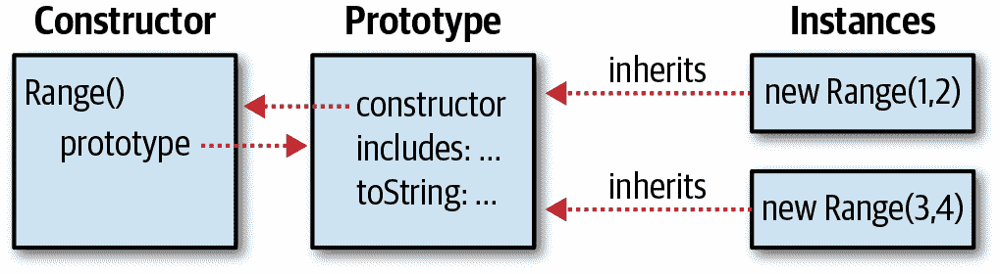

# 第九章：类

JavaScript 对象在第六章中有所涉及。该章将每个对象视为一组独特的属性，与其他对象不同。然而，通常有必要定义一种共享某些属性的对象*类*。类的成员或*实例*具有自己的属性来保存或定义它们的状态，但它们还具有定义其行为的方法。这些方法由类定义，并由所有实例共享。例如，想象一个名为 Complex 的类，表示并对复数执行算术运算。Complex 实例将具有保存复数的实部和虚部（状态）的属性。Complex 类将定义执行这些数字的加法和乘法（行为）的方法。

在 JavaScript 中，类使用基于原型的继承：如果两个对象从同一原型继承属性（通常是函数值属性或方法），那么我们说这些对象是同一类的实例。简而言之，这就是 JavaScript 类的工作原理。JavaScript 原型和继承在§6.2.3 和§6.3.2 中有所涉及，您需要熟悉这些部分的内容才能理解本章。本章在§9.1 中涵盖了原型。

如果两个对象从同一原型继承，这通常（但不一定）意味着它们是由同一构造函数或工厂函数创建和初始化的。构造函数在§4.6、§6.2.2 和§8.2.3 中有所涉及，本章在§9.2 中有更多内容。

JavaScript 一直允许定义类。ES6 引入了全新的语法（包括`class`关键字），使得创建类变得更加容易。这些新的 JavaScript 类与旧式类的工作方式相同，本章首先解释了创建类的旧方法，因为这更清楚地展示了在幕后使类起作用的原理。一旦我们解释了这些基础知识，我们将转而开始使用新的简化类定义语法。

如果您熟悉像 Java 或 C++这样的强类型面向对象编程语言，您会注意到 JavaScript 类与这些语言中的类有很大不同。虽然有一些语法上的相似之处，并且您可以在 JavaScript 中模拟许多“经典”类的特性，但最好事先了解 JavaScript 的类和基于原型的继承机制与 Java 和类似语言的类和基于类的继承机制有很大不同。

# 9.1 类和原型

在 JavaScript 中，类是一组从同一原型对象继承属性的对象。因此，原型对象是类的核心特征。第六章介绍了`Object.create()`函数，该函数返回一个从指定类型对象继承的新创建对象。如果我们定义一个原型对象，然后使用`Object.create()`创建从中继承的对象，我们就定义了一个 JavaScript 类。通常，类的实例需要进一步初始化，通常定义一个函数来创建和初始化新对象。示例 9-1 演示了这一点：它定义了一个代表值范围的类的原型对象，并定义了一个*工厂函数*，用于创建和初始化类的新实例。

##### 示例 9-1 一个简单的 JavaScript 类

```js
// This is a factory function that returns a new range object.
function range(from, to) {
    // Use Object.create() to create an object that inherits from the
    // prototype object defined below.  The prototype object is stored as
    // a property of this function, and defines the shared methods (behavior)
    // for all range objects.
    let r = Object.create(range.methods);

    // Store the start and end points (state) of this new range object.
    // These are noninherited properties that are unique to this object.
    r.from = from;
    r.to = to;

    // Finally return the new object
    return r;
}

// This prototype object defines methods inherited by all range objects.
range.methods = {
    // Return true if x is in the range, false otherwise
    // This method works for textual and Date ranges as well as numeric.
    includes(x) { return this.from <= x && x <= this.to; },

    // A generator function that makes instances of the class iterable.
    // Note that it only works for numeric ranges.
    *[Symbol.iterator]() {
        for(let x = Math.ceil(this.from); x <= this.to; x++) yield x;
    },

    // Return a string representation of the range
    toString() { return "(" + this.from + "..." + this.to + ")"; }
};

// Here are example uses of a range object.
let r = range(1,3);      // Create a range object
r.includes(2)            // => true: 2 is in the range
r.toString()             // => "(1...3)"
[...r]                   // => [1, 2, 3]; convert to an array via iterator
```

在示例 9-1 的代码中有一些值得注意的事项：

+   此代码定义了一个用于创建新 Range 对象的工厂函数`range()`。

+   它使用了`range()`函数的`methods`属性作为一个方便的存储原型对象的地方，该原型对象定义了类。将原型对象放在这里并没有什么特殊或成语化的地方。

+   `range()`函数在每个 Range 对象上定义了`from`和`to`属性。这些是定义每个独立 Range 对象的唯一状态的非共享、非继承属性。

+   `range.methods`对象使用了 ES6 的简写语法来定义方法，这就是为什么你在任何地方都看不到`function`关键字的原因。（查看§6.10.5 来回顾对象字面量简写方法语法。）

+   原型中的一个方法具有计算名称（§6.10.2），即`Symbol.iterator`，这意味着它正在为 Range 对象定义一个迭代器。这个方法的名称前缀为`*`，表示它是一个生成器函数而不是常规函数。迭代器和生成器在第十二章中有详细介绍。目前，要点是这个 Range 类的实例可以与`for/of`循环和`...`扩展运算符一起使用。

+   在`range.methods`中定义的共享的继承方法都使用了在`range()`工厂函数中初始化的`from`和`to`属性。为了引用它们，它们使用`this`关键字来引用通过其调用的对象。这种对`this`的使用是任何类的方法的基本特征。

# 9.2 类和构造函数

示例 9-1 演示了定义 JavaScript 类的一种简单方法。然而，这并不是惯用的做法，因为它没有定义*构造函数*。构造函数是为新创建的对象初始化而设计的函数。构造函数使用`new`关键字调用，如§8.2.3 所述。使用`new`调用构造函数会自动创建新对象，因此构造函数本身只需要初始化该新对象的状态。构造函数调用的关键特征是构造函数的`prototype`属性被用作新对象的原型。§6.2.3 介绍了原型并强调，几乎所有对象都有一个原型，但只有少数对象有一个`prototype`属性。最后，我们可以澄清这一点：函数对象具有`prototype`属性。这意味着使用相同构造函数创建的所有对象都继承自同一个对象，因此它们是同一类的成员。示例 9-2 展示了如何修改示例 9-1 的 Range 类以使用构造函数而不是工厂函数。示例 9-2 展示了在不支持 ES6 `class`关键字的 JavaScript 版本中创建类的惯用方法。即使现在`class`得到了很好的支持，仍然有很多旧的 JavaScript 代码定义类的方式就像这样，你应该熟悉这种习惯用法，这样你就可以阅读旧代码，并且当你使用`class`关键字时，你能理解发生了什么“底层”操作。

##### 示例 9-2。使用构造函数的 Range 类

```js
// This is a constructor function that initializes new Range objects.
// Note that it does not create or return the object. It just initializes this.
function Range(from, to) {
    // Store the start and end points (state) of this new range object.
    // These are noninherited properties that are unique to this object.
    this.from = from;
    this.to = to;
}

// All Range objects inherit from this object.
// Note that the property name must be "prototype" for this to work.
Range.prototype = {
    // Return true if x is in the range, false otherwise
    // This method works for textual and Date ranges as well as numeric.
    includes: function(x) { return this.from <= x && x <= this.to; },

    // A generator function that makes instances of the class iterable.
    // Note that it only works for numeric ranges.
    [Symbol.iterator]: function*() {
        for(let x = Math.ceil(this.from); x <= this.to; x++) yield x;
    },

    // Return a string representation of the range
    toString: function() { return "(" + this.from + "..." + this.to + ")"; }
};

// Here are example uses of this new Range class
let r = new Range(1,3);   // Create a Range object; note the use of new
r.includes(2)             // => true: 2 is in the range
r.toString()              // => "(1...3)"
[...r]                    // => [1, 2, 3]; convert to an array via iterator
```

值得仔细比较示例 9-1 和 9-2，并注意这两种定义类的技术之间的区别。首先，注意到我们将`range()`工厂函数重命名为`Range()`当我们将其转换为构造函数时。这是一个非常常见的编码约定：构造函数在某种意义上定义了类，而类的名称（按照约定）以大写字母开头。常规函数和方法的名称以小写字母开头。

接下来，请注意在示例末尾使用`new`关键字调用`Range()`构造函数，而`range()`工厂函数在没有使用`new`的情况下调用。示例 9-1 使用常规函数调用(§8.2.1)创建新对象，而示例 9-2 使用构造函数调用(§8.2.3)。因为使用`new`调用`Range()`构造函数，所以不需要调用`Object.create()`或采取任何操作来创建新对象。新对象在构造函数调用之前自动创建，并且可以作为`this`值访问。`Range()`构造函数只需初始化`this`。构造函数甚至不必返回新创建的对象。构造函数调用会自动创建一个新对象，将构造函数作为该对象的方法调用，并返回新对象。构造函数调用与常规函数调用如此不同的事实是我们给构造函数名称以大写字母开头的另一个原因。构造函数被编写为以构造函数方式调用，并且如果以常规函数方式调用，它们通常不会正常工作。将构造函数函数与常规函数区分开的命名约定有助于程序员知道何时使用`new`。

示例 9-1 和 9-2 之间的另一个关键区别是原型对象的命名方式。在第一个示例中，原型是`range.methods`。这是一个方便且描述性强的名称，但是任意的。在第二个示例中，原型是`Range.prototype`，这个名称是强制的。对`Range()`构造函数的调用会自动使用`Range.prototype`作为新 Range 对象的原型。

最后，还要注意示例 9-1 和 9-2 之间没有变化的地方：两个类的范围方法的定义和调用方式是相同的。因为示例 9-2 演示了在 ES6 之前 JavaScript 版本中创建类的惯用方式，它没有在原型对象中使用 ES6 的简写方法语法，并且明确用`function`关键字拼写出方法。但你可以看到两个示例中方法的实现是相同的。

重要的是，要注意两个范围示例在定义构造函数或方法时都没有使用箭头函数。回想一下§8.1.3 中提到的，以这种方式定义的函数没有`prototype`属性，因此不能用作构造函数。此外，箭头函数从定义它们的上下文中继承`this`关键字，而不是根据调用它们的对象设置它，这使它们对于方法是无用的，因为方法的定义特征是它们使用`this`来引用被调用的实例。

幸运的是，新的 ES6 类语法不允许使用箭头函数定义方法，因此在使用该语法时不会出现这种错误。我们很快将介绍 ES6 的`class`关键字，但首先，还有更多关于构造函数的细节需要讨论。

## 9.2.1 构造函数、类标识和 instanceof

正如我们所见，原型对象对于类的标识是至关重要的：两个对象只有在它们继承自相同的原型对象时才是同一类的实例。初始化新对象状态的构造函数并不是基本的：两个构造函数可能具有指向相同原型对象的`prototype`属性。然后，这两个构造函数都可以用于创建同一类的实例。

尽管构造函数不像原型那样基础，但构造函数作为类的公共面孔。最明显的是，构造函数的名称通常被采用为类的名称。例如，我们说 `Range()` 构造函数创建 Range 对象。然而，更根本的是，构造函数在测试对象是否属于类时作为 `instanceof` 运算符的右操作数。如果我们有一个对象 `r` 并想知道它是否是 Range 对象，我们可以写：

```js
r instanceof Range   // => true: r inherits from Range.prototype
```

`instanceof` 运算符在 §4.9.4 中有描述。左操作数应该是正在测试的对象，右操作数应该是命名类的构造函数。表达式 `o instanceof C` 在 `o` 继承自 `C.prototype` 时求值为 `true`。继承不必是直接的：如果 `o` 继承自继承自继承自 `C.prototype` 的对象，表达式仍将求值为 `true`。

从技术上讲，在前面的代码示例中，`instanceof` 运算符并不是在检查 `r` 是否实际由 `Range` 构造函数初始化。相反，它是在检查 `r` 是否继承自 `Range.prototype`。如果我们定义一个函数 `Strange()` 并将其原型设置为与 `Range.prototype` 相同，那么使用 `new Strange()` 创建的对象在 `instanceof` 方面将被视为 Range 对象（但实际上它们不会像 Range 对象一样工作，因为它们的 `from` 和 `to` 属性尚未初始化）：

```js
function Strange() {}
Strange.prototype = Range.prototype;
new Strange() instanceof Range   // => true
```

即使 `instanceof` 无法实际验证构造函数的使用，但它仍将构造函数作为其右操作数，因为构造函数是类的公共标识。

如果您想要测试对象的原型链以查找特定原型而不想使用构造函数作为中介，可以使用 `isPrototypeOf()` 方法。例如，在 示例 9-1 中，我们定义了一个没有构造函数的类，因此无法使用该类的 `instanceof`。然而，我们可以使用以下代码测试对象 `r` 是否是该无构造函数类的成员：

```js
range.methods.isPrototypeOf(r);  // range.methods is the prototype object.
```

## 9.2.2 构造函数属性

在 示例 9-2 中，我们将 `Range.prototype` 设置为一个包含我们类方法的新对象。虽然将这些方法表达为单个对象字面量的属性很方便，但实际上并不需要创建一个新对象。任何常规的 JavaScript 函数（不包括箭头函数、生成器函数和异步函数）都可以用作构造函数，并且构造函数调用需要一个 `prototype` 属性。因此，每个常规的 JavaScript 函数¹ 自动具有一个 `prototype` 属性。该属性的值是一个具有单个、不可枚举的 `constructor` 属性的对象。`constructor` 属性的值是函数对象：

```js
let F = function() {}; // This is a function object.
let p = F.prototype;   // This is the prototype object associated with F.
let c = p.constructor; // This is the function associated with the prototype.
c === F                // => true: F.prototype.constructor === F for any F
```

具有预定义原型对象及其 `constructor` 属性的存在意味着对象通常继承一个指向其构造函数的 `constructor` 属性。由于构造函数作为类的公共标识，这个构造函数属性给出了对象的类：

```js
let o = new F();      // Create an object o of class F
o.constructor === F   // => true: the constructor property specifies the class
```

图 9-1 展示了构造函数、其原型对象、原型指向构造函数的反向引用以及使用构造函数创建的实例之间的关系。



###### 图 9-1\. 一个构造函数、其原型和实例

注意图 9-1 使用我们的`Range()`构造函数作为示例。实际上，然而，在示例 9-2 中定义的 Range 类覆盖了预定义的`Range.prototype`对象为自己的对象。并且它定义的新原型对象没有`constructor`属性。因此，如定义的 Range 类的实例没有`constructor`属性。我们可以通过显式向原型添加构造函数来解决这个问题：

```js
Range.prototype = {
    constructor: Range,  // Explicitly set the constructor back-reference

    /* method definitions go here */
};
```

另一种在旧版 JavaScript 代码中常见的技术是使用预定义的原型对象及其具有`constructor`属性，并使用以下代码逐个添加方法：

```js
// Extend the predefined Range.prototype object so we don't overwrite
// the automatically created Range.prototype.constructor property.
Range.prototype.includes = function(x) {
    return this.from <= x && x <= this.to;
};
Range.prototype.toString = function() {
    return "(" + this.from + "..." + this.to + ")";
};
```

# 9.3 使用`class`关键字的类

类自从语言的第一个版本以来就一直是 JavaScript 的一部分，但在 ES6 中，它们终于得到了自己的语法，引入了`class`关键字。示例 9-3 展示了使用这种新语法编写的 Range 类的样子。

##### 示例 9-3. 使用*class*重写的 Range 类

```js
class Range {
    constructor(from, to) {
        // Store the start and end points (state) of this new range object.
        // These are noninherited properties that are unique to this object.
        this.from = from;
        this.to = to;
    }

    // Return true if x is in the range, false otherwise
    // This method works for textual and Date ranges as well as numeric.
    includes(x) { return this.from <= x && x <= this.to; }

    // A generator function that makes instances of the class iterable.
    // Note that it only works for numeric ranges.
    *[Symbol.iterator]() {
        for(let x = Math.ceil(this.from); x <= this.to; x++) yield x;
    }

    // Return a string representation of the range
    toString() { return `(${this.from}...${this.to})`; }
}

// Here are example uses of this new Range class
let r = new Range(1,3);   // Create a Range object
r.includes(2)             // => true: 2 is in the range
r.toString()              // => "(1...3)"
[...r]                    // => [1, 2, 3]; convert to an array via iterator
```

重要的是要理解，在示例 9-2 和 9-3 中定义的类的工作方式完全相同。引入`class`关键字到语言中并不改变 JavaScript 基于原型的类的基本性质。尽管示例 9-3 使用了`class`关键字，但生成的 Range 对象是一个构造函数，就像在示例 9-2 中定义的版本一样。新的`class`语法干净方便，但最好将其视为对在示例 9-2 中显示的更基本的类定义机制的“语法糖”。

注意示例 9-3 中类语法的以下几点：

+   使用`class`关键字声明类，后面跟着类名和用大括号括起来的类体。

+   类体包括使用对象字面量方法简写的方法定义（我们在示例 9-1 中也使用了），其中省略了`function`关键字。然而，与对象字面量不同，没有逗号用于将方法彼此分隔开。 （尽管类体在表面上与对象字面量相似，但它们并不是同一回事。特别是，它们不支持使用名称/值对定义属性。）

+   关键字`constructor`用于为类定义构造函数。但实际上定义的函数并不真正命名为`constructor`。`class`声明语句定义了一个新变量`Range`，并将这个特殊的`constructor`函数的值赋给该变量。

+   如果你的类不需要进行任何初始化，你可以省略`constructor`关键字及其主体，将为你隐式创建一个空的构造函数。

如果你想定义一个继承自另一个类的类，你可以使用`extends`关键字和`class`关键字：

```js
// A Span is like a Range, but instead of initializing it with
// a start and an end, we initialize it with a start and a length
class Span extends Range {
    constructor(start, length) {
        if (length >= 0) {
            super(start, start + length);
        } else {
            super(start + length, start);
        }
    }
}
```

创建子类是一个独立的主题。我们将在§9.5 中返回并解释这里显示的`extends`和`super`关键字。

类声明与函数声明一样，既有语句形式又有表达式形式。就像我们可以写：

```js
let square = function(x) { return x * x; };
square(3)  // => 9
```

我们也可以写：

```js
let Square = class { constructor(x) { this.area = x * x; } };
new Square(3).area  // => 9
```

与函数定义表达式一样，类定义表达式可以包括一个可选的类名。如果提供了这样的名称，那个名称仅在类体内部定义。

尽管函数表达式非常常见（特别是使用箭头函数简写），在 JavaScript 编程中，类定义表达式不是你经常使用的东西，除非你发现自己正在编写一个以类作为参数并返回子类的函数。

我们将通过提及一些重要的事项来结束对`class`关键字的介绍，这些事项从`class`语法中并不明显：

+   `class`声明体内的所有代码都隐式地处于严格模式中（§5.6.3），即使没有出现`"use strict"`指令。这意味着，例如，你不能在类体内使用八进制整数字面量或`with`语句，并且如果你忘记在使用之前声明一个变量，你更有可能得到语法错误。

+   与函数声明不同，类声明不会“被提升”。回想一下§8.1.1 中提到的函数定义行为，就好像它们已经被移动到了包含文件或包含函数的顶部，这意味着你可以在实际函数定义之前的代码中调用函数。尽管类声明在某些方面类似于函数声明，但它们不共享这种提升行为：你*不能*在声明类之前实例化它。

## 9.3.1 静态方法

你可以通过在`class`体中的方法声明前加上`static`关键字来定义一个静态方法。静态方法被定义为构造函数的属性，而不是原型对象的属性。

例如，假设我们在示例 9-3 中添加了以下代码：

```js
static parse(s) {
    let matches = s.match(/^\((\d+)\.\.\.(\d+)\)$/);
    if (!matches) {
        throw new TypeError(`Cannot parse Range from "${s}".`)
    }
    return new Range(parseInt(matches[1]), parseInt(matches[2]));
}
```

这段代码定义的方法是`Range.parse()`，而不是`Range.prototype.parse()`，你必须通过构造函数调用它，而不是通过实例调用：

```js
let r = Range.parse('(1...10)'); // Returns a new Range object
r.parse('(1...10)');             // TypeError: r.parse is not a function
```

有时你会看到静态方法被称为*类方法*，因为它们是使用类/构造函数的名称调用的。当使用这个术语时，是为了将类方法与在类的实例上调用的常规*实例方法*进行对比。因为静态方法是在构造函数上调用而不是在任何特定实例上调用，所以在静态方法中几乎不可能使用`this`关键字。

我们将在示例 9-4 中看到静态方法的示例。

## 9.3.2 获取器、设置器和其他方法形式

在`class`体内，你可以像在对象字面量中一样定义获取器和设置器方法（§6.10.6），唯一的区别是在类体中，你不在获取器或设置器后面加逗号。示例 9-4 包括了一个类中获取器方法的实际示例。

一般来说，在对象字面量中允许的所有简写方法定义语法在类体中也是允许的。这包括生成器方法（用`*`标记）和方法的名称是方括号中表达式的值的方法。事实上，你已经在示例 9-3 中看到了一个具有计算名称的生成器方法，使得 Range 类可迭代：

```js
*[Symbol.iterator]() {
    for(let x = Math.ceil(this.from); x <= this.to; x++) yield x;
}
```

## 9.3.3 公共、私有和静态字段

在这里讨论使用`class`关键字定义的类时，我们只描述了类体内的方法定义。ES6 标准只允许创建方法（包括获取器、设置器和生成器）和静态方法；它不包括定义字段的语法。如果你想在类实例上定义一个字段（这只是面向对象的“属性”同义词），你必须在构造函数中或在其中一个方法中进行定义。如果你想为一个类定义一个静态字段，你必须在类体之外，在类定义之后进行定义。示例 9-4 包括了这两种字段的示例。

然而，标准化正在进行中，允许扩展类语法来定义实例和静态字段，包括公共和私有形式。截至 2020 年初，本节其余部分展示的代码尚不是标准 JavaScript，但已经在 Chrome 中得到支持，并在 Firefox 中部分支持（仅支持公共实例字段）。公共实例字段的语法已经被使用 React 框架和 Babel 转译器的 JavaScript 程序员广泛使用。

假设你正在编写一个像这样的类，其中包含一个初始化三个字段的构造函数：

```js
class Buffer {
    constructor() {
        this.size = 0;
        this.capacity = 4096;
        this.buffer = new Uint8Array(this.capacity);
    }
}
```

使用可能会被标准化的新实例字段语法，你可以这样写：

```js
class Buffer {
    size = 0;
    capacity = 4096;
    buffer = new Uint8Array(this.capacity);
}
```

字段初始化代码已经从构造函数中移出，现在直接出现在类体中。（当然，该代码仍然作为构造函数的一部分运行。如果你没有定义构造函数，那么字段将作为隐式创建的构造函数的一部分进行初始化。）出现在赋值左侧的`this.`前缀已经消失，但请注意，即使在初始化赋值的右侧，你仍然必须使用`this.`来引用这些字段。以这种方式初始化实例字段的优势在于，这种语法允许（但不要求）你将初始化器放在类定义的顶部，清楚地告诉读者每个实例的状态将由哪些字段保存。你可以通过只写字段名称后跟一个分号来声明没有初始化器的字段。如果这样做，字段的初始值将为`undefined`。对于所有类字段，始终明确指定初始值是更好的风格。

在添加此字段语法之前，类体看起来很像使用快捷方法语法的对象文字，只是逗号已被移除。这种带有等号和分号而不是冒号和逗号的字段语法清楚地表明类体与对象文字完全不同。

与寻求标准化这些实例字段的提案相同，还定义了私有实例字段。如果你使用前面示例中显示的实例字段初始化语法来定义一个以`#`开头的字段（这在 JavaScript 标识符中通常不是合法字符），那么该字段将可以在类体内（带有`#`前缀）使用，但对于类体外的任何代码来说是不可见和不可访问的（因此是不可变的）。如果对于前面的假设的 Buffer 类，你希望确保类的用户不能无意中修改实例的`size`字段，那么你可以使用一个私有的`#size`字段，然后定义一个获取器函数来提供只读访问权限：

```js
class Buffer {
    #size = 0;
    get size() { return this.#size; }
}
```

请注意，私有字段必须在使用之前使用这种新字段语法进行声明。除非在类体中直接包含字段的“声明”，否则不能在类的构造函数中只写`this.#size = 0;`。

最后，一个相关的提案旨在标准化`static`关键字用于字段。如果在公共或私有字段声明之前添加`static`，那么这些字段将作为构造函数的属性而不是实例的属性创建。考虑我们定义的静态`Range.parse()`方法。它包含一个可能很好地分解为自己的静态字段的相当复杂的正则表达式。使用提议的新静态字段语法，我们可以这样做：

```js
static integerRangePattern = /^\((\d+)\.\.\.(\d+)\)$/;
static parse(s) {
    let matches = s.match(Range.integerRangePattern);
    if (!matches) {
        throw new TypeError(`Cannot parse Range from "${s}".`)
    }
    return new Range(parseInt(matches[1]), matches[2]);
}
```

如果我们希望这个静态字段只能在类内部访问，我们可以使用类似`#pattern`的私有名称。

## 9.3.4 示例：复数类

示例 9-4 定义了一个表示复数的类。这个类相对简单，但包括实例方法（包括获取器）、静态方法、实例字段和静态字段。它包含了一些被注释掉的代码，演示了我们如何使用尚未标准化的语法来在类体内定义实例字段和静态字段。

##### 示例 9-4\. Complex.js：一个复数类

```js
/**
 * Instances of this Complex class represent complex numbers.
 * Recall that a complex number is the sum of a real number and an
 * imaginary number and that the imaginary number i is the square root of -1.
 */
class Complex {
    // Once class field declarations are standardized, we could declare
    // private fields to hold the real and imaginary parts of a complex number
    // here, with code like this:
    //
    // #r = 0;
    // #i = 0;

    // This constructor function defines the instance fields r and i on every
    // instance it creates. These fields hold the real and imaginary parts of
    // the complex number: they are the state of the object.
    constructor(real, imaginary) {
        this.r = real;       // This field holds the real part of the number.
        this.i = imaginary;  // This field holds the imaginary part.
    }

    // Here are two instance methods for addition and multiplication
    // of complex numbers. If c and d are instances of this class, we
    // might write c.plus(d) or d.times(c)
    plus(that) {
        return new Complex(this.r + that.r, this.i + that.i);
    }
    times(that) {
        return new Complex(this.r * that.r - this.i * that.i,
                           this.r * that.i + this.i * that.r);
    }

    // And here are static variants of the complex arithmetic methods.
    // We could write Complex.sum(c,d) and Complex.product(c,d)
    static sum(c, d) { return c.plus(d); }
    static product(c, d) { return c.times(d); }

    // These are some instance methods that are defined as getters
    // so they're used like fields. The real and imaginary getters would
    // be useful if we were using private fields this.#r and this.#i
    get real() { return this.r; }
    get imaginary() { return this.i; }
    get magnitude() { return Math.hypot(this.r, this.i); }

    // Classes should almost always have a toString() method
    toString() { return `{${this.r},${this.i}}`; }

    // It is often useful to define a method for testing whether
    // two instances of your class represent the same value
    equals(that) {
        return that instanceof Complex &&
            this.r === that.r &&
            this.i === that.i;
    }

    // Once static fields are supported inside class bodies, we could
    // define a useful Complex.ZERO constant like this:
    // static ZERO = new Complex(0,0);
}

// Here are some class fields that hold useful predefined complex numbers.
Complex.ZERO = new Complex(0,0);
Complex.ONE = new Complex(1,0);
Complex.I = new Complex(0,1);
```

使用示例 9-4 中定义的 Complex 类，我们可以使用构造函数、实例字段、实例方法、类字段和类方法的代码如下：

```js
let c = new Complex(2, 3);     // Create a new object with the constructor
let d = new Complex(c.i, c.r); // Use instance fields of c
c.plus(d).toString()           // => "{5,5}"; use instance methods
c.magnitude                    // => Math.hypot(2,3); use a getter function
Complex.product(c, d)          // => new Complex(0, 13); a static method
Complex.ZERO.toString()        // => "{0,0}"; a static property
```

# 9.4 为现有类添加方法

JavaScript 的基于原型的继承机制是动态的：一个对象从其原型继承属性，即使原型的属性在对象创建后发生变化。这意味着我们可以通过简单地向其原型对象添加新方法来增强 JavaScript 类。

例如，这里是为计算复共轭添加一个方法到示例 9-4 的 Complex 类的代码：

```js
// Return a complex number that is the complex conjugate of this one.
Complex.prototype.conj = function() { return new Complex(this.r, -this.i); };
```

JavaScript 内置类的原型对象也是开放的，这意味着我们可以向数字、字符串、数组、函数等添加方法。这对于在语言的旧版本中实现新的语言特性很有用：

```js
// If the new String method startsWith() is not already defined...
if (!String.prototype.startsWith) {
    // ...then define it like this using the older indexOf() method.
    String.prototype.startsWith = function(s) {
        return this.indexOf(s) === 0;
    };
}
```

这里是另一个例子：

```js
// Invoke the function f this many times, passing the iteration number
// For example, to print "hello" 3 times:
//     let n = 3;
//     n.times(i => { console.log(`hello ${i}`); });
Number.prototype.times = function(f, context) {
    let n = this.valueOf();
    for(let i = 0; i < n; i++) f.call(context, i);
};
```

像这样向内置类型的原型添加方法通常被认为是一个坏主意，因为如果 JavaScript 的新版本定义了同名方法，将会导致混乱和兼容性问题。甚至可以向`Object.prototype`添加方法，使其对所有对象可用。但这绝不是一个好主意，因为添加到`Object.prototype`的属性对`for/in`循环可见（尽管您可以通过使用`Object.defineProperty()`[§14.1]使新属性不可枚举来避免这种情况）。

# 9.5 子类

在面向对象编程中，一个类 B 可以*扩展*或*子类化*另一个类 A。我们说 A 是*超类*，B 是*子类*。B 的实例继承 A 的方法。类 B 可以定义自己的方法，其中一些可能会*覆盖*类 A 定义的同名方法。如果 B 的方法覆盖了 A 的方法，那么 B 中的覆盖方法通常需要调用 A 中被覆盖的方法。同样，子类构造函数`B()`通常必须调用超类构造函数`A()`，以确保实例完全初始化。

本节首先展示了如何以旧的、ES6 之前的方式定义子类，然后迅速转向演示使用`class`和`extends`关键字以及使用`super`关键字调用超类构造方法的子类化。接下来是一个关于避免子类化，依靠对象组合而不是继承的子节。本节以一个定义了一系列 Set 类的扩展示例结束，并演示了如何使用抽象类来将接口与实现分离。

## 9.5.1 子类和原型

假设我们想要定义一个 Span 子类，继承自示例 9-2 的 Range 类。这个子类将像 Range 一样工作，但不是用起始和结束来初始化，而是指定一个起始和一个距离，或者跨度。Span 类的一个实例也是 Range 超类的一个实例。跨度实例从`Span.prototype`继承了一个定制的`toString()`方法，但为了成为 Range 的子类，它还必须从`Range.prototype`继承方法（如`includes()`）。

##### 示例 9-5\. Span.js：Range 的一个简单子类

```js
// This is the constructor function for our subclass
function Span(start, span) {
    if (span >= 0) {
        this.from = start;
        this.to = start + span;
    } else {
        this.to = start;
        this.from = start + span;
    }
}

// Ensure that the Span prototype inherits from the Range prototype
Span.prototype = Object.create(Range.prototype);

// We don't want to inherit Range.prototype.constructor, so we
// define our own constructor property.
Span.prototype.constructor = Span;

// By defining its own toString() method, Span overrides the
// toString() method that it would otherwise inherit from Range.
Span.prototype.toString = function() {
    return `(${this.from}... +${this.to - this.from})`;
};
```

为了使 Span 成为 Range 的一个子类，我们需要让`Span.prototype`从`Range.prototype`继承。在前面示例中的关键代码行是这一行，如果这对你有意义，你就理解了 JavaScript 中子类是如何工作的：

```js
Span.prototype = Object.create(Range.prototype);
```

使用`Span()`构造函数创建的对象将从`Span.prototype`对象继承。但我们创建该对象是为了从`Range.prototype`继承，因此 Span 对象将同时从`Span.prototype`和`Range.prototype`继承。

你可能注意到我们的`Span()`构造函数设置了与`Range()`构造函数相同的`from`和`to`属性，因此不需要调用`Range()`构造函数来初始化新对象。类似地，Span 的`toString()`方法完全重新实现了字符串转换，而不需要调用 Range 的`toString()`版本。这使 Span 成为一个特殊情况，我们只能在了解超类的实现细节时才能这样做。一个健壮的子类化机制需要允许类调用其超类的方法和构造函数，但在 ES6 之前，JavaScript 没有简单的方法来做这些事情。

幸运的是，ES6 通过`super`关键字作为`class`语法的一部分解决了这些问题。下一节将演示它是如何工作的。

## 9.5.2 使用 extends 和 super 创建子类

在 ES6 及更高版本中，你可以通过在类声明中添加`extends`子句来简单地创建一个超类，甚至可以对内置类这样做：

```js
// A trivial Array subclass that adds getters for the first and last elements.
class EZArray extends Array {
    get first() { return this[0]; }
    get last() { return this[this.length-1]; }
}

let a = new EZArray();
a instanceof EZArray  // => true: a is subclass instance
a instanceof Array    // => true: a is also a superclass instance.
a.push(1,2,3,4);      // a.length == 4; we can use inherited methods
a.pop()               // => 4: another inherited method
a.first               // => 1: first getter defined by subclass
a.last                // => 3: last getter defined by subclass
a[1]                  // => 2: regular array access syntax still works.
Array.isArray(a)      // => true: subclass instance really is an array
EZArray.isArray(a)    // => true: subclass inherits static methods, too!
```

这个 EZArray 子类定义了两个简单的 getter 方法。EZArray 的实例表现得像普通数组，我们可以使用继承的方法和属性，比如`push()`、`pop()`和`length`。但我们也可以使用子类中定义的`first`和`last` getter。不仅实例方法像`pop()`被继承了，静态方法像`Array.isArray`也被继承了。这是 ES6 类语法启用的一个新特性：`EZArray()`是一个函数，但它继承自`Array()`：

```js
// EZArray inherits instance methods because EZArray.prototype
// inherits from Array.prototype
Array.prototype.isPrototypeOf(EZArray.prototype) // => true

// And EZArray inherits static methods and properties because
// EZArray inherits from Array. This is a special feature of the
// extends keyword and is not possible before ES6.
Array.isPrototypeOf(EZArray) // => true
```

我们的 EZArray 子类过于简单，无法提供很多指导性。示例 9-6 是一个更加完整的示例。它定义了一个 TypedMap 的子类，继承自内置的 Map 类，并添加了类型检查以确保地图的键和值是指定类型（根据`typeof`）。重要的是，这个示例演示了使用`super`关键字来调用超类的构造函数和方法。

##### 示例 9-6\. TypedMap.js：检查键和值类型的 Map 子类

```js
class TypedMap extends Map {
    constructor(keyType, valueType, entries) {
        // If entries are specified, check their types
        if (entries) {
            for(let [k, v] of entries) {
                if (typeof k !== keyType || typeof v !== valueType) {
                    throw new TypeError(`Wrong type for entry [${k}, ${v}]`);
                }
            }
        }

        // Initialize the superclass with the (type-checked) initial entries
        super(entries);

        // And then initialize this subclass by storing the types
        this.keyType = keyType;
        this.valueType = valueType;
    }

    // Now redefine the set() method to add type checking for any
    // new entries added to the map.
    set(key, value) {
        // Throw an error if the key or value are of the wrong type
        if (this.keyType && typeof key !== this.keyType) {
            throw new TypeError(`${key} is not of type ${this.keyType}`);
        }
        if (this.valueType && typeof value !== this.valueType) {
            throw new TypeError(`${value} is not of type ${this.valueType}`);
        }

        // If the types are correct, we invoke the superclass's version of
        // the set() method, to actually add the entry to the map. And we
        // return whatever the superclass method returns.
        return super.set(key, value);
    }
}
```

`TypedMap()`构造函数的前两个参数是期望的键和值类型。这些应该是字符串，比如“number”和“boolean”，这是`typeof`运算符返回的。你还可以指定第三个参数：一个包含`[key,value]`数组的数组（或任何可迭代对象），指定地图中的初始条目。如果指定了任何初始条目，构造函数首先验证它们的类型是否正确。接下来，构造函数使用`super`关键字调用超类构造函数，就像它是一个函数名一样。`Map()`构造函数接受一个可选参数：一个包含`[key,value]`数组的可迭代对象。因此，`TypedMap()`构造函数的可选第三个参数是`Map()`构造函数的可选第一个参数，我们使用`super(entries)`将其传递给超类构造函数。

在调用超类构造函数初始化超类状态后，`TypedMap()`构造函数接下来通过设置`this.keyType`和`this.valueType`来初始化自己的子类状态。它需要设置这些属性以便在`set()`方法中再次使用它们。

在构造函数中使用`super()`时，有一些重要的规则你需要知道：

+   如果你用`extends`关键字定义一个类，那么你的类的构造函数必须使用`super()`来调用超类构造函数。

+   如果你在子类中没有定义构造函数，系统会自动为你定义一个。这个隐式定义的构造函数简单地接受传递给它的任何值，并将这些值传递给`super()`。

+   在调用`super()`之前，你不能在构造函数中使用`this`关键字。这强制了一个规则，即超类在子类之前初始化。

+   特殊表达式`new.target`在没有使用`new`关键字调用的函数中是未定义的。然而，在构造函数中，`new.target`是对被调用的构造函数的引用。当子类构造函数被调用并使用`super()`来调用超类构造函数时，那个超类构造函数将会把子类构造函数视为`new.target`的值。一个设计良好的超类不应该知道自己是否被子类化，但在日志消息中使用`new.target.name`可能会很有用。

在构造函数之后，示例 9-6 的下一部分是一个名为`set()`的方法。Map 超类定义了一个名为`set()`的方法来向地图添加新条目。我们说这个 TypedMap 中的`set()`方法*覆盖*了其超类的`set()`方法。这个简单的 TypedMap 子类对于向地图添加新条目一无所知，但它知道如何检查类型，所以首先进行类型检查，验证要添加到地图中的键和值是否具有正确的类型，如果不是则抛出错误。这个`set()`方法没有任何方法将键和值添加到地图本身，但这就是超类`set()`方法的作用。因此，我们再次使用`super`关键字来调用超类的方法版本。在这个上下文中，`super`的工作方式很像`this`关键字：它引用当前对象但允许访问在超类中定义的重写方法。

在构造函数中，你必须在访问`this`并自己初始化新对象之前调用超类构造函数。当你重写一个方法时，没有这样的规则。重写超类方法的方法不需要调用超类方法。如果它确实使用`super`来调用被重写的方法（或超类中的任何方法），它可以在重写方法的开始、中间或结尾进行调用。

最后，在我们离开 TypedMap 示例之前，值得注意的是，这个类是使用私有字段的理想候选。目前这个类的写法，用户可以更改`keyType`或`valueType`属性以规避类型检查。一旦支持私有字段，我们可以将这些属性更改为`#keyType`和`#valueType`，这样它们就无法从外部更改。

## 9.5.3 代理而非继承

`extends`关键字使创建子类变得容易。但这并不意味着你*应该*创建大量子类。如果你想编写一个共享某个其他类行为的类，你可以尝试通过创建子类来继承该行为。但通常更容易和更灵活的方法是通过让你的类创建另一个类的实例并根据需要简单地委托给该实例来获得所需的行为。你创建一个新类不是通过子类化，而是通过包装或“组合”其他类。这种委托方法通常被称为“组合”，并且面向对象编程的一个经常引用的格言是应该“优先选择组合而非继承”。²

例如，假设我们想要一个直方图类，其行为类似于 JavaScript 的 Set 类，但不仅仅是跟踪值是否已添加到集合中，而是维护值已添加的次数。因为这个直方图类的 API 类似于 Set，我们可以考虑继承 Set 并添加一个`count()`方法。另一方面，一旦我们开始考虑如何实现这个`count()`方法，我们可能会意识到直方图类更像是一个 Map 而不是一个 Set，因为它需要维护值和它们被添加的次数之间的映射关系。因此，我们可以创建一个定义了类似 Set API 的类，但通过委托给内部 Map 对象来实现这些方法。示例 9-7 展示了我们如何做到这一点。

##### 示例 9-7\. Histogram.js：使用委托实现的类似 Set 的类

```js
/**
 * A Set-like class that keeps track of how many times a value has
 * been added. Call add() and remove() like you would for a Set, and
 * call count() to find out how many times a given value has been added.
 * The default iterator yields the values that have been added at least
 * once. Use entries() if you want to iterate [value, count] pairs.
 */
class Histogram {
    // To initialize, we just create a Map object to delegate to
    constructor() { this.map = new Map(); }

    // For any given key, the count is the value in the Map, or zero
    // if the key does not appear in the Map.
    count(key) { return this.map.get(key) || 0; }

    // The Set-like method has() returns true if the count is non-zero
    has(key) { return this.count(key) > 0; }

    // The size of the histogram is just the number of entries in the Map.
    get size() { return this.map.size; }

    // To add a key, just increment its count in the Map.
    add(key) { this.map.set(key, this.count(key) + 1); }

    // Deleting a key is a little trickier because we have to delete
    // the key from the Map if the count goes back down to zero.
    delete(key) {
        let count = this.count(key);
        if (count === 1) {
            this.map.delete(key);
        } else if (count > 1) {
            this.map.set(key, count - 1);
        }
    }

    // Iterating a Histogram just returns the keys stored in it
    [Symbol.iterator]() { return this.map.keys(); }

    // These other iterator methods just delegate to the Map object
    keys() { return this.map.keys(); }
    values() { return this.map.values(); }
    entries() { return this.map.entries(); }
}
```

示例 9-7 中的`Histogram()`构造函数只是创建了一个 Map 对象。大多数方法都只是简单地委托给地图的一个方法，使得实现非常简单。因为我们使用了委托而不是继承，一个 Histogram 对象不是 Set 或 Map 的实例。但 Histogram 实现了许多常用的 Set 方法，在像 JavaScript 这样的无类型语言中，这通常已经足够了：正式的继承关系有时很好，但通常是可选的。

## 9.5.4 类层次结构和抽象类

示例 9-6 演示了我们如何继承 Map。示例 9-7 演示了我们如何委托给一个 Map 对象而不实际继承任何东西。使用 JavaScript 类来封装数据和模块化代码通常是一个很好的技术，你可能会经常使用`class`关键字。但你可能会发现你更喜欢组合而不是继承，并且很少需要使用`extends`（除非你使用要求你扩展其基类的库或框架）。

然而，在某些情况下，多级子类化是合适的，我们将以一个扩展示例结束本章，该示例演示了代表不同类型集合的类的层次结构。(示例 9-8 中定义的集合类与 JavaScript 内置的 Set 类类似，但不完全兼容。)

示例 9-8 定义了许多子类，但它还演示了如何定义*抽象类*——不包括完整实现的类——作为一组相关子类的共同超类。抽象超类可以定义所有子类继承和共享的部分实现。然后，子类只需要通过实现超类定义但未实现的抽象方法来定义自己的独特行为。请注意，JavaScript 没有任何正式定义抽象方法或抽象类的规定；我在这里仅仅是使用这个名称来表示未实现的方法和未完全实现的类。

示例 9-8 有很好的注释，可以独立运行。我鼓励你将其作为本章关于类的顶尖示例来阅读。在示例 9-8 中的最终类使用了`&`、`|`和`~`运算符进行大量的位操作，你可以在§4.8.3 中复习。

##### 示例 9-8\. Sets.js：抽象和具体集合类的层次结构

```js
/**
 * The AbstractSet class defines a single abstract method, has().
 */
class AbstractSet {
    // Throw an error here so that subclasses are forced
    // to define their own working version of this method.
    has(x) { throw new Error("Abstract method"); }
}

/**
 * NotSet is a concrete subclass of AbstractSet.
 * The members of this set are all values that are not members of some
 * other set. Because it is defined in terms of another set it is not
 * writable, and because it has infinite members, it is not enumerable.
 * All we can do with it is test for membership and convert it to a
 * string using mathematical notation.
 */
class NotSet extends AbstractSet {
    constructor(set) {
        super();
        this.set = set;
    }

    // Our implementation of the abstract method we inherited
    has(x) { return !this.set.has(x); }
    // And we also override this Object method
    toString() { return `{ x| x ∉ ${this.set.toString()} }`; }
}

/**
 * Range set is a concrete subclass of AbstractSet. Its members are
 * all values that are between the from and to bounds, inclusive.
 * Since its members can be floating point numbers, it is not
 * enumerable and does not have a meaningful size.
 */
class RangeSet extends AbstractSet {
    constructor(from, to) {
        super();
        this.from = from;
        this.to = to;
    }

    has(x) { return x >= this.from && x <= this.to; }
    toString() { return `{ x| ${this.from} ≤ x ≤ ${this.to} }`; }
}

/*
 * AbstractEnumerableSet is an abstract subclass of AbstractSet.  It defines
 * an abstract getter that returns the size of the set and also defines an
 * abstract iterator. And it then implements concrete isEmpty(), toString(),
 * and equals() methods on top of those. Subclasses that implement the
 * iterator, the size getter, and the has() method get these concrete
 * methods for free.
 */
class AbstractEnumerableSet extends AbstractSet {
    get size() { throw new Error("Abstract method"); }
    [Symbol.iterator]() { throw new Error("Abstract method"); }

    isEmpty() { return this.size === 0; }
    toString() { return `{${Array.from(this).join(", ")}}`; }
    equals(set) {
        // If the other set is not also Enumerable, it isn't equal to this one
        if (!(set instanceof AbstractEnumerableSet)) return false;

        // If they don't have the same size, they're not equal
        if (this.size !== set.size) return false;

        // Loop through the elements of this set
        for(let element of this) {
            // If an element isn't in the other set, they aren't equal
            if (!set.has(element)) return false;
        }

        // The elements matched, so the sets are equal
        return true;
    }
}

/*
 * SingletonSet is a concrete subclass of AbstractEnumerableSet.
 * A singleton set is a read-only set with a single member.
 */
class SingletonSet extends AbstractEnumerableSet {
    constructor(member) {
        super();
        this.member = member;
    }

    // We implement these three methods, and inherit isEmpty, equals()
    // and toString() implementations based on these methods.
    has(x) { return x === this.member; }
    get size() { return 1; }
    *[Symbol.iterator]() { yield this.member; }
}

/*
 * AbstractWritableSet is an abstract subclass of AbstractEnumerableSet.
 * It defines the abstract methods insert() and remove() that insert and
 * remove individual elements from the set, and then implements concrete
 * add(), subtract(), and intersect() methods on top of those. Note that
 * our API diverges here from the standard JavaScript Set class.
 */
class AbstractWritableSet extends  AbstractEnumerableSet {
    insert(x) { throw new Error("Abstract method"); }
    remove(x) { throw new Error("Abstract method"); }

    add(set) {
        for(let element of set) {
            this.insert(element);
        }
    }

    subtract(set) {
        for(let element of set) {
            this.remove(element);
        }
    }

    intersect(set) {
        for(let element of this) {
            if (!set.has(element)) {
                this.remove(element);
            }
        }
    }
}

/**
 * A BitSet is a concrete subclass of AbstractWritableSet with a
 * very efficient fixed-size set implementation for sets whose
 * elements are non-negative integers less than some maximum size.
 */
class BitSet extends AbstractWritableSet {
    constructor(max) {
        super();
        this.max = max;  // The maximum integer we can store.
        this.n = 0;      // How many integers are in the set
        this.numBytes = Math.floor(max / 8) + 1;   // How many bytes we need
        this.data = new Uint8Array(this.numBytes); // The bytes
    }

    // Internal method to check if a value is a legal member of this set
    _valid(x) { return Number.isInteger(x) && x >= 0 && x <= this.max; }

    // Tests whether the specified bit of the specified byte of our
    // data array is set or not. Returns true or false.
    _has(byte, bit) { return (this.data[byte] & BitSet.bits[bit]) !== 0; }

    // Is the value x in this BitSet?
    has(x) {
        if (this._valid(x)) {
            let byte = Math.floor(x / 8);
            let bit = x % 8;
            return this._has(byte, bit);
        } else {
            return false;
        }
    }

    // Insert the value x into the BitSet
    insert(x) {
        if (this._valid(x)) {               // If the value is valid
            let byte = Math.floor(x / 8);   // convert to byte and bit
            let bit = x % 8;
            if (!this._has(byte, bit)) {    // If that bit is not set yet
                this.data[byte] |= BitSet.bits[bit]; // then set it
                this.n++;                            // and increment set size
            }
        } else {
            throw new TypeError("Invalid set element: " + x );
        }
    }

    remove(x) {
        if (this._valid(x)) {              // If the value is valid
            let byte = Math.floor(x / 8);  // compute the byte and bit
            let bit = x % 8;
            if (this._has(byte, bit)) {    // If that bit is already set
                this.data[byte] &= BitSet.masks[bit];  // then unset it
                this.n--;                              // and decrement size
            }
        } else {
            throw new TypeError("Invalid set element: " + x );
        }
    }

    // A getter to return the size of the set
    get size() { return this.n; }

    // Iterate the set by just checking each bit in turn.
    // (We could be a lot more clever and optimize this substantially)
    *[Symbol.iterator]() {
        for(let i = 0; i <= this.max; i++) {
            if (this.has(i)) {
                yield i;
            }
        }
    }
}

// Some pre-computed values used by the has(), insert() and remove() methods
BitSet.bits = new Uint8Array([1, 2, 4, 8, 16, 32, 64, 128]);
BitSet.masks = new Uint8Array([~1, ~2, ~4, ~8, ~16, ~32, ~64, ~128]);
```

# 9.6 总结

本章已经解释了 JavaScript 类的关键特性：

+   同一类的对象从相同的原型对象继承属性。原型对象是 JavaScript 类的关键特性，可以仅使用`Object.create()`方法定义类。

+   在 ES6 之前，类通常是通过首先定义构造函数来定义的。使用`function`关键字创建的函数具有一个`prototype`属性，该属性的值是一个对象，当使用`new`作为构造函数调用函数时，该对象被用作所有创建的对象的原型。通过初始化这个原型对象，您可以定义类的共享方法。虽然原型对象是类的关键特征，但构造函数是类的公共标识。

+   ES6 引入了`class`关键字，使得定义类更容易，但在底层，构造函数和原型机制仍然保持不变。

+   子类是在类声明中使用`extends`关键字定义的。

+   子类可以使用`super`关键字调用其父类的构造函数或重写的方法。

¹ 除了 ES5 的`Function.bind()`方法返回的函数。绑定函数没有自己的原型属性，但如果作为构造函数调用它们，则它们使用基础函数的原型。

² 例如，参见 Erich Gamma 等人的*设计模式*（Addison-Wesley Professional）或 Joshua Bloch 的*Effective Java*（Addison-Wesley Professional）。
