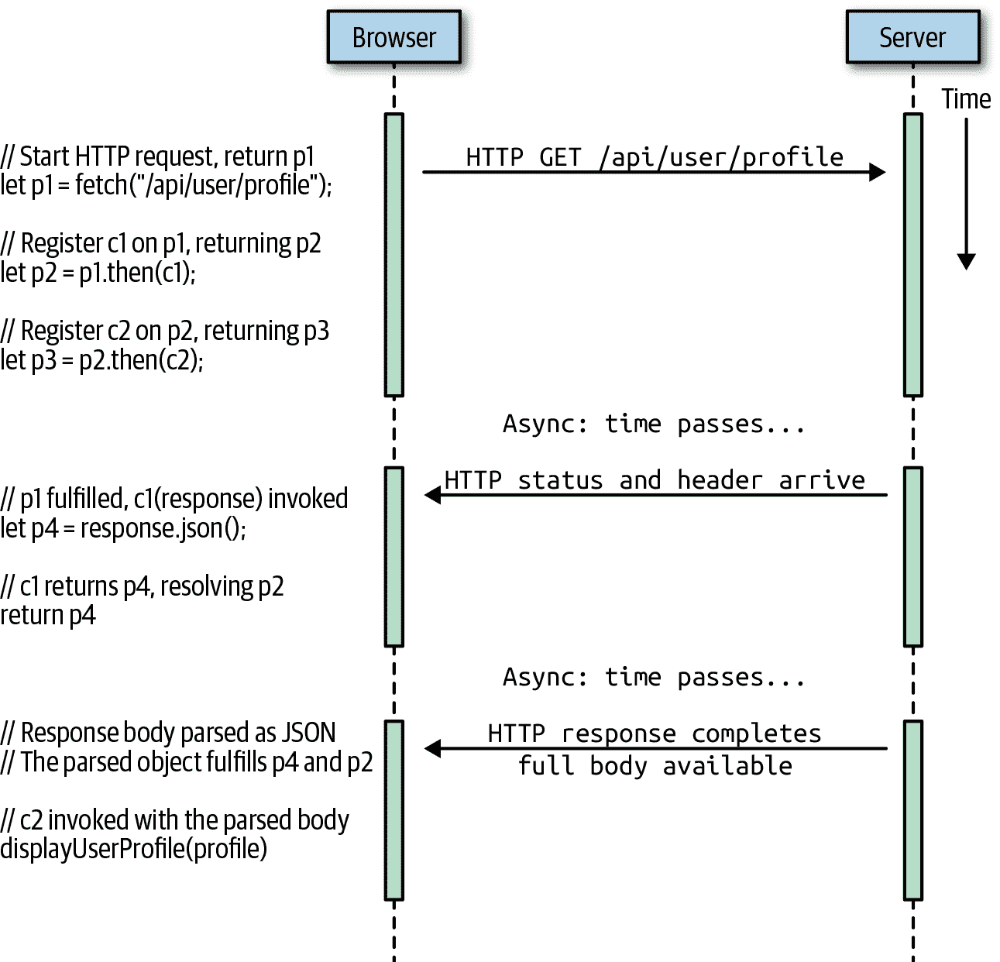

# 第十三章：异步 JavaScript

一些计算机程序，如科学模拟和机器学习模型，是计算密集型的：它们持续运行，不间断，直到计算出结果为止。然而，大多数现实世界的计算机程序都是显著*异步*的。这意味着它们经常需要在等待数据到达或某个事件发生时停止计算。在 Web 浏览器中，JavaScript 程序通常是*事件驱动*的，这意味着它们等待用户点击或轻触才会实际执行任何操作。而基于 JavaScript 的服务器通常在等待客户端请求通过网络到达之前不会执行任何操作。

这种异步编程在 JavaScript 中很常见，本章记录了三个重要的语言特性，帮助简化处理异步代码。Promise 是 ES6 中引入的对象，表示尚未可用的异步操作的结果。关键字`async`和`await`是在 ES2017 中引入的，通过允许你将基于 Promise 的代码结构化为同步的形式，简化了异步编程的语法。最后，在 ES2018 中引入了异步迭代器和`for/await`循环，允许你使用看似同步的简单循环处理异步事件流。

具有讽刺意味的是，尽管 JavaScript 提供了这些强大的功能来处理异步代码，但核心语法本身没有异步特性。因此，为了演示 Promise、`async`、`await`和`for/await`，我们将首先进入客户端和服务器端 JavaScript，解释 Web 浏览器和 Node 的一些异步特性。（你可以在第十五章和第十六章了解更多关于客户端和服务器端 JavaScript 的内容。）

# 13.1 使用回调进行异步编程

在 JavaScript 中，异步编程的最基本层次是通过*回调*完成的。回调是你编写并传递给其他函数的函数。当满足某些条件或发生某些（异步）事件时，另一个函数会调用（“回调”）你的函数。你提供的回调函数的调用会通知你条件或事件，并有时，调用会包括提供额外细节的函数参数。通过一些具体的例子更容易理解，接下来的小节演示了使用客户端 JavaScript 和 Node 进行基于回调的异步编程的各种形式。

## 13.1.1 定时器

最简单的异步之一是当你想在一定时间后运行一些代码时。正如我们在§11.10 中看到的，你可以使用`setTimeout()`函数来实现：

```js
setTimeout(checkForUpdates, 60000);
```

`setTimeout()`的第一个参数是一个函数，第二个是以毫秒为单位的时间间隔。在上述代码中，一个假设的`checkForUpdates()`函数将在`setTimeout()`调用后的 60,000 毫秒（1 分钟）后被调用。`checkForUpdates()`是你的程序可能定义的回调函数，`setTimeout()`是你调用以注册回调函数并指定在何种异步条件下调用它的函数。

`setTimeout()`调用指定的回调函数一次，不传递任何参数，然后忘记它。如果你正在编写一个真正检查更新的函数，你可能希望它重复运行。你可以使用`setInterval()`而不是`setTimeout()`来实现这一点：

```js
// Call checkForUpdates in one minute and then again every minute after that
let updateIntervalId = setInterval(checkForUpdates, 60000);

// setInterval() returns a value that we can use to stop the repeated
// invocations by calling clearInterval(). (Similarly, setTimeout()
// returns a value that you can pass to clearTimeout())
function stopCheckingForUpdates() {
    clearInterval(updateIntervalId);
}
```

## 13.1.2 事件

客户端 JavaScript 程序几乎普遍是事件驱动的：而不是运行某种预定的计算，它们通常等待用户执行某些操作，然后响应用户的动作。当用户在键盘上按键、移动鼠标、点击鼠标按钮或触摸触摸屏设备时，Web 浏览器会生成一个*事件*。事件驱动的 JavaScript 程序在指定的上下文中为指定类型的事件注册回调函数，当指定的事件发生时，Web 浏览器会调用这些函数。这些回调函数称为*事件处理程序*或*事件监听器*，并使用`addEventListener()`进行注册：

```js
// Ask the web browser to return an object representing the HTML
// <button> element that matches this CSS selector
let okay = document.querySelector('#confirmUpdateDialog button.okay');

// Now register a callback function to be invoked when the user
// clicks on that button.
okay.addEventListener('click', applyUpdate);
```

在这个例子中，`applyUpdate()`是一个我们假设在其他地方实现的虚构回调函数。调用`document.querySelector()`返回一个表示 Web 页面中单个指定元素的对象。我们在该元素上调用`addEventListener()`来注册我们的回调。然后`addEventListener()`的第一个参数是一个字符串，指定我们感兴趣的事件类型——在这种情况下是鼠标点击或触摸屏点击。如果用户点击或触摸 Web 页面的特定元素，那么浏览器将调用我们的`applyUpdate()`回调函数，传递一个包含有关事件的详细信息（如时间和鼠标指针坐标）的对象。

## 13.1.3 网络事件

JavaScript 编程中另一个常见的异步来源是网络请求。在浏览器中运行的 JavaScript 可以使用以下代码从 Web 服务器获取数据：

```js
function getCurrentVersionNumber(versionCallback) { // Note callback argument
    // Make a scripted HTTP request to a backend version API
    let request = new XMLHttpRequest();
    request.open("GET", "http://www.example.com/api/version");
    request.send();

    // Register a callback that will be invoked when the response arrives
    request.onload = function() {
        if (request.status === 200) {
            // If HTTP status is good, get version number and call callback.
            let currentVersion = parseFloat(request.responseText);
            versionCallback(null, currentVersion);
        } else {
            // Otherwise report an error to the callback
            versionCallback(response.statusText, null);
        }
    };
    // Register another callback that will be invoked for network errors
    request.onerror = request.ontimeout = function(e) {
        versionCallback(e.type, null);
    };
}
```

客户端 JavaScript 代码可以使用 XMLHttpRequest 类加上回调函数来进行 HTTP 请求，并在服务器响应到达时异步处理。¹ 这里定义的`getCurrentVersionNumber()`函数（我们可以想象它被假设的`checkForUpdates()`函数使用，我们在§13.1.1 中讨论过）发出 HTTP 请求，并定义在接收到服务器响应或超时或其他错误导致请求失败时将被调用的事件处理程序。

请注意，上面的代码示例不像我们之前的示例那样调用`addEventListener()`。对于大多数 Web API（包括此示例），可以通过在生成事件的对象上调用`addEventListener()`并传递感兴趣的事件名称以及回调函数来定义事件处理程序。通常，您也可以通过将其直接分配给对象的属性来注册单个事件监听器。这就是我们在这个示例代码中所做的，将函数分配给`onload`、`onerror`和`ontimeout`属性。按照惯例，像这样的事件监听器属性总是以*on*开头的名称。`addEventListener()`是更灵活的技术，因为它允许注册多个事件处理程序。但在确保没有其他代码需要为相同的对象和事件类型注册监听器的情况下，直接将适当的属性设置为您的回调可能更简单。

在这个示例代码中关于`getCurrentVersionNumber()`函数的另一点需要注意的是，由于它发出了一个异步请求，它无法同步返回调用者感兴趣的值（当前版本号）。相反，调用者传递一个回调函数，当结果准备就绪或发生错误时调用。在这种情况下，调用者提供了一个期望两个参数的回调函数。如果 XMLHttpRequest 正常工作，那么`getCurrentVersionNumber()`会用`null`作为第一个参数，版本号作为第二个参数调用回调。或者，如果发生错误，那么`getCurrentVersionNumber()`会用错误详细信息作为第一个参数，`null`作为第二个参数调用回调。

## 13.1.4 Node 中的回调和事件

Node.js 服务器端 JavaScript 环境是深度异步的，并定义了许多使用回调和事件的 API。例如，读取文件内容的默认 API 是异步的，并在文件内容被读取后调用回调函数：

```js
const fs = require("fs"); // The "fs" module has filesystem-related APIs
let options = {           // An object to hold options for our program
    // default options would go here
};

// Read a configuration file, then call the callback function
fs.readFile("config.json", "utf-8", (err, text) => {
    if (err) {
        // If there was an error, display a warning, but continue
        console.warn("Could not read config file:", err);
    } else {
        // Otherwise, parse the file contents and assign to the options object
        Object.assign(options, JSON.parse(text));
    }

    // In either case, we can now start running the program
    startProgram(options);
});
```

Node 的`fs.readFile()`函数将一个两参数回调作为其最后一个参数。它异步读取指定的文件，然后调用回调。如果文件成功读取，它将文件内容作为第二个回调参数传递。如果出现错误，它将错误作为第一个回调参数传递。在这个例子中，我们将回调表达为箭头函数，这是一种简洁和自然的语法，适用于这种简单操作。

Node 还定义了许多基于事件的 API。以下函数展示了如何在 Node 中请求 URL 的内容。它有两层通过事件监听器处理的异步代码。请注意，Node 使用`on()`方法来注册事件监听器，而不是`addEventListener()`：

```js
const https = require("https");

// Read the text content of the URL and asynchronously pass it to the callback.
function getText(url, callback) {
    // Start an HTTP GET request for the URL
    request = https.get(url);

    // Register a function to handle the "response" event.
    request.on("response", response => {
        // The response event means that response headers have been received
        let httpStatus = response.statusCode;

        // The body of the HTTP response has not been received yet.
        // So we register more event handlers to to be called when it arrives.
        response.setEncoding("utf-8");  // We're expecting Unicode text
        let body = "";                  // which we will accumulate here.

        // This event handler is called when a chunk of the body is ready
        response.on("data", chunk => { body += chunk; });

        // This event handler is called when the response is complete
        response.on("end", () => {
            if (httpStatus === 200) {   // If the HTTP response was good
                callback(null, body);   // Pass response body to the callback
            } else {                    // Otherwise pass an error
                callback(httpStatus, null);
            }
        });
    });

    // We also register an event handler for lower-level network errors
    request.on("error", (err) => {
        callback(err, null);
    });
}
```

# 13.2 承诺

现在我们已经在客户端和服务器端 JavaScript 环境中看到了回调和基于事件的异步编程的示例，我们可以介绍*承诺*，这是一个旨在简化异步编程的核心语言特性。

承诺是表示异步计算结果的对象。该结果可能已经准备好，也可能尚未准备好，承诺 API 故意对此保持模糊：没有同步获取承诺值的方法；您只能要求承诺在值准备好时调用回调函数。如果您正在定义一个类似前一节中的`getText()`函数的异步 API，但希望将其基于承诺，省略回调参数，而是返回一个承诺对象。调用者可以在这个承诺对象上注册一个或多个回调，当异步计算完成时，它们将被调用。

因此，在最简单的层面上，承诺只是一种与回调一起工作的不同方式。然而，使用它们有实际的好处。基于回调的异步编程的一个真正问题是，通常会出现回调内嵌在回调内嵌在回调中的情况，代码行缩进如此之深，以至于难以阅读。承诺允许将这种嵌套回调重新表达为更线性的*承诺链*，这样更容易阅读和推理。

回调函数的另一个问题是，它们可能会使处理错误变得困难。如果异步函数（或异步调用的回调）抛出异常，那么这个异常就无法传播回异步操作的发起者。这是关于异步编程的一个基本事实：它破坏了异常处理。另一种方法是通过回调参数和返回值来细致地跟踪和传播错误，但这样做很繁琐，很难做到正确。承诺在这里有所帮助，通过标准化处理错误的方式，并提供一种让错误正确传播通过一系列承诺的方法。

请注意，承诺代表单个异步计算的未来结果。然而，它们不能用于表示重复的异步计算。在本章的后面，我们将编写一个基于承诺的`setTimeout()`函数的替代方案。但我们不能使用承诺来替代`setInterval()`，因为该函数会重复调用回调函数，而这是承诺设计上不支持的。同样地，我们可以使用承诺来替代 XMLHttpRequest 对象的“load”事件处理程序，因为该回调只会被调用一次。但通常情况下，我们不会使用承诺来替代 HTML 按钮对象的“click”事件处理程序，因为我们通常希望允许用户多次点击按钮。

接下来的小节将：

+   解释承诺术语并展示基本承诺用法

+   展示 Promises 如何被链式调用

+   展示如何创建自己的基于 Promise 的 API

###### 重要

起初，Promise 似乎很简单，事实上，Promise 的基本用例确实简单明了。但是，对于超出最简单用例的任何情况，它们可能变得令人惊讶地令人困惑。Promise 是异步编程的强大习语，但你需要深入理解才能正确自信地使用它们。然而，花时间深入了解是值得的，我敦促你仔细研究这一长章节。

## 13.2.1 使用 Promises

随着 Promises 在核心 JavaScript 语言中的出现，Web 浏览器已经开始实现基于 Promise 的 API。在前一节中，我们实现了一个`getText()`函数，该函数发起了一个异步的 HTTP 请求，并将 HTTP 响应的主体作为字符串传递给指定的回调函数。想象一个这个函数的变体，`getJSON()`，它将 HTTP 响应的主体解析为 JSON，并返回一个 Promise，而不是接受一个回调参数。我们将在本章后面实现一个`getJSON()`函数，但现在，让我们看看如何使用这个返回 Promise 的实用函数：

```js
getJSON(url).then(jsonData => {
    // This is a callback function that will be asynchronously
    // invoked with the parsed JSON value when it becomes available.
});
```

`getJSON()`启动一个异步的 HTTP 请求，请求指定的 URL，然后，在该请求挂起期间，它返回一个 Promise 对象。Promise 对象定义了一个`then()`实例方法。我们不直接将回调函数传递给`getJSON()`，而是将其传递给`then()`方法。当 HTTP 响应到达时，该响应的主体被解析为 JSON，并将解析后的值传递给我们传递给`then()`的函数。

你可以将`then()`方法看作是一个回调注册方法，类似于用于在客户端 JavaScript 中注册事件处理程序的`addEventListener()`方法。如果多次调用 Promise 对象的`then()`方法，每个指定的函数都将在承诺的计算完成时被调用。

与许多事件侦听器不同，Promise 代表一个单一的计算，每个注册到`then()`的函数只会被调用一次。值得注意的是，无论何时调用`then()`，你传递给`then()`的函数都会异步调用，即使异步计算在调用`then()`时已经完成。

在简单的语法层面上，`then()`方法是 Promise 的独特特征，习惯上直接将`.then()`附加到返回 Promise 的函数调用上，而不是将 Promise 对象分配给变量的中间步骤。

习惯上，将返回 Promises 的函数和使用 Promises 结果的函数命名为动词，这些习惯导致的代码特别易于阅读：

```js
// Suppose you have a function like this to display a user profile
function displayUserProfile(profile) { /* implementation omitted */ }

// Here's how you might use that function with a Promise.
// Notice how this line of code reads almost like an English sentence:
getJSON("/api/user/profile").then(displayUserProfile);
```

### 使用 Promises 处理错误

异步操作，特别是涉及网络的操作，通常会以多种方式失败，必须编写健壮的代码来处理不可避免发生的错误。

对于 Promises，我们可以通过将第二个函数传递给`then()`方法来实现：

```js
getJSON("/api/user/profile").then(displayUserProfile, handleProfileError);
```

Promise 代表在 Promise 对象创建后发生的异步计算的未来结果。因为计算是在 Promise 对象返回给我们后执行的，所以传统上计算无法返回一个值或抛出我们可以捕获的异常。我们传递给`then()`的函数提供了替代方案。当同步计算正常完成时，它只是将其结果返回给调用者。当基于 Promise 的异步计算正常完成时，它将其结果传递给作为`then()`的第一个参数的函数。

当同步计算出现问题时，它会抛出一个异常，该异常会向上传播到调用堆栈，直到有一个`catch`子句来处理它。当异步计算运行时，其调用者不再在堆栈上，因此如果出现问题，就不可能将异常抛回给调用者。

相反，基于 Promise 的异步计算将异常（通常作为某种类型的 Error 对象，尽管这不是必需的）传递给`then()`的第二个函数。因此，在上面的代码中，如果`getJSON()`正常运行，它会将结果传递给`displayUserProfile()`。如果出现错误（用户未登录、服务器宕机、用户的互联网连接中断、请求超时等），那么`getJSON()`会将一个 Error 对象传递给`handleProfileError()`。

在实践中，很少看到两个函数传递给`then()`。在处理 Promise 时，有一种更好的、更符合习惯的处理错误的方式。要理解这一点，首先考虑一下如果`getJSON()`正常完成，但`displayUserProfile()`中出现错误会发生什么。当`getJSON()`返回时，回调函数会异步调用，因此它也是异步的，不能有意义地抛出异常（因为没有代码在调用堆栈上处理它）。

在这段代码中处理错误的更符合习惯的方式如下：

```js
getJSON("/api/user/profile").then(displayUserProfile).catch(handleProfileError);
```

使用这段代码，`getJSON()`的正常结果仍然会传递给`displayUserProfile()`，但是`getJSON()`或`displayUserProfile()`中的任何错误（包括`displayUserProfile`抛出的任何异常）都会传递给`handleProfileError()`。`catch()`方法只是调用`then()`的一种简写形式，第一个参数为`null`，第二个参数为指定的错误处理函数。

当我们讨论下一节的 Promise 链时，我们将会更多地谈到`catch()`和这种错误处理习惯。

## 13.2.2 链式 Promise

Promise 最重要的好处之一是它们提供了一种自然的方式来将一系列异步操作表达为`then()`方法调用的线性链，而无需将每个操作嵌套在前一个操作的回调中。例如，这里是一个假设的 Promise 链：

```js
fetch(documentURL)                      // Make an HTTP request
    .then(response => response.json())  // Ask for the JSON body of the response
    .then(document => {                 // When we get the parsed JSON
        return render(document);        // display the document to the user
    })
    .then(rendered => {                 // When we get the rendered document
        cacheInDatabase(rendered);      // cache it in the local database.
    })
    .catch(error => handle(error));     // Handle any errors that occur
```

这段代码说明了一系列 Promise 如何简单地表达一系列异步操作的过程。然而，我们不会讨论这个特定的 Promise 链。不过，我们将继续探讨使用 Promise 链进行 HTTP 请求的想法。

在本章的前面，我们看到了在 JavaScript 中使用 XMLHttpRequest 对象进行 HTTP 请求。这个奇怪命名的对象具有一个古老且笨拙的 API，它已经大部分被新的、基于 Promise 的 Fetch API（§15.11.1）所取代。在其最简单的形式中，这个新的 HTTP API 就是函数`fetch()`。你传递一个 URL 给它，它会返回一个 Promise。当 HTTP 响应开始到达并且 HTTP 状态和头部可用时，这个 Promise 就会被实现：

```js
fetch("/api/user/profile").then(response => {
    // When the promise resolves, we have status and headers
    if (response.ok &&
        response.headers.get("Content-Type") === "application/json") {
        // What can we do here? We don't actually have the response body yet.
    }
});
```

当`fetch()`返回的 Promise 被实现时，它会将一个 Response 对象传递给您传递给其`then()`方法的函数。这个响应对象让您可以访问请求状态和头部，并且还定义了像`text()`和`json()`这样的方法，分别以文本和 JSON  解析形式访问响应主体。但是尽管初始 Promise 被实现，响应主体可能尚未到达。因此，用于访问响应主体的这些`text()`和`json()`方法本身返回 Promise。以下是使用`fetch()`和`response.json()`方法获取 HTTP 响应主体的一种天真的方法：

```js
fetch("/api/user/profile").then(response => {
    response.json().then(profile => {  // Ask for the JSON-parsed body
        // When the body of the response arrives, it will be automatically
        // parsed as JSON and passed to this function.
        displayUserProfile(profile);
    });
});
```

这是一种天真地使用 Promise 的方式，因为我们像回调一样嵌套它们，这违背了初衷。更好的习惯是使用 Promise 在一个顺序链中编写代码，就像这样：

```js
fetch("/api/user/profile")
    .then(response => {
        return response.json();
    })
    .then(profile => {
        displayUserProfile(profile);
    });
```

让我们看一下这段代码中的方法调用，忽略传递给方法的参数：

```js
fetch().then().then()
```

当在一个表达式中调用多个方法时，我们称之为*方法链*。我们知道`fetch()`函数返回一个 Promise 对象，我们可以看到这个链中的第一个`.then()`调用在返回的 Promise 对象上调用一个方法。但是链中还有第二个`.then()`，这意味着`then()`方法的第一次调用本身必须返回一个 Promise。

有时，当设计 API 以使用这种方法链时，只有一个对象，并且该对象的每个方法都返回对象本身以便于链接。然而，这并不是 Promise 的工作方式。当我们编写一系列`.then()`调用时，我们并不是在单个 Promise 对象上注册多个回调。相反，`then()`方法的每次调用都会返回一个新的 Promise 对象。直到传递给`then()`的函数完成，新的 Promise 对象才会被实现。

让我们回到上面原始`fetch()`链的简化形式。如果我们在其他地方定义传递给`then()`调用的函数，我们可以重构代码如下：

```js
fetch(theURL)          // task 1; returns promise 1
    .then(callback1)   // task 2; returns promise 2
    .then(callback2);  // task 3; returns promise 3
```

让我们详细讨论一下这段代码：

1.  在第一行，使用一个 URL 调用`fetch()`。它为该 URL 发起一个 HTTP GET 请求并返回一个 Promise。我们将这个 HTTP 请求称为“任务 1”，将 Promise 称为“promise 1”。

1.  在第二行，我们调用 promise 1 的`then()`方法，传递我们希望在 promise 1 实现时调用的`callback1`函数。`then()`方法将我们的回调存储在某个地方，然后返回一个新的 Promise。我们将在这一步返回的新 Promise 称为“promise 2”，并且我们将说“任务 2”在调用`callback1`时开始。

1.  在第三行，我们调用 promise 2 的`then()`方法，传递我们希望在 promise 2 实现时调用的`callback2`函数。这个`then()`方法记住我们的回调并返回另一个 Promise。我们将说“任务 3”在调用`callback2`时开始。我们可以称这个最新的 Promise 为“promise 3”，但实际上我们不需要为它命名，因为我们根本不会使用它。

1.  前三个步骤都是在表达式首次执行时同步发生的。现在，在 HTTP 请求在步骤 1 中发出并通过互联网发送时，我们有一个异步暂停。

1.  最终，HTTP 响应开始到达。`fetch()`调用的异步部分将 HTTP 状态和标头包装在一个 Response 对象中，并使用该 Response 对象作为值来实现 promise 1。

1.  当 promise 1 被实现时，它的值（Response 对象）被传递给我们的`callback1()`函数，任务 2 开始。这个任务的工作是，给定一个 Response 对象作为输入，获取响应主体作为 JSON 对象。

1.  让我们假设任务 2 正常完成，并且能够解析 HTTP 响应的主体以生成一个 JSON 对象。这个 JSON 对象用于实现 promise 2。

1.  实现 promise 2 的值成为传递给`callback2()`函数时任务 3 的输入。当任务 3 完成（假设它正常完成）时，promise 3 将被实现。但因为我们从未对 promise 3 做任何操作，当该 Promise 完成时什么也不会发生，异步计算链在这一点结束。

## 13.2.3 解决 Promise

在上一节中解释了与列表中的 URL 获取 Promise 链相关的内容时，我们谈到了 promise 1、2 和 3。但实际上还涉及第四个 Promise 对象，这将引出我们对 Promise“解决”意味着什么的重要讨论。

请记住，`fetch()`返回一个 Promise 对象，当实现时，将传递一个 Response 对象给我们注册的回调函数。这个 Response 对象有`.text()`、`.json()`和其他方法以各种形式请求 HTTP 响应的主体。但是由于主体可能尚未到达，这些方法必须返回 Promise 对象。在我们一直在研究的示例中，“任务 2”调用`.json()`方法并返回其值。这是第四个 Promise 对象，也是`callback1()`函数的返回值。

让我们再次以冗长和非成语化的方式重写 URL 获取代码，使回调和 Promises 明确：

```js
function c1(response) {               // callback 1
    let p4 = response.json();
    return p4;                        // returns promise 4
}

function c2(profile) {                // callback 2
    displayUserProfile(profile);
}

let p1 = fetch("/api/user/profile");  // promise 1, task 1
let p2 = p1.then(c1);                 // promise 2, task 2
let p3 = p2.then(c2);                 // promise 3, task 3
```

为了使 Promise 链有用地工作，任务 2 的输出必须成为任务 3 的输入。在我们正在考虑的示例中，任务 3 的输入是获取的 URL 主体，解析为 JSON 对象。但是，正如我们刚才讨论的，回调`c1`的返回值不是 JSON 对象，而是该 JSON 对象的 Promise`p4`。这似乎是一个矛盾，但实际上不是：当`p1`被实现时，`c1`被调用，任务 2 开始。当`p2`被实现时，`c2`被调用，任务 3 开始。但是仅仅因为在调用`c1`时任务 2 开始，并不意味着任务 2 在`c1`返回时必须结束。毕竟，Promises 是关于管理异步任务的，如果任务 2 是异步的（在这种情况下是），那么在回调返回时该任务将尚未完成。

现在我们准备讨论您需要真正掌握 Promises 的最后一个细节。当您将回调`c`传递给`then()`方法时，`then()`返回一个 Promise`p`并安排在稍后的某个时间异步调用`c`。回调执行一些计算并返回一个值`v`。当回调返回时，`p`被*解析*为值`v`。当一个 Promise 被解析为一个不是 Promise 的值时，它会立即被实现为该值。因此，如果`c`返回一个非 Promise，那么返回值就成为`p`的值，`p`被实现，我们完成了。但是如果返回值`v`本身是一个 Promise，那么`p`被*解析但尚未实现*。在这个阶段，`p`不能解决，直到 Promise`v`解决。如果`v`被实现，那么`p`将被实现为相同的值。如果`v`被拒绝，那么`p`将因同样的原因被拒绝。这就是 Promise“解析”状态的含义：Promise 已经与另一个 Promise 关联或“锁定”。我们还不知道`p`是否会被实现或被拒绝，但是我们的回调`c`不再控制这一点。`p`“解析”意味着它的命运现在完全取决于 Promise`v`的发生。

让我们回到我们的 URL 获取示例。当`c1`返回`p4`时，`p2`被解析。但被解析并不意味着被实现，所以任务 3 还没有开始。当完整的 HTTP 响应主体可用时，`.json()`方法可以解析它并使用解析后的值来实现`p4`。当`p4`被实现时，`p2`也会自动被实现，具有相同的解析 JSON 值。此时，解析后的 JSON 对象被传递给`c2`，任务 3 开始。

这可能是 JavaScript 中最难理解的部分之一，您可能需要阅读本节不止一次。图 13-1 以可视化形式呈现了这个过程，可能有助于为您澄清。



###### 图 13-1\. 使用 Promises 获取 URL

## 13.2.4 更多关于 Promises 和错误

在本章的前面，我们看到您可以将第二个回调函数传递给`.then()`方法，并且如果 Promise 被拒绝，则将调用此第二个函数。当发生这种情况时，传递给此第二个回调函数的参数是一个值—通常是代表拒绝原因的 Error 对象。我们还了解到，通过向 Promise 链中添加`.catch()`方法调用来处理 Promise 相关的错误是不常见的（甚至是不成文的）。现在我们已经检查了 Promise 链，我们可以回到错误处理并更详细地讨论它。在讨论之前，我想强调的是，在进行异步编程时，仔细处理错误非常重要。对于同步代码，如果您省略了错误处理代码，您至少会得到一个异常和堆栈跟踪，以便您可以找出出了什么问题。对于异步代码，未处理的异常通常不会被报告，错误可能会悄无声息地发生，使得调试变得更加困难。好消息是，`.catch()`方法使得在处理 Promise 时处理错误变得容易。

### catch 和 finally 方法

Promise 的`.catch()`方法只是一种使用`null`作为第一个参数并将错误处理回调作为第二个参数调用`.then()`的简写方式。给定任何 Promise`p`和回调`c`，以下两行是等效的：

```js
p.then(null, c);
p.catch(c);
```

`.catch()`简写更受欢迎，因为它更简单，并且名称与`try/catch`异常处理语句中的`catch`子句匹配。正如我们讨论过的，普通异常在异步代码中不起作用。Promise 的`.catch()`方法是一种适用于异步代码的替代方法。当同步代码出现问题时，我们可以说异常“沿着调用堆栈上升”直到找到`catch`块。对于 Promise 链的异步链，类似的隐喻可能是错误“沿着链路下滑”，直到找到`.catch()`调用。

在 ES2018 中，Promise 对象还定义了一个`.finally()`方法，其目的类似于`try/catch/finally`语句中的`finally`子句。如果您在 Promise 链中添加一个`.finally()`调用，那么您传递给`.finally()`的回调将在您调用它的 Promise 完成时被调用。如果 Promise 完成或拒绝，都会调用您的回调，并且不会传递任何参数，因此您无法找出它是完成还是拒绝。但是，如果您需要在任一情况下运行某种清理代码（例如关闭打开的文件或网络连接），则`.finally()`回调是执行此操作的理想方式。与`.then()`和`.catch()`一样，`.finally()`返回一个新的 Promise 对象。`.finally()`回调的返回值通常被忽略，而由`.finally()`返回的 Promise 通常将使用与调用`.finally()`的 Promise 解析或拒绝的相同值解析或拒绝。但是，如果`.finally()`回调引发异常，则由`.finally()`返回的 Promise 将以该值拒绝。

我们在前几节中学习的 URL 获取代码没有进行任何错误处理。现在让我们通过代码的更实际版本来纠正这一点：

```js
fetch("/api/user/profile")    // Start the HTTP request
    .then(response => {       // Call this when status and headers are ready
        if (!response.ok) {   // If we got a 404 Not Found or similar error
            return null;      // Maybe user is logged out; return null profile
        }

        // Now check the headers to ensure that the server sent us JSON.
        // If not, our server is broken, and this is a serious error!
        let type = response.headers.get("content-type");
        if (type !== "application/json") {
            throw new TypeError(`Expected JSON, got ${type}`);
        }

        // If we get here, then we got a 2xx status and a JSON content-type
        // so we can confidently return a Promise for the response
        // body as a JSON object.
        return response.json();
    })
    .then(profile => {        // Called with the parsed response body or null
        if (profile) {
            displayUserProfile(profile);
        }
        else { // If we got a 404 error above and returned null we end up here
            displayLoggedOutProfilePage();
        }
    })
    .catch(e => {
        if (e instanceof NetworkError) {
            // fetch() can fail this way if the internet connection is down
            displayErrorMessage("Check your internet connection.");
        }
        else if (e instanceof TypeError) {
            // This happens if we throw TypeError above
            displayErrorMessage("Something is wrong with our server!");
        }
        else {
            // This must be some kind of unanticipated error
            console.error(e);
        }
    });
```

让我们通过分析当事情出错时会发生什么来分析这段代码。我们将使用之前使用的命名方案：`p1`是`fetch()`调用返回的 Promise。`p2`是第一个`.then()`调用返回的 Promise，`c1`是我们传递给该`.then()`调用的回调。`p3`是第二个`.then()`调用返回的 Promise，`c2`是我们传递给该调用的回调。最后，`c3`是我们传递给`.catch()`调用的回调。（该调用返回一个 Promise，但我们不需要通过名称引用它。）

可能失败的第一件事是 `fetch()` 请求本身。如果网络连接断开（或由于某种原因无法进行 HTTP 请求），那么 Promise `p1` 将被拒绝，并带有一个 NetworkError 对象。我们没有将错误处理回调函数作为第二个参数传递给 `.then()` 调用，因此 `p2` 也将以相同的 NetworkError 对象被拒绝。（如果我们向第一个 `.then()` 调用传递了错误处理程序，错误处理程序将被调用，如果它正常返回，`p2` 将被解析和/或完成，并带有该处理程序的返回值。）然而，没有处理程序，`p2` 被拒绝，然后 `p3` 由于相同原因被拒绝。此时，`c3` 错误处理回调被调用，并其中的 NetworkError 特定代码运行。

我们的代码可能失败的另一种方式是，如果我们的 HTTP 请求返回 404 Not Found 或其他 HTTP 错误。这些是有效的 HTTP 响应，因此 `fetch()` 调用不认为它们是错误。`fetch()` 将 404 Not Found 封装在一个 Response 对象中，并用该对象完成 `p1`，导致调用 `c1`。我们在 `c1` 中的代码检查 Response 对象的 `ok` 属性，以检测是否收到了正常的 HTTP 响应，并通过简单返回 `null` 处理这种情况。因为这个返回值不是一个 Promise，它立即完成 `p2`，并用这个值调用 `c2`。我们在 `c2` 中明确检查和处理 falsy 值，通过向用户显示不同的结果来处理这种情况。这是一个我们将异常条件视为非错误并在不使用错误处理程序的情况下处理它的案例。

如果我们得到一个正常的 HTTP 响应代码，但 Content-Type 头部未正确设置，`c1` 中会发生一个更严重的错误。我们的代码期望一个 JSON 格式的响应，所以如果服务器发送给我们 HTML、XML 或纯文本，我们将会遇到问题。`c1` 包含了检查 Content-Type 头部的代码。如果头部错误，它将把这视为一个不可恢复的问题并抛出一个 TypeError。当传递给 `.then()`（或 `.catch()`）的回调抛出一个值时，作为 `.then()` 调用的返回值的 Promise 将被拒绝，并带有该抛出的值。在这种情况下，引发 TypeError 的 `c1` 中的代码导致 `p2` 被拒绝，并带有该 TypeError 对象。由于我们没有为 `p2` 指定错误处理程序，`p3` 也将被拒绝。`c2` 将不会被调用，并且 TypeError 将传递给 `c3`，它具有明确检查和处理这种类型错误的代码。

关于这段代码有几点值得注意。首先，请注意，使用常规的同步 `throw` 语句抛出的错误对象最终会在 Promise 链中的 `.catch()` 方法调用中异步处理。这应该清楚地说明为什么这种简写方法优先于向 `.then()` 传递第二个参数，并且为什么在 Promise 链末尾使用 `.catch()` 调用是如此习惯化的。

在我们离开错误处理的话题之前，我想指出，虽然习惯于在每个 Promise 链的末尾使用 `.catch()` 来清理（或至少记录）链中发生的任何错误，但在 Promise 链的其他地方使用 `.catch()` 也是完全有效的。如果你的 Promise 链中的某个阶段可能会因错误而失败，并且如果错误是某种可恢复的错误，不应该阻止链的其余部分运行，那么你可以在链中插入一个 `.catch()` 调用，代码可能看起来像这样：

```js
startAsyncOperation()
    .then(doStageTwo)
    .catch(recoverFromStageTwoError)
    .then(doStageThree)
    .then(doStageFour)
    .catch(logStageThreeAndFourErrors);
```

请记住，您传递给 `.catch()` 的回调只有在前一个阶段的回调抛出错误时才会被调用。如果回调正常返回，那么 `.catch()` 回调将被跳过，并且前一个回调的返回值将成为下一个 `.then()` 回调的输入。还要记住，`.catch()` 回调不仅用于报告错误，还用于处理和恢复错误。一旦错误传递给 `.catch()` 回调，它就会停止在 Promise 链中传播。`.catch()` 回调可以抛出新错误，但如果它正常返回，那么返回值将用于解析和/或实现相关的 Promise，并且错误将停止传播。

让我们具体说明一下：在前面的代码示例中，如果 `startAsyncOperation()` 或 `doStageTwo()` 抛出错误，则将调用 `recoverFromStageTwoError()` 函数。如果 `recoverFromStageTwoError()` 正常返回，则其返回值将传递给 `doStageThree()`，异步操作将继续正常进行。另一方面，如果 `recoverFromStageTwoError()` 无法恢复，则它将抛出错误（或重新抛出传递给它的错误）。在这种情况下，`doStageThree()` 和 `doStageFour()` 都不会被调用，并且由 `recoverFromStageTwoError()` 抛出的错误将传递给 `logStageThreeAndFourErrors()`。

有时，在复杂的网络环境中，错误可能更多或更少地随机发生，通过简单地重试异步请求来处理这些错误可能是合适的。想象一下，您已经编写了一个基于 Promise 的操作来查询数据库：

```js
queryDatabase()
    .then(displayTable)
    .catch(displayDatabaseError);
```

现在假设瞬时网络负载问题导致失败率约为 1%。一个简单的解决方案可能是使用 `.catch()` 调用重试查询：

```js
queryDatabase()
    .catch(e => wait(500).then(queryDatabase))  // On failure, wait and retry
    .then(displayTable)
    .catch(displayDatabaseError);
```

如果假设的故障确实是随机的，那么添加这一行代码应该将您的错误率从 1% 降低到 0.01%。

## 13.2.5 并行的 Promises

我们花了很多时间讨论 Promise 链，用于顺序运行更大异步操作的异步步骤。但有时，我们希望并行执行多个异步操作。函数 `Promise.all()` 可以做到这一点。`Promise.all()` 接受一个 Promise 对象数组作为输入，并返回一个 Promise。如果任何输入 Promise 被拒绝，则返回的 Promise 将被拒绝。否则，它将以每个输入 Promise 的实现值数组实现。因此，例如，如果您想获取多个 URL 的文本内容，您可以使用以下代码：

```js
// We start with an array of URLs
const urls = [ /* zero or more URLs here */ ];
// And convert it to an array of Promise objects
promises = urls.map(url => fetch(url).then(r => r.text()));
// Now get a Promise to run all those Promises in parallel
Promise.all(promises)
    .then(bodies => { /* do something with the array of strings */ })
    .catch(e => console.error(e));
```

`Promise.all()` 稍微比之前描述的更灵活。输入数组可以包含 Promise 对象和非 Promise 值。如果数组的元素不是 Promise，则会被视为已实现 Promise 的值，并且会被简单地复制到输出数组中。

`Promise.all()` 返回的 Promise 在任何输入 Promise 被拒绝时也会被拒绝。这会立即发生在第一个拒绝时，而其他输入 Promise 仍在等待的情况下也可能发生。在 ES2020 中，`Promise.allSettled()` 接受一个输入 Promise 数组并返回一个 Promise，就像 `Promise.all()` 一样。但是 `Promise.allSettled()` 永远不会拒绝返回的 Promise，并且在所有输入 Promise 都已完成之前不会实现该 Promise。该 Promise 解析为一个对象数组，每个输入 Promise 都有一个对象。每个返回的对象都有一个 `status` 属性，设置为“fulfilled”或“rejected”。如果状态是“fulfilled”，那么对象还将有一个 `value` 属性，给出实现值。如果状态是“rejected”，那么对象还将有一个 `reason` 属性，给出相应 Promise 的错误或拒绝值：

```js
Promise.allSettled([Promise.resolve(1), Promise.reject(2), 3]).then(results => {
    results[0]  // => { status: "fulfilled", value: 1 }
    results[1]  // => { status: "rejected", reason: 2 }
    results[2]  // => { status: "fulfilled", value: 3 }
});
```

有时，您可能希望同时运行多个 Promise，但可能只关心第一个实现的值。在这种情况下，您可以使用`Promise.race()`而不是`Promise.all()`。它返回一个 Promise，当输入数组中的 Promise 中的第一个实现或拒绝时，该 Promise 将实现或拒绝。（或者，如果输入数组中有任何非 Promise 值，则简单地返回其中的第一个。）

## 13.2.6 创建 Promises

在许多先前的示例中，我们使用了返回 Promise 的函数`fetch()`，因为它是内置到 Web 浏览器中的最简单的返回 Promise 的函数之一。我们对 Promises 的讨论还依赖于假设的返回 Promise 的函数`getJSON()`和`wait()`。编写返回 Promises 的函数确实非常有用，本节展示了如何创建基于 Promise 的 API。特别是，我们将展示`getJSON()`和`wait()`的实现。

### 基于其他 Promises 的 Promises

如果您有其他返回 Promise 的函数作为起点，编写返回 Promise 的函数就很容易。给定一个 Promise，您可以通过调用`.then()`来创建（并返回）一个新的 Promise。因此，如果我们使用现有的`fetch()`函数作为起点，我们可以这样编写`getJSON()`：

```js
function getJSON(url) {
    return fetch(url).then(response => response.json());
}
```

代码很简单，因为`fetch()`API 的 Response 对象具有预定义的`json()`方法。`json()`方法返回一个 Promise，我们从回调中返回该 Promise（回调是一个带有单表达式主体的箭头函数，因此返回是隐式的），因此`getJSON()`返回的 Promise 解析为`response.json()`返回的 Promise。当该 Promise 实现时，由`getJSON()`返回的 Promise 也实现为相同的值。请注意，此`getJSON()`实现中没有错误处理。我们不检查`response.ok`和 Content-Type 头，而是允许`json()`方法拒绝返回的 Promise，如果响应主体无法解析为 JSON，则会引发 SyntaxError。

让我们再写一个返回 Promise 的函数，这次使用`getJSON()`作为初始 Promise 的来源。

```js
function getHighScore() {
    return getJSON("/api/user/profile").then(profile => profile.highScore);
}
```

我们假设这个函数是某种基于 Web 的游戏的一部分，并且 URL“/api/user/profile”返回一个包含`highScore`属性的 JSON 格式数据结构。

### 基于同步值的 Promises

有时，您可能需要实现现有的基于 Promise 的 API，并从函数返回一个 Promise，即使要执行的计算实际上不需要任何异步操作。在这种情况下，静态方法`Promise.resolve()`和`Promise.reject()`将实现您想要的效果。`Promise.resolve()`以其单个参数作为值，并返回一个将立即（但异步地）实现为该值的 Promise。类似地，`Promise.reject()`接受一个参数，并返回一个将以该值为原因拒绝的 Promise。（要明确：这些静态方法返回的 Promises 在返回时并未已实现或已拒绝，但它们将在当前同步代码块运行完毕后立即实现或拒绝。通常，除非有许多待处理的异步任务等待运行，否则这将在几毫秒内发生。）

请回顾§13.2.3 中的内容，已解决的 Promise 与已实现的 Promise 不是同一回事。当我们调用`Promise.resolve()`时，通常会传递实现值以创建一个 Promise 对象，该对象将很快实现为该值。但是该方法的名称不是`Promise.fulfill()`。如果将 Promise`p1`传递给`Promise.resolve()`，它将返回一个新的 Promise`p2`，该 Promise 立即解决，但直到`p1`实现或拒绝之前，它才会实现或拒绝。

可以编写一个基于 Promise 的函数，其中值是同步计算的，并使用`Promise.resolve()`异步返回，尽管这种情况可能不太常见。然而，在异步函数中有同步特殊情况是相当常见的，你可以使用`Promise.resolve()`和`Promise.reject()`来处理这些特殊情况。特别是，如果在开始异步操作之前检测到错误条件（例如错误的参数值），你可以通过返回使用`Promise.reject()`创建的 Promise 来报告该错误。（在这种情况下，你也可以同步抛出错误，但这被认为是不好的做法，因为调用者需要同时编写同步的`catch`子句和使用异步的`.catch()`方法来处理错误。）最后，`Promise.resolve()`有时用于在 Promise 链中创建初始 Promise。我们将看到一些以这种方式使用它的示例。

### 从头开始的 Promises

对于`getJSON()`和`getHighScore()`，我们首先调用现有函数以获取初始 Promise，并通过调用该初始 Promise 的`.then()`方法创建并返回一个新 Promise。但是，当你无法使用另一个返回 Promise 的函数作为起点时，如何编写返回 Promise 的函数呢？在这种情况下，你可以使用`Promise()`构造函数创建一个全新的 Promise 对象，你可以完全控制它。操作如下：你调用`Promise()`构造函数并将一个函数作为其唯一参数传递。你传递的函数应该预期两个参数，按照惯例，应该命名为`resolve`和`reject`。构造函数会同步调用带有`resolve`和`reject`参数的函数。在调用你的函数后，`Promise()`构造函数会返回新创建的 Promise。返回的 Promise 受你传递给构造函数的函数控制。该函数应执行一些异步操作，然后调用`resolve`函数以解析或实现返回的 Promise，或调用`reject`函数以拒绝返回的 Promise。你的函数不必是异步的：如果这样做，即使你同步调用`resolve`或`reject`，Promise 仍将异步解析、实现或拒绝。

通过阅读关于将函数传递给构造函数的函数的功能可能很难理解，但希望一些示例能够澄清这一点。以下是如何编写基于 Promise 的`wait()`函数的方法，我们在本章的早期示例中使用过：

```js
function wait(duration) {
    // Create and return a new Promise
    return new Promise((resolve, reject) => { // These control the Promise
        // If the argument is invalid, reject the Promise
        if (duration < 0) {
            reject(new Error("Time travel not yet implemented"));
        }
        // Otherwise, wait asynchronously and then resolve the Promise.
        // setTimeout will invoke resolve() with no arguments, which means
        // that the Promise will fulfill with the undefined value.
        setTimeout(resolve, duration);
    });
}
```

请注意，用于控制使用`Promise()`构造函数创建的 Promise 的命运的一对函数的名称分别为`resolve()`和`reject()`，而不是`fulfill()`和`reject()`。如果将一个 Promise 传递给`resolve()`，则返回的 Promise 将解析为该新 Promise。然而，通常情况下，你会传递一个非 Promise 值，这将用该值实现返回的 Promise。

示例 13-1 是另一个使用`Promise()`构造函数的示例。这个示例实现了我们的`getJSON()`函数，用于在 Node 中使用，因为`fetch()`API 没有内置。请记住，我们在本章一开始讨论了异步回调和事件。这个示例同时使用了回调和事件处理程序，因此很好地演示了我们如何在其他类型的异步编程风格之上实现基于 Promise 的 API。

##### 示例 13-1\. 一个异步的 getJSON() 函数

```js
const http = require("http");

function getJSON(url) {
    // Create and return a new Promise
    return new Promise((resolve, reject) => {
        // Start an HTTP GET request for the specified URL
        request = http.get(url, response => { // called when response starts
            // Reject the Promise if the HTTP status is wrong
            if (response.statusCode !== 200) {
                reject(new Error(`HTTP status ${response.statusCode}`));
                response.resume();  // so we don't leak memory
            }
            // And reject if the response headers are wrong
            else if (response.headers["content-type"] !== "application/json") {
                reject(new Error("Invalid content-type"));
                response.resume();  // don't leak memory
            }
            else {
                // Otherwise, register events to read the body of the response
                let body = "";
                response.setEncoding("utf-8");
                response.on("data", chunk => { body += chunk; });
                response.on("end", () => {
                    // When the response body is complete, try to parse it
                    try {
                        let parsed = JSON.parse(body);
                        // If it parsed successfully, fulfill the Promise
                        resolve(parsed);
                    } catch(e) {
                        // If parsing failed, reject the Promise
                        reject(e);
                    }
                });
            }
        });
        // We also reject the Promise if the request fails before we
        // even get a response (such as when the network is down)
        request.on("error", error => {
            reject(error);
        });
    });
}
```

## 13.2.7 顺序执行的 Promises

`Promise.all()` 让并行运行任意数量的 Promises 变得容易。Promise 链使得表达一系列固定数量的 Promises 变得容易。然而，按顺序运行任意数量的 Promises 就比较棘手了。例如，假设你有一个要获取的 URL 数组，但为了避免过载网络，你希望一次只获取一个。如果数组长度和内容未知，你无法提前编写 Promise 链，因此需要动态构建一个，代码如下：

```js
function fetchSequentially(urls) {
    // We'll store the URL bodies here as we fetch them
    const bodies = [];

    // Here's a Promise-returning function that fetches one body
    function fetchOne(url) {
        return fetch(url)
            .then(response => response.text())
            .then(body => {
                // We save the body to the array, and we're purposely
                // omitting a return value here (returning undefined)
                bodies.push(body);
            });
    }

    // Start with a Promise that will fulfill right away (with value undefined)
    let p = Promise.resolve(undefined);

    // Now loop through the desired URLs, building a Promise chain
    // of arbitrary length, fetching one URL at each stage of the chain
    for(url of urls) {
        p = p.then(() => fetchOne(url));
    }

    // When the last Promise in that chain is fulfilled, then the
    // bodies array is ready. So let's return a Promise for that
    // bodies array. Note that we don't include any error handlers:
    // we want to allow errors to propagate to the caller.
    return p.then(() => bodies);
}
```

有了定义的 `fetchSequentially()` 函数，我们可以一次获取一个 URL，代码与我们之前用来演示 `Promise.all()` 的并行获取代码类似：

```js
fetchSequentially(urls)
    .then(bodies => { /* do something with the array of strings */ })
    .catch(e => console.error(e));
```

`fetchSequentially()` 函数首先创建一个 Promise，在返回后立即实现。然后，它基于该初始 Promise 构建一个长的线性 Promise 链，并返回链中的最后一个 Promise。这就像设置一排多米诺骨牌，然后推倒第一个。

我们可以采取另一种（可能更优雅）的方法。与其提前创建 Promises，我们可以让每个 Promise 的回调创建并返回下一个 Promise。也就是说，我们不是创建和链接一堆 Promises，而是创建解析为其他 Promises 的 Promises。我们不是创建一条多米诺般的 Promise 链，而是创建一个嵌套在另一个内部的 Promise 序列，就像一组套娃一样。采用这种方法，我们的代码可以返回第一个（最外层）Promise，知道它最终会实现（或拒绝！）与序列中最后一个（最内层）Promise 相同的值。接下来的 `promiseSequence()` 函数编写为通用的，不特定于 URL 获取。它在我们讨论 Promises 的最后，因为它很复杂。然而，如果你仔细阅读了本章，希望你能理解它是如何工作的。特别要注意的是，`promiseSequence()` 中的嵌套函数似乎递归调用自身，但因为“递归”调用是通过 `then()` 方法进行的，实际上并没有传统的递归发生：

```js
// This function takes an array of input values and a "promiseMaker" function.
// For any input value x in the array, promiseMaker(x) should return a Promise
// that will fulfill to an output value. This function returns a Promise
// that fulfills to an array of the computed output values.
//
// Rather than creating the Promises all at once and letting them run in
// parallel, however, promiseSequence() only runs one Promise at a time
// and does not call promiseMaker() for a value until the previous Promise
// has fulfilled.
function promiseSequence(inputs, promiseMaker) {
    // Make a private copy of the array that we can modify
    inputs = [...inputs];

    // Here's the function that we'll use as a Promise callback
    // This is the pseudorecursive magic that makes this all work.
    function handleNextInput(outputs) {
        if (inputs.length === 0) {
            // If there are no more inputs left, then return the array
            // of outputs, finally fulfilling this Promise and all the
            // previous resolved-but-not-fulfilled Promises.
            return outputs;
        } else {
            // If there are still input values to process, then we'll
            // return a Promise object, resolving the current Promise
            // with the future value from a new Promise.
            let nextInput = inputs.shift(); // Get the next input value,
            return promiseMaker(nextInput)  // compute the next output value,
                // Then create a new outputs array with the new output value
                .then(output => outputs.concat(output))
                // Then "recurse", passing the new, longer, outputs array
                .then(handleNextInput);
        }
    }

    // Start with a Promise that fulfills to an empty array and use
    // the function above as its callback.
    return Promise.resolve([]).then(handleNextInput);
}
```

这个 `promiseSequence()` 函数是故意通用的。我们可以用它来获取 URL，代码如下：

```js
// Given a URL, return a Promise that fulfills to the URL body text
function fetchBody(url) { return fetch(url).then(r => r.text()); }
// Use it to sequentially fetch a bunch of URL bodies
promiseSequence(urls, fetchBody)
    .then(bodies => { /* do something with the array of strings */ })
    .catch(console.error);
```

# 13.3 async 和 await

ES2017 引入了两个新关键字——`async` 和 `await`——代表了 JavaScript 异步编程的范式转变。这些新关键字极大地简化了 Promises 的使用，并允许我们编写基于 Promise 的异步代码，看起来像阻塞的同步代码，等待网络响应或其他异步事件。虽然理解 Promises 如何工作仍然很重要，但当与 `async` 和 `await` 一起使用时，它们的复杂性（有时甚至是它们的存在本身！）会消失。

正如我们在本章前面讨论的那样，异步代码无法像常规同步代码那样返回值或抛出异常。这就是 Promises 设计的原因。已实现的 Promise 的值就像同步函数的返回值一样。而拒绝的 Promise 的值就像同步函数抛出的值一样。后者的相似性通过 `.catch()` 方法的命名得到明确体现。`async` 和 `await` 采用高效的基于 Promise 的代码，并隐藏了 Promises，使得你的异步代码可以像低效、阻塞的同步代码一样易于阅读和推理。

## 13.3.1 await 表达式

`await`关键字接受一个 Promise 并将其转换为返回值或抛出异常。给定一个 Promise 对象`p`，表达式`await p`会等待直到`p`完成。如果`p`成功，那么`await p`的值就是`p`的成功值。另一方面，如果`p`被拒绝，那么`await p`表达式会抛出`p`的拒绝值。我们通常不会使用一个保存 Promise 的变量来使用`await`；相反，我们会在返回 Promise 的函数调用之前使用它：

```js
let response = await fetch("/api/user/profile");
let profile = await response.json();
```

立即理解`await`关键字不会导致程序阻塞并直到指定的 Promise 完成。代码仍然是异步的，`await`只是掩饰了这一事实。这意味着*任何使用*`await`*的代码本身都是异步的*。

## 13.3.2 async 函数

因为任何使用`await`的代码都是异步的，有一个关键规则：*只能在使用`async`关键字声明的函数内部使用`await`关键字*。以下是本章前面提到的`getHighScore()`函数的一个使用`async`和`await`重写的版本：

```js
async function getHighScore() {
    let response = await fetch("/api/user/profile");
    let profile = await response.json();
    return profile.highScore;
}
```

声明一个函数为`async`意味着函数的返回值将是一个 Promise，即使函数体中没有任何与 Promise 相关的代码。如果一个`async`函数看起来正常返回，那么作为真正返回值的 Promise 对象将解析为该表面返回值。如果一个`async`函数看起来抛出异常，那么它返回的 Promise 对象将被拒绝并带有该异常。

`getHighScore()`函数被声明为`async`，因此它返回一个 Promise。由于它返回一个 Promise，我们可以使用`await`关键字：

```js
displayHighScore(await getHighScore());
```

但请记住，那行代码只有在另一个`async`函数内部才能起作用！你可以无限嵌套`await`表达式在`async`函数内部。但如果你在顶层²或者由于某种原因在一个非`async`函数内部，那么你就不能使用`await`，而必须以常规方式处理返回的 Promise：

```js
getHighScore().then(displayHighScore).catch(console.error);
```

你可以在任何类型的函数中使用`async`关键字。它可以与`function`关键字一起作为语句或表达式使用。它可以与箭头函数一起使用，也可以与类和对象字面量中的方法快捷形式一起使用。（有关编写函数的各种方式，请参见第八章。）

## 13.3.3 等待多个 Promises

假设我们使用`async`编写了我们的`getJSON()`函数：

```js
async function getJSON(url) {
    let response = await fetch(url);
    let body = await response.json();
    return body;
}
```

现在假设我们想要使用这个函数获取两个 JSON 值：

```js
let value1 = await getJSON(url1);
let value2 = await getJSON(url2);
```

这段代码的问题在于它是不必要的顺序执行：第二个 URL 的获取将等到第一个 URL 的获取完成后才开始。如果第二个 URL 不依赖于从第一个 URL 获取的值，那么我们可能应该尝试同时获取这两个值。这是`async`函数的基于 Promise 的特性的一个案例。为了等待一组并发执行的`async`函数，我们使用`Promise.all()`，就像直接使用 Promises 一样：

```js
let [value1, value2] = await Promise.all([getJSON(url1), getJSON(url2)]);
```

## 13.3.4 实现细节

最后，为了理解`async`函数的工作原理，可能有助于思考底层发生了什么。

假设你写了一个这样的`async`函数：

```js
async function f(x) { /* body */ }
```

你可以将这看作是一个包装在原始函数体周围的返回 Promise 的函数：

```js
function f(x) {
    return new Promise(function(resolve, reject) {
        try {
            resolve((function(x) { /* body */ })(x));
        }
        catch(e) {
            reject(e);
        }
    });
}
```

用这种方式来表达`await`关键字比较困难。但可以将`await`关键字看作是一个标记，将函数体分解为单独的同步块。ES2017 解释器可以将函数体分解为一系列单独的子函数，每个子函数都会传递给前面的`await`标记的 Promise 的`then()`方法。

# 13.4 异步迭代

我们从回调和基于事件的异步性讨论开始了本章，当我们介绍 Promise 时，我们注意到它们对于单次异步计算很有用，但不适用于重复异步事件的源，比如`setInterval()`、Web 浏览器中的“click”事件或 Node 流上的“data”事件。因为单个 Promise 不能用于序列的异步事件，所以我们也不能使用常规的`async`函数和`await`语句来处理这些事情。

然而，ES2018 提供了一个解决方案。异步迭代器类似于第十二章中描述的迭代器，但它们是基于 Promise 的，并且旨在与一种新形式的`for/of`循环一起使用：`for/await`。

## 13.4.1 `for/await`循环

Node 12 使其可读流异步可迭代。这意味着您可以使用像这样的`for/await`循环从流中读取连续的数据块：

```js
const fs = require("fs");

async function parseFile(filename) {
    let stream = fs.createReadStream(filename, { encoding: "utf-8"});
    for await (let chunk of stream) {
        parseChunk(chunk); // Assume parseChunk() is defined elsewhere
    }
}
```

像常规的`await`表达式一样，`for/await`循环是基于 Promise 的。粗略地说，异步迭代器生成一个 Promise，`for/await`循环等待该 Promise 实现，将实现值分配给循环变量，并运行循环体。然后它重新开始，从迭代器获取另一个 Promise 并等待该新 Promise 实现。

假设您有一个 URL 数组：

```js
const urls = [url1, url2, url3];
```

您可以对每个 URL 调用`fetch()`以获取 Promise 数组：

```js
const promises = urls.map(url => fetch(url));
```

我们在本章的前面看到，现在我们可以使用`Promise.all()`等待数组中所有 Promise 被实现。但假设我们希望在第一个 fetch 的结果变为可用时获取结果，并且不想等待所有 URL 被获取。 （当然，第一个 fetch 可能比其他任何 fetch 都要花费更长的时间，因此这不一定比使用`Promise.all()`更快。）数组是可迭代的，因此我们可以使用常规的`for/of`循环遍历 Promise 数组：

```js
for(const promise of promises) {
    response = await promise;
    handle(response);
}
```

这个示例代码使用了一个常规的`for/of`循环和一个常规的迭代器。但由于这个迭代器返回的是 Promise，我们也可以使用新的`for/await`来编写稍微更简单的代码：

```js
for await (const response of promises) {
    handle(response);
}
```

在这种情况下，`for/await`循环只是将`await`调用嵌入到循环中，使我们的代码稍微更加紧凑，但这两个例子实际上做的事情是完全一样的。重要的是，这两个例子只有在声明为`async`的函数内部才能工作；`for/await`循环在这方面与常规的`await`表达式没有区别。

然而，重要的是要意识到，在这个例子中我们使用`for/await`与一个常规迭代器。使用完全异步迭代器会更有趣。

## 13.4.2 异步迭代器

让我们回顾一下第十二章中的一些术语。*可迭代*对象是可以与`for/of`循环一起使用的对象。它定义了一个符号名称为`Symbol.iterator`的方法。该方法返回一个*迭代器*对象。迭代器对象具有一个`next()`方法，可以重复调用以获取可迭代对象的值。迭代器对象的`next()`方法返回*迭代结果*对象。迭代结果对象具有一个`value`属性和/或一个`done`属性。

异步迭代器与常规迭代器非常相似，但有两个重要的区别。首先，异步可迭代对象实现了一个符号名称为`Symbol.asyncIterator`的方法，而不是`Symbol.iterator`。 （正如我们之前看到的，`for/await`与常规可迭代对象兼容，但它更喜欢异步可迭代对象，并在尝试`Symbol.iterator`方法之前尝试`Symbol.asyncIterator`方法。）其次，异步迭代器的`next()`方法返回一个解析为迭代器结果对象的 Promise，而不是直接返回迭代器结果对象。

###### 注意

在前一节中，当我们在常规的同步可迭代的 Promise 数组上使用`for/await`时，我们正在处理同步迭代器结果对象，其中`value`属性是一个 Promise 对象，但`done`属性是同步的。真正的异步迭代器会返回 Promise 以进行迭代结果对象，并且`value`和`done`属性都是异步的。区别是微妙的：使用异步迭代器时，关于何时结束迭代的选择可以异步进行。

## 13.4.3 异步生成器

正如我们在第十二章中看到的，实现迭代器的最简单方法通常是使用生成器。对于异步迭代器也是如此，我们可以使用声明为`async`的生成器函数来实现。异步生成器具有异步函数和生成器的特性：你可以像在常规异步函数中一样使用`await`，也可以像在常规生成器中一样使用`yield`。但你`yield`的值会自动包装在 Promise 中。甚至异步生成器的语法也是一个组合：`async function`和`function *`组合成`async function *`。下面是一个示例，展示了如何使用异步生成器和`for/await`循环以循环语法而不是`setInterval()`回调函数重复在固定间隔运行代码：

```js
// A Promise-based wrapper around setTimeout() that we can use await with.
// Returns a Promise that fulfills in the specified number of milliseconds
function elapsedTime(ms) {
    return new Promise(resolve => setTimeout(resolve, ms));
}

// An async generator function that increments a counter and yields it
// a specified (or infinite) number of times at a specified interval.
async function* clock(interval, max=Infinity) {
    for(let count = 1; count <= max; count++) { // regular for loop
        await elapsedTime(interval);            // wait for time to pass
        yield count;                            // yield the counter
    }
}

// A test function that uses the async generator with for/await
async function test() {                       // Async so we can use for/await
    for await (let tick of clock(300, 100)) { // Loop 100 times every 300ms
        console.log(tick);
    }
}
```

## 13.4.4 实现异步迭代器

除了使用异步生成器来实现异步迭代器外，还可以通过定义一个具有返回一个返回解析为迭代器结果对象的 Promise 的`next()`方法的对象的`Symbol.asyncIterator()`方法来直接实现它们。在下面的代码中，我们重新实现了前面示例中的`clock()`函数，使其不是一个生成器，而是只返回一个异步可迭代对象。请注意，在这个示例中，`next()`方法并没有显式返回一个 Promise；相反，我们只是声明`next()`为 async：

```js
function clock(interval, max=Infinity) {
    // A Promise-ified version of setTimeout that we can use await with.
    // Note that this takes an absolute time instead of an interval.
    function until(time) {
        return new Promise(resolve => setTimeout(resolve, time - Date.now()));
    }

    // Return an asynchronously iterable object
    return {
        startTime: Date.now(),  // Remember when we started
        count: 1,               // Remember which iteration we're on
        async next() {          // The next() method makes this an iterator
            if (this.count > max) {     // Are we done?
                return { done: true };  // Iteration result indicating done
            }
            // Figure out when the next iteration should begin,
            let targetTime = this.startTime + this.count * interval;
            // wait until that time,
            await until(targetTime);
            // and return the count value in an iteration result object.
            return { value: this.count++ };
        },
        // This method means that this iterator object is also an iterable.
        [Symbol.asyncIterator]() { return this; }
    };
}
```

这个基于迭代器的`clock()`函数版本修复了基于生成器的版本中的一个缺陷。请注意，在这个更新的代码中，我们针对每次迭代应该开始的绝对时间，并从中减去当前时间以计算传递给`setTimeout()`的间隔。如果我们在`for/await`循环中使用`clock()`，这个版本将更精确地按照指定的间隔运行循环迭代，因为它考虑了实际运行循环体所需的时间。但这个修复不仅仅是关于时间精度。`for/await`循环总是在开始下一次迭代之前等待一个迭代返回的 Promise 被实现。但如果你在没有`for/await`循环的情况下使用异步迭代器，就没有任何阻止你在想要的任何时候调用`next()`方法。使用基于生成器的`clock()`版本，如果连续调用`next()`方法三次，你将得到三个几乎在同一时间实现的 Promise，这可能不是你想要的。我们在这里实现的基于迭代器的版本没有这个问题。

异步迭代器的好处在于它们允许我们表示异步事件或数据流。之前讨论的`clock()`函数相对简单，因为异步性的源是我们自己进行的`setTimeout()`调用。但是当我们尝试处理其他异步源时，比如触发事件处理程序，实现异步迭代器就变得相当困难——通常我们有一个响应事件的单个事件处理程序函数，但是迭代器的每次调用`next()`方法必须返回一个不同的 Promise 对象，并且在第一个 Promise 解析之前可能会多次调用`next()`。这意味着任何异步迭代器方法必须能够维护一个内部 Promise 队列，以便按顺序解析异步事件。如果我们将这种 Promise 队列行为封装到一个 AsyncQueue 类中，那么基于 AsyncQueue 编写异步迭代器就会变得更容易。³

接下来的 AsyncQueue 类具有`enqueue()`和`dequeue()`方法，就像你期望的队列类一样。然而，`dequeue()`方法返回一个 Promise 而不是实际值，这意味着在调用`enqueue()`之前调用`dequeue()`是可以的。AsyncQueue 类也是一个异步迭代器，并且旨在与一个`for/await`循环一起使用，其主体在每次异步排队新值时运行一次。 （AsyncQueue 有一个`close()`方法。一旦调用，就不能再排队更多的值。当一个关闭的队列为空时，`for/await`循环将停止循环。）

请注意，AsyncQueue 的实现不使用`async`或`await`，而是直接使用 Promises。这段代码有些复杂，你可以用它来测试你对我们在这一长章节中涵盖的内容的理解。即使你不完全理解 AsyncQueue 的实现，也请看一下后面的简短示例：它在 AsyncQueue 的基础上实现了一个简单但非常有趣的异步迭代器。

```js
/**
 * An asynchronously iterable queue class. Add values with enqueue()
 * and remove them with dequeue(). dequeue() returns a Promise, which
 * means that values can be dequeued before they are enqueued. The
 * class implements [Symbol.asyncIterator] and next() so that it can
 * be used with the for/await loop (which will not terminate until
 * the close() method is called.)
 */
class AsyncQueue {
    constructor() {
        // Values that have been queued but not dequeued yet are stored here
        this.values = [];
        // When Promises are dequeued before their corresponding values are
        // queued, the resolve methods for those Promises are stored here.
        this.resolvers = [];
        // Once closed, no more values can be enqueued, and no more unfulfilled
        // Promises returned.
        this.closed = false;
    }

    enqueue(value) {
        if (this.closed) {
            throw new Error("AsyncQueue closed");
        }
        if (this.resolvers.length > 0) {
            // If this value has already been promised, resolve that Promise
            const resolve = this.resolvers.shift();
            resolve(value);
        }
        else {
            // Otherwise, queue it up
            this.values.push(value);
        }
    }

    dequeue() {
        if (this.values.length > 0) {
            // If there is a queued value, return a resolved Promise for it
            const value = this.values.shift();
            return Promise.resolve(value);
        }
        else if (this.closed) {
            // If no queued values and we're closed, return a resolved
            // Promise for the "end-of-stream" marker
            return Promise.resolve(AsyncQueue.EOS);
        }
        else {
            // Otherwise, return an unresolved Promise,
            // queuing the resolver function for later use
            return new Promise((resolve) => { this.resolvers.push(resolve); });
        }
    }

    close() {
        // Once the queue is closed, no more values will be enqueued.
        // So resolve any pending Promises with the end-of-stream marker
        while(this.resolvers.length > 0) {
            this.resolvers.shift()(AsyncQueue.EOS);
        }
        this.closed = true;
    }

    // Define the method that makes this class asynchronously iterable
    [Symbol.asyncIterator]() { return this; }

    // Define the method that makes this an asynchronous iterator. The
    // dequeue() Promise resolves to a value or the EOS sentinel if we're
    // closed. Here, we need to return a Promise that resolves to an
    // iterator result object.
    next() {
        return this.dequeue().then(value => (value === AsyncQueue.EOS)
                                   ? { value: undefined, done: true }
                                   : { value: value, done: false });
    }
}

// A sentinel value returned by dequeue() to mark "end of stream" when closed
AsyncQueue.EOS = Symbol("end-of-stream");
```

因为这个 AsyncQueue 类定义了异步迭代的基础，我们可以通过异步排队值来创建自己的更有趣的异步迭代器。下面是一个示例，它使用 AsyncQueue 生成一个可以用`for/await`循环处理的 web 浏览器事件流：

```js
// Push events of the specified type on the specified document element
// onto an AsyncQueue object, and return the queue for use as an event stream
function eventStream(elt, type) {
    const q = new AsyncQueue();                  // Create a queue
    elt.addEventListener(type, e=>q.enqueue(e)); // Enqueue events
    return q;
}

async function handleKeys() {
    // Get a stream of keypress events and loop once for each one
    for await (const event of eventStream(document, "keypress")) {
        console.log(event.key);
    }
}
```

# 13.5 总结

在本章中，你已经学到了：

+   大多数真实世界的 JavaScript 编程是异步的。

+   传统上，异步性是通过事件和回调函数来处理的。然而，这可能会变得复杂，因为你可能会得到多层嵌套在其他回调内部的回调，并且很难进行健壮的错误处理。

+   Promises 提供了一种新的组织回调函数的方式。如果使用正确（不幸的是，Promises 很容易被错误使用），它们可以将原本嵌套的异步代码转换为`then()`调用的线性链，其中一个计算的异步步骤跟随另一个。此外，Promises 允许你将错误处理代码集中到一条`catch()`调用中，放在`then()`调用链的末尾。

+   `async`和`await`关键字允许我们编写基于 Promise 的异步代码，但看起来像同步代码。这使得代码更容易理解和推理。如果一个函数声明为`async`，它将隐式返回一个 Promise。在`async`函数内部，你可以像同步计算 Promise 值一样`await`一个 Promise（或返回 Promise 的函数）。

+   可以使用`for/await`循环处理异步可迭代对象。你可以通过实现`[Symbol.asyncIterator]()`方法或调用`async function *`生成器函数来创建异步可迭代对象。异步迭代器提供了一种替代 Node 中“data”事件的方式，并可用于表示客户端 JavaScript 中用户输入事件的流。

¹ XMLHttpRequest 类与 XML 无关。在现代客户端 JavaScript 中，它大部分被`fetch()` API 取代，该 API 在§15.11.1 中有介绍。这里展示的代码示例是本书中仅剩的基于 XMLHttpRequest 的示例。

² 通常可以在浏览器的开发者控制台中的顶层使用`await`。而且有一个未决提案，允许在未来版本的 JavaScript 中使用顶层`await`。

³ 我从[*https://2ality.com*](https://2ality.com)博客中了解到了这种异步迭代的方法，作者是 Axel Rauschmayer 博士。
