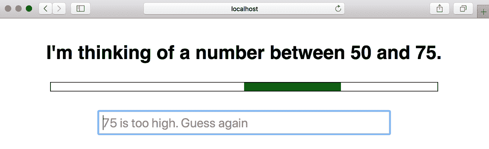

# 第十五章：JavaScript 在 Web 浏览器中

JavaScript 语言是在 1994 年创建的，旨在使 Web 浏览器显示的文档具有动态行为。自那时以来，该语言已经发生了显著的演变，与此同时，Web 平台的范围和功能也迅速增长。今天，JavaScript 程序员可以将 Web 视为一个功能齐全的应用程序开发平台。Web 浏览器专门用于显示格式化文本和图像，但是，像本机操作系统一样，浏览器还提供其他服务，包括图形、视频、音频、网络、存储和线程。JavaScript 是一种使 Web 应用程序能够使用 Web 平台提供的服务的语言，本章演示了您如何使用这些最重要的服务。

本章从网络平台的编程模型开始，解释了脚本如何嵌入在 HTML 页面中（§15.1），以及 JavaScript 代码如何通过事件异步触发（§15.2）。接下来的部分将记录启发性材料之后的核心 JavaScript API，使您的 Web 应用程序能够：

+   控制文档内容（§15.3）和样式（§15.4）

+   确定文档元素的屏幕位置（§15.5）

+   创建可重用的用户界面组件（§15.6）

+   绘制图形（§15.7 和§15.8）

+   播放和生成声音（§15.9）

+   管理浏览器导航和历史记录（§15.10）

+   在网络上交换数据（§15.11）

+   在用户计算机上存储数据（§15.12）

+   使用线程执行并发计算（§15.13）

本书的早期版本试图全面涵盖 Web 浏览器定义的所有 JavaScript API，结果，十年前这本书太长了。Web API 的数量和复杂性继续增长，我不再认为尝试在一本书中涵盖它们所有是有意义的。截至第七版，我的目标是全面覆盖 JavaScript 语言，并提供深入介绍如何在 Node 和 Web 浏览器中使用该语言。本章无法涵盖所有 Web API，但它以足够的细节介绍了最重要的 API，以便您可以立即开始使用它们。并且，学习了这里介绍的核心 API 后，您应该能够在需要时学习新的 API（比如§15.15 中总结的那些）。

Node 有一个单一的实现和一个单一的权威文档来源。相比之下，Web API 是由主要的 Web 浏览器供应商之间的共识定义的，权威文档采用了面向实现 API 的 C++程序员的规范形式，而不是面向将使用它的 JavaScript 程序员。幸运的是，[Mozilla 的“MDN web docs”项目](https://developer.mozilla.org)是 Web API 文档的一个可靠和全面的来源¹。

# 15.1 Web 编程基础

本节解释了 Web 上的 JavaScript 程序的结构，它们如何加载到 Web 浏览器中，如何获取输入，如何产生输出，以及如何通过响应事件异步运行。

## 15.1.1 HTML 中的 JavaScript `<script>`标签

Web 浏览器显示 HTML 文档。如果您希望 Web 浏览器执行 JavaScript 代码，您必须在 HTML 文档中包含（或引用）该代码，这就是 HTML `<script>`标签的作用。

JavaScript 代码可以内联出现在 HTML 文件中的`<script>`和`</script>`标签之间。例如，这是一个包含 JavaScript 代码的脚本标签的 HTML 文件，动态更新文档的一个元素，使其表现得像一个数字时钟：

```js
<!DOCTYPE html>                 <!-- This is an HTML5 file -->
<html>                          <!-- The root element -->
<head>                          <!-- Title, scripts & styles can go here -->
<title>Digital Clock</title>
<style>                         /* A CSS stylesheet for the clock */
#clock {                        /* Styles apply to element with id="clock" */
  font: bold 24px sans-serif;   /* Use a big bold font */
  background: #ddf;             /* on a light bluish-gray background. */
  padding: 15px;                /* Surround it with some space */
  border: solid black 2px;      /* and a solid black border */
  border-radius: 10px;          /* with rounded corners. */
}
</style>
</head>
<body>                    <!-- The body holds the content of the document. -->
<h1>Digital Clock</h1>    <!-- Display a title. -->
<span id="clock"></span>  <!-- We will insert the time into this element. -->
<script>
// Define a function to display the current time
function displayTime() {
    let clock = document.querySelector("#clock"); // Get element with id="clock"
    let now = new Date();                         // Get current time
    clock.textContent = now.toLocaleTimeString(); // Display time in the clock
}
displayTime()                    // Display the time right away
setInterval(displayTime, 1000);  // And then update it every second.
</script>
</body>
</html>
```

尽管 JavaScript 代码可以直接嵌入在`<script>`标签中，但更常见的做法是使用`<script>`标签的`src`属性来指定包含 JavaScript 代码的文件的 URL（绝对 URL 或相对于显示的 HTML 文件的 URL）。如果我们将这个 HTML 文件中的 JavaScript 代码提取出来并存储在自己的*scripts/digital_clock.js*文件中，那么`<script>`标签可能会引用该代码文件，如下所示：

```js
<script src="scripts/digital_clock.js"></script>
```

一个 JavaScript 文件包含纯 JavaScript，没有`<script>`标签或任何其他 HTML。按照惯例，JavaScript 代码文件的名称以*.js*结尾。

带有`src`属性的`<script>`标签的行为与指定的 JavaScript 文件的内容直接出现在`<script>`和`</script>`标签之间完全相同。请注意，即使指定了`src`属性，HTML 文档中也需要关闭`</script>`标签：HTML 不支持`<script/>`标签。

使用`src`属性有许多优点：

+   通过允许您从 HTML 文件中删除大块 JavaScript 代码，简化了您的 HTML 文件 - 也就是说，它有助于保持内容和行为分离。

+   当多个网页共享相同的 JavaScript 代码时，使用`src`属性可以让您仅维护该代码的单个副本，而无需在代码更改时编辑每个 HTML 文件。

+   如果一个 JavaScript 代码文件被多个页面共享，只需要被第一个使用它的页面下载一次，随后的页面可以从浏览器缓存中检索它。

+   因为`src`属性以任意 URL 作为其值，所以来自一个 web 服务器的 JavaScript 程序或网页可以使用其他 web 服务器导出的代码。许多互联网广告都依赖于这一点。

### 模块

§10.3 文档了 JavaScript 模块，并涵盖它们的`import`和`export`指令。如果您使用模块编写了 JavaScript 程序（并且没有使用代码捆绑工具将所有模块组合成单个非模块化的 JavaScript 文件），那么您必须使用带有`type="module"`属性的`<script>`标签加载程序的顶层模块。如果这样做，那么您指定的模块将被加载，它导入的所有模块也将被加载，以及（递归地）导入的所有模块也将被加载。详细信息请参见§10.3.5。

### 指定脚本类型

在 web 的早期，人们认为浏览器可能会实现除 JavaScript 外的其他语言，程序员们在他们的`<script>`标签中添加了`language="javascript"`和`type="application/javascript"`等属性。这是完全不必要的。JavaScript 是 web 的默认（也是唯一）语言。`language`属性已被弃用，只有两个原因可以在`<script>`标签上使用`type`属性：

+   指定脚本为模块

+   将数据嵌入网页而不显示它（参见§15.3.4）

### 脚本何时运行：异步和延迟

当 JavaScript 首次添加到 web 浏览器时，没有 API 可以遍历和操作已经呈现的文档的结构和内容。JavaScript 代码影响文档内容的唯一方法是在文档加载过程中动态生成内容。它通过使用`document.write()`方法将 HTML 文本注入到脚本位置来实现这一点。

使用`document.write()`不再被认为是良好的风格，但它是可能的事实意味着当 HTML 解析器遇到`<script>`元素时，默认情况下必须运行脚本，以确保它在恢复解析和呈现文档之前不输出任何 HTML。这可能会显著减慢网页的解析和呈现速度。

幸运的是，默认的*同步*或*阻塞*脚本执行模式并不是唯一的选择。`<script>`标签可以具有`defer`和`async`属性，这会导致脚本以不同的方式执行。这些是布尔属性——它们没有值；它们只需要出现在`<script>`标签上。请注意，这些属性仅在与`src`属性一起使用时才有意义：

```js
<script defer src="deferred.js"></script>
<script async src="async.js"></script>
```

`defer`和`async`属性都是告诉浏览器链接的脚本不使用`document.write()`来生成 HTML 输出的方式，因此浏览器可以在下载脚本的同时继续解析和渲染文档。`defer`属性会导致浏览器推迟执行脚本，直到文档完全加载和解析完成，并且准备好被操作。`async`属性会导致浏览器尽快运行脚本，但不会在下载脚本时阻止文档解析。如果一个`<script>`标签同时具有这两个属性，`async`属性优先。

注意，延迟脚本按照它们在文档中出现的顺序运行。异步脚本在加载时运行，这意味着它们可能无序执行。

带有`type="module"`属性的脚本默认在文档加载后执行，就像它们有一个`defer`属性一样。您可以使用`async`属性覆盖此默认行为，这将导致代码在模块及其所有依赖项加载后立即执行。

一个简单的替代方案是`async`和`defer`属性——特别是对于直接包含在 HTML 中的代码——只需将脚本放在 HTML 文件的末尾。这样，脚本可以运行，知道它前面的文档内容已被解析并准备好被操作。

### 按需加载脚本

有时，您可能有一些 JavaScript 代码在文档首次加载时不被使用，只有在用户执行某些操作，如点击按钮或打开菜单时才需要。如果您正在使用模块开发代码，可以使用`import()`按需加载模块，如§10.3.6 中所述。

如果您不使用模块，可以在希望脚本加载时向文档添加一个`<script>`标签来按需加载 JavaScript 文件：

```js
// Asynchronously load and execute a script from a specified URL
// Returns a Promise that resolves when the script has loaded.
function importScript(url) {
    return new Promise((resolve, reject) => {
        let s = document.createElement("script"); // Create a <script> element
        s.onload = () => { resolve(); };          // Resolve promise when loaded
        s.onerror = (e) => { reject(e); };        // Reject on failure
        s.src = url;                              // Set the script URL
        document.head.append(s);                  // Add <script> to document
    });
}
```

这个`importScript()`函数使用 DOM API（§15.3）来创建一个新的`<script>`标签，并将其添加到文档的`<head>`中。它使用事件处理程序（§15.2）来确定脚本何时成功加载或加载失败。

## 15.1.2 文档对象模型

在客户端 JavaScript 编程中最重要的对象之一是文档对象，它代表在浏览器窗口或标签中显示的 HTML 文档。用于处理 HTML 文档的 API 称为文档对象模型，或 DOM，在§15.3 中有详细介绍。但是 DOM 在客户端 JavaScript 编程中如此重要，以至于应该在这里介绍。

HTML 文档包含嵌套在一起的 HTML 元素，形成一棵树。考虑以下简单的 HTML 文档：

```js
<html>
  <head>
    <title>Sample Document</title>
  </head>
  <body>
    <h1>An HTML Document</h1>
    <p>This is a <i>simple</i> document.
  </body>
</html>
```

顶层的`<html>`标签包含`<head>`和`<body>`标签。`<head>`标签包含一个`<title>`标签。`<body>`标签包含`<h1>`和`<p>`标签。`<title>`和`<h1>`标签包含文本字符串，`<p>`标签包含两个文本字符串，中间有一个`<i>`标签。

DOM API 反映了 HTML 文档的树结构。对于文档中的每个 HTML 标签，都有一个对应的 JavaScript Element 对象，对于文档中的每个文本运行，都有一个对应的 Text 对象。Element 和 Text 类，以及 Document 类本身，都是更一般的 Node 类的子类，Node 对象组织成 JavaScript 可以使用 DOM API 查询和遍历的树结构。此文档的 DOM 表示是 图 15-1 中描绘的树。


###### 图 15-1。HTML 文档的树形表示

如果您对计算机编程中的树结构不熟悉，了解它们从家谱中借来的术语会有所帮助。直接在节点上方的节点是该节点的*父节点*。直接在另一个节点下一级的节点是该节点的*子节点*。在同一级别且具有相同父节点的节点是*兄弟节点*。在另一个节点下的任意级别的节点是该节点的*后代节点*。父节点、祖父节点和其他所有在节点上方的节点都是该节点的*祖先节点*。

DOM API 包括用于创建新的 Element 和 Text 节点，并将它们作为其他 Element 对象的子节点插入文档的方法。还有用于在文档中移动元素和完全删除它们的方法。虽然服务器端应用程序可能通过使用 `console.log()` 写入字符串来生成纯文本输出，但客户端 JavaScript 应用程序可以通过使用 DOM API 构建或操作文档树来生成格式化的 HTML 输出。

每个 HTML 标签类型都对应一个 JavaScript 类，文档中每个标签的出现都由该类的一个实例表示。例如，`<body>` 标签由 HTMLBodyElement 的一个实例表示，`<table>` 标签由 HTMLTableElement 的一个实例表示。JavaScript 元素对象具有与标签的 HTML 属性对应的属性。例如，代表 `` 标签的 HTMLImageElement 实例具有一个与标签的 `src` 属性对应的 `src` 属性。`src` 属性的初始值是出现在 HTML 标签中的属性值，使用 JavaScript 设置此属性会改变 HTML 属性的值（并导致浏览器加载和显示新图像）。大多数 JavaScript 元素类只是反映 HTML 标签的属性，但有些定义了额外的方法。例如，HTMLAudioElement 和 HTMLVideoElement 类定义了像 `play()` 和 `pause()` 这样的方法，用于控制音频和视频文件的播放。

## 15.1.3 Web 浏览器中的全局对象

每个浏览器窗口或标签页都有一个全局对象（§3.7）。在该窗口中运行的所有 JavaScript 代码（除了在工作线程中运行的代码；参见§15.13）共享这个单一全局对象。无论文档中有多少脚本或模块，这一点都是真实的：文档中的所有脚本和模块共享一个全局对象；如果一个脚本在该对象上定义了一个属性，那么其他所有脚本也能看到这个属性。

全局对象是 JavaScript 标准库的定义位置——`parseInt()` 函数、Math 对象、Set 类等等。在 Web 浏览器中，全局对象还包含各种 Web API 的主要入口点。例如，`document` 属性代表当前显示的文档，`fetch()` 方法发起 HTTP 网络请求，`Audio()` 构造函数允许 JavaScript 程序播放声音。

在 Web 浏览器中，全局对象承担双重职责：除了定义内置类型和函数之外，它还表示当前 Web 浏览器窗口，并定义诸如 `history`（§15.10.2）这样的属性，表示窗口的浏览历史，以及 `innerWidth`，保存窗口的宽度（以像素为单位）。这个全局对象的一个属性名为 `window`，其值是全局对象本身。这意味着您可以简单地在客户端代码中输入 `window` 来引用全局对象。在使用特定于窗口的功能时，通常最好包含一个 `window.` 前缀：例如，`window.innerWidth` 比 `innerWidth` 更清晰。

## 15.1.4 脚本共享命名空间

使用模块时，在模块顶层（即在任何函数或类定义之外）定义的常量、变量、函数和类对于模块是私有的，除非它们被明确导出，这样，其他模块可以有选择地导入它们。（请注意，模块的这个属性也受到代码捆绑工具的尊重。）

然而，对于非模块脚本，情况完全不同。如果脚本中的顶层代码定义了常量、变量、函数或类，那个声明将对同一文档中的所有其他脚本可见。如果一个脚本定义了一个函数 `f()`，另一个脚本定义了一个类 `c`，那么第三个脚本可以调用该函数并实例化该类，而无需采取任何导入操作。因此，如果您不使用模块，在您的文档中的独立脚本共享一个单一命名空间，并且表现得好像它们都是单个更大脚本的一部分。这对于小型程序可能很方便，但在更大的程序中，特别是当一些脚本是第三方库时，需要避免命名冲突可能会成为问题。

这个共享命名空间的工作方式有一些历史上的怪癖。在顶层使用 `var` 和 `function` 声明会在共享的全局对象中创建属性。如果一个脚本定义了一个顶层函数 `f()`，那么同一文档中的另一个脚本可以将该函数调用为 `f()` 或 `window.f()`。另一方面，ES6 声明 `const`、`let` 和 `class` 在顶层使用时不会在全局对象中创建属性。然而，它们仍然在共享的命名空间中定义：如果一个脚本定义了一个类 `C`，其他脚本将能够使用 `new C()` 创建该类的实例，但不能使用 `new window.C()`。

总结一下：在模块中，顶层声明的作用域是模块，并且可以被明确导出。然而，在非模块脚本中，顶层声明的作用域是包含文档，并且这些声明被文档中的所有脚本共享。旧的 `var` 和 `function` 声明通过全局对象的属性共享。新的 `const`、`let` 和 `class` 声明也是共享的，并具有相同的文档作用域，但它们不作为 JavaScript 代码可以访问的任何对象的属性存在。

## 15.1.5 JavaScript 程序的执行

在客户端 JavaScript 中，*程序* 没有正式的定义，但我们可以说 JavaScript 程序包括文档中的所有 JavaScript 代码或引用的代码。这些独立的代码片段共享一个全局 Window 对象，使它们可以访问表示 HTML 文档的相同底层 Document 对象。不是模块的脚本还共享一个顶层命名空间。

如果网页包含嵌入的框架（使用 `<iframe>` 元素），嵌入文档中的 JavaScript 代码具有不同的全局对象和文档对象，与包含文档中的代码不同，并且可以被视为一个单独的 JavaScript 程序。但请记住，JavaScript 程序的边界没有正式的定义。如果容器文档和包含文档都是从同一服务器加载的，那么一个文档中的代码可以与另一个文档中的代码互动，并且您可以将它们视为单个程序的两个互动部分，如果您愿意的话。§15.13.6 解释了一个 JavaScript 程序如何与在 `<iframe>` 中运行的 JavaScript 代码发送和接收消息。

你可以将 JavaScript 程序执行看作是分为两个阶段进行的。在第一阶段中，文档内容被加载，`<script>` 元素中的代码（包括内联脚本和外部脚本）被运行。脚本通常按照它们在文档中出现的顺序运行，尽管这种默认顺序可以通过我们描述的 `async` 和 `defer` 属性进行修改。单个脚本中的 JavaScript 代码从上到下运行，当然，受 JavaScript 的条件语句、循环和其他控制语句的影响。在第一阶段中，一些脚本实际上并没有*执行*任何操作，而是仅仅定义函数和类供第二阶段使用。其他脚本可能在第一阶段做了大量工作，然后在第二阶段不做任何事情。想象一下一个位于文档末尾的脚本，它会查找文档中的所有 `<h1>` 和 `<h2>` 标签，并通过在文档开头生成并插入目录来修改文档。这完全可以在第一阶段完成。（参见 §15.3.6 中的一个实现此功能的示例。）

一旦文档加载完成并且所有脚本都运行完毕，JavaScript 执行进入第二阶段。这个阶段是异步和事件驱动的。如果一个脚本要参与这个第二阶段，那么，在第一阶段必须至少注册一个事件处理程序或其他回调函数，这些函数将被异步调用。在这个事件驱动的第二阶段，Web 浏览器根据异步发生的事件调用事件处理程序函数和其他回调。事件处理程序通常是响应用户输入（鼠标点击、按键等）而被调用，但也可能是由网络活动、文档和资源加载、经过的时间或 JavaScript 代码中的错误触发。事件和事件处理程序在 §15.2 中有详细描述。

在事件驱动阶段最先发生的一些事件是“DOMContentLoaded”和“load”事件。“DOMContentLoaded”在 HTML 文档完全加载和解析后触发。“load”事件在文档的所有外部资源（如图像）也完全加载后触发。JavaScript 程序通常使用其中一个事件作为触发器或启动信号。通常可以看到这样的程序，其脚本定义函数但除了注册一个事件处理程序函数以在执行的事件驱动阶段开始时由“load”事件触发外不执行任何操作。然后，这个“load”事件处理程序会操作文档并执行程序应该执行的任何操作。请注意，在 JavaScript 编程中，像这里描述的“load”事件处理程序这样的事件处理程序函数通常会注册其他事件处理程序。

JavaScript 程序的加载阶段相对较短：理想情况下不超过一秒。一旦文档加载完成，基于事件驱动的阶段将持续到网页被浏览器显示的整个时间。由于这个阶段是异步和事件驱动的，可能会出现长时间的不活动期，期间不执行任何 JavaScript，然后会因用户或网络事件触发而出现活动突发。接下来我们将更详细地介绍这两个阶段。

### 客户端 JavaScript 线程模型

JavaScript 是一种单线程语言，单线程执行使编程变得简单得多：您可以编写代码，确保两个事件处理程序永远不会同时运行。您可以操作文档内容，知道没有其他线程同时尝试修改它，而在编写 JavaScript 代码时永远不需要担心锁、死锁或竞争条件。

单线程执行意味着在脚本和事件处理程序执行时，Web 浏览器停止响应用户输入。这给 JavaScript 程序员带来了负担：这意味着 JavaScript 脚本和事件处理程序不能运行太长时间。如果脚本执行了计算密集型任务，它将延迟文档加载，用户将在脚本完成之前看不到文档内容。如果事件处理程序执行了计算密集型任务，浏览器可能会变得无响应，可能导致用户认为它已崩溃。

Web 平台定义了一种受控并发形式，称为“Web Worker”。Web Worker 是用于执行计算密集型任务的后台线程，而不会冻结用户界面。在 Web Worker 线程中运行的代码无法访问文档内容，也不与主线程或其他 Worker 共享任何状态，并且只能通过异步消息事件与主线程和其他 Worker 进行通信，因此主线程无法检测到并发，Web Worker 不会改变 JavaScript 程序的基本单线程执行模型。有关 Web 安全线程机制的完整详细信息，请参见§15.13。

### 客户端 JavaScript 时间轴

我们已经看到 JavaScript 程序开始于脚本执行阶段，然后过渡到事件处理阶段。这两个阶段可以进一步分解为以下步骤：

1.  Web 浏览器创建一个 Document 对象并开始解析网页，随着解析 HTML 元素及其文本内容，将 Element 对象和 Text 节点添加到文档中。此时`document.readyState`属性的值为“loading”。

1.  当 HTML 解析器遇到一个没有任何`async`、`defer`或`type="module"`属性的`<script>`标签时，它将该脚本标签添加到文档中，然后执行该脚本。脚本是同步执行的，而 HTML 解析器在脚本下载（如果需要）和运行时暂停。这样的脚本可以使用`document.write()`将文本插入输入流，当解析器恢复时，该文本将成为文档的一部分。这样的脚本通常只是定义函数并注册事件处理程序以供以后使用，但它可以遍历和操作文档树，就像它在那个时候存在的那样。也就是说，没有`async`或`defer`属性的非模块脚本可以看到自己的`<script>`标签和在它之前出现的文档内容。

1.  当解析器遇到设置了`async`属性的`<script>`元素时，它开始下载脚本文本（如果脚本是一个模块，它还会递归下载所有脚本的依赖项），并继续解析文档。脚本将在下载后尽快执行，但解析器不会停止等待它下载。异步脚本不能使用`document.write()`方法。它们可以看到自己的`<script>`标签和在它之前出现的所有文档内容，并且可能或可能不具有对额外文档内容的访问权限。

1.  当文档完全解析时，`document.readyState`属性更改为“interactive”。

1.  任何设置了`defer`属性的脚本（以及没有设置`async`属性的任何模块脚本）按照它们在文档中出现的顺序执行。异步脚本也可能在此时执行。延迟脚本可以访问完整的文档，它们不能使用`document.write()`方法。

1.  浏览器在 Document 对象上触发“DOMContentLoaded”事件。这标志着从同步脚本执行阶段到程序执行的异步、事件驱动阶段的转变。但请注意，此时可能仍有尚未执行的`async`脚本。

1.  此时文档已完全解析，但浏览器可能仍在等待其他内容（如图像）加载。当所有这些内容加载完成，并且所有`async`脚本已加载和执行时，`document.readyState`属性将更改为“complete”，并且网络浏览器在 Window 对象上触发“load”事件。

1.  从这一点开始，事件处理程序将异步调用以响应用户输入事件、网络事件、定时器到期等。

## 15.1.6 程序输入和输出

与任何程序一样，客户端 JavaScript 程序处理输入数据以生成输出数据。有各种可用的输入：

+   文档本身的内容，JavaScript 代码可以使用 DOM API（§15.3）访问。

+   用户输入，以事件的形式，例如鼠标点击（或触摸屏点击）HTML `<button>` 元素，或输入到 HTML `<textarea>` 元素中的文本，例如。§15.2 演示了 JavaScript 程序如何响应这些用户事件。

+   正在显示的文档的 URL 可以作为`document.URL`在客户端 JavaScript 中使用。如果将此字符串传递给`URL()`构造函数（§11.9），您可以轻松访问 URL 的路径、查询和片段部分。

+   HTTP“Cookie”请求头的内容可以作为`document.cookie`在客户端代码中使用。Cookie 通常由服务器端代码用于维护用户会话，但如果必要，客户端代码也可以读取（和写入）它们。有关详细信息，请参见§15.12.2。

+   全局的`navigator`属性提供了关于网络浏览器、其运行的操作系统以及每个操作系统的功能的信息。例如，`navigator.userAgent`是一个标识网络浏览器的字符串，`navigator.language`是用户首选语言，`navigator.hardwareConcurrency`返回可用于网络浏览器的逻辑 CPU 数量。类似地，全局的`screen`属性通过`screen.width`和`screen.height`属性提供了用户的显示尺寸访问。在某种意义上，这些`navigator`和`screen`对象对于网络浏览器来说就像环境变量对于 Node 程序一样。

客户端 JavaScript 通常通过使用 DOM API（§15.3）操纵 HTML 文档或使用更高级的框架如 React 或 Angular 来操纵文档来生成输出。客户端代码还可以使用 `console.log()` 和相关方法（§11.8）生成输出。但这些输出只在 Web 开发者控制台中可见，因此在调试时很有用，但不适用于用户可见的输出。

## 15.1.7 程序错误

与直接运行在操作系统之上的应用程序（如 Node 应用程序）不同，Web 浏览器中的 JavaScript 程序实际上不能真正“崩溃”。如果在运行 JavaScript 程序时发生异常，并且没有 `catch` 语句来处理它，将在开发者控制台中显示错误消息，但已注册的任何事件处理程序仍在运行并响应事件。

如果您想定义一个最后一道防线的错误处理程序，在发生此类未捕获异常时调用，将 Window 对象的 `onerror` 属性设置为一个错误处理程序函数。当未捕获的异常传播到调用堆栈的最顶层并且即将在开发者控制台中显示错误消息时，`window.onerror` 函数将被调用，带有三个字符串参数。`window.onerror` 的第一个参数是描述错误的消息。第二个参数是一个包含导致错误的 JavaScript 代码的 URL 的字符串。第三个参数是错误发生的文档中的行号。如果 `onerror` 处理程序返回 `true`，它告诉浏览器处理程序已处理了错误，不需要进一步操作——换句话说，浏览器不应显示自己的错误消息。

当 Promise 被拒绝且没有 `.catch()` 函数来处理它时，这就像未处理的异常：您的程序中出现了意外错误或逻辑错误。您可以通过定义 `window.onunhandledrejection` 函数或使用 `window.addEventListener()` 注册一个“unhandledrejection”事件处理程序来检查这种情况。传递给此处理程序的事件对象将具有一个 `promise` 属性，其值是被拒绝的 Promise 对象，以及一个 `reason` 属性，其值是将传递给 `.catch()` 函数的内容。与前面描述的错误处理程序一样，如果在未处理的拒绝事件对象上调用 `preventDefault()`，它将被视为已处理，并且不会在开发者控制台中引发错误消息。

定义 `onerror` 或 `onunhandledrejection` 处理程序通常不是必需的，但如果您想要将客户端错误报告给服务器（例如使用 `fetch()` 函数进行 HTTP POST 请求），以便获取有关用户浏览器中发生的意外错误的信息，这可能非常有用。

## 15.1.8 Web 安全模型

Web 页面可以在您的个人设备上执行任意 JavaScript 代码这一事实具有明显的安全影响，浏览器供应商努力平衡两个竞争目标：

+   定义强大的客户端 API 以实现有用的 Web 应用程序

+   防止恶意代码读取或更改您的数据，危害您的隐私，欺诈您，或浪费您的时间

接下来的小节快速概述了您作为 JavaScript 程序员应该了解的安全限制和问题。

### JavaScript 不能做什么

Web 浏览器对抗恶意代码的第一道防线是它们根本不支持某些功能。例如，客户端 JavaScript 不提供任何方法来写入或删除客户端计算机上的任意文件或列出任意目录。这意味着 JavaScript 程序无法删除数据或植入病毒。

同样，客户端 JavaScript 没有通用的网络功能。客户端 JavaScript 程序可以发出 HTTP 请求（§15.11.1）。另一个名为 WebSockets 的标准（§15.11.3）定义了一个类似套接字的 API，用于与专用服务器通信。但是这些 API 都不允许直接访问更广泛的网络。通用的互联网客户端和服务器不能使用客户端 JavaScript 编写。

### 同源策略

*同源策略*是对 JavaScript 代码可以与之交互的 Web 内容的广泛安全限制。当一个网页包含`<iframe>`元素时，通常会出现这种情况。在这种情况下，同源策略规定了一个框架中的 JavaScript 代码与其他框架内容的交互。具体来说，脚本只能读取与包含脚本的文档具有相同源的窗口和文档的属性。

文档的源被定义为文档加载的 URL 的协议、主机和端口。从不同 web 服务器加载的文档具有不同的源。通过同一主机的不同端口加载的文档具有不同的源。使用`http:`协议加载的文档与使用`https:`协议加载的文档具有不同的源，即使它们来自同一 web 服务器。浏览器通常将每个`file:` URL 视为单独的源，这意味着如果您正在开发一个显示来自同一服务器的多个文档的程序，您可能无法使用`file:` URL 在本地进行测试，而必须在开发过程中运行一个静态 web 服务器。

重要的是要理解脚本本身的源对同源策略不重要：重要的是脚本嵌入的文档的源。例如，假设由主机 A 托管的脚本被包含在由主机 B 提供的网页中（使用`<script>`元素的`src`属性）。该脚本的源是主机 B，并且脚本可以完全访问包含它的文档的内容。如果文档包含一个来自主机 B 的第二个文档的`<iframe>`，那么脚本也可以完全访问该第二个文档的内容。但是，如果顶级文档包含另一个显示来自主机 C（甚至来自主机 A）的文档的`<iframe>`，那么同源策略就会生效，并阻止脚本访问这个嵌套文档。

同源策略也适用于脚本化的 HTTP 请求（参见§15.11.1）。JavaScript 代码可以向包含文档所在的 web 服务器发出任意 HTTP 请求，但它不允许脚本与其他 web 服务器通信（除非这些 web 服务器通过 CORS 选择加入，我们将在下文描述）。

同源策略对使用多个子域的大型网站造成问题。例如，源自*orders.example.com*的脚本可能需要从*example.com*的文档中读取属性。为了支持这种多域网站，脚本可以通过将`document.domain`设置为域后缀来更改其源。因此，源自[*https://orders.example.com*](https://orders.example.com)的脚本可以通过将`document.domain`设置为“example.com”来将其源更改为[*https://example.com*](https://example.com)。但是该脚本不能将`document.domain`设置为“orders.example”、“ample.com”或“com”。

放宽同源策略的第二种技术是跨域资源共享（CORS），它允许服务器决定愿意提供哪些来源。CORS 使用一个新的 `Origin:` 请求头和一个新的 `Access-Control-Allow-Origin` 响应头来扩展 HTTP。它允许服务器使用一个头来明确列出可以请求文件的来源，或者使用通配符允许任何站点请求文件。浏览器遵守这些 CORS 头，并且除非它们存在，否则不放宽同源限制。

### 跨站脚本

*跨站脚本*，或 XSS，是一种安全问题类别，攻击者向目标网站注入 HTML 标记或脚本。客户端 JavaScript 程序员必须意识到并防范跨站脚本。

如果网页动态生成文档内容并且基于用户提交的数据而不先通过“消毒”该数据来删除其中嵌入的 HTML 标记，则该网页容易受到跨站脚本攻击。作为一个简单的例子，考虑以下使用 JavaScript 通过名称向用户问候的网页：

```js
<script>
let name = new URL(document.URL).searchParams.get("name");
document.querySelector('h1').innerHTML = "Hello " + name;
</script>
```

这个两行脚本从文档 URL 的“name”查询参数中提取输入。然后使用 DOM API 将 HTML 字符串注入到文档中的第一个 `<h1>` 标签中。此页面旨在通过以下 URL 调用：

```js
http://www.example.com/greet.html?name=David
```

当像这样使用时，它会显示文本“Hello David。”但考虑一下当它被调用时会发生什么：

```js
name=%3Cimg%20src=%22x.png%22%20onload=%22alert(%27hacked%27)%22/%3E
```

当 URL 转义参数被解码时，此 URL 导致以下 HTML 被注入到文档中：

```js
Hello 
```

图像加载完成后，`onload` 属性中的 JavaScript 字符串将被执行。全局 `alert()` 函数会显示一个模态对话框。单个对话框相对无害，但表明在该网站上可能存在任意代码执行，因为它显示了未经过滤的 HTML。

跨站脚本攻击之所以被称为如此，是因为涉及到多个站点。站点 B 包含一个特制链接（就像前面示例中的那个）到站点 A。如果站点 B 能说服用户点击该链接，他们将被带到站点 A，但该站点现在将运行来自站点 B 的代码。该代码可能破坏页面或导致其功能失效。更危险的是，恶意代码可能读取站点 A 存储的 cookie（也许是账号号码或其他个人身份信息）并将数据发送回站点 B。注入的代码甚至可以跟踪用户的按键操作并将数据发送回站点 B。

通常，防止 XSS 攻击的方法是在使用未受信任的数据创建动态文档内容之前，从中删除 HTML 标记。你可以通过用等效的 HTML 实体替换未受信任输入字符串中的特殊 HTML 字符来修复之前显示的 *greet.html* 文件：

```js
name = name
    .replace(/&/g, "&amp;")
    .replace(/</g, "&lt;")
    .replace(/>/g, "&gt;")
    .replace(/"/g, "&quot;")
    .replace(/'/g, "&#x27;")
    .replace(/\//g, "&#x2F;")
```

解决 XSS 问题的另一种方法是构建您的 Web 应用程序，使得不受信任的内容始终显示在具有设置为禁用脚本和其他功能的 `sandbox` 属性的 `<iframe>` 中。

跨站脚本是一种根深蒂固的漏洞，其根源深入到网络架构中。值得深入了解这种漏洞，但进一步讨论超出了本书的范围。有许多在线资源可帮助您防范跨站脚本。

# 15.2 事件

客户端 JavaScript 程序使用异步事件驱动的编程模型。在这种编程风格中，当文档或浏览器或与之关联的某个元素或对象发生有趣的事情时，Web 浏览器会生成一个*事件*。例如，当 Web 浏览器完成加载文档时，当用户将鼠标移动到超链接上时，或者当用户在键盘上按下键时，Web 浏览器会生成一个事件。如果 JavaScript 应用程序关心特定类型的事件，它可以注册一个或多个函数，在发生该类型的事件时调用这些函数。请注意，这并不是 Web 编程的独有特性：所有具有图形用户界面的应用程序都是这样设计的——它们等待与之交互（即，它们等待事件发生），然后做出响应。

在客户端 JavaScript 中，事件可以发生在 HTML 文档中的任何元素上，这一事实使得 Web 浏览器的事件模型比 Node 的事件模型复杂得多。我们从一些重要的定义开始，这些定义有助于解释事件模型：

事件类型

此字符串指定发生的事件类型。例如，“mousemove”类型表示用户移动了鼠标。“keydown”类型表示用户按下键盘上的键。而“load”类型表示文档（或其他资源）已经从网络加载完成。由于事件类型只是一个字符串，有时被称为*事件名称*，确实，我们使用这个名称来识别我们所讨论的事件类型。

事件目标

这是事件发生的对象或与之相关联的对象。当我们谈论事件时，必须同时指定类型和目标。例如，窗口上的加载事件，或`<button>`元素上的点击事件。窗口、文档和元素对象是客户端 JavaScript 应用程序中最常见的事件目标，但有些事件会在其他类型的对象上触发。例如，Worker 对象（一种线程，在§15.13 中介绍）是“message”事件的目标，当工作线程向主线程发送消息时会触发该事件。

事件处理程序，或事件监听器

此函数处理或响应事件。² 应用程序通过指定事件类型和事件目标向 Web 浏览器注册其事件处理程序函数。当指定类型的事件发生在指定目标上时，浏览器会调用处理程序函数。当为对象调用事件处理程序时，我们说浏览器已经“触发”、“触发”或“分发”了事件。有多种注册事件处理程序的方法，处理程序注册和调用的详细信息在§15.2.2 和§15.2.3 中有解释。

事件对象

此对象与特定事件相关联，并包含有关该事件的详细信息。事件对象作为参数传递给事件处理程序函数。所有事件对象都有一个`type`属性，指定事件类型，以及一个`target`属性，指定事件目标。每种事件类型为其关联的事件对象定义了一组属性。与鼠标事件相关联的对象包括鼠标指针的坐标，例如，与键盘事件相关联的对象包含有关按下的键和按下的修改键的详细信息。许多事件类型仅定义了一些标准属性，如`type`和`target`，并不包含其他有用信息。对于这些事件，事件的简单发生才是重要的，而不是事件的详细信息。

事件传播

这是浏览器决定触发事件处理程序的对象的过程。对于特定于单个对象的事件（例如 Window 对象上的“load”事件或 Worker 对象上的“message”事件），不需要传播。但是，对于发生在 HTML 文档中的元素上的某些类型的事件，它们会传播或“冒泡”到文档树上。如果用户将鼠标移动到超链接上，那么 mousemove 事件首先在定义该链接的`<a>`元素上触发。然后在包含元素上触发：可能是一个`<p>`元素，一个`<section>`元素，以及文档对象本身。有时，在文档或其他容器元素上注册一个事件处理程序比在每个感兴趣的单个元素上注册处理程序更方便。事件处理程序可以阻止事件的传播，使其不会继续冒泡并且不会触发包含元素上的处理程序。处理程序通过调用事件对象的方法来执行此操作。在另一种事件传播形式中，称为*事件捕获*，在容器元素上特别注册的处理程序有机会在事件传递到其实际目标之前拦截（或“捕获”）事件。事件冒泡和捕获在§15.2.4 中有详细介绍。

一些事件与*默认操作*相关联。例如，当单击超链接时，浏览器的默认操作是跟随链接并加载新页面。事件处理程序可以通过调用事件对象的方法来阻止此默认操作。这有时被称为“取消”事件，并在§15.2.5 中有介绍。

## 15.2.1 事件类别

客户端 JavaScript 支持如此多的事件类型，以至于本章无法涵盖所有事件。然而，将事件分组到一些一般类别中可能是有用的，以说明支持的事件范围和各种各样的事件：

与设备相关的输入事件

这些事件与特定的输入设备直接相关，例如鼠标或键盘。它们包括“mousedown”，“mousemove”，“mouseup”，“touchstart”，“touchmove”，“touchend”，“keydown”和“keyup”等事件类型。

与设备无关的输入事件

这些输入事件与特定的输入设备没有直接关联。例如，“click”事件表示链接或按钮（或其他文档元素）已被激活。通常是通过鼠标点击完成，但也可以通过键盘或（在触摸设备上）通过轻触完成。 “input”事件是“keydown”事件的与设备无关的替代品，并支持键盘输入以及剪切和粘贴以及用于表意文字的输入方法等替代方法。 “pointerdown”，“pointermove”和“pointerup”事件类型是鼠标和触摸事件的与设备无关的替代品。它们适用于鼠标类型指针，触摸屏幕以及笔或笔式输入。

用户界面事件

UI 事件是更高级别的事件，通常在 HTML 表单元素上定义 Web 应用程序的用户界面。它们包括“focus”事件（当文本输入字段获得键盘焦点时），“change”事件（当用户更改表单元素显示的值时）和“submit”事件（当用户单击表单中的提交按钮时）。

状态更改事件

一些事件不是直接由用户活动触发的，而是由网络或浏览器活动触发的，并指示某种生命周期或状态相关的变化。“load”和“DOMContentLoaded”事件分别在文档加载结束时在 Window 和 Document 对象上触发，可能是最常用的这些事件（参见“客户端 JavaScript 时间线”）。浏览器在网络连接状态发生变化时在 Window 对象上触发“online”和“offline”事件。浏览器的历史管理机制（§15.10.4）在响应浏览器的后退按钮时触发“popstate”事件。

特定于 API 的事件

HTML 和相关规范定义的许多 Web API 包括它们自己的事件类型。HTML `<video>` 和 `<audio>` 元素定义了一长串相关事件类型，如“waiting”、“playing”、“seeking”、“volumechange”等，您可以使用它们来自定义媒体播放。一般来说，异步的 Web 平台 API 在 JavaScript 添加 Promise 之前是基于事件的，并定义了特定于 API 的事件。例如，IndexedDB API（§15.12.3）在数据库请求成功或失败时触发“success”和“error”事件。虽然用于发出 HTTP 请求的新 `fetch()` API（§15.11.1）是基于 Promise 的，但它替代的 XMLHttpRequest API 定义了许多特定于 API 的事件类型。

## 注册事件处理程序

注册事件处理程序有两种基本方法。第一种是来自 Web 早期的，在事件目标上设置对象或文档元素的属性。第二种（更新且更通用）技术是将处理程序传递给对象或元素的 `addEventListener()` 方法。

### 设置事件处理程序属性

注册事件处理程序的最简单方法是将事件目标的属性设置为所需的事件处理程序函数。按照惯例，事件处理程序属性的名称由单词“on”后跟事件名称组成：`onclick`、`onchange`、`onload`、`onmouseover`等。请注意，这些属性名称区分大小写，并且全部小写书写，即使事件类型（如“mousedown”）由多个单词组成。以下代码包括两种此类事件处理程序的注册：

```js
// Set the onload property of the Window object to a function.
// The function is the event handler: it is invoked when the document loads.
window.onload = function() {
    // Look up a <form> element
    let form = document.querySelector("form#shipping");
    // Register an event handler function on the form that will be invoked
    // before the form is submitted. Assume isFormValid() is defined elsewhere.
    form.onsubmit = function(event) { // When the user submits the form
        if (!isFormValid(this)) {     // check whether form inputs are valid
            event.preventDefault();   // and if not, prevent form submission.
        }
    };
};
```

事件处理程序属性的缺点在于，它们设计时假设事件目标最多只有一个每种事件类型的处理程序。通常最好使用 `addEventListener()` 注册事件处理程序，因为该技术不会覆盖任何先前注册的处理程序。

### 设置事件处理程序属性

文档元素的事件处理程序属性也可以直接在 HTML 文件中作为相应 HTML 标记的属性定义。在 HTML 中，可以使用在 `<body>` 标记上的属性定义应该在 JavaScript 中注册在 Window 元素上的处理程序。尽管这种技术在现代 Web 开发中通常不受欢迎，但它是可能的，并且在此处记录，因为您可能仍然在现有代码中看到它。

当将事件处理程序定义为 HTML 属性时，属性值应为 JavaScript 代码的字符串。该代码应为事件处理程序函数的*主体*，而不是完整的函数声明。换句话说，您的 HTML 事件处理程序代码不应被大括号包围并以 `function` 关键字为前缀。例如：

```js
<button onclick="console.log('Thank you');">Please Click</button>
```

如果 HTML 事件处理程序属性包含多个 JavaScript 语句，则必须记住使用分号分隔这些语句或将属性值跨多行断开。

当您将 JavaScript 代码的字符串指定为 HTML 事件处理程序属性的值时，浏览器会将您的字符串转换为一个类似于这个函数的函数：

```js
function(event) {
    with(document) {
        with(this.form || {}) {
            with(this) {
                /* your code here */
            }
        }
    }
}
```

`event`参数意味着您的处理程序代码可以将当前事件对象称为`event`。`with`语句意味着您的处理程序代码可以直接引用目标对象、包含的`<form>`（如果有）和包含的文档对象的属性，就像它们是作用域中的变量一样。`with`语句在严格模式下是禁止的（§5.6.3），但是 HTML 属性中的 JavaScript 代码永远不会是严格模式。以这种方式定义的事件处理程序在定义了意外变量的环境中执行。这可能是令人困惑的错误源，是避免在 HTML 中编写事件处理程序的一个很好的理由。

### addEventListener()

任何可以成为事件目标的对象——包括 Window 和 Document 对象以及所有文档元素——都定义了一个名为`addEventListener()`的方法，您可以使用该方法为该目标注册事件处理程序。`addEventListener()`接受三个参数。第一个是要注册处理程序的事件类型。事件类型（或名称）是一个字符串，不包括在设置事件处理程序属性时使用的“on”前缀。`addEventListener()`的第二个参数是应在发生指定类型事件时调用的函数。第三个参数是可选的，下面会解释。

以下代码为`<button>`元素注册了两个“click”事件处理程序。请注意两种技术之间的区别：

```js
<button id="mybutton">Click me</button>
<script>
let b = document.querySelector("#mybutton");
b.onclick = function() { console.log("Thanks for clicking me!"); };
b.addEventListener("click", () => { console.log("Thanks again!"); });
</script>
```

调用`addEventListener()`时，第一个参数为“click”不会影响`onclick`属性的值。在此代码中，单击按钮将向开发者控制台记录两条消息。如果我们先调用`addEventListener()`然后设置`onclick`，我们仍然会记录两条消息，只是顺序相反。更重要的是，您可以多次调用`addEventListener()`为同一对象的同一事件类型注册多个处理程序函数。当对象上发生事件时，为该类型事件注册的所有处理程序按照注册顺序被调用。在同一对象上多次调用具有相同参数的`addEventListener()`不会产生任何效果——处理程序函数仅注册一次，并且重复调用不会改变调用处理程序的顺序。

`addEventListener()`与`removeEventListener()`方法配对使用，它期望相同的两个参数（加上可选的第三个参数），但是从对象中删除事件处理程序函数而不是添加它。通常有用的是暂时注册事件处理程序，然后不久之后将其删除。例如，当您获得“mousedown”事件时，您可能会为“mousemove”和“mouseup”事件注册临时事件处理程序，以便查看用户是否拖动鼠标。然后，当“mouseup”事件到达时，您将取消注册这些处理程序。在这种情况下，您的事件处理程序移除代码可能如下所示：

```js
document.removeEventListener("mousemove", handleMouseMove);
document.removeEventListener("mouseup", handleMouseUp);
```

`addEventListener()`的可选第三个参数是布尔值或对象。如果传递`true`，则您的处理程序函数将被注册为*捕获*事件处理程序，并在事件分发的不同阶段被调用。我们将在§15.2.4 中介绍事件捕获。如果在注册事件监听器时传递第三个参数为`true`，那么如果要删除处理程序，则必须在`removeEventListener()`的第三个参数中也传递`true`。

注册捕获事件处理程序只是`addEventListener()`支持的三个选项之一，而不是传递单个布尔值，您还可以传递一个明确指定所需选项的对象：

```js
document.addEventListener("click", handleClick, {
    capture: true,
    once: true,
    passive: true
});
```

如果 Options 对象的`capture`属性设置为`true`，那么事件处理程序将被注册为捕获处理程序。如果该属性为`false`或被省略，则处理程序将为非捕获。

如果 Options 对象的`once`属性设置为`true`，则事件侦听器将在触发一次后自动删除。如果此属性为`false`或省略，则处理程序永远不会自动删除。

如果 Options 对象的`passive`属性设置为`true`，则表示事件处理程序永远不会调用`preventDefault()`来取消默认操作（参见§15.2.5）。这对于移动设备上的触摸事件尤为重要 - 如果“touchmove”事件的事件处理程序可以阻止浏览器的默认滚动操作，那么浏览器无法实现平滑滚动。这个`passive`属性提供了一种注册这种潜在干扰性事件处理程序的方法，但让 Web 浏览器知道它可以安全地开始其默认行为 - 例如滚动 - 而事件处理程序正在运行。平滑滚动对于良好的用户体验非常重要，因此 Firefox 和 Chrome 默认将“touchmove”和“mousewheel”事件设置为被动。因此，如果您确实想要注册一个调用`preventDefault()`的处理程序来处理这些事件中的一个，那么应明确将`passive`属性设置为`false`。

您还可以向`removeEventListener()`传递一个 Options 对象，但`capture`属性是唯一相关的属性。在移除侦听器时，无需指定`once`或`passive`，这些属性将被忽略。

## 15.2.3 事件处理程序调用

一旦注册了事件处理程序，当指定类型的事件发生在指定对象上时，Web 浏览器将自动调用它。本节详细描述了事件处理程序的调用，解释了事件处理程序参数、调用上下文（`this`值）以及事件处理程序的返回值的含义。

### 事件处理程序参数

事件处理程序以一个 Event 对象作为它们的唯一参数调用。Event 对象的属性提供有关事件的详细信息：

`type`

发生的事件类型。

`target`

事件发生的对象。

`currentTarget`

事件传播时，此属性是当前事件处理程序注册的对象。

`timeStamp`

代表事件发生时间的时间戳（以毫秒为单位），但不代表绝对时间。您可以通过从第一个事件的时间戳中减去第二个事件的时间戳来确定两个事件之间的经过时间。

`isTrusted`

如果事件是由 Web 浏览器本身分派的，则此属性将为`true`，如果事件是由 JavaScript 代码分派的，则此属性将为`false`。

特定类型的事件具有额外的属性。例如，鼠标和指针事件具有`clientX`和`clientY`属性，指定事件发生时的窗口坐标。

### 事件处理程序上下文

当您通过设置属性注册事件处理程序时，看起来就像您正在为目标对象定义一个新方法：

```js
target.onclick = function() { /* handler code */ };
```

因此，不足为奇，事件处理程序作为定义它们的对象的方法调用。也就是说，在事件处理程序的主体内，`this`关键字指的是注册事件处理程序的对象。

处理程序以目标作为它们的`this`值调用，即使使用`addEventListener()`注册。但是对于定义为箭头函数的处理程序，这种方式不起作用：箭头函数始终具有与其定义的作用域相同的`this`值。

### 处理程序返回值

在现代 JavaScript 中，事件处理程序不应返回任何内容。您可能会在旧代码中看到返回值的事件处理程序，返回值通常是向浏览器发出信号，告诉它不要执行与事件关联的默认操作。例如，如果表单中的提交按钮的`onclick`处理程序返回`false`，那么 Web 浏览器将不会提交表单（通常是因为事件处理程序确定用户的输入未通过客户端验证）。

阻止浏览器执行默认操作的标准和首选方法是在事件对象上调用`preventDefault()`方法（§15.2.5）。

### 调用顺序

事件目标可能对特定类型的事件注册了多个事件处理程序。当发生该类型的事件时，浏览器按照注册的顺序调用所有处理程序。有趣的是，即使您混合使用`addEventListener()`注册的事件处理程序和在对象属性上注册的事件处理程序（如`onclick`），这也是正确的。

## 15.2.4 事件传播

当事件的目标是 Window 对象或其他独立对象时，浏览器只需调用该对象上的适当处理程序来响应事件。但是，当事件目标是 Document 或文档元素时，情况就更加复杂。

在调用目标元素上注册的事件处理程序后，大多数事件会在 DOM 树中“冒泡”。将调用目标父级的事件处理程序。然后调用目标祖父级上注册的处理程序。这将一直持续到 Document 对象，然后继续到 Window 对象。事件冒泡提供了一种替代方法，可以在共同祖先元素上注册单个处理程序，并在那里处理事件，而不是在许多单独的文档元素上注册处理程序。例如，您可以在`<form>`元素上注册一个“change”处理程序，而不是为表单中的每个元素注册“change”处理程序。

大多数发生在文档元素上的事件都会冒泡。值得注意的例外是“focus”、“blur”和“scroll”事件。文档元素上的“load”事件会冒泡，但在 Document 对象处停止冒泡，不会传播到 Window 对象上。（仅当整个文档加载完成时，Window 对象的“load”事件处理程序才会被触发。）

事件冒泡是事件传播的第三个“阶段”。目标对象本身的事件处理程序的调用是第二阶段。第一阶段，甚至在调用目标处理程序之前发生，称为“捕获”阶段。请记住，`addEventListener()`接受一个可选的第三个参数。如果该参数为`true`或`{capture:true}`，则事件处理程序将被注册为捕获事件处理程序，在事件传播的第一阶段调用。事件传播的捕获阶段类似于反向的冒泡阶段。首先调用 Window 对象的捕获处理程序，然后调用 Document 对象的捕获处理程序，然后是 body 对象，依此类推，直到调用事件目标的父级的捕获事件处理程序。在事件目标本身上注册的捕获事件处理程序不会被调用。

事件捕获提供了一个机会，在事件传递到目标之前查看事件。捕获事件处理程序可用于调试，或者可以与下一节描述的事件取消技术一起使用，以过滤事件，从而永远不会实际调用目标事件处理程序。事件捕获的一个常见用途是处理鼠标拖动，其中需要由被拖动的对象处理鼠标移动事件，而不是文档元素。

## 15.2.5 事件取消

浏览器会响应许多用户事件，即使您的代码没有：当用户在超链接上单击鼠标时，浏览器会跟随链接。如果 HTML 文本输入元素具有键盘焦点并且用户键入键，则浏览器将输入用户的输入。如果用户在触摸屏设备上移动手指，则浏览器会滚动。如果您为此类事件注册了事件处理程序，可以通过调用事件对象的`preventDefault()`方法来阻止浏览器执行其默认操作。（除非您使用`passive`选项注册了处理程序，这会使`preventDefault()`无效。）

取消与事件关联的默认操作只是一种事件取消的方式。我们还可以通过调用事件对象的`stopPropagation()`方法来取消事件的传播。如果在同一对象上定义了其他处理程序，则其余处理程序仍将被调用，但在调用`stopPropagation()`后不会调用任何其他对象上的事件处理程序。`stopPropagation()`在捕获阶段、事件目标本身以及冒泡阶段起作用。`stopImmediatePropagation()`的工作方式类似于`stopPropagation()`，但它还阻止调用在同一对象上注册的任何后续事件处理程序。

## 15.2.6 分派自定义事件

客户端 JavaScript 的事件 API 是一个相对强大的 API，您可以使用它来定义和分派自己的事件。例如，假设您的程序需要定期执行长时间计算或进行网络请求，并且在此操作挂起期间，其他操作是不可能的。您希望通过显示“旋转器”来告知用户应用程序正在忙碌。但是忙碌的模块不需要知道旋转器应该显示在哪里。相反，该模块可能只需分派一个事件来宣布它正在忙碌，然后在不再忙碌时再分派另一个事件。然后，UI 模块可以为这些事件注册事件处理程序，并采取适当的 UI 操作来通知用户。

如果一个 JavaScript 对象有一个`addEventListener()`方法，那么它是一个“事件目标”，这意味着它也有一个`dispatchEvent()`方法。您可以使用`CustomEvent()`构造函数创建自己的事件对象，并将其传递给`dispatchEvent()`。`CustomEvent()`的第一个参数是一个字符串，指定您的事件类型，第二个参数是一个指定事件对象属性的对象。将此对象的`detail`属性设置为表示事件内容的字符串、对象或其他值。如果计划在文档元素上分派事件并希望它冒泡到文档树，将`bubbles:true`添加到第二个参数中：

```js
// Dispatch a custom event so the UI knows we are busy
document.dispatchEvent(new CustomEvent("busy", { detail: true }));

// Perform a network operation
fetch(url)
  .then(handleNetworkResponse)
  .catch(handleNetworkError)
  .finally(() => {
      // After the network request has succeeded or failed, dispatch
      // another event to let the UI know that we are no longer busy.
      document.dispatchEvent(new CustomEvent("busy", { detail: false }));
  });

// Elsewhere, in your program you can register a handler for "busy" events
// and use it to show or hide the spinner to let the user know.
document.addEventListener("busy", (e) => {
    if (e.detail) {
        showSpinner();
    } else {
        hideSpinner();
    }
});
```

# 15.3 脚本化文档

客户端 JavaScript 存在的目的是将静态 HTML 文档转换为交互式 Web 应用程序。因此，脚本化 Web 页面的内容确实是 JavaScript 的核心目的。

每个 Window 对象都有一个指向 Document 对象的`document`属性。Document 对象代表窗口的内容，本节的主题就是它。然而，Document 对象并不是独立存在的。它是 DOM 中用于表示和操作文档内容的中心对象。

DOM 是在§15.1.2 中介绍的。本节详细解释了 API。它涵盖了：

+   如何从文档中查询或*选择*单个元素。

+   如何*遍历*文档，以及如何找到任何文档元素的祖先、同级和后代。

+   如何查询和设置文档元素的属性。

+   如何查询、设置和修改文档的内容。

+   如何通过创建、插入和删除节点来修改文档的结构。

## 15.3.1 选择文档元素

客户端 JavaScript 程序经常需要操作文档中的一个或多个元素。全局的`document`属性指向 Document 对象，而 Document 对象有`head`和`body`属性，分别指向`<head>`和`<body>`标签的 Element 对象。但是，想要操作文档中嵌套更深的元素的程序必须以某种方式获取或*选择*指向这些文档元素的 Element 对象。

### 使用 CSS 选择器选择元素

CSS 样式表具有非常强大的语法，称为*选择器*，用于描述文档中的元素或元素集。DOM 方法`querySelector()`和`querySelectorAll()`允许我们查找与指定 CSS 选择器匹配的文档中的元素或元素。在介绍这些方法之前，我们将从快速教程开始，介绍 CSS 选择器语法。

CSS 选择器可以根据标签名、它们的`id`属性的值或它们的`class`属性中的单词描述元素：

```js
div                     // Any <div> element
#nav                    // The element with id="nav"
.warning                // Any element with "warning" in its class attribute
```

`#`字符用于基于`id`属性匹配，`.`字符用于基于`class`属性匹配。也可以根据更一般的属性值选择元素：

```js
p[lang="fr"]            // A paragraph written in French: <p lang="fr">
*[name="x"]             // Any element with a name="x" attribute
```

请注意，这些示例将标签名选择器（或`*`标签名通配符）与属性选择器结合使用。还可以使用更复杂的组合：

```js
span.fatal.error        // Any <span> with "fatal" and "error" in its class
span[lang="fr"].warning // Any <span> in French with class "warning"
```

选择器还可以指定文档结构：

```js
#log span               // Any <span> descendant of the element with id="log"
#log>span               // Any <span> child of the element with id="log"
body>h1:first-child     // The first <h1> child of the <body>
img + p.caption         // A <p> with class "caption" immediately after an 
h2 ~ p                  // Any <p> that follows an <h2> and is a sibling of it
```

如果两个选择器用逗号分隔，这意味着我们选择了匹配任一选择器的元素：

```js
button, input[type="button"] // All <button> and <input type="button"> elements
```

正如您所看到的，CSS 选择器允许我们通过类型、ID、类、属性和文档中的位置引用文档中的元素。`querySelector()`方法将 CSS 选择器字符串作为其参数，并返回在文档中找到的第一个匹配元素，如果没有匹配项，则返回`null`：

```js
// Find the document element for the HTML tag with attribute id="spinner"
let spinner = document.querySelector("#spinner");
```

`querySelectorAll()`类似，但它返回文档中所有匹配的元素，而不仅仅返回第一个：

```js
// Find all Element objects for <h1>, <h2>, and <h3> tags
let titles = document.querySelectorAll("h1, h2, h3");
```

`querySelectorAll()`的返回值不是 Element 对象的数组。相反，它是一种称为 NodeList 的类似数组的对象。NodeList 对象具有`length`属性，并且可以像数组一样进行索引，因此您可以使用传统的`for`循环对它们进行循环。NodeLists 也是可迭代的，因此您也可以将它们与`for/of`循环一起使用。如果要将 NodeList 转换为真正的数组，只需将其传递给`Array.from()`。

`querySelectorAll()`返回的 NodeList 如果文档中没有任何匹配的元素，则`length`属性将设置为 0。

`querySelector()`和`querySelectorAll()`也由 Element 类和 Document 类实现。当在元素上调用这些方法时，它们只会返回该元素的后代元素。

请注意，CSS 定义了`::first-line`和`::first-letter`伪元素。在 CSS 中，这些匹配文本节点的部分而不是实际元素。如果与`querySelectorAll()`或`querySelector()`一起使用，它们将不匹配。此外，许多浏览器将拒绝返回`：link`和`：visited`伪类的匹配项，因为这可能会暴露用户的浏览历史信息。

另一种基于 CSS 的元素选择方法是`closest()`。该方法由 Element 类定义，以选择器作为其唯一参数。如果选择器与调用它的元素匹配，则返回该元素。否则，返回选择器匹配的最近祖先元素，如果没有匹配项，则返回`null`。在某种意义上，`closest()`是`querySelector()`的相反：`closest()`从一个元素开始，并在树中查找匹配项，而`querySelector()`从一个元素开始，并在树中查找匹配项。当您在文档树的高级别注册事件处理程序时，`closest()`可能很有用。例如，如果您处理“click”事件，您可能想知道它是否是单击超链接。事件对象将告诉您目标是什么，但该目标可能是链接内部的文本而不是超链接的`<a>`标签本身。您的事件处理程序可以这样查找最近的包含超链接：

```js
// Find the closest enclosing <a> tag that has an href attribute.
let hyperlink = event.target.closest("a[href]");
```

这是您可能使用`closest()`的另一种方式：

```js
// Return true if the element e is inside of an HTML list element
function insideList(e) {
    return e.closest("ul,ol,dl") !== null;
}
```

相关方法`matches()`不返回祖先或后代：它只是测试一个元素是否被 CSS 选择器匹配，并在是这样时返回`true`，否则返回`false`：

```js
// Return true if e is an HTML heading element
function isHeading(e) {
    return e.matches("h1,h2,h3,h4,h5,h6");
}
```

### 其他元素选择方法

除了`querySelector()`和`querySelectorAll()`，DOM 还定义了一些更或多或少已经过时的元素选择方法。你可能仍然会看到一些这些方法（尤其是`getElementById()`）在使用中，然而：

```js
// Look up an element by id. The argument is just the id, without
// the CSS selector prefix #. Similar to document.querySelector("#sect1")
let sect1 = document.getElementById("sect1");

// Look up all elements (such as form checkboxes) that have a name="color"
// attribute. Similar to document.querySelectorAll('*[name="color"]');
let colors = document.getElementsByName("color");

// Look up all <h1> elements in the document.
// Similar to document.querySelectorAll("h1")
let headings = document.getElementsByTagName("h1");

// getElementsByTagName() is also defined on elements.
// Get all <h2> elements within the sect1 element.
let subheads = sect1.getElementsByTagName("h2");

// Look up all elements that have class "tooltip."
// Similar to document.querySelectorAll(".tooltip")
let tooltips = document.getElementsByClassName("tooltip");

// Look up all descendants of sect1 that have class "sidebar"
// Similar to sect1.querySelectorAll(".sidebar")
let sidebars = sect1.getElementsByClassName("sidebar");
```

像`querySelectorAll()`一样，这段代码中的方法返回一个 NodeList（除了`getElementById()`，它返回一个单个的 Element 对象）。然而，与`querySelectorAll()`不同，这些旧的选择方法返回的 NodeList 是“活动的”，这意味着如果文档内容或结构发生变化，列表的长度和内容也会发生变化。

### 预选元素

由于历史原因，Document 类定义了一些快捷属性来访问某些类型的节点。例如，`images`、`forms`和`links`属性提供了对文档中``、`<form>`和`<a>`元素（但只有具有`href`属性的`<a>`标签）的简单访问。这些属性指的是 HTMLCollection 对象，它们很像 NodeList 对象，但可以通过元素 ID 或名称进行索引。例如，通过`document.forms`属性，你可以访问`<form id="address">`标签：

```js
document.forms.address;
```

一个更过时的用于选择元素的 API 是`document.all`属性，它类似于文档中所有元素的 HTMLCollection。`document.all`已被弃用，你不应该再使用它。

## 15.3.2 文档结构和遍历

一旦你从文档中选择了一个元素，有时候你需要找到文档的结构相关部分（父元素、兄弟元素、子元素）。当我们主要关注文档中的元素而不是其中的文本（以及文本之间的空白，这也是文本），有一个遍历 API 允许我们将文档视为元素对象树，忽略文档中也包含的文本节点。这个遍历 API 不涉及任何方法；它只是一组元素对象上的属性，允许我们引用给定元素的父元素、子元素和兄弟元素：

`parentNode`

这个元素的属性指的是元素的父元素，它将是另一个元素或一个文档对象。

`children`

这个 NodeList 包含一个元素的元素子节点，但不包括非元素子节点，比如文本节点（和注释节点）。

`childElementCount`

元素子节点的数量。返回与`children.length`相同的值。

`firstElementChild`, `lastElementChild`

这些属性指的是一个元素的第一个和最后一个元素子节点。如果元素没有元素子节点，则它们为`null`。

`nextElementSibling`, `previousElementSibling`

这些属性指的是元素的前一个或后一个兄弟元素，如果没有这样的兄弟元素则为`null`。

使用这些元素属性，文档的第一个子元素的第二个子元素可以用以下任一表达式引用：

```js
document.children[0].children[1]
document.firstElementChild.firstElementChild.nextElementSibling
```

(在标准的 HTML 文档中，这两个表达式都指的是文档的`<body>`标签。)

这里有两个函数，演示了如何使用这些属性递归地对文档进行深度优先遍历，对文档中的每个元素调用指定的函数：

```js
// Recursively traverse the Document or Element e, invoking the function
// f on e and on each of its descendants
function traverse(e, f) {
    f(e);                             // Invoke f() on e
    for(let child of e.children) {    // Iterate over the children
        traverse(child, f);           // And recurse on each one
    }
}

function traverse2(e, f) {
    f(e);                             // Invoke f() on e
    let child = e.firstElementChild;  // Iterate the children linked-list style
    while(child !== null) {
        traverse2(child, f);          // And recurse
        child = child.nextElementSibling;
    }
}
```

### 以节点树的形式的文档

如果你想遍历文档或文档的某个部分，并且不想忽略文本节点，你可以使用所有 Node 对象上定义的另一组属性。这将允许你看到元素、文本节点，甚至注释节点（代表文档中的 HTML 注释）。

所有 Node 对象定义以下属性：

`parentNode`

这个节点的父节点，对于没有父节点的节点来说为`null`。

`childNodes`

一个只读的 NodeList，包含节点的所有子节点（不仅仅是元素子节点）。

`firstChild`, `lastChild`

一个节点的第一个和最后一个子节点，或者如果节点没有子节点则为`null`。

`nextSibling`, `previousSibling`

节点的下一个和上一个兄弟节点。这些属性将节点连接成一个双向链表。

`nodeType`

一个指定节点类型的数字。文档节点的值为 9。元素节点的值为 1。文本节点的值为 3。注释节点的值为 8。

`nodeValue`

Text 或 Comment 节点的文本内容。

`nodeName`

Element 的 HTML 标签名，转换为大写。

使用这些 Node 属性，可以使用以下表达式引用文档的第一个子节点的第二个子节点：

```js
document.childNodes[0].childNodes[1]
document.firstChild.firstChild.nextSibling
```

假设所讨论的文档如下：

```js
<html><head><title>Test</title></head><body>Hello World!</body></html>
```

然后，第一个子节点的第二个子节点是`<body>`元素。它的`nodeType`为 1，`nodeName`为“BODY”。

但是，请注意，此 API 对文档文本的变化非常敏感。例如，如果在`<html>`和`<head>`标签之间插入一个换行符修改了文档，那么表示该换行符的 Text 节点将成为第一个子节点的第一个子节点，第二个子节点将是`<head>`元素，而不是`<body>`元素。

为了演示基于 Node 的遍历 API，这里是一个返回元素或文档中所有文本的函数：

```js
// Return the plain-text content of element e, recursing into child elements.
// This method works like the textContent property
function textContent(e) {
    let s = "";                        // Accumulate the text here
    for(let child = e.firstChild; child !== null; child = child.nextSibling) {
        let type = child.nodeType;
        if (type === 3) {              // If it is a Text node
            s += child.nodeValue;      // add the text content to our string.
        } else if (type === 1) {       // And if it is an Element node
            s += textContent(child);   // then recurse.
        }
    }
    return s;
}
```

此函数仅用于演示—在实践中，您只需编写`e.textContent`即可获取元素`e`的文本内容。

## 15.3.3 属性

HTML 元素由标签名和一组称为*属性*的名称/值对组成。例如，定义超链接的`<a>`元素使用其`href`属性的值作为链接的目的地。

Element 类定义了用于查询、设置、测试和删除元素属性的通用`getAttribute()`、`setAttribute()`、`hasAttribute()`和`removeAttribute()`方法。但是 HTML 元素的属性值（对于所有标准 HTML 元素的标准属性）作为表示这些元素的 HTMLElement 对象的属性可用，并且通常更容易作为 JavaScript 属性处理，而不是调用`getAttribute()`和相关方法。

### HTML 属性作为元素属性

表示 HTML 文档元素的 Element 对象通常定义了反映元素 HTML 属性的读/写属性。Element 定义了通用 HTML 属性的属性，如`id`、`title`、`lang`和`dir`，以及像`onclick`这样的事件处理程序属性。特定于元素的子类型定义了特定于这些元素的属性。例如，要查询图像的 URL，可以使用表示``元素的 HTMLElement 的`src`属性：

```js
let image = document.querySelector("#main_image");
let url = image.src;       // The src attribute is the URL of the image
image.id === "main_image"  // => true; we looked up the image by id
```

同样地，你可以使用以下代码设置`<form>`元素的表单提交属性：

```js
let f = document.querySelector("form");      // First <form> in the document
f.action = "https://www.example.com/submit"; // Set the URL to submit it to.
f.method = "POST";                           // Set the HTTP request type.
```

对于一些元素，例如`<input>`元素，一些 HTML 属性名称映射到不同命名的属性。例如，`<input>`的 HTML `value`属性在 JavaScript 中由`defaultValue`属性镜像。`<input>`元素的 JavaScript `value`属性包含用户当前的输入，但对`value`属性的更改不会影响`defaultValue`属性或`value`属性。

HTML 属性不区分大小写，但 JavaScript 属性名称区分大小写。要将属性名称转换为 JavaScript 属性，将其写成小写。但是，如果属性超过一个单词，将第一个单词后的每个单词的第一个字母大写：例如，`defaultChecked`和`tabIndex`。但是，事件处理程序属性如`onclick`是一个例外，它们以小写形式编写。

一些 HTML 属性名称在 JavaScript 中是保留字。对于这些属性，一般规则是在属性名称前加上“html”。例如，HTML `<label>`元素的`for`属性变为 JavaScript 的`htmlFor`属性。`class`是 JavaScript 中的保留字，而非常重要的 HTML `class`属性是规则的例外：在 JavaScript 代码中变为`className`。

代表 HTML 属性的属性通常具有字符串值。但是，当属性是布尔值或数字值（例如 `<input>` 元素的 `defaultChecked` 和 `maxLength` 属性）时，属性是布尔值或数字，而不是字符串。事件处理程序属性始终具有函数（或 `null`）作为它们的值。

请注意，用于获取和设置属性值的基于属性的 API 不定义任何删除元素属性的方法。特别是，`delete` 运算符不能用于此目的。如果需要删除属性，请使用 `removeAttribute()` 方法。

### class 属性

HTML 元素的 `class` 属性是一个特别重要的属性。它的值是一个空格分隔的 CSS 类列表，适用于元素并影响其在 CSS 中的样式。由于 `class` 在 JavaScript 中是一个保留字，因此此属性的值可以通过 Element 对象上的 `className` 属性获得。`className` 属性可以设置和返回 `class` 属性的值作为字符串。但是 `class` 属性的命名不太合适：它的值是 CSS 类的列表，而不是单个类，通常在客户端 JavaScript 编程中，希望从此列表中添加和删除单个类名，而不是将列表作为单个字符串处理。

因此，Element 对象定义了一个 `classList` 属性，允许您将 `class` 属性视为列表。`classList` 属性的值是一个可迭代的类似数组的对象。尽管属性的名称是 `classList`，但它更像是一组类，并定义了 `add()`、`remove()`、`contains()` 和 `toggle()` 方法：

```js
// When we want to let the user know that we are busy, we display
// a spinner. To do this we have to remove the "hidden" class and add the
// "animated" class (assuming the stylesheets are configured correctly).
let spinner = document.querySelector("#spinner");
spinner.classList.remove("hidden");
spinner.classList.add("animated");
```

### 数据集属性

有时，在 HTML 元素上附加额外信息是有用的，通常是当 JavaScript 代码将选择这些元素并以某种方式操作它们时。在 HTML 中，任何名称为小写并以前缀“data-”开头的属性都被视为有效，您可以将它们用于任何目的。这些“数据集属性”不会影响它们所在元素的呈现，并且它们定义了一种标准的方法来附加额外数据，而不会影响文档的有效性。

在 DOM 中，Element 对象具有一个 `dataset` 属性，指向一个对象，该对象具有与其前缀去除的 `data-` 属性对应的属性。因此，`dataset.x` 将保存 `data-x` 属性的值。连字符属性映射到驼峰命名属性名称：属性 `data-section-number` 变为属性 `dataset.sectionNumber`。

假设一个 HTML 文档包含以下文本：

```js
<h2 id="title" data-section-number="16.1">Attributes</h2>
```

然后，您可以编写如下 JavaScript 代码来访问该部分编号：

```js
let number = document.querySelector("#title").dataset.sectionNumber;
```

## 15.3.4 元素内容

再次查看 图 15-1 中显示的文档树，并问问自己 `<p>` 元素的“内容”是什么。我们可能以两种方式回答这个问题：

+   内容是 HTML 字符串“This is a <i>simple</i> document”。

+   内容是纯文本字符串“This is a simple document”。

这两种答案都是有效的，每个答案在其自身的方式上都是有用的。接下来的部分将解释如何处理元素内容的 HTML 表示和纯文本表示。

### 元素内容作为 HTML

读取 Element 的 `innerHTML` 属性会返回该元素的内容作为标记字符串。在元素上设置此属性会调用 Web 浏览器的解析器，并用新字符串的解析表示替换元素的当前内容。您可以通过打开开发者控制台并输入以下内容来测试：

```js
document.body.innerHTML = "<h1>Oops</h1>";
```

您会看到整个网页消失，并被单个标题“Oops”替换。Web 浏览器非常擅长解析 HTML，并且设置`innerHTML`通常相当高效。但请注意，使用`+=`运算符将文本附加到`innerHTML`属性不高效，因为它需要序列化步骤将元素内容转换为字符串，然后需要解析步骤将新字符串转换回元素内容。

###### 警告

在使用这些 HTML API 时，非常重要的一点是绝对不要将用户输入插入文档中。如果这样做，您将允许恶意用户将自己的脚本注入到您的应用程序中。有关详细信息，请参见“跨站脚本”。

元素的`outerHTML`属性类似于`innerHTML`，只是它的值包括元素本身。当您查询`outerHTML`时，该值包括元素的开头和结尾标记。当您在元素上设置`outerHTML`时，新内容将替换元素本身。

一个相关的元素方法是`insertAdjacentHTML()`，它允许您在指定元素的“相邻”位置插入任意 HTML 标记的字符串。标记作为第二个参数传递给此方法，而“相邻”的确切含义取决于第一个参数的值。第一个参数应该是一个带有“beforebegin”、“afterbegin”、“beforeend”或“afterend”值之一的字符串。这些值对应于图 15-2 中说明的插入点。


###### 图 15-2\. insertAdjacentHTML()的插入点

### 元素内容作为纯文本

有时，您希望将元素的内容查询为纯文本，或者将纯文本插入文档中（而无需转义 HTML 标记中使用的尖括号和和号）。标准的做法是使用`textContent`属性：

```js
let para = document.querySelector("p"); // First <p> in the document
let text = para.textContent;            // Get the text of the paragraph
para.textContent = "Hello World!";      // Alter the text of the paragraph
```

`textContent`属性由 Node 类定义，因此适用于文本节点和元素节点。对于元素节点，它会查找并返回元素所有后代中的所有文本。

Element 类定义了类似于`textContent`的`innerText`属性。`innerText`具有一些不寻常和复杂的行为，例如尝试保留表格格式。然而，它在各个浏览器之间的规范和实现并不一致，因此不应再使用。

## 15.3.5 创建、插入和删除节点

我们已经看到如何使用 HTML 字符串和纯文本查询和更改文档内容。我们还看到我们可以遍历文档以检查它由哪些单独的元素和文本节点组成。还可以在单个节点级别更改文档。Document 类定义了用于创建元素对象的方法，而 Element 和 Text 对象具有在树中插入、删除和替换节点的方法。

使用 Document 类的`createElement()`方法创建一个新元素，并使用其`append()`和`prepend()`方法将文本字符串或其他元素附加到其中：

```js
let paragraph = document.createElement("p"); // Create an empty <p> element
let emphasis = document.createElement("em"); // Create an empty <em> element
emphasis.append("World");                    // Add text to the <em> element
paragraph.append("Hello ", emphasis, "!");   // Add text and <em> to <p>
paragraph.prepend("¡");                      // Add more text at start of <p>
paragraph.innerHTML                          // => "¡Hello <em>World</em>!"
```

`append()`和`prepend()`接受任意数量的参数，可以是节点对象或字符串。字符串参数会自动转换为文本节点。（您可以使用`document.createTextNode()`显式创建文本节点，但很少有理由这样做。）`append()`将参数添加到子节点列表的末尾。`prepend()`将参数添加到子节点列表的开头。

如果您想要将元素或文本节点插入包含元素的子节点列表的中间位置，则`append()`或`prepend()`都不适用。在这种情况下，您应该获取一个兄弟节点的引用，并调用`before()`在该兄弟节点之前插入新内容，或者调用`after()`在该兄弟节点之后插入新内容。例如：

```js
// Find the heading element with class="greetings"
let greetings = document.querySelector("h2.greetings");

// Now insert the new paragraph and a horizontal rule after that heading
greetings.after(paragraph, document.createElement("hr"));
```

像`append()`和`prepend()`一样，`after()`和`before()`接受任意数量的字符串和元素参数，并在将字符串转换为文本节点后将它们全部插入文档中。`append()`和`prepend()`仅在 Element 对象上定义，但`after()`和`before()`适用于 Element 和 Text 节点：您可以使用它们相对于 Text 节点插入内容。

请注意，元素只能插入文档中的一个位置。如果元素已经在文档中并且您将其插入到其他位置，它将被移动到新位置，而不是复制：

```js
// We inserted the paragraph after this element, but now we
// move it so it appears before the element instead
greetings.before(paragraph);
```

如果您确实想要复制一个元素，请使用`cloneNode()`方法，传递`true`以复制其所有内容：

```js
// Make a copy of the paragraph and insert it after the greetings element
greetings.after(paragraph.cloneNode(true));
```

您可以通过调用其`remove()`方法从文档中删除 Element 或 Text 节点，或者您可以通过调用`replaceWith()`来替换它。`remove()`不接受任何参数，`replaceWith()`接受任意数量的字符串和元素，就像`before()`和`after()`一样：

```js
// Remove the greetings element from the document and replace it with
// the paragraph element (moving the paragraph from its current location
// if it is already inserted into the document).
greetings.replaceWith(paragraph);

// And now remove the paragraph.
paragraph.remove();
```

DOM API 还定义了一组用于插入和删除内容的较旧一代方法。`appendChild()`、`insertBefore()`、`replaceChild()`和`removeChild()`比这里显示的方法更难使用，而且永远不应该需要。

## 15.3.6 示例：生成目录

示例 15-1 展示了如何为文档动态创建目录。它演示了前几节描述的许多文档脚本化技术。示例有很好的注释，您应该没有问题跟踪代码。

##### 示例 15-1。使用 DOM API 生成目录

```js
/**
 * TOC.js: create a table of contents for a document.
 *
 * This script runs when the DOMContentLoaded event is fired and
 * automatically generates a table of contents for the document.
 * It does not define any global symbols so it should not conflict
 * with other scripts.
 *
 * When this script runs, it first looks for a document element with
 * an id of "TOC". If there is no such element it creates one at the
 * start of the document. Next, the function finds all <h2> through
 * <h6> tags, treats them as section titles, and creates a table of
 * contents within the TOC element. The function adds section numbers
 * to each section heading and wraps the headings in named anchors so
 * that the TOC can link to them. The generated anchors have names
 * that begin with "TOC", so you should avoid this prefix in your own
 * HTML.
 *
 * The entries in the generated TOC can be styled with CSS. All
 * entries have a class "TOCEntry". Entries also have a class that
 * corresponds to the level of the section heading. <h1> tags generate
 * entries of class "TOCLevel1", <h2> tags generate entries of class
 * "TOCLevel2", and so on. Section numbers inserted into headings have
 * class "TOCSectNum".
 *
 * You might use this script with a stylesheet like this:
 *
 *   #TOC { border: solid black 1px; margin: 10px; padding: 10px; }
 *   .TOCEntry { margin: 5px 0px; }
 *   .TOCEntry a { text-decoration: none; }
 *   .TOCLevel1 { font-size: 16pt; font-weight: bold; }
 *   .TOCLevel2 { font-size: 14pt; margin-left: .25in; }
 *   .TOCLevel3 { font-size: 12pt; margin-left: .5in; }
 *   .TOCSectNum:after { content: ": "; }
 *
 * To hide the section numbers, use this:
 *
 *   .TOCSectNum { display: none }
 **/
document.addEventListener("DOMContentLoaded", () => {
    // Find the TOC container element.
    // If there isn't one, create one at the start of the document.
    let toc = document.querySelector("#TOC");
    if (!toc) {
        toc = document.createElement("div");
        toc.id = "TOC";
        document.body.prepend(toc);
    }

    // Find all section heading elements. We're assuming here that the
    // document title uses <h1> and that sections within the document are
    // marked with <h2> through <h6>.
    let headings = document.querySelectorAll("h2,h3,h4,h5,h6");

    // Initialize an array that keeps track of section numbers.
    let sectionNumbers = [0,0,0,0,0];

    // Now loop through the section header elements we found.
    for(let heading of headings) {
        // Skip the heading if it is inside the TOC container.
        if (heading.parentNode === toc) {
            continue;
        }

        // Figure out what level heading it is.
        // Subtract 1 because <h2> is a level-1 heading.
        let level = parseInt(heading.tagName.charAt(1)) - 1;

        // Increment the section number for this heading level
        // and reset all lower heading level numbers to zero.
        sectionNumbers[level-1]++;
        for(let i = level; i < sectionNumbers.length; i++) {
            sectionNumbers[i] = 0;
        }

        // Now combine section numbers for all heading levels
        // to produce a section number like 2.3.1.
        let sectionNumber = sectionNumbers.slice(0, level).join(".");

        // Add the section number to the section header title.
        // We place the number in a <span> to make it styleable.
        let span = document.createElement("span");
        span.className = "TOCSectNum";
        span.textContent = sectionNumber;
        heading.prepend(span);

        // Wrap the heading in a named anchor so we can link to it.
        let anchor = document.createElement("a");
        let fragmentName = `TOC${sectionNumber}`;
        anchor.name = fragmentName;
        heading.before(anchor);    // Insert anchor before heading
        anchor.append(heading);    // and move heading inside anchor

        // Now create a link to this section.
        let link = document.createElement("a");
        link.href = `#${fragmentName}`;     // Link destination

        // Copy the heading text into the link. This is a safe use of
        // innerHTML because we are not inserting any untrusted strings.
        link.innerHTML = heading.innerHTML;

        // Place the link in a div that is styleable based on the level.
        let entry = document.createElement("div");
        entry.classList.add("TOCEntry", `TOCLevel${level}`);
        entry.append(link);

        // And add the div to the TOC container.
        toc.append(entry);
    }
});
```

# 15.4 脚本化 CSS

我们已经看到 JavaScript 可以控制 HTML 文档的逻辑结构和内容。它还可以通过脚本化 CSS 来控制这些文档的视觉外观和布局。以下各小节解释了 JavaScript 代码可以使用的几种不同技术来处理 CSS。

这是一本关于 JavaScript 的书，不是关于 CSS 的书，本节假设您已经掌握了如何使用 CSS 来为 HTML 内容设置样式的工作知识。但值得一提的是，一些常常从 JavaScript 中脚本化的 CSS 样式：

+   将`display`样式设置为“none”可以隐藏一个元素。稍后可以通过将`display`设置为其他值来显示元素。

+   您可以通过将`position`样式设置为“absolute”、“relative”或“fixed”，然后将`top`和`left`样式设置为所需的坐标来动态定位元素。在使用 JavaScript 显示动态内容（如模态对话框和工具提示）时，这一点很重要。

+   您可以使用`transform`样式来移动、缩放和旋转元素。

+   您可以使用`transition`样式对其他 CSS 样式的更改进行动画处理。这些动画由 Web 浏览器自动处理，不需要 JavaScript，但您可以使用 JavaScript 来启动动画。

## 15.4.1 CSS 类

使用 JavaScript 影响文档内容的样式的最简单方法是从 HTML 标签的`class`属性中添加和删除 CSS 类名。这很容易通过 Element 对象的`classList`属性来实现，如“class 属性”中所述。

例如，假设您的文档样式表包含一个“hidden”类的定义：

```js
.hidden {
  display:none;
}
```

使用这种定义的样式，您可以通过以下代码隐藏（然后显示）一个元素：

```js
// Assume that this "tooltip" element has class="hidden" in the HTML file.
// We can make it visible like this:
document.querySelector("#tooltip").classList.remove("hidden");

// And we can hide it again like this:
document.querySelector("#tooltip").classList.add("hidden");
```

## 15.4.2 内联样式

继续上一个工具提示示例，假设文档结构中只有一个工具提示元素，并且我们希望在显示之前动态定位它。一般来说，我们无法为工具提示的每种可能位置创建不同的样式表类，因此`classList`属性无法帮助我们定位。

在这种情况下，我们需要脚本化工具提示元素的`style`属性，以设置特定于该元素的内联样式。DOM 为所有 Element 对象定义了一个与`style`属性对应的`style`属性。然而，与大多数这样的属性不同，`style`属性不是一个字符串。相反，它是一个 CSSStyleDeclaration 对象：CSS 样式的解析表示形式，它以文本形式出现在`style`属性中。为了使用 JavaScript 显示和设置我们假设的工具提示的位置，我们可能会使用类似于以下代码：

```js
function displayAt(tooltip, x, y) {
    tooltip.style.display = "block";
    tooltip.style.position = "absolute";
    tooltip.style.left = `${x}px`;
    tooltip.style.top = `${y}px`;
}
```

当使用 CSSStyleDeclaration 对象的样式属性时，请记住所有值必须指定为字符串。在样式表或`style`属性中，您可以这样写：

```js
display: block; font-family: sans-serif; background-color: #ffffff;
```

要在 JavaScript 中为具有相同效果的元素`e`执行相同的操作，您必须引用所有值：

```js
e.style.display = "block";
e.style.fontFamily = "sans-serif";
e.style.backgroundColor = "#ffffff";
```

请注意，分号放在字符串外部。这些只是普通的 JavaScript 分号；您在 CSS 样式表中使用的分号不是 JavaScript 中设置的字符串值的一部分。

此外，请记住，许多 CSS 属性需要像“px”表示像素或“pt”表示点这样的单位。因此，像这样设置`marginLeft`属性是不正确的：

```js
e.style.marginLeft = 300;    // Incorrect: this is a number, not a string
e.style.marginLeft = "300";  // Incorrect: the units are missing
```

在 JavaScript 中设置样式属性时需要单位，就像在样式表中设置样式属性时一样。将元素`e`的`marginLeft`属性值设置为 300 像素的正确方法是：

```js
e.style.marginLeft = "300px";
```

如果要将 CSS 属性设置为计算值，请确保在计算结束时附加单位：

```js
e.style.left = `${x0 + left_border + left_padding}px`;
```

请记住，一些 CSS 属性，例如`margin`，是其他属性的快捷方式，例如`margin-top`，`margin-right`，`margin-bottom`和`margin-left`。CSSStyleDeclaration 对象具有与这些快捷属性对应的属性。例如，您可以这样设置`margin`属性：

```js
e.style.margin = `${top}px ${right}px ${bottom}px ${left}px`;
```

有时，您可能会发现将元素的内联样式设置或查询为单个字符串值比作为 CSSStyleDeclaration 对象更容易。为此，您可以使用 Element 的`getAttribute()`和`setAttribute()`方法，或者您可以使用 CSSStyleDeclaration 对象的`cssText`属性：

```js
// Copy the inline styles of element e to element f:
f.setAttribute("style", e.getAttribute("style"));

// Or do it like this:
f.style.cssText = e.style.cssText;
```

当查询元素的`style`属性时，请记住它仅表示元素的内联样式，大多数元素的大多数样式是在样式表中指定而不是内联的。此外，当查询`style`属性时获得的值将使用实际在 HTML 属性上使用的任何单位和任何快捷属性格式，并且您的代码可能需要进行一些复杂的解析来解释它们。一般来说，如果您想查询元素的样式，您可能需要*计算样式*，下面将讨论。

## 15.4.3 计算样式

元素的计算样式是浏览器从元素的内联样式加上所有样式表中的所有适用样式规则推导（或计算）出的属性值集合：它是实际用于显示元素的属性集合。与内联样式一样，计算样式用 CSSStyleDeclaration 对象表示。然而，与内联样式不同，计算样式是只读的。您不能设置这些样式，但是元素的计算 CSSStyleDeclaration 对象可以让您确定浏览器在呈现该元素时使用了哪些样式属性值。

使用 Window 对象的`getComputedStyle()`方法获取元素的计算样式。此方法的第一个参数是所需的计算样式的元素。可选的第二个参数用于指定 CSS 伪元素，例如“::before”或“::after”：

```js
let title = document.querySelector("#section1title");
let styles = window.getComputedStyle(title);
let beforeStyles = window.getComputedStyle(title, "::before");
```

`getComputedStyle()`的返回值是一个表示应用于指定元素（或伪元素）的所有样式的 CSSStyleDeclaration 对象。表示内联样式的 CSSStyleDeclaration 对象和表示计算样式的 CSSStyleDeclaration 对象之间有一些重要的区别：

+   计算样式属性是只读的。

+   计算样式属性是*绝对的*：相对单位如百分比和点会被转换为绝对值。任何指定大小的属性（如边距大小或字体大小）将具有以像素为单位的值。这个值将是一个带有“px”后缀的字符串，因此你仍然需要解析它，但你不必担心解析或转换其他单位。值为颜色的属性将以“rgb()”或“rgba()”格式返回。

+   快捷属性不会被计算，只有它们所基于的基本属性会被计算。例如，不要查询`margin`属性，而是使用`marginLeft`、`marginTop`等。同样，不要查询`border`甚至`borderWidth`，而是使用`borderLeftWidth`、`borderTopWidth`等。

+   计算样式的`cssText`属性是未定义的。

通过`getComputedStyle()`返回的 CSSStyleDeclaration 对象通常包含有关元素的更多信息，而不是从该元素的内联`style`属性获取的 CSSStyleDeclaration。但计算样式可能会有些棘手，查询它们并不总是提供你期望的信息。考虑`font-family`属性：它接受一个逗号分隔的所需字体系列列表，以实现跨平台可移植性。当你查询计算样式的`fontFamily`属性时，你只是获取适用于元素的最具体`font-family`样式的值。这可能返回一个值，如“arial,helvetica,sans-serif”，这并不告诉你实际使用的字体。同样，如果一个元素没有绝对定位，尝试通过计算样式的`top`和`left`属性查询其位置和大小通常会返回值`auto`。这是一个完全合法的 CSS 值，但这可能不是你要找的。

尽管 CSS 可以精确指定文档元素的位置和大小，但查询元素的计算样式并不是确定元素大小和位置的首选方法。查看§15.5.2 以获取更简单、可移植的替代方法。

## 15.4.4 脚本样式表

除了操作类属性和内联样式，JavaScript 还可以操作样式表本身。样式表与 HTML 文档关联，可以通过`<style>`标签或`<link rel="stylesheet">`标签进行关联。这两者都是常规的 HTML 标签，因此你可以给它们都添加`id`属性，然后使用`document.querySelector()`查找它们。

`<style>`和`<link>`标签的 Element 对象都有一个`disabled`属性，你可以使用它来禁用整个样式表。你可以使用如下代码：

```js
// This function switches between the "light" and "dark" themes
function toggleTheme() {
    let lightTheme = document.querySelector("#light-theme");
    let darkTheme = document.querySelector("#dark-theme");
    if (darkTheme.disabled) {          // Currently light, switch to dark
        lightTheme.disabled = true;
        darkTheme.disabled = false;
    } else {                           // Currently dark, switch to light
        lightTheme.disabled = false;
        darkTheme.disabled = true;
    }
}
```

另一种简单的脚本样式表的方法是使用我们已经看过的 DOM 操作技术将新样式表插入文档中。例如：

```js
function setTheme(name) {
    // Create a new <link rel="stylesheet"> element to load the named stylesheet
    let link = document.createElement("link");
    link.id = "theme";
    link.rel = "stylesheet";
    link.href = `themes/${name}.css`;

    // Look for an existing link with id "theme"
    let currentTheme = document.querySelector("#theme");
    if (currentTheme) {
        // If there is an existing theme, replace it with the new one.
        currentTheme.replaceWith(link);
    } else {
        // Otherwise, just insert the link to the theme stylesheet.
        document.head.append(link);
    }
}
```

更直接地，你也可以将一个包含`<style>`标签的 HTML 字符串插入到你的文档中。例如：

```js
document.head.insertAdjacentHTML(
    "beforeend",
    "<style>body{transform:rotate(180deg)}</style>"
);
```

浏览器定义了一个 API，允许 JavaScript 查看样式表内部，查询、修改、插入和删除该样式表中的样式规则。这个 API 是如此专门化，以至于这里没有记录。你可以在 MDN 上搜索“CSSStyleSheet”和“CSS Object Model”来了解它。

## 15.4.5 CSS 动画和事件

假设你在样式表中定义了以下两个 CSS 类：

```js
.transparent { opacity: 0; }
.fadeable { transition: opacity .5s ease-in }
```

如果你将第一个样式应用于一个元素，它将完全透明，因此看不见。但如果你应用第二个样式，告诉浏览器当元素的不透明度发生变化时，该变化应该在 0.5 秒内进行动画处理，“ease-in”指定不透明度变化动画应该从缓慢开始然后加速。

现在假设你的 HTML 文档包含一个带有“fadeable”类的元素：

```js
<div id="subscribe" class="fadeable notification">...</div>
```

在 JavaScript 中，你可以添加“transparent”类：

```js
document.querySelector("#subscribe").classList.add("transparent");
```

此元素已配置为动画不透明度变化。添加“transparent”类会改变不透明度并触发动画：浏览器会使元素“淡出”，使其在半秒钟内完全透明。

这也适用于相反的情况：如果您删除“fadeable”元素的“transparent”类，那也是一个不透明度变化，元素会重新淡入并再次变得可见。

JavaScript 不需要做任何工作来实现这些动画：它们是纯 CSS 效果。但是 JavaScript 可以用来触发它们。

JavaScript 也可以用于监视 CSS 过渡的进度，因为 Web 浏览器在过渡开始和结束时会触发事件。当过渡首次触发时，会分发“transitionrun”事件。这可能发生在任何视觉变化开始之前，当指定了`transition-delay`样式时。一旦视觉变化开始，就会分发“transitionstart”事件，当动画完成时，就会分发“transitionend”事件。当然，所有这些事件的目标都是正在进行动画的元素。传递给这些事件处理程序的事件对象是一个 TransitionEvent 对象。它有一个`propertyName`属性，指定正在进行动画的 CSS 属性，以及一个`elapsedTime`属性，对于“transitionend”事件，它指定自“transitionstart”事件以来经过了多少秒。

除了过渡效果，CSS 还支持一种更复杂的动画形式，简称为“CSS 动画”。这些使用 CSS 属性，如`animation-name`和`animation-duration`，以及特殊的`@keyframes`规则来定义动画细节。CSS 动画的工作原理超出了本书的范围，但再次，如果您在 CSS 类上定义了所有动画属性，那么您可以通过将该类添加到要进行动画处理的元素来使用 JavaScript 触发动画。

与 CSS 过渡类似，CSS 动画也会触发事件，您的 JavaScript 代码可以监听这些事件。“animationstart”在动画开始时分发，“animationend”在动画完成时分发。如果动画重复多次，则在每次重复之后（除最后一次）都会分发“animationiteration”事件。事件目标是被动画化的元素，传递给处理程序函数的事件对象是一个 AnimationEvent 对象。这些事件包括一个`animationName`属性，指定定义动画的`animation-name`属性，以及一个`elapsedTime`属性，指定自动画开始以来经过了多少秒。

# 15.5 文档几何和滚动

到目前为止，在本章中，我们已经将文档视为元素和文本节点的抽象树。但是当浏览器在窗口中呈现文档时，它会创建文档的视觉表示，其中每个元素都有位置和大小。通常，Web 应用程序可以将文档视为元素树，而无需考虑这些元素如何在屏幕上呈现。然而，有时需要确定元素的精确几何形状。例如，如果您想使用 CSS 动态定位一个元素（如工具提示）在一些普通的浏览器定位元素旁边，您需要能够确定该元素的位置。

以下小节解释了如何在文档的抽象、基于树的*模型*和在浏览器窗口中布局的几何、基于坐标的*视图*之间来回切换。

## 15.5.1 文档坐标和视口坐标

文档元素的位置以 CSS 像素为单位，*x* 坐标向右增加，*y* 坐标向下增加。然而，我们可以使用两个不同的点作为坐标系原点：元素的 *x* 和 *y* 坐标可以相对于文档的左上角或相对于显示文档的*视口*的左上角。在顶级窗口和标签中，“视口”是实际显示文档内容的浏览器部分：它不包括浏览器的“chrome”（如菜单、工具栏和标签）。对于在 `<iframe>` 标签中显示的文档，DOM 中定义嵌套文档的视口的是 iframe 元素。无论哪种情况，当我们谈论元素的位置时，必须清楚我们是使用文档坐标还是视口坐标。（请注意，有时视口坐标被称为“窗口坐标”。）

如果文档比视口小，或者没有滚动，文档的左上角在视口的左上角，文档和视口坐标系是相同的。然而，一般来说，要在两个坐标系之间转换，必须添加或减去*滚动偏移量*。例如，如果一个元素在文档坐标中有 200 像素的 *y* 坐标，而用户向下滚动了 75 像素，那么该元素在视口坐标中的 *y* 坐标为 125 像素。同样，如果一个元素在用户水平滚动视口 200 像素后在视口坐标中有 400 的 *x* 坐标，那么元素在文档坐标中的 *x* 坐标为 600。

如果我们使用印刷纸质文档的思维模型，逻辑上可以假设文档中的每个元素在文档坐标中必须有一个唯一的位置，无论用户滚动了多少。这是纸质文档的一个吸引人的特性，对于简单的网页文档也适用，但总的来说，在网页上文档坐标实际上并不起作用。问题在于 CSS `overflow` 属性允许文档中的元素包含比其能显示的更多内容。元素可以有自己的滚动条，并作为包含的内容的视口。网页允许在滚动文档中滚动元素意味着不可能使用单个 (x,y) 点描述文档中元素的位置。

因为文档坐标实际上不起作用，客户端 JavaScript 倾向于使用视口坐标。例如，下面描述的 `getBoundingClientRect()` 和 `elementFromPoint()` 方法使用视口坐标，而鼠标和指针事件对象的 `clientX` 和 `clientY` 属性也使用这个坐标系。

当你使用 CSS `position:fixed` 明确定位元素时，`top` 和 `left` 属性是以视口坐标解释的。如果使用 `position:relative`，元素的定位是相对于如果没有设置 `position` 属性时的位置。如果使用 `position:absolute`，那么 `top` 和 `left` 是相对于文档或最近的包含定位元素的。这意味着，例如，相对定位元素位于相对定位元素内部，是相对于容器元素而不是相对于整个文档的。有时候，创建一个相对定位的容器并将 `top` 和 `left` 设置为 0（使容器正常布局）非常有用，以便为其中包含的绝对定位元素建立一个新的坐标系原点。我们可能将这个新的坐标系称为“容器坐标”，以区别于文档坐标和视口坐标。

## 15.5.2 查询元素的几何信息

您可以通过调用其`getBoundingClientRect()`方法来确定元素的大小（包括 CSS 边框和填充，但不包括边距）和位置（在视口坐标中）。它不带参数并返回一个具有属性`left`、`right`、`top`、`bottom`、`width`和`height`的对象。`left`和`top`属性给出元素左上角的*x*和*y*坐标，`right`和`bottom`属性给出右下角的坐标。这些值之间的差异是`width`和`height`属性。

块元素，如图像、段落和`<div>`元素在浏览器布局时始终是矩形的。然而，内联元素，如`<span>`、`<code>`和`<b>`元素，可能跨越多行，因此可能由多个矩形组成。例如，想象一下，某些文本在`<em>`和`</em>`标签中显示，跨越两行。其矩形包括第一行的末尾和第二行的开头。如果您在此元素上调用`getBoundingClientRect()`，边界矩形将包括两行的整个宽度。如果要查询内联元素的各个矩形，请调用`getClientRects()`方法以获取一个只读的类似数组的对象，其元素是类似于`getBoundingClientRect()`返回的矩形对象。

## 15.5.3 确定点处的元素

`getBoundingClientRect()`方法允许我们确定元素在视口中的当前位置。有时我们想要反向操作，并确定视口中给定位置的元素是哪个。您可以使用文档对象的`elementFromPoint()`方法来确定这一点。使用点的*x*和*y*坐标调用此方法（使用视口坐标，而不是文档坐标：例如，鼠标事件的`clientX`和`clientY`坐标）。`elementFromPoint()`返回一个在指定位置的元素对象。用于选择元素的*命中检测*算法没有明确定义，但此方法的意图是返回该点处最内部（最深度嵌套）和最上层（最高 CSS `z-index`属性）的元素。

## 15.5.4 滚动

Window 对象的`scrollTo()`方法接受点的*x*和*y*坐标（在文档坐标中）并将其设置为滚动条偏移量。也就是说，它滚动窗口，使指定点位于视口的左上角。如果指定的点太靠近文档的底部或右边缘，浏览器会尽可能将其移动到左上角，但无法完全到达那里。以下代码将浏览器滚动，以便看到文档的最底部页面：

```js
// Get the heights of the document and viewport.
let documentHeight = document.documentElement.offsetHeight;
let viewportHeight = window.innerHeight;
// And scroll so the last "page" shows in the viewport
window.scrollTo(0, documentHeight - viewportHeight);
```

Window 的`scrollBy()`方法类似于`scrollTo()`，但其参数是相对的，并添加到当前滚动位置：

```js
// Scroll 50 pixels down every 500 ms. Note there is no way to turn this off!
setInterval(() => { scrollBy(0,50)}, 500);
```

如果你想要使用`scrollTo()`或`scrollBy()`平滑滚动，请传递一个对象参数，而不是两个数字，就像这样：

```js
window.scrollTo({
  left: 0,
  top: documentHeight - viewportHeight,
  behavior: "smooth"
});
```

通常，我们不是要在文档中滚动到数值位置，而是要滚动以使文档中的某个特定元素可见。您可以使用所需 HTML 元素上的`scrollIntoView()`方法来实现这一点。此方法确保调用它的元素在视口中可见。默认情况下，它尝试将元素的顶部边缘放在视口的顶部或附近。如果将`false`作为唯一参数传递，它将尝试将元素的底部边缘放在视口的底部。浏览器还将根据需要水平滚动视口以使元素可见。

您还可以将对象传递给`scrollIntoView()`，设置`behavior:"smooth"`属性以实现平滑滚动。您可以设置`block`属性以指定元素在垂直方向上的位置，并设置`inline`属性以指定水平滚动时元素的位置。这些属性的合法值为`start`、`end`、`nearest`和`center`。

## 视口大小、内容大小和滚动位置

正如我们所讨论的，浏览器窗口和其他 HTML 元素可以显示滚动内容。在这种情况下，我们有时需要知道视口的大小、内容的大小以及内容在视口内的滚动偏移量。本节涵盖了这些细节。

对于浏览器窗口，视口大小由`window.innerWidth`和`window.innerHeight`属性给出。（为移动设备优化的网页通常在`<head>`中使用`<meta name="viewport">`标签来设置页面所需的视口宽度。）文档的总大小与`<html>`元素的大小相同，即`document.documentElement`。您可以在`document.documentElement`上调用`getBoundingClientRect()`来获取文档的宽度和高度，或者您可以使用`document.documentElement`的`offsetWidth`和`offsetHeight`属性。文档在其视口内的滚动偏移量可通过`window.scrollX`和`window.scrollY`获得。这些是只读属性，因此您无法设置它们来滚动文档：请改用`window.scrollTo()`。

对于元素来说情况会有些复杂。每个 Element 对象定义以下三组属性：

```js
offsetWidth     clientWidth      scrollWidth
offsetHeight    clientHeight     scrollHeight
offsetLeft      clientLeft       scrollLeft
offsetTop       clientTop        scrollTop
offsetParent
```

元素的`offsetWidth`和`offsetHeight`属性返回其在屏幕上的大小（以 CSS 像素为单位）。返回的大小包括元素的边框和填充，但不包括边距。`offsetLeft`和`offsetTop`属性返回元素的*x*和*y*坐标。对于许多元素，这些值是文档坐标。但对于定位元素的后代和一些其他元素（如表格单元格），这些属性返回相对于祖先元素而不是文档本身的坐标。`offsetParent`属性指定这些属性相对于哪个元素。这些偏移属性都是只读的。

`clientWidth`和`clientHeight`类似于`offsetWidth`和`offsetHeight`，只是它们不包括边框大小，只包括内容区域及其填充。`clientLeft`和`clientTop`属性并不是很有用：它们返回元素的填充外部与边框外部之间的水平和垂直距离。通常，这些值只是左边框和上边框的宽度。这些客户端属性都是只读的。对于像`<i>`、`<code>`和`<span>`这样的内联元素，它们都返回 0。

`scrollWidth`和`scrollHeight`返回元素内容区域的大小加上其填充加上任何溢出内容。当内容适合内容区域而不溢出时，这些属性与`clientWidth`和`clientHeight`相同。但当存在溢出时，它们包括溢出的内容并返回大于`clientWidth`和`clientHeight`的值。`scrollLeft`和`scrollTop`给出元素内容在元素视口内的滚动偏移量。与这里描述的所有其他属性不同，`scrollLeft`和`scrollTop`是可写属性，您可以设置它们来滚动元素内的内容。（在大多数浏览器中，Element 对象也像 Window 对象一样具有`scrollTo()`和`scrollBy()`方法，但这些方法尚未得到普遍支持。）

# Web 组件

HTML 是一种用于文档标记的语言，为此定义了一套丰富的标签。在过去的三十年里，它已经成为描述 Web 应用程序用户界面的语言，但基本的 HTML 标签如`<input>`和`<button>`对于现代 UI 设计来说是不足够的。Web 开发人员可以让其工作，但只能通过使用 CSS 和 JavaScript 来增强基本 HTML 标签的外观和行为。考虑一个典型的用户界面组件，比如在图 15-3 中显示的搜索框。


###### 图 15-3。一个搜索框用户界面组件

HTML `<input>`元素可用于接受用户的单行输入，但它没有任何显示图标的方法，比如左侧的放大镜和右侧的取消 X。为了在 Web 上实现这样一个现代用户界面元素，我们至少需要使用四个 HTML 元素：一个`<input>`元素用于接受和显示用户的输入，两个``元素（或在这种情况下，两个显示 Unicode 图标的`<span>`元素），以及一个容器`<div>`元素来容纳这三个子元素。此外，我们必须使用 CSS 来隐藏`<input>`元素的默认边框，并为容器定义一个边框。我们还需要使用 JavaScript 使所有 HTML 元素协同工作。当用户点击 X 图标时，我们需要一个事件处理程序来清除`<input>`元素中的输入，例如。

每次想在 Web 应用程序中显示一个搜索框都需要做很多工作，而今天大多数 Web 应用程序并不是使用“原始”HTML 编写的。相反，许多 Web 开发人员使用像 React 和 Angular 这样的框架，支持创建可重用的用户界面组件，比如这里显示的搜索框。Web 组件是一个基于 Web 标准的浏览器原生替代方案，它基于三个相对较新的 Web 标准添加，允许 JavaScript 使用新的标签扩展 HTML，这些标签可以作为独立的、可重用的 UI 组件。

接下来的小节将解释如何在自己的 Web 页面中使用其他开发人员定义的 Web 组件，然后解释 Web 组件基于的三种技术，并最终在一个示例中将这三种技术结合起来，实现图 15-3 中显示的搜索框元素。

## 15.6.1 使用 Web 组件

Web 组件是用 JavaScript 定义的，因此为了在 HTML 文件中使用 Web 组件，你需要包含定义组件的 JavaScript 文件。由于 Web 组件是一种相对较新的技术，它们通常被编写为 JavaScript 模块，因此你可以像这样在 HTML 中包含一个：

```js
<script type="module" src="components/search-box.js">
```

Web 组件定义自己的 HTML 标签名称，重要的限制是这些标签名称必须包含连字符。这意味着未来版本的 HTML 可以引入不带连字符的新标签，而且不会与任何人的 Web 组件冲突。要使用 Web 组件，只需在 HTML 文件中使用其标签：

```js
<search-box placeholder="Search..."></search-box>
```

Web 组件可以像常规 HTML 标签一样具有属性；你使用的组件的文档应告诉你支持哪些属性。Web 组件不能用自闭合标签来定义。例如，你不能写`<search-box/>`。你的 HTML 文件必须包含开放标签和闭合标签。

像常规 HTML 元素一样，一些 Web 组件被编写为期望有子元素，而另一些则被编写为不期望（也不会显示）子元素。一些 Web 组件被编写为可以选择接受特殊标记的子元素，这些子元素将出现在命名的“插槽”中。图 15-3 中显示的`<search-box>`组件，并在示例 15-3 中实现，使用“插槽”来显示两个图标。如果你想使用带有不同图标的`<search-box>`，可以使用如下 HTML：

```js
<search-box>
  
  
</search-box>
```

`slot` 属性是 HTML 的扩展，用于指定哪些子元素应该放在哪里。在这个示例中定义的插槽名称“left”和“right”由 Web 组件定义。如果您使用的组件支持插槽，那么这一点应该包含在其文档中。

我之前提到，Web 组件通常作为 JavaScript 模块实现，并且可以通过`<script type="module">`标签加载到 HTML 文件中。您可能还记得本章开头提到的模块在文档内容解析后加载，就像它们有一个`deferred`标签一样。这意味着 Web 浏览器通常会在运行告诉它`<search-box>`是什么的代码之前解析和呈现`<search-box>`等标签。这在使用 Web 组件时是正常的。Web 浏览器中的 HTML 解析器对于它们不理解的输入非常灵活和宽容。当它们在组件被定义之前遇到一个 Web 组件标签时，它们会向 DOM 树添加一个通用的 HTMLElement，即使它们不知道如何处理它。稍后，当自定义元素被定义时，通用元素会被“升级”，以便看起来和行为符合预期。

如果一个 Web 组件有子元素，在组件定义之前这些子元素可能会显示不正确。您可以使用以下 CSS 来保持 Web 组件隐藏，直到它们被定义：

```js
/*
 * Make the <search-box> component invisible before it is defined.
 * And try to duplicate its eventual layout and size so that nearby
 * content does not move when it becomes defined.
 */
search-box:not(:defined) {
    opacity:0;
    display: inline-block;
    width: 300px;
    height: 50px;
}
```

像常规 HTML 元素一样，Web 组件可以在 JavaScript 中使用。如果在 Web 页面中包含了`<search-box>`标签，那么您可以使用`querySelector()`和适当的 CSS 选择器获取对它的引用，就像对任何其他 HTML 标签一样。通常，只有在定义组件的模块运行后才有意义这样做，因此在查询 Web 组件时要小心不要太早。Web 组件实现通常（但这不是必需的）为它们支持的每个 HTML 属性定义一个 JavaScript 属性。而且，像 HTML 元素一样，它们也可以定义有用的方法。再次强调，您使用的 Web 组件的文档应该指定哪些属性和方法对您的 JavaScript 代码是可用的。

现在您已经了解如何使用 Web 组件，接下来的三节将介绍允许我们实现它们的三个 Web 浏览器功能。

## 15.6.2 HTML 模板

HTML `<template>` 标签与 Web 组件只有松散的关系，但它确实为在 Web 页面中频繁出现的组件提供了一个有用的优化。`<template>` 标签及其子元素从不被 Web 浏览器呈现，仅在使用 JavaScript 的 Web 页面上才有用。这个标签的理念是，当一个 Web 页面包含多个相同基本 HTML 结构的重复（例如表中的行或 Web 组件的内部实现）时，我们可以使用 `<template>` 一次定义该元素结构，然后使用 JavaScript 根据需要复制该结构多次。

在 JavaScript 中，`<template>` 标签由 HTMLTemplateElement 对象表示。这个对象定义了一个`content`属性，这个属性的值是`<template>`的所有子节点的 DocumentFragment。您可以克隆这个 DocumentFragment，然后根据需要将克隆的副本插入到您的文档中。片段本身不会被插入，但它的子节点会被插入。假设您正在处理一个包含`<table>`和`<template id="row">`标签的文档，模板定义了该表的行结构。您可以像这样使用模板：

```js
let tableBody = document.querySelector("tbody");
let template = document.querySelector("#row");
let clone = template.content.cloneNode(true);  // deep clone
// ...Use the DOM to insert content into the <td> elements of the clone...
// Now add the cloned and initialized row into the table
tableBody.append(clone);
```

模板元素不必在 HTML 文档中直接出现才能发挥作用。您可以在 JavaScript 代码中创建模板，使用`innerHTML`创建其子元素，然后根据需要制作尽可能多的克隆而无需解析`innerHTML`的开销。这就是 HTML 模板在 Web 组件中通常的用法，示例 15-3 演示了这种技术。

## 15.6.3 自定义元素

使 Web 组件能够实现的第二个 Web 浏览器功能是“自定义元素”：将 JavaScript 类与 HTML 标签名称关联起来，以便文档中的任何此类标签自动转换为 DOM 树中的类实例。`customElements.define()` 方法以 Web 组件标签名称作为第一个参数（请记住标签名称必须包含连字符），以 HTMLElement 的子类作为第二个参数。文档中具有该标签名称的任何现有元素都会“升级”为新创建的类实例。如果浏览器将来解析任何 HTML，它将自动为遇到的每个标签创建一个类的实例。

传递给 `customElements.define()` 的类应该扩展 HTMLElement，而不是更具体的类型，如 HTMLButtonElement。回想一下第九章中提到的，当 JavaScript 类扩展另一个类时，构造函数必须在使用 `this` 关键字之前调用 `super()`，因此如果自定义元素类有构造函数，它应该在执行任何其他操作之前调用 `super()`（不带参数）。

浏览器将自动调用自定义元素类的某些“生命周期方法”。当自定义元素的实例插入文档中时，将调用 `connectedCallback()` 方法，许多元素使用此方法执行初始化。还有一个 `disconnectedCallback()` 方法在元素从文档中移除时（如果有的话）被调用，尽管这不太常用。

如果自定义元素类定义了一个静态的 `observedAttributes` 属性，其值是属性名称数组，并且如果在自定义元素的实例上设置（或更改）了任何命名属性，则浏览器将调用 `attributeChangedCallback()` 方法，传递属性名称、其旧值和新值。此回调可以采取任何必要步骤来根据其属性值更新组件。

自定义元素类也可以定义任何其他属性和方法。通常，它们会定义获取器和设置器方法，使元素的属性可以作为 JavaScript 属性使用。

作为自定义元素的一个示例，假设我们希望能够在常规文本段落中显示圆形。我们希望能够编写类似于以下 HTML 以渲染像图 15-4 中显示的数学问题：

```js
<p>
  The document has one marble: <inline-circle></inline-circle>.
  The HTML parser instantiates two more marbles:
  <inline-circle diameter="1.2em" color="blue"></inline-circle>
  <inline-circle diameter=".6em" color="gold"></inline-circle>.
  How many marbles does the document contain now?
</p>
```


###### 图 15-4\. 内联圆形自定义元素

我们可以使用 示例 15-2 中显示的代码来实现这个 `<inline-circle>` 自定义元素：

##### 示例 15-2\. `<inline-circle>` 自定义元素

```js
customElements.define("inline-circle", class InlineCircle extends HTMLElement {
    // The browser calls this method when an <inline-circle> element
    // is inserted into the document. There is also a disconnectedCallback()
    // that we don't need in this example.
    connectedCallback() {
        // Set the styles needed to create circles
        this.style.display = "inline-block";
        this.style.borderRadius = "50%";
        this.style.border = "solid black 1px";
        this.style.transform = "translateY(10%)";

        // If there is not already a size defined, set a default size
        // that is based on the current font size.
        if (!this.style.width) {
            this.style.width = "0.8em";
            this.style.height = "0.8em";
        }
    }

    // The static observedAttributes property specifies which attributes
    // we want to be notified about changes to. (We use a getter here since
    // we can only use "static" with methods.)
    static get observedAttributes() { return ["diameter", "color"]; }

    // This callback is invoked when one of the attributes listed above
    // changes, either when the custom element is first parsed, or later.
    attributeChangedCallback(name, oldValue, newValue) {
        switch(name) {
        case "diameter":
            // If the diameter attribute changes, update the size styles
            this.style.width = newValue;
            this.style.height = newValue;
            break;
        case "color":
            // If the color attribute changes, update the color styles
            this.style.backgroundColor = newValue;
            break;
        }
    }

    // Define JavaScript properties that correspond to the element's
    // attributes. These getters and setters just get and set the underlying
    // attributes. If a JavaScript property is set, that sets the attribute
    // which triggers a call to attributeChangedCallback() which updates
    // the element styles.
    get diameter() { return this.getAttribute("diameter"); }
    set diameter(diameter) { this.setAttribute("diameter", diameter); }
    get color() { return this.getAttribute("color"); }
    set color(color) { this.setAttribute("color", color); }
});
```

## 15.6.4 影子 DOM

在示例 15-2 中展示的自定义元素没有很好地封装。当设置其 `diameter` 或 `color` 属性时，它会通过更改自己的 `style` 属性来响应，这不是我们从真正的 HTML 元素中期望的行为。要将自定义元素转变为真正的 Web 组件，它应该使用强大的封装机制，即*影子 DOM*。

Shadow DOM 允许将“影子根”附加到自定义元素（以及 `<div>`、`<span>`、`<body>`、`<article>`、`<main>`、`<nav>`、`<header>`、`<footer>`、`<section>`、`<p>`、`<blockquote>`、`<aside>` 或 `<h1>` 到 `<h6>` 元素）上，称为“影子主机”。影子主机元素，像所有 HTML 元素一样，已经是后代元素和文本节点的普通 DOM 树的根。影子根是另一个更私密的后代元素树的根，从影子主机发芽，可以被视为一个独立的小型文档。

“shadow DOM” 中的 “shadow” 一词指的是从影子根源的元素“隐藏在阴影中”：它们不是正常 DOM 树的一部分，不出现在其宿主元素的 `children` 数组中，并且不会被正常的 DOM 遍历方法（如 `querySelector()`）访问。相比之下，影子宿主的正常、常规 DOM 子元素有时被称为 “light DOM”。

要理解影子 DOM 的目的，想象一下 HTML `<audio>` 和 `<video>` 元素：它们显示了一个用于控制媒体播放的非平凡用户界面，但播放和暂停按钮以及其他 UI 元素不是 DOM 树的一部分，也不能被 JavaScript 操纵。鉴于 Web 浏览器设计用于显示 HTML，浏览器供应商自然希望使用 HTML 显示这些内部 UI。事实上，大多数浏览器长期以来一直在做类似的事情，而影子 DOM 使其成为 Web 平台的标准部分。

### 影子 DOM 封装

影子 DOM 的关键特征是提供的封装。影子根的后代元素对于常规 DOM 树是隐藏的，并且独立的，几乎就像它们在一个独立的文档中一样。影子 DOM 提供了三种非常重要的封装类型：

+   如前所述，影子 DOM 中的元素对于像 `querySelectorAll()` 这样的常规 DOM 方法是隐藏的。当创建一个影子根并将其附加到其影子宿主时，它可以以 “open” 或 “closed” 模式创建。尽管更常见的是，影子根以 “open” 模式创建，这意味着影子宿主具有一个 `shadowRoot` 属性，JavaScript 可以使用它来访问影子根的元素，如果有某种原因需要这样做。

+   在影子根下定义的样式是私有的，并且永远不会影响外部的 light DOM 元素。（影子根可以为其宿主元素定义默认样式，但这些样式将被 light DOM 样式覆盖。）同样，适用于影子宿主元素的 light DOM 样式对影子根的后代元素没有影响。影子 DOM 中的元素将从 light DOM 继承诸如字体大小和背景颜色之类的属性，并且影子 DOM 中的样式可以选择使用在 light DOM 中定义的 CSS 变量。然而，在大多数情况下，light DOM 的样式和影子 DOM 的样式是完全独立的：Web 组件的作者和 Web 组件的用户不必担心样式表之间的冲突或冲突。以这种方式“范围” CSS 可能是影子 DOM 最重要的特性。

+   在影子 DOM 中发生的一些事件（如 “load”）被限制在影子 DOM 中。其他事件，包括焦点、鼠标和键盘事件会冒泡并传播出去。当起源于影子 DOM 的事件越过边界并开始在 light DOM 中传播时，其 `target` 属性会更改为影子宿主元素，因此看起来好像是直接在该元素上发生的。

### 影子 DOM 插槽和 light DOM 子元素

作为影子宿主的 HTML 元素有两个后代树。一个是 `children[]` 数组—宿主元素的常规 light DOM 后代—另一个是影子根及其所有后代，您可能想知道如何在同一宿主元素内显示两个不同的内容树。工作原理如下：

+   影子根的后继元素始终显示在影子宿主内。

+   如果这些后代包括一个 `<slot>` 元素，则主机元素的常规 light DOM 子元素将显示为该 `<slot>` 的子元素，替换插槽中的任何 shadow DOM 内容。如果 shadow DOM 不包含 `<slot>`，则主机的任何 light DOM 内容都不会显示。如果 shadow DOM 有一个 `<slot>`，但 shadow host 没有 light DOM 子元素，则插槽的 shadow DOM 内容将作为默认显示。

+   当 light DOM 内容显示在 shadow DOM 插槽中时，我们说这些元素已被“分发”，但重要的是要理解这些元素实际上并未成为 shadow DOM 的一部分。它们仍然可以使用 `querySelector()` 进行查询，并且它们仍然显示在 light DOM 中，作为主机元素的子元素或后代。

+   如果 shadow DOM 定义了多个带有 `name` 属性命名的 `<slot>`，那么 shadow host 的子元素可以通过指定 `slot="slotname"` 属性来指定它们想要出现在哪个插槽中。我们在 §15.6.1 中演示了这种用法的示例，当我们演示如何自定义 `<search-box>` 组件显示的图标时。

### Shadow DOM API

尽管 Shadow DOM 功能强大，但它的 JavaScript API 并不多。要将 light DOM 元素转换为 shadow host，只需调用其 `attachShadow()` 方法，将 `{mode:"open"}` 作为唯一参数传递。此方法返回一个 shadow root 对象，并将该对象设置为主机的 `shadowRoot` 属性的值。shadow root 对象是一个 DocumentFragment，您可以使用 DOM 方法向其添加内容，或者只需将其 `innerHTML` 属性设置为 HTML 字符串。

如果您的 Web 组件需要知道 shadow DOM `<slot>` 的 light DOM 内容何时更改，它可以直接在 `<slot>` 元素上注册“slotchanged”事件的监听器。

## 15.6.5 示例：一个 <search-box> Web 组件

图 15-3 展示了一个 `<search-box>` Web 组件。示例 15-3 演示了定义 Web 组件的三种启用技术：它将 `<search-box>` 组件实现为使用 `<template>` 标签提高效率和使用 shadow root 封装的自定义元素。

此示例展示了如何直接使用低级 Web 组件 API。实际上，今天开发的许多 Web 组件都是使用诸如 “lit-element” 等更高级别库创建的。使用库的原因之一是创建可重用和可定制组件实际上是非常困难的，并且有许多细节需要正确处理。示例 15-3 演示了 Web 组件并进行了一些基本的键盘焦点处理，但忽略了可访问性，并且没有尝试使用正确的 ARIA 属性使组件与屏幕阅读器和其他辅助技术配合使用。

##### 示例 15-3。实现一个 Web 组件

```js
/**
 * This class defines a custom HTML <search-box> element that displays an
 * <input> text input field plus two icons or emoji. By default, it displays a
 * magnifying glass emoji (indicating search) to the left of the text field
 * and an X emoji (indicating cancel) to the right of the text field. It
 * hides the border on the input field and displays a border around itself,
 * creating the appearance that the two emoji are inside the input
 * field. Similarly, when the internal input field is focused, the focus ring
 * is displayed around the <search-box>.
 *
 * You can override the default icons by including <span> or  children
 * of <search-box> with slot="left" and slot="right" attributes.
 *
 * <search-box> supports the normal HTML disabled and hidden attributes and
 * also size and placeholder attributes, which have the same meaning for this
 * element as they do for the <input> element.
 *
 * Input events from the internal <input> element bubble up and appear with
 * their target field set to the <search-box> element.
 *
 * The element fires a "search" event with the detail property set to the
 * current input string when the user clicks on the left emoji (the magnifying
 * glass). The "search" event is also dispatched when the internal text field
 * generates a "change" event (when the text has changed and the user types
 * Return or Tab).
 *
 * The element fires a "clear" event when the user clicks on the right emoji
 * (the X). If no handler calls preventDefault() on the event then the element
 * clears the user's input once event dispatch is complete.
 *
 * Note that there are no onsearch and onclear properties or attributes:
 * handlers for the "search" and "clear" events can only be registered with
 * addEventListener().
 */
class SearchBox extends HTMLElement {
    constructor() {
        super(); // Invoke the superclass constructor; must be first.

        // Create a shadow DOM tree and attach it to this element, setting
        // the value of this.shadowRoot.
        this.attachShadow({mode: "open"});

        // Clone the template that defines the descendants and stylesheet for
        // this custom component, and append that content to the shadow root.
        this.shadowRoot.append(SearchBox.template.content.cloneNode(true));

        // Get references to the important elements in the shadow DOM
        this.input = this.shadowRoot.querySelector("#input");
        let leftSlot = this.shadowRoot.querySelector('slot[name="left"]');
        let rightSlot = this.shadowRoot.querySelector('slot[name="right"]');

        // When the internal input field gets or loses focus, set or remove
        // the "focused" attribute which will cause our internal stylesheet
        // to display or hide a fake focus ring on the entire component. Note
        // that the "blur" and "focus" events bubble and appear to originate
        // from the <search-box>.
        this.input.onfocus = () => { this.setAttribute("focused", ""); };
        this.input.onblur = () => { this.removeAttribute("focused");};

        // If the user clicks on the magnifying glass, trigger a "search"
        // event.  Also trigger it if the input field fires a "change"
        // event. (The "change" event does not bubble out of the Shadow DOM.)
        leftSlot.onclick = this.input.onchange = (event) => {
            event.stopPropagation();    // Prevent click events from bubbling
            if (this.disabled) return;  // Do nothing when disabled
            this.dispatchEvent(new CustomEvent("search", {
                detail: this.input.value
            }));
        };

        // If the user clicks on the X, trigger a "clear" event.
        // If preventDefault() is not called on the event, clear the input.
        rightSlot.onclick = (event) => {
            event.stopPropagation();    // Don't let the click bubble up
            if (this.disabled) return;  // Don't do anything if disabled
            let e = new CustomEvent("clear", { cancelable: true });
            this.dispatchEvent(e);
            if (!e.defaultPrevented) {  // If the event was not "cancelled"
                this.input.value = "";  // then clear the input field
            }
        };
    }

    // When some of our attributes are set or changed, we need to set the
    // corresponding value on the internal <input> element. This life cycle
    // method, together with the static observedAttributes property below,
    // takes care of that.
    attributeChangedCallback(name, oldValue, newValue) {
        if (name === "disabled") {
            this.input.disabled = newValue !== null;
        } else if (name === "placeholder") {
            this.input.placeholder = newValue;
        } else if (name === "size") {
            this.input.size = newValue;
        } else if (name === "value") {
            this.input.value = newValue;
        }
    }

    // Finally, we define property getters and setters for properties that
    // correspond to the HTML attributes we support. The getters simply return
    // the value (or the presence) of the attribute. And the setters just set
    // the value (or the presence) of the attribute. When a setter method
    // changes an attribute, the browser will automatically invoke the
    // attributeChangedCallback above.

    get placeholder() { return this.getAttribute("placeholder"); }
    get size() { return this.getAttribute("size"); }
    get value() { return this.getAttribute("value"); }
    get disabled() { return this.hasAttribute("disabled"); }
    get hidden() { return this.hasAttribute("hidden"); }

    set placeholder(value) { this.setAttribute("placeholder", value); }
    set size(value) { this.setAttribute("size", value); }
    set value(text) { this.setAttribute("value", text); }
    set disabled(value) {
        if (value) this.setAttribute("disabled", "");
        else this.removeAttribute("disabled");
    }
    set hidden(value) {
        if (value) this.setAttribute("hidden", "");
        else this.removeAttribute("hidden");
    }
}

// This static field is required for the attributeChangedCallback method.
// Only attributes named in this array will trigger calls to that method.
SearchBox.observedAttributes = ["disabled", "placeholder", "size", "value"];

// Create a <template> element to hold the stylesheet and the tree of
// elements that we'll use for each instance of the SearchBox element.
SearchBox.template = document.createElement("template");

// We initialize the template by parsing this string of HTML. Note, however,
// that when we instantiate a SearchBox, we are able to just clone the nodes
// in the template and do have to parse the HTML again.
SearchBox.template.innerHTML = `
<style>
/*
 * The :host selector refers to the <search-box> element in the light
 * DOM. These styles are defaults and can be overridden by the user of the
 * <search-box> with styles in the light DOM.
 */
:host {
 display: inline-block;   /* The default is inline display */
 border: solid black 1px; /* A rounded border around the <input> and <slots> */
 border-radius: 5px;
 padding: 4px 6px;        /* And some space inside the border */
}
:host([hidden]) {          /* Note the parentheses: when host has hidden... */
 display:none;            /* ...attribute set don't display it */
}
:host([disabled]) {        /* When host has the disabled attribute... */
 opacity: 0.5;            /* ...gray it out */
}
:host([focused]) {         /* When host has the focused attribute... */
 box-shadow: 0 0 2px 2px #6AE;  /* display this fake focus ring. */
}

/* The rest of the stylesheet only applies to elements in the Shadow DOM. */
input {
 border-width: 0;         /* Hide the border of the internal input field. */
 outline: none;           /* Hide the focus ring, too. */
 font: inherit;           /* <input> elements don't inherit font by default */
 background: inherit;     /* Same for background color. */
}
slot {
 cursor: default;         /* An arrow pointer cursor over the buttons */
 user-select: none;       /* Don't let the user select the emoji text */
}
</style>
<div>
 <slot name="left">\u{1f50d}</slot>  <!-- U+1F50D is a magnifying glass -->
 <input type="text" id="input" />    <!-- The actual input element -->
 <slot name="right">\u{2573}</slot>  <!-- U+2573 is an X -->
</div>
`;

// Finally, we call customElement.define() to register the SearchBox element
// as the implementation of the <search-box> tag. Custom elements are required
// to have a tag name that contains a hyphen.
customElements.define("search-box", SearchBox);
```

# 15.7 SVG：可缩放矢量图形

*SVG*（可缩放矢量图形）是一种图像格式。其名称中的“矢量”一词表明它与像 GIF、JPEG 和 PNG 这样指定像素值矩阵的位图图像格式 fundamentally fundamentally 不同。相反，SVG “图像”是绘制所需图形的步骤的精确、与分辨率无关（因此“可缩放”）描述。SVG 图像由使用 XML 标记语言的文本文件描述，这与 HTML 非常相似。

在 Web 浏览器中有三种使用 SVG 的方式：

1.  您可以像使用 *.png* 或 *.jpeg* 图像一样使用 *.svg* 图像文件与常规 HTML `` 标签。

1.  由于基于 XML 的 SVG 格式与 HTML 如此相似，您实际上可以直接将 SVG 标记嵌入到 HTML 文档中。如果这样做，浏览器的 HTML 解析器允许您省略 XML 命名空间，并将 SVG 标记视为 HTML 标记。

1.  您可以使用 DOM API 动态创建 SVG 元素以根据需要生成图像。

接下来的小节演示了 SVG 的第二和第三种用法。但请注意，SVG 具有庞大且稍微复杂的语法。除了简单的形状绘制原语外，它还包括对任意曲线、文本和动画的支持。SVG 图形甚至可以包含 JavaScript 脚本和 CSS 样式表，以添加行为和呈现信息。SVG 的完整描述远远超出了本书的范围。本节的目标只是向您展示如何在 HTML 文档中使用 SVG 并使用 JavaScript 进行脚本化。

## 15.7.1 HTML 中的 SVG

当然，SVG 图像可以使用 HTML ``标签显示。但您也可以直接在 HTML 中嵌入 SVG。如果这样做，甚至可以使用 CSS 样式表来指定字体、颜色和线宽等内容。例如，这里是一个使用 SVG 显示模拟时钟表盘的 HTML 文件：

```js
<html>
<head>
<title>Analog Clock</title>
<style>
/* These CSS styles all apply to the SVG elements defined below */
#clock {                             /* Styles for everything in the clock:*/
   stroke: black;                    /* black lines */
   stroke-linecap: round;            /* with rounded ends */
   fill: #ffe;                       /* on an off-white background */
}
#clock .face { stroke-width: 3; }    /* Clock face outline */
#clock .ticks { stroke-width: 2; }   /* Lines that mark each hour */
#clock .hands { stroke-width: 3; }   /* How to draw the clock hands */
#clock .numbers {                    /* How to draw the numbers */
    font-family: sans-serif; font-size: 10; font-weight: bold;
    text-anchor: middle; stroke: none; fill: black;
}
</style>
</head>
<body>
  <svg id="clock" viewBox="0 0 100 100" width="250" height="250">
    <!-- The width and height attributes are the screen size of the graphic -->
    <!-- The viewBox attribute gives the internal coordinate system -->
    <circle class="face" cx="50" cy="50" r="45"/>  <!-- the clock face -->
    <g class="ticks">   <!-- tick marks for each of the 12 hours -->
      <line x1='50' y1='5.000' x2='50.00' y2='10.00'/>
      <line x1='72.50' y1='11.03' x2='70.00' y2='15.36'/>
      <line x1='88.97' y1='27.50' x2='84.64' y2='30.00'/>
      <line x1='95.00' y1='50.00' x2='90.00' y2='50.00'/>
      <line x1='88.97' y1='72.50' x2='84.64' y2='70.00'/>
      <line x1='72.50' y1='88.97' x2='70.00' y2='84.64'/>
      <line x1='50.00' y1='95.00' x2='50.00' y2='90.00'/>
      <line x1='27.50' y1='88.97' x2='30.00' y2='84.64'/>
      <line x1='11.03' y1='72.50' x2='15.36' y2='70.00'/>
      <line x1='5.000' y1='50.00' x2='10.00' y2='50.00'/>
      <line x1='11.03' y1='27.50' x2='15.36' y2='30.00'/>
      <line x1='27.50' y1='11.03' x2='30.00' y2='15.36'/>
    </g>
    <g class="numbers"> <!-- Number the cardinal directions-->
      <text x="50" y="18">12</text><text x="85" y="53">3</text>
      <text x="50" y="88">6</text><text x="15" y="53">9</text>
    </g>
    <g class="hands">   <!-- Draw hands pointing straight up. -->
      <line class="hourhand" x1="50" y1="50" x2="50" y2="25"/>
      <line class="minutehand" x1="50" y1="50" x2="50" y2="20"/>
    </g>
  </svg>
  <script src="clock.js"></script>
</body>
</html>
```

您会注意到`<svg>`标签的后代不是普通的 HTML 标签。`<circle>`、`<line>`和`<text>`标签具有明显的目的，因此这个 SVG 图形的工作原理应该很清楚。然而，还有许多其他 SVG 标签，您需要查阅 SVG 参考资料以了解更多信息。您可能还会注意到样式表很奇怪。像`fill`、`stroke-width`和`text-anchor`这样的样式不是正常的 CSS 样式属性。在这种情况下，CSS 基本上用于设置文档中出现的 SVG 标签的属性。还要注意，CSS 的`font`简写属性不适用于 SVG 标签，您必须显式设置`font-family`、`font-size`和`font-weight`等单独的样式属性。

## 15.7.2 脚本化 SVG

将 SVG 直接嵌入 HTML 文件中（而不仅仅使用静态的``标签）的一个原因是，这样做可以使用 DOM API 来操纵 SVG 图像。假设您在 Web 应用程序中使用 SVG 显示图标。您可以在`<template>`标签中嵌入 SVG（§15.6.2），然后在需要将该图标的副本插入 UI 时克隆模板内容。如果您希望图标对用户活动做出响应——例如，当用户将指针悬停在其上时更改颜色——通常可以使用 CSS 实现。

还可以动态操作直接嵌入 HTML 中的 SVG 图形。前一节中的时钟示例显示了一个静态时钟，时针和分针指向正上方，显示中午或午夜时间。但您可能已经注意到 HTML 文件包含了一个`<script>`标签。该脚本定期运行一个函数来检查时间，并根据需要旋转时针和分针的适当角度，使时钟实际显示当前时间，如图 15-5 所示。


###### 图 15-5\. 一个脚本化的 SVG 模拟时钟

操纵时钟的代码很简单。它根据当前时间确定时针和分针的正确角度，然后使用`querySelector()`查找显示这些指针的 SVG 元素，然后在它们上设置`transform`属性以围绕时钟表盘的中心旋转它们。该函数使用`setTimeout()`确保它每分钟运行一次：

```js
(function updateClock() { // Update the SVG clock graphic to show current time
    let now = new Date();                       // Current time
    let sec = now.getSeconds();                 // Seconds
    let min = now.getMinutes() + sec/60;        // Fractional minutes
    let hour = (now.getHours() % 12) + min/60;  // Fractional hours
    let minangle = min * 6;                     // 6 degrees per minute
    let hourangle = hour * 30;                  // 30 degrees per hour

    // Get SVG elements for the hands of the clock
    let minhand = document.querySelector("#clock .minutehand");
    let hourhand = document.querySelector("#clock .hourhand");

    // Set an SVG attribute on them to move them around the clock face
    minhand.setAttribute("transform", `rotate(${minangle},50,50)`);
    hourhand.setAttribute("transform", `rotate(${hourangle},50,50)`);

    // Run this function again in 10 seconds
    setTimeout(updateClock, 10000);
}()); // Note immediate invocation of the function here.
```

## 15.7.3 使用 JavaScript 创建 SVG 图像

除了简单地在 HTML 文档中嵌入脚本化的 SVG 图像外，您还可以从头开始构建 SVG 图像，这对于创建动态加载数据的可视化效果非常有用。示例 15-4 演示了如何使用 JavaScript 创建 SVG 饼图，就像在图 15-6 中显示的那样。

尽管 SVG 标记可以包含在 HTML 文档中，但它们在技术上是 XML 标记，而不是 HTML 标记，如果要使用 JavaScript DOM API 创建 SVG 元素，就不能使用在§15.3.5 中介绍的普通`createElement()`函数。相反，必须使用`createElementNS()`，它的第一个参数是 XML 命名空间字符串。对于 SVG，该命名空间是字面字符串“http://www.w3.org/2000/svg”。


###### 图 15-6\. 使用 JavaScript 构建的 SVG 饼图（数据来自 Stack Overflow 的 2018 年开发者调查最受欢迎技术）

除了使用`createElementNS()`之外，示例 15-4 中的饼图绘制代码相对简单。有一点数学计算将被绘制的数据转换为饼图角度。然而，示例的大部分是创建 SVG 元素并在这些元素上设置属性的 DOM 代码。

这个示例中最不透明的部分是绘制实际饼图片段的代码。用于显示每个片段的元素是`<path>`。这个 SVG 元素描述由线条和曲线组成的任意形状。形状描述由`<path>`元素的`d`属性指定。该属性的值使用字母代码和数字的紧凑语法，指定坐标、角度和其他值。例如，字母 M 表示“移动到”，后面跟着*x*和*y*坐标。字母 L 表示“线到”，从当前点画一条线到其后面的坐标。这个示例还使用字母 A 来绘制弧线。这个字母后面跟着描述弧线的七个数字，如果想了解更多，可以在线查找语法。

##### 示例 15-4\. 使用 JavaScript 和 SVG 绘制饼图

```js
/**
 * Create an <svg> element and draw a pie chart into it.
 *
 * This function expects an object argument with the following properties:
 *
 *   width, height: the size of the SVG graphic, in pixels
 *   cx, cy, r: the center and radius of the pie
 *   lx, ly: the upper-left corner of the chart legend
 *   data: an object whose property names are data labels and whose
 *         property values are the values associated with each label
 *
 * The function returns an <svg> element. The caller must insert it into
 * the document in order to make it visible.
 */
function pieChart(options) {
    let {width, height, cx, cy, r, lx, ly, data} = options;

    // This is the XML namespace for svg elements
    let svg = "http://www.w3.org/2000/svg";

    // Create the <svg> element, and specify pixel size and user coordinates
    let chart = document.createElementNS(svg, "svg");
    chart.setAttribute("width", width);
    chart.setAttribute("height", height);
    chart.setAttribute("viewBox", `0 0 ${width} ${height}`);

    // Define the text styles we'll use for the chart. If we leave these
    // values unset here, they can be set with CSS instead.
    chart.setAttribute("font-family", "sans-serif");
    chart.setAttribute("font-size", "18");

    // Get labels and values as arrays and add up the values so we know how
    // big the pie is.
    let labels = Object.keys(data);
    let values = Object.values(data);
    let total = values.reduce((x,y) => x+y);

    // Figure out the angles for all the slices. Slice i starts at angles[i]
    // and ends at angles[i+1]. The angles are measured in radians.
    let angles = [0];
    values.forEach((x, i) => angles.push(angles[i] + x/total * 2 * Math.PI));

    // Now loop through the slices of the pie
    values.forEach((value, i) => {
        // Compute the two points where our slice intersects the circle
        // These formulas are chosen so that an angle of 0 is at 12 o'clock
        // and positive angles increase clockwise.
        let x1 = cx + r * Math.sin(angles[i]);
        let y1 = cy - r * Math.cos(angles[i]);
        let x2 = cx + r * Math.sin(angles[i+1]);
        let y2 = cy - r * Math.cos(angles[i+1]);

        // This is a flag for angles larger than a half circle
        // It is required by the SVG arc drawing component
        let big = (angles[i+1] - angles[i] > Math.PI) ? 1 : 0;

        // This string describes how to draw a slice of the pie chart:
        let path = `M${cx},${cy}` +     // Move to circle center.
            `L${x1},${y1}` +            // Draw line to (x1,y1).
            `A${r},${r} 0 ${big} 1` +   // Draw an arc of radius r...
            `${x2},${y2}` +             // ...ending at to (x2,y2).
            "Z";                        // Close path back to (cx,cy).

        // Compute the CSS color for this slice. This formula works for only
        // about 15 colors. So don't include more than 15 slices in a chart.
        let color = `hsl(${(i*40)%360},${90-3*i}%,${50+2*i}%)`;

        // We describe a slice with a <path> element. Note createElementNS().
        let slice = document.createElementNS(svg, "path");

        // Now set attributes on the <path> element
        slice.setAttribute("d", path);           // Set the path for this slice
        slice.setAttribute("fill", color);       // Set slice color
        slice.setAttribute("stroke", "black");   // Outline slice in black
        slice.setAttribute("stroke-width", "1"); // 1 CSS pixel thick
        chart.append(slice);                     // Add slice to chart

        // Now draw a little matching square for the key
        let icon = document.createElementNS(svg, "rect");
        icon.setAttribute("x", lx);              // Position the square
        icon.setAttribute("y", ly + 30*i);
        icon.setAttribute("width", 20);          // Size the square
        icon.setAttribute("height", 20);
        icon.setAttribute("fill", color);        // Same fill color as slice
        icon.setAttribute("stroke", "black");    // Same outline, too.
        icon.setAttribute("stroke-width", "1");
        chart.append(icon);                      // Add to the chart

        // And add a label to the right of the rectangle
        let label = document.createElementNS(svg, "text");
        label.setAttribute("x", lx + 30);        // Position the text
        label.setAttribute("y", ly + 30*i + 16);
        label.append(`${labels[i]} ${value}`);   // Add text to label
        chart.append(label);                     // Add label to the chart
    });

    return chart;
}
```

图 15-6 中的饼图是使用示例 15-4 中的`pieChart()`函数创建的，如下所示：

```js
document.querySelector("#chart").append(pieChart({
    width: 640, height:400,    // Total size of the chart
    cx: 200, cy: 200, r: 180,  // Center and radius of the pie
    lx: 400, ly: 10,           // Position of the legend
    data: {                    // The data to chart
        "JavaScript": 71.5,
        "Java": 45.4,
        "Bash/Shell": 40.4,
        "Python": 37.9,
        "C#": 35.3,
        "PHP": 31.4,
        "C++": 24.6,
        "C": 22.1,
        "TypeScript": 18.3,
        "Ruby": 10.3,
        "Swift": 8.3,
        "Objective-C": 7.3,
        "Go": 7.2,
    }
}));
```

# 15.8 <canvas>中的图形

`<canvas>`元素本身没有自己的外观，但在文档中创建了一个绘图表面，并向客户端 JavaScript 公开了强大的绘图 API。`<canvas>` API 与 SVG 之间的主要区别在于，使用 canvas 时通过调用方法创建绘图，而使用 SVG 时通过构建 XML 元素树创建绘图。这两种方法具有同等的强大功能：任何一种都可以模拟另一种。然而，在表面上，它们是非常不同的，每种方法都有其优势和劣势。例如，SVG 图形很容易通过从描述中删除元素来编辑。要从`<canvas>`中的相同图形中删除元素，通常需要擦除绘图并从头开始重绘。由于 Canvas 绘图 API 基于 JavaScript 且相对紧凑（不像 SVG 语法），因此在本书中对其进行了更详细的文档记录。

大部分 Canvas 绘图 API 并不是在`<canvas>`元素本身上定义的，而是在通过 canvas 的`getContext()`方法获得的“绘图上下文”对象上定义的。使用参数“2d”调用`getContext()`以获得一个 CanvasRenderingContext2D 对象，您可以使用它将二维图形绘制到画布上。

作为 Canvas API 的一个简单示例，以下 HTML 文档使用`<canvas>`元素和一些 JavaScript 来显示两个简单的形状：

```js
<p>This is a red square: <canvas id="square" width=10 height=10></canvas>.
<p>This is a blue circle: <canvas id="circle" width=10 height=10></canvas>.
<script>
let canvas = document.querySelector("#square");  // Get first canvas element
let context = canvas.getContext("2d");           // Get 2D drawing context
context.fillStyle = "#f00";                      // Set fill color to red
context.fillRect(0,0,10,10);                     // Fill a square

canvas = document.querySelector("#circle");      // Second canvas element
context = canvas.getContext("2d");               // Get its context
context.beginPath();                             // Begin a new "path"
context.arc(5, 5, 5, 0, 2*Math.PI, true);        // Add a circle to the path
context.fillStyle = "#00f";                      // Set blue fill color
context.fill();                                  // Fill the path
</script>
```

我们已经看到 SVG 将复杂形状描述为由线条和曲线组成的“路径”。Canvas API 也使用路径的概念。路径不是通过字母和数字的字符串描述，而是通过一系列方法调用来定义，例如前面代码中的`beginPath()`和`arc()`调用。一旦定义了路径，其他方法，如`fill()`，就会对该路径进行操作。上下文对象的各种属性，如`fillStyle`，指定了这些操作是如何执行的。

接下来的小节演示了 2D Canvas API 的方法和属性。后面的示例代码大部分操作一个名为`c`的变量。这个变量保存了画布的 CanvasRenderingContext2D 对象，但有时初始化该变量的代码并没有显示。为了使这些示例运行，你需要添加 HTML 标记来定义一个带有适当`width`和`height`属性的画布，然后添加像这样的代码来初始化变量`c`：

```js
let canvas = document.querySelector("#my_canvas_id");
let c = canvas.getContext('2d');
```

## 15.8.1 路径和多边形

在画布上绘制线条并填充由这些线条围起来的区域时，首先需要定义一个*路径*。路径是一个或多个子路径的序列。子路径是由线段（或者后面我们将看到的曲线段）连接的两个或多个点的序列。使用`beginPath()`方法开始一个新路径。使用`moveTo()`方法开始一个新的子路径。一旦用`moveTo()`确定了子路径的起始点，你可以通过调用`lineTo()`将该点连接到一个新点形成一条直线。以下代码定义了包含两条线段的路径：

```js
c.beginPath();        // Start a new path
c.moveTo(100, 100);   // Begin a subpath at (100,100)
c.lineTo(200, 200);   // Add a line from (100,100) to (200,200)
c.lineTo(100, 200);   // Add a line from (200,200) to (100,200)
```

这段代码仅仅定义了一个路径；它并没有在画布上绘制任何东西。要绘制（或“描边”）路径中的两条线段，调用`stroke()`方法；要填充由这些线段定义的区域，调用`fill()`：

```js
c.fill();             // Fill a triangular area
c.stroke();           // Stroke two sides of the triangle
```

这段代码（以及一些额外的用于设置线宽和填充颜色的代码）生成了图 15-7 中显示的图形。


###### 图 15-7\. 一个简单的路径，填充和描边

注意在图 15-7 中定义的子路径是“开放”的。它只包含两条线段，结束点没有连接回起始点。这意味着它没有围起一个区域。`fill()`方法通过假设一条直线连接子路径中的最后一个点和第一个点来填充开放的子路径。这就是为什么这段代码填充了一个三角形，但只描绘了三角形的两条边。

如果你想要描绘刚才显示的三角形的所有三条边，你可以调用`closePath()`方法将子路径的结束点连接到起始点。（你也可以调用`lineTo(100,100)`，但那样你会得到三条共享起始点和结束点但并非真正闭合的线段。当使用宽线条绘制时，如果使用`closePath()`效果更好。）

还有另外两点关于`stroke()`和`fill()`需要注意。首先，这两个方法都作用于当前路径中的所有子路径。假设我们在前面的代码中添加了另一个子路径：

```js
c.moveTo(300,100);    // Begin a new subpath at (300,100);
c.lineTo(300,200);    // Draw a vertical line down to (300,200);
```

如果我们随后调用了`stroke()`，我们将绘制一个三角形的两条相连边和一条不相连的垂直线。

关于`stroke()`和`fill()`的第二点是，它们都不会改变当前路径：你可以调用`fill()`，而当你调用`stroke()`时，路径仍然存在。当你完成一个路径并想要开始另一个路径时，你必须记得调用`beginPath()`。如果不这样做，你将不断向现有路径添加新的子路径，并且可能会一遍又一遍地绘制那些旧的子路径。

示例 15-5 定义了一个用于绘制正多边形的函数，并演示了使用`moveTo()`、`lineTo()`和`closePath()`定义子路径以及使用`fill()`和`stroke()`绘制这些路径。它生成了图 15-8 中显示的图形。


###### 图 15-8\. 正多边形

##### 示例 15-5\. 使用 moveTo()、lineTo()和 closePath()绘制正多边形

```js
// Define a regular polygon with n sides, centered at (x,y) with radius r.
// The vertices are equally spaced along the circumference of a circle.
// Put the first vertex straight up or at the specified angle.
// Rotate clockwise, unless the last argument is true.
function polygon(c, n, x, y, r, angle=0, counterclockwise=false) {
    c.moveTo(x + r*Math.sin(angle),  // Begin a new subpath at the first vertex
             y - r*Math.cos(angle)); // Use trigonometry to compute position
    let delta = 2*Math.PI/n;         // Angular distance between vertices
    for(let i = 1; i < n; i++) {     // For each of the remaining vertices
        angle += counterclockwise?-delta:delta; // Adjust angle
        c.lineTo(x + r*Math.sin(angle),         // Add line to next vertex
                 y - r*Math.cos(angle));
    }
    c.closePath();                   // Connect last vertex back to the first
}

// Assume there is just one canvas, and get its context object to draw with.
let c = document.querySelector("canvas").getContext("2d");

// Start a new path and add polygon subpaths
c.beginPath();
polygon(c, 3, 50, 70, 50);                   // Triangle
polygon(c, 4, 150, 60, 50, Math.PI/4);       // Square
polygon(c, 5, 255, 55, 50);                  // Pentagon
polygon(c, 6, 365, 53, 50, Math.PI/6);       // Hexagon
polygon(c, 4, 365, 53, 20, Math.PI/4, true); // Small square inside the hexagon

// Set some properties that control how the graphics will look
c.fillStyle = "#ccc";    // Light gray interiors
c.strokeStyle = "#008";  // outlined with dark blue lines
c.lineWidth = 5;         // five pixels wide.

// Now draw all the polygons (each in its own subpath) with these calls
c.fill();                // Fill the shapes
c.stroke();              // And stroke their outlines
```

请注意，此示例绘制了一个六边形，内部有一个正方形。正方形和六边形是分开的子路径，但它们重叠。当发生这种情况（或者当单个子路径相交时），画布需要能够确定哪些区域在路径内部，哪些在外部。画布使用称为“非零环绕规则”的测试来实现这一点。在这种情况下，正方形的内部没有填充，因为正方形和六边形是以相反的方向绘制的：六边形的顶点是沿着圆周顺时针连接的线段。正方形的顶点是逆时针连接的。如果正方形也是顺时针绘制的，那么调用`fill()`将填充正方形的内部。

## 15.8.2 画布尺寸和坐标

`<canvas>`元素的`width`和`height`属性以及 Canvas 对象的对应`width`和`height`属性指定了画布的尺寸。默认的画布坐标系统将原点（0,0）放在画布的左上角。*x*坐标向右增加，*y*坐标向下增加。可以使用浮点值指定画布上的点。

画布的尺寸不能在不完全重置画布的情况下进行更改。设置 Canvas 的`width`或`height`属性（即使将它们设置为当前值）都会清除画布，擦除当前路径，并将所有图形属性（包括当前变换和裁剪区域）重置为其原始状态。

画布的`width`和`height`属性指定了画布可以绘制的实际像素数。每个像素分配了四个字节的内存，因此如果`width`和`height`都设置为 100，画布将分配 40,000 字节来表示 10,000 个像素。

`width`和`height`属性还指定了画布在屏幕上显示的默认大小（以 CSS 像素为单位）。如果`window.devicePixelRatio`为 2，则 100×100 个 CSS 像素实际上是 40,000 个硬件像素。当画布的内容绘制到屏幕上时，内存中的 10,000 个像素需要放大到覆盖屏幕上的 40,000 个物理像素，这意味着您的图形不会像它们本应该那样清晰。

为了获得最佳的图像质量，您不应该使用`width`和`height`属性来设置画布的屏幕大小。相反，应该使用 CSS 的`width`和`height`样式属性设置画布的所需屏幕大小的 CSS 像素大小。然后，在开始 JavaScript 代码绘制之前，将画布对象的`width`和`height`属性设置为 CSS 像素乘以`window.devicePixelRatio`的数量。继续前面的例子，这种技术会导致画布显示为 100×100 个 CSS 像素，但分配内存为 200×200 个像素。（即使使用这种技术，用户也可以放大画布，如果放大，可能会看到模糊或像素化的图形。这与 SVG 图形形成对比，无论屏幕大小或缩放级别如何，SVG 图形始终保持清晰。）

## 15.8.3 图形属性

示例 15-5 在画布的上下文对象上设置了 `fillStyle`、`strokeStyle` 和 `lineWidth` 属性。这些属性是指定由 `fill()` 和 `stroke()` 使用的颜色以及由 `stroke()` 绘制的线条的宽度的图形属性。请注意，这些参数不是传递给 `fill()` 和 `stroke()` 方法的，而是画布的一般 *图形状态* 的一部分。如果定义了一个绘制形状的方法，并且没有自己设置这些属性，那么调用该方法的调用者可以在调用方法之前通过设置 `strokeStyle` 和 `fillStyle` 属性来定义形状的颜色。图形状态与绘图命令的分离是 Canvas API 的基础，并类似于通过将 CSS 样式表应用于 HTML 文档来实现的演示与内容的分离。

画布的上下文对象上有许多属性（以及一些方法），它们会影响画布的图形状态。下面详细介绍了它们。

### 线条样式

`lineWidth` 属性指定了 `stroke()` 绘制的线条的宽度（以 CSS 像素为单位）。默认值为 1。重要的是要理解线条宽度是在调用 `stroke()` 时由 `lineWidth` 属性确定的，而不是在调用 `lineTo()` 和其他构建路径方法时确定的。要完全理解 `lineWidth` 属性，重要的是将路径视为无限细的一维线条。`stroke()` 方法绘制的线条和曲线位于路径的中心，`lineWidth` 的一半位于路径的两侧。如果要描边一个闭合路径，并且只希望线条出现在路径外部，先描边路径，然后用不透明颜色填充以隐藏出现在路径内部的描边部分。或者如果只希望线条出现在闭合路径内部，先调用 `save()` 和 `clip()` 方法，然后调用 `stroke()` 和 `restore()`。（`save()`、`restore()` 和 `clip()` 方法将在后面描述。）

当绘制宽度超过大约两个像素的线条时，`lineCap` 和 `lineJoin` 属性会对路径端点的视觉外观以及两个路径段相遇的顶点产生显著影响。图 15-9 展示了 `lineCap` 和 `lineJoin` 的值及其结果的图形外观。


###### 图 15-9\. lineCap 和 lineJoin 属性

`lineCap` 的默认值为“butt”。`lineJoin` 的默认值为“miter”。但是，请注意，如果两条线以非常狭窄的角度相交，则结果的斜接可能会变得非常长并且在视觉上会分散注意力。如果给定顶点处的斜接长度超过线宽的一半乘以 `miterLimit` 属性的值，那么该顶点将以斜角连接而不是斜接连接绘制。`miterLimit` 的默认值为 10。

`stroke()` 方法可以绘制虚线、点线以及实线，画布的图形状态包括一个作为“虚线模式”的数字数组，指定要绘制多少像素，然后要省略多少像素。与其他线条绘制属性不同，虚线模式是使用 `setLineDash()` 和 `getLineDash()` 方法设置和查询的，而不是使用属性。要指定一个点线模式，可以像这样使用 `setLineDash()`：

```js
c.setLineDash([18, 3, 3, 3]); // 18px dash, 3px space, 3px dot, 3px space
```

最后，`lineDashOffset` 属性指定了从哪里开始绘制虚线模式。默认值为 0。使用这里显示的虚线模式描绘的路径以一个 18 像素的虚线开始，但如果将 `lineDashOffset` 设置为 21，则相同的路径将以一个点开始，然后是一个空格和一个虚线。

### 颜色、图案和渐变

`fillStyle`和`strokeStyle`属性指定如何填充和描边路径。单词“style”通常表示颜色，但这些属性也可用于指定颜色渐变或用于填充和描边的图像。（请注意，绘制线基本上与在线两侧填充一个窄区域相同，填充和描边本质上是相同的操作。）

如果要使用纯色（或半透明颜色）进行填充或描边，只需将这些属性设置为有效的 CSS 颜色字符串即可。不需要其他操作。

要使用颜色渐变进行填充（或描边），将`fillStyle`（或`strokeStyle`）设置为上下文的`createLinearGradient()`或`createRadialGradient()`方法返回的 CanvasGradient 对象。`createLinearGradient()`的参数是定义颜色沿其变化的线的两点的坐标（它不需要是水平或垂直的）。`createRadialGradient()`的参数指定两个圆的中心和半径。（它们不需要同心，但第一个圆通常完全位于第二个圆内部。）小圆内部或大圆外部的区域将填充为纯色；两者之间的区域将填充为颜色渐变。

创建定义将填充画布区域的 CanvasGradient 对象后，必须通过调用 CanvasGradient 的`addColorStop()`方法来定义渐变颜色。该方法的第一个参数是介于 0.0 和 1.0 之间的数字。第二个参数是 CSS 颜色规范。您必须至少调用此方法两次来定义简单的颜色渐变，但可以调用多次。0.0 处的颜色将出现在渐变的起始处，而 1.0 处的颜色将出现在结束处。如果指定了其他颜色，它们将出现在渐变中指定的分数位置。在您指定的点之间，颜色将平滑插值。以下是一些示例：

```js
// A linear gradient, diagonally across the canvas (assuming no transforms)
let bgfade = c.createLinearGradient(0,0,canvas.width,canvas.height);
bgfade.addColorStop(0.0, "#88f");  // Start with light blue in upper left
bgfade.addColorStop(1.0, "#fff");  // Fade to white in lower right

// A gradient between two concentric circles. Transparent in the middle
// fading to translucent gray and then back to transparent.
let donut = c.createRadialGradient(300,300,100, 300,300,300);
donut.addColorStop(0.0, "transparent");           // Transparent
donut.addColorStop(0.7, "rgba(100,100,100,.9)");  // Translucent gray
donut.addColorStop(1.0, "rgba(0,0,0,0)");         // Transparent again
```

关于渐变的一个重要点是，它们不是位置无关的。创建渐变时，您为渐变指定边界。如果您尝试填充超出这些边界的区域，您将得到渐变的一端或另一端定义的纯色。

除了颜色和颜色渐变外，您还可以使用图像进行填充和描边。要实现这一点，将`fillStyle`或`strokeStyle`设置为上下文对象的`createPattern()`方法返回的 CanvasPattern。该方法的第一个参数应为包含您要填充或描边的图像的``或`<canvas>`元素。（请注意，源图像或画布不需要插入文档中才能以这种方式使用。）`createPattern()`的第二个参数是字符串“repeat”，“repeat-x”，“repeat-y”或“no-repeat”，指定背景图像是否（以及在哪些维度上）重复。

### 文本样式

`font`属性指定文本绘制方法`fillText()`和`strokeText()`使用的字体（请参阅“文本”）。`font`属性的值应为与 CSS `font`属性相同语法的字符串。

`textAlign`属性指定文本在调用`fillText()`或`strokeText()`时相对于传递给 X 坐标的水平对齐方式。合法值为“start”，“left”，“center”，“right”和“end”。默认值为“start”，对于从左到右的文本，其含义与“left”相同。

`textBaseline`属性指定文本在*y*坐标上如何与垂直对齐。默认值为“alphabetic”，适用于拉丁文和类似脚本。值“ideographic”适用于中文和日文等脚本。值“hanging”适用于梵文和类似脚本（用于印度许多语言）。“top”、“middle”和“bottom”基线纯粹是几何基线，基于字体的“em 方块”。

### 阴影

上下文对象的四个属性控制阴影的绘制。如果适当设置这些属性，你绘制的任何线条、区域、文本或图像都将产生阴影，使其看起来好像漂浮在画布表面之上。

`shadowColor`属性指定阴影的颜色。默认为完全透明的黑色，除非将此属性设置为半透明或不透明颜色，否则阴影将不会出现。此属性只能设置为颜色字符串：不允许使用图案和渐变来创建阴影。使用半透明阴影颜色会产生最逼真的阴影效果，因为它允许背景透过阴影显示出来。

`shadowOffsetX`和`shadowOffsetY`属性指定阴影的 X 和 Y 偏移量。两个属性的默认值都为 0，将阴影直接放在你的绘图下方，看不见。如果将这两个属性都设置为正值，阴影将出现在你绘制的下方和右侧，就好像有一个光源在屏幕外部的左上方映射到画布上。较大的偏移量会产生更大的阴影，并使绘制的对象看起来好像漂浮在画布上方。这些值不受坐标变换的影响（§15.8.5）：阴影方向和“高度”保持一致，即使形状被旋转和缩放。

`shadowBlur`属性指定阴影边缘的模糊程度。默认值为 0，产生清晰、未模糊的阴影。较大的值会产生更多模糊，直到达到一个实现定义的上限。

### 半透明和合成

如果你想使用半透明颜色描边或填充路径，可以使用支持 alpha 透明度的 CSS 颜色语法，如“rgba(…)”来设置`strokeStyle`或`fillStyle`。 “RGBA”中的“a”代表“alpha”，取值范围在 0（完全透明）和 1（完全不透明）之间。但 Canvas API 提供了另一种处理半透明颜色的方式。如果你不想为每种颜色显式指定 alpha 通道，或者想要向不透明图像或图案添加半透明度，可以设置`globalAlpha`属性。你绘制的每个像素的 alpha 值都将乘以`globalAlpha`。默认值为 1，不添加透明度。如果将`globalAlpha`设置为 0，则绘制的所有内容将完全透明，画布上将不会显示任何内容。但如果将此属性设置为 0.5，则原本不透明的像素将变为 50% 不透明，原本 50% 不透明的像素将变为 25% 不透明。

当你描边线条、填充区域、绘制文本或复制图像时，通常期望新像素绘制在已经存在于画布中的像素之上。如果绘制的是不透明像素，它们将简单地替换已经存在的像素。如果绘制的是半透明像素，则新的（“源”）像素将与旧的（“目标”）像素结合，使旧像素透过新像素显示出来，透明度取决于该像素的透明度。

将新的（可能是半透明的）源像素与现有的（可能是半透明的）目标像素组合的过程称为*合成*，先前描述的合成过程是 Canvas API 结合像素的默认方式。但是，您可以设置`globalCompositeOperation`属性以指定其他组合像素的方式。默认值是“source-over”，这意味着源像素被绘制在目标像素“上方”，如果源是半透明的，则与目标像素组合。但是，如果将`globalCompositeOperation`设置为“destination-over”，则画布将像新的源像素被绘制在现有目标像素下方一样组合像素。如果目标是半透明或透明的，则结果颜色中的一些或全部源像素颜色是可见的。作为另一个示例，合成模式“source-atop”将源像素与目标像素的透明度组合，以便在已完全透明的画布部分上不绘制任何内容。`globalCompositeOperation`有许多合法值，但大多数只有专门用途，这里里不涵盖。

### 保存和恢复图形状态

由于 Canvas API 在上下文对象上定义了图形属性，您可能会尝试多次调用`getContext()`以获取多个上下文对象。如果可以这样做，您可以在每个上下文中定义不同的属性：每个上下文将像不同的画笔一样，可以使用不同的颜色绘制或绘制不同宽度的线条。不幸的是，您不能以这种方式使用画布。每个`<canvas>`元素只有一个上下文对象，每次调用`getContext()`都会返回相同的 CanvasRenderingContext2D 对象。

尽管 Canvas API 只允许您一次定义一组图形属性，但它允许您保存当前的图形状态，以便稍后可以更改它并轻松地恢复它。`save()`方法将当前的图形状态推送到保存状态的堆栈上。`restore()`方法弹出堆栈并恢复最近保存的状态。本节中描述的所有属性都是保存状态的一部分，当前的变换和裁剪区域也是如此（稍后将对两者进行解释）。重要的是，当前定义的路径和当前点不是图形状态的一部分，不能保存和恢复。

## 15.8.4 画布绘图操作

我们已经看到了一些基本的画布方法——`beginPath()`、`moveTo()`、`lineTo()`、`closePath()`、`fill()` 和 `stroke()`——用于定义、填充和绘制线条和多边形。但 Canvas API 还包括其他绘图方法。

### 矩形

CanvasRenderingContext2D 定义了四种绘制矩形的方法。这四种矩形方法都需要两个参数，指定矩形的一个角，然后是矩形的宽度和高度。通常，您指定左上角，然后传递正宽度和正高度，但也可以指定其他角并传递负尺寸。

`fillRect()` 使用当前的`fillStyle`填充指定的矩形。`strokeRect()` 使用当前的`strokeStyle`和其他线条属性描绘指定矩形的轮廓。`clearRect()` 类似于`fillRect()`，但它忽略当前的填充样式，并用透明黑色像素（所有空画布的默认颜色）填充矩形。这三种方法的重要之处在于它们不会影响当前路径或路径中的当前点。

最后一个矩形方法被命名为`rect()`，它会影响当前路径：它将指定的矩形添加到路径的子路径中。与其他定义路径方法一样，它本身不填充或描边任何内容。

### 曲线

路径是子路径的序列，子路径是连接点的序列。在我们在§15.8.1 中定义的路径中，这些点是用直线段连接的，但这并不总是这样。CanvasRenderingContext2D 对象定义了许多方法，这些方法向子路径添加一个新点，并使用曲线将当前点连接到该新点：

`arc()`

这种方法向路径中添加一个圆或圆的一部分（弧）。要绘制的圆弧由六个参数指定：圆的中心的*x*和*y*坐标，圆的半径，圆弧的起始和结束角度，以及这两个角度之间的圆弧的方向（顺时针或逆时针）。如果路径中有当前点，则此方法将当前点与圆弧的起始点用一条直线连接（在绘制楔形或饼状图时很有用），然后将圆弧的起始点与圆弧的结束点用一部分圆连接起来，将圆弧的结束点作为新的当前点。如果在调用此方法时没有当前点，则它只会将圆弧添加到路径中。

`ellipse()`

这种方法与`arc()`非常相似，但它向路径中添加一个椭圆或椭圆的一部分。它有两个半径而不是一个：一个*x*轴半径和一个*y*轴半径。此外，由于椭圆不是径向对称的，因此此方法需要另一个参数，指定椭圆围绕其中心顺时针旋转的弧度数。

`arcTo()`

这种方法绘制一条直线和一个圆弧，就像`arc()`方法一样，但它使用不同的参数指定要绘制的圆弧。`arcTo()`的参数指定了点 P1 和 P2 以及半径。添加到路径中的圆弧具有指定的半径。它从当前点到 P1 的切线点开始，并在 P1 和 P2 之间的（虚拟）线的切线点结束。这种看似不寻常的指定圆弧的方法实际上非常有用，用于绘制具有圆角的形状。如果指定半径为 0，此方法只会从当前点画一条直线到 P1。然而，如果半径不为零，则它会从当前点沿着 P1 的方向画一条直线，然后将该线围绕成一个圆，直到指向 P2 的方向。

`bezierCurveTo()`

这种方法向子路径添加一个新点 P，并使用三次贝塞尔曲线将其连接到当前点。曲线的形状由两个“控制点”C1 和 C2 指定。在曲线的起始点（当前点处），曲线朝向 C1 的方向。在曲线的结束点（点 P 处），曲线从 C2 的方向到达。在这些点之间，曲线的方向平滑变化。点 P 成为子路径的新当前点。

`quadraticCurveTo()`

这种方法类似于`bezierCurveTo()`，但它使用二次贝塞尔曲线而不是三次贝塞尔曲线，并且只有一个控制点。

您可以使用这些方法绘制类似于图 15-10 中的路径。


###### 图 15-10。画布中的曲线路径

示例 15-6 显示了用于创建图 15-10 的代码。此代码中演示的方法是 Canvas API 中最复杂的方法之一；请参考在线参考资料以获取有关这些方法及其参数的完整详细信息。

##### 示例 15-6。向路径添加曲线

```js
// A utility function to convert angles from degrees to radians
function rads(x) { return Math.PI*x/180; }

// Get the context object of the document's canvas element
let c = document.querySelector("canvas").getContext("2d");

// Define some graphics attributes and draw the curves
c.fillStyle = "#aaa";     // Gray fills
c.lineWidth = 2;          // 2-pixel black (by default) lines

// Draw a circle.
// There is no current point, so draw just the circle with no straight
// line from the current point to the start of the circle.
c.beginPath();
c.arc(75,100,50,          // Center at (75,100), radius 50
      0,rads(360),false); // Go clockwise from 0 to 360 degrees
c.fill();                 // Fill the circle
c.stroke();               // Stroke its outline.

// Now draw an ellipse in the same way
c.beginPath();            // Start new path not connected to the circle
c.ellipse(200, 100, 50, 35, rads(15),  // Center, radii, and rotation
          0, rads(360), false);        // Start angle, end angle, direction

// Draw a wedge. Angles are measured clockwise from the positive x axis.
// Note that arc() adds a line from the current point to the arc start.
c.moveTo(325, 100);       // Start at the center of the circle.
c.arc(325, 100, 50,       // Circle center and radius
      rads(-60), rads(0), // Start at angle -60 and go to angle 0
      true);              // counterclockwise
c.closePath();            // Add radius back to the center of the circle

// Similar wedge, offset a bit, and in the opposite direction
c.moveTo(340, 92);
c.arc(340, 92, 42, rads(-60), rads(0), false);
c.closePath();

// Use arcTo() for rounded corners. Here we draw a square with
// upper left corner at (400,50) and corners of varying radii.
c.moveTo(450, 50);           // Begin in the middle of the top edge.
c.arcTo(500,50,500,150,30);  // Add part of top edge and upper right corner.
c.arcTo(500,150,400,150,20); // Add right edge and lower right corner.
c.arcTo(400,150,400,50,10);  // Add bottom edge and lower left corner.
c.arcTo(400,50,500,50,0);    // Add left edge and upper left corner.
c.closePath();               // Close path to add the rest of the top edge.

// Quadratic Bezier curve: one control point
c.moveTo(525, 125);                      // Begin here
c.quadraticCurveTo(550, 75, 625, 125);   // Draw a curve to (625, 125)
c.fillRect(550-3, 75-3, 6, 6);           // Mark the control point (550,75)

// Cubic Bezier curve
c.moveTo(625, 100);                      // Start at (625, 100)
c.bezierCurveTo(645,70,705,130,725,100); // Curve to (725, 100)
c.fillRect(645-3, 70-3, 6, 6);           // Mark control points
c.fillRect(705-3, 130-3, 6, 6);

// Finally, fill the curves and stroke their outlines.
c.fill();
c.stroke();
```

### 文本

要在画布中绘制文本，通常使用`fillText()`方法，该方法使用`fillStyle`属性指定的颜色（或渐变或图案）绘制文本。对于大文本尺寸的特殊效果，可以使用`strokeText()`绘制单个字体字形的轮廓。这两种方法的第一个参数是要绘制的文本，第二个和第三个参数是文本的*x*和*y*坐标。这两种方法都不会影响当前路径或当前点。

`fillText()`和`strokeText()`接受一个可选的第四个参数。如果提供了这个参数，则指定要显示的文本的最大宽度。如果使用`font`属性绘制的文本宽度超过指定值，画布将通过缩放或使用更窄或更小的字体来适应它。

如果需要在绘制文本之前自行测量文本，请将其传递给`measureText()`方法。该方法返回一个指定使用当前`font`绘制时文本测量的 TextMetrics 对象。在撰写本文时，`TextMetrics`对象中唯一包含的“度量”是宽度。像这样查询字符串的屏幕宽度：

```js
let width = c.measureText(text).width;
```

如果您想在画布中居中显示一串文本，这将非常有用。

### 图像

除了矢量图形（路径、线条等）外，Canvas API 还支持位图图像。`drawImage()`方法将源图像的像素（或源图像内的矩形）复制到画布上，并根据需要对图像的像素进行缩放和旋转。

`drawImage()`可以使用三、五或九个参数调用。在所有情况下，第一个参数都是要复制像素的源图像。这个图像参数通常是一个``元素，但也可以是另一个`<canvas>`元素，甚至是一个`<video>`元素（从中将复制一帧）。如果指定的``或`<video>`元素仍在加载数据，则`drawImage()`调用将不起作用。

在`drawImage()`的三参数版本中，第二个和第三个参数指定要绘制图像左上角的*x*和*y*坐标。在此方法的版本中，整个源图像都会被复制到画布上。*x*和*y*坐标在当前坐标系中解释，并且根据当前生效的画布变换，必要时会对图像进行缩放和旋转。

`drawImage()`的五参数版本在前述的`x`和`y`参数中添加了`width`和`height`参数。这四个参数定义了画布内的目标矩形。源图像的左上角位于`(x,y)`，右下角位于`(x+width, y+height)`。同样，整个源图像都会被复制。使用此方法的版本，源图像将被缩放以适应目标矩形。

`drawImage()`的九参数版本同时指定源矩形和目标矩形，并仅复制源矩形内的像素。第二至第五个参数指定源矩形，它们以 CSS 像素为单位。如果源图像是另一个画布，则源矩形使用该画布的默认坐标系，并忽略已指定的任何变换。第六至第九个参数指定将绘制图像的目标矩形，并且以画布的当前坐标系而不是默认坐标系为准。

除了将图像绘制到画布中，我们还可以使用 `toDataURL()` 方法将画布的内容提取为图像。与这里描述的所有其他方法不同，`toDataURL()` 是 Canvas 元素本身的方法，而不是上下文对象的方法。通常不带参数调用 `toDataURL()`，它会将画布的内容作为 PNG 图像编码为字符串返回，使用 `data:` URL。返回的 URL 适用于 `` 元素的使用，您可以使用类似以下代码对画布进行静态快照：

```js
let img = document.createElement("img");  // Create an  element
img.src = canvas.toDataURL();             // Set its src attribute
document.body.appendChild(img);           // Append it to the document
```

## 15.8.5 坐标系变换

正如我们所指出的，画布的默认坐标系将原点放在左上角，*x* 坐标向右增加，*y* 坐标向下增加。在此默认系统中，点的坐标直接映射到 CSS 像素（然后直接映射到一个或多个设备像素）。某些画布操作和属性（例如提取原始像素值和设置阴影偏移）始终使用此默认坐标系。除了默认坐标系外，每个画布还有一个“当前变换矩阵”作为其图形状态的一部分。该矩阵定义了画布的当前坐标系。在大多数画布操作中，当您指定点的坐标时，它被视为当前坐标系中的点，而不是默认坐标系中的点。当前变换矩阵用于将您指定的坐标转换为默认坐标系中的等效坐标。

`setTransform()` 方法允许您直接设置画布的变换矩阵，但坐标系变换通常更容易指定为一系列平移、旋转和缩放操作。图 15-11 说明了这些操作及其对画布坐标系的影响。生成该图的程序连续七次绘制了相同的坐标轴。每次变化的唯一事物是当前变换。请注意，变换不仅影响绘制的线条，还影响文本。


###### 图 15-11\. 坐标系变换

`translate()` 方法简单地将坐标系的原点向左、向右、向上或向下移动。`rotate()` 方法按指定角度顺时针旋转坐标轴。（Canvas API 总是用弧度指定角度。要将度数转换为弧度，除以 180 并乘以 `Math.PI`。）`scale()` 方法沿着 *x* 或 *y* 轴拉伸或收缩距离。

将负的比例因子传递给 `scale()` 方法会使该轴在原点处翻转，就像在镜子中反射一样。这就是在 图 15-11 的左下角所做的事情：`translate()` 用于将原点移动到画布的左下角，然后 `scale()` 用于翻转 *y* 轴，使得随着页面向上移动，*y* 坐标增加。这样的翻转坐标系在代数课上很常见，可能对绘制图表上的数据点有用。但请注意，这会使文本难以阅读！

### 数学上理解变换

我发现最容易理解变换的方法是几何上的，将 `translate()`、`rotate()` 和 `scale()` 视为转换坐标系的轴，如 图 15-11 所示。也可以将变换理解为代数方程，这些方程将变换后坐标系中点 `(x,y)` 的坐标映射回先前坐标系中相同点 `(x',y')` 的坐标。

方法调用 `c.translate(dx,dy)` 可以用以下方程描述：

```js
x' = x + dx;  // An X coordinate of 0 in the new system is dx in the old
y' = y + dy;
```

缩放操作有类似简单的方程。调用 `c.scale(sx,sy)` 可以描述如下：

```js
x' = sx * x;
y' = sy * y;
```

旋转更加复杂。调用 `c.rotate(a)` 由以下三角函数方程描述：

```js
x' = x * cos(a) - y * sin(a);
y' = y * cos(a) + x * sin(a);
```

注意变换的顺序很重要。 假设我们从画布的默认坐标系开始，然后将其平移，然后缩放。 为了将当前坐标系中的点`(x,y)`映射回默认坐标系中的点`(x'',y'')`，我们必须首先应用缩放方程将点映射到平移但未缩放的坐标系中的中间点`(x',y')`，然后使用平移方程从这个中间点映射到`(x'',y'')`。 结果如下：

```js
x'' = sx*x + dx;
y'' = sy*y + dy;
```

另一方面，如果我们在调用`translate()`之前调用了`scale()`，则得到的方程将不同：

```js
x'' = sx*(x + dx);
y'' = sy*(y + dy);
```

在代数上考虑变换序列时，要记住的关键是必须从最后（最近）的变换向前工作到第一个。 然而，在几何上考虑变换的轴时，您从第一个变换向最后一个变换工作。

画布支持的变换称为*仿射变换*。 仿射变换可以修改点之间的距离和线之间的角度，但平行线在仿射变换后始终保持平行——例如，不可能用仿射变换指定鱼眼镜头畸变。 任意仿射变换可以用这些方程中的六个参数`a`到`f`来描述：

```js
x' = ax + cy + e
y' = bx + dy + f
```

您可以通过将这六个参数传递给`transform()`方法，对当前坐标系应用任意变换。 图 15-11 展示了两种类型的变换——倾斜和围绕指定点旋转——您可以像这样使用`transform()`方法实现：

```js
// Shear transform:
//   x' = x + kx*y;
//   y' = ky*x + y;
function shear(c, kx, ky) { c.transform(1, ky, kx, 1, 0, 0); }

// Rotate theta radians counterclockwise around the point (x,y)
// This can also be accomplished with a translate, rotate, translate sequence
function rotateAbout(c, theta, x, y) {
    let ct = Math.cos(theta);
    let st = Math.sin(theta);
    c.transform(ct, -st, st, ct, -x*ct-y*st+x, x*st-y*ct+y);
}
```

`setTransform()`方法接受与`transform()`相同的参数，但是不是转换当前坐标系，而是忽略当前系统，转换默认坐标系，并使结果成为新的当前坐标系。 `setTransform()`对于临时将画布重置为其默认坐标系很有用：

```js
c.save();                      // Save current coordinate system
c.setTransform(1,0,0,1,0,0);   // Revert to the default coordinate system
// Perform operations using default CSS pixel coordinates
c.restore();                   // Restore the saved coordinate system
```

### 变换示例

示例 15-7 通过递归使用`translate()`、`rotate()`和`scale()`方法来绘制科赫雪花分形图，展示了坐标系变换的强大功能。 此示例的输出显示在图 15-12 中，显示了具有 0、1、2、3 和 4 个递归级别的科赫雪花。


###### 图 15-12\. 科赫雪花

生成这些图形的代码很简洁，但其使用递归坐标系变换使其有些难以理解。 即使您不理解所有细微之处，也请注意代码中仅包含一次对`lineTo()`方法的调用。 图 15-12 中的每个线段都是这样绘制的：

```js
c.lineTo(len, 0);
```

变量`len`的值在程序执行过程中不会改变，因此每个线段的位置、方向和长度由平移、旋转和缩放操作确定。

##### 示例 15-7\. 具有变换的科赫雪花

```js
let deg = Math.PI/180;  // For converting degrees to radians

// Draw a level-n Koch snowflake fractal on the canvas context c,
// with lower-left corner at (x,y) and side length len.
function snowflake(c, n, x, y, len) {
    c.save();           // Save current transformation
    c.translate(x,y);   // Translate origin to starting point
    c.moveTo(0,0);      // Begin a new subpath at the new origin
    leg(n);             // Draw the first leg of the snowflake
    c.rotate(-120*deg); // Now rotate 120 degrees counterclockwise
    leg(n);             // Draw the second leg
    c.rotate(-120*deg); // Rotate again
    leg(n);             // Draw the final leg
    c.closePath();      // Close the subpath
    c.restore();        // And restore original transformation

    // Draw a single leg of a level-n Koch snowflake.
    // This function leaves the current point at the end of the leg it has
    // drawn and translates the coordinate system so the current point is (0,0).
    // This means you can easily call rotate() after drawing a leg.
    function leg(n) {
        c.save();               // Save the current transformation
        if (n === 0) {          // Nonrecursive case:
            c.lineTo(len, 0);   //   Just draw a horizontal line
        }                       //                                       _  _
        else {                  // Recursive case: draw 4 sub-legs like:  \/
            c.scale(1/3,1/3);   // Sub-legs are 1/3 the size of this leg
            leg(n-1);           // Recurse for the first sub-leg
            c.rotate(60*deg);   // Turn 60 degrees clockwise
            leg(n-1);           // Second sub-leg
            c.rotate(-120*deg); // Rotate 120 degrees back
            leg(n-1);           // Third sub-leg
            c.rotate(60*deg);   // Rotate back to our original heading
            leg(n-1);           // Final sub-leg
        }
        c.restore();            // Restore the transformation
        c.translate(len, 0);    // But translate to make end of leg (0,0)
    }
}

let c = document.querySelector("canvas").getContext("2d");
snowflake(c, 0, 25, 125, 125);  // A level-0 snowflake is a triangle
snowflake(c, 1, 175, 125, 125); // A level-1 snowflake is a 6-sided star
snowflake(c, 2, 325, 125, 125); // etc.
snowflake(c, 3, 475, 125, 125);
snowflake(c, 4, 625, 125, 125); // A level-4 snowflake looks like a snowflake!
c.stroke();                     // Stroke this very complicated path
```

## 15.8.6 裁剪

定义路径后，通常会调用`stroke()`或`fill()`（或两者）。 您还可以调用`clip()`方法来定义裁剪区域。 一旦定义了裁剪区域，就不会在其外部绘制任何内容。 图 15-13 展示了使用裁剪区域生成的复杂图形。 图中垂直条纹沿中间运行，底部的文本是在定义三角形裁剪区域之后未裁剪的描边，然后填充的。


###### 图 15-13\. 未裁剪的笔画和裁剪的填充

图 15-13 是使用示例 15-5 的`polygon()`方法和以下代码生成的：

```js
// Define some drawing attributes
c.font = "bold 60pt sans-serif";    // Big font
c.lineWidth = 2;                    // Narrow lines
c.strokeStyle = "#000";             // Black lines

// Outline a rectangle and some text
c.strokeRect(175, 25, 50, 325);     // A vertical stripe down the middle
c.strokeText("<canvas>", 15, 330);  // Note strokeText() instead of fillText()

// Define a complex path with an interior that is outside.
polygon(c,3,200,225,200);           // Large triangle
polygon(c,3,200,225,100,0,true);    // Smaller reverse triangle inside

// Make that path the clipping region.
c.clip();

// Stroke the path with a 5 pixel line, entirely inside the clipping region.
c.lineWidth = 10;       // Half of this 10 pixel line will be clipped away
c.stroke();

// Fill the parts of the rectangle and text that are inside the clipping region
c.fillStyle = "#aaa";             // Light gray
c.fillRect(175, 25, 50, 325);     // Fill the vertical stripe
c.fillStyle = "#888";             // Darker gray
c.fillText("<canvas>", 15, 330);  // Fill the text
```

需要注意的是，当你调用`clip()`时，当前路径本身会被剪切到当前剪切区域，然后被剪切的路径成为新的剪切区域。这意味着`clip()`方法可以缩小剪切区域，但不能扩大它。没有方法可以重置剪切区域，因此在调用`clip()`之前，通常应该调用`save()`，这样以后就可以`restore()`未剪切的区域。

## 15.8.7 像素处理

`getImageData()`方法返回一个表示画布矩形区域的原始像素（作为 R、G、B 和 A 分量）的 ImageData 对象。您可以使用`createImageData()`创建空的`ImageData`对象。ImageData 对象中的像素是可写的，因此您可以按照自己的方式设置它们，然后使用`putImageData()`将这些像素复制回画布。

这些像素处理方法提供了对画布的非常低级访问。您传递给`getImageData()`的矩形位于默认坐标系统中：其尺寸以 CSS 像素为单位，不受当前变换的影响。当您调用`putImageData()`时，您指定的位置也是以默认坐标系统中的尺寸来衡量的。此外，`putImageData()`忽略所有图形属性。它不执行任何合成，不将像素乘以`globalAlpha`，也不绘制阴影。

像素处理方法对于实现图像处理非常有用。示例 15-8 展示了如何创建一个简单的运动模糊或“涂抹”效果，就像图 15-14 中显示的那样。


###### 图 15-14\. 通过图像处理创建的运动模糊效果

以下代码演示了`getImageData()`和`putImageData()`，并展示了如何迭代并修改 ImageData 对象中的像素值。

##### 示例 15-8\. 使用 ImageData 进行运动模糊

```js
// Smear the pixels of the rectangle to the right, producing a
// sort of motion blur as if objects are moving from right to left.
// n must be 2 or larger. Larger values produce bigger smears.
// The rectangle is specified in the default coordinate system.
function smear(c, n, x, y, w, h) {
    // Get the ImageData object that represents the rectangle of pixels to smear
    let pixels = c.getImageData(x, y, w, h);

    // This smear is done in-place and requires only the source ImageData.
    // Some image processing algorithms require an additional ImageData to
    // store transformed pixel values. If we needed an output buffer, we could
    // create a new ImageData with the same dimensions like this:
    //   let output_pixels = c.createImageData(pixels);

    // Get the dimensions of the grid of pixels in the ImageData object
    let width = pixels.width, height = pixels.height;

    // This is the byte array that holds the raw pixel data, left-to-right and
    // top-to-bottom. Each pixel occupies 4 consecutive bytes in R,G,B,A order.
    let data = pixels.data;

    // Each pixel after the first in each row is smeared by replacing it with
    // 1/nth of its own value plus m/nths of the previous pixel's value
    let m = n-1;

    for(let row = 0; row < height; row++) {  // For each row
        let i = row*width*4 + 4;  // The offset of the second pixel of the row
        for(let col = 1; col < width; col++, i += 4) { // For each column
            data[i] =   (data[i] + data[i-4]*m)/n;     // Red pixel component
            data[i+1] = (data[i+1] + data[i-3]*m)/n;   // Green
            data[i+2] = (data[i+2] + data[i-2]*m)/n;   // Blue
            data[i+3] = (data[i+3] + data[i-1]*m)/n;   // Alpha component
        }
    }

    // Now copy the smeared image data back to the same position on the canvas
    c.putImageData(pixels, x, y);
}
```

# 15.9 音频 API

HTML `<audio>`和`<video>`标签允许您轻松地在网页中包含声音和视频。这些是具有重要 API 和复杂用户界面的复杂元素。您可以使用`play()`和`pause()`方法控制媒体播放。您可以设置`volume`和`playbackRate`属性来控制音频音量和播放速度。您可以通过设置`currentTime`属性跳转到媒体中的特定时间。

我们不会在这里进一步详细介绍`<audio>`和`<video>`标签。以下小节演示了两种向网页添加脚本化声音效果的方法。

## 15.9.1 Audio()构造函数

您不必在 HTML 文档中包含`<audio>`标签以在网页中包含声音效果。您可以使用普通的 DOM`document.createElement()`方法动态创建`<audio>`元素，或者作为快捷方式，您可以简单地使用`Audio()`构造函数。您不必将创建的元素添加到文档中才能播放它。您只需调用其`play()`方法即可：

```js
// Load the sound effect in advance so it is ready for use
let soundeffect = new Audio("soundeffect.mp3");

// Play the sound effect whenever the user clicks the mouse button
document.addEventListener("click", () => {
    soundeffect.cloneNode().play(); // Load and play the sound
});
```

注意这里使用了`cloneNode()`。如果用户快速点击鼠标，我们希望能够同时播放多个重叠的声音效果副本。为了做到这一点，我们需要多个音频元素。因为音频元素没有添加到文档中，所以当它们播放完毕时会被垃圾回收。

## 15.9.2 WebAudio API

除了使用 Audio 元素播放录制的声音外，Web 浏览器还允许使用 WebAudio API 生成和播放合成声音。使用 WebAudio API 就像连接旧式电子合成器的插线一样。使用 WebAudio，您创建一组 AudioNode 对象，表示波形的源、变换或目的地，然后将这些节点连接到一个网络中以产生声音。API 并不特别复杂，但要全面解释需要理解超出本书范围的电子音乐和信号处理概念。

下面的代码示例使用 WebAudio API 合成一个在大约一秒钟内淡出的短和弦。这个示例演示了 WebAudio API 的基础知识。如果你对此感兴趣，你可以在网上找到更多关于这个 API 的信息：

```js
// Begin by creating an audioContext object. Safari still requires
// us to use webkitAudioContext instead of AudioContext.
let audioContext = new (this.AudioContext||this.webkitAudioContext)();

// Define the base sound as a combination of three pure sine waves
let notes = [ 293.7, 370.0, 440.0 ]; // D major chord: D, F# and A

// Create oscillator nodes for each of the notes we want to play
let oscillators = notes.map(note => {
    let o = audioContext.createOscillator();
    o.frequency.value = note;
    return o;
});

// Shape the sound by controlling its volume over time.
// Starting at time 0 quickly ramp up to full volume.
// Then starting at time 0.1 slowly ramp down to 0.
let volumeControl = audioContext.createGain();
volumeControl.gain.setTargetAtTime(1, 0.0, 0.02);
volumeControl.gain.setTargetAtTime(0, 0.1, 0.2);

// We're going to send the sound to the default destination:
// the user's speakers
let speakers = audioContext.destination;

// Connect each of the source notes to the volume control
oscillators.forEach(o => o.connect(volumeControl));

// And connect the output of the volume control to the speakers.
volumeControl.connect(speakers);

// Now start playing the sounds and let them run for 1.25 seconds.
let startTime = audioContext.currentTime;
let stopTime = startTime + 1.25;
oscillators.forEach(o => {
    o.start(startTime);
    o.stop(stopTime);
});

// If we want to create a sequence of sounds we can use event handlers
oscillators[0].addEventListener("ended", () => {
    // This event handler is invoked when the note stops playing
});
```

# 15.10 位置、导航和历史

`location`属性既可以用于 Window 对象，也可以用于 Document 对象，它指的是 Location 对象，代表着窗口中显示的文档的当前 URL，并提供了一个 API 用于在窗口中加载新文档。

Location 对象非常类似于 URL 对象（§11.9），你可以使用`protocol`、`hostname`、`port`和`path`等属性来访问当前文档的 URL 的各个部分。`href`属性返回整个 URL 作为字符串，`toString()`方法也是如此。

Location 对象的`hash`和`search`属性是比较有趣的。`hash`属性返回 URL 中的“片段标识符”部分，如果有的话：一个井号(#)后跟一个元素 ID。`search`属性类似。它返回以问号开头的 URL 部分：通常是某种查询字符串。一般来说，URL 的这部分用于对 URL 进行参数化，并提供了一种在其中嵌入参数的方式。虽然这些参数通常是为在服务器上运行的脚本而设计的，但也可以在启用 JavaScript 的页面中使用。

URL 对象有一个`searchParams`属性，它是`search`属性的解析表示。Location 对象没有`searchParams`属性，但如果你想解析`window.location.search`，你可以简单地从 Location 对象创建一个 URL 对象，然后使用 URL 的`searchParams`：

```js
let url = new URL(window.location);
let query = url.searchParams.get("q");
let numResults = parseInt(url.searchParams.get("n") || "10");
```

除了可以引用为`window.location`或`document.location`的 Location 对象，以及我们之前使用的`URL()`构造函数，浏览器还定义了一个`document.URL`属性。令人惊讶的是，这个属性的值不是一个 URL 对象，而只是一个字符串。该字符串保存当前文档的 URL。

## 15.10.1 加载新文档

如果你将一个字符串分配给`window.location`或`document.location`，那么该字符串会被解释为一个 URL，浏览器会加载它，用新文档替换当前文档：

```js
window.location = "http://www.oreilly.com"; // Go buy some books!
```

你也可以将相对 URL 分配给`location`。它们相对于当前 URL 解析：

```js
document.location = "page2.html";           // Load the next page
```

一个裸的片段标识符是一种特殊类型的相对 URL，它不会导致浏览器加载新文档，而只是滚动，以使具有与片段匹配的`id`或`name`的文档元素在浏览器窗口顶部可见。作为一个特例，片段标识符`#top`会使浏览器跳转到文档的开头（假设没有元素具有`id="top"`属性）：

```js
location = "#top";                          // Jump to the top of the document
```

Location 对象的各个属性都是可写的，设置它们会改变位置 URL，并导致浏览器加载一个新文档（或者在`hash`属性的情况下，在当前文档内导航）：

```js
document.location.path = "pages/3.html"; // Load a new page
document.location.hash = "TOC";          // Scroll to the table of contents
location.search = "?page=" + (page+1);   // Reload with new query string
```

你也可以通过向 Location 对象的`assign()`方法传递一个新字符串来加载新页面。这与将字符串分配给`location`属性相同，因此并不特别有趣。

另一方面，Location 对象的`replace()`方法非常有用。当你向`replace()`传递一个字符串时，它被解释为一个 URL，并导致浏览器加载一个新页面，就像`assign()`一样。不同之处在于`replace()`替换了浏览器历史中的当前文档。如果文档 A 中的脚本设置`location`属性或调用`assign()`加载文档 B，然后用户点击返回按钮，浏览器将返回到文档 A。如果你使用`replace()`，那么文档 A 将从浏览器历史中删除，当用户点击返回按钮时，浏览器将返回到在显示文档 A 之前显示的文档。

当脚本无条件加载新文档时，`replace()` 方法比 `assign()` 更好。否则，点击返回按钮会将浏览器返回到原始文档，并且同样的脚本会再次加载新文档。假设你有一个使用 JavaScript 增强的页面版本和一个不使用 JavaScript 的静态版本。如果确定用户的浏览器不支持你想要使用的 Web 平台 API，你可以使用 `location.replace()` 来加载静态版本：

```js
// If the browser does not support the JavaScript APIs we need,
// redirect to a static page that does not use JavaScript.
if (!isBrowserSupported()) location.replace("staticpage.html");
```

注意，传递给 `replace()` 的 URL 是相对的。相对 URL 被解释为相对于其出现的页面，就像它们在超链接中使用时一样。

除了 `assign()` 和 `replace()` 方法，Location 对象还定义了 `reload()`，它简单地使浏览器重新加载文档。

## 15.10.2 浏览历史

Window 对象的 `history` 属性指的是窗口的 History 对象。History 对象将窗口的浏览历史建模为文档和文档状态的列表。History 对象的 `length` 属性指定浏览历史列表中的元素数量，但出于安全原因，脚本不允许访问存储的 URL。（如果允许，任何脚本都可以窥探您的浏览历史。）

History 对象有 `back()` 和 `forward()` 方法，行为类似于浏览器的返回和前进按钮：它们使浏览器在其浏览历史中向后或向前移动一步。第三个方法 `go()` 接受一个整数参数，可以在历史记录列表中跳过任意数量的页面向前（对于正参数）或向后（对于负参数）：

```js
history.go(-2);   // Go back 2, like clicking the Back button twice
history.go(0);    // Another way to reload the current page
```

如果一个窗口包含子窗口（如 `<iframe>` 元素），子窗口的浏览历史与主窗口的历史按时间顺序交错。这意味着在主窗口上调用 `history.back()`（例如）可能会导致其中一个子窗口导航回到先前显示的文档，但保持主窗口处于当前状态。

这里描述的 History 对象可以追溯到 Web 早期，当时文档是被动的，所有计算都在服务器上执行。如今，Web 应用程序经常动态生成或加载内容，并显示新的应用程序状态，而不实际加载新文档。如果这样的应用程序希望用户能够使用返回和前进按钮（或等效手势）以直观的方式从一个应用程序状态导航到另一个状态，它们必须执行自己的历史管理。有两种方法可以实现这一点，将在接下来的两个部分中描述。

## 15.10.3 使用 hashchange 事件进行历史管理

一种历史管理技术涉及 `location.hash` 和“hashchange”事件。以下是您需要了解的关键事实，以理解这种技术：

+   `location.hash` 属性设置 URL 的片段标识符，传统上用于指定要滚动到的文档部分的 ID。但 `location.hash` 不一定要是元素 ID：你可以将其设置为任何字符串。只要没有元素恰好将该字符串作为其 ID，当你像这样设置 `hash` 属性时，浏览器不会滚动。

+   设置 `location.hash` 属性会更新在位置栏中显示的 URL，并且非常重要的是，会向浏览器的历史记录中添加一个条目。

+   每当文档的片段标识符发生变化时，浏览器会在 Window 对象上触发“hashchange”事件。如果你明确设置了`location.hash`，就会触发“hashchange”事件。正如我们所提到的，对 Location 对象的更改会在浏览器的浏览历史中创建一个新条目。因此，如果用户现在点击“后退”按钮，浏览器将返回到在设置`location.hash`之前的上一个 URL。但这意味着片段标识符再次发生了变化，因此在这种情况下会再次触发“hashchange”事件。这意味着只要你能为应用程序的每种可能状态创建一个唯一的片段标识符，“hashchange”事件将通知你用户在浏览历史中前进和后退的情况。

要使用这种历史管理机制，您需要能够将渲染应用程序“页面”所需的状态信息编码为相对较短的文本字符串，适合用作片段标识符。您还需要编写一个将页面状态转换为字符串的函数，以及另一个函数来解析字符串并重新创建它表示的页面状态。

一旦你编写了这些函数，剩下的就很容易了。定义一个`window.onhashchange`函数（或使用`addEventListener()`注册一个“hashchange”监听器），读取`location.hash`，将该字符串转换为你的应用程序状态的表示，并采取必要的操作来显示新的应用程序状态。

当用户与您的应用程序交互（例如点击链接）以导致应用程序进入新状态时，不要直接呈现新状态。相反，将所需的新状态编码为字符串，并将`location.hash`设置为该字符串。这将触发“hashchange”事件，您对该事件的处理程序将显示新状态。使用这种迂回的技术确保新状态被插入到浏览历史中，以便“后退”和“前进”按钮继续工作。

## 15.10.4 使用 pushState() 进行历史管理

管理历史的第二种技术略微复杂，但比“hashchange”事件更不像是一种黑客技巧。这种更健壮的历史管理技术基于`history.pushState()`方法和“popstate”事件。当 Web 应用程序进入新状态时，它调用`history.pushState()`将表示状态的对象添加到浏览器的历史记录中。如果用户然后点击“后退”按钮，浏览器将触发一个带有保存的状态对象副本的“popstate”事件，应用程序使用该对象重新创建其先前的状态。除了保存的状态对象外，应用程序还可以保存每个状态的 URL，如果您希望用户能够将应用程序的内部状态添加到书签并共享链接，则这一点很重要。

`pushState()`的第一个参数是一个包含恢复文档当前状态所需的所有状态信息的对象。这个对象使用 HTML 的*结构化克隆*算法保存，比`JSON.stringify()`更灵活，可以支持 Map、Set 和 Date 对象以及类型化数组和 ArrayBuffers。

第二个参数原本是状态的标题字符串，但大多数浏览器不支持，你应该只传递一个空字符串。第三个参数是一个可选的 URL，将立即显示在位置栏中，用户通过“后退”和“前进”按钮返回到该状态时也会显示。相对 URL 会相对于文档的当前位置解析。将每个状态与 URL 关联起来允许用户将应用程序的内部状态添加到书签。但请记住，如果用户保存了书签，然后一天后访问它，你将不会收到关于该访问的“popstate”事件：你将需要通过解析 URL 来恢复应用程序状态。

除了`pushState()`方法外，History 对象还定义了`replaceState()`，它接受相同的参数，但是替换当前历史状态而不是向浏览历史添加新状态。当首次加载使用`pushState()`的应用程序时，通常最好调用`replaceState()`来为应用程序的初始状态定义一个状态对象。

当用户使用“后退”或“前进”按钮导航到保存的历史状态时，浏览器在 Window 对象上触发“popstate”事件。与事件相关联的事件对象有一个名为`state`的属性，其中包含您传递给`pushState()`的状态对象的副本（另一个结构化克隆）。

示例 15-9 是一个简单的 Web 应用程序——在图 15-15 中显示的猜数字游戏——它使用`pushState()`保存其历史记录，允许用户“返回”以查看或重新做出他们的猜测。



###### 图 15-15。一个猜数字游戏

##### 示例 15-9。使用 pushState()进行历史管理

```js
<html><head><title>I'm thinking of a number...</title>
<style>
body { height: 250px; display: flex; flex-direction: column;
       align-items: center; justify-content: space-evenly; }
#heading { font: bold 36px sans-serif; margin: 0; }
#container { border: solid black 1px; height: 1em; width: 80%; }
#range { background-color: green; margin-left: 0%; height: 1em; width: 100%; }
#input { display: block; font-size: 24px; width: 60%; padding: 5px; }
#playagain { font-size: 24px; padding: 10px; border-radius: 5px; }
</style>
</head>
<body>
<h1 id="heading">I'm thinking of a number...</h1>
<!-- A visual representation of the numbers that have not been ruled out -->
<div id="container"><div id="range"></div></div>
<!-- Where the user enters their guess -->
<input id="input" type="text">
<!-- A button that reloads with no search string. Hidden until game ends. -->
<button id="playagain" hidden onclick="location.search='';">Play Again</button>
<script>
/**
 * An instance of this GameState class represents the internal state of
 * our number guessing game. The class defines static factory methods for
 * initializing the game state from different sources, a method for
 * updating the state based on a new guess, and a method for modifying the
 * document based on the current state.
 */
class GameState {
    // This is a factory function to create a new game
    static newGame() {
        let s = new GameState();
        s.secret = s.randomInt(0, 100);  // An integer: 0 < n < 100
        s.low = 0;                       // Guesses must be greater than this
        s.high = 100;                    // Guesses must be less than this
        s.numGuesses = 0;                // How many guesses have been made
        s.guess = null;                  // What the last guess was
        return s;
    }

    // When we save the state of the game with history.pushState(), it is just
    // a plain JavaScript object that gets saved, not an instance of GameState.
    // So this factory function re-creates a GameState object based on the
    // plain object that we get from a popstate event.
    static fromStateObject(stateObject) {
        let s = new GameState();
        for(let key of Object.keys(stateObject)) {
            s[key] = stateObject[key];
        }
        return s;
    }

    // In order to enable bookmarking, we need to be able to encode the
    // state of any game as a URL. This is easy to do with URLSearchParams.
    toURL() {
        let url = new URL(window.location);
        url.searchParams.set("l", this.low);
        url.searchParams.set("h", this.high);
        url.searchParams.set("n", this.numGuesses);
        url.searchParams.set("g", this.guess);
        // Note that we can't encode the secret number in the url or it
        // will give away the secret. If the user bookmarks the page with
        // these parameters and then returns to it, we will simply pick a
        // new random number between low and high.
        return url.href;
    }

    // This is a factory function that creates a new GameState object and
    // initializes it from the specified URL. If the URL does not contain the
    // expected parameters or if they are malformed it just returns null.
    static fromURL(url) {
        let s = new GameState();
        let params = new URL(url).searchParams;
        s.low = parseInt(params.get("l"));
        s.high = parseInt(params.get("h"));
        s.numGuesses = parseInt(params.get("n"));
        s.guess = parseInt(params.get("g"));

        // If the URL is missing any of the parameters we need or if
        // they did not parse as integers, then return null;
        if (isNaN(s.low) || isNaN(s.high) ||
            isNaN(s.numGuesses) || isNaN(s.guess)) {
            return null;
        }

        // Pick a new secret number in the right range each time we
        // restore a game from a URL.
        s.secret = s.randomInt(s.low, s.high);
        return s;
    }

    // Return an integer n, min < n < max
    randomInt(min, max) {
        return min + Math.ceil(Math.random() * (max - min - 1));
    }

    // Modify the document to display the current state of the game.
    render() {
        let heading = document.querySelector("#heading"); // The <h1> at the top
        let range = document.querySelector("#range");     // Display guess range
        let input = document.querySelector("#input");     // Guess input field
        let playagain = document.querySelector("#playagain");

        // Update the document heading and title
        heading.textContent = document.title =
            `I'm thinking of a number between ${this.low} and ${this.high}.`;

 // Update the visual range of numbers
 range.style.marginLeft = `${this.low}%`;
 range.style.width = `${(this.high-this.low)}%`;

 // Make sure the input field is empty and focused.
 input.value = "";
 input.focus();

 // Display feedback based on the user's last guess. The input
        // placeholder will show because we made the input field empty.
        if (this.guess === null) {
            input.placeholder = "Type your guess and hit Enter";
        } else if (this.guess < this.secret) {
            input.placeholder = `${this.guess} is too low. Guess again`;
        } else if (this.guess > this.secret) {
            input.placeholder = `${this.guess} is too high. Guess again`;
        } else {
            input.placeholder = document.title = `${this.guess} is correct!`;
            heading.textContent = `You win in ${this.numGuesses} guesses!`;
            playagain.hidden = false;
        }
    }

    // Update the state of the game based on what the user guessed.
    // Returns true if the state was updated, and false otherwise.
    updateForGuess(guess) {
        // If it is a number and is in the right range
        if ((guess > this.low) && (guess < this.high)) {
            // Update state object based on this guess
            if (guess < this.secret) this.low = guess;
            else if (guess > this.secret) this.high = guess;
            this.guess = guess;
            this.numGuesses++;
            return true;
        }
        else { // An invalid guess: notify user but don't update state
            alert(`Please enter a number greater than ${
                   this.low} and less than ${this.high}`);
            return false;
        }
    }
}

// With the GameState class defined, making the game work is just a matter
// of initializing, updating, saving and rendering the state object at
// the appropriate times.

// When we are first loaded, we try get the state of the game from the URL
// and if that fails we instead begin a new game. So if the user bookmarks a
// game that game can be restored from the URL. But if we load a page with
// no query parameters we'll just get a new game.
let gamestate = GameState.fromURL(window.location) || GameState.newGame();

// Save this initial state of the game into the browser history, but use
// replaceState instead of pushState() for this initial page
history.replaceState(gamestate, "", gamestate.toURL());

// Display this initial state
gamestate.render();

// When the user guesses, update the state of the game based on their guess
// then save the new state to browser history and render the new state
document.querySelector("#input").onchange = (event) => {
    if (gamestate.updateForGuess(parseInt(event.target.value))) {
        history.pushState(gamestate, "", gamestate.toURL());
    }
    gamestate.render();
};

// If the user goes back or forward in history, we'll get a popstate event
// on the window object with a copy of the state object we saved with
// pushState. When that happens, render the new state.
window.onpopstate = (event) => {
    gamestate = GameState.fromStateObject(event.state); // Restore the state
    gamestate.render();                                 // and display it
};
</script>
</body></html>
```

# 15.11 网络

每次加载网页时，浏览器都会使用 HTTP 和 HTTPS 协议进行网络请求，获取 HTML 文件以及文件依赖的图像、字体、脚本和样式表。但除了能够响应用户操作进行网络请求外，Web 浏览器还公开了用于网络的 JavaScript API。

本节涵盖了三个网络 API：

+   `fetch()`方法为进行 HTTP 和 HTTPS 请求定义了基于 Promise 的 API。`fetch()` API 使基本的 GET 请求变得简单，但也具有全面的功能集，支持几乎任何可能的 HTTP 用例。

+   服务器发送事件（Server-Sent Events，简称 SSE）API 是 HTTP“长轮询”技术的一种方便的基于事件的接口，其中 Web 服务器保持网络连接打开，以便在需要时向客户端发送数据。

+   WebSockets 是一种不是 HTTP 的网络协议，但设计用于与 HTTP 互操作。它定义了一个异步消息传递 API，客户端和服务器可以相互发送和接收消息，类似于 TCP 网络套接字。

## 15.11.1 fetch()

对于基本的 HTTP 请求，使用`fetch()`是一个三步过程：

1.  调用`fetch()`，传递要检索内容的 URL。

1.  获取由第 1 步异步返回的响应对象，当 HTTP 响应开始到达时调用此响应对象的方法来请求响应的主体。

1.  获取由第 2 步异步返回的主体对象，并根据需要进行处理。

`fetch()` API 完全基于 Promise，并且这里有两个异步步骤，因此当使用`fetch()`时，通常期望有两个`then()`调用或两个`await`表达式。（如果你忘记了它们是什么，可能需要重新阅读第十三章后再继续本节。）

如果你使用`then()`并期望服务器响应你的请求是 JSON 格式的，`fetch()`请求看起来是这样的：

```js
fetch("/api/users/current")            // Make an HTTP (or HTTPS) GET request
    .then(response => response.json()) // Parse its body as a JSON object
    .then(currentUser => {             // Then process that parsed object
        displayUserInfo(currentUser);
    });
```

使用`async`和`await`关键字向返回普通字符串而不是 JSON 对象的 API 发出类似请求：

```js
async function isServiceReady() {
    let response = await fetch("/api/service/status");
    let body = await response.text();
    return body === "ready";
}
```

如果你理解了这两个代码示例，那么你就知道了使用`fetch()` API 所需了解的 80%。接下来的小节将演示如何进行比这里显示的更复杂的请求和接收响应。

### HTTP 状态码、响应头和网络错误

在§15.11.1 中显示的三步`fetch()`过程省略了所有错误处理代码。这里是一个更现实的版本：

```js
fetch("/api/users/current")   // Make an HTTP (or HTTPS) GET request.
    .then(response => {       // When we get a response, first check it
        if (response.ok &&    // for a success code and the expected type.
            response.headers.get("Content-Type") === "application/json") {
            return response.json(); // Return a Promise for the body.
        } else {
            throw new Error(        // Or throw an error.
                `Unexpected response status ${response.status} or content type`
            );
        }
    })
    .then(currentUser => {    // When the response.json() Promise resolves
        displayUserInfo(currentUser); // do something with the parsed body.
    })
    .catch(error => {         // Or if anything went wrong, just log the error.
        // If the user's browser is offline, fetch() itself will reject.
        // If the server returns a bad response then we throw an error above.
        console.log("Error while fetching current user:", error);
    });
```

`fetch()` 返回的 Promise 解析为一个 Response 对象。这个对象的 `status` 属性是 HTTP 状态码，比如成功请求的 200 或“未找找”响应的 404。(`statusText` 给出与数字状态码相对应的标准英文文本。)方便的是，Response 的 `ok` 属性在 `status` 为 200 或 200 到 299 之间的任何代码时为 `true`，对于其他任何代码都为 `false`。

`fetch()` 在服务器响应开始到达时解析其 Promise，通常在完整响应体到达之前。即使响应体还不可用，你也可以在 fetch 过程的第二步检查头部信息。Response 对象的 `headers` 属性是一个 Headers 对象。使用它的 `has()` 方法测试头部是否存在，或使用 `get()` 方法获取头部的值。HTTP 头部名称不区分大小写，因此你可以向这些函数传递小写或混合大小写的头部名称。

Headers 对象也是可迭代的，如果你需要的话：

```js
fetch(url).then(response => {
    for(let [name,value] of response.headers) {
        console.log(`${name}: ${value}`);
    }
});
```

如果 Web 服务器响应你的 `fetch()` 请求，那么返回的 Promise 将以 Response 对象实现，即使服务器的响应是 404 Not Found 错误或 500 Internal Server Error。`fetch()` 仅在无法完全联系到 Web 服务器时拒绝其返回的 Promise。如果用户的计算机离线，服务器无响应，或 URL 指定的主机名不存在，就会发生这种情况。因为这些情况可能发生在任何网络请求上，所以每次进行 `fetch()` 调用时都包含一个 `.catch()` 子句总是一个好主意。

### 设置请求参数

有时候在发起请求时，你可能想要传递额外的参数。这可以通过在 URL 后面添加 `?` 后的名称/值对来实现。URL 和 URLSearchParams 类（在 §11.9 中介绍）使得构造这种形式的 URL 变得容易，`fetch()` 函数接受 URL 对象作为其第一个参数，因此你可以像这样在 `fetch()` 请求中包含请求参数：

```js
async function search(term) {
    let url = new URL("/api/search");
    url.searchParams.set("q", term);
    let response = await fetch(url);
    if (!response.ok) throw new Error(response.statusText);
    let resultsArray = await response.json();
    return resultsArray;
}
```

### 设置请求头部

有时候你需要在 `fetch()` 请求中设置头部。例如，如果你正在进行需要凭据的 Web API 请求，那么可能需要包含包含这些凭据的 Authorization 头部。为了做到这一点，你可以使用 `fetch()` 的两个参数版本。与之前一样，第一个参数是指定要获取的 URL 的字符串或 URL 对象。第二个参数是一个对象，可以提供额外的选项，包括请求头部：

```js
let authHeaders = new Headers();
// Don't use Basic auth unless it is over an HTTPS connection.
authHeaders.set("Authorization",
                `Basic ${btoa(`${username}:${password}`)}`);
fetch("/api/users/", { headers: authHeaders })
    .then(response => response.json())             // Error handling omitted...
    .then(usersList => displayAllUsers(usersList));
```

在 `fetch()` 的第二个参数中可以指定许多其他选项，我们稍后会再次看到它。将两个参数传递给 `fetch()` 的替代方法是将相同的两个参数传递给 `Request()` 构造函数，然后将生成的 Request 对象传递给 `fetch()`：

```js
let request = new Request(url, { headers });
fetch(request).then(response => ...);
```

### 解析响应体

在我们演示的三步 `fetch()` 过程中，第二步通过调用 Response 对象的 `json()` 或 `text()` 方法结束，并返回这些方法返回的 Promise 对象。然后，第三步开始，当该 Promise 解析为响应体解析为 JSON 对象或简单文本字符串时。

这可能是两种最常见的情况，但并不是获取 Web 服务器响应体的唯一方式。除了 `json()` 和 `text()`，Response 对象还有这些方法：

`arrayBuffer()`

这个方法返回一个解析为 ArrayBuffer 的 Promise。当响应包含二进制数据时，这是很有用的。你可以使用 ArrayBuffer 创建一个类型化数组（§11.2）或一个 DataView 对象（§11.2.5），从中读取二进制数据。

`blob()`

此方法返回一个解析为 Blob 对象的 Promise。本书未详细介绍 Blob，但其名称代表“二进制大对象”，在期望大量二进制数据时非常有用。如果要求响应主体为 Blob，则浏览器实现可能会将响应数据流式传输到临时文件，然后返回表示该临时文件的 Blob 对象。因此，Blob 对象不允许像 ArrayBuffer 一样随机访问响应主体。一旦有了 Blob，你可以使用 `URL.createObjectURL()` 创建一个引用它的 URL，或者你可以使用基于事件的 FileReader API 异步获取 Blob 的内容作为字符串或 ArrayBuffer。在撰写本文时，一些浏览器还定义了基于 Promise 的 `text()` 和 `arrayBuffer()` 方法，提供了更直接的方式来获取 Blob 的内容。

`formData()`

此方法返回一个解析为 FormData 对象的 Promise。如果你期望 Response 的主体以“multipart/form-data”格式编码，则应使用此方法。这种格式在向服务器发出 POST 请求时很常见，但在服务器响应中不常见，因此此方法不经常使用。

### 流式传输响应主体

除了异步返回完整响应主体的五种响应方法之外，还有一种选项可以流式传输响应主体，这在网络上到达响应主体的块时可以进行某种处理时非常有用。但是，如果你想要显示进度条，让用户看到下载的进度，流式传输响应也很有用。

Response 对象的 `body` 属性是一个 ReadableStream 对象。如果你已经调用了像 `text()` 或 `json()` 这样读取、解析和返回主体的响应方法，那么 `bodyUsed` 将为 `true`，表示 `body` 流已经被读取。但是，如果 `bodyUsed` 为 `false`，则表示流尚未被读取。在这种情况下，你可以调用 `response.body` 上的 `getReader()` 来获取一个流读取器对象，然后使用该读取器对象的 `read()` 方法异步从流中读取文本块。`read()` 方法返回一个解析为具有 `done` 和 `value` 属性的对象的 Promise。如果整个主体已被读取或流已关闭，则 `done` 将为 `true`。而 `value` 将是下一个块，作为 Uint8Array，如果没有更多块，则为 `undefined`。

如果使用 `async` 和 `await`，则此流式 API 相对简单，但如果尝试使用原始 Promise，则会出乎意料地复杂。示例 15-10 通过定义一个 `streamBody()` 函数来演示该 API。假设你想要下载一个大型 JSON 文件并向用户报告下载进度。你无法使用 Response 对象的 `json()` 方法来实现，但可以使用 `streamBody()` 函数，如下所示（假设已定义了一个 `updateProgress()` 函数来设置 HTML `<progress>` 元素的 `value` 属性）：

```js
fetch('big.json')
    .then(response => streamBody(response, updateProgress))
    .then(bodyText => JSON.parse(bodyText))
    .then(handleBigJSONObject);
```

可以按照 示例 15-10 中所示实现 `streamBody()` 函数。

##### 示例 15-10\. 从 fetch() 请求中流式传输响应主体

```js
/**
 * An asynchronous function for streaming the body of a Response object
 * obtained from a fetch() request. Pass the Response object as the first
 * argument followed by two optional callbacks.
 *
 * If you specify a function as the second argument, that reportProgress
 * callback will be called once for each chunk that is received. The first
 * argument passed is the total number of bytes received so far. The second
 * argument is a number between 0 and 1 specifying how complete the download
 * is. If the Response object has no "Content-Length" header, however, then
 * this second argument will always be NaN.
 *
 * If you want to process the data in chunks as they arrive, specify a
 * function as the third argument. The chunks will be passed, as Uint8Array
 * objects, to this processChunk callback.
 *
 * streamBody() returns a Promise that resolves to a string. If a processChunk
 * callback was supplied then this string is the concatenation of the values
 * returned by that callback. Otherwise the string is the concatenation of
 * the chunk values converted to UTF-8 strings.
 */
async function streamBody(response, reportProgress, processChunk) {
    // How many bytes are we expecting, or NaN if no header
    let expectedBytes = parseInt(response.headers.get("Content-Length"));
    let bytesRead = 0;                       // How many bytes received so far
    let reader = response.body.getReader();  // Read bytes with this function
    let decoder = new TextDecoder("utf-8");  // For converting bytes to text
    let body = "";                           // Text read so far

    while(true) {                                 // Loop until we exit below
        let {done, value} = await reader.read();  // Read a chunk

        if (value) {                              // If we got a byte array:
            if (processChunk) {                   // Process the bytes if
                let processed = processChunk(value);  // a callback was passed.
                if (processed) {
                    body += processed;
                }
            } else {                              // Otherwise, convert bytes
                body += decoder.decode(value, {stream: true}); // to text.
            }

            if (reportProgress) {                 // If a progress callback was
                bytesRead += value.length;        // passed, then call it
                reportProgress(bytesRead, bytesRead / expectedBytes);
            }
        }
        if (done) {                               // If this is the last chunk,
            break;                                // exit the loop
        }
    }

    return body;   // Return the body text we accumulated
}
```

此流式 API 在撰写本文时是新的，并预计会发展。特别是，计划使 ReadableStream 对象异步可迭代，以便可以与 `for/await` 循环一起使用（§13.4.1）。

### 指定请求方法和请求体

到目前为止，我们展示的每个 `fetch()` 示例都是进行了 HTTP（或 HTTPS）GET 请求。如果你想要使用不同的请求方法（如 POST、PUT 或 DELETE），只需使用 `fetch()` 的两个参数版本，传递一个带有 `method` 参数的 Options 对象：

```js
fetch(url, { method: "POST" }).then(r => r.json()).then(handleResponse);
```

POST 和 PUT 请求通常具有包含要发送到服务器的数据的请求体。只要 `method` 属性未设置为 `"GET"` 或 `"HEAD"`（不支持请求体），您可以通过设置 Options 对象的 `body` 属性来指定请求体：

```js
fetch(url, {
    method: "POST",
    body: "hello world"
})
```

当您指定请求体时，浏览器会自动向请求添加适当的 “Content-Length” 头。当请求体是字符串时，如前面的示例中，浏览器将默认将 “Content-Type” 头设置为 “text/plain;charset=UTF-8”。如果您指定了更具体类型的字符串体，如 “text/html” 或 “application/json”，则可能需要覆盖此默认值：

```js
fetch(url, {
    method: "POST",
    headers: new Headers({"Content-Type": "application/json"}),
    body: JSON.stringify(requestBody)
})
```

`fetch()` 选项对象的 `body` 属性不一定要是字符串。如果您有二进制数据在类型化数组、DataView 对象或 ArrayBuffer 中，可以将 `body` 属性设置为该值，并指定适当的 “Content-Type” 头。如果您有 Blob 形式的二进制数据，只需将 `body` 设置为 Blob。Blob 具有指定其内容类型的 `type` 属性，该属性的值用作 “Content-Type” 头的默认值。

使用 POST 请求时，将一组名称/值参数传递到请求体中（而不是将它们编码到 URL 的查询部分）是相当常见的。有两种方法可以实现这一点：

+   您可以使用 URLSearchParams 指定参数名称和值（我们在本节前面看到过，并在 §11.9 中有文档），然后将 URLSearchParams 对象作为 `body` 属性的值传递。如果这样做，请求体将设置为类似 URL 查询部分的字符串，并且“Content-Type” 头将自动设置为 “application/x-www-form-urlencoded;charset=UTF-8”。

+   如果您使用 FormData 对象指定参数名称和值，请求体将使用更详细的多部分编码，并且“Content-Type” 将设置为 “multipart/form-data; boundary=…”，其中包含一个与请求体匹配的唯一边界字符串。当您要上传的值很长，或者是每个都可能具有自己的“Content-Type”的文件或 Blob 对象时，使用 FormData 对象特别有用。可以通过将 `<form>` 元素传递给 `FormData()` 构造函数来创建和初始化 FormData 对象的值。但也可以通过调用不带参数的 `FormData()` 构造函数并使用 `set()` 和 `append()` 方法初始化它表示的名称/值对来创建“multipart/form-data” 请求体。

### 使用 fetch() 上传文件

从用户计算机上传文件到 Web 服务器是一项常见任务，可以使用 FormData 对象作为请求体。获取 File 对象的常见方法是在 Web 页面上显示一个 `<input type="file">` 元素，并侦听该元素上的 “change” 事件。当发生 “change” 事件时，输入元素的 `files` 数组应至少包含一个 File 对象。还可以通过 HTML 拖放 API 获取 File 对象。该 API 不在本书中介绍，但您可以从传递给 “drop” 事件的事件对象的 `dataTransfer.files` 数组中获取文件。

还要记住，File 对象是 Blob 的一种，有时上传 Blob 可能很有用。假设您编写了一个允许用户在 `<canvas>` 元素中创建绘图的 Web 应用程序。您可以使用以下代码将用户的绘图上传为 PNG 文件：

```js
// The canvas.toBlob() function is callback-based.
// This is a Promise-based wrapper for it.
async function getCanvasBlob(canvas) {
    return new Promise((resolve, reject) => {
        canvas.toBlob(resolve);
    });
}

// Here is how we upload a PNG file from a canvas
async function uploadCanvasImage(canvas) {
    let pngblob = await getCanvasBlob(canvas);
    let formdata = new FormData();
    formdata.set("canvasimage", pngblob);
    let response = await fetch("/upload", { method: "POST", body: formdata });
    let body = await response.json();
}
```

### 跨域请求

大多数情况下，`fetch()` 被 Web 应用程序用于从自己的 Web 服务器请求数据。这些请求被称为同源请求，因为传递给 `fetch()` 的 URL 与包含发出请求的脚本的文档具有相同的源（协议加主机名加端口）。

出于安全原因，Web 浏览器通常禁止（尽管对于图像和脚本有例外）跨域网络请求。然而，跨域资源共享（CORS）使安全的跨域请求成为可能。当`fetch()`与跨域 URL 一起使用时，浏览器会向请求添加一个“Origin”头部（并且不允许通过`headers`属性覆盖它）以通知 Web 服务器请求来自具有不同来源的文档。如果服务器用适当的“Access-Control-Allow-Origin”头部响应请求，那么请求会继续。否则，如果服务器没有明确允许请求，那么`fetch()`返回的 Promise 将被拒绝。

### 中止请求

有时候你可能想要中止一个已经发出的`fetch()`请求，也许是因为用户点击了取消按钮或请求花费的时间太长。fetch API 允许使用 AbortController 和 AbortSignal 类来中止请求。（这些类定义了一个通用的中止机制，适用于其他 API 的使用。）

如果你想要中止一个`fetch()`请求的选项，那么在开始请求之前创建一个 AbortController 对象。控制器对象的`signal`属性是一个 AbortSignal 对象。将这个信号对象作为你传递给`fetch()`的选项对象的`signal`属性的值。这样做后，你可以调用控制器对象的`abort()`方法来中止请求，这将导致与 fetch 请求相关的任何 Promise 对象拒绝并抛出异常。

这里是使用 AbortController 机制强制执行 fetch 请求超时的示例：

```js
// This function is like fetch(), but it adds support for a timeout
// property in the options object and aborts the fetch if it is not complete
// within the number of milliseconds specified by that property.
function fetchWithTimeout(url, options={}) {
    if (options.timeout) {  // If the timeout property exists and is nonzero
        let controller = new AbortController();  // Create a controller
        options.signal = controller.signal;      // Set the signal property
        // Start a timer that will send the abort signal after the specified
        // number of milliseconds have passed. Note that we never cancel
        // this timer. Calling abort() after the fetch is complete has
        // no effect.
        setTimeout(() => { controller.abort(); }, options.timeout);
    }
    // Now just perform a normal fetch
    return fetch(url, options);
}
```

### 杂项请求选项

我们已经看到 Options 对象可以作为`fetch()`的第二个参数（或`Request()`构造函数的第二个参数）传递，以指定请求方法、请求头和请求体。它还支持许多其他选项，包括这些：

`cache`

使用这个属性来覆盖浏览器的默认缓存行为。HTTP 缓存是一个复杂的主题，超出了本书的范围，但如果你了解它的工作原理，你可以使用以下`cache`的合法值：

`"default"`

这个值指定了默认的缓存行为。缓存中的新鲜响应直接从缓存中提供，而陈旧响应在提供之前会被重新验证。

`"no-store"`

这个值使浏览器忽略其缓存。当请求发出时，不会检查缓存是否匹配，并且当响应到达时也不会更新缓存。

`"reload"`

这个值告诉浏览器始终进行正常的网络请求，忽略缓存。然而，当响应到达时，它会被存储在缓存中。

`"no-cache"`

这个（误导性命名的）值告诉浏览器不要从缓存中提供新鲜值。在返回之前，新鲜或陈旧的缓存值会被重新验证。

`"force-cache"`

这个值告诉浏览器即使缓存中的响应是陈旧的也要提供。

`redirect`

这个属性控制浏览器如何处理来自服务器的重定向响应。三个合法的值是：

`"follow"`

这是默认值，它使浏览器自动跟随重定向。如果使用这个默认值，通过`fetch()`获取的 Response 对象不应该有`status`在 300 到 399 范围内。

`"error"`

这个值使`fetch()`在服务器返回重定向响应时拒绝其返回的 Promise。

`"manual"`

这个值意味着你想要手动处理重定向响应，并且`fetch()`返回的 Promise 可能会解析为一个带有`status`在 300 到 399 范围内的 Response 对象。在这种情况下，你将不得不使用 Response 的“Location”头部来手动跟随重定向。

`referrer`

您可以将此属性设置为包含相对 URL 的字符串，以指定 HTTP“Referer”标头的值（历史上错误拼写为三个 R 而不是四个）。如果将此属性设置为空字符串，则“Referer”标头将从请求中省略。

## 15.11.2 服务器发送事件

HTTP 协议构建在其上的 Web 的一个基本特性是客户端发起请求，服务器响应这些请求。然而，一些 Web 应用程序发现，当事件发生时，让服务器向它们发送通知很有用。这对 HTTP 来说并不是自然的，但已经设计了一种技术，即客户端向服务器发出请求，然后客户端和服务器都不关闭连接。当服务器有事情要告诉客户端时，它会向连接写入数据但保持连接打开。效果就好像客户端发出网络请求，服务器以缓慢且突发的方式做出响应，活动之间有显著的暂停。这样的网络连接通常不会永远保持打开，但如果客户端检测到连接已关闭，它可以简单地发出另一个请求以重新打开连接。

允许服务器向客户端发送消息的这种技术非常有效（尽管在服务器端可能会很昂贵，因为服务器必须维护与所有客户端的活动连接）。由于这是一种有用的编程模式，客户端 JavaScript 通过 EventSource API 支持它。要创建这种长连接到 Web 服务器的请求连接，只需将 URL 传递给`EventSource()`构造函数。当服务器向连接写入（格式正确的）数据时，EventSource 对象将这些数据转换为您可以监听的事件：

```js
let ticker = new EventSource("stockprices.php");
ticker.addEventListener("bid", (event) => {
    displayNewBid(event.data);
}
```

与消息事件相关联的事件对象具有一个`data`属性，其中保存服务器作为此事件的有效负载发送的任何字符串。事件对象还具有一个`type`属性，就像所有事件对象一样，指定事件的名称。服务器确定生成的事件的类型。如果服务器在写入的数据中省略了事件名称，则事件类型默认为“message”。

服务器发送事件协议很简单。客户端启动与服务器的连接（当创建`EventSource`对象时），服务器保持此连接处于打开状态。当事件发生时，服务器向连接写入文本行。如果省略了注释，通过网络传输的事件可能如下所示：

```js
event: bid  // sets the type of the event object
data: GOOG  // sets the data property
data: 999   // appends a newline and more data
            // a blank line marks the end of the event
```

协议的一些附加细节允许事件被赋予 ID，并允许重新连接的客户端告诉服务器它收到的最后一个事件的 ID，以便服务器可以重新发送任何错过的事件。然而，这些细节在客户端端是不可见的，并且这里不讨论。

服务器发送事件的一个明显应用是用于多用户协作，如在线聊天。聊天客户端可能使用`fetch()`来向聊天室发布消息，并使用 EventSource 对象订阅聊天内容的流。示例 15-11 演示了如何使用 EventSource 轻松编写这样的聊天客户端。

##### 示例 15-11\. 使用 EventSource 的简单聊天客户端

```js
<html>
<head><title>SSE Chat</title></head>
<body>
<!-- The chat UI is just a single text input field -->
<!-- New chat messages will be inserted before this input field -->
<input id="input" style="width:100%; padding:10px; border:solid black 2px"/>
<script>
// Take care of some UI details
let nick = prompt("Enter your nickname");     // Get user's nickname
let input = document.getElementById("input"); // Find the input field
input.focus();                                // Set keyboard focus

// Register for notification of new messages using EventSource
let chat = new EventSource("/chat");
chat.addEventListener("chat", event => {  // When a chat message arrives
    let div = document.createElement("div");  // Create a <div>
    div.append(event.data);                   // Add text from the message
    input.before(div);                        // And add div before input
    input.scrollIntoView();                   // Ensure input elt is visible
});

// Post the user's messages to the server using fetch
input.addEventListener("change", ()=>{  // When the user strikes return
    fetch("/chat", {                    // Start an HTTP request to this url.
        method: "POST",                 // Make it a POST request with body
        body: nick + ": " + input.value // set to the user's nick and input.
    })
    .catch(e => console.error);         // Ignore response, but log any errors.
    input.value = "";                   // Clear the input
});
</script>
</body>
</html>
```

这个聊天程序的服务器端代码并不比客户端代码复杂多少。示例 15-12 是一个简单的 Node HTTP 服务器。当客户端请求根 URL“/”时，它发送了示例 15-11 中显示的聊天客户端代码。当客户端请求 URL“/chat”时，它保存响应对象并保持该连接打开。当客户端向“/chat”发出 POST 请求时，它使用请求的主体作为聊天消息，并使用“text/event-stream”格式将其写入到每个保存的响应对象中。服务器代码监听端口 8080，因此在使用 Node 运行后，将浏览器指向`http://localhost:8080`以连接并开始与自己聊天。

##### 示例 15-12\. 一个服务器发送事件聊天服务器

```js
// This is server-side JavaScript, intended to be run with NodeJS.
// It implements a very simple, completely anonymous chat room.
// POST new messages to /chat, or GET a text/event-stream of messages
// from the same URL. Making a GET request to / returns a simple HTML file
// that contains the client-side chat UI.
const http = require("http");
const fs = require("fs");
const url = require("url");

// The HTML file for the chat client. Used below.
const clientHTML = fs.readFileSync("chatClient.html");

// An array of ServerResponse objects that we're going to send events to
let clients = [];

// Create a new server, and listen on port 8080.
// Connect to http://localhost:8080/ to use it.
let server = new http.Server();
server.listen(8080);

// When the server gets a new request, run this function
server.on("request", (request, response) => {
    // Parse the requested URL
    let pathname = url.parse(request.url).pathname;

    // If the request was for "/", send the client-side chat UI.
    if (pathname === "/") {  // A request for the chat UI
        response.writeHead(200, {"Content-Type": "text/html"}).end(clientHTML);
    }
    // Otherwise send a 404 error for any path other than "/chat" or for
    // any method other than "GET" and "POST"
    else if (pathname !== "/chat" ||
             (request.method !== "GET" && request.method !== "POST")) {
        response.writeHead(404).end();
    }
    // If the /chat request was a GET, then a client is connecting.
    else if (request.method === "GET") {
        acceptNewClient(request, response);
    }
    // Otherwise the /chat request is a POST of a new message
    else {
        broadcastNewMessage(request, response);
    }
});

// This handles GET requests for the /chat endpoint which are generated when
// the client creates a new EventSource object (or when the EventSource
// reconnects automatically).
function acceptNewClient(request, response) {
    // Remember the response object so we can send future messages to it
    clients.push(response);

    // If the client closes the connection, remove the corresponding
    // response object from the array of active clients
    request.connection.on("end", () => {
        clients.splice(clients.indexOf(response), 1);
        response.end();
    });

    // Set headers and send an initial chat event to just this one client
    response.writeHead(200, {
        "Content-Type": "text/event-stream",
        "Connection": "keep-alive",
        "Cache-Control": "no-cache"
    });
    response.write("event: chat\ndata: Connected\n\n");

    // Note that we intentionally do not call response.end() here.
    // Keeping the connection open is what makes Server-Sent Events work.
}

// This function is called in response to POST requests to the /chat endpoint
// which clients send when users type a new message.
async function broadcastNewMessage(request, response) {
    // First, read the body of the request to get the user's message
    request.setEncoding("utf8");
    let body = "";
    for await (let chunk of request) {
        body += chunk;
    }

    // Once we've read the body send an empty response and close the connection
    response.writeHead(200).end();

    // Format the message in text/event-stream format, prefixing each
    // line with "data: "
    let message = "data: " + body.replace("\n", "\ndata: ");

    // Give the message data a prefix that defines it as a "chat" event
    // and give it a double newline suffix that marks the end of the event.
    let event = `event: chat\n${message}\n\n`;

    // Now send this event to all listening clients
    clients.forEach(client => client.write(event));
}
```

## 15.11.3 WebSockets

WebSocket API 是一个简单接口，用于复杂和强大的网络协议。WebSockets 允许浏览器中的 JavaScript 代码与服务器轻松交换文本和二进制消息。与服务器发送事件一样，客户端必须建立连接，但一旦连接建立，服务器可以异步向客户端发送消息。与 SSE 不同，支持二进制消息，并且消息可以在双向发送，不仅仅是从服务器到客户端。

使 WebSockets 能够连接的网络协议是 HTTP 的一种扩展。虽然 WebSocket API 让人想起低级网络套接字。但连接端点并不是通过 IP 地址和端口来标识的。相反，当你想使用 WebSocket 协议连接到一个服务时，你使用 URL 指定服务，就像你为 Web 服务所做的那样。然而，WebSocket URL 以`wss://`开头，而不是`https://`。 （浏览器通常限制 WebSockets 仅在通过安全的`https://`连接加载的页面中工作）。

要建立 WebSocket 连接，浏览器首先建立一个 HTTP 连接，并发送一个`Upgrade: websocket`头部到服务器，请求将连接从 HTTP 协议切换到 WebSocket 协议。这意味着为了在客户端 JavaScript 中使用 WebSockets，你需要与一个也支持 WebSocket 协议的 Web 服务器一起工作，并且需要编写服务器端代码来使用该协议发送和接收数据。如果你的服务器是这样设置的，那么本节将解释一切你需要了解的来处理连接的客户端端。如果你的服务器不支持 WebSocket 协议，考虑使用服务器发送事件（§15.11.2）。

### 创建、连接和断开 WebSocket

如果你想与支持 WebSocket 的服务器通信，创建一个 WebSocket 对象，指定`wss://` URL 来标识你想使用的服务器和服务：

```js
let socket = new WebSocket("wss://example.com/stockticker");
```

当你创建一个 WebSocket 时，连接过程会自动开始。但是当首次返回时，新创建的 WebSocket 不会连接。

socket 的`readyState`属性指定连接所处的状态。该属性可以有以下值：

`WebSocket.CONNECTING`

这个 WebSocket 正在连接。

`WebSocket.OPEN`

这个 WebSocket 已连接并准备好通信。

`WebSocket.CLOSING`

这个 WebSocket 连接正在关闭。

`WebSocket.CLOSED`

这个 WebSocket 已经关闭；无法进行进一步的通信。当初始连接尝试失败时，也会出现这种状态。

当 WebSocket 从连接状态转换到打开状态时，它会触发一个“open”事件，你可以通过设置 WebSocket 的`onopen`属性或在该对象上调用`addEventListener()`来监听此事件。

如果 WebSocket 连接发生协议或其他错误，WebSocket 对象会触发一个“error”事件。你可以设置`onerror`来定义一个处理程序，或者使用`addEventListener()`。

当您完成一个 WebSocket 时，可以通过调用 WebSocket 对象的 `close()` 方法来关闭连接。当 WebSocket 变为 CLOSED 状态时，它会触发一个“close”事件，您可以设置 `onclose` 属性来监听此事件。

### 通过 WebSocket 发送消息

要向 WebSocket 连接的另一端的服务器发送消息，只需调用 WebSocket 对象的 `send()` 方法。`send()` 需要一个消息参数，可以是字符串、Blob、ArrayBuffer、类型化数组或 DataView 对象。

`send()` 方法缓冲要传输的指定消息，并在消息实际发送之前返回。WebSocket 对象的 `bufferedAmount` 属性指定已缓冲但尚未发送的字节数。（令人惊讶的是，当此值达到 0 时，WebSocket 不会触发任何事件。）

### 从 WebSocket 接收消息

要从服务器通过 WebSocket 接收消息，请为“message”事件注册事件处理程序，可以通过设置 WebSocket 对象的 `onmessage` 属性或调用 `addEventListener()` 来实现。与“message”事件关联的对象是一个具有包含服务器消息的 `data` 属性的 MessageEvent 实例。如果服务器发送 UTF-8 编码的文本，则 `event.data` 将是包含该文本的字符串。

如果服务器发送的消息由二进制数据而不是文本组成，则 `data` 属性（默认情况下）将是表示该数据的 Blob 对象。如果您希望将二进制消息接收为 ArrayBuffer 而不是 Blob，请将 WebSocket 对象的 `binaryType` 属性设置为字符串“arraybuffer”。

有许多 Web API 使用 MessageEvent 对象交换消息。其中一些 API 使用结构化克隆算法（参见“结构化克隆算法”）允许复杂的数据结构作为消息负载。WebSocket 不是这些 API 之一：通过 WebSocket 交换的消息要么是单个 Unicode 字符串，要么是单个字节字符串（表示为 Blob 或 ArrayBuffer）。

### 协议协商

WebSocket 协议允许交换文本和二进制消息，但对这些消息的结构或含义一无所知。使用 WebSocket 的应用程序必须在这种简单的消息交换机制之上构建自己的通信协议。使用 `wss://` URL 有助于此：每个 URL 通常都有自己的消息交换规则。如果您编写代码连接到 `wss://example.com/stockticker`，那么您可能知道您将收到有关股票价格的消息。

然而，协议往往会发展。如果一个假设的股票行情协议被更新，你可以定义一个新的 URL 并连接到更新的服务，如 `wss://example.com/stockticker/v2`。基于 URL 的版本控制并不总是足够的。对于随时间演变的复杂协议，您可能会遇到支持多个协议版本的部署服务器和支持不同协议版本集的部署客户端。

为了预料到这种情况，WebSocket 协议和 API 包括一个应用级协议协商功能。当你调用 `WebSocket()` 构造函数时，`wss://` URL 是第一个参数，但你也可以将字符串数组作为第二个参数传递。如果这样做，你正在指定一个你知道如何处理的应用程序协议列表，并要求服务器选择一个。在连接过程中，服务器将选择一个协议（或者如果不支持客户端的任何选项，则会失败并显示错误）。一旦建立连接，WebSocket 对象的 `protocol` 属性指定服务器选择的协议版本。

# 存储

Web 应用程序可以使用浏览器 API 在用户计算机上本地存储数据。这种客户端存储用于给 Web 浏览器提供内存。Web 应用程序可以存储用户偏好设置，例如，甚至可以存储它们的完整状态，以便它们可以在上次访问结束时恢复到离开的地方。客户端存储按来源分隔，因此来自一个站点的页面无法读取另一个站点的页面存储的数据。但来自同一站点的两个页面可以共享存储并将其用作通信机制。例如，一个页面上的表单中输入的数据可以在另一个页面上的表格中显示。Web 应用程序可以选择存储数据的生命周期：数据可以临时存储，以便仅在窗口关闭或浏览器退出时保留，或者可以保存在用户计算机上并永久存储，以便在几个月或几年后可用。

客户端存储有许多形式：

Web 存储

Web 存储 API 由`localStorage`和`sessionStorage`对象组成，它们本质上是将字符串键映射到字符串值的持久对象。Web 存储非常易于使用，适用于存储大量（但不是巨大量）的数据。

Cookies

Cookies 是一种旧的客户端存储机制，设计用于服务器端脚本使用。一个笨拙的 JavaScript API 使得 cookies 在客户端端可脚本化，但它们很难使用，只适用于存储少量文本数据。此外，任何存储为 cookie 的数据都会随着每个 HTTP 请求传输到服务器，即使数据只对客户端感兴趣。

IndexedDB

IndexedDB 是支持索引的对象数据库的异步 API。

## 15.12.1 localStorage 和 sessionStorage

Window 对象的`localStorage`和`sessionStorage`属性指向 Storage 对象。Storage 对象的行为类似于常规的 JavaScript 对象，只是：

+   Storage 对象的属性值必须是字符串。

+   存储在 Storage 对象中的属性是持久的。如果你设置了 localStorage 对象的一个属性，然后用户重新加载页面，你保存在该属性中的值仍然对你的程序可用。

你可以像这样使用 localStorage 对象，例如：

```js
let name = localStorage.username;         // Query a stored value.
if (!name) {
    name = prompt("What is your name?");  // Ask the user a question.
    localStorage.username = name;         // Store the user's response.
}
```

你可以使用`delete`运算符从`localStorage`和`sessionStorage`中删除属性，并且可以使用`for/in`循环或`Object.keys()`来枚举 Storage 对象的属性。如果你想要移除存储对象的所有属性，调用`clear()`方法：

```js
localStorage.clear();
```

Storage 对象还定义了`getItem()`、`setItem()`和`deleteItem()`方法，如果你想要的话，可以使用这些方法代替直接属性访问和`delete`运算符。

请记住，Storage 对象的属性只能存储字符串。如果你想要存储和检索其他类型的数据，你必须自己进行编码和解码。

例如：

```js
// If you store a number, it is automatically converted to a string.
// Don't forget to parse it when retrieving it from storage.
localStorage.x = 10;
let x = parseInt(localStorage.x);

// Convert a Date to a string when setting, and parse it when getting
localStorage.lastRead = (new Date()).toUTCString();
let lastRead = new Date(Date.parse(localStorage.lastRead));

// JSON makes a convenient encoding for any primitive or data structure
localStorage.data = JSON.stringify(data);  // Encode and store
let data = JSON.parse(localStorage.data);  // Retrieve and decode.
```

### 存储的生命周期和范围

`localStorage`和`sessionStorage`之间的区别涉及存储的生命周期和范围。通过`localStorage`存储的数据是永久的：它不会过期，并且会一直存储在用户设备上，直到 Web 应用将其删除或用户要求浏览器（通过某些特定于浏览器的 UI）将其删除。

`localStorage`的范围是文档来源。正如在“同源策略”中解释的那样，文档的来源由其协议、主机名和端口定义。具有相同来源的所有文档共享相同的`localStorage`数据（无论实际访问`localStorage`的脚本的来源如何）。它们可以读取彼此的数据，并且可以覆盖彼此的数据。但具有不同来源的文档永远无法读取或覆盖彼此的数据（即使它们都从同一个第三方服务器运行脚本）。

请注意，`localStorage`也受浏览器实现的范围限制。如果您使用 Firefox 访问网站，然后再次使用 Chrome 访问（例如），则在第一次访问期间存储的任何数据在第二次访问期间将无法访问。

通过`sessionStorage`存储的数据的生存期与存储它的脚本所在的顶级窗口或浏览器标签页的生存期相同。当窗口或标签页永久关闭时，通过`sessionStorage`存储的任何数据都将被删除。（但是，请注意，现代浏览器具有重新打开最近关闭的标签页并恢复上次浏览会话的功能，因此这些标签页及其关联的`sessionStorage`的生存期可能比看起来更长。）

与`localStorage`类似，`sessionStorage`也受文档源的范围限制，因此具有不同源的文档永远不会共享`sessionStorage`。但是，`sessionStorage`还受每个窗口的范围限制。如果用户有两个显示来自相同源的浏览器标签页，这两个标签页具有单独的`sessionStorage`数据：运行在一个标签页中的脚本无法读取或覆盖另一个标签页中的脚本写入的数据，即使这两个标签页正在访问完全相同的页面并运行完全相同的脚本。

### 存储事件

每当存储在`localStorage`中的数据发生变化时，浏览器会在任何其他可见该数据的窗口对象上触发“storage”事件（但不会在进行更改的窗口上触发）。如果浏览器有两个打开到具有相同源的页面的标签页，并且其中一个页面在`localStorage`中存储一个值，另一个标签页将接收到“storage”事件。

通过设置`window.onstorage`或调用`window.addEventListener()`并设置事件类型为“storage”来为“storage”事件注册处理程序。

与“storage”事件关联的事件对象具有一些重要属性：

`key`

设置或删除的项目的名称或键。如果调用了`clear()`方法，则此属性将为`null`。

`newValue`

如果存在新项目的新值，则保存该值。如果调用了`removeItem()`，则此属性将不存在。

`oldValue`

保存更改或删除的现有项目的旧值。如果调用了`removeItem()`，则此属性将不存在。

`storageArea`

发生更改的 Storage 对象。这通常是`localStorage`对象。

`url`

使此存储更改的文档的 URL（作为字符串）。

请注意，`localStorage`和“storage”事件可以作为浏览器向当前访问同一网站的所有窗口发送消息的广播机制。例如，如果用户要求网站停止执行动画，网站可能会将该偏好存储在`localStorage`中，以便在将来的访问中遵守该偏好。通过存储偏好，它生成一个事件，允许显示相同网站的其他窗口也遵守请求。

另一个例子是，想象一个基于 Web 的图像编辑应用程序，允许用户在单独的窗口中显示工具面板。当用户选择工具时，应用程序使用`localStorage`保存当前状态，并向其他窗口生成通知，表示已选择新工具。

## 15.12.2 Cookies

*Cookie*是由 Web 浏览器存储的一小部分命名数据，并与特定网页或网站相关联。 Cookie 是为服务器端编程设计的，在最低级别上，它们是作为 HTTP 协议的扩展实现的。 Cookie 数据会在 Web 浏览器和 Web 服务器之间自动传输，因此服务器端脚本可以读取和写入存储在客户端上的 Cookie 值。 本节演示了客户端脚本如何使用 Document 对象的`cookie`属性来操作 Cookie。

操纵 cookie 的 API 是一个古老而神秘的 API。没有涉及方法：通过读取和写入 Document 对象的`cookie`属性，使用特殊格式的字符串来查询、设置和删除 cookie。每个 cookie 的生存期和范围可以通过 cookie 属性单独指定。这些属性也是通过设置在同一`cookie`属性上的特殊格式的字符串来指定的。

接下来的小节将解释如何查询和设置 cookie 的值和属性。

### 读取 cookie

当你读取`document.cookie`属性时，它会返回一个包含当前文档适用的所有 cookie 的字符串。该字符串是一个由分号和空格分隔的名称/值对列表。cookie 值只是值本身，不包括与该 cookie 相关的任何属性。（我们将在下面讨论属性。）为了利用`document.cookie`属性，你通常需要调用`split()`方法将其分割成单独的名称/值对。

一旦从`cookie`属性中提取了 cookie 的值，你必须根据 cookie 创建者使用的格式或编码来解释该值。例如，你可以将 cookie 值传递给`decodeURIComponent()`，然后再传递给`JSON.parse()`。

接下来的代码定义了一个`getCookie()`函数，该函数解析`document.cookie`属性并返回一个对象，该对象的属性指定了文档的 cookie 的名称和值：

```js
// Return the document's cookies as a Map object.
// Assume that cookie values are encoded with encodeURIComponent().
function getCookies() {
    let cookies = new Map();    // The object we will return
    let all = document.cookie;  // Get all cookies in one big string
    let list = all.split("; "); // Split into individual name/value pairs
    for(let cookie of list) {   // For each cookie in that list
        if (!cookie.includes("=")) continue; // Skip if there is no = sign
        let p = cookie.indexOf("=");         // Find the first = sign
        let name = cookie.substring(0, p);   // Get cookie name
        let value = cookie.substring(p+1);   // Get cookie value
        value = decodeURIComponent(value);   // Decode the value
        cookies.set(name, value);            // Remember cookie name and value
    }
    return cookies;
}
```

### Cookie 属性：生存期和范围

除了名称和值之外，每个 cookie 还有可选属性来控制其生存期和范围。在我们描述如何使用 JavaScript 设置 cookie 之前，我们需要解释 cookie 属性。

默认情况下，cookie 是短暂的；它们存储的值在 Web 浏览器会话期间持续，但当用户退出浏览器时会丢失。如果你希望 cookie 在单个浏览会话之外持续存在，你必须告诉浏览器你希望它保留 cookie 的时间（以秒为单位），通过指定`max-age`属性。如果指定了生存期，浏览器将把 cookie 存储在一个文件中，并在它们过期时才删除。

Cookie 的可见性受文档来源的范围限制，就像`localStorage`和`sessionStorage`一样，但还受文档路径的限制。这个范围可以通过 cookie 属性`path`和`domain`进行配置。默认情况下，一个 cookie 与创建它的网页以及该目录或该目录的任何子目录中的任何其他网页相关联并可访问。例如，如果网页*example.com/catalog/index.html*创建了一个 cookie，那么该 cookie 也对*example.com/catalog/order.html*和*example.com/catalog/widgets/index.html*可见，但对*example.com/about.html*不可见。

默认的可见性行为通常是你想要的。但有时，你可能希望在整个网站中使用 cookie 值，无论哪个页面创建了 cookie。例如，如果用户在一个页面的表单中输入了他们的邮寄地址，你可能希望保存该地址以便在他们下次返回该页面时作为默认地址，并且在另一个页面的一个完全不相关的表单中也作为默认地址。为了允许这种用法，你需要为 cookie 指定一个`path`。然后，任何以你指定的路径前缀开头的同一 Web 服务器的网页都可以共享该 cookie。例如，如果由*example.com/catalog/widgets/index.html*设置的 cookie 的路径设置为“/catalog”，那么该 cookie 也对*example.com/catalog/order.html*可见。或者，如果路径设置为“/”，则该 cookie 对*example.com*域中的任何页面都可见，使得该 cookie 的范围类似于`localStorage`。

默认情况下，cookie 由文档来源限定。然而，大型网站可能希望 cookie 在子域之间共享。例如，*order.example.com*服务器可能需要读取从*catalog.example.com*设置的 cookie 值。这就是`domain`属性发挥作用的地方。如果由*catalog.example.com*页面创建的 cookie 将其`path`属性设置为“/”并将其`domain`属性设置为“.example.com”，那么该 cookie 对*catalog.example.com*、*orders.example.com*和*example.com*域中的所有网页都可用。请注意，您不能将 cookie 的域设置为服务器的父域之外的域。

最后一个 cookie 属性是一个名为`secure`的布尔属性，指定 cookie 值在网络上传输的方式。默认情况下，cookie 是不安全的，这意味着它们通过普通的不安全 HTTP 连接传输。但是，如果标记了安全的 cookie，则只有在浏览器和服务器通过 HTTPS 或其他安全协议连接时才会传输。

### 存储 cookie

要将瞬态 cookie 值与当前文档关联起来，只需将`cookie`属性设置为`name=value`字符串。例如：

```js
document.cookie = `version=${encodeURIComponent(document.lastModified)}`;
```

下次读取`cookie`属性时，您存储的名称/值对将包含在文档的 cookie 列表中。Cookie 值不能包含分号、逗号或空格。因此，您可能希望在将其存储在 cookie 中之前使用核心 JavaScript 全局函数`encodeURIComponent()`对值进行编码。如果这样做，读取 cookie 值时必须使用相应的`decodeURIComponent()`函数。

使用简单的名称/值对编写的 cookie 在当前的 Web 浏览会话中持续存在，但当用户退出浏览器时会丢失。要创建一个可以跨浏览器会话持续存在的 cookie，请使用`max-age`属性指定其生存期（以秒为单位）。您可以通过将`cookie`属性设置为形式为`name=value; max-age=seconds`的字符串来实现。以下函数设置了一个带有可选`max-age`属性的 cookie：

```js
// Store the name/value pair as a cookie, encoding the value with
// encodeURIComponent() in order to escape semicolons, commas, and spaces.
// If daysToLive is a number, set the max-age attribute so that the cookie
// expires after the specified number of days. Pass 0 to delete a cookie.
function setCookie(name, value, daysToLive=null) {
    let cookie = `${name}=${encodeURIComponent(value)}`;
    if (daysToLive !== null) {
        cookie += `; max-age=${daysToLive*60*60*24}`;
    }
    document.cookie = cookie;
}
```

类似地，您可以通过在`document.cookie`属性上附加形式为`;path=value`或`;domain=value`的字符串来设置 cookie 的`path`和`domain`属性。要设置`secure`属性，只需附加`;secure`。

要更改 cookie 的值，只需再次使用相同的名称、路径和域以及新值设置其值。通过指定新的`max-age`属性，您可以在更改其值时更改 cookie 的生存期。

要删除 cookie，只需再次使用相同的名称、路径和域设置它，指定任意（或空）值，并将`max-age`属性设置为 0。

## 15.12.3 IndexedDB

传统上，Web 应用程序架构在客户端使用 HTML、CSS 和 JavaScript，在服务器上使用数据库。因此，您可能会惊讶地发现，Web 平台包括一个简单的对象数据库，具有 JavaScript API，用于在用户计算机上持久存储 JavaScript 对象并根据需要检索它们。

IndexedDB 是一个对象数据库，而不是关系数据库，比支持 SQL 查询的数据库简单得多。然而，它比`localStorage`提供的键/值存储更强大、高效和健壮。与`localStorage`一样，IndexedDB 数据库的作用域限定在包含文档的来源：具有相同来源的两个网页可以访问彼此的数据，但来自不同来源的网页则不能。

每个源可以拥有任意数量的 IndexedDB 数据库。每个数据库都有一个在源内必须是唯一的名称。在 IndexedDB API 中，数据库只是一组命名的*对象存储*。顾名思义，对象存储存储对象。对象使用结构化克隆算法（参见“结构化克隆算法”）序列化到对象存储中，这意味着您存储的对象可以具有值为 Maps、Sets 或类型化数组的属性。每个对象必须有一个*键*，通过该键可以对其进行排序并从存储中检索。键必须是唯一的——同一存储中的两个对象不能具有相同的键——并且它们必须具有自然排序，以便对其进行排序。JavaScript 字符串、数字和日期对象是有效的键。IndexedDB 数据库可以自动生成每个插入到数据库中的对象的唯一键。不过，通常情况下，您插入到对象存储中的对象已经具有适合用作键的属性。在这种情况下，您在创建对象存储时指定该属性的“键路径”。在概念上，键路径是一个值，告诉数据库如何从对象中提取对象的键。

除了通过其主键值从对象存储中检索对象之外，您可能希望能够根据对象中其他属性的值进行搜索。为了能够做到这一点，您可以在对象存储上定义任意数量的*索引*。（对对象存储进行索引的能力解释了“IndexedDB”这个名称。）每个索引为存储的对象定义了一个次要键。这些索引通常不是唯一的，多个对象可能匹配单个键值。

IndexedDB 提供原子性保证：对数据库的查询和更新被分组在一个*事务*中，以便它们一起成功或一起失败，并且永远不会使数据库处于未定义的、部分更新的状态。IndexedDB 中的事务比许多数据库 API 中的事务更简单；我们稍后会再次提到它们。

从概念上讲，IndexedDB API 相当简单。要查询或更新数据库，首先打开您想要的数据库（通过名称指定）。接下来，创建一个事务对象，并使用该对象按名称查找数据库中所需的对象存储。最后，通过调用对象存储的`get()`方法查找对象，或通过调用`put()`（或通过调用`add()`，如果要避免覆盖现有对象）存储新对象。

如果要查找一系列键的对象，可以创建一个指定范围的 IDBRange 对象，并将其传递给对象存储的`getAll()`或`openCursor()`方法。

如果要使用次要键进行查询，可以查找对象存储的命名索引，然后调用索引对象的`get()`、`getAll()`或`openCursor()`方法，传递单个键或 IDBRange 对象。

然而，IndexedDB API 的概念简单性受到了其异步性的影响（以便 Web 应用程序可以在不阻塞浏览器主 UI 线程的情况下使用它）。IndexedDB 在 Promises 广泛支持之前就已定义，因此 API 是基于事件而不是基于 Promise 的，这意味着它不支持`async`和`await`。

创建事务、查找对象存储和索引都是同步操作。但打开数据库、更新对象存储和查询存储或索引都是异步操作。这些异步方法都会立即返回一个请求对象。当请求成功或失败时，浏览器会在请求对象上触发成功或错误事件，并且你可以使用 `onsuccess` 和 `onerror` 属性定义处理程序。在 `onsuccess` 处理程序中，操作的结果可以作为请求对象的 `result` 属性获得。另一个有用的事件是当事务成功完成时在事务对象上分派的“complete”事件。

这个异步 API 的一个便利特性是它简化了事务管理。IndexedDB API 强制你创建一个事务对象，以便获取可以执行查询和更新的对象存储。在同步 API 中，你期望通过调用 `commit()` 方法显式标记事务的结束。但是在 IndexedDB 中，当所有 `onsuccess` 事件处理程序运行并且没有更多引用该事务的待处理异步请求时，事务会自动提交（如果你没有显式中止它们）。

IndexedDB API 中还有一个重要的事件。当你首次打开数据库，或者增加现有数据库的版本号时，IndexedDB 会在由 `indexedDB.open()` 调用返回的请求对象上触发一个“upgradeneeded”事件。对于“upgradeneeded”事件的事件处理程序的工作是定义或更新新数据库（或现有数据库的新版本）的模式。对于 IndexedDB 数据库，这意味着创建对象存储并在这些对象存储上定义索引。实际上，IndexedDB API 允许你创建对象存储或索引的唯一时机就是响应“upgradeneeded”事件。

有了对 IndexedDB 的高级概述，你现在应该能够理解 示例 15-13。该示例使用 IndexedDB 创建和查询一个将美国邮政编码（邮政编码）映射到美国城市的数据库。它展示了 IndexedDB 的许多基本特性，但并非全部。示例 15-13 非常长，但有很好的注释。

##### 示例 15-13。一个美国邮政编码的 IndexedDB 数据库

```js
// This utility function asynchronously obtains the database object (creating
// and initializing the DB if necessary) and passes it to the callback.
function withDB(callback) {
    let request = indexedDB.open("zipcodes", 1); // Request v1 of the database
    request.onerror = console.error;   // Log any errors
    request.onsuccess = () => {   // Or call this when done
        let db = request.result;  // The result of the request is the database
        callback(db);             // Invoke the callback with the database
    };

    // If version 1 of the database does not yet exist, then this event
    // handler will be triggered. This is used to create and initialize
    // object stores and indexes when the DB is first created or to modify
    // them when we switch from one version of the DB schema to another.
    request.onupgradeneeded = () => { initdb(request.result, callback); };
}

// withDB() calls this function if the database has not been initialized yet.
// We set up the database and populate it with data, then pass the database to
// the callback function.
//
// Our zip code database includes one object store that holds objects like this:
//
//   {
//     zipcode: "02134",
//     city: "Allston",
//     state: "MA",
//   }
//
// We use the "zipcode" property as the database key and create an index for
// the city name.
function initdb(db, callback) {
    // Create the object store, specifying a name for the store and
    // an options object that includes the "key path" specifying the
    // property name of the key field for this store.
    let store = db.createObjectStore("zipcodes", // store name
                                     { keyPath: "zipcode" });

    // Now index the object store by city name as well as by zip code.
    // With this method the key path string is passed directly as a
    // required argument rather than as part of an options object.
    store.createIndex("cities", "city");

    // Now get the data we are going to initialize the database with.
    // The zipcodes.json data file was generated from CC-licensed data from
    // www.geonames.org: https://download.geonames.org/export/zip/US.zip
    fetch("zipcodes.json")                  // Make an HTTP GET request
        .then(response => response.json())  // Parse the body as JSON
        .then(zipcodes => {                 // Get 40K zip code records
            // In order to insert zip code data into the database we need a
            // transaction object. To create our transaction object, we need
            // to specify which object stores we'll be using (we only have
            // one) and we need to tell it that we'll be doing writes to the
            // database, not just reads:
            let transaction = db.transaction(["zipcodes"], "readwrite");
            transaction.onerror = console.error;

            // Get our object store from the transaction
            let store = transaction.objectStore("zipcodes");

            // The best part about the IndexedDB API is that object stores
            // are *really* simple. Here's how we add (or update) our records:
            for(let record of zipcodes) { store.put(record); }

            // When the transaction completes successfully, the database
            // is initialized and ready for use, so we can call the
            // callback function that was originally passed to withDB()
            transaction.oncomplete = () => { callback(db); };
        });
}

// Given a zip code, use the IndexedDB API to asynchronously look up the city
// with that zip code, and pass it to the specified callback, or pass null if
// no city is found.
function lookupCity(zip, callback) {
    withDB(db => {
        // Create a read-only transaction object for this query. The
        // argument is an array of object stores we will need to use.
        let transaction = db.transaction(["zipcodes"]);

        // Get the object store from the transaction
        let zipcodes = transaction.objectStore("zipcodes");

        // Now request the object that matches the specified zipcode key.
        // The lines above were synchronous, but this one is async.
        let request = zipcodes.get(zip);
        request.onerror = console.error;  // Log errors
        request.onsuccess = () => {       // Or call this function on success
            let record = request.result;  // This is the query result
            if (record) { // If we found a match, pass it to the callback
                callback(`${record.city}, ${record.state}`);
            } else {     // Otherwise, tell the callback that we failed
                callback(null);
            }
        };
    });
}

// Given the name of a city, use the IndexedDB API to asynchronously
// look up all zip code records for all cities (in any state) that have
// that (case-sensitive) name.
function lookupZipcodes(city, callback) {
    withDB(db => {
        // As above, we create a transaction and get the object store
        let transaction = db.transaction(["zipcodes"]);
        let store = transaction.objectStore("zipcodes");

        // This time we also get the city index of the object store
        let index = store.index("cities");

        // Ask for all matching records in the index with the specified
        // city name, and when we get them we pass them to the callback.
        // If we expected more results, we might use openCursor() instead.
        let request = index.getAll(city);
        request.onerror = console.error;
        request.onsuccess = () => { callback(request.result); };
    });
}
```

# 15.13 工作线程和消息传递

JavaScript 的一个基本特性是它是单线程的：浏览器永远不会同时运行两个事件处理程序，也永远不会在事件处理程序运行时触发计时器，例如。对应用程序状态或文档的并发更新根本不可能，客户端程序员不需要考虑或甚至理解并发编程。一个推论是客户端 JavaScript 函数不能运行太长时间；否则，它们将占用事件循环，并且 Web 浏览器将对用户输入无响应。这就是例如 `fetch()` 是异步函数的原因。

Web 浏览器非常谨慎地通过 Worker 类放宽了单线程要求：这个类的实例代表与主线程和事件循环并发运行的线程。工作者生存在一个独立的执行环境中，具有完全独立的全局对象，没有访问 Window 或 Document 对象的权限。工作者只能通过异步消息传递与主线程通信。这意味着 DOM 的并发修改仍然是不可能的，但也意味着你可以编写不会阻塞事件循环并使浏览器挂起的长时间运行函数。创建一个新的工作者不像打开一个新的浏览器窗口那样消耗资源，但工作者也不是轻量级的“纤程”，创建新的工作者来执行琐碎的操作是没有意义的。复杂的 Web 应用程序可能会发现创建数十个工作者很有用，但是一个具有数百或数千个工作者的应用程序可能并不实用。

当你的应用程序需要执行计算密集型任务时，工作者非常有用，比如图像处理。使用工作者将这样的任务移出主线程，以免浏览器变得无响应。而且工作者还提供了将工作分配给多个线程的可能性。但是当你需要执行频繁的中等强度计算时，工作者也非常有用。例如，假设你正在实现一个简单的浏览器内代码编辑器，并且想要包含语法高亮显示。为了正确高亮显示，你需要在每次按键时解析代码。但如果你在主线程上这样做，很可能解析代码会阻止响应用户按键的事件处理程序及时运行，用户的输入体验将会变得迟缓。

与任何线程 API 一样，Worker API 有两个部分。第一个是 Worker 对象：这是一个工作者从外部看起来的样子，对于创建它的线程来说。第二个是 WorkerGlobalScope：这是一个新工作者的全局对象，对于工作者线程来说，它是内部的样子。

以下部分涵盖了 Worker 和 WorkerGlobalScope，并解释了允许工作者与主线程和彼此通信的消息传递 API。相同的通信 API 也用于在文档和包含在文档中的`<iframe>`元素之间交换消息，这也在以下部分中进行了介绍。

## 15.13.1 工作者对象

要创建一个新的工作者，调用`Worker()`构造函数，传递一个指定要运行的 JavaScript 代码的 URL：

```js
let dataCruncher = new Worker("utils/cruncher.js");
```

如果你指定一个相对 URL，它将相对于包含调用`Worker()`构造函数的脚本的文档的 URL 进行解析。如果你指定一个绝对 URL，它必须与包含文档的原点（相同的协议、主机和端口）相同。

一旦你有了一个 Worker 对象，你可以使用`postMessage()`向其发送数据。你传递给`postMessage()`的值将使用结构化克隆算法进行复制（参见“结构化克隆算法”），并且生成的副本将通过消息事件传递给工作者：

```js
dataCruncher.postMessage("/api/data/to/crunch");
```

在这里我们只是传递了一个单个字符串消息，但你也可以使用对象、数组、类型化数组、Map、Set 等等。你可以通过在 Worker 对象上监听“message”事件来接收来自工作者的消息：

```js
dataCruncher.onmessage = function(e) {
    let stats = e.data;  // The message is the data property of the event
    console.log(`Average: ${stats.mean}`);
}
```

像所有事件目标一样，Worker 对象定义了标准的`addEventListener()`和`removeEventListener()`方法，你可以在这些方法中使用`onmessage`。

除了`postMessage()`之外，Worker 对象只有另一个方法，`terminate()`，它可以强制停止一个工作者线程的运行。

## 15.13.2 工作者中的全局对象

当使用 `Worker()` 构造函数创建一个新的 worker 时，您需要指定一个 JavaScript 代码文件的 URL。该代码在一个新的、干净的 JavaScript 执行环境中执行，与创建 worker 的脚本隔离。该新执行环境的全局对象是一个 WorkerGlobalScope 对象。WorkerGlobalScope 不仅仅是核心 JavaScript 全局对象，但也不是完整的客户端 Window 对象。

WorkerGlobalScope 对象具有一个 `postMessage()` 方法和一个 `onmessage` 事件处理程序属性，与 Worker 对象的类似，但工作方向相反：在 worker 内部调用 `postMessage()` 会在 worker 外部生成一个消息事件，而从 worker 外部发送的消息会被转换为事件并传递给 `onmessage` 处理程序。因为 WorkerGlobalScope 是 worker 的全局对象，对于 worker 代码来说，`postMessage()` 和 `onmessage` 看起来像是全局函数和全局变量。

如果将对象作为 `Worker()` 构造函数的第二个参数传递，并且该对象具有一个 `name` 属性，则该属性的值将成为 worker 全局对象中 `name` 属性的值。worker 可能会在使用 `console.warn()` 或 `console.error()` 打印的任何消息中包含此名称。

`close()` 函数允许 worker 终止自身，其效果类似于 Worker 对象的 `terminate()` 方法。

由于 WorkerGlobalScope 是 worker 的全局对象，它具有核心 JavaScript 全局对象的所有属性，例如 JSON 对象、`isNaN()` 函数和 `Date()` 构造函数。但是，WorkerGlobalScope 还具有客户端 Window 对象的以下属性：

+   `self` 是全局对象本身的引用。WorkerGlobalScope 不是 Window 对象，也不定义 `window` 属性。

+   定时器方法 `setTimeout()`、`clearTimeout()`、`setInterval()` 和 `clearInterval()`。

+   一个描述传递给 `Worker()` 构造函数的 URL 的 `location` 属性。该属性引用一个 Location 对象，就像 Window 的 `location` 属性一样。然而，在 worker 中，这些属性是只读的。

+   一个 `navigator` 属性，指向一个具有类似于窗口 Navigator 对象的属性的对象。worker 的 Navigator 对象具有 `appName`、`appVersion`、`platform`、`userAgent` 和 `onLine` 属性。

+   常见的事件目标方法 `addEventListener()` 和 `removeEventListener()`。

最后，WorkerGlobalScope 对象包括重要的客户端 JavaScript API，包括 Console 对象、`fetch()` 函数和 IndexedDB API。WorkerGlobalScope 还包括 `Worker()` 构造函数，这意味着 worker 线程可以创建自己的 workers。

## 15.13.3 将代码导入到 Worker 中

在 JavaScript 没有模块系统之前，Web 浏览器中定义了 workers，因此 workers 具有一个独特的包含额外代码的系统。WorkerGlobalScope 将 `importScripts()` 定义为所有 workers 都可以访问的全局函数：

```js
// Before we start working, load the classes and utilities we'll need
importScripts("utils/Histogram.js", "utils/BitSet.js");
```

`importScripts()` 接受一个或多个 URL 参数，每个参数应该指向一个 JavaScript 代码文件。相对 URL 是相对于传递给 `Worker()` 构造函数的 URL 解析的（而不是相对于包含文档）。`importScripts()` 同步加载并依次执行这些文件，按照指定的顺序。如果加载脚本导致网络错误，或者执行引发任何错误，那么后续的脚本都不会加载或执行。使用 `importScripts()` 加载的脚本本身可以调用 `importScripts()` 来加载其依赖的文件。但请注意，`importScripts()` 不会尝试跟踪已加载的脚本，并且不会阻止依赖循环。

`importScripts()` 是一个同步函数：直到所有脚本都加载并执行完毕后才会返回。一旦`importScripts()`返回，你就可以立即开始使用加载的脚本：不需要回调、事件处理程序、`then()`方法或`await`。一旦你内化了客户端 JavaScript 的异步特性，再回到简单的同步编程会感到奇怪。但这就是线程的美妙之处：你可以在工作线程中使用阻塞函数调用，而不会阻塞主线程中的事件循环，也不会阻塞其他工作线程同时执行的计算。

## 15.13.4 工作线程执行模型

工作线程从上到下同步运行其代码（以及所有导入的脚本或模块），然后进入一个异步阶段，响应事件和定时器。如果工作线程注册了“message”事件处理程序，只要仍有可能到达消息事件，它就永远不会退出。但如果工作线程不监听消息，它将一直运行，直到没有进一步的待处理任务（如`fetch()`承诺和定时器）并且所有与任务相关的回调都已调用。一旦所有注册的回调都被调用，工作线程就无法开始新任务，因此线程可以安全退出，它会自动执行。工作线程还可以通过调用全局的`close()`函数显式关闭自身。请注意，工作线程对象上没有指定工作线程是否仍在运行的属性或方法，因此工作线程不应在没有与父线程协调的情况下关闭自身。

### 工作线程中的错误

如果工作线程中发生异常并且没有被任何`catch`子句捕获，那么将在工作线程的全局对象上触发一个“error”事件。如果处理了此事件并且处理程序调用了事件对象的`preventDefault()`方法，则错误传播结束。否则，“error”事件将在 Worker 对象上触发。如果在那里调用了`preventDefault()`，则传播结束。否则，将在开发者控制台中打印错误消息，并调用 Window 对象的 onerror 处理程序（§15.1.7）。

```js
// Handle uncaught worker errors with a handler inside the worker.
self.onerror = function(e) {
    console.log(`Error in worker at ${e.filename}:${e.lineno}: ${e.message}`);
    e.preventDefault();
};

// Or, handle uncaught worker errors with a handler outside the worker.
worker.onerror = function(e) {
    console.log(`Error in worker at ${e.filename}:${e.lineno}: ${e.message}`);
    e.preventDefault();
};
```

与窗口类似，工作线程可以注册一个处理程序，在 Promise 被拒绝且没有`.catch()`函数处理时调用。在工作线程中，你可以通过定义一个`self.onunhandledrejection`函数或使用`addEventListener()`注册一个全局处理程序来检测这种情况。传递给此处理程序的事件对象将具有一个`promise`属性，其值是被拒绝的 Promise 对象，以及一个`reason`属性，其值是将传递给`.catch()`函数的值。

## 15.13.5 postMessage()、MessagePorts 和 MessageChannels

Worker 对象的`postMessage()`方法和工作线程内部定义的全局`postMesage()`函数都通过调用一对自动与工作线程一起创建的 MessagePort 对象的`postMessage()`方法来工作。客户端 JavaScript 无法直接访问这些自动创建的 MessagePort 对象，但可以使用`MessageChannel()`构造函数创建新的连接端口对：

```js
let channel = new MessageChannel;                // Create a new channel.
let myPort = channel.port1;                      // It has two ports
let yourPort = channel.port2;                    // connected to each other.

myPort.postMessage("Can you hear me?");          // A message posted to one will
yourPort.onmessage = (e) => console.log(e.data); // be received on the other.
```

MessageChannel 是一个具有`port1`和`port2`属性的对象，这些属性指向一对连接的 MessagePort 对象。MessagePort 是一个具有`postMessage()`方法和`onmessage`事件处理程序属性的对象。当在连接的一对端口上调用`postMessage()`时，另一端口将触发“message”事件。您可以通过设置`onmessage`属性或使用`addEventListener()`注册“message”事件的监听器来接收这些“message”事件。

发送到端口的消息将排队，直到定义了 `onmessage` 属性或直到在端口上调用了 `start()` 方法。这可以防止一个通道的一端发送的消息被另一端错过。如果您在 MessagePort 上使用 `addEventListener()`，不要忘记调用 `start()`，否则您可能永远看不到消息被传递。

到目前为止，我们看到的所有 `postMessage()` 调用都接受一个单一的消息参数。但该方法还接受一个可选的第二个参数。这个第二个参数是一个要传输到通道另一端的项目数组，而不是在通道上发送一个副本。可以传输而不是复制的值包括 MessagePorts 和 ArrayBuffers。 （一些浏览器还实现了其他可传输类型，如 ImageBitmap 和 OffscreenCanvas。然而，并非所有浏览器都支持，本书不涵盖这些内容。）如果 `postMessage()` 的第一个参数包含一个 MessagePort（在消息对象的任何地方嵌套），那么该 MessagePort 也必须出现在第二个参数中。如果这样做，那么 MessagePort 将在通道的另一端变为可用，并且在您的端口上立即变为不可用。假设您创建了一个 worker 并希望有两个用于与其通信的通道：一个用于普通数据交换，一个用于高优先级消息。在主线程中，您可以创建一个 MessageChannel，然后在 worker 上调用 `postMessage()` 以将其中一个 MessagePorts 传递给它：

```js
let worker = new Worker("worker.js");
let urgentChannel = new MessageChannel();
let urgentPort = urgentChannel.port1;
worker.postMessage({ command: "setUrgentPort", value: urgentChannel.port2 },
                   [ urgentChannel.port2 ]);
// Now we can receive urgent messages from the worker like this
urgentPort.addEventListener("message", handleUrgentMessage);
urgentPort.start();  // Start receiving messages
// And send urgent messages like this
urgentPort.postMessage("test");
```

如果您创建了两个 worker 并希望它们直接进行通信而不需要主线程上的代码来中继消息，则 MessageChannels 也非常有用。

`postMessage()` 的第二个参数的另一个用途是在 worker 之间传递 ArrayBuffers 而无需复制它们。对于像保存图像数据的大型 ArrayBuffers 这样的情况，这是一个重要的性能增强。当一个 ArrayBuffer 被传输到一个 MessagePort 上时，该 ArrayBuffer 在原始线程中变得不可用，因此不可能同时访问其内容。如果 `postMessage()` 的第一个参数包含一个 ArrayBuffer，或者包含一个具有 ArrayBuffer 的任何值（例如一个 typed array），那么该缓冲区可能会出现在第二个 `postMessage()` 参数中作为一个数组元素。如果出现了，那么它将被传输而不是复制。如果没有出现，那么该 ArrayBuffer 将被复制而不是传输。示例 15-14 将演示如何使用这种传输技术与 ArrayBuffers。

## 15.13.6 使用 postMessage() 进行跨源消息传递

在客户端 JavaScript 中，`postMessage()` 方法还有另一个用例。它涉及窗口而不是 worker，但两种情况之间有足够的相似之处，我们将在这里描述 Window 对象的 `postMessage()` 方法。

当文档包含一个 `<iframe>` 元素时，该元素充当一个嵌入但独立的窗口。代表 `<iframe>` 的 Element 对象具有一个 `contentWindow` 属性，该属性是嵌入文档的 Window 对象。对于在嵌套 iframe 中运行的脚本，`window.parent` 属性指的是包含的 Window 对象。当两个窗口显示具有相同源的文档时，那么每个窗口中的脚本都可以访问另一个窗口的内容。但是当文档具有不同的源时，浏览器的同源策略会阻止一个窗口中的 JavaScript 访问另一个窗口的内容。

对于 worker，`postMessage()`提供了两个独立线程之间进行通信而不共享内存的安全方式。对于窗口，`postMessage()`提供了两个独立来源之间安全交换消息的受控方式。即使同源策略阻止你的脚本查看另一个窗口的内容，你仍然可以在该窗口上调用`postMessage()`，这将导致该窗口上触发“message”事件，可以被该窗口脚本中的事件处理程序看到。

然而，Window 的`postMessage()`方法与 Worker 的`postMessage()`方法有些不同。第一个参数仍然是将通过结构化克隆算法复制的任意消息。但是，列出要传输而不是复制的对象的可选第二个参数变成了可选的第三个参数。窗口的`postMessage()`方法将字符串作为其必需的第二个参数。这第二个参数应该是一个指定你期望接收消息的来源（协议、主机名和可选端口）的来源。如果你将字符串“https://good.example.com”作为第二个参数传递，但你要发送消息的窗口实际上包含来自“https://malware.example.com”的内容，那么你发送的消息将不会被传递。如果你愿意将消息发送给任何来源的内容，那么可以将通配符“*”作为第二个参数传递。

在窗口或`<iframe>`中运行的 JavaScript 代码可以通过定义该窗口的`onmessage`属性或调用`addEventListener()`来接收发送到该窗口或帧的消息。与 worker 一样，当你接收到窗口的“message”事件时，事件对象的`data`属性就是发送的消息。此外，传递给窗口的“message”事件还定义了`source`和`origin`属性。`source`属性指定发送事件的 Window 对象，你可以使用`event.source.postMessage()`来发送回复。`origin`属性指定源窗口中内容的来源。这不是消息发送者可以伪造的内容，当你接收到“message”事件时，通常会希望验证它来自你期望的来源。

# 15.14 示例：曼德勃罗特集

这一章关于客户端 JavaScript 的内容以一个长篇示例告终，演示了如何使用 worker 和消息传递来并行化计算密集型任务。但它被写成一个引人入胜的、真实的 Web 应用程序，还演示了本章中展示的其他 API，包括历史管理；使用带有`<canvas>`的 ImageData 类；以及键盘、指针和调整大小事件的使用。它还演示了重要的核心 JavaScript 功能，包括生成器和对 Promise 的复杂使用。

该示例是一个用于显示和探索曼德勃罗特集的程序，这是一个包含美丽图像的复杂分形，如图 15-16 所示。


###### 图 15-16\. 曼德勃罗特集的一部分

Mandelbrot 集合被定义为复平面上的点集，当通过复数乘法和加法的重复过程产生一个值，其大小保持有界时。集合的轮廓非常复杂，计算哪些点是集合的成员，哪些不是，是计算密集型的：要生成一个 500×500 的 Mandelbrot 集合图像，您必须分别计算图像中的 250,000 个像素中的每一个的成员资格。为了验证与每个像素关联的值保持有界，您可能需要重复进行复数乘法的过程 1,000 次或更多。 （更多的迭代会产生更清晰定义的集合边界；更少的迭代会产生模糊的边界。）要生成一个高质量的 Mandelbrot 集合图像，需要进行高达 2.5 亿步的复数运算，您可以理解为什么使用 worker 是一种有价值的技术。示例 15-14 显示了我们将使用的 worker 代码。这个文件相对紧凑：它只是更大程序的原始计算力量。但是，关于它有两件值得注意的事情：

+   Worker 创建一个 ImageData 对象来表示它正在计算 Mandelbrot 集合成员资格的像素的矩形网格。但是，它不是在 ImageData 中存储实际的像素值，而是使用自定义类型的数组将每个像素视为 32 位整数。它在此数组中存储每个像素所需的迭代次数。如果为每个像素计算的复数的大小超过四，则从那时起它在数学上保证会无限增长，我们称之为“逃逸”。因此，该 worker 为每个像素返回的值是逃逸前的迭代次数。我们告诉 worker 它应该为每个值尝试的最大迭代次数，并且达到此最大次数的像素被视为在集合中。

+   Worker 将与 ImageData 关联的 ArrayBuffer 传回主线程，因此不需要复制与之关联的内存。

##### 示例 15-14\. 计算 Mandelbrot 集合区域的 Worker 代码

```js
// This is a simple worker that receives a message from its parent thread,
// performs the computation described by that message and then posts the
// result of that computation back to the parent thread.
onmessage = function(message) {
    // First, we unpack the message we received:
    //  - tile is an object with width and height properties. It specifies the
    //    size of the rectangle of pixels for which we will be computing
    //    Mandelbrot set membership.
    //  - (x0, y0) is the point in the complex plane that corresponds to the
    //    upper-left pixel in the tile.
    //  - perPixel is the pixel size in both the real and imaginary dimensions.
    //  - maxIterations specifies the maximum number of iterations we will
    //    perform before deciding that a pixel is in the set.
    const {tile, x0, y0, perPixel, maxIterations} = message.data;
    const {width, height} = tile;

    // Next, we create an ImageData object to represent the rectangular array
    // of pixels, get its internal ArrayBuffer, and create a typed array view
    // of that buffer so we can treat each pixel as a single integer instead of
    // four individual bytes. We'll store the number of iterations for each
    // pixel in this iterations array. (The iterations will be transformed into
    // actual pixel colors in the parent thread.)
    const imageData = new ImageData(width, height);
    const iterations = new Uint32Array(imageData.data.buffer);

    // Now we begin the computation. There are three nested for loops here.
    // The outer two loop over the rows and columns of pixels, and the inner
    // loop iterates each pixel to see if it "escapes" or not. The various
    // loop variables are the following:
    // - row and column are integers representing the pixel coordinate.
    // - x and y represent the complex point for each pixel: x + yi.
    // - index is the index in the iterations array for the current pixel.
    // - n tracks the number of iterations for each pixel.
    // - max and min track the largest and smallest number of iterations
    //   we've seen so far for any pixel in the rectangle.
    let index = 0, max = 0, min=maxIterations;
    for(let row = 0, y = y0; row < height; row++, y += perPixel) {
        for(let column = 0, x = x0; column < width; column++, x += perPixel) {
            // For each pixel we start with the complex number c = x+yi.
            // Then we repeatedly compute the complex number z(n+1) based on
            // this recursive formula:
            //    z(0) = c
            //    z(n+1) = z(n)² + c
            // If |z(n)| (the magnitude of z(n)) is > 2, then the
            // pixel is not part of the set and we stop after n iterations.
            let n;             // The number of iterations so far
            let r = x, i = y;  // Start with z(0) set to c
            for(n = 0; n < maxIterations; n++) {
                let rr = r*r, ii = i*i; // Square the two parts of z(n).
                if (rr + ii > 4) {      // If |z(n)|² is > 4 then
                    break;              // we've escaped and can stop iterating.
                }
                i = 2*r*i + y;          // Compute imaginary part of z(n+1).
                r = rr - ii + x;        // And the real part of z(n+1).
            }
            iterations[index++] = n;    // Remember # iterations for each pixel.
            if (n > max) max = n;       // Track the maximum number we've seen.
            if (n < min) min = n;       // And the minimum as well.
        }
    }

    // When the computation is complete, send the results back to the parent
    // thread. The imageData object will be copied, but the giant ArrayBuffer
    // it contains will be transferred for a nice performance boost.
    postMessage({tile, imageData, min, max}, [imageData.data.buffer]);
};
```

使用该 worker 代码的 Mandelbrot 集合查看器应用程序显示在 示例 15-15 中。现在您几乎已经到达本章的末尾，这个长示例是一个汇总体验，汇集了许多重要的核心和客户端 JavaScript 功能和 API。代码有详细的注释，我鼓励您仔细阅读。

##### 示例 15-15\. 用于显示和探索 Mandelbrot 集合的 Web 应用程序

```js
/*
 * This class represents a subrectangle of a canvas or image. We use Tiles to
 * divide a canvas into regions that can be processed independently by Workers.
 */
class Tile {
    constructor(x, y, width, height) {
        this.x = x;                     // The properties of a Tile object
        this.y = y;                     // represent the position and size
        this.width = width;             // of the tile within a larger
        this.height = height;           // rectangle.
    }

    // This static method is a generator that divides a rectangle of the
    // specified width and height into the specified number of rows and
    // columns and yields numRows*numCols Tile objects to cover the rectangle.
    static *tiles(width, height, numRows, numCols) {
        let columnWidth = Math.ceil(width / numCols);
        let rowHeight = Math.ceil(height / numRows);

        for(let row = 0; row < numRows; row++) {
            let tileHeight = (row < numRows-1)
                ? rowHeight                          // height of most rows
                : height - rowHeight * (numRows-1);  // height of last row
            for(let col = 0; col < numCols; col++) {
                let tileWidth = (col < numCols-1)
                    ? columnWidth                    // width of most columns
                    : width - columnWidth * (numCols-1); // and last column

                yield new Tile(col * columnWidth, row * rowHeight,
                               tileWidth, tileHeight);
            }
        }
    }
}

/*
 * This class represents a pool of workers, all running the same code. The
 * worker code you specify must respond to each message it receives by
 * performing some kind of computation and then posting a single message with
 * the result of that computation.
 *
 * Given a WorkerPool and message that represents work to be performed, simply
 * call addWork(), with the message as an argument. If there is a Worker
 * object that is currently idle, the message will be posted to that worker
 * immediately. If there are no idle Worker objects, the message will be
 * queued and will be posted to a Worker when one becomes available.
 *
 * addWork() returns a Promise, which will resolve with the message recieved
 * from the work, or will reject if the worker throws an unhandled error.
 */
class WorkerPool {
    constructor(numWorkers, workerSource) {
        this.idleWorkers = [];       // Workers that are not currently working
        this.workQueue = [];         // Work not currently being processed
        this.workerMap = new Map();  // Map workers to resolve and reject funcs

        // Create the specified number of workers, add message and error
        // handlers and save them in the idleWorkers array.
        for(let i = 0; i < numWorkers; i++) {
            let worker = new Worker(workerSource);
            worker.onmessage = message => {
                this._workerDone(worker, null, message.data);
            };
            worker.onerror = error => {
                this._workerDone(worker, error, null);
            };
            this.idleWorkers[i] = worker;
        }
    }

    // This internal method is called when a worker finishes working, either
    // by sending a message or by throwing an error.
    _workerDone(worker, error, response) {
        // Look up the resolve() and reject() functions for this worker
        // and then remove the worker's entry from the map.
        let [resolver, rejector] = this.workerMap.get(worker);
        this.workerMap.delete(worker);

        // If there is no queued work, put this worker back in
        // the list of idle workers. Otherwise, take work from the queue
        // and send it to this worker.
        if (this.workQueue.length === 0) {
            this.idleWorkers.push(worker);
        } else {
            let [work, resolver, rejector] = this.workQueue.shift();
            this.workerMap.set(worker, [resolver, rejector]);
            worker.postMessage(work);
        }

        // Finally, resolve or reject the promise associated with the worker.
        error === null ? resolver(response) : rejector(error);
    }

    // This method adds work to the worker pool and returns a Promise that
    // will resolve with a worker's response when the work is done. The work
    // is a value to be passed to a worker with postMessage(). If there is an
    // idle worker, the work message will be sent immediately. Otherwise it
    // will be queued until a worker is available.
    addWork(work) {
        return new Promise((resolve, reject) => {
            if (this.idleWorkers.length > 0) {
                let worker = this.idleWorkers.pop();
                this.workerMap.set(worker, [resolve, reject]);
                worker.postMessage(work);
            } else {
                this.workQueue.push([work, resolve, reject]);
            }
        });
    }
}

/*
 * This class holds the state information necessary to render a Mandelbrot set.
 * The cx and cy properties give the point in the complex plane that is the
 * center of the image. The perPixel property specifies how much the real and
 * imaginary parts of that complex number changes for each pixel of the image.
 * The maxIterations property specifies how hard we work to compute the set.
 * Larger numbers require more computation but produce crisper images.
 * Note that the size of the canvas is not part of the state. Given cx, cy, and
 * perPixel we simply render whatever portion of the Mandelbrot set fits in
 * the canvas at its current size.
 *
 * Objects of this type are used with history.pushState() and are used to read
 * the desired state from a bookmarked or shared URL.
 */
class PageState {
    // This factory method returns an initial state to display the entire set.
    static initialState() {
        let s = new PageState();
        s.cx = -0.5;
        s.cy = 0;
        s.perPixel = 3/window.innerHeight;
        s.maxIterations = 500;
        return s;
    }

    // This factory method obtains state from a URL, or returns null if
    // a valid state could not be read from the URL.
    static fromURL(url) {
        let s = new PageState();
        let u = new URL(url); // Initialize state from the url's search params.
        s.cx = parseFloat(u.searchParams.get("cx"));
        s.cy = parseFloat(u.searchParams.get("cy"));
        s.perPixel = parseFloat(u.searchParams.get("pp"));
        s.maxIterations = parseInt(u.searchParams.get("it"));
        // If we got valid values, return the PageState object, otherwise null.
        return (isNaN(s.cx) || isNaN(s.cy) || isNaN(s.perPixel)
                || isNaN(s.maxIterations))
            ? null
            : s;
    }

    // This instance method encodes the current state into the search
    // parameters of the browser's current location.
    toURL() {
        let u = new URL(window.location);
        u.searchParams.set("cx", this.cx);
        u.searchParams.set("cy", this.cy);
        u.searchParams.set("pp", this.perPixel);
        u.searchParams.set("it", this.maxIterations);
        return u.href;
    }
}

// These constants control the parallelism of the Mandelbrot set computation.
// You may need to adjust them to get optimum performance on your computer.
const ROWS = 3, COLS = 4, NUMWORKERS = navigator.hardwareConcurrency || 2;

// This is the main class of our Mandelbrot set program. Simply invoke the
// constructor function with the <canvas> element to render into. The program
// assumes that this <canvas> element is styled so that it is always as big
// as the browser window.
class MandelbrotCanvas {
    constructor(canvas) {
        // Store the canvas, get its context object, and initialize a WorkerPool
        this.canvas = canvas;
        this.context = canvas.getContext("2d");
        this.workerPool = new WorkerPool(NUMWORKERS, "mandelbrotWorker.js");

        // Define some properties that we'll use later
        this.tiles = null;          // Subregions of the canvas
        this.pendingRender = null;  // We're not currently rendering
        this.wantsRerender = false; // No render is currently requested
        this.resizeTimer = null;    // Prevents us from resizing too frequently
        this.colorTable = null;     // For converting raw data to pixel values.

        // Set up our event handlers
        this.canvas.addEventListener("pointerdown", e => this.handlePointer(e));
        window.addEventListener("keydown", e => this.handleKey(e));
        window.addEventListener("resize", e => this.handleResize(e));
        window.addEventListener("popstate", e => this.setState(e.state, false));

        // Initialize our state from the URL or start with the initial state.
        this.state =
            PageState.fromURL(window.location) || PageState.initialState();

        // Save this state with the history mechanism.
        history.replaceState(this.state, "", this.state.toURL());

        // Set the canvas size and get an array of tiles that cover it.
        this.setSize();

        // And render the Mandelbrot set into the canvas.
        this.render();
    }

    // Set the canvas size and initialize an array of Tile objects. This
    // method is called from the constructor and also by the handleResize()
    // method when the browser window is resized.
    setSize() {
        this.width = this.canvas.width = window.innerWidth;
        this.height = this.canvas.height = window.innerHeight;
        this.tiles = [...Tile.tiles(this.width, this.height, ROWS, COLS)];
    }

    // This function makes a change to the PageState, then re-renders the
    // Mandelbrot set using that new state, and also saves the new state with
    // history.pushState(). If the first argument is a function that function
    // will be called with the state object as its argument and should make
    // changes to the state. If the first argument is an object, then we simply
    // copy the properties of that object into the state object. If the optional
    // second argument is false, then the new state will not be saved. (We
    // do this when calling setState in response to a popstate event.)
    setState(f, save=true) {
        // If the argument is a function, call it to update the state.
        // Otherwise, copy its properties into the current state.
        if (typeof f === "function") {
            f(this.state);
        } else {
            for(let property in f) {
                this.state[property] = f[property];
            }
        }

        // In either case, start rendering the new state ASAP.
        this.render();

        // Normally we save the new state. Except when we're called with
        // a second argument of false which we do when we get a popstate event.
        if (save) {
            history.pushState(this.state, "", this.state.toURL());
        }
    }

    // This method asynchronously draws the portion of the Mandelbrot set
    // specified by the PageState object into the canvas. It is called by
    // the constructor, by setState() when the state changes, and by the
    // resize event handler when the size of the canvas changes.
    render() {
        // Sometimes the user may use the keyboard or mouse to request renders
        // more quickly than we can perform them. We don't want to submit all
        // the renders to the worker pool. Instead if we're rendering, we'll
        // just make a note that a new render is needed, and when the current
        // render completes, we'll render the current state, possibly skipping
        // multiple intermediate states.
        if (this.pendingRender) {        // If we're already rendering,
            this.wantsRerender = true;   // make a note to rerender later
            return;                      // and don't do anything more now.
        }

        // Get our state variables and compute the complex number for the
        // upper left corner of the canvas.
        let {cx, cy, perPixel, maxIterations} = this.state;
        let x0 = cx - perPixel * this.width/2;
        let y0 = cy - perPixel * this.height/2;

        // For each of our ROWS*COLS tiles, call addWork() with a message
        // for the code in mandelbrotWorker.js. Collect the resulting Promise
        // objects into an array.
        let promises = this.tiles.map(tile => this.workerPool.addWork({
            tile: tile,
            x0: x0 + tile.x * perPixel,
            y0: y0 + tile.y * perPixel,
            perPixel: perPixel,
            maxIterations: maxIterations
        }));

        // Use Promise.all() to get an array of responses from the array of
        // promises. Each response is the computation for one of our tiles.
        // Recall from mandelbrotWorker.js that each response includes the
        // Tile object, an ImageData object that includes iteration counts
        // instead of pixel values, and the minimum and maximum iterations
        // for that tile.
        this.pendingRender = Promise.all(promises).then(responses => {

            // First, find the overall max and min iterations over all tiles.
            // We need these numbers so we can assign colors to the pixels.
            let min = maxIterations, max = 0;
            for(let r of responses) {
                if (r.min < min) min = r.min;
                if (r.max > max) max = r.max;
            }

            // Now we need a way to convert the raw iteration counts from the
            // workers into pixel colors that will be displayed in the canvas.
            // We know that all the pixels have between min and max iterations
            // so we precompute the colors for each iteration count and store
            // them in the colorTable array.

            // If we haven't allocated a color table yet, or if it is no longer
            // the right size, then allocate a new one.
            if (!this.colorTable || this.colorTable.length !== maxIterations+1){
                this.colorTable = new Uint32Array(maxIterations+1);
            }

            // Given the max and the min, compute appropriate values in the
            // color table. Pixels in the set will be colored fully opaque
            // black. Pixels outside the set will be translucent black with higher
            // iteration counts resulting in higher opacity. Pixels with
            // minimum iteration counts will be transparent and the white
            // background will show through, resulting in a grayscale image.
            if (min === max) {                // If all the pixels are the same,
                if (min === maxIterations) {  // Then make them all black
                    this.colorTable[min] = 0xFF000000;
                } else {                      // Or all transparent.
                    this.colorTable[min] = 0;
                }
            } else {
                // In the normal case where min and max are different, use a
                // logarithic scale to assign each possible iteration count an
                // opacity between 0 and 255, and then use the shift left
                // operator to turn that into a pixel value.
                let maxlog = Math.log(1+max-min);
                for(let i = min; i <= max; i++) {
                    this.colorTable[i] =
                        (Math.ceil(Math.log(1+i-min)/maxlog * 255) << 24);
                }
            }

            // Now translate the iteration numbers in each response's
            // ImageData to colors from the colorTable.
            for(let r of responses) {
                let iterations = new Uint32Array(r.imageData.data.buffer);
                for(let i = 0; i < iterations.length; i++) {
                    iterations[i] = this.colorTable[iterations[i]];
                }
            }

            // Finally, render all the imageData objects into their
            // corresponding tiles of the canvas using putImageData().
            // (First, though, remove any CSS transforms on the canvas that may
            // have been set by the pointerdown event handler.)
            this.canvas.style.transform = "";
            for(let r of responses) {
                this.context.putImageData(r.imageData, r.tile.x, r.tile.y);
            }
        })
        .catch((reason) => {
            // If anything went wrong in any of our Promises, we'll log
            // an error here. This shouldn't happen, but this will help with
            // debugging if it does.
            console.error("Promise rejected in render():", reason);
        })
        .finally(() => {
            // When we are done rendering, clear the pendingRender flags
            this.pendingRender = null;
            // And if render requests came in while we were busy, rerender now.
            if (this.wantsRerender) {
                this.wantsRerender = false;
                this.render();
            }
        });
     }

    // If the user resizes the window, this function will be called repeatedly.
    // Resizing a canvas and rerendering the Mandlebrot set is an expensive
    // operation that we can't do multiple times a second, so we use a timer
    // to defer handling the resize until 200ms have elapsed since the last
    // resize event was received.
    handleResize(event) {
        // If we were already deferring a resize, clear it.
        if (this.resizeTimer) clearTimeout(this.resizeTimer);
        // And defer this resize instead.
        this.resizeTimer = setTimeout(() => {
            this.resizeTimer = null;  // Note that resize has been handled
            this.setSize();           // Resize canvas and tiles
            this.render();            // Rerender at the new size
        }, 200);
    }

    // If the user presses a key, this event handler will be called.
    // We call setState() in response to various keys, and setState() renders
    // the new state, updates the URL, and saves the state in browser history.
    handleKey(event) {
        switch(event.key) {
        case "Escape":     // Type Escape to go back to the initial state
            this.setState(PageState.initialState());
            break;
        case "+":          // Type + to increase the number of iterations
            this.setState(s => {
                s.maxIterations = Math.round(s.maxIterations*1.5);
            });
            break;
        case "-":          // Type - to decrease the number of iterations
            this.setState(s => {
                s.maxIterations = Math.round(s.maxIterations/1.5);
                if (s.maxIterations < 1) s.maxIterations = 1;
            });
            break;
        case "o":          // Type o to zoom out
            this.setState(s => s.perPixel *= 2);
            break;
        case "ArrowUp":    // Up arrow to scroll up
            this.setState(s => s.cy -= this.height/10 * s.perPixel);
            break;
        case "ArrowDown":  // Down arrow to scroll down
            this.setState(s => s.cy += this.height/10 * s.perPixel);
            break;
        case "ArrowLeft":  // Left arrow to scroll left
            this.setState(s => s.cx -= this.width/10 * s.perPixel);
            break;
        case "ArrowRight": // Right arrow to scroll right
            this.setState(s => s.cx += this.width/10 * s.perPixel);
            break;
        }
    }

    // This method is called when we get a pointerdown event on the canvas.
    // The pointerdown event might be the start of a zoom gesture (a click or
    // tap) or a pan gesture (a drag). This handler registers handlers for
    // the pointermove and pointerup events in order to respond to the rest
    // of the gesture. (These two extra handlers are removed when the gesture
    // ends with a pointerup.)
    handlePointer(event) {
        // The pixel coordinates and time of the initial pointer down.
        // Because the canvas is as big as the window, these event coordinates
        // are also canvas coordinates.
        const x0 = event.clientX, y0 = event.clientY, t0 = Date.now();

        // This is the handler for move events.
        const pointerMoveHandler = event => {
            // How much have we moved, and how much time has passed?
            let dx=event.clientX-x0, dy=event.clientY-y0, dt=Date.now()-t0;

            // If the pointer has moved enough or enough time has passed that
            // this is not a regular click, then use CSS to pan the display.
            // (We will rerender it for real when we get the pointerup event.)
            if (dx > 10 || dy > 10 || dt > 500) {
                this.canvas.style.transform = `translate(${dx}px, ${dy}px)`;
            }
        };

        // This is the handler for pointerup events
        const pointerUpHandler = event => {
            // When the pointer goes up, the gesture is over, so remove
            // the move and up handlers until the next gesture.
            this.canvas.removeEventListener("pointermove", pointerMoveHandler);
            this.canvas.removeEventListener("pointerup", pointerUpHandler);

            // How much did the pointer move, and how much time passed?
            const dx = event.clientX-x0, dy=event.clientY-y0, dt=Date.now()-t0;
            // Unpack the state object into individual constants.
            const {cx, cy, perPixel} = this.state;

            // If the pointer moved far enough or if enough time passed, then
            // this was a pan gesture, and we need to change state to change
            // the center point. Otherwise, the user clicked or tapped on a
            // point and we need to center and zoom in on that point.
            if (dx > 10 || dy > 10 || dt > 500) {
                // The user panned the image by (dx, dy) pixels.
                // Convert those values to offsets in the complex plane.
                this.setState({cx: cx - dx*perPixel, cy: cy - dy*perPixel});
            } else {
                // The user clicked. Compute how many pixels the center moves.
                let cdx = x0 - this.width/2;
                let cdy = y0 - this.height/2;

                // Use CSS to quickly and temporarily zoom in
                this.canvas.style.transform =
                    `translate(${-cdx*2}px, ${-cdy*2}px) scale(2)`;

                // Set the complex coordinates of the new center point and
                // zoom in by a factor of 2.
                this.setState(s => {
                    s.cx += cdx * s.perPixel;
                    s.cy += cdy * s.perPixel;
                    s.perPixel /= 2;
                });
            }
        };

        // When the user begins a gesture we register handlers for the
        // pointermove and pointerup events that follow.
        this.canvas.addEventListener("pointermove", pointerMoveHandler);
        this.canvas.addEventListener("pointerup", pointerUpHandler);
    }
}

// Finally, here's how we set up the canvas. Note that this JavaScript file
// is self-sufficient. The HTML file only needs to include this one <script>.
let canvas = document.createElement("canvas"); // Create a canvas element
document.body.append(canvas);                  // Insert it into the body
document.body.style = "margin:0";              // No margin for the <body>
canvas.style.width = "100%";                   // Make canvas as wide as body
canvas.style.height = "100%";                  // and as high as the body.
new MandelbrotCanvas(canvas);                  // And start rendering into it!
```

# 15.15 总结和进一步阅读建议

这一长章节涵盖了客户端 JavaScript 编程的基础知识：

+   脚本和 JavaScript 模块如何包含在网页中以及它们何时以及如何执行。

+   客户端 JavaScript 的异步、事件驱动的编程模型。

+   允许 JavaScript 代码检查和修改其嵌入的文档的 HTML 内容的文档对象模型（DOM）。这个 DOM API 是所有客户端 JavaScript 编程的核心。

+   JavaScript 代码如何操作应用于文档内容的 CSS 样式。

+   JavaScript 代码如何获取浏览器窗口中和文档内部的文档元素的坐标。

+   如何使用 JavaScript、HTML 和 CSS 利用自定义元素和影子 DOM API 创建可重用的 UI “Web 组件”。

+   如何使用 SVG 和 HTML `<canvas>` 元素显示和动态生成图形。

+   如何向您的网页添加脚本化的声音效果（录制和合成的）。

+   JavaScript 如何使浏览器加载新页面，在用户的浏览历史记录中前进和后退，甚至向浏览历史记录添加新条目。

+   JavaScript 程序如何使用 HTTP 和 WebSocket 协议与 Web 服务器交换数据。

+   JavaScript 程序如何在用户的浏览器中存储数据。

+   JavaScript 程序如何使用工作线程实现一种安全的并发形式。

这是本书迄今为止最长的一章。但它远远不能涵盖 Web 浏览器可用的所有 API。Web 平台庞大且不断发展，我这一章的目标是介绍最重要的核心 API。有了本书中的知识，你已经具备了学习和使用新 API 的能力。但如果你不知道某个新 API 的存在，就无法学习它，因此接下来的简短部分以一个快速列表结束本章，列出了未来可能想要调查的 Web 平台功能。

## 15.15.1 HTML 和 CSS

Web 是建立在三个关键技术上的：HTML、CSS 和 JavaScript，只有掌握 JavaScript 的知识，作为 Web 开发者，你的能力是有限的，除非你还提升自己在 HTML 和 CSS 方面的专业知识。重要的是要知道如何使用 JavaScript 操纵 HTML 元素和 CSS 样式，但只有当你知道使用哪些 HTML 元素和 CSS 样式时，这些知识才更有用。

在你开始探索更多 JavaScript API 之前，我建议你花一些时间掌握 Web 开发者工具包中的其他工具。例如，HTML 表单和输入元素具有复杂的行为，很重要理解，而 CSS 中的 flexbox 和 grid 布局模式非常强大。

在这个领域值得特别关注的两个主题是可访问性（包括 ARIA 属性）和国际化（包括支持从右到左的书写方向）。

## 15.15.2 性能

一旦你编写了一个 Web 应用并发布到世界上，不断优化使其变得更快的任务就开始了。然而，优化你无法测量的东西是困难的，因此值得熟悉性能 API。window 对象的`performance`属性是这个 API 的主要入口点。它包括一个高分辨率时间源`performance.now()`，以及用于标记代码中关键点和测量它们之间经过的时间的方法`performance.mark()`和`performance.measure()`。调用这些方法会创建 PerformanceEntry 对象，你可以通过`performance.getEntries()`访问。浏览器在加载新页面或通过网络获取文件时会添加自己的 PerformanceEntry 对象，这些自动创建的 PerformanceEntry 对象包含应用程序网络性能的细粒度计时详细信息。相关的 PerformanceObserver 类允许你指定一个函数，在创建新的 PerformanceEntry 对象时调用。

## 15.15.3 安全

本章介绍了如何防御网站中的跨站脚本（XSS）安全漏洞的一般思路，但没有详细展开。网络安全是一个重要的话题，你可能想花一些时间了解更多。除了 XSS 外，值得学习的还有`Content-Security-Policy` HTTP 头部，了解 CSP 如何让你要求网络浏览器限制它授予 JavaScript 代码的能力。理解跨域资源共享（CORS）也很重要。

## 15.15.4 WebAssembly

WebAssembly（或“wasm”）是一种低级虚拟机字节码格式，旨在与 Web 浏览器中的 JavaScript 解释器很好地集成。有编译器可以让你将 C、C++ 和 Rust 程序编译为 WebAssembly 字节码，并在 Web 浏览器中以接近本机速度运行这些程序，而不会破坏浏览器的沙箱或安全模型。WebAssembly 可以导出函数，供 JavaScript 程序调用。WebAssembly 的一个典型用例是将标准的 C 语言 zlib 压缩库编译，以便 JavaScript 代码可以访问高速压缩和解压缩算法。了解更多请访问[*https://webassembly.org*](https://webassembly.org)。

## 15.15.5 更多文档和窗口功能

Window 和 Document 对象具有许多本章未涵盖的功能：

+   Window 对象定义了`alert()`、`confirm()`和`prompt()`方法，用于向用户显示简单的模态对话框。这些方法会阻塞主线程。`confirm()`方法同步返回一个布尔值，而`prompt()`同步返回用户输入的字符串。这些方法不适合生产使用，但对于简单项目和原型设计可能会有用。

+   Window 对象的`navigator`和`screen`属性在本章开头简要提到过，但它们引用的 Navigator 和 Screen 对象具有一些这里未描述的功能，您可能会发现它们有用。

+   任何 Element 对象的`requestFullscreen()`方法请求该元素（例如`<video>`或`<canvas>`元素）以全屏模式显示。Document 的`exitFullscreen()`方法返回正常显示模式。

+   `requestAnimationFrame()`方法是 Window 对象的一个方法，它接受一个函数作为参数，并在浏览器准备渲染下一帧时执行该函数。当您进行视觉变化（特别是重复或动画变化）时，将您的代码包装在`requestAnimationFrame()`调用中可以帮助确保变化平滑地呈现，并以浏览器优化的方式呈现。

+   如果用户在您的文档中选择文本，您可以使用 Window 方法`getSelection()`获取该选择的详细信息，并使用`getSelection().toString()`获取所选文本。在某些浏览器中，`navigator.clipboard`是一个具有异步 API 的对象，用于读取和设置系统剪贴板的内容，以便与浏览器外的应用程序进行复制和粘贴交互。

+   Web 浏览器的一个鲜为人知的功能是具有`contenteditable="true"`属性的 HTML 元素允许编辑其内容。`document.execCommand()`方法为可编辑内容启用富文本编辑功能。

+   MutationObserver 允许 JavaScript 监视文档中指定元素的更改或下方的更改。使用`MutationObserver()`构造函数创建 MutationObserver，传递应在进行更改时调用的回调函数。然后调用 MutationObserver 的`observe()`方法指定要监视的哪些元素的哪些部分。

+   IntersectionObserver 允许 JavaScript 确定哪些文档元素在屏幕上，哪些接近屏幕。对于希望根据用户滚动动态加载内容的应用程序，它特别有用。

## 15.15.6 事件

Web 平台支持的事件数量和多样性令人生畏。本章讨论了各种事件类型，但以下是一些您可能会发现有用的其他事件：

+   当浏览器获得或失去互联网连接时，浏览器会在 Window 对象上触发“online”和“offline”事件。

+   当文档变得可见或不可见（通常是因为用户切换选项卡）时，浏览器会在 Document 对象上触发“visiblitychange”事件。JavaScript 可以检查`document.visibilityState`以确定其文档当前是“可见”还是“隐藏”。

+   浏览器支持复杂的 API 以支持拖放 UI 和与浏览器外的应用程序进行数据交换。该 API 涉及许多事件，包括“dragstart”、“dragover”、“dragend”和“drop”。正确使用此 API 可能有些棘手，但在需要时非常有用。如果您想要使用户能够从其桌面拖动文件到您的 Web 应用程序中，则了解此重要 API 是很重要的。

+   指针锁定 API 使 JavaScript 能够隐藏鼠标指针，并获取原始鼠标事件作为相对移动量，而不是屏幕上的绝对位置。这通常对游戏很有用。在您希望所有鼠标事件指向的元素上调用`requestPointerLock()`。这样做后，传递给该元素的“mousemove”事件将具有`movementX`和`movementY`属性。

+   游戏手柄 API 添加了对游戏手柄的支持。使用`navigator.getGamepads()`来获取连接的游戏手柄对象，并在 Window 对象上监听“gamepadconnected”事件，以便在插入新控制器时收到通知。游戏手柄对象定义了一个用于查询控制器按钮当前状态的 API。

## 15.15.7 渐进式网络应用和服务工作者

*渐进式网络应用*（Progressive Web Apps，PWAs）是一个流行词，用来描述使用一些关键技术构建的网络应用程序。对这些关键技术进行仔细的文档记录需要一本专门的书，我在本章中没有涵盖它们，但你应该了解所有这些 API。值得注意的是，像这样强大的现代 API 通常只设计用于安全的 HTTPS 连接。仍在使用`http://`URL 的网站将无法利用这些：

+   服务工作者是一种具有拦截、检查和响应来自其“服务”的网络应用程序的网络请求能力的工作者线程。当一个网络应用程序注册一个服务工作者时，该工作者的代码将持久保存在浏览器的本地存储中，当用户再次访问相关网站时，服务工作者将被重新激活。服务工作者可以缓存网络响应（包括 JavaScript 代码文件），这意味着使用服务工作者的网络应用程序可以有效地安装到用户的计算机上，以实现快速启动和离线使用。[*Service Worker Cookbook*](https://serviceworke.rs) 是一个了解服务工作者及其相关技术的宝贵资源。

+   缓存 API 设计用于服务工作者（但也可用于工作者之外的常规 JavaScript 代码）。它与`fetch()`API 定义的 Request 和 Response 对象一起工作，并实现了 Request/Response 对的缓存。缓存 API 使服务工作者能够缓存其提供的网络应用程序的脚本和其他资产，并且还可以帮助实现网络应用程序的离线使用（这对移动设备尤为重要）。

+   Web 清单是一个 JSON 格式的文件，描述了一个网络应用程序，包括名称、URL 和各种尺寸的图标链接。如果您的网络应用程序使用服务工作者，并包含一个引用`.webmanifest`文件的`<link rel="manifest">`标签，则浏览器（尤其是移动设备上的浏览器）可能会给您添加一个图标的选项，以便将网络应用程序添加到您的桌面或主屏幕上。

+   通知 API 允许网络应用程序在移动设备和桌面设备上使用本机操作系统通知系统显示通知。通知可以包括图像和文本，如果用户点击通知，您的代码可以接收到事件。使用此 API 的复杂之处在于您必须首先请求用户的权限来显示通知。

+   推送 API 允许具有服务工作者（并且获得用户许可）的网络应用程序订阅来自服务器的通知，并在应用程序本身未运行时显示这些通知。推送通知在移动设备上很常见，推送 API 使网络应用程序更接近移动设备上本机应用程序的功能。

## 15.15.8 移动设备 API

有许多网络 API 主要适用于在移动设备上运行的网络应用程序。（不幸的是，其中一些 API 仅适用于 Android 设备，而不适用于 iOS 设备。）

+   地理位置 API 允许 JavaScript（在用户许可的情况下）确定用户的物理位置。它在桌面和移动设备上得到很好的支持，包括 iOS 设备。使用 `navigator.geolocation.getCurrentPosition()` 请求用户当前位置，并使用 `navigator.geolocation.watchPosition()` 注册一个回调函数，当用户位置发生变化时调用该函数。

+   `navigator.vibrate()` 方法会使移动设备（但不包括 iOS）震动。通常只允许在响应用户手势时使用，但调用此方法将允许您的应用程序提供无声反馈，表示已识别到手势。

+   ScreenOrientation API 允许 Web 应用程序查询移动设备屏幕的当前方向，并锁定自身为横向或纵向方向。

+   窗口对象上的 “devicemotion” 和 “deviceorientation” 事件报告设备的加速计和磁力计数据，使您能够确定设备如何加速以及用户如何在空间中定位设备。（这些事件在 iOS 上也有效。）

+   Sensor API 在 Chrome on Android 设备之外尚未得到广泛支持，但它使 JavaScript 能够访问完整套移动设备传感器，包括加速计、陀螺仪、磁力计和环境光传感器。这些传感器使 JavaScript 能够确定用户面向的方向或检测用户何时摇动他们的手机，例如。

## 15.15.9 二进制 API

Typed arrays、ArrayBuffers 和 DataView 类（在 §11.2 中有介绍）使 JavaScript 能够处理二进制数据。正如本章前面所述，`fetch()` API 使 JavaScript 程序能够通过网络加载二进制数据。另一个二进制数据的来源是用户本地文件系统中的文件。出于安全原因，JavaScript 不能直接读取本地文件。但是如果用户选择上传文件（使用 `<input type="file>` 表单元素）或使用拖放将文件拖放到您的 Web 应用程序中，那么 JavaScript 就可以访问该文件作为一个 File 对象。

File 是 Blob 的一个子类，因此它是一个数据块的不透明表示。您可以使用 FileReader 类异步地将文件内容获取为 ArrayBuffer 或字符串。（在某些浏览器中，您可以跳过 FileReader，而是使用 Blob 类定义的基于 Promise 的 `text()` 和 `arrayBuffer()` 方法，或者用于对文件内容进行流式访问的 `stream()` 方法。）

在处理二进制数据，特别是流式二进制数据时，您可能需要将字节解码为文本或将文本编码为字节。TextEncoder 和 TextDecoder 类有助于完成这项任务。

## 15.15.10 媒体 API

`navigator.mediaDevices.getUserMedia()` 函数允许 JavaScript 请求访问用户的麦克风和/或摄像头。成功的请求会返回一个 MediaStream 对象。视频流可以在 `<video>` 标签中显示（通过将 `srcObject` 属性设置为该流）。视频的静止帧可以通过在一个离屏 `<canvas>` 中使用 canvas 的 `drawImage()` 函数捕获，从而得到一个相对低分辨率的照片。由 `getUserMedia()` 返回的音频和视频流可以被记录并编码为一个 Blob 对象。

更复杂的 WebRTC API 允许在网络上传输和接收 MediaStreams，例如实现点对点视频会议。

## 15.15.11 加密和相关 API

Window 对象的 `crypto` 属性公开了一个用于生成密码安全伪随机数的 `getRandomValues()` 方法。通过 `crypto.subtle` 还可以使用其他加密、解密、密钥生成、数字签名等方法。这个属性的名称是对所有使用这些方法的人的警告，即正确使用加密算法是困难的，除非你真正知道自己在做什么，否则不应该使用这些方法。此外，`crypto.subtle` 的方法仅对通过安全的 HTTPS 连接加载的文档中运行的 JavaScript 代码可用。

凭据管理 API 和 Web 认证 API 允许 JavaScript 生成、存储和检索公钥（以及其他类型的）凭据，并实现无需密码的帐户创建和登录。JavaScript API 主要由函数 `navigator.credentials.create()` 和 `navigator.credentials.get()` 组成，但在服务器端需要大量基础设施来使这些方法工作。这些 API 尚未得到普遍支持，但有潜力彻底改变我们登录网站的方式。

支付请求 API 为网页上的信用卡支付添加了浏览器支持。它允许用户在浏览器中安全存储他们的支付详细信息，这样他们每次购买时就不必输入信用卡号码。想要请求支付的网络应用程序会创建一个 PaymentRequest 对象，并调用其 `show()` 方法来向用户显示请求。

¹ 本书的早期版本包含了一个广泛的参考部分，涵盖了 JavaScript 标准库和 Web API。第七版中将其删除，因为 MDN 已经使其过时：今天，在 MDN 上查找信息比翻书更快，而我在 MDN 的前同事比这本书更擅长保持在线文档的更新。

² 一些来源，包括 HTML 规范，根据它们的注册方式在处理程序和监听器之间做了技术区分。在本书中，我们将这两个术语视为同义词。

³ 如果你使用 React 框架创建客户端用户界面，这可能会让你感到惊讶。React 对客户端事件模型进行了一些微小的更改，其中之一是在 React 中，事件处理程序属性名称采用驼峰式写法：`onClick`、`onMouseOver` 等。然而，在原生的 Web 平台上工作时，事件处理程序属性完全采用小写形式。

⁴ 自定义元素规范允许对 `<button>` 和其他特定元素类进行子类化，但 Safari 不支持这一点，使用扩展除 HTMLElement 之外的自定义元素需要不同的语法。
