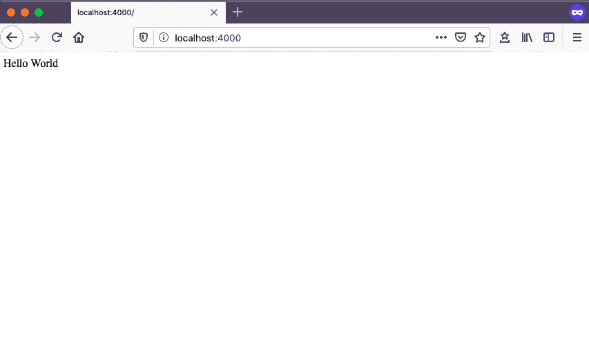

# 第三章：使用 Node 和 Express 构建 Web 应用程序

在实现我们的 API 之前，我们将构建一个基本的服务器端 Web 应用程序，作为我们 API 后端的基础。我们将使用[Express.js 框架](https://expressjs.com)，一个“Node.js 的极简主义 Web 框架”，这意味着它不会预装很多功能，但是高度可配置。我们将使用 Express.js 作为我们 API 服务器的基础，但 Express 也可以用于构建功能完整的服务器端 Web 应用程序。

用户界面，如网站和移动应用程序，在需要访问数据时与 Web 服务器进行通信。这些数据可以是任何东西，从在 Web 浏览器中呈现页面所需的 HTML，到用户搜索结果。客户端界面使用 HTTP 与服务器通信。数据请求通过 HTTP 从客户端发送到运行在服务器上的 Web 应用程序。然后，Web 应用程序处理请求并再次通过 HTTP 将数据返回给客户端。

在本章中，我们将构建一个小型的服务器端 Web 应用程序，这将是我们 API 的基础。为此，我们将使用 Express.js 框架构建一个简单的 Web 应用程序，发送一个基本的请求。

# Hello World

现在您已经了解了服务器端 Web 应用程序的基础知识，让我们开始吧。在我们 API 项目的*src*目录中，创建一个名为*index.js*的文件，并添加以下内容：

```
const express = require('express');
const app = express();

app.get('/', (req, res) => res.send('Hello World'));

app.listen(4000, () => console.log('Listening on port 4000!'));
```

在这个例子中，首先我们需要引入`express`依赖并创建`app`对象，使用导入的 Express.js 模块。然后，我们使用`app`对象的`get`方法来指示我们的应用程序，在用户访问根 URL（`/`）时发送“Hello World”的响应。最后，我们指示应用程序在 4000 端口上运行。这样可以让我们在本地通过 URL *http://localhost:4000* 查看应用程序。

现在要运行该应用程序，在您的终端中键入 **`node src/index.js`**。完成后，您应该在终端中看到一个日志，内容为`Listening on port 4000!`。如果是这样，您应该能够在浏览器窗口中打开 *http://localhost:4000* 并在图 3-1 中看到结果。



###### 图 3-1\. 在浏览器中查看我们 Hello World 服务器代码的结果

# Nodemon

现在，假设这个例子的输出不能完全表达我们的兴奋之情。我们希望改变我们的代码，以便在我们的响应中添加一个感叹号。继续操作，将`res.send`的值更改为`Hello World!!!`。完整的行应如下所示：

```
app.get('/', (req, res) => res.send('Hello World!!!'));
```

如果您转到 Web 浏览器并刷新页面，您会注意到输出没有改变。这是因为我们对 Web 服务器所做的任何更改都需要重新启动它。要这样做，请切换回终端并按 Ctrl + C 停止服务器。现在通过再次键入**`node index.js`**来重新启动它。现在，当您导航回浏览器并刷新页面时，您应该会看到更新后的响应。

正如您可以想象的那样，每次更改都要停止和重新启动服务器会很快变得乏味。幸运的是，我们可以使用 Node 包`nodemon`来在更改时自动重新启动服务器。如果您查看项目的*package.json*文件，您将看到`scripts`对象中有一个`dev`命令，该命令指示`nodemon`监视我们的*index.js*文件：

```
"scripts": {
  ...
  "dev": "nodemon src/index.js"
  ...
}
```

# package.json 脚本

`scripts`对象中还有几个其他辅助命令。我们将在未来的章节中探讨这些命令。

现在，要从终端启动应用程序，请输入：

```
npm run dev
```

在浏览器中导航并刷新页面，您会发现一切都像以前一样工作。为了确认`nodemon`自动重启服务器，让我们再次更新我们的`res.send`值，使其如下所示：

```
res.send('Hello Web Server!!!')
```

现在，您应该能够在浏览器中刷新页面并查看更新内容，而无需手动重新启动服务器。

# 扩展端口选项

目前我们的应用程序在 4000 端口上提供服务。这对于本地开发非常好，但在部署应用程序时，我们将需要灵活设置到其他端口号。现在让我们采取步骤来更新这个。我们将首先添加一个`port`变量：

```
const port = process.env.PORT || 4000;
```

这个更改将允许我们在 Node 环境中动态设置端口，但当未指定端口时，则回退到 4000 端口。现在让我们调整我们的`app.listen`代码以适应这个更改，并使用模板文字来记录正确的端口：

```
app.listen(port, () =>
  console.log(`Server running at http://localhost:${port}`)
);
```

我们最终的代码现在应该是：

```
const express = require('express');

const app = express();
const port = process.env.PORT || 4000;

app.get('/', (req, res) => res.send('Hello World!!!'));

app.listen(port, () =>
  console.log(`Server running at http://localhost:${port}`)
);
```

现在，我们的 Web 服务器代码基础已经运行起来了。为了验证一切是否正常工作，请确保控制台中没有错误，并在*http://localhost:4000*处重新加载您的 Web 浏览器。

# 结论

服务器端 Web 应用程序是 API 开发的基础。在本章中，我们使用 Express.js 框架构建了一个基本的 Web 应用程序。在开发基于 Node 的 Web 应用程序时，您可以选择多种框架和工具。由于其灵活性、社区支持和作为项目的成熟度，Express.js 是一个很好的选择。在下一章中，我们将把我们的 Web 应用程序转变为 API。
