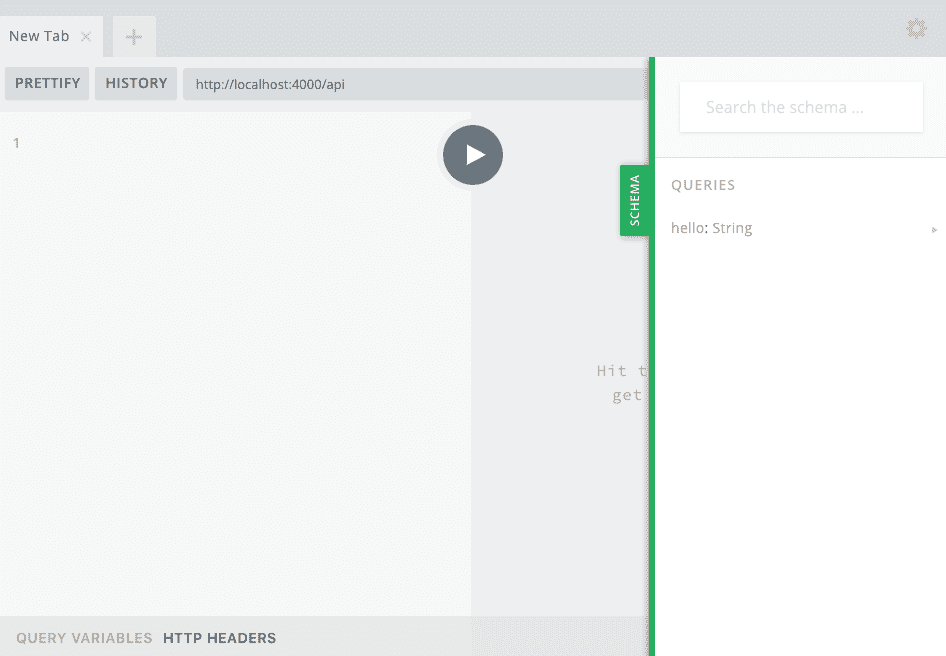
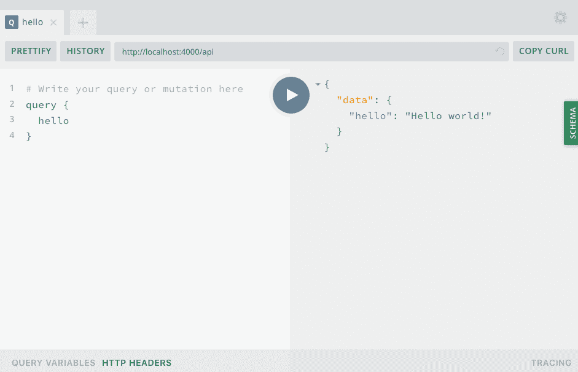
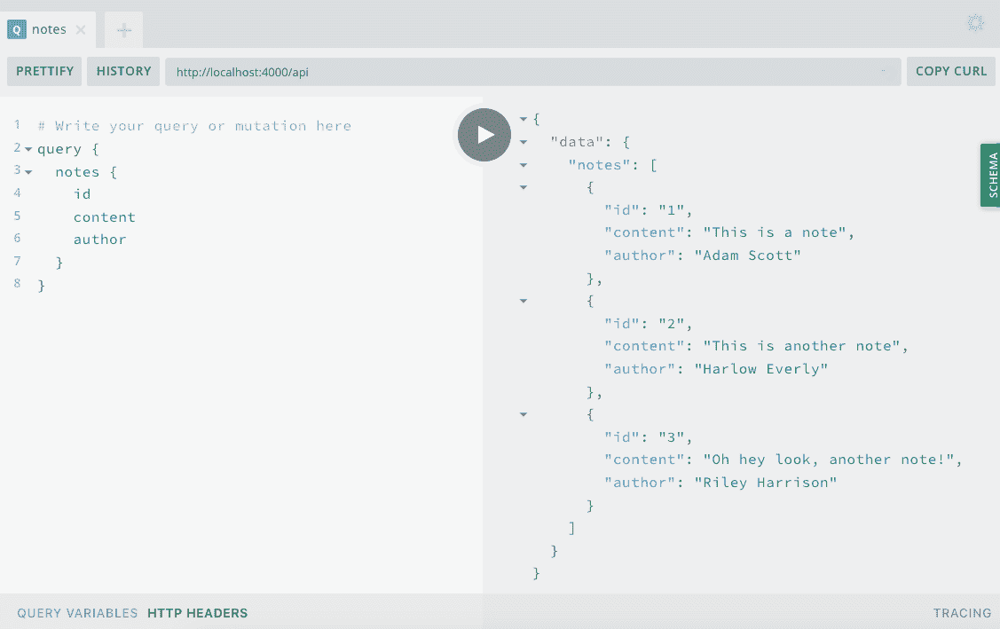
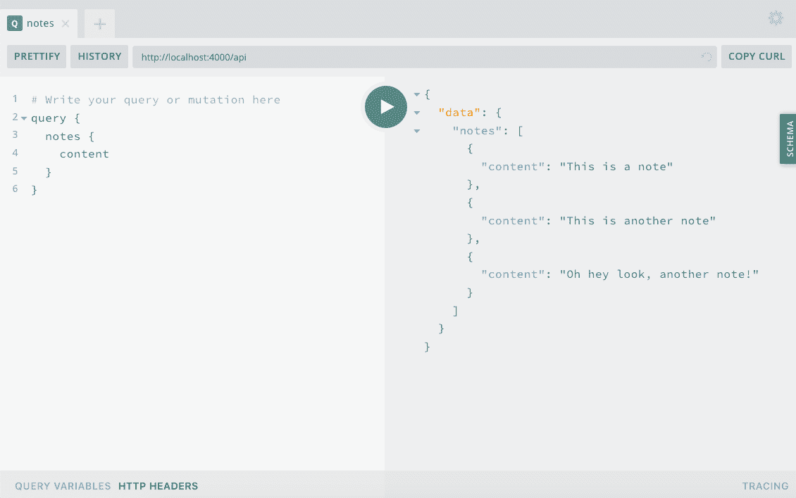

# 第四章：我们的第一个 GraphQL API

据推测，如果你在阅读这篇文章，你是一个人类。作为一个人类，你有许多兴趣和激情。你还有家庭成员、朋友、熟人、同学和同事。这些人也有他们自己的社交关系、兴趣和激情。有些关系和兴趣是重叠的，而有些则不是。总体来说，我们每个人都有一个连接的生活人物图。

这些类型的互连数据正是 GraphQL 最初在 API 开发中要解决的挑战。通过编写一个 GraphQL API，我们能够有效地连接数据，从而减少请求的复杂性和数量，同时允许我们向客户端提供他们确切需要的数据。

这听起来是否有点过度投入于一个笔记应用程序？也许是这样，但正如您将看到的，GraphQL JavaScript 生态系统提供的工具和技术既能够实现，也能够简化所有类型的 API 开发。

在本章中，我们将使用`apollo-server-express`包构建一个 GraphQL API。为此，我们将探讨基本的 GraphQL 主题，编写 GraphQL 模式，开发解析我们模式函数的代码，并使用 GraphQL Playground 用户界面访问我们的 API。

# 将我们的服务器转变为一个 API（有点像）

让我们通过使用`apollo-server-express`包将我们的 Express 服务器转变为一个 GraphQL 服务器来开始我们的 API 开发。[Apollo Server](https://oreil.ly/1fNt3) 是一个开源的 GraphQL 服务器库，可与大量 Node.js 服务器框架一起使用，包括 Express、Connect、Hapi 和 Koa。它使我们能够从 Node.js 应用程序中作为 GraphQL API 提供数据，并提供诸如 GraphQL Playground 这样的有用工具，用于在开发中使用我们的 API 的可视化帮助工具。

要编写我们的 API，我们将修改我们在上一章中编写的 Web 应用程序代码。让我们首先包含`apollo-server-express`包。将以下内容添加到您的*src/index.js*文件的顶部：

```
const { ApolloServer, gql } = require('apollo-server-express');
```

现在我们已经导入了`apollo-server`，我们将设置一个基本的 GraphQL 应用程序。GraphQL 应用程序由两个主要组件组成：类型定义的模式和解析器，解析执行针对数据的查询和变异。如果这一切听起来像胡言乱语，没关系。我们将实现一个“Hello World”API 响应，并在整个 API 开发过程中进一步探讨这些 GraphQL 主题。

要开始，让我们构建一个基本的模式，我们将存储在名为`typeDefs`的变量中。这个模式将描述一个名为`hello`的单个`Query`，它将返回一个字符串：

```
// Construct a schema, using GraphQL schema language
const typeDefs = gql`
 type Query {
 hello: String
 }
`;
```

现在我们已经设置好了我们的模式，我们可以添加一个解析器，以向用户返回一个值。这将是一个简单的函数，返回字符串“Hello world！”：

```
// Provide resolver functions for our schema fields
const resolvers = {
  Query: {
    hello: () => 'Hello world!'
  }
};
```

最后，我们将集成 Apollo Server 来提供我们的 GraphQL API。为此，我们将添加一些 Apollo Server 特定的设置和中间件，并更新我们的`app.listen`代码：

```
// Apollo Server setup
const server = new ApolloServer({ typeDefs, resolvers });

// Apply the Apollo GraphQL middleware and set the path to /api
server.applyMiddleware({ app, path: '/api' });

app.listen({ port }, () =>
  console.log(
    `GraphQL Server running at http://localhost:${port}${server.graphqlPath}`
  )
);
```

把所有内容放在一起，我们的 *src/index.js* 文件现在应该如下所示：

```
const express = require('express');
const { ApolloServer, gql } = require('apollo-server-express');

// Run the server on a port specified in our .env file or port 4000
const port = process.env.PORT || 4000;

// Construct a schema, using GraphQL's schema language
const typeDefs = gql`
 type Query {
 hello: String
 }
`;

// Provide resolver functions for our schema fields
const resolvers = {
  Query: {
    hello: () => 'Hello world!'
  }
};

const app = express();

// Apollo Server setup
const server = new ApolloServer({ typeDefs, resolvers });

// Apply the Apollo GraphQL middleware and set the path to /api
server.applyMiddleware({ app, path: '/api' });

app.listen({ port }, () =>
  console.log(
    `GraphQL Server running at http://localhost:${port}${server.graphqlPath}`
  )
);
```

如果您保留了 `nodemon` 进程正在运行，您可以直接转到您的浏览器；否则，您必须在终端应用程序中键入 `npm run dev` 来启动服务器。然后访问 *http://localhost:4000/api*，您将会看到 GraphQL Playground（见图 4-1）。这个与 Apollo Server 捆绑在一起的 Web 应用程序是使用 GraphQL 的一个巨大好处。从这里，您可以运行 GraphQL 查询和变异，并查看结果。您还可以点击“Schema”选项卡访问自动生成的 API 文档。



###### 图 4-1\. GraphQL Playground

###### 注意

GraphQL Playground 具有深色默认语法主题。在本书中，我将使用“亮”主题，因为它具有更高的对比度。这可以在 GraphQL Playground 的设置中配置，通过点击齿轮图标即可访问设置。

现在我们可以针对我们的 GraphQL API 编写查询。为此，请在 GraphQL Playground 中键入以下内容：

```
query {
  hello
}
```

当您点击“运行”按钮时，查询应返回以下结果（见图 4-2）：

```
{
  "data": {
    "hello": "Hello world!"
  }
}
```



###### 图 4-2\. hello 查询

就是这样！现在我们有了一个可以通过 GraphQL Playground 访问的工作中的 GraphQL API。我们的 API 接受一个名为`hello`的查询并返回字符串`Hello world!`。更重要的是，我们现在已经有了建立全功能 API 的结构。

# GraphQL 基础知识

在前一节中，我们立即开发了我们的第一个 API，但是让我们花几分钟回顾一下 GraphQL API 的不同部分。GraphQL API 的两个主要构建块是*架构*和*解析器*。通过理解这两个组件，您可以更有效地应用它们到您的 API 设计和开发中。

## 架构

架构是我们数据和交互的书面表示。通过需要架构，GraphQL 强制执行了 API 的严格计划。这是因为您的 API 只能返回在架构中定义的数据并执行定义的交互。

GraphQL 架构的基本组件是对象类型。在前面的例子中，我们创建了一个名为`Query`的 GraphQL 对象类型，其包含一个名为`hello`的字段，返回一个标量类型`String`。GraphQL 包含五种内置标量类型：

`String`

使用 UTF-8 字符编码的字符串

`Boolean`

一个真或假的值

`Int`

一个 32 位整数

`Float`

一个浮点数值

`ID`

一个唯一标识符

有了这些基本组件，我们可以为 API 构建一个架构。我们首先通过定义类型来做到这一点。让我们想象我们正在为一个披萨菜单创建一个 API。这样做时，我们可以定义一个名为`Pizza`的 GraphQL 架构类型，如下所示：

```
type Pizza {
}
```

现在，每个披萨都有一个唯一的 ID，一个尺寸（如小、中或大）、一定数量的片数和可选的配料。`Pizza`架构可能看起来像这样：

```
type Pizza {
  id: ID
  size: String
  slices: Int
  toppings: [String]
}
```

在此模式中，一些字段值是必需的（如 ID、size 和 slices），而其他字段可能是可选的（如 toppings）。我们可以通过使用感叹号来表示字段必须包含一个值。让我们更新我们的模式以表示这些必需值：

```
type Pizza {
  id: ID!
  size: String!
  slices: Int!
  toppings: [String]
}
```

在这本书中，我们将编写一个基本的模式，这将使我们能够执行常见 API 中找到的绝大多数操作。如果您想探索所有 GraphQL 模式选项，我建议您阅读 [GraphQL 模式文档](https://oreil.ly/DPT8C)。

## 解析器

我们的 GraphQL API 的第二部分是解析器（resolvers）。解析器正如它们的名称所示执行的动作一样；它们*解析*了 API 用户请求的数据。我们将首先在模式中定义这些解析器，然后在我们的 JavaScript 代码中实现逻辑。我们的 API 将包含两种类型的解析器：查询（queries）和变更（mutations）。

### 查询

查询从 API 中请求特定数据，以其所需格式呈现。在我们的虚拟比萨 API 中，我们可以编写一个查询，它将返回菜单上所有比萨的完整列表，以及另一个将返回单个比萨的详细信息。然后查询将返回一个包含 API 用户请求的数据的对象。查询永远不会修改数据，只是访问它。

### 变更

当我们想要修改我们的 API 中的数据时，我们使用变更（mutation）。在我们的比萨示例中，我们可以编写一个变更，用于更改给定比萨的配料，另一个允许我们调整片数。类似于查询，变更也期望返回一个对象形式的结果，通常是执行操作的最终结果。

# 调整我们的 API

现在您对 GraphQL 组件有了很好的理解，让我们为我们的笔记应用程序调整我们最初的 API 代码。首先，我们将编写一些代码来读取和创建笔记。

我们需要的第一件事是一点数据让我们的 API 工作。让我们创建一个“note”对象数组，这将作为我们的 API 提供的基本数据。随着项目的发展，我们将用数据库替换这个内存数据表示。目前，我们将数据存储在一个名为 `notes` 的变量中。数组中的每个笔记都将是一个带有三个属性 `id`、`content` 和 `author` 的对象。

```
let notes = [
  { id: '1', content: 'This is a note', author: 'Adam Scott' },
  { id: '2', content: 'This is another note', author: 'Harlow Everly' },
  { id: '3', content: 'Oh hey look, another note!', author: 'Riley Harrison' }
];
```

现在我们有了一些数据，我们将适应我们的 GraphQL API 使其与之一起工作。让我们首先关注我们的模式。我们的模式是 GraphQL 表示我们的数据及其交互方式。我们知道我们将有笔记，这些笔记将被查询和变更。目前，这些笔记将包含一个 ID、内容和作者字段。让我们在我们的 `typeDefs` GraphQL 模式中创建一个相应的笔记类型。这将表示 API 中笔记的属性：

```
type Note {
  id: ID!
  content: String!
  author: String!
}
```

现在，让我们添加一个查询，允许我们检索所有笔记的列表。让我们更新 `Query` 类型以包含一个 `notes` 查询，它将返回笔记对象数组：

```
type Query {
  hello: String!
  notes: [Note!]!
}
```

现在，我们可以更新我们的解析器代码，执行返回数据数组的操作。让我们更新我们的`Query`代码，包含以下`notes`解析器，返回原始数据对象：

```
Query: {
    hello: () => 'Hello world!',
    notes: () => notes
  },
```

如果我们现在进入运行在*http://localhost:4000/api*的 GraphQL playground，我们可以测试`notes`查询。为此，请输入以下查询：

```
query {
  notes {
    id
    content
    author
  }
}
```

然后，当您点击播放按钮时，您应该看到返回的包含数据数组的`data`对象（图 4-3）。



###### 图 4-3\. 备注查询

要尝试 GraphQL 最酷的一个方面，我们可以移除我们请求的任何字段，比如`id`或`author`。这样做时，API 会精确返回我们请求的数据。这使得消费数据的客户端能够控制每个请求发送的数据量，并将数据限制在确切所需的范围内（图 4-4）。



###### 图 4-4\. 请求仅包含内容数据的备注查询

现在我们可以查询我们的全部备注列表，让我们编写一些代码，允许我们查询单个备注。从用户界面的角度来看，显示包含单个特定备注的视图非常有用。为此，我们将要请求具有特定`id`值的备注。这将要求我们在我们的 GraphQL 模式中使用一个*参数*。参数允许 API 消费者向解析器函数传递特定值，提供解析所需的必要信息。让我们添加一个`note`查询，它将以`id`为参数，类型为`ID`。我们将更新我们的`typeDefs`中的`Query`对象如下，包括新的`note`查询：

```
type Query {
  hello: String
  notes: [Note!]!
  note(id: ID!): Note!
}
```

更新了我们的模式后，我们可以编写一个查询解析器来返回所请求的备注。为此，我们需要能够读取 API 用户的参数值。幸运的是，Apollo Server 将以下有用的参数传递给我们的解析器函数：

`parent`

父查询的结果，在嵌套查询时非常有用。

`args`

这些是用户在查询中传递的参数。

`context`

从服务器应用程序传递到解析器函数的信息。这可能包括当前用户或数据库信息等内容。

`info`

查询本身的信息。

在我们的代码中根据需要进一步探索这些内容。如果你好奇，你可以在[Apollo Server 文档](https://oreil.ly/l6mL4)中了解更多关于这些参数的信息。目前，我们只需要第二个参数`args`中包含的信息。

`note`查询将接受备注`id`作为参数，并在我们的`note`对象数组中查找它。将以下内容添加到查询解析器代码中：

```
note: (parent, args) => {
  return notes.find(note => note.id === args.id);
}
```

现在解析器代码应如下所示：

```
const resolvers = {
  Query: {
    hello: () => 'Hello world!',
    notes: () => notes,
    note: (parent, args) => {
      return notes.find(note => note.id === args.id);
    }
  }
};
```

要运行我们的查询，让我们回到我们的网页浏览器，并访问 GraphQL Playground，网址是 *http://localhost:4000/api*。我们现在可以查询具有特定 `id` 的笔记，如下所示：

```
query {
  note(id: "1") {
    id
    content
    author
  }
}
```

当您运行此查询时，您应该收到具有请求的 `id` 值的笔记结果。如果尝试查询不存在的笔记，则应收到值为 `null` 的结果。要测试这一点，请尝试更改 `id` 值以返回不同的结果。

让我们通过引入使用 GraphQL 变更操作创建新笔记的能力来完成我们的初始 API 代码。在该变更操作中，用户将传递笔记的内容。目前，我们将硬编码笔记的作者。让我们从更新我们的 `typeDefs` 模式开始，添加一个名为 `newNote` 的 `Mutation` 类型：

```
type Mutation {
  newNote(content: String!): Note!
}
```

现在我们将编写一个变更解析器，它将笔记内容作为参数接收，将笔记存储为一个对象，并将其添加到我们的 `notes` 数组中。为此，我们将在解析器中添加一个名为 `Mutation` 的对象。在 `Mutation` 对象中，我们将添加一个名为 `newNote` 的函数，带有 `parent` 和 `args` 参数。在这个函数中，我们将获取 `content` 参数，并创建一个包含 `id`、`content` 和 `author` 键的对象。正如你所注意到的，这与笔记的当前模式匹配。然后，我们将这个对象推送到我们的 `notes` 数组中，并返回这个对象。返回对象允许 GraphQL 变更以预期格式接收响应。请继续按以下方式编写此代码：

```
Mutation: {
  newNote: (parent, args) => {
    let noteValue = {
      id: String(notes.length + 1),
      content: args.content,
      author: 'Adam Scott'
    };
    notes.push(noteValue);
    return noteValue;
  }
}
```

我们的 *src/index.js* 文件现在如下所示：

```
const express = require('express');
const { ApolloServer, gql } = require('apollo-server-express');

// Run our server on a port specified in our .env file or port 4000
const port = process.env.PORT || 4000;

let notes = [
  { id: '1', content: 'This is a note', author: 'Adam Scott' },
  { id: '2', content: 'This is another note', author: 'Harlow Everly' },
  { id: '3', content: 'Oh hey look, another note!', author: 'Riley Harrison' }
];

// Construct a schema, using GraphQL's schema language
const typeDefs = gql`
 type Note {
 id: ID!
 content: String!
 author: String!
 }

 type Query {
 hello: String
 notes: [Note!]!
 note(id: ID!): Note!
 }

 type Mutation {
 newNote(content: String!): Note!
 }
`;

// Provide resolver functions for our schema fields
const resolvers = {
  Query: {
    hello: () => 'Hello world!',
    notes: () => notes,
    note: (parent, args) => {
      return notes.find(note => note.id === args.id);
    }
  },
  Mutation: {
    newNote: (parent, args) => {
      let noteValue = {
        id: String(notes.length + 1),
        content: args.content,
        author: 'Adam Scott'
      };
      notes.push(noteValue);
      return noteValue;
    }
  }
};

const app = express();

// Apollo Server setup
const server = new ApolloServer({ typeDefs, resolvers });

// Apply the Apollo GraphQL middleware and set the path to /api
server.applyMiddleware({ app, path: '/api' });

app.listen({ port }, () =>
  console.log(
    `GraphQL Server running at http://localhost:${port}${server.graphqlPath}`
  )
);
```

随着模式和解析器的更新以接受变更操作，让我们在 GraphQL Playground 中试验一下，网址是 *http://localhost:4000/api*。在 playground 中，点击 `+` 号以创建一个新的标签页，并按以下方式编写变更操作：

```
mutation {
  newNote (content: "This is a mutant note!") {
   content
   id
   author
  }
}
```

当您点击播放按钮时，您应该收到包含我们新笔记的内容、ID 和作者的响应。您还可以通过重新运行 `notes` 查询来查看变更操作是否成功。要这样做，要么切换回包含该查询的 GraphQL Playground 标签页，要么输入以下内容：

```
query {
  notes {
    content
    id
    author
  }
}
```

当此查询运行时，您现在应该看到包括最近添加的笔记在内的四个笔记。

# 数据存储

我们目前将我们的数据存储在内存中。这意味着每当我们重新启动服务器时，我们将丢失这些数据。在下一章中，我们将使用数据库来持久化我们的数据。

我们现在成功地实现了我们的查询和变更解析器，并在 GraphQL Playground 用户界面中对其进行了测试。

# 结论

在本章中，我们成功地构建了一个 GraphQL API，使用了 `apollo-server-express` 模块。我们现在可以针对一个内存数据对象运行查询和变更操作。这种设置为我们构建任何 API 提供了坚实的基础。在下一章中，我们将探讨通过使用数据库来持久化数据的能力。
