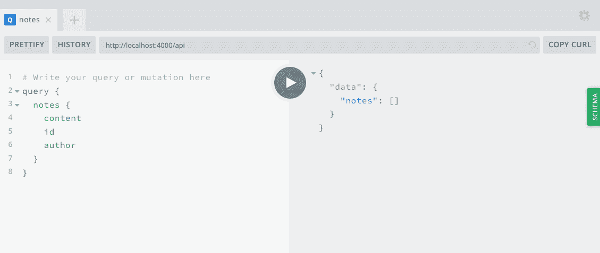
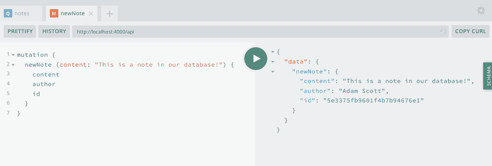
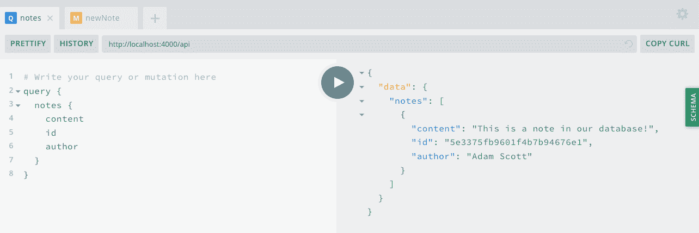
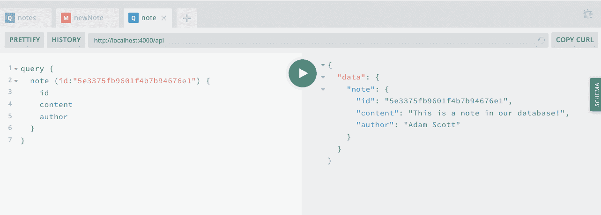

# 第五章：数据库

当我还是个孩子时，我痴迷于收集各种类型的体育卡片。收集卡片的重要部分是组织它们。我把明星球员放在一个盒子里，篮球巨星迈克尔·乔丹的卡片则专门放在一个盒子里，我的其他卡片则按照运动类型进行组织，并按照团队进行进一步的子分类。这种组织方法使我能够安全地存储卡片，并在任何时候轻松找到我想要的卡片。我当时并不知道，但这种存储系统相当于数据库的有形等价物。在其核心，数据库允许我们存储信息并在以后检索。

当我刚开始进行 Web 开发时，我觉得数据库很吓人。我会看到运行数据库和输入晦涩 SQL 命令的说明，感觉就像是我无法理解的额外抽象层。幸运的是，最终我能够攀登这道墙，不再害怕 SQL 表连接，所以如果你和我当时一样，我希望你知道，可以探索数据库世界。

在本书中，我们将使用[MongoDB](https://www.mongodb.com)作为我们的首选数据库。我选择 Mongo 是因为它在 Node.js 生态系统中非常流行，并且对于任何对该主题新手来说都是一个很好的入门数据库选择。Mongo 将我们的数据存储在“文档”中，这类似于 JavaScript 对象。这意味着我们将能够以任何 JavaScript 开发者熟悉的格式编写和检索信息。然而，如果你有一个强烈偏爱的数据库，比如 PostgreSQL，本书涵盖的主题经过一些工作后也适用于任何类型的系统。

在我们可以使用 Mongo 之前，我们需要确保 MongoDB 服务器在本地运行。这在整个开发过程中都是必需的。要做到这一点，请按照第一章中系统的说明进行操作第一章。

# 开始学习 MongoDB

当 Mongo 运行时，让我们探索如何直接从终端与 Mongo 交互，使用 Mongo shell。通过输入`mongo`命令来打开 MongoDB shell：

```
$ mongo
```

运行此命令后，您应该会在 MongoDB shell 中看到有关本地服务器连接以及一些其他信息打印到终端的信息。现在我们可以直接从终端应用程序与 MongoDB 交互。我们可以创建一个数据库，以及使用`use`命令切换到一个新的数据库。让我们创建一个名为`learning`的数据库：

```
$ use learning
```

在本章开头描述的我的卡片收藏中，我将我的卡片组织在单独的盒子中。MongoDB 也带来了相同的概念，称为 *集合*。集合是我们将相似文档组合在一起的方式。例如，一个博客应用程序可能有一个集合用于文章，另一个用于用户，第三个用于评论。如果我们将集合与 JavaScript 对象进行比较，它将是顶级对象，而文档则是其中的各个对象。我们可以将其可视化如下：

```
collection: {
  document: {},
  document: {},
  document: {}.
  ...
}
```

有了这些信息，让我们在 `learning` 数据库中创建一个集合内的文档。我们将创建一个 `pizza` 集合，其中将存储具有披萨类型的文档。在 MongoDB shell 中输入以下内容：

```
$ db.pizza.save({ type: "Cheese" })
```

如果成功的话，我们应该看到返回的结果如下：

```
WriteResult({ "nInserted" : 1 })
```

我们也可以一次性将多个条目写入数据库：

```
$ db.pizza.save([{type: "Veggie"}, {type: "Olive"}])
```

现在我们已经向数据库写入了一些文档，让我们来检索它们。为此，我们将使用 MongoDB 的 `find` 方法。要查看集合中的所有文档，请运行带空参数的 `find` 命令：

```
$ db.pizza.find()
```

现在我们应该在数据库中看到所有三个条目。除了存储数据之外，MongoDB 还会自动为每个条目分配一个唯一的 ID。结果应该看起来像这样：

```
{ "_id" : ObjectId("5c7528b223ab40938c7dc536"), "type" : "Cheese" }
{ "_id" : ObjectId("5c7529fa23ab40938c7dc53e"), "type" : "Veggie" }
{ "_id" : ObjectId("5c7529fa23ab40938c7dc53f"), "type" : "Olive" }
```

我们还可以按属性值以及 Mongo 分配的 ID 找到单个文档：

```
$ db.pizza.find({ type: "Cheese" })
$ db.pizza.find({ _id: ObjectId("A DOCUMENT ID HERE") })
```

不仅我们想要能够找到文档，还可以更新它们也非常有用。我们可以使用 Mongo 的 `update` 方法来进行操作，它接受第一个参数作为要更改的文档，第二个参数是要更改的内容。让我们将我们的 `Veggie` 披萨更新为 `Mushroom` 披萨：

```
$ db.pizza.update({ type: "Veggie" }, { type: "Mushroom" })
```

现在，如果我们运行 `db.pizza.find()`，我们应该能看到您的文档已经更新：

```
{ "_id" : ObjectId("5c7528b223ab40938c7dc536"), "type" : "Cheese" }
{ "_id" : ObjectId("5c7529fa23ab40938c7dc53e"), "type" : "Mushroom" }
{ "_id" : ObjectId("5c7529fa23ab40938c7dc53f"), "type" : "Olive" }
```

与更新文档类似，我们也可以使用 Mongo 的 `remove` 方法删除一个文档。让我们从数据库中删除蘑菇披萨：

```
$ db.pizza.remove({ type: "Mushroom" })
```

现在，如果我们执行 `db.pizza.find()` 查询，我们将在集合中看到只有两个条目。如果我们决定不再包含任何数据，我们可以运行 `remove` 方法，并且不带空对象参数，这将清除我们的整个集合：

```
$ db.pizza.remove({})
```

现在我们已成功使用 MongoDB shell 创建了数据库，向集合添加了文档，更新了这些文档，并将它们删除。这些基本的数据库操作将为我们在项目中集成数据库提供坚实的基础。在开发中，我们还可以使用 MongoDB shell 访问我们的数据库。这对于调试和手动删除或更新条目等任务可能非常有帮助。

# 将 MongoDB 连接到我们的应用程序

现在您已经学会了一些关于使用 MongoDB shell 的知识，让我们将其连接到我们的 API 应用程序。为此，我们将使用[Mongoose 对象文档映射器（ODM）](https://mongoosejs.com)。Mongoose 是一个库，通过其基于模式的建模解决方案，在 Node.js 应用程序中简化了与 MongoDB 的工作，通过减少和简化样板代码。是的，您没看错——又是一个模式！一旦我们定义了数据库模式，通过 Mongoose 在 MongoDB 上的操作类似于我们在 Mongo shell 中编写的命令类型。

我们首先需要更新我们的*.env*文件，其中包含我们本地数据库的 URL。这将允许我们在我们工作的任何环境（例如本地开发和生产）中设置数据库 URL。本地 MongoDB 服务器的默认 URL 是*mongodb://localhost:27017*，我们将在此 URL 后添加我们数据库的名称。因此，在我们的*.env*文件中，我们将设置一个`DB_HOST`变量，并设置 Mongo 数据库实例的 URL 如下：

```
DB_HOST=mongodb://localhost:27017/notedly
```

在我们的应用程序中与数据库一起工作的下一步是连接它。让我们编写一些代码，在启动时将我们的应用程序连接到我们的数据库。为此，我们将首先在*src*目录中创建一个名为*db.js*的新文件。在*db.js*中，我们将编写我们的数据库连接代码。我们还将包括一个用于`close`数据库连接的函数，这在测试应用程序时将非常有用。

在*src/db.js*中，输入以下内容：

```
// Require the mongoose library
const mongoose = require('mongoose');

module.exports = {
  connect: DB_HOST => {
    // Use the Mongo driver's updated URL string parser
    mongoose.set('useNewUrlParser', true);
    // Use findOneAndUpdate() in place of findAndModify()
    mongoose.set('useFindAndModify', false);
    // Use createIndex() in place of ensureIndex()
    mongoose.set('useCreateIndex', true);
    // Use the new server discovery and monitoring engine
    mongoose.set('useUnifiedTopology', true);
    // Connect to the DB
    mongoose.connect(DB_HOST);
    // Log an error if we fail to connect
    mongoose.connection.on('error', err => {
      console.error(err);
      console.log(
        'MongoDB connection error. Please make sure MongoDB is running.'
      );
      process.exit();
    });
  },

  close: () => {
    mongoose.connection.close();
  }
};
```

现在我们将更新我们的*src/index.js*来调用这个连接。为此，我们将首先导入我们的*.env*配置以及*db.js*文件。在文件顶部的导入中，添加这些导入：

```
require('dotenv').config();
const db = require('./db');
```

我喜欢将在*.env*文件中定义的`DB_HOST`值作为一个变量进行存储。直接在`port`变量定义下面添加这个变量。

```
const DB_HOST = process.env.DB_HOST;
```

接下来，我们可以通过将以下内容添加到*src/index.js*文件来调用我们的连接：

```
db.connect(DB_HOST);
```

*src/index.js*文件现在将如下所示：

```
const express = require('express');
const { ApolloServer, gql } = require('apollo-server-express');
require('dotenv').config();

const db = require('./db');

// Run the server on a port specified in our .env file or port 4000
const port = process.env.PORT || 4000;
// Store the DB_HOST value as a variable
const DB_HOST = process.env.DB_HOST;

let notes = [
  {
    id: '1',
    content: 'This is a note',
    author: 'Adam Scott'
  },
  {
    id: '2',
    content: 'This is another note',
    author: 'Harlow Everly'
  },
  {
    id: '3',
    content: 'Oh hey look, another note!',
    author: 'Riley Harrison'
  }
];

// Construct a schema, using GraphQL's schema language
const typeDefs = gql`
 type Note {
 id: ID
 content: String
 author: String
 }

 type Query {
 hello: String
 notes: [Note]
 note(id: ID): Note
 }

 type Mutation {
 newNote(content: String!): Note
 }
`;

// Provide resolver functions for our schema fields
const resolvers = {
  Query: {
    hello: () => 'Hello world!',
    notes: () => notes,
    note: (parent, args) => {
      return notes.find(note => note.id === args.id);
    }
  },
  Mutation: {
    newNote: (parent, args) => {
      let noteValue = {
        id: notes.length + 1,
        content: args.content,
        author: 'Adam Scott'
      };
      notes.push(noteValue);
      return noteValue;
    }
  }
};

const app = express();

// Connect to the database
db.connect(DB_HOST);

// Apollo Server setup
const server = new ApolloServer({ typeDefs, resolvers });

// Apply the Apollo GraphQL middleware and set the path to /api
server.applyMiddleware({ app, path: '/api' });

app.listen({ port }, () =>
  console.log(
    `GraphQL Server running at http://localhost:${port}${server.graphqlPath}`
  )
);
```

尽管实际功能没有改变，但如果您运行`npm run dev`，应用程序应该能够成功连接到数据库并且没有错误。

# 从我们的应用程序中读取和写入数据

现在我们可以连接到我们的数据库了，让我们编写必要的代码来从应用程序内部读取和写入数据。Mongoose 允许我们定义数据将如何存储在我们的数据库中，作为一个 JavaScript 对象，并且我们可以存储和操作符合该模型结构的数据。有了这个想法，让我们创建我们的对象，称为一个 Mongoose 模式。

首先，在我们的*src*目录中创建一个名为*models*的文件夹，用于存放这个模式文件。在这个文件夹中，创建一个名为*note.js*的文件。在*src/models/note.js*中，我们将从定义文件的基本设置开始：

```
// Require the mongoose library
const mongoose = require('mongoose');

// Define the note's database schema
const noteSchema = new mongoose.Schema();

// Define the 'Note' model with the schema
const Note = mongoose.model('Note', noteSchema);
// Export the module
module.exports = Note;
```

接下来，我们将定义我们的模式，在`noteSchema`变量内。类似于内存数据示例，我们当前的模式将包括笔记内容以及表示作者的硬编码字符串。我们还将包括选项来包含我们笔记的时间戳，这些时间戳将在笔记创建或编辑时自动存储。随着进展，我们将添加功能到我们的笔记模式中。

我们的 Mongoose 模式将被结构化如下：

```
// Define the note's database schema
const noteSchema = new mongoose.Schema(
  {
    content: {
      type: String,
      required: true
    },
    author: {
      type: String,
      required: true
    }
  },
  {
    // Assigns createdAt and updatedAt fields with a Date type
    timestamps: true
  }
);
```

# 数据永久性

在开发过程中，我们将更新和修改我们的数据模型，有时会从数据库中删除所有数据。因此，我不建议使用此 API 存储重要的东西，如课堂笔记、您朋友的生日清单或您最喜欢的比萨店的地址。

我们的整体 *src/models/note.js* 文件现在应该如下所示：

```
// Require the mongoose library
const mongoose = require('mongoose');

// Define the note's database schema
const noteSchema = new mongoose.Schema(
  {
    content: {
      type: String,
      required: true
    },
    author: {
      type: String,
      required: true
    }
  },
  {
    // Assigns createdAt and updatedAt fields with a Date type
    timestamps: true
  }
);

// Define the 'Note' model with the schema
const Note = mongoose.model('Note', noteSchema);
// Export the module
module.exports = Note;
```

为了简化将我们的模型导入到我们的 Apollo Server Express 应用程序中，我们将在 *src/models* 目录下添加一个 *index.js* 文件。这将把我们的模型组合成一个单独的 JavaScript 模块。虽然这并不是严格必要的，但在应用程序和数据库模型增长时，我发现这是一个很好的模式。在 *src/models/index.js* 中，我们将导入我们的笔记模型，并将其添加到一个`models`对象中以便导出：

```
const Note = require('./note');

const models = {
  Note
};

module.exports = models;
```

现在，我们可以通过将我们的模型导入到 *src/index.js* 文件中，将数据库模型整合到我们的 Apollo Server Express 应用程序代码中：

```
const models = require('./models');
```

当我们的数据库模型代码导入后，我们可以调整我们的解析器以保存和从数据库中读取数据，而不是使用内存变量。为此，我们将重写`notes`查询以通过使用 MongoDB 的`find`方法从数据库中获取笔记：

```
notes: async () => {
  return await models.Note.find();
},
```

在我们的服务器运行后，我们可以在浏览器中访问 GraphQL Playground 并运行我们的`notes`查询：

```
query {
  notes {
    content
    id
    author
  }
}
```

预期结果将是一个空数组，因为我们尚未向数据库中添加任何数据（图 5-1）：

```
{
  "data": {
    "notes": []
  }
}
```



###### 图 5-1\. 一个笔记查询

为了更新我们的`newNote`变异以向我们的数据库添加一个笔记，我们将使用我们的 MongoDB 模型的`create`方法，该方法将接受一个对象。目前，我们将继续硬编码作者的名称：

```
newNote: async (parent, args) => {
  return await models.Note.create({
    content: args.content,
    author: 'Adam Scott'
  });
}
```

现在，我们可以访问 GraphQL Playground 并编写一个变异来将笔记添加到我们的数据库中：

```
mutation {
  newNote (content: "This is a note in our database!") {
   content
   author
   id
  }
}
```

我们的变异将返回一个新的笔记，其中包含我们放置在参数中的内容，作者的名称，以及 MongoDB 生成的 ID（图 5-2）。



###### 图 5-2\. 变异在数据库中创建一个新的笔记

如果我们现在重新运行我们的`notes`查询，我们应该看到我们从数据库中检索到的笔记！（见 图 5-3。）



###### 图 5-3\. 我们的笔记查询从数据库返回的数据

最后一步是重写我们的`notes`查询，以从我们的数据库中检索特定笔记，使用 MongoDB 分配给每个条目的唯一 ID。为此，我们将使用 Mongoose 的`findbyId`方法：

```
note: async (parent, args) => {
  return await models.Note.findById(args.id);
}
```

现在我们可以写一个查询，使用我们在`notes`查询或`newNote`变更中看到的唯一 ID，以从我们的数据库中检索单个笔记。为此，我们将编写一个带有`id`参数的`note`查询（图 5-4）：

```
query {
  note(id: "5c7bff794d66461e1e970ed3") {
    id
    content
    author
  }
}
```

# 您的笔记 ID

在前面示例中使用的 ID 是我本地数据库特有的。请确保从您自己的查询或变更结果中复制一个 ID。



###### 图 5-4\. 查询单个笔记

我们最终的*src/index.js*文件将如下所示：

```
const express = require('express');
const { ApolloServer, gql } = require('apollo-server-express');
require('dotenv').config();

const db = require('./db');
const models = require('./models');

// Run our server on a port specified in our .env file or port 4000
const port = process.env.PORT || 4000;
const DB_HOST = process.env.DB_HOST;

// Construct a schema, using GraphQL's schema language
const typeDefs = gql`
 type Note {
 id: ID
 content: String
 author: String
 }

 type Query {
 hello: String
 notes: [Note]
 note(id: ID): Note
 }

 type Mutation {
 newNote(content: String!): Note
 }
`;

// Provide resolver functions for our schema fields
const resolvers = {
  Query: {
    hello: () => 'Hello world!',
    notes: async () => {
      return await models.Note.find();
    },
    note: async (parent, args) => {
      return await models.Note.findById(args.id);
    }
  },
  Mutation: {
    newNote: async (parent, args) => {
      return await models.Note.create({
        content: args.content,
        author: 'Adam Scott'
      });
    }
  }
};

const app = express();

db.connect(DB_HOST);

// Apollo Server setup
const server = new ApolloServer({ typeDefs, resolvers });

// Apply the Apollo GraphQL middleware and set the path to /api
server.applyMiddleware({ app, path: '/api' });

app.listen({ port }, () =>
  console.log(
    `GraphQL Server running at http://localhost:${port}${server.graphqlPath}`
  )
);
```

现在我们可以通过我们的 GraphQL API 从数据库中读取和写入数据！尝试添加更多笔记，使用`notes`查询查看完整的笔记列表，并通过使用`note`查询查看单个笔记的内容。

# 结论

在本章中，您学会了如何使用 MongoDB 和 Mongoose 库与我们的 API 配合使用。数据库（例如 MongoDB）允许我们安全地存储和检索应用程序的数据。对象建模库（例如 Mongoose）通过提供数据库查询和数据验证工具，简化了与数据库的工作。在下一章中，我们将更新我们的 API，使其具有与数据库内容的完整 CRUD（创建、读取、更新和删除）功能。
