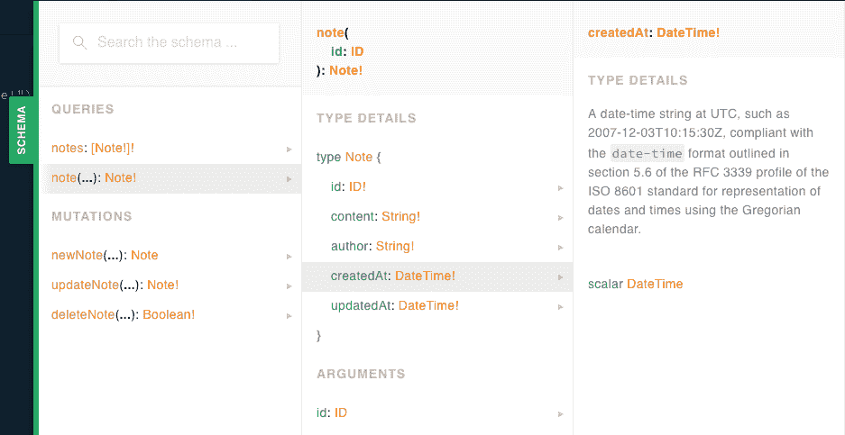

# 第六章：CRUD 操作

我第一次听到“CRUD 应用程序”这个术语时，错误地认为它指的是一个做一些肮脏或诡计的应用程序。诚然，“CRUD”听起来好像指的是可以从鞋底上刮掉的东西。事实上，这个首字母缩略词最早在 20 世纪 80 年代初由英国技术作家詹姆斯·马丁（James Martin）流行起来，用于描述创建、读取、更新和删除数据的应用程序。尽管这个术语已经存在了超过四分之一个世纪，但今天仍然适用于许多开发的应用程序。想想你每天使用的应用程序 - 待办事项列表、电子表格、内容管理系统、文本编辑器、社交媒体网站等等 - 很有可能其中许多都属于 CRUD 应用程序的格式。用户创建一些数据，访问或读取数据，可能会更新或删除该数据。

我们的 Notedly 应用程序将遵循 CRUD 模式。用户将能够创建、读取、更新和删除他们自己的笔记。在本章中，我们将通过连接我们的解析器和数据库来实现 API 的基本 CRUD 功能。

# 分离我们的 GraphQL 模式和解析器

目前我们的*src/index.js*文件包含了我们的 Express/Apollo 服务器代码以及我们 API 的模式和解析器。可以想象，随着代码库的增长，这可能会变得有些笨重。在发生这种情况之前，让我们花点时间进行一些小的重构，将我们的模式、解析器和服务器代码分离开来。

首先，让我们将我们的 GraphQL 模式移到单独的文件中。首先，在*src*文件夹中创建一个名为*src/schema.js*的新文件，然后将我们的模式内容移动到该文件中，该内容在我们的`typeDefs`变量中找到。为此，我们还需要导入`apollo-server-express`包中提供的`gql`模式语言，并将我们的模式作为模块导出，使用 Node 的`module.exports`方法。顺便说一句，我们还可以删除`hello`查询，因为在我们的最终应用程序中不需要它：

```
const { gql } = require('apollo-server-express');

module.exports = gql`
 type Note {
 id: ID!
 content: String!
 author: String!
 }

 type Query {
 notes: [Note!]!
 note(id: ID!): Note!
 }

 type Mutation {
 newNote(content: String!): Note!
 }
`;
```

现在我们可以更新我们的*src/index.js*文件，使用这个外部模式文件来导入它，并删除`apollo-server-express`中的`gql`导入，如下所示：

```
const { ApolloServer } = require('apollo-server-express');

const typeDefs = require('./schema');
```

现在我们已经将我们的 GraphQL 模式隔离到自己的文件中，让我们为我们的 GraphQL 解析器代码做类似的事情。我们的解析器代码将涵盖大多数 API 的逻辑，所以我们首先将创建一个名为*resolvers*的文件夹来存放这些代码，在*src/resolvers*目录中，我们将从三个文件开始：*src/resolvers/index.js*、*src/resolvers/query.js*和*src/resolvers/mutation.js*。与我们在数据库模型中遵循的模式类似，*src/resolvers/index.js*文件将用于将我们的解析器代码导入单个导出模块中。请按照以下方式设置此文件：

```
const Query = require('./query');
const Mutation = require('./mutation');

module.exports = {
  Query,
  Mutation
};
```

现在你可以为 API 查询代码设置*src/resolvers/query.js*：

```
module.exports = {
  notes: async () => {
    return await models.Note.find()
  },
  note: async (parent, args) => {
    return await models.Note.findById(args.id);
  }
}
```

然后将变异代码移动到*src/resolvers/mutation.js*文件中：

```
module.exports = {
  newNote: async (parent, args) => {
    return await models.Note.create({
      content: args.content,
      author: 'Adam Scott'
    });
  }
}
```

接下来，服务器通过在*src/index.js*文件中添加以下行来导入解析器代码：

```
const resolvers = require('./resolvers');
```

重构解析器的最后一步是将它们连接到我们的数据库模型。正如您可能已经注意到的，我们的解析器模块引用这些模型，但无法访问它们。为了解决这个问题，我们将使用 Apollo Server 称为*上下文*的概念，它允许我们从服务器代码传递特定信息到每个请求的单个解析器。暂时来看，这可能有些多余，但在将用户身份验证整合到我们的应用程序中时会非常有用。为此，我们将在*src/index.js*中更新我们的 Apollo Server 设置代码，添加一个`context`函数，该函数将返回我们的数据库模型：

```
// Apollo Server setup
const server = new ApolloServer({
  typeDefs,
  resolvers,
  context: () => {
    // Add the db models to the context
    return { models };
  }
 });
```

现在我们将更新每个解析器，以便利用这个上下文，通过在每个函数的第三个参数中添加`{` `models` `}`。

在*src/resolvers/query.js*中执行以下操作：

```
module.exports = {
  notes: async (parent, args, { models }) => {
    return await models.Note.find()
  },
  note: async (parent, args, { models }) => {
    return await models.Note.findById(args.id);
  }
}
```

将变更代码移至*src/resolvers/mutation.js*文件：

```
module.exports = {
  newNote: async (parent, args, { models }) => {
    return await models.Note.create({
      content: args.content,
      author: 'Adam Scott'
    });
  }
}
```

现在，我们的*src/index.js*文件将简化如下：

```
const express = require('express');
const { ApolloServer } = require('apollo-server-express');
require('dotenv').config();

// Local module imports
const db = require('./db');
const models = require('./models');
const typeDefs = require('./schema');
const resolvers = require('./resolvers');

// Run our server on a port specified in our .env file or port 4000
const port = process.env.PORT || 4000;
const DB_HOST = process.env.DB_HOST;

const app = express();

db.connect(DB_HOST);

// Apollo Server setup
const server = new ApolloServer({
  typeDefs,
  resolvers,
  context: () => {
    // Add the db models to the context
    return { models };
  }
});

// Apply the Apollo GraphQL middleware and set the path to /api
server.applyMiddleware({ app, path: '/api' });

app.listen({ port }, () =>
  console.log(
    `GraphQL Server running at http://localhost:${port}${server.graphqlPath}`
  )
);
```

# 编写我们的 GraphQL CRUD 架构

现在我们已经为灵活性重构了我们的代码，让我们开始实施我们的 CRUD 操作。我们已经能够创建和读取笔记，现在剩下的是实现我们的更新和删除功能。首先，我们将更新我们的架构。

由于更新和删除操作将更改我们的数据，它们将成为变更操作。我们的更新笔记将需要一个 ID 参数来定位笔记以及新的笔记内容。更新查询然后将返回新更新的笔记。对于我们的删除操作，我们的 API 将返回一个布尔值`true`，以通知我们笔记删除成功。

更新*src/schema.js*中的`Mutation`架构如下：

```
type Mutation {
  newNote(content: String!): Note!
  updateNote(id: ID!, content: String!): Note!
  deleteNote(id: ID!): Boolean!
}
```

通过这些添加，我们的架构现在可以执行 CRUD 操作。

# CRUD 解析器

有了我们的架构，我们现在可以更新我们的解析器来删除或更新笔记。让我们从我们的`deleteNote`变更操作开始。要删除一个笔记，我们将使用 Mongoose 的`findOneAndRemove`方法，并传递我们想要删除的项目的`id`。如果找到并删除了我们的项目，我们将向客户端返回`true`，但如果删除失败，我们将返回`false`。

在*src/resolvers/mutation.js*中，添加以下内容，位于`module.exports`对象内部：

```
deleteNote: async (parent, { id }, { models }) => {
  try {
    await models.Note.findOneAndRemove({ _id: id});
    return true;
  } catch (err) {
    return false;
  }
},
```

现在我们可以在 GraphQL Playground 中运行我们的变更操作。在 Playground 的新标签页中，编写以下变更操作，确保使用数据库中某个笔记的 ID：

```
mutation {
  deleteNote(id: "5c7d1aacd960e03928804308")
}
```

如果笔记成功删除，您应该会收到`true`的响应：

```
{
  "data": {
    "deleteNote": true
  }
}
```

如果您传递一个不存在的 ID，您将收到一个`"deleteNote": false`的响应。

有了我们的删除功能，让我们编写我们的 `updateNote` 变异。为此，我们将使用 Mongoose 的 `findOneAndUpdate` 方法。此方法将采用查询的初始参数，在数据库中查找正确的笔记，然后是第二个参数，其中我们将 `$set` 新的笔记内容。最后，我们将传递 `new: true` 的第三个参数，这指示数据库将更新后的笔记内容返回给我们。

在 *src/resolvers/mutation.js* 中，在 `module.exports` 对象中添加以下内容：

```
updateNote: async (parent, { content, id }, { models }) => {
  return await models.Note.findOneAndUpdate(
    {
      _id: id,
    },
    {
      $set: {
        content
      }
    },
    {
      new: true
    }
  );
},
```

现在我们可以访问浏览器中的 GraphQL Playground 来尝试我们的 `updateNote` 变异。在播放器中的新标签页中，编写一个具有 `id` 和 `content` 参数的变异：

```
mutation {
  updateNote(
    id: "5c7d1f0a31191c4413edba9d",
    content: "This is an updated note!"
  ){
    id
    content
  }
}
```

如果我们的变异按预期工作，GraphQL 响应应该如下所示：

```
{
  "data": {
    "updateNote": {
      "id": "5c7d1f0a31191c4413edba9d",
      "content": "This is an updated note!"
    }
  }
}
```

如果我们传递了错误的 ID，响应将失败，并且我们将收到一个带有 `Error updating note` 消息的内部服务器错误。

现在我们能够创建、读取、更新和删除笔记。通过这一步骤，我们在 API 中拥有了完整的 CRUD 功能。

# 日期和时间

在创建数据库模式时，我们请求 Mongoose 自动存储时间戳，记录数据库中条目的创建和更新时间。这些信息在我们的应用程序中非常有用，因为它们允许我们在用户界面中显示笔记的创建或最后编辑时间。让我们将 `createdAt` 和 `updatedAt` 字段添加到我们的模式中，以便我们可以返回这些值。

您可能记得 GraphQL 允许默认类型为 `String`、`Boolean`、`Int`、`Float` 和 `ID`。不幸的是，GraphQL 不带有内置的日期标量类型。我们*可以*使用 `String` 类型，但这意味着我们无法利用 GraphQL 提供的类型验证，以确保我们的日期和时间确实是日期和时间。相反，我们将创建一个自定义标量类型。自定义类型允许我们定义一个新类型，并针对请求该类型数据的每个查询和变异进行验证。

让我们通过在 *src/schema.js* 中的 GraphQL 字符串文字的顶部添加自定义标量来更新我们的 GraphQL 模式：

```
module.exports = gql`
 scalar DateTime
 ...
`;
```

现在，在 `Note` 类型中添加 `createdAt` 和 `updatedAt` 字段：

```
type Note {
  id: ID!
  content: String!
  author: String!
  createdAt: DateTime!
  updatedAt: DateTime!
}
```

最后一步是验证这种新类型。虽然我们可以编写自己的验证，但对于我们的用例，我们将使用[`graphql-iso-date` 包](https://oreil.ly/CtmP6)。为此，我们将在任何请求具有 `DateTime` 类型的值的解析器函数中添加验证。

在 *src/resolvers/index.js* 文件中，导入包并将 `DateTime` 值添加到导出的解析器中，如下所示：

```
const Query = require('./query');
const Mutation = require('./mutation');
const { GraphQLDateTime } = require('graphql-iso-date');

module.exports = {
  Query,
  Mutation,
  DateTime: GraphQLDateTime
};
```

现在，如果我们在浏览器中访问 GraphQL Playground 并刷新页面，我们可以验证我们的自定义类型是否按预期工作。如果查看我们的模式，我们可以看到 `createdAt` 和 `updatedAt` 字段的类型是 `DateTime`。如图 6-1 所示，此类型的文档说明其为“UTC 时间的日期时间字符串”。



###### 图 6-1\. 我们的模式现在具有 DateTime 类型

要测试这个功能，让我们在 GraphQL Playground 中编写一个`newNote`变异，其中包括我们的日期字段：

```
mutation {
  newNote (content: "This is a note with a custom type!") {
    content
    author
    id
    createdAt
    updatedAt
  }
}
```

这将返回`createdAt`和`updatedAt`值作为 ISO 格式的日期。如果我们然后对同一条笔记运行`updateNote`变异，我们将看到一个`updatedAt`值，它与`createdAt`日期不同。

有关定义和验证自定义标量类型的更多信息，我建议查阅 Apollo Server 的[“自定义标量和枚举”文档](https://oreil.ly/0rWAC)。

# 结论

在本章中，我们为我们的 API 添加了创建、读取、更新和删除（CRUD）功能。CRUD 应用程序是许多应用程序使用的一种非常常见的模式。我鼓励你看看你每天与之交互的应用程序，并思考它们的数据如何适合这种模式。在下一章中，我们将为我们的 API 添加功能来创建和验证用户账户。
