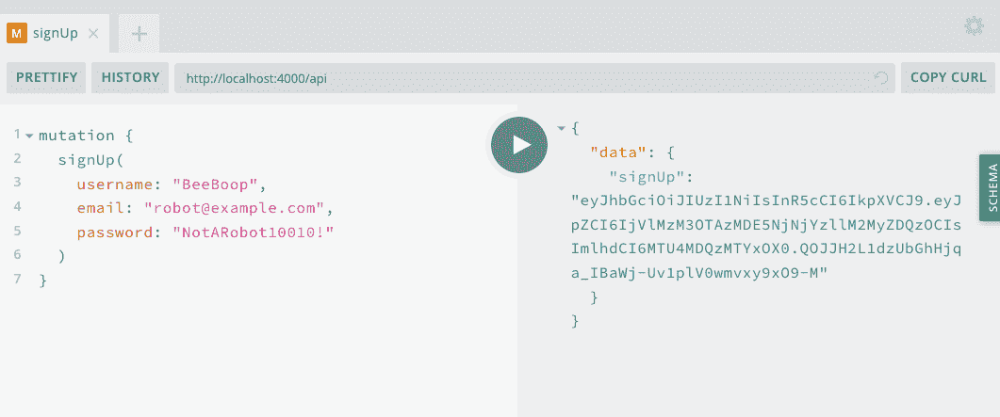
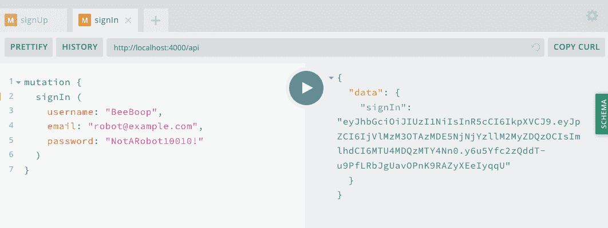
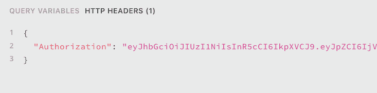
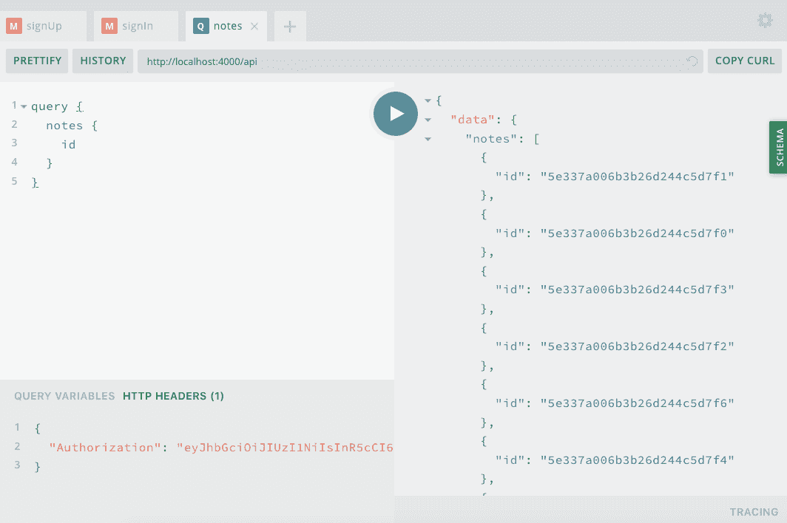
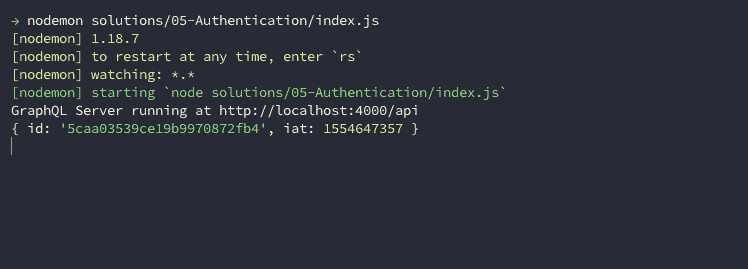

# 第七章：用户账号和认证

想象自己走在一条黑暗的小巷里。你正前往加入“超酷人士秘密俱乐部”（如果你正在阅读这个，你绝对是一个值得加入的成员）。当你进入俱乐部的隐秘门时，接待员迎接你，并递给你一张表格填写。在表格上，你必须输入你的名字和一个只有你和接待员知道的密码。

填写完表格后，你将其交给接待员，接待员走向俱乐部的后房。在后房，接待员使用一个秘密钥匙加密你的密码，然后将加密后的密码存储在一个锁定的文件保险箱里。接待员然后给你盖上了一个你独特的会员 ID 的硬币。当返回前厅时，接待员把硬币递给你，你将它收藏在口袋里。现在每次你回到俱乐部，只需展示你的硬币就可以进入了。

这种交互听起来像是低成本间谍电影中的情节，但几乎与我们每次注册 Web 应用程序时遵循的过程几乎完全相同。在本章中，我们将学习如何构建 GraphQL mutations，允许用户创建账号并登录到我们的应用程序。我们还将学习如何加密用户的密码并向用户返回一个令牌，用户可以在与我们的应用程序交互时用来验证他们的身份。

# 应用程序认证流程

在我们开始之前，让我们退后一步，为用户注册账号和登录现有账号时将要遵循的流程进行规划。如果你还没有完全理解这里涵盖的所有概念，别担心：我们会逐步来讲解。首先，让我们回顾一下账号创建流程：

1.  用户在用户界面（UI）的一个字段中输入他们的预期电子邮件、用户名和密码，例如 GraphQL Playground、Web 应用程序或移动应用程序。

1.  UI 向服务器发送一个带有用户信息的 GraphQL mutation。

1.  服务器加密密码并将用户信息存储在数据库中。

1.  服务器将向 UI 返回一个包含用户 ID 的令牌。

1.  UI 存储此令牌，一段指定的时间，并将其与每个请求一起发送到服务器以验证用户。

现在让我们看看用户登录流程：

1.  用户在 UI 的一个字段中输入他们的电子邮件或用户名和密码。

1.  UI 向服务器发送一个带有此信息的 GraphQL mutation。

1.  服务器解密存储在数据库中的密码并将其与用户输入的密码进行比较。

1.  如果密码匹配，服务器将向 UI 返回一个包含用户 ID 的令牌。

1.  UI 存储此令牌，一段指定的时间，并将其与每个请求一起发送到服务器。

正如你所见，这些流程与我们的“秘密俱乐部”流程非常相似。在本章中，我们将专注于实现这些交互的 API 部分。

# 密码重置流程

您会注意到我们的应用程序不允许用户更改密码。我们可以允许用户通过单个变异解析器重置密码，但通过电子邮件验证重置请求会更安全。为了简洁起见，我们不会在本书中实现密码重置功能，但如果您对创建密码重置流程的示例和资源感兴趣，请访问[JavaScript Everywhere Spectrum community](https://spectrum.chat/jseverywhere)。

# 加密和令牌

在我们探索用户认证流程时，我提到了加密和令牌。这些听起来像是神话般的黑暗艺术，所以让我们花点时间更详细地看看它们吧。

## 加密密码

为了有效地加密用户密码，我们应该使用哈希和加盐的组合。*哈希* 是将文本字符串转换为看似随机的字符串来模糊化文本的行为。哈希函数是“单向”的，这意味着一旦文本被哈希化，就无法恢复到原始字符串。当密码被哈希化时，明文密码永远不会存储在我们的数据库中。*加盐* 是生成一段随机数据字符串，它将被添加到哈希密码之外。这确保即使两个用户的密码相同，哈希和加盐的版本也将是唯一的。

`bcrypt`是基于[blowfish 密码算法](https://oreil.ly/4VjII)的一种流行的哈希函数，在多种网络框架中被广泛使用。在 Node.js 开发中，我们可以使用[bcrypt 模块](https://oreil.ly/t2Ppc)来对密码进行加盐和哈希。

在我们的应用代码中，我们会需要`bcrypt`模块，并编写一个函数来处理加盐和哈希过程。

# 加盐和哈希示例

下面的例子仅供参考。我们将在本章后面集成`bcrypt`的密码加盐和哈希功能。

```
// require the module
const bcrypt = require('bcrypt');

// the cost of processing the salting data, 10 is the default
const saltRounds = 10;

// function for hashing and salting
const passwordEncrypt = async password => {
  return await bcrypt.hash(password, saltRounds)
};
```

在这个例子中，我可以传递一个密码`PizzaP@rty99`，它生成一个盐值`$2a$10$HF2rs.iYSvX1l5FPrX697O`以及哈希和盐化密码`$2a$10$HF2rs.iYSvX1l5FPrX697O9dYF/O2kwHuKdQTdy.7oaMwVga54bWG`（这是盐值加上一个加密密码字符串）。

现在，当检查用户密码是否与经过哈希和加盐的密码匹配时，我们将使用`bcrypt`的`compare`方法：

```
// password is a value provided by the user
// hash is retrieved from our DB
const checkPassword = async (plainTextPassword, hashedPassword) => {
  // res is either true or false
  return await bcrypt.compare(hashedPassword, plainTextPassword)
};
```

通过对用户密码进行加密，我们能够安全地将其存储在数据库中。

## JSON Web Tokens

作为用户，如果我们每次想要访问站点或应用程序的单个受保护页面时都需要输入用户名和密码，那将会非常令人沮丧。相反，我们可以安全地将用户的 ID 存储在其设备上的[JSON Web Token](https://jwt.io)中。每次用户从客户端发出请求时，他们都可以发送该令牌，服务器将使用它来识别用户。

JSON Web Token (JWT)由三部分组成：

头部

关于令牌的一般信息以及正在使用的签名算法类型

负载

我们故意存储在令牌中的信息（例如用户名或 ID）

签名

验证令牌的方法

如果我们查看令牌，它将看起来由随机字符组成，每个部分由句点分隔：`xx-header-xx.yy-payload-yy.zz-signature-zz`。

在我们的应用程序代码中，我们可以使用[`jsonwebtoken`模块](https://oreil.ly/IYxkH)来生成和验证我们的令牌。为此，我们传入我们希望存储的信息，以及一个秘密密码，通常存储在我们的 *.env* 文件中。

```
const jwt = require('jsonwebtoken');

// generate a JWT that stores a user id
const generateJWT = await user => {
  return await jwt.sign({ id: user._id }, process.env.JWT_SECRET);
}

// validate the JWT
const validateJWT = await token => {
  return await jwt.verify(token, process.env.JWT_SECRET);
}
```

# JWT 与 sessions 的比较

如果您之前在 web 应用程序中使用过用户身份验证，您可能已经遇到过用户 *sessions*。会话信息通常存储在本地，通常是在 cookie 中，并根据内存中的数据存储（例如 [Redis](https://redis.io)，虽然也可以使用 [传统数据库](https://oreil.ly/Ds-ba)）。关于哪种更好，JWT 还是 sessions，存在很多争论，但我发现 JWT 在灵活性方面提供了最多的选择，特别是在集成非 web 环境（如原生移动应用程序）时。虽然 sessions 在 GraphQL 中表现良好，但在 [GraphQL Foundation](https://oreil.ly/OAcJ_) 和 [Apollo Server](https://oreil.ly/27iIm) 的文档中，JWT 也是推荐的方法。

通过使用 JWT，我们可以安全地返回和存储用户的 ID 给客户端应用程序。

# 将身份验证集成到我们的 API 中

现在您已经对用户身份验证的组件有了扎实的理解，我们将实现用户在我们的应用程序中注册和登录的能力。为此，我们将更新我们的 GraphQL 和 Mongoose 模式，编写 `signUp` 和 `signIn` mutation 解析器，生成用户令牌，并在每个请求到服务器时验证令牌。

## 用户模式

首先，我们将通过添加 `User` 类型并更新 `Note` 类型的 `author` 字段来更新我们的 GraphQL 模式，以引用 `User`。为此，请按以下方式更新 *src/schema.js* 文件：

```
type Note {
 id: ID!
 content: String!
 author: User!
 createdAt: DateTime!
 updatedAt: DateTime!
}

type User {
 id: ID!
 username: String!
 email: String!
 avatar: String
 notes: [Note!]!
}
```

当用户注册我们的应用程序时，他们将提交用户名、电子邮件地址和密码。当用户登录我们的应用程序时，他们将发送一个包含他们的用户名或电子邮件地址以及密码的 mutation。如果注册或登录 mutation 成功，API 将返回一个字符串作为令牌。为了在我们的模式中实现这一点，我们需要在 *src/schema.js* 文件中添加两个新的 mutations，每个 mutation 将返回一个 `String`，这将是我们的 JWT：

```
type Mutation {
  ...
  signUp(username: String!, email: String!, password: String!): String!
  signIn(username: String, email: String, password: String!): String!
}
```

现在我们的 GraphQL 模式已经更新，我们还需要更新我们的数据库模型。为此，我们将在 *src/models/user.js* 中创建一个 Mongoose 模式文件。该文件将与我们的 `note` 模型文件类似地设置，包含用户名、电子邮件、密码和头像字段。我们还将要求数据库中的用户名和电子邮件字段是唯一的，通过设置 `index: { unique: true }`。

要创建用户数据库模型，请在您的 *src/models/user.js* 文件中输入以下内容：

```
const mongoose = require('mongoose');

const UserSchema = new mongoose.Schema(
  {
    username: {
      type: String,
      required: true,
      index: { unique: true }
    },
    email: {
      type: String,
      required: true,
      index: { unique: true }
    },
    password: {
      type: String,
      required: true
    },
    avatar: {
      type: String
    }
  },
  {
    // Assigns createdAt and updatedAt fields with a Date type
    timestamps: true
  }
);

const User = mongoose.model('User', UserSchema);
module.exports = User;
```

将用户模型文件放置好后，我们现在必须更新*src/models/index.js*以导出该模型：

```
const Note = require('./note');
const User = require('./user');

const models = {
  Note,
  User
};

module.exports = models;
```

## 认证解析器

当我们编写了 GraphQL 和 Mongoose 模式后，我们可以实现解析器，允许用户注册并登录到我们的应用程序。

首先，我们需要在*.env*文件中的`JWT_SECRET`变量中添加一个值。这个值应该是一个没有空格的字符串。它将用于签署我们的 JWT，在解码时用于验证它们。

```
JWT_SECRET=YourPassphrase
```

一旦我们创建了这个变量，我们可以在*mutation.js*文件中导入所需的包。我们将使用第三方的`bcrypt`、`jsonwebtoken`、`mongoose`和`dotenv`包，并导入 Apollo Server 的`AuthenticationError`和`ForbiddenError`实用程序。此外，我们还将导入`gravatar`实用函数，我已经包含在项目中。这将根据用户的电子邮件地址生成一个[Gravatar 图像 URL](https://en.gravatar.com)。

在*src/resolvers/mutation.js*中输入以下内容：

```
const bcrypt = require('bcrypt');
const jwt = require('jsonwebtoken');
const {
  AuthenticationError,
  ForbiddenError
} = require('apollo-server-express');
require('dotenv').config();

const gravatar = require('../util/gravatar');
```

现在我们可以编写我们的`signUp`变更。这个变更将接受用户名、电子邮件地址和密码作为参数。我们将通过修剪任何空白字符并将其转换为小写来规范化电子邮件地址和用户名。接下来，我们将使用`bcrypt`模块加密用户的密码。我们还将使用我们的辅助库为用户头像生成 Gravatar 图像 URL。完成这些操作后，我们将用户存储在数据库中，并向用户返回一个令牌。我们可以在`try`/`catch`块中设置所有这些，以便如果注册过程中出现任何问题，我们的解析器向客户端返回一个故意模糊的错误。

为了完成所有这些，将`signUp`变更如下编写在*src/**resolvers**/mutation.js*文件中：

```
signUp: async (parent, { username, email, password }, { models }) => {
   // normalize email address
   email = email.trim().toLowerCase();
   // hash the password
   const hashed = await bcrypt.hash(password, 10);
   // create the gravatar url
   const avatar = gravatar(email);
   try {
     const user = await models.User.create({
       username,
       email,
       avatar,
       password: hashed
     });

     // create and return the json web token
     return jwt.sign({ id: user._id }, process.env.JWT_SECRET);
   } catch (err) {
     console.log(err);
     // if there's a problem creating the account, throw an error
     throw new Error('Error creating account');
   }
 },
```

现在，如果我们切换到浏览器中的 GraphQL Playground，我们可以尝试我们的`signUp`变更。为此，我们将编写一个 GraphQL 变更，带有用户名、电子邮件和密码值：

```
mutation {
  signUp(
    username: "BeeBoop",
    email: "robot@example.com",
    password: "NotARobot10010!"
  )
}
```

当我们运行这个变更时，服务器将返回一个像这样的令牌（图 7-1）：

```
"data": {
   "signUp": "eyJhbGciOiJIUzI1NiIsInR5cCI6..."
 }
}
```



###### 图 7-1\. GraphQL Playground 中的 signUp 变更

下一步将是编写我们的`signIn`变更。这个变更将接受用户的用户名、电子邮件和密码。然后，它将根据用户名或电子邮件地址在数据库中查找用户。一旦定位到用户，它将解密存储在数据库中的密码，并将其与用户输入的密码进行比较。如果用户和密码匹配，我们的应用程序将向用户返回一个令牌。如果它们不匹配，我们将希望抛出一个错误。

在*src/resolvers/mutation.js*文件中编写如下变更：

```
 signIn: async (parent, { username, email, password }, { models }) => {
   if (email) {
      // normalize email address
      email = email.trim().toLowerCase();
    }

   const user = await models.User.findOne({
     $or: [{ email }, { username }]
   });

   // if no user is found, throw an authentication error
   if (!user) {
     throw new AuthenticationError('Error signing in');
   }

   // if the passwords don't match, throw an authentication error
   const valid = await bcrypt.compare(password, user.password);
   if (!valid) {
     throw new AuthenticationError('Error signing in');
   }

   // create and return the json web token
   return jwt.sign({ id: user._id }, process.env.JWT_SECRET);
 }
```

现在我们可以在浏览器中访问 GraphQL Playground，并尝试`signIn`变更，使用我们使用`signUp`变更创建的帐户：

```
mutation {
  signIn(
    username: "BeeBoop",
    email: "robot@example.com",
    password: "NotARobot10010!"
  )
}
```

再次，如果成功，我们的变更应该以 JWT 的形式解析（图 7-2）：

```
{
  "data": {
    "signIn": "<TOKEN VALUE>"
  }
}
```



###### 图 7-2\. GraphQL Playground 中的 signIn 变更

有了这两个解析器，用户可以使用 JWT 同时注册和登录我们的应用程序。要尝试这个功能，请尝试添加更多帐户，甚至故意输入不匹配的信息，如不匹配的密码，看看 GraphQL API 返回的内容。

# 将用户添加到解析器上下文

现在，用户可以使用 GraphQL 变更来接收唯一的令牌，我们需要在每个请求中验证该令牌。我们的期望是，无论是 Web、移动还是桌面客户端，我们的客户端都将在 HTTP 头中以`Authorization`命名的 HTTP 头中发送令牌。然后，我们可以从 HTTP 头中读取令牌，使用我们的`JWT_SECRET`变量对其进行解码，并通过上下文将用户信息传递给每个 GraphQL 解析器。通过这样做，我们可以确定正在进行请求的已登录用户，并确定是哪个用户。

首先，将`jsonwebtoken`模块导入到*src/index.js*文件中：

```
const jwt = require('jsonwebtoken');
```

导入了模块后，我们可以添加一个函数来验证令牌的有效性：

```
// get the user info from a JWT
const getUser = token => {
  if (token) {
    try {
      // return the user information from the token
      return jwt.verify(token, process.env.JWT_SECRET);
    } catch (err) {
      // if there's a problem with the token, throw an error
      throw new Error('Session invalid');
    }
  }
};
```

现在，在每个 GraphQL 请求中，我们将从请求的头部中获取令牌，尝试验证令牌的有效性，并将用户信息添加到上下文中。完成这些操作后，每个 GraphQL 解析器都可以访问我们在令牌中存储的用户 ID。

```
// Apollo Server setup
const server = new ApolloServer({
  typeDefs,
  resolvers,
  context: ({ req }) => {
    // get the user token from the headers
    const token = req.headers.authorization;
    // try to retrieve a user with the token
    const user = getUser(token);
    // for now, let's log the user to the console:
    console.log(user);
    // add the db models and the user to the context
    return { models, user };
  }
});
```

尽管我们尚未执行用户交互，但我们可以在 GraphQL Playground 中测试我们的用户上下文。在 GraphQL Playground UI 的左下角有一个标有 HTTP Headers 的空间。在该部分 UI 中，我们可以添加一个包含 JWT 的头部，该 JWT 是在我们的`signUp`或`signIn`变更中返回的，如下所示（图 7-3）：

```
{
  "Authorization": "<YOUR_JWT>"
}
```



###### 图 7-3\. GraphQL Playground 中的授权头

我们可以通过将授权头与 GraphQL Playground 中的任何查询或变更一起传递来测试此授权头。为此，我们将编写一个简单的`notes`查询，并包含`Authorization`头部（图 7-4）。

```
query {
  notes {
    id
  }
}
```



###### 图 7-4\. GraphQL Playground 中的授权头和查询

如果我们的身份验证成功，我们应该看到一个包含用户 ID 的对象被记录到我们终端应用程序的输出中，如图 7-5 所示。



###### 图 7-5\. 我们终端控制台中的用户对象的截图

有了所有这些组件，我们现在可以在 API 中对用户进行身份验证。

# 结论

用户账号创建和登录流程可能会让人感到神秘和压力重重，但通过逐步实施，我们可以在 API 中实现稳定且安全的认证流程。在本章中，我们创建了注册和登录用户流程。这些只是账号管理生态系统的一小部分，但将为我们提供一个稳固的基础。在下一章中，我们将在 API 中实现用户特定的交互，这将为应用程序内的笔记和活动分配所有权。
