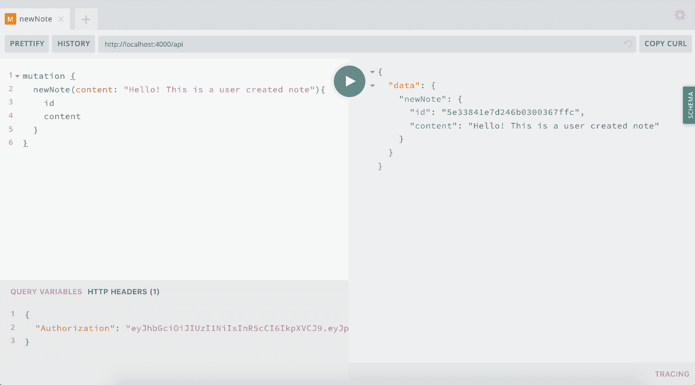
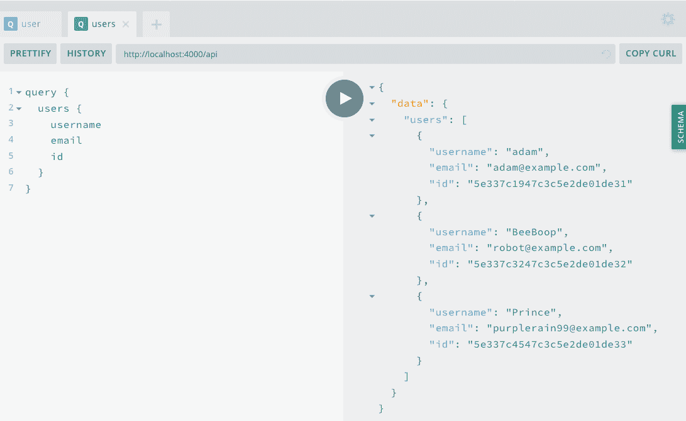
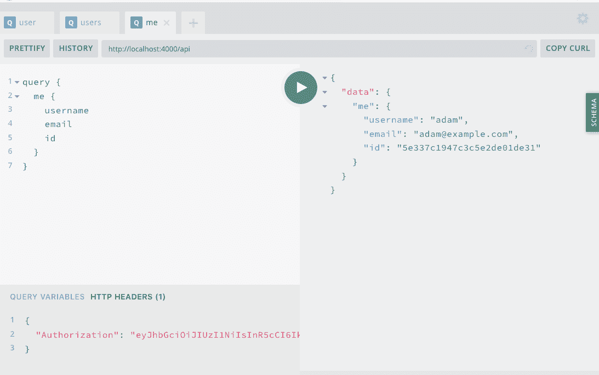
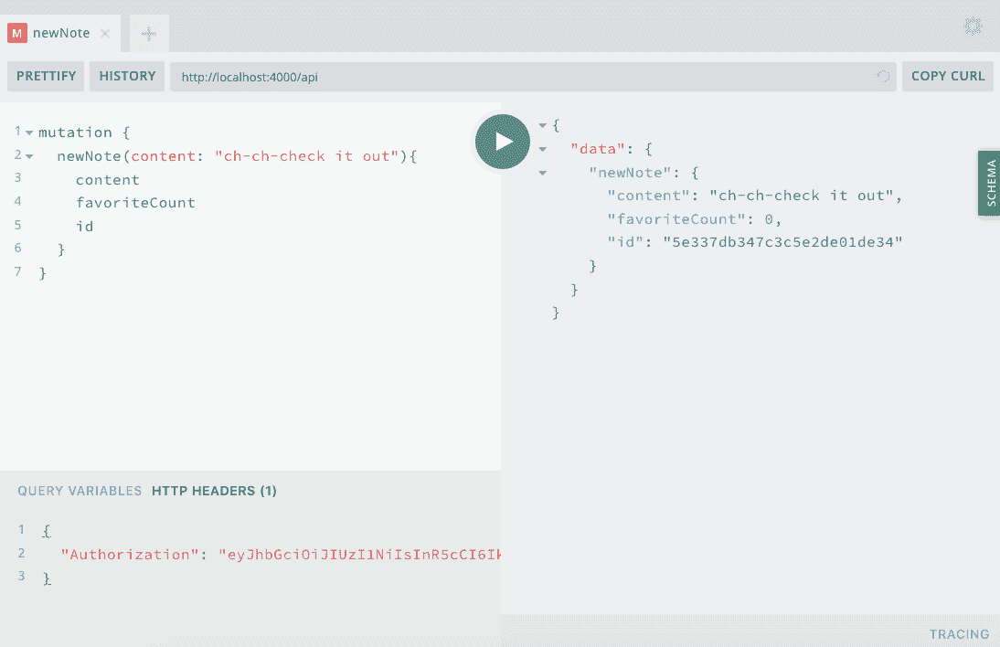
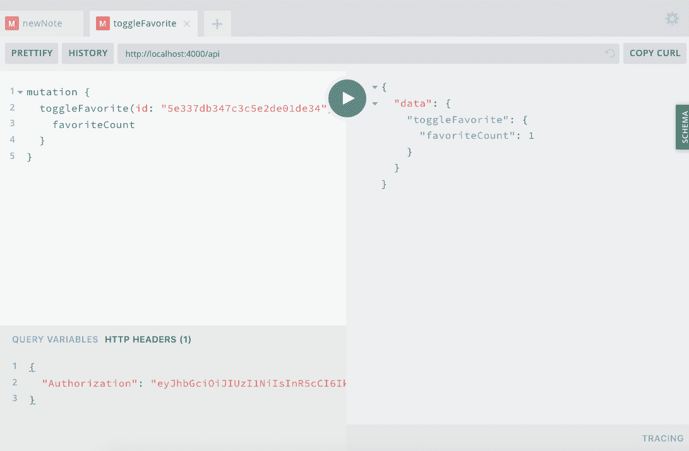

# 第八章：用户操作

想象一下你刚刚加入了一个俱乐部（记得那个“超酷人士秘密俱乐部”吗？），但是当你第一次来到这里时却没什么事可做。俱乐部是一个空荡荡的大房间，人们进进出出，彼此之间无法互动。我有点内向，所以这听起来并不是 *那么* 糟糕，但我不会愿意为此支付会费。

现在我们的 API 本质上是一个大而无用的俱乐部。我们有一种方法来创建数据和一种让用户登录的方法，但没有任何方法让用户拥有这些数据。在本章中，我们将通过添加用户交互来解决这个问题。我们将编写的代码将使用户能够拥有他们创建的注释，限制谁可以删除或修改注释，并使用户能够“收藏”他们喜欢的注释。此外，我们将使 API 用户能够进行嵌套查询，从而使我们的 UI 能够编写与用户和注释相关的简单查询。

# 在我们开始之前

在本章中，我们将对我们的注释文件进行一些相当重大的更改。由于我们的数据库中只有少量数据，您可能会发现将现有注释从本地数据库中删除会更容易。这并非必需，但可以减少您在本章中工作时的混淆。

为了做到这一点，我们将进入 MongoDB shell，确保我们引用的是 `notedly` 数据库（我们 *.env* 文件中的数据库名称），并使用 MongoDB 的 `.remove()` 方法。从您的终端中，输入以下内容：

```
$ mongo
$ use notedly
$ db.notes.remove({})
```

# 将用户附加到新注释

在上一章中，我们更新了我们的 *src/index.js* 文件，以便当用户发出请求时，我们检查 JWT 是否存在。如果令牌存在，我们解码它并将当前用户添加到我们的 GraphQL 上下文中。这允许我们将用户的信息发送到我们调用的每个解析器函数中。我们将更新我们现有的 GraphQL 变化以验证用户的信息。为此，我们将利用 Apollo Server 的 `AuthenticationError` 和 `ForbiddenError` 方法，这将允许我们抛出适当的错误。这些将帮助我们在开发过程中进行调试，同时向客户端发送适当的响应。

在我们开始之前，我们需要将`mongoose`包导入到我们   在我们开始之前，我们需要将 `mongoose` 包导入到我们的 *mutations.js* 解析器文件中。这将允许我们适当地将 MongoDB 对象 ID 分配给我们的字段。更新 *src/resolvers/**mutation.js* 顶部的模块导入如下：

```
const mongoose = require('mongoose');
```

现在，在我们的 `newNote` 变化中，我们将添加 `user` 作为函数参数，然后检查是否向函数传递了用户。如果未找到用户 ID，则抛出 `AuthenticationError`，因为必须登录我们的服务才能创建新的注释。一旦我们验证了请求是由经过身份验证的用户发出的，我们就可以在数据库中创建注释。这样做，我们现在将作者分配给传递给解析器的用户 ID。这将允许我们从注释本身引用创建用户。

在 *src/resolvers/mutation.js* 中添加以下内容：

```
// add the users context
newNote: async (parent, args, { models, user }) => {
  // if there is no user on the context, throw an authentication error
  if (!user) {
    throw new AuthenticationError('You must be signed in to create a note');
  }

  return await models.Note.create({
    content: args.content,
    // reference the author's mongo id
    author: mongoose.Types.ObjectId(user.id)
  });
},
```

最后一步是将交叉引用应用于我们数据库中的数据。为此，我们将需要更新 MongoDB 笔记模式中的 `author` 字段。在 */src/models/note.js* 中，按照以下方式更新 `author` 字段：

```
author: {
  type: mongoose.Schema.Types.ObjectId,
  ref: 'User',
  required: true
}
```

有了这个参考，所有新的注释将准确记录并交叉引用来自请求上下文的作者。让我们通过在 GraphQL Playground 中编写 `newNote` 变更来尝试一下：

```
mutation {
  newNote(content: "Hello! This is a user-created note") {
    id
    content
  }
}
```

在编写变更时，我们还必须确保在 `Authorization` 标头中传递一个 JWT（参见 图 8-1）：

```
{
  "Authorization": "<YOUR_JWT>"
}
```

# 如何检索 JWT

如果你没有方便的 JWT，可以执行 `signIn` 变更以检索一个。



###### 图 8-1\. GraphQL Playground 中的 newNote 变更

目前，我们的 API 不返回作者信息，但我们可以通过在 MongoDB shell 中查找注释来验证已正确添加作者。在终端窗口中，输入以下内容：

```
mongo
db.notes.find({_id: ObjectId("A DOCUMENT ID HERE")})
```

返回的值应包括一个作者键，其值为对象 ID。

# 更新和删除的用户权限

现在我们也可以向 `deleteNote` 和 `updateNote` 变更中添加用户检查。这些将要求我们检查上下文中是否传递了用户，以及该用户是否是注释的所有者。为了实现这一点，我们将检查存储在我们数据库中的 `author` 字段中的用户 ID 是否与传递给解析器上下文的用户 ID 匹配。

在 *src/resolvers/mutation.js* 中，按照以下方式更新 `deleteNote` 变更：

```
deleteNote: async (parent, { id }, { models, user }) => {
  // if not a user, throw an Authentication Error
  if (!user) {
    throw new AuthenticationError('You must be signed in to delete a note');
  }

  // find the note
  const note = await models.Note.findById(id);
  // if the note owner and current user don't match, throw a forbidden error
  if (note && String(note.author) !== user.id) {
    throw new ForbiddenError("You don't have permissions to delete the note");
  }

  try {
    // if everything checks out, remove the note
    await note.remove();
    return true;
  } catch (err) {
    // if there's an error along the way, return false
    return false;
  }
},
```

现在，在 *src/resolvers/mutation.js* 中，按照以下方式更新 `updateNote` 变更：

```
updateNote: async (parent, { content, id }, { models, user }) => {
  // if not a user, throw an Authentication Error
  if (!user) {
    throw new AuthenticationError('You must be signed in to update a note');
  }

  // find the note
  const note = await models.Note.findById(id);
  // if the note owner and current user don't match, throw a forbidden error
  if (note && String(note.author) !== user.id) {
    throw new ForbiddenError("You don't have permissions to update the note");
  }

  // Update the note in the db and return the updated note
  return await models.Note.findOneAndUpdate(
    {
      _id: id
    },
    {
      $set: {
        content
      }
    },
    {
      new: true
    }
  );
},
```

# 用户查询

在我们更新现有的变更以包括用户检查之后，让我们也添加一些特定于用户的查询。为此，我们将添加三个新的查询：

`user`

给定特定用户名，返回用户的信息

`users`

返回所有用户的列表

`me`

返回当前用户的用户信息

在编写查询解析器代码之前，将这些查询添加到 GraphQL 的 *src/schema.js* 文件中，如下所示：

```
type Query {
  ...
  user(username: String!): User
  users: [User!]!
  me: User!
}
```

现在在 *src/resolvers/query.js* 文件中，编写以下解析器查询代码：

```
module.exports = {
  // ...
  // add the following to the existing module.exports object:
  user: async (parent, { username }, { models }) => {
    // find a user given their username
    return await models.User.findOne({ username });
  },
  users: async (parent, args, { models }) => {
    // find all users
    return await models.User.find({});
  },
  me: async (parent, args, { models, user }) => {
    // find a user given the current user context
    return await models.User.findById(user.id);
  }
}
```

让我们在 GraphQL Playground 中看看这些东西。首先，我们可以编写一个用户查询来查找特定用户的信息。确保使用已经创建的用户名：

```
query {
  user(username:"adam") {
    username
    email
    id
  }
}
```

这将返回一个数据对象，包含指定用户的用户名、电子邮件和 ID 值（图 8-2）。


###### 图 8-2\. GraphQL Playground 中的用户查询

现在，我们可以使用 `users` 查询来查找我们数据库中的所有用户，该查询将返回一个包含所有用户信息的数据对象（图 8-3）：

```
query {
  users {
    username
    email
    id
  }
}
```



###### 图 8-3\. GraphQL Playground 中的用户查询

现在，我们可以使用 JWT 在 HTTP 头部传递，通过`me`查询查找已登录用户的信息。

首先，请确保在 GraphQL Playground 的 HTTP 头部部分包含令牌：

```
{
  "Authorization": "<YOUR_JWT>"
}
```

现在，执行`me`查询如下（图 8-4）：

```
query {
  me {
    username
    email
    id
  }
}
```



###### 图 8-4\. GraphQL Playground 中的 me 查询

有了这些解析器的设置，我们现在可以查询我们的 API 以获取用户信息。

# 切换笔记收藏夹

我们还有最后一个功能要添加到我们的用户交互中。您可能记得我们的应用程序规范说明“用户将能够收藏其他用户的笔记并检索其收藏列表。”类似于 Twitter 的“喜欢”和 Facebook 的“赞”，我们希望用户能够将笔记标记为收藏（取消收藏）。为了实现这一行为，我们将遵循更新 GraphQL 模式、然后更新数据库模型，最后更新解析器函数的标准模式。

首先，我们将通过在*./src/schema.js*中的`Note`类型中添加两个新属性来更新我们的 GraphQL 模式。`favoriteCount`将跟踪笔记收到的“收藏”总数。`favoritedBy`将包含已收藏笔记的用户数组。

```
type Note {
  // add the following properties to the Note type
  favoriteCount: Int!
  favoritedBy: [User!]
}
```

我们还将在`User`类型中添加收藏列表：

```
type User {
   // add the favorites property to the User type
   favorites: [Note!]!
 }
```

接下来，我们将在*./src/schema.js*中添加一个名为`toggleFavorite`的变异，通过添加或删除指定笔记的收藏来解决。此变异将接受笔记 ID 作为参数，并返回指定的笔记。

```
type Mutation {
  // add toggleFavorite to the Mutation type
  toggleFavorite(id: ID!): Note!
}
```

接下来，我们需要更新我们的笔记模型，包括在数据库中添加`favoriteCount`和`favoritedBy`属性。`favoriteCount`将是一个`Number`类型，初始值为`0`。`favoritedBy`将是一个包含对数据库中用户对象 ID 引用的对象数组。我们完整的*./src/models/note.js*文件将如下所示：

```
const noteSchema = new mongoose.Schema(
  {
    content: {
      type: String,
      required: true
    },
    author: {
      type: String,
      required: true
    },
    // add the favoriteCount property
    favoriteCount: {
      type: Number,
      default: 0
    },
    // add the favoritedBy property
    favoritedBy: [
      {
        type: mongoose.Schema.Types.ObjectId,
        ref: 'User'
      }
    ]
  },
  {
    // Assigns createdAt and updatedAt fields with a Date type
    timestamps: true
  }
);
```

通过更新我们的 GraphQL 模式和数据库模型，我们可以编写`toggleFavorite`变异。此变异将接收一个笔记 ID 作为参数，并检查用户是否已列在`favoritedBy`数组中。如果用户已列出，我们将通过减少`favoriteCount`并从列表中移除用户来取消收藏。如果用户尚未收藏笔记，我们将增加`favoriteCount`1 并将当前用户添加到`favoritedBy`数组中。为了执行所有这些操作，请将以下代码添加到*src/resolvers/mutation.js*文件中：

```
toggleFavorite: async (parent, { id }, { models, user }) => {
  // if no user context is passed, throw auth error
  if (!user) {
    throw new AuthenticationError();
  }

  // check to see if the user has already favorited the note
  let noteCheck = await models.Note.findById(id);
  const hasUser = noteCheck.favoritedBy.indexOf(user.id);

  // if the user exists in the list
  // pull them from the list and reduce the favoriteCount by 1
  if (hasUser >= 0) {
    return await models.Note.findByIdAndUpdate(
      id,
      {
        $pull: {
          favoritedBy: mongoose.Types.ObjectId(user.id)
        },
        $inc: {
          favoriteCount: -1
        }
      },
      {
        // Set new to true to return the updated doc
        new: true
      }
    );
  } else {
    // if the user doesn't exist in the list
    // add them to the list and increment the favoriteCount by 1
    return await models.Note.findByIdAndUpdate(
      id,
      {
        $push: {
          favoritedBy: mongoose.Types.ObjectId(user.id)
        },
        $inc: {
          favoriteCount: 1
        }
      },
      {
        new: true
      }
    );
  }
},
```

有了这段代码，让我们在 GraphQL Playground 中测试切换笔记收藏的能力。我们将使用新创建的笔记进行测试。我们将从编写`newNote`变异开始，确保在有效的 JWT（图 8-5）中包含`Authorization`头部：

```
mutation {
  newNote(content: "Check check it out!") {
    content
    favoriteCount
    id
  }
}
```



###### 图 8-5\. newNote 变异

你会注意到，这个新笔记的 `favoriteCount` 自动设置为 `0`，因为这是我们在数据模型中设置的默认值。现在，让我们编写一个 `toggleFavorite` mutation 来将其标记为收藏夹，将笔记的 ID 作为参数传递。再次确保包含有效的 JWT 的 `Authorization` HTTP 标头。

```
mutation {
  toggleFavorite(id: "<YOUR_NOTE_ID_HERE>") {
    favoriteCount
  }
}
```

运行此 mutation 后，笔记的 `favoriteCount` 值应为 `1`。如果重新运行 mutation，则 `favoriteCount` 将减少为 `0`（图 8-6）。



###### 图 8-6\. 切换收藏夹的 mutation

用户现在可以标记和取消标记笔记为收藏夹。更重要的是，我希望这个功能展示了如何向 GraphQL 应用程序的 API 添加新功能。

# 嵌套查询

GraphQL 的一个很棒的功能之一是我们可以 *嵌套* 查询，允许我们编写一个单一的查询，精确返回我们需要的数据，而不是多个查询。我们的 GraphQL 模式的 `User` 类型包含作者的笔记列表，以数组格式存在，而 `Notes` 类型包含其作者的引用。因此，我们可以从用户查询中获取笔记列表，或从笔记查询中获取作者信息。

这意味着我们可以编写如下查询：

```
query {
  note(id: "5c99fb88ed0ca93a517b1d8e") {
    id
    content
    # the information about the author note
    author {
      username
      id
    }
  }
}
```

如果我们当前尝试运行类似上述的嵌套查询，我们将收到一个错误。这是因为我们尚未编写执行此信息数据库查找的解析器代码。

要启用此功能，我们将在 *src/resolvers* 目录中添加两个新文件。

在 *src/resolvers/note.js* 中，添加以下内容：

```
module.exports = {
  // Resolve the author info for a note when requested
  author: async (note, args, { models }) => {
    return await models.User.findById(note.author);
  },
  // Resolved the favoritedBy info for a note when requested
  favoritedBy: async (note, args, { models }) => {
    return await models.User.find({ _id: { $in: note.favoritedBy } });
  }
};
```

在 *src/resolvers/user.js* 中，添加以下内容：

```
module.exports = {
  // Resolve the list of notes for a user when requested
  notes: async (user, args, { models }) => {
    return await models.Note.find({ author: user._id }).sort({ _id: -1 });
  },
  // Resolve the list of favorites for a user when requested
  favorites: async (user, args, { models }) => {
    return await models.Note.find({ favoritedBy: user._id }).sort({ _id: -1 });
  }
};
```

现在我们需要更新我们的 *src/resolvers/index.js* 文件来导入和导出这些新的解析器模块。总体而言，*src/resolvers/index.js* 文件现在应如下所示：

```
const Query = require('./query');
const Mutation = require('./mutation');
const Note = require('./note');
const User = require('./user');
const { GraphQLDateTime } = require('graphql-iso-date');

module.exports = {
  Query,
  Mutation,
  Note,
  User,
  DateTime: GraphQLDateTime
};
```

现在，如果我们编写一个嵌套的 GraphQL 查询或 mutation，我们将收到我们期望的信息。您可以尝试编写以下 `note` 查询：

```
query {
  note(id: "<YOUR_NOTE_ID_HERE>") {
    id
    content
    # the information about the author note
    author {
      username
      id
    }
  }
}
```

此查询应正确解析出作者的用户名和 ID。另一个实际示例是返回收藏某个笔记的用户的信息：

```
mutation {
  toggleFavorite(id: "<YOUR NOTE ID>") {
    favoriteCount
    favoritedBy {
      username
    }
  }
}
```

通过使用嵌套解析器，我们可以编写精确的查询和 mutation，精确返回我们需要的数据。

# 结论

祝贺！在本章中，我们的 API 毕业成为用户真正可以互动的东西。通过集成用户操作、添加新功能和嵌套解析器，此 API 展示了 GraphQL 的真正威力。我们还遵循了一个行之有效的模式来向项目中添加新代码：首先编写 GraphQL 模式，然后编写数据库模型，最后编写解析器代码来查询或更新数据。通过将这个过程分解为三个步骤，我们可以为我们的应用程序添加各种功能。在下一章中，我们将讨论使我们的 API 准备投入生产所需的最后步骤，包括分页和安全性。
