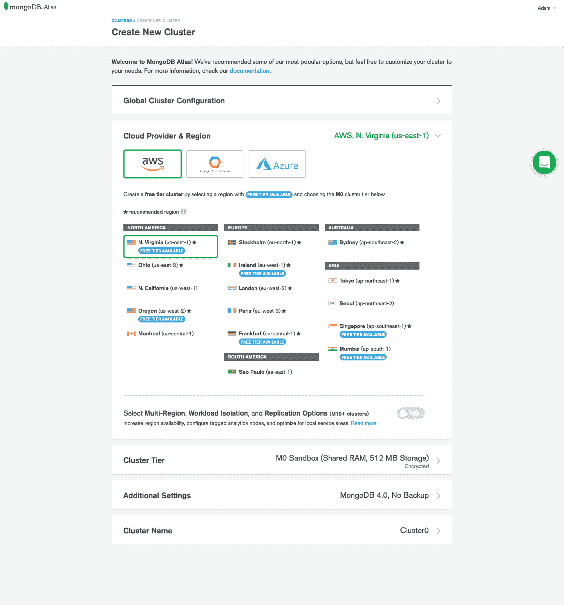
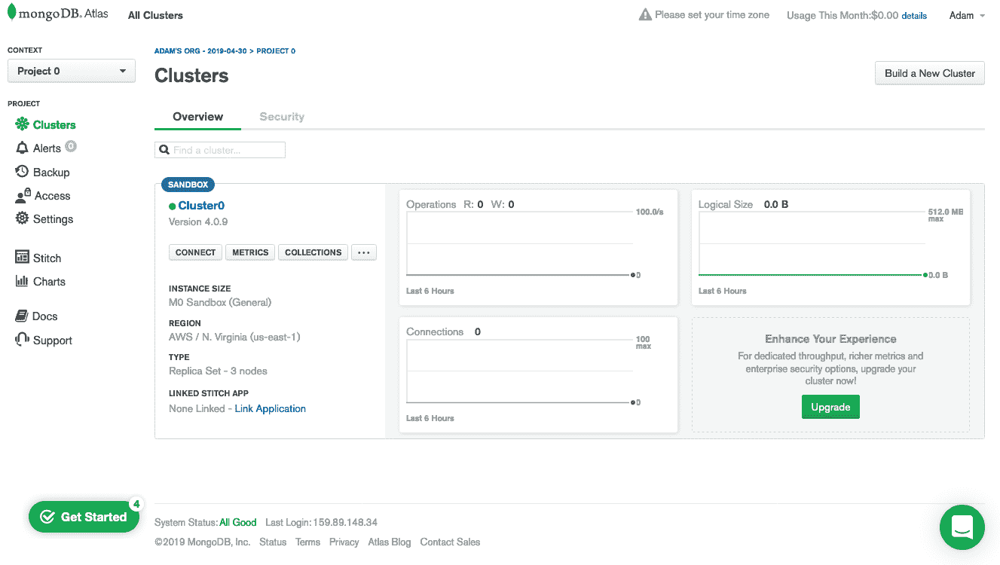
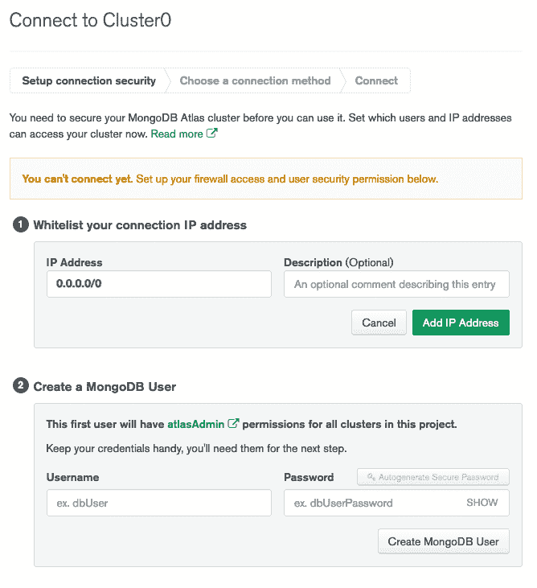
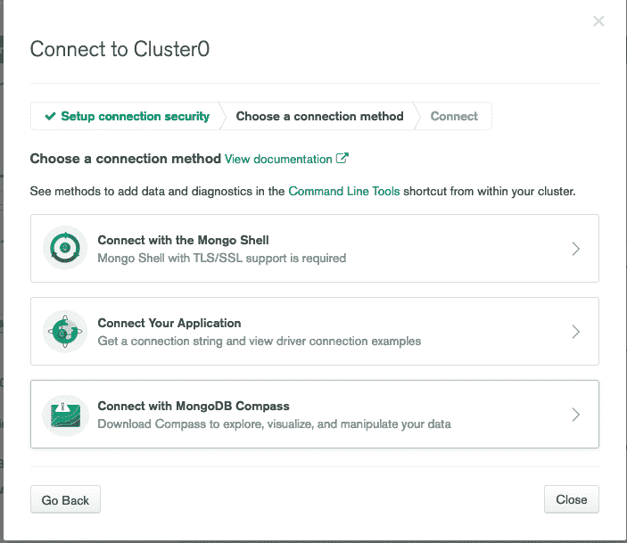
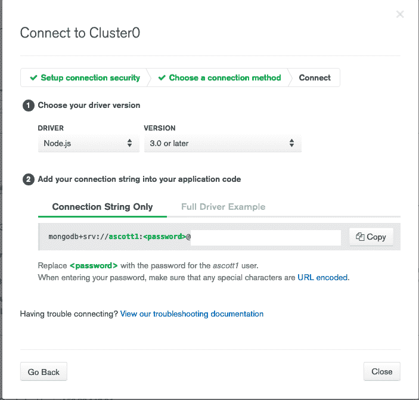
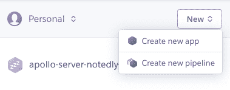
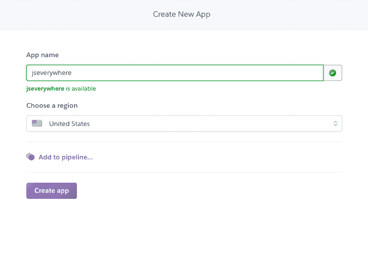
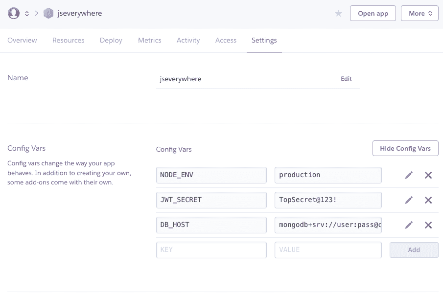

# 第十章：部署我们的 API

想象一下，如果每次用户想要访问我们的 API 来创建、读取、更新或删除一个笔记时，我们都必须带着笔记本电脑去见他们。目前，这就是我们的 API 运行的方式，因为它仅在我们个人的计算机上运行。我们可以通过将我们的应用程序*部署*到 Web 服务器来解决这个问题。

在本章中，我们将采取两个步骤：

1.  首先，我们将设置一个远程数据库，供我们的 API 访问。

1.  其次，我们将部署我们的 API 代码到服务器，并将其连接到数据库。

一旦完成上述步骤，我们可以从任何联网的计算机上访问我们的 API，包括我们将开发的 Web、桌面和移动界面。

# 托管我们的数据库

对于第一步，我们将使用托管的数据库解决方案。对于我们的 Mongo 数据库，我们将使用 MongoDB Atlas。这是一个由 Mongo 本身背后的组织提供的全管理云服务。此外，他们还提供了一个免费套餐，非常适合我们的初始部署。让我们来看看如何部署到 MongoDB Atlas 的步骤。

首先，访问[*mongodb.com/cloud/atlas*](https://oreil.ly/-TpJG)并创建一个账户。创建账户后，您将被提示创建一个数据库。从此屏幕上，您可以管理您的沙箱数据库的设置，但我建议暂时使用默认设置。这些设置是：

+   亚马逊的 AWS 作为数据库主机，尽管谷歌的云平台和微软的 Azure 也提供了选项。

+   最接近的带有“免费套餐”选项的地区

+   集群层级，默认为“M0 Sandbox（共享 RAM，512MB 存储）”

+   其他设置，我们可以保持默认

+   集群名称，我们可以保持默认

在这里，点击创建集群，Mongo 会花几分钟时间设置数据库（图 10-1）。



###### 图 10-1\. MongoDB Atlas 数据库创建屏幕

接下来，您将看到 Clusters 页面，您可以管理个人数据库集群（图 10-2）。



###### 图 10-2\. MongoDB Atlas 集群

从 Clusters 屏幕上，点击连接，您将被提示设置连接安全性。第一步是将您的 IP 地址加入白名单。因为我们的应用将使用动态 IP 地址，您需要将其开放给任何 IP 地址，使用`0.0.0.0/0`。当所有 IP 地址都被加入白名单后，您将需要设置一个安全的用户名和密码来访问数据（图 10-3）。



###### 图 10-3\. MongoDB Atlas IP 白名单和用户账号管理

一旦您的 IP 地址被加入白名单，用户账号被创建，您将选择数据库的连接方式。在这种情况下，它将是一个“应用程序”连接（图 10-4）。



###### 图 10-4\. 在 MongoDB Atlas 中选择连接类型

从这里，你可以复制连接字符串，我们将在我们的生产`.env`文件中使用它（图 10-5）。



###### 图 10-5\. MongoDB Atlas 的数据库连接字符串

# Mongo 密码

MongoDB Atlas *hex-encodes* 密码中的特殊字符。这意味着，如果您使用（并且应该使用！）任何非字母或数字值，您需要在添加密码到连接字符串时使用该代码的十六进制值。网站[*ascii.cl*](https://ascii.cl)提供了所有特殊字符对应的十六进制代码。例如，如果您的密码是`Pizz@2!`，您需要对`@`和`!`字符进行编码。您可以使用`%`后跟十六进制值来执行此操作。生成的密码将是`Pizz%402%21`。

我们的 MongoDB Atlas 托管数据库已经运行起来，现在我们有了一个托管的数据存储用于我们的应用程序。在下一步中，我们将托管我们的应用程序代码并将其连接到我们的数据库。

# 部署我们的应用程序

我们部署设置的下一步是部署我们的应用程序代码。为了本书的目的，我们将使用云应用平台 Heroku。我选择 Heroku 是因为其出色的用户体验和慷慨的免费套餐，但其他云平台如亚马逊 Web 服务、Google Cloud Platform、Digital Ocean 或 Microsoft Azure 都提供了 Node.js 应用程序的替代托管环境。

在我们开始之前，您需要访问[Heroku 的网站](https://heroku.com/apps)并创建一个帐户。一旦您的帐户已创建，您将需要为您的操作系统安装[Heroku 命令行工具](https://oreil.ly/Vf2Q_)。

对于 macOS 用户，您可以使用 Homebrew 安装 Heroku 命令行工具，如下所示：

```
$ brew tap heroku/brew && brew install heroku
```

对于 Windows 用户，请访问 Heroku 命令行工具指南并下载适当的安装程序。

## 项目设置

安装了 Heroku 命令行工具后，我们可以在 Heroku 网站内设置我们的项目。通过点击 New → Create New App 来创建一个新的 Heroku 项目（图 10-6）。



###### 图 10-6\. Heroku 新应用对话框

从这里，您将被提示为应用程序提供一个唯一的名称，之后您可以点击 Create App 按钮（图 10-7）。在接下来的步骤中，您可以在任何地方看到`YOUR_APP_NAME`时使用此名称。



###### 图 10-7\. 提供一个唯一的应用程序名称

现在我们可以添加环境变量了。类似于我们在本地使用*.env*文件的方式，我们可以在 Heroku 网站界面内管理我们的生产环境变量。为此，请点击设置，然后点击显示配置变量按钮。在此屏幕上，添加以下配置变量（图 10-8）：

```
NODE_ENV production
JWT_SECRET A_UNIQUE_PASSPHRASE
DB_HOST YOUR_MONGO_ATLAS_URL
```



###### 图 10-8\. Heroku 的环境变量配置

通过配置我们的应用程序，我们已经准备好部署我们的代码了。

## 部署

现在我们已经准备好将代码部署到 Heroku 的服务器上了。为此，我们可以从终端应用程序中使用直接的 Git 命令。我们将 Heroku 设置为远程端点，然后添加并提交我们的更改，最后将代码推送到 Heroku。要执行此操作，请在终端应用程序中运行以下命令：

```
$ heroku git:remote -a <YOUR_APP_NAME>
$ git add .
$ git commit -am "application ready for production"
$ git push heroku master
```

在 Heroku 构建和部署文件时，您应该在终端中看到输出。完成后，Heroku 将使用我们*package.json*文件中的`run`脚本在其服务器上运行我们的应用程序。

## 测试

一旦我们的应用程序成功部署，我们将能够向远程服务器发出 GraphQL API 请求。默认情况下，在生产环境中禁用 GraphQL Playground UI，但我们可以使用终端应用程序中的`curl`测试我们的应用程序。要运行`curl`请求，请在终端应用程序中输入以下内容：

```
$ curl \
  -X POST \
  -H "Content-Type: application/json" \
  --data '{ "query": "{ notes { id } }" }' \
  https://YOUR_APP_NAME.herokuapp.com/api
```

如果测试成功，我们应该收到一个包含空的`notes`数组的响应，因为我们的生产数据库尚未包含任何数据：

```
{"data":{"notes":[]}}
```

通过这个步骤，我们已经成功部署了我们的应用程序！

# 结论

在本章中，我们使用云服务部署了数据库和我们的应用程序代码。诸如 MongoDB Atlas 和 Heroku 之类的服务使开发人员能够启动小型应用程序，并从兴趣项目到高流量业务进行扩展。通过部署我们的 API，我们成功地开发了应用程序堆栈的后端服务。在接下来的章节中，我们将专注于应用程序的用户界面。
