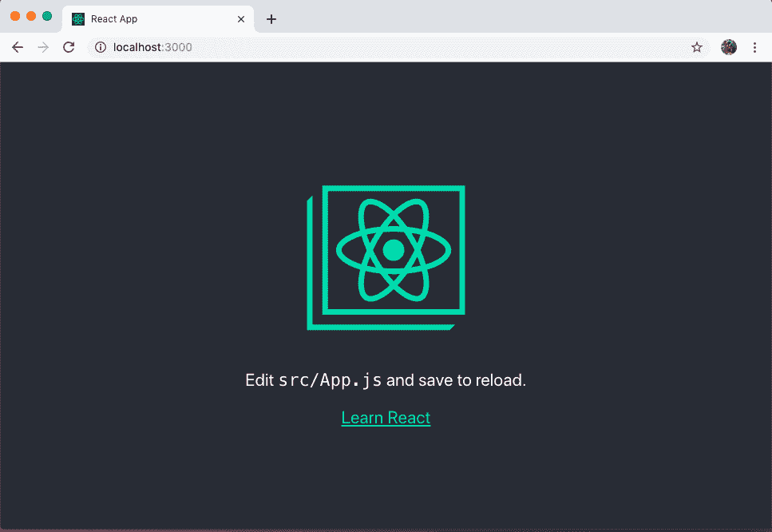
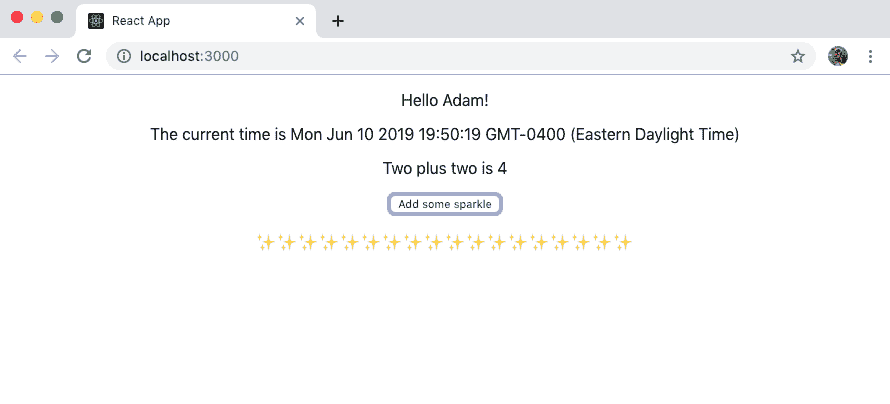

# 第十一章：用户界面和 React

1979 年，史蒂夫·乔布斯著名地访问了施乐帕克（Xerox Parc），在那里他看到了施乐阿尔托个人电脑的演示。当时的其他计算机都是通过键入命令来控制的，而阿尔托使用了鼠标，并且具有可以打开和关闭的窗口的图形界面。乔布斯随后借鉴了这些想法创造了最初的苹果 Macintosh。最初 Mac 的流行导致了计算机 UI 的大量普及。如今，在一个典型的日常中，我们可能会与数十个图形用户界面互动，这些界面可能包括个人计算机以及智能手机、平板电脑、ATM 机、游戏机、支付自助服务机等等。UI 现在围绕着我们，跨越各种设备、内容类型、屏幕尺寸和交互格式。

举例来说，最近我为了开会去了一个不同的城市。那天早上，我醒来后在手机上查看了我的航班状态。我驾车去机场，在车上的屏幕显示了地图，并允许我选择正在听的音乐。在路上，我停在一个 ATM 机前取了些现金，输入我的 PIN 并在触摸屏上输入指令。到达机场后，我在一个飞行自助服务机上办理了登机手续。在候机门等待时，我在平板电脑上回复了几封电子邮件。在飞行中，我在一台电子墨水显示设备上读书。一旦我降落，我通过手机上的一个应用叫了一辆车，并在午餐时在显示屏上输入了我的定制订单。在会议中，幻灯片被投射到屏幕上，而我们中的许多人在笔记本电脑上做笔记。晚上回到酒店，我通过酒店电视屏幕上的指南浏览了电视和电影的选择。我的一天充满了许多 UI 和屏幕尺寸，用于完成与核心生活元素如交通、财务和娱乐相关的任务。

在本章中，我们将简要回顾 JavaScript 用户界面开发的历史。在了解了这些背景知识后，我们将深入探讨 React 的基础知识，这是本书剩余部分将使用的 JavaScript 库。

# JavaScript 和 UI

最初设计于 1990 年代中期（臭名昭著地，在[10 days](https://oreil.ly/BNhvL)内）以增强 Web 界面，JavaScript 提供了一个嵌入式脚本语言在 Web 浏览器中。这使得 Web 设计师和开发者能够在 Web 页面上添加小的交互，这是单靠 HTML 无法实现的。不幸的是，各个浏览器供应商对 JavaScript 有不同的实现，这使得依赖它变得困难。这是导致应用程序大量设计成只能在单个浏览器中运行的因素之一。

在 2000 年代中期，jQuery（以及类似的库，如 MooTools）开始流行起来。jQuery 允许开发人员使用简单的 API 在各种浏览器上编写 JavaScript。很快，我们在网页上都在删除、添加、替换和动画化各种元素。与此同时，Ajax（“异步 JavaScript 和 XML”的缩写）允许我们从服务器获取数据并将其注入到页面中。这两种技术的结合为创建强大的交互式 Web 应用程序提供了生态系统。

随着这些应用程序的复杂性增长，组织和样板代码的需求也在相应增长。到了 2010 年代初，诸如 Backbone、Angular 和 Ember 等框架开始主导 JavaScript 应用程序的风景。这些框架通过在框架代码中施加结构并实现常见应用程序模式来工作。这些框架通常模仿软件设计中的模型-视图-控制器（MVC）模式。每个框架都对 Web 应用程序的所有层提出了具体要求，提供了处理模板、数据和用户交互的结构化方式。尽管这带来了许多好处，但也意味着整合新技术或非标准技术的努力可能会相当高。

与此同时，桌面应用程序继续使用特定于系统的编程语言编写。这意味着开发人员和团队通常被迫做出一种选择（或者 Mac 应用程序，或者 Windows 应用程序，或者 Web 应用程序，或者桌面应用程序等）。移动应用程序处于类似的位置。响应式 Web 设计的兴起意味着设计师和开发人员可以为移动 Web 浏览器创建真正令人难以置信的站点和应用程序，但选择仅构建 Web 应用程序将使它们无法进入移动平台应用商店。Apple 的 iOS 应用程序是用 Objective C（最近是 Swift）编写的，而 Android 依赖于 Java 编程语言（不要与我们的朋友 JavaScript 混淆）。这意味着 HTML、CSS 和 JavaScript 组成的 Web 是唯一真正的跨平台用户界面平台。

# 使用 JavaScript 的声明性界面

在 2010 年代初，Facebook 的开发人员开始面临 JavaScript 代码组织和管理方面的挑战。作为回应，软件工程师乔丹·沃尔克（Jordan Walke）编写了 React，受 Facebook 的 PHP 库 XHP 启发。React 与其他流行的 JavaScript 框架不同，它专注于 UI 的渲染。为了实现这一点，React 采用了“声明性”编程方法，这意味着它提供了一个抽象，允许开发人员专注于描述 UI 的状态应该是什么样的。

随着 React 的兴起，以及类似 Vue.js 这样的库，我们看到开发人员在编写 UI 时发生了变化。这些框架提供了一种在组件级别管理 UI 状态的方式。这使得应用程序对用户来说感觉流畅和无缝，并提供了优秀的开发体验。借助诸如 Electron 用于构建桌面应用程序和 React Native 用于跨平台本地移动应用程序的工具，开发人员和团队现在能够在所有应用程序中利用这些范例。

# 刚刚够用的 React

在接下来的章节中，我们将依赖于 React 库来构建我们的 UI。你不需要有任何 React 的先验经验来跟进，但在开始之前了解一下语法可能会有所帮助。为此，我们将使用 [`create-react-app`](https://oreil.ly/dMQyk) 来快速搭建一个新项目。`create-react-app` 是由 React 团队开发的工具，可以快速设置一个新的 React 项目，并巧妙地抽象了底层的构建工具，如 Webpack 和 Babel。

在你的终端应用程序中 `cd` 到你的项目目录，并运行以下命令，将在名为 *just-enough-react* 的文件夹中创建一个新的 React 应用程序：

```
$ npx create-react-app just-enough-react
$ cd just-enough-react
```

运行这些命令将在 *just-enough-react* 目录中输出一个目录，其中包含所有的项目结构、代码依赖和开发脚本，以构建一个功能齐全的应用程序。通过运行以下命令启动应用程序：

```
$ npm start
```

我们的 React 应用程序现在可以在浏览器中的 *http://localhost:3000* 上看到（图 11-1）。



###### 图 11-1\. 输入 npm start 将在浏览器中启动默认的 create-react-app

现在，我们可以通过修改 *src/App.js* 文件来开始编辑我们的应用程序。这个文件包含了我们的主要 React 组件。在引入一些依赖之后，它包含一个返回类似 HTML 标记的函数：

```
function App() {
  return (
    // markup is here
  )
}
```

组件中使用的标记是一种叫做 *JSX* 的东西。JSX 是一种基于 XML 的语法，类似于 HTML，允许我们精确描述我们的 UI 并将其与用户操作耦合在我们的 JavaScript 文件中。如果你了解 HTML，那么学习 JSX 就是学习一些小的差异。这个例子中的一个重大区别是，HTML 中的 `class` 属性被 `className` 取代，以避免与 JavaScript 的原生类语法冲突。

# JSX？呸！

如果你和我一样，来自于 web 标准和严格的关注点解耦背景，可能会对这感到很反感。我承认，当我第一次接触到 JSX 时，我立刻对它产生了强烈的反感。然而，UI 逻辑与渲染输出的耦合提供了许多引人注目的优势，随着时间的推移，你可能会渐渐接受它。

让我们开始定制我们的应用程序，通过删除大部分样板代码，并将其简化为一个简单的“Hello World！”：

```
import React from 'react';
import './App.css';

function App() {
  return (
    <div className="App">
      <p>Hello world!</p>
    </div>
  );
}

export default App;
```

您可能会注意到包围所有 JSX 内容的封闭`<div>`标签。每个 React UI 组件必须包含在父 HTML 元素内或使用 React 片段，表示非 HTML 元素容器，例如：

```
function App() {
  return (
    <React.Fragment>
      <p>Hello world!</p>
    </React.Fragment>
  );
}
```

React 最强大的一点是我们可以通过在花括号`{}`中包裹 JavaScript 来直接在 JSX 中使用它。让我们更新我们的`App`函数以利用一些变量：

```
function App() {
  const name = 'Adam'
  const now = String(new Date())
  return (
    <div className="App">
      <p>Hello {name}!</p>
      <p>The current time is {now}</p>
      <p>Two plus two is {2+2}</p>
    </div>
  );
}
```

在上面的例子中，您可以看到我们在界面中直接使用 JavaScript。这是多么酷呀！

React 的另一个有用功能是能够将每个 UI 特性转换为自己的组件。一个好的经验法则是，如果 UI 的某个方面以独立的方式行为，那么它应该被分离成自己的组件。让我们创建一个新组件。首先，在*src/Sparkle.js*创建一个新文件并声明一个新函数：

```
import React from 'react';

function Sparkle() {
  return (
    <div>

    </div>
  );
}

export default Sparkle;
```

现在让我们添加一些功能。每当用户点击按钮时，它将向我们的页面添加一个闪亮的表情符号（任何应用程序的关键功能）。为此，我们将导入 React 的`useState`组件，并为我们的组件定义一些初始状态，即空字符串（换句话说，没有闪光）。

```
import React, { useState } from 'react';

function Sparkle() {
  // declare our initial component state
  // this a variable of 'sparkle' which is an empty string
  // we've also defined an 'addSparkle' function, which
  // we'll call in our click handler
  const [sparkle, addSparkle] = useState('');

  return (
    <div>
      <p>{sparkle}</p>
    </div>
  );
}

export default Sparkle;
```

# 什么是状态？

我们将在第十五章中更详细地讨论状态，但现在知道*状态*表示组件内可能会变化的任何信息的当前状态可能会有所帮助。例如，如果 UI 组件有复选框，则当复选框选中时它具有`true`状态，而当未选中时则具有`false`状态。

现在我们可以通过添加具有`onClick`功能的按钮来完成我们的组件。请注意 JSX 中需要使用驼峰命名法：

```
import React, { useState } from 'react';

function Sparkle() {
  // declare our initial component state
  // this a variable of 'sparkle' which is an empty string
  // we've also defined an 'addSparkle' function, which
  // we'll call in our click handler
  const [sparkle, addSparkle] = useState('');

  return (
    <div>
      <button onClick={() => addSparkle(sparkle + '\u2728')}>
        Add some sparkle
      </button>
      <p>{sparkle}</p>
    </div>
  );
}

export default Sparkle;
```

要使用我们的组件，我们可以将其导入到*src/App.js*文件中，并将其声明为 JSX 元素，如下所示：

```
import React from 'react';
import './App.css';

// import our Sparkle component
import Sparkle from './Sparkle'

function App() {
  const name = 'Adam';
  let now = String(new Date());
  return (
    <div className="App">
      <p>Hello {name}!</p>
      <p>The current time is {now}</p>
      <p>Two plus two is {2+2}</p>
      <Sparkle />
    </div>
  );
}

export default App;
```

现在如果您在浏览器中访问我们的应用程序，您应该能看到我们的按钮，并能够单击它将闪光表情符号添加到页面上！这展示了 React 的真正超能力之一。我们能够独立于应用程序的其余部分重新渲染单个组件或组件的元素（图 11-2）。



###### 图 11-2\. 单击按钮更新组件状态并向页面添加内容

现在我们已经使用`create-react-app`创建了一个新应用程序，更新了`Application`组件的 JSX，创建了一个新组件，声明了一个组件状态，并动态更新了一个组件。通过对这些基础知识的基本理解，我们现在可以准备使用 React 在 JavaScript 中开发声明式 UI。

# 结论

我们被各种设备上的用户界面所包围。JavaScript 和 Web 技术提供了在多种平台上开发这些界面的无与伦比的机会，使用统一的技术组合。同时，React 和其他声明式视图库使我们能够构建强大、动态的应用程序。这些技术的结合使开发人员能够在不需要为每个平台专门的知识的情况下构建令人惊叹的东西。在接下来的章节中，我们将通过利用 GraphQL API 来为 Web、桌面和本机移动应用程序构建界面来实践这一点。
