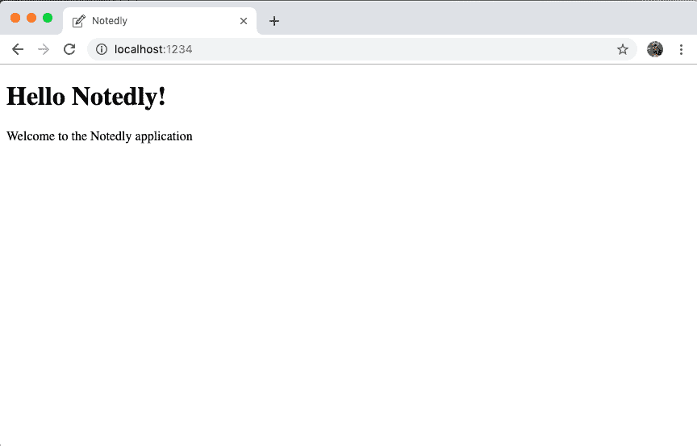
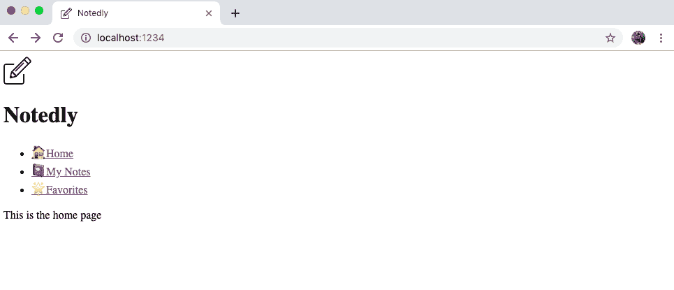

# 第十二章：使用 React 构建 Web 客户端

超文本背后的最初想法是将相关文档链接在一起：如果学术论文 A 引用学术论文 B，让点击导航至它们之间变得容易。1989 年，CERN 的软件工程师 Tim Berners-Lee 提出了将超文本与网络化计算机结合起来的想法，使得任何人都能轻松地进行这些连接，无论文档位于何处。每张猫照片、新闻文章、推文、流媒体视频、职位搜索网站和餐厅评论都深受全球链接文档这一简单想法的影响。

在其核心，Web 仍然是连接文档的媒介。每个页面都是 HTML，在 Web 浏览器中呈现，使用 CSS 进行样式化，JavaScript 进行增强。今天，我们使用这些技术来构建从个人博客和小手册网站到复杂交互式应用程序的一切。其根本优势在于 Web 提供了普遍访问。任何人只需在连接到 Web 的设备上使用 Web 浏览器，即可创建一个默认包容性的环境。

# 我们正在构建什么

在接下来的章节中，我们将为我们的社交笔记应用程序 Notedly 构建 Web 客户端。用户将能够创建并登录账户，在 Markdown 中编写笔记，编辑他们的笔记，查看其他用户笔记的动态，并“收藏”其他用户的笔记。为了实现所有这些功能，我们将与我们的 GraphQL 服务器 API 进行交互。

在我们的 Web 应用程序中：

+   用户将能够创建笔记，以及阅读、更新和删除他们创建的笔记。

+   用户将能够查看其他用户创建的笔记动态，并阅读其他用户创建的单个笔记，尽管他们将无法对其进行更新或删除。

+   用户将能够创建账户、登录和注销。

+   用户将能够检索他们的个人资料信息以及其他用户的公共个人资料信息。

+   用户将能够收藏其他用户的笔记，并检索他们收藏的列表。

这些功能将涵盖很多内容，但我们将在本书的这一部分中分解它们为小块。一旦你学会使用所有这些功能构建 React 应用程序，你将能够将这些工具和技术应用于构建各种丰富的 Web 应用程序。

# 如何构建这个项目

正如你可能猜到的那样，为了构建这个应用程序，我们将使用 React 作为客户端 JavaScript 库。此外，我们将从我们的 GraphQL API 查询数据。为了帮助查询、变更和缓存数据，我们将使用[Apollo Client](https://oreil.ly/hAG_X)。Apollo Client 包括一系列用于处理 GraphQL 的开源工具。我们将使用该库的 React 版本，但 Apollo 团队还开发了 Angular、Vue、Scala.js、Native iOS 和 Native Android 集成。

# 其他 GraphQL 客户端库

尽管本书中我们将使用 Apollo，但这并不是唯一可用的 GraphQL 客户端选项。Facebook 的[Relay](https://relay.dev)和 Formiddable 的[urql](https://oreil.ly/q_deu)是另外两个流行的选择。

此外，我们将使用[Parcel](https://parceljs.org)作为我们的代码打包工具。代码打包工具允许我们使用在 Web 浏览器中可能不可用的 JavaScript 功能（例如，较新的语言特性、代码模块、代码最小化），并将它们打包以在浏览器环境中使用。Parcel 是一个无需配置的替代应用构建工具，如[Webpack](https://webpack.js.org)。它提供了许多好用的功能，如代码分割和开发过程中的自动更新浏览器（也称为*热模块替换*），但无需设置构建链。正如你在前一章节中看到的，[`create-react-app`](https://oreil.ly/dMQyk)也提供了一个零配置的初始设置，使用 Webpack 在后台工作，但 Parcel 允许我们从头开始构建我们的应用程序，这种方式对于学习来说是理想的。

# 开始入门

在我们开始开发之前，我们需要将项目起始文件复制到我们的机器上。[项目源代码](https://github.com/javascripteverywhere/web)包含了我们开发应用所需的所有脚本和第三方库的引用。要将代码克隆到本地机器上，请打开终端，导航到你项目存储的目录，并`git clone`项目仓库。如果你已经完成了 API 章节，可能已经创建了一个*notedly*目录来保持项目代码的组织：

```
# change into the Projects directory
$ cd
$ cd Projects
$ # type the `mkdir notedly` command if you don't yet have a notedly directory
$ cd notedly
$ git clone git@github.com:javascripteverywhere/web.git
$ cd web
$ npm install
```

# 安装第三方依赖

通过复制书籍的起始代码并在目录中运行`npm install`，你可以避免再次为任何单独的第三方依赖运行`npm install`。

代码结构如下：

*/src*

这是你应该在跟随书籍进行开发时执行的目录。

*/solutions*

此目录包含每章节的解决方案。如果你遇到困难，可以参考这些解决方案。

*/final*

此目录包含最终的工作项目。

现在你已经在本地机器上获取了代码，你需要复制项目的*.env*文件。这个文件是用来存放特定于我们工作环境的变量的地方。例如，当我们在本地工作时，我们将指向本地实例的 API，但当我们部署应用时，我们将指向远程部署的 API。要复制示例*.env*文件，请在终端中从*web*目录输入以下内容：

```
$ cp .env.example .env
```

现在你应该在目录中看到一个*.env*文件。你目前不需要对这个文件做任何操作，但随着我们开发 API 后端，我们将逐步向其中添加信息。项目附带的*.gitignore*文件将确保你不会意外地提交*.env*文件。

# 帮助，我看不到.env 文件！

默认情况下，操作系统会隐藏以点开头的文件，因为这些文件通常是系统使用的，而不是用户使用的。如果你看不到*.env*文件，请尝试在你的文本编辑器中打开该目录。该文件应该在编辑器的文件浏览器中可见。或者，你可以在终端窗口中输入`ls -a`来列出当前工作目录中的文件。

# 构建 Web 应用程序

有了我们本地克隆的起始代码，我们准备构建我们的 React Web 应用程序。让我们首先查看我们的*src/index.html*文件。这看起来像是一个标准的但完全空白的 HTML 文件，但请注意以下两行：

```
<div id="root"></div>
<script src="./App.js"></script>
```

这两行对我们的 React 应用程序非常重要。`root <div>`将为整个应用程序提供容器。与此同时，*App.js*文件将是我们 JavaScript 应用程序的入口点。

现在我们可以在我们的*src/App.js*文件中开始开发我们的 React 应用程序了。如果你在上一章节的 React 介绍中跟随操作，这可能会感觉很熟悉。在*src/App.js*中，我们首先导入了`react`和`react-dom`库：

```
import React from 'react';
import ReactDOM from 'react-dom';
```

现在我们将创建一个名为`App`的函数，它将返回我们应用程序的内容。目前，这将简单地是包含在一个`<div>`元素中的两行 HTML：

```
const App = () => {
  return (
    <div>
      <h1>Hello Notedly!</h1>
      <p>Welcome to the Notedly application</p>
    </div>
  );
};
```

# 为什么这么多的 div 标签？

如果你刚开始学习 React，你可能会对围绕组件使用`<div>`标签的倾向感到奇怪。React 组件必须包含在父元素中，这通常是一个`<div>`标签，但也可以是任何其他适当的 HTML 标签，比如`<section>`、`<header>`或`<nav>`。如果包含 HTML 标签感觉多余，我们可以在 JavaScript 代码中使用`<React.Fragment>`或空的`<>`标签来包含组件。

最后，我们将指示 React 在具有 ID 为`root`的元素中渲染我们的应用程序，通过添加以下内容：

```
ReactDOM.render(<App />, document.getElementById('root'));
```

我们*src/App.js*文件的完整内容现在应该是：

```
import React from 'react';
import ReactDOM from 'react-dom';

const App = () => {
  return (
    <div>
      <h1>Hello Notedly!</h1>
      <p>Welcome to the Notedly application</p>
    </div>
  );
};

ReactDOM.render(<App />, document.getElementById('root'));
```

完成后，让我们在网页浏览器中查看一下。通过在终端应用程序中输入**`npm run dev`**来启动本地开发服务器。一旦代码被打包，访问*http://localhost:1234*来查看页面（参见图 12-1）。



###### 图 12-1\. 我们在浏览器中运行的初始 React 应用程序

# 路由

网页的一个显著特点是能够链接文档。类似地，对于我们的应用程序，我们希望用户能够在屏幕或页面之间导航。在 HTML 渲染的应用程序中，这将涉及创建多个 HTML 文档。每当用户导航到新文档时，整个文档将重新加载，即使两个页面有共享的部分，如页眉或页脚。

在 JavaScript 应用程序中，我们可以利用客户端路由。在许多方面，这与 HTML 链接类似。用户将点击链接，URL 将更新，然后他们将导航到新的屏幕。不同之处在于，我们的应用程序将仅更新已更改内容的页面。体验会非常流畅和“应用程序般”，这意味着页面不会出现可见的刷新。

在 React 中，最常用的路由库是 [React Router](https://oreil.ly/MhQQR)。这个库使我们能够为 React Web 应用程序添加路由功能。要向我们的应用程序引入路由，让我们首先创建一个 *src/pages* 目录，并添加以下文件：

+   */src/pages/index.js*

+   */src/pages/home.js*

+   */src/pages/mynotes.js*

+   */src/pages/favorites.js*

我们的 *home.js*、*mynotes.js* 和 *favorites.js* 文件将是我们的各个页面组件。我们可以为每个组件创建一些初始内容和一个 `effect` 钩子，当用户导航到页面时更新文档标题。

在 *src/pages/home.js*：

```
import React from 'react';

const Home = () => {
  return (
    <div>
      <h1>Notedly</h1>
      <p>This is the home page</p>
    </div>
  );
};

export default Home;
```

在 *src/pages/mynotes.js*：

```
import React, { useEffect } from 'react';

const MyNotes = () => {
  useEffect(() => {
    // update the document title
    document.title = 'My Notes — Notedly';
  });

  return (
    <div>
      <h1>Notedly</h1>
      <p>These are my notes</p>
    </div>
  );
};

export default MyNotes;
```

在 *src/pages/favorites.js*：

```
import React, { useEffect } from 'react';

const Favorites = () => {
  useEffect(() => {
    // update the document title
    document.title = 'Favorites — Notedly';
  });

  return (
    <div>
      <h1>Notedly</h1>
      <p>These are my favorites</p>
    </div>
  );
};

export default Favorites;
```

# useEffect

在上述示例中，我们使用了 React 的 `useEffect` 钩子来设置页面的标题。Effect 钩子允许我们在组件中包含副作用，更新与组件本身无关的内容。如果您感兴趣，React 的文档提供了对 [effect hooks](https://oreil.ly/VkpTZ) 的深入介绍。

现在，在 *src/pages/index.js* 中，我们将导入 React Router 和与 `react-router-dom` 包一起进行 Web 浏览器路由所需的方法：

```
import React from 'react';
import { BrowserRouter as Router, Route } from 'react-router-dom';
```

接下来，我们将导入刚刚创建的页面组件：

```
import Home from './home';
import MyNotes from './mynotes';
import Favorites from './favorites';
```

最后，我们将为我们创建的每个页面组件指定特定的 URL 作为路由。请注意我们在“Home”路由中使用 `exact`，这将确保只为根 URL 渲染主页组件：

```
const Pages = () => {
  return (
    <Router>
      <Route exact path="/" component={Home} />
      <Route path="/mynotes" component={MyNotes} />
      <Route path="/favorites" component={Favorites} />
    </Router>
  );
};

export default Pages;
```

我们完整的 *src/pages/index.js* 文件现在应该如下所示：

```
// import React and routing dependencies
import React from 'react';
import { BrowserRouter as Router, Route } from 'react-router-dom';

// import routes
import Home from './home';
import MyNotes from './mynotes';
import Favorites from './favorites';

// define routes
const Pages = () => {
  return (
    <Router>
      <Route exact path="/" component={Home} />
      <Route path="/mynotes" component={MyNotes} />
      <Route path="/favorites" component={Favorites} />
    </Router>
  );
};

export default Pages;
```

最后，我们可以更新 *src/App.js* 文件，通过导入路由和渲染组件来使用我们的路由：

```
import React from 'react';
import ReactDOM from 'react-dom';

// import routes
import Pages from '/pages';

const App = () => {
  return (
    <div>
      <Pages />
    </div>
  );
};

ReactDOM.render(<App />, document.getElementById('root'));
```

现在，如果您在 Web 浏览器中手动更新 URL，您应该能够查看每个组件。例如，输入 **`http://localhost:1234/favorites`** 来渲染“favorites”页面。

## 链接

我们已经创建了我们的页面，但我们缺少将它们链接在一起的关键组件。因此，让我们从主页添加一些链接到其他页面。为此，我们将使用 React Router 的 `Link` 组件。

在 *src/pages/home.js*：

```
import React from 'react';
// import the Link component from react-router
import { Link } from 'react-router-dom';

const Home = () => {
  return (
    <div>
      <h1>Notedly</h1>
      <p>This is the home page</p>
      { /* add a list of links */ }
      <ul>
        <li>
          <Link to="/mynotes">My Notes</Link>
        </li>
        <li>
          <Link to="/favorites">Favorites</Link>
        </li>
      </ul>
    </div>
  );
};

export default Home;
```

有了这个，我们就能够在我们的应用程序中导航。点击主页上的链接将导航到相应的页面组件。核心浏览器导航功能，如后退和前进按钮，仍将继续工作。

# 用户界面组件

我们已经成功地创建了各自的页面组件，并可以在它们之间导航。随着我们构建页面，它们将具有几个共享的用户界面元素，例如头部和全站导航。每次重写它们将不会很有效（而且会变得非常烦人）。相反，我们可以编写可重用的界面组件，并将它们导入到我们的界面中，无论我们何时需要它们。实际上，将我们的 UI 视为由小组件组成是 React 的核心思想之一，并且这是我理解该框架的突破口。

我们将从为应用程序创建头部和导航组件开始。首先，在我们的 *src* 目录中创建一个名为 *components* 的新目录。在 *src/components* 目录中，我们将创建两个新文件，分别命名为 *Header.js* 和 *Navigation.js*。React 组件必须大写开头，因此我们将遵循大写文件名的常见约定。

让我们从 *src/components/Header.js* 中编写头部组件开始。为此，我们将导入我们的 *logo.svg* 文件，并为我们的组件添加相应的标记：

```
import React from 'react';
import logo from '../img/logo.svg';

const Header = () => {
  return (
    <header>
      
      <h1>Notedly</h1>
    </header>
  );
};

export default Header;
```

对于我们的导航组件，我们将导入 React Router 的 `Link` 功能，并标记一个链接的无序列表。在 *src/components/Navigation.js* 中：

```
import React from 'react';
import { Link } from 'react-router-dom';

const Navigation = () => {
  return (
    <nav>
      <ul>
        <li>
          <Link to="/">Home</Link>
        </li>
        <li>
          <Link to="/mynotes">My Notes</Link>
        </li>
        <li>
          <Link to="/favorites">Favorites</Link>
        </li>
      </ul>
    </nav>
  );
};

export default Navigation;
```

在屏幕截图中，您将看到我还包含了表情符号作为导航图标。如果您也想这样做，那么包含表情符号的可访问标记如下所示：

```
<span aria-hidden="true" role="img">
  <!-- emoji character -->
</span>
```

头部和导航组件完成后，我们现在可以在应用程序中使用它们。让我们更新我们的 *src/pages/home.js* 文件以包含这些组件。我们首先将它们导入，然后在 JSX 标记中包含组件。

我们的 *src/pages/home.js* 现在将如下所示（图 12-2）：

```
import React from 'react';

import Header from '../components/Header';
import Navigation from '../components/Navigation';

const Home = () => {
  return (
    <div>
      <Header />
      <Navigation />
      <p>This is the home page</p>
    </div>
  );
};

export default Home;
```



###### 图 12-2\. 使用 React 组件，我们能够轻松地组合可共享的 UI 特性。

这就是我们需要的一切，以便能够在应用程序中创建可共享的组件。关于在 UI 中使用组件，我强烈推荐阅读 React 文档页面 [“在 React 中思考”](https://oreil.ly/n6o1Z)。

# 结论

Web 仍然是分发应用程序的无与伦比的媒介。它将普遍访问与开发者实时更新的能力结合在一起。在本章中，我们在 React 中构建了我们 JavaScript Web 应用程序的基础。在下一章中，我们将使用 React 组件和 CSS-in-JS 为应用程序添加布局和样式。
