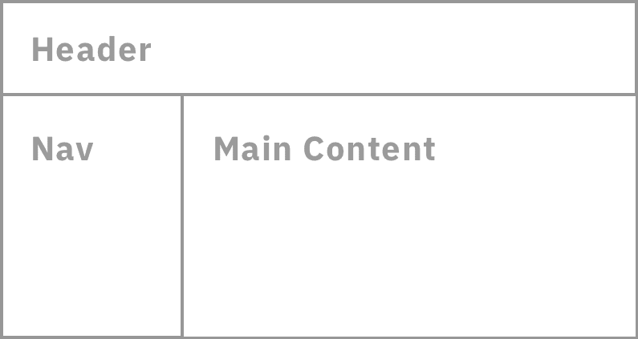
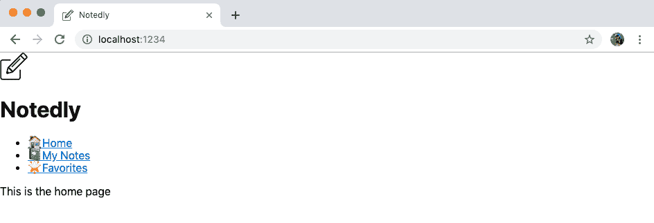
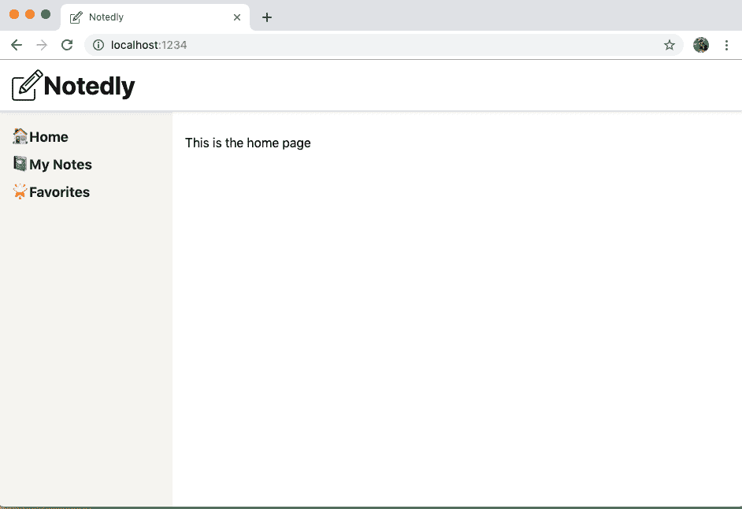

# 第十三章：应用程序的样式化

在他 1978 年的歌曲《Lip Service》中，埃尔维斯·科斯特罗嘲笑地唱道：“不要表现得你高人一等，看看你的鞋子。” 这句告别语暗示着叙述者可以通过看到某人的鞋子来察觉到他们试图提升社会地位的尝试，无论他们的西装多么整洁，他们的礼服多么优雅。不管是好是坏，风格是人类文化的重要组成部分，我们都习惯于捕捉这些社交线索。考古学家甚至发现，上旧石器时代的人类用骨头、牙齿、浆果和石头制作了项链和手镯。我们的衣服不仅仅是保护我们免受自然元素侵害的功能目的，还可能向他人传达有关我们文化、社会地位、兴趣等信息。

一个 Web 应用程序在没有任何超出 Web 默认样式之外的东西时是可以工作的，但是通过应用 CSS，我们能够更清晰地与用户进行沟通。在本章中，我们将探讨如何使用 CSS-in-JS Styled Components 库为我们的应用程序引入布局和样式。这将使我们能够在可维护的基于组件的代码结构中创建一个更易用和美观的应用程序。

# 创建一个布局组件

许多或者在我们的情况下是所有应用程序的页面将共享一个通用的布局。例如，我们应用程序的所有页面都将有一个标题、一个侧边栏和一个内容区域（参见图 13-1）。我们可以不在每个页面组件中导入共享布局元素，而是专门为我们的布局创建一个组件，并将每个页面组件包装在其中。



###### 图 13-1\. 我们页面布局的线框图

要创建我们的组件，我们将从在*src/components/Layout.js*中创建一个新文件开始。在这个文件中，我们将导入我们的共享组件并布置我们的内容。我们的 React 组件函数将接收一个`children`属性，这将允许我们指定子内容在布局中的位置。我们还将利用空的`<React.Fragment>` JSX 元素来帮助避免多余的标记。

让我们在*src/components/Layout.js*中创建我们的组件：

```
import React from 'react';

import Header from './Header';
import Navigation from './Navigation';

const Layout = ({ children }) => {
  return (
    <React.Fragment>
      <Header />
      <div className="wrapper">
        <Navigation />
        <main>{children}</main>
      </div>
    </React.Fragment>
  );
};

export default Layout;
```

现在在我们的*src/pages/index.js*文件中，我们可以将我们的页面组件包装在新创建的`Layout`组件中，以应用共享布局到每个页面：

```
// import React and routing dependencies
import React from 'react';
import { BrowserRouter as Router, Route } from 'react-router-dom';

// import shared layout component
import Layout from '../components/Layout';

// import routes
import Home from './home';
import MyNotes from './mynotes';
import Favorites from './favorites';

// define routes
const Pages = () => {
  return (
    <Router>
      {/* Wrap our routes within the Layout component */}
      <Layout>
        <Route exact path="/" component={Home} />
        <Route path="/mynotes" component={MyNotes} />
        <Route path="/favorites" component={Favorites} />
      </Layout>
    </Router>
  );
};

export default Pages;
```

最后一步是从我们的页面组件中删除任何`<Header>`或`<Navigation>`的实例。例如，我们的*src/pages/Home.js*文件现在将有以下简化的代码：

```
import React from 'react';

const Home = () => {
  return (
    <div>
      <p>This is the home page</p>
    </div>
  );
};

export default Home;
```

完成这一步后，您可以在浏览器中查看您的应用程序。当您在路由之间导航时，您会看到我们的标题和导航链接出现在每个页面上。目前它们没有样式，我们的页面也没有视觉布局。让我们在下一节中探讨如何添加样式。

# CSS

层叠样式表的命名很精确：它们是一组规则，允许我们为 Web 编写样式。“层叠”意味着最后定义或最具体的样式将被渲染。例如：

```
p {
  color: green
}

p {
  color: red
}
```

这段 CSS 将使所有段落呈现为红色，使 `color: green` 规则变得多余。这是一个非常简单的想法，但它产生了许多模式和技术，以帮助避免其缺点。CSS 结构技术，例如 BEM（块元素修饰符）、OOCSS（面向对象的 CSS）和 Atomic CSS 使用规范的类命名来帮助作用域化样式。预处理器如 SASS（Syntactically Awesome Stylesheets）和 Less（Leaner Stylesheets）提供了简化 CSS 语法和支持模块化文件的工具。尽管它们各有其优点，但在开发 React 或其他 JavaScript 驱动的应用程序时，CSS-in-JavaScript 提供了一个引人注目的用例。

# CSS 框架有何特点？

CSS 和 UI 框架是开发应用程序的一种流行选择，理由充足。它们提供了坚实的样式基线，并通过为常见的应用程序模式提供样式和功能来减少开发人员编写的代码量。然而，使用这些框架的应用程序可能会变得视觉上相似，并且可能会增加文件捆绑大小。然而，对你来说，这种权衡可能是值得的。我个人在使用 React 时喜欢的一些 UI 框架包括 [Ant Design](https://ant.design)，[Bootstrap](https://oreil.ly/XJm-B)，[Grommet](https://v2.grommet.io)，和 [Rebass](https://rebassjs.org)。

## CSS-in-JS

当我第一次接触 CSS-in-JS 时，我的第一反应是恐惧。我在网页标准时代度过了我网页开发职业生涯的关键时期。我继续倡导访问可及性和合理的渐进增强，以支持 Web 开发。“关注点分离”已经成为我网页实践的核心准则超过十年。所以，如果你像我一样，仅仅是看到“CSS-in-JS”就让你感到不舒服，你并不孤单。然而，一旦我真正（并没有带有偏见地）尝试过，我很快就被说服了。CSS-in-JS 让我们能够轻松地将用户界面看作一系列组件，这是多年来我一直试图用结构技术和 CSS 预处理器做到的事情。

在本书中，我们将使用 [Styled Components](https://www.styled-components.com) 作为我们的 CSS-in-JS 库。它快速、灵活，在积极开发中，并且是最流行的 CSS-in-JS 库。它还被 Airbnb、Reddit、Patreon、Lego、BBC News、Atlassian 等公司使用。

Styled Components 库通过允许我们使用 JavaScript 模板字面量语法来定义元素的样式工作。我们创建一个 JavaScript 变量，该变量将引用一个 HTML 元素及其相关样式。因为这听起来相当抽象，让我们看一个简单的例子：

```
import React from 'react';
import styled from 'styled-components'

const AlertParagraph = styled.p`
 color: green;
`;

const ErrorParagraph = styled.p`
 color: red;
`;

const Example = () => {
  return (
    <div>
      <AlertParagraph>This is green.</AlertParagraph>
      <ErrorParagraph>This is red.</ErrorParagraph>
    </div>
  );
};

export default Example;
```

正如您所见，我们可以轻松地将样式限定在特定组件中。此外，我们将样式限定到特定组件有助于避免在应用程序不同部分之间的类名冲突。

## 创建按钮组件

现在，我们对样式化组件有了基本的了解，让我们将它们集成到我们的应用程序中。首先，我们将为 `<button>` 元素编写一些样式，这样我们就可以在整个应用程序中重用该组件。在之前的示例中，我们将样式与 React/JSX 代码一起集成，但我们也可以编写独立的样式组件。首先，在 *src/components/Button.js* 创建一个新文件，从 `styled-components` 中导入 `styled` 库，并设置可导出的组件为模板文字，如下所示：

```
import styled from 'styled-components';

const Button = styled.button`
 /* our styles will go here */
`;

export default Button;
```

有了这个组件，我们可以填写一些基线按钮样式，以及鼠标悬停和激活状态样式，如下所示：

```
import styled from 'styled-components';

const Button = styled.button`
 display: block;
 padding: 10px;
 border: none;
 border-radius: 5px;
 font-size: 18px;
 color: #fff;
 background-color: #0077cc;
 cursor: pointer;

 :hover {
 opacity: 0.8;
 }

 :active {
 background-color: #005fa3;
 }
`;

export default Button;
```

现在，我们可以在整个应用程序中使用我们的按钮。例如，在应用程序的主页上使用它，我们可以导入该组件并在通常使用 `<button>` 的任何地方使用 `<Button>` 元素。

在 *src/pages/home.js* 中：

```
import React from 'react';

import Button from '../components/Button';

const Home = () => {
  return (
    <div>
      <p>This is the home page</p>
      <Button>Click me!</Button>
    </div>
  );
};

export default Home;
```

通过这样做，我们已经编写了一个样式组件，可以在应用程序的任何地方使用。这对于可维护性非常有利，因为我们可以轻松地找到并跨整个代码库更改我们的样式。此外，我们可以将样式组件与标记耦合，从而创建小型、可重用和可维护的组件。

## 添加全局样式

虽然我们的许多样式将包含在各个组件中，但每个站点或应用程序还有一组全局样式（如 CSS 重置、字体和基线颜色）。我们可以创建一个 *GlobalStyle.js* 组件来管理这些样式。

这与我们之前的示例有些不同，因为我们将创建一个样式表而不是附加到特定 HTML 元素的样式。为了实现这一点，我们将从`styled-components`中导入`createGlobalStyle`模块。我们还将导入[`normalize.css`库](https://oreil.ly/i4lyd)以确保在各种浏览器中对 HTML 元素进行一致的渲染。最后，我们将为应用程序的 HTML `body` 添加一些全局规则和默认链接样式。

在 *src/components/GlobalStyle.js* 中：

```
// import createGlobalStyle and normalize
import { createGlobalStyle } from 'styled-components';
import normalize from 'normalize.css';

// we can write our CSS as a JS template literal
export default createGlobalStyle`
  ${normalize}

 *, *:before, *:after {
 box-sizing: border-box;
 }

 body,
 html {
 height: 100%;
 margin: 0;
 }

 body {
 font-family: -apple-system, BlinkMacSystemFont, 'Segoe UI', Roboto,
 Oxygen-Sans, Ubuntu, Cantarell, 'Helvetica Neue', sans-serif;
 background-color: #fff;
 line-height: 1.4;
 }

 a:link,
 a:visited {
 color: #0077cc;
 }

 a:hover,
 a:focus {
 color: #004499;
 }

 code,
 pre {
 max-width: 100%;
 }
`;
```

要应用这些样式，我们将它们导入到我们的 *App.js* 文件中，并将 `<GlobalStyle />` 元素添加到我们的应用程序中：

```
import React from 'react';
import ReactDOM from 'react-dom';

// import global styles
import GlobalStyle from '/components/GlobalStyle';
// import routes
import Pages from '/pages';

const App = () => {
  return (
    <div>
      <GlobalStyle />
      <Pages />
    </div>
  );
};

ReactDOM.render(<App />, document.getElementById('root'));
```

这样，我们的全局样式将应用到应用程序中。当您在浏览器中预览应用程序时，您将看到字体类型已更改，链接具有新的样式，并且已删除了边距（图 13-2）。



###### 图 13-2\. 我们的应用程序现在应用了全局样式

## 组件样式

现在我们已经为应用程序应用了一些全局样式，我们可以开始为单个组件添加样式。在这个过程中，我们还会介绍应用程序的整体布局。对于每个我们要样式化的组件，我们首先从 `styled-components` 中导入 `styled` 库。然后，我们将一些元素样式定义为变量。最后，我们将在 React 组件的 JSX 中使用这些元素。

# 样式化组件命名

为了避免与 HTML 元素冲突，我们必须将样式化组件的名称大写化。

我们可以从 *src/components/Layout.js* 开始，在这里为应用程序的布局结构 `<div>` 和 `<main>` 标签添加样式。

```
import React from 'react';
import styled from 'styled-components';

import Header from './Header';
import Navigation from './Navigation';

// component styles
const Wrapper = styled.div`
 /* We can apply media query styles within the styled component */
 /* This will only apply the layout for screens above 700px wide */
 @media (min-width: 700px) {
 display: flex;
 top: 64px;
 position: relative;
 height: calc(100% - 64px);
 width: 100%;
 flex: auto;
 flex-direction: column;
 }
`;

const Main = styled.main`
 position: fixed;
 height: calc(100% - 185px);
 width: 100%;
 padding: 1em;
 overflow-y: scroll;
 /* Again apply media query styles to screens above 700px */
 @media (min-width: 700px) {
 flex: 1;
 margin-left: 220px;
 height: calc(100% - 64px);
 width: calc(100% - 220px);
 }
`;

const Layout = ({ children }) => {
  return (
    <React.Fragment>
      <Header />
      <Wrapper>
        <Navigation />
        <Main>{children}</Main>
      </Wrapper>
    </React.Fragment>
  );
};

export default Layout;
```

完成了 *Layout.js* 组件后，我们可以为 *Header.js* 和 *Navigation.js* 文件添加一些样式：

在 *src/components/Header.js* 文件中：

```
import React from 'react';
import styled from 'styled-components';
import logo from '../img/logo.svg';

const HeaderBar = styled.header`
 width: 100%;
 padding: 0.5em 1em;
 display: flex;
 height: 64px;
 position: fixed;
 align-items: center;
 background-color: #fff;
 box-shadow: 0 0 5px 0 rgba(0, 0, 0, 0.25);
 z-index: 1;
`;

const LogoText = styled.h1`
 margin: 0;
 padding: 0;
 display: inline;
`;

const Header = () => {
  return (
    <HeaderBar>
      
      <LogoText>Notedly</LogoText>
    </HeaderBar>
  );
};

export default Header;
```

最后，在 *src/components/Navigation.js* 文件中：

```
import React from 'react';
import { Link } from 'react-router-dom';
import styled from 'styled-components';

const Nav = styled.nav`
 padding: 1em;
 background: #f5f4f0;

 @media (max-width: 700px) {
 padding-top: 64px;
 }

 @media (min-width: 700px) {
 position: fixed;
 width: 220px;
 height: calc(100% - 64px);
 overflow-y: scroll;
 }
`;

const NavList = styled.ul`
 margin: 0;
 padding: 0;
 list-style: none;
 line-height: 2;

 /* We can nest styles in styled-components */
 /* The following styles will apply to links within the NavList component */
 a {
 text-decoration: none;
 font-weight: bold;
 font-size: 1.1em;
 color: #333;
 }

 a:visited {
 color: #333;
 }

 a:hover,
 a:focus {
 color: #0077cc;
 }
`;

const Navigation = () => {
  return (
    <Nav>
      <NavList>
        <li>
          <Link to="/">Home</Link>
        </li>
        <li>
          <Link to="/mynotes">My Notes</Link>
        </li>
        <li>
          <Link to="/favorites">Favorites</Link>
        </li>
      </NavList>
    </Nav>
  );
};

export default Navigation;
```

经过这些样式的应用，我们现在拥有了一个完全样式化的应用程序（图 13-3）。在未来，我们可以在创建各个组件时应用样式。



###### 图 13-3\. 我们应用了样式的应用程序

# 结论

在本章中，我们为应用程序引入了布局和样式。使用 CSS-in-JS 库 Styled Components 允许我们编写简洁且作用域正确的 CSS 样式。这些样式可以应用于单个组件或全局应用中。在下一章中，我们将通过实现 GraphQL 客户端并调用 API 来朝着一个功能完备的应用程序迈进。
