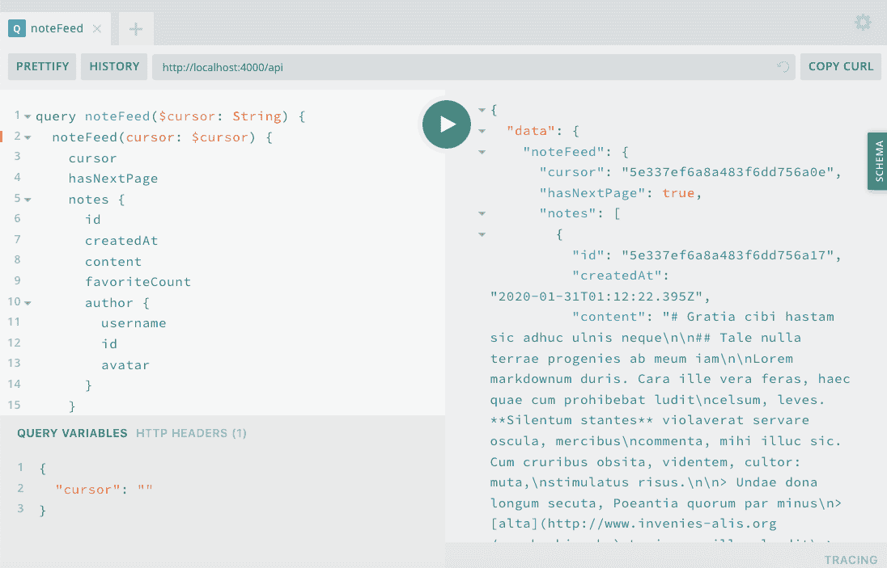
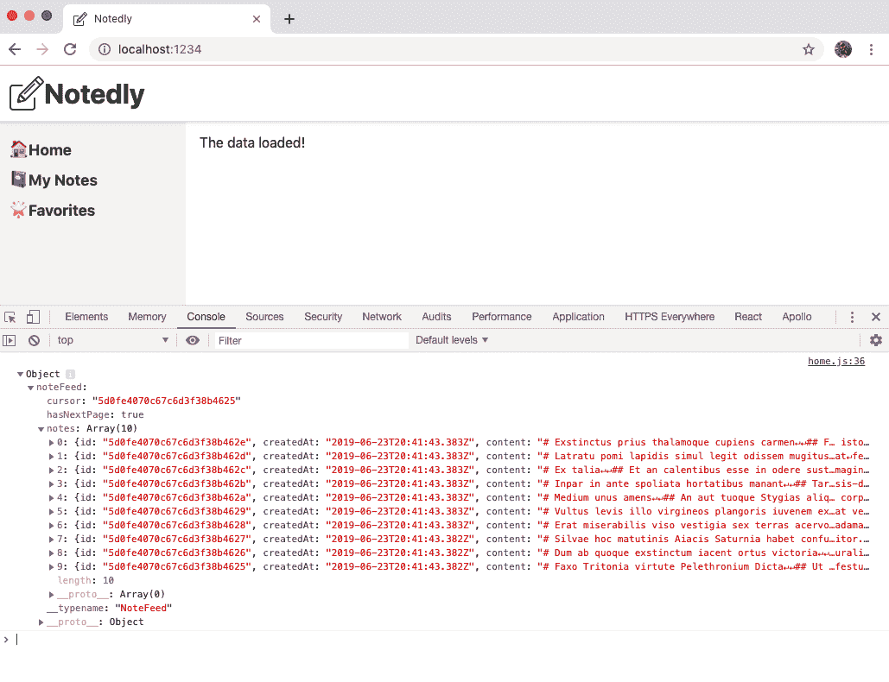
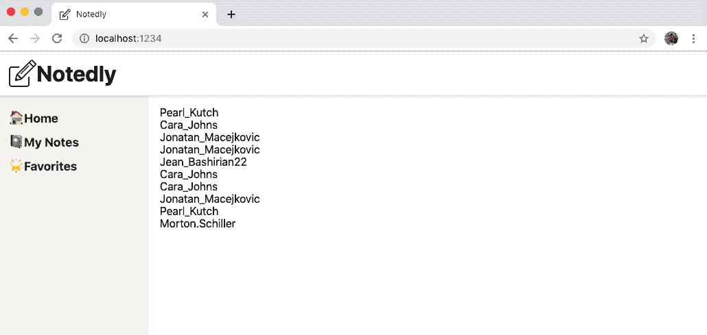

# 第十四章：使用 Apollo Client

我清楚地记得我的第一个互联网连接。我的计算机调制解调器会拨打连接到我的互联网服务提供商（ISP）的本地号码，让我自由地访问网络。尽管当时这种感觉很神奇，但与我们今天使用的即时、始终在线的连接方式相比，有很大的不同。以下是该过程的步骤：

1.  坐在我的电脑前，打开 ISP 软件。

1.  点击连接，等待调制解调器拨号连接号码。

1.  如果连接成功，听到那美妙的“调制解调器声音”。如果没有，例如在高峰时段电话线可能过载和忙碌时，再试一次。

1.  连接成功后，将接收到成功通知，并且沉浸在所有带有 GIF 的 90 年代辉煌的网络中。

这个过程可能看起来很艰苦，但它仍然代表了服务之间交流的方式：它们请求连接，建立连接，发送请求，然后得到返回的东西。我们的客户端应用程序将以相同的方式工作。我们将首先连接到我们的服务器 API 应用程序，如果成功，将向该服务器发出请求。

在本章中，我们将使用 Apollo Client 来连接我们的 API。一旦连接成功，我们将编写一个 GraphQL 查询，用于在页面上显示数据。我们还将介绍分页，既在 API 查询中，也在我们的界面组件中。

# 本地运行 API

我们的 Web 客户端应用程序的开发需要访问本地的 API 实例。如果您一直在跟着本书进行学习，您可能已经在您的机器上运行了 Notedly API 和其数据库。如果没有，我已经在 附录 A 中添加了如何获取 API 的副本以及一些示例数据的说明。如果您已经运行了 API，但希望获得一些额外的数据来进行操作，请在 API 项目目录的根目录中运行 `npm run seed`。

# 设置 Apollo Client

与 Apollo Server 类似，Apollo Client 提供了许多有用的功能，以简化 JavaScript UI 应用程序中使用 GraphQL 的工作。Apollo Client 提供了连接 Web 客户端到 API 的库、本地缓存、GraphQL 语法、本地状态管理等功能。我们还将在 React 应用程序中使用 Apollo Client，但 Apollo 还为 Vue、Angular、Meteor、Ember 和 Web 组件提供了库。

首先，我们要确保我们的 *.env* 文件包含对我们本地 API URI 的引用。这将允许我们在开发中使用我们的本地 API 实例，同时在发布应用程序到公共 Web 服务器时指向我们的产品 API。在我们的 *.env* 文件中，我们应该有一个名为 `API_URI` 的变量，其值是我们本地 API 服务器的地址：

```
API_URI=http://localhost:4000/api
```

我们的代码打包工具 Parcel 配置为自动处理 *.env* 文件。每当我们在代码中引用 *.env* 变量时，我们可以使用 `process.env.VARIABLE_NAME`。这将允许我们在本地开发、生产和任何其他环境（如分段或持续集成）中使用唯一的值。

将地址存储在环境变量中后，我们可以连接我们的 Web 客户端到我们的 API 服务器。在我们的 *src/App.js* 文件中，首先我们需要导入我们将要使用的 Apollo 包：

```
// import Apollo Client libraries
import { ApolloClient, ApolloProvider, InMemoryCache } from '@apollo/client';
```

导入这些后，我们可以配置一个新的 Apollo Client 实例，传递 API URI，初始化缓存，并启用本地 Apollo 开发工具的使用：

```
// configure our API URI & cache
const uri = process.env.API_URI;
const cache = new InMemoryCache();

// configure Apollo Client
const client = new ApolloClient({
  uri,
  cache,
  connectToDevTools: true
});
```

最后，我们可以通过将其包装在 `ApolloProvider` 中来将我们的 React 应用程序连接到我们的 Apollo Client。我们将空的 `<div>` 标签替换为 `<ApolloProvider>`，并包括我们的客户端作为连接：

```
const App = () => {
  return (
    <ApolloProvider client={client}>
      <GlobalStyle />
      <Pages />
    </ApolloProvider>
  );
};
```

总体而言，我们的 *src/App.js* 文件现在将如下所示：

```
import React from 'react';
import ReactDOM from 'react-dom';

// import Apollo Client libraries
import { ApolloClient, ApolloProvider, InMemoryCache } from '@apollo/client';

// global styles
import GlobalStyle from '/components/GlobalStyle';
// import our routes
import Pages from '/pages';

// configure our API URI & cache
const uri = process.env.API_URI;
const cache = new InMemoryCache();

// configure Apollo Client
const client = new ApolloClient({
  uri,
  cache,
  connectToDevTools: true
});

const App = () => (
  <ApolloProvider client={client}>
    <GlobalStyle />
    <Pages />
  </ApolloProvider>
);

ReactDOM.render(<App />, document.getElementById('root'));
```

现在我们的客户端连接到我们的 API 服务器后，我们现在可以将 GraphQL 查询和突变集成到我们的应用程序中。

# 查询一个 API

当我们查询 API 时，我们正在请求数据。在 UI 客户端中，我们希望能够查询这些数据并将其显示给用户。Apollo 能够帮助我们组合查询以获取数据。我们可以更新 React 组件以将数据显示给最终用户。我们可以通过编写一个 `noteFeed` 查询来探索查询的使用，该查询将向用户返回最新的笔记并在应用程序的主页上显示它。

当我首次编写查询时，我发现以下过程很有用：

1.  考虑查询需要返回的数据。

1.  将查询写入 GraphQL Playground。

1.  将查询集成到客户端应用程序中。

让我们在起草查询时遵循这个流程。如果你在本书的 API 部分跟随过，你可能还记得 `noteFeed` 查询返回了一个包含 10 条笔记的列表，还有一个 `cursor`，指示了最后返回的笔记位置，以及一个 `hasNextPage` 布尔值，用于确定是否还有其他笔记需要加载。我们可以在 GraphQL Playground 中查看我们的架构，以查看所有可用的数据选项。对于我们的查询，我们很可能需要以下信息：

```
{
  cursor
  hasNextPage
  notes {
    id
    createdAt
    content
    favoriteCount
    author {
      id
      username
      avatar
      }
    }
  }
```

现在，在我们的 GraphQL Playground 中，我们可以将其充实为一个 GraphQL 查询。我们将稍微详细地命名查询，并提供一个名为 `cursor` 的可选变量。要使用 GraphQL Playground，请确保 API 服务器正在运行，然后访问 *http://localhost:4000/api*。在 GraphQL Playground 中，添加以下查询：

```
query noteFeed($cursor: String) {
    noteFeed(cursor: $cursor) {
      cursor
      hasNextPage
      notes {
        id
        createdAt
        content
        favoriteCount
        author {
          username
          id
          avatar
        }
      }
    }
  }
```

在 GraphQL Playground 中，还可以添加一个“查询变量”来测试变量的使用：

```
{
  "cursor": ""
}
```

要测试这个变量，用数据库中任何笔记的 ID 值替换空字符串（图 14-1）。



###### 图 14-1\. 在 GraphQL Playground 中的我们的 noteFeed 查询

现在我们知道我们的查询已经正确编写，我们可以自信地将其集成到我们的 Web 应用程序中。在 *src/pages/home.js* 文件中，导入 `useQuery` 库以及通过 `@apollo/client` 中的 `gql` 库导入 GraphQL 语法：

```
// import the required libraries
import { useQuery, gql } from '@apollo/client';

// our GraphQL query, stored as a variable
const GET_NOTES = gql`
 query NoteFeed($cursor: String) {
 noteFeed(cursor: $cursor) {
 cursor
 hasNextPage
 notes {
 id
 createdAt
 content
 favoriteCount
 author {
 username
 id
 avatar
 }
 }
 }
 }
`;
```

现在我们可以将查询集成到我们的 React 应用程序中了。为此，我们将我们的 GraphQL 查询字符串传递给 Apollo 的 `useQuery` React hook。我们的 hook 将返回一个包含以下值之一的对象：

`data`

如果查询成功返回的数据。

`loading`

当数据正在获取时，设置为 `true` 的加载状态。这允许我们向用户显示加载指示器。

`error`

如果我们的数据获取失败，错误将返回到我们的应用程序。

我们可以更新我们的 `Home` 组件以包括我们的查询：

```
const Home = () => {
  // query hook
  const { data, loading, error, fetchMore } = useQuery(GET_NOTES);

  // if the data is loading, display a loading message
  if (loading) return <p>Loading...</p>;
  // if there is an error fetching the data, display an error message
  if (error) return <p>Error!</p>;

  // if the data is successful, display the data in our UI
  return (
    <div>
      {console.log(data)}
      The data loaded!
    </div>
  );
};

export default Home;
```

如果您一切顺利，您应该在我们应用程序的主页上看到一个“数据已加载！”的消息（图 14-2）。我们还包含了一个 `console.log` 语句，它将我们的数据打印到浏览器控制台。查看数据结果的结构可以帮助我们将数据集成到应用程序中。



###### 图 14-2\. 如果我们的数据成功获取，我们的组件将显示一个“数据已加载！”的消息，并且数据将打印到控制台

现在，让我们将接收到的数据集成到应用程序中。为此，我们将对返回的注释数组进行 `map` 操作。React 要求每个结果都分配一个唯一的键，我们将使用每个注释的 ID。首先，我们将显示每个注释的作者的用户名：

```
const Home = () => {
  // query hook
  const { data, loading, error, fetchMore } = useQuery(GET_NOTES);

  // if the data is loading, display a loading message
  if (loading) return <p>Loading...</p>;
  // if there is an error fetching the data, display an error message
  if (error) return <p>Error!</p>;

  // if the data is successful, display the data in our UI
  return (
    <div>
      {data.noteFeed.notes.map(note => (
        <div key={note.id}>{note.author.username}</div>
      ))}
    </div>
  );
};
```

# 使用 JavaScript 的 `map()` 方法

如果您之前没有使用过 JavaScript 的 `map()` 方法，该语法一开始可能看起来有点复杂。`map()` 方法允许您对数组中的每个项执行操作。当您处理从 API 返回的数据时，这将非常有用，允许您执行诸如在模板中以某种方式显示每个项的操作。要了解更多关于 `map()` 的信息，建议阅读 [MDN Web Docs 指南](https://oreil.ly/Oca3y)。

如果我们的数据库中有数据，您现在应该在页面上看到一个用户名列表（图 14-3）。



###### 图 14-3\. 从我们的数据中打印到屏幕上的用户名

现在我们成功地映射了我们的数据，我们可以编写剩余的组件部分了。由于我们的注释是用 Markdown 编写的，让我们导入一个允许我们将 Markdown 渲染到页面的库。

在 *src/pages/home.js* 中：

```
import ReactMarkdown from 'react-markdown';
```

现在我们可以更新我们的 UI，以包括作者的头像、作者的用户名、注释创建日期、注释的收藏数量，以及注释的内容本身。在 *src/pages/home.js* 中：

```
// if the data is successful, display the data in our UI
return (
  <div>
    {data.noteFeed.notes.map(note => (
      <article key={note.id}>
      {' '}
        {note.author.username} {note.createdAt} {note.favoriteCount}{' '}
        <ReactMarkdown source={note.content} />
      </article>
    ))}
  </div>
);
```

# 在 React 中的空白处

React 会删除新行上元素之间的空格。 在我们的标记中使用`{' '}`是手动添加空格的一种方式。

现在您应该在浏览器中看到完整的注释列表。 在我们开始为它们添加样式之前，有一个小的重构机会。 这是我们第一页显示注释，但我们知道我们将会创建更多页面。 在其他页面上，我们将需要显示单个注释，以及其他类型注释的反馈（如“我的注释”和“收藏夹”）。 让我们继续创建两个新组件：*src/components/Note.js*和*src/components/NoteFeed.js*。

在*src/components/Note.js*中，我们将包含单个注释的标记。 为了实现这一目标，我们将为每个组件函数传递一个包含适当内容的属性。

```
import React from 'react';
import ReactMarkdown from 'react-markdown';

const Note = ({ note }) => {
  return (
    <article>
      {' '}
      {note.author.username} {note.createdAt} {note.favoriteCount}{' '}
      <ReactMarkdown source={note.content} />
    </article>
  );
};

export default Note;
```

现在轮到*src/components/NoteFeed.js*组件了：

```
import React from 'react';
import Note from './Note';

const NoteFeed = ({ notes }) => {
  return (
    <div>
      {notes.map(note => (
        <div key={note.id}>
          <Note note={note} />
        </div>
      ))}
    </div>
  );
};

export default NoteFeed;
```

最后，我们可以更新*src/pages/home.js*组件以引用我们的`NoteFeed`：

```
import React from 'react';
import { useQuery, gql } from '@apollo/client';

import Button from '../components/Button';
import NoteFeed from '../components/NoteFeed';

const GET_NOTES = gql`
 query NoteFeed($cursor: String) {
 noteFeed(cursor: $cursor) {
 cursor
 hasNextPage
 notes {
 id
 createdAt
 content
 favoriteCount
 author {
 username
 id
 avatar
 }
 }
 }
 }
`;

const Home = () => {
  // query hook
 const { data, loading, error, fetchMore } = useQuery(GET_NOTES);

 // if the data is loading, display a loading message
 if (loading) return <p>Loading...</p>;
 // if there is an error fetching the data, display an error message
 if (error) return <p>Error!</p>;

 // if the data is successful, display the data in our UI
  return <NoteFeed notes={data.noteFeed.notes} />;
};

export default Home;
```

通过此重构，我们现在能够在整个应用程序中轻松重新创建注释和注释反馈实例。

## 一些样式

现在我们已经编写了组件并且可以查看我们的数据，我们可以添加一些样式。 其中最明显的改进机会之一是我们“创建于”日期显示的方式。 为了解决这个问题，我们将使用[`date-fns`库](https://date-fns.org)，该库提供了用于在 JavaScript 中处理日期的小组件。 在*src/components/Note.js*中，导入该库并更新日期标记以应用转换，如下所示：

```
// import the format utility from `date-fns`
import { format } from 'date-fns';

// update the date markup to format it as Month, Day, and Year
{format(note.createdAt, 'MMM Do YYYY')} Favorites:{' '}
```

有了我们的日期格式化后，我们可以使用 Styled Components 库来更新注释布局：

```
import React from 'react';
import ReactMarkdown from 'react-markdown';
import { format } from 'date-fns';
import styled from 'styled-components';

// Keep notes from extending wider than 800px
const StyledNote = styled.article`
 max-width: 800px;
 margin: 0 auto;
`;

// Style the note metadata
const MetaData = styled.div`
 @media (min-width: 500px) {
 display: flex;
 align-items: top;
 }
`;

// add some space between the avatar and meta info
const MetaInfo = styled.div`
 padding-right: 1em;
`;

// align 'UserActions' to the right on large screens
const UserActions = styled.div`
 margin-left: auto;
`;

const Note = ({ note }) => {
  return (
    <StyledNote>
      <MetaData>
        <MetaInfo>
          
        </MetaInfo>
        <MetaInfo>
          <em>by</em> {note.author.username} <br />
          {format(note.createdAt, 'MMM Do YYYY')}
        </MetaInfo>
        <UserActions>
          <em>Favorites:</em> {note.favoriteCount}
        </UserActions>
      </MetaData>
      <ReactMarkdown source={note.content} />
    </StyledNote>
  );
};

export default Note;
```

我们还可以在*NoteFeed.js*组件中为我们的注释之间添加一些空间和轻微边框：

```
import React from 'react';
import styled from 'styled-components';

const NoteWrapper = styled.div`
 max-width: 800px;
 margin: 0 auto;
 margin-bottom: 2em;
 padding-bottom: 2em;
 border-bottom: 1px solid #f5f4f0;
`;

import Note from './Note';

const NoteFeed = ({ notes }) => {
  return (
    <div>
      {notes.map(note => (
        <NoteWrapper key={note.id}>
          <Note note={note} />
        </NoteWrapper>
      ))}
    </div>
  );
};

export default NoteFeed;
```

通过这些更新，我们已经为我们的应用程序引入了布局样式。

# 动态查询

目前，我们的应用程序包含三条路由，每条路由都是静态的。 这些路由位于静态 URL 上，并且始终会进行相同的数据请求。 但是，应用程序通常需要基于这些路由的动态路由和查询。 例如，Twitter.com 上的每条推文都分配了一个唯一的 URL，位于*twitter.com/<username>/status/<tweet_id>*。 这允许用户在 Twitter 生态系统内以及在 Web 的任何地方链接和分享单个推文。

目前，我们的应用程序注释只能在一个反馈中访问，但我们希望允许用户查看和链接到单独的注释。 为了实现这一目标，我们将在我们的 React 应用程序中设置动态路由以及单个注释的 GraphQL 查询。 我们的目标是让用户能够访问*/note/<note_id>*的路径。

首先，我们将在*src/pages/note.js*创建一个新的页面组件。 我们将通过 React Router 将我们的`props`（属性）对象传递给组件，其中包括`match`属性。 该属性包含有关路由路径如何匹配 URL 的信息。 这将使我们能够通过`match.params`访问 URL 参数。

```
import React from 'react';

const NotePage = props => {
  return (
    <div>
      <p>ID: {props.match.params.id}</p>
    </div>
  );
};

export default NotePage;
```

现在我们可以在我们的 *src/pages/index.js* 文件中添加相应的路由。该路由将包括一个以 `:id` 表示的 ID 参数：

```
// import React and routing dependencies
import React from 'react';
import { BrowserRouter as Router, Route } from 'react-router-dom';

// import shared layout component
import Layout from '../components/Layout';

// import routes
import Home from './home';
import MyNotes from './mynotes';
import Favorites from './favorites';
import NotePage from './note';

// define routes
const Pages = () => {
  return (
    <Router>
      <Layout>
        <Route exact path="/" component={Home} />
        <Route path="/mynotes" component={MyNotes} />
        <Route path="/favorites" component={Favorites} />
        <Route path="/note/:id" component={NotePage} />
      </Layout>
    </Router>
  );
};

export default Pages;
```

现在，访问 *http://localhost:1234/note/123* 将在我们的页面上打印 `ID: 123`。为了测试它，请将 ID 参数替换为您选择的任何内容，比如 */note/pizza* 或 */note**/GONNAPARTYLIKE1999*。这很酷，但并不是非常有用。让我们更新我们的 *src/pages/note.js* 组件，以便为在 URL 中找到的笔记进行 GraphQL 查询。为此，我们将使用来自我们 API 的 `note` 查询以及我们的 `Note` React 组件：

```
import React from 'react';
// import GraphQL dependencies
import { useQuery, gql } from '@apollo/client';

// import the Note component
import Note from '../components/Note';

// the note query, which accepts an ID variable
const GET_NOTE = gql`
 query note($id: ID!) {
 note(id: $id) {
 id
 createdAt
 content
 favoriteCount
 author {
 username
 id
 avatar
 }
 }
 }
`;

const NotePage = props => {
  // store the id found in the url as a variable
  const id = props.match.params.id;

  // query hook, passing the id value as a variable
  const { loading, error, data } = useQuery(GET_NOTE, { variables: { id } });

  // if the data is loading, display a loading message
  if (loading) return <p>Loading...</p>;
  // if there is an error fetching the data, display an error message
  if (error) return <p>Error! Note not found</p>;

  // if the data is successful, display the data in our UI
  return <Note note={data.note} />;
};

export default NotePage;
```

现在，导航到带有 ID 参数的 URL 将渲染相应的笔记或错误消息。最后，让我们更新我们的 *src/components/NoteFeed.js* 组件，以在 UI 中显示到单个笔记的链接。

首先，在文件顶部从 React Router 中导入 `{Link}`：

```
import { Link } from 'react-router-dom';
```

然后，更新 JSX 以包含指向笔记页面的链接如下：

```
<NoteWrapper key={note.id}>
  <Note note={note} />
  <Link to={`note/${note.id}`}>Permalink</Link>
</NoteWrapper>
```

通过这样做，我们在应用程序中使用动态路由，使用户能够查看单个笔记。

# 分页

目前，我们仅在应用程序的主页中检索最近的 10 条笔记。如果我们想要显示更多的笔记，我们需要启用分页。你可能还记得本章开头和我们 API 服务器的开发阶段，我们的 API 返回一个 `cursor`，它是页面结果中最后一条笔记的 ID。此外，API 还返回一个 `hasNextPage` 布尔值，如果在我们的数据库中找到其他笔记，则为 `true`。在向我们的 API 发出请求时，我们可以传递一个 cursor 参数，它将返回接下来的 10 个项目。

换句话说，如果我们有一个包含 25 个对象的列表（对应的 ID 为 1–25），当我们进行初始请求时，它将返回项目 1–10 以及一个 `cursor` 值为 `10` 和一个 `hasNextPage` 值为 `true`。如果我们发出请求，传递一个 `cursor` 值为 10，我们将收到项目 11–20，`cursor` 值为 `20` 和 `hasNextPage` 值为 `true`。最后，如果我们发出第三个请求，传递一个 `cursor` 为 `20`，我们将收到项目 21–25，`cursor` 值为 `25` 和 `hasNextPage` 值为 `false`。这正是我们将在 `noteFeed` 查询中实现的逻辑。

为了做到这一点，让我们更新我们的 *src/pages/home.js* 文件以进行分页查询。在我们的用户界面中，当用户点击“查看更多”按钮时，应在页面上加载下一个 10 条笔记。我们希望这在不刷新页面的情况下完成。为此，我们需要在查询组件中包含 `fetchMore` 参数，并且仅在 `hasNextPage` 为 `true` 时显示 `Button` 组件。目前，我们将这直接写入我们的主页组件中，但它也可以很容易地被隔离到自己的组件中或成为 `NoteFeed` 组件的一部分。

```
// if the data is successful, display the data in our UI
return (
  // add a <React.Fragment> element to provide a parent element
  <React.Fragment>
    <NoteFeed notes={data.noteFeed.notes} />
    {/* Only display the Load More button if hasNextPage is true */}
    {data.noteFeed.hasNextPage && (
      <Button>Load more</Button>
    )}
  </React.Fragment>
);
```

# React 中的条件语句

在前面的示例中，我们使用内联 `if` 语句和 `&&` 运算符有条件地显示“Load more”按钮。如果 `hasNextPage` 为真，则显示按钮。您可以在[官方 React 文档](https://oreil.ly/a_F5s)中了解更多关于条件渲染的信息。

现在我们可以更新 `<Button>` 组件以使用一个 `onClick` 处理程序。当用户点击按钮时，我们将使用 `fetchMore` 方法进行额外的查询，并将返回的数据附加到我们的页面上。

```
{data.noteFeed.hasNextPage && (
  //  onClick peform a query, passing the current cursor as a variable
  <Button
    onClick={() =>
      fetchMore({
        variables: {
          cursor: data.noteFeed.cursor
        },
        updateQuery: (previousResult, { fetchMoreResult }) => {
          return {
            noteFeed: {
              cursor: fetchMoreResult.noteFeed.cursor,
              hasNextPage: fetchMoreResult.noteFeed.hasNextPage,
              // combine the new results and the old
              notes: [
                ...previousResult.noteFeed.notes,
                ...fetchMoreResult.noteFeed.notes
              ],
              __typename: 'noteFeed'
            }
          };
        }
      })
    }
  >
    Load more
  </Button>
)}
```

之前的代码可能看起来有点复杂，所以让我们来分解一下。我们的 `<Button>` 组件包括一个 `onClick` 处理程序。当点击按钮时，使用 `fetchMore` 方法执行新的查询，传递前一个查询返回的 `cursor` 值。一旦返回，将执行 `updateQuery`，更新我们的 `cursor` 和 `hasNextPage` 值，并将结果组合成一个单一的数组。`__typename` 是查询的名称，包含在 Apollo 的结果中。

通过这个改变，我们能够查看笔记流中的所有笔记。通过滚动到笔记流的底部，您可以自行尝试。如果您的数据库包含超过 10 条笔记，则按钮将可见。点击“Load more”将把下一个 `noteFeed` 结果添加到页面中。

# 结论

在本章中，我们涵盖了很多内容。我们设置了 Apollo Client 来与我们的 React 应用程序配合工作，并将多个 GraphQL 查询集成到我们的 UI 中。GraphQL 的强大之处在于能够编写单一查询，精确返回 UI 需要的数据。在下一章中，我们将集成用户认证到我们的应用程序中，允许用户登录并查看他们的笔记和收藏。
