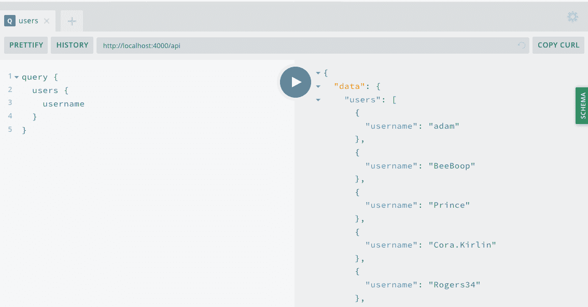

# 第十五章：Web 身份验证和状态

我和我的家人最近搬家了。填写并签署了几份表格后（我的手还*很*累），我们拿到了前门的钥匙。每次回家时，我们都能用那些钥匙打开门进去。我很感激的是，我不需要每次回家都填写表格，但也很感激有锁，这样我们就不会有意外的客人了。

客户端 Web 身份验证工作方式基本相同。我们的用户填写一个表单，并被分发一个网站的钥匙，即密码和存储在他们浏览器中的令牌。当他们返回网站时，他们要么会通过令牌自动认证，要么可以使用他们的密码重新登录。

在本章中，我们将使用 GraphQL API 构建一个 Web 身份验证系统。为此，我们将构建表单，在浏览器中存储 JWT，发送每个请求时的令牌，并跟踪我们应用的状态。

# 创建一个注册表单

要开始使用我们应用的客户端认证，我们可以创建一个用户注册的 React 组件。在此之前，让我们先规划一下组件的工作方式。

首先，用户将在我们应用的 */signup* 路由中导航。在这个页面上，他们将看到一个表单，可以输入他们的电子邮件地址、所需用户名和密码。提交表单将执行我们 API 的 `signUp` 变异。如果变异成功，将创建一个新用户账户，并返回一个 JWT。如果出现错误，我们可以通知用户。我们将显示一个通用错误消息，但我们也可以更新我们的 API 以返回特定的错误消息，比如已存在的用户名或重复的电子邮件地址。

让我们开始创建我们的新路由。首先，我们将在 *src/pages/signup.js* 中创建一个新的 React 组件：

```
import React, { useEffect } from 'react';

// include the props passed to the component for later use
const SignUp = props => {
  useEffect(() => {
    // update the document title
    document.title = 'Sign Up — Notedly';
  });

  return (
    <div>
      <p>Sign Up</p>
    </div>
  );
};

export default SignUp;
```

现在我们将在 *src/pages/index.js* 中更新我们的路由列表，包括 `signup` 路由：

```
// import the signup route
import SignUp from './signup';

// within the Pages component add the route
<Route path="/signup" component={SignUp} />
```

通过添加路由，我们将能够导航到 *http://localhost:1234/signup* 查看（大部分为空的）注册页面。现在，让我们为我们的表单添加标记：

```
import React, { useEffect } from 'react';

const SignUp = props => {
  useEffect(() => {
    // update the document title
    document.title = 'Sign Up — Notedly';
  });

  return (
    <div>
      <form>
        <label htmlFor="username">Username:</label>
        <input
          required
          type="text"
          id="username"
          name="username"
          placeholder="username"
        />
        <label htmlFor="email">Email:</label>
        <input
          required
          type="email"
          id="email"
          name="email"
          placeholder="Email"
        />
        <label htmlFor="password">Password:</label>
        <input
          required
          type="password"
          id="password"
          name="password"
          placeholder="Password"
        />
        <button type="submit">Submit</button>
      </form>
    </div>
  );
};

export default SignUp;
```

# htmlFor

如果你刚开始学习 React，常见的问题之一是 JSX 属性与其 HTML 对应项不同。在这种情况下，我们使用 JSX 的 `htmlFor` 替代 HTML 的 `for` 属性，以避免任何 JavaScript 冲突。你可以在[React DOM 元素文档](https://oreil.ly/Kn5Ke)中看到一个完整但简短的这些属性列表。

现在我们可以通过导入我们的 `Button` 组件并将表单样式化为一个 styled 组件来添加一些样式：

```
import React, { useEffect } from 'react';
import styled from 'styled-components';

import Button from '../components/Button';

const Wrapper = styled.div`
 border: 1px solid #f5f4f0;
 max-width: 500px;
 padding: 1em;
 margin: 0 auto;
`;

const Form = styled.form`
 label,
 input {
 display: block;
 line-height: 2em;
 }

 input {
 width: 100%;
 margin-bottom: 1em;
 }
`;

const SignUp = props => {
  useEffect(() => {
    // update the document title
    document.title = 'Sign Up — Notedly';
  });

  return (
    <Wrapper>
      <h2>Sign Up</h2>
      <Form>
        <label htmlFor="username">Username:</label>
        <input
          required
          type="text"
          id="username"
          name="username"
          placeholder="username"
        />
        <label htmlFor="email">Email:</label>
        <input
          required
          type="email"
          id="email"
          name="email"
          placeholder="Email"
        />
        <label htmlFor="password">Password:</label>
        <input
          required
          type="password"
          id="password"
          name="password"
          placeholder="Password"
        />
        <Button type="submit">Submit</Button>
      </Form>
    </Wrapper>
  );
};

export default SignUp;
```

## React 表单和状态

在一个应用中，事情会发生变化。数据被输入到一个表单中，用户切换一个滑块打开，消息被发送。在 React 中，我们可以通过分配*状态*来在组件级别跟踪这些变化。在我们的表单中，我们将需要跟踪每个表单元素的状态，以便可以提交它。

# React Hooks

在本书中，我们使用功能组件和 React 的新 Hooks API。如果您曾经使用过其他使用 React 的`class`组件的学习资源，这可能看起来有些不同。您可以在[React 文档](https://oreil.ly/Tz9Hg)中了解更多关于 Hooks 的信息。

要开始使用状态，我们首先需要更新位于*src/pages/signup.js*文件顶部的 React 导入，包括`useState`：

```
import React, { useEffect, useState } from 'react';
```

接下来，在我们的`SignUp`组件内，我们将设置默认的表单值状态：

```
const SignUp = props => {
  // set the default state of the form
  const [values, setValues] = useState();

// rest of component goes here
};
```

现在我们将更新我们的组件，以便在输入表单字段时更改状态，并在用户提交表单时执行操作。首先，我们将创建一个`onChange`函数，每当更新表单时都会更新我们组件的状态。我们还将更新每个表单元素的标记，以在用户进行更改时调用此函数，使用`onChange`属性。然后，我们将更新我们的`form`元素以包括一个`onSubmit`处理程序。目前，我们将简单地将我们的表单数据记录到控制台。

在*/src/pages/sigunp.js*中：

```
const SignUp = () => {
  // set the default state of the form
  const [values, setValues] = useState();

  // update the state when a user types in the form
  const onChange = event => {
    setValues({
      ...values,
      [event.target.name]: event.target.value
    });
  };

  useEffect(() => {
    // update the document title
    document.title = 'Sign Up — Notedly';
  });

  return (
    <Wrapper>
      <h2>Sign Up</h2>
      <Form
        onSubmit={event => {
          event.preventDefault();
          console.log(values);
        }}
        >
        <label htmlFor="username">Username:</label>
        <input
          required
          type="text"
          name="username"
          placeholder="username"
          onChange={onChange}
        />
        <label htmlFor="email">Email:</label>
        <input
          required
          type="email"
          name="email"
          placeholder="Email"
          onChange={onChange}
        />
        <label htmlFor="password">Password:</label>
        <input
          required
          type="password"
          name="password"
          placeholder="Password"
          onChange={onChange}
        />
        <Button type="submit">Submit</Button>
      </Form>
    </Wrapper>
  );
};
```

有了这个表单标记，我们准备使用 GraphQL 变异请求数据。

## signUp 变异

要注册用户，我们将使用我们 API 的`signUp`变异。如果注册成功，此变异将接受电子邮件、用户名和密码作为变量，并返回一个 JWT。让我们编写我们的变异并将其集成到我们的注册表单中。

首先，我们需要导入我们的 Apollo 库。我们将使用 Apollo Client 中的`useMutation`和`useApolloClient`钩子，以及`gql`语法。在*src/pages/signUp*中，将以下内容添加到其他库导入语句旁边：

```
import { useMutation, useApolloClient, gql } from '@apollo/client';
```

现在按以下方式编写 GraphQL 变异：

```
const SIGNUP_USER = gql`
 mutation signUp($email: String!, $username: String!, $password: String!) {
 signUp(email: $email, username: $username, password: $password)
 }
`;
```

编写完变异后，我们可以更新 React 组件标记，以在用户提交表单时执行变异，将表单元素作为变量传递。目前，我们将把响应（如果成功，应为 JWT）记录到控制台：

```
const SignUp = props => {
  // useState, onChange, and useEffect all remain the same here

  //add the mutation hook
  const [signUp, { loading, error }] = useMutation(SIGNUP_USER, {
   onCompleted: data => {
     // console.log the JSON Web Token when the mutation is complete
     console.log(data.signUp);
   }
 });

  // render our form
  return (
    <Wrapper>
      <h2>Sign Up</h2>
      {/* pass the form data to the mutation when a user submits the form */}
      <Form
        onSubmit={event => {
          event.preventDefault();
          signUp({
            variables: {
              ...values
            }
          });
        }}
      >
        {/* ... the rest of the form remains unchanged ... */}
      </Form>
    </Wrapper>
  );
};
```

现在，如果您完成并提交表单，您应该在控制台看到一个 JWT 被记录（见图 15-1）。另外，如果在 GraphQL Playground 中执行`users`查询（*http://localhost:4000/api*），您将看到新的帐户（见图 15-2）。


###### 图 15-1\. 如果成功，当我们提交表单时，将在控制台打印一个 JSON Web Token



###### 图 15-2\. 通过在 GraphQL Playground 执行用户查询，我们还可以看到用户列表

完成我们的变异并返回预期的数据后，接下来我们想要存储接收到的响应。

## JSON Web Tokens 和本地存储

当我们的 `signUp` 变异成功时，它会返回一个 JSON Web Token (JWT)。你可能还记得本书的 API 部分提到过，[JWT](https://jwt.io) 允许我们安全地将用户的 ID 存储在用户的设备上。为了在用户的 Web 浏览器中实现这一点，我们将把令牌存储在浏览器的 `localStorage` 中。`localStorage` 是一个简单的键值存储，可以在浏览器会话之间持久保存，直到存储被更新或清除。让我们更新我们的变异，将令牌存储在 `localStorage` 中。

在 *src/pages/signup.js* 中，更新 `useMutation` hook，将令牌存储在 `local``Storage` 中（见图 15-3）：

```
const [signUp, { loading, error }] = useMutation(SIGNUP_USER, {
  onCompleted: data => {
    // store the JWT in localStorage
    localStorage.setItem('token', data.signUp);
  }
});
```


###### 图 15-3\. 我们的 Web 令牌现在存储在浏览器的 localStorage 中

# JWT 和安全性

当令牌存储在 `localStorage` 中时，页面上可以运行的任何 JavaScript 都可以访问该令牌，使其容易受到跨站脚本（XSS）攻击的影响。因此，当使用 `localStorage` 存储令牌凭证时，需要特别注意限制（或避免）CDN 托管的脚本。如果第三方脚本被 Compromised，它将可以访问 JWT。

有了我们在本地存储的 JWT，我们准备在我们的 GraphQL 变异和查询中使用它。

# 重定向

当用户完成注册表单时，当前表单将重新呈现为空表单。这并没有给用户留下太多视觉线索，表明他们的帐户注册成功了。相反，让我们将用户重定向到我们应用程序的主页。另一个选择是创建一个“成功”页面，感谢用户注册并将其引导到应用程序。

正如您可能还记得本章前面所述，我们正在将属性传递到组件中。我们可以使用 React Router 的 `history` 来重定向路由，通过 `props.history.push` 我们可以使用它。为了实现这一点，我们将更新我们变异的 `onCompleted` 事件，包括一个重定向，如下所示：

```
const [signUp, { loading, error }] = useMutation(SIGNUP_USER, {
    onCompleted: data => {
      // store the token
      localStorage.setItem('token', data.signUp);
      // redirect the user to the homepage
      props.history.push('/');
    }
  });
```

通过此更改，用户现在将在注册帐户后重定向到我们应用程序的主页。

# 将标头附加到请求

尽管我们将令牌存储在 `localStorage` 中，但我们的 API 尚无法访问它。这意味着即使用户创建了帐户，API 也无法识别用户。如果您还记得我们的 API 开发，每个 API 调用都会在请求的标头中接收一个令牌。我们将修改客户端，在每个请求中发送 JWT 作为标头。

在 *src/App.js* 中，我们将更新我们的依赖项，包括从 Apollo Client 导入 `createHttpLink` 以及从 Apollo 的 Link Context 包中导入 `setContext`。然后，我们将更新 Apollo 的配置，在每个请求的标头中发送令牌：

```
// import the Apollo dependencies
import {
  ApolloClient,
  ApolloProvider,
  createHttpLink,
  InMemoryCache
} from '@apollo/client';
import { setContext } from 'apollo-link-context';

// configure our API URI & cache
const uri = process.env.API_URI;
const httpLink = createHttpLink({ uri });
const cache = new InMemoryCache();

// check for a token and return the headers to the context
const authLink = setContext((_, { headers }) => {
  return {
    headers: {
      ...headers,
      authorization: localStorage.getItem('token') || ''
    }
  };
});

// create the Apollo client
const client = new ApolloClient({
  link: authLink.concat(httpLink),
  cache,
  resolvers: {},
  connectToDevTools: true
});
```

通过此更改，我们现在将能够将已登录用户的信息传递给我们的 API。

# 本地状态管理

我们已经看过如何在组件内管理状态，但是在整个应用程序中如何处理呢？有时将一些信息共享在许多组件之间是有用的。我们可以从基础组件传递 `props` 到整个应用程序，但是一旦我们超过几个级别的子组件，这可能变得混乱。诸如 [Redux](https://redux.js.org) 和 [MobX](https://mobx.js.org) 这样的库已经解决了状态管理的挑战，并且对许多开发人员和团队都很有用。在我们的情况下，我们已经在使用 Apollo Client 库，它包括使用 GraphQL 查询进行本地状态管理的能力。与其引入另一个依赖项，不如实现一个本地状态属性来存储用户是否已登录。

Apollo React 库将 `ApolloClient` 实例放置在 React 的上下文中，但有时我们可能需要直接访问它。我们可以使用 `useApolloClient` 钩子来实现这一点，它将允许我们执行直接更新或重置缓存存储或写入本地数据等操作。

目前，我们有两种方法来确定用户是否已登录到我们的应用程序。首先，如果他们成功提交了注册表单，我们知道他们是当前用户。其次，如果访问者带有存储在 `localStorage` 中的令牌访问站点，则已经登录。让我们首先在用户完成注册表单时添加到我们的状态。为了实现这一点，我们将直接写入到我们的 Apollo 客户端的本地存储中，使用 `client.writeData` 和 `useApolloClient` 钩子。

在 *src/pages/signup.js* 中，我们首先需要更新 `@apollo/client` 库的导入，以包含 `useApolloClient`：

```
import { useMutation, useApolloClient } from '@apollo/client';
```

在 *src/pages/signup.js* 中，我们将调用 `useApolloClient` 函数，并在完成时使用 `writeData` 更新突变以添加到本地存储：

```
// Apollo Client
const client = useApolloClient();
// Mutation Hook
const [signUp, { loading, error }] = useMutation(SIGNUP_USER, {
  onCompleted: data => {
    // store the token
    localStorage.setItem('token', data.signUp);
    // update the local cache
    client.writeData({ data: { isLoggedIn: true } });
    // redirect the user to the homepage
    props.history.push('/');
  }
});
```

现在，让我们更新我们的应用程序，在页面加载时检查预先存在的令牌，并在找到令牌时更新状态。在 `src/App.js` 中，首先将 `ApolloClient` 配置更新为空的 `resolvers` 对象。这将允许我们在本地缓存上执行 GraphQL 查询。

```
// create the Apollo client
const client = new ApolloClient({
  link: authLink.concat(httpLink),
  cache,
  resolvers: {},
  connectToDevTools: true
});
```

接下来，我们可以在应用程序的初始页面加载时执行检查：

```
// check for a local token
const data = {
  isLoggedIn: !!localStorage.getItem('token')
};

// write the cache data on initial load
cache.writeData({ data });
```

现在，这里是很酷的一部分：我们现在可以通过使用 `@client` 指令在我们应用程序的任何地方将 `isLoggedIn` 作为 GraphQL 查询访问。为了演示这一点，让我们更新我们应用程序的标题，以便在 `isLoggedIn` 是 `false` 时显示 “注册” 和 “登录” 链接，并在 `isLoggedIn` 是 `true` 时显示 “登出” 链接。

在 *src/components/Header.js* 中，导入必要的依赖项并编写查询，如下所示：

```
// new dependencies
import { useQuery, gql } from '@apollo/client';
import { Link } from 'react-router-dom';

// local query
const IS_LOGGED_IN = gql`
 {
 isLoggedIn @client
 }
`;
```

现在，在我们的 React 组件中，我们可以包含一个简单的查询来检索状态以及一个三元运算符，显示注销或登录选项：

```
const UserState = styled.div`
 margin-left: auto;
`;

const Header = props => {
  // query hook for user logged in state
  const { data } = useQuery(IS_LOGGED_IN);

  return (
    <HeaderBar>
      
      <LogoText>Notedly</LogoText>
      {/* If logged in display a logout link, else display sign-in options */}
      <UserState>
        {data.isLoggedIn ? (
          <p>Log Out</p>
        ) : (
          <p>
            <Link to={'/signin'}>Sign In</Link> or{' '}
            <Link to={'/signup'}>Sign Up</Link>
          </p>
        )}
      </UserState>
    </HeaderBar>
  );
};
```

有了这个功能，当用户登录时，他们将看到一个“Log Out”选项；否则，他们将被呈现出注册或登录的选项，所有这些都归功于本地状态。我们不仅限于简单的布尔逻辑。Apollo 允许我们编写本地解析器和类型定义，允许我们利用 GraphQL 在本地状态中提供的所有功能。

# 注销

当前用户登录后，我们没有办法让他们退出应用程序。让我们将头部的“Log Out”语言转换为一个按钮，点击按钮时将注销用户。为此，当点击按钮时，我们将移除存储在 `localStorage` 中的令牌。我们将使用 `<button>` 元素，因为它具有内置的可访问性，既作为用户操作的语义化表示，又在用户通过键盘导航应用程序时接收焦点，就像一个链接一样。

在编写代码之前，让我们编写一个样式化组件，它将渲染一个像链接一样的按钮。在 *src/Components/ButtonAsLink.js* 创建一个新文件，并添加以下内容：

```
import styled from 'styled-components';

const ButtonAsLink = styled.button`
 background: none;
 color: #0077cc;
 border: none;
 padding: 0;
 font: inherit;
 text-decoration: underline;
 cursor: pointer;

 :hover,
 :active {
 color: #004499;
 }
`;

export default ButtonAsLink;
```

现在在 *src/components/Header.js* 中，我们可以实现注销功能。我们需要使用 React Router 的 `withRouter` 高阶组件来处理重定向，因为我们的 *Header.js* 文件是一个 UI 组件，而不是一个定义好的路由。让我们首先导入 `ButtonAsLink` 组件以及 `withRouter`：

```
// import both Link and withRouter from React Router
import { Link, withRouter } from 'react-router-dom';
// import the ButtonAsLink component
import ButtonAsLink from './ButtonAsLink';
```

现在，在我们的 JSX 中，我们将更新我们的组件以包括 `props` 参数，并更新注销标记为一个按钮：

```
const Header = props => {
  // query hook for user logged-in state,
  // including the client for referencing the Apollo store
  const { data, client } = useQuery(IS_LOGGED_IN);

  return (
    <HeaderBar>
      
      <LogoText>Notedly</LogoText>
      {/* If logged in display a logout link, else display sign-in options */}
      <UserState>
        {data.isLoggedIn ? (
          <ButtonAsLink>
            Logout
          </ButtonAsLink>
        ) : (
          <p>
            <Link to={'/signin'}>Sign In</Link> or{' '}
            <Link to={'/signup'}>Sign Up</Link>
          </p>
        )}
      </UserState>
    </HeaderBar>
  );
};

// we wrap our component in the withRouter higher-order component
export default withRouter(Header);
```

# withRouter

当我们希望在一个不直接可路由的组件中包含路由时，我们需要使用 React Router 的 `withRouter` 高阶组件。

当用户从我们的应用程序注销时，我们希望重置缓存存储，以防止会话外出现任何不需要的数据。Apollo 提供了调用 `resetStore` 函数的能力，它将完全清除缓存。让我们为组件的按钮添加一个 `onClick` 处理程序，以移除用户的令牌，重置 Apollo Store，更新本地状态，并将用户重定向到首页。为此，我们将更新我们的 `useQuery` 钩子以包括对客户端的引用，并在我们的 `export` 语句中使用 `withRouter` 高阶组件包装我们的组件。

```
const Header = props => {
  // query hook for user logged in state
  const { data, client } = useQuery(IS_LOGGED_IN);

  return (
    <HeaderBar>
      
      <LogoText>Notedly</LogoText>
      {/* If logged in display a logout link, else display sign-in options */}
      <UserState>
        {data.isLoggedIn ? (
          <ButtonAsLink
            onClick={() => {
              // remove the token
              localStorage.removeItem('token');
              // clear the application's cache
              client.resetStore();
              // update local state
              client.writeData({ data: { isLoggedIn: false } });
              // redirect the user to the home page
              props.history.push('/');
            }}
          >
            Logout
          </ButtonAsLink>
        ) : (
          <p>
            <Link to={'/signin'}>Sign In</Link> or{' '}
            <Link to={'/signup'}>Sign Up</Link>
          </p>
        )}
      </UserState>
    </HeaderBar>
  );
};

export default withRouter(Header);
```

最后，在 *src/App.js* 中，我们将需要 Apollo 将用户状态重新添加到缓存状态中，当存储被重置时。更新缓存设置以包括 `onResetStore`：

```
// check for a local token
const data = {
  isLoggedIn: !!localStorage.getItem('token')
};

// write the cache data on initial load
cache.writeData({ data });
// write the cache data after cache is reset
client.onResetStore(() => cache.writeData({ data }));
```

有了这个功能，已登录用户可以轻松注销我们的应用程序。我们已将此功能直接集成到我们的 `Header` 组件中，但在未来我们可以将其重构为一个独立的组件。

# 创建一个登录表单

目前，我们的用户可以注册和注销我们的应用程序，但他们无法再次登录。让我们创建一个登录表单，并在此过程中进行一些重构，以便我们可以重用在注册组件中找到的大部分代码。

我们的第一步将是创建一个新的页面组件，该组件将位于*/signin*。在一个新文件*src/pages/signin.js*中，添加以下内容：

```
import React, { useEffect } from 'react';

const SignIn = props => {
  useEffect(() => {
    // update the document title
    document.title = 'Sign In — Notedly';
  });

  return (
    <div>
      <p>Sign up page</p>
    </div>
  );
};

export default SignIn;
```

现在我们可以使我们的页面可路由，以便用户可以导航到它。在*src/pages/index.js*中导入路由页面并添加新的路由路径：

```
// import the sign-in page component
import SignIn from './signin';

const Pages = () => {
  return (
    <Router>
      <Layout>
        // ... our other routes
        // add a signin route to our routes list
        <Route path="/signin" component={SignIn} />
      </Layout>
    </Router>
  );
};
```

让我们在这里暂停，然后再实现我们的登录表单，考虑我们的选择。我们可以重新实现一个表单，就像我们为注册页面编写的那样，但这感觉很乏味，并且需要我们维护两个类似的表单。当一个改变时，我们需要确保更新另一个。另一个选择是将表单隔离到自己的组件中，这将允许我们重用通用代码，并在一个位置进行更新。让我们继续使用共享表单组件的方法前进。

首先，我们将在*src/components/UserForm.js*创建一个新组件，将我们的`<form>`标记和样式导入其中。我们将对此表单进行一些小但显著的更改，以使用它从父组件接收到的属性。首先，我们将将我们的`onSubmit`变异重命名为`props.action`，这将允许我们通过组件的属性将变异传递给我们的表单。其次，我们将在我们知道我们的两个表单将有所不同的地方添加一些条件语句。我们将使用一个名为`formType`的第二个属性，我们将传递一个字符串。我们可以根据字符串的值更改我们模板的渲染。

我们将这些写为内联`if`语句，使用逻辑`&&`运算符或条件三元运算符：

```
import React, { useState } from 'react';
import styled from 'styled-components';

import Button from './Button';

const Wrapper = styled.div`
 border: 1px solid #f5f4f0;
 max-width: 500px;
 padding: 1em;
 margin: 0 auto;
`;

const Form = styled.form`
 label,
 input {
 display: block;
 line-height: 2em;
 }

 input {
 width: 100%;
 margin-bottom: 1em;
 }
`;

const UserForm = props => {
  // set the default state of the form
  const [values, setValues] = useState();

  // update the state when a user types in the form
  const onChange = event => {
    setValues({
      ...values,
      [event.target.name]: event.target.value
    });
  };

  return (
    <Wrapper>
      {/* Display the appropriate form header */}
      {props.formType === 'signup' ? <h2>Sign Up</h2> : <h2>Sign In</h2>}
      {/* perform the mutation when a user submits the form */}
      <Form
        onSubmit={e => {
          e.preventDefault();
          props.action({
            variables: {
              ...values
            }
          });
        }}
      >
        {props.formType === 'signup' && (
          <React.Fragment>
            <label htmlFor="username">Username:</label>
            <input
              required
              type="text"
              id="username"
              name="username"
              placeholder="username"
              onChange={onChange}
            />
          </React.Fragment>
        )}
        <label htmlFor="email">Email:</label>
        <input
          required
          type="email"
          id="email"
          name="email"
          placeholder="Email"
          onChange={onChange}
        />
        <label htmlFor="password">Password:</label>
        <input
          required
          type="password"
          id="password"
          name="password"
          placeholder="Password"
          onChange={onChange}
        />
        <Button type="submit">Submit</Button>
      </Form>
    </Wrapper>
  );
};

export default UserForm;
```

现在我们可以简化我们的*src/pages/signup.js*组件，以利用共享的表单组件：

```
import React, { useEffect } from 'react';
import { useMutation, useApolloClient, gql } from '@apollo/client';

import UserForm from '../components/UserForm';

const SIGNUP_USER = gql`
 mutation signUp($email: String!, $username: String!, $password: String!) {
 signUp(email: $email, username: $username, password: $password)
 }
`;

const SignUp = props => {
  useEffect(() => {
    // update the document title
    document.title = 'Sign Up — Notedly';
  });

  const client = useApolloClient();
  const [signUp, { loading, error }] = useMutation(SIGNUP_USER, {
    onCompleted: data => {
      // store the token
      localStorage.setItem('token', data.signUp);
      // update the local cache
      client.writeData({ data: { isLoggedIn: true } });
      // redirect the user to the homepage
      props.history.push('/');
    }
  });

  return (
    <React.Fragment>
      <UserForm action={signUp} formType="signup" />
      {/* if the data is loading, display a loading message*/}
      {loading && <p>Loading...</p>}
      {/* if there is an error, display a error message*/}
      {error && <p>Error creating an account!</p>}
    </React.Fragment>
  );
};

export default SignUp;
```

最后，我们可以编写我们的`SignIn`组件，利用我们的`signIn`变异和`UserForm`组件。在*src/pages/signin.js*中：

```
import React, { useEffect } from 'react';
import { useMutation, useApolloClient, gql } from '@apollo/client';

import UserForm from '../components/UserForm';

const SIGNIN_USER = gql`
 mutation signIn($email: String, $password: String!) {
 signIn(email: $email, password: $password)
 }
`;

const SignIn = props => {
  useEffect(() => {
    // update the document title
    document.title = 'Sign In — Notedly';
  });

  const client = useApolloClient();
  const [signIn, { loading, error }] = useMutation(SIGNIN_USER, {
    onCompleted: data => {
      // store the token
      localStorage.setItem('token', data.signIn);
      // update the local cache
      client.writeData({ data: { isLoggedIn: true } });
      // redirect the user to the homepage
      props.history.push('/');
    }
  });

  return (
    <React.Fragment>
      <UserForm action={signIn} formType="signIn" />
      {/* if the data is loading, display a loading message*/}
      {loading && <p>Loading...</p>}
      {/* if there is an error, display a error message*/}
      {error && <p>Error signing in!</p>}
    </React.Fragment>
  );
};

export default SignIn;
```

有了这个，现在我们有一个可管理的表单组件，并使用户能够注册并登录到我们的应用程序。

# 受保护的路由

一个常见的应用模式是将对特定页面或站点部分的访问限制为经过身份验证的用户。在我们的情况下，未经身份验证的用户将无法使用“我的笔记”或“收藏夹”页面。我们可以在我们的路由器中实现此模式，当他们尝试访问这些路由时，自动将未经身份验证的用户路由到应用程序的登录页面。

在*src/pages/index.js*中，我们将从导入所需的依赖项开始，并添加我们的`isLoggedIn`查询：

```
import { useQuery, gql } from '@apollo/client';

const IS_LOGGED_IN = gql`
 {
 isLoggedIn @client
 }
`;
```

现在我们将导入 React Router 的`Redirect`库并编写`PrivateRoute`组件，如果用户未登录，则将其重定向：

```
// update our react-router import to include Redirect
import { BrowserRouter as Router, Route, Redirect } from 'react-router-dom';

// add the PrivateRoute component below our `Pages` component
const PrivateRoute = ({ component: Component, ...rest }) => {
  const { loading, error, data } = useQuery(IS_LOGGED_IN);
  // if the data is loading, display a loading message
  if (loading) return <p>Loading...</p>;
  // if there is an error fetching the data, display an error message
  if (error) return <p>Error!</p>;
  // if the user is logged in, route them to the requested component
  // else redirect them to the sign-in page
  return (
    <Route
      {...rest}
      render={props =>
        data.isLoggedIn === true ? (
          <Component {...props} />
        ) : (
          <Redirect
            to={{
              pathname: '/signin',
              state: { from: props.location }
            }}
          />
        )
      }
    />
  );
};

export default Pages;
```

最后，我们可以更新任何用于已登录用户的路由以使用`Private``Route`组件：

```
const Pages = () => {
  return (
    <Router>
      <Layout>
        <Route exact path="/" component={Home} />
        <PrivateRoute path="/mynotes" component={MyNotes} />
        <PrivateRoute path="/favorites" component={Favorites} />
        <Route path="/note/:id" component={Note} />
        <Route path="/signup" component={SignUp} />
        <Route path="/signin" component={SignIn} />
      </Layout>
    </Router>
  );
};
```

# 重定向状态

当我们重定向到私有路由时，我们还将引用 URL 存储为状态。这样可以使我们将用户重定向回他们最初尝试导航到的页面。我们可以在登录页面上更新我们的重定向，以选择性地使用`props.state.`​`location.from`来启用此功能。

现在，当用户尝试访问仅限已登录用户的页面时，他们将被重定向到我们的登录页面。

# 结论

在本章中，我们涵盖了构建客户端 JavaScript 应用程序的两个关键概念：认证和状态。通过构建完整的认证流程，您可以深入了解用户账户如何与客户端应用程序配合工作。从这里开始，我建议您探索诸如 OAuth 和诸如 Auth0、Okta 和 Firebase 等认证服务的替代选项。此外，您已经学会了如何在应用程序中管理状态，既可以在组件级别使用 React Hooks API 进行管理，也可以在整个应用程序中使用 Apollo 的本地状态。掌握了这些关键概念，您现在可以构建健壮的用户界面应用程序。
